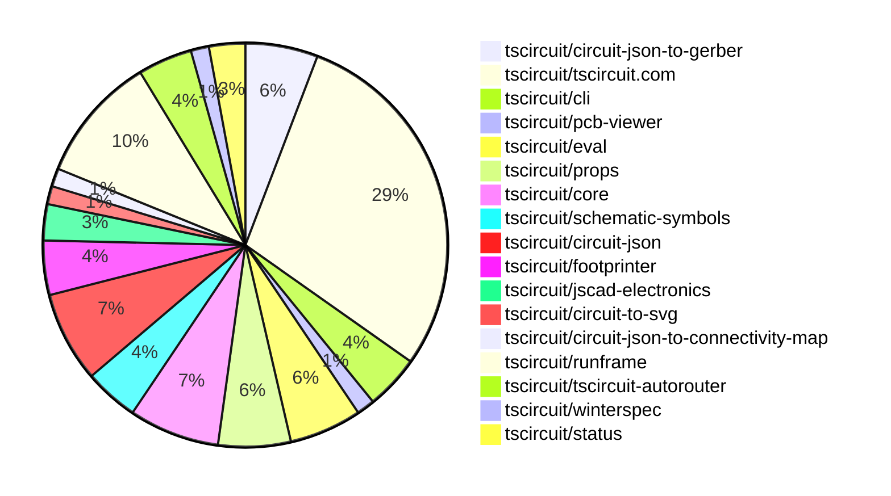

# Contribution Overview 2025-05-07

## PRs by Repository

## Contributor Overview

| Contributor | 🐳 Major | 🐙 Minor | 🐌 Tiny | ⭐ | Issues Created | Discussion Contributions |
|-------------|---------|---------|---------|-----|----------------|--------------------------|
| [imrishabh18](#imrishabh18) | 1 | 15 | 1 | ⭐⭐⭐ | 7 | 0🔹 0🔶 0💎 |
| [ShiboSoftwareDev](#ShiboSoftwareDev) | 4 | 11 | 1 | ⭐⭐⭐ | 12 | 0🔹 0🔶 0💎 |
| [ArnavK-09](#ArnavK-09) | 4 | 9 | 1 | ⭐⭐⭐ | 0 | 0🔹 0🔶 0💎 |
| [seveibar](#seveibar) | 3 | 1 | 0 | ⭐⭐ | 17 | 0🔹 0🔶 0💎 |
| [Abse2001](#Abse2001) | 1 | 9 | 1 | ⭐⭐ | 9 | 0🔹 0🔶 0💎 |
| [Anshgrover23](#Anshgrover23) | 0 | 1 | 0 | ⭐ | 2 | 1🔹 0🔶 0💎 |
| [techmannih](#techmannih) | 0 | 0 | 1 | ⭐ | 6 | 0🔹 0🔶 0💎 |
| [MustafaMulla29](#MustafaMulla29) | 0 | 1 | 0 |  | 4 | 0🔹 0🔶 0💎 |
| [tscircuitbot](#tscircuitbot) | 0 | 0 | 1 |  | 0 | 0🔹 0🔶 0💎 |
| [cluesang](#cluesang) | 0 | 0 | 0 | ⭐ | 0 | 0🔹 1🔶 0💎 |

### Discussion Contribution Legend

- 🔹 Participating: Basic participation with minimal effort
- 🔶 Very Active: Thoughtful participation that adds value
- 💎 Extremely Active: Exceptional participation with high-quality content

## Review Table

[reviews-received-hover]: ## "Number of reviews received for PRs for this contributor"
[approvals-received-hover]: ## "Number of approvals received for PRs this contributor authored"
[rejections-received-hover]: ## "Number of rejections received for PRs this contributor authored"
[prs-opened-hover]: ## "Number of PRs opened by this contributor"
[issues-created-hover]: ## "Number of issues created by this contributor"
[bountied-issues-hover]: ## "Number of issues this contributor created with a bounty"
[bountied-issue-$-hover]: ## "Total bounty amount placed on issues authored by this contributor"

| Contributor | Reviews Received | Approvals Received | Rejections Received | Approvals | Rejections | PRs Opened | PRs Merged | Issues Created | Bountied Issues | Bountied Issue $ |
|---|---|---|---|---|---|---|---|---|---|---|
| [ArnavK-09](#ArnavK-09) | 24 | 18 | 2 | 1 | 0 | 15 | 15 | 0 | 0 | 0 |
| [seveibar](#seveibar) | 0 | 0 | 0 | 45 | 2 | 5 | 4 | 17 | 7 | 110 |
| [ShiboSoftwareDev](#ShiboSoftwareDev) | 23 | 16 | 1 | 0 | 0 | 18 | 16 | 12 | 5 | 120 |
| [Abse2001](#Abse2001) | 18 | 13 | 0 | 0 | 0 | 14 | 11 | 9 | 1 | 15 |
| [imrishabh18](#imrishabh18) | 18 | 7 | 0 | 10 | 4 | 19 | 18 | 7 | 2 | 10 |
| [techmannih](#techmannih) | 15 | 1 | 1 | 0 | 0 | 6 | 1 | 6 | 2 | 13 |
| [graphite-app[bot]](#graphite-app[bot]) | 0 | 0 | 0 | 0 | 0 | 0 | 0 | 0 | 0 | 0 |
| [Anshgrover23](#Anshgrover23) | 2 | 1 | 0 | 2 | 1 | 3 | 1 | 2 | 1 | 10 |
| [krushnarout](#krushnarout) | 6 | 0 | 3 | 0 | 0 | 2 | 0 | 0 | 0 | 0 |
| [MustafaMulla29](#MustafaMulla29) | 2 | 2 | 0 | 0 | 0 | 2 | 1 | 4 | 0 | 0 |
| [tscircuitbot](#tscircuitbot) | 0 | 0 | 0 | 0 | 0 | 10 | 2 | 0 | 0 | 0 |
| [cluesang](#cluesang) | 0 | 0 | 0 | 0 | 0 | 0 | 0 | 0 | 0 | 0 |

## Changes by Repository

### [tscircuit/circuit-json-to-gerber](https://github.com/tscircuit/circuit-json-to-gerber)

| PR # | Impact | Contributor | Description | Milestone Aligned |
|------|--------|-------------|-------------|-------------------|
| [#31](https://github.com/tscircuit/circuit-json-to-gerber/pull/31) | 🐳 Major | ArnavK-09 | Add support for pill-shaped elements in the Gerber aperture generation process. | ✅ |
| [#38](https://github.com/tscircuit/circuit-json-to-gerber/pull/38) | 🐳 Major | Abse2001 | The pull request adds support for rotating top and bottom silkscreen text, and fixes a bug related to the gerber font size. | ✅ |
| [#39](https://github.com/tscircuit/circuit-json-to-gerber/pull/39) | 🐙 Minor | Abse2001 | Improves silkscreen text accuracy by adjusting the font size based on the uppercase characters height cap. | ✅ |
| [#33](https://github.com/tscircuit/circuit-json-to-gerber/pull/33) | 🐙 Minor | Abse2001 | Fixes a bug where "rotated_rect" shape is not supported in the Gerber aperture definition. | ✅ |

### [tscircuit/tscircuit.com](https://github.com/tscircuit/tscircuit.com)

| PR # | Impact | Contributor | Description | Milestone Aligned |
|------|--------|-------------|-------------|-------------------|
| [#1019](https://github.com/tscircuit/tscircuit.com/pull/1019) | 🐳 Major | ArnavK-09 | Adds support for custom component paths in the runframe package. | ✅ |
| [#1036](https://github.com/tscircuit/tscircuit.com/pull/1036) | 🐳 Major | ArnavK-09 | This pull request introduces the new PackageCard component to display package information and updates the trending page to use packages instead of snippets. | ✅ |
| [#1063](https://github.com/tscircuit/tscircuit.com/pull/1063) | 🟣 | ArnavK-09 | This pull request refactors the error handling and updates the snippet creation logic in the JLCPCB component generation process. | ✅ |
| [#1064](https://github.com/tscircuit/tscircuit.com/pull/1064) | 🐙 Minor | ArnavK-09 | The pull request enhances the package deletion flow by refetching the user's packages after a successful deletion, ensuring the user interface reflects the latest package data. | ✅ |
| [#1027](https://github.com/tscircuit/tscircuit.com/pull/1027) | 🐙 Minor | ArnavK-09 | Ensure that .ts files are correctly processed by replacing the extension with .tsx in the tsFacet configuration. | ✅ |
| [#1033](https://github.com/tscircuit/tscircuit.com/pull/1033) | 🐙 Minor | ArnavK-09 | Introduce `isCodeEditorReady` state to manage editor opacity based on its readiness, improving user experience. | ✅ |
| [#1048](https://github.com/tscircuit/tscircuit.com/pull/1048) | 🐙 Minor | ArnavK-09 | Refactors the `CodeAndPreview` component to simplify the logic for updating package files. | ✅ |
| [#1032](https://github.com/tscircuit/tscircuit.com/pull/1032) | 🐙 Minor | ArnavK-09 | The pull request refactors the `checkIfManualEditsImported` function to accept a `file` parameter, allowing it to check for manual edits in different entry points and file types. It also adds support for the old spec file format. | ✅ |
| [#1066](https://github.com/tscircuit/tscircuit.com/pull/1066) | 🐙 Minor | imrishabh18 | Adds a fake route for `/packages/images` with the `fs_sha` parameter to handle package image requests. | ✅ |
| [#1065](https://github.com/tscircuit/tscircuit.com/pull/1065) | 🐙 Minor | imrishabh18 | Add an order button for mobile view of the package header | ✅ |
| [#1062](https://github.com/tscircuit/tscircuit.com/pull/1062) | 🐙 Minor | imrishabh18 | This pull request refactors the LandingHero component to use the `/packages/list_trending` endpoint to get the trending snippets, and removes the duplicated code. | ✅ |
| [#1061](https://github.com/tscircuit/tscircuit.com/pull/1061) | 🐙 Minor | imrishabh18 | Switch the API endpoint from `/snippets/list_latest` to `/packages/list_latest` to return a list of the latest packages, excluding snippets. | ❌ |
| [#1059](https://github.com/tscircuit/tscircuit.com/pull/1059) | 🐙 Minor | imrishabh18 | Fixes a type error in the code that was returning the wrong data for the packages. | ✅ |
| [#1057](https://github.com/tscircuit/tscircuit.com/pull/1057) | 🐙 Minor | imrishabh18 | Refactor the code to replace `/snippets/list` with `/packages/list`. | ❌ |
| [#1037](https://github.com/tscircuit/tscircuit.com/pull/1037) | 🐌 Tiny | ArnavK-09 | Updates the `circuit-json-to-gerber` dependency to version 0.0.18. | ✅ |
| [#1060](https://github.com/tscircuit/tscircuit.com/pull/1060) | 🐌 Tiny | Abse2001 | Update a dependency for the `circuit-json-to-gerber` package from version `0.0.18` to `0.0.19`. | ✅ |
| [#1049](https://github.com/tscircuit/tscircuit.com/pull/1049) | 🟣 | imrishabh18 | Update the version of the `@tscircuit/runframe` dependency. | ✅ |
| [#1047](https://github.com/tscircuit/tscircuit.com/pull/1047) | 🐙 Minor | imrishabh18 | Update the @tscircuit/runframe dependency to version 0.0.415 | ✅ |
| [#1039](https://github.com/tscircuit/tscircuit.com/pull/1039) | 🐙 Minor | imrishabh18 | Add a fake for the `/packages/list_trending` endpoint | ❌ |
| [#1035](https://github.com/tscircuit/tscircuit.com/pull/1035) | 🐌 Tiny | imrishabh18 | Update the version of the "@tscircuit/runframe" dependency from 0.0.403 to 0.0.412. | ✅ |

### [tscircuit/cli](https://github.com/tscircuit/cli)

| PR # | Impact | Contributor | Description | Milestone Aligned |
|------|--------|-------------|-------------|-------------------|
| [#189](https://github.com/tscircuit/cli/pull/189) | 🐳 Major | ArnavK-09 | Enhance package search with interactive selection and installation | ❌ |
| [#192](https://github.com/tscircuit/cli/pull/192) | 🐙 Minor | ArnavK-09 | Improve CLI update notifications with current version display | ✅ |
| [#187](https://github.com/tscircuit/cli/pull/187) | 🐙 Minor | Anshgrover23 | Add a search command to the CLI for querying snippets | ❌ |

### [tscircuit/pcb-viewer](https://github.com/tscircuit/pcb-viewer)

| PR # | Impact | Contributor | Description | Milestone Aligned |
|------|--------|-------------|-------------|-------------------|
| [#262](https://github.com/tscircuit/pcb-viewer/pull/262) | 🐙 Minor | ArnavK-09 | Increase the zIndex of the "Click to Interact" overlay in the PCBViewer component to improve its handling of overlays. | ✅ |

### [tscircuit/eval](https://github.com/tscircuit/eval)

| PR # | Impact | Contributor | Description | Milestone Aligned |
|------|--------|-------------|-------------|-------------------|
| [#271](https://github.com/tscircuit/eval/pull/271) | 🐙 Minor | ArnavK-09 | Ensures proper cleanup of web worker instances by adding `await worker.kill()` at the end of each test to prevent potential memory leaks and ensure tests run in a clean state. | ✅ |
| [#274](https://github.com/tscircuit/eval/pull/274) | 🐙 Minor | ArnavK-09 | Update GitHub Actions workflows to use latest versions of `actions/checkout` and `oven-sh/setup-bun`. | ✅ |
| [#294](https://github.com/tscircuit/eval/pull/294) | 🟣 | tscircuitbot | Update @tscircuit/core to v0.0.395 | ✅ |
| [#292](https://github.com/tscircuit/eval/pull/292) | 🐌 Tiny | tscircuitbot | Automated update of @tscircuit/core to v0.0.394. | ✅ |

### [tscircuit/props](https://github.com/tscircuit/props)

| PR # | Impact | Contributor | Description | Milestone Aligned |
|------|--------|-------------|-------------|-------------------|
| [#217](https://github.com/tscircuit/props/pull/217) | 🐳 Major | ShiboSoftwareDev | Adds new properties (`pinCount` and `internallyConnectedPins`) to the `jumperProps` type to support 2-pin and 3-pin jumpers with different internal pin connections. | ✅ |
| [#222](https://github.com/tscircuit/props/pull/222) | 🐙 Minor | Abse2001 | Matched the props with circuitJson type | ✅ |
| [#220](https://github.com/tscircuit/props/pull/220) | 🐙 Minor | Abse2001 | Added nine-point anchor props | ✅ |
| [#218](https://github.com/tscircuit/props/pull/218) | 🐙 Minor | Abse2001 | Added anchor and color properties to the `schematicTextProps` object in the `schematic-text.ts` file. | ✅ |

### [tscircuit/core](https://github.com/tscircuit/core)

| PR # | Impact | Contributor | Description | Milestone Aligned |
|------|--------|-------------|-------------|-------------------|
| [#788](https://github.com/tscircuit/core/pull/788) | 🐳 Major | ShiboSoftwareDev | Adds a new primitive component `PcbTrace` to the project. | ✅ |
| [#787](https://github.com/tscircuit/core/pull/787) | 🐙 Minor | ShiboSoftwareDev | Fixed unwanted pin labels on ports that had "left" or "right" port hints but didn't have them specified in the port name. | ✅ |
| [#786](https://github.com/tscircuit/core/pull/786) | 🐙 Minor | ShiboSoftwareDev | The pull request updates the `Jumper` component to generate different schematic symbol names based on the number of pins and whether the pins are internally connected. | ✅ |
| [#784](https://github.com/tscircuit/core/pull/784) | 🐙 Minor | Abse2001 | Enables pinLabels silkscreen with pinrow footprint | ✅ |
| [#789](https://github.com/tscircuit/core/pull/789) | 🐌 Tiny | ShiboSoftwareDev | The PR updates the version of the `@tscircuit/footprinter` dependency in the `package.json` file. | ✅ |

### [tscircuit/schematic-symbols](https://github.com/tscircuit/schematic-symbols)

| PR # | Impact | Contributor | Description | Milestone Aligned |
|------|--------|-------------|-------------|-------------------|
| [#269](https://github.com/tscircuit/schematic-symbols/pull/269) | 🐳 Major | ShiboSoftwareDev | The pull request adds symbols for all solderjumper3 variants. | ✅ |
| [#267](https://github.com/tscircuit/schematic-symbols/pull/267) | 🐳 Major | ShiboSoftwareDev | The PR introduces a new circuit board element, a solder jumper bridge, with detailed path definitions. | ✅ |
| [#268](https://github.com/tscircuit/schematic-symbols/pull/268) | 🐙 Minor | ShiboSoftwareDev | Adds a new solderjumper2.json file with detailed path information. | ❌ |

### [tscircuit/circuit-json](https://github.com/tscircuit/circuit-json)

| PR # | Impact | Contributor | Description | Milestone Aligned |
|------|--------|-------------|-------------|-------------------|
| [#185](https://github.com/tscircuit/circuit-json/pull/185) | 🐙 Minor | ShiboSoftwareDev | Adds a new property `internally_connected_source_port_ids` to the `SourceComponentBase` type. | ✅ |
| [#186](https://github.com/tscircuit/circuit-json/pull/186) | 🐙 Minor | Abse2001 | Make the `schematic_component_id` field optional for `SchematicText` objects. | ✅ |
| [#183](https://github.com/tscircuit/circuit-json/pull/183) | 🐙 Minor | Abse2001 | Switching the anchor system from a 5-point system to a 9-point system for schematic text. | ✅ |
| [#184](https://github.com/tscircuit/circuit-json/pull/184) | 🐙 Minor | imrishabh18 | Add the location of the missing component in the `SourceFailedToCreateComponentError` interface. | ✅ |
| [#182](https://github.com/tscircuit/circuit-json/pull/182) | 🐙 Minor | imrishabh18 | Add a new error type `source_failed_to_create_component_error` to handle errors when a component fails to be constructed. | ✅ |

### [tscircuit/footprinter](https://github.com/tscircuit/footprinter)

| PR # | Impact | Contributor | Description | Milestone Aligned |
|------|--------|-------------|-------------|-------------------|
| [#260](https://github.com/tscircuit/footprinter/pull/260) | 🐙 Minor | ShiboSoftwareDev | Refactor the jumper to have a variable trace width instead of a fixed width, which can cause problems. | ✅ |
| [#255](https://github.com/tscircuit/footprinter/pull/255) | 🐙 Minor | ShiboSoftwareDev | Introduced a new footprint for a "solderjumper" component. | ❌ |
| [#256](https://github.com/tscircuit/footprinter/pull/256) | 🐙 Minor | Abse2001 | Adds silkscreen labels for each pin in the pinrow feature. | ✅ |

### [tscircuit/jscad-electronics](https://github.com/tscircuit/jscad-electronics)

| PR # | Impact | Contributor | Description | Milestone Aligned |
|------|--------|-------------|-------------|-------------------|
| [#94](https://github.com/tscircuit/jscad-electronics/pull/94) | 🐙 Minor | ShiboSoftwareDev | The pull request fixes the pitch and introduces the `innerDiameter` and `outerDiameter` properties to the `FemaleHeader` component, allowing for more customization of the component. | ✅ |
| [#93](https://github.com/tscircuit/jscad-electronics/pull/93) | 🐙 Minor | ShiboSoftwareDev | Fixed the 3D models for SOIC8 and TSSOP8 footprints. | ✅ |

### [tscircuit/circuit-to-svg](https://github.com/tscircuit/circuit-to-svg)

| PR # | Impact | Contributor | Description | Milestone Aligned |
|------|--------|-------------|-------------|-------------------|
| [#211](https://github.com/tscircuit/circuit-to-svg/pull/211) | 🐙 Minor | ShiboSoftwareDev | Change the pin1 indicator to be a filled up triangle instead of a notch. | ✅ |

### [tscircuit/circuit-json-to-connectivity-map](https://github.com/tscircuit/circuit-json-to-connectivity-map)

| PR # | Impact | Contributor | Description | Milestone Aligned |
|------|--------|-------------|-------------|-------------------|
| [#10](https://github.com/tscircuit/circuit-json-to-connectivity-map/pull/10) | 🐙 Minor | ShiboSoftwareDev | Adds support for handling `internally_connected_source_port_ids` in `source_component` objects for `getFullConnectivityMapFromCircuitJson()` and `getSourcePortConnectivityMapFromCircuitJson()` functions. | ✅ |

### [tscircuit/runframe](https://github.com/tscircuit/runframe)

| PR # | Impact | Contributor | Description | Milestone Aligned |
|------|--------|-------------|-------------|-------------------|
| [#563](https://github.com/tscircuit/runframe/pull/563) | 🐳 Major | imrishabh18 | This pull request adds a breakdown of the total cost from the order quote, including the lowest shipping carrier cost and the original total cost without shipping. | ✅ |
| [#574](https://github.com/tscircuit/runframe/pull/574) | 🐙 Minor | ShiboSoftwareDev | Fix error tab not being displayed in the initial run of the CircuitJsonPreview component. | ✅ |
| [#565](https://github.com/tscircuit/runframe/pull/565) | 🐙 Minor | imrishabh18 | Fixes a runtime error related to the `orderQuote.shipping_options` property being undefined. | ✅ |
| [#562](https://github.com/tscircuit/runframe/pull/562) | 🐙 Minor | imrishabh18 | Send the shipping carrier information to stripe | ✅ |
| [#560](https://github.com/tscircuit/runframe/pull/560) | 🐙 Minor | imrishabh18 | Add edge case cover to show the loading state when fetching quotes | ✅ |
| [#558](https://github.com/tscircuit/runframe/pull/558) | 🐙 Minor | imrishabh18 | Simplify the logic for handling errors and loading states in the `InitialOrder` component. | ✅ |
| [#556](https://github.com/tscircuit/runframe/pull/556) | 🐙 Minor | imrishabh18 | Update the UI and formatting of the order-quote dialog. | ✅ |

### [tscircuit/tscircuit-autorouter](https://github.com/tscircuit/tscircuit-autorouter)

| PR # | Impact | Contributor | Description | Milestone Aligned |
|------|--------|-------------|-------------|-------------------|
| [#118](https://github.com/tscircuit/tscircuit-autorouter/pull/118) | 🐳 Major | seveibar | The pull request introduces changes to the High Density Intra Node Solvers to incorporate connMap, which causes overlaid vias with the same net but improves completion. | ❌ |
| [#114](https://github.com/tscircuit/tscircuit-autorouter/pull/114) | 🐳 Major | seveibar | Introduces a JSON file with detailed information about a capacity mesh node (cn27815) and its port points, including their coordinates and connection names. | ❌ |
| [#113](https://github.com/tscircuit/tscircuit-autorouter/pull/113) | 🐳 Major | seveibar | Adds a new Autorouting Pipeline Debugger header to allow configuring the cache provider, including options for In Memory, Local Storage, and None. | ✅ |

### [tscircuit/winterspec](https://github.com/tscircuit/winterspec)

| PR # | Impact | Contributor | Description | Milestone Aligned |
|------|--------|-------------|-------------|-------------------|
| [#36](https://github.com/tscircuit/winterspec/pull/36) | 🐙 Minor | seveibar | Adds a new "dev2" command to the Bun CLI, which is a simplified version of the existing "dev" command. | ❌ |

### [tscircuit/status](https://github.com/tscircuit/status)

| PR # | Impact | Contributor | Description | Milestone Aligned |
|------|--------|-------------|-------------|-------------------|
| [#41](https://github.com/tscircuit/status/pull/41) | 🐙 Minor | MustafaMulla29 | Fixed the modal opening condition to check for the presence of an error attribute instead of checking for a specific CSS class. | ✅ |
| [#33](https://github.com/tscircuit/status/pull/33) | 🐌 Tiny | techmannih | Remove the package-lock.json file | ❌ |

## Changes by Contributor

### [ArnavK-09](https://github.com/ArnavK-09)

| PR # | Impact | Description | Milestone Aligned |
|------|--------|-------------|-------------------|
| [#31](https://github.com/tscircuit/circuit-json-to-gerber/pull/31) | 🐳 Major | Add support for pill-shaped elements in the Gerber aperture generation process. | ✅ |
| [#1019](https://github.com/tscircuit/tscircuit.com/pull/1019) | 🐳 Major | Adds support for custom component paths in the runframe package. | ✅ |
| [#1036](https://github.com/tscircuit/tscircuit.com/pull/1036) | 🐳 Major | This pull request introduces the new PackageCard component to display package information and updates the trending page to use packages instead of snippets. | ✅ |
| [#189](https://github.com/tscircuit/cli/pull/189) | 🐳 Major | Enhance package search with interactive selection and installation | ❌ |
| [#262](https://github.com/tscircuit/pcb-viewer/pull/262) | 🐙 Minor | Increase the zIndex of the "Click to Interact" overlay in the PCBViewer component to improve its handling of overlays. | ✅ |
| [#1063](https://github.com/tscircuit/tscircuit.com/pull/1063) | 🟣 | This pull request refactors the error handling and updates the snippet creation logic in the JLCPCB component generation process. | ✅ |
| [#1064](https://github.com/tscircuit/tscircuit.com/pull/1064) | 🐙 Minor | The pull request enhances the package deletion flow by refetching the user's packages after a successful deletion, ensuring the user interface reflects the latest package data. | ✅ |
| [#1027](https://github.com/tscircuit/tscircuit.com/pull/1027) | 🐙 Minor | Ensure that .ts files are correctly processed by replacing the extension with .tsx in the tsFacet configuration. | ✅ |
| [#1033](https://github.com/tscircuit/tscircuit.com/pull/1033) | 🐙 Minor | Introduce `isCodeEditorReady` state to manage editor opacity based on its readiness, improving user experience. | ✅ |
| [#1048](https://github.com/tscircuit/tscircuit.com/pull/1048) | 🐙 Minor | Refactors the `CodeAndPreview` component to simplify the logic for updating package files. | ✅ |
| [#1032](https://github.com/tscircuit/tscircuit.com/pull/1032) | 🐙 Minor | The pull request refactors the `checkIfManualEditsImported` function to accept a `file` parameter, allowing it to check for manual edits in different entry points and file types. It also adds support for the old spec file format. | ✅ |
| [#271](https://github.com/tscircuit/eval/pull/271) | 🐙 Minor | Ensures proper cleanup of web worker instances by adding `await worker.kill()` at the end of each test to prevent potential memory leaks and ensure tests run in a clean state. | ✅ |
| [#274](https://github.com/tscircuit/eval/pull/274) | 🐙 Minor | Update GitHub Actions workflows to use latest versions of `actions/checkout` and `oven-sh/setup-bun`. | ✅ |
| [#192](https://github.com/tscircuit/cli/pull/192) | 🐙 Minor | Improve CLI update notifications with current version display | ✅ |
| [#1037](https://github.com/tscircuit/tscircuit.com/pull/1037) | 🐌 Tiny | Updates the `circuit-json-to-gerber` dependency to version 0.0.18. | ✅ |

### [ShiboSoftwareDev](https://github.com/ShiboSoftwareDev)

| PR # | Impact | Description | Milestone Aligned |
|------|--------|-------------|-------------------|
| [#217](https://github.com/tscircuit/props/pull/217) | 🐳 Major | Adds new properties (`pinCount` and `internallyConnectedPins`) to the `jumperProps` type to support 2-pin and 3-pin jumpers with different internal pin connections. | ✅ |
| [#788](https://github.com/tscircuit/core/pull/788) | 🐳 Major | Adds a new primitive component `PcbTrace` to the project. | ✅ |
| [#269](https://github.com/tscircuit/schematic-symbols/pull/269) | 🐳 Major | The pull request adds symbols for all solderjumper3 variants. | ✅ |
| [#267](https://github.com/tscircuit/schematic-symbols/pull/267) | 🐳 Major | The PR introduces a new circuit board element, a solder jumper bridge, with detailed path definitions. | ✅ |
| [#185](https://github.com/tscircuit/circuit-json/pull/185) | 🐙 Minor | Adds a new property `internally_connected_source_port_ids` to the `SourceComponentBase` type. | ✅ |
| [#260](https://github.com/tscircuit/footprinter/pull/260) | 🐙 Minor | Refactor the jumper to have a variable trace width instead of a fixed width, which can cause problems. | ✅ |
| [#255](https://github.com/tscircuit/footprinter/pull/255) | 🐙 Minor | Introduced a new footprint for a "solderjumper" component. | ❌ |
| [#787](https://github.com/tscircuit/core/pull/787) | 🐙 Minor | Fixed unwanted pin labels on ports that had "left" or "right" port hints but didn't have them specified in the port name. | ✅ |
| [#786](https://github.com/tscircuit/core/pull/786) | 🐙 Minor | The pull request updates the `Jumper` component to generate different schematic symbol names based on the number of pins and whether the pins are internally connected. | ✅ |
| [#94](https://github.com/tscircuit/jscad-electronics/pull/94) | 🐙 Minor | The pull request fixes the pitch and introduces the `innerDiameter` and `outerDiameter` properties to the `FemaleHeader` component, allowing for more customization of the component. | ✅ |
| [#93](https://github.com/tscircuit/jscad-electronics/pull/93) | 🐙 Minor | Fixed the 3D models for SOIC8 and TSSOP8 footprints. | ✅ |
| [#211](https://github.com/tscircuit/circuit-to-svg/pull/211) | 🐙 Minor | Change the pin1 indicator to be a filled up triangle instead of a notch. | ✅ |
| [#268](https://github.com/tscircuit/schematic-symbols/pull/268) | 🐙 Minor | Adds a new solderjumper2.json file with detailed path information. | ❌ |
| [#10](https://github.com/tscircuit/circuit-json-to-connectivity-map/pull/10) | 🐙 Minor | Adds support for handling `internally_connected_source_port_ids` in `source_component` objects for `getFullConnectivityMapFromCircuitJson()` and `getSourcePortConnectivityMapFromCircuitJson()` functions. | ✅ |
| [#574](https://github.com/tscircuit/runframe/pull/574) | 🐙 Minor | Fix error tab not being displayed in the initial run of the CircuitJsonPreview component. | ✅ |
| [#789](https://github.com/tscircuit/core/pull/789) | 🐌 Tiny | The PR updates the version of the `@tscircuit/footprinter` dependency in the `package.json` file. | ✅ |

### [Abse2001](https://github.com/Abse2001)

| PR # | Impact | Description | Milestone Aligned |
|------|--------|-------------|-------------------|
| [#38](https://github.com/tscircuit/circuit-json-to-gerber/pull/38) | 🐳 Major | The pull request adds support for rotating top and bottom silkscreen text, and fixes a bug related to the gerber font size. | ✅ |
| [#186](https://github.com/tscircuit/circuit-json/pull/186) | 🐙 Minor | Make the `schematic_component_id` field optional for `SchematicText` objects. | ✅ |
| [#183](https://github.com/tscircuit/circuit-json/pull/183) | 🐙 Minor | Switching the anchor system from a 5-point system to a 9-point system for schematic text. | ✅ |
| [#222](https://github.com/tscircuit/props/pull/222) | 🐙 Minor | Matched the props with circuitJson type | ✅ |
| [#220](https://github.com/tscircuit/props/pull/220) | 🐙 Minor | Added nine-point anchor props | ✅ |
| [#218](https://github.com/tscircuit/props/pull/218) | 🐙 Minor | Added anchor and color properties to the `schematicTextProps` object in the `schematic-text.ts` file. | ✅ |
| [#256](https://github.com/tscircuit/footprinter/pull/256) | 🐙 Minor | Adds silkscreen labels for each pin in the pinrow feature. | ✅ |
| [#784](https://github.com/tscircuit/core/pull/784) | 🐙 Minor | Enables pinLabels silkscreen with pinrow footprint | ✅ |
| [#39](https://github.com/tscircuit/circuit-json-to-gerber/pull/39) | 🐙 Minor | Improves silkscreen text accuracy by adjusting the font size based on the uppercase characters height cap. | ✅ |
| [#33](https://github.com/tscircuit/circuit-json-to-gerber/pull/33) | 🐙 Minor | Fixes a bug where "rotated_rect" shape is not supported in the Gerber aperture definition. | ✅ |
| [#1060](https://github.com/tscircuit/tscircuit.com/pull/1060) | 🐌 Tiny | Update a dependency for the `circuit-json-to-gerber` package from version `0.0.18` to `0.0.19`. | ✅ |

### [imrishabh18](https://github.com/imrishabh18)

| PR # | Impact | Description | Milestone Aligned |
|------|--------|-------------|-------------------|
| [#563](https://github.com/tscircuit/runframe/pull/563) | 🐳 Major | This pull request adds a breakdown of the total cost from the order quote, including the lowest shipping carrier cost and the original total cost without shipping. | ✅ |
| [#184](https://github.com/tscircuit/circuit-json/pull/184) | 🐙 Minor | Add the location of the missing component in the `SourceFailedToCreateComponentError` interface. | ✅ |
| [#182](https://github.com/tscircuit/circuit-json/pull/182) | 🐙 Minor | Add a new error type `source_failed_to_create_component_error` to handle errors when a component fails to be constructed. | ✅ |
| [#1066](https://github.com/tscircuit/tscircuit.com/pull/1066) | 🐙 Minor | Adds a fake route for `/packages/images` with the `fs_sha` parameter to handle package image requests. | ✅ |
| [#1065](https://github.com/tscircuit/tscircuit.com/pull/1065) | 🐙 Minor | Add an order button for mobile view of the package header | ✅ |
| [#1062](https://github.com/tscircuit/tscircuit.com/pull/1062) | 🐙 Minor | This pull request refactors the LandingHero component to use the `/packages/list_trending` endpoint to get the trending snippets, and removes the duplicated code. | ✅ |
| [#1061](https://github.com/tscircuit/tscircuit.com/pull/1061) | 🐙 Minor | Switch the API endpoint from `/snippets/list_latest` to `/packages/list_latest` to return a list of the latest packages, excluding snippets. | ❌ |
| [#1059](https://github.com/tscircuit/tscircuit.com/pull/1059) | 🐙 Minor | Fixes a type error in the code that was returning the wrong data for the packages. | ✅ |
| [#1057](https://github.com/tscircuit/tscircuit.com/pull/1057) | 🐙 Minor | Refactor the code to replace `/snippets/list` with `/packages/list`. | ❌ |
| [#1049](https://github.com/tscircuit/tscircuit.com/pull/1049) | 🟣 | Update the version of the `@tscircuit/runframe` dependency. | ✅ |
| [#1047](https://github.com/tscircuit/tscircuit.com/pull/1047) | 🐙 Minor | Update the @tscircuit/runframe dependency to version 0.0.415 | ✅ |
| [#1039](https://github.com/tscircuit/tscircuit.com/pull/1039) | 🐙 Minor | Add a fake for the `/packages/list_trending` endpoint | ❌ |
| [#565](https://github.com/tscircuit/runframe/pull/565) | 🐙 Minor | Fixes a runtime error related to the `orderQuote.shipping_options` property being undefined. | ✅ |
| [#562](https://github.com/tscircuit/runframe/pull/562) | 🐙 Minor | Send the shipping carrier information to stripe | ✅ |
| [#560](https://github.com/tscircuit/runframe/pull/560) | 🐙 Minor | Add edge case cover to show the loading state when fetching quotes | ✅ |
| [#558](https://github.com/tscircuit/runframe/pull/558) | 🐙 Minor | Simplify the logic for handling errors and loading states in the `InitialOrder` component. | ✅ |
| [#556](https://github.com/tscircuit/runframe/pull/556) | 🐙 Minor | Update the UI and formatting of the order-quote dialog. | ✅ |
| [#1035](https://github.com/tscircuit/tscircuit.com/pull/1035) | 🐌 Tiny | Update the version of the "@tscircuit/runframe" dependency from 0.0.403 to 0.0.412. | ✅ |

### [seveibar](https://github.com/seveibar)

| PR # | Impact | Description | Milestone Aligned |
|------|--------|-------------|-------------------|
| [#118](https://github.com/tscircuit/tscircuit-autorouter/pull/118) | 🐳 Major | The pull request introduces changes to the High Density Intra Node Solvers to incorporate connMap, which causes overlaid vias with the same net but improves completion. | ❌ |
| [#114](https://github.com/tscircuit/tscircuit-autorouter/pull/114) | 🐳 Major | Introduces a JSON file with detailed information about a capacity mesh node (cn27815) and its port points, including their coordinates and connection names. | ❌ |
| [#113](https://github.com/tscircuit/tscircuit-autorouter/pull/113) | 🐳 Major | Adds a new Autorouting Pipeline Debugger header to allow configuring the cache provider, including options for In Memory, Local Storage, and None. | ✅ |
| [#36](https://github.com/tscircuit/winterspec/pull/36) | 🐙 Minor | Adds a new "dev2" command to the Bun CLI, which is a simplified version of the existing "dev" command. | ❌ |

### [techmannih](https://github.com/techmannih)

| PR # | Impact | Description | Milestone Aligned |
|------|--------|-------------|-------------------|
| [#33](https://github.com/tscircuit/status/pull/33) | 🐌 Tiny | Remove the package-lock.json file | ❌ |

### [MustafaMulla29](https://github.com/MustafaMulla29)

| PR # | Impact | Description | Milestone Aligned |
|------|--------|-------------|-------------------|
| [#41](https://github.com/tscircuit/status/pull/41) | 🐙 Minor | Fixed the modal opening condition to check for the presence of an error attribute instead of checking for a specific CSS class. | ✅ |

### [tscircuitbot](https://github.com/tscircuitbot)

| PR # | Impact | Description | Milestone Aligned |
|------|--------|-------------|-------------------|
| [#294](https://github.com/tscircuit/eval/pull/294) | 🟣 | Update @tscircuit/core to v0.0.395 | ✅ |
| [#292](https://github.com/tscircuit/eval/pull/292) | 🐌 Tiny | Automated update of @tscircuit/core to v0.0.394. | ✅ |

### [Anshgrover23](https://github.com/Anshgrover23)

| PR # | Impact | Description | Milestone Aligned |
|------|--------|-------------|-------------------|
| [#187](https://github.com/tscircuit/cli/pull/187) | 🐙 Minor | Add a search command to the CLI for querying snippets | ❌ |

