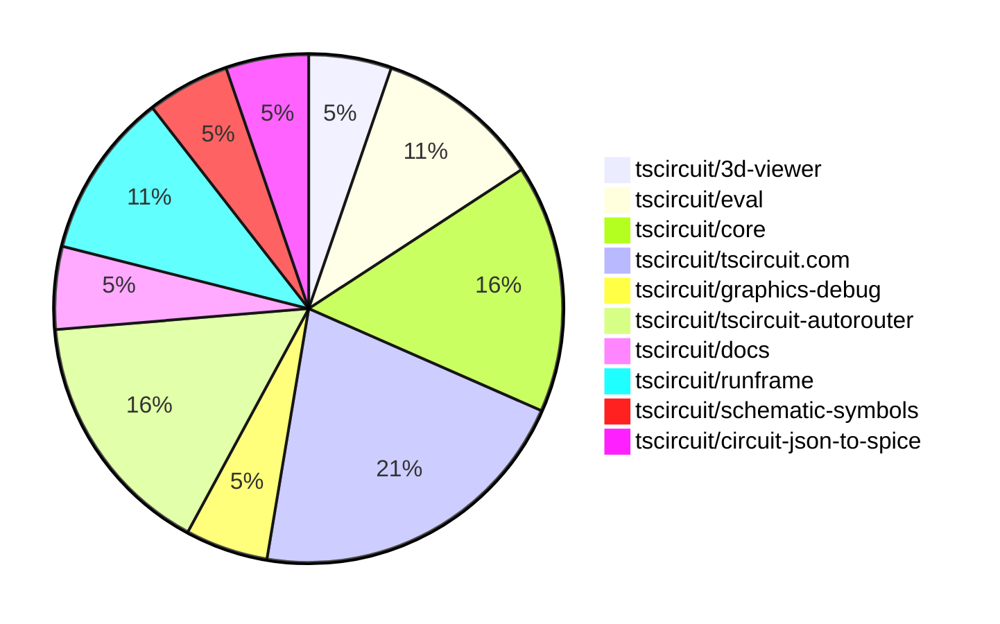

# Contribution Overview 2025-05-14

## PRs by Repository

## Contributor Overview

| Contributor | 🐳 Major | 🐙 Minor | 🐌 Tiny | ⭐ | Issues Created | Discussion Contributions |
|-------------|---------|---------|---------|-----|----------------|--------------------------|
| [seveibar](#seveibar) | 0 | 7 | 3 | ⭐⭐⭐ | 4 | 0🔹 0🔶 0💎 |
| [imrishabh18](#imrishabh18) | 0 | 3 | 0 | ⭐ | 2 | 0🔹 0🔶 0💎 |
| [ArnavK-09](#ArnavK-09) | 1 | 1 | 0 | ⭐ | 0 | 0🔹 0🔶 0💎 |
| [ShiboSoftwareDev](#ShiboSoftwareDev) | 1 | 1 | 0 | ⭐ | 9 | 0🔹 0🔶 0💎 |
| [Abse2001](#Abse2001) | 0 | 1 | 0 |  | 0 | 0🔹 0🔶 0💎 |
| [Anshgrover23](#Anshgrover23) | 0 | 1 | 0 |  | 0 | 1🔹 0🔶 0💎 |

### Discussion Contribution Legend

- 🔹 Participating: Basic participation with minimal effort
- 🔶 Very Active: Thoughtful participation that adds value
- 💎 Extremely Active: Exceptional participation with high-quality content

## Review Table

[reviews-received-hover]: ## "Number of reviews received for PRs for this contributor"
[approvals-received-hover]: ## "Number of approvals received for PRs this contributor authored"
[rejections-received-hover]: ## "Number of rejections received for PRs this contributor authored"
[prs-opened-hover]: ## "Number of PRs opened by this contributor"
[issues-created-hover]: ## "Number of issues created by this contributor"
[bountied-issues-hover]: ## "Number of issues this contributor created with a bounty"
[bountied-issue-$-hover]: ## "Total bounty amount placed on issues authored by this contributor"

| Contributor | Reviews Received | Approvals Received | Rejections Received | Approvals | Rejections | PRs Opened | PRs Merged | Issues Created | Bountied Issues | Bountied Issue $ |
|---|---|---|---|---|---|---|---|---|---|---|
| [ShiboSoftwareDev](#ShiboSoftwareDev) | 3 | 2 | 0 | 0 | 0 | 3 | 2 | 9 | 0 | 0 |
| [seveibar](#seveibar) | 2 | 0 | 0 | 7 | 0 | 11 | 10 | 4 | 1 | 100 |
| [imrishabh18](#imrishabh18) | 11 | 2 | 0 | 3 | 2 | 5 | 3 | 2 | 2 | 10 |
| [graphite-app[bot]](#graphite-app[bot]) | 0 | 0 | 0 | 0 | 0 | 0 | 0 | 0 | 0 | 0 |
| [Abse2001](#Abse2001) | 3 | 2 | 0 | 0 | 0 | 2 | 1 | 0 | 0 | 0 |
| [techmannih](#techmannih) | 5 | 1 | 2 | 0 | 0 | 1 | 0 | 2 | 0 | 0 |
| [ArnavK-09](#ArnavK-09) | 10 | 2 | 1 | 0 | 0 | 3 | 2 | 0 | 0 | 0 |
| [MustafaMulla29](#MustafaMulla29) | 0 | 0 | 0 | 0 | 1 | 0 | 0 | 1 | 0 | 0 |
| [tscircuitbot](#tscircuitbot) | 0 | 0 | 0 | 0 | 0 | 6 | 0 | 0 | 0 | 0 |
| [Anshgrover23](#Anshgrover23) | 1 | 1 | 0 | 0 | 0 | 1 | 1 | 0 | 0 | 0 |

## Changes by Repository

### [tscircuit/3d-viewer](https://github.com/tscircuit/3d-viewer)

| PR # | Impact | Contributor | Description | Milestone Aligned |
|------|--------|-------------|-------------|-------------------|
| [#275](https://github.com/tscircuit/3d-viewer/pull/275) | 🐳 Major | ShiboSoftwareDev | The pull request adds handling for silkscreen paths in the BoardGeomBuilder. | ✅ |

### [tscircuit/eval](https://github.com/tscircuit/eval)

| PR # | Impact | Contributor | Description | Milestone Aligned |
|------|--------|-------------|-------------|-------------------|
| [#325](https://github.com/tscircuit/eval/pull/325) | 🐙 Minor | ShiboSoftwareDev | Update the version of the @tscircuit/core dependency from 0.0.404 to 0.0.406. | ✅ |
| [#332](https://github.com/tscircuit/eval/pull/332) | 🐙 Minor | seveibar | Update capacity autorouter and core dependencies | ✅ |

### [tscircuit/core](https://github.com/tscircuit/core)

| PR # | Impact | Contributor | Description | Milestone Aligned |
|------|--------|-------------|-------------|-------------------|
| [#804](https://github.com/tscircuit/core/pull/804) | 🐙 Minor | seveibar | Update the Autorouter to version 0.0.66 | ✅ |
| [#799](https://github.com/tscircuit/core/pull/799) | 🐙 Minor | imrishabh18 | Add support for parent group's transformation | ✅ |
| [#803](https://github.com/tscircuit/core/pull/803) | 🐌 Tiny | seveibar | Update the timeout for the Bun test command in the GitHub Actions workflow. | ✅ |

### [tscircuit/tscircuit.com](https://github.com/tscircuit/tscircuit.com)

| PR # | Impact | Contributor | Description | Milestone Aligned |
|------|--------|-------------|-------------|-------------------|
| [#1071](https://github.com/tscircuit/tscircuit.com/pull/1071) | 🐳 Major | ArnavK-09 | Refactor the package filtering and sorting logic in the TrendingPage component. | ❌ |
| [#1103](https://github.com/tscircuit/tscircuit.com/pull/1103) | 🐙 Minor | seveibar | Removes babel standalone, removes shiki extra deps, removes legacy code editor, and reduces bundle size from 42mb to 28mb. | ❌ |
| [#1107](https://github.com/tscircuit/tscircuit.com/pull/1107) | 🐙 Minor | imrishabh18 | Fix flickering issue of OrderDialog because of MobileSidebar and update `@tscircuit/runframe` dependency | ✅ |
| [#1105](https://github.com/tscircuit/tscircuit.com/pull/1105) | 🐌 Tiny | seveibar | Update the version of the `@tscircuit/runframe` dependency from `0.0.449` to `0.0.451`. | ✅ |

### [tscircuit/graphics-debug](https://github.com/tscircuit/graphics-debug)

| PR # | Impact | Contributor | Description | Milestone Aligned |
|------|--------|-------------|-------------|-------------------|
| [#55](https://github.com/tscircuit/graphics-debug/pull/55) | 🐙 Minor | seveibar | Adds a new `backgroundColor` option to the `toMatchGraphicsSvg` matcher. | ❌ |

### [tscircuit/tscircuit-autorouter](https://github.com/tscircuit/tscircuit-autorouter)

| PR # | Impact | Contributor | Description | Milestone Aligned |
|------|--------|-------------|-------------|-------------------|
| [#127](https://github.com/tscircuit/tscircuit-autorouter/pull/127) | 🐙 Minor | seveibar | Fixes a bug report and improves the force calculation for endpoint using the nearest point on the segment. | ✅ |
| [#125](https://github.com/tscircuit/tscircuit-autorouter/pull/125) | 🐙 Minor | seveibar | The pull request adds a bug report feature and a script to download bug reports. | ✅ |
| [#123](https://github.com/tscircuit/tscircuit-autorouter/pull/123) | 🐙 Minor | seveibar | Fix a bug related to stitching in the JSON file. | ✅ |

### [tscircuit/docs](https://github.com/tscircuit/docs)

| PR # | Impact | Contributor | Description | Milestone Aligned |
|------|--------|-------------|-------------|-------------------|
| [#53](https://github.com/tscircuit/docs/pull/53) | 🐌 Tiny | seveibar | This pull request adds documentation on how to report autorouter bugs in the tscircuit interface and how to simulate the bug using the autorouting debugger. | ✅ |

### [tscircuit/runframe](https://github.com/tscircuit/runframe)

| PR # | Impact | Contributor | Description | Milestone Aligned |
|------|--------|-------------|-------------|-------------------|
| [#606](https://github.com/tscircuit/runframe/pull/606) | 🐙 Minor | imrishabh18 | Modify the error message body to conform to a standard structure. | ❌ |
| [#581](https://github.com/tscircuit/runframe/pull/581) | 🐙 Minor | ArnavK-09 | Adds a new `cadViewerRef` and updates the integration with the CadViewer component in the CircuitJsonPreview component. | ✅ |

### [tscircuit/schematic-symbols](https://github.com/tscircuit/schematic-symbols)

| PR # | Impact | Contributor | Description | Milestone Aligned |
|------|--------|-------------|-------------|-------------------|
| [#272](https://github.com/tscircuit/schematic-symbols/pull/272) | 🐙 Minor | Abse2001 | Added a new zigzag resistor for the schSmall variant. | ❌ |

### [tscircuit/circuit-json-to-spice](https://github.com/tscircuit/circuit-json-to-spice)

| PR # | Impact | Contributor | Description | Milestone Aligned |
|------|--------|-------------|-------------|-------------------|
| [#2](https://github.com/tscircuit/circuit-json-to-spice/pull/2) | 🐙 Minor | Anshgrover23 | Add format and type check workflows for the project. | ✅ |

## Changes by Contributor

### [ShiboSoftwareDev](https://github.com/ShiboSoftwareDev)

| PR # | Impact | Description | Milestone Aligned |
|------|--------|-------------|-------------------|
| [#275](https://github.com/tscircuit/3d-viewer/pull/275) | 🐳 Major | The pull request adds handling for silkscreen paths in the BoardGeomBuilder. | ✅ |
| [#325](https://github.com/tscircuit/eval/pull/325) | 🐙 Minor | Update the version of the @tscircuit/core dependency from 0.0.404 to 0.0.406. | ✅ |

### [seveibar](https://github.com/seveibar)

| PR # | Impact | Description | Milestone Aligned |
|------|--------|-------------|-------------------|
| [#804](https://github.com/tscircuit/core/pull/804) | 🐙 Minor | Update the Autorouter to version 0.0.66 | ✅ |
| [#1103](https://github.com/tscircuit/tscircuit.com/pull/1103) | 🐙 Minor | Removes babel standalone, removes shiki extra deps, removes legacy code editor, and reduces bundle size from 42mb to 28mb. | ❌ |
| [#55](https://github.com/tscircuit/graphics-debug/pull/55) | 🐙 Minor | Adds a new `backgroundColor` option to the `toMatchGraphicsSvg` matcher. | ❌ |
| [#332](https://github.com/tscircuit/eval/pull/332) | 🐙 Minor | Update capacity autorouter and core dependencies | ✅ |
| [#127](https://github.com/tscircuit/tscircuit-autorouter/pull/127) | 🐙 Minor | Fixes a bug report and improves the force calculation for endpoint using the nearest point on the segment. | ✅ |
| [#125](https://github.com/tscircuit/tscircuit-autorouter/pull/125) | 🐙 Minor | The pull request adds a bug report feature and a script to download bug reports. | ✅ |
| [#123](https://github.com/tscircuit/tscircuit-autorouter/pull/123) | 🐙 Minor | Fix a bug related to stitching in the JSON file. | ✅ |
| [#803](https://github.com/tscircuit/core/pull/803) | 🐌 Tiny | Update the timeout for the Bun test command in the GitHub Actions workflow. | ✅ |
| [#1105](https://github.com/tscircuit/tscircuit.com/pull/1105) | 🐌 Tiny | Update the version of the `@tscircuit/runframe` dependency from `0.0.449` to `0.0.451`. | ✅ |
| [#53](https://github.com/tscircuit/docs/pull/53) | 🐌 Tiny | This pull request adds documentation on how to report autorouter bugs in the tscircuit interface and how to simulate the bug using the autorouting debugger. | ✅ |

### [imrishabh18](https://github.com/imrishabh18)

| PR # | Impact | Description | Milestone Aligned |
|------|--------|-------------|-------------------|
| [#799](https://github.com/tscircuit/core/pull/799) | 🐙 Minor | Add support for parent group's transformation | ✅ |
| [#1107](https://github.com/tscircuit/tscircuit.com/pull/1107) | 🐙 Minor | Fix flickering issue of OrderDialog because of MobileSidebar and update `@tscircuit/runframe` dependency | ✅ |
| [#606](https://github.com/tscircuit/runframe/pull/606) | 🐙 Minor | Modify the error message body to conform to a standard structure. | ❌ |

### [Abse2001](https://github.com/Abse2001)

| PR # | Impact | Description | Milestone Aligned |
|------|--------|-------------|-------------------|
| [#272](https://github.com/tscircuit/schematic-symbols/pull/272) | 🐙 Minor | Added a new zigzag resistor for the schSmall variant. | ❌ |

### [ArnavK-09](https://github.com/ArnavK-09)

| PR # | Impact | Description | Milestone Aligned |
|------|--------|-------------|-------------------|
| [#1071](https://github.com/tscircuit/tscircuit.com/pull/1071) | 🐳 Major | Refactor the package filtering and sorting logic in the TrendingPage component. | ❌ |
| [#581](https://github.com/tscircuit/runframe/pull/581) | 🐙 Minor | Adds a new `cadViewerRef` and updates the integration with the CadViewer component in the CircuitJsonPreview component. | ✅ |

### [Anshgrover23](https://github.com/Anshgrover23)

| PR # | Impact | Description | Milestone Aligned |
|------|--------|-------------|-------------------|
| [#2](https://github.com/tscircuit/circuit-json-to-spice/pull/2) | 🐙 Minor | Add format and type check workflows for the project. | ✅ |

