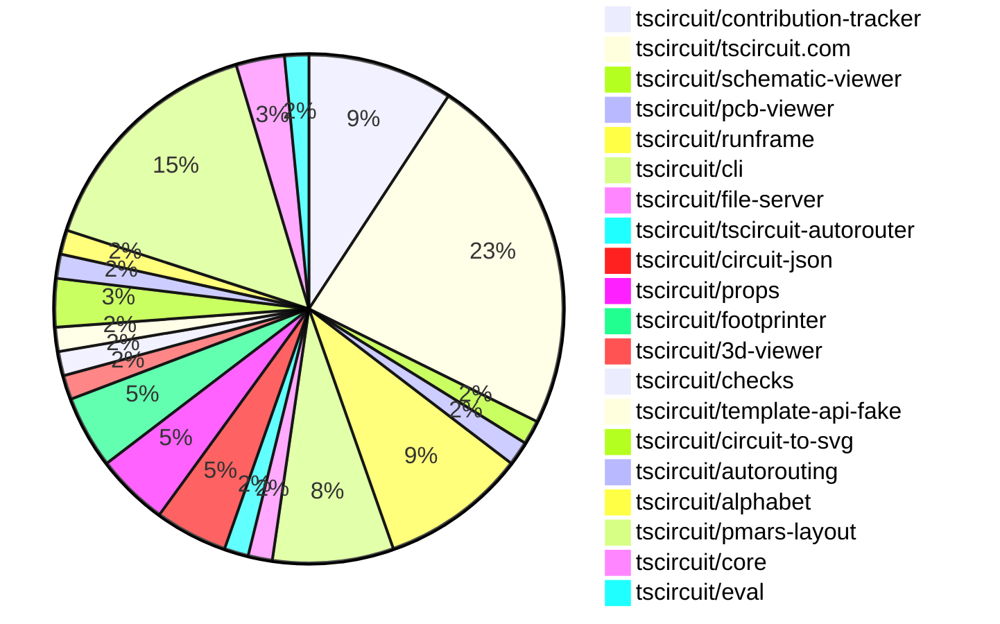

# Contribution Overview 2025-05-21

## PRs by Repository

## Contributor Overview

| Contributor | 🐳 Major | 🐙 Minor | 🐌 Tiny | ⭐ | Issues Created | Discussion Contributions |
|-------------|---------|---------|---------|-----|----------------|--------------------------|
| [seveibar](#seveibar) | 4 | 8 | 0 | ⭐⭐⭐ | 10 | 0🔹 1🔶 0💎 |
| [imrishabh18](#imrishabh18) | 0 | 14 | 4 | ⭐⭐⭐ | 12 | 0🔹 0🔶 0💎 |
| [ArnavK-09](#ArnavK-09) | 2 | 9 | 4 | ⭐⭐⭐ | 12 | 1🔹 0🔶 0💎 |
| [techmannih](#techmannih) | 0 | 8 | 0 | ⭐⭐ | 5 | 0🔹 1🔶 0💎 |
| [ShiboSoftwareDev](#ShiboSoftwareDev) | 0 | 6 | 0 | ⭐⭐ | 3 | 0🔹 0🔶 0💎 |
| [Abse2001](#Abse2001) | 0 | 3 | 0 | ⭐ | 1 | 0🔹 0🔶 0💎 |
| [Anshgrover23](#Anshgrover23) | 0 | 1 | 0 | ⭐ | 1 | 0🔹 0🔶 0💎 |
| [andrii-balitskyi](#andrii-balitskyi) | 0 | 2 | 0 | ⭐ | 0 | 0🔹 0🔶 0💎 |

### Discussion Contribution Legend

- 🔹 Participating: Basic participation with minimal effort
- 🔶 Very Active: Thoughtful participation that adds value
- 💎 Extremely Active: Exceptional participation with high-quality content

## Review Table

[reviews-received-hover]: ## "Number of reviews received for PRs for this contributor"
[approvals-received-hover]: ## "Number of approvals received for PRs this contributor authored"
[rejections-received-hover]: ## "Number of rejections received for PRs this contributor authored"
[prs-opened-hover]: ## "Number of PRs opened by this contributor"
[issues-created-hover]: ## "Number of issues created by this contributor"
[bountied-issues-hover]: ## "Number of issues this contributor created with a bounty"
[bountied-issue-$-hover]: ## "Total bounty amount placed on issues authored by this contributor"

| Contributor | Reviews Received | Approvals Received | Rejections Received | Approvals | Rejections | PRs Opened | PRs Merged | Issues Created | Bountied Issues | Bountied Issue $ |
|---|---|---|---|---|---|---|---|---|---|---|
| [ArnavK-09](#ArnavK-09) | 50 | 14 | 2 | 0 | 0 | 21 | 15 | 12 | 0 | 0 |
| [seveibar](#seveibar) | 1 | 0 | 0 | 30 | 5 | 14 | 12 | 10 | 1 | 10 |
| [imrishabh18](#imrishabh18) | 4 | 2 | 0 | 6 | 0 | 18 | 18 | 12 | 0 | 0 |
| [techmannih](#techmannih) | 20 | 8 | 2 | 0 | 0 | 13 | 8 | 5 | 0 | 0 |
| [Anshgrover23](#Anshgrover23) | 3 | 2 | 1 | 2 | 1 | 2 | 1 | 1 | 1 | 10 |
| [Abse2001](#Abse2001) | 8 | 3 | 0 | 0 | 0 | 5 | 3 | 1 | 0 | 0 |
| [graphite-app[bot]](#graphite-app[bot]) | 0 | 0 | 0 | 0 | 0 | 0 | 0 | 0 | 0 | 0 |
| [ShiboSoftwareDev](#ShiboSoftwareDev) | 19 | 7 | 1 | 0 | 0 | 10 | 6 | 3 | 0 | 0 |
| [andrii-balitskyi](#andrii-balitskyi) | 4 | 2 | 0 | 0 | 0 | 3 | 2 | 0 | 0 | 0 |
| [tscircuitbot](#tscircuitbot) | 0 | 0 | 0 | 0 | 0 | 3 | 0 | 0 | 0 | 0 |

## Changes by Repository

### [tscircuit/contribution-tracker](https://github.com/tscircuit/contribution-tracker)

| PR # | Impact | Contributor | Description | Milestone Aligned |
|------|--------|-------------|-------------|-------------------|
| [#151](https://github.com/tscircuit/contribution-tracker/pull/151) | 🐳 Major | ArnavK-09 | This pull request refactors the AI analysis functionality by migrating from the deprecated Claude AI to OpenAI. It replaces the `analyzePRWithClaude` function with `analyzePRWithAI`, adds new AI analysis functions for pull requests and discussions, updates dependencies in `package.json`, modifies the `.gitignore` to include a new AI cache directory, and updates the GitHub Actions workflow to accommodate these changes. The legacy Claude-based analysis functions are deprecated. | ❌ |
| [#154](https://github.com/tscircuit/contribution-tracker/pull/154) | 🐙 Minor | ArnavK-09 | This pull request refactors the discussion contribution levels in the contribution tracker by renaming the existing levels (Participating, VeryActive, ExtremelyActive) to new names (NormalComment, GreatInformativeComment, IncredibleCommentTopTier) and updates the related logic in the codebase to reflect these changes. It also modifies how scores are calculated based on these new levels, ensuring that the contribution scoring system is aligned with the new naming conventions. | ✅ |
| [#150](https://github.com/tscircuit/contribution-tracker/pull/150) | 🐙 Minor | ArnavK-09 | This pull request refactors the date handling across various modules to ensure consistency by using UTC for all date calculations and comparisons. It updates functions to utilize UTC methods, modifies date normalization, and adjusts tests to verify UTC compliance. | ❌ |
| [#149](https://github.com/tscircuit/contribution-tracker/pull/149) | 🐙 Minor | techmannih | This pull request introduces a new sponsorship multiplier of 1.25 to the existing sponsorship amount calculations based on weekly stars. The changes involve modifying the `getSponsorshipAmount` function to include this multiplier, which affects the final calculated sponsorship amount based on the median stars and maximum star count over the past four weeks. The base amounts for different star counts remain the same, but the final amount returned is now multiplied by the new sponsorship multiplier. | ✅ |
| [#156](https://github.com/tscircuit/contribution-tracker/pull/156) | 🐌 Tiny | ArnavK-09 | This pull request adds console logging to the overview generation process, specifically logging the number of processed issues and discussions for each contributor. This enhancement aims to improve the visibility of the data processing steps within the application, making it easier to debug and understand the flow of information during the overview generation. | ❌ |
| [#155](https://github.com/tscircuit/contribution-tracker/pull/155) | 🐌 Tiny | ArnavK-09 | This pull request updates the API key used in the contribution overview workflow from ANTHROPIC to OPENAI. This change is necessary to ensure that the workflow functions correctly with the new API key. | ❌ |

### [tscircuit/tscircuit.com](https://github.com/tscircuit/tscircuit.com)

| PR # | Impact | Contributor | Description | Milestone Aligned |
|------|--------|-------------|-------------|-------------------|
| [#1161](https://github.com/tscircuit/tscircuit.com/pull/1161) | 🐳 Major | ArnavK-09 | This pull request introduces a new feature that allows users to set a default view for package updates in the tscircuit application. It includes functionality to validate the default view against a set of predefined options and ensures that invalid values are rejected. Additionally, it creates tests to validate this new functionality, ensuring that the default view is correctly set and updated for packages. The default view can be one of the following: 'files', '3d', 'pcb', or 'schematic', with 'files' being the default if not specified. This change enhances the user experience by providing a more intuitive way to manage package views. | ❌ |
| [#1159](https://github.com/tscircuit/tscircuit.com/pull/1159) | 🐙 Minor | ArnavK-09 | This PR refactors the mobile dropdown in the EditorNav component to ensure that the DownloadButtonAndMenu is always visible on mobile devices. It also enhances the dropdown menu items by adding clipboard copy functionality and a dynamic visibility toggle for package privacy based on user ownership. | ✅ |
| [#1163](https://github.com/tscircuit/tscircuit.com/pull/1163) | 🐙 Minor | ArnavK-09 | This pull request adds a new property `isPrivate` to the `PackageHeader` component, which determines if the package is private based on the `packageInfo` object. This change allows the UI to reflect the privacy status of the package, enhancing the user experience by providing more information about the package's visibility. | ✅ |
| [#1158](https://github.com/tscircuit/tscircuit.com/pull/1158) | 🐙 Minor | ArnavK-09 | This pull request refactors the CircuitJsonImportDialog component to improve the import process of Circuit JSON files. It adds mutations for creating packages, releases, and package files, enhances error handling and success notifications, and refines the JSON parsing logic for better clarity and management. Additionally, it updates the CodeAndPreview component to export a function for generating random package names. | ❌ |
| [#1160](https://github.com/tscircuit/tscircuit.com/pull/1160) | 🐙 Minor | ArnavK-09 | This pull request refactors the package header component to enhance the display of private and public badges. It replaces the previous icons and styling with a more visually appealing design that clearly indicates whether a package is private or public. The changes include the use of new icons and improved CSS classes for better presentation. | ✅ |
| [#1147](https://github.com/tscircuit/tscircuit.com/pull/1147) | 🐙 Minor | ArnavK-09 | This pull request updates the version of the @tscircuit/runframe package in the package.json file from ^0.0.481 to ^0.0.485. This change likely addresses an issue where an error was not displayed during the first run of the application, improving the user experience by ensuring that errors are visible when they occur. | ❌ |
| [#1144](https://github.com/tscircuit/tscircuit.com/pull/1144) | 🐙 Minor | ArnavK-09 | This pull request addresses an issue where the important file preview was not updating correctly. It resolves the issue by adding 'importantFiles' to the dependency array of a useEffect hook, ensuring that the component re-renders when the important files change. | ❌ |
| [#1154](https://github.com/tscircuit/tscircuit.com/pull/1154) | 🐙 Minor | imrishabh18 | This pull request updates the version of the @tscircuit/runframe package from ^0.0.485 to ^0.0.494 in the package.json file. This change likely includes bug fixes or improvements related to the report button issue, although no specific details are provided in the description. | ❌ |
| [#1152](https://github.com/tscircuit/tscircuit.com/pull/1152) | 🐙 Minor | imrishabh18 | This pull request removes the redundant package '@tscircuit/3d-viewer' from the project. It also cleans up the code by removing references to the 3D viewer in various components, which helps streamline the application and reduce unnecessary dependencies. The changes include updates to the package.json file and the removal of related components and routes that are no longer needed. | ❌ |
| [#1142](https://github.com/tscircuit/tscircuit.com/pull/1142) | 🐙 Minor | imrishabh18 | This pull request updates the package version of `@tscircuit/runframe` and modifies the `ConfirmDeletePackageDialog` component to invalidate the cache for user packages after a package is deleted. It also passes the `packageOwner` prop to the `DeleteDialog` component in various places to ensure the correct owner is referenced when invalidating the cache. | ❌ |
| [#1141](https://github.com/tscircuit/tscircuit.com/pull/1141) | 🐙 Minor | imrishabh18 | This pull request removes the `/preview` page and related components from the application. It deletes the PreviewPage component and its associated sidebar, which were used for displaying snippets. The changes streamline the application by eliminating unused code and components. | ❌ |
| [#1140](https://github.com/tscircuit/tscircuit.com/pull/1140) | 🐙 Minor | imrishabh18 | This pull request modifies the CmdKMenu component to fix the search functionality for packages. It changes the search query from snippets to packages, updates the API endpoint to fetch packages instead of snippets, and adjusts the display of search results accordingly. The changes ensure that the search results show unique packages without duplication, improving the user experience when searching for packages. | ❌ |
| [#1148](https://github.com/tscircuit/tscircuit.com/pull/1148) | 🐙 Minor | andrii-balitskyi | This pull request modifies the CodeEditor component to make it interactive even when full type checking is not yet ready. It removes the state management for `isCodeEditorReady`, allowing the editor to be fully functional without waiting for type checking to complete. This change enhances the user experience by providing immediate interactivity in the code editor. | ✅ |
| [#1143](https://github.com/tscircuit/tscircuit.com/pull/1143) | 🐌 Tiny | ArnavK-09 | This pull request addresses issue #1137 by removing extra spacing in the CodeEditorHeader component. The changes include adjustments to the button and select trigger styles to improve the layout and responsiveness of the UI elements when the sidebar is open or closed. | ❌ |
| [#1146](https://github.com/tscircuit/tscircuit.com/pull/1146) | 🐌 Tiny | ArnavK-09 | This pull request updates the terminology in the QuickstartPage component to replace references to 'snippets' with 'packages'. This includes changes in headings and links to ensure consistency with the new terminology, reflecting the usage of packages instead of snippets in the application. | ❌ |

### [tscircuit/schematic-viewer](https://github.com/tscircuit/schematic-viewer)

| PR # | Impact | Contributor | Description | Milestone Aligned |
|------|--------|-------------|-------------|-------------------|
| [#94](https://github.com/tscircuit/schematic-viewer/pull/94) | 🐙 Minor | ArnavK-09 | This pull request introduces a new utility file `z-index-map.ts` to manage z-index values. It updates the `EditIcon` component to use `zIndexMap.schematicEditIcon` instead of a hardcoded value and updates the `SchematicViewer` component to use `zIndexMap.clickToInteractOverlay` for the overlay z-index. | ❌ |

### [tscircuit/pcb-viewer](https://github.com/tscircuit/pcb-viewer)

| PR # | Impact | Contributor | Description | Milestone Aligned |
|------|--------|-------------|-------------|-------------------|
| [#288](https://github.com/tscircuit/pcb-viewer/pull/288) | 🐙 Minor | imrishabh18 | This PR removes the `circuit-to-svg` package from the `package.json` file. The removal is likely due to issues it was causing in dependent packages, which suggests a need for stability and reliability in the project. | ❌ |

### [tscircuit/runframe](https://github.com/tscircuit/runframe)

| PR # | Impact | Contributor | Description | Milestone Aligned |
|------|--------|-------------|-------------|-------------------|
| [#654](https://github.com/tscircuit/runframe/pull/654) | 🐙 Minor | imrishabh18 | This pull request modifies the RunFrame component to use a fallback file entrypoint for the report issue button. Instead of using a hardcoded 'entrypoint.tsx', it now uses 'props.mainComponentPath' if 'props.entrypoint' is not provided. This change enhances the flexibility of the component by allowing it to reference a different main component path when necessary. | ❌ |
| [#653](https://github.com/tscircuit/runframe/pull/653) | 🐙 Minor | imrishabh18 | This pull request addresses an issue where the report issue button was missing the necessary circuit code. The changes include modifications to the ErrorTabContent and RunFrame components to ensure that the button functions correctly by including the appropriate circuit code. | ✅ |
| [#647](https://github.com/tscircuit/runframe/pull/647) | 🐙 Minor | imrishabh18 | This pull request updates several package dependencies in the project, including adding the 'footprinter' package due to a peer dependency requirement. It also updates the versions of existing packages such as 'pcb-viewer', 'circuit-to-svg', and 'schematic-symbols'. | ❌ |
| [#634](https://github.com/tscircuit/runframe/pull/634) | 🐙 Minor | andrii-balitskyi | This pull request addresses an issue where the 'Errors' tab fails to display error details on the first execution of user code in a fresh application load. The fix modifies the conditional rendering for the 'Errors' tab content to ensure that errors from an initial failed run are shown, by displaying the 'ErrorTabContent' if either the 'errorMessage' prop is present or if 'circuitJsonErrors' indicates errors. | ❌ |
| [#639](https://github.com/tscircuit/runframe/pull/639) | 🐌 Tiny | imrishabh18 | This pull request updates the version of the @tscircuit/file-server package from ^0.0.23 to ^0.0.24 in the package.json file. | ❌ |
| [#637](https://github.com/tscircuit/runframe/pull/637) | 🐌 Tiny | imrishabh18 | This pull request updates the version of the 'easyeda' package in the package.json file from version 0.0.134 to 0.0.142. No additional description is provided, but this change typically involves bug fixes, performance improvements, or new features introduced in the updated package version. | ❌ |

### [tscircuit/cli](https://github.com/tscircuit/cli)

| PR # | Impact | Contributor | Description | Milestone Aligned |
|------|--------|-------------|-------------|-------------------|
| [#205](https://github.com/tscircuit/cli/pull/205) | 🐙 Minor | imrishabh18 | This pull request updates several package dependencies in the project, including the test server setup. It also modifies test cases to handle a warning related to LocalStorage not being available, ensuring that the tests can run without failing due to this warning. The updates include version bumps for various packages, which may improve functionality and compatibility with the latest features, particularly related to schematic-symbols support. | ✅ |
| [#204](https://github.com/tscircuit/cli/pull/204) | 🐙 Minor | imrishabh18 | This pull request addresses an issue where imported jlcpcb parts were not being correctly added to the file system. The changes include ensuring that the directory structure is created if it doesn't exist before writing the file, and improving the logging of file save operations. This enhances the functionality of the DevServer by ensuring that files are properly managed and saved in the expected locations. | ❌ |
| [#202](https://github.com/tscircuit/cli/pull/202) | 🐙 Minor | imrishabh18 | This pull request updates the CLI upgrade command by replacing the previous method of checking for updates with a new method that directly checks for the latest version and updates the CLI if a new version is available. It enhances the upgrade process by streamlining the logic and improving user interaction during the update process. | ✅ |
| [#203](https://github.com/tscircuit/cli/pull/203) | 🐙 Minor | imrishabh18 | This pull request updates the import statements in several files to use type imports where applicable, and it also updates the version numbers of two dependencies in the package.json file. Specifically, it changes the import of 'Command' from 'commander' to a type import, removes an unused import from 'getIndex.ts', and updates the versions of '@tscircuit/file-server' and '@tscircuit/runframe'. | ❌ |
| [#200](https://github.com/tscircuit/cli/pull/200) | 🐌 Tiny | imrishabh18 | This pull request updates the version of the @tscircuit/runframe package in the package.json file from ^0.0.341 to ^0.0.481. This is a dependency update that may include bug fixes, performance improvements, or new features from the runframe package. | ❌ |

### [tscircuit/file-server](https://github.com/tscircuit/file-server)

| PR # | Impact | Contributor | Description | Milestone Aligned |
|------|--------|-------------|-------------|-------------------|
| [#15](https://github.com/tscircuit/file-server/pull/15) | 🐙 Minor | imrishabh18 | This pull request adds support for HTTP/2 by modifying the way the `Host` header is set in the request. It replaces the existing `Host` header with a value derived from the `X-Sender-Host` header, and also sets the `authority` header to ensure compatibility with HTTP/2 requirements. | ❌ |

### [tscircuit/tscircuit-autorouter](https://github.com/tscircuit/tscircuit-autorouter)

| PR # | Impact | Contributor | Description | Milestone Aligned |
|------|--------|-------------|-------------|-------------------|
| [#128](https://github.com/tscircuit/tscircuit-autorouter/pull/128) | 🐌 Tiny | imrishabh18 | This pull request removes the warning message that is displayed when localStorage is not available, simplifying the constructor of the LocalStorageCache class. | ❌ |

### [tscircuit/circuit-json](https://github.com/tscircuit/circuit-json)

| PR # | Impact | Contributor | Description | Milestone Aligned |
|------|--------|-------------|-------------|-------------------|
| [#193](https://github.com/tscircuit/circuit-json/pull/193) | 🐙 Minor | techmannih | This pull request adds a new component, `source_simple_led`, to the circuit library. It extends the existing `source_simple_diode` to include properties specific to LEDs, such as `color` and `wavelength`. The new LED component is integrated into the existing structures, allowing it to be used alongside other source components in the library. | ❌ |
| [#197](https://github.com/tscircuit/circuit-json/pull/197) | 🐙 Minor | Abse2001 | This pull request updates the `SchematicBox` interface by adding a new property `is_dashed` of type boolean, which defaults to false. This change allows for more flexibility in defining schematic boxes, particularly in the context of keyboard building. | ❌ |
| [#198](https://github.com/tscircuit/circuit-json/pull/198) | 🐙 Minor | ShiboSoftwareDev | This pull request introduces a new anchor alignment option for silkscreen text in the PCB design, replacing the previous string-based alignment options with a more structured NinePointAnchor type. This change enhances the flexibility and precision of text placement on PCBs. | ✅ |

### [tscircuit/props](https://github.com/tscircuit/props)

| PR # | Impact | Contributor | Description | Milestone Aligned |
|------|--------|-------------|-------------|-------------------|
| [#239](https://github.com/tscircuit/props/pull/239) | 🐙 Minor | techmannih | This pull request adds a new property called 'wavelength' to the existing LED component properties. This enhancement allows for more detailed specifications of LED characteristics, which can be particularly useful in applications where wavelength is a critical factor. | ❌ |
| [#236](https://github.com/tscircuit/props/pull/236) | 🐙 Minor | Abse2001 | This pull request updates the properties of the schematic box component by adding new optional properties such as padding, title, overlay, and strokeStyle. These changes enhance the flexibility and usability of the schematic box in the context of building keyboards. | ✅ |
| [#238](https://github.com/tscircuit/props/pull/238) | 🐙 Minor | ShiboSoftwareDev | This pull request introduces the use of the `nine_point_anchor` for the `anchorAlignment` property in the `silkscreenTextProps` definition. This change replaces the previous enum options for anchor alignment with a more flexible nine-point anchoring system, allowing for better alignment options for silkscreen text in PCB layouts. | ✅ |

### [tscircuit/footprinter](https://github.com/tscircuit/footprinter)

| PR # | Impact | Contributor | Description | Milestone Aligned |
|------|--------|-------------|-------------|-------------------|
| [#275](https://github.com/tscircuit/footprinter/pull/275) | 🐙 Minor | techmannih | This pull request adds support for a new component type, 'to92_2', which includes enhancements to the existing 'to92' functionality. It introduces a new function for handling the 'to92_2' component, updates the parameters for the existing 'to92' function, and includes tests to ensure the new functionality works as expected. The changes improve the flexibility and usability of the library for creating circuit designs. | ✅ |
| [#272](https://github.com/tscircuit/footprinter/pull/272) | 🐙 Minor | techmannih | This pull request introduces a new optional flag `nosquareplating` in the `pinrow` function, allowing users to specify whether to use a rectangular pad for pin 1. The change includes updates to the `pinrow_def` schema, modifications in the `addPin` helper function to handle the new flag, and additional tests to verify the new functionality. This enhancement aims to provide more flexibility in pin configuration for users. | ✅ |
| [#270](https://github.com/tscircuit/footprinter/pull/270) | 🐙 Minor | ShiboSoftwareDev | This pull request updates the version of the 'circuit-to-svg' package in the package.json file from version 0.0.111 to 0.0.129. This change likely includes improvements or bug fixes from the package maintainers, which can enhance the functionality of the project. However, the lack of a detailed description means the specific changes in the new version are not outlined here. | ✅ |

### [tscircuit/3d-viewer](https://github.com/tscircuit/3d-viewer)

| PR # | Impact | Contributor | Description | Milestone Aligned |
|------|--------|-------------|-------------|-------------------|
| [#291](https://github.com/tscircuit/3d-viewer/pull/291) | 🐙 Minor | techmannih | This pull request introduces support for two new hole shapes in the PCB geometry: 'pill_hole_with_rect_pad' and 'circular_hole_with_rect_pad'. The changes include modifications to the BoardGeomBuilder class and the platedHole function to handle these new shapes, as well as updates to the package.json for dependencies. Additionally, new stories have been added to demonstrate the usage of these shapes in the context of a PCB layout. | ✅ |

### [tscircuit/checks](https://github.com/tscircuit/checks)

| PR # | Impact | Contributor | Description | Milestone Aligned |
|------|--------|-------------|-------------|-------------------|
| [#47](https://github.com/tscircuit/checks/pull/47) | 🐙 Minor | techmannih | This pull request introduces a new GitHub Actions workflow for type checking using the bun package manager. It sets up a type check that runs on pushes and pull requests to the main branch, ensuring that the code adheres to type safety standards by checking types before merging. | ✅ |

### [tscircuit/template-api-fake](https://github.com/tscircuit/template-api-fake)

| PR # | Impact | Contributor | Description | Milestone Aligned |
|------|--------|-------------|-------------|-------------------|
| [#12](https://github.com/tscircuit/template-api-fake/pull/12) | 🐙 Minor | techmannih | This pull request introduces three new GitHub workflows for the repository. The workflows include: 1. **Format Check**: Ensures code formatting is consistent by running a format check on push and pull request events. 2. **Bun Test**: Runs tests on the codebase whenever there is a push or pull request to the main branch. 3. **Publish to npm**: Automates the process of publishing the package to npm when changes are pushed to the main branch. These workflows enhance the CI/CD process by ensuring code quality and facilitating deployment. | ❌ |

### [tscircuit/circuit-to-svg](https://github.com/tscircuit/circuit-to-svg)

| PR # | Impact | Contributor | Description | Milestone Aligned |
|------|--------|-------------|-------------|-------------------|
| [#220](https://github.com/tscircuit/circuit-to-svg/pull/220) | 🐙 Minor | Abse2001 | This pull request updates the dependency for `@tscircuit/core` from a specific commit URL to a version number (0.0.416). Additionally, it increases the test timeout for two tests to address a regression related to schematic trace calculation. | ❌ |
| [#221](https://github.com/tscircuit/circuit-to-svg/pull/221) | 🐙 Minor | ShiboSoftwareDev | This pull request introduces support for nine point anchor alignment for silkscreen texts in the circuit-to-svg project. It modifies the SVG object creation logic to accommodate new anchor positions, enhancing the flexibility of text placement on printed circuit boards (PCBs). Additionally, it updates the package dependencies and includes tests to ensure the new functionality works as intended. | ❌ |

### [tscircuit/autorouting](https://github.com/tscircuit/autorouting)

| PR # | Impact | Contributor | Description | Milestone Aligned |
|------|--------|-------------|-------------|-------------------|
| [#111](https://github.com/tscircuit/autorouting/pull/111) | 🐙 Minor | ShiboSoftwareDev | This pull request updates the dependencies in the package.json file, specifically upgrading several packages related to the tscircuit project. The changes include updating versions for @tscircuit/core, @tscircuit/props, @tscircuit/math-utils, and circuit-json, among others. This is a preparatory step for implementing obstacles for the cutout component in future work. | ❌ |

### [tscircuit/alphabet](https://github.com/tscircuit/alphabet)

| PR # | Impact | Contributor | Description | Milestone Aligned |
|------|--------|-------------|-------------|-------------------|
| [#4](https://github.com/tscircuit/alphabet/pull/4) | 🐙 Minor | ShiboSoftwareDev | This pull request adds a new SVG snapshot test for the characters in the svgAlphabet. It includes a new test file that generates an SVG representation of all characters and verifies it against a snapshot. The PR also introduces a new dependency for matching SVG snapshots and updates the package configuration accordingly. | ✅ |

### [tscircuit/pmars-layout](https://github.com/tscircuit/pmars-layout)

| PR # | Impact | Contributor | Description | Milestone Aligned |
|------|--------|-------------|-------------|-------------------|
| [#14](https://github.com/tscircuit/pmars-layout/pull/14) | 🐳 Major | seveibar | This pull request introduces significant changes to the ASCII and SVG rendering of circuit layouts, ensuring that the ASCII representation is proportional to the SVG output. It also includes fixes for the adaptation pipeline and introduces new methods `.intersectsAt` and `.connectToMark` for better handling of connections in the layout. These changes aim to improve the overall functionality and usability of the circuit layout system. | ✅ |
| [#13](https://github.com/tscircuit/pmars-layout/pull/13) | 🐳 Major | seveibar | This pull request introduces a new website that allows users to paste TSCircuit code, run it, and visualize both the original and optimized layouts using the PMARS layout pipeline. It includes a code editor, real-time execution, layout comparison, and URL sharing features. The website is built with React and TypeScript, and it enhances the usability of the tscircuit library by providing a user-friendly interface for testing and visualizing circuit layouts. | ❌ |
| [#7](https://github.com/tscircuit/pmars-layout/pull/7) | 🐳 Major | seveibar | This pull request introduces a matching and scoring system for netlists, enhancing the ability to compare different netlist pairings based on their similarity. It also improves the grid stringification process for better visualization of circuit layouts. Key changes include the addition of new functions for computing similarity distances, identifying issues in matched boxes, and generating auto labels for chips. The changes aim to facilitate the building of keyboards by providing better tools for netlist management and visualization. | ✅ |
| [#4](https://github.com/tscircuit/pmars-layout/pull/4) | 🐳 Major | seveibar | This pull request introduces complex layouts based on tscircuit, implements normalization fixes, and adds functionality to apply and retrieve net lists from Circuit JSON. It includes significant changes to the ChipBuilder and CircuitBuilder classes, enhancing their capabilities to handle layouts and net lists more effectively. The changes also involve the addition of new files for converting Circuit JSON to input netlists and applying layouts to Circuit JSON, which are essential for improving the overall functionality of the tscircuit library. | ✅ |
| [#12](https://github.com/tscircuit/pmars-layout/pull/12) | 🐙 Minor | seveibar | This pull request introduces a new operation for adding passives with labels to pins in a circuit adaptation context. It modifies the existing edit operation interfaces and adds a new function to handle the application of this operation. The changes include updates to the edit operation types, the addition of a new function to apply the new operation, and modifications to existing logic to incorporate this new functionality. Additionally, tests have been updated to ensure the new operation works correctly within the adaptation process. | ✅ |
| [#11](https://github.com/tscircuit/pmars-layout/pull/11) | 🐙 Minor | seveibar | This pull request introduces several adaptation fixes to improve the matching of components in the netlist. It adds functionality to remove unmatched components and ensures that connections between matched boxes are properly validated. Additionally, it includes the initiation of end-to-end tests to verify these adaptations. | ✅ |
| [#10](https://github.com/tscircuit/pmars-layout/pull/10) | 🐙 Minor | seveibar | This pull request addresses issues related to end-to-end (e2e) testing and improves the adaptation process by adding missing pins to the circuit layout. It includes modifications to the EditOperation interface, enhancements in the adaptTemplateToTarget function to handle pin counts more effectively, and the addition of a new e2e test to validate the changes. The changes ensure that the adaptation process correctly adds and removes pins as needed, improving the overall functionality of the circuit builder. | ❌ |
| [#9](https://github.com/tscircuit/pmars-layout/pull/9) | 🐙 Minor | seveibar | This pull request introduces functionality to change the orientation of passive components in a circuit layout. It adds a new operation type for changing passive orientation, modifies the target netlist to ensure compatibility with the template's passive structures, and includes tests to verify the correct application of these changes. The changes allow for better adaptation of circuit templates to match the expected passive configurations, enhancing the overall flexibility and usability of the circuit design tool. | ❌ |
| [#8](https://github.com/tscircuit/pmars-layout/pull/8) | 🐙 Minor | seveibar | This pull request introduces a public API, initial end-to-end testing for the MA (Model Adaptation) functionality, and various fixes related to adaptation processes and passive offset issues. It includes new files for testing guidelines and architecture overview, as well as updates to existing files to improve functionality and documentation. | ✅ |
| [#5](https://github.com/tscircuit/pmars-layout/pull/5) | 🐙 Minor | seveibar | This pull request introduces a set of new functionalities for adapting circuit templates to match target netlists. It includes the addition of various edit operations such as adding labels to pins, adding and removing pins from sides, and clearing pins. The changes are primarily focused on enhancing the adaptability of circuit templates, allowing for better alignment with specified target configurations. | ✅ |

### [tscircuit/core](https://github.com/tscircuit/core)

| PR # | Impact | Contributor | Description | Milestone Aligned |
|------|--------|-------------|-------------|-------------------|
| [#825](https://github.com/tscircuit/core/pull/825) | 🐙 Minor | seveibar | This pull request expands the list of common nets in the selector utility by adding `VIN` and `EN`. It also includes tests for the new nets to ensure they function correctly within the selector utility. | ✅ |
| [#824](https://github.com/tscircuit/core/pull/824) | 🐙 Minor | Anshgrover23 | This pull request introduces a new testing matcher `toMatch3dSnapshot` for circuit JSON objects, utilizing the `simple-3d-svg` library. It allows for the creation of 3D snapshots of circuit designs, enhancing the testing capabilities of the project. The changes include updates to the package.json to include new dependencies and modifications to test files to implement the new matcher. | ❌ |

### [tscircuit/eval](https://github.com/tscircuit/eval)

| PR # | Impact | Contributor | Description | Milestone Aligned |
|------|--------|-------------|-------------|-------------------|
| [#366](https://github.com/tscircuit/eval/pull/366) | 🐙 Minor | seveibar | This pull request adds a postinstall script that synchronizes the dependency versions in the current package with those in the core package. It introduces a new script that checks the core package's dependencies and updates the current package's dependencies accordingly, ensuring consistency between the two packages. | ✅ |

## Changes by Contributor

### [ArnavK-09](https://github.com/ArnavK-09)

| PR # | Impact | Description | Milestone Aligned |
|------|--------|-------------|-------------------|
| [#151](https://github.com/tscircuit/contribution-tracker/pull/151) | 🐳 Major | This pull request refactors the AI analysis functionality by migrating from the deprecated Claude AI to OpenAI. It replaces the `analyzePRWithClaude` function with `analyzePRWithAI`, adds new AI analysis functions for pull requests and discussions, updates dependencies in `package.json`, modifies the `.gitignore` to include a new AI cache directory, and updates the GitHub Actions workflow to accommodate these changes. The legacy Claude-based analysis functions are deprecated. | ❌ |
| [#1161](https://github.com/tscircuit/tscircuit.com/pull/1161) | 🐳 Major | This pull request introduces a new feature that allows users to set a default view for package updates in the tscircuit application. It includes functionality to validate the default view against a set of predefined options and ensures that invalid values are rejected. Additionally, it creates tests to validate this new functionality, ensuring that the default view is correctly set and updated for packages. The default view can be one of the following: 'files', '3d', 'pcb', or 'schematic', with 'files' being the default if not specified. This change enhances the user experience by providing a more intuitive way to manage package views. | ❌ |
| [#94](https://github.com/tscircuit/schematic-viewer/pull/94) | 🐙 Minor | This pull request introduces a new utility file `z-index-map.ts` to manage z-index values. It updates the `EditIcon` component to use `zIndexMap.schematicEditIcon` instead of a hardcoded value and updates the `SchematicViewer` component to use `zIndexMap.clickToInteractOverlay` for the overlay z-index. | ❌ |
| [#154](https://github.com/tscircuit/contribution-tracker/pull/154) | 🐙 Minor | This pull request refactors the discussion contribution levels in the contribution tracker by renaming the existing levels (Participating, VeryActive, ExtremelyActive) to new names (NormalComment, GreatInformativeComment, IncredibleCommentTopTier) and updates the related logic in the codebase to reflect these changes. It also modifies how scores are calculated based on these new levels, ensuring that the contribution scoring system is aligned with the new naming conventions. | ✅ |
| [#150](https://github.com/tscircuit/contribution-tracker/pull/150) | 🐙 Minor | This pull request refactors the date handling across various modules to ensure consistency by using UTC for all date calculations and comparisons. It updates functions to utilize UTC methods, modifies date normalization, and adjusts tests to verify UTC compliance. | ❌ |
| [#1159](https://github.com/tscircuit/tscircuit.com/pull/1159) | 🐙 Minor | This PR refactors the mobile dropdown in the EditorNav component to ensure that the DownloadButtonAndMenu is always visible on mobile devices. It also enhances the dropdown menu items by adding clipboard copy functionality and a dynamic visibility toggle for package privacy based on user ownership. | ✅ |
| [#1163](https://github.com/tscircuit/tscircuit.com/pull/1163) | 🐙 Minor | This pull request adds a new property `isPrivate` to the `PackageHeader` component, which determines if the package is private based on the `packageInfo` object. This change allows the UI to reflect the privacy status of the package, enhancing the user experience by providing more information about the package's visibility. | ✅ |
| [#1158](https://github.com/tscircuit/tscircuit.com/pull/1158) | 🐙 Minor | This pull request refactors the CircuitJsonImportDialog component to improve the import process of Circuit JSON files. It adds mutations for creating packages, releases, and package files, enhances error handling and success notifications, and refines the JSON parsing logic for better clarity and management. Additionally, it updates the CodeAndPreview component to export a function for generating random package names. | ❌ |
| [#1160](https://github.com/tscircuit/tscircuit.com/pull/1160) | 🐙 Minor | This pull request refactors the package header component to enhance the display of private and public badges. It replaces the previous icons and styling with a more visually appealing design that clearly indicates whether a package is private or public. The changes include the use of new icons and improved CSS classes for better presentation. | ✅ |
| [#1147](https://github.com/tscircuit/tscircuit.com/pull/1147) | 🐙 Minor | This pull request updates the version of the @tscircuit/runframe package in the package.json file from ^0.0.481 to ^0.0.485. This change likely addresses an issue where an error was not displayed during the first run of the application, improving the user experience by ensuring that errors are visible when they occur. | ❌ |
| [#1144](https://github.com/tscircuit/tscircuit.com/pull/1144) | 🐙 Minor | This pull request addresses an issue where the important file preview was not updating correctly. It resolves the issue by adding 'importantFiles' to the dependency array of a useEffect hook, ensuring that the component re-renders when the important files change. | ❌ |
| [#156](https://github.com/tscircuit/contribution-tracker/pull/156) | 🐌 Tiny | This pull request adds console logging to the overview generation process, specifically logging the number of processed issues and discussions for each contributor. This enhancement aims to improve the visibility of the data processing steps within the application, making it easier to debug and understand the flow of information during the overview generation. | ❌ |
| [#155](https://github.com/tscircuit/contribution-tracker/pull/155) | 🐌 Tiny | This pull request updates the API key used in the contribution overview workflow from ANTHROPIC to OPENAI. This change is necessary to ensure that the workflow functions correctly with the new API key. | ❌ |
| [#1143](https://github.com/tscircuit/tscircuit.com/pull/1143) | 🐌 Tiny | This pull request addresses issue #1137 by removing extra spacing in the CodeEditorHeader component. The changes include adjustments to the button and select trigger styles to improve the layout and responsiveness of the UI elements when the sidebar is open or closed. | ❌ |
| [#1146](https://github.com/tscircuit/tscircuit.com/pull/1146) | 🐌 Tiny | This pull request updates the terminology in the QuickstartPage component to replace references to 'snippets' with 'packages'. This includes changes in headings and links to ensure consistency with the new terminology, reflecting the usage of packages instead of snippets in the application. | ❌ |

### [imrishabh18](https://github.com/imrishabh18)

| PR # | Impact | Description | Milestone Aligned |
|------|--------|-------------|-------------------|
| [#288](https://github.com/tscircuit/pcb-viewer/pull/288) | 🐙 Minor | This PR removes the `circuit-to-svg` package from the `package.json` file. The removal is likely due to issues it was causing in dependent packages, which suggests a need for stability and reliability in the project. | ❌ |
| [#1154](https://github.com/tscircuit/tscircuit.com/pull/1154) | 🐙 Minor | This pull request updates the version of the @tscircuit/runframe package from ^0.0.485 to ^0.0.494 in the package.json file. This change likely includes bug fixes or improvements related to the report button issue, although no specific details are provided in the description. | ❌ |
| [#1152](https://github.com/tscircuit/tscircuit.com/pull/1152) | 🐙 Minor | This pull request removes the redundant package '@tscircuit/3d-viewer' from the project. It also cleans up the code by removing references to the 3D viewer in various components, which helps streamline the application and reduce unnecessary dependencies. The changes include updates to the package.json file and the removal of related components and routes that are no longer needed. | ❌ |
| [#1142](https://github.com/tscircuit/tscircuit.com/pull/1142) | 🐙 Minor | This pull request updates the package version of `@tscircuit/runframe` and modifies the `ConfirmDeletePackageDialog` component to invalidate the cache for user packages after a package is deleted. It also passes the `packageOwner` prop to the `DeleteDialog` component in various places to ensure the correct owner is referenced when invalidating the cache. | ❌ |
| [#1141](https://github.com/tscircuit/tscircuit.com/pull/1141) | 🐙 Minor | This pull request removes the `/preview` page and related components from the application. It deletes the PreviewPage component and its associated sidebar, which were used for displaying snippets. The changes streamline the application by eliminating unused code and components. | ❌ |
| [#1140](https://github.com/tscircuit/tscircuit.com/pull/1140) | 🐙 Minor | This pull request modifies the CmdKMenu component to fix the search functionality for packages. It changes the search query from snippets to packages, updates the API endpoint to fetch packages instead of snippets, and adjusts the display of search results accordingly. The changes ensure that the search results show unique packages without duplication, improving the user experience when searching for packages. | ❌ |
| [#654](https://github.com/tscircuit/runframe/pull/654) | 🐙 Minor | This pull request modifies the RunFrame component to use a fallback file entrypoint for the report issue button. Instead of using a hardcoded 'entrypoint.tsx', it now uses 'props.mainComponentPath' if 'props.entrypoint' is not provided. This change enhances the flexibility of the component by allowing it to reference a different main component path when necessary. | ❌ |
| [#653](https://github.com/tscircuit/runframe/pull/653) | 🐙 Minor | This pull request addresses an issue where the report issue button was missing the necessary circuit code. The changes include modifications to the ErrorTabContent and RunFrame components to ensure that the button functions correctly by including the appropriate circuit code. | ✅ |
| [#647](https://github.com/tscircuit/runframe/pull/647) | 🐙 Minor | This pull request updates several package dependencies in the project, including adding the 'footprinter' package due to a peer dependency requirement. It also updates the versions of existing packages such as 'pcb-viewer', 'circuit-to-svg', and 'schematic-symbols'. | ❌ |
| [#205](https://github.com/tscircuit/cli/pull/205) | 🐙 Minor | This pull request updates several package dependencies in the project, including the test server setup. It also modifies test cases to handle a warning related to LocalStorage not being available, ensuring that the tests can run without failing due to this warning. The updates include version bumps for various packages, which may improve functionality and compatibility with the latest features, particularly related to schematic-symbols support. | ✅ |
| [#204](https://github.com/tscircuit/cli/pull/204) | 🐙 Minor | This pull request addresses an issue where imported jlcpcb parts were not being correctly added to the file system. The changes include ensuring that the directory structure is created if it doesn't exist before writing the file, and improving the logging of file save operations. This enhances the functionality of the DevServer by ensuring that files are properly managed and saved in the expected locations. | ❌ |
| [#202](https://github.com/tscircuit/cli/pull/202) | 🐙 Minor | This pull request updates the CLI upgrade command by replacing the previous method of checking for updates with a new method that directly checks for the latest version and updates the CLI if a new version is available. It enhances the upgrade process by streamlining the logic and improving user interaction during the update process. | ✅ |
| [#203](https://github.com/tscircuit/cli/pull/203) | 🐙 Minor | This pull request updates the import statements in several files to use type imports where applicable, and it also updates the version numbers of two dependencies in the package.json file. Specifically, it changes the import of 'Command' from 'commander' to a type import, removes an unused import from 'getIndex.ts', and updates the versions of '@tscircuit/file-server' and '@tscircuit/runframe'. | ❌ |
| [#15](https://github.com/tscircuit/file-server/pull/15) | 🐙 Minor | This pull request adds support for HTTP/2 by modifying the way the `Host` header is set in the request. It replaces the existing `Host` header with a value derived from the `X-Sender-Host` header, and also sets the `authority` header to ensure compatibility with HTTP/2 requirements. | ❌ |
| [#639](https://github.com/tscircuit/runframe/pull/639) | 🐌 Tiny | This pull request updates the version of the @tscircuit/file-server package from ^0.0.23 to ^0.0.24 in the package.json file. | ❌ |
| [#637](https://github.com/tscircuit/runframe/pull/637) | 🐌 Tiny | This pull request updates the version of the 'easyeda' package in the package.json file from version 0.0.134 to 0.0.142. No additional description is provided, but this change typically involves bug fixes, performance improvements, or new features introduced in the updated package version. | ❌ |
| [#200](https://github.com/tscircuit/cli/pull/200) | 🐌 Tiny | This pull request updates the version of the @tscircuit/runframe package in the package.json file from ^0.0.341 to ^0.0.481. This is a dependency update that may include bug fixes, performance improvements, or new features from the runframe package. | ❌ |
| [#128](https://github.com/tscircuit/tscircuit-autorouter/pull/128) | 🐌 Tiny | This pull request removes the warning message that is displayed when localStorage is not available, simplifying the constructor of the LocalStorageCache class. | ❌ |

### [techmannih](https://github.com/techmannih)

| PR # | Impact | Description | Milestone Aligned |
|------|--------|-------------|-------------------|
| [#193](https://github.com/tscircuit/circuit-json/pull/193) | 🐙 Minor | This pull request adds a new component, `source_simple_led`, to the circuit library. It extends the existing `source_simple_diode` to include properties specific to LEDs, such as `color` and `wavelength`. The new LED component is integrated into the existing structures, allowing it to be used alongside other source components in the library. | ❌ |
| [#239](https://github.com/tscircuit/props/pull/239) | 🐙 Minor | This pull request adds a new property called 'wavelength' to the existing LED component properties. This enhancement allows for more detailed specifications of LED characteristics, which can be particularly useful in applications where wavelength is a critical factor. | ❌ |
| [#275](https://github.com/tscircuit/footprinter/pull/275) | 🐙 Minor | This pull request adds support for a new component type, 'to92_2', which includes enhancements to the existing 'to92' functionality. It introduces a new function for handling the 'to92_2' component, updates the parameters for the existing 'to92' function, and includes tests to ensure the new functionality works as expected. The changes improve the flexibility and usability of the library for creating circuit designs. | ✅ |
| [#272](https://github.com/tscircuit/footprinter/pull/272) | 🐙 Minor | This pull request introduces a new optional flag `nosquareplating` in the `pinrow` function, allowing users to specify whether to use a rectangular pad for pin 1. The change includes updates to the `pinrow_def` schema, modifications in the `addPin` helper function to handle the new flag, and additional tests to verify the new functionality. This enhancement aims to provide more flexibility in pin configuration for users. | ✅ |
| [#291](https://github.com/tscircuit/3d-viewer/pull/291) | 🐙 Minor | This pull request introduces support for two new hole shapes in the PCB geometry: 'pill_hole_with_rect_pad' and 'circular_hole_with_rect_pad'. The changes include modifications to the BoardGeomBuilder class and the platedHole function to handle these new shapes, as well as updates to the package.json for dependencies. Additionally, new stories have been added to demonstrate the usage of these shapes in the context of a PCB layout. | ✅ |
| [#149](https://github.com/tscircuit/contribution-tracker/pull/149) | 🐙 Minor | This pull request introduces a new sponsorship multiplier of 1.25 to the existing sponsorship amount calculations based on weekly stars. The changes involve modifying the `getSponsorshipAmount` function to include this multiplier, which affects the final calculated sponsorship amount based on the median stars and maximum star count over the past four weeks. The base amounts for different star counts remain the same, but the final amount returned is now multiplied by the new sponsorship multiplier. | ✅ |
| [#47](https://github.com/tscircuit/checks/pull/47) | 🐙 Minor | This pull request introduces a new GitHub Actions workflow for type checking using the bun package manager. It sets up a type check that runs on pushes and pull requests to the main branch, ensuring that the code adheres to type safety standards by checking types before merging. | ✅ |
| [#12](https://github.com/tscircuit/template-api-fake/pull/12) | 🐙 Minor | This pull request introduces three new GitHub workflows for the repository. The workflows include: 1. **Format Check**: Ensures code formatting is consistent by running a format check on push and pull request events. 2. **Bun Test**: Runs tests on the codebase whenever there is a push or pull request to the main branch. 3. **Publish to npm**: Automates the process of publishing the package to npm when changes are pushed to the main branch. These workflows enhance the CI/CD process by ensuring code quality and facilitating deployment. | ❌ |

### [Abse2001](https://github.com/Abse2001)

| PR # | Impact | Description | Milestone Aligned |
|------|--------|-------------|-------------------|
| [#197](https://github.com/tscircuit/circuit-json/pull/197) | 🐙 Minor | This pull request updates the `SchematicBox` interface by adding a new property `is_dashed` of type boolean, which defaults to false. This change allows for more flexibility in defining schematic boxes, particularly in the context of keyboard building. | ❌ |
| [#236](https://github.com/tscircuit/props/pull/236) | 🐙 Minor | This pull request updates the properties of the schematic box component by adding new optional properties such as padding, title, overlay, and strokeStyle. These changes enhance the flexibility and usability of the schematic box in the context of building keyboards. | ✅ |
| [#220](https://github.com/tscircuit/circuit-to-svg/pull/220) | 🐙 Minor | This pull request updates the dependency for `@tscircuit/core` from a specific commit URL to a version number (0.0.416). Additionally, it increases the test timeout for two tests to address a regression related to schematic trace calculation. | ❌ |

### [ShiboSoftwareDev](https://github.com/ShiboSoftwareDev)

| PR # | Impact | Description | Milestone Aligned |
|------|--------|-------------|-------------------|
| [#198](https://github.com/tscircuit/circuit-json/pull/198) | 🐙 Minor | This pull request introduces a new anchor alignment option for silkscreen text in the PCB design, replacing the previous string-based alignment options with a more structured NinePointAnchor type. This change enhances the flexibility and precision of text placement on PCBs. | ✅ |
| [#238](https://github.com/tscircuit/props/pull/238) | 🐙 Minor | This pull request introduces the use of the `nine_point_anchor` for the `anchorAlignment` property in the `silkscreenTextProps` definition. This change replaces the previous enum options for anchor alignment with a more flexible nine-point anchoring system, allowing for better alignment options for silkscreen text in PCB layouts. | ✅ |
| [#270](https://github.com/tscircuit/footprinter/pull/270) | 🐙 Minor | This pull request updates the version of the 'circuit-to-svg' package in the package.json file from version 0.0.111 to 0.0.129. This change likely includes improvements or bug fixes from the package maintainers, which can enhance the functionality of the project. However, the lack of a detailed description means the specific changes in the new version are not outlined here. | ✅ |
| [#221](https://github.com/tscircuit/circuit-to-svg/pull/221) | 🐙 Minor | This pull request introduces support for nine point anchor alignment for silkscreen texts in the circuit-to-svg project. It modifies the SVG object creation logic to accommodate new anchor positions, enhancing the flexibility of text placement on printed circuit boards (PCBs). Additionally, it updates the package dependencies and includes tests to ensure the new functionality works as intended. | ❌ |
| [#111](https://github.com/tscircuit/autorouting/pull/111) | 🐙 Minor | This pull request updates the dependencies in the package.json file, specifically upgrading several packages related to the tscircuit project. The changes include updating versions for @tscircuit/core, @tscircuit/props, @tscircuit/math-utils, and circuit-json, among others. This is a preparatory step for implementing obstacles for the cutout component in future work. | ❌ |
| [#4](https://github.com/tscircuit/alphabet/pull/4) | 🐙 Minor | This pull request adds a new SVG snapshot test for the characters in the svgAlphabet. It includes a new test file that generates an SVG representation of all characters and verifies it against a snapshot. The PR also introduces a new dependency for matching SVG snapshots and updates the package configuration accordingly. | ✅ |

### [seveibar](https://github.com/seveibar)

| PR # | Impact | Description | Milestone Aligned |
|------|--------|-------------|-------------------|
| [#14](https://github.com/tscircuit/pmars-layout/pull/14) | 🐳 Major | This pull request introduces significant changes to the ASCII and SVG rendering of circuit layouts, ensuring that the ASCII representation is proportional to the SVG output. It also includes fixes for the adaptation pipeline and introduces new methods `.intersectsAt` and `.connectToMark` for better handling of connections in the layout. These changes aim to improve the overall functionality and usability of the circuit layout system. | ✅ |
| [#13](https://github.com/tscircuit/pmars-layout/pull/13) | 🐳 Major | This pull request introduces a new website that allows users to paste TSCircuit code, run it, and visualize both the original and optimized layouts using the PMARS layout pipeline. It includes a code editor, real-time execution, layout comparison, and URL sharing features. The website is built with React and TypeScript, and it enhances the usability of the tscircuit library by providing a user-friendly interface for testing and visualizing circuit layouts. | ❌ |
| [#7](https://github.com/tscircuit/pmars-layout/pull/7) | 🐳 Major | This pull request introduces a matching and scoring system for netlists, enhancing the ability to compare different netlist pairings based on their similarity. It also improves the grid stringification process for better visualization of circuit layouts. Key changes include the addition of new functions for computing similarity distances, identifying issues in matched boxes, and generating auto labels for chips. The changes aim to facilitate the building of keyboards by providing better tools for netlist management and visualization. | ✅ |
| [#4](https://github.com/tscircuit/pmars-layout/pull/4) | 🐳 Major | This pull request introduces complex layouts based on tscircuit, implements normalization fixes, and adds functionality to apply and retrieve net lists from Circuit JSON. It includes significant changes to the ChipBuilder and CircuitBuilder classes, enhancing their capabilities to handle layouts and net lists more effectively. The changes also involve the addition of new files for converting Circuit JSON to input netlists and applying layouts to Circuit JSON, which are essential for improving the overall functionality of the tscircuit library. | ✅ |
| [#825](https://github.com/tscircuit/core/pull/825) | 🐙 Minor | This pull request expands the list of common nets in the selector utility by adding `VIN` and `EN`. It also includes tests for the new nets to ensure they function correctly within the selector utility. | ✅ |
| [#366](https://github.com/tscircuit/eval/pull/366) | 🐙 Minor | This pull request adds a postinstall script that synchronizes the dependency versions in the current package with those in the core package. It introduces a new script that checks the core package's dependencies and updates the current package's dependencies accordingly, ensuring consistency between the two packages. | ✅ |
| [#12](https://github.com/tscircuit/pmars-layout/pull/12) | 🐙 Minor | This pull request introduces a new operation for adding passives with labels to pins in a circuit adaptation context. It modifies the existing edit operation interfaces and adds a new function to handle the application of this operation. The changes include updates to the edit operation types, the addition of a new function to apply the new operation, and modifications to existing logic to incorporate this new functionality. Additionally, tests have been updated to ensure the new operation works correctly within the adaptation process. | ✅ |
| [#11](https://github.com/tscircuit/pmars-layout/pull/11) | 🐙 Minor | This pull request introduces several adaptation fixes to improve the matching of components in the netlist. It adds functionality to remove unmatched components and ensures that connections between matched boxes are properly validated. Additionally, it includes the initiation of end-to-end tests to verify these adaptations. | ✅ |
| [#10](https://github.com/tscircuit/pmars-layout/pull/10) | 🐙 Minor | This pull request addresses issues related to end-to-end (e2e) testing and improves the adaptation process by adding missing pins to the circuit layout. It includes modifications to the EditOperation interface, enhancements in the adaptTemplateToTarget function to handle pin counts more effectively, and the addition of a new e2e test to validate the changes. The changes ensure that the adaptation process correctly adds and removes pins as needed, improving the overall functionality of the circuit builder. | ❌ |
| [#9](https://github.com/tscircuit/pmars-layout/pull/9) | 🐙 Minor | This pull request introduces functionality to change the orientation of passive components in a circuit layout. It adds a new operation type for changing passive orientation, modifies the target netlist to ensure compatibility with the template's passive structures, and includes tests to verify the correct application of these changes. The changes allow for better adaptation of circuit templates to match the expected passive configurations, enhancing the overall flexibility and usability of the circuit design tool. | ❌ |
| [#8](https://github.com/tscircuit/pmars-layout/pull/8) | 🐙 Minor | This pull request introduces a public API, initial end-to-end testing for the MA (Model Adaptation) functionality, and various fixes related to adaptation processes and passive offset issues. It includes new files for testing guidelines and architecture overview, as well as updates to existing files to improve functionality and documentation. | ✅ |
| [#5](https://github.com/tscircuit/pmars-layout/pull/5) | 🐙 Minor | This pull request introduces a set of new functionalities for adapting circuit templates to match target netlists. It includes the addition of various edit operations such as adding labels to pins, adding and removing pins from sides, and clearing pins. The changes are primarily focused on enhancing the adaptability of circuit templates, allowing for better alignment with specified target configurations. | ✅ |

### [Anshgrover23](https://github.com/Anshgrover23)

| PR # | Impact | Description | Milestone Aligned |
|------|--------|-------------|-------------------|
| [#824](https://github.com/tscircuit/core/pull/824) | 🐙 Minor | This pull request introduces a new testing matcher `toMatch3dSnapshot` for circuit JSON objects, utilizing the `simple-3d-svg` library. It allows for the creation of 3D snapshots of circuit designs, enhancing the testing capabilities of the project. The changes include updates to the package.json to include new dependencies and modifications to test files to implement the new matcher. | ❌ |

### [andrii-balitskyi](https://github.com/andrii-balitskyi)

| PR # | Impact | Description | Milestone Aligned |
|------|--------|-------------|-------------------|
| [#1148](https://github.com/tscircuit/tscircuit.com/pull/1148) | 🐙 Minor | This pull request modifies the CodeEditor component to make it interactive even when full type checking is not yet ready. It removes the state management for `isCodeEditorReady`, allowing the editor to be fully functional without waiting for type checking to complete. This change enhances the user experience by providing immediate interactivity in the code editor. | ✅ |
| [#634](https://github.com/tscircuit/runframe/pull/634) | 🐙 Minor | This pull request addresses an issue where the 'Errors' tab fails to display error details on the first execution of user code in a fresh application load. The fix modifies the conditional rendering for the 'Errors' tab content to ensure that errors from an initial failed run are shown, by displaying the 'ErrorTabContent' if either the 'errorMessage' prop is present or if 'circuitJsonErrors' indicates errors. | ❌ |

