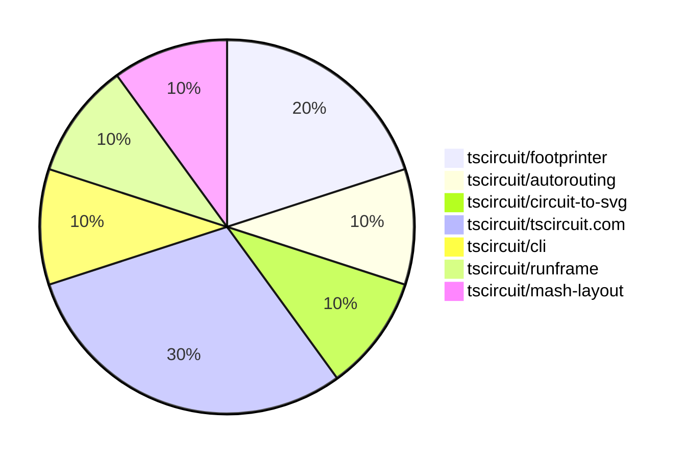

# Contribution Overview 2025-05-21

## PRs by Repository

## Contributor Overview

| Contributor | 🐳 Major | 🐙 Minor | 🐌 Tiny | ⭐ | Issues Created | Discussion Contributions |
|-------------|---------|---------|---------|-----|----------------|--------------------------|
| [imrishabh18](#imrishabh18) | 0 | 4 | 1 | ⭐ | 4 | 0🔹 0🔶 0💎 |
| [seveibar](#seveibar) | 1 | 0 | 0 | ⭐ | 0 | 0🔹 1🔶 0💎 |
| [ShiboSoftwareDev](#ShiboSoftwareDev) | 0 | 1 | 1 | ⭐ | 0 | 0🔹 0🔶 0💎 |
| [techmannih](#techmannih) | 0 | 1 | 0 |  | 1 | 0🔹 0🔶 0💎 |
| [Abse2001](#Abse2001) | 0 | 1 | 0 |  | 1 | 0🔹 0🔶 0💎 |

### Discussion Contribution Legend

- 🔹 Participating: Basic participation with minimal effort
- 🔶 Very Active: Thoughtful participation that adds value
- 💎 Extremely Active: Exceptional participation with high-quality content

## Review Table

[reviews-received-hover]: ## "Number of reviews received for PRs for this contributor"
[approvals-received-hover]: ## "Number of approvals received for PRs this contributor authored"
[rejections-received-hover]: ## "Number of rejections received for PRs this contributor authored"
[prs-opened-hover]: ## "Number of PRs opened by this contributor"
[issues-created-hover]: ## "Number of issues created by this contributor"
[bountied-issues-hover]: ## "Number of issues this contributor created with a bounty"
[bountied-issue-$-hover]: ## "Total bounty amount placed on issues authored by this contributor"

| Contributor | Reviews Received | Approvals Received | Rejections Received | Approvals | Rejections | PRs Opened | PRs Merged | Issues Created | Bountied Issues | Bountied Issue $ |
|---|---|---|---|---|---|---|---|---|---|---|
| [Abse2001](#Abse2001) | 7 | 1 | 0 | 0 | 0 | 4 | 1 | 1 | 0 | 0 |
| [graphite-app[bot]](#graphite-app[bot]) | 0 | 0 | 0 | 0 | 0 | 0 | 0 | 0 | 0 | 0 |
| [seveibar](#seveibar) | 0 | 0 | 0 | 2 | 0 | 1 | 1 | 0 | 0 | 0 |
| [ShiboSoftwareDev](#ShiboSoftwareDev) | 12 | 2 | 0 | 0 | 0 | 4 | 2 | 0 | 0 | 0 |
| [techmannih](#techmannih) | 4 | 0 | 0 | 0 | 0 | 1 | 1 | 1 | 0 | 0 |
| [imrishabh18](#imrishabh18) | 0 | 0 | 0 | 1 | 0 | 6 | 5 | 4 | 0 | 0 |
| [andrii-balitskyi](#andrii-balitskyi) | 0 | 0 | 0 | 0 | 0 | 1 | 0 | 0 | 0 | 0 |

## Changes by Repository

### [tscircuit/footprinter](https://github.com/tscircuit/footprinter)

| PR # | Impact | Contributor | Description | Milestone Aligned |
|------|--------|-------------|-------------|-------------------|
| [#272](https://github.com/tscircuit/footprinter/pull/272) | 🐙 Minor | techmannih | Add support for the `nosquareplating` flag in the `pinrow` function, which allows for a circular pad to be used for the first pin instead of a rectangular pad. | ✅ |
| [#270](https://github.com/tscircuit/footprinter/pull/270) | 🐙 Minor | ShiboSoftwareDev | Updated the `circuit-to-svg` and `ss` packages | ✅ |

### [tscircuit/autorouting](https://github.com/tscircuit/autorouting)

| PR # | Impact | Contributor | Description | Milestone Aligned |
|------|--------|-------------|-------------|-------------------|
| [#111](https://github.com/tscircuit/autorouting/pull/111) | 🐌 Tiny | ShiboSoftwareDev | Updated dependencies and snapshots | ✅ |

### [tscircuit/circuit-to-svg](https://github.com/tscircuit/circuit-to-svg)

| PR # | Impact | Contributor | Description | Milestone Aligned |
|------|--------|-------------|-------------|-------------------|
| [#220](https://github.com/tscircuit/circuit-to-svg/pull/220) | 🐙 Minor | Abse2001 | Update dependency version for "@tscircuit/core" | ❌ |

### [tscircuit/tscircuit.com](https://github.com/tscircuit/tscircuit.com)

| PR # | Impact | Contributor | Description | Milestone Aligned |
|------|--------|-------------|-------------|-------------------|
| [#1142](https://github.com/tscircuit/tscircuit.com/pull/1142) | 🐙 Minor | imrishabh18 | Invalidates the cache after deleting or updating a package in the runframe. | ✅ |
| [#1141](https://github.com/tscircuit/tscircuit.com/pull/1141) | 🐙 Minor | imrishabh18 | Removes the `/preview` page from the application. | ❌ |
| [#1140](https://github.com/tscircuit/tscircuit.com/pull/1140) | 🐙 Minor | imrishabh18 | Fix the `cmd + k` search functionality to show unique packages instead of duplicates. | ❌ |

### [tscircuit/cli](https://github.com/tscircuit/cli)

| PR # | Impact | Contributor | Description | Milestone Aligned |
|------|--------|-------------|-------------|-------------------|
| [#200](https://github.com/tscircuit/cli/pull/200) | 🐙 Minor | imrishabh18 | Update the `@tscircuit/runframe` dependency to version `0.0.481` | ✅ |

### [tscircuit/runframe](https://github.com/tscircuit/runframe)

| PR # | Impact | Contributor | Description | Milestone Aligned |
|------|--------|-------------|-------------|-------------------|
| [#637](https://github.com/tscircuit/runframe/pull/637) | 🐌 Tiny | imrishabh18 | Update the `easyeda` dependency to version `0.0.142` | ✅ |

### [tscircuit/mash-layout](https://github.com/tscircuit/mash-layout)

| PR # | Impact | Contributor | Description | Milestone Aligned |
|------|--------|-------------|-------------|-------------------|
| [#4](https://github.com/tscircuit/mash-layout/pull/4) | 🐳 Major | seveibar | Introduces complex tscircuit-based layouts, normalization fixes, and the ability to apply and get net lists from Circuit JSON. | ✅ |

## Changes by Contributor

### [techmannih](https://github.com/techmannih)

| PR # | Impact | Description | Milestone Aligned |
|------|--------|-------------|-------------------|
| [#272](https://github.com/tscircuit/footprinter/pull/272) | 🐙 Minor | Add support for the `nosquareplating` flag in the `pinrow` function, which allows for a circular pad to be used for the first pin instead of a rectangular pad. | ✅ |

### [ShiboSoftwareDev](https://github.com/ShiboSoftwareDev)

| PR # | Impact | Description | Milestone Aligned |
|------|--------|-------------|-------------------|
| [#270](https://github.com/tscircuit/footprinter/pull/270) | 🐙 Minor | Updated the `circuit-to-svg` and `ss` packages | ✅ |
| [#111](https://github.com/tscircuit/autorouting/pull/111) | 🐌 Tiny | Updated dependencies and snapshots | ✅ |

### [Abse2001](https://github.com/Abse2001)

| PR # | Impact | Description | Milestone Aligned |
|------|--------|-------------|-------------------|
| [#220](https://github.com/tscircuit/circuit-to-svg/pull/220) | 🐙 Minor | Update dependency version for "@tscircuit/core" | ❌ |

### [imrishabh18](https://github.com/imrishabh18)

| PR # | Impact | Description | Milestone Aligned |
|------|--------|-------------|-------------------|
| [#1142](https://github.com/tscircuit/tscircuit.com/pull/1142) | 🐙 Minor | Invalidates the cache after deleting or updating a package in the runframe. | ✅ |
| [#1141](https://github.com/tscircuit/tscircuit.com/pull/1141) | 🐙 Minor | Removes the `/preview` page from the application. | ❌ |
| [#1140](https://github.com/tscircuit/tscircuit.com/pull/1140) | 🐙 Minor | Fix the `cmd + k` search functionality to show unique packages instead of duplicates. | ❌ |
| [#200](https://github.com/tscircuit/cli/pull/200) | 🐙 Minor | Update the `@tscircuit/runframe` dependency to version `0.0.481` | ✅ |
| [#637](https://github.com/tscircuit/runframe/pull/637) | 🐌 Tiny | Update the `easyeda` dependency to version `0.0.142` | ✅ |

### [seveibar](https://github.com/seveibar)

| PR # | Impact | Description | Milestone Aligned |
|------|--------|-------------|-------------------|
| [#4](https://github.com/tscircuit/mash-layout/pull/4) | 🐳 Major | Introduces complex tscircuit-based layouts, normalization fixes, and the ability to apply and get net lists from Circuit JSON. | ✅ |

