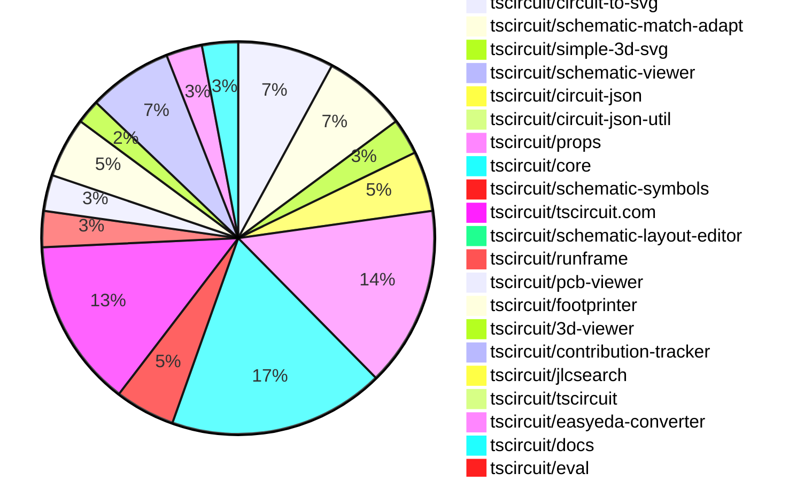

# Contribution Overview 2025-05-28

## PRs by Repository

## Contributor Overview

| Contributor | 🐳 Major | 🐙 Minor | 🐌 Tiny | ⭐ | Issues Created | Discussion Contributions |
|-------------|---------|---------|---------|-----|----------------|--------------------------|
| [seveibar](#seveibar) | 4 | 28 | 2 | 👑👑 | 17 | 0🔹 0🔶 0💎 |
| [ArnavK-09](#ArnavK-09) | 4 | 10 | 0 | ⭐⭐⭐ | 11 | 0🔹 0🔶 0💎 |
| [techmannih](#techmannih) | 0 | 11 | 9 | ⭐⭐⭐ | 6 | 3🔹 0🔶 0💎 |
| [ShiboSoftwareDev](#ShiboSoftwareDev) | 0 | 13 | 2 | ⭐⭐⭐ | 5 | 0🔹 0🔶 0💎 |
| [imrishabh18](#imrishabh18) | 1 | 4 | 1 | ⭐⭐ | 12 | 0🔹 0🔶 0💎 |
| [Anshgrover23](#Anshgrover23) | 0 | 7 | 1 | ⭐⭐ | 4 | 0🔹 0🔶 0💎 |
| [Abse2001](#Abse2001) | 0 | 7 | 0 | ⭐⭐ | 3 | 0🔹 0🔶 0💎 |
| [andrii-balitskyi](#andrii-balitskyi) | 0 | 2 | 0 | ⭐ | 0 | 0🔹 0🔶 0💎 |
| [tscircuitbot](#tscircuitbot) | 0 | 0 | 1 |  | 0 | 0🔹 0🔶 0💎 |

### Discussion Contribution Legend

- 🔹 Normal Comments: Basic participation with minimal effort
- 🔶 Great Informative Comments: Thoughtful participation that adds value
- 💎 Incredible Comments: Exceptional participation with high-quality content

## Review Table

[reviews-received-hover]: ## "Number of reviews received for PRs for this contributor"
[approvals-received-hover]: ## "Number of approvals received for PRs this contributor authored"
[rejections-received-hover]: ## "Number of rejections received for PRs this contributor authored"
[prs-opened-hover]: ## "Number of PRs opened by this contributor"
[issues-created-hover]: ## "Number of issues created by this contributor"
[bountied-issues-hover]: ## "Number of issues this contributor created with a bounty"
[bountied-issue-$-hover]: ## "Total bounty amount placed on issues authored by this contributor"

| Contributor | Reviews Received | Approvals Received | Rejections Received | Approvals | Rejections | PRs Opened | PRs Merged | Issues Created | Bountied Issues | Bountied Issue $ |
|---|---|---|---|---|---|---|---|---|---|---|
| [seveibar](#seveibar) | 10 | 0 | 0 | 63 | 11 | 59 | 36 | 17 | 3 | 37 |
| [ShiboSoftwareDev](#ShiboSoftwareDev) | 24 | 17 | 1 | 0 | 0 | 19 | 16 | 5 | 2 | 33 |
| [ArnavK-09](#ArnavK-09) | 29 | 13 | 3 | 1 | 0 | 16 | 14 | 11 | 1 | 10 |
| [imrishabh18](#imrishabh18) | 8 | 3 | 1 | 6 | 2 | 7 | 6 | 12 | 1 | 5 |
| [graphite-app[bot]](#graphite-app[bot]) | 0 | 0 | 0 | 0 | 0 | 0 | 0 | 0 | 0 | 0 |
| [techmannih](#techmannih) | 37 | 24 | 4 | 0 | 2 | 26 | 20 | 6 | 0 | 0 |
| [Anshgrover23](#Anshgrover23) | 13 | 9 | 1 | 4 | 2 | 10 | 8 | 4 | 0 | 0 |
| [Abse2001](#Abse2001) | 12 | 7 | 1 | 1 | 0 | 10 | 7 | 3 | 0 | 0 |
| [Apocalypse96](#Apocalypse96) | 7 | 0 | 6 | 0 | 0 | 3 | 0 | 0 | 0 | 0 |
| [andrii-balitskyi](#andrii-balitskyi) | 4 | 2 | 0 | 0 | 0 | 2 | 2 | 0 | 0 | 0 |
| [tscircuitbot](#tscircuitbot) | 0 | 0 | 0 | 0 | 0 | 37 | 1 | 0 | 0 | 0 |

## Changes by Repository

### [tscircuit/circuit-to-svg](https://github.com/tscircuit/circuit-to-svg)

| PR # | Impact | Contributor | Description | Milestone Aligned |
|------|--------|-------------|-------------|-------------------|
| [#226](https://github.com/tscircuit/circuit-to-svg/pull/226) | 🐳 Major | seveibar | The introduction of a PCB rendering context and layer support significantly enhances the flexibility and maintainability of the rendering process. | ❌ |
| [#228](https://github.com/tscircuit/circuit-to-svg/pull/228) | 🐙 Minor | seveibar | Enhances the SVG generation process by allowing the aspect ratio of the PCB board to be matched, improving visual accuracy. | ❌ |
| [#235](https://github.com/tscircuit/circuit-to-svg/pull/235) | 🐙 Minor | ShiboSoftwareDev | Enhancements to the PCB silkscreen rectangle rendering capabilities, adding new properties for better customization. | ❌ |
| [#223](https://github.com/tscircuit/circuit-to-svg/pull/223) | 🐙 Minor | ShiboSoftwareDev | Enhancements to silkscreen text rendering improve clarity on larger PCB designs. | ❌ |
| [#233](https://github.com/tscircuit/circuit-to-svg/pull/233) | 🐙 Minor | techmannih | Enhancement of SVG rendering accuracy for schematic symbols by correcting circle radius scaling. | ❌ |
| [#231](https://github.com/tscircuit/circuit-to-svg/pull/231) | 🐙 Minor | techmannih | Enhances the schematic symbol rendering by adding support for circles, improving visual representation. | ❌ |
| [#234](https://github.com/tscircuit/circuit-to-svg/pull/234) | 🐙 Minor | Abse2001 | Enhancements to the SVG rendering capabilities for schematic boxes improve the overall functionality and usability of the circuit visualization. | ❌ |
| [#230](https://github.com/tscircuit/circuit-to-svg/pull/230) | 🐌 Tiny | techmannih | Updating the schematic-symbols dependency enhances the project's compatibility with the latest features and fixes. | ❌ |

### [tscircuit/schematic-match-adapt](https://github.com/tscircuit/schematic-match-adapt)

| PR # | Impact | Contributor | Description | Milestone Aligned |
|------|--------|-------------|-------------|-------------------|
| [#20](https://github.com/tscircuit/schematic-match-adapt/pull/20) | 🐳 Major | seveibar | Significant improvements to adaptation processes, including pathfinding and pin margin support, enhancing overall functionality and reliability. | ❌ |
| [#18](https://github.com/tscircuit/schematic-match-adapt/pull/18) | 🐳 Major | seveibar | Enhancements to the schematic matching and visualization capabilities through the introduction of a new template and a force-directed graph component. | ❌ |
| [#22](https://github.com/tscircuit/schematic-match-adapt/pull/22) | 🐙 Minor | seveibar | Enhancements to pin location accuracy and the addition of netLabelIds and path tracking improve the functionality and usability of the schematic matching system. | ❌ |
| [#21](https://github.com/tscircuit/schematic-match-adapt/pull/21) | 🐙 Minor | seveibar | Enhancements to the circuit layout generation process by introducing a new output format, improving integration with core functionalities. | ❌ |
| [#19](https://github.com/tscircuit/schematic-match-adapt/pull/19) | 🐙 Minor | seveibar | Introduces a new template function and associated schematic layout to the project. | ❌ |
| [#17](https://github.com/tscircuit/schematic-match-adapt/pull/17) | 🐙 Minor | seveibar | Enhancements to template handling and adaptation logic improve the overall functionality and robustness of the schematic matching process. | ❌ |
| [#16](https://github.com/tscircuit/schematic-match-adapt/pull/16) | 🐙 Minor | seveibar | Enhancements to the adaptation process and visualization of circuit layouts significantly improve the functionality and usability of the tool. | ❌ |

### [tscircuit/simple-3d-svg](https://github.com/tscircuit/simple-3d-svg)

| PR # | Impact | Contributor | Description | Milestone Aligned |
|------|--------|-------------|-------------|-------------------|
| [#9](https://github.com/tscircuit/simple-3d-svg/pull/9) | 🐳 Major | seveibar | Adding STL support enhances the library's capabilities for 3D rendering, allowing users to import and visualize STL files directly. | ❌ |
| [#6](https://github.com/tscircuit/simple-3d-svg/pull/6) | 🐙 Minor | seveibar | Enhances the rendering capabilities by allowing images to be mapped onto the top faces of 3D boxes, improving visual representation. | ❌ |
| [#5](https://github.com/tscircuit/simple-3d-svg/pull/5) | 🐙 Minor | seveibar | Enhances the 3D SVG rendering capabilities by adding support for top face images, improving visual representation. | ❌ |

### [tscircuit/schematic-viewer](https://github.com/tscircuit/schematic-viewer)

| PR # | Impact | Contributor | Description | Milestone Aligned |
|------|--------|-------------|-------------|-------------------|
| [#96](https://github.com/tscircuit/schematic-viewer/pull/96) | 🐙 Minor | seveibar | Enhancing the visual consistency of the schematic viewer by ensuring the background color matches the SVG during panning. | ❌ |

### [tscircuit/circuit-json](https://github.com/tscircuit/circuit-json)

| PR # | Impact | Contributor | Description | Milestone Aligned |
|------|--------|-------------|-------------|-------------------|
| [#210](https://github.com/tscircuit/circuit-json/pull/210) | 🐙 Minor | seveibar | Introducing a new component for handling schematic layout errors enhances the library's functionality and error management capabilities. | ❌ |
| [#209](https://github.com/tscircuit/circuit-json/pull/209) | 🐙 Minor | seveibar | Enhancements to source elements with the addition of a subcircuit connectivity key improve the overall functionality and flexibility of the circuit design. | ❌ |
| [#207](https://github.com/tscircuit/circuit-json/pull/207) | 🐙 Minor | ShiboSoftwareDev | Refactoring of properties enhances clarity and usability of the PCB silkscreen rectangle definition. | ❌ |
| [#206](https://github.com/tscircuit/circuit-json/pull/206) | 🐙 Minor | ShiboSoftwareDev | Adding a filled boolean property enhances the flexibility of the PCB silkscreen rectangle definition. | ❌ |
| [#200](https://github.com/tscircuit/circuit-json/pull/200) | 🐙 Minor | techmannih | Introducing a new component for simple fuses enhances the library's capability to model electrical circuits more accurately. | ❌ |

### [tscircuit/circuit-json-util](https://github.com/tscircuit/circuit-json-util)

| PR # | Impact | Contributor | Description | Milestone Aligned |
|------|--------|-------------|-------------|-------------------|
| [#33](https://github.com/tscircuit/circuit-json-util/pull/33) | 🐙 Minor | seveibar | The addition of subtree filtering enhances the utility's capability to manage circuit elements based on subcircuit and source group identifiers, improving data handling and organization. | ❌ |

### [tscircuit/props](https://github.com/tscircuit/props)

| PR # | Impact | Contributor | Description | Milestone Aligned |
|------|--------|-------------|-------------|-------------------|
| [#257](https://github.com/tscircuit/props/pull/257) | 🐙 Minor | seveibar | Introducing a new boolean property enhances the flexibility of component behavior in the library. | ❌ |
| [#246](https://github.com/tscircuit/props/pull/246) | 🐙 Minor | seveibar | Enhances platform configuration by allowing selective disabling of PCB, schematic, and parts engine features. | ❌ |
| [#252](https://github.com/tscircuit/props/pull/252) | 🐙 Minor | seveibar | Introduces a new layout mode option, enhancing layout configuration flexibility. | ❌ |
| [#245](https://github.com/tscircuit/props/pull/245) | 🐙 Minor | seveibar | Enhancements to the footprint library map introduce support for asynchronous operations, improving flexibility and performance. | ❌ |
| [#243](https://github.com/tscircuit/props/pull/243) | 🐙 Minor | seveibar | Enhancing the platform configuration with a new optional mapping feature adds flexibility for future development. | ❌ |
| [#242](https://github.com/tscircuit/props/pull/242) | 🐙 Minor | seveibar | Introducing a new `<connector />` component enhances the library's functionality by providing additional capabilities for handling connectors in circuit designs. | ❌ |
| [#253](https://github.com/tscircuit/props/pull/253) | 🐙 Minor | ShiboSoftwareDev | Enhancements to the silkscreen rectangle component by introducing new properties for filled and stroke styles. | ❌ |
| [#241](https://github.com/tscircuit/props/pull/241) | 🐙 Minor | imrishabh18 | Enhancement of the PinHeader component by introducing a new property for schematic pin arrangement. | ❌ |
| [#256](https://github.com/tscircuit/props/pull/256) | 🐙 Minor | techmannih | Enhancement of LED properties by introducing an optional schValLabel for improved functionality. | ❌ |
| [#255](https://github.com/tscircuit/props/pull/255) | 🐙 Minor | Abse2001 | Enhances validation logic to prevent conflicting properties in schematic box configurations. | ❌ |
| [#251](https://github.com/tscircuit/props/pull/251) | 🐙 Minor | Abse2001 | The refinement of schematic box properties enhances validation by enforcing the presence of either dimensions or an overlay, improving data integrity. | ❌ |
| [#248](https://github.com/tscircuit/props/pull/248) | 🐙 Minor | Abse2001 | Enhancements to the schematicBox properties provide greater flexibility and customization options for users. | ❌ |
| [#247](https://github.com/tscircuit/props/pull/247) | 🐙 Minor | Abse2001 | Enhancements to padding properties improve layout flexibility for schematic boxes. | ❌ |
| [#250](https://github.com/tscircuit/props/pull/250) | 🐌 Tiny | seveibar | Enhancements to documentation for platform configuration improve clarity and usability for developers. | ❌ |
| [#258](https://github.com/tscircuit/props/pull/258) | 🐌 Tiny | techmannih | Refactoring of property names enhances code clarity and consistency. | ❌ |

### [tscircuit/core](https://github.com/tscircuit/core)

| PR # | Impact | Contributor | Description | Milestone Aligned |
|------|--------|-------------|-------------|-------------------|
| [#835](https://github.com/tscircuit/core/pull/835) | 🐳 Major | imrishabh18 | Enhances the PinHeader component by allowing customizable pin arrangements, improving flexibility in schematic designs. | ✅ |
| [#863](https://github.com/tscircuit/core/pull/863) | 🐙 Minor | seveibar | Enhancement of the Resistor component to support pulldown nets, improving functionality for circuit design. | ❌ |
| [#861](https://github.com/tscircuit/core/pull/861) | 🐙 Minor | seveibar | Enhancing component behavior by preventing unnecessary fetching of supplier part numbers when placement is disabled. | ❌ |
| [#855](https://github.com/tscircuit/core/pull/855) | 🐙 Minor | seveibar | Enhances the rendering process by allowing footprints to be loaded from URLs, improving flexibility in component design. | ❌ |
| [#839](https://github.com/tscircuit/core/pull/839) | 🐙 Minor | seveibar | Enhancements to the parts engine with local caching improve performance and efficiency in component queries. | ❌ |
| [#838](https://github.com/tscircuit/core/pull/838) | 🐙 Minor | seveibar | Enhancements to jumper functionality with custom pin support improve flexibility in circuit design. | ❌ |
| [#834](https://github.com/tscircuit/core/pull/834) | 🐙 Minor | seveibar | Enhancements to the jumper component improve schematic rendering, aligning with user expectations for single-sided designs. | ❌ |
| [#831](https://github.com/tscircuit/core/pull/831) | 🐙 Minor | seveibar | Enhancement of the selector functionality by introducing the SHLD net, improving the flexibility of the library. | ❌ |
| [#857](https://github.com/tscircuit/core/pull/857) | 🐙 Minor | ShiboSoftwareDev | Enhancements to pinrow text alignment options improve usability and flexibility in circuit design. | ❌ |
| [#851](https://github.com/tscircuit/core/pull/851) | 🐙 Minor | imrishabh18 | Addresses a timeout issue by ensuring that a 'Not found' response is handled correctly, improving reliability in data caching. | ❌ |
| [#849](https://github.com/tscircuit/core/pull/849) | 🐙 Minor | techmannih | Enhances the PlatedHole component by adding support for a new shape, pill_hole_with_rect_pad, improving its versatility in PCB design. | ❌ |
| [#848](https://github.com/tscircuit/core/pull/848) | 🐙 Minor | techmannih | Introducing a Fuse component enhances the library's functionality for electrical circuit design. | ❌ |
| [#845](https://github.com/tscircuit/core/pull/845) | 🐙 Minor | techmannih | Enhancements to LED component functionality by adding support for simple LED features. | ❌ |
| [#853](https://github.com/tscircuit/core/pull/853) | 🐙 Minor | Abse2001 | Introduces a new schematic box component along with enhanced error handling and corresponding tests, improving the overall functionality and robustness of the library. | ❌ |
| [#844](https://github.com/tscircuit/core/pull/844) | 🐙 Minor | Anshgrover23 | Enhancing the utility of the library by exporting a new function for pin label normalization. | ❌ |
| [#852](https://github.com/tscircuit/core/pull/852) | 🐌 Tiny | ShiboSoftwareDev | Enhancements to component creation logic and dependency updates improve functionality and maintainability. | ❌ |
| [#860](https://github.com/tscircuit/core/pull/860) | 🐌 Tiny | techmannih | Updating package dependencies to improve SVG rendering capabilities. | ❌ |
| [#858](https://github.com/tscircuit/core/pull/858) | 🐌 Tiny | techmannih | Updating the version of a dependency in the package.json file enhances the project's functionality and ensures compatibility with the latest features. | ❌ |

### [tscircuit/schematic-symbols](https://github.com/tscircuit/schematic-symbols)

| PR # | Impact | Contributor | Description | Milestone Aligned |
|------|--------|-------------|-------------|-------------------|
| [#288](https://github.com/tscircuit/schematic-symbols/pull/288) | 🐙 Minor | seveibar | Enhancements to the symbol modification process improve the accuracy of component placement in schematic designs. | ❌ |
| [#291](https://github.com/tscircuit/schematic-symbols/pull/291) | 🐙 Minor | ShiboSoftwareDev | Reducing the size of the VCC symbol enhances the visual clarity and usability of schematic diagrams. | ❌ |
| [#289](https://github.com/tscircuit/schematic-symbols/pull/289) | 🐙 Minor | techmannih | The pull request modifies the JSON representation of the icled symbol, correcting variations in its path definitions. | ❌ |
| [#286](https://github.com/tscircuit/schematic-symbols/pull/286) | 🐙 Minor | techmannih | The pull request enhances the accuracy of the PNP bipolar transistor symbol by removing unnecessary elements, thereby improving the schematic representation. | ❌ |
| [#284](https://github.com/tscircuit/schematic-symbols/pull/284) | 🐙 Minor | Abse2001 | The addition of the VCC symbol enhances the library's functionality by providing a new component for circuit design. | ❌ |

### [tscircuit/tscircuit.com](https://github.com/tscircuit/tscircuit.com)

| PR # | Impact | Contributor | Description | Milestone Aligned |
|------|--------|-------------|-------------|-------------------|
| [#1149](https://github.com/tscircuit/tscircuit.com/pull/1149) | 🐳 Major | ArnavK-09 | The pull request introduces a fully refactored package-based editor with enhanced file management features, including a new file deletion capability and improved state management. | ❌ |
| [#1179](https://github.com/tscircuit/tscircuit.com/pull/1179) | 🐙 Minor | seveibar | The change enhances user navigation by linking directly to a relevant resource, improving the overall user experience. | ❌ |
| [#1189](https://github.com/tscircuit/tscircuit.com/pull/1189) | 🐙 Minor | ArnavK-09 | Enhancements to file validation logic improve the robustness of manual edits import functionality. | ❌ |
| [#1188](https://github.com/tscircuit/tscircuit.com/pull/1188) | 🐙 Minor | ArnavK-09 | Updating the API endpoint enhances the integration with the new backend structure, ensuring data consistency and functionality. | ❌ |
| [#1185](https://github.com/tscircuit/tscircuit.com/pull/1185) | 🐙 Minor | ArnavK-09 | Enhancing user interaction by updating the decoration class to include a cursor pointer improves the overall usability of the CodeEditor component. | ❌ |
| [#1186](https://github.com/tscircuit/tscircuit.com/pull/1186) | 🐙 Minor | ArnavK-09 | Enhancements to link presentation and accessibility improve user experience and interface clarity. | ❌ |
| [#1178](https://github.com/tscircuit/tscircuit.com/pull/1178) | 🐙 Minor | ArnavK-09 | Enhancements to button responsiveness and layout significantly improve the mobile user experience on the landing page. | ❌ |
| [#1170](https://github.com/tscircuit/tscircuit.com/pull/1170) | 🐙 Minor | ArnavK-09 | Enhancing security by restricting access to private packages based on user session validation. | ❌ |
| [#1180](https://github.com/tscircuit/tscircuit.com/pull/1180) | 🐙 Minor | imrishabh18 | Enhances account retrieval functionality by allowing access via GitHub username. | ❌ |
| [#1175](https://github.com/tscircuit/tscircuit.com/pull/1175) | 🐙 Minor | andrii-balitskyi | Enhances server-side rendering by injecting package data into the HTML before the initial render, improving performance and user experience. | ❌ |
| [#1187](https://github.com/tscircuit/tscircuit.com/pull/1187) | 🐌 Tiny | techmannih | Updating dependencies enhances the stability and performance of the project, ensuring compatibility with the latest features and fixes. | ❌ |
| [#1184](https://github.com/tscircuit/tscircuit.com/pull/1184) | 🐌 Tiny | techmannih | Updating dependencies enhances the project's stability and ensures compatibility with the latest features and fixes. | ❌ |
| [#1181](https://github.com/tscircuit/tscircuit.com/pull/1181) | 🐌 Tiny | techmannih | Updating dependencies enhances the stability and security of the project by ensuring that the latest versions are used. | ❌ |
| [#1162](https://github.com/tscircuit/tscircuit.com/pull/1162) | 🐌 Tiny | techmannih | Enhancing user interface consistency through capitalization adjustments improves readability and user experience. | ❌ |

### [tscircuit/schematic-layout-editor](https://github.com/tscircuit/schematic-layout-editor)

| PR # | Impact | Contributor | Description | Milestone Aligned |
|------|--------|-------------|-------------|-------------------|
| [#3](https://github.com/tscircuit/schematic-layout-editor/pull/3) | 🐙 Minor | seveibar | Enhancements to pin margin support and bug fixes for chip centering and pin connections improve the overall functionality and user experience of the schematic layout editor. | ❌ |

### [tscircuit/runframe](https://github.com/tscircuit/runframe)

| PR # | Impact | Contributor | Description | Milestone Aligned |
|------|--------|-------------|-------------|-------------------|
| [#667](https://github.com/tscircuit/runframe/pull/667) | 🐙 Minor | andrii-balitskyi | The changes effectively resolve critical execution hang issues, enhancing user experience and system reliability during circuit compilation. | ❌ |
| [#700](https://github.com/tscircuit/runframe/pull/700) | 🐌 Tiny | seveibar | Removing the color override enhances the clarity and functionality of the schematic viewer, aligning it better with intended design principles. | ❌ |
| [#672](https://github.com/tscircuit/runframe/pull/672) | 🐌 Tiny | techmannih | Updating dependencies enhances the stability and performance of the project by ensuring compatibility with the latest versions. | ❌ |

### [tscircuit/pcb-viewer](https://github.com/tscircuit/pcb-viewer)

| PR # | Impact | Contributor | Description | Milestone Aligned |
|------|--------|-------------|-------------|-------------------|
| [#309](https://github.com/tscircuit/pcb-viewer/pull/309) | 🐳 Major | ArnavK-09 | Refactoring to integrate React Cosmos enhances the development workflow and testing capabilities for the PCBViewer application. | ❌ |
| [#313](https://github.com/tscircuit/pcb-viewer/pull/313) | 🐙 Minor | ShiboSoftwareDev | Enhancements to the PCB drawing capabilities by adding support for filled and dashed silkscreen rectangles. | ❌ |
| [#297](https://github.com/tscircuit/pcb-viewer/pull/297) | 🐙 Minor | ShiboSoftwareDev | Enhancements to text alignment options for silkscreen texts improve usability and flexibility in PCB design. | ❌ |

### [tscircuit/footprinter](https://github.com/tscircuit/footprinter)

| PR # | Impact | Contributor | Description | Milestone Aligned |
|------|--------|-------------|-------------|-------------------|
| [#284](https://github.com/tscircuit/footprinter/pull/284) | 🐙 Minor | ShiboSoftwareDev | Enhancements to pin label alignment logic improve the accuracy of pin representation in the design. | ❌ |
| [#283](https://github.com/tscircuit/footprinter/pull/283) | 🐙 Minor | ShiboSoftwareDev | Enhancements to pinlabel orientation options improve flexibility in pin layout configurations. | ❌ |
| [#282](https://github.com/tscircuit/footprinter/pull/282) | 🐙 Minor | ShiboSoftwareDev | Enhancements to the pinrow functionality improve flexibility in pin label positioning and alignment. | ❌ |
| [#281](https://github.com/tscircuit/footprinter/pull/281) | 🐙 Minor | techmannih | Introduces a new footprint for the smbf component, enhancing the library's capabilities for PCB design. | ❌ |
| [#280](https://github.com/tscircuit/footprinter/pull/280) | 🐙 Minor | techmannih | Introduces a new SOT-323 footprint definition, enhancing the library's component offerings for PCB design. | ❌ |

### [tscircuit/3d-viewer](https://github.com/tscircuit/3d-viewer)

| PR # | Impact | Contributor | Description | Milestone Aligned |
|------|--------|-------------|-------------|-------------------|
| [#302](https://github.com/tscircuit/3d-viewer/pull/302) | 🐙 Minor | ShiboSoftwareDev | Enhances the silkscreen text alignment functionality by supporting nine-point anchor alignment, improving design flexibility. | ❌ |
| [#304](https://github.com/tscircuit/3d-viewer/pull/304) | 🐌 Tiny | ShiboSoftwareDev | Enhancements to the jscad-electronics library improve component footprint handling in circuit design. | ❌ |

### [tscircuit/contribution-tracker](https://github.com/tscircuit/contribution-tracker)

| PR # | Impact | Contributor | Description | Milestone Aligned |
|------|--------|-------------|-------------|-------------------|
| [#169](https://github.com/tscircuit/contribution-tracker/pull/169) | 🐳 Major | ArnavK-09 | Refactoring the milestones module enhances flexibility and clarity in PR analysis and discussion prompts. | ✅ |
| [#168](https://github.com/tscircuit/contribution-tracker/pull/168) | 🐳 Major | ArnavK-09 | Integrating a notifications system enhances communication and awareness of pull requests and issues within the repository. | ❌ |
| [#171](https://github.com/tscircuit/contribution-tracker/pull/171) | 🐙 Minor | ArnavK-09 | Enhances logging for PR analysis, particularly regarding milestone alignment. | ❌ |
| [#170](https://github.com/tscircuit/contribution-tracker/pull/170) | 🐙 Minor | ArnavK-09 | Enhancements to caching mechanisms in CI workflows improve efficiency and performance. | ❌ |
| [#164](https://github.com/tscircuit/contribution-tracker/pull/164) | 🐙 Minor | ArnavK-09 | Integrating CODEOWNERS data enhances the contribution overview, providing clearer insights into repository ownership and contributor statistics. | ❌ |
| [#166](https://github.com/tscircuit/contribution-tracker/pull/166) | 🐙 Minor | ArnavK-09 | Refactoring the analysis structure and enhancing classification criteria for discussion comments improves clarity and strictness in evaluating contributions. | ❌ |
| [#173](https://github.com/tscircuit/contribution-tracker/pull/173) | 🐙 Minor | Anshgrover23 | Enhancements to notification filtering by excluding specific bots from Discord notifications. | ❌ |

### [tscircuit/jlcsearch](https://github.com/tscircuit/jlcsearch)

| PR # | Impact | Contributor | Description | Milestone Aligned |
|------|--------|-------------|-------------|-------------------|
| [#54](https://github.com/tscircuit/jlcsearch/pull/54) | 🐙 Minor | imrishabh18 | Introduces a fallback route for handling unmatched categories, enhancing error handling and user experience. | ❌ |

### [tscircuit/tscircuit](https://github.com/tscircuit/tscircuit)

| PR # | Impact | Contributor | Description | Milestone Aligned |
|------|--------|-------------|-------------|-------------------|
| [#661](https://github.com/tscircuit/tscircuit/pull/661) | 🐌 Tiny | imrishabh18 | Updating dependencies enhances the stability and security of the project by ensuring that the latest versions are used. | ❌ |

### [tscircuit/easyeda-converter](https://github.com/tscircuit/easyeda-converter)

| PR # | Impact | Contributor | Description | Milestone Aligned |
|------|--------|-------------|-------------|-------------------|
| [#204](https://github.com/tscircuit/easyeda-converter/pull/204) | 🐙 Minor | Anshgrover23 | Enhancements to the project by adding missing components and tests for better functionality and coverage. | ❌ |
| [#202](https://github.com/tscircuit/easyeda-converter/pull/202) | 🐙 Minor | Anshgrover23 | Enhancements to the EasyEDA converter by adding support for a new component, improving functionality and usability. | ❌ |
| [#205](https://github.com/tscircuit/easyeda-converter/pull/205) | 🐌 Tiny | Anshgrover23 | Refactoring to improve code organization by centralizing the normalize function. | ❌ |

### [tscircuit/docs](https://github.com/tscircuit/docs)

| PR # | Impact | Contributor | Description | Milestone Aligned |
|------|--------|-------------|-------------|-------------------|
| [#65](https://github.com/tscircuit/docs/pull/65) | 🐙 Minor | Anshgrover23 | Enhancing documentation by replacing iframe elements with a reusable YouTubeEmbed component improves maintainability and consistency. | ❌ |
| [#66](https://github.com/tscircuit/docs/pull/66) | 🐙 Minor | Anshgrover23 | The addition of essential workflows enhances the CI/CD process, ensuring better code quality and consistency. | ❌ |
| [#64](https://github.com/tscircuit/docs/pull/64) | 🐙 Minor | Anshgrover23 | Enhancements to documentation for importing JLCPCB components improve user experience and accessibility. | ❌ |

### [tscircuit/eval](https://github.com/tscircuit/eval)

| PR # | Impact | Contributor | Description | Milestone Aligned |
|------|--------|-------------|-------------|-------------------|
| [#400](https://github.com/tscircuit/eval/pull/400) | 🐌 Tiny | tscircuitbot | Updating the core library version enhances compatibility and may include important bug fixes or improvements. | ❌ |

## Changes by Contributor

### [seveibar](https://github.com/seveibar)

| PR # | Impact | Description | Milestone Aligned |
|------|--------|-------------|-------------------|
| [#226](https://github.com/tscircuit/circuit-to-svg/pull/226) | 🐳 Major | The introduction of a PCB rendering context and layer support significantly enhances the flexibility and maintainability of the rendering process. | ❌ |
| [#20](https://github.com/tscircuit/schematic-match-adapt/pull/20) | 🐳 Major | Significant improvements to adaptation processes, including pathfinding and pin margin support, enhancing overall functionality and reliability. | ❌ |
| [#18](https://github.com/tscircuit/schematic-match-adapt/pull/18) | 🐳 Major | Enhancements to the schematic matching and visualization capabilities through the introduction of a new template and a force-directed graph component. | ❌ |
| [#9](https://github.com/tscircuit/simple-3d-svg/pull/9) | 🐳 Major | Adding STL support enhances the library's capabilities for 3D rendering, allowing users to import and visualize STL files directly. | ❌ |
| [#96](https://github.com/tscircuit/schematic-viewer/pull/96) | 🐙 Minor | Enhancing the visual consistency of the schematic viewer by ensuring the background color matches the SVG during panning. | ❌ |
| [#210](https://github.com/tscircuit/circuit-json/pull/210) | 🐙 Minor | Introducing a new component for handling schematic layout errors enhances the library's functionality and error management capabilities. | ❌ |
| [#209](https://github.com/tscircuit/circuit-json/pull/209) | 🐙 Minor | Enhancements to source elements with the addition of a subcircuit connectivity key improve the overall functionality and flexibility of the circuit design. | ❌ |
| [#33](https://github.com/tscircuit/circuit-json-util/pull/33) | 🐙 Minor | The addition of subtree filtering enhances the utility's capability to manage circuit elements based on subcircuit and source group identifiers, improving data handling and organization. | ❌ |
| [#257](https://github.com/tscircuit/props/pull/257) | 🐙 Minor | Introducing a new boolean property enhances the flexibility of component behavior in the library. | ❌ |
| [#246](https://github.com/tscircuit/props/pull/246) | 🐙 Minor | Enhances platform configuration by allowing selective disabling of PCB, schematic, and parts engine features. | ❌ |
| [#252](https://github.com/tscircuit/props/pull/252) | 🐙 Minor | Introduces a new layout mode option, enhancing layout configuration flexibility. | ❌ |
| [#245](https://github.com/tscircuit/props/pull/245) | 🐙 Minor | Enhancements to the footprint library map introduce support for asynchronous operations, improving flexibility and performance. | ❌ |
| [#243](https://github.com/tscircuit/props/pull/243) | 🐙 Minor | Enhancing the platform configuration with a new optional mapping feature adds flexibility for future development. | ❌ |
| [#242](https://github.com/tscircuit/props/pull/242) | 🐙 Minor | Introducing a new `<connector />` component enhances the library's functionality by providing additional capabilities for handling connectors in circuit designs. | ❌ |
| [#863](https://github.com/tscircuit/core/pull/863) | 🐙 Minor | Enhancement of the Resistor component to support pulldown nets, improving functionality for circuit design. | ❌ |
| [#861](https://github.com/tscircuit/core/pull/861) | 🐙 Minor | Enhancing component behavior by preventing unnecessary fetching of supplier part numbers when placement is disabled. | ❌ |
| [#855](https://github.com/tscircuit/core/pull/855) | 🐙 Minor | Enhances the rendering process by allowing footprints to be loaded from URLs, improving flexibility in component design. | ❌ |
| [#839](https://github.com/tscircuit/core/pull/839) | 🐙 Minor | Enhancements to the parts engine with local caching improve performance and efficiency in component queries. | ❌ |
| [#838](https://github.com/tscircuit/core/pull/838) | 🐙 Minor | Enhancements to jumper functionality with custom pin support improve flexibility in circuit design. | ❌ |
| [#834](https://github.com/tscircuit/core/pull/834) | 🐙 Minor | Enhancements to the jumper component improve schematic rendering, aligning with user expectations for single-sided designs. | ❌ |
| [#831](https://github.com/tscircuit/core/pull/831) | 🐙 Minor | Enhancement of the selector functionality by introducing the SHLD net, improving the flexibility of the library. | ❌ |
| [#228](https://github.com/tscircuit/circuit-to-svg/pull/228) | 🐙 Minor | Enhances the SVG generation process by allowing the aspect ratio of the PCB board to be matched, improving visual accuracy. | ❌ |
| [#288](https://github.com/tscircuit/schematic-symbols/pull/288) | 🐙 Minor | Enhancements to the symbol modification process improve the accuracy of component placement in schematic designs. | ❌ |
| [#1179](https://github.com/tscircuit/tscircuit.com/pull/1179) | 🐙 Minor | The change enhances user navigation by linking directly to a relevant resource, improving the overall user experience. | ❌ |
| [#22](https://github.com/tscircuit/schematic-match-adapt/pull/22) | 🐙 Minor | Enhancements to pin location accuracy and the addition of netLabelIds and path tracking improve the functionality and usability of the schematic matching system. | ❌ |
| [#21](https://github.com/tscircuit/schematic-match-adapt/pull/21) | 🐙 Minor | Enhancements to the circuit layout generation process by introducing a new output format, improving integration with core functionalities. | ❌ |
| [#19](https://github.com/tscircuit/schematic-match-adapt/pull/19) | 🐙 Minor | Introduces a new template function and associated schematic layout to the project. | ❌ |
| [#17](https://github.com/tscircuit/schematic-match-adapt/pull/17) | 🐙 Minor | Enhancements to template handling and adaptation logic improve the overall functionality and robustness of the schematic matching process. | ❌ |
| [#16](https://github.com/tscircuit/schematic-match-adapt/pull/16) | 🐙 Minor | Enhancements to the adaptation process and visualization of circuit layouts significantly improve the functionality and usability of the tool. | ❌ |
| [#6](https://github.com/tscircuit/simple-3d-svg/pull/6) | 🐙 Minor | Enhances the rendering capabilities by allowing images to be mapped onto the top faces of 3D boxes, improving visual representation. | ❌ |
| [#5](https://github.com/tscircuit/simple-3d-svg/pull/5) | 🐙 Minor | Enhances the 3D SVG rendering capabilities by adding support for top face images, improving visual representation. | ❌ |
| [#3](https://github.com/tscircuit/schematic-layout-editor/pull/3) | 🐙 Minor | Enhancements to pin margin support and bug fixes for chip centering and pin connections improve the overall functionality and user experience of the schematic layout editor. | ❌ |
| [#250](https://github.com/tscircuit/props/pull/250) | 🐌 Tiny | Enhancements to documentation for platform configuration improve clarity and usability for developers. | ❌ |
| [#700](https://github.com/tscircuit/runframe/pull/700) | 🐌 Tiny | Removing the color override enhances the clarity and functionality of the schematic viewer, aligning it better with intended design principles. | ❌ |

### [ShiboSoftwareDev](https://github.com/ShiboSoftwareDev)

| PR # | Impact | Description | Milestone Aligned |
|------|--------|-------------|-------------------|
| [#313](https://github.com/tscircuit/pcb-viewer/pull/313) | 🐙 Minor | Enhancements to the PCB drawing capabilities by adding support for filled and dashed silkscreen rectangles. | ❌ |
| [#297](https://github.com/tscircuit/pcb-viewer/pull/297) | 🐙 Minor | Enhancements to text alignment options for silkscreen texts improve usability and flexibility in PCB design. | ❌ |
| [#207](https://github.com/tscircuit/circuit-json/pull/207) | 🐙 Minor | Refactoring of properties enhances clarity and usability of the PCB silkscreen rectangle definition. | ❌ |
| [#206](https://github.com/tscircuit/circuit-json/pull/206) | 🐙 Minor | Adding a filled boolean property enhances the flexibility of the PCB silkscreen rectangle definition. | ❌ |
| [#253](https://github.com/tscircuit/props/pull/253) | 🐙 Minor | Enhancements to the silkscreen rectangle component by introducing new properties for filled and stroke styles. | ❌ |
| [#284](https://github.com/tscircuit/footprinter/pull/284) | 🐙 Minor | Enhancements to pin label alignment logic improve the accuracy of pin representation in the design. | ❌ |
| [#283](https://github.com/tscircuit/footprinter/pull/283) | 🐙 Minor | Enhancements to pinlabel orientation options improve flexibility in pin layout configurations. | ❌ |
| [#282](https://github.com/tscircuit/footprinter/pull/282) | 🐙 Minor | Enhancements to the pinrow functionality improve flexibility in pin label positioning and alignment. | ❌ |
| [#302](https://github.com/tscircuit/3d-viewer/pull/302) | 🐙 Minor | Enhances the silkscreen text alignment functionality by supporting nine-point anchor alignment, improving design flexibility. | ❌ |
| [#857](https://github.com/tscircuit/core/pull/857) | 🐙 Minor | Enhancements to pinrow text alignment options improve usability and flexibility in circuit design. | ❌ |
| [#235](https://github.com/tscircuit/circuit-to-svg/pull/235) | 🐙 Minor | Enhancements to the PCB silkscreen rectangle rendering capabilities, adding new properties for better customization. | ❌ |
| [#223](https://github.com/tscircuit/circuit-to-svg/pull/223) | 🐙 Minor | Enhancements to silkscreen text rendering improve clarity on larger PCB designs. | ❌ |
| [#291](https://github.com/tscircuit/schematic-symbols/pull/291) | 🐙 Minor | Reducing the size of the VCC symbol enhances the visual clarity and usability of schematic diagrams. | ❌ |
| [#304](https://github.com/tscircuit/3d-viewer/pull/304) | 🐌 Tiny | Enhancements to the jscad-electronics library improve component footprint handling in circuit design. | ❌ |
| [#852](https://github.com/tscircuit/core/pull/852) | 🐌 Tiny | Enhancements to component creation logic and dependency updates improve functionality and maintainability. | ❌ |

### [ArnavK-09](https://github.com/ArnavK-09)

| PR # | Impact | Description | Milestone Aligned |
|------|--------|-------------|-------------------|
| [#309](https://github.com/tscircuit/pcb-viewer/pull/309) | 🐳 Major | Refactoring to integrate React Cosmos enhances the development workflow and testing capabilities for the PCBViewer application. | ❌ |
| [#169](https://github.com/tscircuit/contribution-tracker/pull/169) | 🐳 Major | Refactoring the milestones module enhances flexibility and clarity in PR analysis and discussion prompts. | ✅ |
| [#168](https://github.com/tscircuit/contribution-tracker/pull/168) | 🐳 Major | Integrating a notifications system enhances communication and awareness of pull requests and issues within the repository. | ❌ |
| [#1149](https://github.com/tscircuit/tscircuit.com/pull/1149) | 🐳 Major | The pull request introduces a fully refactored package-based editor with enhanced file management features, including a new file deletion capability and improved state management. | ❌ |
| [#171](https://github.com/tscircuit/contribution-tracker/pull/171) | 🐙 Minor | Enhances logging for PR analysis, particularly regarding milestone alignment. | ❌ |
| [#170](https://github.com/tscircuit/contribution-tracker/pull/170) | 🐙 Minor | Enhancements to caching mechanisms in CI workflows improve efficiency and performance. | ❌ |
| [#164](https://github.com/tscircuit/contribution-tracker/pull/164) | 🐙 Minor | Integrating CODEOWNERS data enhances the contribution overview, providing clearer insights into repository ownership and contributor statistics. | ❌ |
| [#166](https://github.com/tscircuit/contribution-tracker/pull/166) | 🐙 Minor | Refactoring the analysis structure and enhancing classification criteria for discussion comments improves clarity and strictness in evaluating contributions. | ❌ |
| [#1189](https://github.com/tscircuit/tscircuit.com/pull/1189) | 🐙 Minor | Enhancements to file validation logic improve the robustness of manual edits import functionality. | ❌ |
| [#1188](https://github.com/tscircuit/tscircuit.com/pull/1188) | 🐙 Minor | Updating the API endpoint enhances the integration with the new backend structure, ensuring data consistency and functionality. | ❌ |
| [#1185](https://github.com/tscircuit/tscircuit.com/pull/1185) | 🐙 Minor | Enhancing user interaction by updating the decoration class to include a cursor pointer improves the overall usability of the CodeEditor component. | ❌ |
| [#1186](https://github.com/tscircuit/tscircuit.com/pull/1186) | 🐙 Minor | Enhancements to link presentation and accessibility improve user experience and interface clarity. | ❌ |
| [#1178](https://github.com/tscircuit/tscircuit.com/pull/1178) | 🐙 Minor | Enhancements to button responsiveness and layout significantly improve the mobile user experience on the landing page. | ❌ |
| [#1170](https://github.com/tscircuit/tscircuit.com/pull/1170) | 🐙 Minor | Enhancing security by restricting access to private packages based on user session validation. | ❌ |

### [imrishabh18](https://github.com/imrishabh18)

| PR # | Impact | Description | Milestone Aligned |
|------|--------|-------------|-------------------|
| [#835](https://github.com/tscircuit/core/pull/835) | 🐳 Major | Enhances the PinHeader component by allowing customizable pin arrangements, improving flexibility in schematic designs. | ✅ |
| [#241](https://github.com/tscircuit/props/pull/241) | 🐙 Minor | Enhancement of the PinHeader component by introducing a new property for schematic pin arrangement. | ❌ |
| [#851](https://github.com/tscircuit/core/pull/851) | 🐙 Minor | Addresses a timeout issue by ensuring that a 'Not found' response is handled correctly, improving reliability in data caching. | ❌ |
| [#1180](https://github.com/tscircuit/tscircuit.com/pull/1180) | 🐙 Minor | Enhances account retrieval functionality by allowing access via GitHub username. | ❌ |
| [#54](https://github.com/tscircuit/jlcsearch/pull/54) | 🐙 Minor | Introduces a fallback route for handling unmatched categories, enhancing error handling and user experience. | ❌ |
| [#661](https://github.com/tscircuit/tscircuit/pull/661) | 🐌 Tiny | Updating dependencies enhances the stability and security of the project by ensuring that the latest versions are used. | ❌ |

### [techmannih](https://github.com/techmannih)

| PR # | Impact | Description | Milestone Aligned |
|------|--------|-------------|-------------------|
| [#200](https://github.com/tscircuit/circuit-json/pull/200) | 🐙 Minor | Introducing a new component for simple fuses enhances the library's capability to model electrical circuits more accurately. | ❌ |
| [#256](https://github.com/tscircuit/props/pull/256) | 🐙 Minor | Enhancement of LED properties by introducing an optional schValLabel for improved functionality. | ❌ |
| [#281](https://github.com/tscircuit/footprinter/pull/281) | 🐙 Minor | Introduces a new footprint for the smbf component, enhancing the library's capabilities for PCB design. | ❌ |
| [#280](https://github.com/tscircuit/footprinter/pull/280) | 🐙 Minor | Introduces a new SOT-323 footprint definition, enhancing the library's component offerings for PCB design. | ❌ |
| [#849](https://github.com/tscircuit/core/pull/849) | 🐙 Minor | Enhances the PlatedHole component by adding support for a new shape, pill_hole_with_rect_pad, improving its versatility in PCB design. | ❌ |
| [#848](https://github.com/tscircuit/core/pull/848) | 🐙 Minor | Introducing a Fuse component enhances the library's functionality for electrical circuit design. | ❌ |
| [#845](https://github.com/tscircuit/core/pull/845) | 🐙 Minor | Enhancements to LED component functionality by adding support for simple LED features. | ❌ |
| [#233](https://github.com/tscircuit/circuit-to-svg/pull/233) | 🐙 Minor | Enhancement of SVG rendering accuracy for schematic symbols by correcting circle radius scaling. | ❌ |
| [#231](https://github.com/tscircuit/circuit-to-svg/pull/231) | 🐙 Minor | Enhances the schematic symbol rendering by adding support for circles, improving visual representation. | ❌ |
| [#289](https://github.com/tscircuit/schematic-symbols/pull/289) | 🐙 Minor | The pull request modifies the JSON representation of the icled symbol, correcting variations in its path definitions. | ❌ |
| [#286](https://github.com/tscircuit/schematic-symbols/pull/286) | 🐙 Minor | The pull request enhances the accuracy of the PNP bipolar transistor symbol by removing unnecessary elements, thereby improving the schematic representation. | ❌ |
| [#258](https://github.com/tscircuit/props/pull/258) | 🐌 Tiny | Refactoring of property names enhances code clarity and consistency. | ❌ |
| [#860](https://github.com/tscircuit/core/pull/860) | 🐌 Tiny | Updating package dependencies to improve SVG rendering capabilities. | ❌ |
| [#858](https://github.com/tscircuit/core/pull/858) | 🐌 Tiny | Updating the version of a dependency in the package.json file enhances the project's functionality and ensures compatibility with the latest features. | ❌ |
| [#230](https://github.com/tscircuit/circuit-to-svg/pull/230) | 🐌 Tiny | Updating the schematic-symbols dependency enhances the project's compatibility with the latest features and fixes. | ❌ |
| [#1187](https://github.com/tscircuit/tscircuit.com/pull/1187) | 🐌 Tiny | Updating dependencies enhances the stability and performance of the project, ensuring compatibility with the latest features and fixes. | ❌ |
| [#1184](https://github.com/tscircuit/tscircuit.com/pull/1184) | 🐌 Tiny | Updating dependencies enhances the project's stability and ensures compatibility with the latest features and fixes. | ❌ |
| [#1181](https://github.com/tscircuit/tscircuit.com/pull/1181) | 🐌 Tiny | Updating dependencies enhances the stability and security of the project by ensuring that the latest versions are used. | ❌ |
| [#1162](https://github.com/tscircuit/tscircuit.com/pull/1162) | 🐌 Tiny | Enhancing user interface consistency through capitalization adjustments improves readability and user experience. | ❌ |
| [#672](https://github.com/tscircuit/runframe/pull/672) | 🐌 Tiny | Updating dependencies enhances the stability and performance of the project by ensuring compatibility with the latest versions. | ❌ |

### [Abse2001](https://github.com/Abse2001)

| PR # | Impact | Description | Milestone Aligned |
|------|--------|-------------|-------------------|
| [#255](https://github.com/tscircuit/props/pull/255) | 🐙 Minor | Enhances validation logic to prevent conflicting properties in schematic box configurations. | ❌ |
| [#251](https://github.com/tscircuit/props/pull/251) | 🐙 Minor | The refinement of schematic box properties enhances validation by enforcing the presence of either dimensions or an overlay, improving data integrity. | ❌ |
| [#248](https://github.com/tscircuit/props/pull/248) | 🐙 Minor | Enhancements to the schematicBox properties provide greater flexibility and customization options for users. | ❌ |
| [#247](https://github.com/tscircuit/props/pull/247) | 🐙 Minor | Enhancements to padding properties improve layout flexibility for schematic boxes. | ❌ |
| [#853](https://github.com/tscircuit/core/pull/853) | 🐙 Minor | Introduces a new schematic box component along with enhanced error handling and corresponding tests, improving the overall functionality and robustness of the library. | ❌ |
| [#234](https://github.com/tscircuit/circuit-to-svg/pull/234) | 🐙 Minor | Enhancements to the SVG rendering capabilities for schematic boxes improve the overall functionality and usability of the circuit visualization. | ❌ |
| [#284](https://github.com/tscircuit/schematic-symbols/pull/284) | 🐙 Minor | The addition of the VCC symbol enhances the library's functionality by providing a new component for circuit design. | ❌ |

### [Anshgrover23](https://github.com/Anshgrover23)

| PR # | Impact | Description | Milestone Aligned |
|------|--------|-------------|-------------------|
| [#204](https://github.com/tscircuit/easyeda-converter/pull/204) | 🐙 Minor | Enhancements to the project by adding missing components and tests for better functionality and coverage. | ❌ |
| [#202](https://github.com/tscircuit/easyeda-converter/pull/202) | 🐙 Minor | Enhancements to the EasyEDA converter by adding support for a new component, improving functionality and usability. | ❌ |
| [#844](https://github.com/tscircuit/core/pull/844) | 🐙 Minor | Enhancing the utility of the library by exporting a new function for pin label normalization. | ❌ |
| [#173](https://github.com/tscircuit/contribution-tracker/pull/173) | 🐙 Minor | Enhancements to notification filtering by excluding specific bots from Discord notifications. | ❌ |
| [#65](https://github.com/tscircuit/docs/pull/65) | 🐙 Minor | Enhancing documentation by replacing iframe elements with a reusable YouTubeEmbed component improves maintainability and consistency. | ❌ |
| [#66](https://github.com/tscircuit/docs/pull/66) | 🐙 Minor | The addition of essential workflows enhances the CI/CD process, ensuring better code quality and consistency. | ❌ |
| [#64](https://github.com/tscircuit/docs/pull/64) | 🐙 Minor | Enhancements to documentation for importing JLCPCB components improve user experience and accessibility. | ❌ |
| [#205](https://github.com/tscircuit/easyeda-converter/pull/205) | 🐌 Tiny | Refactoring to improve code organization by centralizing the normalize function. | ❌ |

### [andrii-balitskyi](https://github.com/andrii-balitskyi)

| PR # | Impact | Description | Milestone Aligned |
|------|--------|-------------|-------------------|
| [#1175](https://github.com/tscircuit/tscircuit.com/pull/1175) | 🐙 Minor | Enhances server-side rendering by injecting package data into the HTML before the initial render, improving performance and user experience. | ❌ |
| [#667](https://github.com/tscircuit/runframe/pull/667) | 🐙 Minor | The changes effectively resolve critical execution hang issues, enhancing user experience and system reliability during circuit compilation. | ❌ |

### [tscircuitbot](https://github.com/tscircuitbot)

| PR # | Impact | Description | Milestone Aligned |
|------|--------|-------------|-------------------|
| [#400](https://github.com/tscircuit/eval/pull/400) | 🐌 Tiny | Updating the core library version enhances compatibility and may include important bug fixes or improvements. | ❌ |

## Repository Owners

| Repository | Codeowners |
|------------|------------|
| [schematic-symbols](https://github.com/tscircuit/schematic-symbols/blob/main/.github/CODEOWNERS) | [seveibar](https://github.com/seveibar) |
| [tscircuit.com](https://github.com/tscircuit/tscircuit.com/blob/main/.github/CODEOWNERS) | [seveibar](https://github.com/seveibar), [imrishabh18](https://github.com/imrishabh18) |
| [cli](https://github.com/tscircuit/cli/blob/main/.github/CODEOWNERS) | [seveibar](https://github.com/seveibar), [ArnavK-09](https://github.com/ArnavK-09) |
| [pcb-viewer](https://github.com/tscircuit/pcb-viewer/blob/main/.github/CODEOWNERS) | [ShiboSoftwareDev](https://github.com/ShiboSoftwareDev) |

## Repos by Owner

| User | Repo |
|------|------|
| [seveibar](https://github.com/seveibar) | [schematic-symbols](https://github.com/tscircuit/schematic-symbols/blob/main/.github/CODEOWNERS) |
|  | [schematic-symbols](https://github.com/tscircuit/schematic-symbols/blob/main/.github/CODEOWNERS) |
|  | [tscircuit.com](https://github.com/tscircuit/tscircuit.com/blob/main/.github/CODEOWNERS) |
|  | [tscircuit.com](https://github.com/tscircuit/tscircuit.com/blob/main/.github/CODEOWNERS) |
|  | [cli](https://github.com/tscircuit/cli/blob/main/.github/CODEOWNERS) |
| [ShiboSoftwareDev](https://github.com/ShiboSoftwareDev) | [pcb-viewer](https://github.com/tscircuit/pcb-viewer/blob/main/.github/CODEOWNERS) |
|  | [pcb-viewer](https://github.com/tscircuit/pcb-viewer/blob/main/.github/CODEOWNERS) |
| [ArnavK-09](https://github.com/ArnavK-09) | [cli](https://github.com/tscircuit/cli/blob/main/.github/CODEOWNERS) |
| [imrishabh18](https://github.com/imrishabh18) | [tscircuit.com](https://github.com/tscircuit/tscircuit.com/blob/main/.github/CODEOWNERS) |
|  | [tscircuit.com](https://github.com/tscircuit/tscircuit.com/blob/main/.github/CODEOWNERS) |

