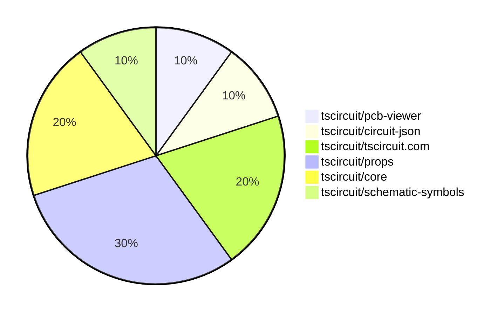

# Contribution Overview 2025-05-28

## PRs by Repository

## Contributor Overview

| Contributor | 🐳 Major | 🐙 Minor | 🐌 Tiny | ⭐ | Issues Created | Discussion Contributions |
|-------------|---------|---------|---------|-----|----------------|--------------------------|
| [seveibar](#seveibar) | 0 | 4 | 0 | ⭐⭐ | 2 | 0🔹 0🔶 0💎 |
| [techmannih](#techmannih) | 0 | 1 | 1 |  | 0 | 0🔹 0🔶 0💎 |
| [imrishabh18](#imrishabh18) | 0 | 1 | 0 |  | 0 | 0🔹 0🔶 0💎 |
| [ShiboSoftwareDev](#ShiboSoftwareDev) | 0 | 1 | 0 |  | 0 | 0🔹 0🔶 0💎 |
| [Abse2001](#Abse2001) | 0 | 1 | 0 |  | 0 | 0🔹 0🔶 0💎 |
| [ArnavK-09](#ArnavK-09) | 0 | 1 | 0 |  | 0 | 0🔹 0🔶 0💎 |

### Discussion Contribution Legend

- 🔹 Normal Comments: Basic participation with minimal effort
- 🔶 Great Informative Comments: Thoughtful participation that adds value
- 💎 Incredible Comments: Exceptional participation with high-quality content

## Review Table

[reviews-received-hover]: ## "Number of reviews received for PRs for this contributor"
[approvals-received-hover]: ## "Number of approvals received for PRs this contributor authored"
[rejections-received-hover]: ## "Number of rejections received for PRs this contributor authored"
[prs-opened-hover]: ## "Number of PRs opened by this contributor"
[issues-created-hover]: ## "Number of issues created by this contributor"
[bountied-issues-hover]: ## "Number of issues this contributor created with a bounty"
[bountied-issue-$-hover]: ## "Total bounty amount placed on issues authored by this contributor"

| Contributor | Reviews Received | Approvals Received | Rejections Received | Approvals | Rejections | PRs Opened | PRs Merged | Issues Created | Bountied Issues | Bountied Issue $ |
|---|---|---|---|---|---|---|---|---|---|---|
| [ShiboSoftwareDev](#ShiboSoftwareDev) | 1 | 1 | 0 | 0 | 0 | 2 | 1 | 0 | 0 | 0 |
| [seveibar](#seveibar) | 3 | 0 | 0 | 5 | 2 | 8 | 4 | 2 | 0 | 0 |
| [techmannih](#techmannih) | 7 | 4 | 1 | 0 | 0 | 4 | 2 | 0 | 0 | 0 |
| [Anshgrover23](#Anshgrover23) | 1 | 0 | 1 | 2 | 0 | 1 | 0 | 0 | 0 | 0 |
| [graphite-app[bot]](#graphite-app[bot]) | 0 | 0 | 0 | 0 | 0 | 0 | 0 | 0 | 0 | 0 |
| [imrishabh18](#imrishabh18) | 1 | 0 | 0 | 1 | 0 | 2 | 1 | 0 | 0 | 0 |
| [Abse2001](#Abse2001) | 1 | 1 | 0 | 0 | 0 | 1 | 1 | 0 | 0 | 0 |
| [ArnavK-09](#ArnavK-09) | 3 | 2 | 0 | 0 | 0 | 1 | 1 | 0 | 0 | 0 |
| [tscircuitbot](#tscircuitbot) | 0 | 0 | 0 | 0 | 0 | 4 | 0 | 0 | 0 | 0 |

## Changes by Repository

### [tscircuit/pcb-viewer](https://github.com/tscircuit/pcb-viewer)

| PR # | Impact | Contributor | Description | Milestone Aligned |
|------|--------|-------------|-------------|-------------------|
| [#297](https://github.com/tscircuit/pcb-viewer/pull/297) | 🐙 Minor | ShiboSoftwareDev | This pull request introduces support for nine-point anchor alignment for silkscreen texts in the PCB viewer. It enhances the text rendering capabilities by allowing more precise positioning of silkscreen text on printed circuit boards. The changes include updates to the text alignment logic and adjustments to the drawing functions to accommodate the new alignment options. Additionally, it aligns font sizes with the circuit-to-svg specifications, ensuring consistency in text rendering across different components. | ❌ |

### [tscircuit/circuit-json](https://github.com/tscircuit/circuit-json)

| PR # | Impact | Contributor | Description | Milestone Aligned |
|------|--------|-------------|-------------|-------------------|
| [#200](https://github.com/tscircuit/circuit-json/pull/200) | 🐙 Minor | techmannih | This pull request adds support for a new component called 'simple_fuse' to the circuit JSON library. It includes the definition of the component with its properties, such as current and voltage ratings, and integrates it into the existing component structure. | ❌ |

### [tscircuit/tscircuit.com](https://github.com/tscircuit/tscircuit.com)

| PR # | Impact | Contributor | Description | Milestone Aligned |
|------|--------|-------------|-------------|-------------------|
| [#1170](https://github.com/tscircuit/tscircuit.com/pull/1170) | 🐙 Minor | ArnavK-09 | This pull request introduces a feature that restricts access to private packages based on the user's session. If a package is marked as private and the authenticated user is not the owner of the package, a 404 error is returned, indicating that the package is not found. This change enhances security by ensuring that only authorized users can access private packages. | ✅ |
| [#1162](https://github.com/tscircuit/tscircuit.com/pull/1162) | 🐌 Tiny | techmannih | This pull request applies consistent capitalization to user-facing strings in the application, specifically changing 'Log in' to 'Log In' and 'Sign out' to 'Sign Out'. Additionally, it updates a message in the dashboard to refer to 'packages' instead of 'snippets'. | ❌ |

### [tscircuit/props](https://github.com/tscircuit/props)

| PR # | Impact | Contributor | Description | Milestone Aligned |
|------|--------|-------------|-------------|-------------------|
| [#243](https://github.com/tscircuit/props/pull/243) | 🐙 Minor | seveibar | This PR extends the `PlatformConfig` interface by adding an optional `footprintLibraryMap` property, which is a record structure. It also updates the Zod schema for platform configuration to include this new property. The changes aim to enhance the platform configuration capabilities. | ✅ |
| [#242](https://github.com/tscircuit/props/pull/242) | 🐙 Minor | seveibar | This pull request introduces a new `<connector />` component to the project. It includes the following changes: a new component is added, documentation is updated in the README and generated docs, the connector is exported from the public index, tests for the connector props are added, the prop `type` is renamed to `standard`, and the `pinCount` prop is removed from the connector. | ❌ |
| [#241](https://github.com/tscircuit/props/pull/241) | 🐙 Minor | imrishabh18 | This pull request adds a new property `schPinArrangement` to the `PinHeaderProps` interface, which allows for specifying the pin arrangement in schematic view. This enhancement is aimed at improving the flexibility and functionality of the PinHeader component in the context of schematic representations. | ✅ |

### [tscircuit/core](https://github.com/tscircuit/core)

| PR # | Impact | Contributor | Description | Milestone Aligned |
|------|--------|-------------|-------------|-------------------|
| [#834](https://github.com/tscircuit/core/pull/834) | 🐙 Minor | seveibar | This pull request updates the default behavior of the <jumper/> component to create a single-sided schematic box. It also includes updates to snapshots to reflect the new rendering of the jumper schematic. | ✅ |
| [#831](https://github.com/tscircuit/core/pull/831) | 🐙 Minor | seveibar | This pull request adds support for the `SHLD` net selector in the codebase. It allows the use of `sel.net.SHLD` and `sel.U1.SHLD`, and includes tests to verify the functionality of these new selectors. | ✅ |

### [tscircuit/schematic-symbols](https://github.com/tscircuit/schematic-symbols)

| PR # | Impact | Contributor | Description | Milestone Aligned |
|------|--------|-------------|-------------|-------------------|
| [#284](https://github.com/tscircuit/schematic-symbols/pull/284) | 🐙 Minor | Abse2001 | This pull request introduces a new VCC symbol to the schematic symbols repository. It adds a JSON representation of the VCC symbol and updates the TypeScript files to include this new symbol in the base symbol names and symbols index. The PR also creates multiple variations of the VCC symbol for different orientations (up, down, left, right). | ❌ |

## Changes by Contributor

### [ShiboSoftwareDev](https://github.com/ShiboSoftwareDev)

| PR # | Impact | Description | Milestone Aligned |
|------|--------|-------------|-------------------|
| [#297](https://github.com/tscircuit/pcb-viewer/pull/297) | 🐙 Minor | This pull request introduces support for nine-point anchor alignment for silkscreen texts in the PCB viewer. It enhances the text rendering capabilities by allowing more precise positioning of silkscreen text on printed circuit boards. The changes include updates to the text alignment logic and adjustments to the drawing functions to accommodate the new alignment options. Additionally, it aligns font sizes with the circuit-to-svg specifications, ensuring consistency in text rendering across different components. | ❌ |

### [techmannih](https://github.com/techmannih)

| PR # | Impact | Description | Milestone Aligned |
|------|--------|-------------|-------------------|
| [#200](https://github.com/tscircuit/circuit-json/pull/200) | 🐙 Minor | This pull request adds support for a new component called 'simple_fuse' to the circuit JSON library. It includes the definition of the component with its properties, such as current and voltage ratings, and integrates it into the existing component structure. | ❌ |
| [#1162](https://github.com/tscircuit/tscircuit.com/pull/1162) | 🐌 Tiny | This pull request applies consistent capitalization to user-facing strings in the application, specifically changing 'Log in' to 'Log In' and 'Sign out' to 'Sign Out'. Additionally, it updates a message in the dashboard to refer to 'packages' instead of 'snippets'. | ❌ |

### [seveibar](https://github.com/seveibar)

| PR # | Impact | Description | Milestone Aligned |
|------|--------|-------------|-------------------|
| [#243](https://github.com/tscircuit/props/pull/243) | 🐙 Minor | This PR extends the `PlatformConfig` interface by adding an optional `footprintLibraryMap` property, which is a record structure. It also updates the Zod schema for platform configuration to include this new property. The changes aim to enhance the platform configuration capabilities. | ✅ |
| [#242](https://github.com/tscircuit/props/pull/242) | 🐙 Minor | This pull request introduces a new `<connector />` component to the project. It includes the following changes: a new component is added, documentation is updated in the README and generated docs, the connector is exported from the public index, tests for the connector props are added, the prop `type` is renamed to `standard`, and the `pinCount` prop is removed from the connector. | ❌ |
| [#834](https://github.com/tscircuit/core/pull/834) | 🐙 Minor | This pull request updates the default behavior of the <jumper/> component to create a single-sided schematic box. It also includes updates to snapshots to reflect the new rendering of the jumper schematic. | ✅ |
| [#831](https://github.com/tscircuit/core/pull/831) | 🐙 Minor | This pull request adds support for the `SHLD` net selector in the codebase. It allows the use of `sel.net.SHLD` and `sel.U1.SHLD`, and includes tests to verify the functionality of these new selectors. | ✅ |

### [imrishabh18](https://github.com/imrishabh18)

| PR # | Impact | Description | Milestone Aligned |
|------|--------|-------------|-------------------|
| [#241](https://github.com/tscircuit/props/pull/241) | 🐙 Minor | This pull request adds a new property `schPinArrangement` to the `PinHeaderProps` interface, which allows for specifying the pin arrangement in schematic view. This enhancement is aimed at improving the flexibility and functionality of the PinHeader component in the context of schematic representations. | ✅ |

### [Abse2001](https://github.com/Abse2001)

| PR # | Impact | Description | Milestone Aligned |
|------|--------|-------------|-------------------|
| [#284](https://github.com/tscircuit/schematic-symbols/pull/284) | 🐙 Minor | This pull request introduces a new VCC symbol to the schematic symbols repository. It adds a JSON representation of the VCC symbol and updates the TypeScript files to include this new symbol in the base symbol names and symbols index. The PR also creates multiple variations of the VCC symbol for different orientations (up, down, left, right). | ❌ |

### [ArnavK-09](https://github.com/ArnavK-09)

| PR # | Impact | Description | Milestone Aligned |
|------|--------|-------------|-------------------|
| [#1170](https://github.com/tscircuit/tscircuit.com/pull/1170) | 🐙 Minor | This pull request introduces a feature that restricts access to private packages based on the user's session. If a package is marked as private and the authenticated user is not the owner of the package, a 404 error is returned, indicating that the package is not found. This change enhances security by ensuring that only authorized users can access private packages. | ✅ |

