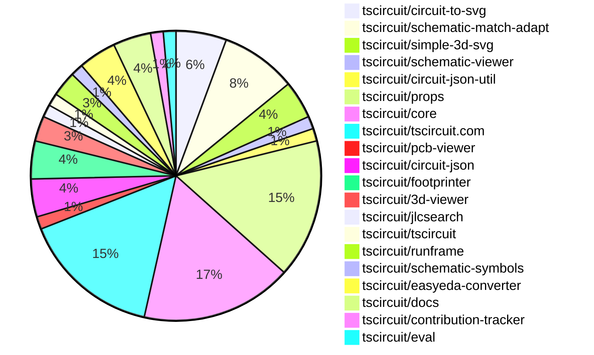

# Contribution Overview 2025-05-28

## PRs by Repository

## Contributor Overview

| Contributor | 🐳 Major | 🐙 Minor | 🐌 Tiny | ⭐ | Issues Created | Discussion Contributions |
|-------------|---------|---------|---------|-----|----------------|--------------------------|
| [seveibar](#seveibar) | 3 | 21 | 1 | 👑 | 14 | 0🔹 0🔶 0💎 |
| [ShiboSoftwareDev](#ShiboSoftwareDev) | 0 | 11 | 1 | ⭐⭐ | 5 | 0🔹 0🔶 0💎 |
| [Anshgrover23](#Anshgrover23) | 0 | 7 | 0 | ⭐⭐ | 3 | 0🔹 0🔶 0💎 |
| [imrishabh18](#imrishabh18) | 0 | 5 | 1 | ⭐⭐ | 9 | 0🔹 0🔶 0💎 |
| [ArnavK-09](#ArnavK-09) | 1 | 5 | 0 | ⭐⭐ | 6 | 0🔹 0🔶 0💎 |
| [techmannih](#techmannih) | 0 | 3 | 5 | ⭐⭐ | 4 | 3🔹 0🔶 0💎 |
| [Abse2001](#Abse2001) | 0 | 4 | 0 | ⭐ | 3 | 0🔹 0🔶 0💎 |
| [andrii-balitskyi](#andrii-balitskyi) | 0 | 2 | 0 | ⭐ | 0 | 0🔹 0🔶 0💎 |
| [tscircuitbot](#tscircuitbot) | 0 | 0 | 1 |  | 0 | 0🔹 0🔶 0💎 |

### Discussion Contribution Legend

- 🔹 Normal Comments: Basic participation with minimal effort
- 🔶 Great Informative Comments: Thoughtful participation that adds value
- 💎 Incredible Comments: Exceptional participation with high-quality content

## Review Table

[reviews-received-hover]: ## "Number of reviews received for PRs for this contributor"
[approvals-received-hover]: ## "Number of approvals received for PRs this contributor authored"
[rejections-received-hover]: ## "Number of rejections received for PRs this contributor authored"
[prs-opened-hover]: ## "Number of PRs opened by this contributor"
[issues-created-hover]: ## "Number of issues created by this contributor"
[bountied-issues-hover]: ## "Number of issues this contributor created with a bounty"
[bountied-issue-$-hover]: ## "Total bounty amount placed on issues authored by this contributor"

| Contributor | Reviews Received | Approvals Received | Rejections Received | Approvals | Rejections | PRs Opened | PRs Merged | Issues Created | Bountied Issues | Bountied Issue $ |
|---|---|---|---|---|---|---|---|---|---|---|
| [seveibar](#seveibar) | 6 | 0 | 0 | 41 | 8 | 38 | 25 | 14 | 2 | 35 |
| [ShiboSoftwareDev](#ShiboSoftwareDev) | 19 | 14 | 1 | 0 | 0 | 14 | 12 | 5 | 2 | 33 |
| [imrishabh18](#imrishabh18) | 6 | 3 | 0 | 6 | 2 | 6 | 6 | 9 | 1 | 5 |
| [graphite-app[bot]](#graphite-app[bot]) | 0 | 0 | 0 | 0 | 0 | 0 | 0 | 0 | 0 | 0 |
| [techmannih](#techmannih) | 20 | 13 | 2 | 0 | 2 | 16 | 8 | 4 | 0 | 0 |
| [Anshgrover23](#Anshgrover23) | 12 | 8 | 1 | 4 | 2 | 9 | 7 | 3 | 0 | 0 |
| [Abse2001](#Abse2001) | 7 | 4 | 1 | 1 | 0 | 8 | 4 | 3 | 0 | 0 |
| [Apocalypse96](#Apocalypse96) | 7 | 0 | 6 | 0 | 0 | 3 | 0 | 0 | 0 | 0 |
| [ArnavK-09](#ArnavK-09) | 29 | 8 | 3 | 0 | 0 | 11 | 6 | 6 | 1 | 10 |
| [andrii-balitskyi](#andrii-balitskyi) | 4 | 2 | 0 | 0 | 0 | 2 | 2 | 0 | 0 | 0 |
| [tscircuitbot](#tscircuitbot) | 0 | 0 | 0 | 0 | 0 | 23 | 1 | 0 | 0 | 0 |

## Changes by Repository

### [tscircuit/circuit-to-svg](https://github.com/tscircuit/circuit-to-svg)

| PR # | Impact | Contributor | Description | Milestone Aligned |
|------|--------|-------------|-------------|-------------------|
| [#226](https://github.com/tscircuit/circuit-to-svg/pull/226) | 🐳 Major | seveibar | Enhancements to PCB rendering with improved context management and layer support significantly streamline the rendering process. | ✅ |
| [#228](https://github.com/tscircuit/circuit-to-svg/pull/228) | 🐙 Minor | seveibar | Enhancing the SVG generation process by allowing aspect ratio adjustments based on PCB board dimensions adds significant value to the usability of the tool. | ❌ |
| [#223](https://github.com/tscircuit/circuit-to-svg/pull/223) | 🐙 Minor | ShiboSoftwareDev | Enhancing the clarity of silkscreen text on larger boards significantly improves the visual quality and usability of the PCB designs. | ❌ |
| [#230](https://github.com/tscircuit/circuit-to-svg/pull/230) | 🐌 Tiny | techmannih | Updating the schematic-symbols dependency enhances the project's compatibility and potentially improves functionality. | ❌ |

### [tscircuit/schematic-match-adapt](https://github.com/tscircuit/schematic-match-adapt)

| PR # | Impact | Contributor | Description | Milestone Aligned |
|------|--------|-------------|-------------|-------------------|
| [#20](https://github.com/tscircuit/schematic-match-adapt/pull/20) | 🐳 Major | seveibar | Significant enhancements to adaptation capabilities, including pathfinding and pin margin support, which are crucial for improving circuit design accuracy. | ✅ |
| [#21](https://github.com/tscircuit/schematic-match-adapt/pull/21) | 🐙 Minor | seveibar | Enhancements to the circuit layout output format significantly improve integration with the core library. | ❌ |
| [#19](https://github.com/tscircuit/schematic-match-adapt/pull/19) | 🐙 Minor | seveibar | Introduces a new template for circuit design, enhancing the library's functionality. | ❌ |
| [#18](https://github.com/tscircuit/schematic-match-adapt/pull/18) | 🐙 Minor | seveibar | Enhances the schematic-match-adapt project by introducing a new template and a force-directed graph visualization for netlists, improving usability and functionality. | ❌ |
| [#17](https://github.com/tscircuit/schematic-match-adapt/pull/17) | 🐙 Minor | seveibar | Enhancements to template handling and adaptation logic improve the overall functionality of the schematic matching process. | ✅ |
| [#16](https://github.com/tscircuit/schematic-match-adapt/pull/16) | 🐙 Minor | seveibar | Enhancements to the adaptation process and visualization of circuit layouts significantly improve the functionality and usability of the tool. | ✅ |

### [tscircuit/simple-3d-svg](https://github.com/tscircuit/simple-3d-svg)

| PR # | Impact | Contributor | Description | Milestone Aligned |
|------|--------|-------------|-------------|-------------------|
| [#9](https://github.com/tscircuit/simple-3d-svg/pull/9) | 🐳 Major | seveibar | Adding STL support enhances the library's capabilities for 3D rendering, making it more versatile for users. | ✅ |
| [#6](https://github.com/tscircuit/simple-3d-svg/pull/6) | 🐙 Minor | seveibar | Enhancing the rendering capabilities by adding support for perspective-correct top face images significantly improves the visual fidelity of 3D SVG boxes. | ❌ |
| [#5](https://github.com/tscircuit/simple-3d-svg/pull/5) | 🐙 Minor | seveibar | Enhancing the rendering capabilities by adding support for top face images significantly improves the visual representation of 3D boxes. | ✅ |

### [tscircuit/schematic-viewer](https://github.com/tscircuit/schematic-viewer)

| PR # | Impact | Contributor | Description | Milestone Aligned |
|------|--------|-------------|-------------|-------------------|
| [#96](https://github.com/tscircuit/schematic-viewer/pull/96) | 🐙 Minor | seveibar | Enhances the user experience by ensuring the schematic viewer's background color matches the SVG background during panning. | ✅ |

### [tscircuit/circuit-json-util](https://github.com/tscircuit/circuit-json-util)

| PR # | Impact | Contributor | Description | Milestone Aligned |
|------|--------|-------------|-------------|-------------------|
| [#33](https://github.com/tscircuit/circuit-json-util/pull/33) | 🐙 Minor | seveibar | Enhancements to subtree filtering capabilities significantly improve the utility's functionality for managing circuit elements. | ✅ |

### [tscircuit/props](https://github.com/tscircuit/props)

| PR # | Impact | Contributor | Description | Milestone Aligned |
|------|--------|-------------|-------------|-------------------|
| [#246](https://github.com/tscircuit/props/pull/246) | 🐙 Minor | seveibar | Enhancements to platform configuration allow for greater flexibility in enabling or disabling specific engines. | ✅ |
| [#252](https://github.com/tscircuit/props/pull/252) | 🐙 Minor | seveibar | Enhancement of layout configuration by introducing a new 'match-adapt' mode, improving flexibility in layout options. | ✅ |
| [#245](https://github.com/tscircuit/props/pull/245) | 🐙 Minor | seveibar | Enhancements to the footprint library map and the introduction of a local cache engine improve the flexibility and performance of the platform configuration. | ✅ |
| [#243](https://github.com/tscircuit/props/pull/243) | 🐙 Minor | seveibar | Enhancing the platform configuration with a new optional mapping feature adds flexibility for future developments. | ✅ |
| [#242](https://github.com/tscircuit/props/pull/242) | 🐙 Minor | seveibar | The addition of a new `<connector />` component enhances the library's functionality for building keyboards, aligning with the project's goals. | ✅ |
| [#253](https://github.com/tscircuit/props/pull/253) | 🐙 Minor | ShiboSoftwareDev | Enhancements to silkscreen rectangle properties improve customization for keyboard design. | ✅ |
| [#241](https://github.com/tscircuit/props/pull/241) | 🐙 Minor | imrishabh18 | Enhancement of the PinHeader component by introducing a new property for schematic pin arrangement, improving its configurability. | ✅ |
| [#251](https://github.com/tscircuit/props/pull/251) | 🐙 Minor | Abse2001 | Enhancements to the SchematicBoxProps validation ensure that either both width and height are provided or a non-empty overlay array, improving component robustness. | ❌ |
| [#248](https://github.com/tscircuit/props/pull/248) | 🐙 Minor | Abse2001 | Enhancements to the schematicBox properties provide greater flexibility and customization options for users. | ❌ |
| [#247](https://github.com/tscircuit/props/pull/247) | 🐙 Minor | Abse2001 | Enhancements to padding properties improve layout flexibility for schematic boxes. | ✅ |
| [#250](https://github.com/tscircuit/props/pull/250) | 🐌 Tiny | seveibar | Enhancements to documentation for platform configuration improve usability and understanding for developers. | ❌ |

### [tscircuit/core](https://github.com/tscircuit/core)

| PR # | Impact | Contributor | Description | Milestone Aligned |
|------|--------|-------------|-------------|-------------------|
| [#855](https://github.com/tscircuit/core/pull/855) | 🐙 Minor | seveibar | Enhancing the rendering process by enabling footprint loading from URLs significantly improves flexibility and usability. | ✅ |
| [#839](https://github.com/tscircuit/core/pull/839) | 🐙 Minor | seveibar | Enhancements to the parts engine with local caching improve performance and efficiency in component queries. | ✅ |
| [#838](https://github.com/tscircuit/core/pull/838) | 🐙 Minor | seveibar | Enhancements to jumper support with custom pin functionality improve flexibility in keyboard building. | ✅ |
| [#834](https://github.com/tscircuit/core/pull/834) | 🐙 Minor | seveibar | Enhancements to the jumper component improve schematic rendering, aligning with keyboard building tools. | ✅ |
| [#831](https://github.com/tscircuit/core/pull/831) | 🐙 Minor | seveibar | Enhancement of the selector functionality by introducing the SHLD net, improving the flexibility of the library. | ✅ |
| [#857](https://github.com/tscircuit/core/pull/857) | 🐙 Minor | ShiboSoftwareDev | Enhancements to pinrow text alignment options improve usability and flexibility in circuit design. | ✅ |
| [#852](https://github.com/tscircuit/core/pull/852) | 🐙 Minor | ShiboSoftwareDev | Enhancements to component creation logic and dependency updates improve functionality and maintainability. | ✅ |
| [#851](https://github.com/tscircuit/core/pull/851) | 🐙 Minor | imrishabh18 | Addresses a timeout issue by ensuring that a 'Not found' response is handled gracefully, improving reliability. | ✅ |
| [#835](https://github.com/tscircuit/core/pull/835) | 🐙 Minor | imrishabh18 | Enhancements to the PinHeader component improve its configurability for schematic designs. | ✅ |
| [#848](https://github.com/tscircuit/core/pull/848) | 🐙 Minor | techmannih | The addition of the Fuse component enhances the library's functionality for building electrical circuits, aligning with the goal of creating comprehensive tools for keyboard building. | ✅ |
| [#845](https://github.com/tscircuit/core/pull/845) | 🐙 Minor | techmannih | Enhancements to LED component functionality by adding support for simple LED specifications. | ❌ |
| [#844](https://github.com/tscircuit/core/pull/844) | 🐙 Minor | Anshgrover23 | Enhancing the utility of the library by exporting a new function for pin label normalization. | ✅ |

### [tscircuit/tscircuit.com](https://github.com/tscircuit/tscircuit.com)

| PR # | Impact | Contributor | Description | Milestone Aligned |
|------|--------|-------------|-------------|-------------------|
| [#1149](https://github.com/tscircuit/tscircuit.com/pull/1149) | 🐳 Major | ArnavK-09 | Significantly enhances the editor's functionality by introducing a fully refactored package-based system with file management features, including file deletion and improved state management. | ✅ |
| [#1179](https://github.com/tscircuit/tscircuit.com/pull/1179) | 🐙 Minor | seveibar | The change enhances user navigation by linking the Online Example button to a relevant resource, improving the overall user experience. | ❌ |
| [#1180](https://github.com/tscircuit/tscircuit.com/pull/1180) | 🐙 Minor | imrishabh18 | Enhances account retrieval functionality by allowing access via GitHub usernames, improving user experience. | ❌ |
| [#1186](https://github.com/tscircuit/tscircuit.com/pull/1186) | 🐙 Minor | ArnavK-09 | Enhancements to link presentation and accessibility improve user experience and interface clarity. | ✅ |
| [#1185](https://github.com/tscircuit/tscircuit.com/pull/1185) | 🐙 Minor | ArnavK-09 | Enhancing user interaction by updating the decoration class to include a cursor pointer improves the overall usability of the CodeEditor component. | ✅ |
| [#1178](https://github.com/tscircuit/tscircuit.com/pull/1178) | 🐙 Minor | ArnavK-09 | Enhancing button responsiveness and layout significantly improves the mobile user experience on the landing page. | ❌ |
| [#1170](https://github.com/tscircuit/tscircuit.com/pull/1170) | 🐙 Minor | ArnavK-09 | Enhancing security by restricting access to private packages based on user session validation. | ❌ |
| [#1175](https://github.com/tscircuit/tscircuit.com/pull/1175) | 🐙 Minor | andrii-balitskyi | Enhances server-side rendering by injecting package data into the HTML before the initial render, improving performance and user experience. | ✅ |
| [#1184](https://github.com/tscircuit/tscircuit.com/pull/1184) | 🐌 Tiny | techmannih | Updating dependencies enhances the stability and performance of the project, ensuring compatibility with the latest features and fixes. | ❌ |
| [#1181](https://github.com/tscircuit/tscircuit.com/pull/1181) | 🐌 Tiny | techmannih | Updating dependencies enhances the stability and security of the project, ensuring compatibility with the latest features and fixes. | ❌ |
| [#1162](https://github.com/tscircuit/tscircuit.com/pull/1162) | 🐌 Tiny | techmannih | Enhancing user interface consistency through capitalization adjustments improves readability and user experience. | ❌ |

### [tscircuit/pcb-viewer](https://github.com/tscircuit/pcb-viewer)

| PR # | Impact | Contributor | Description | Milestone Aligned |
|------|--------|-------------|-------------|-------------------|
| [#297](https://github.com/tscircuit/pcb-viewer/pull/297) | 🐙 Minor | ShiboSoftwareDev | Enhancements to text alignment functionality for silkscreen texts improve usability and flexibility in PCB design. | ❌ |

### [tscircuit/circuit-json](https://github.com/tscircuit/circuit-json)

| PR # | Impact | Contributor | Description | Milestone Aligned |
|------|--------|-------------|-------------|-------------------|
| [#207](https://github.com/tscircuit/circuit-json/pull/207) | 🐙 Minor | ShiboSoftwareDev | Refactoring of properties enhances clarity and usability for defining PCB silkscreen rectangles. | ✅ |
| [#206](https://github.com/tscircuit/circuit-json/pull/206) | 🐙 Minor | ShiboSoftwareDev | Adding a filled boolean property enhances the flexibility of the PCB silkscreen rectangle definition, allowing for more detailed design specifications. | ✅ |
| [#200](https://github.com/tscircuit/circuit-json/pull/200) | 🐙 Minor | techmannih | Introducing a new component for simple fuses enhances the library's capability to model electrical circuits more accurately. | ❌ |

### [tscircuit/footprinter](https://github.com/tscircuit/footprinter)

| PR # | Impact | Contributor | Description | Milestone Aligned |
|------|--------|-------------|-------------|-------------------|
| [#284](https://github.com/tscircuit/footprinter/pull/284) | 🐙 Minor | ShiboSoftwareDev | Enhancements to pin label alignment logic improve the usability of the keyboard building tools. | ✅ |
| [#283](https://github.com/tscircuit/footprinter/pull/283) | 🐙 Minor | ShiboSoftwareDev | Enhancements to pinlabel orientation options improve flexibility in design configurations. | ✅ |
| [#282](https://github.com/tscircuit/footprinter/pull/282) | 🐙 Minor | ShiboSoftwareDev | Enhancements to the pinrow functionality improve flexibility in pin label positioning and alignment. | ✅ |

### [tscircuit/3d-viewer](https://github.com/tscircuit/3d-viewer)

| PR # | Impact | Contributor | Description | Milestone Aligned |
|------|--------|-------------|-------------|-------------------|
| [#302](https://github.com/tscircuit/3d-viewer/pull/302) | 🐙 Minor | ShiboSoftwareDev | Enhancements to silkscreen text alignment improve usability for PCB design. | ✅ |
| [#304](https://github.com/tscircuit/3d-viewer/pull/304) | 🐌 Tiny | ShiboSoftwareDev | Enhancements to the jscad-electronics library improve component footprint handling, contributing to better circuit design capabilities. | ❌ |

### [tscircuit/jlcsearch](https://github.com/tscircuit/jlcsearch)

| PR # | Impact | Contributor | Description | Milestone Aligned |
|------|--------|-------------|-------------|-------------------|
| [#54](https://github.com/tscircuit/jlcsearch/pull/54) | 🐙 Minor | imrishabh18 | Introduces a fallback route for handling unmatched categories, enhancing error handling and user experience. | ❌ |

### [tscircuit/tscircuit](https://github.com/tscircuit/tscircuit)

| PR # | Impact | Contributor | Description | Milestone Aligned |
|------|--------|-------------|-------------|-------------------|
| [#661](https://github.com/tscircuit/tscircuit/pull/661) | 🐌 Tiny | imrishabh18 | Updating dependencies ensures the project remains up-to-date with the latest features and fixes, contributing to overall stability and performance. | ❌ |

### [tscircuit/runframe](https://github.com/tscircuit/runframe)

| PR # | Impact | Contributor | Description | Milestone Aligned |
|------|--------|-------------|-------------|-------------------|
| [#667](https://github.com/tscircuit/runframe/pull/667) | 🐙 Minor | andrii-balitskyi | Enhancements to prevent execution hangs during circuit compilation, improving user experience and resource management. | ✅ |
| [#672](https://github.com/tscircuit/runframe/pull/672) | 🐌 Tiny | techmannih | Updating dependencies enhances the stability and performance of the project, ensuring compatibility with the latest features and fixes. | ❌ |

### [tscircuit/schematic-symbols](https://github.com/tscircuit/schematic-symbols)

| PR # | Impact | Contributor | Description | Milestone Aligned |
|------|--------|-------------|-------------|-------------------|
| [#284](https://github.com/tscircuit/schematic-symbols/pull/284) | 🐙 Minor | Abse2001 | The addition of the VCC symbol enhances the library's functionality for keyboard building. | ✅ |

### [tscircuit/easyeda-converter](https://github.com/tscircuit/easyeda-converter)

| PR # | Impact | Contributor | Description | Milestone Aligned |
|------|--------|-------------|-------------|-------------------|
| [#205](https://github.com/tscircuit/easyeda-converter/pull/205) | 🐙 Minor | Anshgrover23 | Refactoring to enhance code maintainability by centralizing the normalize function. | ❌ |
| [#204](https://github.com/tscircuit/easyeda-converter/pull/204) | 🐙 Minor | Anshgrover23 | Enhancements to the library by adding missing components and tests for better functionality. | ✅ |
| [#202](https://github.com/tscircuit/easyeda-converter/pull/202) | 🐙 Minor | Anshgrover23 | Enhancements to the EasyEDA converter by adding support for a new component, improving functionality and usability. | ❌ |

### [tscircuit/docs](https://github.com/tscircuit/docs)

| PR # | Impact | Contributor | Description | Milestone Aligned |
|------|--------|-------------|-------------|-------------------|
| [#65](https://github.com/tscircuit/docs/pull/65) | 🐙 Minor | Anshgrover23 | Enhancing documentation by replacing iframe elements with a dedicated YouTubeEmbed component improves maintainability and consistency. | ❌ |
| [#66](https://github.com/tscircuit/docs/pull/66) | 🐙 Minor | Anshgrover23 | Enhancements to CI/CD workflows significantly improve the development process. | ✅ |
| [#64](https://github.com/tscircuit/docs/pull/64) | 🐙 Minor | Anshgrover23 | Enhances documentation by providing clear instructions and a video tutorial for importing JLCPCB components, improving user experience. | ✅ |

### [tscircuit/contribution-tracker](https://github.com/tscircuit/contribution-tracker)

| PR # | Impact | Contributor | Description | Milestone Aligned |
|------|--------|-------------|-------------|-------------------|
| [#166](https://github.com/tscircuit/contribution-tracker/pull/166) | 🐙 Minor | ArnavK-09 | Refactoring the analysis structure and enhancing classification criteria improves clarity and strictness in evaluating contributions. | ❌ |

### [tscircuit/eval](https://github.com/tscircuit/eval)

| PR # | Impact | Contributor | Description | Milestone Aligned |
|------|--------|-------------|-------------|-------------------|
| [#400](https://github.com/tscircuit/eval/pull/400) | 🐌 Tiny | tscircuitbot | Updating the core library version enhances compatibility and may introduce new features or fixes. | ✅ |

## Changes by Contributor

### [seveibar](https://github.com/seveibar)

| PR # | Impact | Description | Milestone Aligned |
|------|--------|-------------|-------------------|
| [#226](https://github.com/tscircuit/circuit-to-svg/pull/226) | 🐳 Major | Enhancements to PCB rendering with improved context management and layer support significantly streamline the rendering process. | ✅ |
| [#20](https://github.com/tscircuit/schematic-match-adapt/pull/20) | 🐳 Major | Significant enhancements to adaptation capabilities, including pathfinding and pin margin support, which are crucial for improving circuit design accuracy. | ✅ |
| [#9](https://github.com/tscircuit/simple-3d-svg/pull/9) | 🐳 Major | Adding STL support enhances the library's capabilities for 3D rendering, making it more versatile for users. | ✅ |
| [#96](https://github.com/tscircuit/schematic-viewer/pull/96) | 🐙 Minor | Enhances the user experience by ensuring the schematic viewer's background color matches the SVG background during panning. | ✅ |
| [#33](https://github.com/tscircuit/circuit-json-util/pull/33) | 🐙 Minor | Enhancements to subtree filtering capabilities significantly improve the utility's functionality for managing circuit elements. | ✅ |
| [#246](https://github.com/tscircuit/props/pull/246) | 🐙 Minor | Enhancements to platform configuration allow for greater flexibility in enabling or disabling specific engines. | ✅ |
| [#252](https://github.com/tscircuit/props/pull/252) | 🐙 Minor | Enhancement of layout configuration by introducing a new 'match-adapt' mode, improving flexibility in layout options. | ✅ |
| [#245](https://github.com/tscircuit/props/pull/245) | 🐙 Minor | Enhancements to the footprint library map and the introduction of a local cache engine improve the flexibility and performance of the platform configuration. | ✅ |
| [#243](https://github.com/tscircuit/props/pull/243) | 🐙 Minor | Enhancing the platform configuration with a new optional mapping feature adds flexibility for future developments. | ✅ |
| [#242](https://github.com/tscircuit/props/pull/242) | 🐙 Minor | The addition of a new `<connector />` component enhances the library's functionality for building keyboards, aligning with the project's goals. | ✅ |
| [#855](https://github.com/tscircuit/core/pull/855) | 🐙 Minor | Enhancing the rendering process by enabling footprint loading from URLs significantly improves flexibility and usability. | ✅ |
| [#839](https://github.com/tscircuit/core/pull/839) | 🐙 Minor | Enhancements to the parts engine with local caching improve performance and efficiency in component queries. | ✅ |
| [#838](https://github.com/tscircuit/core/pull/838) | 🐙 Minor | Enhancements to jumper support with custom pin functionality improve flexibility in keyboard building. | ✅ |
| [#834](https://github.com/tscircuit/core/pull/834) | 🐙 Minor | Enhancements to the jumper component improve schematic rendering, aligning with keyboard building tools. | ✅ |
| [#831](https://github.com/tscircuit/core/pull/831) | 🐙 Minor | Enhancement of the selector functionality by introducing the SHLD net, improving the flexibility of the library. | ✅ |
| [#228](https://github.com/tscircuit/circuit-to-svg/pull/228) | 🐙 Minor | Enhancing the SVG generation process by allowing aspect ratio adjustments based on PCB board dimensions adds significant value to the usability of the tool. | ❌ |
| [#1179](https://github.com/tscircuit/tscircuit.com/pull/1179) | 🐙 Minor | The change enhances user navigation by linking the Online Example button to a relevant resource, improving the overall user experience. | ❌ |
| [#21](https://github.com/tscircuit/schematic-match-adapt/pull/21) | 🐙 Minor | Enhancements to the circuit layout output format significantly improve integration with the core library. | ❌ |
| [#19](https://github.com/tscircuit/schematic-match-adapt/pull/19) | 🐙 Minor | Introduces a new template for circuit design, enhancing the library's functionality. | ❌ |
| [#18](https://github.com/tscircuit/schematic-match-adapt/pull/18) | 🐙 Minor | Enhances the schematic-match-adapt project by introducing a new template and a force-directed graph visualization for netlists, improving usability and functionality. | ❌ |
| [#17](https://github.com/tscircuit/schematic-match-adapt/pull/17) | 🐙 Minor | Enhancements to template handling and adaptation logic improve the overall functionality of the schematic matching process. | ✅ |
| [#16](https://github.com/tscircuit/schematic-match-adapt/pull/16) | 🐙 Minor | Enhancements to the adaptation process and visualization of circuit layouts significantly improve the functionality and usability of the tool. | ✅ |
| [#6](https://github.com/tscircuit/simple-3d-svg/pull/6) | 🐙 Minor | Enhancing the rendering capabilities by adding support for perspective-correct top face images significantly improves the visual fidelity of 3D SVG boxes. | ❌ |
| [#5](https://github.com/tscircuit/simple-3d-svg/pull/5) | 🐙 Minor | Enhancing the rendering capabilities by adding support for top face images significantly improves the visual representation of 3D boxes. | ✅ |
| [#250](https://github.com/tscircuit/props/pull/250) | 🐌 Tiny | Enhancements to documentation for platform configuration improve usability and understanding for developers. | ❌ |

### [ShiboSoftwareDev](https://github.com/ShiboSoftwareDev)

| PR # | Impact | Description | Milestone Aligned |
|------|--------|-------------|-------------------|
| [#297](https://github.com/tscircuit/pcb-viewer/pull/297) | 🐙 Minor | Enhancements to text alignment functionality for silkscreen texts improve usability and flexibility in PCB design. | ❌ |
| [#207](https://github.com/tscircuit/circuit-json/pull/207) | 🐙 Minor | Refactoring of properties enhances clarity and usability for defining PCB silkscreen rectangles. | ✅ |
| [#206](https://github.com/tscircuit/circuit-json/pull/206) | 🐙 Minor | Adding a filled boolean property enhances the flexibility of the PCB silkscreen rectangle definition, allowing for more detailed design specifications. | ✅ |
| [#253](https://github.com/tscircuit/props/pull/253) | 🐙 Minor | Enhancements to silkscreen rectangle properties improve customization for keyboard design. | ✅ |
| [#284](https://github.com/tscircuit/footprinter/pull/284) | 🐙 Minor | Enhancements to pin label alignment logic improve the usability of the keyboard building tools. | ✅ |
| [#283](https://github.com/tscircuit/footprinter/pull/283) | 🐙 Minor | Enhancements to pinlabel orientation options improve flexibility in design configurations. | ✅ |
| [#282](https://github.com/tscircuit/footprinter/pull/282) | 🐙 Minor | Enhancements to the pinrow functionality improve flexibility in pin label positioning and alignment. | ✅ |
| [#302](https://github.com/tscircuit/3d-viewer/pull/302) | 🐙 Minor | Enhancements to silkscreen text alignment improve usability for PCB design. | ✅ |
| [#857](https://github.com/tscircuit/core/pull/857) | 🐙 Minor | Enhancements to pinrow text alignment options improve usability and flexibility in circuit design. | ✅ |
| [#852](https://github.com/tscircuit/core/pull/852) | 🐙 Minor | Enhancements to component creation logic and dependency updates improve functionality and maintainability. | ✅ |
| [#223](https://github.com/tscircuit/circuit-to-svg/pull/223) | 🐙 Minor | Enhancing the clarity of silkscreen text on larger boards significantly improves the visual quality and usability of the PCB designs. | ❌ |
| [#304](https://github.com/tscircuit/3d-viewer/pull/304) | 🐌 Tiny | Enhancements to the jscad-electronics library improve component footprint handling, contributing to better circuit design capabilities. | ❌ |

### [imrishabh18](https://github.com/imrishabh18)

| PR # | Impact | Description | Milestone Aligned |
|------|--------|-------------|-------------------|
| [#241](https://github.com/tscircuit/props/pull/241) | 🐙 Minor | Enhancement of the PinHeader component by introducing a new property for schematic pin arrangement, improving its configurability. | ✅ |
| [#851](https://github.com/tscircuit/core/pull/851) | 🐙 Minor | Addresses a timeout issue by ensuring that a 'Not found' response is handled gracefully, improving reliability. | ✅ |
| [#835](https://github.com/tscircuit/core/pull/835) | 🐙 Minor | Enhancements to the PinHeader component improve its configurability for schematic designs. | ✅ |
| [#1180](https://github.com/tscircuit/tscircuit.com/pull/1180) | 🐙 Minor | Enhances account retrieval functionality by allowing access via GitHub usernames, improving user experience. | ❌ |
| [#54](https://github.com/tscircuit/jlcsearch/pull/54) | 🐙 Minor | Introduces a fallback route for handling unmatched categories, enhancing error handling and user experience. | ❌ |
| [#661](https://github.com/tscircuit/tscircuit/pull/661) | 🐌 Tiny | Updating dependencies ensures the project remains up-to-date with the latest features and fixes, contributing to overall stability and performance. | ❌ |

### [techmannih](https://github.com/techmannih)

| PR # | Impact | Description | Milestone Aligned |
|------|--------|-------------|-------------------|
| [#200](https://github.com/tscircuit/circuit-json/pull/200) | 🐙 Minor | Introducing a new component for simple fuses enhances the library's capability to model electrical circuits more accurately. | ❌ |
| [#848](https://github.com/tscircuit/core/pull/848) | 🐙 Minor | The addition of the Fuse component enhances the library's functionality for building electrical circuits, aligning with the goal of creating comprehensive tools for keyboard building. | ✅ |
| [#845](https://github.com/tscircuit/core/pull/845) | 🐙 Minor | Enhancements to LED component functionality by adding support for simple LED specifications. | ❌ |
| [#230](https://github.com/tscircuit/circuit-to-svg/pull/230) | 🐌 Tiny | Updating the schematic-symbols dependency enhances the project's compatibility and potentially improves functionality. | ❌ |
| [#1184](https://github.com/tscircuit/tscircuit.com/pull/1184) | 🐌 Tiny | Updating dependencies enhances the stability and performance of the project, ensuring compatibility with the latest features and fixes. | ❌ |
| [#1181](https://github.com/tscircuit/tscircuit.com/pull/1181) | 🐌 Tiny | Updating dependencies enhances the stability and security of the project, ensuring compatibility with the latest features and fixes. | ❌ |
| [#1162](https://github.com/tscircuit/tscircuit.com/pull/1162) | 🐌 Tiny | Enhancing user interface consistency through capitalization adjustments improves readability and user experience. | ❌ |
| [#672](https://github.com/tscircuit/runframe/pull/672) | 🐌 Tiny | Updating dependencies enhances the stability and performance of the project, ensuring compatibility with the latest features and fixes. | ❌ |

### [Abse2001](https://github.com/Abse2001)

| PR # | Impact | Description | Milestone Aligned |
|------|--------|-------------|-------------------|
| [#251](https://github.com/tscircuit/props/pull/251) | 🐙 Minor | Enhancements to the SchematicBoxProps validation ensure that either both width and height are provided or a non-empty overlay array, improving component robustness. | ❌ |
| [#248](https://github.com/tscircuit/props/pull/248) | 🐙 Minor | Enhancements to the schematicBox properties provide greater flexibility and customization options for users. | ❌ |
| [#247](https://github.com/tscircuit/props/pull/247) | 🐙 Minor | Enhancements to padding properties improve layout flexibility for schematic boxes. | ✅ |
| [#284](https://github.com/tscircuit/schematic-symbols/pull/284) | 🐙 Minor | The addition of the VCC symbol enhances the library's functionality for keyboard building. | ✅ |

### [Anshgrover23](https://github.com/Anshgrover23)

| PR # | Impact | Description | Milestone Aligned |
|------|--------|-------------|-------------------|
| [#205](https://github.com/tscircuit/easyeda-converter/pull/205) | 🐙 Minor | Refactoring to enhance code maintainability by centralizing the normalize function. | ❌ |
| [#204](https://github.com/tscircuit/easyeda-converter/pull/204) | 🐙 Minor | Enhancements to the library by adding missing components and tests for better functionality. | ✅ |
| [#202](https://github.com/tscircuit/easyeda-converter/pull/202) | 🐙 Minor | Enhancements to the EasyEDA converter by adding support for a new component, improving functionality and usability. | ❌ |
| [#844](https://github.com/tscircuit/core/pull/844) | 🐙 Minor | Enhancing the utility of the library by exporting a new function for pin label normalization. | ✅ |
| [#65](https://github.com/tscircuit/docs/pull/65) | 🐙 Minor | Enhancing documentation by replacing iframe elements with a dedicated YouTubeEmbed component improves maintainability and consistency. | ❌ |
| [#66](https://github.com/tscircuit/docs/pull/66) | 🐙 Minor | Enhancements to CI/CD workflows significantly improve the development process. | ✅ |
| [#64](https://github.com/tscircuit/docs/pull/64) | 🐙 Minor | Enhances documentation by providing clear instructions and a video tutorial for importing JLCPCB components, improving user experience. | ✅ |

### [ArnavK-09](https://github.com/ArnavK-09)

| PR # | Impact | Description | Milestone Aligned |
|------|--------|-------------|-------------------|
| [#1149](https://github.com/tscircuit/tscircuit.com/pull/1149) | 🐳 Major | Significantly enhances the editor's functionality by introducing a fully refactored package-based system with file management features, including file deletion and improved state management. | ✅ |
| [#166](https://github.com/tscircuit/contribution-tracker/pull/166) | 🐙 Minor | Refactoring the analysis structure and enhancing classification criteria improves clarity and strictness in evaluating contributions. | ❌ |
| [#1186](https://github.com/tscircuit/tscircuit.com/pull/1186) | 🐙 Minor | Enhancements to link presentation and accessibility improve user experience and interface clarity. | ✅ |
| [#1185](https://github.com/tscircuit/tscircuit.com/pull/1185) | 🐙 Minor | Enhancing user interaction by updating the decoration class to include a cursor pointer improves the overall usability of the CodeEditor component. | ✅ |
| [#1178](https://github.com/tscircuit/tscircuit.com/pull/1178) | 🐙 Minor | Enhancing button responsiveness and layout significantly improves the mobile user experience on the landing page. | ❌ |
| [#1170](https://github.com/tscircuit/tscircuit.com/pull/1170) | 🐙 Minor | Enhancing security by restricting access to private packages based on user session validation. | ❌ |

### [andrii-balitskyi](https://github.com/andrii-balitskyi)

| PR # | Impact | Description | Milestone Aligned |
|------|--------|-------------|-------------------|
| [#1175](https://github.com/tscircuit/tscircuit.com/pull/1175) | 🐙 Minor | Enhances server-side rendering by injecting package data into the HTML before the initial render, improving performance and user experience. | ✅ |
| [#667](https://github.com/tscircuit/runframe/pull/667) | 🐙 Minor | Enhancements to prevent execution hangs during circuit compilation, improving user experience and resource management. | ✅ |

### [tscircuitbot](https://github.com/tscircuitbot)

| PR # | Impact | Description | Milestone Aligned |
|------|--------|-------------|-------------------|
| [#400](https://github.com/tscircuit/eval/pull/400) | 🐌 Tiny | Updating the core library version enhances compatibility and may introduce new features or fixes. | ✅ |

