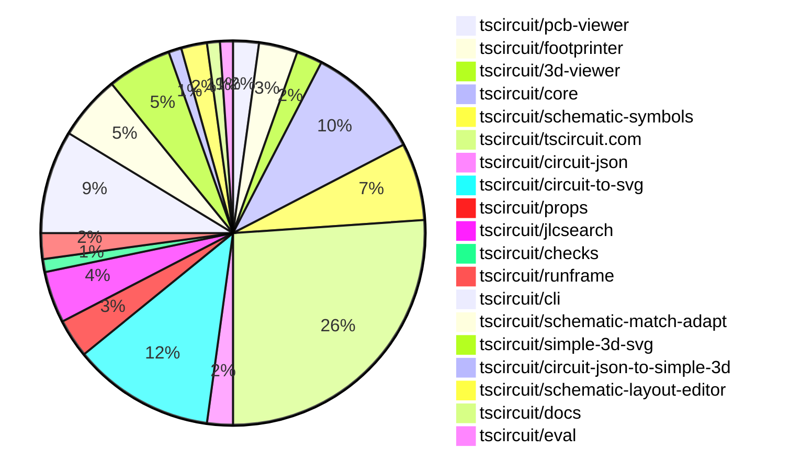

# Contribution Overview 2025-06-04

## PRs by Repository

## Contributor Overview

| Contributor | 🐳 Major | 🐙 Minor | 🐌 Tiny | ⭐ | Issues Created | Discussion Contributions |
|-------------|---------|---------|---------|-----|----------------|--------------------------|
| [seveibar](#seveibar) | 1 | 52 | 1 | 👑👑👑 | 2 | 0🔹 0🔶 0💎 |
| [techmannih](#techmannih) | 0 | 9 | 1 | ⭐⭐ | 2 | 0🔹 0🔶 0💎 |
| [imrishabh18](#imrishabh18) | 0 | 8 | 0 | ⭐⭐ | 4 | 0🔹 0🔶 0💎 |
| [ShiboSoftwareDev](#ShiboSoftwareDev) | 0 | 6 | 2 | ⭐⭐ | 7 | 0🔹 0🔶 0💎 |
| [ArnavK-09](#ArnavK-09) | 0 | 5 | 2 | ⭐⭐ | 3 | 0🔹 0🔶 0💎 |
| [Abse2001](#Abse2001) | 0 | 1 | 2 | ⭐ | 2 | 0🔹 0🔶 0💎 |
| [andrii-balitskyi](#andrii-balitskyi) | 0 | 1 | 0 |  | 0 | 0🔹 0🔶 0💎 |
| [tscircuitbot](#tscircuitbot) | 0 | 0 | 1 |  | 0 | 0🔹 0🔶 0💎 |

### Discussion Contribution Legend

- 🔹 Normal Comments: Basic participation with minimal effort
- 🔶 Great Informative Comments: Thoughtful participation that adds value
- 💎 Incredible Comments: Exceptional participation with high-quality content

## Review Table

[reviews-received-hover]: ## "Number of reviews received for PRs for this contributor"
[approvals-received-hover]: ## "Number of approvals received for PRs this contributor authored"
[rejections-received-hover]: ## "Number of rejections received for PRs this contributor authored"
[prs-opened-hover]: ## "Number of PRs opened by this contributor"
[issues-created-hover]: ## "Number of issues created by this contributor"
[bountied-issues-hover]: ## "Number of issues this contributor created with a bounty"
[bountied-issue-$-hover]: ## "Total bounty amount placed on issues authored by this contributor"

| Contributor | Reviews Received | Approvals Received | Rejections Received | Approvals | Rejections | PRs Opened | PRs Merged | Issues Created | Bountied Issues | Bountied Issue $ |
|---|---|---|---|---|---|---|---|---|---|---|
| [ShiboSoftwareDev](#ShiboSoftwareDev) | 21 | 9 | 1 | 0 | 0 | 11 | 8 | 7 | 0 | 0 |
| [seveibar](#seveibar) | 13 | 0 | 0 | 34 | 8 | 78 | 55 | 2 | 2 | 10 |
| [graphite-app[bot]](#graphite-app[bot]) | 0 | 0 | 0 | 0 | 0 | 0 | 0 | 0 | 0 | 0 |
| [techmannih](#techmannih) | 23 | 11 | 5 | 0 | 0 | 15 | 10 | 2 | 0 | 0 |
| [ArnavK-09](#ArnavK-09) | 11 | 7 | 0 | 0 | 0 | 10 | 7 | 3 | 0 | 0 |
| [imrishabh18](#imrishabh18) | 11 | 5 | 1 | 3 | 1 | 11 | 8 | 4 | 0 | 0 |
| [Abse2001](#Abse2001) | 4 | 3 | 0 | 0 | 0 | 3 | 3 | 2 | 0 | 0 |
| [Anshgrover23](#Anshgrover23) | 4 | 1 | 2 | 0 | 0 | 1 | 0 | 0 | 0 | 0 |
| [tscircuitbot](#tscircuitbot) | 0 | 0 | 0 | 0 | 0 | 18 | 1 | 0 | 0 | 0 |
| [andrii-balitskyi](#andrii-balitskyi) | 1 | 1 | 0 | 0 | 0 | 1 | 1 | 0 | 0 | 0 |

## Changes by Repository

### [tscircuit/pcb-viewer](https://github.com/tscircuit/pcb-viewer)

| PR # | Impact | Contributor | Description | Milestone Aligned |
|------|--------|-------------|-------------|-------------------|
| [#322](https://github.com/tscircuit/pcb-viewer/pull/322) | 🐙 Minor | ShiboSoftwareDev | The addition of horizontal inversion for silkscreen text on the bottom layer enhances the PCB design accuracy and usability. | ❌ |
| [#317](https://github.com/tscircuit/pcb-viewer/pull/317) | 🐌 Tiny | ArnavK-09 | Removing unnecessary dependencies streamlines the project and reduces potential maintenance overhead. | ❌ |

### [tscircuit/footprinter](https://github.com/tscircuit/footprinter)

| PR # | Impact | Contributor | Description | Milestone Aligned |
|------|--------|-------------|-------------|-------------------|
| [#286](https://github.com/tscircuit/footprinter/pull/286) | 🐙 Minor | ShiboSoftwareDev | Enhancement of pinrow functionality to support double-sided pin labels, improving design flexibility. | ❌ |
| [#287](https://github.com/tscircuit/footprinter/pull/287) | 🐙 Minor | techmannih | Enhancement of the SON footprint functionality by adding support for a 6-pin variant. | ❌ |
| [#285](https://github.com/tscircuit/footprinter/pull/285) | 🐌 Tiny | techmannih | Establishes ownership for repository files, enhancing accountability and collaboration. | ❌ |

### [tscircuit/3d-viewer](https://github.com/tscircuit/3d-viewer)

| PR # | Impact | Contributor | Description | Milestone Aligned |
|------|--------|-------------|-------------|-------------------|
| [#326](https://github.com/tscircuit/3d-viewer/pull/326) | 🐙 Minor | ShiboSoftwareDev | Integrating Bun for building and loading WebAssembly modules enhances the project's performance and modernizes the build process. | ❌ |
| [#328](https://github.com/tscircuit/3d-viewer/pull/328) | 🐌 Tiny | ShiboSoftwareDev | The change involves updating the lockfile to ensure dependencies are correctly resolved and up-to-date. | ❌ |

### [tscircuit/core](https://github.com/tscircuit/core)

| PR # | Impact | Contributor | Description | Milestone Aligned |
|------|--------|-------------|-------------|-------------------|
| [#883](https://github.com/tscircuit/core/pull/883) | 🐙 Minor | ShiboSoftwareDev | Enhancements to the pinrow component improve its usability and flexibility in circuit design. | ❌ |
| [#870](https://github.com/tscircuit/core/pull/870) | 🐙 Minor | techmannih | Enhancement of the LED component by adding a method to retrieve schematic display values, improving usability in circuit design. | ❌ |
| [#879](https://github.com/tscircuit/core/pull/879) | 🐙 Minor | seveibar | Enhancements to net label handling improve schematic clarity and usability. | ❌ |
| [#876](https://github.com/tscircuit/core/pull/876) | 🐙 Minor | seveibar | Elimination of unused logic enhances code clarity and maintainability. | ❌ |
| [#868](https://github.com/tscircuit/core/pull/868) | 🐙 Minor | seveibar | Enhancing input validation for net selector names improves code robustness and prevents potential errors in circuit definitions. | ❌ |
| [#866](https://github.com/tscircuit/core/pull/866) | 🐙 Minor | seveibar | Enhancements to net selector validation improve error handling and input integrity. | ❌ |
| [#867](https://github.com/tscircuit/core/pull/867) | 🐙 Minor | seveibar | Enhancing selector functionality with shorthand support adds significant usability improvements for users. | ❌ |
| [#878](https://github.com/tscircuit/core/pull/878) | 🐌 Tiny | ShiboSoftwareDev | Updating the dependency version for checks enhances the project's reliability and performance. | ❌ |
| [#881](https://github.com/tscircuit/core/pull/881) | 🐌 Tiny | Abse2001 | The pull request updates a dependency and fixes a test case, ensuring compatibility and correctness in the codebase. | ❌ |

### [tscircuit/schematic-symbols](https://github.com/tscircuit/schematic-symbols)

| PR # | Impact | Contributor | Description | Milestone Aligned |
|------|--------|-------------|-------------|-------------------|
| [#298](https://github.com/tscircuit/schematic-symbols/pull/298) | 🐙 Minor | ShiboSoftwareDev | Introduces new horizontal and vertical ground symbols to the schematic symbols library. | ❌ |
| [#292](https://github.com/tscircuit/schematic-symbols/pull/292) | 🐙 Minor | ShiboSoftwareDev | Enhancements to the ground symbol provide new orientations, improving usability and flexibility in schematic designs. | ❌ |
| [#297](https://github.com/tscircuit/schematic-symbols/pull/297) | 🐙 Minor | techmannih | Adjusts the text positioning for reference and value labels in the polarized capacitor left symbol, enhancing clarity and usability. | ❌ |
| [#296](https://github.com/tscircuit/schematic-symbols/pull/296) | 🐙 Minor | techmannih | Enhancements to the workflow for publishing to npm, improving automation and token management. | ❌ |
| [#295](https://github.com/tscircuit/schematic-symbols/pull/295) | 🐙 Minor | techmannih | Enhancements to the text reference positioning in the testpoint up symbol improve its usability and clarity. | ❌ |
| [#294](https://github.com/tscircuit/schematic-symbols/pull/294) | 🐙 Minor | seveibar | Enhancement of schematic symbols by introducing a new testpoint symbol with improved design. | ❌ |

### [tscircuit/tscircuit.com](https://github.com/tscircuit/tscircuit.com)

| PR # | Impact | Contributor | Description | Milestone Aligned |
|------|--------|-------------|-------------|-------------------|
| [#1220](https://github.com/tscircuit/tscircuit.com/pull/1220) | 🐙 Minor | ArnavK-09 | Enhancements to the package editing dialog significantly improve user experience by allowing package name modifications and better error handling. | ❌ |
| [#1214](https://github.com/tscircuit/tscircuit.com/pull/1214) | 🐙 Minor | ArnavK-09 | The addition of a new API endpoint for JLCPCB package generation significantly enhances the functionality of the application, allowing for better integration with external components. | ❌ |
| [#1215](https://github.com/tscircuit/tscircuit.com/pull/1215) | 🐙 Minor | ArnavK-09 | Enhances user experience by allowing keyboard submission in multiple dialog components, streamlining interactions. | ❌ |
| [#1217](https://github.com/tscircuit/tscircuit.com/pull/1217) | 🐙 Minor | ArnavK-09 | Refactoring the latest page to improve code organization and maintain consistency with other pages. | ❌ |
| [#1199](https://github.com/tscircuit/tscircuit.com/pull/1199) | 🐙 Minor | ArnavK-09 | Enhancements to the code editor's usability during save operations and a more structured package creation process improve overall user experience and code maintainability. | ❌ |
| [#1224](https://github.com/tscircuit/tscircuit.com/pull/1224) | 🐙 Minor | seveibar | Enhancing package release creation by allowing the use of package names alongside versions improves usability and flexibility. | ❌ |
| [#1222](https://github.com/tscircuit/tscircuit.com/pull/1222) | 🐙 Minor | seveibar | Enhancement of the circuit module template to utilize typed properties for better type safety and clarity. | ❌ |
| [#1218](https://github.com/tscircuit/tscircuit.com/pull/1218) | 🐙 Minor | seveibar | Enhancing user experience by suppressing TypeScript linting errors during file downloads to prevent disruption. | ❌ |
| [#1213](https://github.com/tscircuit/tscircuit.com/pull/1213) | 🐙 Minor | seveibar | Improving user experience by preventing selection loss during file downloads enhances the functionality of the CodeEditor. | ❌ |
| [#1211](https://github.com/tscircuit/tscircuit.com/pull/1211) | 🐙 Minor | seveibar | Prevents unwanted newlines in the code editor when using Cmd+Enter, enhancing user experience. | ❌ |
| [#1207](https://github.com/tscircuit/tscircuit.com/pull/1207) | 🐙 Minor | seveibar | Enhances user experience by providing customizable options for downloading PCB SVG files. | ❌ |
| [#1206](https://github.com/tscircuit/tscircuit.com/pull/1206) | 🐙 Minor | seveibar | Enhances the download functionality by allowing users to download PCB views as SVG files, improving usability for circuit design. | ❌ |
| [#1202](https://github.com/tscircuit/tscircuit.com/pull/1202) | 🐙 Minor | seveibar | Enhancements to the frontend bindings and package release schema improve user experience and functionality. | ❌ |
| [#1200](https://github.com/tscircuit/tscircuit.com/pull/1200) | 🐙 Minor | seveibar | Enhancements to the package release schema and the introduction of a rebuild API endpoint significantly improve the package management capabilities. | ❌ |
| [#1194](https://github.com/tscircuit/tscircuit.com/pull/1194) | 🐙 Minor | seveibar | Enhancements to package image hashing and the introduction of a new builds page significantly improve the functionality and user experience of the application. | ❌ |
| [#1229](https://github.com/tscircuit/tscircuit.com/pull/1229) | 🐙 Minor | imrishabh18 | Enhances the package builds page by adding a rebuild functionality, improving user experience and operational efficiency. | ❌ |
| [#1226](https://github.com/tscircuit/tscircuit.com/pull/1226) | 🐙 Minor | imrishabh18 | Enhances code editing capabilities by introducing line and block comment functionality. | ❌ |
| [#1219](https://github.com/tscircuit/tscircuit.com/pull/1219) | 🐙 Minor | imrishabh18 | Enhancing user experience by normalizing username lookups to be case insensitive, thus improving accessibility and functionality. | ❌ |
| [#1212](https://github.com/tscircuit/tscircuit.com/pull/1212) | 🐙 Minor | imrishabh18 | The pull request enhances the application by removing an unused beta page and improving the structure of fallback messages, contributing to cleaner code and better user experience. | ❌ |
| [#1210](https://github.com/tscircuit/tscircuit.com/pull/1210) | 🐙 Minor | imrishabh18 | Enhances the user experience by providing detailed build logs with timestamps and error handling. | ❌ |
| [#1209](https://github.com/tscircuit/tscircuit.com/pull/1209) | 🐙 Minor | imrishabh18 | The changes align the frontend enum values with the backend, ensuring consistency in status representation across the application. | ❌ |
| [#1208](https://github.com/tscircuit/tscircuit.com/pull/1208) | 🐙 Minor | imrishabh18 | Enhancements to the /get endpoint improve functionality by allowing optional logging and removing unnecessary dependencies. | ❌ |
| [#1205](https://github.com/tscircuit/tscircuit.com/pull/1205) | 🐙 Minor | imrishabh18 | Addresses an authentication issue that could hinder users from creating bug reports, enhancing user experience and functionality. | ❌ |
| [#1216](https://github.com/tscircuit/tscircuit.com/pull/1216) | 🐌 Tiny | ArnavK-09 | Commenting out unused imports helps maintain clean code and prevents potential errors during development. | ❌ |

### [tscircuit/circuit-json](https://github.com/tscircuit/circuit-json)

| PR # | Impact | Contributor | Description | Milestone Aligned |
|------|--------|-------------|-------------|-------------------|
| [#213](https://github.com/tscircuit/circuit-json/pull/213) | 🐙 Minor | techmannih | Removing the source LED component streamlines the codebase by eliminating unused elements, enhancing maintainability. | ❌ |
| [#214](https://github.com/tscircuit/circuit-json/pull/214) | 🐙 Minor | techmannih | Introducing a new component type for simple test points enhances the flexibility and configurability of circuit designs. | ❌ |

### [tscircuit/circuit-to-svg](https://github.com/tscircuit/circuit-to-svg)

| PR # | Impact | Contributor | Description | Milestone Aligned |
|------|--------|-------------|-------------|-------------------|
| [#248](https://github.com/tscircuit/circuit-to-svg/pull/248) | 🐙 Minor | techmannih | Enhances the library by adding support for circular SMT pads, improving its functionality for PCB design. | ❌ |
| [#242](https://github.com/tscircuit/circuit-to-svg/pull/242) | 🐙 Minor | techmannih | Enhances the library by adding support for polygon-shaped SMT pads, improving versatility in PCB design. | ❌ |
| [#254](https://github.com/tscircuit/circuit-to-svg/pull/254) | 🐙 Minor | seveibar | Enhancements to net label symbol orientation improve schematic accuracy and usability. | ❌ |
| [#246](https://github.com/tscircuit/circuit-to-svg/pull/246) | 🐙 Minor | seveibar | Enhancing PCB trace rendering by allowing soldermask colors to override default trace colors improves visual accuracy in circuit designs. | ❌ |
| [#247](https://github.com/tscircuit/circuit-to-svg/pull/247) | 🐙 Minor | seveibar | Enhancements to the README API section improve clarity and add a new assembly function, enriching user documentation. | ❌ |
| [#245](https://github.com/tscircuit/circuit-to-svg/pull/245) | 🐙 Minor | seveibar | Refining SVG bounds enhances the accuracy of PCB visualizations, ensuring they align with board dimensions. | ❌ |
| [#244](https://github.com/tscircuit/circuit-to-svg/pull/244) | 🐙 Minor | seveibar | Fixes rendering issues by removing problematic black backgrounds from components, enhancing visual clarity in 3D views. | ❌ |
| [#241](https://github.com/tscircuit/circuit-to-svg/pull/241) | 🐙 Minor | seveibar | Enhancements to PCB SVG generation through customizable color mappings improve flexibility and user experience. | ❌ |
| [#238](https://github.com/tscircuit/circuit-to-svg/pull/238) | 🐙 Minor | seveibar | Enhancement of SVG conversion functionality by introducing an option to control padding around the board. | ❌ |
| [#237](https://github.com/tscircuit/circuit-to-svg/pull/237) | 🐙 Minor | seveibar | Enhancing the SVG generation functionality by allowing customization of the background color adds significant value for users seeking visual differentiation in their designs. | ❌ |
| [#236](https://github.com/tscircuit/circuit-to-svg/pull/236) | 🐌 Tiny | Abse2001 | The pull request updates a dependency in the project, which is a routine maintenance task that can help ensure compatibility and stability. | ❌ |

### [tscircuit/props](https://github.com/tscircuit/props)

| PR # | Impact | Contributor | Description | Milestone Aligned |
|------|--------|-------------|-------------|-------------------|
| [#264](https://github.com/tscircuit/props/pull/264) | 🐙 Minor | Abse2001 | Enhancements to the schematic box properties improve flexibility in positioning and alignment of titles. | ❌ |
| [#263](https://github.com/tscircuit/props/pull/263) | 🐙 Minor | seveibar | Introducing an optional property to enhance layout configuration flexibility. | ❌ |
| [#262](https://github.com/tscircuit/props/pull/262) | 🐙 Minor | seveibar | The addition of the testpoint component enhances the library's functionality by providing a new component for circuit design. | ❌ |

### [tscircuit/jlcsearch](https://github.com/tscircuit/jlcsearch)

| PR # | Impact | Contributor | Description | Milestone Aligned |
|------|--------|-------------|-------------|-------------------|
| [#59](https://github.com/tscircuit/jlcsearch/pull/59) | 🐳 Major | seveibar | The addition of an accelerometer table and associated routes enhances the functionality of the application by allowing users to access and filter accelerometer data effectively. | ❌ |
| [#58](https://github.com/tscircuit/jlcsearch/pull/58) | 🐙 Minor | seveibar | The addition of a gyroscope listing page enhances the application's functionality by allowing users to browse and filter gyroscope components effectively. | ❌ |
| [#56](https://github.com/tscircuit/jlcsearch/pull/56) | 🐙 Minor | seveibar | Enhancements to filtering functionality for switches improve user experience and data retrieval. | ❌ |
| [#55](https://github.com/tscircuit/jlcsearch/pull/55) | 🐙 Minor | seveibar | The addition of a derived table for switches and associated routes enhances the database structure and API functionality, providing better access to switch data. | ❌ |

### [tscircuit/checks](https://github.com/tscircuit/checks)

| PR # | Impact | Contributor | Description | Milestone Aligned |
|------|--------|-------------|-------------|-------------------|
| [#50](https://github.com/tscircuit/checks/pull/50) | 🐙 Minor | seveibar | Enhances the circuit design validation process by ensuring that vias on the same net maintain a minimum spacing, thus preventing potential design errors. | ❌ |

### [tscircuit/runframe](https://github.com/tscircuit/runframe)

| PR # | Impact | Contributor | Description | Milestone Aligned |
|------|--------|-------------|-------------|-------------------|
| [#712](https://github.com/tscircuit/runframe/pull/712) | 🐙 Minor | seveibar | Enhancements to error handling and reporting improve user experience and debugging capabilities. | ❌ |
| [#708](https://github.com/tscircuit/runframe/pull/708) | 🐙 Minor | andrii-balitskyi | Enhancing error handling by clearing render logs and progress bar improves user experience during execution errors. | ❌ |

### [tscircuit/cli](https://github.com/tscircuit/cli)

| PR # | Impact | Contributor | Description | Milestone Aligned |
|------|--------|-------------|-------------|-------------------|
| [#218](https://github.com/tscircuit/cli/pull/218) | 🐙 Minor | seveibar | Introducing a new command to streamline GitHub Actions setup enhances the CLI's usability and automation capabilities. | ❌ |
| [#217](https://github.com/tscircuit/cli/pull/217) | 🐙 Minor | seveibar | Enhancements to error logging and test reliability significantly improve user experience and code quality. | ❌ |
| [#212](https://github.com/tscircuit/cli/pull/212) | 🐙 Minor | seveibar | Enhancing the push command to include a flag that indicates the readiness of package releases for building adds significant value to the release process. | ❌ |
| [#216](https://github.com/tscircuit/cli/pull/216) | 🐙 Minor | seveibar | Enhancements to the CLI initialization process, including prompting for package names and improved configuration handling. | ❌ |
| [#215](https://github.com/tscircuit/cli/pull/215) | 🐙 Minor | seveibar | Enhances the build process by adding error and warning analysis for circuit.json, improving reliability and user feedback. | ❌ |
| [#214](https://github.com/tscircuit/cli/pull/214) | 🐙 Minor | seveibar | The addition of a build command enhances the CLI functionality by allowing users to generate circuit JSON from their code, streamlining the development process. | ❌ |
| [#213](https://github.com/tscircuit/cli/pull/213) | 🐙 Minor | seveibar | Introducing a new command for generating schematic and PCB snapshots enhances the CLI's functionality significantly. | ❌ |
| [#211](https://github.com/tscircuit/cli/pull/211) | 🐙 Minor | seveibar | Enhances the development server by allowing it to skip .git files during file watching, improving performance and usability. | ❌ |

### [tscircuit/schematic-match-adapt](https://github.com/tscircuit/schematic-match-adapt)

| PR # | Impact | Contributor | Description | Milestone Aligned |
|------|--------|-------------|-------------|-------------------|
| [#27](https://github.com/tscircuit/schematic-match-adapt/pull/27) | 🐙 Minor | seveibar | Enhances testing capabilities by adding a new corpus test and visual representation for circuit matching. | ❌ |
| [#26](https://github.com/tscircuit/schematic-match-adapt/pull/26) | 🐙 Minor | seveibar | Addresses a critical bug by preventing the creation of connections for ports lacking connectivity mapping, thereby enhancing the reliability of the netlist generation process. | ❌ |
| [#25](https://github.com/tscircuit/schematic-match-adapt/pull/25) | 🐙 Minor | seveibar | Enhances the library by introducing support for JSON templates, improving the functionality of the circuit builder. | ❌ |
| [#24](https://github.com/tscircuit/schematic-match-adapt/pull/24) | 🐙 Minor | seveibar | Adjusts the default width for left-right chips, enhancing consistency with the tscircuit specifications. | ❌ |
| [#23](https://github.com/tscircuit/schematic-match-adapt/pull/23) | 🐙 Minor | seveibar | Enhancements to net properties improve circuit representation and functionality. | ❌ |

### [tscircuit/simple-3d-svg](https://github.com/tscircuit/simple-3d-svg)

| PR # | Impact | Contributor | Description | Milestone Aligned |
|------|--------|-------------|-------------|-------------------|
| [#16](https://github.com/tscircuit/simple-3d-svg/pull/16) | 🐙 Minor | seveibar | Enhances the testing framework by introducing an animation feature for validating 3D transformations, improving visual feedback during testing. | ❌ |
| [#15](https://github.com/tscircuit/simple-3d-svg/pull/15) | 🐙 Minor | seveibar | Enhancements to texture interpolation improve rendering accuracy for 3D models. | ❌ |
| [#13](https://github.com/tscircuit/simple-3d-svg/pull/13) | 🐙 Minor | seveibar | Enhancements to rendering logic ensure all sides of 3D objects are visible, improving visual fidelity. | ❌ |
| [#11](https://github.com/tscircuit/simple-3d-svg/pull/11) | 🐙 Minor | seveibar | Enhancing the rendering capabilities by allowing customizable projection subdivisions improves the accuracy of face image projections. | ❌ |
| [#10](https://github.com/tscircuit/simple-3d-svg/pull/10) | 🐙 Minor | seveibar | Enhancements to rendering logic improve the visual hierarchy of images and labels in the SVG output. | ❌ |

### [tscircuit/circuit-json-to-simple-3d](https://github.com/tscircuit/circuit-json-to-simple-3d)

| PR # | Impact | Contributor | Description | Milestone Aligned |
|------|--------|-------------|-------------|-------------------|
| [#3](https://github.com/tscircuit/circuit-json-to-simple-3d/pull/3) | 🐙 Minor | seveibar | Enhancements to camera positioning and rendering options for PCB boards improve the flexibility and usability of the 3D rendering functionality. | ❌ |

### [tscircuit/schematic-layout-editor](https://github.com/tscircuit/schematic-layout-editor)

| PR # | Impact | Contributor | Description | Milestone Aligned |
|------|--------|-------------|-------------|-------------------|
| [#6](https://github.com/tscircuit/schematic-layout-editor/pull/6) | 🐙 Minor | seveibar | Enhancements to chip width calculations improve the schematic layout's accuracy and usability. | ❌ |
| [#5](https://github.com/tscircuit/schematic-layout-editor/pull/5) | 🐙 Minor | seveibar | Enhancing the file naming convention for downloaded JSON files improves organization and traceability. | ❌ |

### [tscircuit/docs](https://github.com/tscircuit/docs)

| PR # | Impact | Contributor | Description | Milestone Aligned |
|------|--------|-------------|-------------|-------------------|
| [#67](https://github.com/tscircuit/docs/pull/67) | 🐌 Tiny | seveibar | Enhancements in documentation clarity and accuracy through typo corrections and standardization. | ❌ |

### [tscircuit/eval](https://github.com/tscircuit/eval)

| PR # | Impact | Contributor | Description | Milestone Aligned |
|------|--------|-------------|-------------|-------------------|
| [#428](https://github.com/tscircuit/eval/pull/428) | 🐌 Tiny | tscircuitbot | Updating the core library version enhances compatibility and may include important bug fixes or improvements. | ❌ |

## Changes by Contributor

### [ShiboSoftwareDev](https://github.com/ShiboSoftwareDev)

| PR # | Impact | Description | Milestone Aligned |
|------|--------|-------------|-------------------|
| [#322](https://github.com/tscircuit/pcb-viewer/pull/322) | 🐙 Minor | The addition of horizontal inversion for silkscreen text on the bottom layer enhances the PCB design accuracy and usability. | ❌ |
| [#286](https://github.com/tscircuit/footprinter/pull/286) | 🐙 Minor | Enhancement of pinrow functionality to support double-sided pin labels, improving design flexibility. | ❌ |
| [#326](https://github.com/tscircuit/3d-viewer/pull/326) | 🐙 Minor | Integrating Bun for building and loading WebAssembly modules enhances the project's performance and modernizes the build process. | ❌ |
| [#883](https://github.com/tscircuit/core/pull/883) | 🐙 Minor | Enhancements to the pinrow component improve its usability and flexibility in circuit design. | ❌ |
| [#298](https://github.com/tscircuit/schematic-symbols/pull/298) | 🐙 Minor | Introduces new horizontal and vertical ground symbols to the schematic symbols library. | ❌ |
| [#292](https://github.com/tscircuit/schematic-symbols/pull/292) | 🐙 Minor | Enhancements to the ground symbol provide new orientations, improving usability and flexibility in schematic designs. | ❌ |
| [#328](https://github.com/tscircuit/3d-viewer/pull/328) | 🐌 Tiny | The change involves updating the lockfile to ensure dependencies are correctly resolved and up-to-date. | ❌ |
| [#878](https://github.com/tscircuit/core/pull/878) | 🐌 Tiny | Updating the dependency version for checks enhances the project's reliability and performance. | ❌ |

### [ArnavK-09](https://github.com/ArnavK-09)

| PR # | Impact | Description | Milestone Aligned |
|------|--------|-------------|-------------------|
| [#1220](https://github.com/tscircuit/tscircuit.com/pull/1220) | 🐙 Minor | Enhancements to the package editing dialog significantly improve user experience by allowing package name modifications and better error handling. | ❌ |
| [#1214](https://github.com/tscircuit/tscircuit.com/pull/1214) | 🐙 Minor | The addition of a new API endpoint for JLCPCB package generation significantly enhances the functionality of the application, allowing for better integration with external components. | ❌ |
| [#1215](https://github.com/tscircuit/tscircuit.com/pull/1215) | 🐙 Minor | Enhances user experience by allowing keyboard submission in multiple dialog components, streamlining interactions. | ❌ |
| [#1217](https://github.com/tscircuit/tscircuit.com/pull/1217) | 🐙 Minor | Refactoring the latest page to improve code organization and maintain consistency with other pages. | ❌ |
| [#1199](https://github.com/tscircuit/tscircuit.com/pull/1199) | 🐙 Minor | Enhancements to the code editor's usability during save operations and a more structured package creation process improve overall user experience and code maintainability. | ❌ |
| [#317](https://github.com/tscircuit/pcb-viewer/pull/317) | 🐌 Tiny | Removing unnecessary dependencies streamlines the project and reduces potential maintenance overhead. | ❌ |
| [#1216](https://github.com/tscircuit/tscircuit.com/pull/1216) | 🐌 Tiny | Commenting out unused imports helps maintain clean code and prevents potential errors during development. | ❌ |

### [techmannih](https://github.com/techmannih)

| PR # | Impact | Description | Milestone Aligned |
|------|--------|-------------|-------------------|
| [#213](https://github.com/tscircuit/circuit-json/pull/213) | 🐙 Minor | Removing the source LED component streamlines the codebase by eliminating unused elements, enhancing maintainability. | ❌ |
| [#214](https://github.com/tscircuit/circuit-json/pull/214) | 🐙 Minor | Introducing a new component type for simple test points enhances the flexibility and configurability of circuit designs. | ❌ |
| [#287](https://github.com/tscircuit/footprinter/pull/287) | 🐙 Minor | Enhancement of the SON footprint functionality by adding support for a 6-pin variant. | ❌ |
| [#870](https://github.com/tscircuit/core/pull/870) | 🐙 Minor | Enhancement of the LED component by adding a method to retrieve schematic display values, improving usability in circuit design. | ❌ |
| [#248](https://github.com/tscircuit/circuit-to-svg/pull/248) | 🐙 Minor | Enhances the library by adding support for circular SMT pads, improving its functionality for PCB design. | ❌ |
| [#242](https://github.com/tscircuit/circuit-to-svg/pull/242) | 🐙 Minor | Enhances the library by adding support for polygon-shaped SMT pads, improving versatility in PCB design. | ❌ |
| [#297](https://github.com/tscircuit/schematic-symbols/pull/297) | 🐙 Minor | Adjusts the text positioning for reference and value labels in the polarized capacitor left symbol, enhancing clarity and usability. | ❌ |
| [#296](https://github.com/tscircuit/schematic-symbols/pull/296) | 🐙 Minor | Enhancements to the workflow for publishing to npm, improving automation and token management. | ❌ |
| [#295](https://github.com/tscircuit/schematic-symbols/pull/295) | 🐙 Minor | Enhancements to the text reference positioning in the testpoint up symbol improve its usability and clarity. | ❌ |
| [#285](https://github.com/tscircuit/footprinter/pull/285) | 🐌 Tiny | Establishes ownership for repository files, enhancing accountability and collaboration. | ❌ |

### [Abse2001](https://github.com/Abse2001)

| PR # | Impact | Description | Milestone Aligned |
|------|--------|-------------|-------------------|
| [#264](https://github.com/tscircuit/props/pull/264) | 🐙 Minor | Enhancements to the schematic box properties improve flexibility in positioning and alignment of titles. | ❌ |
| [#881](https://github.com/tscircuit/core/pull/881) | 🐌 Tiny | The pull request updates a dependency and fixes a test case, ensuring compatibility and correctness in the codebase. | ❌ |
| [#236](https://github.com/tscircuit/circuit-to-svg/pull/236) | 🐌 Tiny | The pull request updates a dependency in the project, which is a routine maintenance task that can help ensure compatibility and stability. | ❌ |

### [seveibar](https://github.com/seveibar)

| PR # | Impact | Description | Milestone Aligned |
|------|--------|-------------|-------------------|
| [#59](https://github.com/tscircuit/jlcsearch/pull/59) | 🐳 Major | The addition of an accelerometer table and associated routes enhances the functionality of the application by allowing users to access and filter accelerometer data effectively. | ❌ |
| [#263](https://github.com/tscircuit/props/pull/263) | 🐙 Minor | Introducing an optional property to enhance layout configuration flexibility. | ❌ |
| [#262](https://github.com/tscircuit/props/pull/262) | 🐙 Minor | The addition of the testpoint component enhances the library's functionality by providing a new component for circuit design. | ❌ |
| [#879](https://github.com/tscircuit/core/pull/879) | 🐙 Minor | Enhancements to net label handling improve schematic clarity and usability. | ❌ |
| [#876](https://github.com/tscircuit/core/pull/876) | 🐙 Minor | Elimination of unused logic enhances code clarity and maintainability. | ❌ |
| [#868](https://github.com/tscircuit/core/pull/868) | 🐙 Minor | Enhancing input validation for net selector names improves code robustness and prevents potential errors in circuit definitions. | ❌ |
| [#866](https://github.com/tscircuit/core/pull/866) | 🐙 Minor | Enhancements to net selector validation improve error handling and input integrity. | ❌ |
| [#867](https://github.com/tscircuit/core/pull/867) | 🐙 Minor | Enhancing selector functionality with shorthand support adds significant usability improvements for users. | ❌ |
| [#254](https://github.com/tscircuit/circuit-to-svg/pull/254) | 🐙 Minor | Enhancements to net label symbol orientation improve schematic accuracy and usability. | ❌ |
| [#246](https://github.com/tscircuit/circuit-to-svg/pull/246) | 🐙 Minor | Enhancing PCB trace rendering by allowing soldermask colors to override default trace colors improves visual accuracy in circuit designs. | ❌ |
| [#247](https://github.com/tscircuit/circuit-to-svg/pull/247) | 🐙 Minor | Enhancements to the README API section improve clarity and add a new assembly function, enriching user documentation. | ❌ |
| [#245](https://github.com/tscircuit/circuit-to-svg/pull/245) | 🐙 Minor | Refining SVG bounds enhances the accuracy of PCB visualizations, ensuring they align with board dimensions. | ❌ |
| [#244](https://github.com/tscircuit/circuit-to-svg/pull/244) | 🐙 Minor | Fixes rendering issues by removing problematic black backgrounds from components, enhancing visual clarity in 3D views. | ❌ |
| [#241](https://github.com/tscircuit/circuit-to-svg/pull/241) | 🐙 Minor | Enhancements to PCB SVG generation through customizable color mappings improve flexibility and user experience. | ❌ |
| [#238](https://github.com/tscircuit/circuit-to-svg/pull/238) | 🐙 Minor | Enhancement of SVG conversion functionality by introducing an option to control padding around the board. | ❌ |
| [#237](https://github.com/tscircuit/circuit-to-svg/pull/237) | 🐙 Minor | Enhancing the SVG generation functionality by allowing customization of the background color adds significant value for users seeking visual differentiation in their designs. | ❌ |
| [#50](https://github.com/tscircuit/checks/pull/50) | 🐙 Minor | Enhances the circuit design validation process by ensuring that vias on the same net maintain a minimum spacing, thus preventing potential design errors. | ❌ |
| [#294](https://github.com/tscircuit/schematic-symbols/pull/294) | 🐙 Minor | Enhancement of schematic symbols by introducing a new testpoint symbol with improved design. | ❌ |
| [#1224](https://github.com/tscircuit/tscircuit.com/pull/1224) | 🐙 Minor | Enhancing package release creation by allowing the use of package names alongside versions improves usability and flexibility. | ❌ |
| [#1222](https://github.com/tscircuit/tscircuit.com/pull/1222) | 🐙 Minor | Enhancement of the circuit module template to utilize typed properties for better type safety and clarity. | ❌ |
| [#1218](https://github.com/tscircuit/tscircuit.com/pull/1218) | 🐙 Minor | Enhancing user experience by suppressing TypeScript linting errors during file downloads to prevent disruption. | ❌ |
| [#1213](https://github.com/tscircuit/tscircuit.com/pull/1213) | 🐙 Minor | Improving user experience by preventing selection loss during file downloads enhances the functionality of the CodeEditor. | ❌ |
| [#1211](https://github.com/tscircuit/tscircuit.com/pull/1211) | 🐙 Minor | Prevents unwanted newlines in the code editor when using Cmd+Enter, enhancing user experience. | ❌ |
| [#1207](https://github.com/tscircuit/tscircuit.com/pull/1207) | 🐙 Minor | Enhances user experience by providing customizable options for downloading PCB SVG files. | ❌ |
| [#1206](https://github.com/tscircuit/tscircuit.com/pull/1206) | 🐙 Minor | Enhances the download functionality by allowing users to download PCB views as SVG files, improving usability for circuit design. | ❌ |
| [#1202](https://github.com/tscircuit/tscircuit.com/pull/1202) | 🐙 Minor | Enhancements to the frontend bindings and package release schema improve user experience and functionality. | ❌ |
| [#1200](https://github.com/tscircuit/tscircuit.com/pull/1200) | 🐙 Minor | Enhancements to the package release schema and the introduction of a rebuild API endpoint significantly improve the package management capabilities. | ❌ |
| [#1194](https://github.com/tscircuit/tscircuit.com/pull/1194) | 🐙 Minor | Enhancements to package image hashing and the introduction of a new builds page significantly improve the functionality and user experience of the application. | ❌ |
| [#58](https://github.com/tscircuit/jlcsearch/pull/58) | 🐙 Minor | The addition of a gyroscope listing page enhances the application's functionality by allowing users to browse and filter gyroscope components effectively. | ❌ |
| [#56](https://github.com/tscircuit/jlcsearch/pull/56) | 🐙 Minor | Enhancements to filtering functionality for switches improve user experience and data retrieval. | ❌ |
| [#55](https://github.com/tscircuit/jlcsearch/pull/55) | 🐙 Minor | The addition of a derived table for switches and associated routes enhances the database structure and API functionality, providing better access to switch data. | ❌ |
| [#712](https://github.com/tscircuit/runframe/pull/712) | 🐙 Minor | Enhancements to error handling and reporting improve user experience and debugging capabilities. | ❌ |
| [#218](https://github.com/tscircuit/cli/pull/218) | 🐙 Minor | Introducing a new command to streamline GitHub Actions setup enhances the CLI's usability and automation capabilities. | ❌ |
| [#217](https://github.com/tscircuit/cli/pull/217) | 🐙 Minor | Enhancements to error logging and test reliability significantly improve user experience and code quality. | ❌ |
| [#212](https://github.com/tscircuit/cli/pull/212) | 🐙 Minor | Enhancing the push command to include a flag that indicates the readiness of package releases for building adds significant value to the release process. | ❌ |
| [#216](https://github.com/tscircuit/cli/pull/216) | 🐙 Minor | Enhancements to the CLI initialization process, including prompting for package names and improved configuration handling. | ❌ |
| [#215](https://github.com/tscircuit/cli/pull/215) | 🐙 Minor | Enhances the build process by adding error and warning analysis for circuit.json, improving reliability and user feedback. | ❌ |
| [#214](https://github.com/tscircuit/cli/pull/214) | 🐙 Minor | The addition of a build command enhances the CLI functionality by allowing users to generate circuit JSON from their code, streamlining the development process. | ❌ |
| [#213](https://github.com/tscircuit/cli/pull/213) | 🐙 Minor | Introducing a new command for generating schematic and PCB snapshots enhances the CLI's functionality significantly. | ❌ |
| [#211](https://github.com/tscircuit/cli/pull/211) | 🐙 Minor | Enhances the development server by allowing it to skip .git files during file watching, improving performance and usability. | ❌ |
| [#27](https://github.com/tscircuit/schematic-match-adapt/pull/27) | 🐙 Minor | Enhances testing capabilities by adding a new corpus test and visual representation for circuit matching. | ❌ |
| [#26](https://github.com/tscircuit/schematic-match-adapt/pull/26) | 🐙 Minor | Addresses a critical bug by preventing the creation of connections for ports lacking connectivity mapping, thereby enhancing the reliability of the netlist generation process. | ❌ |
| [#25](https://github.com/tscircuit/schematic-match-adapt/pull/25) | 🐙 Minor | Enhances the library by introducing support for JSON templates, improving the functionality of the circuit builder. | ❌ |
| [#24](https://github.com/tscircuit/schematic-match-adapt/pull/24) | 🐙 Minor | Adjusts the default width for left-right chips, enhancing consistency with the tscircuit specifications. | ❌ |
| [#23](https://github.com/tscircuit/schematic-match-adapt/pull/23) | 🐙 Minor | Enhancements to net properties improve circuit representation and functionality. | ❌ |
| [#16](https://github.com/tscircuit/simple-3d-svg/pull/16) | 🐙 Minor | Enhances the testing framework by introducing an animation feature for validating 3D transformations, improving visual feedback during testing. | ❌ |
| [#15](https://github.com/tscircuit/simple-3d-svg/pull/15) | 🐙 Minor | Enhancements to texture interpolation improve rendering accuracy for 3D models. | ❌ |
| [#13](https://github.com/tscircuit/simple-3d-svg/pull/13) | 🐙 Minor | Enhancements to rendering logic ensure all sides of 3D objects are visible, improving visual fidelity. | ❌ |
| [#11](https://github.com/tscircuit/simple-3d-svg/pull/11) | 🐙 Minor | Enhancing the rendering capabilities by allowing customizable projection subdivisions improves the accuracy of face image projections. | ❌ |
| [#10](https://github.com/tscircuit/simple-3d-svg/pull/10) | 🐙 Minor | Enhancements to rendering logic improve the visual hierarchy of images and labels in the SVG output. | ❌ |
| [#3](https://github.com/tscircuit/circuit-json-to-simple-3d/pull/3) | 🐙 Minor | Enhancements to camera positioning and rendering options for PCB boards improve the flexibility and usability of the 3D rendering functionality. | ❌ |
| [#6](https://github.com/tscircuit/schematic-layout-editor/pull/6) | 🐙 Minor | Enhancements to chip width calculations improve the schematic layout's accuracy and usability. | ❌ |
| [#5](https://github.com/tscircuit/schematic-layout-editor/pull/5) | 🐙 Minor | Enhancing the file naming convention for downloaded JSON files improves organization and traceability. | ❌ |
| [#67](https://github.com/tscircuit/docs/pull/67) | 🐌 Tiny | Enhancements in documentation clarity and accuracy through typo corrections and standardization. | ❌ |

### [imrishabh18](https://github.com/imrishabh18)

| PR # | Impact | Description | Milestone Aligned |
|------|--------|-------------|-------------------|
| [#1229](https://github.com/tscircuit/tscircuit.com/pull/1229) | 🐙 Minor | Enhances the package builds page by adding a rebuild functionality, improving user experience and operational efficiency. | ❌ |
| [#1226](https://github.com/tscircuit/tscircuit.com/pull/1226) | 🐙 Minor | Enhances code editing capabilities by introducing line and block comment functionality. | ❌ |
| [#1219](https://github.com/tscircuit/tscircuit.com/pull/1219) | 🐙 Minor | Enhancing user experience by normalizing username lookups to be case insensitive, thus improving accessibility and functionality. | ❌ |
| [#1212](https://github.com/tscircuit/tscircuit.com/pull/1212) | 🐙 Minor | The pull request enhances the application by removing an unused beta page and improving the structure of fallback messages, contributing to cleaner code and better user experience. | ❌ |
| [#1210](https://github.com/tscircuit/tscircuit.com/pull/1210) | 🐙 Minor | Enhances the user experience by providing detailed build logs with timestamps and error handling. | ❌ |
| [#1209](https://github.com/tscircuit/tscircuit.com/pull/1209) | 🐙 Minor | The changes align the frontend enum values with the backend, ensuring consistency in status representation across the application. | ❌ |
| [#1208](https://github.com/tscircuit/tscircuit.com/pull/1208) | 🐙 Minor | Enhancements to the /get endpoint improve functionality by allowing optional logging and removing unnecessary dependencies. | ❌ |
| [#1205](https://github.com/tscircuit/tscircuit.com/pull/1205) | 🐙 Minor | Addresses an authentication issue that could hinder users from creating bug reports, enhancing user experience and functionality. | ❌ |

### [tscircuitbot](https://github.com/tscircuitbot)

| PR # | Impact | Description | Milestone Aligned |
|------|--------|-------------|-------------------|
| [#428](https://github.com/tscircuit/eval/pull/428) | 🐌 Tiny | Updating the core library version enhances compatibility and may include important bug fixes or improvements. | ❌ |

### [andrii-balitskyi](https://github.com/andrii-balitskyi)

| PR # | Impact | Description | Milestone Aligned |
|------|--------|-------------|-------------------|
| [#708](https://github.com/tscircuit/runframe/pull/708) | 🐙 Minor | Enhancing error handling by clearing render logs and progress bar improves user experience during execution errors. | ❌ |

## Repository Owners

| Repository | Codeowners |
|------------|------------|
| [pcb-viewer](https://github.com/tscircuit/pcb-viewer/blob/main/.github/CODEOWNERS) | [ShiboSoftwareDev](https://github.com/ShiboSoftwareDev) |
| [jscad-electronics](https://github.com/tscircuit/jscad-electronics/blob/main/.github/CODEOWNERS) | [seveibar](https://github.com/seveibar) |
| [schematic-symbols](https://github.com/tscircuit/schematic-symbols/blob/main/.github/CODEOWNERS) | [seveibar](https://github.com/seveibar) |
| [tscircuit.com](https://github.com/tscircuit/tscircuit.com/blob/main/.github/CODEOWNERS) | [seveibar](https://github.com/seveibar), [imrishabh18](https://github.com/imrishabh18) |
| [cli](https://github.com/tscircuit/cli/blob/main/.github/CODEOWNERS) | [seveibar](https://github.com/seveibar), [imrishabh18](https://github.com/imrishabh18) |
| [footprinter](https://github.com/tscircuit/footprinter/blob/main/.github/CODEOWNERS) | [techmannih](https://github.com/techmannih) |

## Repos by Owner

| User | Repo |
|------|------|
| [ShiboSoftwareDev](https://github.com/ShiboSoftwareDev) | [pcb-viewer](https://github.com/tscircuit/pcb-viewer/blob/main/.github/CODEOWNERS) |
| [seveibar](https://github.com/seveibar) | [jscad-electronics](https://github.com/tscircuit/jscad-electronics/blob/main/.github/CODEOWNERS) |
|  | [schematic-symbols](https://github.com/tscircuit/schematic-symbols/blob/main/.github/CODEOWNERS) |
|  | [tscircuit.com](https://github.com/tscircuit/tscircuit.com/blob/main/.github/CODEOWNERS) |
|  | [cli](https://github.com/tscircuit/cli/blob/main/.github/CODEOWNERS) |
| [techmannih](https://github.com/techmannih) | [footprinter](https://github.com/tscircuit/footprinter/blob/main/.github/CODEOWNERS) |
| [imrishabh18](https://github.com/imrishabh18) | [tscircuit.com](https://github.com/tscircuit/tscircuit.com/blob/main/.github/CODEOWNERS) |
|  | [cli](https://github.com/tscircuit/cli/blob/main/.github/CODEOWNERS) |

