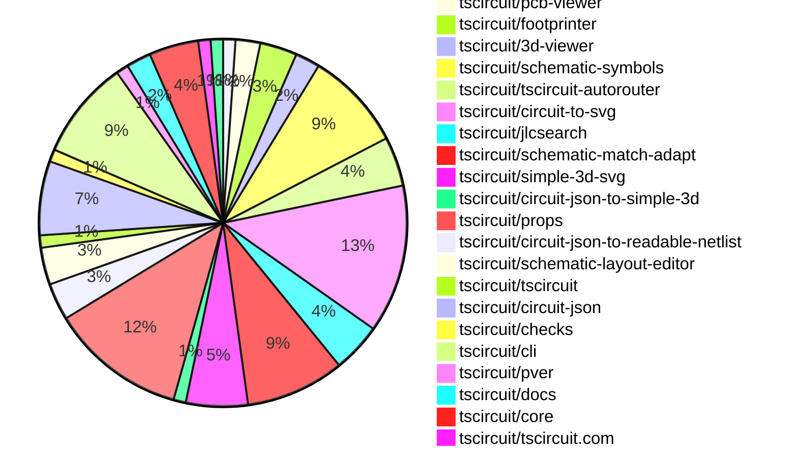
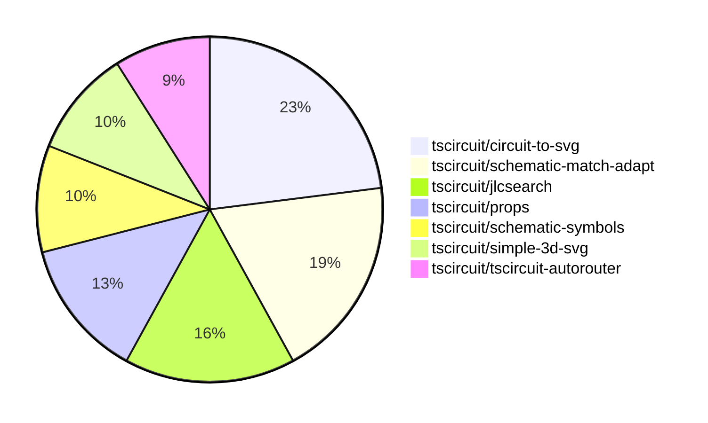

# Contribution Overview 2025-06-04

## PRs by Repository

## Contributor Overview

| Contributor | 🐳 Major | 🐙 Minor | 🐌 Tiny | ⭐ | Issues Created | Discussion Contributions |
|-------------|---------|---------|---------|-----|----------------|--------------------------|
| [seveibar](#seveibar) | 11 | 16 | 34 | 👑 | 2 | 0🔹 0🔶 0💎 |
| [techmannih](#techmannih) | 0 | 6 | 11 | ⭐⭐ | 1 | 0🔹 0🔶 0💎 |
| [ShiboSoftwareDev](#ShiboSoftwareDev) | 1 | 0 | 6 | ⭐⭐ | 6 | 0🔹 0🔶 0💎 |
| [imrishabh18](#imrishabh18) | 0 | 0 | 2 | ⭐ | 2 | 0🔹 0🔶 0💎 |
| [ArnavK-09](#ArnavK-09) | 0 | 1 | 1 |  | 0 | 0🔹 0🔶 0💎 |
| [Abse2001](#Abse2001) | 0 | 0 | 3 |  | 3 | 0🔹 0🔶 0💎 |

### Discussion Contribution Legend

- 🔹 Normal Comments: Basic participation with minimal effort
- 🔶 Great Informative Comments: Thoughtful participation that adds value
- 💎 Incredible Comments: Exceptional participation with high-quality content

## Review Table

[reviews-received-hover]: ## "Number of reviews received for PRs for this contributor"
[approvals-received-hover]: ## "Number of approvals received for PRs this contributor authored"
[rejections-received-hover]: ## "Number of rejections received for PRs this contributor authored"
[prs-opened-hover]: ## "Number of PRs opened by this contributor"
[issues-created-hover]: ## "Number of issues created by this contributor"
[bountied-issues-hover]: ## "Number of issues this contributor created with a bounty"
[bountied-issue-$-hover]: ## "Total bounty amount placed on issues authored by this contributor"

| Contributor | Reviews Received | Approvals Received | Rejections Received | Approvals | Rejections | PRs Opened | PRs Merged | Issues Created | Bountied Issues | Bountied Issue $ |
|---|---|---|---|---|---|---|---|---|---|---|
| [ArnavK-09](#ArnavK-09) | 14 | 10 | 0 | 0 | 0 | 14 | 10 | 0 | 1 | 10 |
| [seveibar](#seveibar) | 21 | 0 | 0 | 50 | 11 | 124 | 95 | 2 | 7 | 111 |
| [ShiboSoftwareDev](#ShiboSoftwareDev) | 30 | 15 | 1 | 2 | 0 | 19 | 16 | 6 | 2 | 23 |
| [graphite-app[bot]](#graphite-app[bot]) | 0 | 0 | 0 | 0 | 0 | 0 | 0 | 0 | 0 | 0 |
| [techmannih](#techmannih) | 42 | 20 | 7 | 0 | 0 | 28 | 18 | 1 | 0 | 0 |
| [imrishabh18](#imrishabh18) | 11 | 5 | 1 | 6 | 1 | 14 | 11 | 2 | 7 | 55 |
| [Abse2001](#Abse2001) | 8 | 5 | 1 | 0 | 0 | 6 | 5 | 3 | 1 | 30 |
| [andrii-balitskyi](#andrii-balitskyi) | 2 | 2 | 0 | 0 | 0 | 2 | 2 | 0 | 0 | 0 |
| [Anshgrover23](#Anshgrover23) | 4 | 1 | 2 | 0 | 0 | 1 | 0 | 0 | 0 | 0 |
| [tscircuitbot](#tscircuitbot) | 0 | 0 | 0 | 0 | 0 | 34 | 1 | 0 | 0 | 0 |

## Top 7 Repositories by Contribution Points

## Changes by Repository

### [tscircuit/runframe](https://github.com/tscircuit/runframe)

| PR # | Impact | Rating | Contributor | Description |
|------|--------|--------|-------------|-------------|
| [#720](https://github.com/tscircuit/runframe/pull/720) | 🐙 Minor | ⭐⭐ | ArnavK-09 | Fixes the error tab content to unify error messages and improve user navigation through multiple errors without stacking them. |

### [tscircuit/pcb-viewer](https://github.com/tscircuit/pcb-viewer)

| PR # | Impact | Rating | Contributor | Description |
|------|--------|--------|-------------|-------------|
| [#322](https://github.com/tscircuit/pcb-viewer/pull/322) | 🐳 Major | ⭐⭐⭐ | ShiboSoftwareDev | Fixes the issue of silkscreen text being rendered horizontally inverted on the bottom layer of the PCB. |

🐌 Tiny Contributions (1)

| PR # | Impact | Contributor | Description |
|------|--------|-------------|-------------|
| [#317](https://github.com/tscircuit/pcb-viewer/pull/317) | 🐌 Tiny | ArnavK-09 | Removes Storybook dependencies and related scripts from package.json and bun.lock, streamlining the project by eliminating unused components. |

### [tscircuit/footprinter](https://github.com/tscircuit/footprinter)

🐌 Tiny Contributions (3)

| PR # | Impact | Contributor | Description |
|------|--------|-------------|-------------|
| [#286](https://github.com/tscircuit/footprinter/pull/286) | 🐌 Tiny | ShiboSoftwareDev | Adds a doublesidedpinlabel option to pinrow, allowing silkscreen pins to be added in both top and bottom layers. |
| [#287](https://github.com/tscircuit/footprinter/pull/287) | 🐌 Tiny | techmannih | Introduces a new SON-6 footprint to the footprint library, allowing for the use of 6-pin SON packages in circuit designs. |
| [#285](https://github.com/tscircuit/footprinter/pull/285) | 🐌 Tiny | techmannih | Adds a CODEOWNERS file to the repository to define code ownership for the project. |

### [tscircuit/3d-viewer](https://github.com/tscircuit/3d-viewer)

🐌 Tiny Contributions (2)

| PR # | Impact | Contributor | Description |
|------|--------|-------------|-------------|
| [#328](https://github.com/tscircuit/3d-viewer/pull/328) | 🐌 Tiny | ShiboSoftwareDev | Unfreezes the lockfile to allow for dependency updates and changes in the project. |
| [#326](https://github.com/tscircuit/3d-viewer/pull/326) | 🐌 Tiny | ShiboSoftwareDev | Adds support for building and loading WebAssembly (WASM) modules using Bun, replacing npm commands with Bun commands in the build process. |

### [tscircuit/schematic-symbols](https://github.com/tscircuit/schematic-symbols)

| PR # | Impact | Rating | Contributor | Description |
|------|--------|--------|-------------|-------------|
| [#297](https://github.com/tscircuit/schematic-symbols/pull/297) | 🐙 Minor | ⭐⭐ | techmannih | Fixes the text position of REF and VAL labels for the polarized capacitor left symbol in the schematic representation. |
| [#300](https://github.com/tscircuit/schematic-symbols/pull/300) | 🐙 Minor | ⭐⭐ | techmannih | Fixes the potentiometer2 symbol by adding variations for all orientations (up, down, left, right) and removing the vertical representation. |

🐌 Tiny Contributions (6)

| PR # | Impact | Contributor | Description |
|------|--------|-------------|-------------|
| [#298](https://github.com/tscircuit/schematic-symbols/pull/298) | 🐌 Tiny | ShiboSoftwareDev | Introduces new horizontal and vertical ground symbols for schematic representation. |
| [#292](https://github.com/tscircuit/schematic-symbols/pull/292) | 🐌 Tiny | ShiboSoftwareDev | Introduces new orientations for the ground symbol, replacing horizontal and vertical with down, left, right, and up. |
| [#294](https://github.com/tscircuit/schematic-symbols/pull/294) | 🐌 Tiny | seveibar | Introduces a new schematic symbol for a testpoint, approximating the semicircle with 8 points. |
| [#295](https://github.com/tscircuit/schematic-symbols/pull/295) | 🐌 Tiny | techmannih | Fixes the reference text alignment for the testpoint up symbol in the schematic representation. |
| [#296](https://github.com/tscircuit/schematic-symbols/pull/296) | 🐌 Tiny | techmannih | Updates the GitHub Actions workflow for publishing to npm by modifying the setup for bun and removing the auto-commit step. |
| [#299](https://github.com/tscircuit/schematic-symbols/pull/299) | 🐌 Tiny | techmannih | Fixes the alignment of text primitives in the icled_up symbol by adjusting their anchor points and positions. |

### [tscircuit/tscircuit-autorouter](https://github.com/tscircuit/tscircuit-autorouter)

| PR # | Impact | Rating | Contributor | Description |
|------|--------|--------|-------------|-------------|
| [#139](https://github.com/tscircuit/tscircuit-autorouter/pull/139) | 🐳 Major | ⭐⭐⭐ | seveibar | Fixes gap calculation by skipping checks for polylines that belong to the same net, preventing incorrect gap errors in autorouting. |
| [#138](https://github.com/tscircuit/tscircuit-autorouter/pull/138) | 🐙 Minor | ⭐⭐ | seveibar | Adds an example for the hdpolyline using MultiHeadPolyLineIntraNodeSolver and includes a test for the solver with a failing snapshot. |
| [#136](https://github.com/tscircuit/tscircuit-autorouter/pull/136) | 🐙 Minor | ⭐⭐ | seveibar | Adds a dynamic loading feature for bug report data from the URL query, allowing users to fetch and render bug report JSON in the AutoroutingPipelineDebugger. |

🐌 Tiny Contributions (1)

| PR # | Impact | Contributor | Description |
|------|--------|-------------|-------------|
| [#137](https://github.com/tscircuit/tscircuit-autorouter/pull/137) | 🐌 Tiny | ShiboSoftwareDev | Adds JSON and fixture files to reproduce high-density routing scenarios for testing purposes. |

### [tscircuit/circuit-to-svg](https://github.com/tscircuit/circuit-to-svg)

| PR # | Impact | Rating | Contributor | Description |
|------|--------|--------|-------------|-------------|
| [#245](https://github.com/tscircuit/circuit-to-svg/pull/245) | 🐳 Major | ⭐⭐⭐ | seveibar | Refines SVG bounds calculations when drawPaddingOutsideBoard is false, ensuring transform calculations are relative to board bounds. |
| [#254](https://github.com/tscircuit/circuit-to-svg/pull/254) | 🐙 Minor | ⭐⭐ | seveibar | Fixes incorrect orientation of net label symbols in schematic rendering, ensuring proper alignment based on symbol definitions. |
| [#246](https://github.com/tscircuit/circuit-to-svg/pull/246) | 🐙 Minor | ⭐⭐ | seveibar | Uses soldermask colors for PCB traces and tests that soldermask color overrides trace color. |
| [#244](https://github.com/tscircuit/circuit-to-svg/pull/244) | 🐙 Minor | ⭐⭐ | seveibar | Fixes rendering issues by removing the black background of components that caused problems when projected for 3D viewers. |
| [#241](https://github.com/tscircuit/circuit-to-svg/pull/241) | 🐙 Minor | ⭐⭐ | seveibar | Add support for color overrides when creating PCB SVGs, attaching PcbColorMap to PCB context for downstream SVG helpers. |
| [#238](https://github.com/tscircuit/circuit-to-svg/pull/238) | 🐙 Minor | ⭐⭐ | seveibar | Adds a drawPaddingOutsideBoard option to PCB SVG conversion, allowing users to omit the board outline and extra padding when disabled, along with documentation and tests for the new behavior. |
| [#237](https://github.com/tscircuit/circuit-to-svg/pull/237) | 🐙 Minor | ⭐⭐ | seveibar | Adds a backgroundColor option to the convertCircuitJsonToPcbSvg function, allowing users to specify a fill color for the SVG background rectangle. |
| [#248](https://github.com/tscircuit/circuit-to-svg/pull/248) | 🐙 Minor | ⭐⭐ | techmannih | Adds support for rendering circular SMT pads in SVG output. |
| [#242](https://github.com/tscircuit/circuit-to-svg/pull/242) | 🐙 Minor | ⭐⭐ | techmannih | Adds support for rendering polygon-shaped SMT pads in SVG output. |

🐌 Tiny Contributions (3)

| PR # | Impact | Contributor | Description |
|------|--------|-------------|-------------|
| [#247](https://github.com/tscircuit/circuit-to-svg/pull/247) | 🐌 Tiny | seveibar | Adds a new API function for converting circuit JSON into an assembly view and clarifies the formatting of the API section in the README. |
| [#236](https://github.com/tscircuit/circuit-to-svg/pull/236) | 🐌 Tiny | Abse2001 | Updates the dependency tscircuitcore from a specific commit URL to a stable version 0.0.436. |
| [#255](https://github.com/tscircuit/circuit-to-svg/pull/255) | 🐌 Tiny | imrishabh18 | Fixes the color inversion of junction circles when hovering over traces in the schematic view. |

### [tscircuit/jlcsearch](https://github.com/tscircuit/jlcsearch)

| PR # | Impact | Rating | Contributor | Description |
|------|--------|--------|-------------|-------------|
| [#59](https://github.com/tscircuit/jlcsearch/pull/59) | 🐳 Major | ⭐⭐⭐ | seveibar | Add a derived table specification for accelerometers, create a list page and JSON API for accelerometers, link accelerometers from the site index, include the accelerometer table in the setup script, and add tests for accelerometers. |
| [#58](https://github.com/tscircuit/jlcsearch/pull/58) | 🐳 Major | ⭐⭐⭐ | seveibar | Adds a new derived table for gyroscopes, enabling users to browse gyroscope chips in HTML and JSON formats. |
| [#56](https://github.com/tscircuit/jlcsearch/pull/56) | 🐳 Major | ⭐⭐⭐ | seveibar | Adds filters for package and pin count to the switches list, allowing users to filter switches based on these criteria. |
| [#55](https://github.com/tscircuit/jlcsearch/pull/55) | 🐳 Major | ⭐⭐⭐ | seveibar | Adds a new derived table for switches, exposes a new API endpoint for listing switches, and updates the documentation with mechanical switch information. |

### [tscircuit/schematic-match-adapt](https://github.com/tscircuit/schematic-match-adapt)

| PR # | Impact | Rating | Contributor | Description |
|------|--------|--------|-------------|-------------|
| [#34](https://github.com/tscircuit/schematic-match-adapt/pull/34) | 🐳 Major | ⭐⭐⭐ | seveibar | Adds a new solver to clone templates and swap chip IDs with matched box IDs, ensuring adaptation stages operate on user-resembling chip IDs. |
| [#32](https://github.com/tscircuit/schematic-match-adapt/pull/32) | 🐳 Major | ⭐⭐⭐ | seveibar | Fixes passive orientation when applying circuit JSON to ensure correct representation of passive components in the schematic. |
| [#24](https://github.com/tscircuit/schematic-match-adapt/pull/24) | 🐳 Major | ⭐⭐⭐ | seveibar | Summary add defaultLeftRightChipWidth to CircuitBuilder apply new width logic in ChipBuilder update snapshots add test for new width rule  Testing bun x tsc --noEmit bun test |
| [#26](https://github.com/tscircuit/schematic-match-adapt/pull/26) | 🐙 Minor | ⭐⭐ | seveibar | Fixes undefined net connections in convertCircuitJsonToInputNetlist by avoiding connections for ports without a connectivity mapping and adds a regression test for this scenario. |
| [#23](https://github.com/tscircuit/schematic-match-adapt/pull/23) | 🐙 Minor | ⭐⭐ | seveibar | Add isGround and isPositivePower fields to Net and carry them through normalization, updating NetlistBuilder and CircuitBuilder to set these flags when labels such as VCC or GND are used, and handle these flags when converting netlists. |

🐌 Tiny Contributions (3)

| PR # | Impact | Contributor | Description |
|------|--------|-------------|-------------|
| [#35](https://github.com/tscircuit/schematic-match-adapt/pull/35) | 🐌 Tiny | seveibar | Fixes connection checks for two-pin passive components by ignoring pin order during connection validation. |
| [#27](https://github.com/tscircuit/schematic-match-adapt/pull/27) | 🐌 Tiny | seveibar | Add a test and demo page for corpus01 to validate solver matching and adaptation, including a circuit JSON fixture for testing. |
| [#25](https://github.com/tscircuit/schematic-match-adapt/pull/25) | 🐌 Tiny | seveibar | Introduces a new corpus folder with JSON templates for circuit layouts, along with helpers for converting these layouts to CircuitBuilder instances. |

### [tscircuit/simple-3d-svg](https://github.com/tscircuit/simple-3d-svg)

| PR # | Impact | Rating | Contributor | Description |
|------|--------|--------|-------------|-------------|
| [#10](https://github.com/tscircuit/simple-3d-svg/pull/10) | 🐳 Major | ⭐⭐⭐ | seveibar | Fixes image rendering order to ensure images are displayed correctly above boxes in the SVG output. |
| [#15](https://github.com/tscircuit/simple-3d-svg/pull/15) | 🐙 Minor | ⭐⭐ | seveibar | Fixes the interpolation of the top face texture in 3D rendering, ensuring proper subdivision functionality. |
| [#13](https://github.com/tscircuit/simple-3d-svg/pull/13) | 🐙 Minor | ⭐⭐ | seveibar | Always renders all sides of 3D objects in the SVG output, correcting face order and removing back-face culling. |

🐌 Tiny Contributions (2)

| PR # | Impact | Contributor | Description |
|------|--------|-------------|-------------|
| [#16](https://github.com/tscircuit/simple-3d-svg/pull/16) | 🐌 Tiny | seveibar | Adds an animation feature to validate fixes to the perspective transformation logic in 3D rendering. |
| [#11](https://github.com/tscircuit/simple-3d-svg/pull/11) | 🐌 Tiny | seveibar | Adds the ability to adjust the number of subdivisions for face projections, allowing for more accurate rendering of face images in 3D scenes. |

### [tscircuit/circuit-json-to-simple-3d](https://github.com/tscircuit/circuit-json-to-simple-3d)

| PR # | Impact | Rating | Contributor | Description |
|------|--------|--------|-------------|-------------|
| [#3](https://github.com/tscircuit/circuit-json-to-simple-3d/pull/3) | 🐳 Major | ⭐⭐⭐ | seveibar | Adds angle presets for camera positioning in 3D rendering of PCB boards. |

### [tscircuit/props](https://github.com/tscircuit/props)

| PR # | Impact | Rating | Contributor | Description |
|------|--------|--------|-------------|-------------|
| [#274](https://github.com/tscircuit/props/pull/274) | 🐙 Minor | ⭐⭐ | seveibar | Deprecates the netalias component and introduces the netlabel component with additional connection properties. |
| [#265](https://github.com/tscircuit/props/pull/265) | 🐙 Minor | ⭐⭐ | seveibar | Adds breakout  and breakoutpoint  components, along with their respective props and tests for parsing. |

🐌 Tiny Contributions (9)

| PR # | Impact | Contributor | Description |
|------|--------|-------------|-------------|
| [#273](https://github.com/tscircuit/props/pull/273) | 🐌 Tiny | seveibar | Adds a showPinAliases boolean property to chip components, allowing users to control the visibility of pin aliases in schematics. |
| [#271](https://github.com/tscircuit/props/pull/271) | 🐌 Tiny | seveibar | Adds support for a connections property on pin headers, allowing for connections to other components, along with documentation and tests for the new functionality. |
| [#270](https://github.com/tscircuit/props/pull/270) | 🐌 Tiny | seveibar | Summary add new solderjumper component extending jumper expose solderjumper from library document SolderJumperProps include tests for solderjumper  Testing bun test npm run generate:component-types npm run generate:readme-docs npm run format |
| [#268](https://github.com/tscircuit/props/pull/268) | 🐌 Tiny | seveibar | Renames the property titleAnchorAlignment to titleAlignment in the schematic box component, ensuring consistency in naming conventions. |
| [#267](https://github.com/tscircuit/props/pull/267) | 🐌 Tiny | seveibar | Summary remove the unused titleAnchorPosition prop regenerate component docs  Testing bun test |
| [#263](https://github.com/tscircuit/props/pull/263) | 🐌 Tiny | seveibar | Adds an optional matchAdaptTemplate property to the LayoutConfig interface, allowing for more flexible layout configurations. |
| [#262](https://github.com/tscircuit/props/pull/262) | 🐌 Tiny | seveibar | Adds a new testpoint component with associated properties and documentation, including tests for its functionality. |
| [#266](https://github.com/tscircuit/props/pull/266) | 🐌 Tiny | Abse2001 | Fixes the title anchor position in the schematic box component to be a single optional position instead of an object with x and y properties. |
| [#264](https://github.com/tscircuit/props/pull/264) | 🐌 Tiny | Abse2001 | Adds new properties for title anchor position and alignment in schematic box components. |

### [tscircuit/circuit-json-to-readable-netlist](https://github.com/tscircuit/circuit-json-to-readable-netlist)

| PR # | Impact | Rating | Contributor | Description |
|------|--------|--------|-------------|-------------|
| [#11](https://github.com/tscircuit/circuit-json-to-readable-netlist/pull/11) | 🐙 Minor | ⭐⭐ | seveibar | Fixes the issue of undefined values being printed in component descriptions in the netlist output. |

🐌 Tiny Contributions (2)

| PR # | Impact | Contributor | Description |
|------|--------|-------------|-------------|
| [#13](https://github.com/tscircuit/circuit-json-to-readable-netlist/pull/13) | 🐌 Tiny | seveibar | Disables routing on all boards used in tests and updates the snapshot for no-footprint chip test. |
| [#12](https://github.com/tscircuit/circuit-json-to-readable-netlist/pull/12) | 🐌 Tiny | seveibar | Adds a COMPONENT_PINS section to the readable netlist, updating snapshots and clarifying alias and net formatting. |

### [tscircuit/schematic-layout-editor](https://github.com/tscircuit/schematic-layout-editor)

| PR # | Impact | Rating | Contributor | Description |
|------|--------|--------|-------------|-------------|
| [#7](https://github.com/tscircuit/schematic-layout-editor/pull/7) | 🐙 Minor | ⭐⭐ | seveibar | Fixes net label anchor positions to correctly account for rotation during export. |

🐌 Tiny Contributions (2)

| PR # | Impact | Contributor | Description |
|------|--------|-------------|-------------|
| [#6](https://github.com/tscircuit/schematic-layout-editor/pull/6) | 🐌 Tiny | seveibar | Sets chip width constants and computes chip width based on pins when creating chips, recalculating chip width when modifying pins or loading files. |
| [#5](https://github.com/tscircuit/schematic-layout-editor/pull/5) | 🐌 Tiny | seveibar | Generates a unique JSON filename when downloading using a simple sync hash. |

### [tscircuit/tscircuit](https://github.com/tscircuit/tscircuit)

🐌 Tiny Contributions (1)

| PR # | Impact | Contributor | Description |
|------|--------|-------------|-------------|
| [#679](https://github.com/tscircuit/tscircuit/pull/679) | 🐌 Tiny | seveibar | Switches from automated dependency management via Renovate to a manual dependency management approach using a GitHub Actions workflow for updating specific dependencies. |

### [tscircuit/circuit-json](https://github.com/tscircuit/circuit-json)

🐌 Tiny Contributions (6)

| PR # | Impact | Contributor | Description |
|------|--------|-------------|-------------|
| [#211](https://github.com/tscircuit/circuit-json/pull/211) | 🐌 Tiny | seveibar | Adds default values for error_type in error objects, allowing omission during creation. |
| [#217](https://github.com/tscircuit/circuit-json/pull/217) | 🐌 Tiny | seveibar | Adds an optional project_url field to the SourceProjectMetadata interface, allowing users to specify a URL for the project associated with the metadata. |
| [#216](https://github.com/tscircuit/circuit-json/pull/216) | 🐌 Tiny | seveibar | Adds an optional source_port_id property to the PcbBreakoutPoint schema and interface, and documents this new property in the PCB component overview and README. |
| [#215](https://github.com/tscircuit/circuit-json/pull/215) | 🐌 Tiny | seveibar | Introduces the pcb_breakout_point element for routing targets in PCB design, enhancing the routing capabilities within the circuit JSON framework. |
| [#213](https://github.com/tscircuit/circuit-json/pull/213) | 🐌 Tiny | techmannih | Removes the source LED component from the circuit element definitions as it has already been implemented as a simple LED. |
| [#214](https://github.com/tscircuit/circuit-json/pull/214) | 🐌 Tiny | techmannih | Adds support for a new simple test point component in the circuit design framework. |

### [tscircuit/checks](https://github.com/tscircuit/checks)

🐌 Tiny Contributions (1)

| PR # | Impact | Contributor | Description |
|------|--------|-------------|-------------|
| [#50](https://github.com/tscircuit/checks/pull/50) | 🐌 Tiny | seveibar | Adds a check to ensure vias on the same net have a minimum spacing, exposes this check in the library, provides a DRC constant for via spacing, and covers the new check with tests. |

### [tscircuit/cli](https://github.com/tscircuit/cli)

🐌 Tiny Contributions (8)

| PR # | Impact | Contributor | Description |
|------|--------|-------------|-------------|
| [#218](https://github.com/tscircuit/cli/pull/218) | 🐌 Tiny | seveibar | Adds a setup command to the CLI for generating GitHub Actions workflows, including build and snapshot workflows. |
| [#217](https://github.com/tscircuit/cli/pull/217) | 🐌 Tiny | seveibar | Fixes ky errors not appearing and updates snapshots. |
| [#212](https://github.com/tscircuit/cli/pull/212) | 🐌 Tiny | seveibar | Adds a ready_to_build flag to package releases after files are uploaded during the push command. |
| [#216](https://github.com/tscircuit/cli/pull/216) | 🐌 Tiny | seveibar | Adds a prompt for package name during tsci init, extends CLI config to store account and session IDs, generates scoped package names, adds a start script to package.json, and skips dependency installation in test mode. |
| [#215](https://github.com/tscircuit/cli/pull/215) | 🐌 Tiny | seveibar | Adds error and warning logging for circuit.json during build, failing the build on errors unless --ignore-errors is specified, and introduces an analyzeCircuitJson utility for diagnostics. |
| [#214](https://github.com/tscircuit/cli/pull/214) | 🐌 Tiny | seveibar | Adds a new build command to the CLI that runs tscircuit eval and outputs circuit JSON. |
| [#213](https://github.com/tscircuit/cli/pull/213) | 🐌 Tiny | seveibar | Adds a new command to generate schematic and PCB snapshots for the project. |
| [#211](https://github.com/tscircuit/cli/pull/211) | 🐌 Tiny | seveibar | Fixes the issue where the development server watches and reacts to changes in .git files, preventing unnecessary processing and potential errors. |

### [tscircuit/pver](https://github.com/tscircuit/pver)

🐌 Tiny Contributions (1)

| PR # | Impact | Contributor | Description |
|------|--------|-------------|-------------|
| [#3](https://github.com/tscircuit/pver/pull/3) | 🐌 Tiny | seveibar | Adds detailed error messaging when attempting to push to main with unstaged changes, listing the affected files. |

### [tscircuit/docs](https://github.com/tscircuit/docs)

🐌 Tiny Contributions (2)

| PR # | Impact | Contributor | Description |
|------|--------|-------------|-------------|
| [#67](https://github.com/tscircuit/docs/pull/67) | 🐌 Tiny | seveibar | Fixes grammar in the Platform Configuration documentation, standardizes cloud autorouter wording, and corrects the partsEngine example variable. |
| [#69](https://github.com/tscircuit/docs/pull/69) | 🐌 Tiny | techmannih | Fixes image overflow issues on mobile devices by ensuring images within img tags are responsive and do not exceed their containers width. |

### [tscircuit/core](https://github.com/tscircuit/core)

| PR # | Impact | Rating | Contributor | Description |
|------|--------|--------|-------------|-------------|
| [#886](https://github.com/tscircuit/core/pull/886) | 🐙 Minor | ⭐⭐ | techmannih | Fixes the display of resistance units in the potentiometer component to correctly show the maximum resistance value with the appropriate unit (). |
| [#885](https://github.com/tscircuit/core/pull/885) | 🐙 Minor | ⭐⭐ | techmannih | Fixes the display of the inductance unit in the Inductor component to correctly format the value with SI units. |

🐌 Tiny Contributions (2)

| PR # | Impact | Contributor | Description |
|------|--------|-------------|-------------|
| [#870](https://github.com/tscircuit/core/pull/870) | 🐌 Tiny | techmannih | Adds a method to the LED component that retrieves the schematic display value based on parsed properties. |
| [#887](https://github.com/tscircuit/core/pull/887) | 🐌 Tiny | techmannih | Updates the schematic-symbols dependency to version 0.0.155, which may include bug fixes or new features, and modifies the potentiometer snapshot to display resistance values. |

### [tscircuit/tscircuit.com](https://github.com/tscircuit/tscircuit.com)

🐌 Tiny Contributions (1)

| PR # | Impact | Contributor | Description |
|------|--------|-------------|-------------|
| [#1236](https://github.com/tscircuit/tscircuit.com/pull/1236) | 🐌 Tiny | techmannih | Updates the version of the tscircuitfootprinter dependency from 0.0.169 to 0.0.176 in package.json. |

### [tscircuit/browser-preview.tscircuit.com](https://github.com/tscircuit/browser-preview.tscircuit.com)

🐌 Tiny Contributions (1)

| PR # | Impact | Contributor | Description |
|------|--------|-------------|-------------|
| [#171](https://github.com/tscircuit/browser-preview.tscircuit.com/pull/171) | 🐌 Tiny | imrishabh18 | Adds a missing dependency on core update and introduces a CI workflow for testing using Bun. |

## Changes by Contributor

### [ArnavK-09](https://github.com/ArnavK-09)

| PRs # | Impact | Rating | Description |
|------|--------|--------|-------------|
| [#720](https://github.com/tscircuit/runframe/pull/720) | 🐙 Minor | ⭐⭐ | Fixes the error tab content to unify error messages and improve user navigation through multiple errors without stacking them. |

🐌 Tiny Contributions (1)

| PR # | Impact | Description |
|------|--------|-------------|
| [#317](https://github.com/tscircuit/pcb-viewer/pull/317) | 🐌 Tiny | Removes Storybook dependencies and related scripts from package.json and bun.lock, streamlining the project by eliminating unused components. |

### [ShiboSoftwareDev](https://github.com/ShiboSoftwareDev)

| PRs # | Impact | Rating | Description |
|------|--------|--------|-------------|
| [#322](https://github.com/tscircuit/pcb-viewer/pull/322) | 🐳 Major | ⭐⭐⭐ | Fixes the issue of silkscreen text being rendered horizontally inverted on the bottom layer of the PCB. |

🐌 Tiny Contributions (6)

| PR # | Impact | Description |
|------|--------|-------------|
| [#286](https://github.com/tscircuit/footprinter/pull/286) | 🐌 Tiny | Adds a doublesidedpinlabel option to pinrow, allowing silkscreen pins to be added in both top and bottom layers. |
| [#328](https://github.com/tscircuit/3d-viewer/pull/328) | 🐌 Tiny | Unfreezes the lockfile to allow for dependency updates and changes in the project. |
| [#326](https://github.com/tscircuit/3d-viewer/pull/326) | 🐌 Tiny | Adds support for building and loading WebAssembly (WASM) modules using Bun, replacing npm commands with Bun commands in the build process. |
| [#298](https://github.com/tscircuit/schematic-symbols/pull/298) | 🐌 Tiny | Introduces new horizontal and vertical ground symbols for schematic representation. |
| [#292](https://github.com/tscircuit/schematic-symbols/pull/292) | 🐌 Tiny | Introduces new orientations for the ground symbol, replacing horizontal and vertical with down, left, right, and up. |
| [#137](https://github.com/tscircuit/tscircuit-autorouter/pull/137) | 🐌 Tiny | Adds JSON and fixture files to reproduce high-density routing scenarios for testing purposes. |

### [seveibar](https://github.com/seveibar)

| PRs # | Impact | Rating | Description |
|------|--------|--------|-------------|
| [#245](https://github.com/tscircuit/circuit-to-svg/pull/245) | 🐳 Major | ⭐⭐⭐ | Refines SVG bounds calculations when drawPaddingOutsideBoard is false, ensuring transform calculations are relative to board bounds. |
| [#59](https://github.com/tscircuit/jlcsearch/pull/59) | 🐳 Major | ⭐⭐⭐ | Add a derived table specification for accelerometers, create a list page and JSON API for accelerometers, link accelerometers from the site index, include the accelerometer table in the setup script, and add tests for accelerometers. |
| [#58](https://github.com/tscircuit/jlcsearch/pull/58) | 🐳 Major | ⭐⭐⭐ | Adds a new derived table for gyroscopes, enabling users to browse gyroscope chips in HTML and JSON formats. |
| [#56](https://github.com/tscircuit/jlcsearch/pull/56) | 🐳 Major | ⭐⭐⭐ | Adds filters for package and pin count to the switches list, allowing users to filter switches based on these criteria. |
| [#55](https://github.com/tscircuit/jlcsearch/pull/55) | 🐳 Major | ⭐⭐⭐ | Adds a new derived table for switches, exposes a new API endpoint for listing switches, and updates the documentation with mechanical switch information. |
| [#139](https://github.com/tscircuit/tscircuit-autorouter/pull/139) | 🐳 Major | ⭐⭐⭐ | Fixes gap calculation by skipping checks for polylines that belong to the same net, preventing incorrect gap errors in autorouting. |
| [#34](https://github.com/tscircuit/schematic-match-adapt/pull/34) | 🐳 Major | ⭐⭐⭐ | Adds a new solver to clone templates and swap chip IDs with matched box IDs, ensuring adaptation stages operate on user-resembling chip IDs. |
| [#32](https://github.com/tscircuit/schematic-match-adapt/pull/32) | 🐳 Major | ⭐⭐⭐ | Fixes passive orientation when applying circuit JSON to ensure correct representation of passive components in the schematic. |
| [#24](https://github.com/tscircuit/schematic-match-adapt/pull/24) | 🐳 Major | ⭐⭐⭐ | Summary add defaultLeftRightChipWidth to CircuitBuilder apply new width logic in ChipBuilder update snapshots add test for new width rule  Testing bun x tsc --noEmit bun test |
| [#10](https://github.com/tscircuit/simple-3d-svg/pull/10) | 🐳 Major | ⭐⭐⭐ | Fixes image rendering order to ensure images are displayed correctly above boxes in the SVG output. |
| [#3](https://github.com/tscircuit/circuit-json-to-simple-3d/pull/3) | 🐳 Major | ⭐⭐⭐ | Adds angle presets for camera positioning in 3D rendering of PCB boards. |
| [#274](https://github.com/tscircuit/props/pull/274) | 🐙 Minor | ⭐⭐ | Deprecates the netalias component and introduces the netlabel component with additional connection properties. |
| [#265](https://github.com/tscircuit/props/pull/265) | 🐙 Minor | ⭐⭐ | Adds breakout  and breakoutpoint  components, along with their respective props and tests for parsing. |
| [#254](https://github.com/tscircuit/circuit-to-svg/pull/254) | 🐙 Minor | ⭐⭐ | Fixes incorrect orientation of net label symbols in schematic rendering, ensuring proper alignment based on symbol definitions. |
| [#246](https://github.com/tscircuit/circuit-to-svg/pull/246) | 🐙 Minor | ⭐⭐ | Uses soldermask colors for PCB traces and tests that soldermask color overrides trace color. |
| [#244](https://github.com/tscircuit/circuit-to-svg/pull/244) | 🐙 Minor | ⭐⭐ | Fixes rendering issues by removing the black background of components that caused problems when projected for 3D viewers. |
| [#241](https://github.com/tscircuit/circuit-to-svg/pull/241) | 🐙 Minor | ⭐⭐ | Add support for color overrides when creating PCB SVGs, attaching PcbColorMap to PCB context for downstream SVG helpers. |
| [#238](https://github.com/tscircuit/circuit-to-svg/pull/238) | 🐙 Minor | ⭐⭐ | Adds a drawPaddingOutsideBoard option to PCB SVG conversion, allowing users to omit the board outline and extra padding when disabled, along with documentation and tests for the new behavior. |
| [#237](https://github.com/tscircuit/circuit-to-svg/pull/237) | 🐙 Minor | ⭐⭐ | Adds a backgroundColor option to the convertCircuitJsonToPcbSvg function, allowing users to specify a fill color for the SVG background rectangle. |
| [#11](https://github.com/tscircuit/circuit-json-to-readable-netlist/pull/11) | 🐙 Minor | ⭐⭐ | Fixes the issue of undefined values being printed in component descriptions in the netlist output. |
| [#138](https://github.com/tscircuit/tscircuit-autorouter/pull/138) | 🐙 Minor | ⭐⭐ | Adds an example for the hdpolyline using MultiHeadPolyLineIntraNodeSolver and includes a test for the solver with a failing snapshot. |
| [#136](https://github.com/tscircuit/tscircuit-autorouter/pull/136) | 🐙 Minor | ⭐⭐ | Adds a dynamic loading feature for bug report data from the URL query, allowing users to fetch and render bug report JSON in the AutoroutingPipelineDebugger. |
| [#26](https://github.com/tscircuit/schematic-match-adapt/pull/26) | 🐙 Minor | ⭐⭐ | Fixes undefined net connections in convertCircuitJsonToInputNetlist by avoiding connections for ports without a connectivity mapping and adds a regression test for this scenario. |
| [#23](https://github.com/tscircuit/schematic-match-adapt/pull/23) | 🐙 Minor | ⭐⭐ | Add isGround and isPositivePower fields to Net and carry them through normalization, updating NetlistBuilder and CircuitBuilder to set these flags when labels such as VCC or GND are used, and handle these flags when converting netlists. |
| [#15](https://github.com/tscircuit/simple-3d-svg/pull/15) | 🐙 Minor | ⭐⭐ | Fixes the interpolation of the top face texture in 3D rendering, ensuring proper subdivision functionality. |
| [#13](https://github.com/tscircuit/simple-3d-svg/pull/13) | 🐙 Minor | ⭐⭐ | Always renders all sides of 3D objects in the SVG output, correcting face order and removing back-face culling. |
| [#7](https://github.com/tscircuit/schematic-layout-editor/pull/7) | 🐙 Minor | ⭐⭐ | Fixes net label anchor positions to correctly account for rotation during export. |

🐌 Tiny Contributions (34)

| PR # | Impact | Description |
|------|--------|-------------|
| [#679](https://github.com/tscircuit/tscircuit/pull/679) | 🐌 Tiny | Switches from automated dependency management via Renovate to a manual dependency management approach using a GitHub Actions workflow for updating specific dependencies. |
| [#211](https://github.com/tscircuit/circuit-json/pull/211) | 🐌 Tiny | Adds default values for error_type in error objects, allowing omission during creation. |
| [#217](https://github.com/tscircuit/circuit-json/pull/217) | 🐌 Tiny | Adds an optional project_url field to the SourceProjectMetadata interface, allowing users to specify a URL for the project associated with the metadata. |
| [#216](https://github.com/tscircuit/circuit-json/pull/216) | 🐌 Tiny | Adds an optional source_port_id property to the PcbBreakoutPoint schema and interface, and documents this new property in the PCB component overview and README. |
| [#215](https://github.com/tscircuit/circuit-json/pull/215) | 🐌 Tiny | Introduces the pcb_breakout_point element for routing targets in PCB design, enhancing the routing capabilities within the circuit JSON framework. |
| [#273](https://github.com/tscircuit/props/pull/273) | 🐌 Tiny | Adds a showPinAliases boolean property to chip components, allowing users to control the visibility of pin aliases in schematics. |
| [#271](https://github.com/tscircuit/props/pull/271) | 🐌 Tiny | Adds support for a connections property on pin headers, allowing for connections to other components, along with documentation and tests for the new functionality. |
| [#270](https://github.com/tscircuit/props/pull/270) | 🐌 Tiny | Summary add new solderjumper component extending jumper expose solderjumper from library document SolderJumperProps include tests for solderjumper  Testing bun test npm run generate:component-types npm run generate:readme-docs npm run format |
| [#268](https://github.com/tscircuit/props/pull/268) | 🐌 Tiny | Renames the property titleAnchorAlignment to titleAlignment in the schematic box component, ensuring consistency in naming conventions. |
| [#267](https://github.com/tscircuit/props/pull/267) | 🐌 Tiny | Summary remove the unused titleAnchorPosition prop regenerate component docs  Testing bun test |
| [#263](https://github.com/tscircuit/props/pull/263) | 🐌 Tiny | Adds an optional matchAdaptTemplate property to the LayoutConfig interface, allowing for more flexible layout configurations. |
| [#262](https://github.com/tscircuit/props/pull/262) | 🐌 Tiny | Adds a new testpoint component with associated properties and documentation, including tests for its functionality. |
| [#247](https://github.com/tscircuit/circuit-to-svg/pull/247) | 🐌 Tiny | Adds a new API function for converting circuit JSON into an assembly view and clarifies the formatting of the API section in the README. |
| [#50](https://github.com/tscircuit/checks/pull/50) | 🐌 Tiny | Adds a check to ensure vias on the same net have a minimum spacing, exposes this check in the library, provides a DRC constant for via spacing, and covers the new check with tests. |
| [#294](https://github.com/tscircuit/schematic-symbols/pull/294) | 🐌 Tiny | Introduces a new schematic symbol for a testpoint, approximating the semicircle with 8 points. |
| [#218](https://github.com/tscircuit/cli/pull/218) | 🐌 Tiny | Adds a setup command to the CLI for generating GitHub Actions workflows, including build and snapshot workflows. |
| [#217](https://github.com/tscircuit/cli/pull/217) | 🐌 Tiny | Fixes ky errors not appearing and updates snapshots. |
| [#212](https://github.com/tscircuit/cli/pull/212) | 🐌 Tiny | Adds a ready_to_build flag to package releases after files are uploaded during the push command. |
| [#216](https://github.com/tscircuit/cli/pull/216) | 🐌 Tiny | Adds a prompt for package name during tsci init, extends CLI config to store account and session IDs, generates scoped package names, adds a start script to package.json, and skips dependency installation in test mode. |
| [#215](https://github.com/tscircuit/cli/pull/215) | 🐌 Tiny | Adds error and warning logging for circuit.json during build, failing the build on errors unless --ignore-errors is specified, and introduces an analyzeCircuitJson utility for diagnostics. |
| [#214](https://github.com/tscircuit/cli/pull/214) | 🐌 Tiny | Adds a new build command to the CLI that runs tscircuit eval and outputs circuit JSON. |
| [#213](https://github.com/tscircuit/cli/pull/213) | 🐌 Tiny | Adds a new command to generate schematic and PCB snapshots for the project. |
| [#211](https://github.com/tscircuit/cli/pull/211) | 🐌 Tiny | Fixes the issue where the development server watches and reacts to changes in .git files, preventing unnecessary processing and potential errors. |
| [#3](https://github.com/tscircuit/pver/pull/3) | 🐌 Tiny | Adds detailed error messaging when attempting to push to main with unstaged changes, listing the affected files. |
| [#13](https://github.com/tscircuit/circuit-json-to-readable-netlist/pull/13) | 🐌 Tiny | Disables routing on all boards used in tests and updates the snapshot for no-footprint chip test. |
| [#12](https://github.com/tscircuit/circuit-json-to-readable-netlist/pull/12) | 🐌 Tiny | Adds a COMPONENT_PINS section to the readable netlist, updating snapshots and clarifying alias and net formatting. |
| [#67](https://github.com/tscircuit/docs/pull/67) | 🐌 Tiny | Fixes grammar in the Platform Configuration documentation, standardizes cloud autorouter wording, and corrects the partsEngine example variable. |
| [#35](https://github.com/tscircuit/schematic-match-adapt/pull/35) | 🐌 Tiny | Fixes connection checks for two-pin passive components by ignoring pin order during connection validation. |
| [#27](https://github.com/tscircuit/schematic-match-adapt/pull/27) | 🐌 Tiny | Add a test and demo page for corpus01 to validate solver matching and adaptation, including a circuit JSON fixture for testing. |
| [#25](https://github.com/tscircuit/schematic-match-adapt/pull/25) | 🐌 Tiny | Introduces a new corpus folder with JSON templates for circuit layouts, along with helpers for converting these layouts to CircuitBuilder instances. |
| [#16](https://github.com/tscircuit/simple-3d-svg/pull/16) | 🐌 Tiny | Adds an animation feature to validate fixes to the perspective transformation logic in 3D rendering. |
| [#11](https://github.com/tscircuit/simple-3d-svg/pull/11) | 🐌 Tiny | Adds the ability to adjust the number of subdivisions for face projections, allowing for more accurate rendering of face images in 3D scenes. |
| [#6](https://github.com/tscircuit/schematic-layout-editor/pull/6) | 🐌 Tiny | Sets chip width constants and computes chip width based on pins when creating chips, recalculating chip width when modifying pins or loading files. |
| [#5](https://github.com/tscircuit/schematic-layout-editor/pull/5) | 🐌 Tiny | Generates a unique JSON filename when downloading using a simple sync hash. |

### [techmannih](https://github.com/techmannih)

| PRs # | Impact | Rating | Description |
|------|--------|--------|-------------|
| [#886](https://github.com/tscircuit/core/pull/886) | 🐙 Minor | ⭐⭐ | Fixes the display of resistance units in the potentiometer component to correctly show the maximum resistance value with the appropriate unit (). |
| [#885](https://github.com/tscircuit/core/pull/885) | 🐙 Minor | ⭐⭐ | Fixes the display of the inductance unit in the Inductor component to correctly format the value with SI units. |
| [#248](https://github.com/tscircuit/circuit-to-svg/pull/248) | 🐙 Minor | ⭐⭐ | Adds support for rendering circular SMT pads in SVG output. |
| [#242](https://github.com/tscircuit/circuit-to-svg/pull/242) | 🐙 Minor | ⭐⭐ | Adds support for rendering polygon-shaped SMT pads in SVG output. |
| [#297](https://github.com/tscircuit/schematic-symbols/pull/297) | 🐙 Minor | ⭐⭐ | Fixes the text position of REF and VAL labels for the polarized capacitor left symbol in the schematic representation. |
| [#300](https://github.com/tscircuit/schematic-symbols/pull/300) | 🐙 Minor | ⭐⭐ | Fixes the potentiometer2 symbol by adding variations for all orientations (up, down, left, right) and removing the vertical representation. |

🐌 Tiny Contributions (11)

| PR # | Impact | Description |
|------|--------|-------------|
| [#213](https://github.com/tscircuit/circuit-json/pull/213) | 🐌 Tiny | Removes the source LED component from the circuit element definitions as it has already been implemented as a simple LED. |
| [#214](https://github.com/tscircuit/circuit-json/pull/214) | 🐌 Tiny | Adds support for a new simple test point component in the circuit design framework. |
| [#287](https://github.com/tscircuit/footprinter/pull/287) | 🐌 Tiny | Introduces a new SON-6 footprint to the footprint library, allowing for the use of 6-pin SON packages in circuit designs. |
| [#285](https://github.com/tscircuit/footprinter/pull/285) | 🐌 Tiny | Adds a CODEOWNERS file to the repository to define code ownership for the project. |
| [#870](https://github.com/tscircuit/core/pull/870) | 🐌 Tiny | Adds a method to the LED component that retrieves the schematic display value based on parsed properties. |
| [#887](https://github.com/tscircuit/core/pull/887) | 🐌 Tiny | Updates the schematic-symbols dependency to version 0.0.155, which may include bug fixes or new features, and modifies the potentiometer snapshot to display resistance values. |
| [#295](https://github.com/tscircuit/schematic-symbols/pull/295) | 🐌 Tiny | Fixes the reference text alignment for the testpoint up symbol in the schematic representation. |
| [#296](https://github.com/tscircuit/schematic-symbols/pull/296) | 🐌 Tiny | Updates the GitHub Actions workflow for publishing to npm by modifying the setup for bun and removing the auto-commit step. |
| [#299](https://github.com/tscircuit/schematic-symbols/pull/299) | 🐌 Tiny | Fixes the alignment of text primitives in the icled_up symbol by adjusting their anchor points and positions. |
| [#1236](https://github.com/tscircuit/tscircuit.com/pull/1236) | 🐌 Tiny | Updates the version of the tscircuitfootprinter dependency from 0.0.169 to 0.0.176 in package.json. |
| [#69](https://github.com/tscircuit/docs/pull/69) | 🐌 Tiny | Fixes image overflow issues on mobile devices by ensuring images within img tags are responsive and do not exceed their containers width. |

### [Abse2001](https://github.com/Abse2001)

🐌 Tiny Contributions (3)

| PR # | Impact | Description |
|------|--------|-------------|
| [#266](https://github.com/tscircuit/props/pull/266) | 🐌 Tiny | Fixes the title anchor position in the schematic box component to be a single optional position instead of an object with x and y properties. |
| [#264](https://github.com/tscircuit/props/pull/264) | 🐌 Tiny | Adds new properties for title anchor position and alignment in schematic box components. |
| [#236](https://github.com/tscircuit/circuit-to-svg/pull/236) | 🐌 Tiny | Updates the dependency tscircuitcore from a specific commit URL to a stable version 0.0.436. |

### [imrishabh18](https://github.com/imrishabh18)

🐌 Tiny Contributions (2)

| PR # | Impact | Description |
|------|--------|-------------|
| [#255](https://github.com/tscircuit/circuit-to-svg/pull/255) | 🐌 Tiny | Fixes the color inversion of junction circles when hovering over traces in the schematic view. |
| [#171](https://github.com/tscircuit/browser-preview.tscircuit.com/pull/171) | 🐌 Tiny | Adds a missing dependency on core update and introduces a CI workflow for testing using Bun. |

## Repository Owners

| Repository | Codeowners |
|------------|------------|
| [jscad-electronics](https://github.com/tscircuit/jscad-electronics/blob/main/.github/CODEOWNERS) | [seveibar](https://github.com/seveibar) |
| [schematic-symbols](https://github.com/tscircuit/schematic-symbols/blob/main/.github/CODEOWNERS) | [seveibar](https://github.com/seveibar) |
| [tscircuit.com](https://github.com/tscircuit/tscircuit.com/blob/main/.github/CODEOWNERS) | [seveibar](https://github.com/seveibar), [imrishabh18](https://github.com/imrishabh18) |
| [cli](https://github.com/tscircuit/cli/blob/main/.github/CODEOWNERS) | [seveibar](https://github.com/seveibar), [imrishabh18](https://github.com/imrishabh18) |
| [pcb-viewer](https://github.com/tscircuit/pcb-viewer/blob/main/.github/CODEOWNERS) | [ShiboSoftwareDev](https://github.com/ShiboSoftwareDev) |
| [footprinter](https://github.com/tscircuit/footprinter/blob/main/.github/CODEOWNERS) | [techmannih](https://github.com/techmannih) |
| [circuit-to-svg](https://github.com/tscircuit/circuit-to-svg/blob/main/.github/CODEOWNERS) | [imrishabh18](https://github.com/imrishabh18) |

## Repos by Owner

| User | Repo |
|------|------|
| [seveibar](https://github.com/seveibar) | [jscad-electronics](https://github.com/tscircuit/jscad-electronics/blob/main/.github/CODEOWNERS) |
|  | [schematic-symbols](https://github.com/tscircuit/schematic-symbols/blob/main/.github/CODEOWNERS) |
|  | [tscircuit.com](https://github.com/tscircuit/tscircuit.com/blob/main/.github/CODEOWNERS) |
|  | [cli](https://github.com/tscircuit/cli/blob/main/.github/CODEOWNERS) |
| [ShiboSoftwareDev](https://github.com/ShiboSoftwareDev) | [pcb-viewer](https://github.com/tscircuit/pcb-viewer/blob/main/.github/CODEOWNERS) |
| [techmannih](https://github.com/techmannih) | [footprinter](https://github.com/tscircuit/footprinter/blob/main/.github/CODEOWNERS) |
| [imrishabh18](https://github.com/imrishabh18) | [circuit-to-svg](https://github.com/tscircuit/circuit-to-svg/blob/main/.github/CODEOWNERS) |
|  | [tscircuit.com](https://github.com/tscircuit/tscircuit.com/blob/main/.github/CODEOWNERS) |
|  | [cli](https://github.com/tscircuit/cli/blob/main/.github/CODEOWNERS) |

