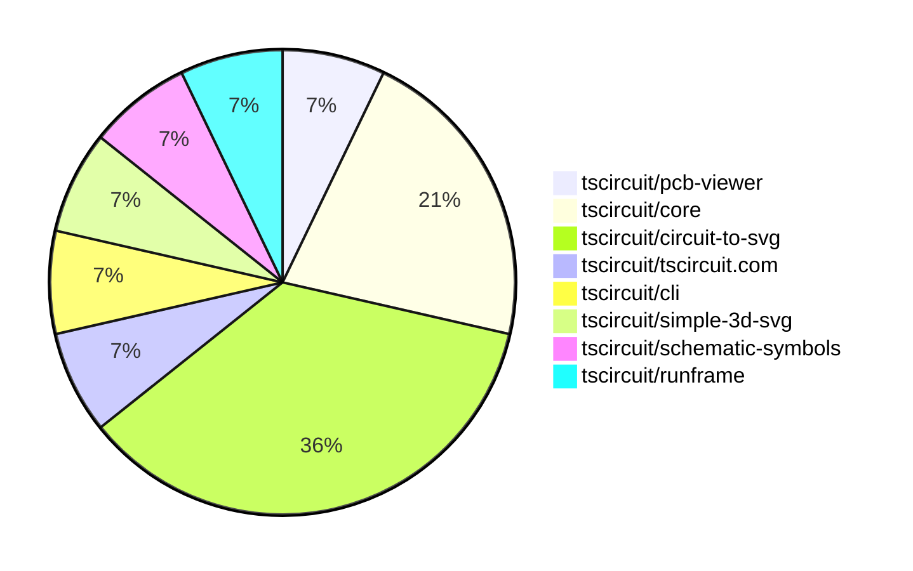

# Contribution Overview 2025-06-04

## PRs by Repository

## Contributor Overview

| Contributor | 🐳 Major | 🐙 Minor | 🐌 Tiny | ⭐ | Issues Created | Discussion Contributions |
|-------------|---------|---------|---------|-----|----------------|--------------------------|
| [seveibar](#seveibar) | 0 | 10 | 0 | ⭐⭐ | 1 | 0🔹 0🔶 0💎 |
| [techmannih](#techmannih) | 0 | 1 | 0 |  | 1 | 0🔹 0🔶 0💎 |
| [ShiboSoftwareDev](#ShiboSoftwareDev) | 0 | 1 | 0 |  | 0 | 0🔹 0🔶 0💎 |
| [andrii-balitskyi](#andrii-balitskyi) | 0 | 1 | 0 |  | 0 | 0🔹 0🔶 0💎 |
| [ArnavK-09](#ArnavK-09) | 0 | 0 | 1 |  | 0 | 0🔹 0🔶 0💎 |

### Discussion Contribution Legend

- 🔹 Normal Comments: Basic participation with minimal effort
- 🔶 Great Informative Comments: Thoughtful participation that adds value
- 💎 Incredible Comments: Exceptional participation with high-quality content

## Review Table

[reviews-received-hover]: ## "Number of reviews received for PRs for this contributor"
[approvals-received-hover]: ## "Number of approvals received for PRs this contributor authored"
[rejections-received-hover]: ## "Number of rejections received for PRs this contributor authored"
[prs-opened-hover]: ## "Number of PRs opened by this contributor"
[issues-created-hover]: ## "Number of issues created by this contributor"
[bountied-issues-hover]: ## "Number of issues this contributor created with a bounty"
[bountied-issue-$-hover]: ## "Total bounty amount placed on issues authored by this contributor"

| Contributor | Reviews Received | Approvals Received | Rejections Received | Approvals | Rejections | PRs Opened | PRs Merged | Issues Created | Bountied Issues | Bountied Issue $ |
|---|---|---|---|---|---|---|---|---|---|---|
| [ArnavK-09](#ArnavK-09) | 2 | 1 | 0 | 0 | 0 | 2 | 1 | 0 | 0 | 0 |
| [seveibar](#seveibar) | 4 | 0 | 0 | 5 | 2 | 19 | 10 | 1 | 1 | 0 |
| [graphite-app[bot]](#graphite-app[bot]) | 0 | 0 | 0 | 0 | 0 | 0 | 0 | 0 | 0 | 0 |
| [techmannih](#techmannih) | 5 | 2 | 0 | 0 | 0 | 2 | 1 | 1 | 0 | 0 |
| [ShiboSoftwareDev](#ShiboSoftwareDev) | 2 | 1 | 0 | 0 | 0 | 1 | 1 | 0 | 0 | 0 |
| [Anshgrover23](#Anshgrover23) | 4 | 1 | 2 | 0 | 0 | 1 | 0 | 0 | 0 | 0 |
| [imrishabh18](#imrishabh18) | 1 | 0 | 0 | 1 | 0 | 1 | 0 | 0 | 0 | 0 |
| [tscircuitbot](#tscircuitbot) | 0 | 0 | 0 | 0 | 0 | 6 | 0 | 0 | 0 | 0 |
| [andrii-balitskyi](#andrii-balitskyi) | 1 | 1 | 0 | 0 | 0 | 1 | 1 | 0 | 0 | 0 |

## Changes by Repository

### [tscircuit/pcb-viewer](https://github.com/tscircuit/pcb-viewer)

| PR # | Impact | Contributor | Description | Milestone Aligned |
|------|--------|-------------|-------------|-------------------|
| [#317](https://github.com/tscircuit/pcb-viewer/pull/317) | 🐌 Tiny | ArnavK-09 | Removing unnecessary dependencies streamlines the project and reduces potential maintenance overhead. | ❌ |

### [tscircuit/core](https://github.com/tscircuit/core)

| PR # | Impact | Contributor | Description | Milestone Aligned |
|------|--------|-------------|-------------|-------------------|
| [#868](https://github.com/tscircuit/core/pull/868) | 🐙 Minor | seveibar | Enhancing input validation for net selector names improves code robustness and prevents potential errors in circuit definitions. | ❌ |
| [#866](https://github.com/tscircuit/core/pull/866) | 🐙 Minor | seveibar | Enhancements to net selector validation improve error handling and input integrity. | ❌ |
| [#867](https://github.com/tscircuit/core/pull/867) | 🐙 Minor | seveibar | Enhancing selector functionality with shorthand support adds significant usability improvements for users. | ❌ |

### [tscircuit/circuit-to-svg](https://github.com/tscircuit/circuit-to-svg)

| PR # | Impact | Contributor | Description | Milestone Aligned |
|------|--------|-------------|-------------|-------------------|
| [#244](https://github.com/tscircuit/circuit-to-svg/pull/244) | 🐙 Minor | seveibar | The changes enhance the rendering of components in 3D viewers by eliminating problematic black backgrounds, improving visual clarity and usability. | ❌ |
| [#241](https://github.com/tscircuit/circuit-to-svg/pull/241) | 🐙 Minor | seveibar | Enhancements to PCB SVG generation through customizable color mappings improve flexibility and user experience. | ❌ |
| [#238](https://github.com/tscircuit/circuit-to-svg/pull/238) | 🐙 Minor | seveibar | Enhancement of SVG conversion functionality by introducing an option to control padding around the board. | ❌ |
| [#237](https://github.com/tscircuit/circuit-to-svg/pull/237) | 🐙 Minor | seveibar | Enhancing the SVG generation functionality by allowing customization of the background color adds significant value for users needing visual differentiation. | ❌ |
| [#242](https://github.com/tscircuit/circuit-to-svg/pull/242) | 🐙 Minor | techmannih | Enhancement of SMT pad support by adding polygon shape functionality. | ❌ |

### [tscircuit/tscircuit.com](https://github.com/tscircuit/tscircuit.com)

| PR # | Impact | Contributor | Description | Milestone Aligned |
|------|--------|-------------|-------------|-------------------|
| [#1194](https://github.com/tscircuit/tscircuit.com/pull/1194) | 🐙 Minor | seveibar | Enhancements to package image hashing and the introduction of a new builds page significantly improve the functionality and user experience of the application. | ❌ |

### [tscircuit/cli](https://github.com/tscircuit/cli)

| PR # | Impact | Contributor | Description | Milestone Aligned |
|------|--------|-------------|-------------|-------------------|
| [#211](https://github.com/tscircuit/cli/pull/211) | 🐙 Minor | seveibar | Enhancements to file watching in the development server improve efficiency by ignoring unnecessary .git files. | ❌ |

### [tscircuit/simple-3d-svg](https://github.com/tscircuit/simple-3d-svg)

| PR # | Impact | Contributor | Description | Milestone Aligned |
|------|--------|-------------|-------------|-------------------|
| [#10](https://github.com/tscircuit/simple-3d-svg/pull/10) | 🐙 Minor | seveibar | Enhancements to image rendering order improve visual output and fix existing issues. | ❌ |

### [tscircuit/schematic-symbols](https://github.com/tscircuit/schematic-symbols)

| PR # | Impact | Contributor | Description | Milestone Aligned |
|------|--------|-------------|-------------|-------------------|
| [#292](https://github.com/tscircuit/schematic-symbols/pull/292) | 🐙 Minor | ShiboSoftwareDev | The update introduces a more versatile ground symbol with multiple orientations, enhancing usability in schematic designs. | ❌ |

### [tscircuit/runframe](https://github.com/tscircuit/runframe)

| PR # | Impact | Contributor | Description | Milestone Aligned |
|------|--------|-------------|-------------|-------------------|
| [#708](https://github.com/tscircuit/runframe/pull/708) | 🐙 Minor | andrii-balitskyi | Enhancing error handling by ensuring render logs and progress bar reset on execution errors improves user experience and debugging. | ❌ |

## Changes by Contributor

### [ArnavK-09](https://github.com/ArnavK-09)

| PR # | Impact | Description | Milestone Aligned |
|------|--------|-------------|-------------------|
| [#317](https://github.com/tscircuit/pcb-viewer/pull/317) | 🐌 Tiny | Removing unnecessary dependencies streamlines the project and reduces potential maintenance overhead. | ❌ |

### [seveibar](https://github.com/seveibar)

| PR # | Impact | Description | Milestone Aligned |
|------|--------|-------------|-------------------|
| [#868](https://github.com/tscircuit/core/pull/868) | 🐙 Minor | Enhancing input validation for net selector names improves code robustness and prevents potential errors in circuit definitions. | ❌ |
| [#866](https://github.com/tscircuit/core/pull/866) | 🐙 Minor | Enhancements to net selector validation improve error handling and input integrity. | ❌ |
| [#867](https://github.com/tscircuit/core/pull/867) | 🐙 Minor | Enhancing selector functionality with shorthand support adds significant usability improvements for users. | ❌ |
| [#244](https://github.com/tscircuit/circuit-to-svg/pull/244) | 🐙 Minor | The changes enhance the rendering of components in 3D viewers by eliminating problematic black backgrounds, improving visual clarity and usability. | ❌ |
| [#241](https://github.com/tscircuit/circuit-to-svg/pull/241) | 🐙 Minor | Enhancements to PCB SVG generation through customizable color mappings improve flexibility and user experience. | ❌ |
| [#238](https://github.com/tscircuit/circuit-to-svg/pull/238) | 🐙 Minor | Enhancement of SVG conversion functionality by introducing an option to control padding around the board. | ❌ |
| [#237](https://github.com/tscircuit/circuit-to-svg/pull/237) | 🐙 Minor | Enhancing the SVG generation functionality by allowing customization of the background color adds significant value for users needing visual differentiation. | ❌ |
| [#1194](https://github.com/tscircuit/tscircuit.com/pull/1194) | 🐙 Minor | Enhancements to package image hashing and the introduction of a new builds page significantly improve the functionality and user experience of the application. | ❌ |
| [#211](https://github.com/tscircuit/cli/pull/211) | 🐙 Minor | Enhancements to file watching in the development server improve efficiency by ignoring unnecessary .git files. | ❌ |
| [#10](https://github.com/tscircuit/simple-3d-svg/pull/10) | 🐙 Minor | Enhancements to image rendering order improve visual output and fix existing issues. | ❌ |

### [techmannih](https://github.com/techmannih)

| PR # | Impact | Description | Milestone Aligned |
|------|--------|-------------|-------------------|
| [#242](https://github.com/tscircuit/circuit-to-svg/pull/242) | 🐙 Minor | Enhancement of SMT pad support by adding polygon shape functionality. | ❌ |

### [ShiboSoftwareDev](https://github.com/ShiboSoftwareDev)

| PR # | Impact | Description | Milestone Aligned |
|------|--------|-------------|-------------------|
| [#292](https://github.com/tscircuit/schematic-symbols/pull/292) | 🐙 Minor | The update introduces a more versatile ground symbol with multiple orientations, enhancing usability in schematic designs. | ❌ |

### [andrii-balitskyi](https://github.com/andrii-balitskyi)

| PR # | Impact | Description | Milestone Aligned |
|------|--------|-------------|-------------------|
| [#708](https://github.com/tscircuit/runframe/pull/708) | 🐙 Minor | Enhancing error handling by ensuring render logs and progress bar reset on execution errors improves user experience and debugging. | ❌ |

## Repository Owners

| Repository | Codeowners |
|------------|------------|
| [jscad-electronics](https://github.com/tscircuit/jscad-electronics/blob/main/.github/CODEOWNERS) | [seveibar](https://github.com/seveibar) |
| [tscircuit.com](https://github.com/tscircuit/tscircuit.com/blob/main/.github/CODEOWNERS) | [seveibar](https://github.com/seveibar), [imrishabh18](https://github.com/imrishabh18) |
| [cli](https://github.com/tscircuit/cli/blob/main/.github/CODEOWNERS) | [seveibar](https://github.com/seveibar) |

## Repos by Owner

| User | Repo |
|------|------|
| [seveibar](https://github.com/seveibar) | [jscad-electronics](https://github.com/tscircuit/jscad-electronics/blob/main/.github/CODEOWNERS) |
|  | [tscircuit.com](https://github.com/tscircuit/tscircuit.com/blob/main/.github/CODEOWNERS) |
|  | [cli](https://github.com/tscircuit/cli/blob/main/.github/CODEOWNERS) |
| [imrishabh18](https://github.com/imrishabh18) | [tscircuit.com](https://github.com/tscircuit/tscircuit.com/blob/main/.github/CODEOWNERS) |

