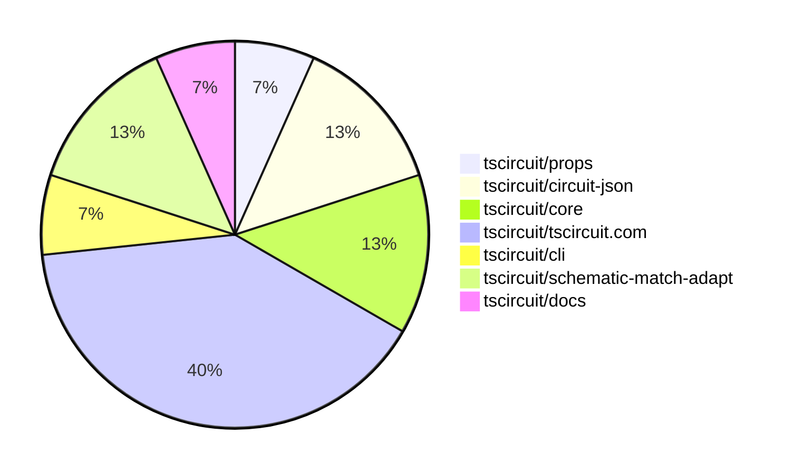

# Contribution Overview 2025-06-11

## PRs by Repository

## Contributor Overview

| Contributor | 🐳 Major | 🐙 Minor | 🐌 Tiny | ⭐ | Issues Created | Discussion Contributions |
|-------------|---------|---------|---------|-----|----------------|--------------------------|
| [seveibar](#seveibar) | 0 | 7 | 0 | ⭐⭐ | 1 | 0🔹 0🔶 0💎 |
| [imrishabh18](#imrishabh18) | 0 | 1 | 1 | ⭐ | 2 | 0🔹 0🔶 0💎 |
| [ArnavK-09](#ArnavK-09) | 0 | 2 | 0 | ⭐ | 1 | 0🔹 0🔶 0💎 |
| [Abse2001](#Abse2001) | 0 | 1 | 1 |  | 2 | 0🔹 0🔶 0💎 |
| [ShiboSoftwareDev](#ShiboSoftwareDev) | 0 | 1 | 0 |  | 0 | 0🔹 0🔶 0💎 |
| [techmannih](#techmannih) | 0 | 1 | 0 |  | 0 | 0🔹 0🔶 0💎 |

### Discussion Contribution Legend

- 🔹 Normal Comments: Basic participation with minimal effort
- 🔶 Great Informative Comments: Thoughtful participation that adds value
- 💎 Incredible Comments: Exceptional participation with high-quality content

## Review Table

[reviews-received-hover]: ## "Number of reviews received for PRs for this contributor"
[approvals-received-hover]: ## "Number of approvals received for PRs this contributor authored"
[rejections-received-hover]: ## "Number of rejections received for PRs this contributor authored"
[prs-opened-hover]: ## "Number of PRs opened by this contributor"
[issues-created-hover]: ## "Number of issues created by this contributor"
[bountied-issues-hover]: ## "Number of issues this contributor created with a bounty"
[bountied-issue-$-hover]: ## "Total bounty amount placed on issues authored by this contributor"

| Contributor | Reviews Received | Approvals Received | Rejections Received | Approvals | Rejections | PRs Opened | PRs Merged | Issues Created | Bountied Issues | Bountied Issue $ |
|---|---|---|---|---|---|---|---|---|---|---|
| [Abse2001](#Abse2001) | 3 | 2 | 0 | 0 | 0 | 2 | 2 | 2 | 0 | 0 |
| [seveibar](#seveibar) | 1 | 0 | 1 | 9 | 0 | 8 | 7 | 1 | 0 | 0 |
| [techmannih](#techmannih) | 4 | 3 | 0 | 0 | 0 | 3 | 1 | 0 | 0 | 0 |
| [imrishabh18](#imrishabh18) | 2 | 1 | 0 | 2 | 0 | 3 | 2 | 2 | 1 | 5 |
| [graphite-app[bot]](#graphite-app[bot]) | 0 | 0 | 0 | 0 | 0 | 0 | 0 | 0 | 0 | 0 |
| [ShiboSoftwareDev](#ShiboSoftwareDev) | 1 | 1 | 0 | 0 | 1 | 2 | 1 | 0 | 0 | 0 |
| [ArnavK-09](#ArnavK-09) | 10 | 4 | 0 | 0 | 0 | 4 | 2 | 1 | 0 | 0 |
| [tscircuitbot](#tscircuitbot) | 0 | 0 | 0 | 0 | 0 | 4 | 0 | 0 | 0 | 0 |

## Changes by Repository

### [tscircuit/props](https://github.com/tscircuit/props)

| PR # | Impact | Contributor | Description | Milestone Aligned |
|------|--------|-------------|-------------|-------------------|
| [#276](https://github.com/tscircuit/props/pull/276) | 🐙 Minor | Abse2001 | Refactoring and renaming of anchor constants for consistency and clarity in the codebase. | ❌ |

### [tscircuit/circuit-json](https://github.com/tscircuit/circuit-json)

| PR # | Impact | Contributor | Description | Milestone Aligned |
|------|--------|-------------|-------------|-------------------|
| [#219](https://github.com/tscircuit/circuit-json/pull/219) | 🐙 Minor | techmannih | Enhancing type safety through the use of discriminated unions improves code reliability and maintainability. | ❌ |
| [#220](https://github.com/tscircuit/circuit-json/pull/220) | 🐌 Tiny | Abse2001 | Enhances the module by adding the NinePointAnchor export, potentially improving functionality. | ❌ |

### [tscircuit/core](https://github.com/tscircuit/core)

| PR # | Impact | Contributor | Description | Milestone Aligned |
|------|--------|-------------|-------------|-------------------|
| [#907](https://github.com/tscircuit/core/pull/907) | 🐙 Minor | ShiboSoftwareDev | The implementation of a restriction against nesting boards enhances the integrity of the component structure. | ❌ |
| [#905](https://github.com/tscircuit/core/pull/905) | 🐙 Minor | seveibar | The addition of the SolderJumper component enhances the library's functionality by providing a new component for circuit design, which is essential for building keyboards. | ❌ |

### [tscircuit/tscircuit.com](https://github.com/tscircuit/tscircuit.com)

| PR # | Impact | Contributor | Description | Milestone Aligned |
|------|--------|-------------|-------------|-------------------|
| [#1257](https://github.com/tscircuit/tscircuit.com/pull/1257) | 🐙 Minor | seveibar | Enhancement of the user experience by ensuring the README file is displayed correctly after package files load. | ❌ |
| [#1256](https://github.com/tscircuit/tscircuit.com/pull/1256) | 🐙 Minor | seveibar | Enhancements to the package build status polling mechanism improve responsiveness and user experience. | ❌ |
| [#1255](https://github.com/tscircuit/tscircuit.com/pull/1255) | 🐙 Minor | seveibar | Enhances user experience by providing real-time build time updates, making it easier to track build progress. | ❌ |
| [#1254](https://github.com/tscircuit/tscircuit.com/pull/1254) | 🐙 Minor | imrishabh18 | Enhances user experience by allowing users to reload build logs easily. | ❌ |
| [#1251](https://github.com/tscircuit/tscircuit.com/pull/1251) | 🐙 Minor | ArnavK-09 | Refactoring the import dialog to handle packages instead of snippets enhances the functionality of the editor. | ❌ |
| [#1248](https://github.com/tscircuit/tscircuit.com/pull/1248) | 🐙 Minor | ArnavK-09 | Enhancements to error handling and state management significantly improve user experience and maintainability of the JLCPCB import dialog. | ❌ |

### [tscircuit/cli](https://github.com/tscircuit/cli)

| PR # | Impact | Contributor | Description | Milestone Aligned |
|------|--------|-------------|-------------|-------------------|
| [#225](https://github.com/tscircuit/cli/pull/225) | 🐙 Minor | seveibar | Enhancing the CLI with 3D snapshot capabilities significantly improves its functionality and user experience. | ❌ |

### [tscircuit/schematic-match-adapt](https://github.com/tscircuit/schematic-match-adapt)

| PR # | Impact | Contributor | Description | Milestone Aligned |
|------|--------|-------------|-------------|-------------------|
| [#39](https://github.com/tscircuit/schematic-match-adapt/pull/39) | 🐙 Minor | seveibar | The changes enhance the application's functionality by fixing issues and updating test snapshots, ensuring better reliability and accuracy in testing. | ❌ |
| [#38](https://github.com/tscircuit/schematic-match-adapt/pull/38) | 🐙 Minor | seveibar | Enhancements to circuit layout and JSON handling improve overall functionality and usability. | ❌ |

### [tscircuit/docs](https://github.com/tscircuit/docs)

| PR # | Impact | Contributor | Description | Milestone Aligned |
|------|--------|-------------|-------------|-------------------|
| [#61](https://github.com/tscircuit/docs/pull/61) | 🐌 Tiny | imrishabh18 | Enhances documentation by providing comprehensive usage instructions and examples for the `tsci export` command. | ❌ |

## Changes by Contributor

### [Abse2001](https://github.com/Abse2001)

| PR # | Impact | Description | Milestone Aligned |
|------|--------|-------------|-------------------|
| [#276](https://github.com/tscircuit/props/pull/276) | 🐙 Minor | Refactoring and renaming of anchor constants for consistency and clarity in the codebase. | ❌ |
| [#220](https://github.com/tscircuit/circuit-json/pull/220) | 🐌 Tiny | Enhances the module by adding the NinePointAnchor export, potentially improving functionality. | ❌ |

### [techmannih](https://github.com/techmannih)

| PR # | Impact | Description | Milestone Aligned |
|------|--------|-------------|-------------------|
| [#219](https://github.com/tscircuit/circuit-json/pull/219) | 🐙 Minor | Enhancing type safety through the use of discriminated unions improves code reliability and maintainability. | ❌ |

### [ShiboSoftwareDev](https://github.com/ShiboSoftwareDev)

| PR # | Impact | Description | Milestone Aligned |
|------|--------|-------------|-------------------|
| [#907](https://github.com/tscircuit/core/pull/907) | 🐙 Minor | The implementation of a restriction against nesting boards enhances the integrity of the component structure. | ❌ |

### [seveibar](https://github.com/seveibar)

| PR # | Impact | Description | Milestone Aligned |
|------|--------|-------------|-------------------|
| [#905](https://github.com/tscircuit/core/pull/905) | 🐙 Minor | The addition of the SolderJumper component enhances the library's functionality by providing a new component for circuit design, which is essential for building keyboards. | ❌ |
| [#1257](https://github.com/tscircuit/tscircuit.com/pull/1257) | 🐙 Minor | Enhancement of the user experience by ensuring the README file is displayed correctly after package files load. | ❌ |
| [#1256](https://github.com/tscircuit/tscircuit.com/pull/1256) | 🐙 Minor | Enhancements to the package build status polling mechanism improve responsiveness and user experience. | ❌ |
| [#1255](https://github.com/tscircuit/tscircuit.com/pull/1255) | 🐙 Minor | Enhances user experience by providing real-time build time updates, making it easier to track build progress. | ❌ |
| [#225](https://github.com/tscircuit/cli/pull/225) | 🐙 Minor | Enhancing the CLI with 3D snapshot capabilities significantly improves its functionality and user experience. | ❌ |
| [#39](https://github.com/tscircuit/schematic-match-adapt/pull/39) | 🐙 Minor | The changes enhance the application's functionality by fixing issues and updating test snapshots, ensuring better reliability and accuracy in testing. | ❌ |
| [#38](https://github.com/tscircuit/schematic-match-adapt/pull/38) | 🐙 Minor | Enhancements to circuit layout and JSON handling improve overall functionality and usability. | ❌ |

### [imrishabh18](https://github.com/imrishabh18)

| PR # | Impact | Description | Milestone Aligned |
|------|--------|-------------|-------------------|
| [#1254](https://github.com/tscircuit/tscircuit.com/pull/1254) | 🐙 Minor | Enhances user experience by allowing users to reload build logs easily. | ❌ |
| [#61](https://github.com/tscircuit/docs/pull/61) | 🐌 Tiny | Enhances documentation by providing comprehensive usage instructions and examples for the `tsci export` command. | ❌ |

### [ArnavK-09](https://github.com/ArnavK-09)

| PR # | Impact | Description | Milestone Aligned |
|------|--------|-------------|-------------------|
| [#1251](https://github.com/tscircuit/tscircuit.com/pull/1251) | 🐙 Minor | Refactoring the import dialog to handle packages instead of snippets enhances the functionality of the editor. | ❌ |
| [#1248](https://github.com/tscircuit/tscircuit.com/pull/1248) | 🐙 Minor | Enhancements to error handling and state management significantly improve user experience and maintainability of the JLCPCB import dialog. | ❌ |

## Repository Owners

| Repository | Codeowners |
|------------|------------|
| [tscircuit.com](https://github.com/tscircuit/tscircuit.com/blob/main/.github/CODEOWNERS) | [seveibar](https://github.com/seveibar), [imrishabh18](https://github.com/imrishabh18) |
| [cli](https://github.com/tscircuit/cli/blob/main/.github/CODEOWNERS) | [seveibar](https://github.com/seveibar) |

## Repos by Owner

| User | Repo |
|------|------|
| [seveibar](https://github.com/seveibar) | [tscircuit.com](https://github.com/tscircuit/tscircuit.com/blob/main/.github/CODEOWNERS) |
|  | [cli](https://github.com/tscircuit/cli/blob/main/.github/CODEOWNERS) |
| [imrishabh18](https://github.com/imrishabh18) | [tscircuit.com](https://github.com/tscircuit/tscircuit.com/blob/main/.github/CODEOWNERS) |

