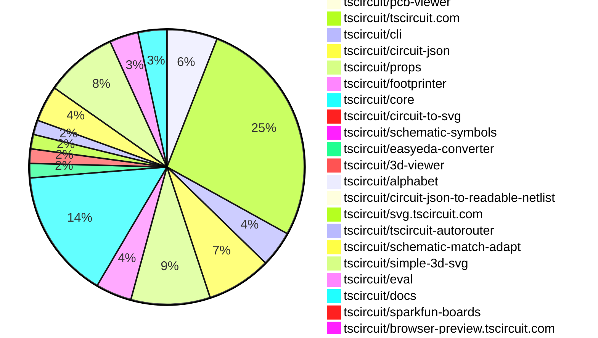

# Contribution Overview 2025-06-11

## PRs by Repository

## Contributor Overview

| Contributor | 🐳 Major | 🐙 Minor | 🐌 Tiny | ⭐ | Issues Created | Discussion Contributions |
|-------------|---------|---------|---------|-----|----------------|--------------------------|
| [seveibar](#seveibar) | 0 | 54 | 8 | 👑👑👑 | 7 | 0🔹 0🔶 0💎 |
| [imrishabh18](#imrishabh18) | 1 | 10 | 7 | ⭐⭐⭐ | 6 | 0🔹 0🔶 0💎 |
| [techmannih](#techmannih) | 0 | 13 | 0 | ⭐⭐⭐ | 1 | 0🔹 0🔶 0💎 |
| [ArnavK-09](#ArnavK-09) | 1 | 13 | 0 | ⭐⭐⭐ | 8 | 0🔹 0🔶 0💎 |
| [ShiboSoftwareDev](#ShiboSoftwareDev) | 0 | 5 | 4 | ⭐⭐ | 4 | 0🔹 0🔶 0💎 |
| [Abse2001](#Abse2001) | 0 | 6 | 2 | ⭐⭐ | 3 | 0🔹 0🔶 0💎 |
| [Anshgrover23](#Anshgrover23) | 0 | 1 | 0 | ⭐ | 5 | 0🔹 0🔶 0💎 |
| [tscircuitbot](#tscircuitbot) | 0 | 0 | 1 |  | 0 | 0🔹 0🔶 0💎 |

### Discussion Contribution Legend

- 🔹 Normal Comments: Basic participation with minimal effort
- 🔶 Great Informative Comments: Thoughtful participation that adds value
- 💎 Incredible Comments: Exceptional participation with high-quality content

## Review Table

[reviews-received-hover]: ## "Number of reviews received for PRs for this contributor"
[approvals-received-hover]: ## "Number of approvals received for PRs this contributor authored"
[rejections-received-hover]: ## "Number of rejections received for PRs this contributor authored"
[prs-opened-hover]: ## "Number of PRs opened by this contributor"
[issues-created-hover]: ## "Number of issues created by this contributor"
[bountied-issues-hover]: ## "Number of issues this contributor created with a bounty"
[bountied-issue-$-hover]: ## "Total bounty amount placed on issues authored by this contributor"

| Contributor | Reviews Received | Approvals Received | Rejections Received | Approvals | Rejections | PRs Opened | PRs Merged | Issues Created | Bountied Issues | Bountied Issue $ |
|---|---|---|---|---|---|---|---|---|---|---|
| [ArnavK-09](#ArnavK-09) | 22 | 14 | 2 | 0 | 0 | 16 | 14 | 8 | 1 | 10 |
| [seveibar](#seveibar) | 17 | 1 | 1 | 48 | 7 | 83 | 63 | 7 | 3 | 59 |
| [techmannih](#techmannih) | 23 | 16 | 2 | 1 | 7 | 20 | 13 | 1 | 0 | 0 |
| [Abse2001](#Abse2001) | 11 | 8 | 0 | 0 | 0 | 12 | 8 | 3 | 0 | 0 |
| [graphite-app[bot]](#graphite-app[bot]) | 0 | 0 | 0 | 0 | 0 | 0 | 0 | 0 | 0 | 0 |
| [ShiboSoftwareDev](#ShiboSoftwareDev) | 16 | 9 | 3 | 2 | 1 | 20 | 9 | 4 | 0 | 0 |
| [Anshgrover23](#Anshgrover23) | 2 | 2 | 0 | 2 | 0 | 1 | 1 | 5 | 0 | 0 |
| [imrishabh18](#imrishabh18) | 12 | 6 | 1 | 4 | 1 | 21 | 18 | 6 | 4 | 25 |
| [andrii-balitskyi](#andrii-balitskyi) | 8 | 1 | 3 | 0 | 0 | 2 | 0 | 0 | 0 | 0 |
| [abhiiii482](#abhiiii482) | 6 | 0 | 4 | 0 | 0 | 4 | 0 | 0 | 0 | 0 |
| [tscircuitbot](#tscircuitbot) | 0 | 0 | 0 | 0 | 0 | 37 | 1 | 0 | 0 | 0 |

## Changes by Repository

### [tscircuit/runframe](https://github.com/tscircuit/runframe)

| PR # | Impact | Contributor | Description | Milestone Aligned |
|------|--------|-------------|-------------|-------------------|
| [#721](https://github.com/tscircuit/runframe/pull/721) | 🐳 Major | ArnavK-09 | Enhancements to component details improve user experience and functionality in the import process. | ❌ |
| [#748](https://github.com/tscircuit/runframe/pull/748) | 🐙 Minor | ArnavK-09 | Enhancing user experience by preventing body scrolling when in fullscreen mode, ensuring a focused view of the circuit preview. | ❌ |
| [#758](https://github.com/tscircuit/runframe/pull/758) | 🐙 Minor | seveibar | Enhancing error reporting by including eval version details significantly improves debugging and user experience. | ❌ |
| [#750](https://github.com/tscircuit/runframe/pull/750) | 🐙 Minor | seveibar | Integrating an AI Review dialog enhances user interaction and feedback mechanisms within the CLI. | ❌ |
| [#741](https://github.com/tscircuit/runframe/pull/741) | 🐙 Minor | imrishabh18 | Enhances user experience by providing clearer error messages in the order quote dialog. | ❌ |
| [#742](https://github.com/tscircuit/runframe/pull/742) | 🐌 Tiny | ShiboSoftwareDev | Changing the dependency of '@tscircuit/eval' to a dev dependency streamlines the production environment and reduces the final bundle size. | ❌ |
| [#757](https://github.com/tscircuit/runframe/pull/757) | 🐌 Tiny | imrishabh18 | Removing unnecessary dependencies can streamline the project and reduce potential conflicts. | ❌ |

### [tscircuit/pcb-viewer](https://github.com/tscircuit/pcb-viewer)

| PR # | Impact | Contributor | Description | Milestone Aligned |
|------|--------|-------------|-------------|-------------------|
| [#331](https://github.com/tscircuit/pcb-viewer/pull/331) | 🐙 Minor | ArnavK-09 | Adjusts the z-index of the toolbar overlay to ensure accessibility during error states. | ❌ |

### [tscircuit/tscircuit.com](https://github.com/tscircuit/tscircuit.com)

| PR # | Impact | Contributor | Description | Milestone Aligned |
|------|--------|-------------|-------------|-------------------|
| [#1291](https://github.com/tscircuit/tscircuit.com/pull/1291) | 🐙 Minor | ArnavK-09 | Refactoring the logic for determining important files enhances code clarity and maintainability. | ❌ |
| [#1268](https://github.com/tscircuit/tscircuit.com/pull/1268) | 🐙 Minor | ArnavK-09 | Enhancements to the UI prevent important file tabs from overlapping, improving user experience. | ❌ |
| [#1276](https://github.com/tscircuit/tscircuit.com/pull/1276) | 🐙 Minor | ArnavK-09 | Enhances user experience by preventing misclicks that could lead to navigation errors. | ❌ |
| [#1275](https://github.com/tscircuit/tscircuit.com/pull/1275) | 🐙 Minor | ArnavK-09 | Fixes a bug related to saving package names by ensuring that whitespace is trimmed from the input values before submission. | ❌ |
| [#1267](https://github.com/tscircuit/tscircuit.com/pull/1267) | 🐙 Minor | ArnavK-09 | Fixes an issue where templates were not being loaded correctly, ensuring proper functionality of the file management system. | ❌ |
| [#1266](https://github.com/tscircuit/tscircuit.com/pull/1266) | 🐙 Minor | ArnavK-09 | Enhancements to user experience during the authentication process by providing visual feedback during redirects. | ❌ |
| [#1252](https://github.com/tscircuit/tscircuit.com/pull/1252) | 🐙 Minor | ArnavK-09 | Enhancements to the SearchComponent and UI layout significantly improve user interaction and experience. | ❌ |
| [#1253](https://github.com/tscircuit/tscircuit.com/pull/1253) | 🐙 Minor | ArnavK-09 | Enhancements to the sign-in process and redirect handling improve user experience and prevent data loss during authentication. | ❌ |
| [#1251](https://github.com/tscircuit/tscircuit.com/pull/1251) | 🐙 Minor | ArnavK-09 | Refactoring the import dialog to handle packages instead of snippets enhances the functionality of the editor. | ❌ |
| [#1248](https://github.com/tscircuit/tscircuit.com/pull/1248) | 🐙 Minor | ArnavK-09 | Enhancements to error handling and state management significantly improve user experience and maintainability. | ❌ |
| [#1285](https://github.com/tscircuit/tscircuit.com/pull/1285) | 🐙 Minor | seveibar | Refactoring the API endpoint to accept a JSON body enhances the flexibility and usability of the endpoint. | ❌ |
| [#1284](https://github.com/tscircuit/tscircuit.com/pull/1284) | 🐙 Minor | seveibar | Refactoring the API endpoint to accept a JSON body enhances the flexibility and usability of the endpoint. | ❌ |
| [#1283](https://github.com/tscircuit/tscircuit.com/pull/1283) | 🐙 Minor | seveibar | Enhances user experience by ensuring the search dropdown closes upon selection, improving interface responsiveness. | ❌ |
| [#1281](https://github.com/tscircuit/tscircuit.com/pull/1281) | 🐙 Minor | seveibar | Integrates AI review creation and mapping into package release workflows, enhancing the review process. | ❌ |
| [#1280](https://github.com/tscircuit/tscircuit.com/pull/1280) | 🐙 Minor | seveibar | Enhancing keyboard navigation for search results significantly improves user experience and accessibility. | ❌ |
| [#1279](https://github.com/tscircuit/tscircuit.com/pull/1279) | 🐙 Minor | seveibar | Enhancing the API with datasheet management capabilities significantly improves functionality. | ❌ |
| [#1278](https://github.com/tscircuit/tscircuit.com/pull/1278) | 🐙 Minor | seveibar | The addition of AI review endpoints enhances the application's functionality by enabling CRUD operations for AI reviews. | ❌ |
| [#1258](https://github.com/tscircuit/tscircuit.com/pull/1258) | 🐙 Minor | seveibar | Enhancements to the API for conditional inclusion of AI review data, improving flexibility in data retrieval. | ❌ |
| [#1239](https://github.com/tscircuit/tscircuit.com/pull/1239) | 🐙 Minor | seveibar | Refactoring the toast notification system to utilize react-hot-toast enhances the user experience and simplifies the codebase. | ❌ |
| [#1257](https://github.com/tscircuit/tscircuit.com/pull/1257) | 🐙 Minor | seveibar | Ensures the README file is prioritized for display after package files load, enhancing user experience. | ❌ |
| [#1256](https://github.com/tscircuit/tscircuit.com/pull/1256) | 🐙 Minor | seveibar | Enhancements to polling frequency for package build status improve responsiveness and user experience. | ❌ |
| [#1255](https://github.com/tscircuit/tscircuit.com/pull/1255) | 🐙 Minor | seveibar | Enhances user experience by providing real-time build time updates, making it easier to track build progress. | ❌ |
| [#1286](https://github.com/tscircuit/tscircuit.com/pull/1286) | 🐙 Minor | imrishabh18 | Enhances the prefetching mechanism for specific pages and user profiles, improving performance and user experience. | ❌ |
| [#1288](https://github.com/tscircuit/tscircuit.com/pull/1288) | 🐙 Minor | imrishabh18 | Enhances the filtering logic for important files in the root directory, improving the accuracy of file importance display. | ❌ |
| [#1263](https://github.com/tscircuit/tscircuit.com/pull/1263) | 🐙 Minor | imrishabh18 | Enhances user experience by ensuring the newly created file is immediately selected in the sidebar, streamlining file management. | ❌ |
| [#1260](https://github.com/tscircuit/tscircuit.com/pull/1260) | 🐙 Minor | imrishabh18 | Enhancements to error handling provide clearer feedback to users during fork operations, improving user experience. | ❌ |
| [#1259](https://github.com/tscircuit/tscircuit.com/pull/1259) | 🐙 Minor | imrishabh18 | Adjusts the position of the Toaster component to enhance user experience by ensuring it appears at the bottom right of the screen. | ❌ |
| [#1254](https://github.com/tscircuit/tscircuit.com/pull/1254) | 🐙 Minor | imrishabh18 | Enhances user experience by allowing users to reload build logs easily. | ❌ |
| [#1277](https://github.com/tscircuit/tscircuit.com/pull/1277) | 🐌 Tiny | seveibar | Bumping the version of a dependency in the package.json file enhances the project's functionality and ensures compatibility with the latest features and fixes. | ❌ |
| [#1273](https://github.com/tscircuit/tscircuit.com/pull/1273) | 🐌 Tiny | seveibar | Adding a new development dependency enhances the project's capabilities for evaluation tasks. | ❌ |
| [#1265](https://github.com/tscircuit/tscircuit.com/pull/1265) | 🐌 Tiny | ShiboSoftwareDev | The update enhances dependency management by removing a nested dependency, which can lead to improved performance and reduced complexity. | ❌ |
| [#1287](https://github.com/tscircuit/tscircuit.com/pull/1287) | 🐌 Tiny | imrishabh18 | Updating the runframe version ensures the project benefits from the latest improvements and fixes in that dependency. | ❌ |

### [tscircuit/cli](https://github.com/tscircuit/cli)

| PR # | Impact | Contributor | Description | Milestone Aligned |
|------|--------|-------------|-------------|-------------------|
| [#226](https://github.com/tscircuit/cli/pull/226) | 🐙 Minor | ArnavK-09 | Enhances user experience by prompting for a desired directory when project initialization is declined in the current directory. | ❌ |
| [#229](https://github.com/tscircuit/cli/pull/229) | 🐙 Minor | seveibar | Enhancements to the GitHub Actions setup process improve workflow organization and compatibility with the latest commander version. | ❌ |
| [#228](https://github.com/tscircuit/cli/pull/228) | 🐙 Minor | seveibar | Enhances the CLI by injecting a session token into the runframe HTML, improving security and user experience. | ❌ |
| [#225](https://github.com/tscircuit/cli/pull/225) | 🐙 Minor | seveibar | Enhancements to the snapshot command significantly improve the CLI's functionality by adding 3D SVG snapshot capabilities and updating tests accordingly. | ❌ |
| [#227](https://github.com/tscircuit/cli/pull/227) | 🐌 Tiny | ShiboSoftwareDev | Updating dependencies to ensure compatibility and potentially improve performance. | ❌ |

### [tscircuit/circuit-json](https://github.com/tscircuit/circuit-json)

| PR # | Impact | Contributor | Description | Milestone Aligned |
|------|--------|-------------|-------------|-------------------|
| [#229](https://github.com/tscircuit/circuit-json/pull/229) | 🐙 Minor | techmannih | Enhancement of the simple inductor component by introducing an optional maximum current rating attribute. | ❌ |
| [#223](https://github.com/tscircuit/circuit-json/pull/223) | 🐙 Minor | techmannih | Enhances type safety by ensuring type consistency between the defined interface and its inferred type. | ❌ |
| [#222](https://github.com/tscircuit/circuit-json/pull/222) | 🐙 Minor | techmannih | Enhancement of type safety by ensuring type consistency between defined and inferred types for the simple potentiometer component. | ❌ |
| [#219](https://github.com/tscircuit/circuit-json/pull/219) | 🐙 Minor | techmannih | Enhancing type safety through the use of discriminated unions improves code reliability and maintainability. | ❌ |
| [#226](https://github.com/tscircuit/circuit-json/pull/226) | 🐙 Minor | seveibar | Enhancing flexibility in the schematic_box interface by making schematic_component_id optional adds value to the codebase. | ❌ |
| [#225](https://github.com/tscircuit/circuit-json/pull/225) | 🐙 Minor | seveibar | Enhancements to type validation and deprecation of an outdated component improve code quality and maintainability. | ❌ |
| [#221](https://github.com/tscircuit/circuit-json/pull/221) | 🐙 Minor | seveibar | Introduces new ground plane types and thermal spoke patterns, enhancing the PCB design capabilities. | ❌ |
| [#227](https://github.com/tscircuit/circuit-json/pull/227) | 🐌 Tiny | Abse2001 | Adjusts package dependencies to resolve type checking issues, enhancing compatibility and stability. | ❌ |
| [#220](https://github.com/tscircuit/circuit-json/pull/220) | 🐌 Tiny | Abse2001 | Adding the NinePointAnchor export enhances the module's functionality by making it accessible for other parts of the application. | ❌ |

### [tscircuit/props](https://github.com/tscircuit/props)

| PR # | Impact | Contributor | Description | Milestone Aligned |
|------|--------|-------------|-------------|-------------------|
| [#287](https://github.com/tscircuit/props/pull/287) | 🐙 Minor | techmannih | Enhancement of transistor properties by including the IGBT type, expanding the component's versatility. | ❌ |
| [#285](https://github.com/tscircuit/props/pull/285) | 🐙 Minor | techmannih | Enhancement of inductor properties by introducing an optional maxCurrentRating, improving component configurability. | ❌ |
| [#279](https://github.com/tscircuit/props/pull/279) | 🐙 Minor | techmannih | Enhancing type safety through the implementation of discriminated unions improves code reliability and maintainability. | ❌ |
| [#275](https://github.com/tscircuit/props/pull/275) | 🐙 Minor | techmannih | Enhancing type safety through the use of discriminated unions improves code reliability and maintainability. | ❌ |
| [#284](https://github.com/tscircuit/props/pull/284) | 🐙 Minor | Abse2001 | Enhancements to group properties improve layout flexibility and usability. | ❌ |
| [#276](https://github.com/tscircuit/props/pull/276) | 🐙 Minor | Abse2001 | Refactoring and renaming of anchor constants for consistency and clarity in the codebase. | ❌ |
| [#283](https://github.com/tscircuit/props/pull/283) | 🐙 Minor | seveibar | Enhancements to documentation generation ensure consistent and organized output, improving developer experience. | ❌ |
| [#282](https://github.com/tscircuit/props/pull/282) | 🐙 Minor | seveibar | Enhancing flexibility in border properties by allowing null values improves component configurability. | ❌ |
| [#281](https://github.com/tscircuit/props/pull/281) | 🐙 Minor | seveibar | Enhancing the `<group/>` component with a new `border` property improves layout customization options for users. | ❌ |
| [#280](https://github.com/tscircuit/props/pull/280) | 🐙 Minor | seveibar | Enhancement of group properties by introducing an optional cellBorder feature for better layout customization. | ❌ |
| [#277](https://github.com/tscircuit/props/pull/277) | 🐙 Minor | seveibar | Removing the default value for the footprintVariant enhances the flexibility of the testpoint component by requiring explicit definitions, which can lead to more accurate configurations. | ❌ |

### [tscircuit/footprinter](https://github.com/tscircuit/footprinter)

| PR # | Impact | Contributor | Description | Milestone Aligned |
|------|--------|-------------|-------------|-------------------|
| [#299](https://github.com/tscircuit/footprinter/pull/299) | 🐙 Minor | techmannih | Enhancements to the pad function improve the output by including parameters, which aids in debugging and testing. | ❌ |
| [#296](https://github.com/tscircuit/footprinter/pull/296) | 🐙 Minor | techmannih | The addition of the SOT-6 footprint enhances the library's capabilities for PCB design, allowing for more component options. | ❌ |
| [#294](https://github.com/tscircuit/footprinter/pull/294) | 🐙 Minor | seveibar | Introducing a new option for square pads in plated holes enhances the flexibility of the footprint design. | ❌ |
| [#292](https://github.com/tscircuit/footprinter/pull/292) | 🐙 Minor | seveibar | Introducing a new footprint generator enhances the library's functionality for circuit design. | ❌ |
| [#297](https://github.com/tscircuit/footprinter/pull/297) | 🐌 Tiny | seveibar | Transitioning from a binary to a text-based lockfile enhances readability and version control compatibility. | ❌ |

### [tscircuit/core](https://github.com/tscircuit/core)

| PR # | Impact | Contributor | Description | Milestone Aligned |
|------|--------|-------------|-------------|-------------------|
| [#911](https://github.com/tscircuit/core/pull/911) | 🐳 Major | imrishabh18 | Enhancements to pin mapping detection and regression testing improve the reliability of the schematic box dimensions. | ✅ |
| [#894](https://github.com/tscircuit/core/pull/894) | 🐙 Minor | techmannih | Enhances the SmtPad component by adding support for polygon shapes, improving flexibility in PCB design. | ❌ |
| [#924](https://github.com/tscircuit/core/pull/924) | 🐙 Minor | Abse2001 | Enhancements to the schematic border functionality improve the visual representation of grouped components in circuit designs. | ❌ |
| [#921](https://github.com/tscircuit/core/pull/921) | 🐙 Minor | Abse2001 | Enhancement of the SchematicBox component's positioning logic for improved layout accuracy. | ❌ |
| [#891](https://github.com/tscircuit/core/pull/891) | 🐙 Minor | Abse2001 | Enhances the SchematicBox component by adding flexible title alignment options, improving usability and visual presentation. | ❌ |
| [#928](https://github.com/tscircuit/core/pull/928) | 🐙 Minor | seveibar | Enhancements to jumper components ensure they default to single-sided layouts when schematic port arrangements are empty, improving usability and functionality. | ❌ |
| [#925](https://github.com/tscircuit/core/pull/925) | 🐙 Minor | seveibar | Enhancing error handling in autorouting by introducing a dedicated error class that includes package version information. | ❌ |
| [#923](https://github.com/tscircuit/core/pull/923) | 🐙 Minor | seveibar | Enhancements to the RootCircuit class improve its robustness by allowing it to encapsulate non-group elements, thus enhancing circuit rendering capabilities. | ❌ |
| [#922](https://github.com/tscircuit/core/pull/922) | 🐙 Minor | seveibar | Enables circuits to function without a mandatory top-level board, enhancing flexibility in circuit design. | ❌ |
| [#918](https://github.com/tscircuit/core/pull/918) | 🐙 Minor | seveibar | Enhancements to the selector functionality allow for greater flexibility in defining custom net names, improving usability. | ❌ |
| [#912](https://github.com/tscircuit/core/pull/912) | 🐙 Minor | seveibar | The addition of the TestPoint component enhances the library's functionality by providing a new component for PCB design, which is essential for building keyboards. | ❌ |
| [#905](https://github.com/tscircuit/core/pull/905) | 🐙 Minor | seveibar | The addition of the SolderJumper component enhances the library's functionality by providing a new component for circuit design, which is essential for building keyboards. | ❌ |
| [#920](https://github.com/tscircuit/core/pull/920) | 🐙 Minor | ShiboSoftwareDev | Fixes a bug related to the schematic symbol name derivation for solder jumpers, enhancing the accuracy of schematic representations. | ❌ |
| [#915](https://github.com/tscircuit/core/pull/915) | 🐙 Minor | ShiboSoftwareDev | Enhancement of trace display functionality by ensuring proper label rendering for schematic connections. | ❌ |
| [#907](https://github.com/tscircuit/core/pull/907) | 🐙 Minor | ShiboSoftwareDev | The implementation prevents the addition of nested boards, enhancing the integrity of the board structure. | ❌ |
| [#908](https://github.com/tscircuit/core/pull/908) | 🐙 Minor | imrishabh18 | Enhancing error messages for net names improves user experience and debugging efficiency. | ❌ |
| [#917](https://github.com/tscircuit/core/pull/917) | 🐌 Tiny | ShiboSoftwareDev | Updating the autorouter dependency enhances the project's capabilities and ensures compatibility with the latest features. | ❌ |
| [#926](https://github.com/tscircuit/core/pull/926) | 🐌 Tiny | imrishabh18 | The addition of the import syntax type enhances the clarity and correctness of the code, ensuring proper handling of JSON imports. | ❌ |

### [tscircuit/circuit-to-svg](https://github.com/tscircuit/circuit-to-svg)

| PR # | Impact | Contributor | Description | Milestone Aligned |
|------|--------|-------------|-------------|-------------------|
| [#256](https://github.com/tscircuit/circuit-to-svg/pull/256) | 🐙 Minor | techmannih | Enhances the bounding box calculations for net labels, improving layout accuracy in schematic representations. | ❌ |

### [tscircuit/schematic-symbols](https://github.com/tscircuit/schematic-symbols)

| PR # | Impact | Contributor | Description | Milestone Aligned |
|------|--------|-------------|-------------|-------------------|
| [#306](https://github.com/tscircuit/schematic-symbols/pull/306) | 🐙 Minor | techmannih | Enhancing the schematic symbols library by adding multiple orientations of the Schottky diode symbol improves usability for circuit designers. | ❌ |

### [tscircuit/easyeda-converter](https://github.com/tscircuit/easyeda-converter)

| PR # | Impact | Contributor | Description | Milestone Aligned |
|------|--------|-------------|-------------|-------------------|
| [#243](https://github.com/tscircuit/easyeda-converter/pull/243) | 🐙 Minor | Abse2001 | Enhancements to the import functionality for JLCPCB components, improving reliability and error handling. | ❌ |
| [#234](https://github.com/tscircuit/easyeda-converter/pull/234) | 🐙 Minor | Anshgrover23 | Enhancements to data type handling for improved flexibility in the schema. | ❌ |

### [tscircuit/3d-viewer](https://github.com/tscircuit/3d-viewer)

| PR # | Impact | Contributor | Description | Milestone Aligned |
|------|--------|-------------|-------------|-------------------|
| [#336](https://github.com/tscircuit/3d-viewer/pull/336) | 🐙 Minor | seveibar | Enhancements to grid sizing based on board dimensions significantly improve the user experience in the viewer. | ❌ |
| [#338](https://github.com/tscircuit/3d-viewer/pull/338) | 🐙 Minor | ShiboSoftwareDev | Adjusts board creation logic to ensure outlines are correctly positioned, enhancing the accuracy of the 3D viewer. | ❌ |

### [tscircuit/alphabet](https://github.com/tscircuit/alphabet)

| PR # | Impact | Contributor | Description | Milestone Aligned |
|------|--------|-------------|-------------|-------------------|
| [#11](https://github.com/tscircuit/alphabet/pull/11) | 🐙 Minor | seveibar | Enhancing the SVG alphabet by including additional characters improves the versatility of the library. | ❌ |

### [tscircuit/circuit-json-to-readable-netlist](https://github.com/tscircuit/circuit-json-to-readable-netlist)

| PR # | Impact | Contributor | Description | Milestone Aligned |
|------|--------|-------------|-------------|-------------------|
| [#15](https://github.com/tscircuit/circuit-json-to-readable-netlist/pull/15) | 🐙 Minor | seveibar | The pull request enhances the project by migrating dependencies and improving the codebase's structure. | ❌ |

### [tscircuit/svg.tscircuit.com](https://github.com/tscircuit/svg.tscircuit.com)

| PR # | Impact | Contributor | Description | Milestone Aligned |
|------|--------|-------------|-------------|-------------------|
| [#203](https://github.com/tscircuit/svg.tscircuit.com/pull/203) | 🐙 Minor | seveibar | Introducing support for 3D SVG output enhances the functionality of the application, allowing for more advanced visual representations of circuit designs. | ❌ |
| [#205](https://github.com/tscircuit/svg.tscircuit.com/pull/205) | 🐌 Tiny | seveibar | The PR simplifies dependency management by consolidating to a single package, potentially improving maintainability. | ❌ |

### [tscircuit/tscircuit-autorouter](https://github.com/tscircuit/tscircuit-autorouter)

| PR # | Impact | Contributor | Description | Milestone Aligned |
|------|--------|-------------|-------------|-------------------|
| [#146](https://github.com/tscircuit/tscircuit-autorouter/pull/146) | 🐙 Minor | seveibar | Enhancements to DRC testing capabilities and fixing association issues between vias and PCB traces improve the overall functionality and reliability of the routing process. | ❌ |
| [#143](https://github.com/tscircuit/tscircuit-autorouter/pull/143) | 🐙 Minor | seveibar | The addition of a high-density fixture and DRC failure test enhances the testing framework for the HighDensitySolver, ensuring better reliability and performance. | ❌ |

### [tscircuit/schematic-match-adapt](https://github.com/tscircuit/schematic-match-adapt)

| PR # | Impact | Contributor | Description | Milestone Aligned |
|------|--------|-------------|-------------|-------------------|
| [#42](https://github.com/tscircuit/schematic-match-adapt/pull/42) | 🐙 Minor | seveibar | Enhancements to capacitor symbol handling improve layout accuracy and testing reliability. | ❌ |
| [#41](https://github.com/tscircuit/schematic-match-adapt/pull/41) | 🐙 Minor | seveibar | The addition of a new corpus layout and snapshot update enhances the functionality and testing capabilities of the project. | ❌ |
| [#39](https://github.com/tscircuit/schematic-match-adapt/pull/39) | 🐙 Minor | seveibar | Enhancements and bug fixes improve application stability and functionality. | ❌ |
| [#38](https://github.com/tscircuit/schematic-match-adapt/pull/38) | 🐙 Minor | seveibar | Enhancements to circuit layout and JSON handling improve overall functionality and usability. | ❌ |
| [#40](https://github.com/tscircuit/schematic-match-adapt/pull/40) | 🐌 Tiny | seveibar | Enhancing testing capabilities by adding a new layout test for tscircuit, ensuring better validation of circuit layouts. | ❌ |

### [tscircuit/simple-3d-svg](https://github.com/tscircuit/simple-3d-svg)

| PR # | Impact | Contributor | Description | Milestone Aligned |
|------|--------|-------------|-------------|-------------------|
| [#27](https://github.com/tscircuit/simple-3d-svg/pull/27) | 🐙 Minor | seveibar | The addition of a new test file enhances the testing framework by providing a specific example for rendering 3D models, which is valuable for ensuring functionality and correctness. | ❌ |
| [#25](https://github.com/tscircuit/simple-3d-svg/pull/25) | 🐙 Minor | seveibar | Enhancements to rendering precision and file size optimization through rounding adjustments. | ❌ |
| [#24](https://github.com/tscircuit/simple-3d-svg/pull/24) | 🐙 Minor | seveibar | Enhancements to number formatting for polygon points improve SVG rendering precision. | ❌ |
| [#23](https://github.com/tscircuit/simple-3d-svg/pull/23) | 🐙 Minor | seveibar | Enhancement of model positioning capabilities for STL and OBJ formats in the rendering process. | ❌ |
| [#22](https://github.com/tscircuit/simple-3d-svg/pull/22) | 🐙 Minor | seveibar | Enhancements to mesh scaling functionality improve flexibility in rendering STL and OBJ files. | ❌ |
| [#21](https://github.com/tscircuit/simple-3d-svg/pull/21) | 🐙 Minor | seveibar | Enhancing color rendering by rounding RGBA values improves visual consistency in SVG outputs. | ❌ |
| [#19](https://github.com/tscircuit/simple-3d-svg/pull/19) | 🐙 Minor | seveibar | Enhancements to model rendering with bounding box visualization and improved transformations for STL/OBJ files. | ❌ |
| [#18](https://github.com/tscircuit/simple-3d-svg/pull/18) | 🐙 Minor | seveibar | Enhancements to OBJ rendering by allowing per-triangle colors and optional box colors improve flexibility and visual fidelity. | ❌ |
| [#17](https://github.com/tscircuit/simple-3d-svg/pull/17) | 🐙 Minor | seveibar | Enhancements to color handling and shading for 3D mesh rendering significantly improve visual fidelity. | ❌ |
| [#12](https://github.com/tscircuit/simple-3d-svg/pull/12) | 🐙 Minor | seveibar | Enhances the library by enabling the loading and rendering of OBJ files, expanding its 3D model support. | ❌ |

### [tscircuit/eval](https://github.com/tscircuit/eval)

| PR # | Impact | Contributor | Description | Milestone Aligned |
|------|--------|-------------|-------------|-------------------|
| [#473](https://github.com/tscircuit/eval/pull/473) | 🐙 Minor | imrishabh18 | Enhancements to nested board handling logic improve component rendering and update core dependencies for better functionality. | ❌ |
| [#483](https://github.com/tscircuit/eval/pull/483) | 🐌 Tiny | seveibar | The addition of a lightweight wrapper for the worker export enhances modularity and clarity in the package structure. | ❌ |
| [#504](https://github.com/tscircuit/eval/pull/504) | 🐌 Tiny | imrishabh18 | Updating the version of the parts-engine package to the latest release. | ❌ |
| [#491](https://github.com/tscircuit/eval/pull/491) | 🐌 Tiny | tscircuitbot | Updating dependencies is essential for maintaining project health and ensuring compatibility with other packages. | ❌ |

### [tscircuit/docs](https://github.com/tscircuit/docs)

| PR # | Impact | Contributor | Description | Milestone Aligned |
|------|--------|-------------|-------------|-------------------|
| [#70](https://github.com/tscircuit/docs/pull/70) | 🐙 Minor | imrishabh18 | Enhances the user interface by ensuring equal width for both panes in the CircuitPreview component, improving usability. | ❌ |
| [#71](https://github.com/tscircuit/docs/pull/71) | 🐌 Tiny | seveibar | Enhancing documentation for jumper and solderjumper components improves usability and understanding for developers. | ❌ |
| [#72](https://github.com/tscircuit/docs/pull/72) | 🐌 Tiny | seveibar | Updating the version of the 'repomix' package enhances the project's dependencies, potentially improving functionality and performance. | ❌ |
| [#61](https://github.com/tscircuit/docs/pull/61) | 🐌 Tiny | imrishabh18 | The addition of comprehensive documentation for the `tsci export` command enhances user understanding and usability of the tool. | ❌ |

### [tscircuit/sparkfun-boards](https://github.com/tscircuit/sparkfun-boards)

| PR # | Impact | Contributor | Description | Milestone Aligned |
|------|--------|-------------|-------------|-------------------|
| [#4](https://github.com/tscircuit/sparkfun-boards/pull/4) | 🐙 Minor | ShiboSoftwareDev | Enhancing the repository's CI/CD capabilities by introducing format and type check workflows improves code quality and maintainability. | ❌ |

### [tscircuit/browser-preview.tscircuit.com](https://github.com/tscircuit/browser-preview.tscircuit.com)

| PR # | Impact | Contributor | Description | Milestone Aligned |
|------|--------|-------------|-------------|-------------------|
| [#191](https://github.com/tscircuit/browser-preview.tscircuit.com/pull/191) | 🐌 Tiny | imrishabh18 | Updating the core dependency to address an outage issue, ensuring stability and functionality. | ❌ |

### [tscircuit/parts-engine](https://github.com/tscircuit/parts-engine)

| PR # | Impact | Contributor | Description | Milestone Aligned |
|------|--------|-------------|-------------|-------------------|
| [#4](https://github.com/tscircuit/parts-engine/pull/4) | 🐌 Tiny | imrishabh18 | Enhances the parts search functionality by allowing selection of LED categories directly from the component. | ❌ |

## Changes by Contributor

### [ArnavK-09](https://github.com/ArnavK-09)

| PR # | Impact | Description | Milestone Aligned |
|------|--------|-------------|-------------------|
| [#721](https://github.com/tscircuit/runframe/pull/721) | 🐳 Major | Enhancements to component details improve user experience and functionality in the import process. | ❌ |
| [#331](https://github.com/tscircuit/pcb-viewer/pull/331) | 🐙 Minor | Adjusts the z-index of the toolbar overlay to ensure accessibility during error states. | ❌ |
| [#1291](https://github.com/tscircuit/tscircuit.com/pull/1291) | 🐙 Minor | Refactoring the logic for determining important files enhances code clarity and maintainability. | ❌ |
| [#1268](https://github.com/tscircuit/tscircuit.com/pull/1268) | 🐙 Minor | Enhancements to the UI prevent important file tabs from overlapping, improving user experience. | ❌ |
| [#1276](https://github.com/tscircuit/tscircuit.com/pull/1276) | 🐙 Minor | Enhances user experience by preventing misclicks that could lead to navigation errors. | ❌ |
| [#1275](https://github.com/tscircuit/tscircuit.com/pull/1275) | 🐙 Minor | Fixes a bug related to saving package names by ensuring that whitespace is trimmed from the input values before submission. | ❌ |
| [#1267](https://github.com/tscircuit/tscircuit.com/pull/1267) | 🐙 Minor | Fixes an issue where templates were not being loaded correctly, ensuring proper functionality of the file management system. | ❌ |
| [#1266](https://github.com/tscircuit/tscircuit.com/pull/1266) | 🐙 Minor | Enhancements to user experience during the authentication process by providing visual feedback during redirects. | ❌ |
| [#1252](https://github.com/tscircuit/tscircuit.com/pull/1252) | 🐙 Minor | Enhancements to the SearchComponent and UI layout significantly improve user interaction and experience. | ❌ |
| [#1253](https://github.com/tscircuit/tscircuit.com/pull/1253) | 🐙 Minor | Enhancements to the sign-in process and redirect handling improve user experience and prevent data loss during authentication. | ❌ |
| [#1251](https://github.com/tscircuit/tscircuit.com/pull/1251) | 🐙 Minor | Refactoring the import dialog to handle packages instead of snippets enhances the functionality of the editor. | ❌ |
| [#1248](https://github.com/tscircuit/tscircuit.com/pull/1248) | 🐙 Minor | Enhancements to error handling and state management significantly improve user experience and maintainability. | ❌ |
| [#748](https://github.com/tscircuit/runframe/pull/748) | 🐙 Minor | Enhancing user experience by preventing body scrolling when in fullscreen mode, ensuring a focused view of the circuit preview. | ❌ |
| [#226](https://github.com/tscircuit/cli/pull/226) | 🐙 Minor | Enhances user experience by prompting for a desired directory when project initialization is declined in the current directory. | ❌ |

### [techmannih](https://github.com/techmannih)

| PR # | Impact | Description | Milestone Aligned |
|------|--------|-------------|-------------------|
| [#229](https://github.com/tscircuit/circuit-json/pull/229) | 🐙 Minor | Enhancement of the simple inductor component by introducing an optional maximum current rating attribute. | ❌ |
| [#223](https://github.com/tscircuit/circuit-json/pull/223) | 🐙 Minor | Enhances type safety by ensuring type consistency between the defined interface and its inferred type. | ❌ |
| [#222](https://github.com/tscircuit/circuit-json/pull/222) | 🐙 Minor | Enhancement of type safety by ensuring type consistency between defined and inferred types for the simple potentiometer component. | ❌ |
| [#219](https://github.com/tscircuit/circuit-json/pull/219) | 🐙 Minor | Enhancing type safety through the use of discriminated unions improves code reliability and maintainability. | ❌ |
| [#287](https://github.com/tscircuit/props/pull/287) | 🐙 Minor | Enhancement of transistor properties by including the IGBT type, expanding the component's versatility. | ❌ |
| [#285](https://github.com/tscircuit/props/pull/285) | 🐙 Minor | Enhancement of inductor properties by introducing an optional maxCurrentRating, improving component configurability. | ❌ |
| [#279](https://github.com/tscircuit/props/pull/279) | 🐙 Minor | Enhancing type safety through the implementation of discriminated unions improves code reliability and maintainability. | ❌ |
| [#275](https://github.com/tscircuit/props/pull/275) | 🐙 Minor | Enhancing type safety through the use of discriminated unions improves code reliability and maintainability. | ❌ |
| [#299](https://github.com/tscircuit/footprinter/pull/299) | 🐙 Minor | Enhancements to the pad function improve the output by including parameters, which aids in debugging and testing. | ❌ |
| [#296](https://github.com/tscircuit/footprinter/pull/296) | 🐙 Minor | The addition of the SOT-6 footprint enhances the library's capabilities for PCB design, allowing for more component options. | ❌ |
| [#894](https://github.com/tscircuit/core/pull/894) | 🐙 Minor | Enhances the SmtPad component by adding support for polygon shapes, improving flexibility in PCB design. | ❌ |
| [#256](https://github.com/tscircuit/circuit-to-svg/pull/256) | 🐙 Minor | Enhances the bounding box calculations for net labels, improving layout accuracy in schematic representations. | ❌ |
| [#306](https://github.com/tscircuit/schematic-symbols/pull/306) | 🐙 Minor | Enhancing the schematic symbols library by adding multiple orientations of the Schottky diode symbol improves usability for circuit designers. | ❌ |

### [Abse2001](https://github.com/Abse2001)

| PR # | Impact | Description | Milestone Aligned |
|------|--------|-------------|-------------------|
| [#284](https://github.com/tscircuit/props/pull/284) | 🐙 Minor | Enhancements to group properties improve layout flexibility and usability. | ❌ |
| [#276](https://github.com/tscircuit/props/pull/276) | 🐙 Minor | Refactoring and renaming of anchor constants for consistency and clarity in the codebase. | ❌ |
| [#243](https://github.com/tscircuit/easyeda-converter/pull/243) | 🐙 Minor | Enhancements to the import functionality for JLCPCB components, improving reliability and error handling. | ❌ |
| [#924](https://github.com/tscircuit/core/pull/924) | 🐙 Minor | Enhancements to the schematic border functionality improve the visual representation of grouped components in circuit designs. | ❌ |
| [#921](https://github.com/tscircuit/core/pull/921) | 🐙 Minor | Enhancement of the SchematicBox component's positioning logic for improved layout accuracy. | ❌ |
| [#891](https://github.com/tscircuit/core/pull/891) | 🐙 Minor | Enhances the SchematicBox component by adding flexible title alignment options, improving usability and visual presentation. | ❌ |
| [#227](https://github.com/tscircuit/circuit-json/pull/227) | 🐌 Tiny | Adjusts package dependencies to resolve type checking issues, enhancing compatibility and stability. | ❌ |
| [#220](https://github.com/tscircuit/circuit-json/pull/220) | 🐌 Tiny | Adding the NinePointAnchor export enhances the module's functionality by making it accessible for other parts of the application. | ❌ |

### [seveibar](https://github.com/seveibar)

| PR # | Impact | Description | Milestone Aligned |
|------|--------|-------------|-------------------|
| [#226](https://github.com/tscircuit/circuit-json/pull/226) | 🐙 Minor | Enhancing flexibility in the schematic_box interface by making schematic_component_id optional adds value to the codebase. | ❌ |
| [#225](https://github.com/tscircuit/circuit-json/pull/225) | 🐙 Minor | Enhancements to type validation and deprecation of an outdated component improve code quality and maintainability. | ❌ |
| [#221](https://github.com/tscircuit/circuit-json/pull/221) | 🐙 Minor | Introduces new ground plane types and thermal spoke patterns, enhancing the PCB design capabilities. | ❌ |
| [#283](https://github.com/tscircuit/props/pull/283) | 🐙 Minor | Enhancements to documentation generation ensure consistent and organized output, improving developer experience. | ❌ |
| [#282](https://github.com/tscircuit/props/pull/282) | 🐙 Minor | Enhancing flexibility in border properties by allowing null values improves component configurability. | ❌ |
| [#281](https://github.com/tscircuit/props/pull/281) | 🐙 Minor | Enhancing the `<group/>` component with a new `border` property improves layout customization options for users. | ❌ |
| [#280](https://github.com/tscircuit/props/pull/280) | 🐙 Minor | Enhancement of group properties by introducing an optional cellBorder feature for better layout customization. | ❌ |
| [#277](https://github.com/tscircuit/props/pull/277) | 🐙 Minor | Removing the default value for the footprintVariant enhances the flexibility of the testpoint component by requiring explicit definitions, which can lead to more accurate configurations. | ❌ |
| [#294](https://github.com/tscircuit/footprinter/pull/294) | 🐙 Minor | Introducing a new option for square pads in plated holes enhances the flexibility of the footprint design. | ❌ |
| [#292](https://github.com/tscircuit/footprinter/pull/292) | 🐙 Minor | Introducing a new footprint generator enhances the library's functionality for circuit design. | ❌ |
| [#336](https://github.com/tscircuit/3d-viewer/pull/336) | 🐙 Minor | Enhancements to grid sizing based on board dimensions significantly improve the user experience in the viewer. | ❌ |
| [#928](https://github.com/tscircuit/core/pull/928) | 🐙 Minor | Enhancements to jumper components ensure they default to single-sided layouts when schematic port arrangements are empty, improving usability and functionality. | ❌ |
| [#925](https://github.com/tscircuit/core/pull/925) | 🐙 Minor | Enhancing error handling in autorouting by introducing a dedicated error class that includes package version information. | ❌ |
| [#923](https://github.com/tscircuit/core/pull/923) | 🐙 Minor | Enhancements to the RootCircuit class improve its robustness by allowing it to encapsulate non-group elements, thus enhancing circuit rendering capabilities. | ❌ |
| [#922](https://github.com/tscircuit/core/pull/922) | 🐙 Minor | Enables circuits to function without a mandatory top-level board, enhancing flexibility in circuit design. | ❌ |
| [#918](https://github.com/tscircuit/core/pull/918) | 🐙 Minor | Enhancements to the selector functionality allow for greater flexibility in defining custom net names, improving usability. | ❌ |
| [#912](https://github.com/tscircuit/core/pull/912) | 🐙 Minor | The addition of the TestPoint component enhances the library's functionality by providing a new component for PCB design, which is essential for building keyboards. | ❌ |
| [#905](https://github.com/tscircuit/core/pull/905) | 🐙 Minor | The addition of the SolderJumper component enhances the library's functionality by providing a new component for circuit design, which is essential for building keyboards. | ❌ |
| [#1285](https://github.com/tscircuit/tscircuit.com/pull/1285) | 🐙 Minor | Refactoring the API endpoint to accept a JSON body enhances the flexibility and usability of the endpoint. | ❌ |
| [#1284](https://github.com/tscircuit/tscircuit.com/pull/1284) | 🐙 Minor | Refactoring the API endpoint to accept a JSON body enhances the flexibility and usability of the endpoint. | ❌ |
| [#1283](https://github.com/tscircuit/tscircuit.com/pull/1283) | 🐙 Minor | Enhances user experience by ensuring the search dropdown closes upon selection, improving interface responsiveness. | ❌ |
| [#1281](https://github.com/tscircuit/tscircuit.com/pull/1281) | 🐙 Minor | Integrates AI review creation and mapping into package release workflows, enhancing the review process. | ❌ |
| [#1280](https://github.com/tscircuit/tscircuit.com/pull/1280) | 🐙 Minor | Enhancing keyboard navigation for search results significantly improves user experience and accessibility. | ❌ |
| [#1279](https://github.com/tscircuit/tscircuit.com/pull/1279) | 🐙 Minor | Enhancing the API with datasheet management capabilities significantly improves functionality. | ❌ |
| [#1278](https://github.com/tscircuit/tscircuit.com/pull/1278) | 🐙 Minor | The addition of AI review endpoints enhances the application's functionality by enabling CRUD operations for AI reviews. | ❌ |
| [#1258](https://github.com/tscircuit/tscircuit.com/pull/1258) | 🐙 Minor | Enhancements to the API for conditional inclusion of AI review data, improving flexibility in data retrieval. | ❌ |
| [#1239](https://github.com/tscircuit/tscircuit.com/pull/1239) | 🐙 Minor | Refactoring the toast notification system to utilize react-hot-toast enhances the user experience and simplifies the codebase. | ❌ |
| [#1257](https://github.com/tscircuit/tscircuit.com/pull/1257) | 🐙 Minor | Ensures the README file is prioritized for display after package files load, enhancing user experience. | ❌ |
| [#1256](https://github.com/tscircuit/tscircuit.com/pull/1256) | 🐙 Minor | Enhancements to polling frequency for package build status improve responsiveness and user experience. | ❌ |
| [#1255](https://github.com/tscircuit/tscircuit.com/pull/1255) | 🐙 Minor | Enhances user experience by providing real-time build time updates, making it easier to track build progress. | ❌ |
| [#11](https://github.com/tscircuit/alphabet/pull/11) | 🐙 Minor | Enhancing the SVG alphabet by including additional characters improves the versatility of the library. | ❌ |
| [#758](https://github.com/tscircuit/runframe/pull/758) | 🐙 Minor | Enhancing error reporting by including eval version details significantly improves debugging and user experience. | ❌ |
| [#750](https://github.com/tscircuit/runframe/pull/750) | 🐙 Minor | Integrating an AI Review dialog enhances user interaction and feedback mechanisms within the CLI. | ❌ |
| [#229](https://github.com/tscircuit/cli/pull/229) | 🐙 Minor | Enhancements to the GitHub Actions setup process improve workflow organization and compatibility with the latest commander version. | ❌ |
| [#228](https://github.com/tscircuit/cli/pull/228) | 🐙 Minor | Enhances the CLI by injecting a session token into the runframe HTML, improving security and user experience. | ❌ |
| [#225](https://github.com/tscircuit/cli/pull/225) | 🐙 Minor | Enhancements to the snapshot command significantly improve the CLI's functionality by adding 3D SVG snapshot capabilities and updating tests accordingly. | ❌ |
| [#15](https://github.com/tscircuit/circuit-json-to-readable-netlist/pull/15) | 🐙 Minor | The pull request enhances the project by migrating dependencies and improving the codebase's structure. | ❌ |
| [#203](https://github.com/tscircuit/svg.tscircuit.com/pull/203) | 🐙 Minor | Introducing support for 3D SVG output enhances the functionality of the application, allowing for more advanced visual representations of circuit designs. | ❌ |
| [#146](https://github.com/tscircuit/tscircuit-autorouter/pull/146) | 🐙 Minor | Enhancements to DRC testing capabilities and fixing association issues between vias and PCB traces improve the overall functionality and reliability of the routing process. | ❌ |
| [#143](https://github.com/tscircuit/tscircuit-autorouter/pull/143) | 🐙 Minor | The addition of a high-density fixture and DRC failure test enhances the testing framework for the HighDensitySolver, ensuring better reliability and performance. | ❌ |
| [#42](https://github.com/tscircuit/schematic-match-adapt/pull/42) | 🐙 Minor | Enhancements to capacitor symbol handling improve layout accuracy and testing reliability. | ❌ |
| [#41](https://github.com/tscircuit/schematic-match-adapt/pull/41) | 🐙 Minor | The addition of a new corpus layout and snapshot update enhances the functionality and testing capabilities of the project. | ❌ |
| [#39](https://github.com/tscircuit/schematic-match-adapt/pull/39) | 🐙 Minor | Enhancements and bug fixes improve application stability and functionality. | ❌ |
| [#38](https://github.com/tscircuit/schematic-match-adapt/pull/38) | 🐙 Minor | Enhancements to circuit layout and JSON handling improve overall functionality and usability. | ❌ |
| [#27](https://github.com/tscircuit/simple-3d-svg/pull/27) | 🐙 Minor | The addition of a new test file enhances the testing framework by providing a specific example for rendering 3D models, which is valuable for ensuring functionality and correctness. | ❌ |
| [#25](https://github.com/tscircuit/simple-3d-svg/pull/25) | 🐙 Minor | Enhancements to rendering precision and file size optimization through rounding adjustments. | ❌ |
| [#24](https://github.com/tscircuit/simple-3d-svg/pull/24) | 🐙 Minor | Enhancements to number formatting for polygon points improve SVG rendering precision. | ❌ |
| [#23](https://github.com/tscircuit/simple-3d-svg/pull/23) | 🐙 Minor | Enhancement of model positioning capabilities for STL and OBJ formats in the rendering process. | ❌ |
| [#22](https://github.com/tscircuit/simple-3d-svg/pull/22) | 🐙 Minor | Enhancements to mesh scaling functionality improve flexibility in rendering STL and OBJ files. | ❌ |
| [#21](https://github.com/tscircuit/simple-3d-svg/pull/21) | 🐙 Minor | Enhancing color rendering by rounding RGBA values improves visual consistency in SVG outputs. | ❌ |
| [#19](https://github.com/tscircuit/simple-3d-svg/pull/19) | 🐙 Minor | Enhancements to model rendering with bounding box visualization and improved transformations for STL/OBJ files. | ❌ |
| [#18](https://github.com/tscircuit/simple-3d-svg/pull/18) | 🐙 Minor | Enhancements to OBJ rendering by allowing per-triangle colors and optional box colors improve flexibility and visual fidelity. | ❌ |
| [#17](https://github.com/tscircuit/simple-3d-svg/pull/17) | 🐙 Minor | Enhancements to color handling and shading for 3D mesh rendering significantly improve visual fidelity. | ❌ |
| [#12](https://github.com/tscircuit/simple-3d-svg/pull/12) | 🐙 Minor | Enhances the library by enabling the loading and rendering of OBJ files, expanding its 3D model support. | ❌ |
| [#297](https://github.com/tscircuit/footprinter/pull/297) | 🐌 Tiny | Transitioning from a binary to a text-based lockfile enhances readability and version control compatibility. | ❌ |
| [#1277](https://github.com/tscircuit/tscircuit.com/pull/1277) | 🐌 Tiny | Bumping the version of a dependency in the package.json file enhances the project's functionality and ensures compatibility with the latest features and fixes. | ❌ |
| [#1273](https://github.com/tscircuit/tscircuit.com/pull/1273) | 🐌 Tiny | Adding a new development dependency enhances the project's capabilities for evaluation tasks. | ❌ |
| [#483](https://github.com/tscircuit/eval/pull/483) | 🐌 Tiny | The addition of a lightweight wrapper for the worker export enhances modularity and clarity in the package structure. | ❌ |
| [#205](https://github.com/tscircuit/svg.tscircuit.com/pull/205) | 🐌 Tiny | The PR simplifies dependency management by consolidating to a single package, potentially improving maintainability. | ❌ |
| [#71](https://github.com/tscircuit/docs/pull/71) | 🐌 Tiny | Enhancing documentation for jumper and solderjumper components improves usability and understanding for developers. | ❌ |
| [#72](https://github.com/tscircuit/docs/pull/72) | 🐌 Tiny | Updating the version of the 'repomix' package enhances the project's dependencies, potentially improving functionality and performance. | ❌ |
| [#40](https://github.com/tscircuit/schematic-match-adapt/pull/40) | 🐌 Tiny | Enhancing testing capabilities by adding a new layout test for tscircuit, ensuring better validation of circuit layouts. | ❌ |

### [Anshgrover23](https://github.com/Anshgrover23)

| PR # | Impact | Description | Milestone Aligned |
|------|--------|-------------|-------------------|
| [#234](https://github.com/tscircuit/easyeda-converter/pull/234) | 🐙 Minor | Enhancements to data type handling for improved flexibility in the schema. | ❌ |

### [ShiboSoftwareDev](https://github.com/ShiboSoftwareDev)

| PR # | Impact | Description | Milestone Aligned |
|------|--------|-------------|-------------------|
| [#338](https://github.com/tscircuit/3d-viewer/pull/338) | 🐙 Minor | Adjusts board creation logic to ensure outlines are correctly positioned, enhancing the accuracy of the 3D viewer. | ❌ |
| [#920](https://github.com/tscircuit/core/pull/920) | 🐙 Minor | Fixes a bug related to the schematic symbol name derivation for solder jumpers, enhancing the accuracy of schematic representations. | ❌ |
| [#915](https://github.com/tscircuit/core/pull/915) | 🐙 Minor | Enhancement of trace display functionality by ensuring proper label rendering for schematic connections. | ❌ |
| [#907](https://github.com/tscircuit/core/pull/907) | 🐙 Minor | The implementation prevents the addition of nested boards, enhancing the integrity of the board structure. | ❌ |
| [#4](https://github.com/tscircuit/sparkfun-boards/pull/4) | 🐙 Minor | Enhancing the repository's CI/CD capabilities by introducing format and type check workflows improves code quality and maintainability. | ❌ |
| [#917](https://github.com/tscircuit/core/pull/917) | 🐌 Tiny | Updating the autorouter dependency enhances the project's capabilities and ensures compatibility with the latest features. | ❌ |
| [#1265](https://github.com/tscircuit/tscircuit.com/pull/1265) | 🐌 Tiny | The update enhances dependency management by removing a nested dependency, which can lead to improved performance and reduced complexity. | ❌ |
| [#742](https://github.com/tscircuit/runframe/pull/742) | 🐌 Tiny | Changing the dependency of '@tscircuit/eval' to a dev dependency streamlines the production environment and reduces the final bundle size. | ❌ |
| [#227](https://github.com/tscircuit/cli/pull/227) | 🐌 Tiny | Updating dependencies to ensure compatibility and potentially improve performance. | ❌ |

### [imrishabh18](https://github.com/imrishabh18)

| PR # | Impact | Description | Milestone Aligned |
|------|--------|-------------|-------------------|
| [#911](https://github.com/tscircuit/core/pull/911) | 🐳 Major | Enhancements to pin mapping detection and regression testing improve the reliability of the schematic box dimensions. | ✅ |
| [#908](https://github.com/tscircuit/core/pull/908) | 🐙 Minor | Enhancing error messages for net names improves user experience and debugging efficiency. | ❌ |
| [#1286](https://github.com/tscircuit/tscircuit.com/pull/1286) | 🐙 Minor | Enhances the prefetching mechanism for specific pages and user profiles, improving performance and user experience. | ❌ |
| [#1288](https://github.com/tscircuit/tscircuit.com/pull/1288) | 🐙 Minor | Enhances the filtering logic for important files in the root directory, improving the accuracy of file importance display. | ❌ |
| [#1263](https://github.com/tscircuit/tscircuit.com/pull/1263) | 🐙 Minor | Enhances user experience by ensuring the newly created file is immediately selected in the sidebar, streamlining file management. | ❌ |
| [#1260](https://github.com/tscircuit/tscircuit.com/pull/1260) | 🐙 Minor | Enhancements to error handling provide clearer feedback to users during fork operations, improving user experience. | ❌ |
| [#1259](https://github.com/tscircuit/tscircuit.com/pull/1259) | 🐙 Minor | Adjusts the position of the Toaster component to enhance user experience by ensuring it appears at the bottom right of the screen. | ❌ |
| [#1254](https://github.com/tscircuit/tscircuit.com/pull/1254) | 🐙 Minor | Enhances user experience by allowing users to reload build logs easily. | ❌ |
| [#473](https://github.com/tscircuit/eval/pull/473) | 🐙 Minor | Enhancements to nested board handling logic improve component rendering and update core dependencies for better functionality. | ❌ |
| [#741](https://github.com/tscircuit/runframe/pull/741) | 🐙 Minor | Enhances user experience by providing clearer error messages in the order quote dialog. | ❌ |
| [#70](https://github.com/tscircuit/docs/pull/70) | 🐙 Minor | Enhances the user interface by ensuring equal width for both panes in the CircuitPreview component, improving usability. | ❌ |
| [#926](https://github.com/tscircuit/core/pull/926) | 🐌 Tiny | The addition of the import syntax type enhances the clarity and correctness of the code, ensuring proper handling of JSON imports. | ❌ |
| [#1287](https://github.com/tscircuit/tscircuit.com/pull/1287) | 🐌 Tiny | Updating the runframe version ensures the project benefits from the latest improvements and fixes in that dependency. | ❌ |
| [#504](https://github.com/tscircuit/eval/pull/504) | 🐌 Tiny | Updating the version of the parts-engine package to the latest release. | ❌ |
| [#757](https://github.com/tscircuit/runframe/pull/757) | 🐌 Tiny | Removing unnecessary dependencies can streamline the project and reduce potential conflicts. | ❌ |
| [#61](https://github.com/tscircuit/docs/pull/61) | 🐌 Tiny | The addition of comprehensive documentation for the `tsci export` command enhances user understanding and usability of the tool. | ❌ |
| [#191](https://github.com/tscircuit/browser-preview.tscircuit.com/pull/191) | 🐌 Tiny | Updating the core dependency to address an outage issue, ensuring stability and functionality. | ❌ |
| [#4](https://github.com/tscircuit/parts-engine/pull/4) | 🐌 Tiny | Enhances the parts search functionality by allowing selection of LED categories directly from the component. | ❌ |

### [tscircuitbot](https://github.com/tscircuitbot)

| PR # | Impact | Description | Milestone Aligned |
|------|--------|-------------|-------------------|
| [#491](https://github.com/tscircuit/eval/pull/491) | 🐌 Tiny | Updating dependencies is essential for maintaining project health and ensuring compatibility with other packages. | ❌ |

## Repository Owners

| Repository | Codeowners |
|------------|------------|
| [cli](https://github.com/tscircuit/cli/blob/main/.github/CODEOWNERS) | [ArnavK-09](https://github.com/ArnavK-09), [seveibar](https://github.com/seveibar) |
| [footprinter](https://github.com/tscircuit/footprinter/blob/main/.github/CODEOWNERS) | [seveibar](https://github.com/seveibar), [techmannih](https://github.com/techmannih) |
| [tscircuit.com](https://github.com/tscircuit/tscircuit.com/blob/main/.github/CODEOWNERS) | [seveibar](https://github.com/seveibar), [imrishabh18](https://github.com/imrishabh18) |

## Repos by Owner

| User | Repo |
|------|------|
| [ArnavK-09](https://github.com/ArnavK-09) | [cli](https://github.com/tscircuit/cli/blob/main/.github/CODEOWNERS) |
| [seveibar](https://github.com/seveibar) | [footprinter](https://github.com/tscircuit/footprinter/blob/main/.github/CODEOWNERS) |
|  | [tscircuit.com](https://github.com/tscircuit/tscircuit.com/blob/main/.github/CODEOWNERS) |
|  | [cli](https://github.com/tscircuit/cli/blob/main/.github/CODEOWNERS) |
| [techmannih](https://github.com/techmannih) | [footprinter](https://github.com/tscircuit/footprinter/blob/main/.github/CODEOWNERS) |
| [imrishabh18](https://github.com/imrishabh18) | [tscircuit.com](https://github.com/tscircuit/tscircuit.com/blob/main/.github/CODEOWNERS) |

