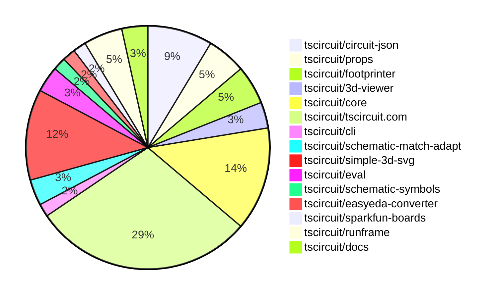

# Contribution Overview 2025-06-11

## PRs by Repository

## Contributor Overview

| Contributor | 🐳 Major | 🐙 Minor | 🐌 Tiny | ⭐ | Issues Created | Discussion Contributions |
|-------------|---------|---------|---------|-----|----------------|--------------------------|
| [seveibar](#seveibar) | 0 | 22 | 2 | 👑 | 2 | 0🔹 0🔶 0💎 |
| [imrishabh18](#imrishabh18) | 1 | 8 | 1 | ⭐⭐ | 5 | 0🔹 0🔶 0💎 |
| [ArnavK-09](#ArnavK-09) | 1 | 6 | 0 | ⭐⭐ | 4 | 0🔹 0🔶 0💎 |
| [techmannih](#techmannih) | 0 | 6 | 0 | ⭐⭐ | 1 | 0🔹 0🔶 0💎 |
| [ShiboSoftwareDev](#ShiboSoftwareDev) | 0 | 4 | 3 | ⭐⭐ | 4 | 0🔹 0🔶 0💎 |
| [Abse2001](#Abse2001) | 0 | 2 | 1 | ⭐ | 3 | 0🔹 0🔶 0💎 |
| [Anshgrover23](#Anshgrover23) | 0 | 1 | 0 | ⭐ | 5 | 0🔹 0🔶 0💎 |

### Discussion Contribution Legend

- 🔹 Normal Comments: Basic participation with minimal effort
- 🔶 Great Informative Comments: Thoughtful participation that adds value
- 💎 Incredible Comments: Exceptional participation with high-quality content

## Review Table

[reviews-received-hover]: ## "Number of reviews received for PRs for this contributor"
[approvals-received-hover]: ## "Number of approvals received for PRs this contributor authored"
[rejections-received-hover]: ## "Number of rejections received for PRs this contributor authored"
[prs-opened-hover]: ## "Number of PRs opened by this contributor"
[issues-created-hover]: ## "Number of issues created by this contributor"
[bountied-issues-hover]: ## "Number of issues this contributor created with a bounty"
[bountied-issue-$-hover]: ## "Total bounty amount placed on issues authored by this contributor"

| Contributor | Reviews Received | Approvals Received | Rejections Received | Approvals | Rejections | PRs Opened | PRs Merged | Issues Created | Bountied Issues | Bountied Issue $ |
|---|---|---|---|---|---|---|---|---|---|---|
| [ArnavK-09](#ArnavK-09) | 13 | 7 | 1 | 0 | 0 | 10 | 7 | 4 | 1 | 10 |
| [seveibar](#seveibar) | 7 | 1 | 1 | 24 | 2 | 35 | 25 | 2 | 0 | 0 |
| [graphite-app[bot]](#graphite-app[bot]) | 0 | 0 | 0 | 0 | 0 | 0 | 0 | 0 | 0 | 0 |
| [ShiboSoftwareDev](#ShiboSoftwareDev) | 10 | 7 | 1 | 2 | 1 | 13 | 7 | 4 | 0 | 0 |
| [techmannih](#techmannih) | 14 | 9 | 1 | 0 | 2 | 11 | 6 | 1 | 0 | 0 |
| [Anshgrover23](#Anshgrover23) | 2 | 2 | 0 | 2 | 0 | 1 | 1 | 5 | 0 | 0 |
| [Abse2001](#Abse2001) | 4 | 3 | 0 | 0 | 0 | 4 | 3 | 3 | 0 | 0 |
| [imrishabh18](#imrishabh18) | 7 | 3 | 0 | 4 | 1 | 13 | 10 | 5 | 3 | 15 |
| [andrii-balitskyi](#andrii-balitskyi) | 3 | 0 | 1 | 0 | 0 | 1 | 0 | 0 | 0 | 0 |
| [abhiiii482](#abhiiii482) | 1 | 0 | 1 | 0 | 0 | 1 | 0 | 0 | 0 | 0 |
| [tscircuitbot](#tscircuitbot) | 0 | 0 | 0 | 0 | 0 | 17 | 0 | 0 | 0 | 0 |

## Changes by Repository

### [tscircuit/circuit-json](https://github.com/tscircuit/circuit-json)

| PR # | Impact | Contributor | Description | Milestone Aligned |
|------|--------|-------------|-------------|-------------------|
| [#221](https://github.com/tscircuit/circuit-json/pull/221) | 🐙 Minor | seveibar | The addition of new ground plane types enhances the PCB design capabilities, allowing for more detailed and specific configurations in circuit layouts. | ❌ |
| [#223](https://github.com/tscircuit/circuit-json/pull/223) | 🐙 Minor | techmannih | Enhances type safety by ensuring type consistency between the defined interface and its inferred type. | ❌ |
| [#222](https://github.com/tscircuit/circuit-json/pull/222) | 🐙 Minor | techmannih | Enhancement of type safety by ensuring type consistency in the simple potentiometer component. | ❌ |
| [#219](https://github.com/tscircuit/circuit-json/pull/219) | 🐙 Minor | techmannih | Enhancing type safety through the use of discriminated unions improves code reliability and maintainability. | ❌ |
| [#220](https://github.com/tscircuit/circuit-json/pull/220) | 🐌 Tiny | Abse2001 | The addition of the NinePointAnchor export enhances the module's functionality by making it accessible for other parts of the application. | ❌ |

### [tscircuit/props](https://github.com/tscircuit/props)

| PR # | Impact | Contributor | Description | Milestone Aligned |
|------|--------|-------------|-------------|-------------------|
| [#277](https://github.com/tscircuit/props/pull/277) | 🐙 Minor | seveibar | Removing the default value for the footprintVariant enhances the flexibility of the testpoint component by requiring explicit definitions, which can lead to more intentional usage. | ❌ |
| [#275](https://github.com/tscircuit/props/pull/275) | 🐙 Minor | techmannih | Enhancing type safety in the codebase by implementing a discriminated union for better type inference. | ❌ |
| [#276](https://github.com/tscircuit/props/pull/276) | 🐙 Minor | Abse2001 | Refactoring and renaming of anchor constants for consistency and clarity in the codebase. | ❌ |

### [tscircuit/footprinter](https://github.com/tscircuit/footprinter)

| PR # | Impact | Contributor | Description | Milestone Aligned |
|------|--------|-------------|-------------|-------------------|
| [#294](https://github.com/tscircuit/footprinter/pull/294) | 🐙 Minor | seveibar | Enhancement of the plated hole functionality by introducing a square pad option, improving design flexibility. | ❌ |
| [#292](https://github.com/tscircuit/footprinter/pull/292) | 🐙 Minor | seveibar | Introducing a new footprint generator enhances the library's functionality for circuit design. | ❌ |
| [#296](https://github.com/tscircuit/footprinter/pull/296) | 🐙 Minor | techmannih | The addition of the SOT-6 footprint enhances the library's capabilities for PCB design, allowing for more component options. | ❌ |

### [tscircuit/3d-viewer](https://github.com/tscircuit/3d-viewer)

| PR # | Impact | Contributor | Description | Milestone Aligned |
|------|--------|-------------|-------------|-------------------|
| [#336](https://github.com/tscircuit/3d-viewer/pull/336) | 🐙 Minor | seveibar | Enhancements to grid sizing based on board dimensions significantly improve the user experience in the viewer. | ❌ |
| [#338](https://github.com/tscircuit/3d-viewer/pull/338) | 🐙 Minor | ShiboSoftwareDev | The changes ensure that board outlines are accurately positioned according to their specified coordinates, enhancing the precision of the 3D viewer. | ❌ |

### [tscircuit/core](https://github.com/tscircuit/core)

| PR # | Impact | Contributor | Description | Milestone Aligned |
|------|--------|-------------|-------------|-------------------|
| [#911](https://github.com/tscircuit/core/pull/911) | 🐳 Major | imrishabh18 | Enhancements to pin mapping detection and regression testing improve the reliability of the schematic rendering. | ✅ |
| [#912](https://github.com/tscircuit/core/pull/912) | 🐙 Minor | seveibar | The addition of the TestPoint component enhances the library's functionality by providing a new component for PCB design, which is essential for building keyboards. | ❌ |
| [#905](https://github.com/tscircuit/core/pull/905) | 🐙 Minor | seveibar | The addition of the SolderJumper component enhances the library's functionality by providing a new component that is essential for circuit design. | ❌ |
| [#891](https://github.com/tscircuit/core/pull/891) | 🐙 Minor | Abse2001 | Enhances the SchematicBox component by adding nine-point title alignment functionality, improving layout flexibility. | ❌ |
| [#915](https://github.com/tscircuit/core/pull/915) | 🐙 Minor | ShiboSoftwareDev | Enhancements to the display of schematic labels improve usability and accuracy in circuit design. | ❌ |
| [#907](https://github.com/tscircuit/core/pull/907) | 🐙 Minor | ShiboSoftwareDev | The implementation of a restriction against nesting boards enhances the integrity of the component structure. | ❌ |
| [#908](https://github.com/tscircuit/core/pull/908) | 🐙 Minor | imrishabh18 | Enhancing error messages for net names improves user experience and debugging efficiency. | ❌ |
| [#917](https://github.com/tscircuit/core/pull/917) | 🐌 Tiny | ShiboSoftwareDev | Updating the autorouter dependency enhances the project's capabilities and ensures compatibility with the latest features. | ❌ |

### [tscircuit/tscircuit.com](https://github.com/tscircuit/tscircuit.com)

| PR # | Impact | Contributor | Description | Milestone Aligned |
|------|--------|-------------|-------------|-------------------|
| [#1258](https://github.com/tscircuit/tscircuit.com/pull/1258) | 🐙 Minor | seveibar | Enhancements to the API for conditional inclusion of AI review data improve flexibility and usability. | ❌ |
| [#1239](https://github.com/tscircuit/tscircuit.com/pull/1239) | 🐙 Minor | seveibar | Refactoring the toast notification system to utilize react-hot-toast enhances the user experience and simplifies the codebase. | ❌ |
| [#1257](https://github.com/tscircuit/tscircuit.com/pull/1257) | 🐙 Minor | seveibar | Enhancing the user experience by ensuring the README file is displayed correctly after package files load. | ❌ |
| [#1256](https://github.com/tscircuit/tscircuit.com/pull/1256) | 🐙 Minor | seveibar | Enhancements to polling frequency for package build status improve responsiveness and user experience. | ❌ |
| [#1255](https://github.com/tscircuit/tscircuit.com/pull/1255) | 🐙 Minor | seveibar | Enhances user experience by providing real-time build time updates, making it easier to track build progress. | ❌ |
| [#1263](https://github.com/tscircuit/tscircuit.com/pull/1263) | 🐙 Minor | imrishabh18 | Enhancing user experience by ensuring the newly created file is immediately selected in the sidebar. | ❌ |
| [#1260](https://github.com/tscircuit/tscircuit.com/pull/1260) | 🐙 Minor | imrishabh18 | Enhancements to error handling provide clearer feedback to users during fork operations, improving user experience. | ❌ |
| [#1259](https://github.com/tscircuit/tscircuit.com/pull/1259) | 🐙 Minor | imrishabh18 | Adjusts the position of the Toaster component to enhance user interface experience. | ❌ |
| [#1254](https://github.com/tscircuit/tscircuit.com/pull/1254) | 🐙 Minor | imrishabh18 | Enhancement of user experience by providing a reload functionality for build logs. | ❌ |
| [#1267](https://github.com/tscircuit/tscircuit.com/pull/1267) | 🐙 Minor | ArnavK-09 | Fixes an issue where templates were not being loaded correctly, ensuring proper functionality of the file management system. | ❌ |
| [#1266](https://github.com/tscircuit/tscircuit.com/pull/1266) | 🐙 Minor | ArnavK-09 | Enhancements to user experience during the authentication process by providing visual feedback during redirects. | ❌ |
| [#1252](https://github.com/tscircuit/tscircuit.com/pull/1252) | 🐙 Minor | ArnavK-09 | Enhancements to the SearchComponent and UI layout significantly improve user interaction and experience. | ❌ |
| [#1253](https://github.com/tscircuit/tscircuit.com/pull/1253) | 🐙 Minor | ArnavK-09 | Enhancements to the sign-in process and redirect handling significantly improve user experience by preventing code loss during authentication. | ❌ |
| [#1251](https://github.com/tscircuit/tscircuit.com/pull/1251) | 🐙 Minor | ArnavK-09 | Refactoring the import dialog to handle packages instead of snippets enhances the functionality of the editor. | ❌ |
| [#1248](https://github.com/tscircuit/tscircuit.com/pull/1248) | 🐙 Minor | ArnavK-09 | Enhancements to error handling and state management significantly improve user experience and maintainability. | ❌ |
| [#1273](https://github.com/tscircuit/tscircuit.com/pull/1273) | 🐌 Tiny | seveibar | Adding a new development dependency enhances the project's capabilities for evaluation tasks. | ❌ |
| [#1265](https://github.com/tscircuit/tscircuit.com/pull/1265) | 🐌 Tiny | ShiboSoftwareDev | Removing a nested dependency streamlines the project and potentially reduces complexity. | ❌ |

### [tscircuit/cli](https://github.com/tscircuit/cli)

| PR # | Impact | Contributor | Description | Milestone Aligned |
|------|--------|-------------|-------------|-------------------|
| [#225](https://github.com/tscircuit/cli/pull/225) | 🐙 Minor | seveibar | Enhancements to the snapshot command with the addition of 3D SVG generation and corresponding tests significantly improve the CLI's functionality. | ❌ |

### [tscircuit/schematic-match-adapt](https://github.com/tscircuit/schematic-match-adapt)

| PR # | Impact | Contributor | Description | Milestone Aligned |
|------|--------|-------------|-------------|-------------------|
| [#39](https://github.com/tscircuit/schematic-match-adapt/pull/39) | 🐙 Minor | seveibar | Enhancements and bug fixes improve application stability and functionality. | ❌ |
| [#38](https://github.com/tscircuit/schematic-match-adapt/pull/38) | 🐙 Minor | seveibar | Enhancements to circuit layout and JSON handling improve overall functionality and usability. | ❌ |

### [tscircuit/simple-3d-svg](https://github.com/tscircuit/simple-3d-svg)

| PR # | Impact | Contributor | Description | Milestone Aligned |
|------|--------|-------------|-------------|-------------------|
| [#23](https://github.com/tscircuit/simple-3d-svg/pull/23) | 🐙 Minor | seveibar | Enhances the flexibility of model positioning in 3D rendering by introducing a new centering option. | ❌ |
| [#22](https://github.com/tscircuit/simple-3d-svg/pull/22) | 🐙 Minor | seveibar | Enhancements to mesh scaling functionality improve flexibility in rendering STL and OBJ files. | ❌ |
| [#21](https://github.com/tscircuit/simple-3d-svg/pull/21) | 🐙 Minor | seveibar | Enhancing color rendering by rounding RGBA values improves visual consistency in SVG outputs. | ❌ |
| [#19](https://github.com/tscircuit/simple-3d-svg/pull/19) | 🐙 Minor | seveibar | Enhancements to STL/OBJ rendering with bounding box visualization improve debugging and model fitting. | ❌ |
| [#18](https://github.com/tscircuit/simple-3d-svg/pull/18) | 🐙 Minor | seveibar | Enhancements to OBJ rendering by allowing per-triangle colors and optional box colors improve visual fidelity and flexibility in 3D rendering. | ❌ |
| [#17](https://github.com/tscircuit/simple-3d-svg/pull/17) | 🐙 Minor | seveibar | Enhancements to color handling and shading for 3D mesh rendering significantly improve visual fidelity. | ❌ |
| [#12](https://github.com/tscircuit/simple-3d-svg/pull/12) | 🐙 Minor | seveibar | Enhancing the library with the capability to load and render OBJ files significantly broadens its functionality for 3D graphics. | ❌ |

### [tscircuit/eval](https://github.com/tscircuit/eval)

| PR # | Impact | Contributor | Description | Milestone Aligned |
|------|--------|-------------|-------------|-------------------|
| [#473](https://github.com/tscircuit/eval/pull/473) | 🐙 Minor | imrishabh18 | Enhancements to nested board handling logic improve component rendering and update core dependencies for better functionality. | ❌ |
| [#483](https://github.com/tscircuit/eval/pull/483) | 🐌 Tiny | seveibar | The addition of a lightweight wrapper for the worker export enhances modularity and clarity in the package structure. | ❌ |

### [tscircuit/schematic-symbols](https://github.com/tscircuit/schematic-symbols)

| PR # | Impact | Contributor | Description | Milestone Aligned |
|------|--------|-------------|-------------|-------------------|
| [#306](https://github.com/tscircuit/schematic-symbols/pull/306) | 🐙 Minor | techmannih | Enhancing the schematic symbols library by adding multiple orientations of the Schottky diode symbol improves usability for circuit designers. | ❌ |

### [tscircuit/easyeda-converter](https://github.com/tscircuit/easyeda-converter)

| PR # | Impact | Contributor | Description | Milestone Aligned |
|------|--------|-------------|-------------|-------------------|
| [#234](https://github.com/tscircuit/easyeda-converter/pull/234) | 🐙 Minor | Anshgrover23 | Enhancements to data type handling for improved flexibility in the schema. | ❌ |

### [tscircuit/sparkfun-boards](https://github.com/tscircuit/sparkfun-boards)

| PR # | Impact | Contributor | Description | Milestone Aligned |
|------|--------|-------------|-------------|-------------------|
| [#4](https://github.com/tscircuit/sparkfun-boards/pull/4) | 🐙 Minor | ShiboSoftwareDev | Enhancing the repository's CI/CD capabilities by introducing format and type check workflows improves code quality and maintainability. | ❌ |

### [tscircuit/runframe](https://github.com/tscircuit/runframe)

| PR # | Impact | Contributor | Description | Milestone Aligned |
|------|--------|-------------|-------------|-------------------|
| [#721](https://github.com/tscircuit/runframe/pull/721) | 🐳 Major | ArnavK-09 | Enhancements to component details improve user experience and functionality in the import process. | ❌ |
| [#741](https://github.com/tscircuit/runframe/pull/741) | 🐙 Minor | imrishabh18 | Enhances user experience by providing clearer error messages in the order quote dialog. | ❌ |
| [#742](https://github.com/tscircuit/runframe/pull/742) | 🐌 Tiny | ShiboSoftwareDev | Refactoring of dependencies to improve project structure and maintainability. | ❌ |

### [tscircuit/docs](https://github.com/tscircuit/docs)

| PR # | Impact | Contributor | Description | Milestone Aligned |
|------|--------|-------------|-------------|-------------------|
| [#70](https://github.com/tscircuit/docs/pull/70) | 🐙 Minor | imrishabh18 | Enhances the user interface by ensuring equal width for both panes in the CircuitPreview component, improving usability. | ❌ |
| [#61](https://github.com/tscircuit/docs/pull/61) | 🐌 Tiny | imrishabh18 | The addition of comprehensive documentation for the `tsci export` command enhances user understanding and usability of the tool. | ❌ |

## Changes by Contributor

### [seveibar](https://github.com/seveibar)

| PR # | Impact | Description | Milestone Aligned |
|------|--------|-------------|-------------------|
| [#221](https://github.com/tscircuit/circuit-json/pull/221) | 🐙 Minor | The addition of new ground plane types enhances the PCB design capabilities, allowing for more detailed and specific configurations in circuit layouts. | ❌ |
| [#277](https://github.com/tscircuit/props/pull/277) | 🐙 Minor | Removing the default value for the footprintVariant enhances the flexibility of the testpoint component by requiring explicit definitions, which can lead to more intentional usage. | ❌ |
| [#294](https://github.com/tscircuit/footprinter/pull/294) | 🐙 Minor | Enhancement of the plated hole functionality by introducing a square pad option, improving design flexibility. | ❌ |
| [#292](https://github.com/tscircuit/footprinter/pull/292) | 🐙 Minor | Introducing a new footprint generator enhances the library's functionality for circuit design. | ❌ |
| [#336](https://github.com/tscircuit/3d-viewer/pull/336) | 🐙 Minor | Enhancements to grid sizing based on board dimensions significantly improve the user experience in the viewer. | ❌ |
| [#912](https://github.com/tscircuit/core/pull/912) | 🐙 Minor | The addition of the TestPoint component enhances the library's functionality by providing a new component for PCB design, which is essential for building keyboards. | ❌ |
| [#905](https://github.com/tscircuit/core/pull/905) | 🐙 Minor | The addition of the SolderJumper component enhances the library's functionality by providing a new component that is essential for circuit design. | ❌ |
| [#1258](https://github.com/tscircuit/tscircuit.com/pull/1258) | 🐙 Minor | Enhancements to the API for conditional inclusion of AI review data improve flexibility and usability. | ❌ |
| [#1239](https://github.com/tscircuit/tscircuit.com/pull/1239) | 🐙 Minor | Refactoring the toast notification system to utilize react-hot-toast enhances the user experience and simplifies the codebase. | ❌ |
| [#1257](https://github.com/tscircuit/tscircuit.com/pull/1257) | 🐙 Minor | Enhancing the user experience by ensuring the README file is displayed correctly after package files load. | ❌ |
| [#1256](https://github.com/tscircuit/tscircuit.com/pull/1256) | 🐙 Minor | Enhancements to polling frequency for package build status improve responsiveness and user experience. | ❌ |
| [#1255](https://github.com/tscircuit/tscircuit.com/pull/1255) | 🐙 Minor | Enhances user experience by providing real-time build time updates, making it easier to track build progress. | ❌ |
| [#225](https://github.com/tscircuit/cli/pull/225) | 🐙 Minor | Enhancements to the snapshot command with the addition of 3D SVG generation and corresponding tests significantly improve the CLI's functionality. | ❌ |
| [#39](https://github.com/tscircuit/schematic-match-adapt/pull/39) | 🐙 Minor | Enhancements and bug fixes improve application stability and functionality. | ❌ |
| [#38](https://github.com/tscircuit/schematic-match-adapt/pull/38) | 🐙 Minor | Enhancements to circuit layout and JSON handling improve overall functionality and usability. | ❌ |
| [#23](https://github.com/tscircuit/simple-3d-svg/pull/23) | 🐙 Minor | Enhances the flexibility of model positioning in 3D rendering by introducing a new centering option. | ❌ |
| [#22](https://github.com/tscircuit/simple-3d-svg/pull/22) | 🐙 Minor | Enhancements to mesh scaling functionality improve flexibility in rendering STL and OBJ files. | ❌ |
| [#21](https://github.com/tscircuit/simple-3d-svg/pull/21) | 🐙 Minor | Enhancing color rendering by rounding RGBA values improves visual consistency in SVG outputs. | ❌ |
| [#19](https://github.com/tscircuit/simple-3d-svg/pull/19) | 🐙 Minor | Enhancements to STL/OBJ rendering with bounding box visualization improve debugging and model fitting. | ❌ |
| [#18](https://github.com/tscircuit/simple-3d-svg/pull/18) | 🐙 Minor | Enhancements to OBJ rendering by allowing per-triangle colors and optional box colors improve visual fidelity and flexibility in 3D rendering. | ❌ |
| [#17](https://github.com/tscircuit/simple-3d-svg/pull/17) | 🐙 Minor | Enhancements to color handling and shading for 3D mesh rendering significantly improve visual fidelity. | ❌ |
| [#12](https://github.com/tscircuit/simple-3d-svg/pull/12) | 🐙 Minor | Enhancing the library with the capability to load and render OBJ files significantly broadens its functionality for 3D graphics. | ❌ |
| [#1273](https://github.com/tscircuit/tscircuit.com/pull/1273) | 🐌 Tiny | Adding a new development dependency enhances the project's capabilities for evaluation tasks. | ❌ |
| [#483](https://github.com/tscircuit/eval/pull/483) | 🐌 Tiny | The addition of a lightweight wrapper for the worker export enhances modularity and clarity in the package structure. | ❌ |

### [techmannih](https://github.com/techmannih)

| PR # | Impact | Description | Milestone Aligned |
|------|--------|-------------|-------------------|
| [#223](https://github.com/tscircuit/circuit-json/pull/223) | 🐙 Minor | Enhances type safety by ensuring type consistency between the defined interface and its inferred type. | ❌ |
| [#222](https://github.com/tscircuit/circuit-json/pull/222) | 🐙 Minor | Enhancement of type safety by ensuring type consistency in the simple potentiometer component. | ❌ |
| [#219](https://github.com/tscircuit/circuit-json/pull/219) | 🐙 Minor | Enhancing type safety through the use of discriminated unions improves code reliability and maintainability. | ❌ |
| [#275](https://github.com/tscircuit/props/pull/275) | 🐙 Minor | Enhancing type safety in the codebase by implementing a discriminated union for better type inference. | ❌ |
| [#296](https://github.com/tscircuit/footprinter/pull/296) | 🐙 Minor | The addition of the SOT-6 footprint enhances the library's capabilities for PCB design, allowing for more component options. | ❌ |
| [#306](https://github.com/tscircuit/schematic-symbols/pull/306) | 🐙 Minor | Enhancing the schematic symbols library by adding multiple orientations of the Schottky diode symbol improves usability for circuit designers. | ❌ |

### [Abse2001](https://github.com/Abse2001)

| PR # | Impact | Description | Milestone Aligned |
|------|--------|-------------|-------------------|
| [#276](https://github.com/tscircuit/props/pull/276) | 🐙 Minor | Refactoring and renaming of anchor constants for consistency and clarity in the codebase. | ❌ |
| [#891](https://github.com/tscircuit/core/pull/891) | 🐙 Minor | Enhances the SchematicBox component by adding nine-point title alignment functionality, improving layout flexibility. | ❌ |
| [#220](https://github.com/tscircuit/circuit-json/pull/220) | 🐌 Tiny | The addition of the NinePointAnchor export enhances the module's functionality by making it accessible for other parts of the application. | ❌ |

### [Anshgrover23](https://github.com/Anshgrover23)

| PR # | Impact | Description | Milestone Aligned |
|------|--------|-------------|-------------------|
| [#234](https://github.com/tscircuit/easyeda-converter/pull/234) | 🐙 Minor | Enhancements to data type handling for improved flexibility in the schema. | ❌ |

### [ShiboSoftwareDev](https://github.com/ShiboSoftwareDev)

| PR # | Impact | Description | Milestone Aligned |
|------|--------|-------------|-------------------|
| [#338](https://github.com/tscircuit/3d-viewer/pull/338) | 🐙 Minor | The changes ensure that board outlines are accurately positioned according to their specified coordinates, enhancing the precision of the 3D viewer. | ❌ |
| [#915](https://github.com/tscircuit/core/pull/915) | 🐙 Minor | Enhancements to the display of schematic labels improve usability and accuracy in circuit design. | ❌ |
| [#907](https://github.com/tscircuit/core/pull/907) | 🐙 Minor | The implementation of a restriction against nesting boards enhances the integrity of the component structure. | ❌ |
| [#4](https://github.com/tscircuit/sparkfun-boards/pull/4) | 🐙 Minor | Enhancing the repository's CI/CD capabilities by introducing format and type check workflows improves code quality and maintainability. | ❌ |
| [#917](https://github.com/tscircuit/core/pull/917) | 🐌 Tiny | Updating the autorouter dependency enhances the project's capabilities and ensures compatibility with the latest features. | ❌ |
| [#1265](https://github.com/tscircuit/tscircuit.com/pull/1265) | 🐌 Tiny | Removing a nested dependency streamlines the project and potentially reduces complexity. | ❌ |
| [#742](https://github.com/tscircuit/runframe/pull/742) | 🐌 Tiny | Refactoring of dependencies to improve project structure and maintainability. | ❌ |

### [imrishabh18](https://github.com/imrishabh18)

| PR # | Impact | Description | Milestone Aligned |
|------|--------|-------------|-------------------|
| [#911](https://github.com/tscircuit/core/pull/911) | 🐳 Major | Enhancements to pin mapping detection and regression testing improve the reliability of the schematic rendering. | ✅ |
| [#908](https://github.com/tscircuit/core/pull/908) | 🐙 Minor | Enhancing error messages for net names improves user experience and debugging efficiency. | ❌ |
| [#1263](https://github.com/tscircuit/tscircuit.com/pull/1263) | 🐙 Minor | Enhancing user experience by ensuring the newly created file is immediately selected in the sidebar. | ❌ |
| [#1260](https://github.com/tscircuit/tscircuit.com/pull/1260) | 🐙 Minor | Enhancements to error handling provide clearer feedback to users during fork operations, improving user experience. | ❌ |
| [#1259](https://github.com/tscircuit/tscircuit.com/pull/1259) | 🐙 Minor | Adjusts the position of the Toaster component to enhance user interface experience. | ❌ |
| [#1254](https://github.com/tscircuit/tscircuit.com/pull/1254) | 🐙 Minor | Enhancement of user experience by providing a reload functionality for build logs. | ❌ |
| [#473](https://github.com/tscircuit/eval/pull/473) | 🐙 Minor | Enhancements to nested board handling logic improve component rendering and update core dependencies for better functionality. | ❌ |
| [#741](https://github.com/tscircuit/runframe/pull/741) | 🐙 Minor | Enhances user experience by providing clearer error messages in the order quote dialog. | ❌ |
| [#70](https://github.com/tscircuit/docs/pull/70) | 🐙 Minor | Enhances the user interface by ensuring equal width for both panes in the CircuitPreview component, improving usability. | ❌ |
| [#61](https://github.com/tscircuit/docs/pull/61) | 🐌 Tiny | The addition of comprehensive documentation for the `tsci export` command enhances user understanding and usability of the tool. | ❌ |

### [ArnavK-09](https://github.com/ArnavK-09)

| PR # | Impact | Description | Milestone Aligned |
|------|--------|-------------|-------------------|
| [#721](https://github.com/tscircuit/runframe/pull/721) | 🐳 Major | Enhancements to component details improve user experience and functionality in the import process. | ❌ |
| [#1267](https://github.com/tscircuit/tscircuit.com/pull/1267) | 🐙 Minor | Fixes an issue where templates were not being loaded correctly, ensuring proper functionality of the file management system. | ❌ |
| [#1266](https://github.com/tscircuit/tscircuit.com/pull/1266) | 🐙 Minor | Enhancements to user experience during the authentication process by providing visual feedback during redirects. | ❌ |
| [#1252](https://github.com/tscircuit/tscircuit.com/pull/1252) | 🐙 Minor | Enhancements to the SearchComponent and UI layout significantly improve user interaction and experience. | ❌ |
| [#1253](https://github.com/tscircuit/tscircuit.com/pull/1253) | 🐙 Minor | Enhancements to the sign-in process and redirect handling significantly improve user experience by preventing code loss during authentication. | ❌ |
| [#1251](https://github.com/tscircuit/tscircuit.com/pull/1251) | 🐙 Minor | Refactoring the import dialog to handle packages instead of snippets enhances the functionality of the editor. | ❌ |
| [#1248](https://github.com/tscircuit/tscircuit.com/pull/1248) | 🐙 Minor | Enhancements to error handling and state management significantly improve user experience and maintainability. | ❌ |

## Repository Owners

| Repository | Codeowners |
|------------|------------|
| [footprinter](https://github.com/tscircuit/footprinter/blob/main/.github/CODEOWNERS) | [seveibar](https://github.com/seveibar), [techmannih](https://github.com/techmannih) |
| [tscircuit.com](https://github.com/tscircuit/tscircuit.com/blob/main/.github/CODEOWNERS) | [seveibar](https://github.com/seveibar), [imrishabh18](https://github.com/imrishabh18) |
| [cli](https://github.com/tscircuit/cli/blob/main/.github/CODEOWNERS) | [seveibar](https://github.com/seveibar) |

## Repos by Owner

| User | Repo |
|------|------|
| [seveibar](https://github.com/seveibar) | [footprinter](https://github.com/tscircuit/footprinter/blob/main/.github/CODEOWNERS) |
|  | [tscircuit.com](https://github.com/tscircuit/tscircuit.com/blob/main/.github/CODEOWNERS) |
|  | [cli](https://github.com/tscircuit/cli/blob/main/.github/CODEOWNERS) |
| [techmannih](https://github.com/techmannih) | [footprinter](https://github.com/tscircuit/footprinter/blob/main/.github/CODEOWNERS) |
| [imrishabh18](https://github.com/imrishabh18) | [tscircuit.com](https://github.com/tscircuit/tscircuit.com/blob/main/.github/CODEOWNERS) |

