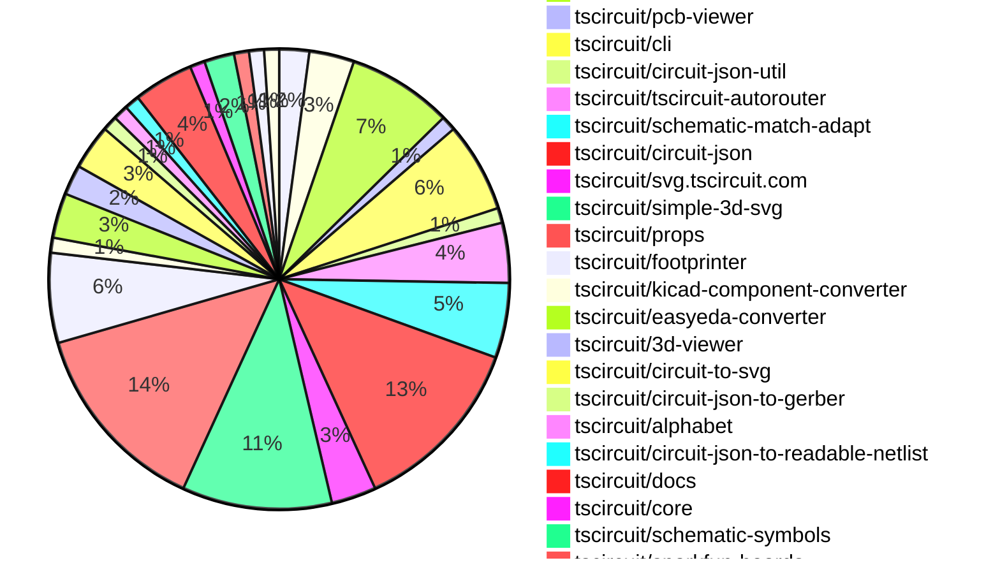
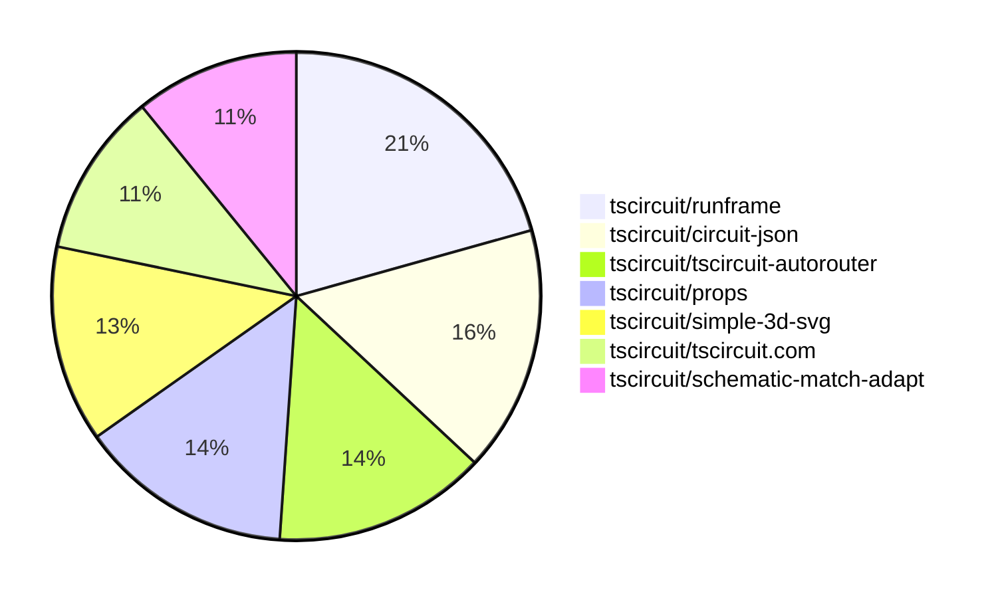

# Contribution Overview 2025-06-11

## PRs by Repository

## Contributor Overview

| Contributor | 🐳 Major | 🐙 Minor | 🐌 Tiny | ⭐ | Issues Created | Discussion Contributions |
|-------------|---------|---------|---------|-----|----------------|--------------------------|
| [seveibar](#seveibar) | 7 | 9 | 37 | 👑 | 2 | 0🔹 0🔶 0💎 |
| [ArnavK-09](#ArnavK-09) | 5 | 3 | 0 | ⭐⭐ | 1 | 0🔹 0🔶 0💎 |
| [techmannih](#techmannih) | 1 | 0 | 13 | ⭐⭐ | 1 | 0🔹 0🔶 0💎 |
| [imrishabh18](#imrishabh18) | 0 | 3 | 4 | ⭐⭐ | 2 | 0🔹 0🔶 0💎 |
| [ShiboSoftwareDev](#ShiboSoftwareDev) | 0 | 1 | 2 | ⭐ | 4 | 0🔹 0🔶 0💎 |
| [Abse2001](#Abse2001) | 0 | 0 | 7 | ⭐ | 1 | 0🔹 0🔶 0💎 |
| [Anshgrover23](#Anshgrover23) | 1 | 0 | 0 | ⭐ | 5 | 0🔹 0🔶 0💎 |
| [andrii-balitskyi](#andrii-balitskyi) | 0 | 0 | 1 |  | 0 | 0🔹 0🔶 0💎 |
| [dope39](#dope39) | 0 | 0 | 1 |  | 0 | 0🔹 0🔶 0💎 |

### Discussion Contribution Legend

- 🔹 Normal Comments: Basic participation with minimal effort
- 🔶 Great Informative Comments: Thoughtful participation that adds value
- 💎 Incredible Comments: Exceptional participation with high-quality content

## Review Table

[reviews-received-hover]: ## "Number of reviews received for PRs for this contributor"
[approvals-received-hover]: ## "Number of approvals received for PRs this contributor authored"
[rejections-received-hover]: ## "Number of rejections received for PRs this contributor authored"
[prs-opened-hover]: ## "Number of PRs opened by this contributor"
[issues-created-hover]: ## "Number of issues created by this contributor"
[bountied-issues-hover]: ## "Number of issues this contributor created with a bounty"
[bountied-issue-$-hover]: ## "Total bounty amount placed on issues authored by this contributor"

| Contributor | Reviews Received | Approvals Received | Rejections Received | Approvals | Rejections | PRs Opened | PRs Merged | Issues Created | Bountied Issues | Bountied Issue $ |
|---|---|---|---|---|---|---|---|---|---|---|
| [ArnavK-09](#ArnavK-09) | 28 | 21 | 1 | 2 | 0 | 21 | 21 | 1 | 1 | 10 |
| [seveibar](#seveibar) | 21 | 2 | 1 | 68 | 8 | 107 | 80 | 2 | 6 | 111 |
| [techmannih](#techmannih) | 28 | 19 | 2 | 1 | 5 | 20 | 16 | 1 | 0 | 0 |
| [graphite-app[bot]](#graphite-app[bot]) | 0 | 0 | 0 | 0 | 0 | 0 | 0 | 0 | 0 | 0 |
| [Abse2001](#Abse2001) | 13 | 10 | 0 | 0 | 0 | 13 | 11 | 1 | 1 | 30 |
| [ShiboSoftwareDev](#ShiboSoftwareDev) | 22 | 12 | 5 | 3 | 1 | 22 | 11 | 4 | 1 | 5 |
| [Anshgrover23](#Anshgrover23) | 2 | 2 | 0 | 2 | 0 | 1 | 1 | 5 | 0 | 0 |
| [imrishabh18](#imrishabh18) | 15 | 9 | 1 | 4 | 1 | 27 | 23 | 2 | 6 | 50 |
| [andrii-balitskyi](#andrii-balitskyi) | 7 | 3 | 1 | 0 | 0 | 3 | 3 | 0 | 0 | 0 |
| [abhiiii482](#abhiiii482) | 6 | 0 | 4 | 0 | 0 | 4 | 0 | 0 | 0 | 0 |
| [dope39](#dope39) | 2 | 2 | 0 | 0 | 0 | 1 | 1 | 0 | 0 | 0 |
| [tscircuitbot](#tscircuitbot) | 0 | 0 | 0 | 0 | 0 | 48 | 2 | 0 | 0 | 0 |

## Top 7 Repositories by Contribution Points

## Changes by Repository

### [tscircuit/contribution-tracker](https://github.com/tscircuit/contribution-tracker)

| PR # | Impact | Rating | Contributor | Description |
|------|--------|--------|-------------|-------------|
| [#175](https://github.com/tscircuit/contribution-tracker/pull/175) | 🐳 Major | ⭐⭐⭐ | ArnavK-09 | Adds functionality to notify first-time contributors via Discord when their pull request is merged. |

🐌 Tiny Contributions (1)

| PR # | Impact | Contributor | Description |
|------|--------|-------------|-------------|
| [#176](https://github.com/tscircuit/contribution-tracker/pull/176) | 🐌 Tiny | dope39 | Changes the repository name from tscircuitsnippets to tscircuittscircuit.com in the data retrieval module. |

### [tscircuit/tscircuit.com](https://github.com/tscircuit/tscircuit.com)

| PR # | Impact | Rating | Contributor | Description |
|------|--------|--------|-------------|-------------|
| [#1303](https://github.com/tscircuit/tscircuit.com/pull/1303) | 🐳 Major | ⭐⭐⭐ | ArnavK-09 | Adds meta SEO tags for various pages to improve search engine visibility and user experience. |
| [#1289](https://github.com/tscircuit/tscircuit.com/pull/1289) | 🐳 Major | ⭐⭐⭐ | ArnavK-09 | Adds user profile meta tags for improved SEO and user experience on user profile pages. |
| [#1301](https://github.com/tscircuit/tscircuit.com/pull/1301) | 🐙 Minor | ⭐⭐ | ArnavK-09 | Fixes the issue of unusable searching functionality on mobile devices by improving the layout and accessibility of the search component in the header. |

### [tscircuit/runframe](https://github.com/tscircuit/runframe)

| PR # | Impact | Rating | Contributor | Description |
|------|--------|--------|-------------|-------------|
| [#748](https://github.com/tscircuit/runframe/pull/748) | 🐳 Major | ⭐⭐⭐ | ArnavK-09 | Disables body scrolling when the CircuitJsonPreview component is in fullscreen mode, addressing issue 1094. |
| [#721](https://github.com/tscircuit/runframe/pull/721) | 🐳 Major | ⭐⭐⭐ | ArnavK-09 | fix 695 https:github.comuser-attachmentsassetsd1a9fc54-59f0-4263-8001-5615164853ab |
| [#758](https://github.com/tscircuit/runframe/pull/758) | 🐳 Major | ⭐⭐⭐ | seveibar | Records the eval version on each run and displays it in error details for better debugging. |
| [#750](https://github.com/tscircuit/runframe/pull/750) | 🐳 Major | ⭐⭐⭐ | seveibar | Add AiReviewDialog component, expose an AI Review menu item in CLI File menu, enable requesting and viewing AI reviews for boards. |

🐌 Tiny Contributions (3)

| PR # | Impact | Contributor | Description |
|------|--------|-------------|-------------|
| [#771](https://github.com/tscircuit/runframe/pull/771) | 🐌 Tiny | seveibar | Updates the dependency exclusion list in renovate.json to include circuit-json-, preventing automatic updates for these packages. |
| [#767](https://github.com/tscircuit/runframe/pull/767) | 🐌 Tiny | seveibar | Moves several tscircuit dependencies from dependencies to peerDependencies to resolve issues with overriding CLI dependencies. |
| [#757](https://github.com/tscircuit/runframe/pull/757) | 🐌 Tiny | imrishabh18 | Removes the tscircuitcore dependency from the package.json file as it is no longer required for the project. |

### [tscircuit/pcb-viewer](https://github.com/tscircuit/pcb-viewer)

| PR # | Impact | Rating | Contributor | Description |
|------|--------|--------|-------------|-------------|
| [#331](https://github.com/tscircuit/pcb-viewer/pull/331) | 🐙 Minor | ⭐⭐ | ArnavK-09 | Fixes the z-index issue that prevents users from accessing the toolbar when error overlays are displayed. |

### [tscircuit/cli](https://github.com/tscircuit/cli)

| PR # | Impact | Rating | Contributor | Description |
|------|--------|--------|-------------|-------------|
| [#226](https://github.com/tscircuit/cli/pull/226) | 🐙 Minor | ⭐⭐ | ArnavK-09 | Prompts the user to enter a desired directory name if they choose not to initialize a new project in the current directory. |
| [#225](https://github.com/tscircuit/cli/pull/225) | 🐙 Minor | ⭐⭐ | seveibar | Adds the capability to generate 3D SVG snapshots using the convertCircuitJsonToSimple3dSvg function, updates the snapshot command help documentation, and includes new tests for 3D snapshots. |

🐌 Tiny Contributions (4)

| PR # | Impact | Contributor | Description |
|------|--------|-------------|-------------|
| [#231](https://github.com/tscircuit/cli/pull/231) | 🐌 Tiny | seveibar | Adds functionality to generate circuit.json files for each .circuit.tsx file, enhancing the build process for circuit files. |
| [#229](https://github.com/tscircuit/cli/pull/229) | 🐌 Tiny | seveibar | Fixes the path for GitHub Actions workflows to be created in the git root directory instead of a subdirectory, ensuring proper setup for CICD processes. |
| [#228](https://github.com/tscircuit/cli/pull/228) | 🐌 Tiny | seveibar | Passes the CLI session token to the runframe standalone HTML for improved session management. |
| [#227](https://github.com/tscircuit/cli/pull/227) | 🐌 Tiny | ShiboSoftwareDev | This PR updates the dependencies to ensure only one version of tscircuiteval is present, resolving potential conflicts. |

### [tscircuit/circuit-json-util](https://github.com/tscircuit/circuit-json-util)

| PR # | Impact | Rating | Contributor | Description |
|------|--------|--------|-------------|-------------|
| [#36](https://github.com/tscircuit/circuit-json-util/pull/36) | 🐳 Major | ⭐⭐⭐ | seveibar | Fixes numeric conversions when transforming PCB elements and normalizes numeric dimensions when computing PCB element bounds. |

### [tscircuit/tscircuit-autorouter](https://github.com/tscircuit/tscircuit-autorouter)

| PR # | Impact | Rating | Contributor | Description |
|------|--------|--------|-------------|-------------|
| [#148](https://github.com/tscircuit/tscircuit-autorouter/pull/148) | 🐳 Major | ⭐⭐⭐ | seveibar | Disables the closed form solvers in the autorouting system, preventing their use in routing calculations. |
| [#145](https://github.com/tscircuit/tscircuit-autorouter/pull/145) | 🐳 Major | ⭐⭐⭐ | seveibar | Adds functionality to convert nodes with port points to Simple Route JSON (SRJ) format, enabling Design Rule Check (DRC) validations. |
| [#146](https://github.com/tscircuit/tscircuit-autorouter/pull/146) | 🐳 Major | ⭐⭐⭐ | seveibar | Fixes the issue where vias do not associate correctly with PCB traces, addressing DRC errors, and introduces a new utility function to facilitate DRC tests against subsolvers. |

🐌 Tiny Contributions (1)

| PR # | Impact | Contributor | Description |
|------|--------|-------------|-------------|
| [#143](https://github.com/tscircuit/tscircuit-autorouter/pull/143) | 🐌 Tiny | seveibar | Add a test verifying DRC errors for high density routing on node cn11081 and update the bun types package. |

### [tscircuit/schematic-match-adapt](https://github.com/tscircuit/schematic-match-adapt)

| PR # | Impact | Rating | Contributor | Description |
|------|--------|--------|-------------|-------------|
| [#38](https://github.com/tscircuit/schematic-match-adapt/pull/38) | 🐳 Major | ⭐⭐⭐ | seveibar | fix path reconstruction from layout Rebuild paths using pin builders Use net label netId when reconstructing paths clean up types format add format instructions log circuit json to get enough information to figure out schematic trace issue introduce serialization, dig into issue with pin1 location being wrong fix corpus line drawing connect pin4 improve netlist generation from circuit json improve get matched boxes and make apply use getMatchedBoxes fix net label name determination (proper source net id mapping) |
| [#42](https://github.com/tscircuit/schematic-match-adapt/pull/42) | 🐙 Minor | ⭐⭐ | seveibar | Fixes capacitor symbol orientation when applying layout and regenerates snapshots for tscircuit. |
| [#39](https://github.com/tscircuit/schematic-match-adapt/pull/39) | 🐙 Minor | ⭐⭐ | seveibar | Fixes a bug where the application fails to process circuit layouts correctly due to missing lines in the circuit builder, and updates snapshots to reflect the changes in the layout processing logic. |

🐌 Tiny Contributions (2)

| PR # | Impact | Contributor | Description |
|------|--------|-------------|-------------|
| [#41](https://github.com/tscircuit/schematic-match-adapt/pull/41) | 🐌 Tiny | seveibar | Adds a new corpus layout JSON and updates the snapshot for tscircuit8 after the new corpus is available. |
| [#40](https://github.com/tscircuit/schematic-match-adapt/pull/40) | 🐌 Tiny | seveibar | Adds a layout test for tscircuit8 to validate the output of the circuit-to-svg library with a simple board design. |

### [tscircuit/circuit-json](https://github.com/tscircuit/circuit-json)

| PR # | Impact | Rating | Contributor | Description |
|------|--------|--------|-------------|-------------|
| [#231](https://github.com/tscircuit/circuit-json/pull/231) | 🐙 Minor | ⭐⭐ | seveibar | Adds an optional subcircuit_id field to various circuit element schemas including SourceComponentBase, PCB, and schematic elements, enhancing the ability to reference subcircuits. |
| [#225](https://github.com/tscircuit/circuit-json/pull/225) | 🐙 Minor | ⭐⭐ | seveibar | Deprecates the source_simple_bug component and adds expectTypesMatch checks to various schema definitions to ensure type consistency across the application. |
| [#221](https://github.com/tscircuit/circuit-json/pull/221) | 🐙 Minor | ⭐⭐ | seveibar | Adds new ground plane types including SourcePcbGroundPlane, PcbGroundPlane, PcbGroundPlaneRegion, and PcbThermalSpoke to the circuit JSON schema. |

🐌 Tiny Contributions (9)

| PR # | Impact | Contributor | Description |
|------|--------|-------------|-------------|
| [#230](https://github.com/tscircuit/circuit-json/pull/230) | 🐌 Tiny | seveibar | Fixes README generator to ignore deprecated properties and ensures PcbVia interface appears in documentation, along with adding a regression test for the README generator. |
| [#226](https://github.com/tscircuit/circuit-json/pull/226) | 🐌 Tiny | seveibar | Makes schematic_component_id optional for schematic_box, updates documentation, updates dependencies, and adds a regression test for the optional ID. |
| [#228](https://github.com/tscircuit/circuit-json/pull/228) | 🐌 Tiny | techmannih | Adds an optional max_current_rating property to the simple inductor component, allowing users to specify the maximum current rating for inductors. |
| [#229](https://github.com/tscircuit/circuit-json/pull/229) | 🐌 Tiny | techmannih | Adds an optional max_current_rating property to the simple inductor component, allowing users to specify the maximum current rating for the inductor. |
| [#223](https://github.com/tscircuit/circuit-json/pull/223) | 🐌 Tiny | techmannih | Adds type checking for SourceSimplePinHeader to ensure type consistency in the simple pin header component. |
| [#222](https://github.com/tscircuit/circuit-json/pull/222) | 🐌 Tiny | techmannih | Adds type checking for SourceSimplePotentiometer to ensure type consistency in the potentiometer component. |
| [#219](https://github.com/tscircuit/circuit-json/pull/219) | 🐌 Tiny | techmannih | Refactors the smtpads implementation to utilize z.discriminatedUnion for enhanced type safety in the PCB SMT pad definitions. |
| [#227](https://github.com/tscircuit/circuit-json/pull/227) | 🐌 Tiny | Abse2001 | Fixes typecheck issue by changing zod dependency to a peer dependency in package.json |
| [#220](https://github.com/tscircuit/circuit-json/pull/220) | 🐌 Tiny | Abse2001 | Exports the NinePointAnchor module for use in other parts of the application. |

### [tscircuit/svg.tscircuit.com](https://github.com/tscircuit/svg.tscircuit.com)

| PR # | Impact | Rating | Contributor | Description |
|------|--------|--------|-------------|-------------|
| [#203](https://github.com/tscircuit/svg.tscircuit.com/pull/203) | 🐙 Minor | ⭐⭐ | seveibar | Adds support for generating 3D SVG output by introducing new dependencies and modifying the endpoint to handle svg_type3d. |

🐌 Tiny Contributions (2)

| PR # | Impact | Contributor | Description |
|------|--------|-------------|-------------|
| [#205](https://github.com/tscircuit/svg.tscircuit.com/pull/205) | 🐌 Tiny | seveibar | Removes multiple tscircuit dependencies and replaces them with a single tscircuit dependency in package.json. |
| [#211](https://github.com/tscircuit/svg.tscircuit.com/pull/211) | 🐌 Tiny | imrishabh18 | Removes the board wrapper from the circuit rendering, allowing components to be rendered directly without the board encapsulation. |

### [tscircuit/simple-3d-svg](https://github.com/tscircuit/simple-3d-svg)

| PR # | Impact | Rating | Contributor | Description |
|------|--------|--------|-------------|-------------|
| [#21](https://github.com/tscircuit/simple-3d-svg/pull/21) | 🐙 Minor | ⭐⭐ | seveibar | Rounds the RGBA channel values when writing colors to SVG. |
| [#17](https://github.com/tscircuit/simple-3d-svg/pull/17) | 🐙 Minor | ⭐⭐ | seveibar | Adds color utilities for converting and adjusting brightness, shades STL  OBJ faces based on surface normal, suppresses polygon strokes for meshes, and updates snapshots. |

🐌 Tiny Contributions (8)

| PR # | Impact | Contributor | Description |
|------|--------|-------------|-------------|
| [#27](https://github.com/tscircuit/simple-3d-svg/pull/27) | 🐌 Tiny | seveibar | Adds a new test case for rendering a 3D scene with various models and components in the simple-3d-svg library. |
| [#25](https://github.com/tscircuit/simple-3d-svg/pull/25) | 🐌 Tiny | seveibar | Adds a new formatting function to round coordinates to the nearest pixel, improving rendering precision and potentially reducing file size. |
| [#24](https://github.com/tscircuit/simple-3d-svg/pull/24) | 🐌 Tiny | seveibar | Adds a helper function to round polygon points to two decimal places for improved SVG rendering accuracy. |
| [#23](https://github.com/tscircuit/simple-3d-svg/pull/23) | 🐌 Tiny | seveibar | Adds a centerModel property to the Box type to control the centering of STL and OBJ models during rendering. |
| [#22](https://github.com/tscircuit/simple-3d-svg/pull/22) | 🐌 Tiny | seveibar | Adds scaleStlToBox and scaleObjToBox flags to the Box interface, allowing normalization of STLOBJ meshes based on these flags. |
| [#19](https://github.com/tscircuit/simple-3d-svg/pull/19) | 🐌 Tiny | seveibar | Adds bounding box debug rendering and improves STLOBJ transformations by applying rotations before scaling and centering models to fit inside a box. |
| [#18](https://github.com/tscircuit/simple-3d-svg/pull/18) | 🐌 Tiny | seveibar | Support optional color on Box and per-triangle color on OBJ meshes, parse material and vertex colors from OBJ files, render OBJ faces using their colors when box.color is not provided, and add regression test for OBJ colors. |
| [#12](https://github.com/tscircuit/simple-3d-svg/pull/12) | 🐌 Tiny | seveibar | Adds support for loading OBJ files via loadOBJ, enabling the rendering of OBJ meshes in renderScene with configurable objUrl, objPosition, and objRotation. |

### [tscircuit/props](https://github.com/tscircuit/props)

🐌 Tiny Contributions (13)

| PR # | Impact | Contributor | Description |
|------|--------|-------------|-------------|
| [#288](https://github.com/tscircuit/props/pull/288) | 🐌 Tiny | seveibar | Renames the type Footprint to FootprintProp to prevent naming conflicts in the core library. |
| [#283](https://github.com/tscircuit/props/pull/283) | 🐌 Tiny | seveibar | Ensures that generated documentation is deterministic by sorting extracted interfaces and file listings during the documentation generation process. |
| [#282](https://github.com/tscircuit/props/pull/282) | 🐌 Tiny | seveibar | Summary allow cellBorder and border to be null on group  update docs and generated files test null border parsing  Testing bun test testsgroup.test.ts bun test tests |
| [#281](https://github.com/tscircuit/props/pull/281) | 🐌 Tiny | seveibar | Summary support border on group document border prop in README and generated docs test that border parses correctly  Testing bun test testsgroup.test.ts |
| [#280](https://github.com/tscircuit/props/pull/280) | 🐌 Tiny | seveibar | Adds an optional cellBorder property to groups, allowing for customizable border styling in the layout configuration. |
| [#277](https://github.com/tscircuit/props/pull/277) | 🐌 Tiny | seveibar | Removes the default value for the testpoint footprintVariant, requiring explicit specification in component props. |
| [#275](https://github.com/tscircuit/props/pull/275) | 🐌 Tiny | techmannih | Refactors the smtpads component to utilize z.discriminatedUnion for improved type safety in TypeScript, ensuring better type checking and reducing potential runtime errors. |
| [#279](https://github.com/tscircuit/props/pull/279) | 🐌 Tiny | techmannih | Replaces z.union with z.discriminatedUnion for improved type safety in plated hole properties, ensuring shape is required for all variants. |
| [#285](https://github.com/tscircuit/props/pull/285) | 🐌 Tiny | techmannih | Adds an optional maxCurrentRating property to the InductorProps interface, allowing users to specify the maximum current rating for inductors. |
| [#287](https://github.com/tscircuit/props/pull/287) | 🐌 Tiny | techmannih | Adds igbt as a new type in the TransistorProps interface, allowing users to specify IGBT transistors in their designs. |
| [#286](https://github.com/tscircuit/props/pull/286) | 🐌 Tiny | Abse2001 | Changes the default title alignment value of the schematic box component from center to top_left. |
| [#284](https://github.com/tscircuit/props/pull/284) | 🐌 Tiny | Abse2001 | Adds schPadding and border padding properties to the BaseGroupProps interface, allowing for more flexible layout configurations in component groups. |
| [#276](https://github.com/tscircuit/props/pull/276) | 🐌 Tiny | Abse2001 | Renames and exports the ninePointAnchor and fivePointAnchor enums for consistent naming conventions in the codebase. |

### [tscircuit/footprinter](https://github.com/tscircuit/footprinter)

🐌 Tiny Contributions (6)

| PR # | Impact | Contributor | Description |
|------|--------|-------------|-------------|
| [#297](https://github.com/tscircuit/footprinter/pull/297) | 🐌 Tiny | seveibar | Changes the lockfile format from binary (bun.lockb) to text-based (bun.lock) for better readability and version control. |
| [#294](https://github.com/tscircuit/footprinter/pull/294) | 🐌 Tiny | seveibar | Adds a squarepad option for plated holes in the footprint definition, allowing for square pad holes to be created and tested. |
| [#292](https://github.com/tscircuit/footprinter/pull/292) | 🐌 Tiny | seveibar | Adds a new platedhole footprint generator and associated tests for specific diameter and radius specifications. |
| [#299](https://github.com/tscircuit/footprinter/pull/299) | 🐌 Tiny | techmannih | Ensures pad() returns parameters alongside circuit JSON and verifies pad parameters in unit tests. |
| [#296](https://github.com/tscircuit/footprinter/pull/296) | 🐌 Tiny | techmannih | Adds a new SOT-6 footprint for electronic components, addressing issue 168. |
| [#291](https://github.com/tscircuit/footprinter/pull/291) | 🐌 Tiny | andrii-balitskyi | Adds support for circle, rectangle, and square SMT pads in the footprinter API, including helper functions and tests for these shapes. |

### [tscircuit/kicad-component-converter](https://github.com/tscircuit/kicad-component-converter)

🐌 Tiny Contributions (1)

| PR # | Impact | Contributor | Description |
|------|--------|-------------|-------------|
| [#121](https://github.com/tscircuit/kicad-component-converter/pull/121) | 🐌 Tiny | seveibar | Switches the build output to ESM modules and removes the dependency on tscircuitbuilder, reimplementing the converter functionality. |

### [tscircuit/easyeda-converter](https://github.com/tscircuit/easyeda-converter)

| PR # | Impact | Rating | Contributor | Description |
|------|--------|--------|-------------|-------------|
| [#234](https://github.com/tscircuit/easyeda-converter/pull/234) | 🐳 Major | ⭐⭐⭐ | Anshgrover23 | Fixes 232 Fixes 233 |

🐌 Tiny Contributions (2)

| PR # | Impact | Contributor | Description |
|------|--------|-------------|-------------|
| [#247](https://github.com/tscircuit/easyeda-converter/pull/247) | 🐌 Tiny | seveibar | Adds a test for converting the C19795120 part to ensure PCB cutout generation from HOLE and SOLIDREGION shapes, and transforms PCB cutout elements when recentering. |
| [#243](https://github.com/tscircuit/easyeda-converter/pull/243) | 🐌 Tiny | Abse2001 | Fixes the failure to import the component C105419 from JLCPCB due to incorrect handling of rotation values in the schema. |

### [tscircuit/3d-viewer](https://github.com/tscircuit/3d-viewer)

| PR # | Impact | Rating | Contributor | Description |
|------|--------|--------|-------------|-------------|
| [#338](https://github.com/tscircuit/3d-viewer/pull/338) | 🐙 Minor | ⭐⭐ | ShiboSoftwareDev | Fixes board outline positioning by ensuring outlines are anchored at their provided coordinates without translation by center. |

🐌 Tiny Contributions (1)

| PR # | Impact | Contributor | Description |
|------|--------|-------------|-------------|
| [#336](https://github.com/tscircuit/3d-viewer/pull/336) | 🐌 Tiny | seveibar | Scales the background grid based on board size to ensure it is at least 1.5x larger, exposes board dimensions to viewer containers, and keeps snapshots updated. |

### [tscircuit/circuit-to-svg](https://github.com/tscircuit/circuit-to-svg)

| PR # | Impact | Rating | Contributor | Description |
|------|--------|--------|-------------|-------------|
| [#256](https://github.com/tscircuit/circuit-to-svg/pull/256) | 🐳 Major | ⭐⭐⭐ | techmannih | Fixes bounding box calculation for net labels in schematic rendering. |

🐌 Tiny Contributions (2)

| PR # | Impact | Contributor | Description |
|------|--------|-------------|-------------|
| [#259](https://github.com/tscircuit/circuit-to-svg/pull/259) | 🐌 Tiny | seveibar | Rounds the ends of lines drawn for schematic symbols and updates SVG snapshots. |
| [#258](https://github.com/tscircuit/circuit-to-svg/pull/258) | 🐌 Tiny | Abse2001 | Fixes the stroke width scaling of schematic boxes based on transformation parameters, ensuring accurate rendering in SVG outputs. |

### [tscircuit/circuit-json-to-gerber](https://github.com/tscircuit/circuit-json-to-gerber)

🐌 Tiny Contributions (1)

| PR # | Impact | Contributor | Description |
|------|--------|-------------|-------------|
| [#41](https://github.com/tscircuit/circuit-json-to-gerber/pull/41) | 🐌 Tiny | seveibar | Adds a test for generating Gerber files with pinrow components and supports SMT pads with rectangular pads in the conversion process. |

### [tscircuit/alphabet](https://github.com/tscircuit/alphabet)

🐌 Tiny Contributions (1)

| PR # | Impact | Contributor | Description |
|------|--------|-------------|-------------|
| [#11](https://github.com/tscircuit/alphabet/pull/11) | 🐌 Tiny | seveibar | Adds  and  characters to the svgAlphabet in the SVG rendering system. |

### [tscircuit/circuit-json-to-readable-netlist](https://github.com/tscircuit/circuit-json-to-readable-netlist)

🐌 Tiny Contributions (1)

| PR # | Impact | Contributor | Description |
|------|--------|-------------|-------------|
| [#15](https://github.com/tscircuit/circuit-json-to-readable-netlist/pull/15) | 🐌 Tiny | seveibar | Migrates the dependency from soup-util to circuit-json-util and updates the package.json to include circuit-json as a peer dependency. |

### [tscircuit/docs](https://github.com/tscircuit/docs)

| PR # | Impact | Rating | Contributor | Description |
|------|--------|--------|-------------|-------------|
| [#61](https://github.com/tscircuit/docs/pull/61) | 🐙 Minor | ⭐⭐ | imrishabh18 | Adds documentation for the tsci export command, detailing its usage, options, and supported formats for exporting circuit designs. |

🐌 Tiny Contributions (3)

| PR # | Impact | Contributor | Description |
|------|--------|-------------|-------------|
| [#71](https://github.com/tscircuit/docs/pull/71) | 🐌 Tiny | seveibar | Adds documentation for the jumper  and solderjumper  components, detailing their properties and usage in circuit design. |
| [#72](https://github.com/tscircuit/docs/pull/72) | 🐌 Tiny | seveibar | Updates the repomix dependency from version 0.2.28 to 0.3.9 in package.json. |
| [#70](https://github.com/tscircuit/docs/pull/70) | 🐌 Tiny | imrishabh18 | Fixes the width of both panes in CircuitPreview to ensure they are equal, enhancing the layout consistency. |

### [tscircuit/core](https://github.com/tscircuit/core)

🐌 Tiny Contributions (1)

| PR # | Impact | Contributor | Description |
|------|--------|-------------|-------------|
| [#894](https://github.com/tscircuit/core/pull/894) | 🐌 Tiny | techmannih | Adds support for polygon-shaped SMT pads in the SmtPad component, allowing for more versatile PCB designs. |

### [tscircuit/schematic-symbols](https://github.com/tscircuit/schematic-symbols)

| PR # | Impact | Rating | Contributor | Description |
|------|--------|--------|-------------|-------------|
| [#308](https://github.com/tscircuit/schematic-symbols/pull/308) | 🐙 Minor | ⭐⭐ | imrishabh18 | Fixes the representation of polarized capacitors in schematic symbols to align with IPC conventions. |

🐌 Tiny Contributions (1)

| PR # | Impact | Contributor | Description |
|------|--------|-------------|-------------|
| [#306](https://github.com/tscircuit/schematic-symbols/pull/306) | 🐌 Tiny | techmannih | Introduces new variations of the Schottky diode symbol for schematic representation, including horizontal, vertical, left, right, and down orientations. |

### [tscircuit/sparkfun-boards](https://github.com/tscircuit/sparkfun-boards)

🐌 Tiny Contributions (1)

| PR # | Impact | Contributor | Description |
|------|--------|-------------|-------------|
| [#4](https://github.com/tscircuit/sparkfun-boards/pull/4) | 🐌 Tiny | ShiboSoftwareDev | Adds GitHub workflows for format checking and type checking using Bun, enhancing the development process. |

### [tscircuit/parts-engine](https://github.com/tscircuit/parts-engine)

| PR # | Impact | Rating | Contributor | Description |
|------|--------|--------|-------------|-------------|
| [#4](https://github.com/tscircuit/parts-engine/pull/4) | 🐙 Minor | ⭐⭐ | imrishabh18 | Adds support for searching LED parts by category in the parts engine. |

### [tscircuit/browser-preview.tscircuit.com](https://github.com/tscircuit/browser-preview.tscircuit.com)

🐌 Tiny Contributions (1)

| PR # | Impact | Contributor | Description |
|------|--------|-------------|-------------|
| [#191](https://github.com/tscircuit/browser-preview.tscircuit.com/pull/191) | 🐌 Tiny | imrishabh18 | Updates the tscircuitcore dependency to version 0.0.474 to address an outage issue. |

## Changes by Contributor

### [ArnavK-09](https://github.com/ArnavK-09)

| PRs # | Impact | Rating | Description |
|------|--------|--------|-------------|
| [#175](https://github.com/tscircuit/contribution-tracker/pull/175) | 🐳 Major | ⭐⭐⭐ | Adds functionality to notify first-time contributors via Discord when their pull request is merged. |
| [#1303](https://github.com/tscircuit/tscircuit.com/pull/1303) | 🐳 Major | ⭐⭐⭐ | Adds meta SEO tags for various pages to improve search engine visibility and user experience. |
| [#1289](https://github.com/tscircuit/tscircuit.com/pull/1289) | 🐳 Major | ⭐⭐⭐ | Adds user profile meta tags for improved SEO and user experience on user profile pages. |
| [#748](https://github.com/tscircuit/runframe/pull/748) | 🐳 Major | ⭐⭐⭐ | Disables body scrolling when the CircuitJsonPreview component is in fullscreen mode, addressing issue 1094. |
| [#721](https://github.com/tscircuit/runframe/pull/721) | 🐳 Major | ⭐⭐⭐ | fix 695 https:github.comuser-attachmentsassetsd1a9fc54-59f0-4263-8001-5615164853ab |
| [#331](https://github.com/tscircuit/pcb-viewer/pull/331) | 🐙 Minor | ⭐⭐ | Fixes the z-index issue that prevents users from accessing the toolbar when error overlays are displayed. |
| [#1301](https://github.com/tscircuit/tscircuit.com/pull/1301) | 🐙 Minor | ⭐⭐ | Fixes the issue of unusable searching functionality on mobile devices by improving the layout and accessibility of the search component in the header. |
| [#226](https://github.com/tscircuit/cli/pull/226) | 🐙 Minor | ⭐⭐ | Prompts the user to enter a desired directory name if they choose not to initialize a new project in the current directory. |

### [seveibar](https://github.com/seveibar)

| PRs # | Impact | Rating | Description |
|------|--------|--------|-------------|
| [#36](https://github.com/tscircuit/circuit-json-util/pull/36) | 🐳 Major | ⭐⭐⭐ | Fixes numeric conversions when transforming PCB elements and normalizes numeric dimensions when computing PCB element bounds. |
| [#758](https://github.com/tscircuit/runframe/pull/758) | 🐳 Major | ⭐⭐⭐ | Records the eval version on each run and displays it in error details for better debugging. |
| [#750](https://github.com/tscircuit/runframe/pull/750) | 🐳 Major | ⭐⭐⭐ | Add AiReviewDialog component, expose an AI Review menu item in CLI File menu, enable requesting and viewing AI reviews for boards. |
| [#148](https://github.com/tscircuit/tscircuit-autorouter/pull/148) | 🐳 Major | ⭐⭐⭐ | Disables the closed form solvers in the autorouting system, preventing their use in routing calculations. |
| [#145](https://github.com/tscircuit/tscircuit-autorouter/pull/145) | 🐳 Major | ⭐⭐⭐ | Adds functionality to convert nodes with port points to Simple Route JSON (SRJ) format, enabling Design Rule Check (DRC) validations. |
| [#146](https://github.com/tscircuit/tscircuit-autorouter/pull/146) | 🐳 Major | ⭐⭐⭐ | Fixes the issue where vias do not associate correctly with PCB traces, addressing DRC errors, and introduces a new utility function to facilitate DRC tests against subsolvers. |
| [#38](https://github.com/tscircuit/schematic-match-adapt/pull/38) | 🐳 Major | ⭐⭐⭐ | fix path reconstruction from layout Rebuild paths using pin builders Use net label netId when reconstructing paths clean up types format add format instructions log circuit json to get enough information to figure out schematic trace issue introduce serialization, dig into issue with pin1 location being wrong fix corpus line drawing connect pin4 improve netlist generation from circuit json improve get matched boxes and make apply use getMatchedBoxes fix net label name determination (proper source net id mapping) |
| [#231](https://github.com/tscircuit/circuit-json/pull/231) | 🐙 Minor | ⭐⭐ | Adds an optional subcircuit_id field to various circuit element schemas including SourceComponentBase, PCB, and schematic elements, enhancing the ability to reference subcircuits. |
| [#225](https://github.com/tscircuit/circuit-json/pull/225) | 🐙 Minor | ⭐⭐ | Deprecates the source_simple_bug component and adds expectTypesMatch checks to various schema definitions to ensure type consistency across the application. |
| [#221](https://github.com/tscircuit/circuit-json/pull/221) | 🐙 Minor | ⭐⭐ | Adds new ground plane types including SourcePcbGroundPlane, PcbGroundPlane, PcbGroundPlaneRegion, and PcbThermalSpoke to the circuit JSON schema. |
| [#225](https://github.com/tscircuit/cli/pull/225) | 🐙 Minor | ⭐⭐ | Adds the capability to generate 3D SVG snapshots using the convertCircuitJsonToSimple3dSvg function, updates the snapshot command help documentation, and includes new tests for 3D snapshots. |
| [#203](https://github.com/tscircuit/svg.tscircuit.com/pull/203) | 🐙 Minor | ⭐⭐ | Adds support for generating 3D SVG output by introducing new dependencies and modifying the endpoint to handle svg_type3d. |
| [#42](https://github.com/tscircuit/schematic-match-adapt/pull/42) | 🐙 Minor | ⭐⭐ | Fixes capacitor symbol orientation when applying layout and regenerates snapshots for tscircuit. |
| [#39](https://github.com/tscircuit/schematic-match-adapt/pull/39) | 🐙 Minor | ⭐⭐ | Fixes a bug where the application fails to process circuit layouts correctly due to missing lines in the circuit builder, and updates snapshots to reflect the changes in the layout processing logic. |
| [#21](https://github.com/tscircuit/simple-3d-svg/pull/21) | 🐙 Minor | ⭐⭐ | Rounds the RGBA channel values when writing colors to SVG. |
| [#17](https://github.com/tscircuit/simple-3d-svg/pull/17) | 🐙 Minor | ⭐⭐ | Adds color utilities for converting and adjusting brightness, shades STL  OBJ faces based on surface normal, suppresses polygon strokes for meshes, and updates snapshots. |

🐌 Tiny Contributions (37)

| PR # | Impact | Description |
|------|--------|-------------|
| [#230](https://github.com/tscircuit/circuit-json/pull/230) | 🐌 Tiny | Fixes README generator to ignore deprecated properties and ensures PcbVia interface appears in documentation, along with adding a regression test for the README generator. |
| [#226](https://github.com/tscircuit/circuit-json/pull/226) | 🐌 Tiny | Makes schematic_component_id optional for schematic_box, updates documentation, updates dependencies, and adds a regression test for the optional ID. |
| [#288](https://github.com/tscircuit/props/pull/288) | 🐌 Tiny | Renames the type Footprint to FootprintProp to prevent naming conflicts in the core library. |
| [#283](https://github.com/tscircuit/props/pull/283) | 🐌 Tiny | Ensures that generated documentation is deterministic by sorting extracted interfaces and file listings during the documentation generation process. |
| [#282](https://github.com/tscircuit/props/pull/282) | 🐌 Tiny | Summary allow cellBorder and border to be null on group  update docs and generated files test null border parsing  Testing bun test testsgroup.test.ts bun test tests |
| [#281](https://github.com/tscircuit/props/pull/281) | 🐌 Tiny | Summary support border on group document border prop in README and generated docs test that border parses correctly  Testing bun test testsgroup.test.ts |
| [#280](https://github.com/tscircuit/props/pull/280) | 🐌 Tiny | Adds an optional cellBorder property to groups, allowing for customizable border styling in the layout configuration. |
| [#277](https://github.com/tscircuit/props/pull/277) | 🐌 Tiny | Removes the default value for the testpoint footprintVariant, requiring explicit specification in component props. |
| [#297](https://github.com/tscircuit/footprinter/pull/297) | 🐌 Tiny | Changes the lockfile format from binary (bun.lockb) to text-based (bun.lock) for better readability and version control. |
| [#294](https://github.com/tscircuit/footprinter/pull/294) | 🐌 Tiny | Adds a squarepad option for plated holes in the footprint definition, allowing for square pad holes to be created and tested. |
| [#292](https://github.com/tscircuit/footprinter/pull/292) | 🐌 Tiny | Adds a new platedhole footprint generator and associated tests for specific diameter and radius specifications. |
| [#121](https://github.com/tscircuit/kicad-component-converter/pull/121) | 🐌 Tiny | Switches the build output to ESM modules and removes the dependency on tscircuitbuilder, reimplementing the converter functionality. |
| [#247](https://github.com/tscircuit/easyeda-converter/pull/247) | 🐌 Tiny | Adds a test for converting the C19795120 part to ensure PCB cutout generation from HOLE and SOLIDREGION shapes, and transforms PCB cutout elements when recentering. |
| [#336](https://github.com/tscircuit/3d-viewer/pull/336) | 🐌 Tiny | Scales the background grid based on board size to ensure it is at least 1.5x larger, exposes board dimensions to viewer containers, and keeps snapshots updated. |
| [#259](https://github.com/tscircuit/circuit-to-svg/pull/259) | 🐌 Tiny | Rounds the ends of lines drawn for schematic symbols and updates SVG snapshots. |
| [#41](https://github.com/tscircuit/circuit-json-to-gerber/pull/41) | 🐌 Tiny | Adds a test for generating Gerber files with pinrow components and supports SMT pads with rectangular pads in the conversion process. |
| [#11](https://github.com/tscircuit/alphabet/pull/11) | 🐌 Tiny | Adds  and  characters to the svgAlphabet in the SVG rendering system. |
| [#771](https://github.com/tscircuit/runframe/pull/771) | 🐌 Tiny | Updates the dependency exclusion list in renovate.json to include circuit-json-, preventing automatic updates for these packages. |
| [#767](https://github.com/tscircuit/runframe/pull/767) | 🐌 Tiny | Moves several tscircuit dependencies from dependencies to peerDependencies to resolve issues with overriding CLI dependencies. |
| [#231](https://github.com/tscircuit/cli/pull/231) | 🐌 Tiny | Adds functionality to generate circuit.json files for each .circuit.tsx file, enhancing the build process for circuit files. |
| [#229](https://github.com/tscircuit/cli/pull/229) | 🐌 Tiny | Fixes the path for GitHub Actions workflows to be created in the git root directory instead of a subdirectory, ensuring proper setup for CICD processes. |
| [#228](https://github.com/tscircuit/cli/pull/228) | 🐌 Tiny | Passes the CLI session token to the runframe standalone HTML for improved session management. |
| [#15](https://github.com/tscircuit/circuit-json-to-readable-netlist/pull/15) | 🐌 Tiny | Migrates the dependency from soup-util to circuit-json-util and updates the package.json to include circuit-json as a peer dependency. |
| [#205](https://github.com/tscircuit/svg.tscircuit.com/pull/205) | 🐌 Tiny | Removes multiple tscircuit dependencies and replaces them with a single tscircuit dependency in package.json. |
| [#71](https://github.com/tscircuit/docs/pull/71) | 🐌 Tiny | Adds documentation for the jumper  and solderjumper  components, detailing their properties and usage in circuit design. |
| [#72](https://github.com/tscircuit/docs/pull/72) | 🐌 Tiny | Updates the repomix dependency from version 0.2.28 to 0.3.9 in package.json. |
| [#143](https://github.com/tscircuit/tscircuit-autorouter/pull/143) | 🐌 Tiny | Add a test verifying DRC errors for high density routing on node cn11081 and update the bun types package. |
| [#41](https://github.com/tscircuit/schematic-match-adapt/pull/41) | 🐌 Tiny | Adds a new corpus layout JSON and updates the snapshot for tscircuit8 after the new corpus is available. |
| [#40](https://github.com/tscircuit/schematic-match-adapt/pull/40) | 🐌 Tiny | Adds a layout test for tscircuit8 to validate the output of the circuit-to-svg library with a simple board design. |
| [#27](https://github.com/tscircuit/simple-3d-svg/pull/27) | 🐌 Tiny | Adds a new test case for rendering a 3D scene with various models and components in the simple-3d-svg library. |
| [#25](https://github.com/tscircuit/simple-3d-svg/pull/25) | 🐌 Tiny | Adds a new formatting function to round coordinates to the nearest pixel, improving rendering precision and potentially reducing file size. |
| [#24](https://github.com/tscircuit/simple-3d-svg/pull/24) | 🐌 Tiny | Adds a helper function to round polygon points to two decimal places for improved SVG rendering accuracy. |
| [#23](https://github.com/tscircuit/simple-3d-svg/pull/23) | 🐌 Tiny | Adds a centerModel property to the Box type to control the centering of STL and OBJ models during rendering. |
| [#22](https://github.com/tscircuit/simple-3d-svg/pull/22) | 🐌 Tiny | Adds scaleStlToBox and scaleObjToBox flags to the Box interface, allowing normalization of STLOBJ meshes based on these flags. |
| [#19](https://github.com/tscircuit/simple-3d-svg/pull/19) | 🐌 Tiny | Adds bounding box debug rendering and improves STLOBJ transformations by applying rotations before scaling and centering models to fit inside a box. |
| [#18](https://github.com/tscircuit/simple-3d-svg/pull/18) | 🐌 Tiny | Support optional color on Box and per-triangle color on OBJ meshes, parse material and vertex colors from OBJ files, render OBJ faces using their colors when box.color is not provided, and add regression test for OBJ colors. |
| [#12](https://github.com/tscircuit/simple-3d-svg/pull/12) | 🐌 Tiny | Adds support for loading OBJ files via loadOBJ, enabling the rendering of OBJ meshes in renderScene with configurable objUrl, objPosition, and objRotation. |

### [techmannih](https://github.com/techmannih)

| PRs # | Impact | Rating | Description |
|------|--------|--------|-------------|
| [#256](https://github.com/tscircuit/circuit-to-svg/pull/256) | 🐳 Major | ⭐⭐⭐ | Fixes bounding box calculation for net labels in schematic rendering. |

🐌 Tiny Contributions (13)

| PR # | Impact | Description |
|------|--------|-------------|
| [#228](https://github.com/tscircuit/circuit-json/pull/228) | 🐌 Tiny | Adds an optional max_current_rating property to the simple inductor component, allowing users to specify the maximum current rating for inductors. |
| [#229](https://github.com/tscircuit/circuit-json/pull/229) | 🐌 Tiny | Adds an optional max_current_rating property to the simple inductor component, allowing users to specify the maximum current rating for the inductor. |
| [#223](https://github.com/tscircuit/circuit-json/pull/223) | 🐌 Tiny | Adds type checking for SourceSimplePinHeader to ensure type consistency in the simple pin header component. |
| [#222](https://github.com/tscircuit/circuit-json/pull/222) | 🐌 Tiny | Adds type checking for SourceSimplePotentiometer to ensure type consistency in the potentiometer component. |
| [#219](https://github.com/tscircuit/circuit-json/pull/219) | 🐌 Tiny | Refactors the smtpads implementation to utilize z.discriminatedUnion for enhanced type safety in the PCB SMT pad definitions. |
| [#275](https://github.com/tscircuit/props/pull/275) | 🐌 Tiny | Refactors the smtpads component to utilize z.discriminatedUnion for improved type safety in TypeScript, ensuring better type checking and reducing potential runtime errors. |
| [#279](https://github.com/tscircuit/props/pull/279) | 🐌 Tiny | Replaces z.union with z.discriminatedUnion for improved type safety in plated hole properties, ensuring shape is required for all variants. |
| [#285](https://github.com/tscircuit/props/pull/285) | 🐌 Tiny | Adds an optional maxCurrentRating property to the InductorProps interface, allowing users to specify the maximum current rating for inductors. |
| [#287](https://github.com/tscircuit/props/pull/287) | 🐌 Tiny | Adds igbt as a new type in the TransistorProps interface, allowing users to specify IGBT transistors in their designs. |
| [#299](https://github.com/tscircuit/footprinter/pull/299) | 🐌 Tiny | Ensures pad() returns parameters alongside circuit JSON and verifies pad parameters in unit tests. |
| [#296](https://github.com/tscircuit/footprinter/pull/296) | 🐌 Tiny | Adds a new SOT-6 footprint for electronic components, addressing issue 168. |
| [#894](https://github.com/tscircuit/core/pull/894) | 🐌 Tiny | Adds support for polygon-shaped SMT pads in the SmtPad component, allowing for more versatile PCB designs. |
| [#306](https://github.com/tscircuit/schematic-symbols/pull/306) | 🐌 Tiny | Introduces new variations of the Schottky diode symbol for schematic representation, including horizontal, vertical, left, right, and down orientations. |

### [Abse2001](https://github.com/Abse2001)

🐌 Tiny Contributions (7)

| PR # | Impact | Description |
|------|--------|-------------|
| [#227](https://github.com/tscircuit/circuit-json/pull/227) | 🐌 Tiny | Fixes typecheck issue by changing zod dependency to a peer dependency in package.json |
| [#220](https://github.com/tscircuit/circuit-json/pull/220) | 🐌 Tiny | Exports the NinePointAnchor module for use in other parts of the application. |
| [#286](https://github.com/tscircuit/props/pull/286) | 🐌 Tiny | Changes the default title alignment value of the schematic box component from center to top_left. |
| [#284](https://github.com/tscircuit/props/pull/284) | 🐌 Tiny | Adds schPadding and border padding properties to the BaseGroupProps interface, allowing for more flexible layout configurations in component groups. |
| [#276](https://github.com/tscircuit/props/pull/276) | 🐌 Tiny | Renames and exports the ninePointAnchor and fivePointAnchor enums for consistent naming conventions in the codebase. |
| [#243](https://github.com/tscircuit/easyeda-converter/pull/243) | 🐌 Tiny | Fixes the failure to import the component C105419 from JLCPCB due to incorrect handling of rotation values in the schema. |
| [#258](https://github.com/tscircuit/circuit-to-svg/pull/258) | 🐌 Tiny | Fixes the stroke width scaling of schematic boxes based on transformation parameters, ensuring accurate rendering in SVG outputs. |

### [andrii-balitskyi](https://github.com/andrii-balitskyi)

🐌 Tiny Contributions (1)

| PR # | Impact | Description |
|------|--------|-------------|
| [#291](https://github.com/tscircuit/footprinter/pull/291) | 🐌 Tiny | Adds support for circle, rectangle, and square SMT pads in the footprinter API, including helper functions and tests for these shapes. |

### [Anshgrover23](https://github.com/Anshgrover23)

| PRs # | Impact | Rating | Description |
|------|--------|--------|-------------|
| [#234](https://github.com/tscircuit/easyeda-converter/pull/234) | 🐳 Major | ⭐⭐⭐ | Fixes 232 Fixes 233 |

### [ShiboSoftwareDev](https://github.com/ShiboSoftwareDev)

| PRs # | Impact | Rating | Description |
|------|--------|--------|-------------|
| [#338](https://github.com/tscircuit/3d-viewer/pull/338) | 🐙 Minor | ⭐⭐ | Fixes board outline positioning by ensuring outlines are anchored at their provided coordinates without translation by center. |

🐌 Tiny Contributions (2)

| PR # | Impact | Description |
|------|--------|-------------|
| [#227](https://github.com/tscircuit/cli/pull/227) | 🐌 Tiny | This PR updates the dependencies to ensure only one version of tscircuiteval is present, resolving potential conflicts. |
| [#4](https://github.com/tscircuit/sparkfun-boards/pull/4) | 🐌 Tiny | Adds GitHub workflows for format checking and type checking using Bun, enhancing the development process. |

### [dope39](https://github.com/dope39)

🐌 Tiny Contributions (1)

| PR # | Impact | Description |
|------|--------|-------------|
| [#176](https://github.com/tscircuit/contribution-tracker/pull/176) | 🐌 Tiny | Changes the repository name from tscircuitsnippets to tscircuittscircuit.com in the data retrieval module. |

### [imrishabh18](https://github.com/imrishabh18)

| PRs # | Impact | Rating | Description |
|------|--------|--------|-------------|
| [#308](https://github.com/tscircuit/schematic-symbols/pull/308) | 🐙 Minor | ⭐⭐ | Fixes the representation of polarized capacitors in schematic symbols to align with IPC conventions. |
| [#61](https://github.com/tscircuit/docs/pull/61) | 🐙 Minor | ⭐⭐ | Adds documentation for the tsci export command, detailing its usage, options, and supported formats for exporting circuit designs. |
| [#4](https://github.com/tscircuit/parts-engine/pull/4) | 🐙 Minor | ⭐⭐ | Adds support for searching LED parts by category in the parts engine. |

🐌 Tiny Contributions (4)

| PR # | Impact | Description |
|------|--------|-------------|
| [#757](https://github.com/tscircuit/runframe/pull/757) | 🐌 Tiny | Removes the tscircuitcore dependency from the package.json file as it is no longer required for the project. |
| [#211](https://github.com/tscircuit/svg.tscircuit.com/pull/211) | 🐌 Tiny | Removes the board wrapper from the circuit rendering, allowing components to be rendered directly without the board encapsulation. |
| [#70](https://github.com/tscircuit/docs/pull/70) | 🐌 Tiny | Fixes the width of both panes in CircuitPreview to ensure they are equal, enhancing the layout consistency. |
| [#191](https://github.com/tscircuit/browser-preview.tscircuit.com/pull/191) | 🐌 Tiny | Updates the tscircuitcore dependency to version 0.0.474 to address an outage issue. |

## Repository Owners

| Repository | Codeowners |
|------------|------------|
| [cli](https://github.com/tscircuit/cli/blob/main/.github/CODEOWNERS) | [ArnavK-09](https://github.com/ArnavK-09), [seveibar](https://github.com/seveibar) |
| [footprinter](https://github.com/tscircuit/footprinter/blob/main/.github/CODEOWNERS) | [seveibar](https://github.com/seveibar), [techmannih](https://github.com/techmannih) |
| [circuit-json-to-gerber](https://github.com/tscircuit/circuit-json-to-gerber/blob/main/.github/CODEOWNERS) | [seveibar](https://github.com/seveibar) |
| [tscircuit.com](https://github.com/tscircuit/tscircuit.com/blob/main/.github/CODEOWNERS) | [seveibar](https://github.com/seveibar), [imrishabh18](https://github.com/imrishabh18) |
| [schematic-symbols](https://github.com/tscircuit/schematic-symbols/blob/main/.github/CODEOWNERS) | [imrishabh18](https://github.com/imrishabh18) |

## Repos by Owner

| User | Repo |
|------|------|
| [ArnavK-09](https://github.com/ArnavK-09) | [cli](https://github.com/tscircuit/cli/blob/main/.github/CODEOWNERS) |
| [seveibar](https://github.com/seveibar) | [footprinter](https://github.com/tscircuit/footprinter/blob/main/.github/CODEOWNERS) |
|  | [circuit-json-to-gerber](https://github.com/tscircuit/circuit-json-to-gerber/blob/main/.github/CODEOWNERS) |
|  | [tscircuit.com](https://github.com/tscircuit/tscircuit.com/blob/main/.github/CODEOWNERS) |
|  | [cli](https://github.com/tscircuit/cli/blob/main/.github/CODEOWNERS) |
| [techmannih](https://github.com/techmannih) | [footprinter](https://github.com/tscircuit/footprinter/blob/main/.github/CODEOWNERS) |
| [imrishabh18](https://github.com/imrishabh18) | [schematic-symbols](https://github.com/tscircuit/schematic-symbols/blob/main/.github/CODEOWNERS) |
|  | [tscircuit.com](https://github.com/tscircuit/tscircuit.com/blob/main/.github/CODEOWNERS) |

