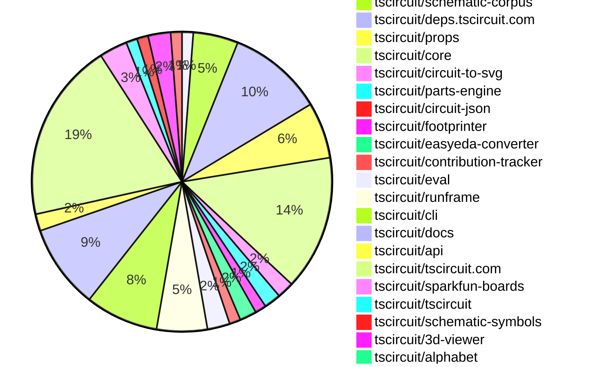
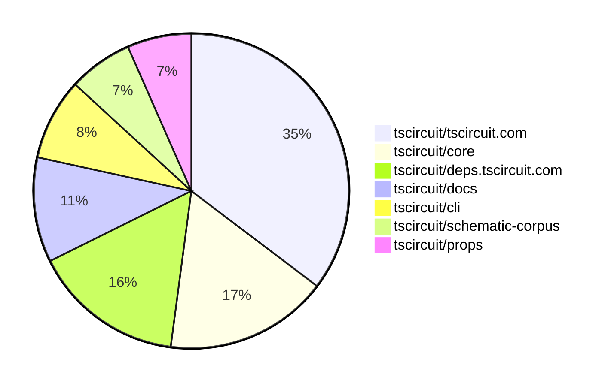

# Contribution Overview 2025-06-17

## PRs by Repository

## Contributor Overview

| Contributor | 🐳 Major | 🐙 Minor | 🐌 Tiny | ⭐ | Issues Created | Discussion Contributions |
|-------------|---------|---------|---------|-----|----------------|--------------------------|
| [ArnavK-09](#ArnavK-09) | 7 | 6 | 6 | 👑 | 0 | 0🔹 0🔶 0💎 |
| [seveibar](#seveibar) | 6 | 4 | 58 | ⭐⭐⭐ | 0 | 0🔹 0🔶 0💎 |
| [imrishabh18](#imrishabh18) | 2 | 2 | 21 | ⭐⭐ | 0 | 0🔹 0🔶 0💎 |
| [techmannih](#techmannih) | 1 | 4 | 7 | ⭐⭐ | 0 | 0🔹 0🔶 0💎 |
| [ShiboSoftwareDev](#ShiboSoftwareDev) | 1 | 1 | 15 | ⭐⭐ | 0 | 0🔹 0🔶 0💎 |
| [Abse2001](#Abse2001) | 0 | 1 | 13 | ⭐⭐ | 0 | 0🔹 0🔶 0💎 |
| [Anshgrover23](#Anshgrover23) | 1 | 1 | 4 | ⭐⭐ | 0 | 0🔹 0🔶 0💎 |
| [MustafaMulla29](#MustafaMulla29) | 1 | 0 | 3 | ⭐ | 0 | 0🔹 0🔶 0💎 |
| [tscircuitbot](#tscircuitbot) | 0 | 0 | 3 |  | 0 | 0🔹 0🔶 0💎 |
| [shimaore](#shimaore) | 0 | 0 | 1 |  | 0 | 0🔹 0🔶 0💎 |

### Discussion Contribution Legend

- 🔹 Normal Comments: Basic participation with minimal effort
- 🔶 Great Informative Comments: Thoughtful participation that adds value
- 💎 Incredible Comments: Exceptional participation with high-quality content

## Review Table

[reviews-received-hover]: ## "Number of reviews received for PRs for this contributor"
[approvals-received-hover]: ## "Number of approvals received for PRs this contributor authored"
[rejections-received-hover]: ## "Number of rejections received for PRs this contributor authored"
[prs-opened-hover]: ## "Number of PRs opened by this contributor"
[issues-created-hover]: ## "Number of issues created by this contributor"
[bountied-issues-hover]: ## "Number of issues this contributor created with a bounty"
[bountied-issue-$-hover]: ## "Total bounty amount placed on issues authored by this contributor"

| Contributor | Reviews Received | Approvals Received | Rejections Received | Approvals | Rejections | PRs Opened | PRs Merged | Issues Created | Bountied Issues | Bountied Issue $ |
|---|---|---|---|---|---|---|---|---|---|---|
| [seveibar](#seveibar) | 25 | 2 | 0 | 77 | 4 | 91 | 74 | 0 | 2 | 50 |
| [Abse2001](#Abse2001) | 16 | 14 | 0 | 0 | 0 | 17 | 15 | 0 | 1 | 30 |
| [imrishabh18](#imrishabh18) | 16 | 10 | 0 | 11 | 1 | 31 | 28 | 0 | 2 | 25 |
| [techmannih](#techmannih) | 33 | 15 | 4 | 2 | 3 | 17 | 13 | 0 | 0 | 0 |
| [ShiboSoftwareDev](#ShiboSoftwareDev) | 28 | 20 | 0 | 11 | 0 | 25 | 18 | 0 | 1 | 5 |
| [graphite-app[bot]](#graphite-app[bot]) | 0 | 0 | 0 | 0 | 0 | 0 | 0 | 0 | 0 | 0 |
| [Anshgrover23](#Anshgrover23) | 17 | 12 | 1 | 2 | 1 | 8 | 7 | 0 | 0 | 0 |
| [MustafaMulla29](#MustafaMulla29) | 14 | 7 | 2 | 0 | 0 | 6 | 5 | 0 | 0 | 0 |
| [cursor[bot]](#cursor[bot]) | 0 | 0 | 0 | 0 | 0 | 0 | 0 | 0 | 0 | 0 |
| [andrii-balitskyi](#andrii-balitskyi) | 7 | 4 | 1 | 0 | 0 | 4 | 4 | 0 | 0 | 0 |
| [shimaore](#shimaore) | 1 | 1 | 0 | 0 | 0 | 1 | 1 | 0 | 0 | 0 |
| [ArnavK-09](#ArnavK-09) | 30 | 23 | 1 | 5 | 0 | 20 | 20 | 0 | 0 | 0 |
| [tscircuitbot](#tscircuitbot) | 0 | 0 | 0 | 0 | 0 | 51 | 4 | 0 | 0 | 0 |

## Top 7 Repositories by Contribution Points

## Changes by Repository

### [tscircuit/schematic-viewer](https://github.com/tscircuit/schematic-viewer)

| PR # | Impact | Rating | Contributor | Description |
|------|--------|--------|-------------|-------------|
| [#97](https://github.com/tscircuit/schematic-viewer/pull/97) | 🐳 Major | ⭐⭐⭐ | seveibar | Adds a grid icon and z-index entry, allowing component dragging to snap to a 0.1 grid when enabled, and exposes snap toggle in SchematicViewer. |

🐌 Tiny Contributions (1)

| PR # | Impact | Contributor | Description |
|------|--------|-------------|-------------|
| [#98](https://github.com/tscircuit/schematic-viewer/pull/98) | 🐌 Tiny | Abse2001 | Updates the circuit-to-svg dependency from version 0.0.120 to 0.0.155 in package.json. |

### [tscircuit/bpc-graph](https://github.com/tscircuit/bpc-graph)

| PR # | Impact | Rating | Contributor | Description |
|------|--------|--------|-------------|-------------|
| [#2](https://github.com/tscircuit/bpc-graph/pull/2) | 🐳 Major | ⭐⭐⭐ | seveibar | bootstrap some operations logic, add some operation types and utilities for dir vecs wip bootstrapping operation cost setup add some ops get operation cost functions |

### [tscircuit/schematic-corpus](https://github.com/tscircuit/schematic-corpus)

| PR # | Impact | Rating | Contributor | Description |
|------|--------|--------|-------------|-------------|
| [#2](https://github.com/tscircuit/schematic-corpus/pull/2) | 🐳 Major | ⭐⭐⭐ | seveibar | Adds a script to convert circuit JSON output to BPC graphs and generates a bundled JSON file with all BPC graphs. |

🐌 Tiny Contributions (7)

| PR # | Impact | Contributor | Description |
|------|--------|-------------|-------------|
| [#9](https://github.com/tscircuit/schematic-corpus/pull/9) | 🐌 Tiny | Abse2001 | Creates a new schematic design for a circuit board with specific components and net connections. |
| [#8](https://github.com/tscircuit/schematic-corpus/pull/8) | 🐌 Tiny | Abse2001 | Adds a new circuit design with specific component placements and connections in the schematic corpus. |
| [#7](https://github.com/tscircuit/schematic-corpus/pull/7) | 🐌 Tiny | Abse2001 | Adds a new circuit design with a resistor and a chip, including manual placements and net labels for connections. |
| [#6](https://github.com/tscircuit/schematic-corpus/pull/6) | 🐌 Tiny | Abse2001 | Adds a new circuit design with specific component placements and connections in the schematic corpus. |
| [#5](https://github.com/tscircuit/schematic-corpus/pull/5) | 🐌 Tiny | Abse2001 | Adds a new circuit design with specific component placements and connections in the schematic corpus. |
| [#4](https://github.com/tscircuit/schematic-corpus/pull/4) | 🐌 Tiny | Abse2001 | Adds a new circuit design with specific component placements and connections in the schematic corpus. |
| [#3](https://github.com/tscircuit/schematic-corpus/pull/3) | 🐌 Tiny | Abse2001 | Adds a new design for testing and tuning the auto-layout algorithm in the schematic corpus. |

### [tscircuit/deps.tscircuit.com](https://github.com/tscircuit/deps.tscircuit.com)

| PR # | Impact | Rating | Contributor | Description |
|------|--------|--------|-------------|-------------|
| [#14](https://github.com/tscircuit/deps.tscircuit.com/pull/14) | 🐳 Major | ⭐⭐⭐ | seveibar | Adds a category filter dropdown to the dependency graph, allowing users to filter graph nodes and edges by selected categories, enhancing the visualization of package dependencies. |
| [#8](https://github.com/tscircuit/deps.tscircuit.com/pull/8) | 🐳 Major | ⭐⭐⭐ | seveibar | Retains user-modified node positions during data refreshes and adds a Reset Layout button to automatically reset the layout when new repositories appear. |
| [#2](https://github.com/tscircuit/deps.tscircuit.com/pull/2) | 🐳 Major | ⭐⭐⭐ | seveibar | Adds the last updated timestamp for each node in the dependency graph, enhancing user awareness of package updates. |

🐌 Tiny Contributions (14)

| PR # | Impact | Contributor | Description |
|------|--------|-------------|-------------|
| [#22](https://github.com/tscircuit/deps.tscircuit.com/pull/22) | 🐌 Tiny | seveibar | Adds functionality to focus on nodes in the dependency graph, allowing users to see connected nodes while fading out unconnected ones, and includes a button to unfocus nodes. |
| [#21](https://github.com/tscircuit/deps.tscircuit.com/pull/21) | 🐌 Tiny | seveibar | Changes the default behavior of the dependency graph to show all dependencies instead of only peer dependencies. |
| [#19](https://github.com/tscircuit/deps.tscircuit.com/pull/19) | 🐌 Tiny | seveibar | Maps tscircuitchecks to the Core Utility category and tests that it resolves correctly. |
| [#18](https://github.com/tscircuit/deps.tscircuit.com/pull/18) | 🐌 Tiny | seveibar | Adds the parts-engine repository to the dependency graph and categorizes it as a Core Utility, along with testing the new category mapping. |
| [#17](https://github.com/tscircuit/deps.tscircuit.com/pull/17) | 🐌 Tiny | seveibar | Maps tscircuit to Packaged Bundles and updates the category for jscad-electronics to UI Packages. |
| [#13](https://github.com/tscircuit/deps.tscircuit.com/pull/13) | 🐌 Tiny | seveibar | Adds support for peerDependencies in the dependency graph by only creating edges for dependencies declared in peerDependencies. |
| [#12](https://github.com/tscircuit/deps.tscircuit.com/pull/12) | 🐌 Tiny | seveibar | Adds worstEdgeColor to DisplayNodeData and computes the worst incoming edge color to visually indicate node status with red or yellow borders based on edge severity. |
| [#10](https://github.com/tscircuit/deps.tscircuit.com/pull/10) | 🐌 Tiny | seveibar | Adds a getEdgeColor helper to compute color from version difference and applies it when building dependency edges, along with tests for the new color logic. |
| [#7](https://github.com/tscircuit/deps.tscircuit.com/pull/7) | 🐌 Tiny | seveibar | Displays the dependency name in edge labels when a package version is stale and exposes the formatEdgeLabel helper with tests for it. |
| [#9](https://github.com/tscircuit/deps.tscircuit.com/pull/9) | 🐌 Tiny | seveibar | Adds additional GitHub repositories to the dependency graph for better visibility of dependencies. |
| [#5](https://github.com/tscircuit/deps.tscircuit.com/pull/5) | 🐌 Tiny | seveibar | Displays dependency edges in gray when the requirement is satisfied and in yellow with a used  latest label when behind. |
| [#6](https://github.com/tscircuit/deps.tscircuit.com/pull/6) | 🐌 Tiny | seveibar | Updates the site description to remove the v0 reference and includes the tscircuit-autorouter repo in the dependency graph. |
| [#3](https://github.com/tscircuit/deps.tscircuit.com/pull/3) | 🐌 Tiny | seveibar | Allows nodes and edges in the dependency graph to be dragged for better visualization and interaction. |
| [#4](https://github.com/tscircuit/deps.tscircuit.com/pull/4) | 🐌 Tiny | seveibar | Adds a GitHub repository badge to the README and updates the semver dependency version to 7.7.2. |

### [tscircuit/props](https://github.com/tscircuit/props)

| PR # | Impact | Rating | Contributor | Description |
|------|--------|--------|-------------|-------------|
| [#290](https://github.com/tscircuit/props/pull/290) | 🐙 Minor | ⭐⭐ | seveibar | Fixes the anchorSide values for netalias and netlabel to support top and bottom sides instead of up and down. |

🐌 Tiny Contributions (9)

| PR # | Impact | Contributor | Description |
|------|--------|-------------|-------------|
| [#298](https://github.com/tscircuit/props/pull/298) | 🐌 Tiny | seveibar | Adds a connectsTo property to plated hole components, allowing for better connection management in circuit designs. |
| [#297](https://github.com/tscircuit/props/pull/297) | 🐌 Tiny | seveibar | Allows naming of smtpads and vias, enables vias to specify nets they connect to via connectsTo, documents the new props, tests via parser, and updates existing smtpad tests. |
| [#296](https://github.com/tscircuit/props/pull/296) | 🐌 Tiny | seveibar | Adds a schematicOrientation enum and supports the schOrientation prop on two-pin components, including tests for parsing orientation for diodes and resistors. |
| [#295](https://github.com/tscircuit/props/pull/295) | 🐌 Tiny | seveibar | Adds a connections property to the jumper  component, allowing it to connect to other components and includes documentation and tests for this new feature. |
| [#294](https://github.com/tscircuit/props/pull/294) | 🐌 Tiny | seveibar | Clarifies comments and documentation for the internallyConnectedPins property in the ConnectorProps and JumperProps interfaces, ensuring accurate representation of the property without the misleading term bridged. |
| [#291](https://github.com/tscircuit/props/pull/291) | 🐌 Tiny | seveibar | Summary expand connectsTo union to accept string or array regenerate docs for NetLabelProps  Testing bun test tests bun update --latest some-dep (fails: GET https:registry.npmjs.orgsome-dep - 403) |
| [#289](https://github.com/tscircuit/props/pull/289) | 🐌 Tiny | seveibar | Adds padding properties to LayoutConfig for better layout control in components. |
| [#293](https://github.com/tscircuit/props/pull/293) | 🐌 Tiny | Anshgrover23 | Makes schX and schY properties optional in schematic-text and schematic-box components, enhancing flexibility in their usage. |
| [#292](https://github.com/tscircuit/props/pull/292) | 🐌 Tiny | Anshgrover23 | Adds missing properties schWidth, schHeight, schPinSpacing, and schPinStyle to the PinHeaderProps interface, allowing for better customization of pin header schematics. |

### [tscircuit/core](https://github.com/tscircuit/core)

| PR # | Impact | Rating | Contributor | Description |
|------|--------|--------|-------------|-------------|
| [#948](https://github.com/tscircuit/core/pull/948) | 🐙 Minor | ⭐⭐ | seveibar | Removes the deprecated NetAlias component and replaces it with a new NetLabel component, updating related tests and intrinsic JSX typings accordingly. |
| [#954](https://github.com/tscircuit/core/pull/954) | 🐙 Minor | ⭐⭐ | Anshgrover23 | Fixes the issue where the schWidth property was not being displayed in the SchematicText component, ensuring proper rendering of schematic elements. |
| [#962](https://github.com/tscircuit/core/pull/962) | 🐙 Minor | ⭐⭐ | imrishabh18 | Expands simple route JSON bounds by padded PCB group size and adds a test to check padding application during simple route JSON computation. |
| [#938](https://github.com/tscircuit/core/pull/938) | 🐙 Minor | ⭐⭐ | imrishabh18 | Fixes net label lookup in subcircuits to ensure descendant nets are correctly identified and utilized. |

🐌 Tiny Contributions (20)

| PR # | Impact | Contributor | Description |
|------|--------|-------------|-------------|
| [#959](https://github.com/tscircuit/core/pull/959) | 🐌 Tiny | seveibar | Allows sel to be invoked as a function and supports generic pins for any reference designator, along with testing dynamic reference designator usage. |
| [#973](https://github.com/tscircuit/core/pull/973) | 🐌 Tiny | seveibar | Adds support for the pcbDisabled option in the RootCircuit constructor, allowing for conditional behavior based on platform configuration. |
| [#972](https://github.com/tscircuit/core/pull/972) | 🐌 Tiny | seveibar | Avoids overriding user-provided schematic width when passed in, ensuring that the specified width is respected during schematic generation. |
| [#961](https://github.com/tscircuit/core/pull/961) | 🐌 Tiny | seveibar | Provides clearer error messages when a port selector cant resolve a pin and adds tests covering all error scenarios when port lookup fails. |
| [#960](https://github.com/tscircuit/core/pull/960) | 🐌 Tiny | seveibar | Adds support for JP jumpers and constant USBC in selector types within the tscircuitcore library. |
| [#957](https://github.com/tscircuit/core/pull/957) | 🐌 Tiny | seveibar | Allows netlabel.connectsTo to accept an array of selectors, enabling multiple connections to be defined for a netlabel. |
| [#955](https://github.com/tscircuit/core/pull/955) | 🐌 Tiny | seveibar | Disables the lockfile feature in the bunfig.toml configuration, allowing for more flexible dependency management. |
| [#951](https://github.com/tscircuit/core/pull/951) | 🐌 Tiny | seveibar | Allows net creation from netlabels and creates traces if a NetLabel has connectsTo defined, fixing the handling of netlabel connections in the schematic. |
| [#950](https://github.com/tscircuit/core/pull/950) | 🐌 Tiny | seveibar | Links netlabels to traces using the connection prop and updates the netlabel-connection schematic snapshot. |
| [#956](https://github.com/tscircuit/core/pull/956) | 🐌 Tiny | Abse2001 | Adds support for J references in the selector, allowing for the use of sel.J1, sel.J2, etc., in component connections. |
| [#967](https://github.com/tscircuit/core/pull/967) | 🐌 Tiny | techmannih | Adds support for the fuse component selector in the selection utility, allowing for new pin types to be utilized in the circuit design. |
| [#975](https://github.com/tscircuit/core/pull/975) | 🐌 Tiny | techmannih | Adds typing for additional pins (pin3 to pin6) in the switch selector type definition, enhancing type safety and usability. |
| [#971](https://github.com/tscircuit/core/pull/971) | 🐌 Tiny | techmannih | Adds the display of load capacitance value alongside frequency in the crystal component. |
| [#963](https://github.com/tscircuit/core/pull/963) | 🐌 Tiny | ShiboSoftwareDev | Adds support for pin labels in the SolderJumper component, allowing for more descriptive pin naming in schematics. |
| [#953](https://github.com/tscircuit/core/pull/953) | 🐌 Tiny | Anshgrover23 | Updates the tscircuitprops dependency version from 0.0.234 to 0.0.236 in package.json |
| [#969](https://github.com/tscircuit/core/pull/969) | 🐌 Tiny | imrishabh18 | Fixes the polarized capacitor symbol in the schematic representation by updating the relevant type and adding tests for polarized capacitors. |
| [#949](https://github.com/tscircuit/core/pull/949) | 🐌 Tiny | imrishabh18 | Adds a render phase to assign names to unnamed components, ensuring they have default names before rendering and providing placeholder names for JSX elements that lack one. |
| [#965](https://github.com/tscircuit/core/pull/965) | 🐌 Tiny | imrishabh18 | Fixes the issue where the subcircuit_id is incorrectly set for groups that are not subcircuits, ensuring that it remains undefined when not applicable. |
| [#964](https://github.com/tscircuit/core/pull/964) | 🐌 Tiny | imrishabh18 | Adds a new render phase SourceGroupRender for initializing subcircuits in the Group component and updates the render lifecycle event tests accordingly. |
| [#947](https://github.com/tscircuit/core/pull/947) | 🐌 Tiny | imrishabh18 | Adds support for padding in the Group PCB layout and updates the tscircuitprops package to utilize new padding properties. |

### [tscircuit/circuit-to-svg](https://github.com/tscircuit/circuit-to-svg)

| PR # | Impact | Rating | Contributor | Description |
|------|--------|--------|-------------|-------------|
| [#262](https://github.com/tscircuit/circuit-to-svg/pull/262) | 🐙 Minor | ⭐⭐ | seveibar | Adds a software metadata attribute to SVG outputs by exposing the getSoftwareUsedString utility and attaching data-software-used-string to all SVG outputs when metadata is present. |
| [#261](https://github.com/tscircuit/circuit-to-svg/pull/261) | 🐙 Minor | ⭐⭐ | Abse2001 | Fixes the stroke scaling of schematic boxes to use non-scaling stroke, ensuring consistent appearance regardless of transformations applied. |

🐌 Tiny Contributions (1)

| PR # | Impact | Contributor | Description |
|------|--------|-------------|-------------|
| [#264](https://github.com/tscircuit/circuit-to-svg/pull/264) | 🐌 Tiny | seveibar | Fixes rendering issue where bottom layer traces do not appear below top layer SMT pads in SVG outputs. |

### [tscircuit/parts-engine](https://github.com/tscircuit/parts-engine)

| PR # | Impact | Rating | Contributor | Description |
|------|--------|--------|-------------|-------------|
| [#7](https://github.com/tscircuit/parts-engine/pull/7) | 🐙 Minor | ⭐⭐ | seveibar | Returns an empty part list when the API response is missing data and adds a regression test for missing API fields. |
| [#5](https://github.com/tscircuit/parts-engine/pull/5) | 🐙 Minor | ⭐⭐ | techmannih | Adds support for the simple_fuse component type in the parts engine, allowing for the retrieval of fuse parts from the JLCPCB API. |

🐌 Tiny Contributions (1)

| PR # | Impact | Contributor | Description |
|------|--------|-------------|-------------|
| [#6](https://github.com/tscircuit/parts-engine/pull/6) | 🐌 Tiny | techmannih | Adds GitHub workflows for format and type checking using Bun, ensuring code quality and consistency in the repository. |

### [tscircuit/circuit-json](https://github.com/tscircuit/circuit-json)

🐌 Tiny Contributions (1)

| PR # | Impact | Contributor | Description |
|------|--------|-------------|-------------|
| [#232](https://github.com/tscircuit/circuit-json/pull/232) | 🐌 Tiny | seveibar | Stops defaulting SchematicNetLabel.is_movable to true, updates documentation for schematic_net_label, updates unit tests, and bumps zod. |

### [tscircuit/footprinter](https://github.com/tscircuit/footprinter)

| PR # | Impact | Rating | Contributor | Description |
|------|--------|--------|-------------|-------------|
| [#295](https://github.com/tscircuit/footprinter/pull/295) | 🐙 Minor | ⭐⭐ | techmannih | Fixes incorrect logic for pad dimensions in passive component footprints, ensuring accurate pad width and height calculations. |

🐌 Tiny Contributions (1)

| PR # | Impact | Contributor | Description |
|------|--------|-------------|-------------|
| [#302](https://github.com/tscircuit/footprinter/pull/302) | 🐌 Tiny | seveibar | Adds the ability for BGA footprints to utilize circular pads by introducing a new circularpads flag in the footprinter and includes tests for this feature. |

### [tscircuit/easyeda-converter](https://github.com/tscircuit/easyeda-converter)

| PR # | Impact | Rating | Contributor | Description |
|------|--------|--------|-------------|-------------|
| [#254](https://github.com/tscircuit/easyeda-converter/pull/254) | 🐙 Minor | ⭐⭐ | techmannih | Fixes import issue with part C5830143 from JLCPCB, ensuring proper conversion to TypeScript and circuit JSON. |
| [#255](https://github.com/tscircuit/easyeda-converter/pull/255) | 🐙 Minor | ⭐⭐ | techmannih | Fixes import failure for JLCPCB part C9900017879 due to incorrect handling of nullable fields in the schema. |

🐌 Tiny Contributions (1)

| PR # | Impact | Contributor | Description |
|------|--------|-------------|-------------|
| [#247](https://github.com/tscircuit/easyeda-converter/pull/247) | 🐌 Tiny | seveibar | Adds a test for converting the C19795120 part to ensure PCB cutout generation from HOLE and SOLIDREGION shapes, and transforms PCB cutout elements when recentering. |

### [tscircuit/contribution-tracker](https://github.com/tscircuit/contribution-tracker)

🐌 Tiny Contributions (2)

| PR # | Impact | Contributor | Description |
|------|--------|-------------|-------------|
| [#178](https://github.com/tscircuit/contribution-tracker/pull/178) | 🐌 Tiny | seveibar | Switches to OpenAIs o3 model for AI object generation and adds guidelines for changelog generation. |
| [#177](https://github.com/tscircuit/contribution-tracker/pull/177) | 🐌 Tiny | seveibar | Adds a monthly changelog generator that uses AI to create markdown files summarizing pull requests, updates the README to link to these changelogs, and sets up a CI workflow to run the generator nightly. |

### [tscircuit/eval](https://github.com/tscircuit/eval)

🐌 Tiny Contributions (4)

| PR # | Impact | Contributor | Description |
|------|--------|-------------|-------------|
| [#576](https://github.com/tscircuit/eval/pull/576) | 🐌 Tiny | seveibar | Adds support for an optional platform configuration in CircuitRunner, allowing users to customize platform settings for circuit execution. |
| [#575](https://github.com/tscircuit/eval/pull/575) | 🐌 Tiny | tscircuitbot | Automated update of tscircuitcore to v0.0.510, which includes dependency updates without introducing new functionality. |
| [#563](https://github.com/tscircuit/eval/pull/563) | 🐌 Tiny | tscircuitbot | Updates the tscircuitcore dependency to version 0.0.504, ensuring compatibility with the latest features and fixes provided by the core library. |
| [#546](https://github.com/tscircuit/eval/pull/546) | 🐌 Tiny | tscircuitbot | Updates the tscircuitcore dependency to version 0.0.495 in the package.json file. |

### [tscircuit/runframe](https://github.com/tscircuit/runframe)

🐌 Tiny Contributions (9)

| PR # | Impact | Contributor | Description |
|------|--------|-------------|-------------|
| [#783](https://github.com/tscircuit/runframe/pull/783) | 🐌 Tiny | seveibar | Displays the last run evaluation version below the runframe version in the CircuitJsonPreview component. |
| [#777](https://github.com/tscircuit/runframe/pull/777) | 🐌 Tiny | seveibar | Adds PostHog telemetry for capturing execution and circuit JSON errors, and introduces a new useErrorTelemetry hook for better error tracking. |
| [#790](https://github.com/tscircuit/runframe/pull/790) | 🐌 Tiny | Abse2001 | Updates the version of the tscircuitschematic-viewer dependency from 2.0.21 to 2.0.22 in package.json. |
| [#796](https://github.com/tscircuit/runframe/pull/796) | 🐌 Tiny | imrishabh18 | Changes the ImportComponentDialog to use Dialog instead of AlertDialog and allows clicking outside to close the dialog. |
| [#793](https://github.com/tscircuit/runframe/pull/793) | 🐌 Tiny | imrishabh18 | Updates the versions of the tscircuiteval and schematic-symbols dependencies in package.json. |
| [#786](https://github.com/tscircuit/runframe/pull/786) | 🐌 Tiny | imrishabh18 | Updates the 3D viewer dependency to version 0.0.278 in package.json. |
| [#781](https://github.com/tscircuit/runframe/pull/781) | 🐌 Tiny | imrishabh18 | Elevates the OrderDialog above other layers by setting z-index to 101. |
| [#780](https://github.com/tscircuit/runframe/pull/780) | 🐌 Tiny | imrishabh18 | Captures errors in InitialOrder using useErrorTelemetry. |
| [#800](https://github.com/tscircuit/runframe/pull/800) | 🐌 Tiny | MustafaMulla29 | Updates the easyeda dependency to version 0.0.185 to resolve part import issues in the application. |

### [tscircuit/cli](https://github.com/tscircuit/cli)

| PR # | Impact | Rating | Contributor | Description |
|------|--------|--------|-------------|-------------|
| [#241](https://github.com/tscircuit/cli/pull/241) | 🐙 Minor | ⭐⭐ | ShiboSoftwareDev | Refactors the configuration creation logic to support both global and project-specific settings, enhancing the command line interface for configuration management. |

🐌 Tiny Contributions (12)

| PR # | Impact | Contributor | Description |
|------|--------|-------------|-------------|
| [#248](https://github.com/tscircuit/cli/pull/248) | 🐌 Tiny | seveibar | Adds a command-line option to disable PCB outputs during the build process. |
| [#243](https://github.com/tscircuit/cli/pull/243) | 🐌 Tiny | seveibar | Allows tsci snapshot file to generate snapshots for a single file and supports filePaths option in snapshotProject. |
| [#236](https://github.com/tscircuit/cli/pull/236) | 🐌 Tiny | seveibar | Adds --pcb-only and --schematic-only flags to the tsci snapshot command, allowing users to generate snapshots for only PCB or schematic designs. |
| [#234](https://github.com/tscircuit/cli/pull/234) | 🐌 Tiny | seveibar | Logs the paths of snapshot files when they are created, providing clearer feedback to users about the snapshot generation process. |
| [#242](https://github.com/tscircuit/cli/pull/242) | 🐌 Tiny | Abse2001 | Updates the version of the tscircuitrunframe dependency from 0.0.609 to 0.0.614 in package.json. |
| [#247](https://github.com/tscircuit/cli/pull/247) | 🐌 Tiny | ShiboSoftwareDev | Changes the dependency status of tscircuit from a regular dependency to a peer dependency in the package.json file. |
| [#245](https://github.com/tscircuit/cli/pull/245) | 🐌 Tiny | ShiboSoftwareDev | Fixes a regression that caused the snapshot command to break by checking irrelevant index files and updates the tscircuit dependency version. |
| [#244](https://github.com/tscircuit/cli/pull/244) | 🐌 Tiny | ShiboSoftwareDev | Fixes the GitHub Actions workflow for the tsci snapshot command to ensure it checks for snapshot mismatches correctly during push and pull request events. |
| [#239](https://github.com/tscircuit/cli/pull/239) | 🐌 Tiny | ShiboSoftwareDev | Updates various dependencies in the project to their latest versions, potentially resolving issues with sparkfun-packages. |
| [#237](https://github.com/tscircuit/cli/pull/237) | 🐌 Tiny | ShiboSoftwareDev | Enables the snapshot command to function correctly on Windows machines, ensuring compatibility across different operating systems. |
| [#232](https://github.com/tscircuit/cli/pull/232) | 🐌 Tiny | ShiboSoftwareDev | Adds functionality to the snapshot command to include handling of .circuit.tsx files, ensuring they are processed similarly to .board.tsx files during snapshot generation. |
| [#233](https://github.com/tscircuit/cli/pull/233) | 🐌 Tiny | imrishabh18 | Renames the project configuration schema field from mainEntrypoint to mainComponentPath and updates related functions to use the new field. |

### [tscircuit/docs](https://github.com/tscircuit/docs)

| PR # | Impact | Rating | Contributor | Description |
|------|--------|--------|-------------|-------------|
| [#74](https://github.com/tscircuit/docs/pull/74) | 🐳 Major | ⭐⭐⭐ | imrishabh18 | Adds a new section detailing the ordering process for prototypes through the tscircuit platform, including component properties and steps for placing an order. |

🐌 Tiny Contributions (14)

| PR # | Impact | Contributor | Description |
|------|--------|-------------|-------------|
| [#89](https://github.com/tscircuit/docs/pull/89) | 🐌 Tiny | seveibar | Adds documentation for creating an order quote in the Ordering API, detailing the request body and response format. |
| [#88](https://github.com/tscircuit/docs/pull/88) | 🐌 Tiny | seveibar | Documents the Order Quote API in the Ordering API page, providing details on how to retrieve pricing quotes for PCB orders. |
| [#86](https://github.com/tscircuit/docs/pull/86) | 🐌 Tiny | seveibar | Documents public ordering API endpoints for creating and retrieving orders through the tscircuit API. |
| [#87](https://github.com/tscircuit/docs/pull/87) | 🐌 Tiny | seveibar | Documents the pin information schema in the Datasheet API docs and shows sample pin info output from the RP2040 datasheet. |
| [#85](https://github.com/tscircuit/docs/pull/85) | 🐌 Tiny | seveibar | Adds documentation for the datasheetsget and datasheetscreate endpoints, along with CLI reference for tsci auth print-token. |
| [#84](https://github.com/tscircuit/docs/pull/84) | 🐌 Tiny | seveibar | Adds documentation for the breakout container and breakoutpoint for routing targets in the tscircuit documentation. |
| [#82](https://github.com/tscircuit/docs/pull/82) | 🐌 Tiny | seveibar | Documents the new feature for calling sel() with a reference designator and recommends saving the selector set to a variable. |
| [#81](https://github.com/tscircuit/docs/pull/81) | 🐌 Tiny | seveibar | Adds leftView and rightView props to CircuitPreview, allowing users to display different views side by side, while hiding tabs and disabling extra previews when these props are used. |
| [#76](https://github.com/tscircuit/docs/pull/76) | 🐌 Tiny | seveibar | Documents the new netlabel  element, which replaces the netalias  element in the schematic representation. |
| [#80](https://github.com/tscircuit/docs/pull/80) | 🐌 Tiny | seveibar | Expands documentation for the jumper  component by adding a bridge pin example, documenting jumper properties, and refining the bridging description with pin labels in the example. |
| [#77](https://github.com/tscircuit/docs/pull/77) | 🐌 Tiny | seveibar | Documents how to add tscircuit types in tsconfig and updates clsx to the latest version. |
| [#75](https://github.com/tscircuit/docs/pull/75) | 🐌 Tiny | seveibar | Adds documentation for the tsci build and tsci snapshot commands, detailing their usage, options, and output. |
| [#79](https://github.com/tscircuit/docs/pull/79) | 🐌 Tiny | imrishabh18 | Adds documentation for the schematictext  component, detailing its properties and usage, and ensures lint compliance for the YouTubeEmbed component by changing the iframe to a self-closing tag. |
| [#78](https://github.com/tscircuit/docs/pull/78) | 🐌 Tiny | imrishabh18 | Fixes incomplete sentences in the net  documentation, providing clearer explanations of its usage and implications. |

### [tscircuit/api](https://github.com/tscircuit/api)

🐌 Tiny Contributions (3)

| PR # | Impact | Contributor | Description |
|------|--------|-------------|-------------|
| [#4](https://github.com/tscircuit/api/pull/4) | 🐌 Tiny | seveibar | Adds an example of the datasheet output for the RP2040 chip to the documentation. |
| [#3](https://github.com/tscircuit/api/pull/3) | 🐌 Tiny | seveibar | Adds a new helper method for finding, creating, and waiting for datasheets, along with support for retrieving datasheets by chip name and enhancing the README with usage examples. |
| [#2](https://github.com/tscircuit/api/pull/2) | 🐌 Tiny | seveibar | Implements datasheet createget API in the client and completes associated tests. |

### [tscircuit/tscircuit.com](https://github.com/tscircuit/tscircuit.com)

| PR # | Impact | Rating | Contributor | Description |
|------|--------|--------|-------------|-------------|
| [#1357](https://github.com/tscircuit/tscircuit.com/pull/1357) | 🐳 Major | ⭐⭐⭐ | ArnavK-09 | Implements client-side caching for file content in the ImportantFilesView component, improving load times and reducing server requests. |
| [#1353](https://github.com/tscircuit/tscircuit.com/pull/1353) | 🐳 Major | ⭐⭐⭐ | ArnavK-09 | Adds a new utility hook for handling keyboard shortcuts, replacing existing keydown event listeners in multiple components. |
| [#1336](https://github.com/tscircuit/tscircuit.com/pull/1336) | 🐳 Major | ⭐⭐⭐ | ArnavK-09 | Adds Tab key support for autocompletion in the code editor, allowing users to accept suggestions or indent lines. |
| [#1337](https://github.com/tscircuit/tscircuit.com/pull/1337) | 🐳 Major | ⭐⭐⭐ | ArnavK-09 | Adds a VSCode-style file switcher to the editor, allowing users to quickly open files using the CtrlP shortcut. |
| [#1332](https://github.com/tscircuit/tscircuit.com/pull/1332) | 🐳 Major | ⭐⭐⭐ | ArnavK-09 | Adds a button to re-request AI review on the Important Files View page. |
| [#1330](https://github.com/tscircuit/tscircuit.com/pull/1330) | 🐳 Major | ⭐⭐⭐ | ArnavK-09 | Adds a releases section specifically for small screens on the repository page, improving accessibility for mobile users. |
| [#1313](https://github.com/tscircuit/tscircuit.com/pull/1313) | 🐳 Major | ⭐⭐⭐ | ArnavK-09 | Adds functionality to download a PNG image of the circuit based on the selected type (PCB, schematic, assembly, or 3D) from the DownloadButtonAndMenu component. |
| [#1358](https://github.com/tscircuit/tscircuit.com/pull/1358) | 🐙 Minor | ⭐⭐ | ArnavK-09 | Fixes layout issues in markdown content by adjusting CSS styles for better responsiveness and presentation. |
| [#1355](https://github.com/tscircuit/tscircuit.com/pull/1355) | 🐙 Minor | ⭐⭐ | ArnavK-09 | Fixes responsive design issues in the dialog component to ensure it adapts correctly to various screen sizes and aligns with the current theme. |
| [#1354](https://github.com/tscircuit/tscircuit.com/pull/1354) | 🐙 Minor | ⭐⭐ | ArnavK-09 | Filters out hidden files from the file selection in the CtrlP menu, improving user experience by reducing clutter. |
| [#1334](https://github.com/tscircuit/tscircuit.com/pull/1334) | 🐙 Minor | ⭐⭐ | ArnavK-09 | Adds a new user interface for requesting AI reviews and loading states, enhancing user interaction with the AI review feature. |
| [#1310](https://github.com/tscircuit/tscircuit.com/pull/1310) | 🐙 Minor | ⭐⭐ | ArnavK-09 | Fixes the issue where the editor does not reload properly after saving changes, ensuring that users see the latest updates immediately. |
| [#1311](https://github.com/tscircuit/tscircuit.com/pull/1311) | 🐙 Minor | ⭐⭐ | ArnavK-09 | Fixes the issue where whitespace in the unscoped package name input was not being trimmed, ensuring cleaner input handling in the edit package details dialog. |

🐌 Tiny Contributions (19)

| PR # | Impact | Contributor | Description |
|------|--------|-------------|-------------|
| [#1346](https://github.com/tscircuit/tscircuit.com/pull/1346) | 🐌 Tiny | Abse2001 | Updates the circuit-to-svg dependency version from 0.0.152 to 0.0.157 in package.json. |
| [#1329](https://github.com/tscircuit/tscircuit.com/pull/1329) | 🐌 Tiny | Abse2001 | Updates the version of the tscircuitrunframe dependency from 0.0.610 to 0.0.614 in package.json. |
| [#1322](https://github.com/tscircuit/tscircuit.com/pull/1322) | 🐌 Tiny | techmannih | Updates the easyeda dependency from version 0.0.129 to 0.0.181 in package.json. |
| [#1312](https://github.com/tscircuit/tscircuit.com/pull/1312) | 🐌 Tiny | ShiboSoftwareDev | Fixes the layout of the TreeActions button in the TreeView component to ensure proper alignment and interaction. |
| [#1308](https://github.com/tscircuit/tscircuit.com/pull/1308) | 🐌 Tiny | ShiboSoftwareDev | Adjusts the width of the Confirm Delete Package dialog to 90vw for better usability on smaller devices. |
| [#1323](https://github.com/tscircuit/tscircuit.com/pull/1323) | 🐌 Tiny | Anshgrover23 | Updates the versions of major dependencies including tscircuitcore, tscircuiteval, and tscircuitprops in package.json. |
| [#1328](https://github.com/tscircuit/tscircuit.com/pull/1328) | 🐌 Tiny | imrishabh18 | Updates the status logic in the sidebar release section to utilize the new _display_status properties for better accuracy in build status representation. |
| [#1324](https://github.com/tscircuit/tscircuit.com/pull/1324) | 🐌 Tiny | imrishabh18 | Updates the tscircuitrunframe dependency to version 0.0.610, which likely includes manifold support improvements. |
| [#1318](https://github.com/tscircuit/tscircuit.com/pull/1318) | 🐌 Tiny | imrishabh18 | Fixes z-index issue in dialog rendering within the RunFrame component. |
| [#1317](https://github.com/tscircuit/tscircuit.com/pull/1317) | 🐌 Tiny | imrishabh18 | Widen the file dropdown trigger and menu items in the CodeEditorHeader component. |
| [#1314](https://github.com/tscircuit/tscircuit.com/pull/1314) | 🐌 Tiny | imrishabh18 | Updates the runframe package and adds several missing dependencies to the project. |
| [#1304](https://github.com/tscircuit/tscircuit.com/pull/1304) | 🐌 Tiny | imrishabh18 | Fixes unnecessary data refetching when returning to the package page after changing tabs. |
| [#1333](https://github.com/tscircuit/tscircuit.com/pull/1333) | 🐌 Tiny | ArnavK-09 | Hides the edit button for AI-generated content in the ImportantFilesView component. |
| [#1338](https://github.com/tscircuit/tscircuit.com/pull/1338) | 🐌 Tiny | ArnavK-09 | Adds a keyboard shortcut (CtrlB) to toggle the visibility of the files sidebar, similar to functionality in VSCode. |
| [#1348](https://github.com/tscircuit/tscircuit.com/pull/1348) | 🐌 Tiny | ArnavK-09 | Adds a home link to the header component, allowing users to navigate back to the homepage easily. |
| [#1331](https://github.com/tscircuit/tscircuit.com/pull/1331) | 🐌 Tiny | ArnavK-09 | Fixes z-index issue in the Download dropdown to ensure proper visibility and interaction. |
| [#1307](https://github.com/tscircuit/tscircuit.com/pull/1307) | 🐌 Tiny | ArnavK-09 | Adds a dynamic image URL for package previews based on the packages default view type, allowing for more accurate representation in Open Graph meta tags. |
| [#1309](https://github.com/tscircuit/tscircuit.com/pull/1309) | 🐌 Tiny | ArnavK-09 | Fixes an issue where the default view does not load if packageInfo is not available, preventing the application from crashing. |
| [#1347](https://github.com/tscircuit/tscircuit.com/pull/1347) | 🐌 Tiny | MustafaMulla29 | Updates the tscircuitrunframe dependency to version 0.0.623 to resolve part import issues in the application. |

### [tscircuit/sparkfun-boards](https://github.com/tscircuit/sparkfun-boards)

| PR # | Impact | Rating | Contributor | Description |
|------|--------|--------|-------------|-------------|
| [#5](https://github.com/tscircuit/sparkfun-boards/pull/5) | 🐳 Major | ⭐⭐⭐ | techmannih | Introduces a new circuit board design for the SparkFun USB to Serial Breakout FT232RL, including its schematic and footprint. |
| [#10](https://github.com/tscircuit/sparkfun-boards/pull/10) | 🐳 Major | ⭐⭐⭐ | MustafaMulla29 | original sparkfun board: https:www.sparkfun.comsparkfun-hmc6343-breakout.html |

🐌 Tiny Contributions (3)

| PR # | Impact | Contributor | Description |
|------|--------|-------------|-------------|
| [#9](https://github.com/tscircuit/sparkfun-boards/pull/9) | 🐌 Tiny | ShiboSoftwareDev | No description provided |
| [#8](https://github.com/tscircuit/sparkfun-boards/pull/8) | 🐌 Tiny | ShiboSoftwareDev | Introduces a new React component for the MCP4725 I2C DAC Breakout, including its footprint and CAD model. |
| [#13](https://github.com/tscircuit/sparkfun-boards/pull/13) | 🐌 Tiny | MustafaMulla29 | Updates the dependency tscircuit from version 0.0.499 to 0.0.502 to resolve selection type errors. |

### [tscircuit/tscircuit](https://github.com/tscircuit/tscircuit)

🐌 Tiny Contributions (2)

| PR # | Impact | Contributor | Description |
|------|--------|-------------|-------------|
| [#690](https://github.com/tscircuit/tscircuit/pull/690) | 🐌 Tiny | techmannih | Updates the versions of the tscircuitcore and tscircuiteval dependencies in package.json. |
| [#688](https://github.com/tscircuit/tscircuit/pull/688) | 🐌 Tiny | ShiboSoftwareDev | Updates various dependencies in the project to their latest versions, including tscircuitcapacity-autorouter, tscircuitcli, tscircuitcore, tscircuiteval, and tscircuitprops. |

### [tscircuit/schematic-symbols](https://github.com/tscircuit/schematic-symbols)

🐌 Tiny Contributions (2)

| PR # | Impact | Contributor | Description |
|------|--------|-------------|-------------|
| [#309](https://github.com/tscircuit/schematic-symbols/pull/309) | 🐌 Tiny | techmannih | Fixes the crystal symbol variations by correcting text references and introducing new directional symbols for better representation. |
| [#310](https://github.com/tscircuit/schematic-symbols/pull/310) | 🐌 Tiny | imrishabh18 | Adds missing port labels pos and neg to the right, up, and down capacitor symbols in the schematic. |

### [tscircuit/3d-viewer](https://github.com/tscircuit/3d-viewer)

| PR # | Impact | Rating | Contributor | Description |
|------|--------|--------|-------------|-------------|
| [#356](https://github.com/tscircuit/3d-viewer/pull/356) | 🐳 Major | ⭐⭐⭐ | ShiboSoftwareDev | Refactors the manifold rendering process to operate within a web worker, preventing UI freezing during updates and improving rendering performance. |
| [#346](https://github.com/tscircuit/3d-viewer/pull/346) | 🐳 Major | ⭐⭐⭐ | imrishabh18 | Adds a tooltip that displays error messages when hovering over the error cube in the 3D viewer. |

🐌 Tiny Contributions (2)

| PR # | Impact | Contributor | Description |
|------|--------|-------------|-------------|
| [#355](https://github.com/tscircuit/3d-viewer/pull/355) | 🐌 Tiny | ShiboSoftwareDev | Adds support for pill-shaped plated holes in the manifold processing, allowing for more versatile PCB designs. |
| [#350](https://github.com/tscircuit/3d-viewer/pull/350) | 🐌 Tiny | imrishabh18 | Loads the Manifold WebAssembly module from a CDN instead of a local file, improving loading times and reducing the bundle size. |

### [tscircuit/alphabet](https://github.com/tscircuit/alphabet)

🐌 Tiny Contributions (1)

| PR # | Impact | Contributor | Description |
|------|--------|-------------|-------------|
| [#13](https://github.com/tscircuit/alphabet/pull/13) | 🐌 Tiny | ShiboSoftwareDev | Adds SVG representations for lowercase alphabet characters in normalized sized boxes. |

### [tscircuit/tscircuit-autorouter](https://github.com/tscircuit/tscircuit-autorouter)

| PR # | Impact | Rating | Contributor | Description |
|------|--------|--------|-------------|-------------|
| [#161](https://github.com/tscircuit/tscircuit-autorouter/pull/161) | 🐳 Major | ⭐⭐⭐ | Anshgrover23 | Adds a new fixture for the hyperdensity autorouter bug, specifically addressing the issue outlined in 160. |

🐌 Tiny Contributions (1)

| PR # | Impact | Contributor | Description |
|------|--------|-------------|-------------|
| [#156](https://github.com/tscircuit/tscircuit-autorouter/pull/156) | 🐌 Tiny | ShiboSoftwareDev | Adds a new JSON representation for a high-density node with port points to facilitate autorouting in complex layouts. |

### [tscircuit/circuit-json-to-pnp-csv](https://github.com/tscircuit/circuit-json-to-pnp-csv)

🐌 Tiny Contributions (1)

| PR # | Impact | Contributor | Description |
|------|--------|-------------|-------------|
| [#3](https://github.com/tscircuit/circuit-json-to-pnp-csv/pull/3) | 🐌 Tiny | shimaore | Fixes import placement errors on JLCPCB by ensuring that x and y coordinates do not contain the letter e. |

## Changes by Contributor

### [seveibar](https://github.com/seveibar)

| PRs # | Impact | Rating | Description |
|------|--------|--------|-------------|
| [#97](https://github.com/tscircuit/schematic-viewer/pull/97) | 🐳 Major | ⭐⭐⭐ | Adds a grid icon and z-index entry, allowing component dragging to snap to a 0.1 grid when enabled, and exposes snap toggle in SchematicViewer. |
| [#2](https://github.com/tscircuit/bpc-graph/pull/2) | 🐳 Major | ⭐⭐⭐ | bootstrap some operations logic, add some operation types and utilities for dir vecs wip bootstrapping operation cost setup add some ops get operation cost functions |
| [#2](https://github.com/tscircuit/schematic-corpus/pull/2) | 🐳 Major | ⭐⭐⭐ | Adds a script to convert circuit JSON output to BPC graphs and generates a bundled JSON file with all BPC graphs. |
| [#14](https://github.com/tscircuit/deps.tscircuit.com/pull/14) | 🐳 Major | ⭐⭐⭐ | Adds a category filter dropdown to the dependency graph, allowing users to filter graph nodes and edges by selected categories, enhancing the visualization of package dependencies. |
| [#8](https://github.com/tscircuit/deps.tscircuit.com/pull/8) | 🐳 Major | ⭐⭐⭐ | Retains user-modified node positions during data refreshes and adds a Reset Layout button to automatically reset the layout when new repositories appear. |
| [#2](https://github.com/tscircuit/deps.tscircuit.com/pull/2) | 🐳 Major | ⭐⭐⭐ | Adds the last updated timestamp for each node in the dependency graph, enhancing user awareness of package updates. |
| [#290](https://github.com/tscircuit/props/pull/290) | 🐙 Minor | ⭐⭐ | Fixes the anchorSide values for netalias and netlabel to support top and bottom sides instead of up and down. |
| [#948](https://github.com/tscircuit/core/pull/948) | 🐙 Minor | ⭐⭐ | Removes the deprecated NetAlias component and replaces it with a new NetLabel component, updating related tests and intrinsic JSX typings accordingly. |
| [#262](https://github.com/tscircuit/circuit-to-svg/pull/262) | 🐙 Minor | ⭐⭐ | Adds a software metadata attribute to SVG outputs by exposing the getSoftwareUsedString utility and attaching data-software-used-string to all SVG outputs when metadata is present. |
| [#7](https://github.com/tscircuit/parts-engine/pull/7) | 🐙 Minor | ⭐⭐ | Returns an empty part list when the API response is missing data and adds a regression test for missing API fields. |

🐌 Tiny Contributions (58)

| PR # | Impact | Description |
|------|--------|-------------|
| [#232](https://github.com/tscircuit/circuit-json/pull/232) | 🐌 Tiny | Stops defaulting SchematicNetLabel.is_movable to true, updates documentation for schematic_net_label, updates unit tests, and bumps zod. |
| [#298](https://github.com/tscircuit/props/pull/298) | 🐌 Tiny | Adds a connectsTo property to plated hole components, allowing for better connection management in circuit designs. |
| [#297](https://github.com/tscircuit/props/pull/297) | 🐌 Tiny | Allows naming of smtpads and vias, enables vias to specify nets they connect to via connectsTo, documents the new props, tests via parser, and updates existing smtpad tests. |
| [#296](https://github.com/tscircuit/props/pull/296) | 🐌 Tiny | Adds a schematicOrientation enum and supports the schOrientation prop on two-pin components, including tests for parsing orientation for diodes and resistors. |
| [#295](https://github.com/tscircuit/props/pull/295) | 🐌 Tiny | Adds a connections property to the jumper  component, allowing it to connect to other components and includes documentation and tests for this new feature. |
| [#294](https://github.com/tscircuit/props/pull/294) | 🐌 Tiny | Clarifies comments and documentation for the internallyConnectedPins property in the ConnectorProps and JumperProps interfaces, ensuring accurate representation of the property without the misleading term bridged. |
| [#291](https://github.com/tscircuit/props/pull/291) | 🐌 Tiny | Summary expand connectsTo union to accept string or array regenerate docs for NetLabelProps  Testing bun test tests bun update --latest some-dep (fails: GET https:registry.npmjs.orgsome-dep - 403) |
| [#289](https://github.com/tscircuit/props/pull/289) | 🐌 Tiny | Adds padding properties to LayoutConfig for better layout control in components. |
| [#302](https://github.com/tscircuit/footprinter/pull/302) | 🐌 Tiny | Adds the ability for BGA footprints to utilize circular pads by introducing a new circularpads flag in the footprinter and includes tests for this feature. |
| [#247](https://github.com/tscircuit/easyeda-converter/pull/247) | 🐌 Tiny | Adds a test for converting the C19795120 part to ensure PCB cutout generation from HOLE and SOLIDREGION shapes, and transforms PCB cutout elements when recentering. |
| [#959](https://github.com/tscircuit/core/pull/959) | 🐌 Tiny | Allows sel to be invoked as a function and supports generic pins for any reference designator, along with testing dynamic reference designator usage. |
| [#973](https://github.com/tscircuit/core/pull/973) | 🐌 Tiny | Adds support for the pcbDisabled option in the RootCircuit constructor, allowing for conditional behavior based on platform configuration. |
| [#972](https://github.com/tscircuit/core/pull/972) | 🐌 Tiny | Avoids overriding user-provided schematic width when passed in, ensuring that the specified width is respected during schematic generation. |
| [#961](https://github.com/tscircuit/core/pull/961) | 🐌 Tiny | Provides clearer error messages when a port selector cant resolve a pin and adds tests covering all error scenarios when port lookup fails. |
| [#960](https://github.com/tscircuit/core/pull/960) | 🐌 Tiny | Adds support for JP jumpers and constant USBC in selector types within the tscircuitcore library. |
| [#957](https://github.com/tscircuit/core/pull/957) | 🐌 Tiny | Allows netlabel.connectsTo to accept an array of selectors, enabling multiple connections to be defined for a netlabel. |
| [#955](https://github.com/tscircuit/core/pull/955) | 🐌 Tiny | Disables the lockfile feature in the bunfig.toml configuration, allowing for more flexible dependency management. |
| [#951](https://github.com/tscircuit/core/pull/951) | 🐌 Tiny | Allows net creation from netlabels and creates traces if a NetLabel has connectsTo defined, fixing the handling of netlabel connections in the schematic. |
| [#950](https://github.com/tscircuit/core/pull/950) | 🐌 Tiny | Links netlabels to traces using the connection prop and updates the netlabel-connection schematic snapshot. |
| [#178](https://github.com/tscircuit/contribution-tracker/pull/178) | 🐌 Tiny | Switches to OpenAIs o3 model for AI object generation and adds guidelines for changelog generation. |
| [#177](https://github.com/tscircuit/contribution-tracker/pull/177) | 🐌 Tiny | Adds a monthly changelog generator that uses AI to create markdown files summarizing pull requests, updates the README to link to these changelogs, and sets up a CI workflow to run the generator nightly. |
| [#264](https://github.com/tscircuit/circuit-to-svg/pull/264) | 🐌 Tiny | Fixes rendering issue where bottom layer traces do not appear below top layer SMT pads in SVG outputs. |
| [#576](https://github.com/tscircuit/eval/pull/576) | 🐌 Tiny | Adds support for an optional platform configuration in CircuitRunner, allowing users to customize platform settings for circuit execution. |
| [#783](https://github.com/tscircuit/runframe/pull/783) | 🐌 Tiny | Displays the last run evaluation version below the runframe version in the CircuitJsonPreview component. |
| [#777](https://github.com/tscircuit/runframe/pull/777) | 🐌 Tiny | Adds PostHog telemetry for capturing execution and circuit JSON errors, and introduces a new useErrorTelemetry hook for better error tracking. |
| [#248](https://github.com/tscircuit/cli/pull/248) | 🐌 Tiny | Adds a command-line option to disable PCB outputs during the build process. |
| [#243](https://github.com/tscircuit/cli/pull/243) | 🐌 Tiny | Allows tsci snapshot file to generate snapshots for a single file and supports filePaths option in snapshotProject. |
| [#236](https://github.com/tscircuit/cli/pull/236) | 🐌 Tiny | Adds --pcb-only and --schematic-only flags to the tsci snapshot command, allowing users to generate snapshots for only PCB or schematic designs. |
| [#234](https://github.com/tscircuit/cli/pull/234) | 🐌 Tiny | Logs the paths of snapshot files when they are created, providing clearer feedback to users about the snapshot generation process. |
| [#89](https://github.com/tscircuit/docs/pull/89) | 🐌 Tiny | Adds documentation for creating an order quote in the Ordering API, detailing the request body and response format. |
| [#88](https://github.com/tscircuit/docs/pull/88) | 🐌 Tiny | Documents the Order Quote API in the Ordering API page, providing details on how to retrieve pricing quotes for PCB orders. |
| [#86](https://github.com/tscircuit/docs/pull/86) | 🐌 Tiny | Documents public ordering API endpoints for creating and retrieving orders through the tscircuit API. |
| [#87](https://github.com/tscircuit/docs/pull/87) | 🐌 Tiny | Documents the pin information schema in the Datasheet API docs and shows sample pin info output from the RP2040 datasheet. |
| [#85](https://github.com/tscircuit/docs/pull/85) | 🐌 Tiny | Adds documentation for the datasheetsget and datasheetscreate endpoints, along with CLI reference for tsci auth print-token. |
| [#84](https://github.com/tscircuit/docs/pull/84) | 🐌 Tiny | Adds documentation for the breakout container and breakoutpoint for routing targets in the tscircuit documentation. |
| [#82](https://github.com/tscircuit/docs/pull/82) | 🐌 Tiny | Documents the new feature for calling sel() with a reference designator and recommends saving the selector set to a variable. |
| [#81](https://github.com/tscircuit/docs/pull/81) | 🐌 Tiny | Adds leftView and rightView props to CircuitPreview, allowing users to display different views side by side, while hiding tabs and disabling extra previews when these props are used. |
| [#76](https://github.com/tscircuit/docs/pull/76) | 🐌 Tiny | Documents the new netlabel  element, which replaces the netalias  element in the schematic representation. |
| [#80](https://github.com/tscircuit/docs/pull/80) | 🐌 Tiny | Expands documentation for the jumper  component by adding a bridge pin example, documenting jumper properties, and refining the bridging description with pin labels in the example. |
| [#77](https://github.com/tscircuit/docs/pull/77) | 🐌 Tiny | Documents how to add tscircuit types in tsconfig and updates clsx to the latest version. |
| [#75](https://github.com/tscircuit/docs/pull/75) | 🐌 Tiny | Adds documentation for the tsci build and tsci snapshot commands, detailing their usage, options, and output. |
| [#22](https://github.com/tscircuit/deps.tscircuit.com/pull/22) | 🐌 Tiny | Adds functionality to focus on nodes in the dependency graph, allowing users to see connected nodes while fading out unconnected ones, and includes a button to unfocus nodes. |
| [#21](https://github.com/tscircuit/deps.tscircuit.com/pull/21) | 🐌 Tiny | Changes the default behavior of the dependency graph to show all dependencies instead of only peer dependencies. |
| [#19](https://github.com/tscircuit/deps.tscircuit.com/pull/19) | 🐌 Tiny | Maps tscircuitchecks to the Core Utility category and tests that it resolves correctly. |
| [#18](https://github.com/tscircuit/deps.tscircuit.com/pull/18) | 🐌 Tiny | Adds the parts-engine repository to the dependency graph and categorizes it as a Core Utility, along with testing the new category mapping. |
| [#17](https://github.com/tscircuit/deps.tscircuit.com/pull/17) | 🐌 Tiny | Maps tscircuit to Packaged Bundles and updates the category for jscad-electronics to UI Packages. |
| [#13](https://github.com/tscircuit/deps.tscircuit.com/pull/13) | 🐌 Tiny | Adds support for peerDependencies in the dependency graph by only creating edges for dependencies declared in peerDependencies. |
| [#12](https://github.com/tscircuit/deps.tscircuit.com/pull/12) | 🐌 Tiny | Adds worstEdgeColor to DisplayNodeData and computes the worst incoming edge color to visually indicate node status with red or yellow borders based on edge severity. |
| [#10](https://github.com/tscircuit/deps.tscircuit.com/pull/10) | 🐌 Tiny | Adds a getEdgeColor helper to compute color from version difference and applies it when building dependency edges, along with tests for the new color logic. |
| [#7](https://github.com/tscircuit/deps.tscircuit.com/pull/7) | 🐌 Tiny | Displays the dependency name in edge labels when a package version is stale and exposes the formatEdgeLabel helper with tests for it. |
| [#9](https://github.com/tscircuit/deps.tscircuit.com/pull/9) | 🐌 Tiny | Adds additional GitHub repositories to the dependency graph for better visibility of dependencies. |
| [#5](https://github.com/tscircuit/deps.tscircuit.com/pull/5) | 🐌 Tiny | Displays dependency edges in gray when the requirement is satisfied and in yellow with a used  latest label when behind. |
| [#6](https://github.com/tscircuit/deps.tscircuit.com/pull/6) | 🐌 Tiny | Updates the site description to remove the v0 reference and includes the tscircuit-autorouter repo in the dependency graph. |
| [#3](https://github.com/tscircuit/deps.tscircuit.com/pull/3) | 🐌 Tiny | Allows nodes and edges in the dependency graph to be dragged for better visualization and interaction. |
| [#4](https://github.com/tscircuit/deps.tscircuit.com/pull/4) | 🐌 Tiny | Adds a GitHub repository badge to the README and updates the semver dependency version to 7.7.2. |
| [#4](https://github.com/tscircuit/api/pull/4) | 🐌 Tiny | Adds an example of the datasheet output for the RP2040 chip to the documentation. |
| [#3](https://github.com/tscircuit/api/pull/3) | 🐌 Tiny | Adds a new helper method for finding, creating, and waiting for datasheets, along with support for retrieving datasheets by chip name and enhancing the README with usage examples. |
| [#2](https://github.com/tscircuit/api/pull/2) | 🐌 Tiny | Implements datasheet createget API in the client and completes associated tests. |

### [Abse2001](https://github.com/Abse2001)

| PRs # | Impact | Rating | Description |
|------|--------|--------|-------------|
| [#261](https://github.com/tscircuit/circuit-to-svg/pull/261) | 🐙 Minor | ⭐⭐ | Fixes the stroke scaling of schematic boxes to use non-scaling stroke, ensuring consistent appearance regardless of transformations applied. |

🐌 Tiny Contributions (13)

| PR # | Impact | Description |
|------|--------|-------------|
| [#98](https://github.com/tscircuit/schematic-viewer/pull/98) | 🐌 Tiny | Updates the circuit-to-svg dependency from version 0.0.120 to 0.0.155 in package.json. |
| [#956](https://github.com/tscircuit/core/pull/956) | 🐌 Tiny | Adds support for J references in the selector, allowing for the use of sel.J1, sel.J2, etc., in component connections. |
| [#1346](https://github.com/tscircuit/tscircuit.com/pull/1346) | 🐌 Tiny | Updates the circuit-to-svg dependency version from 0.0.152 to 0.0.157 in package.json. |
| [#1329](https://github.com/tscircuit/tscircuit.com/pull/1329) | 🐌 Tiny | Updates the version of the tscircuitrunframe dependency from 0.0.610 to 0.0.614 in package.json. |
| [#790](https://github.com/tscircuit/runframe/pull/790) | 🐌 Tiny | Updates the version of the tscircuitschematic-viewer dependency from 2.0.21 to 2.0.22 in package.json. |
| [#242](https://github.com/tscircuit/cli/pull/242) | 🐌 Tiny | Updates the version of the tscircuitrunframe dependency from 0.0.609 to 0.0.614 in package.json. |
| [#9](https://github.com/tscircuit/schematic-corpus/pull/9) | 🐌 Tiny | Creates a new schematic design for a circuit board with specific components and net connections. |
| [#8](https://github.com/tscircuit/schematic-corpus/pull/8) | 🐌 Tiny | Adds a new circuit design with specific component placements and connections in the schematic corpus. |
| [#7](https://github.com/tscircuit/schematic-corpus/pull/7) | 🐌 Tiny | Adds a new circuit design with a resistor and a chip, including manual placements and net labels for connections. |
| [#6](https://github.com/tscircuit/schematic-corpus/pull/6) | 🐌 Tiny | Adds a new circuit design with specific component placements and connections in the schematic corpus. |
| [#5](https://github.com/tscircuit/schematic-corpus/pull/5) | 🐌 Tiny | Adds a new circuit design with specific component placements and connections in the schematic corpus. |
| [#4](https://github.com/tscircuit/schematic-corpus/pull/4) | 🐌 Tiny | Adds a new circuit design with specific component placements and connections in the schematic corpus. |
| [#3](https://github.com/tscircuit/schematic-corpus/pull/3) | 🐌 Tiny | Adds a new design for testing and tuning the auto-layout algorithm in the schematic corpus. |

### [techmannih](https://github.com/techmannih)

| PRs # | Impact | Rating | Description |
|------|--------|--------|-------------|
| [#5](https://github.com/tscircuit/sparkfun-boards/pull/5) | 🐳 Major | ⭐⭐⭐ | Introduces a new circuit board design for the SparkFun USB to Serial Breakout FT232RL, including its schematic and footprint. |
| [#295](https://github.com/tscircuit/footprinter/pull/295) | 🐙 Minor | ⭐⭐ | Fixes incorrect logic for pad dimensions in passive component footprints, ensuring accurate pad width and height calculations. |
| [#254](https://github.com/tscircuit/easyeda-converter/pull/254) | 🐙 Minor | ⭐⭐ | Fixes import issue with part C5830143 from JLCPCB, ensuring proper conversion to TypeScript and circuit JSON. |
| [#255](https://github.com/tscircuit/easyeda-converter/pull/255) | 🐙 Minor | ⭐⭐ | Fixes import failure for JLCPCB part C9900017879 due to incorrect handling of nullable fields in the schema. |
| [#5](https://github.com/tscircuit/parts-engine/pull/5) | 🐙 Minor | ⭐⭐ | Adds support for the simple_fuse component type in the parts engine, allowing for the retrieval of fuse parts from the JLCPCB API. |

🐌 Tiny Contributions (7)

| PR # | Impact | Description |
|------|--------|-------------|
| [#690](https://github.com/tscircuit/tscircuit/pull/690) | 🐌 Tiny | Updates the versions of the tscircuitcore and tscircuiteval dependencies in package.json. |
| [#967](https://github.com/tscircuit/core/pull/967) | 🐌 Tiny | Adds support for the fuse component selector in the selection utility, allowing for new pin types to be utilized in the circuit design. |
| [#975](https://github.com/tscircuit/core/pull/975) | 🐌 Tiny | Adds typing for additional pins (pin3 to pin6) in the switch selector type definition, enhancing type safety and usability. |
| [#971](https://github.com/tscircuit/core/pull/971) | 🐌 Tiny | Adds the display of load capacitance value alongside frequency in the crystal component. |
| [#309](https://github.com/tscircuit/schematic-symbols/pull/309) | 🐌 Tiny | Fixes the crystal symbol variations by correcting text references and introducing new directional symbols for better representation. |
| [#1322](https://github.com/tscircuit/tscircuit.com/pull/1322) | 🐌 Tiny | Updates the easyeda dependency from version 0.0.129 to 0.0.181 in package.json. |
| [#6](https://github.com/tscircuit/parts-engine/pull/6) | 🐌 Tiny | Adds GitHub workflows for format and type checking using Bun, ensuring code quality and consistency in the repository. |

### [ShiboSoftwareDev](https://github.com/ShiboSoftwareDev)

| PRs # | Impact | Rating | Description |
|------|--------|--------|-------------|
| [#356](https://github.com/tscircuit/3d-viewer/pull/356) | 🐳 Major | ⭐⭐⭐ | Refactors the manifold rendering process to operate within a web worker, preventing UI freezing during updates and improving rendering performance. |
| [#241](https://github.com/tscircuit/cli/pull/241) | 🐙 Minor | ⭐⭐ | Refactors the configuration creation logic to support both global and project-specific settings, enhancing the command line interface for configuration management. |

🐌 Tiny Contributions (15)

| PR # | Impact | Description |
|------|--------|-------------|
| [#688](https://github.com/tscircuit/tscircuit/pull/688) | 🐌 Tiny | Updates various dependencies in the project to their latest versions, including tscircuitcapacity-autorouter, tscircuitcli, tscircuitcore, tscircuiteval, and tscircuitprops. |
| [#355](https://github.com/tscircuit/3d-viewer/pull/355) | 🐌 Tiny | Adds support for pill-shaped plated holes in the manifold processing, allowing for more versatile PCB designs. |
| [#963](https://github.com/tscircuit/core/pull/963) | 🐌 Tiny | Adds support for pin labels in the SolderJumper component, allowing for more descriptive pin naming in schematics. |
| [#1312](https://github.com/tscircuit/tscircuit.com/pull/1312) | 🐌 Tiny | Fixes the layout of the TreeActions button in the TreeView component to ensure proper alignment and interaction. |
| [#1308](https://github.com/tscircuit/tscircuit.com/pull/1308) | 🐌 Tiny | Adjusts the width of the Confirm Delete Package dialog to 90vw for better usability on smaller devices. |
| [#13](https://github.com/tscircuit/alphabet/pull/13) | 🐌 Tiny | Adds SVG representations for lowercase alphabet characters in normalized sized boxes. |
| [#247](https://github.com/tscircuit/cli/pull/247) | 🐌 Tiny | Changes the dependency status of tscircuit from a regular dependency to a peer dependency in the package.json file. |
| [#245](https://github.com/tscircuit/cli/pull/245) | 🐌 Tiny | Fixes a regression that caused the snapshot command to break by checking irrelevant index files and updates the tscircuit dependency version. |
| [#244](https://github.com/tscircuit/cli/pull/244) | 🐌 Tiny | Fixes the GitHub Actions workflow for the tsci snapshot command to ensure it checks for snapshot mismatches correctly during push and pull request events. |
| [#239](https://github.com/tscircuit/cli/pull/239) | 🐌 Tiny | Updates various dependencies in the project to their latest versions, potentially resolving issues with sparkfun-packages. |
| [#237](https://github.com/tscircuit/cli/pull/237) | 🐌 Tiny | Enables the snapshot command to function correctly on Windows machines, ensuring compatibility across different operating systems. |
| [#232](https://github.com/tscircuit/cli/pull/232) | 🐌 Tiny | Adds functionality to the snapshot command to include handling of .circuit.tsx files, ensuring they are processed similarly to .board.tsx files during snapshot generation. |
| [#156](https://github.com/tscircuit/tscircuit-autorouter/pull/156) | 🐌 Tiny | Adds a new JSON representation for a high-density node with port points to facilitate autorouting in complex layouts. |
| [#9](https://github.com/tscircuit/sparkfun-boards/pull/9) | 🐌 Tiny | No description provided |
| [#8](https://github.com/tscircuit/sparkfun-boards/pull/8) | 🐌 Tiny | Introduces a new React component for the MCP4725 I2C DAC Breakout, including its footprint and CAD model. |

### [Anshgrover23](https://github.com/Anshgrover23)

| PRs # | Impact | Rating | Description |
|------|--------|--------|-------------|
| [#161](https://github.com/tscircuit/tscircuit-autorouter/pull/161) | 🐳 Major | ⭐⭐⭐ | Adds a new fixture for the hyperdensity autorouter bug, specifically addressing the issue outlined in 160. |
| [#954](https://github.com/tscircuit/core/pull/954) | 🐙 Minor | ⭐⭐ | Fixes the issue where the schWidth property was not being displayed in the SchematicText component, ensuring proper rendering of schematic elements. |

🐌 Tiny Contributions (4)

| PR # | Impact | Description |
|------|--------|-------------|
| [#293](https://github.com/tscircuit/props/pull/293) | 🐌 Tiny | Makes schX and schY properties optional in schematic-text and schematic-box components, enhancing flexibility in their usage. |
| [#292](https://github.com/tscircuit/props/pull/292) | 🐌 Tiny | Adds missing properties schWidth, schHeight, schPinSpacing, and schPinStyle to the PinHeaderProps interface, allowing for better customization of pin header schematics. |
| [#953](https://github.com/tscircuit/core/pull/953) | 🐌 Tiny | Updates the tscircuitprops dependency version from 0.0.234 to 0.0.236 in package.json |
| [#1323](https://github.com/tscircuit/tscircuit.com/pull/1323) | 🐌 Tiny | Updates the versions of major dependencies including tscircuitcore, tscircuiteval, and tscircuitprops in package.json. |

### [imrishabh18](https://github.com/imrishabh18)

| PRs # | Impact | Rating | Description |
|------|--------|--------|-------------|
| [#346](https://github.com/tscircuit/3d-viewer/pull/346) | 🐳 Major | ⭐⭐⭐ | Adds a tooltip that displays error messages when hovering over the error cube in the 3D viewer. |
| [#74](https://github.com/tscircuit/docs/pull/74) | 🐳 Major | ⭐⭐⭐ | Adds a new section detailing the ordering process for prototypes through the tscircuit platform, including component properties and steps for placing an order. |
| [#962](https://github.com/tscircuit/core/pull/962) | 🐙 Minor | ⭐⭐ | Expands simple route JSON bounds by padded PCB group size and adds a test to check padding application during simple route JSON computation. |
| [#938](https://github.com/tscircuit/core/pull/938) | 🐙 Minor | ⭐⭐ | Fixes net label lookup in subcircuits to ensure descendant nets are correctly identified and utilized. |

🐌 Tiny Contributions (21)

| PR # | Impact | Description |
|------|--------|-------------|
| [#350](https://github.com/tscircuit/3d-viewer/pull/350) | 🐌 Tiny | Loads the Manifold WebAssembly module from a CDN instead of a local file, improving loading times and reducing the bundle size. |
| [#969](https://github.com/tscircuit/core/pull/969) | 🐌 Tiny | Fixes the polarized capacitor symbol in the schematic representation by updating the relevant type and adding tests for polarized capacitors. |
| [#949](https://github.com/tscircuit/core/pull/949) | 🐌 Tiny | Adds a render phase to assign names to unnamed components, ensuring they have default names before rendering and providing placeholder names for JSX elements that lack one. |
| [#965](https://github.com/tscircuit/core/pull/965) | 🐌 Tiny | Fixes the issue where the subcircuit_id is incorrectly set for groups that are not subcircuits, ensuring that it remains undefined when not applicable. |
| [#964](https://github.com/tscircuit/core/pull/964) | 🐌 Tiny | Adds a new render phase SourceGroupRender for initializing subcircuits in the Group component and updates the render lifecycle event tests accordingly. |
| [#947](https://github.com/tscircuit/core/pull/947) | 🐌 Tiny | Adds support for padding in the Group PCB layout and updates the tscircuitprops package to utilize new padding properties. |
| [#310](https://github.com/tscircuit/schematic-symbols/pull/310) | 🐌 Tiny | Adds missing port labels pos and neg to the right, up, and down capacitor symbols in the schematic. |
| [#1328](https://github.com/tscircuit/tscircuit.com/pull/1328) | 🐌 Tiny | Updates the status logic in the sidebar release section to utilize the new _display_status properties for better accuracy in build status representation. |
| [#1324](https://github.com/tscircuit/tscircuit.com/pull/1324) | 🐌 Tiny | Updates the tscircuitrunframe dependency to version 0.0.610, which likely includes manifold support improvements. |
| [#1318](https://github.com/tscircuit/tscircuit.com/pull/1318) | 🐌 Tiny | Fixes z-index issue in dialog rendering within the RunFrame component. |
| [#1317](https://github.com/tscircuit/tscircuit.com/pull/1317) | 🐌 Tiny | Widen the file dropdown trigger and menu items in the CodeEditorHeader component. |
| [#1314](https://github.com/tscircuit/tscircuit.com/pull/1314) | 🐌 Tiny | Updates the runframe package and adds several missing dependencies to the project. |
| [#1304](https://github.com/tscircuit/tscircuit.com/pull/1304) | 🐌 Tiny | Fixes unnecessary data refetching when returning to the package page after changing tabs. |
| [#796](https://github.com/tscircuit/runframe/pull/796) | 🐌 Tiny | Changes the ImportComponentDialog to use Dialog instead of AlertDialog and allows clicking outside to close the dialog. |
| [#793](https://github.com/tscircuit/runframe/pull/793) | 🐌 Tiny | Updates the versions of the tscircuiteval and schematic-symbols dependencies in package.json. |
| [#786](https://github.com/tscircuit/runframe/pull/786) | 🐌 Tiny | Updates the 3D viewer dependency to version 0.0.278 in package.json. |
| [#781](https://github.com/tscircuit/runframe/pull/781) | 🐌 Tiny | Elevates the OrderDialog above other layers by setting z-index to 101. |
| [#780](https://github.com/tscircuit/runframe/pull/780) | 🐌 Tiny | Captures errors in InitialOrder using useErrorTelemetry. |
| [#233](https://github.com/tscircuit/cli/pull/233) | 🐌 Tiny | Renames the project configuration schema field from mainEntrypoint to mainComponentPath and updates related functions to use the new field. |
| [#79](https://github.com/tscircuit/docs/pull/79) | 🐌 Tiny | Adds documentation for the schematictext  component, detailing its properties and usage, and ensures lint compliance for the YouTubeEmbed component by changing the iframe to a self-closing tag. |
| [#78](https://github.com/tscircuit/docs/pull/78) | 🐌 Tiny | Fixes incomplete sentences in the net  documentation, providing clearer explanations of its usage and implications. |

### [shimaore](https://github.com/shimaore)

🐌 Tiny Contributions (1)

| PR # | Impact | Description |
|------|--------|-------------|
| [#3](https://github.com/tscircuit/circuit-json-to-pnp-csv/pull/3) | 🐌 Tiny | Fixes import placement errors on JLCPCB by ensuring that x and y coordinates do not contain the letter e. |

### [ArnavK-09](https://github.com/ArnavK-09)

| PRs # | Impact | Rating | Description |
|------|--------|--------|-------------|
| [#1357](https://github.com/tscircuit/tscircuit.com/pull/1357) | 🐳 Major | ⭐⭐⭐ | Implements client-side caching for file content in the ImportantFilesView component, improving load times and reducing server requests. |
| [#1353](https://github.com/tscircuit/tscircuit.com/pull/1353) | 🐳 Major | ⭐⭐⭐ | Adds a new utility hook for handling keyboard shortcuts, replacing existing keydown event listeners in multiple components. |
| [#1336](https://github.com/tscircuit/tscircuit.com/pull/1336) | 🐳 Major | ⭐⭐⭐ | Adds Tab key support for autocompletion in the code editor, allowing users to accept suggestions or indent lines. |
| [#1337](https://github.com/tscircuit/tscircuit.com/pull/1337) | 🐳 Major | ⭐⭐⭐ | Adds a VSCode-style file switcher to the editor, allowing users to quickly open files using the CtrlP shortcut. |
| [#1332](https://github.com/tscircuit/tscircuit.com/pull/1332) | 🐳 Major | ⭐⭐⭐ | Adds a button to re-request AI review on the Important Files View page. |
| [#1330](https://github.com/tscircuit/tscircuit.com/pull/1330) | 🐳 Major | ⭐⭐⭐ | Adds a releases section specifically for small screens on the repository page, improving accessibility for mobile users. |
| [#1313](https://github.com/tscircuit/tscircuit.com/pull/1313) | 🐳 Major | ⭐⭐⭐ | Adds functionality to download a PNG image of the circuit based on the selected type (PCB, schematic, assembly, or 3D) from the DownloadButtonAndMenu component. |
| [#1358](https://github.com/tscircuit/tscircuit.com/pull/1358) | 🐙 Minor | ⭐⭐ | Fixes layout issues in markdown content by adjusting CSS styles for better responsiveness and presentation. |
| [#1355](https://github.com/tscircuit/tscircuit.com/pull/1355) | 🐙 Minor | ⭐⭐ | Fixes responsive design issues in the dialog component to ensure it adapts correctly to various screen sizes and aligns with the current theme. |
| [#1354](https://github.com/tscircuit/tscircuit.com/pull/1354) | 🐙 Minor | ⭐⭐ | Filters out hidden files from the file selection in the CtrlP menu, improving user experience by reducing clutter. |
| [#1334](https://github.com/tscircuit/tscircuit.com/pull/1334) | 🐙 Minor | ⭐⭐ | Adds a new user interface for requesting AI reviews and loading states, enhancing user interaction with the AI review feature. |
| [#1310](https://github.com/tscircuit/tscircuit.com/pull/1310) | 🐙 Minor | ⭐⭐ | Fixes the issue where the editor does not reload properly after saving changes, ensuring that users see the latest updates immediately. |
| [#1311](https://github.com/tscircuit/tscircuit.com/pull/1311) | 🐙 Minor | ⭐⭐ | Fixes the issue where whitespace in the unscoped package name input was not being trimmed, ensuring cleaner input handling in the edit package details dialog. |

🐌 Tiny Contributions (6)

| PR # | Impact | Description |
|------|--------|-------------|
| [#1333](https://github.com/tscircuit/tscircuit.com/pull/1333) | 🐌 Tiny | Hides the edit button for AI-generated content in the ImportantFilesView component. |
| [#1338](https://github.com/tscircuit/tscircuit.com/pull/1338) | 🐌 Tiny | Adds a keyboard shortcut (CtrlB) to toggle the visibility of the files sidebar, similar to functionality in VSCode. |
| [#1348](https://github.com/tscircuit/tscircuit.com/pull/1348) | 🐌 Tiny | Adds a home link to the header component, allowing users to navigate back to the homepage easily. |
| [#1331](https://github.com/tscircuit/tscircuit.com/pull/1331) | 🐌 Tiny | Fixes z-index issue in the Download dropdown to ensure proper visibility and interaction. |
| [#1307](https://github.com/tscircuit/tscircuit.com/pull/1307) | 🐌 Tiny | Adds a dynamic image URL for package previews based on the packages default view type, allowing for more accurate representation in Open Graph meta tags. |
| [#1309](https://github.com/tscircuit/tscircuit.com/pull/1309) | 🐌 Tiny | Fixes an issue where the default view does not load if packageInfo is not available, preventing the application from crashing. |

### [MustafaMulla29](https://github.com/MustafaMulla29)

| PRs # | Impact | Rating | Description |
|------|--------|--------|-------------|
| [#10](https://github.com/tscircuit/sparkfun-boards/pull/10) | 🐳 Major | ⭐⭐⭐ | original sparkfun board: https:www.sparkfun.comsparkfun-hmc6343-breakout.html |

🐌 Tiny Contributions (3)

| PR # | Impact | Description |
|------|--------|-------------|
| [#1347](https://github.com/tscircuit/tscircuit.com/pull/1347) | 🐌 Tiny | Updates the tscircuitrunframe dependency to version 0.0.623 to resolve part import issues in the application. |
| [#800](https://github.com/tscircuit/runframe/pull/800) | 🐌 Tiny | Updates the easyeda dependency to version 0.0.185 to resolve part import issues in the application. |
| [#13](https://github.com/tscircuit/sparkfun-boards/pull/13) | 🐌 Tiny | Updates the dependency tscircuit from version 0.0.499 to 0.0.502 to resolve selection type errors. |

### [tscircuitbot](https://github.com/tscircuitbot)

🐌 Tiny Contributions (3)

| PR # | Impact | Description |
|------|--------|-------------|
| [#575](https://github.com/tscircuit/eval/pull/575) | 🐌 Tiny | Automated update of tscircuitcore to v0.0.510, which includes dependency updates without introducing new functionality. |
| [#563](https://github.com/tscircuit/eval/pull/563) | 🐌 Tiny | Updates the tscircuitcore dependency to version 0.0.504, ensuring compatibility with the latest features and fixes provided by the core library. |
| [#546](https://github.com/tscircuit/eval/pull/546) | 🐌 Tiny | Updates the tscircuitcore dependency to version 0.0.495 in the package.json file. |

## Repository Owners

| Repository | Codeowners |
|------------|------------|
| [footprinter](https://github.com/tscircuit/footprinter/blob/main/.github/CODEOWNERS) | [seveibar](https://github.com/seveibar), [techmannih](https://github.com/techmannih) |
| [tscircuit.com](https://github.com/tscircuit/tscircuit.com/blob/main/.github/CODEOWNERS) | [seveibar](https://github.com/seveibar), [imrishabh18](https://github.com/imrishabh18) |
| [cli](https://github.com/tscircuit/cli/blob/main/.github/CODEOWNERS) | [seveibar](https://github.com/seveibar), [imrishabh18](https://github.com/imrishabh18) |
| [schematic-symbols](https://github.com/tscircuit/schematic-symbols/blob/main/.github/CODEOWNERS) | [imrishabh18](https://github.com/imrishabh18) |

## Repos by Owner

| User | Repo |
|------|------|
| [seveibar](https://github.com/seveibar) | [footprinter](https://github.com/tscircuit/footprinter/blob/main/.github/CODEOWNERS) |
|  | [tscircuit.com](https://github.com/tscircuit/tscircuit.com/blob/main/.github/CODEOWNERS) |
|  | [cli](https://github.com/tscircuit/cli/blob/main/.github/CODEOWNERS) |
| [imrishabh18](https://github.com/imrishabh18) | [schematic-symbols](https://github.com/tscircuit/schematic-symbols/blob/main/.github/CODEOWNERS) |
|  | [tscircuit.com](https://github.com/tscircuit/tscircuit.com/blob/main/.github/CODEOWNERS) |
|  | [cli](https://github.com/tscircuit/cli/blob/main/.github/CODEOWNERS) |
| [techmannih](https://github.com/techmannih) | [footprinter](https://github.com/tscircuit/footprinter/blob/main/.github/CODEOWNERS) |

