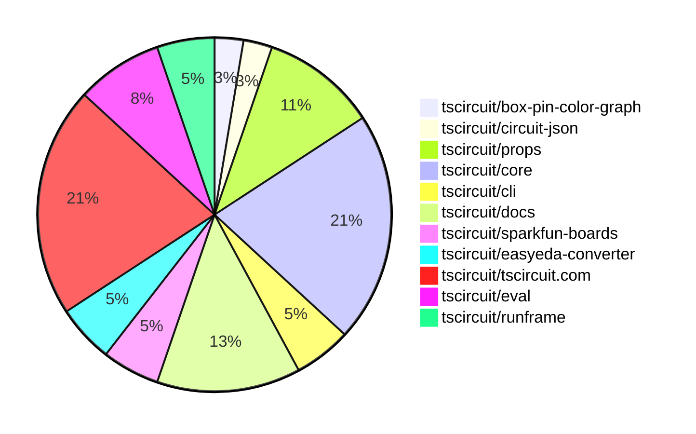

# Contribution Overview 2025-06-18

## PRs by Repository

## Contributor Overview

| Contributor | 🐳 Major | 🐙 Minor | 🐌 Tiny | ⭐ | Issues Created | Discussion Contributions |
|-------------|---------|---------|---------|-----|----------------|--------------------------|
| [seveibar](#seveibar) | 1 | 6 | 4 | ⭐⭐ | 0 | 0🔹 0🔶 0💎 |
| [imrishabh18](#imrishabh18) | 0 | 9 | 4 | ⭐⭐ | 0 | 0🔹 0🔶 0💎 |
| [techmannih](#techmannih) | 1 | 2 | 1 | ⭐⭐ | 2 | 0🔹 0🔶 0💎 |
| [Anshgrover23](#Anshgrover23) | 0 | 3 | 1 | ⭐ | 4 | 0🔹 0🔶 0💎 |
| [ArnavK-09](#ArnavK-09) | 0 | 3 | 0 | ⭐ | 1 | 0🔹 0🔶 0💎 |
| [ShiboSoftwareDev](#ShiboSoftwareDev) | 0 | 2 | 0 | ⭐ | 0 | 0🔹 0🔶 0💎 |
| [tscircuitbot](#tscircuitbot) | 0 | 0 | 1 |  | 0 | 0🔹 0🔶 0💎 |

### Discussion Contribution Legend

- 🔹 Normal Comments: Basic participation with minimal effort
- 🔶 Great Informative Comments: Thoughtful participation that adds value
- 💎 Incredible Comments: Exceptional participation with high-quality content

## Review Table

[reviews-received-hover]: ## "Number of reviews received for PRs for this contributor"
[approvals-received-hover]: ## "Number of approvals received for PRs this contributor authored"
[rejections-received-hover]: ## "Number of rejections received for PRs this contributor authored"
[prs-opened-hover]: ## "Number of PRs opened by this contributor"
[issues-created-hover]: ## "Number of issues created by this contributor"
[bountied-issues-hover]: ## "Number of issues this contributor created with a bounty"
[bountied-issue-$-hover]: ## "Total bounty amount placed on issues authored by this contributor"

| Contributor | Reviews Received | Approvals Received | Rejections Received | Approvals | Rejections | PRs Opened | PRs Merged | Issues Created | Bountied Issues | Bountied Issue $ |
|---|---|---|---|---|---|---|---|---|---|---|
| [seveibar](#seveibar) | 2 | 0 | 0 | 17 | 0 | 17 | 11 | 0 | 0 | 0 |
| [graphite-app[bot]](#graphite-app[bot]) | 0 | 0 | 0 | 0 | 0 | 0 | 0 | 0 | 0 | 0 |
| [Anshgrover23](#Anshgrover23) | 10 | 7 | 0 | 1 | 0 | 4 | 4 | 4 | 0 | 0 |
| [imrishabh18](#imrishabh18) | 6 | 4 | 0 | 2 | 0 | 15 | 14 | 0 | 0 | 0 |
| [techmannih](#techmannih) | 7 | 5 | 0 | 1 | 1 | 4 | 4 | 2 | 0 | 0 |
| [ShiboSoftwareDev](#ShiboSoftwareDev) | 2 | 2 | 0 | 2 | 0 | 3 | 2 | 0 | 0 | 0 |
| [andrii-balitskyi](#andrii-balitskyi) | 6 | 3 | 0 | 0 | 0 | 3 | 0 | 0 | 0 | 0 |
| [ArnavK-09](#ArnavK-09) | 4 | 3 | 0 | 1 | 0 | 3 | 3 | 1 | 0 | 0 |
| [tscircuitbot](#tscircuitbot) | 0 | 0 | 0 | 0 | 0 | 14 | 1 | 0 | 0 | 0 |
| [Abse2001](#Abse2001) | 0 | 0 | 0 | 0 | 0 | 1 | 0 | 0 | 0 | 0 |
| [MustafaMulla29](#MustafaMulla29) | 1 | 0 | 1 | 0 | 0 | 1 | 0 | 0 | 0 | 0 |

## Changes by Repository

### [tscircuit/box-pin-color-graph](https://github.com/tscircuit/box-pin-color-graph)

| PR # | Impact | Contributor | Description | Milestone Aligned |
|------|--------|-------------|-------------|-------------------|
| [#2](https://github.com/tscircuit/box-pin-color-graph/pull/2) | 🐳 Major | seveibar | Enhancements to the graph transformation logic with A* algorithm integration for improved operation cost calculations. | ❌ |

### [tscircuit/circuit-json](https://github.com/tscircuit/circuit-json)

| PR # | Impact | Contributor | Description | Milestone Aligned |
|------|--------|-------------|-------------|-------------------|
| [#232](https://github.com/tscircuit/circuit-json/pull/232) | 🐙 Minor | seveibar | The removal of the default value for `is_movable` enhances the flexibility of schematic net labels by allowing explicit control over their repositioning behavior. | ❌ |

### [tscircuit/props](https://github.com/tscircuit/props)

| PR # | Impact | Contributor | Description | Milestone Aligned |
|------|--------|-------------|-------------|-------------------|
| [#291](https://github.com/tscircuit/props/pull/291) | 🐙 Minor | seveibar | Enhancing the `connectsTo` property to accept strings or arrays improves flexibility in component connections. | ❌ |
| [#293](https://github.com/tscircuit/props/pull/293) | 🐙 Minor | Anshgrover23 | Enhancing flexibility in component properties by making schX and schY optional improves usability and testing coverage. | ❌ |
| [#292](https://github.com/tscircuit/props/pull/292) | 🐙 Minor | Anshgrover23 | Enhancements to the PinHeaderProps interface improve the flexibility and usability of the pin header component in schematic views. | ❌ |
| [#294](https://github.com/tscircuit/props/pull/294) | 🐌 Tiny | seveibar | Clarification of documentation for better understanding of the `internallyConnectedPins` property. | ❌ |

### [tscircuit/core](https://github.com/tscircuit/core)

| PR # | Impact | Contributor | Description | Milestone Aligned |
|------|--------|-------------|-------------|-------------------|
| [#951](https://github.com/tscircuit/core/pull/951) | 🐙 Minor | seveibar | Enhancements to netlabel functionality improve circuit design capabilities by allowing dynamic net creation and trace generation based on connections. | ❌ |
| [#950](https://github.com/tscircuit/core/pull/950) | 🐙 Minor | seveibar | Enhancements to trace connections improve schematic accuracy and usability. | ❌ |
| [#948](https://github.com/tscircuit/core/pull/948) | 🐙 Minor | seveibar | The removal of the deprecated NetAlias component and its replacement with the new NetLabel component enhances code clarity and maintainability. | ❌ |
| [#954](https://github.com/tscircuit/core/pull/954) | 🐙 Minor | Anshgrover23 | Enhances the SchematicText component by ensuring default values for position properties, improving robustness. | ❌ |
| [#947](https://github.com/tscircuit/core/pull/947) | 🐙 Minor | imrishabh18 | Enhancement of PCB layout capabilities by introducing padding support for subcircuits in the Group component. | ❌ |
| [#938](https://github.com/tscircuit/core/pull/938) | 🐙 Minor | imrishabh18 | Enhancements to net label lookup improve circuit functionality and testing reliability. | ❌ |
| [#946](https://github.com/tscircuit/core/pull/946) | 🐌 Tiny | seveibar | Enhancements to testing capabilities for netalias connections improve overall code reliability and maintainability. | ❌ |
| [#953](https://github.com/tscircuit/core/pull/953) | 🐌 Tiny | Anshgrover23 | Updating the dependency version for props enhances compatibility and ensures the latest features and fixes are utilized. | ❌ |

### [tscircuit/cli](https://github.com/tscircuit/cli)

| PR # | Impact | Contributor | Description | Milestone Aligned |
|------|--------|-------------|-------------|-------------------|
| [#234](https://github.com/tscircuit/cli/pull/234) | 🐙 Minor | seveibar | Enhancements to logging provide better visibility into snapshot creation processes. | ❌ |
| [#233](https://github.com/tscircuit/cli/pull/233) | 🐙 Minor | imrishabh18 | Renaming the configuration entry field enhances clarity and consistency in the codebase. | ❌ |

### [tscircuit/docs](https://github.com/tscircuit/docs)

| PR # | Impact | Contributor | Description | Milestone Aligned |
|------|--------|-------------|-------------|-------------------|
| [#74](https://github.com/tscircuit/docs/pull/74) | 🐙 Minor | imrishabh18 | The addition of a comprehensive ordering section enhances user experience by streamlining the prototype ordering process. | ❌ |
| [#77](https://github.com/tscircuit/docs/pull/77) | 🐌 Tiny | seveibar | Enhancing TypeScript configuration documentation and updating a dependency improves developer experience and project maintenance. | ❌ |
| [#75](https://github.com/tscircuit/docs/pull/75) | 🐌 Tiny | seveibar | Enhancing documentation for build and snapshot commands significantly improves user understanding and usability of the tool. | ❌ |
| [#79](https://github.com/tscircuit/docs/pull/79) | 🐌 Tiny | imrishabh18 | Enhances documentation for the `<schematictext />` component and ensures compliance in the `YouTubeEmbed` component. | ❌ |
| [#78](https://github.com/tscircuit/docs/pull/78) | 🐌 Tiny | imrishabh18 | Enhancements to documentation clarity improve user understanding and usability of the `<net />` element. | ❌ |

### [tscircuit/sparkfun-boards](https://github.com/tscircuit/sparkfun-boards)

| PR # | Impact | Contributor | Description | Milestone Aligned |
|------|--------|-------------|-------------|-------------------|
| [#5](https://github.com/tscircuit/sparkfun-boards/pull/5) | 🐳 Major | techmannih | The addition of the SparkFun USB to Serial Breakout FT232RL enhances the repository by providing a new component for USB to serial communication, which is valuable for various electronic projects. | ❌ |
| [#8](https://github.com/tscircuit/sparkfun-boards/pull/8) | 🐙 Minor | ShiboSoftwareDev | The addition of a new component enhances the library's functionality by integrating a specific DAC breakout board. | ❌ |

### [tscircuit/easyeda-converter](https://github.com/tscircuit/easyeda-converter)

| PR # | Impact | Contributor | Description | Milestone Aligned |
|------|--------|-------------|-------------|-------------------|
| [#254](https://github.com/tscircuit/easyeda-converter/pull/254) | 🐙 Minor | techmannih | Enhancements to the import functionality for a specific component, improving compatibility and reliability. | ❌ |
| [#255](https://github.com/tscircuit/easyeda-converter/pull/255) | 🐙 Minor | techmannih | Addresses a specific import failure issue related to a JLCPCB part, enhancing the functionality of the converter. | ❌ |

### [tscircuit/tscircuit.com](https://github.com/tscircuit/tscircuit.com)

| PR # | Impact | Contributor | Description | Milestone Aligned |
|------|--------|-------------|-------------|-------------------|
| [#1317](https://github.com/tscircuit/tscircuit.com/pull/1317) | 🐙 Minor | imrishabh18 | Enhancing the dropdown width improves user experience by accommodating longer file names and providing better accessibility. | ❌ |
| [#1307](https://github.com/tscircuit/tscircuit.com/pull/1307) | 🐙 Minor | ArnavK-09 | Enhances the SEO capabilities by allowing dynamic selection of the Open Graph image based on the package's default view. | ❌ |
| [#1310](https://github.com/tscircuit/tscircuit.com/pull/1310) | 🐙 Minor | ArnavK-09 | Enhancements to caching and refetching behavior improve the editor's responsiveness after saving changes. | ❌ |
| [#1313](https://github.com/tscircuit/tscircuit.com/pull/1313) | 🐙 Minor | ArnavK-09 | Introduces a new feature for downloading PNG images of circuit designs, enhancing user functionality. | ❌ |
| [#1312](https://github.com/tscircuit/tscircuit.com/pull/1312) | 🐙 Minor | ShiboSoftwareDev | Enhancement of the user interface for better interaction with tree actions. | ❌ |
| [#1322](https://github.com/tscircuit/tscircuit.com/pull/1322) | 🐌 Tiny | techmannih | Updating the easyeda dependency enhances the project's compatibility with the latest features and fixes. | ❌ |
| [#1318](https://github.com/tscircuit/tscircuit.com/pull/1318) | 🐌 Tiny | imrishabh18 | Updating the runframe package to fix a z-index dialog issue enhances the UI functionality. | ❌ |
| [#1314](https://github.com/tscircuit/tscircuit.com/pull/1314) | 🐌 Tiny | imrishabh18 | The update enhances the project's dependency management by adding necessary packages and updating existing ones, ensuring compatibility and functionality. | ❌ |

### [tscircuit/eval](https://github.com/tscircuit/eval)

| PR # | Impact | Contributor | Description | Milestone Aligned |
|------|--------|-------------|-------------|-------------------|
| [#537](https://github.com/tscircuit/eval/pull/537) | 🐙 Minor | imrishabh18 | Enhancing configuration handling by setting the entry point based on the parsed configuration file improves the flexibility and usability of the code. | ❌ |
| [#528](https://github.com/tscircuit/eval/pull/528) | 🐙 Minor | imrishabh18 | Enhances the configuration parsing by allowing the main component path to be specified in the tscircuit.config.js file. | ❌ |
| [#536](https://github.com/tscircuit/eval/pull/536) | 🐌 Tiny | tscircuitbot | Updating dependencies is essential for maintaining project health and ensuring compatibility with other packages. | ❌ |

### [tscircuit/runframe](https://github.com/tscircuit/runframe)

| PR # | Impact | Contributor | Description | Milestone Aligned |
|------|--------|-------------|-------------|-------------------|
| [#781](https://github.com/tscircuit/runframe/pull/781) | 🐙 Minor | imrishabh18 | Elevating the OrderDialog's z-index enhances its visibility and usability in the UI. | ❌ |
| [#780](https://github.com/tscircuit/runframe/pull/780) | 🐙 Minor | imrishabh18 | Enhancing error tracking in the order dialog improves overall application reliability and user experience. | ❌ |

## Changes by Contributor

### [seveibar](https://github.com/seveibar)

| PR # | Impact | Description | Milestone Aligned |
|------|--------|-------------|-------------------|
| [#2](https://github.com/tscircuit/box-pin-color-graph/pull/2) | 🐳 Major | Enhancements to the graph transformation logic with A* algorithm integration for improved operation cost calculations. | ❌ |
| [#232](https://github.com/tscircuit/circuit-json/pull/232) | 🐙 Minor | The removal of the default value for `is_movable` enhances the flexibility of schematic net labels by allowing explicit control over their repositioning behavior. | ❌ |
| [#291](https://github.com/tscircuit/props/pull/291) | 🐙 Minor | Enhancing the `connectsTo` property to accept strings or arrays improves flexibility in component connections. | ❌ |
| [#951](https://github.com/tscircuit/core/pull/951) | 🐙 Minor | Enhancements to netlabel functionality improve circuit design capabilities by allowing dynamic net creation and trace generation based on connections. | ❌ |
| [#950](https://github.com/tscircuit/core/pull/950) | 🐙 Minor | Enhancements to trace connections improve schematic accuracy and usability. | ❌ |
| [#948](https://github.com/tscircuit/core/pull/948) | 🐙 Minor | The removal of the deprecated NetAlias component and its replacement with the new NetLabel component enhances code clarity and maintainability. | ❌ |
| [#234](https://github.com/tscircuit/cli/pull/234) | 🐙 Minor | Enhancements to logging provide better visibility into snapshot creation processes. | ❌ |
| [#294](https://github.com/tscircuit/props/pull/294) | 🐌 Tiny | Clarification of documentation for better understanding of the `internallyConnectedPins` property. | ❌ |
| [#946](https://github.com/tscircuit/core/pull/946) | 🐌 Tiny | Enhancements to testing capabilities for netalias connections improve overall code reliability and maintainability. | ❌ |
| [#77](https://github.com/tscircuit/docs/pull/77) | 🐌 Tiny | Enhancing TypeScript configuration documentation and updating a dependency improves developer experience and project maintenance. | ❌ |
| [#75](https://github.com/tscircuit/docs/pull/75) | 🐌 Tiny | Enhancing documentation for build and snapshot commands significantly improves user understanding and usability of the tool. | ❌ |

### [Anshgrover23](https://github.com/Anshgrover23)

| PR # | Impact | Description | Milestone Aligned |
|------|--------|-------------|-------------------|
| [#293](https://github.com/tscircuit/props/pull/293) | 🐙 Minor | Enhancing flexibility in component properties by making schX and schY optional improves usability and testing coverage. | ❌ |
| [#292](https://github.com/tscircuit/props/pull/292) | 🐙 Minor | Enhancements to the PinHeaderProps interface improve the flexibility and usability of the pin header component in schematic views. | ❌ |
| [#954](https://github.com/tscircuit/core/pull/954) | 🐙 Minor | Enhances the SchematicText component by ensuring default values for position properties, improving robustness. | ❌ |
| [#953](https://github.com/tscircuit/core/pull/953) | 🐌 Tiny | Updating the dependency version for props enhances compatibility and ensures the latest features and fixes are utilized. | ❌ |

### [techmannih](https://github.com/techmannih)

| PR # | Impact | Description | Milestone Aligned |
|------|--------|-------------|-------------------|
| [#5](https://github.com/tscircuit/sparkfun-boards/pull/5) | 🐳 Major | The addition of the SparkFun USB to Serial Breakout FT232RL enhances the repository by providing a new component for USB to serial communication, which is valuable for various electronic projects. | ❌ |
| [#254](https://github.com/tscircuit/easyeda-converter/pull/254) | 🐙 Minor | Enhancements to the import functionality for a specific component, improving compatibility and reliability. | ❌ |
| [#255](https://github.com/tscircuit/easyeda-converter/pull/255) | 🐙 Minor | Addresses a specific import failure issue related to a JLCPCB part, enhancing the functionality of the converter. | ❌ |
| [#1322](https://github.com/tscircuit/tscircuit.com/pull/1322) | 🐌 Tiny | Updating the easyeda dependency enhances the project's compatibility with the latest features and fixes. | ❌ |

### [imrishabh18](https://github.com/imrishabh18)

| PR # | Impact | Description | Milestone Aligned |
|------|--------|-------------|-------------------|
| [#947](https://github.com/tscircuit/core/pull/947) | 🐙 Minor | Enhancement of PCB layout capabilities by introducing padding support for subcircuits in the Group component. | ❌ |
| [#938](https://github.com/tscircuit/core/pull/938) | 🐙 Minor | Enhancements to net label lookup improve circuit functionality and testing reliability. | ❌ |
| [#1317](https://github.com/tscircuit/tscircuit.com/pull/1317) | 🐙 Minor | Enhancing the dropdown width improves user experience by accommodating longer file names and providing better accessibility. | ❌ |
| [#537](https://github.com/tscircuit/eval/pull/537) | 🐙 Minor | Enhancing configuration handling by setting the entry point based on the parsed configuration file improves the flexibility and usability of the code. | ❌ |
| [#528](https://github.com/tscircuit/eval/pull/528) | 🐙 Minor | Enhances the configuration parsing by allowing the main component path to be specified in the tscircuit.config.js file. | ❌ |
| [#781](https://github.com/tscircuit/runframe/pull/781) | 🐙 Minor | Elevating the OrderDialog's z-index enhances its visibility and usability in the UI. | ❌ |
| [#780](https://github.com/tscircuit/runframe/pull/780) | 🐙 Minor | Enhancing error tracking in the order dialog improves overall application reliability and user experience. | ❌ |
| [#233](https://github.com/tscircuit/cli/pull/233) | 🐙 Minor | Renaming the configuration entry field enhances clarity and consistency in the codebase. | ❌ |
| [#74](https://github.com/tscircuit/docs/pull/74) | 🐙 Minor | The addition of a comprehensive ordering section enhances user experience by streamlining the prototype ordering process. | ❌ |
| [#1318](https://github.com/tscircuit/tscircuit.com/pull/1318) | 🐌 Tiny | Updating the runframe package to fix a z-index dialog issue enhances the UI functionality. | ❌ |
| [#1314](https://github.com/tscircuit/tscircuit.com/pull/1314) | 🐌 Tiny | The update enhances the project's dependency management by adding necessary packages and updating existing ones, ensuring compatibility and functionality. | ❌ |
| [#79](https://github.com/tscircuit/docs/pull/79) | 🐌 Tiny | Enhances documentation for the `<schematictext />` component and ensures compliance in the `YouTubeEmbed` component. | ❌ |
| [#78](https://github.com/tscircuit/docs/pull/78) | 🐌 Tiny | Enhancements to documentation clarity improve user understanding and usability of the `<net />` element. | ❌ |

### [ArnavK-09](https://github.com/ArnavK-09)

| PR # | Impact | Description | Milestone Aligned |
|------|--------|-------------|-------------------|
| [#1307](https://github.com/tscircuit/tscircuit.com/pull/1307) | 🐙 Minor | Enhances the SEO capabilities by allowing dynamic selection of the Open Graph image based on the package's default view. | ❌ |
| [#1310](https://github.com/tscircuit/tscircuit.com/pull/1310) | 🐙 Minor | Enhancements to caching and refetching behavior improve the editor's responsiveness after saving changes. | ❌ |
| [#1313](https://github.com/tscircuit/tscircuit.com/pull/1313) | 🐙 Minor | Introduces a new feature for downloading PNG images of circuit designs, enhancing user functionality. | ❌ |

### [ShiboSoftwareDev](https://github.com/ShiboSoftwareDev)

| PR # | Impact | Description | Milestone Aligned |
|------|--------|-------------|-------------------|
| [#1312](https://github.com/tscircuit/tscircuit.com/pull/1312) | 🐙 Minor | Enhancement of the user interface for better interaction with tree actions. | ❌ |
| [#8](https://github.com/tscircuit/sparkfun-boards/pull/8) | 🐙 Minor | The addition of a new component enhances the library's functionality by integrating a specific DAC breakout board. | ❌ |

### [tscircuitbot](https://github.com/tscircuitbot)

| PR # | Impact | Description | Milestone Aligned |
|------|--------|-------------|-------------------|
| [#536](https://github.com/tscircuit/eval/pull/536) | 🐌 Tiny | Updating dependencies is essential for maintaining project health and ensuring compatibility with other packages. | ❌ |

## Repository Owners

| Repository | Codeowners |
|------------|------------|
| [cli](https://github.com/tscircuit/cli/blob/main/.github/CODEOWNERS) | [seveibar](https://github.com/seveibar), [imrishabh18](https://github.com/imrishabh18) |
| [tscircuit.com](https://github.com/tscircuit/tscircuit.com/blob/main/.github/CODEOWNERS) | [imrishabh18](https://github.com/imrishabh18) |

## Repos by Owner

| User | Repo |
|------|------|
| [seveibar](https://github.com/seveibar) | [cli](https://github.com/tscircuit/cli/blob/main/.github/CODEOWNERS) |
| [imrishabh18](https://github.com/imrishabh18) | [tscircuit.com](https://github.com/tscircuit/tscircuit.com/blob/main/.github/CODEOWNERS) |
|  | [cli](https://github.com/tscircuit/cli/blob/main/.github/CODEOWNERS) |

