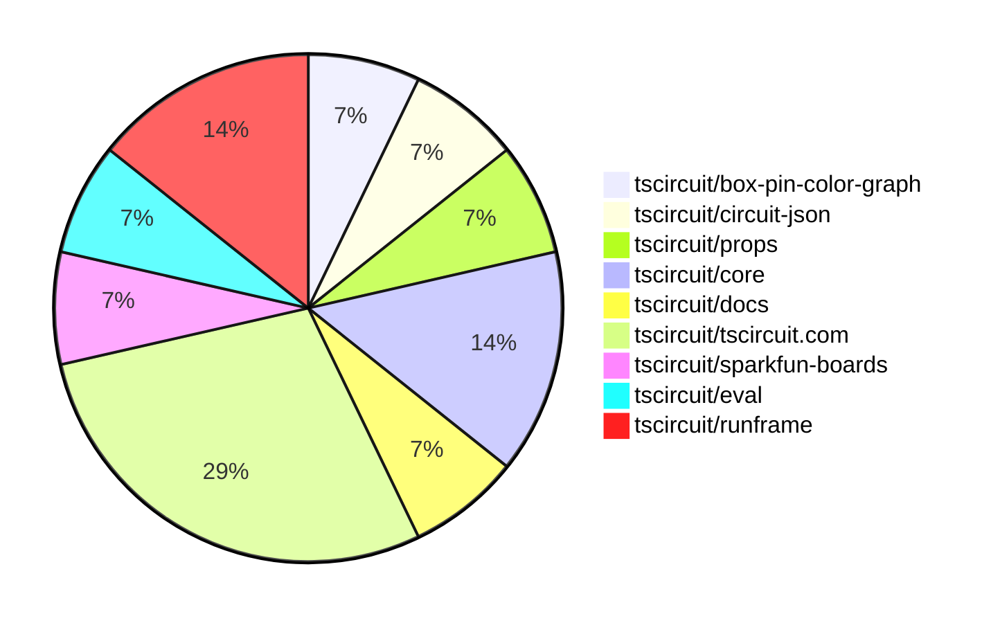

# Contribution Overview 2025-06-18

## PRs by Repository

## Contributor Overview

| Contributor | 🐳 Major | 🐙 Minor | 🐌 Tiny | ⭐ | Issues Created | Discussion Contributions |
|-------------|---------|---------|---------|-----|----------------|--------------------------|
| [seveibar](#seveibar) | 1 | 3 | 2 | ⭐⭐ | 0 | 0🔹 0🔶 0💎 |
| [imrishabh18](#imrishabh18) | 0 | 4 | 2 | ⭐ | 0 | 0🔹 0🔶 0💎 |
| [ShiboSoftwareDev](#ShiboSoftwareDev) | 0 | 2 | 0 | ⭐ | 0 | 0🔹 0🔶 0💎 |

### Discussion Contribution Legend

- 🔹 Normal Comments: Basic participation with minimal effort
- 🔶 Great Informative Comments: Thoughtful participation that adds value
- 💎 Incredible Comments: Exceptional participation with high-quality content

## Review Table

[reviews-received-hover]: ## "Number of reviews received for PRs for this contributor"
[approvals-received-hover]: ## "Number of approvals received for PRs this contributor authored"
[rejections-received-hover]: ## "Number of rejections received for PRs this contributor authored"
[prs-opened-hover]: ## "Number of PRs opened by this contributor"
[issues-created-hover]: ## "Number of issues created by this contributor"
[bountied-issues-hover]: ## "Number of issues this contributor created with a bounty"
[bountied-issue-$-hover]: ## "Total bounty amount placed on issues authored by this contributor"

| Contributor | Reviews Received | Approvals Received | Rejections Received | Approvals | Rejections | PRs Opened | PRs Merged | Issues Created | Bountied Issues | Bountied Issue $ |
|---|---|---|---|---|---|---|---|---|---|---|
| [seveibar](#seveibar) | 2 | 0 | 0 | 2 | 2 | 7 | 6 | 0 | 0 | 0 |
| [graphite-app[bot]](#graphite-app[bot]) | 0 | 0 | 0 | 0 | 0 | 0 | 0 | 0 | 0 | 0 |
| [techmannih](#techmannih) | 4 | 1 | 2 | 0 | 0 | 2 | 0 | 0 | 0 | 0 |
| [imrishabh18](#imrishabh18) | 0 | 0 | 0 | 0 | 0 | 9 | 6 | 0 | 0 | 0 |
| [ShiboSoftwareDev](#ShiboSoftwareDev) | 2 | 2 | 0 | 0 | 0 | 3 | 2 | 0 | 0 | 0 |
| [ArnavK-09](#ArnavK-09) | 0 | 0 | 0 | 1 | 0 | 0 | 0 | 0 | 0 | 0 |
| [andrii-balitskyi](#andrii-balitskyi) | 1 | 0 | 0 | 0 | 0 | 2 | 0 | 0 | 0 | 0 |
| [tscircuitbot](#tscircuitbot) | 0 | 0 | 0 | 0 | 0 | 4 | 0 | 0 | 0 | 0 |

## Changes by Repository

### [tscircuit/box-pin-color-graph](https://github.com/tscircuit/box-pin-color-graph)

| PR # | Impact | Contributor | Description | Milestone Aligned |
|------|--------|-------------|-------------|-------------------|
| [#2](https://github.com/tscircuit/box-pin-color-graph/pull/2) | 🐳 Major | seveibar | Enhancements to the graph transformation logic with A* algorithm integration for improved operation cost calculations. | ❌ |

### [tscircuit/circuit-json](https://github.com/tscircuit/circuit-json)

| PR # | Impact | Contributor | Description | Milestone Aligned |
|------|--------|-------------|-------------|-------------------|
| [#232](https://github.com/tscircuit/circuit-json/pull/232) | 🐙 Minor | seveibar | The removal of the default value for `is_movable` enhances the flexibility of schematic net labels by allowing explicit control over their repositioning behavior. | ❌ |

### [tscircuit/props](https://github.com/tscircuit/props)

| PR # | Impact | Contributor | Description | Milestone Aligned |
|------|--------|-------------|-------------|-------------------|
| [#291](https://github.com/tscircuit/props/pull/291) | 🐙 Minor | seveibar | Enhancing the `connectsTo` property to accept both string and array types improves flexibility in component connections. | ❌ |

### [tscircuit/core](https://github.com/tscircuit/core)

| PR # | Impact | Contributor | Description | Milestone Aligned |
|------|--------|-------------|-------------|-------------------|
| [#948](https://github.com/tscircuit/core/pull/948) | 🐙 Minor | seveibar | Refactoring of components to replace deprecated functionality with updated implementations enhances code maintainability and clarity. | ❌ |
| [#946](https://github.com/tscircuit/core/pull/946) | 🐌 Tiny | seveibar | Enhancements to testing capabilities for netalias connections improve code reliability and maintainability. | ❌ |

### [tscircuit/docs](https://github.com/tscircuit/docs)

| PR # | Impact | Contributor | Description | Milestone Aligned |
|------|--------|-------------|-------------|-------------------|
| [#75](https://github.com/tscircuit/docs/pull/75) | 🐌 Tiny | seveibar | Enhancing documentation for build and snapshot commands significantly improves user understanding and usability of the tools. | ❌ |

### [tscircuit/tscircuit.com](https://github.com/tscircuit/tscircuit.com)

| PR # | Impact | Contributor | Description | Milestone Aligned |
|------|--------|-------------|-------------|-------------------|
| [#1312](https://github.com/tscircuit/tscircuit.com/pull/1312) | 🐙 Minor | ShiboSoftwareDev | Enhancement of the user interface for better interaction with tree actions. | ❌ |
| [#1317](https://github.com/tscircuit/tscircuit.com/pull/1317) | 🐙 Minor | imrishabh18 | Enhancing the dropdown width improves user experience by accommodating longer file names and providing better accessibility. | ❌ |
| [#1318](https://github.com/tscircuit/tscircuit.com/pull/1318) | 🐌 Tiny | imrishabh18 | Updating the runframe package to fix a z-index dialog issue enhances the UI functionality. | ❌ |
| [#1314](https://github.com/tscircuit/tscircuit.com/pull/1314) | 🐌 Tiny | imrishabh18 | The PR updates the package.json file to include new dependencies and adjust existing ones, ensuring compatibility and functionality of the project. | ❌ |

### [tscircuit/sparkfun-boards](https://github.com/tscircuit/sparkfun-boards)

| PR # | Impact | Contributor | Description | Milestone Aligned |
|------|--------|-------------|-------------|-------------------|
| [#8](https://github.com/tscircuit/sparkfun-boards/pull/8) | 🐙 Minor | ShiboSoftwareDev | Introduces a new component for the MCP4725 I2C DAC, enhancing the library's functionality. | ❌ |

### [tscircuit/eval](https://github.com/tscircuit/eval)

| PR # | Impact | Contributor | Description | Milestone Aligned |
|------|--------|-------------|-------------|-------------------|
| [#528](https://github.com/tscircuit/eval/pull/528) | 🐙 Minor | imrishabh18 | Enhances the configuration parsing by allowing the main component path to be specified in the tscircuit.config.js file. | ❌ |

### [tscircuit/runframe](https://github.com/tscircuit/runframe)

| PR # | Impact | Contributor | Description | Milestone Aligned |
|------|--------|-------------|-------------|-------------------|
| [#781](https://github.com/tscircuit/runframe/pull/781) | 🐙 Minor | imrishabh18 | Elevating the OrderDialog's z-index enhances its visibility and usability in the UI. | ❌ |
| [#780](https://github.com/tscircuit/runframe/pull/780) | 🐙 Minor | imrishabh18 | Enhancing error tracking in the order dialog improves overall application reliability and user experience. | ❌ |

## Changes by Contributor

### [seveibar](https://github.com/seveibar)

| PR # | Impact | Description | Milestone Aligned |
|------|--------|-------------|-------------------|
| [#2](https://github.com/tscircuit/box-pin-color-graph/pull/2) | 🐳 Major | Enhancements to the graph transformation logic with A* algorithm integration for improved operation cost calculations. | ❌ |
| [#232](https://github.com/tscircuit/circuit-json/pull/232) | 🐙 Minor | The removal of the default value for `is_movable` enhances the flexibility of schematic net labels by allowing explicit control over their repositioning behavior. | ❌ |
| [#291](https://github.com/tscircuit/props/pull/291) | 🐙 Minor | Enhancing the `connectsTo` property to accept both string and array types improves flexibility in component connections. | ❌ |
| [#948](https://github.com/tscircuit/core/pull/948) | 🐙 Minor | Refactoring of components to replace deprecated functionality with updated implementations enhances code maintainability and clarity. | ❌ |
| [#946](https://github.com/tscircuit/core/pull/946) | 🐌 Tiny | Enhancements to testing capabilities for netalias connections improve code reliability and maintainability. | ❌ |
| [#75](https://github.com/tscircuit/docs/pull/75) | 🐌 Tiny | Enhancing documentation for build and snapshot commands significantly improves user understanding and usability of the tools. | ❌ |

### [ShiboSoftwareDev](https://github.com/ShiboSoftwareDev)

| PR # | Impact | Description | Milestone Aligned |
|------|--------|-------------|-------------------|
| [#1312](https://github.com/tscircuit/tscircuit.com/pull/1312) | 🐙 Minor | Enhancement of the user interface for better interaction with tree actions. | ❌ |
| [#8](https://github.com/tscircuit/sparkfun-boards/pull/8) | 🐙 Minor | Introduces a new component for the MCP4725 I2C DAC, enhancing the library's functionality. | ❌ |

### [imrishabh18](https://github.com/imrishabh18)

| PR # | Impact | Description | Milestone Aligned |
|------|--------|-------------|-------------------|
| [#1317](https://github.com/tscircuit/tscircuit.com/pull/1317) | 🐙 Minor | Enhancing the dropdown width improves user experience by accommodating longer file names and providing better accessibility. | ❌ |
| [#528](https://github.com/tscircuit/eval/pull/528) | 🐙 Minor | Enhances the configuration parsing by allowing the main component path to be specified in the tscircuit.config.js file. | ❌ |
| [#781](https://github.com/tscircuit/runframe/pull/781) | 🐙 Minor | Elevating the OrderDialog's z-index enhances its visibility and usability in the UI. | ❌ |
| [#780](https://github.com/tscircuit/runframe/pull/780) | 🐙 Minor | Enhancing error tracking in the order dialog improves overall application reliability and user experience. | ❌ |
| [#1318](https://github.com/tscircuit/tscircuit.com/pull/1318) | 🐌 Tiny | Updating the runframe package to fix a z-index dialog issue enhances the UI functionality. | ❌ |
| [#1314](https://github.com/tscircuit/tscircuit.com/pull/1314) | 🐌 Tiny | The PR updates the package.json file to include new dependencies and adjust existing ones, ensuring compatibility and functionality of the project. | ❌ |

## Repository Owners

| Repository | Codeowners |
|------------|------------|
| [tscircuit.com](https://github.com/tscircuit/tscircuit.com/blob/main/.github/CODEOWNERS) | [imrishabh18](https://github.com/imrishabh18) |
| [cli](https://github.com/tscircuit/cli/blob/main/.github/CODEOWNERS) | [imrishabh18](https://github.com/imrishabh18) |

## Repos by Owner

| User | Repo |
|------|------|
| [imrishabh18](https://github.com/imrishabh18) | [tscircuit.com](https://github.com/tscircuit/tscircuit.com/blob/main/.github/CODEOWNERS) |
|  | [cli](https://github.com/tscircuit/cli/blob/main/.github/CODEOWNERS) |

