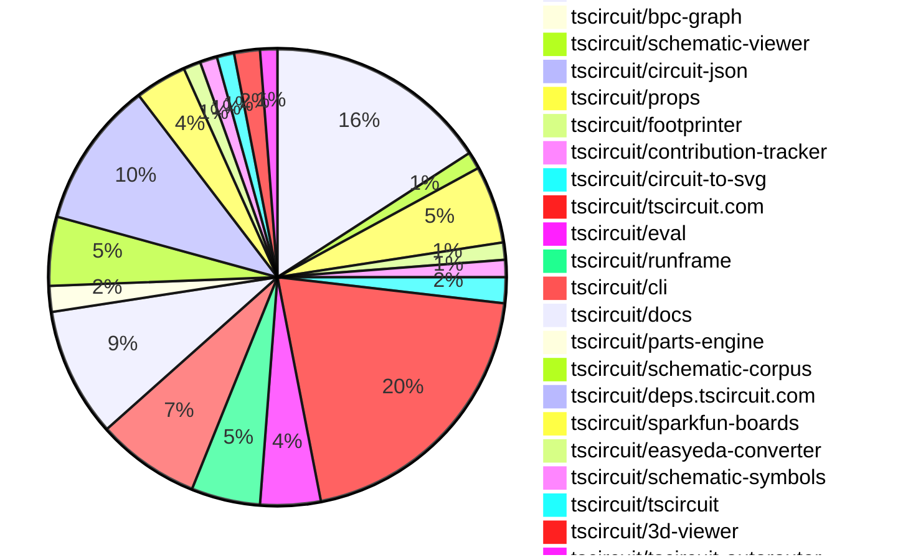

# Contribution Overview 2025-06-18

## PRs by Repository

## Contributor Overview

| Contributor | 🐳 Major | 🐙 Minor | 🐌 Tiny | ⭐ | Issues Created | Discussion Contributions |
|-------------|---------|---------|---------|-----|----------------|--------------------------|
| [seveibar](#seveibar) | 2 | 48 | 14 | 👑👑👑 | 1 | 0🔹 0🔶 0💎 |
| [imrishabh18](#imrishabh18) | 1 | 17 | 7 | 👑 | 1 | 0🔹 0🔶 0💎 |
| [ArnavK-09](#ArnavK-09) | 2 | 15 | 1 | ⭐⭐⭐ | 15 | 0🔹 0🔶 0💎 |
| [ShiboSoftwareDev](#ShiboSoftwareDev) | 0 | 11 | 3 | ⭐⭐⭐ | 9 | 0🔹 0🔶 0💎 |
| [techmannih](#techmannih) | 2 | 8 | 2 | ⭐⭐⭐ | 2 | 0🔹 0🔶 0💎 |
| [Abse2001](#Abse2001) | 1 | 8 | 5 | ⭐⭐ | 0 | 0🔹 0🔶 0💎 |
| [Anshgrover23](#Anshgrover23) | 0 | 6 | 2 | ⭐⭐ | 7 | 0🔹 0🔶 0💎 |
| [MustafaMulla29](#MustafaMulla29) | 1 | 0 | 3 | ⭐ | 1 | 0🔹 0🔶 0💎 |
| [andrii-balitskyi](#andrii-balitskyi) | 0 | 3 | 0 | ⭐ | 0 | 0🔹 0🔶 0💎 |
| [tscircuitbot](#tscircuitbot) | 0 | 0 | 4 | ⭐ | 0 | 0🔹 0🔶 0💎 |

### Discussion Contribution Legend

- 🔹 Normal Comments: Basic participation with minimal effort
- 🔶 Great Informative Comments: Thoughtful participation that adds value
- 💎 Incredible Comments: Exceptional participation with high-quality content

## Review Table

[reviews-received-hover]: ## "Number of reviews received for PRs for this contributor"
[approvals-received-hover]: ## "Number of approvals received for PRs this contributor authored"
[rejections-received-hover]: ## "Number of rejections received for PRs this contributor authored"
[prs-opened-hover]: ## "Number of PRs opened by this contributor"
[issues-created-hover]: ## "Number of issues created by this contributor"
[bountied-issues-hover]: ## "Number of issues this contributor created with a bounty"
[bountied-issue-$-hover]: ## "Total bounty amount placed on issues authored by this contributor"

| Contributor | Reviews Received | Approvals Received | Rejections Received | Approvals | Rejections | PRs Opened | PRs Merged | Issues Created | Bountied Issues | Bountied Issue $ |
|---|---|---|---|---|---|---|---|---|---|---|
| [seveibar](#seveibar) | 25 | 1 | 0 | 70 | 5 | 85 | 64 | 1 | 0 | 0 |
| [Abse2001](#Abse2001) | 15 | 13 | 0 | 0 | 0 | 16 | 14 | 0 | 0 | 0 |
| [imrishabh18](#imrishabh18) | 12 | 10 | 0 | 12 | 1 | 29 | 26 | 1 | 0 | 0 |
| [techmannih](#techmannih) | 30 | 13 | 4 | 2 | 1 | 16 | 12 | 2 | 0 | 0 |
| [ShiboSoftwareDev](#ShiboSoftwareDev) | 25 | 17 | 0 | 8 | 0 | 19 | 15 | 9 | 0 | 0 |
| [graphite-app[bot]](#graphite-app[bot]) | 0 | 0 | 0 | 0 | 0 | 0 | 0 | 0 | 0 | 0 |
| [Anshgrover23](#Anshgrover23) | 21 | 15 | 2 | 2 | 1 | 12 | 8 | 7 | 0 | 0 |
| [cursor[bot]](#cursor[bot]) | 0 | 0 | 0 | 0 | 0 | 0 | 0 | 0 | 0 | 0 |
| [MustafaMulla29](#MustafaMulla29) | 9 | 6 | 1 | 1 | 0 | 7 | 4 | 1 | 0 | 0 |
| [ArnavK-09](#ArnavK-09) | 27 | 20 | 1 | 3 | 0 | 18 | 18 | 15 | 0 | 0 |
| [andrii-balitskyi](#andrii-balitskyi) | 5 | 3 | 0 | 0 | 0 | 4 | 3 | 0 | 0 | 0 |
| [tscircuitbot](#tscircuitbot) | 0 | 0 | 0 | 0 | 0 | 49 | 4 | 0 | 0 | 0 |

## Changes by Repository

### [tscircuit/core](https://github.com/tscircuit/core)

| PR # | Impact | Contributor | Description | Milestone Aligned |
|------|--------|-------------|-------------|-------------------|
| [#960](https://github.com/tscircuit/core/pull/960) | 🐳 Major | seveibar | Enhancements to jumper and chip selectors improve functionality for keyboard building. | ✅ |
| [#956](https://github.com/tscircuit/core/pull/956) | 🐳 Major | Abse2001 | Enhancements to the selector functionality by adding support for J references, improving usability for keyboard building. | ✅ |
| [#967](https://github.com/tscircuit/core/pull/967) | 🐳 Major | techmannih | Enhancement of the selector functionality to support additional component types, improving flexibility in component selection. | ✅ |
| [#962](https://github.com/tscircuit/core/pull/962) | 🐳 Major | imrishabh18 | Enhancement of route JSON generation by incorporating subcircuit padding, improving layout accuracy. | ✅ |
| [#973](https://github.com/tscircuit/core/pull/973) | 🐙 Minor | seveibar | Enhancement of the RootCircuit class to respect the pcbDisabled option from the platform configuration, improving configurability. | ❌ |
| [#972](https://github.com/tscircuit/core/pull/972) | 🐙 Minor | seveibar | Enhancements to schematic width handling improve user customization and functionality. | ❌ |
| [#961](https://github.com/tscircuit/core/pull/961) | 🐙 Minor | seveibar | Enhancing error messages for unresolved port selectors significantly improves debugging and user experience. | ❌ |
| [#959](https://github.com/tscircuit/core/pull/959) | 🐙 Minor | seveibar | Enhancements to the `sel` function allow for dynamic reference designator usage, improving flexibility in design. | ❌ |
| [#957](https://github.com/tscircuit/core/pull/957) | 🐙 Minor | seveibar | Enhancing the netlabel functionality to support multiple connections significantly improves flexibility in circuit design. | ❌ |
| [#951](https://github.com/tscircuit/core/pull/951) | 🐙 Minor | seveibar | Enhancements to netlabel functionality improve circuit trace creation and net management. | ❌ |
| [#950](https://github.com/tscircuit/core/pull/950) | 🐙 Minor | seveibar | Enhancements to trace connections with netlabels improve schematic accuracy and usability. | ❌ |
| [#948](https://github.com/tscircuit/core/pull/948) | 🐙 Minor | seveibar | Refactoring of the component structure enhances code clarity and maintains functionality by replacing deprecated elements with updated counterparts. | ❌ |
| [#975](https://github.com/tscircuit/core/pull/975) | 🐙 Minor | techmannih | Enhancing the switch selector typing to include additional pins improves the flexibility and usability of the component. | ❌ |
| [#971](https://github.com/tscircuit/core/pull/971) | 🐙 Minor | techmannih | Enhances the Crystal component by displaying the load capacitance value alongside frequency, improving user information. | ❌ |
| [#963](https://github.com/tscircuit/core/pull/963) | 🐙 Minor | ShiboSoftwareDev | Enhancements to the SolderJumper component for better pin labeling and bridging functionality. | ❌ |
| [#980](https://github.com/tscircuit/core/pull/980) | 🐙 Minor | Anshgrover23 | Enhances the type definitions by adding 'INT' to both CommonNetNames and CommonPinNames, improving the flexibility of the code. | ❌ |
| [#954](https://github.com/tscircuit/core/pull/954) | 🐙 Minor | Anshgrover23 | Enhancements to component properties improve functionality and usability. | ❌ |
| [#969](https://github.com/tscircuit/core/pull/969) | 🐙 Minor | imrishabh18 | Enhancement of the polarized capacitor symbol improves schematic accuracy and usability. | ❌ |
| [#949](https://github.com/tscircuit/core/pull/949) | 🐙 Minor | imrishabh18 | Enhancements to component naming and rendering improve usability and error handling in the circuit design process. | ❌ |
| [#965](https://github.com/tscircuit/core/pull/965) | 🐙 Minor | imrishabh18 | The implementation ensures that the subcircuit_id is only set for subcircuit groups, preventing unnecessary data assignment for non-subcircuit groups. | ❌ |
| [#964](https://github.com/tscircuit/core/pull/964) | 🐙 Minor | imrishabh18 | Introduces a new render phase for handling subcircuits, enhancing the rendering lifecycle. | ❌ |
| [#947](https://github.com/tscircuit/core/pull/947) | 🐙 Minor | imrishabh18 | Enhancement of PCB layout capabilities by introducing padding support for subcircuits in the Group component. | ❌ |
| [#938](https://github.com/tscircuit/core/pull/938) | 🐙 Minor | imrishabh18 | Enhancements to net label lookup improve circuit functionality and testing reliability. | ❌ |
| [#955](https://github.com/tscircuit/core/pull/955) | 🐌 Tiny | seveibar | The addition of a configuration to disable the lockfile in the project enhances flexibility in dependency management. | ❌ |
| [#946](https://github.com/tscircuit/core/pull/946) | 🐌 Tiny | seveibar | Enhancing testing capabilities for netalias connections improves code reliability and maintainability. | ❌ |
| [#953](https://github.com/tscircuit/core/pull/953) | 🐌 Tiny | Anshgrover23 | Updating the dependency version for props enhances compatibility and ensures the latest features and fixes are utilized. | ❌ |

### [tscircuit/bpc-graph](https://github.com/tscircuit/bpc-graph)

| PR # | Impact | Contributor | Description | Milestone Aligned |
|------|--------|-------------|-------------|-------------------|
| [#2](https://github.com/tscircuit/bpc-graph/pull/2) | 🐳 Major | seveibar | Enhancements to the graph transformation logic with A* algorithm integration for improved operation cost calculations. | ❌ |

### [tscircuit/schematic-viewer](https://github.com/tscircuit/schematic-viewer)

| PR # | Impact | Contributor | Description | Milestone Aligned |
|------|--------|-------------|-------------|-------------------|
| [#97](https://github.com/tscircuit/schematic-viewer/pull/97) | 🐙 Minor | seveibar | Enhances user interaction by allowing components to snap to a grid during editing, improving precision in layout adjustments. | ❌ |
| [#98](https://github.com/tscircuit/schematic-viewer/pull/98) | 🐌 Tiny | Abse2001 | Updating the dependency version for circuit-to-svg enhances compatibility and potentially introduces new features or fixes. | ❌ |

### [tscircuit/circuit-json](https://github.com/tscircuit/circuit-json)

| PR # | Impact | Contributor | Description | Milestone Aligned |
|------|--------|-------------|-------------|-------------------|
| [#232](https://github.com/tscircuit/circuit-json/pull/232) | 🐙 Minor | seveibar | The removal of the default value for `is_movable` enhances the flexibility of schematic net labels by allowing explicit control over their repositioning behavior. | ❌ |

### [tscircuit/props](https://github.com/tscircuit/props)

| PR # | Impact | Contributor | Description | Milestone Aligned |
|------|--------|-------------|-------------|-------------------|
| [#301](https://github.com/tscircuit/props/pull/301) | 🐙 Minor | seveibar | Enhancement of the group component by introducing a new schematic title property, improving usability in schematic views. | ❌ |
| [#298](https://github.com/tscircuit/props/pull/298) | 🐙 Minor | seveibar | Enhancing the plated hole component with a new property for connections significantly improves its functionality and usability. | ❌ |
| [#297](https://github.com/tscircuit/props/pull/297) | 🐙 Minor | seveibar | Enhancements to naming and connectivity for vias and smtpad components improve usability and flexibility in PCB design. | ❌ |
| [#296](https://github.com/tscircuit/props/pull/296) | 🐙 Minor | seveibar | Enhances component flexibility by introducing a schematic orientation feature for two-pin components. | ❌ |
| [#295](https://github.com/tscircuit/props/pull/295) | 🐙 Minor | seveibar | Enhancing the jumper component with a new connections property significantly improves its functionality and flexibility. | ❌ |
| [#291](https://github.com/tscircuit/props/pull/291) | 🐙 Minor | seveibar | Enhancing the `connectsTo` property to accept both string and array types improves flexibility in component connections. | ❌ |
| [#293](https://github.com/tscircuit/props/pull/293) | 🐙 Minor | Anshgrover23 | Enhancing flexibility in component properties by making schX and schY optional improves usability and testing coverage. | ❌ |
| [#292](https://github.com/tscircuit/props/pull/292) | 🐙 Minor | Anshgrover23 | Enhancements to the PinHeader component by adding new properties for schematic dimensions and styles. | ❌ |
| [#294](https://github.com/tscircuit/props/pull/294) | 🐌 Tiny | seveibar | Clarification of documentation for better understanding of the `internallyConnectedPins` property. | ❌ |

### [tscircuit/footprinter](https://github.com/tscircuit/footprinter)

| PR # | Impact | Contributor | Description | Milestone Aligned |
|------|--------|-------------|-------------|-------------------|
| [#302](https://github.com/tscircuit/footprinter/pull/302) | 🐙 Minor | seveibar | Introducing circular pads enhances the flexibility and design options for BGA footprints, catering to diverse PCB design needs. | ❌ |
| [#295](https://github.com/tscircuit/footprinter/pull/295) | 🐙 Minor | techmannih | The pull request enhances the accuracy of pad dimension calculations in the passive function, ensuring better component footprint definitions. | ❌ |

### [tscircuit/contribution-tracker](https://github.com/tscircuit/contribution-tracker)

| PR # | Impact | Contributor | Description | Milestone Aligned |
|------|--------|-------------|-------------|-------------------|
| [#178](https://github.com/tscircuit/contribution-tracker/pull/178) | 🐙 Minor | seveibar | Enhancements to the changelog generation process and type error fixes improve overall code quality and maintainability. | ❌ |
| [#177](https://github.com/tscircuit/contribution-tracker/pull/177) | 🐙 Minor | seveibar | Automating the generation of monthly changelogs enhances documentation and improves project transparency. | ❌ |

### [tscircuit/circuit-to-svg](https://github.com/tscircuit/circuit-to-svg)

| PR # | Impact | Contributor | Description | Milestone Aligned |
|------|--------|-------------|-------------|-------------------|
| [#264](https://github.com/tscircuit/circuit-to-svg/pull/264) | 🐙 Minor | seveibar | Enhancements to trace rendering order ensure proper visibility of SMT pads and traces, improving the overall functionality of the SVG output. | ❌ |
| [#262](https://github.com/tscircuit/circuit-to-svg/pull/262) | 🐙 Minor | seveibar | Enhancement of SVG output by including software metadata, improving traceability and documentation. | ❌ |
| [#261](https://github.com/tscircuit/circuit-to-svg/pull/261) | 🐙 Minor | Abse2001 | Enhancement of SVG rendering by ensuring stroke width remains consistent regardless of scaling transformations. | ❌ |

### [tscircuit/tscircuit.com](https://github.com/tscircuit/tscircuit.com)

| PR # | Impact | Contributor | Description | Milestone Aligned |
|------|--------|-------------|-------------|-------------------|
| [#1353](https://github.com/tscircuit/tscircuit.com/pull/1353) | 🐳 Major | ArnavK-09 | Introduces a new utility hook for managing keyboard shortcuts, enhancing user interaction and accessibility. | ❌ |
| [#1337](https://github.com/tscircuit/tscircuit.com/pull/1337) | 🐳 Major | ArnavK-09 | Introducing a VSCode-style file switcher enhances user experience by streamlining file navigation within the editor. | ❌ |
| [#1362](https://github.com/tscircuit/tscircuit.com/pull/1362) | 🐙 Minor | seveibar | Enhancements to polling behavior for AI review requests improve responsiveness and user experience. | ❌ |
| [#1312](https://github.com/tscircuit/tscircuit.com/pull/1312) | 🐙 Minor | ShiboSoftwareDev | Enhancement of the tree actions button for improved user interaction. | ❌ |
| [#1328](https://github.com/tscircuit/tscircuit.com/pull/1328) | 🐙 Minor | imrishabh18 | Enhancements to the build status indicators improve clarity and user experience in the sidebar release section. | ❌ |
| [#1317](https://github.com/tscircuit/tscircuit.com/pull/1317) | 🐙 Minor | imrishabh18 | Enhancing the dropdown width improves user experience by accommodating longer file names and providing better accessibility. | ❌ |
| [#1335](https://github.com/tscircuit/tscircuit.com/pull/1335) | 🐙 Minor | ArnavK-09 | Enhances user experience by allowing dynamic font size adjustment in the code editor, mimicking popular IDE behavior. | ❌ |
| [#1357](https://github.com/tscircuit/tscircuit.com/pull/1357) | 🐙 Minor | ArnavK-09 | Enhances the ImportantFilesView component by implementing client-side caching for file content, improving performance and user experience. | ❌ |
| [#1358](https://github.com/tscircuit/tscircuit.com/pull/1358) | 🐙 Minor | ArnavK-09 | Enhancements to markdown content styling improve layout and responsiveness, contributing to a better user experience. | ❌ |
| [#1355](https://github.com/tscircuit/tscircuit.com/pull/1355) | 🐙 Minor | ArnavK-09 | Enhancements to the dialog component improve its responsiveness and visual consistency with the theme, addressing a specific issue. | ❌ |
| [#1354](https://github.com/tscircuit/tscircuit.com/pull/1354) | 🐙 Minor | ArnavK-09 | Filtering out hidden files enhances user experience by decluttering the file selection interface. | ❌ |
| [#1333](https://github.com/tscircuit/tscircuit.com/pull/1333) | 🐙 Minor | ArnavK-09 | Hiding the edit button for AI-generated content enhances user experience by preventing unnecessary actions. | ❌ |
| [#1336](https://github.com/tscircuit/tscircuit.com/pull/1336) | 🐙 Minor | ArnavK-09 | Enhancing user experience by enabling Tab key for autocompletion in the code editor. | ❌ |
| [#1334](https://github.com/tscircuit/tscircuit.com/pull/1334) | 🐙 Minor | ArnavK-09 | Enhancements to the AI review interface significantly improve user experience and interaction. | ❌ |
| [#1338](https://github.com/tscircuit/tscircuit.com/pull/1338) | 🐙 Minor | ArnavK-09 | Enhances user experience by introducing a keyboard shortcut for toggling the files sidebar, similar to popular code editors. | ❌ |
| [#1332](https://github.com/tscircuit/tscircuit.com/pull/1332) | 🐙 Minor | ArnavK-09 | Enhances user interaction by adding a button to re-request AI review, improving workflow efficiency. | ❌ |
| [#1330](https://github.com/tscircuit/tscircuit.com/pull/1330) | 🐙 Minor | ArnavK-09 | Enhancement of user experience on small screens by adding a dedicated releases section. | ❌ |
| [#1331](https://github.com/tscircuit/tscircuit.com/pull/1331) | 🐙 Minor | ArnavK-09 | Adjusts the z-index of the Download dropdown to ensure proper layering in the UI. | ❌ |
| [#1307](https://github.com/tscircuit/tscircuit.com/pull/1307) | 🐙 Minor | ArnavK-09 | Enhances the SEO capabilities by allowing dynamic selection of the Open Graph image based on the package's default view. | ❌ |
| [#1310](https://github.com/tscircuit/tscircuit.com/pull/1310) | 🐙 Minor | ArnavK-09 | Enhancements to caching and refetching behavior improve the editor's responsiveness after saving changes. | ❌ |
| [#1313](https://github.com/tscircuit/tscircuit.com/pull/1313) | 🐙 Minor | ArnavK-09 | Enhancement of the download functionality to include PNG image downloads based on user selection. | ❌ |
| [#1315](https://github.com/tscircuit/tscircuit.com/pull/1315) | 🐙 Minor | andrii-balitskyi | Enhancements to error handling for dynamic imports improve user experience by automatically reloading the page on failure. | ❌ |
| [#1316](https://github.com/tscircuit/tscircuit.com/pull/1316) | 🐙 Minor | andrii-balitskyi | Enhancement of server-side rendering capabilities for improved development experience. | ❌ |
| [#1320](https://github.com/tscircuit/tscircuit.com/pull/1320) | 🐙 Minor | andrii-balitskyi | Enhances the client application by implementing a build version checking mechanism that reloads the app when a new version is available. | ❌ |
| [#1346](https://github.com/tscircuit/tscircuit.com/pull/1346) | 🐌 Tiny | Abse2001 | Updating the dependency version for circuit-to-svg enhances the project's compatibility with the latest features and fixes. | ❌ |
| [#1329](https://github.com/tscircuit/tscircuit.com/pull/1329) | 🐌 Tiny | Abse2001 | Updating the dependency version for `@tscircuit/runframe` enhances the project's stability and ensures compatibility with the latest features or fixes. | ❌ |
| [#1322](https://github.com/tscircuit/tscircuit.com/pull/1322) | 🐌 Tiny | techmannih | Updating the easyeda dependency enhances the project's compatibility with the latest features and fixes. | ❌ |
| [#1323](https://github.com/tscircuit/tscircuit.com/pull/1323) | 🐌 Tiny | Anshgrover23 | Updating dependencies enhances the stability and performance of the project by ensuring compatibility with the latest features and fixes. | ❌ |
| [#1324](https://github.com/tscircuit/tscircuit.com/pull/1324) | 🐌 Tiny | imrishabh18 | Updates the version of the @tscircuit/runframe package to enhance functionality. | ❌ |
| [#1318](https://github.com/tscircuit/tscircuit.com/pull/1318) | 🐌 Tiny | imrishabh18 | Updating the runframe package to fix a z-index dialog issue enhances the UI functionality. | ❌ |
| [#1314](https://github.com/tscircuit/tscircuit.com/pull/1314) | 🐌 Tiny | imrishabh18 | The PR updates the package.json file to include new dependencies and adjust existing ones, ensuring compatibility and functionality of the project. | ❌ |
| [#1348](https://github.com/tscircuit/tscircuit.com/pull/1348) | 🐌 Tiny | ArnavK-09 | Enhances user navigation by adding a home link to the header component. | ❌ |
| [#1347](https://github.com/tscircuit/tscircuit.com/pull/1347) | 🐌 Tiny | MustafaMulla29 | Updating the dependency version to resolve an import issue enhances the stability and functionality of the project. | ❌ |

### [tscircuit/eval](https://github.com/tscircuit/eval)

| PR # | Impact | Contributor | Description | Milestone Aligned |
|------|--------|-------------|-------------|-------------------|
| [#576](https://github.com/tscircuit/eval/pull/576) | 🐙 Minor | seveibar | Enhancements to the CircuitRunner configuration allow for platform-specific settings, improving flexibility and customization. | ❌ |
| [#537](https://github.com/tscircuit/eval/pull/537) | 🐙 Minor | imrishabh18 | Enhancements to configuration handling improve the flexibility and usability of the codebase. | ❌ |
| [#528](https://github.com/tscircuit/eval/pull/528) | 🐙 Minor | imrishabh18 | Enhances the configuration parsing by allowing the main component path to be specified in the tscircuit.config.js file. | ❌ |
| [#575](https://github.com/tscircuit/eval/pull/575) | 🐌 Tiny | tscircuitbot | Updating dependencies is essential for maintaining project health and ensuring compatibility with other packages. | ❌ |
| [#563](https://github.com/tscircuit/eval/pull/563) | 🐌 Tiny | tscircuitbot | Updating the core library version enhances compatibility and may include important bug fixes or improvements. | ❌ |
| [#546](https://github.com/tscircuit/eval/pull/546) | 🐌 Tiny | tscircuitbot | Updating the core library version enhances compatibility and may include important bug fixes or improvements. | ❌ |
| [#536](https://github.com/tscircuit/eval/pull/536) | 🐌 Tiny | tscircuitbot | Updating dependencies is essential for maintaining project health and ensuring compatibility with other packages. | ❌ |

### [tscircuit/runframe](https://github.com/tscircuit/runframe)

| PR # | Impact | Contributor | Description | Milestone Aligned |
|------|--------|-------------|-------------|-------------------|
| [#783](https://github.com/tscircuit/runframe/pull/783) | 🐙 Minor | seveibar | Enhancement of user interface by displaying the last run evaluation version, improving user awareness of the current evaluation context. | ❌ |
| [#796](https://github.com/tscircuit/runframe/pull/796) | 🐙 Minor | imrishabh18 | Enhancements to the import dialog improve user experience by allowing it to close when clicking outside, transitioning from AlertDialog to Dialog. | ❌ |
| [#781](https://github.com/tscircuit/runframe/pull/781) | 🐙 Minor | imrishabh18 | Elevating the OrderDialog's z-index enhances its visibility and usability in the UI. | ❌ |
| [#780](https://github.com/tscircuit/runframe/pull/780) | 🐙 Minor | imrishabh18 | Enhancing error tracking in the order dialog improves overall application reliability and user experience. | ❌ |
| [#790](https://github.com/tscircuit/runframe/pull/790) | 🐌 Tiny | Abse2001 | Updating the version of a dependency in the project to ensure compatibility and access to the latest features or fixes. | ❌ |
| [#793](https://github.com/tscircuit/runframe/pull/793) | 🐌 Tiny | imrishabh18 | Updates dependencies in the package.json file to newer versions, ensuring compatibility and potentially introducing improvements or fixes from the updated packages. | ❌ |
| [#786](https://github.com/tscircuit/runframe/pull/786) | 🐌 Tiny | imrishabh18 | Updating the version of the 3D viewer package enhances the project's dependencies, ensuring compatibility and potentially introducing new features or fixes from the updated package. | ❌ |
| [#800](https://github.com/tscircuit/runframe/pull/800) | 🐌 Tiny | MustafaMulla29 | Updating the easyeda dependency resolves a part import issue, ensuring better functionality. | ❌ |

### [tscircuit/cli](https://github.com/tscircuit/cli)

| PR # | Impact | Contributor | Description | Milestone Aligned |
|------|--------|-------------|-------------|-------------------|
| [#248](https://github.com/tscircuit/cli/pull/248) | 🐙 Minor | seveibar | Introducing an option to disable PCB outputs enhances the flexibility of the build process, allowing users to customize their builds according to specific needs. | ❌ |
| [#243](https://github.com/tscircuit/cli/pull/243) | 🐙 Minor | seveibar | Enhancing the snapshot functionality to support individual file snapshots significantly improves usability and flexibility for users. | ❌ |
| [#236](https://github.com/tscircuit/cli/pull/236) | 🐙 Minor | seveibar | Enhancements to snapshot functionality provide users with more control over the output of PCB and schematic snapshots. | ❌ |
| [#234](https://github.com/tscircuit/cli/pull/234) | 🐙 Minor | seveibar | Enhancements to logging provide better visibility into snapshot creation processes. | ❌ |
| [#245](https://github.com/tscircuit/cli/pull/245) | 🐙 Minor | ShiboSoftwareDev | Fixes a regression that caused the snapshot command to malfunction by checking irrelevant index files, enhancing the command's reliability. | ❌ |
| [#244](https://github.com/tscircuit/cli/pull/244) | 🐙 Minor | ShiboSoftwareDev | Enhancements to the snapshot workflow improve the clarity and functionality of the GitHub Actions setup. | ❌ |
| [#241](https://github.com/tscircuit/cli/pull/241) | 🐙 Minor | ShiboSoftwareDev | Refactoring of configuration logic enhances clarity and maintainability, allowing for better management of global and project-specific settings. | ❌ |
| [#237](https://github.com/tscircuit/cli/pull/237) | 🐙 Minor | ShiboSoftwareDev | Enhances cross-platform compatibility by enabling the snapshot command to function on Windows machines. | ❌ |
| [#233](https://github.com/tscircuit/cli/pull/233) | 🐙 Minor | imrishabh18 | Renaming the configuration entry field enhances clarity and consistency in the codebase. | ❌ |
| [#242](https://github.com/tscircuit/cli/pull/242) | 🐌 Tiny | Abse2001 | Updating the dependency version for improved functionality or bug fixes. | ❌ |
| [#247](https://github.com/tscircuit/cli/pull/247) | 🐌 Tiny | ShiboSoftwareDev | Changing tscircuit to a peer dependency enhances compatibility and ensures that the correct version is used across projects. | ❌ |
| [#239](https://github.com/tscircuit/cli/pull/239) | 🐌 Tiny | ShiboSoftwareDev | Updating dependencies can help resolve issues and improve the stability of the project. | ❌ |

### [tscircuit/docs](https://github.com/tscircuit/docs)

| PR # | Impact | Contributor | Description | Milestone Aligned |
|------|--------|-------------|-------------|-------------------|
| [#88](https://github.com/tscircuit/docs/pull/88) | 🐙 Minor | seveibar | Enhances the documentation by adding detailed information about the Order Quote API, improving developer understanding and usability. | ❌ |
| [#81](https://github.com/tscircuit/docs/pull/81) | 🐙 Minor | seveibar | Enhancements to the CircuitPreview component allow for more flexible display options, improving user experience. | ❌ |
| [#76](https://github.com/tscircuit/docs/pull/76) | 🐙 Minor | seveibar | The addition of the `<netlabel />` element enhances documentation clarity and usability for users working with schematic designs. | ❌ |
| [#74](https://github.com/tscircuit/docs/pull/74) | 🐙 Minor | imrishabh18 | The addition of a comprehensive ordering section enhances user experience by streamlining the prototype ordering process. | ❌ |
| [#89](https://github.com/tscircuit/docs/pull/89) | 🐌 Tiny | seveibar | Enhancing the documentation for the Ordering API by detailing the creation of order quotes adds clarity and usability for developers. | ❌ |
| [#86](https://github.com/tscircuit/docs/pull/86) | 🐌 Tiny | seveibar | Enhancing the documentation for the ordering API provides clarity and guidance for developers integrating with the tscircuit API. | ❌ |
| [#87](https://github.com/tscircuit/docs/pull/87) | 🐌 Tiny | seveibar | Enhancements to the documentation of the Datasheet API, including a new pin information schema and an update to a dependency. | ❌ |
| [#85](https://github.com/tscircuit/docs/pull/85) | 🐌 Tiny | seveibar | Enhancing the documentation for the Datasheet API improves developer experience and usability. | ❌ |
| [#84](https://github.com/tscircuit/docs/pull/84) | 🐌 Tiny | seveibar | The addition of documentation for `<breakout>` and `<breakoutpoint>` elements enhances the clarity and usability of the library for developers. | ❌ |
| [#82](https://github.com/tscircuit/docs/pull/82) | 🐌 Tiny | seveibar | Enhancing documentation for the `sel()` function improves usability and understanding for developers. | ❌ |
| [#80](https://github.com/tscircuit/docs/pull/80) | 🐌 Tiny | seveibar | Enhancements to documentation for the `<jumper />` component improve clarity and usability for developers. | ❌ |
| [#77](https://github.com/tscircuit/docs/pull/77) | 🐌 Tiny | seveibar | Enhancements to TypeScript configuration and package updates improve developer experience and maintainability. | ❌ |
| [#75](https://github.com/tscircuit/docs/pull/75) | 🐌 Tiny | seveibar | Comprehensive documentation for the `tsci build` and `tsci snapshot` commands enhances user understanding and usability of the TSCircuit tool. | ❌ |
| [#79](https://github.com/tscircuit/docs/pull/79) | 🐌 Tiny | imrishabh18 | Enhances documentation for the `<schematictext />` component and ensures compliance with linting standards for the YouTube embed component. | ❌ |
| [#78](https://github.com/tscircuit/docs/pull/78) | 🐌 Tiny | imrishabh18 | Enhancing documentation clarity by completing sentences improves user understanding and usability. | ❌ |

### [tscircuit/parts-engine](https://github.com/tscircuit/parts-engine)

| PR # | Impact | Contributor | Description | Milestone Aligned |
|------|--------|-------------|-------------|-------------------|
| [#7](https://github.com/tscircuit/parts-engine/pull/7) | 🐙 Minor | seveibar | Enhancing the system's robustness by ensuring it can handle missing API data gracefully. | ❌ |
| [#6](https://github.com/tscircuit/parts-engine/pull/6) | 🐙 Minor | techmannih | Enhances the repository's CI/CD process by adding workflows for format and type checking, ensuring code quality and consistency. | ❌ |
| [#5](https://github.com/tscircuit/parts-engine/pull/5) | 🐙 Minor | techmannih | Enhancement of the parts engine to support simple fuse components, improving its functionality. | ❌ |

### [tscircuit/schematic-corpus](https://github.com/tscircuit/schematic-corpus)

| PR # | Impact | Contributor | Description | Milestone Aligned |
|------|--------|-------------|-------------|-------------------|
| [#2](https://github.com/tscircuit/schematic-corpus/pull/2) | 🐙 Minor | seveibar | The implementation of the create-bpcs script significantly enhances the functionality of converting circuit JSON outputs into BPC graphs, thereby streamlining the workflow for generating bundled BPC graphs. | ❌ |
| [#9](https://github.com/tscircuit/schematic-corpus/pull/9) | 🐙 Minor | Abse2001 | Introduces a new circuit design component with specific configurations for a chip and net labels. | ❌ |
| [#8](https://github.com/tscircuit/schematic-corpus/pull/8) | 🐙 Minor | Abse2001 | Introduces a new circuit design with specific component placements and connections. | ❌ |
| [#7](https://github.com/tscircuit/schematic-corpus/pull/7) | 🐙 Minor | Abse2001 | Introduces a new circuit design file with specific component placements and connections. | ❌ |
| [#6](https://github.com/tscircuit/schematic-corpus/pull/6) | 🐙 Minor | Abse2001 | Introduces a new circuit design with specific component placements and connections, enhancing the schematic corpus. | ❌ |
| [#5](https://github.com/tscircuit/schematic-corpus/pull/5) | 🐙 Minor | Abse2001 | Introduces a new circuit design with specific component placements and connections. | ❌ |
| [#4](https://github.com/tscircuit/schematic-corpus/pull/4) | 🐙 Minor | Abse2001 | Introduces a new circuit design with specific component placements and connections, enhancing the schematic capabilities of the project. | ❌ |
| [#3](https://github.com/tscircuit/schematic-corpus/pull/3) | 🐙 Minor | Abse2001 | The addition of a new design file enhances the testing and tuning capabilities of the auto-layout algorithm, providing a structured approach to schematic placements. | ❌ |

### [tscircuit/deps.tscircuit.com](https://github.com/tscircuit/deps.tscircuit.com)

| PR # | Impact | Contributor | Description | Milestone Aligned |
|------|--------|-------------|-------------|-------------------|
| [#22](https://github.com/tscircuit/deps.tscircuit.com/pull/22) | 🐙 Minor | seveibar | Enhancements to node interaction and visual feedback improve user experience in the dependency graph. | ❌ |
| [#21](https://github.com/tscircuit/deps.tscircuit.com/pull/21) | 🐙 Minor | seveibar | Enhancing the default graph view to include all dependencies improves user visibility and understanding of the project's dependency structure. | ❌ |
| [#19](https://github.com/tscircuit/deps.tscircuit.com/pull/19) | 🐙 Minor | seveibar | Enhances the package categorization by mapping 'tscircuit/checks' to the Core Utility category, improving clarity and organization. | ❌ |
| [#18](https://github.com/tscircuit/deps.tscircuit.com/pull/18) | 🐙 Minor | seveibar | Enhances the dependency graph by categorizing the parts-engine as a core utility, improving project organization. | ❌ |
| [#17](https://github.com/tscircuit/deps.tscircuit.com/pull/17) | 🐙 Minor | seveibar | Enhancements to category mapping improve the organization and classification of packages within the project. | ❌ |
| [#14](https://github.com/tscircuit/deps.tscircuit.com/pull/14) | 🐙 Minor | seveibar | Enhances the user interface by introducing a category filter for better navigation and organization of package dependencies. | ❌ |
| [#13](https://github.com/tscircuit/deps.tscircuit.com/pull/13) | 🐙 Minor | seveibar | Enhancements to dependency management by incorporating peerDependencies into the dependency graph. | ❌ |
| [#12](https://github.com/tscircuit/deps.tscircuit.com/pull/12) | 🐙 Minor | seveibar | Enhancements to node color coding based on edge severity improve visual feedback in the graph representation. | ❌ |
| [#10](https://github.com/tscircuit/deps.tscircuit.com/pull/10) | 🐙 Minor | seveibar | Enhances the dependency graph visualization by introducing color coding based on version differences, improving user experience and clarity. | ❌ |
| [#8](https://github.com/tscircuit/deps.tscircuit.com/pull/8) | 🐙 Minor | seveibar | Enhancements to the dependency graph functionality improve user experience by retaining node positions and adding a reset feature. | ❌ |
| [#7](https://github.com/tscircuit/deps.tscircuit.com/pull/7) | 🐙 Minor | seveibar | Enhancing the visibility of stale dependencies through improved edge labeling adds clarity to the dependency graph. | ❌ |
| [#9](https://github.com/tscircuit/deps.tscircuit.com/pull/9) | 🐙 Minor | seveibar | Enhancing the dependency graph by adding more GitHub repositories improves visibility and resource management. | ❌ |
| [#6](https://github.com/tscircuit/deps.tscircuit.com/pull/6) | 🐙 Minor | seveibar | Enhancements to project metadata and dependency inclusion improve clarity and functionality. | ❌ |
| [#3](https://github.com/tscircuit/deps.tscircuit.com/pull/3) | 🐙 Minor | seveibar | Enhances user interaction by allowing nodes and edges in the dependency graph to be draggable, improving the overall usability of the visualization. | ❌ |
| [#2](https://github.com/tscircuit/deps.tscircuit.com/pull/2) | 🐙 Minor | seveibar | Enhancing the dependency graph with last update timestamps for better visibility of package status. | ❌ |
| [#5](https://github.com/tscircuit/deps.tscircuit.com/pull/5) | 🐌 Tiny | seveibar | Enhancements to dependency edge visualization improve clarity on version satisfaction. | ❌ |
| [#4](https://github.com/tscircuit/deps.tscircuit.com/pull/4) | 🐌 Tiny | seveibar | Enhancements to documentation and dependency management improve project visibility and maintainability. | ❌ |

### [tscircuit/sparkfun-boards](https://github.com/tscircuit/sparkfun-boards)

| PR # | Impact | Contributor | Description | Milestone Aligned |
|------|--------|-------------|-------------|-------------------|
| [#5](https://github.com/tscircuit/sparkfun-boards/pull/5) | 🐳 Major | techmannih | The addition of the SparkFun USB to Serial Breakout FT232RL enhances the repository by providing a new component for USB to serial communication, which is valuable for various electronic projects. | ❌ |
| [#10](https://github.com/tscircuit/sparkfun-boards/pull/10) | 🐳 Major | MustafaMulla29 | The addition of the HMC6343 Breakout board enhances the repository's offerings, providing users with a new component for their projects. | ❌ |
| [#9](https://github.com/tscircuit/sparkfun-boards/pull/9) | 🐙 Minor | ShiboSoftwareDev | Introduces new workflows for building and snapshotting TSCircuit projects, enhancing CI/CD capabilities. | ❌ |
| [#8](https://github.com/tscircuit/sparkfun-boards/pull/8) | 🐙 Minor | ShiboSoftwareDev | The addition of a new component enhances the library's functionality by providing a specific chip representation. | ❌ |
| [#15](https://github.com/tscircuit/sparkfun-boards/pull/15) | 🐙 Minor | Anshgrover23 | The addition of the SparkFun RFM69 Breakout board enhances the repository's offerings by providing a new hardware component for users. | ❌ |
| [#13](https://github.com/tscircuit/sparkfun-boards/pull/13) | 🐌 Tiny | MustafaMulla29 | Updating the dependency version addresses type errors, ensuring better compatibility and functionality. | ❌ |

### [tscircuit/easyeda-converter](https://github.com/tscircuit/easyeda-converter)

| PR # | Impact | Contributor | Description | Milestone Aligned |
|------|--------|-------------|-------------|-------------------|
| [#254](https://github.com/tscircuit/easyeda-converter/pull/254) | 🐙 Minor | techmannih | Enhancements to the import functionality for specific components improve overall reliability and usability. | ❌ |
| [#255](https://github.com/tscircuit/easyeda-converter/pull/255) | 🐙 Minor | techmannih | Addresses a specific import failure issue related to a JLCPCB part, enhancing the functionality of the converter. | ❌ |

### [tscircuit/schematic-symbols](https://github.com/tscircuit/schematic-symbols)

| PR # | Impact | Contributor | Description | Milestone Aligned |
|------|--------|-------------|-------------|-------------------|
| [#309](https://github.com/tscircuit/schematic-symbols/pull/309) | 🐙 Minor | techmannih | Enhancements to the crystal symbol variations improve usability and flexibility in schematic designs. | ❌ |
| [#310](https://github.com/tscircuit/schematic-symbols/pull/310) | 🐙 Minor | imrishabh18 | Enhancements to port labeling improve clarity and usability in schematic symbols. | ❌ |

### [tscircuit/tscircuit](https://github.com/tscircuit/tscircuit)

| PR # | Impact | Contributor | Description | Milestone Aligned |
|------|--------|-------------|-------------|-------------------|
| [#690](https://github.com/tscircuit/tscircuit/pull/690) | 🐌 Tiny | techmannih | Updating dependencies ensures the project remains secure and up-to-date with the latest features and fixes. | ❌ |
| [#688](https://github.com/tscircuit/tscircuit/pull/688) | 🐌 Tiny | ShiboSoftwareDev | Updating dependencies to their latest versions enhances stability and security. | ❌ |

### [tscircuit/3d-viewer](https://github.com/tscircuit/3d-viewer)

| PR # | Impact | Contributor | Description | Milestone Aligned |
|------|--------|-------------|-------------|-------------------|
| [#356](https://github.com/tscircuit/3d-viewer/pull/356) | 🐙 Minor | ShiboSoftwareDev | Refactoring the manifold to operate within a web worker enhances performance by offloading heavy computations, thus improving the user experience during rendering. | ❌ |
| [#355](https://github.com/tscircuit/3d-viewer/pull/355) | 🐙 Minor | ShiboSoftwareDev | Enhancement of the manifold processing to support pill-shaped plated holes, improving design flexibility. | ❌ |
| [#350](https://github.com/tscircuit/3d-viewer/pull/350) | 🐙 Minor | imrishabh18 | Loading the Manifold WASM module from a CDN enhances the application's performance and reduces local resource dependency. | ❌ |

### [tscircuit/tscircuit-autorouter](https://github.com/tscircuit/tscircuit-autorouter)

| PR # | Impact | Contributor | Description | Milestone Aligned |
|------|--------|-------------|-------------|-------------------|
| [#156](https://github.com/tscircuit/tscircuit-autorouter/pull/156) | 🐙 Minor | ShiboSoftwareDev | The addition of high-density node input data and a corresponding solver component enhances the functionality of the autorouting system. | ❌ |
| [#161](https://github.com/tscircuit/tscircuit-autorouter/pull/161) | 🐙 Minor | Anshgrover23 | The addition of a new fixture for testing addresses a specific bug in the hyperdensity autorouter, enhancing the testing framework. | ❌ |

## Changes by Contributor

### [seveibar](https://github.com/seveibar)

| PR # | Impact | Description | Milestone Aligned |
|------|--------|-------------|-------------------|
| [#960](https://github.com/tscircuit/core/pull/960) | 🐳 Major | Enhancements to jumper and chip selectors improve functionality for keyboard building. | ✅ |
| [#2](https://github.com/tscircuit/bpc-graph/pull/2) | 🐳 Major | Enhancements to the graph transformation logic with A* algorithm integration for improved operation cost calculations. | ❌ |
| [#97](https://github.com/tscircuit/schematic-viewer/pull/97) | 🐙 Minor | Enhances user interaction by allowing components to snap to a grid during editing, improving precision in layout adjustments. | ❌ |
| [#232](https://github.com/tscircuit/circuit-json/pull/232) | 🐙 Minor | The removal of the default value for `is_movable` enhances the flexibility of schematic net labels by allowing explicit control over their repositioning behavior. | ❌ |
| [#301](https://github.com/tscircuit/props/pull/301) | 🐙 Minor | Enhancement of the group component by introducing a new schematic title property, improving usability in schematic views. | ❌ |
| [#298](https://github.com/tscircuit/props/pull/298) | 🐙 Minor | Enhancing the plated hole component with a new property for connections significantly improves its functionality and usability. | ❌ |
| [#297](https://github.com/tscircuit/props/pull/297) | 🐙 Minor | Enhancements to naming and connectivity for vias and smtpad components improve usability and flexibility in PCB design. | ❌ |
| [#296](https://github.com/tscircuit/props/pull/296) | 🐙 Minor | Enhances component flexibility by introducing a schematic orientation feature for two-pin components. | ❌ |
| [#295](https://github.com/tscircuit/props/pull/295) | 🐙 Minor | Enhancing the jumper component with a new connections property significantly improves its functionality and flexibility. | ❌ |
| [#291](https://github.com/tscircuit/props/pull/291) | 🐙 Minor | Enhancing the `connectsTo` property to accept both string and array types improves flexibility in component connections. | ❌ |
| [#302](https://github.com/tscircuit/footprinter/pull/302) | 🐙 Minor | Introducing circular pads enhances the flexibility and design options for BGA footprints, catering to diverse PCB design needs. | ❌ |
| [#973](https://github.com/tscircuit/core/pull/973) | 🐙 Minor | Enhancement of the RootCircuit class to respect the pcbDisabled option from the platform configuration, improving configurability. | ❌ |
| [#972](https://github.com/tscircuit/core/pull/972) | 🐙 Minor | Enhancements to schematic width handling improve user customization and functionality. | ❌ |
| [#961](https://github.com/tscircuit/core/pull/961) | 🐙 Minor | Enhancing error messages for unresolved port selectors significantly improves debugging and user experience. | ❌ |
| [#959](https://github.com/tscircuit/core/pull/959) | 🐙 Minor | Enhancements to the `sel` function allow for dynamic reference designator usage, improving flexibility in design. | ❌ |
| [#957](https://github.com/tscircuit/core/pull/957) | 🐙 Minor | Enhancing the netlabel functionality to support multiple connections significantly improves flexibility in circuit design. | ❌ |
| [#951](https://github.com/tscircuit/core/pull/951) | 🐙 Minor | Enhancements to netlabel functionality improve circuit trace creation and net management. | ❌ |
| [#950](https://github.com/tscircuit/core/pull/950) | 🐙 Minor | Enhancements to trace connections with netlabels improve schematic accuracy and usability. | ❌ |
| [#948](https://github.com/tscircuit/core/pull/948) | 🐙 Minor | Refactoring of the component structure enhances code clarity and maintains functionality by replacing deprecated elements with updated counterparts. | ❌ |
| [#178](https://github.com/tscircuit/contribution-tracker/pull/178) | 🐙 Minor | Enhancements to the changelog generation process and type error fixes improve overall code quality and maintainability. | ❌ |
| [#177](https://github.com/tscircuit/contribution-tracker/pull/177) | 🐙 Minor | Automating the generation of monthly changelogs enhances documentation and improves project transparency. | ❌ |
| [#264](https://github.com/tscircuit/circuit-to-svg/pull/264) | 🐙 Minor | Enhancements to trace rendering order ensure proper visibility of SMT pads and traces, improving the overall functionality of the SVG output. | ❌ |
| [#262](https://github.com/tscircuit/circuit-to-svg/pull/262) | 🐙 Minor | Enhancement of SVG output by including software metadata, improving traceability and documentation. | ❌ |
| [#1362](https://github.com/tscircuit/tscircuit.com/pull/1362) | 🐙 Minor | Enhancements to polling behavior for AI review requests improve responsiveness and user experience. | ❌ |
| [#576](https://github.com/tscircuit/eval/pull/576) | 🐙 Minor | Enhancements to the CircuitRunner configuration allow for platform-specific settings, improving flexibility and customization. | ❌ |
| [#783](https://github.com/tscircuit/runframe/pull/783) | 🐙 Minor | Enhancement of user interface by displaying the last run evaluation version, improving user awareness of the current evaluation context. | ❌ |
| [#248](https://github.com/tscircuit/cli/pull/248) | 🐙 Minor | Introducing an option to disable PCB outputs enhances the flexibility of the build process, allowing users to customize their builds according to specific needs. | ❌ |
| [#243](https://github.com/tscircuit/cli/pull/243) | 🐙 Minor | Enhancing the snapshot functionality to support individual file snapshots significantly improves usability and flexibility for users. | ❌ |
| [#236](https://github.com/tscircuit/cli/pull/236) | 🐙 Minor | Enhancements to snapshot functionality provide users with more control over the output of PCB and schematic snapshots. | ❌ |
| [#234](https://github.com/tscircuit/cli/pull/234) | 🐙 Minor | Enhancements to logging provide better visibility into snapshot creation processes. | ❌ |
| [#88](https://github.com/tscircuit/docs/pull/88) | 🐙 Minor | Enhances the documentation by adding detailed information about the Order Quote API, improving developer understanding and usability. | ❌ |
| [#81](https://github.com/tscircuit/docs/pull/81) | 🐙 Minor | Enhancements to the CircuitPreview component allow for more flexible display options, improving user experience. | ❌ |
| [#76](https://github.com/tscircuit/docs/pull/76) | 🐙 Minor | The addition of the `<netlabel />` element enhances documentation clarity and usability for users working with schematic designs. | ❌ |
| [#7](https://github.com/tscircuit/parts-engine/pull/7) | 🐙 Minor | Enhancing the system's robustness by ensuring it can handle missing API data gracefully. | ❌ |
| [#2](https://github.com/tscircuit/schematic-corpus/pull/2) | 🐙 Minor | The implementation of the create-bpcs script significantly enhances the functionality of converting circuit JSON outputs into BPC graphs, thereby streamlining the workflow for generating bundled BPC graphs. | ❌ |
| [#22](https://github.com/tscircuit/deps.tscircuit.com/pull/22) | 🐙 Minor | Enhancements to node interaction and visual feedback improve user experience in the dependency graph. | ❌ |
| [#21](https://github.com/tscircuit/deps.tscircuit.com/pull/21) | 🐙 Minor | Enhancing the default graph view to include all dependencies improves user visibility and understanding of the project's dependency structure. | ❌ |
| [#19](https://github.com/tscircuit/deps.tscircuit.com/pull/19) | 🐙 Minor | Enhances the package categorization by mapping 'tscircuit/checks' to the Core Utility category, improving clarity and organization. | ❌ |
| [#18](https://github.com/tscircuit/deps.tscircuit.com/pull/18) | 🐙 Minor | Enhances the dependency graph by categorizing the parts-engine as a core utility, improving project organization. | ❌ |
| [#17](https://github.com/tscircuit/deps.tscircuit.com/pull/17) | 🐙 Minor | Enhancements to category mapping improve the organization and classification of packages within the project. | ❌ |
| [#14](https://github.com/tscircuit/deps.tscircuit.com/pull/14) | 🐙 Minor | Enhances the user interface by introducing a category filter for better navigation and organization of package dependencies. | ❌ |
| [#13](https://github.com/tscircuit/deps.tscircuit.com/pull/13) | 🐙 Minor | Enhancements to dependency management by incorporating peerDependencies into the dependency graph. | ❌ |
| [#12](https://github.com/tscircuit/deps.tscircuit.com/pull/12) | 🐙 Minor | Enhancements to node color coding based on edge severity improve visual feedback in the graph representation. | ❌ |
| [#10](https://github.com/tscircuit/deps.tscircuit.com/pull/10) | 🐙 Minor | Enhances the dependency graph visualization by introducing color coding based on version differences, improving user experience and clarity. | ❌ |
| [#8](https://github.com/tscircuit/deps.tscircuit.com/pull/8) | 🐙 Minor | Enhancements to the dependency graph functionality improve user experience by retaining node positions and adding a reset feature. | ❌ |
| [#7](https://github.com/tscircuit/deps.tscircuit.com/pull/7) | 🐙 Minor | Enhancing the visibility of stale dependencies through improved edge labeling adds clarity to the dependency graph. | ❌ |
| [#9](https://github.com/tscircuit/deps.tscircuit.com/pull/9) | 🐙 Minor | Enhancing the dependency graph by adding more GitHub repositories improves visibility and resource management. | ❌ |
| [#6](https://github.com/tscircuit/deps.tscircuit.com/pull/6) | 🐙 Minor | Enhancements to project metadata and dependency inclusion improve clarity and functionality. | ❌ |
| [#3](https://github.com/tscircuit/deps.tscircuit.com/pull/3) | 🐙 Minor | Enhances user interaction by allowing nodes and edges in the dependency graph to be draggable, improving the overall usability of the visualization. | ❌ |
| [#2](https://github.com/tscircuit/deps.tscircuit.com/pull/2) | 🐙 Minor | Enhancing the dependency graph with last update timestamps for better visibility of package status. | ❌ |
| [#294](https://github.com/tscircuit/props/pull/294) | 🐌 Tiny | Clarification of documentation for better understanding of the `internallyConnectedPins` property. | ❌ |
| [#955](https://github.com/tscircuit/core/pull/955) | 🐌 Tiny | The addition of a configuration to disable the lockfile in the project enhances flexibility in dependency management. | ❌ |
| [#946](https://github.com/tscircuit/core/pull/946) | 🐌 Tiny | Enhancing testing capabilities for netalias connections improves code reliability and maintainability. | ❌ |
| [#89](https://github.com/tscircuit/docs/pull/89) | 🐌 Tiny | Enhancing the documentation for the Ordering API by detailing the creation of order quotes adds clarity and usability for developers. | ❌ |
| [#86](https://github.com/tscircuit/docs/pull/86) | 🐌 Tiny | Enhancing the documentation for the ordering API provides clarity and guidance for developers integrating with the tscircuit API. | ❌ |
| [#87](https://github.com/tscircuit/docs/pull/87) | 🐌 Tiny | Enhancements to the documentation of the Datasheet API, including a new pin information schema and an update to a dependency. | ❌ |
| [#85](https://github.com/tscircuit/docs/pull/85) | 🐌 Tiny | Enhancing the documentation for the Datasheet API improves developer experience and usability. | ❌ |
| [#84](https://github.com/tscircuit/docs/pull/84) | 🐌 Tiny | The addition of documentation for `<breakout>` and `<breakoutpoint>` elements enhances the clarity and usability of the library for developers. | ❌ |
| [#82](https://github.com/tscircuit/docs/pull/82) | 🐌 Tiny | Enhancing documentation for the `sel()` function improves usability and understanding for developers. | ❌ |
| [#80](https://github.com/tscircuit/docs/pull/80) | 🐌 Tiny | Enhancements to documentation for the `<jumper />` component improve clarity and usability for developers. | ❌ |
| [#77](https://github.com/tscircuit/docs/pull/77) | 🐌 Tiny | Enhancements to TypeScript configuration and package updates improve developer experience and maintainability. | ❌ |
| [#75](https://github.com/tscircuit/docs/pull/75) | 🐌 Tiny | Comprehensive documentation for the `tsci build` and `tsci snapshot` commands enhances user understanding and usability of the TSCircuit tool. | ❌ |
| [#5](https://github.com/tscircuit/deps.tscircuit.com/pull/5) | 🐌 Tiny | Enhancements to dependency edge visualization improve clarity on version satisfaction. | ❌ |
| [#4](https://github.com/tscircuit/deps.tscircuit.com/pull/4) | 🐌 Tiny | Enhancements to documentation and dependency management improve project visibility and maintainability. | ❌ |

### [Abse2001](https://github.com/Abse2001)

| PR # | Impact | Description | Milestone Aligned |
|------|--------|-------------|-------------------|
| [#956](https://github.com/tscircuit/core/pull/956) | 🐳 Major | Enhancements to the selector functionality by adding support for J references, improving usability for keyboard building. | ✅ |
| [#261](https://github.com/tscircuit/circuit-to-svg/pull/261) | 🐙 Minor | Enhancement of SVG rendering by ensuring stroke width remains consistent regardless of scaling transformations. | ❌ |
| [#9](https://github.com/tscircuit/schematic-corpus/pull/9) | 🐙 Minor | Introduces a new circuit design component with specific configurations for a chip and net labels. | ❌ |
| [#8](https://github.com/tscircuit/schematic-corpus/pull/8) | 🐙 Minor | Introduces a new circuit design with specific component placements and connections. | ❌ |
| [#7](https://github.com/tscircuit/schematic-corpus/pull/7) | 🐙 Minor | Introduces a new circuit design file with specific component placements and connections. | ❌ |
| [#6](https://github.com/tscircuit/schematic-corpus/pull/6) | 🐙 Minor | Introduces a new circuit design with specific component placements and connections, enhancing the schematic corpus. | ❌ |
| [#5](https://github.com/tscircuit/schematic-corpus/pull/5) | 🐙 Minor | Introduces a new circuit design with specific component placements and connections. | ❌ |
| [#4](https://github.com/tscircuit/schematic-corpus/pull/4) | 🐙 Minor | Introduces a new circuit design with specific component placements and connections, enhancing the schematic capabilities of the project. | ❌ |
| [#3](https://github.com/tscircuit/schematic-corpus/pull/3) | 🐙 Minor | The addition of a new design file enhances the testing and tuning capabilities of the auto-layout algorithm, providing a structured approach to schematic placements. | ❌ |
| [#98](https://github.com/tscircuit/schematic-viewer/pull/98) | 🐌 Tiny | Updating the dependency version for circuit-to-svg enhances compatibility and potentially introduces new features or fixes. | ❌ |
| [#1346](https://github.com/tscircuit/tscircuit.com/pull/1346) | 🐌 Tiny | Updating the dependency version for circuit-to-svg enhances the project's compatibility with the latest features and fixes. | ❌ |
| [#1329](https://github.com/tscircuit/tscircuit.com/pull/1329) | 🐌 Tiny | Updating the dependency version for `@tscircuit/runframe` enhances the project's stability and ensures compatibility with the latest features or fixes. | ❌ |
| [#790](https://github.com/tscircuit/runframe/pull/790) | 🐌 Tiny | Updating the version of a dependency in the project to ensure compatibility and access to the latest features or fixes. | ❌ |
| [#242](https://github.com/tscircuit/cli/pull/242) | 🐌 Tiny | Updating the dependency version for improved functionality or bug fixes. | ❌ |

### [techmannih](https://github.com/techmannih)

| PR # | Impact | Description | Milestone Aligned |
|------|--------|-------------|-------------------|
| [#967](https://github.com/tscircuit/core/pull/967) | 🐳 Major | Enhancement of the selector functionality to support additional component types, improving flexibility in component selection. | ✅ |
| [#5](https://github.com/tscircuit/sparkfun-boards/pull/5) | 🐳 Major | The addition of the SparkFun USB to Serial Breakout FT232RL enhances the repository by providing a new component for USB to serial communication, which is valuable for various electronic projects. | ❌ |
| [#295](https://github.com/tscircuit/footprinter/pull/295) | 🐙 Minor | The pull request enhances the accuracy of pad dimension calculations in the passive function, ensuring better component footprint definitions. | ❌ |
| [#254](https://github.com/tscircuit/easyeda-converter/pull/254) | 🐙 Minor | Enhancements to the import functionality for specific components improve overall reliability and usability. | ❌ |
| [#255](https://github.com/tscircuit/easyeda-converter/pull/255) | 🐙 Minor | Addresses a specific import failure issue related to a JLCPCB part, enhancing the functionality of the converter. | ❌ |
| [#975](https://github.com/tscircuit/core/pull/975) | 🐙 Minor | Enhancing the switch selector typing to include additional pins improves the flexibility and usability of the component. | ❌ |
| [#971](https://github.com/tscircuit/core/pull/971) | 🐙 Minor | Enhances the Crystal component by displaying the load capacitance value alongside frequency, improving user information. | ❌ |
| [#309](https://github.com/tscircuit/schematic-symbols/pull/309) | 🐙 Minor | Enhancements to the crystal symbol variations improve usability and flexibility in schematic designs. | ❌ |
| [#6](https://github.com/tscircuit/parts-engine/pull/6) | 🐙 Minor | Enhances the repository's CI/CD process by adding workflows for format and type checking, ensuring code quality and consistency. | ❌ |
| [#5](https://github.com/tscircuit/parts-engine/pull/5) | 🐙 Minor | Enhancement of the parts engine to support simple fuse components, improving its functionality. | ❌ |
| [#690](https://github.com/tscircuit/tscircuit/pull/690) | 🐌 Tiny | Updating dependencies ensures the project remains secure and up-to-date with the latest features and fixes. | ❌ |
| [#1322](https://github.com/tscircuit/tscircuit.com/pull/1322) | 🐌 Tiny | Updating the easyeda dependency enhances the project's compatibility with the latest features and fixes. | ❌ |

### [ShiboSoftwareDev](https://github.com/ShiboSoftwareDev)

| PR # | Impact | Description | Milestone Aligned |
|------|--------|-------------|-------------------|
| [#356](https://github.com/tscircuit/3d-viewer/pull/356) | 🐙 Minor | Refactoring the manifold to operate within a web worker enhances performance by offloading heavy computations, thus improving the user experience during rendering. | ❌ |
| [#355](https://github.com/tscircuit/3d-viewer/pull/355) | 🐙 Minor | Enhancement of the manifold processing to support pill-shaped plated holes, improving design flexibility. | ❌ |
| [#963](https://github.com/tscircuit/core/pull/963) | 🐙 Minor | Enhancements to the SolderJumper component for better pin labeling and bridging functionality. | ❌ |
| [#1312](https://github.com/tscircuit/tscircuit.com/pull/1312) | 🐙 Minor | Enhancement of the tree actions button for improved user interaction. | ❌ |
| [#245](https://github.com/tscircuit/cli/pull/245) | 🐙 Minor | Fixes a regression that caused the snapshot command to malfunction by checking irrelevant index files, enhancing the command's reliability. | ❌ |
| [#244](https://github.com/tscircuit/cli/pull/244) | 🐙 Minor | Enhancements to the snapshot workflow improve the clarity and functionality of the GitHub Actions setup. | ❌ |
| [#241](https://github.com/tscircuit/cli/pull/241) | 🐙 Minor | Refactoring of configuration logic enhances clarity and maintainability, allowing for better management of global and project-specific settings. | ❌ |
| [#237](https://github.com/tscircuit/cli/pull/237) | 🐙 Minor | Enhances cross-platform compatibility by enabling the snapshot command to function on Windows machines. | ❌ |
| [#156](https://github.com/tscircuit/tscircuit-autorouter/pull/156) | 🐙 Minor | The addition of high-density node input data and a corresponding solver component enhances the functionality of the autorouting system. | ❌ |
| [#9](https://github.com/tscircuit/sparkfun-boards/pull/9) | 🐙 Minor | Introduces new workflows for building and snapshotting TSCircuit projects, enhancing CI/CD capabilities. | ❌ |
| [#8](https://github.com/tscircuit/sparkfun-boards/pull/8) | 🐙 Minor | The addition of a new component enhances the library's functionality by providing a specific chip representation. | ❌ |
| [#688](https://github.com/tscircuit/tscircuit/pull/688) | 🐌 Tiny | Updating dependencies to their latest versions enhances stability and security. | ❌ |
| [#247](https://github.com/tscircuit/cli/pull/247) | 🐌 Tiny | Changing tscircuit to a peer dependency enhances compatibility and ensures that the correct version is used across projects. | ❌ |
| [#239](https://github.com/tscircuit/cli/pull/239) | 🐌 Tiny | Updating dependencies can help resolve issues and improve the stability of the project. | ❌ |

### [Anshgrover23](https://github.com/Anshgrover23)

| PR # | Impact | Description | Milestone Aligned |
|------|--------|-------------|-------------------|
| [#293](https://github.com/tscircuit/props/pull/293) | 🐙 Minor | Enhancing flexibility in component properties by making schX and schY optional improves usability and testing coverage. | ❌ |
| [#292](https://github.com/tscircuit/props/pull/292) | 🐙 Minor | Enhancements to the PinHeader component by adding new properties for schematic dimensions and styles. | ❌ |
| [#980](https://github.com/tscircuit/core/pull/980) | 🐙 Minor | Enhances the type definitions by adding 'INT' to both CommonNetNames and CommonPinNames, improving the flexibility of the code. | ❌ |
| [#954](https://github.com/tscircuit/core/pull/954) | 🐙 Minor | Enhancements to component properties improve functionality and usability. | ❌ |
| [#161](https://github.com/tscircuit/tscircuit-autorouter/pull/161) | 🐙 Minor | The addition of a new fixture for testing addresses a specific bug in the hyperdensity autorouter, enhancing the testing framework. | ❌ |
| [#15](https://github.com/tscircuit/sparkfun-boards/pull/15) | 🐙 Minor | The addition of the SparkFun RFM69 Breakout board enhances the repository's offerings by providing a new hardware component for users. | ❌ |
| [#953](https://github.com/tscircuit/core/pull/953) | 🐌 Tiny | Updating the dependency version for props enhances compatibility and ensures the latest features and fixes are utilized. | ❌ |
| [#1323](https://github.com/tscircuit/tscircuit.com/pull/1323) | 🐌 Tiny | Updating dependencies enhances the stability and performance of the project by ensuring compatibility with the latest features and fixes. | ❌ |

### [imrishabh18](https://github.com/imrishabh18)

| PR # | Impact | Description | Milestone Aligned |
|------|--------|-------------|-------------------|
| [#962](https://github.com/tscircuit/core/pull/962) | 🐳 Major | Enhancement of route JSON generation by incorporating subcircuit padding, improving layout accuracy. | ✅ |
| [#350](https://github.com/tscircuit/3d-viewer/pull/350) | 🐙 Minor | Loading the Manifold WASM module from a CDN enhances the application's performance and reduces local resource dependency. | ❌ |
| [#969](https://github.com/tscircuit/core/pull/969) | 🐙 Minor | Enhancement of the polarized capacitor symbol improves schematic accuracy and usability. | ❌ |
| [#949](https://github.com/tscircuit/core/pull/949) | 🐙 Minor | Enhancements to component naming and rendering improve usability and error handling in the circuit design process. | ❌ |
| [#965](https://github.com/tscircuit/core/pull/965) | 🐙 Minor | The implementation ensures that the subcircuit_id is only set for subcircuit groups, preventing unnecessary data assignment for non-subcircuit groups. | ❌ |
| [#964](https://github.com/tscircuit/core/pull/964) | 🐙 Minor | Introduces a new render phase for handling subcircuits, enhancing the rendering lifecycle. | ❌ |
| [#947](https://github.com/tscircuit/core/pull/947) | 🐙 Minor | Enhancement of PCB layout capabilities by introducing padding support for subcircuits in the Group component. | ❌ |
| [#938](https://github.com/tscircuit/core/pull/938) | 🐙 Minor | Enhancements to net label lookup improve circuit functionality and testing reliability. | ❌ |
| [#310](https://github.com/tscircuit/schematic-symbols/pull/310) | 🐙 Minor | Enhancements to port labeling improve clarity and usability in schematic symbols. | ❌ |
| [#1328](https://github.com/tscircuit/tscircuit.com/pull/1328) | 🐙 Minor | Enhancements to the build status indicators improve clarity and user experience in the sidebar release section. | ❌ |
| [#1317](https://github.com/tscircuit/tscircuit.com/pull/1317) | 🐙 Minor | Enhancing the dropdown width improves user experience by accommodating longer file names and providing better accessibility. | ❌ |
| [#537](https://github.com/tscircuit/eval/pull/537) | 🐙 Minor | Enhancements to configuration handling improve the flexibility and usability of the codebase. | ❌ |
| [#528](https://github.com/tscircuit/eval/pull/528) | 🐙 Minor | Enhances the configuration parsing by allowing the main component path to be specified in the tscircuit.config.js file. | ❌ |
| [#796](https://github.com/tscircuit/runframe/pull/796) | 🐙 Minor | Enhancements to the import dialog improve user experience by allowing it to close when clicking outside, transitioning from AlertDialog to Dialog. | ❌ |
| [#781](https://github.com/tscircuit/runframe/pull/781) | 🐙 Minor | Elevating the OrderDialog's z-index enhances its visibility and usability in the UI. | ❌ |
| [#780](https://github.com/tscircuit/runframe/pull/780) | 🐙 Minor | Enhancing error tracking in the order dialog improves overall application reliability and user experience. | ❌ |
| [#233](https://github.com/tscircuit/cli/pull/233) | 🐙 Minor | Renaming the configuration entry field enhances clarity and consistency in the codebase. | ❌ |
| [#74](https://github.com/tscircuit/docs/pull/74) | 🐙 Minor | The addition of a comprehensive ordering section enhances user experience by streamlining the prototype ordering process. | ❌ |
| [#1324](https://github.com/tscircuit/tscircuit.com/pull/1324) | 🐌 Tiny | Updates the version of the @tscircuit/runframe package to enhance functionality. | ❌ |
| [#1318](https://github.com/tscircuit/tscircuit.com/pull/1318) | 🐌 Tiny | Updating the runframe package to fix a z-index dialog issue enhances the UI functionality. | ❌ |
| [#1314](https://github.com/tscircuit/tscircuit.com/pull/1314) | 🐌 Tiny | The PR updates the package.json file to include new dependencies and adjust existing ones, ensuring compatibility and functionality of the project. | ❌ |
| [#793](https://github.com/tscircuit/runframe/pull/793) | 🐌 Tiny | Updates dependencies in the package.json file to newer versions, ensuring compatibility and potentially introducing improvements or fixes from the updated packages. | ❌ |
| [#786](https://github.com/tscircuit/runframe/pull/786) | 🐌 Tiny | Updating the version of the 3D viewer package enhances the project's dependencies, ensuring compatibility and potentially introducing new features or fixes from the updated package. | ❌ |
| [#79](https://github.com/tscircuit/docs/pull/79) | 🐌 Tiny | Enhances documentation for the `<schematictext />` component and ensures compliance with linting standards for the YouTube embed component. | ❌ |
| [#78](https://github.com/tscircuit/docs/pull/78) | 🐌 Tiny | Enhancing documentation clarity by completing sentences improves user understanding and usability. | ❌ |

### [ArnavK-09](https://github.com/ArnavK-09)

| PR # | Impact | Description | Milestone Aligned |
|------|--------|-------------|-------------------|
| [#1353](https://github.com/tscircuit/tscircuit.com/pull/1353) | 🐳 Major | Introduces a new utility hook for managing keyboard shortcuts, enhancing user interaction and accessibility. | ❌ |
| [#1337](https://github.com/tscircuit/tscircuit.com/pull/1337) | 🐳 Major | Introducing a VSCode-style file switcher enhances user experience by streamlining file navigation within the editor. | ❌ |
| [#1335](https://github.com/tscircuit/tscircuit.com/pull/1335) | 🐙 Minor | Enhances user experience by allowing dynamic font size adjustment in the code editor, mimicking popular IDE behavior. | ❌ |
| [#1357](https://github.com/tscircuit/tscircuit.com/pull/1357) | 🐙 Minor | Enhances the ImportantFilesView component by implementing client-side caching for file content, improving performance and user experience. | ❌ |
| [#1358](https://github.com/tscircuit/tscircuit.com/pull/1358) | 🐙 Minor | Enhancements to markdown content styling improve layout and responsiveness, contributing to a better user experience. | ❌ |
| [#1355](https://github.com/tscircuit/tscircuit.com/pull/1355) | 🐙 Minor | Enhancements to the dialog component improve its responsiveness and visual consistency with the theme, addressing a specific issue. | ❌ |
| [#1354](https://github.com/tscircuit/tscircuit.com/pull/1354) | 🐙 Minor | Filtering out hidden files enhances user experience by decluttering the file selection interface. | ❌ |
| [#1333](https://github.com/tscircuit/tscircuit.com/pull/1333) | 🐙 Minor | Hiding the edit button for AI-generated content enhances user experience by preventing unnecessary actions. | ❌ |
| [#1336](https://github.com/tscircuit/tscircuit.com/pull/1336) | 🐙 Minor | Enhancing user experience by enabling Tab key for autocompletion in the code editor. | ❌ |
| [#1334](https://github.com/tscircuit/tscircuit.com/pull/1334) | 🐙 Minor | Enhancements to the AI review interface significantly improve user experience and interaction. | ❌ |
| [#1338](https://github.com/tscircuit/tscircuit.com/pull/1338) | 🐙 Minor | Enhances user experience by introducing a keyboard shortcut for toggling the files sidebar, similar to popular code editors. | ❌ |
| [#1332](https://github.com/tscircuit/tscircuit.com/pull/1332) | 🐙 Minor | Enhances user interaction by adding a button to re-request AI review, improving workflow efficiency. | ❌ |
| [#1330](https://github.com/tscircuit/tscircuit.com/pull/1330) | 🐙 Minor | Enhancement of user experience on small screens by adding a dedicated releases section. | ❌ |
| [#1331](https://github.com/tscircuit/tscircuit.com/pull/1331) | 🐙 Minor | Adjusts the z-index of the Download dropdown to ensure proper layering in the UI. | ❌ |
| [#1307](https://github.com/tscircuit/tscircuit.com/pull/1307) | 🐙 Minor | Enhances the SEO capabilities by allowing dynamic selection of the Open Graph image based on the package's default view. | ❌ |
| [#1310](https://github.com/tscircuit/tscircuit.com/pull/1310) | 🐙 Minor | Enhancements to caching and refetching behavior improve the editor's responsiveness after saving changes. | ❌ |
| [#1313](https://github.com/tscircuit/tscircuit.com/pull/1313) | 🐙 Minor | Enhancement of the download functionality to include PNG image downloads based on user selection. | ❌ |
| [#1348](https://github.com/tscircuit/tscircuit.com/pull/1348) | 🐌 Tiny | Enhances user navigation by adding a home link to the header component. | ❌ |

### [andrii-balitskyi](https://github.com/andrii-balitskyi)

| PR # | Impact | Description | Milestone Aligned |
|------|--------|-------------|-------------------|
| [#1315](https://github.com/tscircuit/tscircuit.com/pull/1315) | 🐙 Minor | Enhancements to error handling for dynamic imports improve user experience by automatically reloading the page on failure. | ❌ |
| [#1316](https://github.com/tscircuit/tscircuit.com/pull/1316) | 🐙 Minor | Enhancement of server-side rendering capabilities for improved development experience. | ❌ |
| [#1320](https://github.com/tscircuit/tscircuit.com/pull/1320) | 🐙 Minor | Enhances the client application by implementing a build version checking mechanism that reloads the app when a new version is available. | ❌ |

### [MustafaMulla29](https://github.com/MustafaMulla29)

| PR # | Impact | Description | Milestone Aligned |
|------|--------|-------------|-------------------|
| [#10](https://github.com/tscircuit/sparkfun-boards/pull/10) | 🐳 Major | The addition of the HMC6343 Breakout board enhances the repository's offerings, providing users with a new component for their projects. | ❌ |
| [#1347](https://github.com/tscircuit/tscircuit.com/pull/1347) | 🐌 Tiny | Updating the dependency version to resolve an import issue enhances the stability and functionality of the project. | ❌ |
| [#800](https://github.com/tscircuit/runframe/pull/800) | 🐌 Tiny | Updating the easyeda dependency resolves a part import issue, ensuring better functionality. | ❌ |
| [#13](https://github.com/tscircuit/sparkfun-boards/pull/13) | 🐌 Tiny | Updating the dependency version addresses type errors, ensuring better compatibility and functionality. | ❌ |

### [tscircuitbot](https://github.com/tscircuitbot)

| PR # | Impact | Description | Milestone Aligned |
|------|--------|-------------|-------------------|
| [#575](https://github.com/tscircuit/eval/pull/575) | 🐌 Tiny | Updating dependencies is essential for maintaining project health and ensuring compatibility with other packages. | ❌ |
| [#563](https://github.com/tscircuit/eval/pull/563) | 🐌 Tiny | Updating the core library version enhances compatibility and may include important bug fixes or improvements. | ❌ |
| [#546](https://github.com/tscircuit/eval/pull/546) | 🐌 Tiny | Updating the core library version enhances compatibility and may include important bug fixes or improvements. | ❌ |
| [#536](https://github.com/tscircuit/eval/pull/536) | 🐌 Tiny | Updating dependencies is essential for maintaining project health and ensuring compatibility with other packages. | ❌ |

## Repository Owners

| Repository | Codeowners |
|------------|------------|
| [footprinter](https://github.com/tscircuit/footprinter/blob/main/.github/CODEOWNERS) | [seveibar](https://github.com/seveibar), [techmannih](https://github.com/techmannih) |
| [winterspec](https://github.com/tscircuit/winterspec/blob/main/.github/CODEOWNERS) | [seveibar](https://github.com/seveibar) |
| [tscircuit.com](https://github.com/tscircuit/tscircuit.com/blob/main/.github/CODEOWNERS) | [seveibar](https://github.com/seveibar), [imrishabh18](https://github.com/imrishabh18) |
| [cli](https://github.com/tscircuit/cli/blob/main/.github/CODEOWNERS) | [seveibar](https://github.com/seveibar), [imrishabh18](https://github.com/imrishabh18) |
| [circuit-to-svg](https://github.com/tscircuit/circuit-to-svg/blob/main/.github/CODEOWNERS) | [imrishabh18](https://github.com/imrishabh18) |
| [schematic-symbols](https://github.com/tscircuit/schematic-symbols/blob/main/.github/CODEOWNERS) | [imrishabh18](https://github.com/imrishabh18) |

## Repos by Owner

| User | Repo |
|------|------|
| [seveibar](https://github.com/seveibar) | [footprinter](https://github.com/tscircuit/footprinter/blob/main/.github/CODEOWNERS) |
|  | [winterspec](https://github.com/tscircuit/winterspec/blob/main/.github/CODEOWNERS) |
|  | [tscircuit.com](https://github.com/tscircuit/tscircuit.com/blob/main/.github/CODEOWNERS) |
|  | [cli](https://github.com/tscircuit/cli/blob/main/.github/CODEOWNERS) |
| [imrishabh18](https://github.com/imrishabh18) | [circuit-to-svg](https://github.com/tscircuit/circuit-to-svg/blob/main/.github/CODEOWNERS) |
|  | [schematic-symbols](https://github.com/tscircuit/schematic-symbols/blob/main/.github/CODEOWNERS) |
|  | [tscircuit.com](https://github.com/tscircuit/tscircuit.com/blob/main/.github/CODEOWNERS) |
|  | [cli](https://github.com/tscircuit/cli/blob/main/.github/CODEOWNERS) |
| [techmannih](https://github.com/techmannih) | [footprinter](https://github.com/tscircuit/footprinter/blob/main/.github/CODEOWNERS) |

