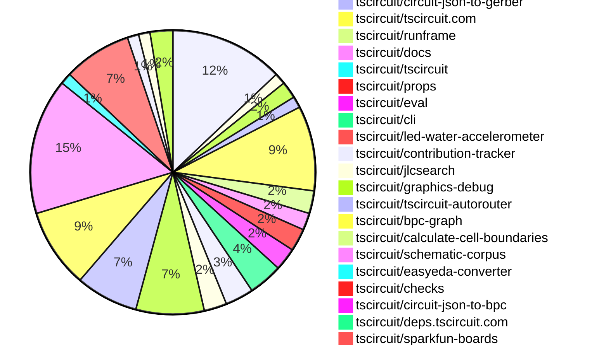
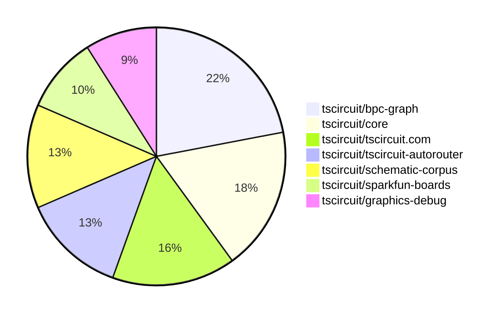

# Contribution Overview 2025-06-25

## PRs by Repository

## Contributor Overview

| Contributor | 🐳 Major | 🐙 Minor | 🐌 Tiny | ⭐ | Issues Created | Discussion Contributions |
|-------------|---------|---------|---------|-----|----------------|--------------------------|
| [seveibar](#seveibar) | 21 | 7 | 33 | 👑👑 | 0 | 0🔹 0🔶 0💎 |
| [ShiboSoftwareDev](#ShiboSoftwareDev) | 2 | 3 | 9 | ⭐⭐⭐ | 0 | 0🔹 0🔶 0💎 |
| [imrishabh18](#imrishabh18) | 2 | 5 | 12 | ⭐⭐⭐ | 0 | 0🔹 0🔶 0💎 |
| [ArnavK-09](#ArnavK-09) | 5 | 1 | 8 | ⭐⭐⭐ | 0 | 0🔹 0🔶 0💎 |
| [Abse2001](#Abse2001) | 1 | 1 | 9 | ⭐⭐ | 0 | 0🔹 0🔶 0💎 |
| [Anshgrover23](#Anshgrover23) | 1 | 0 | 20 | ⭐⭐ | 0 | 0🔹 0🔶 0💎 |
| [techmannih](#techmannih) | 0 | 1 | 13 | ⭐⭐ | 0 | 0🔹 0🔶 0💎 |
| [ricohageman](#ricohageman) | 3 | 0 | 0 | ⭐⭐ | 0 | 0🔹 0🔶 0💎 |
| [MustafaMulla29](#MustafaMulla29) | 0 | 1 | 2 | ⭐ | 0 | 0🔹 0🔶 0💎 |
| [tscircuitbot](#tscircuitbot) | 0 | 0 | 1 |  | 0 | 0🔹 0🔶 0💎 |

### Discussion Contribution Legend

- 🔹 Normal Comments: Basic participation with minimal effort
- 🔶 Great Informative Comments: Thoughtful participation that adds value
- 💎 Incredible Comments: Exceptional participation with high-quality content

## Review Table

[reviews-received-hover]: ## "Number of reviews received for PRs for this contributor"
[approvals-received-hover]: ## "Number of approvals received for PRs this contributor authored"
[rejections-received-hover]: ## "Number of rejections received for PRs this contributor authored"
[prs-opened-hover]: ## "Number of PRs opened by this contributor"
[issues-created-hover]: ## "Number of issues created by this contributor"
[bountied-issues-hover]: ## "Number of issues this contributor created with a bounty"
[bountied-issue-$-hover]: ## "Total bounty amount placed on issues authored by this contributor"

| Contributor | Reviews Received | Approvals Received | Rejections Received | Approvals | Rejections | PRs Opened | PRs Merged | Issues Created | Bountied Issues | Bountied Issue $ |
|---|---|---|---|---|---|---|---|---|---|---|
| [seveibar](#seveibar) | 16 | 1 | 0 | 47 | 4 | 78 | 63 | 0 | 0 | 0 |
| [imrishabh18](#imrishabh18) | 19 | 9 | 1 | 10 | 1 | 26 | 22 | 0 | 0 | 0 |
| [graphite-app[bot]](#graphite-app[bot]) | 0 | 0 | 0 | 0 | 0 | 0 | 0 | 0 | 0 | 0 |
| [techmannih](#techmannih) | 48 | 20 | 7 | 2 | 3 | 26 | 14 | 0 | 0 | 0 |
| [Anshgrover23](#Anshgrover23) | 30 | 21 | 4 | 4 | 5 | 25 | 21 | 0 | 0 | 0 |
| [ShiboSoftwareDev](#ShiboSoftwareDev) | 14 | 11 | 0 | 14 | 1 | 17 | 14 | 0 | 0 | 0 |
| [MustafaMulla29](#MustafaMulla29) | 8 | 6 | 1 | 0 | 0 | 8 | 4 | 0 | 0 | 0 |
| [cursor[bot]](#cursor[bot]) | 0 | 0 | 0 | 0 | 0 | 0 | 0 | 0 | 0 | 0 |
| [ArnavK-09](#ArnavK-09) | 23 | 16 | 0 | 2 | 0 | 17 | 16 | 0 | 0 | 0 |
| [Abse2001](#Abse2001) | 5 | 3 | 1 | 13 | 0 | 13 | 11 | 0 | 0 | 0 |
| [andrii-balitskyi](#andrii-balitskyi) | 2 | 2 | 0 | 0 | 0 | 2 | 2 | 0 | 0 | 0 |
| [tscircuitbot](#tscircuitbot) | 0 | 0 | 0 | 0 | 0 | 36 | 2 | 0 | 0 | 0 |
| [ricohageman](#ricohageman) | 4 | 3 | 0 | 0 | 0 | 3 | 3 | 0 | 0 | 0 |

## Top 7 Repositories by Contribution Points

## Changes by Repository

### [tscircuit/core](https://github.com/tscircuit/core)

| PR # | Impact | Rating | Contributor | Description |
|------|--------|--------|-------------|-------------|
| [#1002](https://github.com/tscircuit/core/pull/1002) | 🐳 Major | ⭐⭐⭐ | imrishabh18 | Fixes the issue where multiple traces could exist between the same pins in a subcircuit, ensuring proper autorouting behavior. |
| [#1023](https://github.com/tscircuit/core/pull/1023) | 🐳 Major | ⭐⭐⭐ | seveibar | Fixes autorouting issues by sending externallyConnectedPointIds to the autorouter, enabling better route selection for subcircuits. |
| [#1016](https://github.com/tscircuit/core/pull/1016) | 🐳 Major | ⭐⭐⭐ | seveibar | Rewrite match adapt to use BPC graphs, route traces in matchAdapt mode, and work in progress on layout. |
| [#1000](https://github.com/tscircuit/core/pull/1000) | 🐳 Major | ⭐⭐⭐ | ShiboSoftwareDev | Adds functionality to generate obstacles for cutout components in PCB designs, including rectangles, circles, and polygons. |
| [#1004](https://github.com/tscircuit/core/pull/1004) | 🐙 Minor | ⭐⭐ | seveibar | Fixes the netlabel center offset calculation based on the anchor position and side, ensuring accurate placement of netlabels in schematics. |
| [#1003](https://github.com/tscircuit/core/pull/1003) | 🐙 Minor | ⭐⭐ | seveibar | Fixes incorrect net IDs on schematic net labels, ensuring proper association with the corresponding nets. |
| [#1014](https://github.com/tscircuit/core/pull/1014) | 🐙 Minor | ⭐⭐ | techmannih | Adds a new test for the testpoint  component with netlabels and updates the schematic symbol version. |
| [#1008](https://github.com/tscircuit/core/pull/1008) | 🐙 Minor | ⭐⭐ | ShiboSoftwareDev | Fixes incorrect calculation of the board center based on the outline dimensions and offsets. |

🐌 Tiny Contributions (12)

| PR # | Impact | Contributor | Description |
|------|--------|-------------|-------------|
| [#1013](https://github.com/tscircuit/core/pull/1013) | 🐌 Tiny | imrishabh18 | Locks the css-select package version to 5.1.0 to prevent breaking type issues caused by upgrading to a newer version. |
| [#998](https://github.com/tscircuit/core/pull/998) | 🐌 Tiny | imrishabh18 | Adds functionality to print board information (project name, version, URL) to the silkscreen layer of the PCB if specified in the platform configuration. |
| [#997](https://github.com/tscircuit/core/pull/997) | 🐌 Tiny | imrishabh18 | Reproduces a bug where multiple traces are created between the same pins within a subcircuit, aiding in debugging the issue. |
| [#992](https://github.com/tscircuit/core/pull/992) | 🐌 Tiny | imrishabh18 | Handles the props.symbolName for SolderJumper, allowing for dynamic schematic symbol naming based on provided props. |
| [#989](https://github.com/tscircuit/core/pull/989) | 🐌 Tiny | imrishabh18 | Adds support for a new bridged prop in the SolderJumper component, allowing for the connection of all pins when the prop is set to true, and updates test coverage for this new behavior. |
| [#1015](https://github.com/tscircuit/core/pull/1015) | 🐌 Tiny | seveibar | Adds support for schOrientation mapping to schematic symbol rotation and introduces tests for polarized capacitor orientations. |
| [#1005](https://github.com/tscircuit/core/pull/1005) | 🐌 Tiny | seveibar | Removes the TODO_REMOVE_THIS placeholder from the PrimitiveComponent name getter and ensures NormalComponent footprint generation uses a fallback name. |
| [#976](https://github.com/tscircuit/core/pull/976) | 🐌 Tiny | seveibar | Fixes net label positioning based on connected ports to ensure correct orientation in schematic rendering. |
| [#995](https://github.com/tscircuit/core/pull/995) | 🐌 Tiny | Anshgrover23 | Adds a test for the Led component to verify connections to GND and VCC. |
| [#999](https://github.com/tscircuit/core/pull/999) | 🐌 Tiny | ShiboSoftwareDev | Updates the footprinter dependency version from 0.0.182 to 0.0.186 and corrects floating-point precision in test cases. |
| [#1009](https://github.com/tscircuit/core/pull/1009) | 🐌 Tiny | MustafaMulla29 | Adds a test case that reproduces the jumper netlabel connection functionality in the circuit rendering. |
| [#996](https://github.com/tscircuit/core/pull/996) | 🐌 Tiny | Abse2001 | Adds support for Test Point selectors in the selector module, allowing access to pin1 of Test Points like sel.TP1.pin1. |

### [tscircuit/parts-engine](https://github.com/tscircuit/parts-engine)

| PR # | Impact | Rating | Contributor | Description |
|------|--------|--------|-------------|-------------|
| [#9](https://github.com/tscircuit/parts-engine/pull/9) | 🐳 Major | ⭐⭐⭐ | imrishabh18 | Fixes the search functionality to consider the displayed resistance and capacitance values, allowing for searches by value and SI unit instead of just absolute values. |

🐌 Tiny Contributions (1)

| PR # | Impact | Contributor | Description |
|------|--------|-------------|-------------|
| [#8](https://github.com/tscircuit/parts-engine/pull/8) | 🐌 Tiny | Anshgrover23 | Fixes a bug where undefined fuses would cause errors in the findPart function by ensuring that an empty array is returned instead of causing a runtime error. |

### [tscircuit/circuit-to-svg](https://github.com/tscircuit/circuit-to-svg)

| PR # | Impact | Rating | Contributor | Description |
|------|--------|--------|-------------|-------------|
| [#270](https://github.com/tscircuit/circuit-to-svg/pull/270) | 🐳 Major | ⭐⭐⭐⭐ | ShiboSoftwareDev | Adds rendering support for pads, pins, and holes in the assembly SVG output. |
| [#268](https://github.com/tscircuit/circuit-to-svg/pull/268) | 🐙 Minor | ⭐⭐ | imrishabh18 | Adds support for newline characters in PCB silkscreen text by creating a tspan for each line and includes a test for this functionality. |

🐌 Tiny Contributions (1)

| PR # | Impact | Contributor | Description |
|------|--------|-------------|-------------|
| [#276](https://github.com/tscircuit/circuit-to-svg/pull/276) | 🐌 Tiny | seveibar | Removes overline styling from net labels and reduces font size for pin labels that previously had overline styling applied. |

### [tscircuit/circuit-json-to-gerber](https://github.com/tscircuit/circuit-json-to-gerber)

| PR # | Impact | Rating | Contributor | Description |
|------|--------|--------|-------------|-------------|
| [#45](https://github.com/tscircuit/circuit-json-to-gerber/pull/45) | 🐙 Minor | ⭐⭐ | imrishabh18 | Fixes incorrect handling of silkscreen text anchor alignment in Gerber file generation, ensuring proper rendering based on the anchor_side property. |

🐌 Tiny Contributions (1)

| PR # | Impact | Contributor | Description |
|------|--------|-------------|-------------|
| [#44](https://github.com/tscircuit/circuit-json-to-gerber/pull/44) | 🐌 Tiny | seveibar | Adds support for nine text anchors in Gerber conversion, allowing for more precise placement of silkscreen text on circuit boards. |

### [tscircuit/tscircuit.com](https://github.com/tscircuit/tscircuit.com)

| PR # | Impact | Rating | Contributor | Description |
|------|--------|--------|-------------|-------------|
| [#1384](https://github.com/tscircuit/tscircuit.com/pull/1384) | 🐳 Major | ⭐⭐⭐⭐ | ArnavK-09 | This PR updates the RunFrame component and limits the optimal size of the editor and RunFrame to improve layout consistency and user experience. |
| [#1325](https://github.com/tscircuit/tscircuit.com/pull/1325) | 🐳 Major | ⭐⭐⭐ | seveibar | Caches default TypeScript libraries using IndexedDB and loads them when the CodeEditor mounts, enhancing performance and reducing load times. |
| [#1388](https://github.com/tscircuit/tscircuit.com/pull/1388) | 🐳 Major | ⭐⭐⭐ | ArnavK-09 | Adds a global find and replace feature to the code editor, allowing users to search and replace text across multiple files using a dedicated interface. |
| [#1382](https://github.com/tscircuit/tscircuit.com/pull/1382) | 🐳 Major | ⭐⭐⭐ | ArnavK-09 | Adds a native share option for users to share package details via the devices share functionality. |
| [#1378](https://github.com/tscircuit/tscircuit.com/pull/1378) | 🐳 Major | ⭐⭐⭐ | ArnavK-09 | Revamps the CmdK menu to enhance user experience with improved search functionality and UI components. |
| [#1393](https://github.com/tscircuit/tscircuit.com/pull/1393) | 🐙 Minor | ⭐⭐ | imrishabh18 | Adds a tooltip to the AI autocomplete button to describe its functionality for users. |

🐌 Tiny Contributions (9)

| PR # | Impact | Contributor | Description |
|------|--------|-------------|-------------|
| [#1394](https://github.com/tscircuit/tscircuit.com/pull/1394) | 🐌 Tiny | imrishabh18 | Updates the version of the tscircuitrunframe package from 0.0.647 to 0.0.653 in package.json. |
| [#1389](https://github.com/tscircuit/tscircuit.com/pull/1389) | 🐌 Tiny | Anshgrover23 | Updates the circuit-to-svg dependency version from 0.0.160 to 0.0.163 in package.json. |
| [#1395](https://github.com/tscircuit/tscircuit.com/pull/1395) | 🐌 Tiny | techmannih | Updates the version of the tscircuitfootprinter dependency from 0.0.176 to 0.0.186 in package.json. |
| [#1387](https://github.com/tscircuit/tscircuit.com/pull/1387) | 🐌 Tiny | ArnavK-09 | Updates various dependencies in package.json to their latest versions, ensuring compatibility and security improvements. |
| [#1383](https://github.com/tscircuit/tscircuit.com/pull/1383) | 🐌 Tiny | ArnavK-09 | Removes extra spacing in the CmdKMenu component, improving visual consistency. |
| [#1381](https://github.com/tscircuit/tscircuit.com/pull/1381) | 🐌 Tiny | ArnavK-09 | Prevents navigation to a 404 page when a package is still loading by checking if the package ID is available before setting the location for file editing. |
| [#1379](https://github.com/tscircuit/tscircuit.com/pull/1379) | 🐌 Tiny | ArnavK-09 | Fixes layout issues on the Package Build Details Page for better responsiveness across different screen sizes. |
| [#1374](https://github.com/tscircuit/tscircuit.com/pull/1374) | 🐌 Tiny | ArnavK-09 | Changes the owner identification in the settings dialog from account ID to GitHub username to ensure correct display for users. |
| [#1373](https://github.com/tscircuit/tscircuit.com/pull/1373) | 🐌 Tiny | ArnavK-09 | This pull request restricts the ability to generate or re-generate AI reviews to only the package owner, enhancing security by preventing unauthorized access. |

### [tscircuit/runframe](https://github.com/tscircuit/runframe)

| PR # | Impact | Rating | Contributor | Description |
|------|--------|--------|-------------|-------------|
| [#820](https://github.com/tscircuit/runframe/pull/820) | 🐳 Major | ⭐⭐⭐ | ArnavK-09 | !image(https:github.comuser-attachmentsassets4927470f-9778-4b11-8b74-03637b23bb2d) !image(https:github.comuser-attachmentsassets762ea70e-b151-4e2e-a3be-cd3e03db73bc) |
| [#830](https://github.com/tscircuit/runframe/pull/830) | 🐙 Minor | ⭐⭐ | imrishabh18 | Fetches the latest version of tscircuiteval when preloading the web worker, ensuring that the most up-to-date version is used instead of a potentially outdated cached version. |
| [#824](https://github.com/tscircuit/runframe/pull/824) | 🐙 Minor | ⭐⭐ | ArnavK-09 | Fixes the issue where the active tab does not persist when an error occurs, ensuring that users return to the last active tab after resolving the error. |

🐌 Tiny Contributions (1)

| PR # | Impact | Contributor | Description |
|------|--------|-------------|-------------|
| [#823](https://github.com/tscircuit/runframe/pull/823) | 🐌 Tiny | ArnavK-09 | before  after !image(https:github.comuser-attachmentsassets73ea7397-8a6d-4d95-a394-a4387ebbd670) !image(https:github.comuser-attachmentsassets4a449006-c265-4a57-92ec-e8c3d15e6a95) |

### [tscircuit/docs](https://github.com/tscircuit/docs)

| PR # | Impact | Rating | Contributor | Description |
|------|--------|--------|-------------|-------------|
| [#93](https://github.com/tscircuit/docs/pull/93) | 🐙 Minor | ⭐⭐ | imrishabh18 | Adds video demonstrations of manual editing features in the schematic and PCB viewer. |

🐌 Tiny Contributions (2)

| PR # | Impact | Contributor | Description |
|------|--------|-------------|-------------|
| [#94](https://github.com/tscircuit/docs/pull/94) | 🐌 Tiny | seveibar | Documents the schOrientation feature in the layout property guide, explaining how to orient polarized capacitors using this property. |
| [#92](https://github.com/tscircuit/docs/pull/92) | 🐌 Tiny | seveibar | Documents the usage of sel.net under new selector documentation. |

### [tscircuit/tscircuit](https://github.com/tscircuit/tscircuit)

🐌 Tiny Contributions (1)

| PR # | Impact | Contributor | Description |
|------|--------|-------------|-------------|
| [#694](https://github.com/tscircuit/tscircuit/pull/694) | 🐌 Tiny | imrishabh18 | Updates the versions of the tscircuitcore and tscircuiteval dependencies in package.json from 0.0.520 and 0.0.239 to 0.0.526 and 0.0.240 respectively. |

### [tscircuit/props](https://github.com/tscircuit/props)

| PR # | Impact | Rating | Contributor | Description |
|------|--------|--------|-------------|-------------|
| [#309](https://github.com/tscircuit/props/pull/309) | 🐙 Minor | ⭐⭐ | seveibar | Adds a new property connectsTo to the NetProps interface, allowing nets to specify connections to other components. |

🐌 Tiny Contributions (3)

| PR # | Impact | Contributor | Description |
|------|--------|-------------|-------------|
| [#307](https://github.com/tscircuit/props/pull/307) | 🐌 Tiny | imrishabh18 | Adds board information fields to the PlatformConfig interface and documents these options in the README. |
| [#308](https://github.com/tscircuit/props/pull/308) | 🐌 Tiny | seveibar | Extends CommonComponentProps with a new optional pinAttributes field and propagates pin label generics to several component prop interfaces. |
| [#304](https://github.com/tscircuit/props/pull/304) | 🐌 Tiny | Anshgrover23 | Adds a connections property to the LED component, allowing for more flexible connection definitions. |

### [tscircuit/eval](https://github.com/tscircuit/eval)

🐌 Tiny Contributions (4)

| PR # | Impact | Contributor | Description |
|------|--------|-------------|-------------|
| [#624](https://github.com/tscircuit/eval/pull/624) | 🐌 Tiny | imrishabh18 | Updates the parts-engine dependency from version 0.0.3 to 0.0.8 and adds a capacitor component to the test suite for enhanced testing of parts integration. |
| [#608](https://github.com/tscircuit/eval/pull/608) | 🐌 Tiny | imrishabh18 | Updates the tscircuitcore dependency version from 0.0.510 to 0.0.526 in package.json. |
| [#625](https://github.com/tscircuit/eval/pull/625) | 🐌 Tiny | ShiboSoftwareDev | Adds the graphics-debug dependency to resolve a build issue related to graphics rendering. |
| [#619](https://github.com/tscircuit/eval/pull/619) | 🐌 Tiny | tscircuitbot | Updates the tscircuitcore package from version 0.0.526 to 0.0.532 and the schematic-symbols package from version 0.0.163 to 0.0.165, ensuring compatibility with the latest features and fixes. |

### [tscircuit/cli](https://github.com/tscircuit/cli)

🐌 Tiny Contributions (6)

| PR # | Impact | Contributor | Description |
|------|--------|-------------|-------------|
| [#252](https://github.com/tscircuit/cli/pull/252) | 🐌 Tiny | imrishabh18 | Updates the versions of the tscircuiteval and tscircuit dependencies in package.json from 0.0.238 to 0.0.240 and from 0.0.505 to 0.0.510 respectively. |
| [#253](https://github.com/tscircuit/cli/pull/253) | 🐌 Tiny | seveibar | Fixes the CLI build to utilize the peer dependency of tscircuit, preventing the bundling of core, eval, and tscircuit packages, which ensures that the CLI uses the users installed version instead. |
| [#255](https://github.com/tscircuit/cli/pull/255) | 🐌 Tiny | Anshgrover23 | Updates the versions of the circuit-to-svg and runframe dependencies in the package.json file. |
| [#251](https://github.com/tscircuit/cli/pull/251) | 🐌 Tiny | ShiboSoftwareDev | Updates GitHub Actions workflows to use Node.js version 22 for improved compatibility and performance. |
| [#250](https://github.com/tscircuit/cli/pull/250) | 🐌 Tiny | ShiboSoftwareDev | Adds the ability to ignore circuitJson errors during the build process when the --ignore-errors flag is used, allowing builds to continue despite errors. |
| [#254](https://github.com/tscircuit/cli/pull/254) | 🐌 Tiny | ArnavK-09 | Updates dependencies and adjusts height settings in RunFrame for better layout management. |

### [tscircuit/led-water-accelerometer](https://github.com/tscircuit/led-water-accelerometer)

🐌 Tiny Contributions (1)

| PR # | Impact | Contributor | Description |
|------|--------|-------------|-------------|
| [#3](https://github.com/tscircuit/led-water-accelerometer/pull/3) | 🐌 Tiny | imrishabh18 | Adds mounting holes to the PCB layout and connects the Picos VBUS to the V5 net for improved power distribution. |

### [tscircuit/contribution-tracker](https://github.com/tscircuit/contribution-tracker)

| PR # | Impact | Rating | Contributor | Description |
|------|--------|--------|-------------|-------------|
| [#183](https://github.com/tscircuit/contribution-tracker/pull/183) | 🐳 Major | ⭐⭐⭐ | seveibar | No description provided |
| [#182](https://github.com/tscircuit/contribution-tracker/pull/182) | 🐳 Major | ⭐⭐⭐ | seveibar | No description provided |

🐌 Tiny Contributions (3)

| PR # | Impact | Contributor | Description |
|------|--------|-------------|-------------|
| [#187](https://github.com/tscircuit/contribution-tracker/pull/187) | 🐌 Tiny | seveibar | No description provided |
| [#185](https://github.com/tscircuit/contribution-tracker/pull/185) | 🐌 Tiny | seveibar | update previous weeks make sure readme reflects the latest |
| [#184](https://github.com/tscircuit/contribution-tracker/pull/184) | 🐌 Tiny | seveibar | No description provided |

### [tscircuit/jlcsearch](https://github.com/tscircuit/jlcsearch)

| PR # | Impact | Rating | Contributor | Description |
|------|--------|--------|-------------|-------------|
| [#61](https://github.com/tscircuit/jlcsearch/pull/61) | 🐳 Major | ⭐⭐⭐ | seveibar | Add functionality to track gas sensor measurement capabilities by introducing measurement flags for various gases, exposing these flags through the gas sensors API, and regenerating database types accordingly. |
| [#60](https://github.com/tscircuit/jlcsearch/pull/60) | 🐳 Major | ⭐⭐⭐ | seveibar | Adds a new page for Boost DC-DC converters, including a derived table, a new API endpoint, and tests for the new functionality. |

🐌 Tiny Contributions (2)

| PR # | Impact | Contributor | Description |
|------|--------|-------------|-------------|
| [#65](https://github.com/tscircuit/jlcsearch/pull/65) | 🐌 Tiny | seveibar | Adds a small tolerance in filtering for capacitors and resistors to account for rounding errors in exact values, ensuring that components are not missed due to minor discrepancies. |
| [#62](https://github.com/tscircuit/jlcsearch/pull/62) | 🐌 Tiny | seveibar | Adds a measurement query parameter and filter logic for gas sensors, including a dropdown for measurement options on the Gas Sensors page. |

### [tscircuit/graphics-debug](https://github.com/tscircuit/graphics-debug)

| PR # | Impact | Rating | Contributor | Description |
|------|--------|--------|-------------|-------------|
| [#58](https://github.com/tscircuit/graphics-debug/pull/58) | 🐳 Major | ⭐⭐⭐ | seveibar | Add support for rendering text objects in SVG output and canvas, including merging, translating, and updating bounds for texts, and enabling texts in InteractiveGraphics components. |
| [#66](https://github.com/tscircuit/graphics-debug/pull/66) | 🐙 Minor | ⭐⭐ | seveibar | Allows customizing SVG width and height in the getSvgFromGraphicsObject function. |
| [#65](https://github.com/tscircuit/graphics-debug/pull/65) | 🐙 Minor | ⭐⭐ | seveibar | Fixes the Y offset when creating a graphics grid so rows are not reversed and updates tests for the new grid orientation. |
| [#63](https://github.com/tscircuit/graphics-debug/pull/63) | 🐙 Minor | ⭐⭐ | seveibar | Calculates a dynamic font size for rectangle labels based on their dimensions and tests the label font sizing functionality. |

🐌 Tiny Contributions (8)

| PR # | Impact | Contributor | Description |
|------|--------|-------------|-------------|
| [#68](https://github.com/tscircuit/graphics-debug/pull/68) | 🐌 Tiny | seveibar | Adds a titles option to the stackGraphicsHorizontally function, allowing users to specify titles for each graphic in a horizontal stack, and includes documentation and snapshot tests for this feature. |
| [#67](https://github.com/tscircuit/graphics-debug/pull/67) | 🐌 Tiny | seveibar | Sets the default value of includeTextLabels to false in the SVG generation function, adjusting tests accordingly. |
| [#64](https://github.com/tscircuit/graphics-debug/pull/64) | 🐌 Tiny | seveibar | Aligns rectangle label text to the top of the rectangle and increases the label size by 3x, while also updating the test expectations and the typesbun dependency version. |
| [#62](https://github.com/tscircuit/graphics-debug/pull/62) | 🐌 Tiny | seveibar | Adds options to specify gaps when generating graphics grids, allowing for gap fractions relative to cell width. |
| [#61](https://github.com/tscircuit/graphics-debug/pull/61) | 🐌 Tiny | seveibar | Adds a new method to arrange graphics objects in a grid layout based on specified cell dimensions. |
| [#60](https://github.com/tscircuit/graphics-debug/pull/60) | 🐌 Tiny | seveibar | Adds stackGraphicsHorizontally and stackGraphicsVertically functions to combine graphics by translation, exports these helpers from the library, documents their usage in README, and includes tests for the new utilities. |
| [#59](https://github.com/tscircuit/graphics-debug/pull/59) | 🐌 Tiny | seveibar | Adjusts text sizing logic to account for text widthheight when computing bounds, scales text font sizes using the transform matrix, exposes font size ratios, and adds tests for new behavior while adjusting existing tests. |
| [#57](https://github.com/tscircuit/graphics-debug/pull/57) | 🐌 Tiny | seveibar | Adds a new utility function mergeGraphics to combine two graphics objects, along with documentation and tests for the new functionality. |

### [tscircuit/tscircuit-autorouter](https://github.com/tscircuit/tscircuit-autorouter)

| PR # | Impact | Rating | Contributor | Description |
|------|--------|--------|-------------|-------------|
| [#183](https://github.com/tscircuit/tscircuit-autorouter/pull/183) | 🐳 Major | ⭐⭐⭐ | seveibar | Adds support for externally connected point IDs in autorouting connections, allowing for off-board connections to be recognized and handled appropriately. |
| [#182](https://github.com/tscircuit/tscircuit-autorouter/pull/182) | 🐳 Major | ⭐⭐⭐ | seveibar | Adds functionality to accept high-density solutions with small gaps when the solver reaches maximum iterations, enhancing the flexibility of the autorouting process. |
| [#54](https://github.com/tscircuit/tscircuit-autorouter/pull/54) | 🐳 Major | ⭐⭐⭐ | ricohageman | Removes edges leading to dead-end nodes in the autorouting algorithm, optimizing the search space for subsequent algorithms. |
| [#181](https://github.com/tscircuit/tscircuit-autorouter/pull/181) | 🐳 Major | ⭐⭐⭐ | ricohageman | Fixes cache key collisions in the HyperCapacityPathingSolver when multiple routes exist between the same node pair, improving cache efficiency and reducing warnings. |
| [#180](https://github.com/tscircuit/tscircuit-autorouter/pull/180) | 🐳 Major | ⭐⭐⭐ | ricohageman | Fixes caching issue in the unravelMultiSectionSolver by rounding delta values to a higher precision, preventing errors from accumulated rounding. |

🐌 Tiny Contributions (6)

| PR # | Impact | Contributor | Description |
|------|--------|-------------|-------------|
| [#172](https://github.com/tscircuit/tscircuit-autorouter/pull/172) | 🐌 Tiny | Anshgrover23 | Adds additional fixtures for testing autorouting hypersolver bugs, specifically addressing issues related to node configurations and connections. |
| [#171](https://github.com/tscircuit/tscircuit-autorouter/pull/171) | 🐌 Tiny | Anshgrover23 | Adds additional fixtures for testing autorouting hyperdensity bugs, specifically addressing issues related to node configurations in the autorouting process. |
| [#170](https://github.com/tscircuit/tscircuit-autorouter/pull/170) | 🐌 Tiny | Anshgrover23 | Excludes JSON files from being formatted in the project, allowing for better control over formatting rules and preventing unnecessary changes to JSON files. |
| [#165](https://github.com/tscircuit/tscircuit-autorouter/pull/165) | 🐌 Tiny | Anshgrover23 | Adds new fixtures for testing the hyperdensity solver, addressing bugs related to node configurations and connections. |
| [#168](https://github.com/tscircuit/tscircuit-autorouter/pull/168) | 🐌 Tiny | Anshgrover23 | Adds a new fixture and JSON asset for the high density node cn2306, facilitating testing and reproduction of related issues. |
| [#177](https://github.com/tscircuit/tscircuit-autorouter/pull/177) | 🐌 Tiny | techmannih | Adds high-density fixtures for nodes cn2776 and cn1722, including their respective JSON configurations and testing fixtures. |

### [tscircuit/bpc-graph](https://github.com/tscircuit/bpc-graph)

| PR # | Impact | Rating | Contributor | Description |
|------|--------|--------|-------------|-------------|
| [#20](https://github.com/tscircuit/bpc-graph/pull/20) | 🐳 Major | ⭐⭐⭐ | seveibar | Adds examples and utilities for calculating graph distances using the Weisfeiler-Leman algorithm and visualizing flat BPC graphs. |
| [#18](https://github.com/tscircuit/bpc-graph/pull/18) | 🐳 Major | ⭐⭐⭐ | seveibar | Fixes the floating box assignment logic in the layout solver and adds an example image to the README for better user understanding. |
| [#12](https://github.com/tscircuit/bpc-graph/pull/12) | 🐳 Major | ⭐⭐⭐ | seveibar | Introduces a renetworking function that allows for heuristic graph cuts based on pin connectivity, improving the scoring of WL Distance for matches in the BPC graph. |
| [#11](https://github.com/tscircuit/bpc-graph/pull/11) | 🐳 Major | ⭐⭐⭐ | seveibar | Introduces functionality to partition a graph into subgraphs based on box sides, enhancing the ability to manage and manipulate circuit designs. |
| [#10](https://github.com/tscircuit/bpc-graph/pull/10) | 🐳 Major | ⭐⭐⭐ | seveibar | Add utilities to build and merge subgraphs for box sides, detect connected groups of box sides, and test for isolated box sides. |
| [#9](https://github.com/tscircuit/bpc-graph/pull/9) | 🐳 Major | ⭐⭐⭐ | seveibar | Fixes issues in net adaptation logic and adds snapshot tests for better validation of adaptations. |
| [#8](https://github.com/tscircuit/bpc-graph/pull/8) | 🐳 Major | ⭐⭐⭐ | seveibar | page tweaking more work on improving graphics representation for the matchingdistance debugging more visualization for matching setup for simple edit operations setup |
| [#7](https://github.com/tscircuit/bpc-graph/pull/7) | 🐳 Major | ⭐⭐⭐ | seveibar | Operation Costs, Solve for Graph Transform with A, heuristic matching function (2) v0.0.7 rewrite test input to make a color change more reasonable v0.0.8 feat: add corpus matcher page fix corpus matching page tailwind loading add mouse hover corpus match with hovering remove other bpc matching page add match button add preview for texxt area v0.0.9 add adapted match display on the corpus match page add ignoreTopMatch, possibly fix adaptation fix ignore top match logic introduce placeholder test repro infinite load bug v0.0.10 Match-Adapt against Corpus (5) v0.0.11 Flat BPC Graph (6) working on adjacency matrix add getComparisonGraphics and start eigenvec comparison suite get comparison svg working flat bpc construction adjacency matrix more readable matrices |
| [#6](https://github.com/tscircuit/bpc-graph/pull/6) | 🐳 Major | ⭐⭐⭐ | seveibar | Introduces a new flat BPC graph type and renames related functions for improved clarity and functionality in graph transformations. |
| [#5](https://github.com/tscircuit/bpc-graph/pull/5) | 🐳 Major | ⭐⭐⭐ | seveibar | Adds a corpus matcher page that allows users to match graphs against a corpus, including features like mouse hover effects and a match button, while also fixing issues with the corpus matching page. |

🐌 Tiny Contributions (4)

| PR # | Impact | Contributor | Description |
|------|--------|-------------|-------------|
| [#19](https://github.com/tscircuit/bpc-graph/pull/19) | 🐌 Tiny | seveibar | Adds a new function to merge two subgraphs into a single graph and includes a corresponding SVG snapshot for visualization. |
| [#17](https://github.com/tscircuit/bpc-graph/pull/17) | 🐌 Tiny | seveibar | Adds a better example for the renetwork functionality in the README, including improved code snippets and visual examples. |
| [#13](https://github.com/tscircuit/bpc-graph/pull/13) | 🐌 Tiny | seveibar | Adds documentation for the library API and example tests for rendering BPC graphs. |
| [#4](https://github.com/tscircuit/bpc-graph/pull/4) | 🐌 Tiny | seveibar | Adds a new page for comparing a BPC graph against the schematic corpus, along with the addition of the tscircuitschematic-corpus dependency. |

### [tscircuit/calculate-cell-boundaries](https://github.com/tscircuit/calculate-cell-boundaries)

| PR # | Impact | Rating | Contributor | Description |
|------|--------|--------|-------------|-------------|
| [#7](https://github.com/tscircuit/calculate-cell-boundaries/pull/7) | 🐳 Major | ⭐⭐⭐ | seveibar | Summary move algorithm internals out of claude folder rename types.ts used inside the algorithm to internalTypes.ts update imports across the library rename example component to cell-boundaries.tsx  Testing bun test tests |

### [tscircuit/schematic-corpus](https://github.com/tscircuit/schematic-corpus)

| PR # | Impact | Rating | Contributor | Description |
|------|--------|--------|-------------|-------------|
| [#25](https://github.com/tscircuit/schematic-corpus/pull/25) | 🐙 Minor | ⭐⭐ | seveibar | Adds functionality to generate SVG graphics for BPC graphs from circuit JSON files. |
| [#14](https://github.com/tscircuit/schematic-corpus/pull/14) | 🐙 Minor | ⭐⭐ | Abse2001 | Fixes the schottky_diode symbol rendering issue in the schematic. |

🐌 Tiny Contributions (22)

| PR # | Impact | Contributor | Description |
|------|--------|-------------|-------------|
| [#37](https://github.com/tscircuit/schematic-corpus/pull/37) | 🐌 Tiny | seveibar | Adds a new site for displaying BPC graphs, including a build command, improved mouse hover support, and SVG virtual file system for enhanced image handling. |
| [#11](https://github.com/tscircuit/schematic-corpus/pull/11) | 🐌 Tiny | seveibar | Updates the BPC generation process to include netlabels, ensuring that net connections are properly labeled in the output. |
| [#36](https://github.com/tscircuit/schematic-corpus/pull/36) | 🐌 Tiny | Anshgrover23 | Creates a new schematic design in the tscircuitschematic-corpus repository |
| [#34](https://github.com/tscircuit/schematic-corpus/pull/34) | 🐌 Tiny | Anshgrover23 | Creates a new schematic design in the tscircuitschematic-corpus repository |
| [#32](https://github.com/tscircuit/schematic-corpus/pull/32) | 🐌 Tiny | Anshgrover23 | Adds a new circuit design (design024) to the schematic corpus, including a jumper and multiple net labels for connections. |
| [#24](https://github.com/tscircuit/schematic-corpus/pull/24) | 🐌 Tiny | Anshgrover23 | Adds a new circuit design (design022) including a power net, solder jumper, resistor, and LED components. |
| [#22](https://github.com/tscircuit/schematic-corpus/pull/22) | 🐌 Tiny | Anshgrover23 | Creates a new schematic design in the tscircuitschematic-corpus repository |
| [#10](https://github.com/tscircuit/schematic-corpus/pull/10) | 🐌 Tiny | Anshgrover23 | Creates a new schematic design in the tscircuitschematic-corpus repository |
| [#35](https://github.com/tscircuit/schematic-corpus/pull/35) | 🐌 Tiny | techmannih | Creates a new schematic design in the tscircuitschematic-corpus repository |
| [#33](https://github.com/tscircuit/schematic-corpus/pull/33) | 🐌 Tiny | techmannih | Creates a new schematic design in the tscircuitschematic-corpus repository |
| [#31](https://github.com/tscircuit/schematic-corpus/pull/31) | 🐌 Tiny | techmannih | Modifies the design025 circuit by adding a third pin to the pin arrangement and updating net labels for better clarity and functionality. |
| [#27](https://github.com/tscircuit/schematic-corpus/pull/27) | 🐌 Tiny | techmannih | Creates a new schematic design in the tscircuitschematic-corpus repository |
| [#26](https://github.com/tscircuit/schematic-corpus/pull/26) | 🐌 Tiny | techmannih | Creates a new schematic design in the tscircuitschematic-corpus repository |
| [#21](https://github.com/tscircuit/schematic-corpus/pull/21) | 🐌 Tiny | techmannih | Creates a new schematic design in the tscircuitschematic-corpus repository |
| [#20](https://github.com/tscircuit/schematic-corpus/pull/20) | 🐌 Tiny | Abse2001 | Adds a new circuit design (design019) with multiple net labels and connections for a chip component, enhancing the schematic corpus. |
| [#19](https://github.com/tscircuit/schematic-corpus/pull/19) | 🐌 Tiny | Abse2001 | Adds new net labels and modifies existing connections in the circuit design for better functionality and clarity. |
| [#18](https://github.com/tscircuit/schematic-corpus/pull/18) | 🐌 Tiny | Abse2001 | Adds a new circuit design component with a defined schematic layout for a chip and its connections. |
| [#17](https://github.com/tscircuit/schematic-corpus/pull/17) | 🐌 Tiny | Abse2001 | Adds a new circuit design (design016) with a specific chip configuration and net labels for connections in the schematic. |
| [#16](https://github.com/tscircuit/schematic-corpus/pull/16) | 🐌 Tiny | Abse2001 | Adds a new circuit design with a switch, capacitor, resistor, and net labels for a schematic representation. |
| [#15](https://github.com/tscircuit/schematic-corpus/pull/15) | 🐌 Tiny | Abse2001 | Adds a new circuit design component with a switch and net labels for BOOT0 and V3_3 connections. |
| [#13](https://github.com/tscircuit/schematic-corpus/pull/13) | 🐌 Tiny | Abse2001 | Adds a new schematic design with capacitors and net labels for a circuit board. |
| [#12](https://github.com/tscircuit/schematic-corpus/pull/12) | 🐌 Tiny | Abse2001 | Adds a new circuit design with capacitors and a crystal oscillator to the schematic corpus. |

### [tscircuit/easyeda-converter](https://github.com/tscircuit/easyeda-converter)

🐌 Tiny Contributions (2)

| PR # | Impact | Contributor | Description |
|------|--------|-------------|-------------|
| [#270](https://github.com/tscircuit/easyeda-converter/pull/270) | 🐌 Tiny | seveibar | Adds support for converting vias to TSX format in the generateFootprintTsx function, including a test for a specific component with vias. |
| [#269](https://github.com/tscircuit/easyeda-converter/pull/269) | 🐌 Tiny | seveibar | Summary add ViaSchema to support VIA shapes in packages convert VIA elements to pcb_via add test for part C46497 which includes VIA add snapshot test for pcb vias  Testing bun test testsparse-testsparse-c46497.test.ts BUN_UPDATE_SNAPSHOTS1 bun test testsconvert-to-soup-testsc46497.test.ts |

### [tscircuit/checks](https://github.com/tscircuit/checks)

🐌 Tiny Contributions (1)

| PR # | Impact | Contributor | Description |
|------|--------|-------------|-------------|
| [#52](https://github.com/tscircuit/checks/pull/52) | 🐌 Tiny | seveibar | Adds a new utility function runAllChecks that executes multiple PCB checks on the provided circuit code and validates the results with unit tests. |

### [tscircuit/circuit-json-to-bpc](https://github.com/tscircuit/circuit-json-to-bpc)

🐌 Tiny Contributions (1)

| PR # | Impact | Contributor | Description |
|------|--------|-------------|-------------|
| [#2](https://github.com/tscircuit/circuit-json-to-bpc/pull/2) | 🐌 Tiny | seveibar | Converts schematic net labels to boxes with pins in BPC graph and updates circuit-json to the latest version. |

### [tscircuit/deps.tscircuit.com](https://github.com/tscircuit/deps.tscircuit.com)

🐌 Tiny Contributions (1)

| PR # | Impact | Contributor | Description |
|------|--------|-------------|-------------|
| [#23](https://github.com/tscircuit/deps.tscircuit.com/pull/23) | 🐌 Tiny | seveibar | Adds tscircuitcli as a downstream dependency and updates the dependency graph accordingly. |

### [tscircuit/sparkfun-boards](https://github.com/tscircuit/sparkfun-boards)

| PR # | Impact | Rating | Contributor | Description |
|------|--------|--------|-------------|-------------|
| [#18](https://github.com/tscircuit/sparkfun-boards/pull/18) | 🐳 Major | ⭐⭐⭐ | Anshgrover23 | No description provided |
| [#29](https://github.com/tscircuit/sparkfun-boards/pull/29) | 🐳 Major | ⭐⭐⭐ | Abse2001 | Introduces a new circuit board for the SparkFun Transceiver Breakout MAX3232, including schematic and PCB layout. |
| [#37](https://github.com/tscircuit/sparkfun-boards/pull/37) | 🐙 Minor | ⭐⭐ | MustafaMulla29 | No description provided |

🐌 Tiny Contributions (9)

| PR # | Impact | Contributor | Description |
|------|--------|-------------|-------------|
| [#33](https://github.com/tscircuit/sparkfun-boards/pull/33) | 🐌 Tiny | Anshgrover23 | Refactors the code by moving the jumper footprint definition into a separate file for better organization and maintainability. |
| [#32](https://github.com/tscircuit/sparkfun-boards/pull/32) | 🐌 Tiny | Anshgrover23 | Adds new scripts for snapshot functionality in package.json, enabling users to create and update snapshots easily. |
| [#16](https://github.com/tscircuit/sparkfun-boards/pull/16) | 🐌 Tiny | Anshgrover23 | Adds a README file for the SparkFun RFM69 Breakout (915MHz) board, providing a link to the official product page for user reference. |
| [#24](https://github.com/tscircuit/sparkfun-boards/pull/24) | 🐌 Tiny | Anshgrover23 | No description provided |
| [#31](https://github.com/tscircuit/sparkfun-boards/pull/31) | 🐌 Tiny | techmannih | Adds a README file for the SparkFun USB to Serial Breakout - FT232RL board, providing a link to the official product page for user reference. |
| [#12](https://github.com/tscircuit/sparkfun-boards/pull/12) | 🐌 Tiny | techmannih | Fixes pin labeling and connections for the USBToSerialBreakout board, ensuring correct functionality of the DTR, RTS, and other pins. |
| [#30](https://github.com/tscircuit/sparkfun-boards/pull/30) | 🐌 Tiny | ShiboSoftwareDev | No description provided |
| [#25](https://github.com/tscircuit/sparkfun-boards/pull/25) | 🐌 Tiny | ShiboSoftwareDev | Updates GitHub workflows to run on Node.js version 22 and updates dependencies to their latest versions, ensuring the tsci snapshot workflow functions correctly for verifying changes. |
| [#21](https://github.com/tscircuit/sparkfun-boards/pull/21) | 🐌 Tiny | MustafaMulla29 | No description provided |

### [tscircuit/footprinter](https://github.com/tscircuit/footprinter)

🐌 Tiny Contributions (2)

| PR # | Impact | Contributor | Description |
|------|--------|-------------|-------------|
| [#306](https://github.com/tscircuit/footprinter/pull/306) | 🐌 Tiny | techmannih | Fixes the 1210 footprint to have taller pads for improved compatibility with components. |
| [#307](https://github.com/tscircuit/footprinter/pull/307) | 🐌 Tiny | ShiboSoftwareDev | Adds a nopinlabels option to the pinrow definition and builder, allowing users to skip silkscreen pin labels when set to true. |

### [tscircuit/schematic-symbols](https://github.com/tscircuit/schematic-symbols)

🐌 Tiny Contributions (2)

| PR # | Impact | Contributor | Description |
|------|--------|-------------|-------------|
| [#316](https://github.com/tscircuit/schematic-symbols/pull/316) | 🐌 Tiny | techmannih | Introduces a new schematic symbol for not connected in multiple orientations. |
| [#315](https://github.com/tscircuit/schematic-symbols/pull/315) | 🐌 Tiny | techmannih | Reduces the size of the testpoint symbol in the schematic representation. |

### [tscircuit/3d-viewer](https://github.com/tscircuit/3d-viewer)

| PR # | Impact | Rating | Contributor | Description |
|------|--------|--------|-------------|-------------|
| [#368](https://github.com/tscircuit/3d-viewer/pull/368) | 🐙 Minor | ⭐⭐ | ShiboSoftwareDev | Fixes the board positioning for outlines to ensure accurate rendering in the 3D viewer. |
| [#365](https://github.com/tscircuit/3d-viewer/pull/365) | 🐙 Minor | ⭐⭐ | ShiboSoftwareDev | Fixes rendering issues with JSX board definitions in the Manifold engine by ensuring proper handling of circuit JSON data. |

🐌 Tiny Contributions (2)

| PR # | Impact | Contributor | Description |
|------|--------|-------------|-------------|
| [#366](https://github.com/tscircuit/3d-viewer/pull/366) | 🐌 Tiny | ShiboSoftwareDev | Fixes the rendering issue in the Keyboard story by properly defining the KeyswitchSocket component and adding a new Socket component for visualization. |
| [#364](https://github.com/tscircuit/3d-viewer/pull/364) | 🐌 Tiny | ShiboSoftwareDev | Handles cases where the board data is empty by rendering nothing for the board and showing the components instead. |

## Changes by Contributor

### [imrishabh18](https://github.com/imrishabh18)

| PRs # | Impact | Rating | Description |
|------|--------|--------|-------------|
| [#1002](https://github.com/tscircuit/core/pull/1002) | 🐳 Major | ⭐⭐⭐ | Fixes the issue where multiple traces could exist between the same pins in a subcircuit, ensuring proper autorouting behavior. |
| [#9](https://github.com/tscircuit/parts-engine/pull/9) | 🐳 Major | ⭐⭐⭐ | Fixes the search functionality to consider the displayed resistance and capacitance values, allowing for searches by value and SI unit instead of just absolute values. |
| [#268](https://github.com/tscircuit/circuit-to-svg/pull/268) | 🐙 Minor | ⭐⭐ | Adds support for newline characters in PCB silkscreen text by creating a tspan for each line and includes a test for this functionality. |
| [#45](https://github.com/tscircuit/circuit-json-to-gerber/pull/45) | 🐙 Minor | ⭐⭐ | Fixes incorrect handling of silkscreen text anchor alignment in Gerber file generation, ensuring proper rendering based on the anchor_side property. |
| [#1393](https://github.com/tscircuit/tscircuit.com/pull/1393) | 🐙 Minor | ⭐⭐ | Adds a tooltip to the AI autocomplete button to describe its functionality for users. |
| [#830](https://github.com/tscircuit/runframe/pull/830) | 🐙 Minor | ⭐⭐ | Fetches the latest version of tscircuiteval when preloading the web worker, ensuring that the most up-to-date version is used instead of a potentially outdated cached version. |
| [#93](https://github.com/tscircuit/docs/pull/93) | 🐙 Minor | ⭐⭐ | Adds video demonstrations of manual editing features in the schematic and PCB viewer. |

🐌 Tiny Contributions (12)

| PR # | Impact | Description |
|------|--------|-------------|
| [#694](https://github.com/tscircuit/tscircuit/pull/694) | 🐌 Tiny | Updates the versions of the tscircuitcore and tscircuiteval dependencies in package.json from 0.0.520 and 0.0.239 to 0.0.526 and 0.0.240 respectively. |
| [#307](https://github.com/tscircuit/props/pull/307) | 🐌 Tiny | Adds board information fields to the PlatformConfig interface and documents these options in the README. |
| [#1013](https://github.com/tscircuit/core/pull/1013) | 🐌 Tiny | Locks the css-select package version to 5.1.0 to prevent breaking type issues caused by upgrading to a newer version. |
| [#998](https://github.com/tscircuit/core/pull/998) | 🐌 Tiny | Adds functionality to print board information (project name, version, URL) to the silkscreen layer of the PCB if specified in the platform configuration. |
| [#997](https://github.com/tscircuit/core/pull/997) | 🐌 Tiny | Reproduces a bug where multiple traces are created between the same pins within a subcircuit, aiding in debugging the issue. |
| [#992](https://github.com/tscircuit/core/pull/992) | 🐌 Tiny | Handles the props.symbolName for SolderJumper, allowing for dynamic schematic symbol naming based on provided props. |
| [#989](https://github.com/tscircuit/core/pull/989) | 🐌 Tiny | Adds support for a new bridged prop in the SolderJumper component, allowing for the connection of all pins when the prop is set to true, and updates test coverage for this new behavior. |
| [#1394](https://github.com/tscircuit/tscircuit.com/pull/1394) | 🐌 Tiny | Updates the version of the tscircuitrunframe package from 0.0.647 to 0.0.653 in package.json. |
| [#624](https://github.com/tscircuit/eval/pull/624) | 🐌 Tiny | Updates the parts-engine dependency from version 0.0.3 to 0.0.8 and adds a capacitor component to the test suite for enhanced testing of parts integration. |
| [#608](https://github.com/tscircuit/eval/pull/608) | 🐌 Tiny | Updates the tscircuitcore dependency version from 0.0.510 to 0.0.526 in package.json. |
| [#252](https://github.com/tscircuit/cli/pull/252) | 🐌 Tiny | Updates the versions of the tscircuiteval and tscircuit dependencies in package.json from 0.0.238 to 0.0.240 and from 0.0.505 to 0.0.510 respectively. |
| [#3](https://github.com/tscircuit/led-water-accelerometer/pull/3) | 🐌 Tiny | Adds mounting holes to the PCB layout and connects the Picos VBUS to the V5 net for improved power distribution. |

### [seveibar](https://github.com/seveibar)

| PRs # | Impact | Rating | Description |
|------|--------|--------|-------------|
| [#1023](https://github.com/tscircuit/core/pull/1023) | 🐳 Major | ⭐⭐⭐ | Fixes autorouting issues by sending externallyConnectedPointIds to the autorouter, enabling better route selection for subcircuits. |
| [#1016](https://github.com/tscircuit/core/pull/1016) | 🐳 Major | ⭐⭐⭐ | Rewrite match adapt to use BPC graphs, route traces in matchAdapt mode, and work in progress on layout. |
| [#183](https://github.com/tscircuit/contribution-tracker/pull/183) | 🐳 Major | ⭐⭐⭐ | No description provided |
| [#182](https://github.com/tscircuit/contribution-tracker/pull/182) | 🐳 Major | ⭐⭐⭐ | No description provided |
| [#1325](https://github.com/tscircuit/tscircuit.com/pull/1325) | 🐳 Major | ⭐⭐⭐ | Caches default TypeScript libraries using IndexedDB and loads them when the CodeEditor mounts, enhancing performance and reducing load times. |
| [#61](https://github.com/tscircuit/jlcsearch/pull/61) | 🐳 Major | ⭐⭐⭐ | Add functionality to track gas sensor measurement capabilities by introducing measurement flags for various gases, exposing these flags through the gas sensors API, and regenerating database types accordingly. |
| [#60](https://github.com/tscircuit/jlcsearch/pull/60) | 🐳 Major | ⭐⭐⭐ | Adds a new page for Boost DC-DC converters, including a derived table, a new API endpoint, and tests for the new functionality. |
| [#58](https://github.com/tscircuit/graphics-debug/pull/58) | 🐳 Major | ⭐⭐⭐ | Add support for rendering text objects in SVG output and canvas, including merging, translating, and updating bounds for texts, and enabling texts in InteractiveGraphics components. |
| [#183](https://github.com/tscircuit/tscircuit-autorouter/pull/183) | 🐳 Major | ⭐⭐⭐ | Adds support for externally connected point IDs in autorouting connections, allowing for off-board connections to be recognized and handled appropriately. |
| [#182](https://github.com/tscircuit/tscircuit-autorouter/pull/182) | 🐳 Major | ⭐⭐⭐ | Adds functionality to accept high-density solutions with small gaps when the solver reaches maximum iterations, enhancing the flexibility of the autorouting process. |
| [#20](https://github.com/tscircuit/bpc-graph/pull/20) | 🐳 Major | ⭐⭐⭐ | Adds examples and utilities for calculating graph distances using the Weisfeiler-Leman algorithm and visualizing flat BPC graphs. |
| [#18](https://github.com/tscircuit/bpc-graph/pull/18) | 🐳 Major | ⭐⭐⭐ | Fixes the floating box assignment logic in the layout solver and adds an example image to the README for better user understanding. |
| [#12](https://github.com/tscircuit/bpc-graph/pull/12) | 🐳 Major | ⭐⭐⭐ | Introduces a renetworking function that allows for heuristic graph cuts based on pin connectivity, improving the scoring of WL Distance for matches in the BPC graph. |
| [#11](https://github.com/tscircuit/bpc-graph/pull/11) | 🐳 Major | ⭐⭐⭐ | Introduces functionality to partition a graph into subgraphs based on box sides, enhancing the ability to manage and manipulate circuit designs. |
| [#10](https://github.com/tscircuit/bpc-graph/pull/10) | 🐳 Major | ⭐⭐⭐ | Add utilities to build and merge subgraphs for box sides, detect connected groups of box sides, and test for isolated box sides. |
| [#9](https://github.com/tscircuit/bpc-graph/pull/9) | 🐳 Major | ⭐⭐⭐ | Fixes issues in net adaptation logic and adds snapshot tests for better validation of adaptations. |
| [#8](https://github.com/tscircuit/bpc-graph/pull/8) | 🐳 Major | ⭐⭐⭐ | page tweaking more work on improving graphics representation for the matchingdistance debugging more visualization for matching setup for simple edit operations setup |
| [#7](https://github.com/tscircuit/bpc-graph/pull/7) | 🐳 Major | ⭐⭐⭐ | Operation Costs, Solve for Graph Transform with A, heuristic matching function (2) v0.0.7 rewrite test input to make a color change more reasonable v0.0.8 feat: add corpus matcher page fix corpus matching page tailwind loading add mouse hover corpus match with hovering remove other bpc matching page add match button add preview for texxt area v0.0.9 add adapted match display on the corpus match page add ignoreTopMatch, possibly fix adaptation fix ignore top match logic introduce placeholder test repro infinite load bug v0.0.10 Match-Adapt against Corpus (5) v0.0.11 Flat BPC Graph (6) working on adjacency matrix add getComparisonGraphics and start eigenvec comparison suite get comparison svg working flat bpc construction adjacency matrix more readable matrices |
| [#6](https://github.com/tscircuit/bpc-graph/pull/6) | 🐳 Major | ⭐⭐⭐ | Introduces a new flat BPC graph type and renames related functions for improved clarity and functionality in graph transformations. |
| [#5](https://github.com/tscircuit/bpc-graph/pull/5) | 🐳 Major | ⭐⭐⭐ | Adds a corpus matcher page that allows users to match graphs against a corpus, including features like mouse hover effects and a match button, while also fixing issues with the corpus matching page. |
| [#7](https://github.com/tscircuit/calculate-cell-boundaries/pull/7) | 🐳 Major | ⭐⭐⭐ | Summary move algorithm internals out of claude folder rename types.ts used inside the algorithm to internalTypes.ts update imports across the library rename example component to cell-boundaries.tsx  Testing bun test tests |
| [#309](https://github.com/tscircuit/props/pull/309) | 🐙 Minor | ⭐⭐ | Adds a new property connectsTo to the NetProps interface, allowing nets to specify connections to other components. |
| [#1004](https://github.com/tscircuit/core/pull/1004) | 🐙 Minor | ⭐⭐ | Fixes the netlabel center offset calculation based on the anchor position and side, ensuring accurate placement of netlabels in schematics. |
| [#1003](https://github.com/tscircuit/core/pull/1003) | 🐙 Minor | ⭐⭐ | Fixes incorrect net IDs on schematic net labels, ensuring proper association with the corresponding nets. |
| [#66](https://github.com/tscircuit/graphics-debug/pull/66) | 🐙 Minor | ⭐⭐ | Allows customizing SVG width and height in the getSvgFromGraphicsObject function. |
| [#65](https://github.com/tscircuit/graphics-debug/pull/65) | 🐙 Minor | ⭐⭐ | Fixes the Y offset when creating a graphics grid so rows are not reversed and updates tests for the new grid orientation. |
| [#63](https://github.com/tscircuit/graphics-debug/pull/63) | 🐙 Minor | ⭐⭐ | Calculates a dynamic font size for rectangle labels based on their dimensions and tests the label font sizing functionality. |
| [#25](https://github.com/tscircuit/schematic-corpus/pull/25) | 🐙 Minor | ⭐⭐ | Adds functionality to generate SVG graphics for BPC graphs from circuit JSON files. |

🐌 Tiny Contributions (33)

| PR # | Impact | Description |
|------|--------|-------------|
| [#308](https://github.com/tscircuit/props/pull/308) | 🐌 Tiny | Extends CommonComponentProps with a new optional pinAttributes field and propagates pin label generics to several component prop interfaces. |
| [#270](https://github.com/tscircuit/easyeda-converter/pull/270) | 🐌 Tiny | Adds support for converting vias to TSX format in the generateFootprintTsx function, including a test for a specific component with vias. |
| [#269](https://github.com/tscircuit/easyeda-converter/pull/269) | 🐌 Tiny | Summary add ViaSchema to support VIA shapes in packages convert VIA elements to pcb_via add test for part C46497 which includes VIA add snapshot test for pcb vias  Testing bun test testsparse-testsparse-c46497.test.ts BUN_UPDATE_SNAPSHOTS1 bun test testsconvert-to-soup-testsc46497.test.ts |
| [#1015](https://github.com/tscircuit/core/pull/1015) | 🐌 Tiny | Adds support for schOrientation mapping to schematic symbol rotation and introduces tests for polarized capacitor orientations. |
| [#1005](https://github.com/tscircuit/core/pull/1005) | 🐌 Tiny | Removes the TODO_REMOVE_THIS placeholder from the PrimitiveComponent name getter and ensures NormalComponent footprint generation uses a fallback name. |
| [#976](https://github.com/tscircuit/core/pull/976) | 🐌 Tiny | Fixes net label positioning based on connected ports to ensure correct orientation in schematic rendering. |
| [#187](https://github.com/tscircuit/contribution-tracker/pull/187) | 🐌 Tiny | No description provided |
| [#185](https://github.com/tscircuit/contribution-tracker/pull/185) | 🐌 Tiny | update previous weeks make sure readme reflects the latest |
| [#184](https://github.com/tscircuit/contribution-tracker/pull/184) | 🐌 Tiny | No description provided |
| [#276](https://github.com/tscircuit/circuit-to-svg/pull/276) | 🐌 Tiny | Removes overline styling from net labels and reduces font size for pin labels that previously had overline styling applied. |
| [#52](https://github.com/tscircuit/checks/pull/52) | 🐌 Tiny | Adds a new utility function runAllChecks that executes multiple PCB checks on the provided circuit code and validates the results with unit tests. |
| [#44](https://github.com/tscircuit/circuit-json-to-gerber/pull/44) | 🐌 Tiny | Adds support for nine text anchors in Gerber conversion, allowing for more precise placement of silkscreen text on circuit boards. |
| [#65](https://github.com/tscircuit/jlcsearch/pull/65) | 🐌 Tiny | Adds a small tolerance in filtering for capacitors and resistors to account for rounding errors in exact values, ensuring that components are not missed due to minor discrepancies. |
| [#62](https://github.com/tscircuit/jlcsearch/pull/62) | 🐌 Tiny | Adds a measurement query parameter and filter logic for gas sensors, including a dropdown for measurement options on the Gas Sensors page. |
| [#68](https://github.com/tscircuit/graphics-debug/pull/68) | 🐌 Tiny | Adds a titles option to the stackGraphicsHorizontally function, allowing users to specify titles for each graphic in a horizontal stack, and includes documentation and snapshot tests for this feature. |
| [#67](https://github.com/tscircuit/graphics-debug/pull/67) | 🐌 Tiny | Sets the default value of includeTextLabels to false in the SVG generation function, adjusting tests accordingly. |
| [#64](https://github.com/tscircuit/graphics-debug/pull/64) | 🐌 Tiny | Aligns rectangle label text to the top of the rectangle and increases the label size by 3x, while also updating the test expectations and the typesbun dependency version. |
| [#62](https://github.com/tscircuit/graphics-debug/pull/62) | 🐌 Tiny | Adds options to specify gaps when generating graphics grids, allowing for gap fractions relative to cell width. |
| [#61](https://github.com/tscircuit/graphics-debug/pull/61) | 🐌 Tiny | Adds a new method to arrange graphics objects in a grid layout based on specified cell dimensions. |
| [#60](https://github.com/tscircuit/graphics-debug/pull/60) | 🐌 Tiny | Adds stackGraphicsHorizontally and stackGraphicsVertically functions to combine graphics by translation, exports these helpers from the library, documents their usage in README, and includes tests for the new utilities. |
| [#59](https://github.com/tscircuit/graphics-debug/pull/59) | 🐌 Tiny | Adjusts text sizing logic to account for text widthheight when computing bounds, scales text font sizes using the transform matrix, exposes font size ratios, and adds tests for new behavior while adjusting existing tests. |
| [#57](https://github.com/tscircuit/graphics-debug/pull/57) | 🐌 Tiny | Adds a new utility function mergeGraphics to combine two graphics objects, along with documentation and tests for the new functionality. |
| [#253](https://github.com/tscircuit/cli/pull/253) | 🐌 Tiny | Fixes the CLI build to utilize the peer dependency of tscircuit, preventing the bundling of core, eval, and tscircuit packages, which ensures that the CLI uses the users installed version instead. |
| [#94](https://github.com/tscircuit/docs/pull/94) | 🐌 Tiny | Documents the schOrientation feature in the layout property guide, explaining how to orient polarized capacitors using this property. |
| [#92](https://github.com/tscircuit/docs/pull/92) | 🐌 Tiny | Documents the usage of sel.net under new selector documentation. |
| [#19](https://github.com/tscircuit/bpc-graph/pull/19) | 🐌 Tiny | Adds a new function to merge two subgraphs into a single graph and includes a corresponding SVG snapshot for visualization. |
| [#17](https://github.com/tscircuit/bpc-graph/pull/17) | 🐌 Tiny | Adds a better example for the renetwork functionality in the README, including improved code snippets and visual examples. |
| [#13](https://github.com/tscircuit/bpc-graph/pull/13) | 🐌 Tiny | Adds documentation for the library API and example tests for rendering BPC graphs. |
| [#4](https://github.com/tscircuit/bpc-graph/pull/4) | 🐌 Tiny | Adds a new page for comparing a BPC graph against the schematic corpus, along with the addition of the tscircuitschematic-corpus dependency. |
| [#2](https://github.com/tscircuit/circuit-json-to-bpc/pull/2) | 🐌 Tiny | Converts schematic net labels to boxes with pins in BPC graph and updates circuit-json to the latest version. |
| [#37](https://github.com/tscircuit/schematic-corpus/pull/37) | 🐌 Tiny | Adds a new site for displaying BPC graphs, including a build command, improved mouse hover support, and SVG virtual file system for enhanced image handling. |
| [#11](https://github.com/tscircuit/schematic-corpus/pull/11) | 🐌 Tiny | Updates the BPC generation process to include netlabels, ensuring that net connections are properly labeled in the output. |
| [#23](https://github.com/tscircuit/deps.tscircuit.com/pull/23) | 🐌 Tiny | Adds tscircuitcli as a downstream dependency and updates the dependency graph accordingly. |

### [Anshgrover23](https://github.com/Anshgrover23)

| PRs # | Impact | Rating | Description |
|------|--------|--------|-------------|
| [#18](https://github.com/tscircuit/sparkfun-boards/pull/18) | 🐳 Major | ⭐⭐⭐ | No description provided |

🐌 Tiny Contributions (20)

| PR # | Impact | Description |
|------|--------|-------------|
| [#304](https://github.com/tscircuit/props/pull/304) | 🐌 Tiny | Adds a connections property to the LED component, allowing for more flexible connection definitions. |
| [#995](https://github.com/tscircuit/core/pull/995) | 🐌 Tiny | Adds a test for the Led component to verify connections to GND and VCC. |
| [#1389](https://github.com/tscircuit/tscircuit.com/pull/1389) | 🐌 Tiny | Updates the circuit-to-svg dependency version from 0.0.160 to 0.0.163 in package.json. |
| [#255](https://github.com/tscircuit/cli/pull/255) | 🐌 Tiny | Updates the versions of the circuit-to-svg and runframe dependencies in the package.json file. |
| [#172](https://github.com/tscircuit/tscircuit-autorouter/pull/172) | 🐌 Tiny | Adds additional fixtures for testing autorouting hypersolver bugs, specifically addressing issues related to node configurations and connections. |
| [#171](https://github.com/tscircuit/tscircuit-autorouter/pull/171) | 🐌 Tiny | Adds additional fixtures for testing autorouting hyperdensity bugs, specifically addressing issues related to node configurations in the autorouting process. |
| [#170](https://github.com/tscircuit/tscircuit-autorouter/pull/170) | 🐌 Tiny | Excludes JSON files from being formatted in the project, allowing for better control over formatting rules and preventing unnecessary changes to JSON files. |
| [#165](https://github.com/tscircuit/tscircuit-autorouter/pull/165) | 🐌 Tiny | Adds new fixtures for testing the hyperdensity solver, addressing bugs related to node configurations and connections. |
| [#168](https://github.com/tscircuit/tscircuit-autorouter/pull/168) | 🐌 Tiny | Adds a new fixture and JSON asset for the high density node cn2306, facilitating testing and reproduction of related issues. |
| [#8](https://github.com/tscircuit/parts-engine/pull/8) | 🐌 Tiny | Fixes a bug where undefined fuses would cause errors in the findPart function by ensuring that an empty array is returned instead of causing a runtime error. |
| [#33](https://github.com/tscircuit/sparkfun-boards/pull/33) | 🐌 Tiny | Refactors the code by moving the jumper footprint definition into a separate file for better organization and maintainability. |
| [#32](https://github.com/tscircuit/sparkfun-boards/pull/32) | 🐌 Tiny | Adds new scripts for snapshot functionality in package.json, enabling users to create and update snapshots easily. |
| [#16](https://github.com/tscircuit/sparkfun-boards/pull/16) | 🐌 Tiny | Adds a README file for the SparkFun RFM69 Breakout (915MHz) board, providing a link to the official product page for user reference. |
| [#24](https://github.com/tscircuit/sparkfun-boards/pull/24) | 🐌 Tiny | No description provided |
| [#36](https://github.com/tscircuit/schematic-corpus/pull/36) | 🐌 Tiny | Creates a new schematic design in the tscircuitschematic-corpus repository |
| [#34](https://github.com/tscircuit/schematic-corpus/pull/34) | 🐌 Tiny | Creates a new schematic design in the tscircuitschematic-corpus repository |
| [#32](https://github.com/tscircuit/schematic-corpus/pull/32) | 🐌 Tiny | Adds a new circuit design (design024) to the schematic corpus, including a jumper and multiple net labels for connections. |
| [#24](https://github.com/tscircuit/schematic-corpus/pull/24) | 🐌 Tiny | Adds a new circuit design (design022) including a power net, solder jumper, resistor, and LED components. |
| [#22](https://github.com/tscircuit/schematic-corpus/pull/22) | 🐌 Tiny | Creates a new schematic design in the tscircuitschematic-corpus repository |
| [#10](https://github.com/tscircuit/schematic-corpus/pull/10) | 🐌 Tiny | Creates a new schematic design in the tscircuitschematic-corpus repository |

### [techmannih](https://github.com/techmannih)

| PRs # | Impact | Rating | Description |
|------|--------|--------|-------------|
| [#1014](https://github.com/tscircuit/core/pull/1014) | 🐙 Minor | ⭐⭐ | Adds a new test for the testpoint  component with netlabels and updates the schematic symbol version. |

🐌 Tiny Contributions (13)

| PR # | Impact | Description |
|------|--------|-------------|
| [#306](https://github.com/tscircuit/footprinter/pull/306) | 🐌 Tiny | Fixes the 1210 footprint to have taller pads for improved compatibility with components. |
| [#316](https://github.com/tscircuit/schematic-symbols/pull/316) | 🐌 Tiny | Introduces a new schematic symbol for not connected in multiple orientations. |
| [#315](https://github.com/tscircuit/schematic-symbols/pull/315) | 🐌 Tiny | Reduces the size of the testpoint symbol in the schematic representation. |
| [#1395](https://github.com/tscircuit/tscircuit.com/pull/1395) | 🐌 Tiny | Updates the version of the tscircuitfootprinter dependency from 0.0.176 to 0.0.186 in package.json. |
| [#177](https://github.com/tscircuit/tscircuit-autorouter/pull/177) | 🐌 Tiny | Adds high-density fixtures for nodes cn2776 and cn1722, including their respective JSON configurations and testing fixtures. |
| [#31](https://github.com/tscircuit/sparkfun-boards/pull/31) | 🐌 Tiny | Adds a README file for the SparkFun USB to Serial Breakout - FT232RL board, providing a link to the official product page for user reference. |
| [#12](https://github.com/tscircuit/sparkfun-boards/pull/12) | 🐌 Tiny | Fixes pin labeling and connections for the USBToSerialBreakout board, ensuring correct functionality of the DTR, RTS, and other pins. |
| [#35](https://github.com/tscircuit/schematic-corpus/pull/35) | 🐌 Tiny | Creates a new schematic design in the tscircuitschematic-corpus repository |
| [#33](https://github.com/tscircuit/schematic-corpus/pull/33) | 🐌 Tiny | Creates a new schematic design in the tscircuitschematic-corpus repository |
| [#31](https://github.com/tscircuit/schematic-corpus/pull/31) | 🐌 Tiny | Modifies the design025 circuit by adding a third pin to the pin arrangement and updating net labels for better clarity and functionality. |
| [#27](https://github.com/tscircuit/schematic-corpus/pull/27) | 🐌 Tiny | Creates a new schematic design in the tscircuitschematic-corpus repository |
| [#26](https://github.com/tscircuit/schematic-corpus/pull/26) | 🐌 Tiny | Creates a new schematic design in the tscircuitschematic-corpus repository |
| [#21](https://github.com/tscircuit/schematic-corpus/pull/21) | 🐌 Tiny | Creates a new schematic design in the tscircuitschematic-corpus repository |

### [ShiboSoftwareDev](https://github.com/ShiboSoftwareDev)

| PRs # | Impact | Rating | Description |
|------|--------|--------|-------------|
| [#270](https://github.com/tscircuit/circuit-to-svg/pull/270) | 🐳 Major | ⭐⭐⭐⭐ | Adds rendering support for pads, pins, and holes in the assembly SVG output. |
| [#1000](https://github.com/tscircuit/core/pull/1000) | 🐳 Major | ⭐⭐⭐ | Adds functionality to generate obstacles for cutout components in PCB designs, including rectangles, circles, and polygons. |
| [#368](https://github.com/tscircuit/3d-viewer/pull/368) | 🐙 Minor | ⭐⭐ | Fixes the board positioning for outlines to ensure accurate rendering in the 3D viewer. |
| [#365](https://github.com/tscircuit/3d-viewer/pull/365) | 🐙 Minor | ⭐⭐ | Fixes rendering issues with JSX board definitions in the Manifold engine by ensuring proper handling of circuit JSON data. |
| [#1008](https://github.com/tscircuit/core/pull/1008) | 🐙 Minor | ⭐⭐ | Fixes incorrect calculation of the board center based on the outline dimensions and offsets. |

🐌 Tiny Contributions (9)

| PR # | Impact | Description |
|------|--------|-------------|
| [#307](https://github.com/tscircuit/footprinter/pull/307) | 🐌 Tiny | Adds a nopinlabels option to the pinrow definition and builder, allowing users to skip silkscreen pin labels when set to true. |
| [#366](https://github.com/tscircuit/3d-viewer/pull/366) | 🐌 Tiny | Fixes the rendering issue in the Keyboard story by properly defining the KeyswitchSocket component and adding a new Socket component for visualization. |
| [#364](https://github.com/tscircuit/3d-viewer/pull/364) | 🐌 Tiny | Handles cases where the board data is empty by rendering nothing for the board and showing the components instead. |
| [#999](https://github.com/tscircuit/core/pull/999) | 🐌 Tiny | Updates the footprinter dependency version from 0.0.182 to 0.0.186 and corrects floating-point precision in test cases. |
| [#625](https://github.com/tscircuit/eval/pull/625) | 🐌 Tiny | Adds the graphics-debug dependency to resolve a build issue related to graphics rendering. |
| [#251](https://github.com/tscircuit/cli/pull/251) | 🐌 Tiny | Updates GitHub Actions workflows to use Node.js version 22 for improved compatibility and performance. |
| [#250](https://github.com/tscircuit/cli/pull/250) | 🐌 Tiny | Adds the ability to ignore circuitJson errors during the build process when the --ignore-errors flag is used, allowing builds to continue despite errors. |
| [#30](https://github.com/tscircuit/sparkfun-boards/pull/30) | 🐌 Tiny | No description provided |
| [#25](https://github.com/tscircuit/sparkfun-boards/pull/25) | 🐌 Tiny | Updates GitHub workflows to run on Node.js version 22 and updates dependencies to their latest versions, ensuring the tsci snapshot workflow functions correctly for verifying changes. |

### [MustafaMulla29](https://github.com/MustafaMulla29)

| PRs # | Impact | Rating | Description |
|------|--------|--------|-------------|
| [#37](https://github.com/tscircuit/sparkfun-boards/pull/37) | 🐙 Minor | ⭐⭐ | No description provided |

🐌 Tiny Contributions (2)

| PR # | Impact | Description |
|------|--------|-------------|
| [#1009](https://github.com/tscircuit/core/pull/1009) | 🐌 Tiny | Adds a test case that reproduces the jumper netlabel connection functionality in the circuit rendering. |
| [#21](https://github.com/tscircuit/sparkfun-boards/pull/21) | 🐌 Tiny | No description provided |

### [Abse2001](https://github.com/Abse2001)

| PRs # | Impact | Rating | Description |
|------|--------|--------|-------------|
| [#29](https://github.com/tscircuit/sparkfun-boards/pull/29) | 🐳 Major | ⭐⭐⭐ | Introduces a new circuit board for the SparkFun Transceiver Breakout MAX3232, including schematic and PCB layout. |
| [#14](https://github.com/tscircuit/schematic-corpus/pull/14) | 🐙 Minor | ⭐⭐ | Fixes the schottky_diode symbol rendering issue in the schematic. |

🐌 Tiny Contributions (9)

| PR # | Impact | Description |
|------|--------|-------------|
| [#996](https://github.com/tscircuit/core/pull/996) | 🐌 Tiny | Adds support for Test Point selectors in the selector module, allowing access to pin1 of Test Points like sel.TP1.pin1. |
| [#20](https://github.com/tscircuit/schematic-corpus/pull/20) | 🐌 Tiny | Adds a new circuit design (design019) with multiple net labels and connections for a chip component, enhancing the schematic corpus. |
| [#19](https://github.com/tscircuit/schematic-corpus/pull/19) | 🐌 Tiny | Adds new net labels and modifies existing connections in the circuit design for better functionality and clarity. |
| [#18](https://github.com/tscircuit/schematic-corpus/pull/18) | 🐌 Tiny | Adds a new circuit design component with a defined schematic layout for a chip and its connections. |
| [#17](https://github.com/tscircuit/schematic-corpus/pull/17) | 🐌 Tiny | Adds a new circuit design (design016) with a specific chip configuration and net labels for connections in the schematic. |
| [#16](https://github.com/tscircuit/schematic-corpus/pull/16) | 🐌 Tiny | Adds a new circuit design with a switch, capacitor, resistor, and net labels for a schematic representation. |
| [#15](https://github.com/tscircuit/schematic-corpus/pull/15) | 🐌 Tiny | Adds a new circuit design component with a switch and net labels for BOOT0 and V3_3 connections. |
| [#13](https://github.com/tscircuit/schematic-corpus/pull/13) | 🐌 Tiny | Adds a new schematic design with capacitors and net labels for a circuit board. |
| [#12](https://github.com/tscircuit/schematic-corpus/pull/12) | 🐌 Tiny | Adds a new circuit design with capacitors and a crystal oscillator to the schematic corpus. |

### [ArnavK-09](https://github.com/ArnavK-09)

| PRs # | Impact | Rating | Description |
|------|--------|--------|-------------|
| [#1384](https://github.com/tscircuit/tscircuit.com/pull/1384) | 🐳 Major | ⭐⭐⭐⭐ | This PR updates the RunFrame component and limits the optimal size of the editor and RunFrame to improve layout consistency and user experience. |
| [#1388](https://github.com/tscircuit/tscircuit.com/pull/1388) | 🐳 Major | ⭐⭐⭐ | Adds a global find and replace feature to the code editor, allowing users to search and replace text across multiple files using a dedicated interface. |
| [#1382](https://github.com/tscircuit/tscircuit.com/pull/1382) | 🐳 Major | ⭐⭐⭐ | Adds a native share option for users to share package details via the devices share functionality. |
| [#1378](https://github.com/tscircuit/tscircuit.com/pull/1378) | 🐳 Major | ⭐⭐⭐ | Revamps the CmdK menu to enhance user experience with improved search functionality and UI components. |
| [#820](https://github.com/tscircuit/runframe/pull/820) | 🐳 Major | ⭐⭐⭐ | !image(https:github.comuser-attachmentsassets4927470f-9778-4b11-8b74-03637b23bb2d) !image(https:github.comuser-attachmentsassets762ea70e-b151-4e2e-a3be-cd3e03db73bc) |
| [#824](https://github.com/tscircuit/runframe/pull/824) | 🐙 Minor | ⭐⭐ | Fixes the issue where the active tab does not persist when an error occurs, ensuring that users return to the last active tab after resolving the error. |

🐌 Tiny Contributions (8)

| PR # | Impact | Description |
|------|--------|-------------|
| [#1387](https://github.com/tscircuit/tscircuit.com/pull/1387) | 🐌 Tiny | Updates various dependencies in package.json to their latest versions, ensuring compatibility and security improvements. |
| [#1383](https://github.com/tscircuit/tscircuit.com/pull/1383) | 🐌 Tiny | Removes extra spacing in the CmdKMenu component, improving visual consistency. |
| [#1381](https://github.com/tscircuit/tscircuit.com/pull/1381) | 🐌 Tiny | Prevents navigation to a 404 page when a package is still loading by checking if the package ID is available before setting the location for file editing. |
| [#1379](https://github.com/tscircuit/tscircuit.com/pull/1379) | 🐌 Tiny | Fixes layout issues on the Package Build Details Page for better responsiveness across different screen sizes. |
| [#1374](https://github.com/tscircuit/tscircuit.com/pull/1374) | 🐌 Tiny | Changes the owner identification in the settings dialog from account ID to GitHub username to ensure correct display for users. |
| [#1373](https://github.com/tscircuit/tscircuit.com/pull/1373) | 🐌 Tiny | This pull request restricts the ability to generate or re-generate AI reviews to only the package owner, enhancing security by preventing unauthorized access. |
| [#823](https://github.com/tscircuit/runframe/pull/823) | 🐌 Tiny | before  after !image(https:github.comuser-attachmentsassets73ea7397-8a6d-4d95-a394-a4387ebbd670) !image(https:github.comuser-attachmentsassets4a449006-c265-4a57-92ec-e8c3d15e6a95) |
| [#254](https://github.com/tscircuit/cli/pull/254) | 🐌 Tiny | Updates dependencies and adjusts height settings in RunFrame for better layout management. |

### [tscircuitbot](https://github.com/tscircuitbot)

🐌 Tiny Contributions (1)

| PR # | Impact | Description |
|------|--------|-------------|
| [#619](https://github.com/tscircuit/eval/pull/619) | 🐌 Tiny | Updates the tscircuitcore package from version 0.0.526 to 0.0.532 and the schematic-symbols package from version 0.0.163 to 0.0.165, ensuring compatibility with the latest features and fixes. |

### [ricohageman](https://github.com/ricohageman)

| PRs # | Impact | Rating | Description |
|------|--------|--------|-------------|
| [#54](https://github.com/tscircuit/tscircuit-autorouter/pull/54) | 🐳 Major | ⭐⭐⭐ | Removes edges leading to dead-end nodes in the autorouting algorithm, optimizing the search space for subsequent algorithms. |
| [#181](https://github.com/tscircuit/tscircuit-autorouter/pull/181) | 🐳 Major | ⭐⭐⭐ | Fixes cache key collisions in the HyperCapacityPathingSolver when multiple routes exist between the same node pair, improving cache efficiency and reducing warnings. |
| [#180](https://github.com/tscircuit/tscircuit-autorouter/pull/180) | 🐳 Major | ⭐⭐⭐ | Fixes caching issue in the unravelMultiSectionSolver by rounding delta values to a higher precision, preventing errors from accumulated rounding. |

## Repository Owners

| Repository | Codeowners |
|------------|------------|
| [circuit-json-to-gerber](https://github.com/tscircuit/circuit-json-to-gerber/blob/main/.github/CODEOWNERS) | [seveibar](https://github.com/seveibar), [ShiboSoftwareDev](https://github.com/ShiboSoftwareDev) |
| [tscircuit.com](https://github.com/tscircuit/tscircuit.com/blob/main/.github/CODEOWNERS) | [seveibar](https://github.com/seveibar), [imrishabh18](https://github.com/imrishabh18) |
| [cli](https://github.com/tscircuit/cli/blob/main/.github/CODEOWNERS) | [seveibar](https://github.com/seveibar), [imrishabh18](https://github.com/imrishabh18), [ArnavK-09](https://github.com/ArnavK-09) |
| [circuit-to-svg](https://github.com/tscircuit/circuit-to-svg/blob/main/.github/CODEOWNERS) | [imrishabh18](https://github.com/imrishabh18) |
| [footprinter](https://github.com/tscircuit/footprinter/blob/main/.github/CODEOWNERS) | [techmannih](https://github.com/techmannih) |
| [schematic-symbols](https://github.com/tscircuit/schematic-symbols/blob/main/.github/CODEOWNERS) | [techmannih](https://github.com/techmannih) |
| [sparkfun-boards](https://github.com/tscircuit/sparkfun-boards/blob/main/.github/CODEOWNERS) | [techmannih](https://github.com/techmannih), [Anshgrover23](https://github.com/Anshgrover23), [ShiboSoftwareDev](https://github.com/ShiboSoftwareDev), [MustafaMulla29](https://github.com/MustafaMulla29), [Abse2001](https://github.com/Abse2001) |
| [schematic-corpus](https://github.com/tscircuit/schematic-corpus/blob/main/.github/CODEOWNERS) | [Abse2001](https://github.com/Abse2001) |

## Repos by Owner

| User | Repo |
|------|------|
| [seveibar](https://github.com/seveibar) | [circuit-json-to-gerber](https://github.com/tscircuit/circuit-json-to-gerber/blob/main/.github/CODEOWNERS) |
|  | [tscircuit.com](https://github.com/tscircuit/tscircuit.com/blob/main/.github/CODEOWNERS) |
|  | [cli](https://github.com/tscircuit/cli/blob/main/.github/CODEOWNERS) |
| [imrishabh18](https://github.com/imrishabh18) | [circuit-to-svg](https://github.com/tscircuit/circuit-to-svg/blob/main/.github/CODEOWNERS) |
|  | [tscircuit.com](https://github.com/tscircuit/tscircuit.com/blob/main/.github/CODEOWNERS) |
|  | [cli](https://github.com/tscircuit/cli/blob/main/.github/CODEOWNERS) |
| [techmannih](https://github.com/techmannih) | [footprinter](https://github.com/tscircuit/footprinter/blob/main/.github/CODEOWNERS) |
|  | [schematic-symbols](https://github.com/tscircuit/schematic-symbols/blob/main/.github/CODEOWNERS) |
|  | [sparkfun-boards](https://github.com/tscircuit/sparkfun-boards/blob/main/.github/CODEOWNERS) |
| [Anshgrover23](https://github.com/Anshgrover23) | [sparkfun-boards](https://github.com/tscircuit/sparkfun-boards/blob/main/.github/CODEOWNERS) |
| [ShiboSoftwareDev](https://github.com/ShiboSoftwareDev) | [circuit-json-to-gerber](https://github.com/tscircuit/circuit-json-to-gerber/blob/main/.github/CODEOWNERS) |
|  | [sparkfun-boards](https://github.com/tscircuit/sparkfun-boards/blob/main/.github/CODEOWNERS) |
| [MustafaMulla29](https://github.com/MustafaMulla29) | [sparkfun-boards](https://github.com/tscircuit/sparkfun-boards/blob/main/.github/CODEOWNERS) |
| [ArnavK-09](https://github.com/ArnavK-09) | [cli](https://github.com/tscircuit/cli/blob/main/.github/CODEOWNERS) |
| [Abse2001](https://github.com/Abse2001) | [sparkfun-boards](https://github.com/tscircuit/sparkfun-boards/blob/main/.github/CODEOWNERS) |
|  | [schematic-corpus](https://github.com/tscircuit/schematic-corpus/blob/main/.github/CODEOWNERS) |

