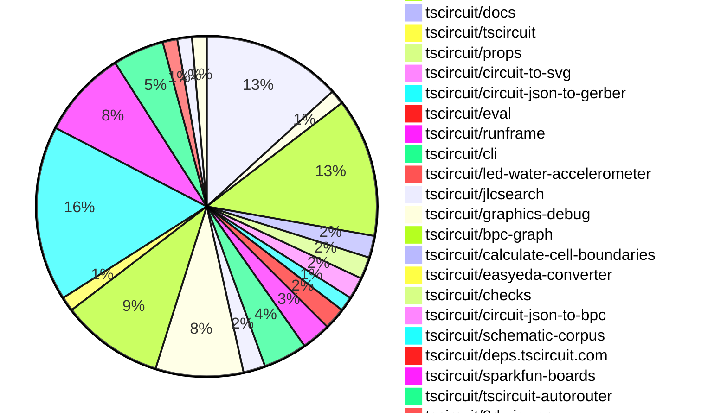
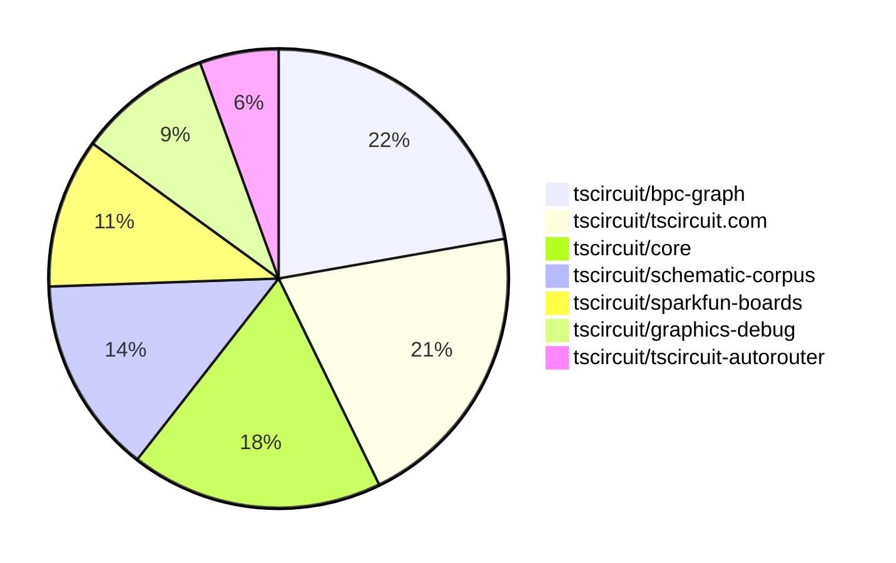

# Contribution Overview 2025-06-25

## PRs by Repository

## Contributor Overview

| Contributor | 🐳 Major | 🐙 Minor | 🐌 Tiny | ⭐ | Issues Created | Discussion Contributions |
|-------------|---------|---------|---------|-----|----------------|--------------------------|
| [seveibar](#seveibar) | 13 | 7 | 31 | ⭐⭐⭐ | 5 | 0🔹 0🔶 0💎 |
| [imrishabh18](#imrishabh18) | 2 | 3 | 16 | ⭐⭐ | 1 | 0🔹 0🔶 0💎 |
| [ArnavK-09](#ArnavK-09) | 5 | 1 | 9 | ⭐⭐ | 7 | 0🔹 0🔶 0💎 |
| [ShiboSoftwareDev](#ShiboSoftwareDev) | 2 | 3 | 6 | ⭐⭐ | 7 | 0🔹 0🔶 0💎 |
| [Anshgrover23](#Anshgrover23) | 1 | 0 | 20 | ⭐⭐ | 9 | 0🔹 0🔶 0💎 |
| [Abse2001](#Abse2001) | 1 | 1 | 9 | ⭐⭐ | 1 | 0🔹 0🔶 0💎 |
| [techmannih](#techmannih) | 0 | 1 | 13 | ⭐⭐ | 2 | 0🔹 0🔶 0💎 |
| [ricohageman](#ricohageman) | 1 | 0 | 0 |  | 0 | 0🔹 0🔶 0💎 |
| [MustafaMulla29](#MustafaMulla29) | 0 | 1 | 2 |  | 6 | 0🔹 0🔶 0💎 |
| [andrii-balitskyi](#andrii-balitskyi) | 0 | 1 | 0 |  | 0 | 0🔹 0🔶 0💎 |
| [tscircuitbot](#tscircuitbot) | 0 | 0 | 1 |  | 0 | 0🔹 0🔶 0💎 |

### Discussion Contribution Legend

- 🔹 Normal Comments: Basic participation with minimal effort
- 🔶 Great Informative Comments: Thoughtful participation that adds value
- 💎 Incredible Comments: Exceptional participation with high-quality content

## Review Table

[reviews-received-hover]: ## "Number of reviews received for PRs for this contributor"
[approvals-received-hover]: ## "Number of approvals received for PRs this contributor authored"
[rejections-received-hover]: ## "Number of rejections received for PRs this contributor authored"
[prs-opened-hover]: ## "Number of PRs opened by this contributor"
[issues-created-hover]: ## "Number of issues created by this contributor"
[bountied-issues-hover]: ## "Number of issues this contributor created with a bounty"
[bountied-issue-$-hover]: ## "Total bounty amount placed on issues authored by this contributor"

| Contributor | Reviews Received | Approvals Received | Rejections Received | Approvals | Rejections | PRs Opened | PRs Merged | Issues Created | Bountied Issues | Bountied Issue $ |
|---|---|---|---|---|---|---|---|---|---|---|
| [seveibar](#seveibar) | 6 | 1 | 0 | 41 | 4 | 66 | 51 | 5 | 2 | 50 |
| [imrishabh18](#imrishabh18) | 18 | 9 | 0 | 9 | 2 | 23 | 21 | 1 | 0 | 0 |
| [graphite-app[bot]](#graphite-app[bot]) | 0 | 0 | 0 | 0 | 0 | 0 | 0 | 0 | 0 | 0 |
| [techmannih](#techmannih) | 47 | 20 | 7 | 1 | 4 | 26 | 14 | 2 | 0 | 0 |
| [Anshgrover23](#Anshgrover23) | 30 | 21 | 4 | 3 | 6 | 25 | 21 | 9 | 0 | 0 |
| [ShiboSoftwareDev](#ShiboSoftwareDev) | 12 | 9 | 0 | 13 | 2 | 15 | 11 | 7 | 1 | 5 |
| [MustafaMulla29](#MustafaMulla29) | 8 | 3 | 4 | 0 | 0 | 7 | 3 | 6 | 0 | 0 |
| [ArnavK-09](#ArnavK-09) | 22 | 14 | 1 | 2 | 0 | 17 | 15 | 7 | 0 | 0 |
| [Abse2001](#Abse2001) | 5 | 3 | 1 | 13 | 0 | 13 | 11 | 1 | 0 | 0 |
| [andrii-balitskyi](#andrii-balitskyi) | 2 | 1 | 1 | 0 | 0 | 2 | 1 | 0 | 0 | 0 |
| [tscircuitbot](#tscircuitbot) | 0 | 0 | 0 | 0 | 0 | 32 | 1 | 0 | 0 | 0 |
| [ricohageman](#ricohageman) | 1 | 1 | 0 | 0 | 0 | 1 | 1 | 0 | 0 | 0 |
| [cursor[bot]](#cursor[bot]) | 0 | 0 | 0 | 0 | 0 | 0 | 0 | 0 | 0 | 0 |

## Top 7 Repositories by Contribution Points

## Changes by Repository

### [tscircuit/core](https://github.com/tscircuit/core)

| PR # | Impact | Contributor | Description |
|------|--------|-------------|-------------|
| [#1002](https://github.com/tscircuit/core/pull/1002) | 🐳 Major | imrishabh18 | Fixes the issue where multiple traces could be created between the same pins in a subcircuit, ensuring that only necessary traces are routed. |
| [#1016](https://github.com/tscircuit/core/pull/1016) | 🐳 Major | seveibar | Rewrite match adapt to use BPC graphs, route traces in matchAdapt mode, and work in progress on layout. |
| [#1000](https://github.com/tscircuit/core/pull/1000) | 🐳 Major | ShiboSoftwareDev | Adds functionality to generate obstacles for cutout components in PCB designs, including rectangles, circles, and polygons. |
| [#1004](https://github.com/tscircuit/core/pull/1004) | 🐙 Minor | seveibar | Fixes the netlabel center offset calculation based on the anchor position and side, ensuring accurate placement of netlabels in schematics. |
| [#1003](https://github.com/tscircuit/core/pull/1003) | 🐙 Minor | seveibar | Fixes incorrect net IDs on schematic net labels, ensuring proper association with the corresponding nets. |
| [#1008](https://github.com/tscircuit/core/pull/1008) | 🐙 Minor | ShiboSoftwareDev | Fixes the calculation of the board center based on the outline dimensions, ensuring accurate positioning of the PCB. |
| [#1014](https://github.com/tscircuit/core/pull/1014) | 🐙 Minor | techmannih | Adds a new test for the <testpoint /> component with netlabels and updates the schematic symbol version. |

🐌 Tiny Contributions (12)

| PR # | Impact | Contributor | Description |
|------|--------|-------------|-------------|
| [#1013](https://github.com/tscircuit/core/pull/1013) | 🐌 Tiny | imrishabh18 | Locks the css-select package version to `5.1.0` to prevent breaking changes in types from newer versions. |
| [#998](https://github.com/tscircuit/core/pull/998) | 🐌 Tiny | imrishabh18 | Adds functionality to print board information (project name, version, URL) to the silkscreen layer of the PCB if specified in the platform configuration. |
| [#997](https://github.com/tscircuit/core/pull/997) | 🐌 Tiny | imrishabh18 | Reproduces a bug where multiple traces are created between the same pins inside a subcircuit, aiding in the identification and resolution of the issue. |
| [#992](https://github.com/tscircuit/core/pull/992) | 🐌 Tiny | imrishabh18 | Modifies the SolderJumper component to handle the props.symbolName for schematic symbol naming. |
| [#989](https://github.com/tscircuit/core/pull/989) | 🐌 Tiny | imrishabh18 | Adds support for a new `bridged` prop in the `SolderJumper` component, allowing for the connection of all pins when the prop is set to true, and updates test coverage for this new behavior. |
| [#1015](https://github.com/tscircuit/core/pull/1015) | 🐌 Tiny | seveibar | Adds support for schOrientation mapping to schematic symbol rotation and introduces tests for polarized capacitor orientations. |
| [#1005](https://github.com/tscircuit/core/pull/1005) | 🐌 Tiny | seveibar | Removes the TODO placeholder from the PrimitiveComponent name getter and ensures NormalComponent footprint generation uses a fallback name. |
| [#976](https://github.com/tscircuit/core/pull/976) | 🐌 Tiny | seveibar | Fixes net label orientation based on connected ports to ensure correct positioning in schematic layouts. |
| [#995](https://github.com/tscircuit/core/pull/995) | 🐌 Tiny | Anshgrover23 | Adds a test for the <Led/> component to verify connections to GND and VCC. |
| [#999](https://github.com/tscircuit/core/pull/999) | 🐌 Tiny | ShiboSoftwareDev | Updates the footprinter dependency version from 0.0.182 to 0.0.186 and fixes floating-point precision issues in test cases related to component dimensions. |
| [#1009](https://github.com/tscircuit/core/pull/1009) | 🐌 Tiny | MustafaMulla29 | Adds a test to reproduce jumper netlabel connection behavior in the circuit rendering. |
| [#996](https://github.com/tscircuit/core/pull/996) | 🐌 Tiny | Abse2001 | Adds support for Test Point selectors in the selector module, allowing access to pins like sel.TP1.pin1. |

### [tscircuit/parts-engine](https://github.com/tscircuit/parts-engine)

| PR # | Impact | Contributor | Description |
|------|--------|-------------|-------------|
| [#9](https://github.com/tscircuit/parts-engine/pull/9) | 🐳 Major | imrishabh18 | Fixes the search functionality to correctly use the displayed resistance and capacitance values instead of the absolute values, improving accuracy in component retrieval. |

🐌 Tiny Contributions (1)

| PR # | Impact | Contributor | Description |
|------|--------|-------------|-------------|
| [#8](https://github.com/tscircuit/parts-engine/pull/8) | 🐌 Tiny | Anshgrover23 | Fixes a bug where undefined fuses would cause errors in the findPart function by ensuring that an empty array is used instead of undefined. |

### [tscircuit/tscircuit.com](https://github.com/tscircuit/tscircuit.com)

| PR # | Impact | Contributor | Description |
|------|--------|-------------|-------------|
| [#1325](https://github.com/tscircuit/tscircuit.com/pull/1325) | 🐳 Major | seveibar | Caches default TypeScript libraries using IndexedDB and loads them when the CodeEditor mounts, enhancing performance and reducing load times. |
| [#1388](https://github.com/tscircuit/tscircuit.com/pull/1388) | 🐳 Major | ArnavK-09 | Adds a global find and replace feature to the code editor, allowing users to search and replace text across multiple files using a dedicated interface. |
| [#1382](https://github.com/tscircuit/tscircuit.com/pull/1382) | 🐳 Major | ArnavK-09 | Adds a native share option for users to share package details via the device's share functionality. |
| [#1378](https://github.com/tscircuit/tscircuit.com/pull/1378) | 🐳 Major | ArnavK-09 | Revamps the Cmd+K menu to enhance user experience with improved search functionality and UI components. |
| [#1372](https://github.com/tscircuit/tscircuit.com/pull/1372) | 🐳 Major | ArnavK-09 | Adds a toggle button for enabling/disabling a mock AI autocomplete feature in the CodeEditorHeader component. |
| [#1371](https://github.com/tscircuit/tscircuit.com/pull/1371) | 🐙 Minor | imrishabh18 | Sorts the fetched packages on the dashboard page based on their updated or created date. |
| [#1370](https://github.com/tscircuit/tscircuit.com/pull/1370) | 🐙 Minor | imrishabh18 | Avoids mutating cached package list when sorting on the dashboard. |
| [#1368](https://github.com/tscircuit/tscircuit.com/pull/1368) | 🐙 Minor | andrii-balitskyi | Fixes the loading state for AI review requests by showing a loading spinner immediately after the request is made and maintaining the local loading state during the request process. |

🐌 Tiny Contributions (11)

| PR # | Impact | Contributor | Description |
|------|--------|-------------|-------------|
| [#1394](https://github.com/tscircuit/tscircuit.com/pull/1394) | 🐌 Tiny | imrishabh18 | Updates the version of the @tscircuit/runframe package from 0.0.647 to 0.0.653 in package.json. |
| [#1393](https://github.com/tscircuit/tscircuit.com/pull/1393) | 🐌 Tiny | imrishabh18 | Adds a tooltip to the AI autocomplete button to describe its functionality for users. |
| [#1389](https://github.com/tscircuit/tscircuit.com/pull/1389) | 🐌 Tiny | Anshgrover23 | Updates the circuit-to-svg dependency version from 0.0.160 to 0.0.163 in package.json. |
| [#1395](https://github.com/tscircuit/tscircuit.com/pull/1395) | 🐌 Tiny | techmannih | Updates the version of the @tscircuit/footprinter dependency from ^0.0.176 to ^0.0.186 in package.json. |
| [#1387](https://github.com/tscircuit/tscircuit.com/pull/1387) | 🐌 Tiny | ArnavK-09 | Updates various dependencies in the package.json file to their latest versions. |
| [#1384](https://github.com/tscircuit/tscircuit.com/pull/1384) | 🐌 Tiny | ArnavK-09 | This PR updates the RunFrame component and limits the optimal size of the editor and RunFrame to improve layout consistency and usability. |
| [#1383](https://github.com/tscircuit/tscircuit.com/pull/1383) | 🐌 Tiny | ArnavK-09 | Removes extra spacing in the CmdKMenu component, improving the visual layout of the menu items. |
| [#1381](https://github.com/tscircuit/tscircuit.com/pull/1381) | 🐌 Tiny | ArnavK-09 | Prevents navigation to a 404 page when a package is still loading by checking if the package ID is available before proceeding with the navigation. |
| [#1379](https://github.com/tscircuit/tscircuit.com/pull/1379) | 🐌 Tiny | ArnavK-09 | Fixes layout issues on the Package Build Details Page to enhance responsiveness across different screen sizes. |
| [#1374](https://github.com/tscircuit/tscircuit.com/pull/1374) | 🐌 Tiny | ArnavK-09 | Changes the settings dialog to check for GitHub username instead of account ID to ensure correct display of user information locally. |
| [#1373](https://github.com/tscircuit/tscircuit.com/pull/1373) | 🐌 Tiny | ArnavK-09 | This PR restricts the ability to generate AI reviews to only the package owner, enhancing security by preventing unauthorized users from accessing this functionality. |

### [tscircuit/docs](https://github.com/tscircuit/docs)

| PR # | Impact | Contributor | Description |
|------|--------|-------------|-------------|
| [#93](https://github.com/tscircuit/docs/pull/93) | 🐙 Minor | imrishabh18 | Adds YouTube video demos for manual edits in the schematic and PCB viewer, replacing TODO notes with embedded videos. |

🐌 Tiny Contributions (2)

| PR # | Impact | Contributor | Description |
|------|--------|-------------|-------------|
| [#94](https://github.com/tscircuit/docs/pull/94) | 🐌 Tiny | seveibar | Documents the `schOrientation` property for polarized capacitors, explaining how to orient them in schematics. |
| [#92](https://github.com/tscircuit/docs/pull/92) | 🐌 Tiny | seveibar | Documents the usage of `sel.net` under new selector documentation, providing examples for grouping typed nets alongside other reusable selectors. |

### [tscircuit/tscircuit](https://github.com/tscircuit/tscircuit)

🐌 Tiny Contributions (1)

| PR # | Impact | Contributor | Description |
|------|--------|-------------|-------------|
| [#694](https://github.com/tscircuit/tscircuit/pull/694) | 🐌 Tiny | imrishabh18 | Updates the versions of the core and eval packages in the project dependencies. |

### [tscircuit/props](https://github.com/tscircuit/props)

| PR # | Impact | Contributor | Description |
|------|--------|-------------|-------------|
| [#308](https://github.com/tscircuit/props/pull/308) | 🐙 Minor | seveibar | Extends CommonComponentProps with a new optional pinAttributes field and propagates pin label generics to several component prop interfaces. |

🐌 Tiny Contributions (2)

| PR # | Impact | Contributor | Description |
|------|--------|-------------|-------------|
| [#307](https://github.com/tscircuit/props/pull/307) | 🐌 Tiny | imrishabh18 | Adds board information fields to the PlatformConfig interface and documents these options in the README. |
| [#304](https://github.com/tscircuit/props/pull/304) | 🐌 Tiny | Anshgrover23 | Adds a connections property to the LED component, allowing for the specification of electrical connections such as anode and cathode, enhancing the component's configurability. |

### [tscircuit/circuit-to-svg](https://github.com/tscircuit/circuit-to-svg)

🐌 Tiny Contributions (3)

| PR # | Impact | Contributor | Description |
|------|--------|-------------|-------------|
| [#268](https://github.com/tscircuit/circuit-to-svg/pull/268) | 🐌 Tiny | imrishabh18 | Adds support for newline characters in PCB silkscreen text by creating a <tspan> for each line and includes a test for this functionality. |
| [#276](https://github.com/tscircuit/circuit-to-svg/pull/276) | 🐌 Tiny | seveibar | Removes overline styling from net labels and reduces font size for pin labels that previously had overline styling applied. |
| [#270](https://github.com/tscircuit/circuit-to-svg/pull/270) | 🐌 Tiny | ShiboSoftwareDev | Adds rendering support for pads, pins, and holes in the assembly SVG output. |

### [tscircuit/circuit-json-to-gerber](https://github.com/tscircuit/circuit-json-to-gerber)

🐌 Tiny Contributions (2)

| PR # | Impact | Contributor | Description |
|------|--------|-------------|-------------|
| [#45](https://github.com/tscircuit/circuit-json-to-gerber/pull/45) | 🐌 Tiny | imrishabh18 | Fixes incorrect handling of silkscreen text anchor alignment in Gerber output by adding support for the `anchor_side` property and includes tests to verify the behavior. |
| [#44](https://github.com/tscircuit/circuit-json-to-gerber/pull/44) | 🐌 Tiny | seveibar | Adds support for nine text anchors in Gerber conversion, allowing for more precise placement of silkscreen text on circuit boards. |

### [tscircuit/eval](https://github.com/tscircuit/eval)

🐌 Tiny Contributions (3)

| PR # | Impact | Contributor | Description |
|------|--------|-------------|-------------|
| [#624](https://github.com/tscircuit/eval/pull/624) | 🐌 Tiny | imrishabh18 | Updates the parts-engine dependency from version 0.0.3 to 0.0.8 and adds a capacitor component to the test suite for enhanced functionality. |
| [#608](https://github.com/tscircuit/eval/pull/608) | 🐌 Tiny | imrishabh18 | Updates the @tscircuit/core dependency version from 0.0.510 to 0.0.526 in package.json |
| [#619](https://github.com/tscircuit/eval/pull/619) | 🐌 Tiny | tscircuitbot | Updates the @tscircuit/core dependency from version 0.0.526 to 0.0.532 and updates the schematic-symbols dependency from version 0.0.163 to 0.0.165. |

### [tscircuit/runframe](https://github.com/tscircuit/runframe)

| PR # | Impact | Contributor | Description |
|------|--------|-------------|-------------|
| [#824](https://github.com/tscircuit/runframe/pull/824) | 🐳 Major | ArnavK-09 | Fixes the issue where the active tab does not persist when an error occurs, ensuring users return to their last active tab after resolving the error. |
| [#820](https://github.com/tscircuit/runframe/pull/820) | 🐙 Minor | ArnavK-09 | 
 |

🐌 Tiny Contributions (2)

| PR # | Impact | Contributor | Description |
|------|--------|-------------|-------------|
| [#830](https://github.com/tscircuit/runframe/pull/830) | 🐌 Tiny | imrishabh18 | Fixes the issue where RunFrame pulls the latest version of @tscircuit/eval instead of a specific version, ensuring that the most up-to-date version is used when preloading the web worker. |
| [#823](https://github.com/tscircuit/runframe/pull/823) | 🐌 Tiny | ArnavK-09 | # before / after

 |

### [tscircuit/cli](https://github.com/tscircuit/cli)

| PR # | Impact | Contributor | Description |
|------|--------|-------------|-------------|
| [#250](https://github.com/tscircuit/cli/pull/250) | 🐳 Major | ShiboSoftwareDev | Adds the ability to ignore circuitJson errors during the build process when the --ignore-errors flag is used, allowing builds to continue despite errors. |

🐌 Tiny Contributions (5)

| PR # | Impact | Contributor | Description |
|------|--------|-------------|-------------|
| [#252](https://github.com/tscircuit/cli/pull/252) | 🐌 Tiny | imrishabh18 | Updates the versions of the @tscircuit/eval and tscircuit dependencies in package.json from 0.0.238 to 0.0.240 and from 0.0.505 to 0.0.510 respectively. |
| [#253](https://github.com/tscircuit/cli/pull/253) | 🐌 Tiny | seveibar | Fixes the CLI build process to utilize the peer dependency of tscircuit, preventing the bundling of core, eval, and tscircuit packages, which ensures compatibility with user-installed versions. |
| [#255](https://github.com/tscircuit/cli/pull/255) | 🐌 Tiny | Anshgrover23 | Updates the versions of the 'circuit-to-svg' and '@tscircuit/runframe' dependencies in the package.json file. |
| [#251](https://github.com/tscircuit/cli/pull/251) | 🐌 Tiny | ShiboSoftwareDev | Updates GitHub workflows to use Node.js version 22 for improved compatibility and performance. |
| [#254](https://github.com/tscircuit/cli/pull/254) | 🐌 Tiny | ArnavK-09 | Updates dependencies and adjusts RunFrame for height adjustments, ensuring compatibility with the latest versions of related packages. |

### [tscircuit/led-water-accelerometer](https://github.com/tscircuit/led-water-accelerometer)

🐌 Tiny Contributions (1)

| PR # | Impact | Contributor | Description |
|------|--------|-------------|-------------|
| [#3](https://github.com/tscircuit/led-water-accelerometer/pull/3) | 🐌 Tiny | imrishabh18 | Adds mounting holes and connects the Pico's VBUS to the V5 net in the circuit board design. |

### [tscircuit/jlcsearch](https://github.com/tscircuit/jlcsearch)

| PR # | Impact | Contributor | Description |
|------|--------|-------------|-------------|
| [#61](https://github.com/tscircuit/jlcsearch/pull/61) | 🐳 Major | seveibar | Adds measurement flags for various gases that each gas sensor can detect, exposes these flags from the gas sensors list endpoint, and regenerates database types accordingly. |

🐌 Tiny Contributions (2)

| PR # | Impact | Contributor | Description |
|------|--------|-------------|-------------|
| [#62](https://github.com/tscircuit/jlcsearch/pull/62) | 🐌 Tiny | seveibar | Adds a measurement query parameter and filter logic for gas sensors, allowing users to filter gas sensors based on specific measurements such as air quality, CO2, and others. |
| [#60](https://github.com/tscircuit/jlcsearch/pull/60) | 🐌 Tiny | seveibar | Adds a new page for Boost DC-DC converters, including a derived table, API endpoint, and tests for the new functionality. |

### [tscircuit/graphics-debug](https://github.com/tscircuit/graphics-debug)

| PR # | Impact | Contributor | Description |
|------|--------|-------------|-------------|
| [#60](https://github.com/tscircuit/graphics-debug/pull/60) | 🐳 Major | seveibar | Adds `stackGraphicsHorizontally` and `stackGraphicsVertically` functions to combine graphics by translation, exports these helpers, documents their usage in README, and includes tests for the new utilities. |
| [#65](https://github.com/tscircuit/graphics-debug/pull/65) | 🐙 Minor | seveibar | Fixes the Y offset when creating a graphics grid so rows are not reversed and updates tests for the new grid orientation. |
| [#58](https://github.com/tscircuit/graphics-debug/pull/58) | 🐙 Minor | seveibar | Adds support for rendering text objects in SVG output and canvas, including merging, translating, and updating bounds for texts, and enabling texts in InteractiveGraphics components. |

🐌 Tiny Contributions (9)

| PR # | Impact | Contributor | Description |
|------|--------|-------------|-------------|
| [#68](https://github.com/tscircuit/graphics-debug/pull/68) | 🐌 Tiny | seveibar | Adds a titles option to the stackGraphicsHorizontally function, allowing users to specify titles for each graphic in a horizontal stack, and includes documentation and snapshot tests for this feature. |
| [#67](https://github.com/tscircuit/graphics-debug/pull/67) | 🐌 Tiny | seveibar | Changes the default value of `includeTextLabels` to `false` in the SVG generation function, adjusting tests accordingly. |
| [#64](https://github.com/tscircuit/graphics-debug/pull/64) | 🐌 Tiny | seveibar | Aligns rectangle label text to the top of the rectangle and increases the label size by 3x, while also updating the test expectations and the @types/bun dependency version. |
| [#66](https://github.com/tscircuit/graphics-debug/pull/66) | 🐌 Tiny | seveibar | Allows customizing SVG width and height in the getSvgFromGraphicsObject function. |
| [#63](https://github.com/tscircuit/graphics-debug/pull/63) | 🐌 Tiny | seveibar | Calculates a dynamic font size for rectangle labels based on their dimensions and tests the label font sizing functionality. |
| [#62](https://github.com/tscircuit/graphics-debug/pull/62) | 🐌 Tiny | seveibar | Adds options to specify gaps when generating graphics grids, allowing for gap fractions relative to cell width. |
| [#61](https://github.com/tscircuit/graphics-debug/pull/61) | 🐌 Tiny | seveibar | Adds a new method to arrange graphics objects in a grid layout based on specified cell dimensions. |
| [#59](https://github.com/tscircuit/graphics-debug/pull/59) | 🐌 Tiny | seveibar | Adjusts text sizing logic to account for text width/height when computing bounds, scales font sizes using a transform matrix, exposes font size ratios, and adds tests for new behavior while adjusting existing tests. |
| [#57](https://github.com/tscircuit/graphics-debug/pull/57) | 🐌 Tiny | seveibar | Adds a new utility function `mergeGraphics` to combine two graphics objects, along with tests and documentation updates. |

### [tscircuit/bpc-graph](https://github.com/tscircuit/bpc-graph)

| PR # | Impact | Contributor | Description |
|------|--------|-------------|-------------|
| [#20](https://github.com/tscircuit/bpc-graph/pull/20) | 🐳 Major | seveibar | Adds examples and utilities for calculating and visualizing the Weisfeiler-Leman distance between BPC graphs, along with rendering capabilities for flat BPC graphs. |
| [#12](https://github.com/tscircuit/bpc-graph/pull/12) | 🐳 Major | seveibar | Introduces a renetworking function that allows for heuristic graph cuts based on pin connections, improving the WL Distance scoring for matches in the BPC graph. |
| [#11](https://github.com/tscircuit/bpc-graph/pull/11) | 🐳 Major | seveibar | Introduces functionality to partition a graph into subgraphs based on box sides, enhancing the ability to manage and manipulate circuit layouts. |
| [#10](https://github.com/tscircuit/bpc-graph/pull/10) | 🐳 Major | seveibar | Adds utilities to build and merge subgraphs for box sides, detect connected groups of box sides, and test for isolated box sides. |
| [#8](https://github.com/tscircuit/bpc-graph/pull/8) | 🐳 Major | seveibar | - **page tweaking**
- **more work on improving graphics representation for the matching/distance debugging**
- **more visualization for matching**
- **setup for simple edit operations setup** |
| [#7](https://github.com/tscircuit/bpc-graph/pull/7) | 🐳 Major | seveibar | - **Operation Costs, Solve for Graph Transform with A*, heuristic matching function (#2)**
- **v0.0.7**
- **rewrite test input to make a color change more reasonable**
- **v0.0.8**
- **feat: add corpus matcher page**
- **fix corpus matching page**
- **tailwind loading**
- **add mouse hover**
- **corpus match with hovering**
- **remove other bpc matching page**
- **add match button**
- **add preview for texxt area**
- **v0.0.9**
- **add "adapted match" display on the corpus match page**
- **add ignoreTopMatch, possibly fix adaptation**
- **fix ignore top match logic**
- **introduce placeholder test**
- **repro infinite load bug**
- **v0.0.10**
- **Match-Adapt against Corpus (#5)**
- **v0.0.11**
- **Flat BPC Graph (#6)**
- **working on adjacency matrix**
- **add getComparisonGraphics and start eigenvec comparison suite**
- **get comparison svg working**
- **flat bpc construction**
- **adjacency matrix**
- **more readable matrices |
| [#6](https://github.com/tscircuit/bpc-graph/pull/6) | 🐳 Major | seveibar | Introduces a new flat BPC graph type and refactors related similarity distance calculations to improve graph transformation operations. |
| [#5](https://github.com/tscircuit/bpc-graph/pull/5) | 🐳 Major | seveibar | Adds a corpus matcher page that allows users to match and adapt graphs based on heuristic similarity, including features like mouse hover and a match button. |
| [#18](https://github.com/tscircuit/bpc-graph/pull/18) | 🐙 Minor | seveibar | Fixes the floating box assignment logic to ensure proper positioning of floating boxes in the graph layout. |
| [#9](https://github.com/tscircuit/bpc-graph/pull/9) | 🐙 Minor | seveibar | Fixes issues in net adaptation logic and adds snapshot tests for better validation of graph adaptations. |

🐌 Tiny Contributions (4)

| PR # | Impact | Contributor | Description |
|------|--------|-------------|-------------|
| [#19](https://github.com/tscircuit/bpc-graph/pull/19) | 🐌 Tiny | seveibar | Adds a new function to merge two subgraphs into a single graph and includes a corresponding test for visual verification. |
| [#17](https://github.com/tscircuit/bpc-graph/pull/17) | 🐌 Tiny | seveibar | Adds a detailed example of renetworking in the README, including code snippets and visual representations to aid user understanding. |
| [#13](https://github.com/tscircuit/bpc-graph/pull/13) | 🐌 Tiny | seveibar | Adds documentation for the library API and basic usage in the README, along with snapshot-based example tests under `tests/readme`. |
| [#4](https://github.com/tscircuit/bpc-graph/pull/4) | 🐌 Tiny | seveibar | Adds a new page for comparing a BPC graph against the schematic corpus using the @tscircuit/schematic-corpus dependency. |

### [tscircuit/calculate-cell-boundaries](https://github.com/tscircuit/calculate-cell-boundaries)

| PR # | Impact | Contributor | Description |
|------|--------|-------------|-------------|
| [#7](https://github.com/tscircuit/calculate-cell-boundaries/pull/7) | 🐳 Major | seveibar | ## Summary
- move algorithm internals out of `claude` folder
- rename `types.ts` used inside the algorithm to `internalTypes.ts`
- update imports across the library
- rename example component to `cell-boundaries.tsx`

## Testing
- `bun test tests` |

### [tscircuit/easyeda-converter](https://github.com/tscircuit/easyeda-converter)

🐌 Tiny Contributions (2)

| PR # | Impact | Contributor | Description |
|------|--------|-------------|-------------|
| [#270](https://github.com/tscircuit/easyeda-converter/pull/270) | 🐌 Tiny | seveibar | Adds support for converting vias to TSX format in the generateFootprintTsx function, including a test for a specific component with vias. |
| [#269](https://github.com/tscircuit/easyeda-converter/pull/269) | 🐌 Tiny | seveibar | ## Summary
- add `ViaSchema` to support VIA shapes in packages
- convert VIA elements to pcb_via
- add test for part C46497 which includes VIA
- add snapshot test for pcb vias

## Testing
- `bun test tests/parse-tests/parse-c46497.test.ts`
- `BUN_UPDATE_SNAPSHOTS=1 bun test tests/convert-to-soup-tests/c46497.test.ts` |

### [tscircuit/checks](https://github.com/tscircuit/checks)

🐌 Tiny Contributions (1)

| PR # | Impact | Contributor | Description |
|------|--------|-------------|-------------|
| [#52](https://github.com/tscircuit/checks/pull/52) | 🐌 Tiny | seveibar | Adds a new utility function `runAllChecks` that executes multiple PCB checks on provided circuit code and validates the results with unit tests. |

### [tscircuit/circuit-json-to-bpc](https://github.com/tscircuit/circuit-json-to-bpc)

🐌 Tiny Contributions (1)

| PR # | Impact | Contributor | Description |
|------|--------|-------------|-------------|
| [#2](https://github.com/tscircuit/circuit-json-to-bpc/pull/2) | 🐌 Tiny | seveibar | Adds functionality to convert schematic net labels into boxes with pins in the BPC graph, along with tests for this conversion. |

### [tscircuit/schematic-corpus](https://github.com/tscircuit/schematic-corpus)

| PR # | Impact | Contributor | Description |
|------|--------|-------------|-------------|
| [#14](https://github.com/tscircuit/schematic-corpus/pull/14) | 🐙 Minor | Abse2001 | Fixes the schottky_diode symbol rendering issue in the schematic. |

🐌 Tiny Contributions (23)

| PR # | Impact | Contributor | Description |
|------|--------|-------------|-------------|
| [#37](https://github.com/tscircuit/schematic-corpus/pull/37) | 🐌 Tiny | seveibar | Adds a new site for displaying BPC graphs with improved SVG handling and mouse hover support. |
| [#25](https://github.com/tscircuit/schematic-corpus/pull/25) | 🐌 Tiny | seveibar | Adds functionality to generate SVG graphics for BPC graphs based on circuit JSON input. |
| [#11](https://github.com/tscircuit/schematic-corpus/pull/11) | 🐌 Tiny | seveibar | Updates the BPC generation process to include netlabels, enhancing the clarity and organization of circuit schematics. |
| [#36](https://github.com/tscircuit/schematic-corpus/pull/36) | 🐌 Tiny | Anshgrover23 | Creates a new schematic design in the tscircuit/schematic-corpus repository |
| [#34](https://github.com/tscircuit/schematic-corpus/pull/34) | 🐌 Tiny | Anshgrover23 | Creates a new schematic design in the tscircuit/schematic-corpus repository |
| [#32](https://github.com/tscircuit/schematic-corpus/pull/32) | 🐌 Tiny | Anshgrover23 | Creates a new schematic design in the tscircuit/schematic-corpus repository |
| [#24](https://github.com/tscircuit/schematic-corpus/pull/24) | 🐌 Tiny | Anshgrover23 | Adds a new circuit design (design022) including a power net, a solder jumper, a resistor, and an LED to the schematic corpus. |
| [#22](https://github.com/tscircuit/schematic-corpus/pull/22) | 🐌 Tiny | Anshgrover23 | Creates a new schematic design in the tscircuit/schematic-corpus repository |
| [#10](https://github.com/tscircuit/schematic-corpus/pull/10) | 🐌 Tiny | Anshgrover23 | Creates a new schematic design (design 18) in the tscircuit/schematic-corpus repository. |
| [#35](https://github.com/tscircuit/schematic-corpus/pull/35) | 🐌 Tiny | techmannih | Creates a new schematic design in the tscircuit/schematic-corpus repository |
| [#33](https://github.com/tscircuit/schematic-corpus/pull/33) | 🐌 Tiny | techmannih | Creates a new schematic design in the tscircuit/schematic-corpus repository |
| [#31](https://github.com/tscircuit/schematic-corpus/pull/31) | 🐌 Tiny | techmannih | Adds a new netlabel for GND and modifies existing netlabels and pin arrangements in design025. |
| [#27](https://github.com/tscircuit/schematic-corpus/pull/27) | 🐌 Tiny | techmannih | Creates a new schematic design in the tscircuit/schematic-corpus repository |
| [#26](https://github.com/tscircuit/schematic-corpus/pull/26) | 🐌 Tiny | techmannih | Creates a new schematic design in the tscircuit/schematic-corpus repository |
| [#21](https://github.com/tscircuit/schematic-corpus/pull/21) | 🐌 Tiny | techmannih | Creates a new schematic design in the tscircuit/schematic-corpus repository |
| [#20](https://github.com/tscircuit/schematic-corpus/pull/20) | 🐌 Tiny | Abse2001 | Adds a new circuit design (design019) with multiple net labels and connections for a chip (U1) in the schematic corpus. |
| [#19](https://github.com/tscircuit/schematic-corpus/pull/19) | 🐌 Tiny | Abse2001 | Adds a new circuit design with updated net labels and connections in the schematic. |
| [#18](https://github.com/tscircuit/schematic-corpus/pull/18) | 🐌 Tiny | Abse2001 | Adds a new circuit design component with specific net labels and connections for a schematic representation. |
| [#17](https://github.com/tscircuit/schematic-corpus/pull/17) | 🐌 Tiny | Abse2001 | Adds a new circuit design component with a specific chip configuration and net labels for connections in the schematic. |
| [#16](https://github.com/tscircuit/schematic-corpus/pull/16) | 🐌 Tiny | Abse2001 | Adds a new circuit design featuring a switch, capacitor, and resistor with net labels for connections in the schematic corpus. |
| [#15](https://github.com/tscircuit/schematic-corpus/pull/15) | 🐌 Tiny | Abse2001 | Adds a new circuit design component with a switch and net labels for BOOT0 and V3_3 connections. |
| [#13](https://github.com/tscircuit/schematic-corpus/pull/13) | 🐌 Tiny | Abse2001 | Adds a new schematic design with capacitors and net labels for a circuit board. |
| [#12](https://github.com/tscircuit/schematic-corpus/pull/12) | 🐌 Tiny | Abse2001 | Adds a new circuit design featuring a crystal oscillator and capacitors with specific placements and connections in the schematic. |

### [tscircuit/deps.tscircuit.com](https://github.com/tscircuit/deps.tscircuit.com)

🐌 Tiny Contributions (1)

| PR # | Impact | Contributor | Description |
|------|--------|-------------|-------------|
| [#23](https://github.com/tscircuit/deps.tscircuit.com/pull/23) | 🐌 Tiny | seveibar | Adds the @tscircuit/cli package as a downstream dependency, updates the dependency graph, and includes tests to verify the new package is recognized as downstream. |

### [tscircuit/sparkfun-boards](https://github.com/tscircuit/sparkfun-boards)

| PR # | Impact | Contributor | Description |
|------|--------|-------------|-------------|
| [#18](https://github.com/tscircuit/sparkfun-boards/pull/18) | 🐳 Major | Anshgrover23 | No description provided |
| [#29](https://github.com/tscircuit/sparkfun-boards/pull/29) | 🐳 Major | Abse2001 | Introduces a new circuit board for the SparkFun Transceiver Breakout MAX3232, including its schematic and footprint. |
| [#37](https://github.com/tscircuit/sparkfun-boards/pull/37) | 🐙 Minor | MustafaMulla29 | No description provided |

🐌 Tiny Contributions (9)

| PR # | Impact | Contributor | Description |
|------|--------|-------------|-------------|
| [#33](https://github.com/tscircuit/sparkfun-boards/pull/33) | 🐌 Tiny | Anshgrover23 | Refactors the code by moving the jumper footprint definition into a separate file for better organization and maintainability. |
| [#32](https://github.com/tscircuit/sparkfun-boards/pull/32) | 🐌 Tiny | Anshgrover23 | Adds new scripts for taking and updating snapshots in the package.json file. |
| [#16](https://github.com/tscircuit/sparkfun-boards/pull/16) | 🐌 Tiny | Anshgrover23 | Adds a README file for the SparkFun RFM69 Breakout (915MHz) board, providing a link to the official product page for more information. |
| [#24](https://github.com/tscircuit/sparkfun-boards/pull/24) | 🐌 Tiny | Anshgrover23 | No description provided |
| [#30](https://github.com/tscircuit/sparkfun-boards/pull/30) | 🐌 Tiny | ShiboSoftwareDev | No description provided |
| [#25](https://github.com/tscircuit/sparkfun-boards/pull/25) | 🐌 Tiny | ShiboSoftwareDev | Updates GitHub workflows to run on Node.js version 22 and updates dependencies to their latest versions, ensuring the tsci snapshot workflow functions correctly for verifying changes. |
| [#31](https://github.com/tscircuit/sparkfun-boards/pull/31) | 🐌 Tiny | techmannih | Adds a README file for the SparkFun USB to Serial Breakout FT232RL board, providing a link to the official product page. |
| [#12](https://github.com/tscircuit/sparkfun-boards/pull/12) | 🐌 Tiny | techmannih | Fixes pin labeling and adds MST22D18G2_125 component to the USBToSerialBreakout board. |
| [#21](https://github.com/tscircuit/sparkfun-boards/pull/21) | 🐌 Tiny | MustafaMulla29 | No description provided |

### [tscircuit/tscircuit-autorouter](https://github.com/tscircuit/tscircuit-autorouter)

| PR # | Impact | Contributor | Description |
|------|--------|-------------|-------------|
| [#180](https://github.com/tscircuit/tscircuit-autorouter/pull/180) | 🐳 Major | ricohageman | Fixes caching issue in the unravelMultiSectionSolver by rounding delta values to a higher precision, preventing errors from accumulated rounding. |

🐌 Tiny Contributions (6)

| PR # | Impact | Contributor | Description |
|------|--------|-------------|-------------|
| [#172](https://github.com/tscircuit/tscircuit-autorouter/pull/172) | 🐌 Tiny | Anshgrover23 | Adds additional fixtures for testing the autorouting hypersolver, specifically addressing issues related to bug #134. |
| [#171](https://github.com/tscircuit/tscircuit-autorouter/pull/171) | 🐌 Tiny | Anshgrover23 | Adds additional fixtures for testing autorouting hyperdensity bugs, specifically addressing issues related to node configurations in the autorouting process. |
| [#170](https://github.com/tscircuit/tscircuit-autorouter/pull/170) | 🐌 Tiny | Anshgrover23 | Excludes JSON files from the formatting process in the project configuration, preventing unnecessary formatting changes to these files. |
| [#165](https://github.com/tscircuit/tscircuit-autorouter/pull/165) | 🐌 Tiny | Anshgrover23 | Adds new fixtures for testing the hyperdensity solver to address bugs identified in issue #163. |
| [#168](https://github.com/tscircuit/tscircuit-autorouter/pull/168) | 🐌 Tiny | Anshgrover23 | Adds a new fixture for high density node cn2306 to facilitate testing and debugging of autorouting functionality. |
| [#177](https://github.com/tscircuit/tscircuit-autorouter/pull/177) | 🐌 Tiny | techmannih | Adds high-density fixtures for nodes cn2776 and cn1722, including their respective JSON configurations and testing fixtures. |

### [tscircuit/3d-viewer](https://github.com/tscircuit/3d-viewer)

| PR # | Impact | Contributor | Description |
|------|--------|-------------|-------------|
| [#365](https://github.com/tscircuit/3d-viewer/pull/365) | 🐙 Minor | ShiboSoftwareDev | Fixes rendering issues with JSX board definitions in the Manifold engine by ensuring proper handling of circuitJson and children props. |
| [#364](https://github.com/tscircuit/3d-viewer/pull/364) | 🐙 Minor | ShiboSoftwareDev | Handles cases where the board data is empty, preventing errors during rendering by rendering nothing for the board and showing the components instead. |

### [tscircuit/footprinter](https://github.com/tscircuit/footprinter)

🐌 Tiny Contributions (2)

| PR # | Impact | Contributor | Description |
|------|--------|-------------|-------------|
| [#307](https://github.com/tscircuit/footprinter/pull/307) | 🐌 Tiny | ShiboSoftwareDev | Adds a `nopinlabels` option to the `pinrow` definition and builder, allowing users to skip silkscreen pin labels when set to true. |
| [#306](https://github.com/tscircuit/footprinter/pull/306) | 🐌 Tiny | techmannih | Fixes the 1210 footprint to have taller pads for improved compatibility with components. |

### [tscircuit/schematic-symbols](https://github.com/tscircuit/schematic-symbols)

🐌 Tiny Contributions (2)

| PR # | Impact | Contributor | Description |
|------|--------|-------------|-------------|
| [#316](https://github.com/tscircuit/schematic-symbols/pull/316) | 🐌 Tiny | techmannih | Introduces a new schematic symbol for 'not connected' in multiple orientations. |
| [#315](https://github.com/tscircuit/schematic-symbols/pull/315) | 🐌 Tiny | techmannih | Reduces the size of the testpoint symbol in the schematic representation. |

## Changes by Contributor

### [imrishabh18](https://github.com/imrishabh18)

| PR # | Impact | Description |
|------|--------|-------------|
| [#1002](https://github.com/tscircuit/core/pull/1002) | 🐳 Major | Fixes the issue where multiple traces could be created between the same pins in a subcircuit, ensuring that only necessary traces are routed. |
| [#9](https://github.com/tscircuit/parts-engine/pull/9) | 🐳 Major | Fixes the search functionality to correctly use the displayed resistance and capacitance values instead of the absolute values, improving accuracy in component retrieval. |
| [#1371](https://github.com/tscircuit/tscircuit.com/pull/1371) | 🐙 Minor | Sorts the fetched packages on the dashboard page based on their updated or created date. |
| [#1370](https://github.com/tscircuit/tscircuit.com/pull/1370) | 🐙 Minor | Avoids mutating cached package list when sorting on the dashboard. |
| [#93](https://github.com/tscircuit/docs/pull/93) | 🐙 Minor | Adds YouTube video demos for manual edits in the schematic and PCB viewer, replacing TODO notes with embedded videos. |

🐌 Tiny Contributions (16)

| PR # | Impact | Description |
|------|--------|-------------|
| [#694](https://github.com/tscircuit/tscircuit/pull/694) | 🐌 Tiny | Updates the versions of the core and eval packages in the project dependencies. |
| [#307](https://github.com/tscircuit/props/pull/307) | 🐌 Tiny | Adds board information fields to the PlatformConfig interface and documents these options in the README. |
| [#1013](https://github.com/tscircuit/core/pull/1013) | 🐌 Tiny | Locks the css-select package version to `5.1.0` to prevent breaking changes in types from newer versions. |
| [#998](https://github.com/tscircuit/core/pull/998) | 🐌 Tiny | Adds functionality to print board information (project name, version, URL) to the silkscreen layer of the PCB if specified in the platform configuration. |
| [#997](https://github.com/tscircuit/core/pull/997) | 🐌 Tiny | Reproduces a bug where multiple traces are created between the same pins inside a subcircuit, aiding in the identification and resolution of the issue. |
| [#992](https://github.com/tscircuit/core/pull/992) | 🐌 Tiny | Modifies the SolderJumper component to handle the props.symbolName for schematic symbol naming. |
| [#989](https://github.com/tscircuit/core/pull/989) | 🐌 Tiny | Adds support for a new `bridged` prop in the `SolderJumper` component, allowing for the connection of all pins when the prop is set to true, and updates test coverage for this new behavior. |
| [#268](https://github.com/tscircuit/circuit-to-svg/pull/268) | 🐌 Tiny | Adds support for newline characters in PCB silkscreen text by creating a <tspan> for each line and includes a test for this functionality. |
| [#45](https://github.com/tscircuit/circuit-json-to-gerber/pull/45) | 🐌 Tiny | Fixes incorrect handling of silkscreen text anchor alignment in Gerber output by adding support for the `anchor_side` property and includes tests to verify the behavior. |
| [#1394](https://github.com/tscircuit/tscircuit.com/pull/1394) | 🐌 Tiny | Updates the version of the @tscircuit/runframe package from 0.0.647 to 0.0.653 in package.json. |
| [#1393](https://github.com/tscircuit/tscircuit.com/pull/1393) | 🐌 Tiny | Adds a tooltip to the AI autocomplete button to describe its functionality for users. |
| [#624](https://github.com/tscircuit/eval/pull/624) | 🐌 Tiny | Updates the parts-engine dependency from version 0.0.3 to 0.0.8 and adds a capacitor component to the test suite for enhanced functionality. |
| [#608](https://github.com/tscircuit/eval/pull/608) | 🐌 Tiny | Updates the @tscircuit/core dependency version from 0.0.510 to 0.0.526 in package.json |
| [#830](https://github.com/tscircuit/runframe/pull/830) | 🐌 Tiny | Fixes the issue where RunFrame pulls the latest version of @tscircuit/eval instead of a specific version, ensuring that the most up-to-date version is used when preloading the web worker. |
| [#252](https://github.com/tscircuit/cli/pull/252) | 🐌 Tiny | Updates the versions of the @tscircuit/eval and tscircuit dependencies in package.json from 0.0.238 to 0.0.240 and from 0.0.505 to 0.0.510 respectively. |
| [#3](https://github.com/tscircuit/led-water-accelerometer/pull/3) | 🐌 Tiny | Adds mounting holes and connects the Pico's VBUS to the V5 net in the circuit board design. |

### [seveibar](https://github.com/seveibar)

| PR # | Impact | Description |
|------|--------|-------------|
| [#1016](https://github.com/tscircuit/core/pull/1016) | 🐳 Major | Rewrite match adapt to use BPC graphs, route traces in matchAdapt mode, and work in progress on layout. |
| [#1325](https://github.com/tscircuit/tscircuit.com/pull/1325) | 🐳 Major | Caches default TypeScript libraries using IndexedDB and loads them when the CodeEditor mounts, enhancing performance and reducing load times. |
| [#61](https://github.com/tscircuit/jlcsearch/pull/61) | 🐳 Major | Adds measurement flags for various gases that each gas sensor can detect, exposes these flags from the gas sensors list endpoint, and regenerates database types accordingly. |
| [#60](https://github.com/tscircuit/graphics-debug/pull/60) | 🐳 Major | Adds `stackGraphicsHorizontally` and `stackGraphicsVertically` functions to combine graphics by translation, exports these helpers, documents their usage in README, and includes tests for the new utilities. |
| [#20](https://github.com/tscircuit/bpc-graph/pull/20) | 🐳 Major | Adds examples and utilities for calculating and visualizing the Weisfeiler-Leman distance between BPC graphs, along with rendering capabilities for flat BPC graphs. |
| [#12](https://github.com/tscircuit/bpc-graph/pull/12) | 🐳 Major | Introduces a renetworking function that allows for heuristic graph cuts based on pin connections, improving the WL Distance scoring for matches in the BPC graph. |
| [#11](https://github.com/tscircuit/bpc-graph/pull/11) | 🐳 Major | Introduces functionality to partition a graph into subgraphs based on box sides, enhancing the ability to manage and manipulate circuit layouts. |
| [#10](https://github.com/tscircuit/bpc-graph/pull/10) | 🐳 Major | Adds utilities to build and merge subgraphs for box sides, detect connected groups of box sides, and test for isolated box sides. |
| [#8](https://github.com/tscircuit/bpc-graph/pull/8) | 🐳 Major | - **page tweaking**
- **more work on improving graphics representation for the matching/distance debugging**
- **more visualization for matching**
- **setup for simple edit operations setup** |
| [#7](https://github.com/tscircuit/bpc-graph/pull/7) | 🐳 Major | - **Operation Costs, Solve for Graph Transform with A*, heuristic matching function (#2)**
- **v0.0.7**
- **rewrite test input to make a color change more reasonable**
- **v0.0.8**
- **feat: add corpus matcher page**
- **fix corpus matching page**
- **tailwind loading**
- **add mouse hover**
- **corpus match with hovering**
- **remove other bpc matching page**
- **add match button**
- **add preview for texxt area**
- **v0.0.9**
- **add "adapted match" display on the corpus match page**
- **add ignoreTopMatch, possibly fix adaptation**
- **fix ignore top match logic**
- **introduce placeholder test**
- **repro infinite load bug**
- **v0.0.10**
- **Match-Adapt against Corpus (#5)**
- **v0.0.11**
- **Flat BPC Graph (#6)**
- **working on adjacency matrix**
- **add getComparisonGraphics and start eigenvec comparison suite**
- **get comparison svg working**
- **flat bpc construction**
- **adjacency matrix**
- **more readable matrices |
| [#6](https://github.com/tscircuit/bpc-graph/pull/6) | 🐳 Major | Introduces a new flat BPC graph type and refactors related similarity distance calculations to improve graph transformation operations. |
| [#5](https://github.com/tscircuit/bpc-graph/pull/5) | 🐳 Major | Adds a corpus matcher page that allows users to match and adapt graphs based on heuristic similarity, including features like mouse hover and a match button. |
| [#7](https://github.com/tscircuit/calculate-cell-boundaries/pull/7) | 🐳 Major | ## Summary
- move algorithm internals out of `claude` folder
- rename `types.ts` used inside the algorithm to `internalTypes.ts`
- update imports across the library
- rename example component to `cell-boundaries.tsx`

## Testing
- `bun test tests` |
| [#308](https://github.com/tscircuit/props/pull/308) | 🐙 Minor | Extends CommonComponentProps with a new optional pinAttributes field and propagates pin label generics to several component prop interfaces. |
| [#1004](https://github.com/tscircuit/core/pull/1004) | 🐙 Minor | Fixes the netlabel center offset calculation based on the anchor position and side, ensuring accurate placement of netlabels in schematics. |
| [#1003](https://github.com/tscircuit/core/pull/1003) | 🐙 Minor | Fixes incorrect net IDs on schematic net labels, ensuring proper association with the corresponding nets. |
| [#65](https://github.com/tscircuit/graphics-debug/pull/65) | 🐙 Minor | Fixes the Y offset when creating a graphics grid so rows are not reversed and updates tests for the new grid orientation. |
| [#58](https://github.com/tscircuit/graphics-debug/pull/58) | 🐙 Minor | Adds support for rendering text objects in SVG output and canvas, including merging, translating, and updating bounds for texts, and enabling texts in InteractiveGraphics components. |
| [#18](https://github.com/tscircuit/bpc-graph/pull/18) | 🐙 Minor | Fixes the floating box assignment logic to ensure proper positioning of floating boxes in the graph layout. |
| [#9](https://github.com/tscircuit/bpc-graph/pull/9) | 🐙 Minor | Fixes issues in net adaptation logic and adds snapshot tests for better validation of graph adaptations. |

🐌 Tiny Contributions (31)

| PR # | Impact | Description |
|------|--------|-------------|
| [#270](https://github.com/tscircuit/easyeda-converter/pull/270) | 🐌 Tiny | Adds support for converting vias to TSX format in the generateFootprintTsx function, including a test for a specific component with vias. |
| [#269](https://github.com/tscircuit/easyeda-converter/pull/269) | 🐌 Tiny | ## Summary
- add `ViaSchema` to support VIA shapes in packages
- convert VIA elements to pcb_via
- add test for part C46497 which includes VIA
- add snapshot test for pcb vias

## Testing
- `bun test tests/parse-tests/parse-c46497.test.ts`
- `BUN_UPDATE_SNAPSHOTS=1 bun test tests/convert-to-soup-tests/c46497.test.ts` |
| [#1015](https://github.com/tscircuit/core/pull/1015) | 🐌 Tiny | Adds support for schOrientation mapping to schematic symbol rotation and introduces tests for polarized capacitor orientations. |
| [#1005](https://github.com/tscircuit/core/pull/1005) | 🐌 Tiny | Removes the TODO placeholder from the PrimitiveComponent name getter and ensures NormalComponent footprint generation uses a fallback name. |
| [#976](https://github.com/tscircuit/core/pull/976) | 🐌 Tiny | Fixes net label orientation based on connected ports to ensure correct positioning in schematic layouts. |
| [#276](https://github.com/tscircuit/circuit-to-svg/pull/276) | 🐌 Tiny | Removes overline styling from net labels and reduces font size for pin labels that previously had overline styling applied. |
| [#52](https://github.com/tscircuit/checks/pull/52) | 🐌 Tiny | Adds a new utility function `runAllChecks` that executes multiple PCB checks on provided circuit code and validates the results with unit tests. |
| [#44](https://github.com/tscircuit/circuit-json-to-gerber/pull/44) | 🐌 Tiny | Adds support for nine text anchors in Gerber conversion, allowing for more precise placement of silkscreen text on circuit boards. |
| [#62](https://github.com/tscircuit/jlcsearch/pull/62) | 🐌 Tiny | Adds a measurement query parameter and filter logic for gas sensors, allowing users to filter gas sensors based on specific measurements such as air quality, CO2, and others. |
| [#60](https://github.com/tscircuit/jlcsearch/pull/60) | 🐌 Tiny | Adds a new page for Boost DC-DC converters, including a derived table, API endpoint, and tests for the new functionality. |
| [#68](https://github.com/tscircuit/graphics-debug/pull/68) | 🐌 Tiny | Adds a titles option to the stackGraphicsHorizontally function, allowing users to specify titles for each graphic in a horizontal stack, and includes documentation and snapshot tests for this feature. |
| [#67](https://github.com/tscircuit/graphics-debug/pull/67) | 🐌 Tiny | Changes the default value of `includeTextLabels` to `false` in the SVG generation function, adjusting tests accordingly. |
| [#64](https://github.com/tscircuit/graphics-debug/pull/64) | 🐌 Tiny | Aligns rectangle label text to the top of the rectangle and increases the label size by 3x, while also updating the test expectations and the @types/bun dependency version. |
| [#66](https://github.com/tscircuit/graphics-debug/pull/66) | 🐌 Tiny | Allows customizing SVG width and height in the getSvgFromGraphicsObject function. |
| [#63](https://github.com/tscircuit/graphics-debug/pull/63) | 🐌 Tiny | Calculates a dynamic font size for rectangle labels based on their dimensions and tests the label font sizing functionality. |
| [#62](https://github.com/tscircuit/graphics-debug/pull/62) | 🐌 Tiny | Adds options to specify gaps when generating graphics grids, allowing for gap fractions relative to cell width. |
| [#61](https://github.com/tscircuit/graphics-debug/pull/61) | 🐌 Tiny | Adds a new method to arrange graphics objects in a grid layout based on specified cell dimensions. |
| [#59](https://github.com/tscircuit/graphics-debug/pull/59) | 🐌 Tiny | Adjusts text sizing logic to account for text width/height when computing bounds, scales font sizes using a transform matrix, exposes font size ratios, and adds tests for new behavior while adjusting existing tests. |
| [#57](https://github.com/tscircuit/graphics-debug/pull/57) | 🐌 Tiny | Adds a new utility function `mergeGraphics` to combine two graphics objects, along with tests and documentation updates. |
| [#253](https://github.com/tscircuit/cli/pull/253) | 🐌 Tiny | Fixes the CLI build process to utilize the peer dependency of tscircuit, preventing the bundling of core, eval, and tscircuit packages, which ensures compatibility with user-installed versions. |
| [#94](https://github.com/tscircuit/docs/pull/94) | 🐌 Tiny | Documents the `schOrientation` property for polarized capacitors, explaining how to orient them in schematics. |
| [#92](https://github.com/tscircuit/docs/pull/92) | 🐌 Tiny | Documents the usage of `sel.net` under new selector documentation, providing examples for grouping typed nets alongside other reusable selectors. |
| [#19](https://github.com/tscircuit/bpc-graph/pull/19) | 🐌 Tiny | Adds a new function to merge two subgraphs into a single graph and includes a corresponding test for visual verification. |
| [#17](https://github.com/tscircuit/bpc-graph/pull/17) | 🐌 Tiny | Adds a detailed example of renetworking in the README, including code snippets and visual representations to aid user understanding. |
| [#13](https://github.com/tscircuit/bpc-graph/pull/13) | 🐌 Tiny | Adds documentation for the library API and basic usage in the README, along with snapshot-based example tests under `tests/readme`. |
| [#4](https://github.com/tscircuit/bpc-graph/pull/4) | 🐌 Tiny | Adds a new page for comparing a BPC graph against the schematic corpus using the @tscircuit/schematic-corpus dependency. |
| [#2](https://github.com/tscircuit/circuit-json-to-bpc/pull/2) | 🐌 Tiny | Adds functionality to convert schematic net labels into boxes with pins in the BPC graph, along with tests for this conversion. |
| [#37](https://github.com/tscircuit/schematic-corpus/pull/37) | 🐌 Tiny | Adds a new site for displaying BPC graphs with improved SVG handling and mouse hover support. |
| [#25](https://github.com/tscircuit/schematic-corpus/pull/25) | 🐌 Tiny | Adds functionality to generate SVG graphics for BPC graphs based on circuit JSON input. |
| [#11](https://github.com/tscircuit/schematic-corpus/pull/11) | 🐌 Tiny | Updates the BPC generation process to include netlabels, enhancing the clarity and organization of circuit schematics. |
| [#23](https://github.com/tscircuit/deps.tscircuit.com/pull/23) | 🐌 Tiny | Adds the @tscircuit/cli package as a downstream dependency, updates the dependency graph, and includes tests to verify the new package is recognized as downstream. |

### [Anshgrover23](https://github.com/Anshgrover23)

| PR # | Impact | Description |
|------|--------|-------------|
| [#18](https://github.com/tscircuit/sparkfun-boards/pull/18) | 🐳 Major | No description provided |

🐌 Tiny Contributions (20)

| PR # | Impact | Description |
|------|--------|-------------|
| [#304](https://github.com/tscircuit/props/pull/304) | 🐌 Tiny | Adds a connections property to the LED component, allowing for the specification of electrical connections such as anode and cathode, enhancing the component's configurability. |
| [#995](https://github.com/tscircuit/core/pull/995) | 🐌 Tiny | Adds a test for the <Led/> component to verify connections to GND and VCC. |
| [#1389](https://github.com/tscircuit/tscircuit.com/pull/1389) | 🐌 Tiny | Updates the circuit-to-svg dependency version from 0.0.160 to 0.0.163 in package.json. |
| [#255](https://github.com/tscircuit/cli/pull/255) | 🐌 Tiny | Updates the versions of the 'circuit-to-svg' and '@tscircuit/runframe' dependencies in the package.json file. |
| [#172](https://github.com/tscircuit/tscircuit-autorouter/pull/172) | 🐌 Tiny | Adds additional fixtures for testing the autorouting hypersolver, specifically addressing issues related to bug #134. |
| [#171](https://github.com/tscircuit/tscircuit-autorouter/pull/171) | 🐌 Tiny | Adds additional fixtures for testing autorouting hyperdensity bugs, specifically addressing issues related to node configurations in the autorouting process. |
| [#170](https://github.com/tscircuit/tscircuit-autorouter/pull/170) | 🐌 Tiny | Excludes JSON files from the formatting process in the project configuration, preventing unnecessary formatting changes to these files. |
| [#165](https://github.com/tscircuit/tscircuit-autorouter/pull/165) | 🐌 Tiny | Adds new fixtures for testing the hyperdensity solver to address bugs identified in issue #163. |
| [#168](https://github.com/tscircuit/tscircuit-autorouter/pull/168) | 🐌 Tiny | Adds a new fixture for high density node cn2306 to facilitate testing and debugging of autorouting functionality. |
| [#8](https://github.com/tscircuit/parts-engine/pull/8) | 🐌 Tiny | Fixes a bug where undefined fuses would cause errors in the findPart function by ensuring that an empty array is used instead of undefined. |
| [#33](https://github.com/tscircuit/sparkfun-boards/pull/33) | 🐌 Tiny | Refactors the code by moving the jumper footprint definition into a separate file for better organization and maintainability. |
| [#32](https://github.com/tscircuit/sparkfun-boards/pull/32) | 🐌 Tiny | Adds new scripts for taking and updating snapshots in the package.json file. |
| [#16](https://github.com/tscircuit/sparkfun-boards/pull/16) | 🐌 Tiny | Adds a README file for the SparkFun RFM69 Breakout (915MHz) board, providing a link to the official product page for more information. |
| [#24](https://github.com/tscircuit/sparkfun-boards/pull/24) | 🐌 Tiny | No description provided |
| [#36](https://github.com/tscircuit/schematic-corpus/pull/36) | 🐌 Tiny | Creates a new schematic design in the tscircuit/schematic-corpus repository |
| [#34](https://github.com/tscircuit/schematic-corpus/pull/34) | 🐌 Tiny | Creates a new schematic design in the tscircuit/schematic-corpus repository |
| [#32](https://github.com/tscircuit/schematic-corpus/pull/32) | 🐌 Tiny | Creates a new schematic design in the tscircuit/schematic-corpus repository |
| [#24](https://github.com/tscircuit/schematic-corpus/pull/24) | 🐌 Tiny | Adds a new circuit design (design022) including a power net, a solder jumper, a resistor, and an LED to the schematic corpus. |
| [#22](https://github.com/tscircuit/schematic-corpus/pull/22) | 🐌 Tiny | Creates a new schematic design in the tscircuit/schematic-corpus repository |
| [#10](https://github.com/tscircuit/schematic-corpus/pull/10) | 🐌 Tiny | Creates a new schematic design (design 18) in the tscircuit/schematic-corpus repository. |

### [ShiboSoftwareDev](https://github.com/ShiboSoftwareDev)

| PR # | Impact | Description |
|------|--------|-------------|
| [#1000](https://github.com/tscircuit/core/pull/1000) | 🐳 Major | Adds functionality to generate obstacles for cutout components in PCB designs, including rectangles, circles, and polygons. |
| [#250](https://github.com/tscircuit/cli/pull/250) | 🐳 Major | Adds the ability to ignore circuitJson errors during the build process when the --ignore-errors flag is used, allowing builds to continue despite errors. |
| [#365](https://github.com/tscircuit/3d-viewer/pull/365) | 🐙 Minor | Fixes rendering issues with JSX board definitions in the Manifold engine by ensuring proper handling of circuitJson and children props. |
| [#364](https://github.com/tscircuit/3d-viewer/pull/364) | 🐙 Minor | Handles cases where the board data is empty, preventing errors during rendering by rendering nothing for the board and showing the components instead. |
| [#1008](https://github.com/tscircuit/core/pull/1008) | 🐙 Minor | Fixes the calculation of the board center based on the outline dimensions, ensuring accurate positioning of the PCB. |

🐌 Tiny Contributions (6)

| PR # | Impact | Description |
|------|--------|-------------|
| [#307](https://github.com/tscircuit/footprinter/pull/307) | 🐌 Tiny | Adds a `nopinlabels` option to the `pinrow` definition and builder, allowing users to skip silkscreen pin labels when set to true. |
| [#999](https://github.com/tscircuit/core/pull/999) | 🐌 Tiny | Updates the footprinter dependency version from 0.0.182 to 0.0.186 and fixes floating-point precision issues in test cases related to component dimensions. |
| [#270](https://github.com/tscircuit/circuit-to-svg/pull/270) | 🐌 Tiny | Adds rendering support for pads, pins, and holes in the assembly SVG output. |
| [#251](https://github.com/tscircuit/cli/pull/251) | 🐌 Tiny | Updates GitHub workflows to use Node.js version 22 for improved compatibility and performance. |
| [#30](https://github.com/tscircuit/sparkfun-boards/pull/30) | 🐌 Tiny | No description provided |
| [#25](https://github.com/tscircuit/sparkfun-boards/pull/25) | 🐌 Tiny | Updates GitHub workflows to run on Node.js version 22 and updates dependencies to their latest versions, ensuring the tsci snapshot workflow functions correctly for verifying changes. |

### [techmannih](https://github.com/techmannih)

| PR # | Impact | Description |
|------|--------|-------------|
| [#1014](https://github.com/tscircuit/core/pull/1014) | 🐙 Minor | Adds a new test for the <testpoint /> component with netlabels and updates the schematic symbol version. |

🐌 Tiny Contributions (13)

| PR # | Impact | Description |
|------|--------|-------------|
| [#306](https://github.com/tscircuit/footprinter/pull/306) | 🐌 Tiny | Fixes the 1210 footprint to have taller pads for improved compatibility with components. |
| [#316](https://github.com/tscircuit/schematic-symbols/pull/316) | 🐌 Tiny | Introduces a new schematic symbol for 'not connected' in multiple orientations. |
| [#315](https://github.com/tscircuit/schematic-symbols/pull/315) | 🐌 Tiny | Reduces the size of the testpoint symbol in the schematic representation. |
| [#1395](https://github.com/tscircuit/tscircuit.com/pull/1395) | 🐌 Tiny | Updates the version of the @tscircuit/footprinter dependency from ^0.0.176 to ^0.0.186 in package.json. |
| [#177](https://github.com/tscircuit/tscircuit-autorouter/pull/177) | 🐌 Tiny | Adds high-density fixtures for nodes cn2776 and cn1722, including their respective JSON configurations and testing fixtures. |
| [#31](https://github.com/tscircuit/sparkfun-boards/pull/31) | 🐌 Tiny | Adds a README file for the SparkFun USB to Serial Breakout FT232RL board, providing a link to the official product page. |
| [#12](https://github.com/tscircuit/sparkfun-boards/pull/12) | 🐌 Tiny | Fixes pin labeling and adds MST22D18G2_125 component to the USBToSerialBreakout board. |
| [#35](https://github.com/tscircuit/schematic-corpus/pull/35) | 🐌 Tiny | Creates a new schematic design in the tscircuit/schematic-corpus repository |
| [#33](https://github.com/tscircuit/schematic-corpus/pull/33) | 🐌 Tiny | Creates a new schematic design in the tscircuit/schematic-corpus repository |
| [#31](https://github.com/tscircuit/schematic-corpus/pull/31) | 🐌 Tiny | Adds a new netlabel for GND and modifies existing netlabels and pin arrangements in design025. |
| [#27](https://github.com/tscircuit/schematic-corpus/pull/27) | 🐌 Tiny | Creates a new schematic design in the tscircuit/schematic-corpus repository |
| [#26](https://github.com/tscircuit/schematic-corpus/pull/26) | 🐌 Tiny | Creates a new schematic design in the tscircuit/schematic-corpus repository |
| [#21](https://github.com/tscircuit/schematic-corpus/pull/21) | 🐌 Tiny | Creates a new schematic design in the tscircuit/schematic-corpus repository |

### [MustafaMulla29](https://github.com/MustafaMulla29)

| PR # | Impact | Description |
|------|--------|-------------|
| [#37](https://github.com/tscircuit/sparkfun-boards/pull/37) | 🐙 Minor | No description provided |

🐌 Tiny Contributions (2)

| PR # | Impact | Description |
|------|--------|-------------|
| [#1009](https://github.com/tscircuit/core/pull/1009) | 🐌 Tiny | Adds a test to reproduce jumper netlabel connection behavior in the circuit rendering. |
| [#21](https://github.com/tscircuit/sparkfun-boards/pull/21) | 🐌 Tiny | No description provided |

### [Abse2001](https://github.com/Abse2001)

| PR # | Impact | Description |
|------|--------|-------------|
| [#29](https://github.com/tscircuit/sparkfun-boards/pull/29) | 🐳 Major | Introduces a new circuit board for the SparkFun Transceiver Breakout MAX3232, including its schematic and footprint. |
| [#14](https://github.com/tscircuit/schematic-corpus/pull/14) | 🐙 Minor | Fixes the schottky_diode symbol rendering issue in the schematic. |

🐌 Tiny Contributions (9)

| PR # | Impact | Description |
|------|--------|-------------|
| [#996](https://github.com/tscircuit/core/pull/996) | 🐌 Tiny | Adds support for Test Point selectors in the selector module, allowing access to pins like sel.TP1.pin1. |
| [#20](https://github.com/tscircuit/schematic-corpus/pull/20) | 🐌 Tiny | Adds a new circuit design (design019) with multiple net labels and connections for a chip (U1) in the schematic corpus. |
| [#19](https://github.com/tscircuit/schematic-corpus/pull/19) | 🐌 Tiny | Adds a new circuit design with updated net labels and connections in the schematic. |
| [#18](https://github.com/tscircuit/schematic-corpus/pull/18) | 🐌 Tiny | Adds a new circuit design component with specific net labels and connections for a schematic representation. |
| [#17](https://github.com/tscircuit/schematic-corpus/pull/17) | 🐌 Tiny | Adds a new circuit design component with a specific chip configuration and net labels for connections in the schematic. |
| [#16](https://github.com/tscircuit/schematic-corpus/pull/16) | 🐌 Tiny | Adds a new circuit design featuring a switch, capacitor, and resistor with net labels for connections in the schematic corpus. |
| [#15](https://github.com/tscircuit/schematic-corpus/pull/15) | 🐌 Tiny | Adds a new circuit design component with a switch and net labels for BOOT0 and V3_3 connections. |
| [#13](https://github.com/tscircuit/schematic-corpus/pull/13) | 🐌 Tiny | Adds a new schematic design with capacitors and net labels for a circuit board. |
| [#12](https://github.com/tscircuit/schematic-corpus/pull/12) | 🐌 Tiny | Adds a new circuit design featuring a crystal oscillator and capacitors with specific placements and connections in the schematic. |

### [ArnavK-09](https://github.com/ArnavK-09)

| PR # | Impact | Description |
|------|--------|-------------|
| [#1388](https://github.com/tscircuit/tscircuit.com/pull/1388) | 🐳 Major | Adds a global find and replace feature to the code editor, allowing users to search and replace text across multiple files using a dedicated interface. |
| [#1382](https://github.com/tscircuit/tscircuit.com/pull/1382) | 🐳 Major | Adds a native share option for users to share package details via the device's share functionality. |
| [#1378](https://github.com/tscircuit/tscircuit.com/pull/1378) | 🐳 Major | Revamps the Cmd+K menu to enhance user experience with improved search functionality and UI components. |
| [#1372](https://github.com/tscircuit/tscircuit.com/pull/1372) | 🐳 Major | Adds a toggle button for enabling/disabling a mock AI autocomplete feature in the CodeEditorHeader component. |
| [#824](https://github.com/tscircuit/runframe/pull/824) | 🐳 Major | Fixes the issue where the active tab does not persist when an error occurs, ensuring users return to their last active tab after resolving the error. |
| [#820](https://github.com/tscircuit/runframe/pull/820) | 🐙 Minor | 
 |

🐌 Tiny Contributions (9)

| PR # | Impact | Description |
|------|--------|-------------|
| [#1387](https://github.com/tscircuit/tscircuit.com/pull/1387) | 🐌 Tiny | Updates various dependencies in the package.json file to their latest versions. |
| [#1384](https://github.com/tscircuit/tscircuit.com/pull/1384) | 🐌 Tiny | This PR updates the RunFrame component and limits the optimal size of the editor and RunFrame to improve layout consistency and usability. |
| [#1383](https://github.com/tscircuit/tscircuit.com/pull/1383) | 🐌 Tiny | Removes extra spacing in the CmdKMenu component, improving the visual layout of the menu items. |
| [#1381](https://github.com/tscircuit/tscircuit.com/pull/1381) | 🐌 Tiny | Prevents navigation to a 404 page when a package is still loading by checking if the package ID is available before proceeding with the navigation. |
| [#1379](https://github.com/tscircuit/tscircuit.com/pull/1379) | 🐌 Tiny | Fixes layout issues on the Package Build Details Page to enhance responsiveness across different screen sizes. |
| [#1374](https://github.com/tscircuit/tscircuit.com/pull/1374) | 🐌 Tiny | Changes the settings dialog to check for GitHub username instead of account ID to ensure correct display of user information locally. |
| [#1373](https://github.com/tscircuit/tscircuit.com/pull/1373) | 🐌 Tiny | This PR restricts the ability to generate AI reviews to only the package owner, enhancing security by preventing unauthorized users from accessing this functionality. |
| [#823](https://github.com/tscircuit/runframe/pull/823) | 🐌 Tiny | # before / after

 |
| [#254](https://github.com/tscircuit/cli/pull/254) | 🐌 Tiny | Updates dependencies and adjusts RunFrame for height adjustments, ensuring compatibility with the latest versions of related packages. |

### [andrii-balitskyi](https://github.com/andrii-balitskyi)

| PR # | Impact | Description |
|------|--------|-------------|
| [#1368](https://github.com/tscircuit/tscircuit.com/pull/1368) | 🐙 Minor | Fixes the loading state for AI review requests by showing a loading spinner immediately after the request is made and maintaining the local loading state during the request process. |

### [tscircuitbot](https://github.com/tscircuitbot)

🐌 Tiny Contributions (1)

| PR # | Impact | Description |
|------|--------|-------------|
| [#619](https://github.com/tscircuit/eval/pull/619) | 🐌 Tiny | Updates the @tscircuit/core dependency from version 0.0.526 to 0.0.532 and updates the schematic-symbols dependency from version 0.0.163 to 0.0.165. |

### [ricohageman](https://github.com/ricohageman)

| PR # | Impact | Description |
|------|--------|-------------|
| [#180](https://github.com/tscircuit/tscircuit-autorouter/pull/180) | 🐳 Major | Fixes caching issue in the unravelMultiSectionSolver by rounding delta values to a higher precision, preventing errors from accumulated rounding. |

## Repository Owners

| Repository | Codeowners |
|------------|------------|
| [circuit-json-to-gerber](https://github.com/tscircuit/circuit-json-to-gerber/blob/main/.github/CODEOWNERS) | [seveibar](https://github.com/seveibar), [ShiboSoftwareDev](https://github.com/ShiboSoftwareDev) |
| [tscircuit.com](https://github.com/tscircuit/tscircuit.com/blob/main/.github/CODEOWNERS) | [seveibar](https://github.com/seveibar), [imrishabh18](https://github.com/imrishabh18) |
| [cli](https://github.com/tscircuit/cli/blob/main/.github/CODEOWNERS) | [seveibar](https://github.com/seveibar), [imrishabh18](https://github.com/imrishabh18), [ArnavK-09](https://github.com/ArnavK-09) |
| [circuit-to-svg](https://github.com/tscircuit/circuit-to-svg/blob/main/.github/CODEOWNERS) | [imrishabh18](https://github.com/imrishabh18) |
| [footprinter](https://github.com/tscircuit/footprinter/blob/main/.github/CODEOWNERS) | [techmannih](https://github.com/techmannih) |

## Repos by Owner

| User | Repo |
|------|------|
| [seveibar](https://github.com/seveibar) | [circuit-json-to-gerber](https://github.com/tscircuit/circuit-json-to-gerber/blob/main/.github/CODEOWNERS) |
|  | [tscircuit.com](https://github.com/tscircuit/tscircuit.com/blob/main/.github/CODEOWNERS) |
|  | [cli](https://github.com/tscircuit/cli/blob/main/.github/CODEOWNERS) |
| [imrishabh18](https://github.com/imrishabh18) | [circuit-to-svg](https://github.com/tscircuit/circuit-to-svg/blob/main/.github/CODEOWNERS) |
|  | [tscircuit.com](https://github.com/tscircuit/tscircuit.com/blob/main/.github/CODEOWNERS) |
|  | [cli](https://github.com/tscircuit/cli/blob/main/.github/CODEOWNERS) |
| [techmannih](https://github.com/techmannih) | [footprinter](https://github.com/tscircuit/footprinter/blob/main/.github/CODEOWNERS) |
| [ShiboSoftwareDev](https://github.com/ShiboSoftwareDev) | [circuit-json-to-gerber](https://github.com/tscircuit/circuit-json-to-gerber/blob/main/.github/CODEOWNERS) |
| [ArnavK-09](https://github.com/ArnavK-09) | [cli](https://github.com/tscircuit/cli/blob/main/.github/CODEOWNERS) |

