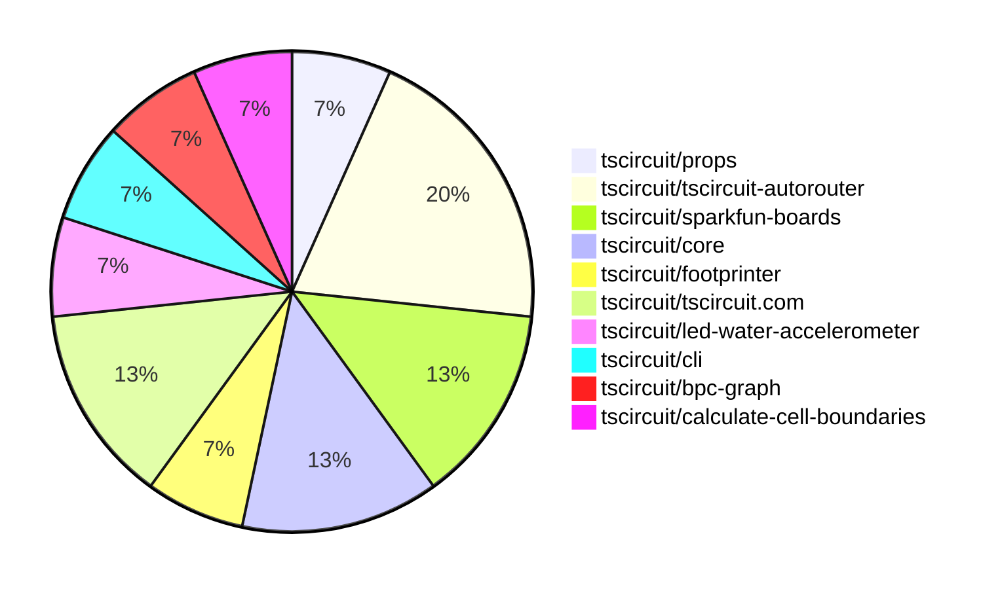

# Contribution Overview 2025-06-25

## PRs by Repository

## Contributor Overview

| Contributor | 🐳 Major | 🐙 Minor | 🐌 Tiny | ⭐ | Issues Created | Discussion Contributions |
|-------------|---------|---------|---------|-----|----------------|--------------------------|
| [imrishabh18](#imrishabh18) | 0 | 4 | 0 | ⭐⭐ | 0 | 0🔹 0🔶 0💎 |
| [Anshgrover23](#Anshgrover23) | 0 | 4 | 2 | ⭐⭐ | 5 | 0🔹 0🔶 0💎 |
| [seveibar](#seveibar) | 0 | 2 | 0 | ⭐ | 0 | 0🔹 0🔶 0💎 |
| [techmannih](#techmannih) | 0 | 1 | 0 | ⭐ | 1 | 0🔹 0🔶 0💎 |
| [ShiboSoftwareDev](#ShiboSoftwareDev) | 0 | 1 | 0 | ⭐ | 0 | 0🔹 0🔶 0💎 |
| [MustafaMulla29](#MustafaMulla29) | 0 | 0 | 1 |  | 0 | 0🔹 0🔶 0💎 |

### Discussion Contribution Legend

- 🔹 Normal Comments: Basic participation with minimal effort
- 🔶 Great Informative Comments: Thoughtful participation that adds value
- 💎 Incredible Comments: Exceptional participation with high-quality content

## Review Table

[reviews-received-hover]: ## "Number of reviews received for PRs for this contributor"
[approvals-received-hover]: ## "Number of approvals received for PRs this contributor authored"
[rejections-received-hover]: ## "Number of rejections received for PRs this contributor authored"
[prs-opened-hover]: ## "Number of PRs opened by this contributor"
[issues-created-hover]: ## "Number of issues created by this contributor"
[bountied-issues-hover]: ## "Number of issues this contributor created with a bounty"
[bountied-issue-$-hover]: ## "Total bounty amount placed on issues authored by this contributor"

| Contributor | Reviews Received | Approvals Received | Rejections Received | Approvals | Rejections | PRs Opened | PRs Merged | Issues Created | Bountied Issues | Bountied Issue $ |
|---|---|---|---|---|---|---|---|---|---|---|
| [techmannih](#techmannih) | 9 | 2 | 1 | 0 | 1 | 3 | 1 | 1 | 0 | 0 |
| [graphite-app[bot]](#graphite-app[bot]) | 0 | 0 | 0 | 0 | 0 | 0 | 0 | 0 | 0 | 0 |
| [Anshgrover23](#Anshgrover23) | 11 | 5 | 2 | 1 | 1 | 8 | 6 | 5 | 0 | 0 |
| [imrishabh18](#imrishabh18) | 3 | 1 | 0 | 2 | 0 | 6 | 4 | 0 | 0 | 0 |
| [seveibar](#seveibar) | 0 | 0 | 0 | 5 | 0 | 3 | 2 | 0 | 0 | 0 |
| [tscircuitbot](#tscircuitbot) | 0 | 0 | 0 | 0 | 0 | 4 | 0 | 0 | 0 | 0 |
| [ShiboSoftwareDev](#ShiboSoftwareDev) | 1 | 1 | 0 | 2 | 1 | 2 | 1 | 0 | 0 | 0 |
| [MustafaMulla29](#MustafaMulla29) | 1 | 1 | 0 | 0 | 0 | 2 | 1 | 0 | 0 | 0 |

## Changes by Repository

### [tscircuit/props](https://github.com/tscircuit/props)

| PR # | Impact | Contributor | Description | Milestone Aligned |
|------|--------|-------------|-------------|-------------------|
| [#304](https://github.com/tscircuit/props/pull/304) | 🐙 Minor | Anshgrover23 | Enhancing the LED component with a connections property improves its configurability and usability in circuit designs. | ❌ |

### [tscircuit/tscircuit-autorouter](https://github.com/tscircuit/tscircuit-autorouter)

| PR # | Impact | Contributor | Description | Milestone Aligned |
|------|--------|-------------|-------------|-------------------|
| [#165](https://github.com/tscircuit/tscircuit-autorouter/pull/165) | 🐙 Minor | Anshgrover23 | Enhancements to testing fixtures for the hyperdensity solver, addressing specific bugs. | ❌ |
| [#168](https://github.com/tscircuit/tscircuit-autorouter/pull/168) | 🐙 Minor | Anshgrover23 | Introduces a new JSON asset and a corresponding fixture for high-density debugging, enhancing testing capabilities. | ❌ |
| [#170](https://github.com/tscircuit/tscircuit-autorouter/pull/170) | 🐌 Tiny | Anshgrover23 | Excluding JSON files from formatting enhances the development workflow by preventing unnecessary formatting changes in these files. | ❌ |

### [tscircuit/sparkfun-boards](https://github.com/tscircuit/sparkfun-boards)

| PR # | Impact | Contributor | Description | Milestone Aligned |
|------|--------|-------------|-------------|-------------------|
| [#18](https://github.com/tscircuit/sparkfun-boards/pull/18) | 🐙 Minor | Anshgrover23 | The addition of the SparkFun Human Presence and Motion Sensor enhances the repository's offerings, providing new functionality for users. | ❌ |
| [#21](https://github.com/tscircuit/sparkfun-boards/pull/21) | 🐌 Tiny | MustafaMulla29 | Updates dependencies and snapshots to ensure compatibility and reflect recent changes in the project. | ❌ |

### [tscircuit/core](https://github.com/tscircuit/core)

| PR # | Impact | Contributor | Description | Milestone Aligned |
|------|--------|-------------|-------------|-------------------|
| [#989](https://github.com/tscircuit/core/pull/989) | 🐙 Minor | imrishabh18 | Enhancement of the SolderJumper component to support a new bridged property, improving its functionality. | ❌ |
| [#995](https://github.com/tscircuit/core/pull/995) | 🐌 Tiny | Anshgrover23 | Enhances testing capabilities for the LED component by adding a connections test, ensuring proper functionality. | ❌ |

### [tscircuit/footprinter](https://github.com/tscircuit/footprinter)

| PR # | Impact | Contributor | Description | Milestone Aligned |
|------|--------|-------------|-------------|-------------------|
| [#306](https://github.com/tscircuit/footprinter/pull/306) | 🐙 Minor | techmannih | Adjusts the dimensions of the 1210 footprint to improve compatibility with tall pads, enhancing design accuracy. | ❌ |

### [tscircuit/tscircuit.com](https://github.com/tscircuit/tscircuit.com)

| PR # | Impact | Contributor | Description | Milestone Aligned |
|------|--------|-------------|-------------|-------------------|
| [#1371](https://github.com/tscircuit/tscircuit.com/pull/1371) | 🐙 Minor | imrishabh18 | Enhances the dashboard by ensuring packages are sorted by their update or creation date, improving user experience. | ❌ |
| [#1370](https://github.com/tscircuit/tscircuit.com/pull/1370) | 🐙 Minor | imrishabh18 | Enhancing the dashboard's package sorting functionality by preventing mutation of cached data. | ❌ |

### [tscircuit/led-water-accelerometer](https://github.com/tscircuit/led-water-accelerometer)

| PR # | Impact | Contributor | Description | Milestone Aligned |
|------|--------|-------------|-------------|-------------------|
| [#3](https://github.com/tscircuit/led-water-accelerometer/pull/3) | 🐙 Minor | imrishabh18 | Enhancements to the PCB layout by adding mounting holes and improving power connections. | ❌ |

### [tscircuit/cli](https://github.com/tscircuit/cli)

| PR # | Impact | Contributor | Description | Milestone Aligned |
|------|--------|-------------|-------------|-------------------|
| [#250](https://github.com/tscircuit/cli/pull/250) | 🐙 Minor | ShiboSoftwareDev | Enhances the build command by allowing it to proceed despite circuitJson errors when the --ignore-errors flag is used. | ❌ |

### [tscircuit/bpc-graph](https://github.com/tscircuit/bpc-graph)

| PR # | Impact | Contributor | Description | Milestone Aligned |
|------|--------|-------------|-------------|-------------------|
| [#4](https://github.com/tscircuit/bpc-graph/pull/4) | 🐙 Minor | seveibar | Introduces a new page for comparing BPC graphs against a corpus, enhancing the application's functionality. | ❌ |

### [tscircuit/calculate-cell-boundaries](https://github.com/tscircuit/calculate-cell-boundaries)

| PR # | Impact | Contributor | Description | Milestone Aligned |
|------|--------|-------------|-------------|-------------------|
| [#7](https://github.com/tscircuit/calculate-cell-boundaries/pull/7) | 🐙 Minor | seveibar | Refactoring the internal layout enhances code organization and maintainability, improving the overall structure of the project. | ❌ |

## Changes by Contributor

### [Anshgrover23](https://github.com/Anshgrover23)

| PR # | Impact | Description | Milestone Aligned |
|------|--------|-------------|-------------------|
| [#304](https://github.com/tscircuit/props/pull/304) | 🐙 Minor | Enhancing the LED component with a connections property improves its configurability and usability in circuit designs. | ❌ |
| [#165](https://github.com/tscircuit/tscircuit-autorouter/pull/165) | 🐙 Minor | Enhancements to testing fixtures for the hyperdensity solver, addressing specific bugs. | ❌ |
| [#168](https://github.com/tscircuit/tscircuit-autorouter/pull/168) | 🐙 Minor | Introduces a new JSON asset and a corresponding fixture for high-density debugging, enhancing testing capabilities. | ❌ |
| [#18](https://github.com/tscircuit/sparkfun-boards/pull/18) | 🐙 Minor | The addition of the SparkFun Human Presence and Motion Sensor enhances the repository's offerings, providing new functionality for users. | ❌ |
| [#995](https://github.com/tscircuit/core/pull/995) | 🐌 Tiny | Enhances testing capabilities for the LED component by adding a connections test, ensuring proper functionality. | ❌ |
| [#170](https://github.com/tscircuit/tscircuit-autorouter/pull/170) | 🐌 Tiny | Excluding JSON files from formatting enhances the development workflow by preventing unnecessary formatting changes in these files. | ❌ |

### [techmannih](https://github.com/techmannih)

| PR # | Impact | Description | Milestone Aligned |
|------|--------|-------------|-------------------|
| [#306](https://github.com/tscircuit/footprinter/pull/306) | 🐙 Minor | Adjusts the dimensions of the 1210 footprint to improve compatibility with tall pads, enhancing design accuracy. | ❌ |

### [imrishabh18](https://github.com/imrishabh18)

| PR # | Impact | Description | Milestone Aligned |
|------|--------|-------------|-------------------|
| [#989](https://github.com/tscircuit/core/pull/989) | 🐙 Minor | Enhancement of the SolderJumper component to support a new bridged property, improving its functionality. | ❌ |
| [#1371](https://github.com/tscircuit/tscircuit.com/pull/1371) | 🐙 Minor | Enhances the dashboard by ensuring packages are sorted by their update or creation date, improving user experience. | ❌ |
| [#1370](https://github.com/tscircuit/tscircuit.com/pull/1370) | 🐙 Minor | Enhancing the dashboard's package sorting functionality by preventing mutation of cached data. | ❌ |
| [#3](https://github.com/tscircuit/led-water-accelerometer/pull/3) | 🐙 Minor | Enhancements to the PCB layout by adding mounting holes and improving power connections. | ❌ |

### [ShiboSoftwareDev](https://github.com/ShiboSoftwareDev)

| PR # | Impact | Description | Milestone Aligned |
|------|--------|-------------|-------------------|
| [#250](https://github.com/tscircuit/cli/pull/250) | 🐙 Minor | Enhances the build command by allowing it to proceed despite circuitJson errors when the --ignore-errors flag is used. | ❌ |

### [MustafaMulla29](https://github.com/MustafaMulla29)

| PR # | Impact | Description | Milestone Aligned |
|------|--------|-------------|-------------------|
| [#21](https://github.com/tscircuit/sparkfun-boards/pull/21) | 🐌 Tiny | Updates dependencies and snapshots to ensure compatibility and reflect recent changes in the project. | ❌ |

### [seveibar](https://github.com/seveibar)

| PR # | Impact | Description | Milestone Aligned |
|------|--------|-------------|-------------------|
| [#4](https://github.com/tscircuit/bpc-graph/pull/4) | 🐙 Minor | Introduces a new page for comparing BPC graphs against a corpus, enhancing the application's functionality. | ❌ |
| [#7](https://github.com/tscircuit/calculate-cell-boundaries/pull/7) | 🐙 Minor | Refactoring the internal layout enhances code organization and maintainability, improving the overall structure of the project. | ❌ |

## Repository Owners

| Repository | Codeowners |
|------------|------------|
| [footprinter](https://github.com/tscircuit/footprinter/blob/main/.github/CODEOWNERS) | [techmannih](https://github.com/techmannih) |
| [tscircuit.com](https://github.com/tscircuit/tscircuit.com/blob/main/.github/CODEOWNERS) | [imrishabh18](https://github.com/imrishabh18) |

## Repos by Owner

| User | Repo |
|------|------|
| [techmannih](https://github.com/techmannih) | [footprinter](https://github.com/tscircuit/footprinter/blob/main/.github/CODEOWNERS) |
| [imrishabh18](https://github.com/imrishabh18) | [tscircuit.com](https://github.com/tscircuit/tscircuit.com/blob/main/.github/CODEOWNERS) |

