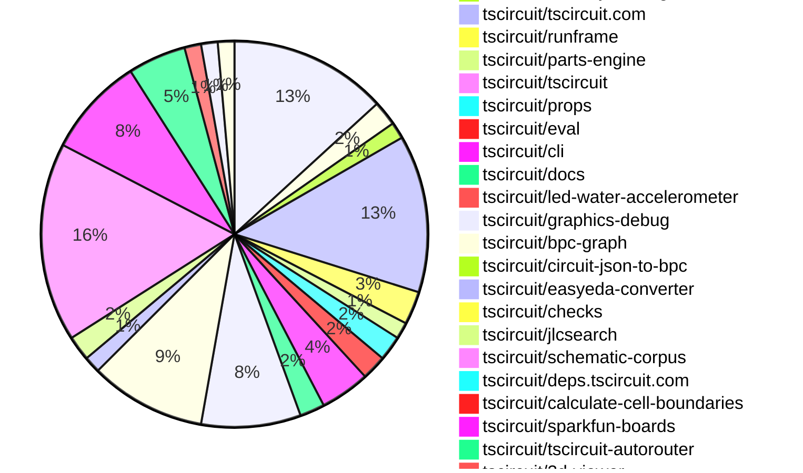

# Contribution Overview 2025-06-25

## PRs by Repository

## Contributor Overview

| Contributor | 🐳 Major | 🐙 Minor | 🐌 Tiny | ⭐ | Issues Created | Discussion Contributions |
|-------------|---------|---------|---------|-----|----------------|--------------------------|
| [seveibar](#seveibar) | 16 | 4 | 31 | 👑👑👑 | 5 | 0🔹 0🔶 0💎 |
| [Anshgrover23](#Anshgrover23) | 7 | 1 | 13 | ⭐⭐⭐ | 9 | 0🔹 0🔶 0💎 |
| [Abse2001](#Abse2001) | 9 | 0 | 2 | ⭐⭐⭐ | 1 | 0🔹 0🔶 0💎 |
| [imrishabh18](#imrishabh18) | 3 | 3 | 15 | ⭐⭐⭐ | 1 | 0🔹 0🔶 0💎 |
| [techmannih](#techmannih) | 6 | 1 | 7 | ⭐⭐⭐ | 2 | 0🔹 0🔶 0💎 |
| [ShiboSoftwareDev](#ShiboSoftwareDev) | 2 | 1 | 8 | ⭐⭐ | 7 | 0🔹 0🔶 0💎 |
| [ArnavK-09](#ArnavK-09) | 2 | 2 | 11 | ⭐⭐ | 7 | 0🔹 0🔶 0💎 |
| [MustafaMulla29](#MustafaMulla29) | 0 | 0 | 3 |  | 6 | 0🔹 0🔶 0💎 |
| [andrii-balitskyi](#andrii-balitskyi) | 0 | 1 | 0 |  | 0 | 0🔹 0🔶 0💎 |
| [ricohageman](#ricohageman) | 0 | 1 | 0 |  | 0 | 0🔹 0🔶 0💎 |
| [tscircuitbot](#tscircuitbot) | 0 | 0 | 1 |  | 0 | 0🔹 0🔶 0💎 |

### Discussion Contribution Legend

- 🔹 Normal Comments: Basic participation with minimal effort
- 🔶 Great Informative Comments: Thoughtful participation that adds value
- 💎 Incredible Comments: Exceptional participation with high-quality content

## Review Table

[reviews-received-hover]: ## "Number of reviews received for PRs for this contributor"
[approvals-received-hover]: ## "Number of approvals received for PRs this contributor authored"
[rejections-received-hover]: ## "Number of rejections received for PRs this contributor authored"
[prs-opened-hover]: ## "Number of PRs opened by this contributor"
[issues-created-hover]: ## "Number of issues created by this contributor"
[bountied-issues-hover]: ## "Number of issues this contributor created with a bounty"
[bountied-issue-$-hover]: ## "Total bounty amount placed on issues authored by this contributor"

| Contributor | Reviews Received | Approvals Received | Rejections Received | Approvals | Rejections | PRs Opened | PRs Merged | Issues Created | Bountied Issues | Bountied Issue $ |
|---|---|---|---|---|---|---|---|---|---|---|
| [seveibar](#seveibar) | 6 | 1 | 0 | 41 | 4 | 66 | 51 | 5 | 2 | 50 |
| [imrishabh18](#imrishabh18) | 18 | 9 | 0 | 9 | 2 | 23 | 21 | 1 | 0 | 0 |
| [graphite-app[bot]](#graphite-app[bot]) | 0 | 0 | 0 | 0 | 0 | 0 | 0 | 0 | 0 | 0 |
| [techmannih](#techmannih) | 47 | 20 | 7 | 1 | 4 | 26 | 14 | 2 | 0 | 0 |
| [Anshgrover23](#Anshgrover23) | 30 | 21 | 4 | 3 | 6 | 25 | 21 | 9 | 0 | 0 |
| [ShiboSoftwareDev](#ShiboSoftwareDev) | 12 | 9 | 0 | 13 | 2 | 15 | 11 | 7 | 1 | 5 |
| [MustafaMulla29](#MustafaMulla29) | 8 | 3 | 4 | 0 | 0 | 7 | 3 | 6 | 0 | 0 |
| [ArnavK-09](#ArnavK-09) | 22 | 14 | 1 | 2 | 0 | 17 | 15 | 7 | 0 | 0 |
| [Abse2001](#Abse2001) | 5 | 3 | 1 | 13 | 0 | 13 | 11 | 1 | 0 | 0 |
| [andrii-balitskyi](#andrii-balitskyi) | 2 | 1 | 1 | 0 | 0 | 2 | 1 | 0 | 0 | 0 |
| [tscircuitbot](#tscircuitbot) | 0 | 0 | 0 | 0 | 0 | 32 | 1 | 0 | 0 | 0 |
| [ricohageman](#ricohageman) | 1 | 1 | 0 | 0 | 0 | 1 | 1 | 0 | 0 | 0 |
| [cursor[bot]](#cursor[bot]) | 0 | 0 | 0 | 0 | 0 | 0 | 0 | 0 | 0 | 0 |

## Changes by Repository

### [tscircuit/core](https://github.com/tscircuit/core)

| PR # | Impact | Contributor | Description | Milestone Aligned |
|------|--------|-------------|-------------|-------------------|
| [#1002](https://github.com/tscircuit/core/pull/1002) | 🐳 Major | imrishabh18 | Fixes autorouter bug where subcircuits could generate multiple traces between the same pins, causing redundant routing and potential errors. Now, only unrouted traces are considered for autorouting within subcircuits, preventing duplicate connections. | ❌ |
| [#1016](https://github.com/tscircuit/core/pull/1016) | 🐳 Major | seveibar | Replaces the schematic match-adapt layout algorithm with a new approach based on BPC (Box-Pin-Connection) graphs, enabling more robust and flexible schematic auto-layout for groups using a corpus of graph templates and adaptation logic. Updates dependencies and test fixtures to support the new algorithm. | ❌ |
| [#1004](https://github.com/tscircuit/core/pull/1004) | 🐳 Major | seveibar | Fixes schematic netlabel center calculation so that netlabel text is correctly centered based on the anchor side, improving netlabel placement accuracy in schematics. | ❌ |
| [#1003](https://github.com/tscircuit/core/pull/1003) | 🐳 Major | seveibar | Fixes incorrect assignment of source_net_id on schematic net labels to ensure they reference the correct net object rather than just the net name. | ❌ |
| [#976](https://github.com/tscircuit/core/pull/976) | 🐳 Major | seveibar | Net labels in schematics now automatically orient themselves based on the position of the connected port, improving label placement and readability. | ❌ |
| [#1008](https://github.com/tscircuit/core/pull/1008) | 🐳 Major | ShiboSoftwareDev | Fixes incorrect calculation of PCB board center when an outline is provided, ensuring the center is derived from the outline's bounding box rather than defaulting to origin or offsets. | ❌ |
| [#1000](https://github.com/tscircuit/core/pull/1000) | 🐳 Major | ShiboSoftwareDev | Implements obstacle generation for PCB cutout components (rectangular, circular, and polygonal) so that cutouts are respected during board layout and routing. | ❌ |
| [#1013](https://github.com/tscircuit/core/pull/1013) | 🐌 Tiny | imrishabh18 | Pins the css-select dependency to version 5.1.0 to avoid breaking type errors introduced in newer versions. | ❌ |
| [#998](https://github.com/tscircuit/core/pull/998) | 🐌 Tiny | imrishabh18 | Adds automatic printing of project name, version, and URL to the PCB silkscreen when `printBoardInformationToSilkscreen` is enabled in the platform config. | ❌ |
| [#997](https://github.com/tscircuit/core/pull/997) | 🐌 Tiny | imrishabh18 | Adds a comprehensive skipped test that reproduces the issue of duplicate traces being generated between the same pins inside a subcircuit (see issue #693), making it easier for future contributors to fix the bug. | ❌ |
| [#992](https://github.com/tscircuit/core/pull/992) | 🐌 Tiny | imrishabh18 | Allows the SolderJumper component to accept a custom symbolName via props, enabling explicit schematic symbol naming for solder jumpers. | ❌ |
| [#989](https://github.com/tscircuit/core/pull/989) | 🐌 Tiny | imrishabh18 | Adds support for a new `bridged` prop to the SolderJumper component, allowing all pins to be internally connected when set, and updates tests to cover this behavior. | ❌ |
| [#1015](https://github.com/tscircuit/core/pull/1015) | 🐌 Tiny | seveibar | Adds support for mapping `schOrientation` to schematic symbol rotation, removes outdated orientation tests, and adds comprehensive test snapshots for polarized capacitor orientations. | ❌ |
| [#1005](https://github.com/tscircuit/core/pull/1005) | 🐌 Tiny | seveibar | Removes the 'TODO_REMOVE_THIS' placeholder from PrimitiveComponent name getter and ensures NormalComponent footprint generation uses a fallback name if needed, preventing placeholder names from appearing in user-facing outputs. | ❌ |
| [#995](https://github.com/tscircuit/core/pull/995) | 🐌 Tiny | Anshgrover23 | Adds a test to verify that the <Led/> component correctly creates traces for specified connections, ensuring that nets are assigned and schematic output is as expected. | ❌ |
| [#999](https://github.com/tscircuit/core/pull/999) | 🐌 Tiny | ShiboSoftwareDev | Updates @tscircuit/footprinter dependency to v0.0.186, resulting in minor floating-point precision changes in PCB pad dimensions in tests (e.g., 0.6000000000000001 → 0.6). No new features or bugfixes introduced. | ❌ |
| [#1014](https://github.com/tscircuit/core/pull/1014) | 🐌 Tiny | techmannih | Updates schematic-symbols dependency and adds a test for testpoint components with netlabels in schematics, ensuring correct netlabel connections and schematic rendering. | ❌ |
| [#1009](https://github.com/tscircuit/core/pull/1009) | 🐌 Tiny | MustafaMulla29 | Adds a comprehensive test that reproduces issues with jumper and netlabel connections in circuit schematics and PCB layouts. | ❌ |
| [#996](https://github.com/tscircuit/core/pull/996) | 🐌 Tiny | Abse2001 | Adds support for selectors of test points (TP) such as sel.TP1.pin1, enabling users to reference test point pins in selector expressions. | ❌ |

### [tscircuit/circuit-to-svg](https://github.com/tscircuit/circuit-to-svg)

| PR # | Impact | Contributor | Description | Milestone Aligned |
|------|--------|-------------|-------------|-------------------|
| [#268](https://github.com/tscircuit/circuit-to-svg/pull/268) | 🐳 Major | imrishabh18 | Adds support for rendering multi-line PCB silkscreen text by splitting on newlines and generating <tspan> elements for each line, with a test and documentation update. | ❌ |
| [#276](https://github.com/tscircuit/circuit-to-svg/pull/276) | 🐳 Major | seveibar | Removes overline rendering from net labels and reduces font size for negated (overlined) pin labels in schematics, addressing incorrect visual representation of negated signals. | ❌ |
| [#270](https://github.com/tscircuit/circuit-to-svg/pull/270) | 🐌 Tiny | ShiboSoftwareDev | Assembly SVGs now render pads, pins, and holes, providing a more complete and accurate board visualization for users. | ❌ |

### [tscircuit/circuit-json-to-gerber](https://github.com/tscircuit/circuit-json-to-gerber)

| PR # | Impact | Contributor | Description | Milestone Aligned |
|------|--------|-------------|-------------|-------------------|
| [#45](https://github.com/tscircuit/circuit-json-to-gerber/pull/45) | 🐳 Major | imrishabh18 | Fixes incorrect alignment of silkscreen text in Gerber output by supporting additional anchor alignments and the anchor_side property, with tests verifying correct behavior. | ❌ |
| [#44](https://github.com/tscircuit/circuit-json-to-gerber/pull/44) | 🐌 Tiny | seveibar | Adds support for all nine standard text anchor alignments (top_left, top_center, top_right, center_left, center, center_right, bottom_left, bottom_center, bottom_right) in Gerber conversion, and covers them with new silkscreen text test snapshots. | ❌ |

### [tscircuit/tscircuit.com](https://github.com/tscircuit/tscircuit.com)

| PR # | Impact | Contributor | Description | Milestone Aligned |
|------|--------|-------------|-------------|-------------------|
| [#1388](https://github.com/tscircuit/tscircuit.com/pull/1388) | 🐳 Major | ArnavK-09 | Adds a VSCode-style global find and replace (Ctrl+Shift+F) feature to the code editor, allowing users to search and replace text across all files in a project with support for regex, case sensitivity, and whole word matching. | ❌ |
| [#1370](https://github.com/tscircuit/tscircuit.com/pull/1370) | 🐙 Minor | imrishabh18 | Fixes a bug where sorting packages on the dashboard mutated cached data, potentially causing stale or incorrect package lists to be displayed to users. | ❌ |
| [#1381](https://github.com/tscircuit/tscircuit.com/pull/1381) | 🐙 Minor | ArnavK-09 | Prevents users from being redirected to a 404 error page by disabling file navigation actions until the package is fully loaded on the View Package page. | ❌ |
| [#1368](https://github.com/tscircuit/tscircuit.com/pull/1368) | 🐙 Minor | andrii-balitskyi | Fixes delayed loading spinner when requesting an AI review by immediately showing the spinner and maintaining local loading state during the request. | ❌ |
| [#1394](https://github.com/tscircuit/tscircuit.com/pull/1394) | 🐌 Tiny | imrishabh18 | Updates the @tscircuit/runframe dependency from version ^0.0.647 to ^0.0.653. No other changes are included. | ❌ |
| [#1393](https://github.com/tscircuit/tscircuit.com/pull/1393) | 🐌 Tiny | imrishabh18 | Adds a tooltip to the AI autocomplete toggle button in the code editor header, providing users with a description of its function. | ❌ |
| [#1371](https://github.com/tscircuit/tscircuit.com/pull/1371) | 🐌 Tiny | imrishabh18 | Packages on the dashboard page are now sorted by most recently updated or created, improving package list order for users. | ❌ |
| [#1325](https://github.com/tscircuit/tscircuit.com/pull/1325) | 🐌 Tiny | seveibar | Caches TypeScript default libraries in the browser using IndexedDB and loads them on CodeEditor mount, reducing load times for users editing TypeScript code. | ❌ |
| [#1389](https://github.com/tscircuit/tscircuit.com/pull/1389) | 🐌 Tiny | Anshgrover23 | Updates the 'circuit-to-svg' package dependency from version ^0.0.160 to ^0.0.163; no user-facing changes or new functionality introduced. | ❌ |
| [#1395](https://github.com/tscircuit/tscircuit.com/pull/1395) | 🐌 Tiny | techmannih | Updates the @tscircuit/footprinter package dependency from version ^0.0.176 to ^0.0.186, with no other changes. | ❌ |
| [#1387](https://github.com/tscircuit/tscircuit.com/pull/1387) | 🐌 Tiny | ArnavK-09 | Updates several dependencies in package.json to newer versions; no user-facing features or bugfixes introduced. | ❌ |
| [#1382](https://github.com/tscircuit/tscircuit.com/pull/1382) | 🐌 Tiny | ArnavK-09 | Adds a native share option to package cards, allowing users to share package links via device-native sharing or clipboard fallback. | ❌ |
| [#1384](https://github.com/tscircuit/tscircuit.com/pull/1384) | 🐌 Tiny | ArnavK-09 | Limits the height of the RunFrame and CodeEditor components to 98vh for improved layout consistency and updates @tscircuit/runframe dependency to ^0.0.642. | ❌ |
| [#1383](https://github.com/tscircuit/tscircuit.com/pull/1383) | 🐌 Tiny | ArnavK-09 | Removes extra horizontal spacing from highlighted characters in the command menu for a more compact appearance. | ❌ |
| [#1379](https://github.com/tscircuit/tscircuit.com/pull/1379) | 🐌 Tiny | ArnavK-09 | Improves the responsiveness and layout of the Package Build Details page and related components for better usability on smaller screens and various devices. | ❌ |
| [#1378](https://github.com/tscircuit/tscircuit.com/pull/1378) | 🐌 Tiny | ArnavK-09 | Completely redesigns the Cmd+K command menu with improved search, keyboard navigation, categorized options, and a modern UI, making it easier and faster for users to find and launch actions or packages. | ❌ |
| [#1374](https://github.com/tscircuit/tscircuit.com/pull/1374) | 🐌 Tiny | ArnavK-09 | Fixes bug where package settings dialog would not show for package owners if their GitHub account ID did not match the stored creator_account_id, by switching to username-based ownership check. | ❌ |
| [#1373](https://github.com/tscircuit/tscircuit.com/pull/1373) | 🐌 Tiny | ArnavK-09 | Restricts the ability to generate or re-generate AI reviews to only the package owner, preventing other authenticated users from accessing this functionality. | ❌ |
| [#1372](https://github.com/tscircuit/tscircuit.com/pull/1372) | 🐌 Tiny | ArnavK-09 | Adds a toggle button to the CodeEditorHeader allowing users to enable or disable a mock AI autocomplete feature (UI only, no backend functionality). | ❌ |

### [tscircuit/runframe](https://github.com/tscircuit/runframe)

| PR # | Impact | Contributor | Description | Milestone Aligned |
|------|--------|-------------|-------------|-------------------|
| [#824](https://github.com/tscircuit/runframe/pull/824) | 🐳 Major | ArnavK-09 | Fixes bug where the active tab in CircuitJsonPreview is lost when an error occurs, now restoring the last active tab after error is resolved (fixes #749) | ❌ |
| [#830](https://github.com/tscircuit/runframe/pull/830) | 🐙 Minor | imrishabh18 | Fixes RunFrame so it fetches and uses the actual latest version of @tscircuit/eval instead of relying on the "latest" tag, avoiding stale versions due to jsdelivr caching. | ❌ |
| [#820](https://github.com/tscircuit/runframe/pull/820) | 🐙 Minor | ArnavK-09 | Enables full screen mode for circuit previews on tscircuit.com, allowing users to view and interact with circuit previews in a maximized interface. | ❌ |
| [#823](https://github.com/tscircuit/runframe/pull/823) | 🐌 Tiny | ArnavK-09 | Fixes incorrect height handling in fullscreen and CLI RunFrame previews by updating container height logic and Tailwind classes. | ❌ |

### [tscircuit/parts-engine](https://github.com/tscircuit/parts-engine)

| PR # | Impact | Contributor | Description | Milestone Aligned |
|------|--------|-------------|-------------|-------------------|
| [#9](https://github.com/tscircuit/parts-engine/pull/9) | 🐙 Minor | imrishabh18 | Fixes bug where resistor and capacitor searches ignored SI units, now searches use display value with SI unit (e.g., 10kΩ, 1μF) if available, improving part matching accuracy. | ❌ |
| [#8](https://github.com/tscircuit/parts-engine/pull/8) | 🐙 Minor | Anshgrover23 | Fixes a bug where findPart would throw an error if the 'fuses' array is undefined, ensuring robust handling of missing part data. | ❌ |

### [tscircuit/tscircuit](https://github.com/tscircuit/tscircuit)

| PR # | Impact | Contributor | Description | Milestone Aligned |
|------|--------|-------------|-------------|-------------------|
| [#694](https://github.com/tscircuit/tscircuit/pull/694) | 🐌 Tiny | imrishabh18 | Updates @tscircuit/core to v0.0.526 and @tscircuit/eval to v0.0.240 in package.json (dependency update only). | ❌ |

### [tscircuit/props](https://github.com/tscircuit/props)

| PR # | Impact | Contributor | Description | Milestone Aligned |
|------|--------|-------------|-------------|-------------------|
| [#307](https://github.com/tscircuit/props/pull/307) | 🐌 Tiny | imrishabh18 | Adds optional board information fields (projectName, version, url, printBoardInformationToSilkscreen) to PlatformConfig and documents them in the README, allowing users to specify and optionally print board metadata on silkscreen. | ❌ |
| [#308](https://github.com/tscircuit/props/pull/308) | 🐌 Tiny | seveibar | Adds an optional `pinAttributes` property to all component prop interfaces, allowing users to specify per-pin attributes with type safety, and propagates pin label generics for improved type inference across components. | ❌ |
| [#304](https://github.com/tscircuit/props/pull/304) | 🐌 Tiny | Anshgrover23 | Adds an optional 'connections' property to the LED component, allowing users to specify net connections for each LED pin and validates them with comprehensive tests. | ❌ |

### [tscircuit/eval](https://github.com/tscircuit/eval)

| PR # | Impact | Contributor | Description | Milestone Aligned |
|------|--------|-------------|-------------|-------------------|
| [#624](https://github.com/tscircuit/eval/pull/624) | 🐌 Tiny | imrishabh18 | Updates @tscircuit/parts-engine dependency to ^0.0.8 and enhances the test to verify that all board components (resistor and capacitor) have valid JLCPCB supplier part numbers. | ❌ |
| [#608](https://github.com/tscircuit/eval/pull/608) | 🐌 Tiny | imrishabh18 | Updates the @tscircuit/core dependency from version 0.0.510 to 0.0.526. No other changes are included. | ❌ |
| [#619](https://github.com/tscircuit/eval/pull/619) | 🐌 Tiny | tscircuitbot | Automated update of @tscircuit/core to v0.0.532. This PR was created automatically by the update-tscircuit-core GitHub workflow. | ❌ |

### [tscircuit/cli](https://github.com/tscircuit/cli)

| PR # | Impact | Contributor | Description | Milestone Aligned |
|------|--------|-------------|-------------|-------------------|
| [#253](https://github.com/tscircuit/cli/pull/253) | 🐙 Minor | seveibar | Ensures the CLI uses the user's installed tscircuit peer dependency for core functionality instead of bundling its own versions, preventing version conflicts and reducing bundle size. | ❌ |
| [#252](https://github.com/tscircuit/cli/pull/252) | 🐌 Tiny | imrishabh18 | Updates @tscircuit/eval from 0.0.238 to 0.0.240 and tscircuit from 0.0.505 to 0.0.510; no user-facing changes beyond dependency updates. | ❌ |
| [#255](https://github.com/tscircuit/cli/pull/255) | 🐌 Tiny | Anshgrover23 | Updates the versions of the 'circuit-to-svg' and '@tscircuit/runframe' dependencies in package.json; no user-facing features or bugfixes are introduced. | ❌ |
| [#251](https://github.com/tscircuit/cli/pull/251) | 🐌 Tiny | ShiboSoftwareDev | Generated GitHub Actions workflows now use Node.js version 22 for setup, ensuring compatibility with the latest Node.js features and security updates. | ❌ |
| [#250](https://github.com/tscircuit/cli/pull/250) | 🐌 Tiny | ShiboSoftwareDev | Adds a --ignore-errors flag to the build command, allowing builds to continue even if circuitJson errors are present. | ❌ |
| [#254](https://github.com/tscircuit/cli/pull/254) | 🐌 Tiny | ArnavK-09 | Updates several development dependencies, including @tscircuit/circuit-json-util, @tscircuit/props, and @tscircuit/simple-3d-svg, with no functional code changes. | ❌ |

### [tscircuit/docs](https://github.com/tscircuit/docs)

| PR # | Impact | Contributor | Description | Milestone Aligned |
|------|--------|-------------|-------------|-------------------|
| [#93](https://github.com/tscircuit/docs/pull/93) | 🐌 Tiny | imrishabh18 | Embed demonstration videos showing manual edit features in the schematic and PCB viewer documentation pages, replacing placeholder notes with actual YouTube video embeds. | ❌ |
| [#94](https://github.com/tscircuit/docs/pull/94) | 🐌 Tiny | seveibar | Documents the `schOrientation` property for capacitors, explaining its usage and valid values in the layout property guide and capacitor documentation, enabling users to control schematic symbol orientation for polarized capacitors. | ❌ |
| [#92](https://github.com/tscircuit/docs/pull/92) | 🐌 Tiny | seveibar | Documents how to group typed nets using the `sel.net` selector pattern in the documentation, providing an example for users to organize reusable selectors. | ❌ |

### [tscircuit/led-water-accelerometer](https://github.com/tscircuit/led-water-accelerometer)

| PR # | Impact | Contributor | Description | Milestone Aligned |
|------|--------|-------------|-------------|-------------------|
| [#3](https://github.com/tscircuit/led-water-accelerometer/pull/3) | 🐌 Tiny | imrishabh18 | Adds three mounting holes to the PCB and connects the Pico VBUS pin to the V5 net, improving mechanical stability and ensuring proper power distribution to the LED matrix. | ❌ |

### [tscircuit/graphics-debug](https://github.com/tscircuit/graphics-debug)

| PR # | Impact | Contributor | Description | Milestone Aligned |
|------|--------|-------------|-------------|-------------------|
| [#65](https://github.com/tscircuit/graphics-debug/pull/65) | 🐳 Major | seveibar | Fixes Y offset calculation in graphics grid creation so that rows are no longer reversed, ensuring correct visual row order for users. | ❌ |
| [#59](https://github.com/tscircuit/graphics-debug/pull/59) | 🐙 Minor | seveibar | Accurately computes text bounds and scales font sizes in graphics rendering, ensuring text is properly sized and positioned according to transform matrices and anchor settings; adds tests for new text sizing logic. | ❌ |
| [#68](https://github.com/tscircuit/graphics-debug/pull/68) | 🐌 Tiny | seveibar | Adds an option to display titles above each graphic when using stackGraphicsHorizontally, updates documentation, and adds a snapshot test for this feature. | ❌ |
| [#67](https://github.com/tscircuit/graphics-debug/pull/67) | 🐌 Tiny | seveibar | Changes the default behavior of getSvgFromGraphicsObject to exclude text labels from SVG output unless explicitly enabled, and updates tests to match this new default. | ❌ |
| [#64](https://github.com/tscircuit/graphics-debug/pull/64) | 🐌 Tiny | seveibar | Rectangle label text is now aligned to the top of the rectangle and rendered 3x larger for improved visibility; also updates @types/bun dependency. | ❌ |
| [#66](https://github.com/tscircuit/graphics-debug/pull/66) | 🐌 Tiny | seveibar | Allows users to customize the SVG width and height generated by getSvgFromGraphicsObject, enabling flexible output dimensions for SVG graphics. | ❌ |
| [#63](https://github.com/tscircuit/graphics-debug/pull/63) | 🐌 Tiny | seveibar | Dynamically scales rectangle label font size in SVG output based on rectangle dimensions, improving label readability for varying rectangle sizes. | ❌ |
| [#62](https://github.com/tscircuit/graphics-debug/pull/62) | 🐌 Tiny | seveibar | Adds support for specifying gaps between cells in createGraphicsGrid, including fixed gap and gap as a fraction of cell width, with tests. | ❌ |
| [#61](https://github.com/tscircuit/graphics-debug/pull/61) | 🐌 Tiny | seveibar | Adds a createGraphicsGrid method to arrange multiple graphics objects in a grid layout, and updates tests to verify correct grid arrangement. | ❌ |
| [#60](https://github.com/tscircuit/graphics-debug/pull/60) | 🐌 Tiny | seveibar | Adds stackGraphicsHorizontally and stackGraphicsVertically functions to the graphics-debug library, allowing users to combine multiple graphics objects by translation, with documentation and tests included. | ❌ |
| [#58](https://github.com/tscircuit/graphics-debug/pull/58) | 🐌 Tiny | seveibar | Adds support for rendering and manipulating text objects within graphics, including SVG and canvas output, merging, translation, bounds calculation, and interactive components. | ❌ |
| [#57](https://github.com/tscircuit/graphics-debug/pull/57) | 🐌 Tiny | seveibar | Adds a new `mergeGraphics` utility function to combine two graphics objects, exports it from the library, documents its usage in the README, and provides tests for both `mergeGraphics` and `translateGraphics`. | ❌ |

### [tscircuit/bpc-graph](https://github.com/tscircuit/bpc-graph)

| PR # | Impact | Contributor | Description | Milestone Aligned |
|------|--------|-------------|-------------|-------------------|
| [#20](https://github.com/tscircuit/bpc-graph/pull/20) | 🐳 Major | seveibar | Adds example tests and documentation for computing Weisfeiler-Leman (WL) distance between BPC graphs, and introduces a utility to visualize flat BPC graph representations. | ❌ |
| [#18](https://github.com/tscircuit/bpc-graph/pull/18) | 🐳 Major | seveibar | Fixes incorrect assignment of positions to floating boxes in BPC graphs and adds a visual example to the README, ensuring floating boxes are placed based on network connections rather than defaulting to origin or averaging, and documents the behavior with a new test and image. | ❌ |
| [#12](https://github.com/tscircuit/bpc-graph/pull/12) | 🐳 Major | seveibar | Introduces partitioning and renetworking functions to enable heuristic graph cuts and side-based subgraph extraction in BPC graphs, improving graph matching and scoring for schematic partitioning workflows. | ❌ |
| [#11](https://github.com/tscircuit/bpc-graph/pull/11) | 🐳 Major | seveibar | Adds subgraph partitioning and re-networking utilities to enable partitioning BPC graphs by box sides, including new core functions for conditional network splitting, merging, and matching, with comprehensive tests and integration with schematic corpus matching. | ❌ |
| [#10](https://github.com/tscircuit/bpc-graph/pull/10) | 🐳 Major | seveibar | Adds utilities to extract, merge, and analyze the connectivity of individual sides of a box in a BpcGraph, including detection of isolated or connected box sides, with comprehensive tests. | ❌ |
| [#9](https://github.com/tscircuit/bpc-graph/pull/9) | 🐳 Major | seveibar | Fixes multiple subtle bugs in the net adaptation logic for BPC graphs, adds robust snapshot-based tests for adaptation correctness, and improves error handling and pin/box mapping safety. | ❌ |
| [#8](https://github.com/tscircuit/bpc-graph/pull/8) | 🐳 Major | seveibar | Adds new algorithms and utilities for adapting a source BPC graph to match the netlist and structure of a target BPC graph, including assignment of floating box positions and edit operations for adjacency matrices. Removes the previous GraphNetworkTransformer and related operation-based transformation system, replacing it with a matrix-edit-based approach. Includes comprehensive new tests for assignment, matrix editing, and net adaptation. | ❌ |
| [#7](https://github.com/tscircuit/bpc-graph/pull/7) | 🐳 Major | seveibar | Adds adjacency matrix-based graph similarity algorithms (including eigenvalue and Weisfeiler-Lehman methods) for matching and comparing BPC graphs, integrates these into the matching UI and core solver, and introduces new conversion utilities and comprehensive tests for these algorithms. | ❌ |
| [#6](https://github.com/tscircuit/bpc-graph/pull/6) | 🐳 Major | seveibar | Renames and refactors the network similarity heuristic to 'assignment combinations network similarity', introduces a new flat BPC graph type, and updates all usages, tests, and UI to use the new naming and structure. | ❌ |
| [#5](https://github.com/tscircuit/bpc-graph/pull/5) | 🐳 Major | seveibar | Adds a new corpus matcher page that allows users to match and adapt schematic graphs against a corpus using an A* graph transformation algorithm with operation costs and heuristic matching, including interactive UI features such as mouse hover, match button, and preview display. | ❌ |
| [#13](https://github.com/tscircuit/bpc-graph/pull/13) | 🐙 Minor | seveibar | Adds comprehensive API documentation and usage examples to the README, and introduces snapshot-based example tests for key library functions. | ❌ |
| [#19](https://github.com/tscircuit/bpc-graph/pull/19) | 🐌 Tiny | seveibar | Adds a usage example and visual snapshot for mergeBoxSideSubgraphs in the README and test suite, demonstrating how to merge two subgraphs and the resulting output. | ❌ |
| [#17](https://github.com/tscircuit/bpc-graph/pull/17) | 🐌 Tiny | seveibar | Improves the README with a more comprehensive and realistic example for the renetworking functionality, updates example code and images, and adds related tests and documentation for bpc-graph users. | ❌ |
| [#4](https://github.com/tscircuit/bpc-graph/pull/4) | 🐌 Tiny | seveibar | Adds a new page that allows users to compare a BPC graph against a corpus of schematic graphs, displaying similarity distances for each corpus entry. | ❌ |

### [tscircuit/circuit-json-to-bpc](https://github.com/tscircuit/circuit-json-to-bpc)

| PR # | Impact | Contributor | Description | Milestone Aligned |
|------|--------|-------------|-------------|-------------------|
| [#2](https://github.com/tscircuit/circuit-json-to-bpc/pull/2) | 🐙 Minor | seveibar | Converts schematic net labels into boxes with pins in the BPC graph, enabling net labels to be represented as physical connection points in downstream tools. | ❌ |

### [tscircuit/easyeda-converter](https://github.com/tscircuit/easyeda-converter)

| PR # | Impact | Contributor | Description | Milestone Aligned |
|------|--------|-------------|-------------|-------------------|
| [#270](https://github.com/tscircuit/easyeda-converter/pull/270) | 🐌 Tiny | seveibar | Adds support for converting vias from EasyEDA JSON to TSX in generateFootprintTsx, enabling footprints with vias to be exported correctly. | ❌ |
| [#269](https://github.com/tscircuit/easyeda-converter/pull/269) | 🐌 Tiny | seveibar | Adds support for parsing and converting VIA shapes from EasyEDA packages to pcb_via elements in tscircuit, including schema, conversion logic, and tests for a real-world part (C46497) with VIAs. | ❌ |

### [tscircuit/checks](https://github.com/tscircuit/checks)

| PR # | Impact | Contributor | Description | Milestone Aligned |
|------|--------|-------------|-------------|-------------------|
| [#52](https://github.com/tscircuit/checks/pull/52) | 🐌 Tiny | seveibar | Adds a runAllChecks utility function that executes all available PCB checks on tscircuit code, exports it, and provides a unit test for validation. | ❌ |

### [tscircuit/jlcsearch](https://github.com/tscircuit/jlcsearch)

| PR # | Impact | Contributor | Description | Milestone Aligned |
|------|--------|-------------|-------------|-------------------|
| [#62](https://github.com/tscircuit/jlcsearch/pull/62) | 🐌 Tiny | seveibar | Adds a measurement filter dropdown to the Gas Sensors page, allowing users to filter gas sensors by the type of gas measured (e.g., oxygen, CO2, methane) via a new query parameter and backend logic. | ❌ |
| [#61](https://github.com/tscircuit/jlcsearch/pull/61) | 🐌 Tiny | seveibar | Adds a new Gas Sensors page and API endpoint that lists gas sensors with detailed boolean flags for each gas type detected, including new DB schema, filtering, and tests. | ❌ |
| [#60](https://github.com/tscircuit/jlcsearch/pull/60) | 🐌 Tiny | seveibar | Adds a searchable Boost DC-DC converter list page and API endpoint, including database integration, filtering, and tests. | ❌ |

### [tscircuit/schematic-corpus](https://github.com/tscircuit/schematic-corpus)

| PR # | Impact | Contributor | Description | Milestone Aligned |
|------|--------|-------------|-------------|-------------------|
| [#36](https://github.com/tscircuit/schematic-corpus/pull/36) | 🐳 Major | Anshgrover23 | Introduces a new circuit board design (design029) featuring a 9-pin header, two LEDs, and two resistors with labeled nets for VCC, DTR, RX_I, and TX_O. | ❌ |
| [#34](https://github.com/tscircuit/schematic-corpus/pull/34) | 🐳 Major | Anshgrover23 | Adds a new circuit schematic (design026) featuring a jumper, two capacitors, and netlabels for V3_3 and GND, with manual schematic placements. | ❌ |
| [#32](https://github.com/tscircuit/schematic-corpus/pull/32) | 🐳 Major | Anshgrover23 | Introduces a new circuit board design (design024) featuring a 10-pin jumper with labeled net connections including D8-D10, COPI, CIPO, SCK, GND, AREF, A4, and A5. | ❌ |
| [#24](https://github.com/tscircuit/schematic-corpus/pull/24) | 🐳 Major | Anshgrover23 | Adds a new circuit board design (design022) featuring a 1k resistor, red LED, and solder jumper for V3_3 to GND connection. | ❌ |
| [#22](https://github.com/tscircuit/schematic-corpus/pull/22) | 🐳 Major | Anshgrover23 | Introduces a new circuit board design (design021) featuring a pinrow8 jumper and labeled nets (VIN, GND, V5, VDD, N_RESET). | ❌ |
| [#10](https://github.com/tscircuit/schematic-corpus/pull/10) | 🐳 Major | Anshgrover23 | Adds a new example circuit board design (design018) featuring a 4-pin jumper with SCL, SDA, MISO, and GND nets to the schematic-corpus examples. | ❌ |
| [#35](https://github.com/tscircuit/schematic-corpus/pull/35) | 🐳 Major | techmannih | Introduces a new circuit board design (design028) featuring a single chip with labeled V5 and GND nets in a 10mm x 10mm board. | ❌ |
| [#33](https://github.com/tscircuit/schematic-corpus/pull/33) | 🐳 Major | techmannih | Introduces a new circuit board design (design027) featuring a pinrow8 jumper and labeled power/ground nets. | ❌ |
| [#27](https://github.com/tscircuit/schematic-corpus/pull/27) | 🐳 Major | techmannih | Introduces a new circuit board design (design025) featuring a chip with two labeled pins (A6, A7) on a 10mm x 10mm board. | ❌ |
| [#26](https://github.com/tscircuit/schematic-corpus/pull/26) | 🐳 Major | techmannih | Introduces a new circuit board design (design023) featuring a 10mm x 10mm board with a resistor and LED circuit. | ❌ |
| [#21](https://github.com/tscircuit/schematic-corpus/pull/21) | 🐳 Major | techmannih | Introduces a new circuit board design (design020) featuring a 4-pin chip with labeled nets for SCL, SDA, V3_3, and GND. | ❌ |
| [#20](https://github.com/tscircuit/schematic-corpus/pull/20) | 🐳 Major | Abse2001 | Introduces a new circuit board design (design019) with a 16-pin chip and labeled net connections. | ❌ |
| [#18](https://github.com/tscircuit/schematic-corpus/pull/18) | 🐳 Major | Abse2001 | Introduces a new schematic circuit board design (design017) featuring a single chip with labeled nets for V3_3, SCL, SDA, and GND. | ❌ |
| [#17](https://github.com/tscircuit/schematic-corpus/pull/17) | 🐳 Major | Abse2001 | Adds a new circuit board design (design016) featuring a chip with 9 pins and labeled SDIO/GND/V3_3 nets, as a new entry in the schematic corpus. | ❌ |
| [#16](https://github.com/tscircuit/schematic-corpus/pull/16) | 🐳 Major | Abse2001 | Introduces a new circuit board design (design015) featuring a switch, capacitor, resistor, and labeled nets for V3_3, RESET, and GND. | ❌ |
| [#15](https://github.com/tscircuit/schematic-corpus/pull/15) | 🐳 Major | Abse2001 | Introduces a new 10mm x 10mm circuit board design (design014) featuring a switch (SW1) and labeled nets BOOT0 and V3_3. | ❌ |
| [#14](https://github.com/tscircuit/schematic-corpus/pull/14) | 🐳 Major | Abse2001 | Introduces a new circuit board design (design013) featuring two diodes and labeled power nets. | ❌ |
| [#13](https://github.com/tscircuit/schematic-corpus/pull/13) | 🐳 Major | Abse2001 | Adds a new 10mm x 10mm circuit board design (design012) featuring four 0.1uF capacitors with specific schematic placements and net labels for V3_3 and GND. | ❌ |
| [#12](https://github.com/tscircuit/schematic-corpus/pull/12) | 🐳 Major | Abse2001 | Adds a new 32.768kHz crystal oscillator circuit board design (design011) with two 15pF capacitors and ground netlabels, and updates tscircuit dependencies. | ❌ |
| [#37](https://github.com/tscircuit/schematic-corpus/pull/37) | 🐌 Tiny | seveibar | Adds a new interactive gallery website for browsing schematic corpus BPC graphs and SVGs, including build scripts and improved image preview functionality. | ❌ |
| [#25](https://github.com/tscircuit/schematic-corpus/pull/25) | 🐌 Tiny | seveibar | Generates and saves SVG graphics for BPC (Box Pin Color) graphs alongside BPC JSON files for each circuit in the corpus. | ❌ |
| [#11](https://github.com/tscircuit/schematic-corpus/pull/11) | 🐌 Tiny | seveibar | Updates dependencies to support BPC (Board Production Config) generation with netlabel information, enabling downstream tools to access netlabel data in generated BPC files. | ❌ |
| [#31](https://github.com/tscircuit/schematic-corpus/pull/31) | 🐌 Tiny | techmannih | Updates design025 to add a third pin to U1 and relabels/rewires netlabels to VCC, COPI, and GND, improving schematic clarity and accuracy. | ❌ |
| [#19](https://github.com/tscircuit/schematic-corpus/pull/19) | 🐌 Tiny | Abse2001 | Expands the design017 circuit board schematic by adding additional pins and netlabels for more signals and power connections. | ❌ |

### [tscircuit/deps.tscircuit.com](https://github.com/tscircuit/deps.tscircuit.com)

| PR # | Impact | Contributor | Description | Milestone Aligned |
|------|--------|-------------|-------------|-------------------|
| [#23](https://github.com/tscircuit/deps.tscircuit.com/pull/23) | 🐌 Tiny | seveibar | Adds @tscircuit/cli as a dependency, categorizes it as 'Downstream', updates the dependency graph, and adds a test to ensure correct categorization. | ❌ |

### [tscircuit/calculate-cell-boundaries](https://github.com/tscircuit/calculate-cell-boundaries)

| PR # | Impact | Contributor | Description | Milestone Aligned |
|------|--------|-------------|-------------|-------------------|
| [#7](https://github.com/tscircuit/calculate-cell-boundaries/pull/7) | 🐌 Tiny | seveibar | Refactors the internal structure of the calculate-cell-boundaries library by moving algorithm code out of the claude folder, modularizing core logic into separate files, and updating imports, without changing user-facing functionality. | ❌ |

### [tscircuit/sparkfun-boards](https://github.com/tscircuit/sparkfun-boards)

| PR # | Impact | Contributor | Description | Milestone Aligned |
|------|--------|-------------|-------------|-------------------|
| [#18](https://github.com/tscircuit/sparkfun-boards/pull/18) | 🐳 Major | Anshgrover23 | Adds a complete new board definition, schematic, PCB layout, and component footprint for the SparkFun Human Presence and Motion Sensor - STHS34PF80 (Qwiic), including symbol, 3D model, and all supporting files. | ❌ |
| [#29](https://github.com/tscircuit/sparkfun-boards/pull/29) | 🐳 Major | Abse2001 | Adds the SparkFun Transceiver Breakout - MAX3232 board, including schematic, PCB layout, custom footprints, and documentation. | ❌ |
| [#33](https://github.com/tscircuit/sparkfun-boards/pull/33) | 🐌 Tiny | Anshgrover23 | Refactors the SparkFun Human Presence and Motion Sensor board by extracting the JST04_1MM_RA jumper footprint into a separate file for reuse and maintainability; no functional or user-facing changes. | ❌ |
| [#32](https://github.com/tscircuit/sparkfun-boards/pull/32) | 🐌 Tiny | Anshgrover23 | Adds 'snapshot' and related scripts to package.json, enabling users to run and update tsci snapshot tests via npm scripts. | ❌ |
| [#16](https://github.com/tscircuit/sparkfun-boards/pull/16) | 🐌 Tiny | Anshgrover23 | Adds a README file with a link to the official SparkFun product page for the SparkFun RFM69 Breakout (915MHz) board. | ❌ |
| [#24](https://github.com/tscircuit/sparkfun-boards/pull/24) | 🐌 Tiny | Anshgrover23 | Updates the RFM69-BREAKOUT BOARD circuit definition to use explicit connection props and updates the PCB and schematic snapshots to reflect the new net and autorouter configuration. | ❌ |
| [#30](https://github.com/tscircuit/sparkfun-boards/pull/30) | 🐌 Tiny | ShiboSoftwareDev | Adjusts schematic component and netlabel positions for the SparkFun I2C DAC Breakout - MCP4725 board to improve schematic clarity and alignment; no functional or electrical changes. | ❌ |
| [#25](https://github.com/tscircuit/sparkfun-boards/pull/25) | 🐌 Tiny | ShiboSoftwareDev | Fixes GitHub Actions workflows by updating Node.js to v22 and bumping tscircuit dependencies, enabling snapshot verification of user changes. | ❌ |
| [#31](https://github.com/tscircuit/sparkfun-boards/pull/31) | 🐌 Tiny | techmannih | Adds a README file with a link to the official SparkFun product page for the SparkFun USB to Serial Breakout - FT232RL board. | ❌ |
| [#12](https://github.com/tscircuit/sparkfun-boards/pull/12) | 🐌 Tiny | techmannih | Refactors and corrects the SparkFun USB-to-Serial Breakout (FT232RL) board definition, fixing pin assignments, updating net connections, and introducing a dedicated switch component with proper footprint and schematic integration. | ❌ |
| [#37](https://github.com/tscircuit/sparkfun-boards/pull/37) | 🐌 Tiny | MustafaMulla29 | Substantially revises the SparkFun HMC6343 Breakout board layout, updating component placements, footprints, and mechanical features to correct and improve the existing board design. | ❌ |
| [#21](https://github.com/tscircuit/sparkfun-boards/pull/21) | 🐌 Tiny | MustafaMulla29 | Updates @tscircuit/cli and @tscircuit/props dependencies and refreshes board and schematic snapshots to reflect changes in those dependencies. | ❌ |

### [tscircuit/tscircuit-autorouter](https://github.com/tscircuit/tscircuit-autorouter)

| PR # | Impact | Contributor | Description | Milestone Aligned |
|------|--------|-------------|-------------|-------------------|
| [#180](https://github.com/tscircuit/tscircuit-autorouter/pull/180) | 🐙 Minor | ricohageman | Fixes a subtle but important bug in the autorouter's caching logic by rounding delta values to higher precision, preventing cache misses due to floating-point rounding errors in the unravelMultiSectionSolver. | ❌ |
| [#172](https://github.com/tscircuit/tscircuit-autorouter/pull/172) | 🐌 Tiny | Anshgrover23 | Adds new high-density nodeWithPortPoints fixtures and test cases to reproduce autorouting hypersolver bugs (see #134), enabling easier debugging and future fixes. | ❌ |
| [#171](https://github.com/tscircuit/tscircuit-autorouter/pull/171) | 🐌 Tiny | Anshgrover23 | Adds new high-density autorouting test fixtures to reproduce and diagnose hyperdensity routing bugs (see #141) | ❌ |
| [#170](https://github.com/tscircuit/tscircuit-autorouter/pull/170) | 🐌 Tiny | Anshgrover23 | Excludes all JSON files in examples/assets from being formatted by Biome, simplifying formatting rules and preventing unwanted formatting changes to example asset files. | ❌ |
| [#165](https://github.com/tscircuit/tscircuit-autorouter/pull/165) | 🐌 Tiny | Anshgrover23 | Adds new high-density node fixtures and test cases to reproduce specific hyperdensity solver bugs (see #163), enabling easier debugging and future fixes. | ❌ |
| [#168](https://github.com/tscircuit/tscircuit-autorouter/pull/168) | 🐌 Tiny | Anshgrover23 | Adds a new test fixture and JSON asset to reproduce the bug described in #167, providing a comprehensive reproduction case for debugging high-density autorouting issues. | ❌ |
| [#177](https://github.com/tscircuit/tscircuit-autorouter/pull/177) | 🐌 Tiny | techmannih | Adds high-density test fixtures and associated node data for nodes cn2776 and cn1722 to improve autorouter testing coverage (ref #162) | ❌ |

### [tscircuit/3d-viewer](https://github.com/tscircuit/3d-viewer)

| PR # | Impact | Contributor | Description | Milestone Aligned |
|------|--------|-------------|-------------|-------------------|
| [#365](https://github.com/tscircuit/3d-viewer/pull/365) | 🐙 Minor | ShiboSoftwareDev | Allows users to define circuit boards using JSX children in the Manifold 3D viewer, not just circuitJson, enabling more flexible board creation workflows. | ❌ |
| [#364](https://github.com/tscircuit/3d-viewer/pull/364) | 🐌 Tiny | ShiboSoftwareDev | Fixes bug where 3D viewer would fail or hang when attempting to render an empty board (zero width/height or insufficient outline), now gracefully renders nothing for the board and shows components if present. | ❌ |

### [tscircuit/footprinter](https://github.com/tscircuit/footprinter)

| PR # | Impact | Contributor | Description | Milestone Aligned |
|------|--------|-------------|-------------|-------------------|
| [#306](https://github.com/tscircuit/footprinter/pull/306) | 🐳 Major | techmannih | Corrects the 1210 (3225 metric) footprint dimensions to use taller and wider pads, addressing incorrect pad sizing in the previous version (fixes #304). | ❌ |
| [#307](https://github.com/tscircuit/footprinter/pull/307) | 🐌 Tiny | ShiboSoftwareDev | Adds a `nopinlabels` option to the `pinrow` footprint definition, allowing users to omit silkscreen pin labels when generating pin rows. | ❌ |

### [tscircuit/schematic-symbols](https://github.com/tscircuit/schematic-symbols)

| PR # | Impact | Contributor | Description | Milestone Aligned |
|------|--------|-------------|-------------|-------------------|
| [#315](https://github.com/tscircuit/schematic-symbols/pull/315) | 🐙 Minor | techmannih | Reduces the size of the testpoint schematic symbol, making it more compact in circuit diagrams. | ❌ |
| [#316](https://github.com/tscircuit/schematic-symbols/pull/316) | 🐌 Tiny | techmannih | Adds a new 'not connected' schematic symbol with support for multiple orientations (up, down, left, right) for use in circuit diagrams. | ❌ |

## Changes by Contributor

### [imrishabh18](https://github.com/imrishabh18)

| PR # | Impact | Description | Milestone Aligned |
|------|--------|-------------|-------------------|
| [#1002](https://github.com/tscircuit/core/pull/1002) | 🐳 Major | Fixes autorouter bug where subcircuits could generate multiple traces between the same pins, causing redundant routing and potential errors. Now, only unrouted traces are considered for autorouting within subcircuits, preventing duplicate connections. | ❌ |
| [#268](https://github.com/tscircuit/circuit-to-svg/pull/268) | 🐳 Major | Adds support for rendering multi-line PCB silkscreen text by splitting on newlines and generating <tspan> elements for each line, with a test and documentation update. | ❌ |
| [#45](https://github.com/tscircuit/circuit-json-to-gerber/pull/45) | 🐳 Major | Fixes incorrect alignment of silkscreen text in Gerber output by supporting additional anchor alignments and the anchor_side property, with tests verifying correct behavior. | ❌ |
| [#1370](https://github.com/tscircuit/tscircuit.com/pull/1370) | 🐙 Minor | Fixes a bug where sorting packages on the dashboard mutated cached data, potentially causing stale or incorrect package lists to be displayed to users. | ❌ |
| [#830](https://github.com/tscircuit/runframe/pull/830) | 🐙 Minor | Fixes RunFrame so it fetches and uses the actual latest version of @tscircuit/eval instead of relying on the "latest" tag, avoiding stale versions due to jsdelivr caching. | ❌ |
| [#9](https://github.com/tscircuit/parts-engine/pull/9) | 🐙 Minor | Fixes bug where resistor and capacitor searches ignored SI units, now searches use display value with SI unit (e.g., 10kΩ, 1μF) if available, improving part matching accuracy. | ❌ |
| [#694](https://github.com/tscircuit/tscircuit/pull/694) | 🐌 Tiny | Updates @tscircuit/core to v0.0.526 and @tscircuit/eval to v0.0.240 in package.json (dependency update only). | ❌ |
| [#307](https://github.com/tscircuit/props/pull/307) | 🐌 Tiny | Adds optional board information fields (projectName, version, url, printBoardInformationToSilkscreen) to PlatformConfig and documents them in the README, allowing users to specify and optionally print board metadata on silkscreen. | ❌ |
| [#1013](https://github.com/tscircuit/core/pull/1013) | 🐌 Tiny | Pins the css-select dependency to version 5.1.0 to avoid breaking type errors introduced in newer versions. | ❌ |
| [#998](https://github.com/tscircuit/core/pull/998) | 🐌 Tiny | Adds automatic printing of project name, version, and URL to the PCB silkscreen when `printBoardInformationToSilkscreen` is enabled in the platform config. | ❌ |
| [#997](https://github.com/tscircuit/core/pull/997) | 🐌 Tiny | Adds a comprehensive skipped test that reproduces the issue of duplicate traces being generated between the same pins inside a subcircuit (see issue #693), making it easier for future contributors to fix the bug. | ❌ |
| [#992](https://github.com/tscircuit/core/pull/992) | 🐌 Tiny | Allows the SolderJumper component to accept a custom symbolName via props, enabling explicit schematic symbol naming for solder jumpers. | ❌ |
| [#989](https://github.com/tscircuit/core/pull/989) | 🐌 Tiny | Adds support for a new `bridged` prop to the SolderJumper component, allowing all pins to be internally connected when set, and updates tests to cover this behavior. | ❌ |
| [#1394](https://github.com/tscircuit/tscircuit.com/pull/1394) | 🐌 Tiny | Updates the @tscircuit/runframe dependency from version ^0.0.647 to ^0.0.653. No other changes are included. | ❌ |
| [#1393](https://github.com/tscircuit/tscircuit.com/pull/1393) | 🐌 Tiny | Adds a tooltip to the AI autocomplete toggle button in the code editor header, providing users with a description of its function. | ❌ |
| [#1371](https://github.com/tscircuit/tscircuit.com/pull/1371) | 🐌 Tiny | Packages on the dashboard page are now sorted by most recently updated or created, improving package list order for users. | ❌ |
| [#624](https://github.com/tscircuit/eval/pull/624) | 🐌 Tiny | Updates @tscircuit/parts-engine dependency to ^0.0.8 and enhances the test to verify that all board components (resistor and capacitor) have valid JLCPCB supplier part numbers. | ❌ |
| [#608](https://github.com/tscircuit/eval/pull/608) | 🐌 Tiny | Updates the @tscircuit/core dependency from version 0.0.510 to 0.0.526. No other changes are included. | ❌ |
| [#252](https://github.com/tscircuit/cli/pull/252) | 🐌 Tiny | Updates @tscircuit/eval from 0.0.238 to 0.0.240 and tscircuit from 0.0.505 to 0.0.510; no user-facing changes beyond dependency updates. | ❌ |
| [#93](https://github.com/tscircuit/docs/pull/93) | 🐌 Tiny | Embed demonstration videos showing manual edit features in the schematic and PCB viewer documentation pages, replacing placeholder notes with actual YouTube video embeds. | ❌ |
| [#3](https://github.com/tscircuit/led-water-accelerometer/pull/3) | 🐌 Tiny | Adds three mounting holes to the PCB and connects the Pico VBUS pin to the V5 net, improving mechanical stability and ensuring proper power distribution to the LED matrix. | ❌ |

### [seveibar](https://github.com/seveibar)

| PR # | Impact | Description | Milestone Aligned |
|------|--------|-------------|-------------------|
| [#1016](https://github.com/tscircuit/core/pull/1016) | 🐳 Major | Replaces the schematic match-adapt layout algorithm with a new approach based on BPC (Box-Pin-Connection) graphs, enabling more robust and flexible schematic auto-layout for groups using a corpus of graph templates and adaptation logic. Updates dependencies and test fixtures to support the new algorithm. | ❌ |
| [#1004](https://github.com/tscircuit/core/pull/1004) | 🐳 Major | Fixes schematic netlabel center calculation so that netlabel text is correctly centered based on the anchor side, improving netlabel placement accuracy in schematics. | ❌ |
| [#1003](https://github.com/tscircuit/core/pull/1003) | 🐳 Major | Fixes incorrect assignment of source_net_id on schematic net labels to ensure they reference the correct net object rather than just the net name. | ❌ |
| [#976](https://github.com/tscircuit/core/pull/976) | 🐳 Major | Net labels in schematics now automatically orient themselves based on the position of the connected port, improving label placement and readability. | ❌ |
| [#276](https://github.com/tscircuit/circuit-to-svg/pull/276) | 🐳 Major | Removes overline rendering from net labels and reduces font size for negated (overlined) pin labels in schematics, addressing incorrect visual representation of negated signals. | ❌ |
| [#65](https://github.com/tscircuit/graphics-debug/pull/65) | 🐳 Major | Fixes Y offset calculation in graphics grid creation so that rows are no longer reversed, ensuring correct visual row order for users. | ❌ |
| [#20](https://github.com/tscircuit/bpc-graph/pull/20) | 🐳 Major | Adds example tests and documentation for computing Weisfeiler-Leman (WL) distance between BPC graphs, and introduces a utility to visualize flat BPC graph representations. | ❌ |
| [#18](https://github.com/tscircuit/bpc-graph/pull/18) | 🐳 Major | Fixes incorrect assignment of positions to floating boxes in BPC graphs and adds a visual example to the README, ensuring floating boxes are placed based on network connections rather than defaulting to origin or averaging, and documents the behavior with a new test and image. | ❌ |
| [#12](https://github.com/tscircuit/bpc-graph/pull/12) | 🐳 Major | Introduces partitioning and renetworking functions to enable heuristic graph cuts and side-based subgraph extraction in BPC graphs, improving graph matching and scoring for schematic partitioning workflows. | ❌ |
| [#11](https://github.com/tscircuit/bpc-graph/pull/11) | 🐳 Major | Adds subgraph partitioning and re-networking utilities to enable partitioning BPC graphs by box sides, including new core functions for conditional network splitting, merging, and matching, with comprehensive tests and integration with schematic corpus matching. | ❌ |
| [#10](https://github.com/tscircuit/bpc-graph/pull/10) | 🐳 Major | Adds utilities to extract, merge, and analyze the connectivity of individual sides of a box in a BpcGraph, including detection of isolated or connected box sides, with comprehensive tests. | ❌ |
| [#9](https://github.com/tscircuit/bpc-graph/pull/9) | 🐳 Major | Fixes multiple subtle bugs in the net adaptation logic for BPC graphs, adds robust snapshot-based tests for adaptation correctness, and improves error handling and pin/box mapping safety. | ❌ |
| [#8](https://github.com/tscircuit/bpc-graph/pull/8) | 🐳 Major | Adds new algorithms and utilities for adapting a source BPC graph to match the netlist and structure of a target BPC graph, including assignment of floating box positions and edit operations for adjacency matrices. Removes the previous GraphNetworkTransformer and related operation-based transformation system, replacing it with a matrix-edit-based approach. Includes comprehensive new tests for assignment, matrix editing, and net adaptation. | ❌ |
| [#7](https://github.com/tscircuit/bpc-graph/pull/7) | 🐳 Major | Adds adjacency matrix-based graph similarity algorithms (including eigenvalue and Weisfeiler-Lehman methods) for matching and comparing BPC graphs, integrates these into the matching UI and core solver, and introduces new conversion utilities and comprehensive tests for these algorithms. | ❌ |
| [#6](https://github.com/tscircuit/bpc-graph/pull/6) | 🐳 Major | Renames and refactors the network similarity heuristic to 'assignment combinations network similarity', introduces a new flat BPC graph type, and updates all usages, tests, and UI to use the new naming and structure. | ❌ |
| [#5](https://github.com/tscircuit/bpc-graph/pull/5) | 🐳 Major | Adds a new corpus matcher page that allows users to match and adapt schematic graphs against a corpus using an A* graph transformation algorithm with operation costs and heuristic matching, including interactive UI features such as mouse hover, match button, and preview display. | ❌ |
| [#59](https://github.com/tscircuit/graphics-debug/pull/59) | 🐙 Minor | Accurately computes text bounds and scales font sizes in graphics rendering, ensuring text is properly sized and positioned according to transform matrices and anchor settings; adds tests for new text sizing logic. | ❌ |
| [#253](https://github.com/tscircuit/cli/pull/253) | 🐙 Minor | Ensures the CLI uses the user's installed tscircuit peer dependency for core functionality instead of bundling its own versions, preventing version conflicts and reducing bundle size. | ❌ |
| [#13](https://github.com/tscircuit/bpc-graph/pull/13) | 🐙 Minor | Adds comprehensive API documentation and usage examples to the README, and introduces snapshot-based example tests for key library functions. | ❌ |
| [#2](https://github.com/tscircuit/circuit-json-to-bpc/pull/2) | 🐙 Minor | Converts schematic net labels into boxes with pins in the BPC graph, enabling net labels to be represented as physical connection points in downstream tools. | ❌ |
| [#308](https://github.com/tscircuit/props/pull/308) | 🐌 Tiny | Adds an optional `pinAttributes` property to all component prop interfaces, allowing users to specify per-pin attributes with type safety, and propagates pin label generics for improved type inference across components. | ❌ |
| [#270](https://github.com/tscircuit/easyeda-converter/pull/270) | 🐌 Tiny | Adds support for converting vias from EasyEDA JSON to TSX in generateFootprintTsx, enabling footprints with vias to be exported correctly. | ❌ |
| [#269](https://github.com/tscircuit/easyeda-converter/pull/269) | 🐌 Tiny | Adds support for parsing and converting VIA shapes from EasyEDA packages to pcb_via elements in tscircuit, including schema, conversion logic, and tests for a real-world part (C46497) with VIAs. | ❌ |
| [#1015](https://github.com/tscircuit/core/pull/1015) | 🐌 Tiny | Adds support for mapping `schOrientation` to schematic symbol rotation, removes outdated orientation tests, and adds comprehensive test snapshots for polarized capacitor orientations. | ❌ |
| [#1005](https://github.com/tscircuit/core/pull/1005) | 🐌 Tiny | Removes the 'TODO_REMOVE_THIS' placeholder from PrimitiveComponent name getter and ensures NormalComponent footprint generation uses a fallback name if needed, preventing placeholder names from appearing in user-facing outputs. | ❌ |
| [#52](https://github.com/tscircuit/checks/pull/52) | 🐌 Tiny | Adds a runAllChecks utility function that executes all available PCB checks on tscircuit code, exports it, and provides a unit test for validation. | ❌ |
| [#44](https://github.com/tscircuit/circuit-json-to-gerber/pull/44) | 🐌 Tiny | Adds support for all nine standard text anchor alignments (top_left, top_center, top_right, center_left, center, center_right, bottom_left, bottom_center, bottom_right) in Gerber conversion, and covers them with new silkscreen text test snapshots. | ❌ |
| [#1325](https://github.com/tscircuit/tscircuit.com/pull/1325) | 🐌 Tiny | Caches TypeScript default libraries in the browser using IndexedDB and loads them on CodeEditor mount, reducing load times for users editing TypeScript code. | ❌ |
| [#62](https://github.com/tscircuit/jlcsearch/pull/62) | 🐌 Tiny | Adds a measurement filter dropdown to the Gas Sensors page, allowing users to filter gas sensors by the type of gas measured (e.g., oxygen, CO2, methane) via a new query parameter and backend logic. | ❌ |
| [#61](https://github.com/tscircuit/jlcsearch/pull/61) | 🐌 Tiny | Adds a new Gas Sensors page and API endpoint that lists gas sensors with detailed boolean flags for each gas type detected, including new DB schema, filtering, and tests. | ❌ |
| [#60](https://github.com/tscircuit/jlcsearch/pull/60) | 🐌 Tiny | Adds a searchable Boost DC-DC converter list page and API endpoint, including database integration, filtering, and tests. | ❌ |
| [#68](https://github.com/tscircuit/graphics-debug/pull/68) | 🐌 Tiny | Adds an option to display titles above each graphic when using stackGraphicsHorizontally, updates documentation, and adds a snapshot test for this feature. | ❌ |
| [#67](https://github.com/tscircuit/graphics-debug/pull/67) | 🐌 Tiny | Changes the default behavior of getSvgFromGraphicsObject to exclude text labels from SVG output unless explicitly enabled, and updates tests to match this new default. | ❌ |
| [#64](https://github.com/tscircuit/graphics-debug/pull/64) | 🐌 Tiny | Rectangle label text is now aligned to the top of the rectangle and rendered 3x larger for improved visibility; also updates @types/bun dependency. | ❌ |
| [#66](https://github.com/tscircuit/graphics-debug/pull/66) | 🐌 Tiny | Allows users to customize the SVG width and height generated by getSvgFromGraphicsObject, enabling flexible output dimensions for SVG graphics. | ❌ |
| [#63](https://github.com/tscircuit/graphics-debug/pull/63) | 🐌 Tiny | Dynamically scales rectangle label font size in SVG output based on rectangle dimensions, improving label readability for varying rectangle sizes. | ❌ |
| [#62](https://github.com/tscircuit/graphics-debug/pull/62) | 🐌 Tiny | Adds support for specifying gaps between cells in createGraphicsGrid, including fixed gap and gap as a fraction of cell width, with tests. | ❌ |
| [#61](https://github.com/tscircuit/graphics-debug/pull/61) | 🐌 Tiny | Adds a createGraphicsGrid method to arrange multiple graphics objects in a grid layout, and updates tests to verify correct grid arrangement. | ❌ |
| [#60](https://github.com/tscircuit/graphics-debug/pull/60) | 🐌 Tiny | Adds stackGraphicsHorizontally and stackGraphicsVertically functions to the graphics-debug library, allowing users to combine multiple graphics objects by translation, with documentation and tests included. | ❌ |
| [#58](https://github.com/tscircuit/graphics-debug/pull/58) | 🐌 Tiny | Adds support for rendering and manipulating text objects within graphics, including SVG and canvas output, merging, translation, bounds calculation, and interactive components. | ❌ |
| [#57](https://github.com/tscircuit/graphics-debug/pull/57) | 🐌 Tiny | Adds a new `mergeGraphics` utility function to combine two graphics objects, exports it from the library, documents its usage in the README, and provides tests for both `mergeGraphics` and `translateGraphics`. | ❌ |
| [#94](https://github.com/tscircuit/docs/pull/94) | 🐌 Tiny | Documents the `schOrientation` property for capacitors, explaining its usage and valid values in the layout property guide and capacitor documentation, enabling users to control schematic symbol orientation for polarized capacitors. | ❌ |
| [#92](https://github.com/tscircuit/docs/pull/92) | 🐌 Tiny | Documents how to group typed nets using the `sel.net` selector pattern in the documentation, providing an example for users to organize reusable selectors. | ❌ |
| [#19](https://github.com/tscircuit/bpc-graph/pull/19) | 🐌 Tiny | Adds a usage example and visual snapshot for mergeBoxSideSubgraphs in the README and test suite, demonstrating how to merge two subgraphs and the resulting output. | ❌ |
| [#17](https://github.com/tscircuit/bpc-graph/pull/17) | 🐌 Tiny | Improves the README with a more comprehensive and realistic example for the renetworking functionality, updates example code and images, and adds related tests and documentation for bpc-graph users. | ❌ |
| [#4](https://github.com/tscircuit/bpc-graph/pull/4) | 🐌 Tiny | Adds a new page that allows users to compare a BPC graph against a corpus of schematic graphs, displaying similarity distances for each corpus entry. | ❌ |
| [#37](https://github.com/tscircuit/schematic-corpus/pull/37) | 🐌 Tiny | Adds a new interactive gallery website for browsing schematic corpus BPC graphs and SVGs, including build scripts and improved image preview functionality. | ❌ |
| [#25](https://github.com/tscircuit/schematic-corpus/pull/25) | 🐌 Tiny | Generates and saves SVG graphics for BPC (Box Pin Color) graphs alongside BPC JSON files for each circuit in the corpus. | ❌ |
| [#11](https://github.com/tscircuit/schematic-corpus/pull/11) | 🐌 Tiny | Updates dependencies to support BPC (Board Production Config) generation with netlabel information, enabling downstream tools to access netlabel data in generated BPC files. | ❌ |
| [#23](https://github.com/tscircuit/deps.tscircuit.com/pull/23) | 🐌 Tiny | Adds @tscircuit/cli as a dependency, categorizes it as 'Downstream', updates the dependency graph, and adds a test to ensure correct categorization. | ❌ |
| [#7](https://github.com/tscircuit/calculate-cell-boundaries/pull/7) | 🐌 Tiny | Refactors the internal structure of the calculate-cell-boundaries library by moving algorithm code out of the claude folder, modularizing core logic into separate files, and updating imports, without changing user-facing functionality. | ❌ |

### [Anshgrover23](https://github.com/Anshgrover23)

| PR # | Impact | Description | Milestone Aligned |
|------|--------|-------------|-------------------|
| [#18](https://github.com/tscircuit/sparkfun-boards/pull/18) | 🐳 Major | Adds a complete new board definition, schematic, PCB layout, and component footprint for the SparkFun Human Presence and Motion Sensor - STHS34PF80 (Qwiic), including symbol, 3D model, and all supporting files. | ❌ |
| [#36](https://github.com/tscircuit/schematic-corpus/pull/36) | 🐳 Major | Introduces a new circuit board design (design029) featuring a 9-pin header, two LEDs, and two resistors with labeled nets for VCC, DTR, RX_I, and TX_O. | ❌ |
| [#34](https://github.com/tscircuit/schematic-corpus/pull/34) | 🐳 Major | Adds a new circuit schematic (design026) featuring a jumper, two capacitors, and netlabels for V3_3 and GND, with manual schematic placements. | ❌ |
| [#32](https://github.com/tscircuit/schematic-corpus/pull/32) | 🐳 Major | Introduces a new circuit board design (design024) featuring a 10-pin jumper with labeled net connections including D8-D10, COPI, CIPO, SCK, GND, AREF, A4, and A5. | ❌ |
| [#24](https://github.com/tscircuit/schematic-corpus/pull/24) | 🐳 Major | Adds a new circuit board design (design022) featuring a 1k resistor, red LED, and solder jumper for V3_3 to GND connection. | ❌ |
| [#22](https://github.com/tscircuit/schematic-corpus/pull/22) | 🐳 Major | Introduces a new circuit board design (design021) featuring a pinrow8 jumper and labeled nets (VIN, GND, V5, VDD, N_RESET). | ❌ |
| [#10](https://github.com/tscircuit/schematic-corpus/pull/10) | 🐳 Major | Adds a new example circuit board design (design018) featuring a 4-pin jumper with SCL, SDA, MISO, and GND nets to the schematic-corpus examples. | ❌ |
| [#8](https://github.com/tscircuit/parts-engine/pull/8) | 🐙 Minor | Fixes a bug where findPart would throw an error if the 'fuses' array is undefined, ensuring robust handling of missing part data. | ❌ |
| [#304](https://github.com/tscircuit/props/pull/304) | 🐌 Tiny | Adds an optional 'connections' property to the LED component, allowing users to specify net connections for each LED pin and validates them with comprehensive tests. | ❌ |
| [#995](https://github.com/tscircuit/core/pull/995) | 🐌 Tiny | Adds a test to verify that the <Led/> component correctly creates traces for specified connections, ensuring that nets are assigned and schematic output is as expected. | ❌ |
| [#1389](https://github.com/tscircuit/tscircuit.com/pull/1389) | 🐌 Tiny | Updates the 'circuit-to-svg' package dependency from version ^0.0.160 to ^0.0.163; no user-facing changes or new functionality introduced. | ❌ |
| [#255](https://github.com/tscircuit/cli/pull/255) | 🐌 Tiny | Updates the versions of the 'circuit-to-svg' and '@tscircuit/runframe' dependencies in package.json; no user-facing features or bugfixes are introduced. | ❌ |
| [#172](https://github.com/tscircuit/tscircuit-autorouter/pull/172) | 🐌 Tiny | Adds new high-density nodeWithPortPoints fixtures and test cases to reproduce autorouting hypersolver bugs (see #134), enabling easier debugging and future fixes. | ❌ |
| [#171](https://github.com/tscircuit/tscircuit-autorouter/pull/171) | 🐌 Tiny | Adds new high-density autorouting test fixtures to reproduce and diagnose hyperdensity routing bugs (see #141) | ❌ |
| [#170](https://github.com/tscircuit/tscircuit-autorouter/pull/170) | 🐌 Tiny | Excludes all JSON files in examples/assets from being formatted by Biome, simplifying formatting rules and preventing unwanted formatting changes to example asset files. | ❌ |
| [#165](https://github.com/tscircuit/tscircuit-autorouter/pull/165) | 🐌 Tiny | Adds new high-density node fixtures and test cases to reproduce specific hyperdensity solver bugs (see #163), enabling easier debugging and future fixes. | ❌ |
| [#168](https://github.com/tscircuit/tscircuit-autorouter/pull/168) | 🐌 Tiny | Adds a new test fixture and JSON asset to reproduce the bug described in #167, providing a comprehensive reproduction case for debugging high-density autorouting issues. | ❌ |
| [#33](https://github.com/tscircuit/sparkfun-boards/pull/33) | 🐌 Tiny | Refactors the SparkFun Human Presence and Motion Sensor board by extracting the JST04_1MM_RA jumper footprint into a separate file for reuse and maintainability; no functional or user-facing changes. | ❌ |
| [#32](https://github.com/tscircuit/sparkfun-boards/pull/32) | 🐌 Tiny | Adds 'snapshot' and related scripts to package.json, enabling users to run and update tsci snapshot tests via npm scripts. | ❌ |
| [#16](https://github.com/tscircuit/sparkfun-boards/pull/16) | 🐌 Tiny | Adds a README file with a link to the official SparkFun product page for the SparkFun RFM69 Breakout (915MHz) board. | ❌ |
| [#24](https://github.com/tscircuit/sparkfun-boards/pull/24) | 🐌 Tiny | Updates the RFM69-BREAKOUT BOARD circuit definition to use explicit connection props and updates the PCB and schematic snapshots to reflect the new net and autorouter configuration. | ❌ |

### [ShiboSoftwareDev](https://github.com/ShiboSoftwareDev)

| PR # | Impact | Description | Milestone Aligned |
|------|--------|-------------|-------------------|
| [#1008](https://github.com/tscircuit/core/pull/1008) | 🐳 Major | Fixes incorrect calculation of PCB board center when an outline is provided, ensuring the center is derived from the outline's bounding box rather than defaulting to origin or offsets. | ❌ |
| [#1000](https://github.com/tscircuit/core/pull/1000) | 🐳 Major | Implements obstacle generation for PCB cutout components (rectangular, circular, and polygonal) so that cutouts are respected during board layout and routing. | ❌ |
| [#365](https://github.com/tscircuit/3d-viewer/pull/365) | 🐙 Minor | Allows users to define circuit boards using JSX children in the Manifold 3D viewer, not just circuitJson, enabling more flexible board creation workflows. | ❌ |
| [#307](https://github.com/tscircuit/footprinter/pull/307) | 🐌 Tiny | Adds a `nopinlabels` option to the `pinrow` footprint definition, allowing users to omit silkscreen pin labels when generating pin rows. | ❌ |
| [#364](https://github.com/tscircuit/3d-viewer/pull/364) | 🐌 Tiny | Fixes bug where 3D viewer would fail or hang when attempting to render an empty board (zero width/height or insufficient outline), now gracefully renders nothing for the board and shows components if present. | ❌ |
| [#999](https://github.com/tscircuit/core/pull/999) | 🐌 Tiny | Updates @tscircuit/footprinter dependency to v0.0.186, resulting in minor floating-point precision changes in PCB pad dimensions in tests (e.g., 0.6000000000000001 → 0.6). No new features or bugfixes introduced. | ❌ |
| [#270](https://github.com/tscircuit/circuit-to-svg/pull/270) | 🐌 Tiny | Assembly SVGs now render pads, pins, and holes, providing a more complete and accurate board visualization for users. | ❌ |
| [#251](https://github.com/tscircuit/cli/pull/251) | 🐌 Tiny | Generated GitHub Actions workflows now use Node.js version 22 for setup, ensuring compatibility with the latest Node.js features and security updates. | ❌ |
| [#250](https://github.com/tscircuit/cli/pull/250) | 🐌 Tiny | Adds a --ignore-errors flag to the build command, allowing builds to continue even if circuitJson errors are present. | ❌ |
| [#30](https://github.com/tscircuit/sparkfun-boards/pull/30) | 🐌 Tiny | Adjusts schematic component and netlabel positions for the SparkFun I2C DAC Breakout - MCP4725 board to improve schematic clarity and alignment; no functional or electrical changes. | ❌ |
| [#25](https://github.com/tscircuit/sparkfun-boards/pull/25) | 🐌 Tiny | Fixes GitHub Actions workflows by updating Node.js to v22 and bumping tscircuit dependencies, enabling snapshot verification of user changes. | ❌ |

### [techmannih](https://github.com/techmannih)

| PR # | Impact | Description | Milestone Aligned |
|------|--------|-------------|-------------------|
| [#306](https://github.com/tscircuit/footprinter/pull/306) | 🐳 Major | Corrects the 1210 (3225 metric) footprint dimensions to use taller and wider pads, addressing incorrect pad sizing in the previous version (fixes #304). | ❌ |
| [#35](https://github.com/tscircuit/schematic-corpus/pull/35) | 🐳 Major | Introduces a new circuit board design (design028) featuring a single chip with labeled V5 and GND nets in a 10mm x 10mm board. | ❌ |
| [#33](https://github.com/tscircuit/schematic-corpus/pull/33) | 🐳 Major | Introduces a new circuit board design (design027) featuring a pinrow8 jumper and labeled power/ground nets. | ❌ |
| [#27](https://github.com/tscircuit/schematic-corpus/pull/27) | 🐳 Major | Introduces a new circuit board design (design025) featuring a chip with two labeled pins (A6, A7) on a 10mm x 10mm board. | ❌ |
| [#26](https://github.com/tscircuit/schematic-corpus/pull/26) | 🐳 Major | Introduces a new circuit board design (design023) featuring a 10mm x 10mm board with a resistor and LED circuit. | ❌ |
| [#21](https://github.com/tscircuit/schematic-corpus/pull/21) | 🐳 Major | Introduces a new circuit board design (design020) featuring a 4-pin chip with labeled nets for SCL, SDA, V3_3, and GND. | ❌ |
| [#315](https://github.com/tscircuit/schematic-symbols/pull/315) | 🐙 Minor | Reduces the size of the testpoint schematic symbol, making it more compact in circuit diagrams. | ❌ |
| [#1014](https://github.com/tscircuit/core/pull/1014) | 🐌 Tiny | Updates schematic-symbols dependency and adds a test for testpoint components with netlabels in schematics, ensuring correct netlabel connections and schematic rendering. | ❌ |
| [#316](https://github.com/tscircuit/schematic-symbols/pull/316) | 🐌 Tiny | Adds a new 'not connected' schematic symbol with support for multiple orientations (up, down, left, right) for use in circuit diagrams. | ❌ |
| [#1395](https://github.com/tscircuit/tscircuit.com/pull/1395) | 🐌 Tiny | Updates the @tscircuit/footprinter package dependency from version ^0.0.176 to ^0.0.186, with no other changes. | ❌ |
| [#177](https://github.com/tscircuit/tscircuit-autorouter/pull/177) | 🐌 Tiny | Adds high-density test fixtures and associated node data for nodes cn2776 and cn1722 to improve autorouter testing coverage (ref #162) | ❌ |
| [#31](https://github.com/tscircuit/sparkfun-boards/pull/31) | 🐌 Tiny | Adds a README file with a link to the official SparkFun product page for the SparkFun USB to Serial Breakout - FT232RL board. | ❌ |
| [#12](https://github.com/tscircuit/sparkfun-boards/pull/12) | 🐌 Tiny | Refactors and corrects the SparkFun USB-to-Serial Breakout (FT232RL) board definition, fixing pin assignments, updating net connections, and introducing a dedicated switch component with proper footprint and schematic integration. | ❌ |
| [#31](https://github.com/tscircuit/schematic-corpus/pull/31) | 🐌 Tiny | Updates design025 to add a third pin to U1 and relabels/rewires netlabels to VCC, COPI, and GND, improving schematic clarity and accuracy. | ❌ |

### [MustafaMulla29](https://github.com/MustafaMulla29)

| PR # | Impact | Description | Milestone Aligned |
|------|--------|-------------|-------------------|
| [#1009](https://github.com/tscircuit/core/pull/1009) | 🐌 Tiny | Adds a comprehensive test that reproduces issues with jumper and netlabel connections in circuit schematics and PCB layouts. | ❌ |
| [#37](https://github.com/tscircuit/sparkfun-boards/pull/37) | 🐌 Tiny | Substantially revises the SparkFun HMC6343 Breakout board layout, updating component placements, footprints, and mechanical features to correct and improve the existing board design. | ❌ |
| [#21](https://github.com/tscircuit/sparkfun-boards/pull/21) | 🐌 Tiny | Updates @tscircuit/cli and @tscircuit/props dependencies and refreshes board and schematic snapshots to reflect changes in those dependencies. | ❌ |

### [Abse2001](https://github.com/Abse2001)

| PR # | Impact | Description | Milestone Aligned |
|------|--------|-------------|-------------------|
| [#29](https://github.com/tscircuit/sparkfun-boards/pull/29) | 🐳 Major | Adds the SparkFun Transceiver Breakout - MAX3232 board, including schematic, PCB layout, custom footprints, and documentation. | ❌ |
| [#20](https://github.com/tscircuit/schematic-corpus/pull/20) | 🐳 Major | Introduces a new circuit board design (design019) with a 16-pin chip and labeled net connections. | ❌ |
| [#18](https://github.com/tscircuit/schematic-corpus/pull/18) | 🐳 Major | Introduces a new schematic circuit board design (design017) featuring a single chip with labeled nets for V3_3, SCL, SDA, and GND. | ❌ |
| [#17](https://github.com/tscircuit/schematic-corpus/pull/17) | 🐳 Major | Adds a new circuit board design (design016) featuring a chip with 9 pins and labeled SDIO/GND/V3_3 nets, as a new entry in the schematic corpus. | ❌ |
| [#16](https://github.com/tscircuit/schematic-corpus/pull/16) | 🐳 Major | Introduces a new circuit board design (design015) featuring a switch, capacitor, resistor, and labeled nets for V3_3, RESET, and GND. | ❌ |
| [#15](https://github.com/tscircuit/schematic-corpus/pull/15) | 🐳 Major | Introduces a new 10mm x 10mm circuit board design (design014) featuring a switch (SW1) and labeled nets BOOT0 and V3_3. | ❌ |
| [#14](https://github.com/tscircuit/schematic-corpus/pull/14) | 🐳 Major | Introduces a new circuit board design (design013) featuring two diodes and labeled power nets. | ❌ |
| [#13](https://github.com/tscircuit/schematic-corpus/pull/13) | 🐳 Major | Adds a new 10mm x 10mm circuit board design (design012) featuring four 0.1uF capacitors with specific schematic placements and net labels for V3_3 and GND. | ❌ |
| [#12](https://github.com/tscircuit/schematic-corpus/pull/12) | 🐳 Major | Adds a new 32.768kHz crystal oscillator circuit board design (design011) with two 15pF capacitors and ground netlabels, and updates tscircuit dependencies. | ❌ |
| [#996](https://github.com/tscircuit/core/pull/996) | 🐌 Tiny | Adds support for selectors of test points (TP) such as sel.TP1.pin1, enabling users to reference test point pins in selector expressions. | ❌ |
| [#19](https://github.com/tscircuit/schematic-corpus/pull/19) | 🐌 Tiny | Expands the design017 circuit board schematic by adding additional pins and netlabels for more signals and power connections. | ❌ |

### [ArnavK-09](https://github.com/ArnavK-09)

| PR # | Impact | Description | Milestone Aligned |
|------|--------|-------------|-------------------|
| [#1388](https://github.com/tscircuit/tscircuit.com/pull/1388) | 🐳 Major | Adds a VSCode-style global find and replace (Ctrl+Shift+F) feature to the code editor, allowing users to search and replace text across all files in a project with support for regex, case sensitivity, and whole word matching. | ❌ |
| [#824](https://github.com/tscircuit/runframe/pull/824) | 🐳 Major | Fixes bug where the active tab in CircuitJsonPreview is lost when an error occurs, now restoring the last active tab after error is resolved (fixes #749) | ❌ |
| [#1381](https://github.com/tscircuit/tscircuit.com/pull/1381) | 🐙 Minor | Prevents users from being redirected to a 404 error page by disabling file navigation actions until the package is fully loaded on the View Package page. | ❌ |
| [#820](https://github.com/tscircuit/runframe/pull/820) | 🐙 Minor | Enables full screen mode for circuit previews on tscircuit.com, allowing users to view and interact with circuit previews in a maximized interface. | ❌ |
| [#1387](https://github.com/tscircuit/tscircuit.com/pull/1387) | 🐌 Tiny | Updates several dependencies in package.json to newer versions; no user-facing features or bugfixes introduced. | ❌ |
| [#1382](https://github.com/tscircuit/tscircuit.com/pull/1382) | 🐌 Tiny | Adds a native share option to package cards, allowing users to share package links via device-native sharing or clipboard fallback. | ❌ |
| [#1384](https://github.com/tscircuit/tscircuit.com/pull/1384) | 🐌 Tiny | Limits the height of the RunFrame and CodeEditor components to 98vh for improved layout consistency and updates @tscircuit/runframe dependency to ^0.0.642. | ❌ |
| [#1383](https://github.com/tscircuit/tscircuit.com/pull/1383) | 🐌 Tiny | Removes extra horizontal spacing from highlighted characters in the command menu for a more compact appearance. | ❌ |
| [#1379](https://github.com/tscircuit/tscircuit.com/pull/1379) | 🐌 Tiny | Improves the responsiveness and layout of the Package Build Details page and related components for better usability on smaller screens and various devices. | ❌ |
| [#1378](https://github.com/tscircuit/tscircuit.com/pull/1378) | 🐌 Tiny | Completely redesigns the Cmd+K command menu with improved search, keyboard navigation, categorized options, and a modern UI, making it easier and faster for users to find and launch actions or packages. | ❌ |
| [#1374](https://github.com/tscircuit/tscircuit.com/pull/1374) | 🐌 Tiny | Fixes bug where package settings dialog would not show for package owners if their GitHub account ID did not match the stored creator_account_id, by switching to username-based ownership check. | ❌ |
| [#1373](https://github.com/tscircuit/tscircuit.com/pull/1373) | 🐌 Tiny | Restricts the ability to generate or re-generate AI reviews to only the package owner, preventing other authenticated users from accessing this functionality. | ❌ |
| [#1372](https://github.com/tscircuit/tscircuit.com/pull/1372) | 🐌 Tiny | Adds a toggle button to the CodeEditorHeader allowing users to enable or disable a mock AI autocomplete feature (UI only, no backend functionality). | ❌ |
| [#823](https://github.com/tscircuit/runframe/pull/823) | 🐌 Tiny | Fixes incorrect height handling in fullscreen and CLI RunFrame previews by updating container height logic and Tailwind classes. | ❌ |
| [#254](https://github.com/tscircuit/cli/pull/254) | 🐌 Tiny | Updates several development dependencies, including @tscircuit/circuit-json-util, @tscircuit/props, and @tscircuit/simple-3d-svg, with no functional code changes. | ❌ |

### [andrii-balitskyi](https://github.com/andrii-balitskyi)

| PR # | Impact | Description | Milestone Aligned |
|------|--------|-------------|-------------------|
| [#1368](https://github.com/tscircuit/tscircuit.com/pull/1368) | 🐙 Minor | Fixes delayed loading spinner when requesting an AI review by immediately showing the spinner and maintaining local loading state during the request. | ❌ |

### [tscircuitbot](https://github.com/tscircuitbot)

| PR # | Impact | Description | Milestone Aligned |
|------|--------|-------------|-------------------|
| [#619](https://github.com/tscircuit/eval/pull/619) | 🐌 Tiny | Automated update of @tscircuit/core to v0.0.532. This PR was created automatically by the update-tscircuit-core GitHub workflow. | ❌ |

### [ricohageman](https://github.com/ricohageman)

| PR # | Impact | Description | Milestone Aligned |
|------|--------|-------------|-------------------|
| [#180](https://github.com/tscircuit/tscircuit-autorouter/pull/180) | 🐙 Minor | Fixes a subtle but important bug in the autorouter's caching logic by rounding delta values to higher precision, preventing cache misses due to floating-point rounding errors in the unravelMultiSectionSolver. | ❌ |

## Repository Owners

| Repository | Codeowners |
|------------|------------|
| [circuit-json-to-gerber](https://github.com/tscircuit/circuit-json-to-gerber/blob/main/.github/CODEOWNERS) | [seveibar](https://github.com/seveibar), [ShiboSoftwareDev](https://github.com/ShiboSoftwareDev) |
| [tscircuit.com](https://github.com/tscircuit/tscircuit.com/blob/main/.github/CODEOWNERS) | [seveibar](https://github.com/seveibar), [imrishabh18](https://github.com/imrishabh18) |
| [cli](https://github.com/tscircuit/cli/blob/main/.github/CODEOWNERS) | [seveibar](https://github.com/seveibar), [imrishabh18](https://github.com/imrishabh18), [ArnavK-09](https://github.com/ArnavK-09) |
| [circuit-to-svg](https://github.com/tscircuit/circuit-to-svg/blob/main/.github/CODEOWNERS) | [imrishabh18](https://github.com/imrishabh18) |
| [footprinter](https://github.com/tscircuit/footprinter/blob/main/.github/CODEOWNERS) | [techmannih](https://github.com/techmannih) |

## Repos by Owner

| User | Repo |
|------|------|
| [seveibar](https://github.com/seveibar) | [circuit-json-to-gerber](https://github.com/tscircuit/circuit-json-to-gerber/blob/main/.github/CODEOWNERS) |
|  | [tscircuit.com](https://github.com/tscircuit/tscircuit.com/blob/main/.github/CODEOWNERS) |
|  | [cli](https://github.com/tscircuit/cli/blob/main/.github/CODEOWNERS) |
| [imrishabh18](https://github.com/imrishabh18) | [circuit-to-svg](https://github.com/tscircuit/circuit-to-svg/blob/main/.github/CODEOWNERS) |
|  | [tscircuit.com](https://github.com/tscircuit/tscircuit.com/blob/main/.github/CODEOWNERS) |
|  | [cli](https://github.com/tscircuit/cli/blob/main/.github/CODEOWNERS) |
| [techmannih](https://github.com/techmannih) | [footprinter](https://github.com/tscircuit/footprinter/blob/main/.github/CODEOWNERS) |
| [ShiboSoftwareDev](https://github.com/ShiboSoftwareDev) | [circuit-json-to-gerber](https://github.com/tscircuit/circuit-json-to-gerber/blob/main/.github/CODEOWNERS) |
| [ArnavK-09](https://github.com/ArnavK-09) | [cli](https://github.com/tscircuit/cli/blob/main/.github/CODEOWNERS) |

