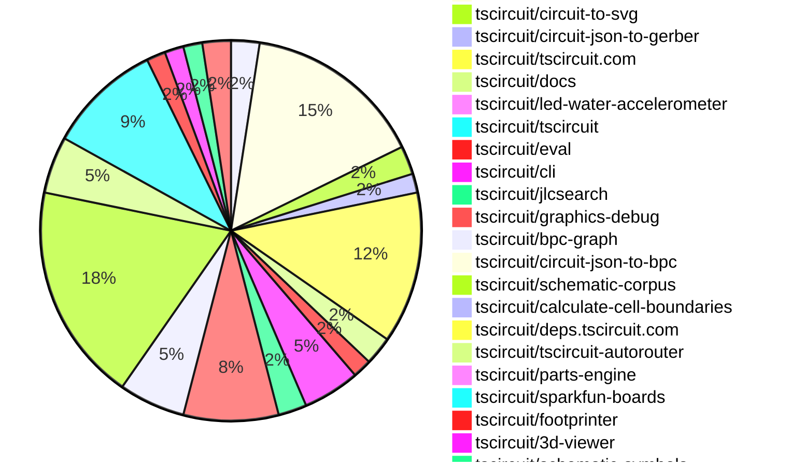

# Contribution Overview 2025-06-25

## PRs by Repository

## Contributor Overview

| Contributor | 🐳 Major | 🐙 Minor | 🐌 Tiny | ⭐ | Issues Created | Discussion Contributions |
|-------------|---------|---------|---------|-----|----------------|--------------------------|
| [seveibar](#seveibar) | 0 | 33 | 5 | 👑👑 | 2 | 0🔹 0🔶 0💎 |
| [Anshgrover23](#Anshgrover23) | 0 | 15 | 6 | ⭐⭐⭐ | 8 | 0🔹 0🔶 0💎 |
| [imrishabh18](#imrishabh18) | 0 | 12 | 4 | ⭐⭐⭐ | 1 | 0🔹 0🔶 0💎 |
| [Abse2001](#Abse2001) | 2 | 9 | 0 | ⭐⭐⭐ | 1 | 0🔹 0🔶 0💎 |
| [ArnavK-09](#ArnavK-09) | 3 | 8 | 4 | ⭐⭐⭐ | 7 | 0🔹 0🔶 0💎 |
| [ShiboSoftwareDev](#ShiboSoftwareDev) | 0 | 8 | 3 | ⭐⭐ | 6 | 0🔹 0🔶 0💎 |
| [techmannih](#techmannih) | 0 | 10 | 3 | ⭐⭐ | 2 | 0🔹 0🔶 0💎 |
| [MustafaMulla29](#MustafaMulla29) | 0 | 2 | 1 | ⭐ | 6 | 0🔹 0🔶 0💎 |
| [andrii-balitskyi](#andrii-balitskyi) | 0 | 1 | 0 |  | 0 | 0🔹 0🔶 0💎 |
| [tscircuitbot](#tscircuitbot) | 0 | 0 | 1 |  | 0 | 0🔹 0🔶 0💎 |

### Discussion Contribution Legend

- 🔹 Normal Comments: Basic participation with minimal effort
- 🔶 Great Informative Comments: Thoughtful participation that adds value
- 💎 Incredible Comments: Exceptional participation with high-quality content

## Review Table

[reviews-received-hover]: ## "Number of reviews received for PRs for this contributor"
[approvals-received-hover]: ## "Number of approvals received for PRs this contributor authored"
[rejections-received-hover]: ## "Number of rejections received for PRs this contributor authored"
[prs-opened-hover]: ## "Number of PRs opened by this contributor"
[issues-created-hover]: ## "Number of issues created by this contributor"
[bountied-issues-hover]: ## "Number of issues this contributor created with a bounty"
[bountied-issue-$-hover]: ## "Total bounty amount placed on issues authored by this contributor"

| Contributor | Reviews Received | Approvals Received | Rejections Received | Approvals | Rejections | PRs Opened | PRs Merged | Issues Created | Bountied Issues | Bountied Issue $ |
|---|---|---|---|---|---|---|---|---|---|---|
| [seveibar](#seveibar) | 5 | 1 | 0 | 38 | 3 | 50 | 38 | 2 | 0 | 0 |
| [imrishabh18](#imrishabh18) | 15 | 7 | 0 | 7 | 1 | 18 | 16 | 1 | 0 | 0 |
| [graphite-app[bot]](#graphite-app[bot]) | 0 | 0 | 0 | 0 | 0 | 0 | 0 | 0 | 0 | 0 |
| [techmannih](#techmannih) | 38 | 17 | 5 | 0 | 4 | 24 | 13 | 2 | 0 | 0 |
| [Anshgrover23](#Anshgrover23) | 29 | 20 | 4 | 2 | 6 | 24 | 21 | 8 | 0 | 0 |
| [ShiboSoftwareDev](#ShiboSoftwareDev) | 12 | 9 | 0 | 13 | 2 | 15 | 11 | 6 | 1 | 5 |
| [MustafaMulla29](#MustafaMulla29) | 8 | 3 | 4 | 0 | 0 | 7 | 3 | 6 | 0 | 0 |
| [ArnavK-09](#ArnavK-09) | 22 | 14 | 1 | 2 | 0 | 17 | 15 | 7 | 0 | 0 |
| [Abse2001](#Abse2001) | 5 | 3 | 1 | 13 | 0 | 13 | 11 | 1 | 0 | 0 |
| [andrii-balitskyi](#andrii-balitskyi) | 2 | 1 | 1 | 0 | 0 | 2 | 1 | 0 | 0 | 0 |
| [tscircuitbot](#tscircuitbot) | 0 | 0 | 0 | 0 | 0 | 32 | 1 | 0 | 0 | 0 |

## Changes by Repository

### [tscircuit/props](https://github.com/tscircuit/props)

| PR # | Impact | Contributor | Description | Milestone Aligned |
|------|--------|-------------|-------------|-------------------|
| [#307](https://github.com/tscircuit/props/pull/307) | 🐙 Minor | imrishabh18 | Enhancements to the PlatformConfig interface improve configurability and documentation for board information. | ❌ |
| [#308](https://github.com/tscircuit/props/pull/308) | 🐙 Minor | seveibar | Enhancements to component props with new optional attributes improve type safety and flexibility in component usage. | ❌ |
| [#304](https://github.com/tscircuit/props/pull/304) | 🐙 Minor | Anshgrover23 | Enhancement of LED component functionality by introducing a connections property for better integration. | ❌ |

### [tscircuit/core](https://github.com/tscircuit/core)

| PR # | Impact | Contributor | Description | Milestone Aligned |
|------|--------|-------------|-------------|-------------------|
| [#996](https://github.com/tscircuit/core/pull/996) | 🐳 Major | Abse2001 | Enhancement of selector functionality by introducing support for test point selectors, improving the library's usability for keyboard building. | ✅ |
| [#998](https://github.com/tscircuit/core/pull/998) | 🐙 Minor | imrishabh18 | Enhances the board's silkscreen by adding project-specific information, improving documentation and usability. | ❌ |
| [#1002](https://github.com/tscircuit/core/pull/1002) | 🐙 Minor | imrishabh18 | Enhances routing logic to prevent multiple traces between the same pins in subcircuits, improving circuit design integrity. | ❌ |
| [#997](https://github.com/tscircuit/core/pull/997) | 🐙 Minor | imrishabh18 | The addition of a test case to ensure that subcircuits do not generate duplicate traces enhances the reliability of the circuit design process. | ❌ |
| [#992](https://github.com/tscircuit/core/pull/992) | 🐙 Minor | imrishabh18 | Enhancements to the SolderJumper component improve its configurability by allowing dynamic symbol names. | ❌ |
| [#989](https://github.com/tscircuit/core/pull/989) | 🐙 Minor | imrishabh18 | Enhancement of the SolderJumper component to support a new bridged property, improving its functionality. | ❌ |
| [#1016](https://github.com/tscircuit/core/pull/1016) | 🐙 Minor | seveibar | Introduces a new algorithm for schematic layout adaptation using BPC graphs, enhancing the routing capabilities of the circuit design. | ❌ |
| [#1015](https://github.com/tscircuit/core/pull/1015) | 🐙 Minor | seveibar | Enhancements to schematic symbol rotation through new orientation tests for polarized capacitors. | ❌ |
| [#1005](https://github.com/tscircuit/core/pull/1005) | 🐙 Minor | seveibar | Elimination of a placeholder enhances code clarity and ensures proper fallback naming in component generation. | ❌ |
| [#1004](https://github.com/tscircuit/core/pull/1004) | 🐙 Minor | seveibar | Enhancements to netlabel positioning improve schematic accuracy and usability. | ❌ |
| [#1003](https://github.com/tscircuit/core/pull/1003) | 🐙 Minor | seveibar | Fixes an issue with net IDs in schematic net labels, ensuring correct data is used. | ❌ |
| [#976](https://github.com/tscircuit/core/pull/976) | 🐙 Minor | seveibar | Enhances net label positioning by automatically determining orientation based on connected components, improving schematic clarity. | ❌ |
| [#1008](https://github.com/tscircuit/core/pull/1008) | 🐙 Minor | ShiboSoftwareDev | Enhancements to the board center calculation improve accuracy in PCB design. | ❌ |
| [#1000](https://github.com/tscircuit/core/pull/1000) | 🐙 Minor | ShiboSoftwareDev | Enhances the library by adding functionality to generate obstacles for cutout components, improving the design capabilities. | ❌ |
| [#1009](https://github.com/tscircuit/core/pull/1009) | 🐙 Minor | MustafaMulla29 | Enhances testing capabilities for jumper netlabel connections in the circuit design. | ❌ |
| [#1013](https://github.com/tscircuit/core/pull/1013) | 🐌 Tiny | imrishabh18 | Locking the css-select package version to avoid breaking type definitions enhances stability in the project. | ❌ |
| [#995](https://github.com/tscircuit/core/pull/995) | 🐌 Tiny | Anshgrover23 | Enhances testing capabilities for the LED component by adding a connections test, ensuring proper functionality. | ❌ |
| [#999](https://github.com/tscircuit/core/pull/999) | 🐌 Tiny | ShiboSoftwareDev | Updates the footprinter package version and adjusts test cases for consistency in height values. | ❌ |
| [#1014](https://github.com/tscircuit/core/pull/1014) | 🐌 Tiny | techmannih | Enhancements to schematic testing and symbol updates contribute to improved functionality in circuit design. | ❌ |

### [tscircuit/circuit-to-svg](https://github.com/tscircuit/circuit-to-svg)

| PR # | Impact | Contributor | Description | Milestone Aligned |
|------|--------|-------------|-------------|-------------------|
| [#268](https://github.com/tscircuit/circuit-to-svg/pull/268) | 🐙 Minor | imrishabh18 | Enhancement of text rendering capabilities in PCB silkscreen by supporting multiline text. | ❌ |
| [#276](https://github.com/tscircuit/circuit-to-svg/pull/276) | 🐙 Minor | seveibar | Reduces visual clutter by removing overlines from net labels and adjusts font sizes for better readability. | ❌ |
| [#270](https://github.com/tscircuit/circuit-to-svg/pull/270) | 🐙 Minor | ShiboSoftwareDev | Enhancements to the SVG rendering of assembly components by adding pads, pins, and holes, improving visual representation. | ❌ |

### [tscircuit/circuit-json-to-gerber](https://github.com/tscircuit/circuit-json-to-gerber)

| PR # | Impact | Contributor | Description | Milestone Aligned |
|------|--------|-------------|-------------|-------------------|
| [#45](https://github.com/tscircuit/circuit-json-to-gerber/pull/45) | 🐙 Minor | imrishabh18 | Enhancements to text rendering in Gerber files improve layout precision for silkscreen text. | ❌ |
| [#44](https://github.com/tscircuit/circuit-json-to-gerber/pull/44) | 🐙 Minor | seveibar | Enhancement of text anchor support in Gerber conversion, improving layout flexibility. | ❌ |

### [tscircuit/tscircuit.com](https://github.com/tscircuit/tscircuit.com)

| PR # | Impact | Contributor | Description | Milestone Aligned |
|------|--------|-------------|-------------|-------------------|
| [#1388](https://github.com/tscircuit/tscircuit.com/pull/1388) | 🐳 Major | ArnavK-09 | Introduces a global find and replace feature, enhancing code editing capabilities significantly. | ❌ |
| [#1378](https://github.com/tscircuit/tscircuit.com/pull/1378) | 🐳 Major | ArnavK-09 | Revamping the Cmd+K menu enhances user experience by improving search functionality and interface design. | ❌ |
| [#1371](https://github.com/tscircuit/tscircuit.com/pull/1371) | 🐙 Minor | imrishabh18 | Enhances the dashboard by ensuring packages are sorted based on their update or creation date, improving user experience. | ❌ |
| [#1370](https://github.com/tscircuit/tscircuit.com/pull/1370) | 🐙 Minor | imrishabh18 | Enhances the dashboard functionality by preventing mutation of cached package data during sorting, ensuring data integrity. | ❌ |
| [#1325](https://github.com/tscircuit/tscircuit.com/pull/1325) | 🐙 Minor | seveibar | Enhancing TypeScript library caching through IndexedDB improves performance and resource management in the CodeEditor. | ❌ |
| [#1382](https://github.com/tscircuit/tscircuit.com/pull/1382) | 🐙 Minor | ArnavK-09 | Introducing a native sharing feature enhances user engagement by allowing easy sharing of package information. | ❌ |
| [#1381](https://github.com/tscircuit/tscircuit.com/pull/1381) | 🐙 Minor | ArnavK-09 | Enhances user experience by preventing navigation errors during package loading. | ❌ |
| [#1379](https://github.com/tscircuit/tscircuit.com/pull/1379) | 🐙 Minor | ArnavK-09 | Enhancements to responsiveness improve user experience on build pages. | ❌ |
| [#1374](https://github.com/tscircuit/tscircuit.com/pull/1374) | 🐙 Minor | ArnavK-09 | Enhancing user experience by ensuring the correct GitHub username is displayed in the settings dialog. | ❌ |
| [#1373](https://github.com/tscircuit/tscircuit.com/pull/1373) | 🐙 Minor | ArnavK-09 | Enhancing security by limiting AI review generation to package owners adds a crucial layer of access control. | ❌ |
| [#1372](https://github.com/tscircuit/tscircuit.com/pull/1372) | 🐙 Minor | ArnavK-09 | Introducing a toggle button for AI autocomplete enhances user interaction and functionality within the Code Editor. | ❌ |
| [#1368](https://github.com/tscircuit/tscircuit.com/pull/1368) | 🐙 Minor | andrii-balitskyi | Enhancements to the AI review loading state improve user experience during review requests. | ❌ |
| [#1389](https://github.com/tscircuit/tscircuit.com/pull/1389) | 🐌 Tiny | Anshgrover23 | Updating the circuit-to-svg dependency enhances the project's compatibility with the latest features and fixes. | ❌ |
| [#1387](https://github.com/tscircuit/tscircuit.com/pull/1387) | 🐌 Tiny | ArnavK-09 | Updating dependencies enhances the stability and performance of the project by ensuring that the latest features and bug fixes are included. | ❌ |
| [#1384](https://github.com/tscircuit/tscircuit.com/pull/1384) | 🐌 Tiny | ArnavK-09 | Enhancements to the UI components for better size management and performance. | ❌ |
| [#1383](https://github.com/tscircuit/tscircuit.com/pull/1383) | 🐌 Tiny | ArnavK-09 | The change enhances the visual presentation of the CmdKMenu component by removing unnecessary spacing, leading to a cleaner UI. | ❌ |

### [tscircuit/docs](https://github.com/tscircuit/docs)

| PR # | Impact | Contributor | Description | Milestone Aligned |
|------|--------|-------------|-------------|-------------------|
| [#93](https://github.com/tscircuit/docs/pull/93) | 🐙 Minor | imrishabh18 | Enhances documentation by adding video demonstrations for manual edits in PCB and schematic viewers. | ❌ |
| [#94](https://github.com/tscircuit/docs/pull/94) | 🐌 Tiny | seveibar | Enhances documentation for the `schOrientation` property, improving user understanding of polarized capacitor orientation. | ❌ |
| [#92](https://github.com/tscircuit/docs/pull/92) | 🐌 Tiny | seveibar | Enhances documentation by detailing the usage of `sel.net` within the selector pattern, improving developer understanding. | ❌ |

### [tscircuit/led-water-accelerometer](https://github.com/tscircuit/led-water-accelerometer)

| PR # | Impact | Contributor | Description | Milestone Aligned |
|------|--------|-------------|-------------|-------------------|
| [#3](https://github.com/tscircuit/led-water-accelerometer/pull/3) | 🐙 Minor | imrishabh18 | Enhancements to the PCB design by adding mounting holes and improving power connections. | ❌ |

### [tscircuit/tscircuit](https://github.com/tscircuit/tscircuit)

| PR # | Impact | Contributor | Description | Milestone Aligned |
|------|--------|-------------|-------------|-------------------|
| [#694](https://github.com/tscircuit/tscircuit/pull/694) | 🐌 Tiny | imrishabh18 | Updates the core and eval packages to newer versions, ensuring compatibility and potentially introducing minor improvements. | ❌ |

### [tscircuit/eval](https://github.com/tscircuit/eval)

| PR # | Impact | Contributor | Description | Milestone Aligned |
|------|--------|-------------|-------------|-------------------|
| [#608](https://github.com/tscircuit/eval/pull/608) | 🐌 Tiny | imrishabh18 | Updating the core package version enhances compatibility and potentially introduces new features or fixes. | ❌ |
| [#619](https://github.com/tscircuit/eval/pull/619) | 🐌 Tiny | tscircuitbot | Updating dependencies is essential for maintaining project health and ensuring compatibility with other packages. | ❌ |

### [tscircuit/cli](https://github.com/tscircuit/cli)

| PR # | Impact | Contributor | Description | Milestone Aligned |
|------|--------|-------------|-------------|-------------------|
| [#251](https://github.com/tscircuit/cli/pull/251) | 🐙 Minor | ShiboSoftwareDev | Updating the Node.js version in workflows enhances compatibility and performance for the project. | ❌ |
| [#250](https://github.com/tscircuit/cli/pull/250) | 🐙 Minor | ShiboSoftwareDev | Enhancing the build command to allow for error tolerance improves user experience and flexibility during the build process. | ❌ |
| [#252](https://github.com/tscircuit/cli/pull/252) | 🐌 Tiny | imrishabh18 | Updates dependencies in the package.json file to newer versions, ensuring compatibility and potentially improved functionality. | ❌ |
| [#253](https://github.com/tscircuit/cli/pull/253) | 🐌 Tiny | seveibar | Refactoring the CLI to utilize peer dependencies enhances compatibility and reduces bundle size, improving overall performance. | ❌ |
| [#255](https://github.com/tscircuit/cli/pull/255) | 🐌 Tiny | Anshgrover23 | Updating dependencies enhances the stability and performance of the project by ensuring compatibility with the latest features and fixes. | ❌ |
| [#254](https://github.com/tscircuit/cli/pull/254) | 🐌 Tiny | ArnavK-09 | Updates dependencies to newer versions, ensuring compatibility and potentially improving performance. | ❌ |

### [tscircuit/jlcsearch](https://github.com/tscircuit/jlcsearch)

| PR # | Impact | Contributor | Description | Milestone Aligned |
|------|--------|-------------|-------------|-------------------|
| [#62](https://github.com/tscircuit/jlcsearch/pull/62) | 🐙 Minor | seveibar | Enhances the gas sensors functionality by introducing measurement filtering, improving user experience and data relevance. | ❌ |
| [#61](https://github.com/tscircuit/jlcsearch/pull/61) | 🐙 Minor | seveibar | Enhancements to gas sensor data handling and exposure of measurement capabilities. | ❌ |
| [#60](https://github.com/tscircuit/jlcsearch/pull/60) | 🐙 Minor | seveibar | The addition of a dedicated page for Boost DC-DC converters enhances the repository's functionality by providing users with a structured way to access and filter converter data. | ❌ |

### [tscircuit/graphics-debug](https://github.com/tscircuit/graphics-debug)

| PR # | Impact | Contributor | Description | Milestone Aligned |
|------|--------|-------------|-------------|-------------------|
| [#64](https://github.com/tscircuit/graphics-debug/pull/64) | 🐙 Minor | seveibar | Enhancements to rectangle label positioning and size improve visual clarity and usability. | ❌ |
| [#66](https://github.com/tscircuit/graphics-debug/pull/66) | 🐙 Minor | seveibar | Enhancing SVG customization by allowing dynamic width and height parameters significantly improves flexibility for users. | ❌ |
| [#65](https://github.com/tscircuit/graphics-debug/pull/65) | 🐙 Minor | seveibar | Corrects the Y offset in graphics grid creation to ensure proper row orientation, enhancing the functionality of the graphics grid. | ❌ |
| [#63](https://github.com/tscircuit/graphics-debug/pull/63) | 🐙 Minor | seveibar | Dynamic font sizing for rectangle labels enhances visual clarity and adaptability in graphics rendering. | ❌ |
| [#62](https://github.com/tscircuit/graphics-debug/pull/62) | 🐙 Minor | seveibar | Enhancements to the graphics grid functionality by allowing customizable gaps between cells, improving layout flexibility. | ❌ |
| [#61](https://github.com/tscircuit/graphics-debug/pull/61) | 🐙 Minor | seveibar | Introduces a new method for arranging graphics in a grid layout, enhancing the library's functionality. | ❌ |
| [#60](https://github.com/tscircuit/graphics-debug/pull/60) | 🐙 Minor | seveibar | The addition of stacking utilities enhances the library's functionality by allowing users to easily arrange graphics, improving usability and flexibility. | ❌ |
| [#59](https://github.com/tscircuit/graphics-debug/pull/59) | 🐙 Minor | seveibar | Enhancements to text sizing logic improve rendering accuracy and flexibility in graphics. | ❌ |
| [#58](https://github.com/tscircuit/graphics-debug/pull/58) | 🐙 Minor | seveibar | Enhancements to graphics rendering by introducing text objects, improving the overall functionality and interactivity of the graphics component. | ❌ |
| [#57](https://github.com/tscircuit/graphics-debug/pull/57) | 🐙 Minor | seveibar | The addition of the `mergeGraphics` utility enhances the library's functionality by allowing the combination of multiple graphics objects, which is valuable for users needing to manage complex graphics compositions. | ❌ |

### [tscircuit/bpc-graph](https://github.com/tscircuit/bpc-graph)

| PR # | Impact | Contributor | Description | Milestone Aligned |
|------|--------|-------------|-------------|-------------------|
| [#10](https://github.com/tscircuit/bpc-graph/pull/10) | 🐙 Minor | seveibar | The implementation of box side graph utilities enhances the graph processing capabilities by allowing for the detection and merging of isolated box sides, which is crucial for improving the overall functionality of the graph system. | ❌ |
| [#9](https://github.com/tscircuit/bpc-graph/pull/9) | 🐙 Minor | seveibar | Enhancements to the net adaptation logic and additional testing improve the robustness and reliability of the BPC graph handling. | ❌ |
| [#8](https://github.com/tscircuit/bpc-graph/pull/8) | 🐙 Minor | seveibar | Enhancements to the graphical representation and editing capabilities of the BPC graph, improving visualization and interaction. | ❌ |
| [#7](https://github.com/tscircuit/bpc-graph/pull/7) | 🐙 Minor | seveibar | Enhancements to adjacency matrix computations and graph matching functionalities significantly improve the library's capabilities. | ❌ |
| [#6](https://github.com/tscircuit/bpc-graph/pull/6) | 🐙 Minor | seveibar | Enhancements to the BPC graph functionality, including renaming and restructuring for improved clarity and performance. | ❌ |
| [#5](https://github.com/tscircuit/bpc-graph/pull/5) | 🐙 Minor | seveibar | Enhancements to the graph transformation process with added logging and a new corpus matcher page. | ❌ |
| [#4](https://github.com/tscircuit/bpc-graph/pull/4) | 🐙 Minor | seveibar | The addition of a corpus matcher page enhances the functionality of the application by allowing users to compare BPC graphs against a predefined corpus, thereby improving usability and feature set. | ❌ |

### [tscircuit/circuit-json-to-bpc](https://github.com/tscircuit/circuit-json-to-bpc)

| PR # | Impact | Contributor | Description | Milestone Aligned |
|------|--------|-------------|-------------|-------------------|
| [#2](https://github.com/tscircuit/circuit-json-to-bpc/pull/2) | 🐙 Minor | seveibar | Enhances the circuit conversion process by integrating schematic net labels as boxes with pins, improving the overall functionality. | ❌ |

### [tscircuit/schematic-corpus](https://github.com/tscircuit/schematic-corpus)

| PR # | Impact | Contributor | Description | Milestone Aligned |
|------|--------|-------------|-------------|-------------------|
| [#25](https://github.com/tscircuit/schematic-corpus/pull/25) | 🐙 Minor | seveibar | Enhancements to the graphics generation for BPC graphs improve the visual representation of circuit designs. | ❌ |
| [#36](https://github.com/tscircuit/schematic-corpus/pull/36) | 🐙 Minor | Anshgrover23 | Introduces a new circuit design component that enhances the schematic library. | ❌ |
| [#34](https://github.com/tscircuit/schematic-corpus/pull/34) | 🐙 Minor | Anshgrover23 | Introduces a new circuit design with specific component placements and updates the core library version. | ❌ |
| [#32](https://github.com/tscircuit/schematic-corpus/pull/32) | 🐙 Minor | Anshgrover23 | The addition of design 24 introduces new circuit components and connections, enhancing the overall functionality of the schematic corpus. | ❌ |
| [#24](https://github.com/tscircuit/schematic-corpus/pull/24) | 🐙 Minor | Anshgrover23 | Introduces a new circuit design with components and connections, enhancing the schematic corpus. | ❌ |
| [#22](https://github.com/tscircuit/schematic-corpus/pull/22) | 🐙 Minor | Anshgrover23 | Introduces a new circuit design component that enhances the schematic library. | ❌ |
| [#10](https://github.com/tscircuit/schematic-corpus/pull/10) | 🐙 Minor | Anshgrover23 | Introduces a new design example that enhances the library's usability and showcases additional functionality. | ❌ |
| [#33](https://github.com/tscircuit/schematic-corpus/pull/33) | 🐙 Minor | techmannih | Introduces a new circuit design component that enhances the schematic library. | ❌ |
| [#31](https://github.com/tscircuit/schematic-corpus/pull/31) | 🐙 Minor | techmannih | Enhancements to the design025 circuit layout, improving pin arrangement and netlabel connections. | ❌ |
| [#27](https://github.com/tscircuit/schematic-corpus/pull/27) | 🐙 Minor | techmannih | Introduces a new circuit design component that enhances the schematic library. | ❌ |
| [#26](https://github.com/tscircuit/schematic-corpus/pull/26) | 🐙 Minor | techmannih | Introduces a new circuit design component that enhances the schematic library. | ❌ |
| [#21](https://github.com/tscircuit/schematic-corpus/pull/21) | 🐙 Minor | techmannih | Introduces a new circuit design component that enhances the schematic library. | ❌ |
| [#20](https://github.com/tscircuit/schematic-corpus/pull/20) | 🐙 Minor | Abse2001 | Introduces a new circuit design with multiple net labels for a chip configuration. | ❌ |
| [#19](https://github.com/tscircuit/schematic-corpus/pull/19) | 🐙 Minor | Abse2001 | Enhancements to the circuit design with additional net labels and connections for improved functionality. | ❌ |
| [#18](https://github.com/tscircuit/schematic-corpus/pull/18) | 🐙 Minor | Abse2001 | Introduces a new circuit design component that enhances the schematic capabilities of the project. | ❌ |
| [#17](https://github.com/tscircuit/schematic-corpus/pull/17) | 🐙 Minor | Abse2001 | Introduces a new circuit design component with specific net labels and connections. | ❌ |
| [#16](https://github.com/tscircuit/schematic-corpus/pull/16) | 🐙 Minor | Abse2001 | Introduces a new circuit design component with a switch, capacitor, resistor, and net labels for schematic representation. | ❌ |
| [#15](https://github.com/tscircuit/schematic-corpus/pull/15) | 🐙 Minor | Abse2001 | Introduces a new circuit design component with specific net labels and connections. | ❌ |
| [#14](https://github.com/tscircuit/schematic-corpus/pull/14) | 🐙 Minor | Abse2001 | Introduces a new circuit design featuring a schottky diode, addressing a specific issue with its symbol representation. | ❌ |
| [#13](https://github.com/tscircuit/schematic-corpus/pull/13) | 🐙 Minor | Abse2001 | Introduces a new circuit design with specific capacitor placements and net labels. | ❌ |
| [#12](https://github.com/tscircuit/schematic-corpus/pull/12) | 🐙 Minor | Abse2001 | Introduces a new circuit design with specific component placements and updates package dependencies. | ❌ |
| [#11](https://github.com/tscircuit/schematic-corpus/pull/11) | 🐌 Tiny | seveibar | The changes enhance the package dependencies and type definitions, improving the overall development environment. | ❌ |
| [#35](https://github.com/tscircuit/schematic-corpus/pull/35) | 🐌 Tiny | techmannih | Introduces a new circuit design component that enhances the schematic library. | ❌ |

### [tscircuit/calculate-cell-boundaries](https://github.com/tscircuit/calculate-cell-boundaries)

| PR # | Impact | Contributor | Description | Milestone Aligned |
|------|--------|-------------|-------------|-------------------|
| [#7](https://github.com/tscircuit/calculate-cell-boundaries/pull/7) | 🐙 Minor | seveibar | Refactoring the internal layout enhances code organization and maintainability, improving the overall structure of the project. | ❌ |

### [tscircuit/deps.tscircuit.com](https://github.com/tscircuit/deps.tscircuit.com)

| PR # | Impact | Contributor | Description | Milestone Aligned |
|------|--------|-------------|-------------|-------------------|
| [#23](https://github.com/tscircuit/deps.tscircuit.com/pull/23) | 🐌 Tiny | seveibar | Enhances the dependency graph by categorizing and installing the @tscircuit/cli package as a downstream dependency. | ❌ |

### [tscircuit/tscircuit-autorouter](https://github.com/tscircuit/tscircuit-autorouter)

| PR # | Impact | Contributor | Description | Milestone Aligned |
|------|--------|-------------|-------------|-------------------|
| [#172](https://github.com/tscircuit/tscircuit-autorouter/pull/172) | 🐙 Minor | Anshgrover23 | Enhancements to testing fixtures for improved debugging of hypersolver issues. | ❌ |
| [#171](https://github.com/tscircuit/tscircuit-autorouter/pull/171) | 🐙 Minor | Anshgrover23 | Enhancements to testing fixtures for hyperdensity bugs improve the robustness of the autorouting feature. | ❌ |
| [#165](https://github.com/tscircuit/tscircuit-autorouter/pull/165) | 🐙 Minor | Anshgrover23 | Enhancements to the hyperdensity solver through the addition of new fixtures for testing. | ❌ |
| [#168](https://github.com/tscircuit/tscircuit-autorouter/pull/168) | 🐙 Minor | Anshgrover23 | Introduces a new JSON asset and a corresponding fixture for high-density debugging, enhancing testing capabilities. | ❌ |
| [#177](https://github.com/tscircuit/tscircuit-autorouter/pull/177) | 🐙 Minor | techmannih | Enhancements to high-density node fixtures improve the functionality and testing capabilities of the autorouter. | ❌ |
| [#170](https://github.com/tscircuit/tscircuit-autorouter/pull/170) | 🐌 Tiny | Anshgrover23 | Excluding JSON files from formatting enhances the development workflow by preventing unnecessary changes in these files. | ❌ |

### [tscircuit/parts-engine](https://github.com/tscircuit/parts-engine)

| PR # | Impact | Contributor | Description | Milestone Aligned |
|------|--------|-------------|-------------|-------------------|
| [#8](https://github.com/tscircuit/parts-engine/pull/8) | 🐙 Minor | Anshgrover23 | Enhances robustness by ensuring that undefined fuses are handled gracefully, preventing potential runtime errors. | ❌ |

### [tscircuit/sparkfun-boards](https://github.com/tscircuit/sparkfun-boards)

| PR # | Impact | Contributor | Description | Milestone Aligned |
|------|--------|-------------|-------------|-------------------|
| [#29](https://github.com/tscircuit/sparkfun-boards/pull/29) | 🐳 Major | Abse2001 | The addition of a new board design for the SparkFun Transceiver Breakout MAX3232 enhances the repository's offerings and provides essential components for circuit design. | ❌ |
| [#33](https://github.com/tscircuit/sparkfun-boards/pull/33) | 🐙 Minor | Anshgrover23 | Refactoring the code to improve organization and maintainability by separating the jumper footprint into its own file enhances clarity and modularity. | ❌ |
| [#24](https://github.com/tscircuit/sparkfun-boards/pull/24) | 🐙 Minor | Anshgrover23 | The update enhances the RFM69 breakout board's design by refining its schematic and PCB layout, improving clarity and functionality. | ❌ |
| [#18](https://github.com/tscircuit/sparkfun-boards/pull/18) | 🐙 Minor | Anshgrover23 | The addition of the SparkFun Human Presence and Motion Sensor enhances the repository's offerings, providing new functionality for users. | ❌ |
| [#12](https://github.com/tscircuit/sparkfun-boards/pull/12) | 🐙 Minor | techmannih | The pull request enhances the USBToSerialBreakout board by correcting pin labels and adding a new component, improving functionality and clarity. | ❌ |
| [#37](https://github.com/tscircuit/sparkfun-boards/pull/37) | 🐙 Minor | MustafaMulla29 | The changes enhance the design and functionality of the HMC6343 breakout board, improving component placement and specifications. | ❌ |
| [#32](https://github.com/tscircuit/sparkfun-boards/pull/32) | 🐌 Tiny | Anshgrover23 | Enhancements to the package.json scripts improve the development workflow by adding snapshot capabilities. | ❌ |
| [#16](https://github.com/tscircuit/sparkfun-boards/pull/16) | 🐌 Tiny | Anshgrover23 | Adding a README file enhances documentation and usability for users of the SparkFun RFM69 Breakout board. | ❌ |
| [#30](https://github.com/tscircuit/sparkfun-boards/pull/30) | 🐌 Tiny | ShiboSoftwareDev | The pull request refines the schematic adjustments for the I2C DAC Breakout, enhancing precision in component placement. | ❌ |
| [#25](https://github.com/tscircuit/sparkfun-boards/pull/25) | 🐌 Tiny | ShiboSoftwareDev | Enhancements to the CI workflows and dependency updates improve build reliability and maintainability. | ❌ |
| [#31](https://github.com/tscircuit/sparkfun-boards/pull/31) | 🐌 Tiny | techmannih | Adding a README file enhances documentation and usability for the SparkFun USB to Serial Breakout board. | ❌ |
| [#21](https://github.com/tscircuit/sparkfun-boards/pull/21) | 🐌 Tiny | MustafaMulla29 | Updates dependencies and snapshots to ensure compatibility and reflect recent changes in the project. | ❌ |

### [tscircuit/footprinter](https://github.com/tscircuit/footprinter)

| PR # | Impact | Contributor | Description | Milestone Aligned |
|------|--------|-------------|-------------|-------------------|
| [#307](https://github.com/tscircuit/footprinter/pull/307) | 🐙 Minor | ShiboSoftwareDev | Enhancement of the pinrow functionality by allowing the omission of silkscreen pin labels, improving design flexibility. | ❌ |
| [#306](https://github.com/tscircuit/footprinter/pull/306) | 🐙 Minor | techmannih | Adjusts the dimensions of the 1210 footprint to improve compatibility with tall pads, enhancing design accuracy. | ❌ |

### [tscircuit/3d-viewer](https://github.com/tscircuit/3d-viewer)

| PR # | Impact | Contributor | Description | Milestone Aligned |
|------|--------|-------------|-------------|-------------------|
| [#365](https://github.com/tscircuit/3d-viewer/pull/365) | 🐙 Minor | ShiboSoftwareDev | Enhancements to JSX board definitions improve the functionality and flexibility of the Manifold engine. | ❌ |
| [#364](https://github.com/tscircuit/3d-viewer/pull/364) | 🐙 Minor | ShiboSoftwareDev | Enhancements to handle empty board scenarios improve the robustness of the manifold rendering process. | ❌ |

### [tscircuit/schematic-symbols](https://github.com/tscircuit/schematic-symbols)

| PR # | Impact | Contributor | Description | Milestone Aligned |
|------|--------|-------------|-------------|-------------------|
| [#316](https://github.com/tscircuit/schematic-symbols/pull/316) | 🐙 Minor | techmannih | Introduces a new symbol for representing unconnected nodes in schematic diagrams, enhancing the library's functionality. | ❌ |
| [#315](https://github.com/tscircuit/schematic-symbols/pull/315) | 🐙 Minor | techmannih | The pull request reduces the size of the testpoint symbol, enhancing the visual clarity of schematic diagrams. | ❌ |

### [tscircuit/runframe](https://github.com/tscircuit/runframe)

| PR # | Impact | Contributor | Description | Milestone Aligned |
|------|--------|-------------|-------------|-------------------|
| [#820](https://github.com/tscircuit/runframe/pull/820) | 🐳 Major | ArnavK-09 | Enhancements to the user interface by enabling full-screen previews for better user experience. | ❌ |
| [#824](https://github.com/tscircuit/runframe/pull/824) | 🐙 Minor | ArnavK-09 | Enhances user experience by ensuring that the last active tab is preserved when an error occurs, improving usability. | ❌ |
| [#823](https://github.com/tscircuit/runframe/pull/823) | 🐙 Minor | ArnavK-09 | The changes enhance the user interface by ensuring proper height adjustments for full-screen and CLI runframe previews, improving usability and visual consistency. | ❌ |

## Changes by Contributor

### [imrishabh18](https://github.com/imrishabh18)

| PR # | Impact | Description | Milestone Aligned |
|------|--------|-------------|-------------------|
| [#307](https://github.com/tscircuit/props/pull/307) | 🐙 Minor | Enhancements to the PlatformConfig interface improve configurability and documentation for board information. | ❌ |
| [#998](https://github.com/tscircuit/core/pull/998) | 🐙 Minor | Enhances the board's silkscreen by adding project-specific information, improving documentation and usability. | ❌ |
| [#1002](https://github.com/tscircuit/core/pull/1002) | 🐙 Minor | Enhances routing logic to prevent multiple traces between the same pins in subcircuits, improving circuit design integrity. | ❌ |
| [#997](https://github.com/tscircuit/core/pull/997) | 🐙 Minor | The addition of a test case to ensure that subcircuits do not generate duplicate traces enhances the reliability of the circuit design process. | ❌ |
| [#992](https://github.com/tscircuit/core/pull/992) | 🐙 Minor | Enhancements to the SolderJumper component improve its configurability by allowing dynamic symbol names. | ❌ |
| [#989](https://github.com/tscircuit/core/pull/989) | 🐙 Minor | Enhancement of the SolderJumper component to support a new bridged property, improving its functionality. | ❌ |
| [#268](https://github.com/tscircuit/circuit-to-svg/pull/268) | 🐙 Minor | Enhancement of text rendering capabilities in PCB silkscreen by supporting multiline text. | ❌ |
| [#45](https://github.com/tscircuit/circuit-json-to-gerber/pull/45) | 🐙 Minor | Enhancements to text rendering in Gerber files improve layout precision for silkscreen text. | ❌ |
| [#1371](https://github.com/tscircuit/tscircuit.com/pull/1371) | 🐙 Minor | Enhances the dashboard by ensuring packages are sorted based on their update or creation date, improving user experience. | ❌ |
| [#1370](https://github.com/tscircuit/tscircuit.com/pull/1370) | 🐙 Minor | Enhances the dashboard functionality by preventing mutation of cached package data during sorting, ensuring data integrity. | ❌ |
| [#93](https://github.com/tscircuit/docs/pull/93) | 🐙 Minor | Enhances documentation by adding video demonstrations for manual edits in PCB and schematic viewers. | ❌ |
| [#3](https://github.com/tscircuit/led-water-accelerometer/pull/3) | 🐙 Minor | Enhancements to the PCB design by adding mounting holes and improving power connections. | ❌ |
| [#694](https://github.com/tscircuit/tscircuit/pull/694) | 🐌 Tiny | Updates the core and eval packages to newer versions, ensuring compatibility and potentially introducing minor improvements. | ❌ |
| [#1013](https://github.com/tscircuit/core/pull/1013) | 🐌 Tiny | Locking the css-select package version to avoid breaking type definitions enhances stability in the project. | ❌ |
| [#608](https://github.com/tscircuit/eval/pull/608) | 🐌 Tiny | Updating the core package version enhances compatibility and potentially introduces new features or fixes. | ❌ |
| [#252](https://github.com/tscircuit/cli/pull/252) | 🐌 Tiny | Updates dependencies in the package.json file to newer versions, ensuring compatibility and potentially improved functionality. | ❌ |

### [seveibar](https://github.com/seveibar)

| PR # | Impact | Description | Milestone Aligned |
|------|--------|-------------|-------------------|
| [#308](https://github.com/tscircuit/props/pull/308) | 🐙 Minor | Enhancements to component props with new optional attributes improve type safety and flexibility in component usage. | ❌ |
| [#1016](https://github.com/tscircuit/core/pull/1016) | 🐙 Minor | Introduces a new algorithm for schematic layout adaptation using BPC graphs, enhancing the routing capabilities of the circuit design. | ❌ |
| [#1015](https://github.com/tscircuit/core/pull/1015) | 🐙 Minor | Enhancements to schematic symbol rotation through new orientation tests for polarized capacitors. | ❌ |
| [#1005](https://github.com/tscircuit/core/pull/1005) | 🐙 Minor | Elimination of a placeholder enhances code clarity and ensures proper fallback naming in component generation. | ❌ |
| [#1004](https://github.com/tscircuit/core/pull/1004) | 🐙 Minor | Enhancements to netlabel positioning improve schematic accuracy and usability. | ❌ |
| [#1003](https://github.com/tscircuit/core/pull/1003) | 🐙 Minor | Fixes an issue with net IDs in schematic net labels, ensuring correct data is used. | ❌ |
| [#976](https://github.com/tscircuit/core/pull/976) | 🐙 Minor | Enhances net label positioning by automatically determining orientation based on connected components, improving schematic clarity. | ❌ |
| [#276](https://github.com/tscircuit/circuit-to-svg/pull/276) | 🐙 Minor | Reduces visual clutter by removing overlines from net labels and adjusts font sizes for better readability. | ❌ |
| [#44](https://github.com/tscircuit/circuit-json-to-gerber/pull/44) | 🐙 Minor | Enhancement of text anchor support in Gerber conversion, improving layout flexibility. | ❌ |
| [#1325](https://github.com/tscircuit/tscircuit.com/pull/1325) | 🐙 Minor | Enhancing TypeScript library caching through IndexedDB improves performance and resource management in the CodeEditor. | ❌ |
| [#62](https://github.com/tscircuit/jlcsearch/pull/62) | 🐙 Minor | Enhances the gas sensors functionality by introducing measurement filtering, improving user experience and data relevance. | ❌ |
| [#61](https://github.com/tscircuit/jlcsearch/pull/61) | 🐙 Minor | Enhancements to gas sensor data handling and exposure of measurement capabilities. | ❌ |
| [#60](https://github.com/tscircuit/jlcsearch/pull/60) | 🐙 Minor | The addition of a dedicated page for Boost DC-DC converters enhances the repository's functionality by providing users with a structured way to access and filter converter data. | ❌ |
| [#64](https://github.com/tscircuit/graphics-debug/pull/64) | 🐙 Minor | Enhancements to rectangle label positioning and size improve visual clarity and usability. | ❌ |
| [#66](https://github.com/tscircuit/graphics-debug/pull/66) | 🐙 Minor | Enhancing SVG customization by allowing dynamic width and height parameters significantly improves flexibility for users. | ❌ |
| [#65](https://github.com/tscircuit/graphics-debug/pull/65) | 🐙 Minor | Corrects the Y offset in graphics grid creation to ensure proper row orientation, enhancing the functionality of the graphics grid. | ❌ |
| [#63](https://github.com/tscircuit/graphics-debug/pull/63) | 🐙 Minor | Dynamic font sizing for rectangle labels enhances visual clarity and adaptability in graphics rendering. | ❌ |
| [#62](https://github.com/tscircuit/graphics-debug/pull/62) | 🐙 Minor | Enhancements to the graphics grid functionality by allowing customizable gaps between cells, improving layout flexibility. | ❌ |
| [#61](https://github.com/tscircuit/graphics-debug/pull/61) | 🐙 Minor | Introduces a new method for arranging graphics in a grid layout, enhancing the library's functionality. | ❌ |
| [#60](https://github.com/tscircuit/graphics-debug/pull/60) | 🐙 Minor | The addition of stacking utilities enhances the library's functionality by allowing users to easily arrange graphics, improving usability and flexibility. | ❌ |
| [#59](https://github.com/tscircuit/graphics-debug/pull/59) | 🐙 Minor | Enhancements to text sizing logic improve rendering accuracy and flexibility in graphics. | ❌ |
| [#58](https://github.com/tscircuit/graphics-debug/pull/58) | 🐙 Minor | Enhancements to graphics rendering by introducing text objects, improving the overall functionality and interactivity of the graphics component. | ❌ |
| [#57](https://github.com/tscircuit/graphics-debug/pull/57) | 🐙 Minor | The addition of the `mergeGraphics` utility enhances the library's functionality by allowing the combination of multiple graphics objects, which is valuable for users needing to manage complex graphics compositions. | ❌ |
| [#10](https://github.com/tscircuit/bpc-graph/pull/10) | 🐙 Minor | The implementation of box side graph utilities enhances the graph processing capabilities by allowing for the detection and merging of isolated box sides, which is crucial for improving the overall functionality of the graph system. | ❌ |
| [#9](https://github.com/tscircuit/bpc-graph/pull/9) | 🐙 Minor | Enhancements to the net adaptation logic and additional testing improve the robustness and reliability of the BPC graph handling. | ❌ |
| [#8](https://github.com/tscircuit/bpc-graph/pull/8) | 🐙 Minor | Enhancements to the graphical representation and editing capabilities of the BPC graph, improving visualization and interaction. | ❌ |
| [#7](https://github.com/tscircuit/bpc-graph/pull/7) | 🐙 Minor | Enhancements to adjacency matrix computations and graph matching functionalities significantly improve the library's capabilities. | ❌ |
| [#6](https://github.com/tscircuit/bpc-graph/pull/6) | 🐙 Minor | Enhancements to the BPC graph functionality, including renaming and restructuring for improved clarity and performance. | ❌ |
| [#5](https://github.com/tscircuit/bpc-graph/pull/5) | 🐙 Minor | Enhancements to the graph transformation process with added logging and a new corpus matcher page. | ❌ |
| [#4](https://github.com/tscircuit/bpc-graph/pull/4) | 🐙 Minor | The addition of a corpus matcher page enhances the functionality of the application by allowing users to compare BPC graphs against a predefined corpus, thereby improving usability and feature set. | ❌ |
| [#2](https://github.com/tscircuit/circuit-json-to-bpc/pull/2) | 🐙 Minor | Enhances the circuit conversion process by integrating schematic net labels as boxes with pins, improving the overall functionality. | ❌ |
| [#25](https://github.com/tscircuit/schematic-corpus/pull/25) | 🐙 Minor | Enhancements to the graphics generation for BPC graphs improve the visual representation of circuit designs. | ❌ |
| [#7](https://github.com/tscircuit/calculate-cell-boundaries/pull/7) | 🐙 Minor | Refactoring the internal layout enhances code organization and maintainability, improving the overall structure of the project. | ❌ |
| [#253](https://github.com/tscircuit/cli/pull/253) | 🐌 Tiny | Refactoring the CLI to utilize peer dependencies enhances compatibility and reduces bundle size, improving overall performance. | ❌ |
| [#94](https://github.com/tscircuit/docs/pull/94) | 🐌 Tiny | Enhances documentation for the `schOrientation` property, improving user understanding of polarized capacitor orientation. | ❌ |
| [#92](https://github.com/tscircuit/docs/pull/92) | 🐌 Tiny | Enhances documentation by detailing the usage of `sel.net` within the selector pattern, improving developer understanding. | ❌ |
| [#11](https://github.com/tscircuit/schematic-corpus/pull/11) | 🐌 Tiny | The changes enhance the package dependencies and type definitions, improving the overall development environment. | ❌ |
| [#23](https://github.com/tscircuit/deps.tscircuit.com/pull/23) | 🐌 Tiny | Enhances the dependency graph by categorizing and installing the @tscircuit/cli package as a downstream dependency. | ❌ |

### [Anshgrover23](https://github.com/Anshgrover23)

| PR # | Impact | Description | Milestone Aligned |
|------|--------|-------------|-------------------|
| [#304](https://github.com/tscircuit/props/pull/304) | 🐙 Minor | Enhancement of LED component functionality by introducing a connections property for better integration. | ❌ |
| [#172](https://github.com/tscircuit/tscircuit-autorouter/pull/172) | 🐙 Minor | Enhancements to testing fixtures for improved debugging of hypersolver issues. | ❌ |
| [#171](https://github.com/tscircuit/tscircuit-autorouter/pull/171) | 🐙 Minor | Enhancements to testing fixtures for hyperdensity bugs improve the robustness of the autorouting feature. | ❌ |
| [#165](https://github.com/tscircuit/tscircuit-autorouter/pull/165) | 🐙 Minor | Enhancements to the hyperdensity solver through the addition of new fixtures for testing. | ❌ |
| [#168](https://github.com/tscircuit/tscircuit-autorouter/pull/168) | 🐙 Minor | Introduces a new JSON asset and a corresponding fixture for high-density debugging, enhancing testing capabilities. | ❌ |
| [#8](https://github.com/tscircuit/parts-engine/pull/8) | 🐙 Minor | Enhances robustness by ensuring that undefined fuses are handled gracefully, preventing potential runtime errors. | ❌ |
| [#33](https://github.com/tscircuit/sparkfun-boards/pull/33) | 🐙 Minor | Refactoring the code to improve organization and maintainability by separating the jumper footprint into its own file enhances clarity and modularity. | ❌ |
| [#24](https://github.com/tscircuit/sparkfun-boards/pull/24) | 🐙 Minor | The update enhances the RFM69 breakout board's design by refining its schematic and PCB layout, improving clarity and functionality. | ❌ |
| [#18](https://github.com/tscircuit/sparkfun-boards/pull/18) | 🐙 Minor | The addition of the SparkFun Human Presence and Motion Sensor enhances the repository's offerings, providing new functionality for users. | ❌ |
| [#36](https://github.com/tscircuit/schematic-corpus/pull/36) | 🐙 Minor | Introduces a new circuit design component that enhances the schematic library. | ❌ |
| [#34](https://github.com/tscircuit/schematic-corpus/pull/34) | 🐙 Minor | Introduces a new circuit design with specific component placements and updates the core library version. | ❌ |
| [#32](https://github.com/tscircuit/schematic-corpus/pull/32) | 🐙 Minor | The addition of design 24 introduces new circuit components and connections, enhancing the overall functionality of the schematic corpus. | ❌ |
| [#24](https://github.com/tscircuit/schematic-corpus/pull/24) | 🐙 Minor | Introduces a new circuit design with components and connections, enhancing the schematic corpus. | ❌ |
| [#22](https://github.com/tscircuit/schematic-corpus/pull/22) | 🐙 Minor | Introduces a new circuit design component that enhances the schematic library. | ❌ |
| [#10](https://github.com/tscircuit/schematic-corpus/pull/10) | 🐙 Minor | Introduces a new design example that enhances the library's usability and showcases additional functionality. | ❌ |
| [#995](https://github.com/tscircuit/core/pull/995) | 🐌 Tiny | Enhances testing capabilities for the LED component by adding a connections test, ensuring proper functionality. | ❌ |
| [#1389](https://github.com/tscircuit/tscircuit.com/pull/1389) | 🐌 Tiny | Updating the circuit-to-svg dependency enhances the project's compatibility with the latest features and fixes. | ❌ |
| [#255](https://github.com/tscircuit/cli/pull/255) | 🐌 Tiny | Updating dependencies enhances the stability and performance of the project by ensuring compatibility with the latest features and fixes. | ❌ |
| [#170](https://github.com/tscircuit/tscircuit-autorouter/pull/170) | 🐌 Tiny | Excluding JSON files from formatting enhances the development workflow by preventing unnecessary changes in these files. | ❌ |
| [#32](https://github.com/tscircuit/sparkfun-boards/pull/32) | 🐌 Tiny | Enhancements to the package.json scripts improve the development workflow by adding snapshot capabilities. | ❌ |
| [#16](https://github.com/tscircuit/sparkfun-boards/pull/16) | 🐌 Tiny | Adding a README file enhances documentation and usability for users of the SparkFun RFM69 Breakout board. | ❌ |

### [ShiboSoftwareDev](https://github.com/ShiboSoftwareDev)

| PR # | Impact | Description | Milestone Aligned |
|------|--------|-------------|-------------------|
| [#307](https://github.com/tscircuit/footprinter/pull/307) | 🐙 Minor | Enhancement of the pinrow functionality by allowing the omission of silkscreen pin labels, improving design flexibility. | ❌ |
| [#365](https://github.com/tscircuit/3d-viewer/pull/365) | 🐙 Minor | Enhancements to JSX board definitions improve the functionality and flexibility of the Manifold engine. | ❌ |
| [#364](https://github.com/tscircuit/3d-viewer/pull/364) | 🐙 Minor | Enhancements to handle empty board scenarios improve the robustness of the manifold rendering process. | ❌ |
| [#1008](https://github.com/tscircuit/core/pull/1008) | 🐙 Minor | Enhancements to the board center calculation improve accuracy in PCB design. | ❌ |
| [#1000](https://github.com/tscircuit/core/pull/1000) | 🐙 Minor | Enhances the library by adding functionality to generate obstacles for cutout components, improving the design capabilities. | ❌ |
| [#270](https://github.com/tscircuit/circuit-to-svg/pull/270) | 🐙 Minor | Enhancements to the SVG rendering of assembly components by adding pads, pins, and holes, improving visual representation. | ❌ |
| [#251](https://github.com/tscircuit/cli/pull/251) | 🐙 Minor | Updating the Node.js version in workflows enhances compatibility and performance for the project. | ❌ |
| [#250](https://github.com/tscircuit/cli/pull/250) | 🐙 Minor | Enhancing the build command to allow for error tolerance improves user experience and flexibility during the build process. | ❌ |
| [#999](https://github.com/tscircuit/core/pull/999) | 🐌 Tiny | Updates the footprinter package version and adjusts test cases for consistency in height values. | ❌ |
| [#30](https://github.com/tscircuit/sparkfun-boards/pull/30) | 🐌 Tiny | The pull request refines the schematic adjustments for the I2C DAC Breakout, enhancing precision in component placement. | ❌ |
| [#25](https://github.com/tscircuit/sparkfun-boards/pull/25) | 🐌 Tiny | Enhancements to the CI workflows and dependency updates improve build reliability and maintainability. | ❌ |

### [techmannih](https://github.com/techmannih)

| PR # | Impact | Description | Milestone Aligned |
|------|--------|-------------|-------------------|
| [#306](https://github.com/tscircuit/footprinter/pull/306) | 🐙 Minor | Adjusts the dimensions of the 1210 footprint to improve compatibility with tall pads, enhancing design accuracy. | ❌ |
| [#316](https://github.com/tscircuit/schematic-symbols/pull/316) | 🐙 Minor | Introduces a new symbol for representing unconnected nodes in schematic diagrams, enhancing the library's functionality. | ❌ |
| [#315](https://github.com/tscircuit/schematic-symbols/pull/315) | 🐙 Minor | The pull request reduces the size of the testpoint symbol, enhancing the visual clarity of schematic diagrams. | ❌ |
| [#177](https://github.com/tscircuit/tscircuit-autorouter/pull/177) | 🐙 Minor | Enhancements to high-density node fixtures improve the functionality and testing capabilities of the autorouter. | ❌ |
| [#12](https://github.com/tscircuit/sparkfun-boards/pull/12) | 🐙 Minor | The pull request enhances the USBToSerialBreakout board by correcting pin labels and adding a new component, improving functionality and clarity. | ❌ |
| [#33](https://github.com/tscircuit/schematic-corpus/pull/33) | 🐙 Minor | Introduces a new circuit design component that enhances the schematic library. | ❌ |
| [#31](https://github.com/tscircuit/schematic-corpus/pull/31) | 🐙 Minor | Enhancements to the design025 circuit layout, improving pin arrangement and netlabel connections. | ❌ |
| [#27](https://github.com/tscircuit/schematic-corpus/pull/27) | 🐙 Minor | Introduces a new circuit design component that enhances the schematic library. | ❌ |
| [#26](https://github.com/tscircuit/schematic-corpus/pull/26) | 🐙 Minor | Introduces a new circuit design component that enhances the schematic library. | ❌ |
| [#21](https://github.com/tscircuit/schematic-corpus/pull/21) | 🐙 Minor | Introduces a new circuit design component that enhances the schematic library. | ❌ |
| [#1014](https://github.com/tscircuit/core/pull/1014) | 🐌 Tiny | Enhancements to schematic testing and symbol updates contribute to improved functionality in circuit design. | ❌ |
| [#31](https://github.com/tscircuit/sparkfun-boards/pull/31) | 🐌 Tiny | Adding a README file enhances documentation and usability for the SparkFun USB to Serial Breakout board. | ❌ |
| [#35](https://github.com/tscircuit/schematic-corpus/pull/35) | 🐌 Tiny | Introduces a new circuit design component that enhances the schematic library. | ❌ |

### [MustafaMulla29](https://github.com/MustafaMulla29)

| PR # | Impact | Description | Milestone Aligned |
|------|--------|-------------|-------------------|
| [#1009](https://github.com/tscircuit/core/pull/1009) | 🐙 Minor | Enhances testing capabilities for jumper netlabel connections in the circuit design. | ❌ |
| [#37](https://github.com/tscircuit/sparkfun-boards/pull/37) | 🐙 Minor | The changes enhance the design and functionality of the HMC6343 breakout board, improving component placement and specifications. | ❌ |
| [#21](https://github.com/tscircuit/sparkfun-boards/pull/21) | 🐌 Tiny | Updates dependencies and snapshots to ensure compatibility and reflect recent changes in the project. | ❌ |

### [Abse2001](https://github.com/Abse2001)

| PR # | Impact | Description | Milestone Aligned |
|------|--------|-------------|-------------------|
| [#996](https://github.com/tscircuit/core/pull/996) | 🐳 Major | Enhancement of selector functionality by introducing support for test point selectors, improving the library's usability for keyboard building. | ✅ |
| [#29](https://github.com/tscircuit/sparkfun-boards/pull/29) | 🐳 Major | The addition of a new board design for the SparkFun Transceiver Breakout MAX3232 enhances the repository's offerings and provides essential components for circuit design. | ❌ |
| [#20](https://github.com/tscircuit/schematic-corpus/pull/20) | 🐙 Minor | Introduces a new circuit design with multiple net labels for a chip configuration. | ❌ |
| [#19](https://github.com/tscircuit/schematic-corpus/pull/19) | 🐙 Minor | Enhancements to the circuit design with additional net labels and connections for improved functionality. | ❌ |
| [#18](https://github.com/tscircuit/schematic-corpus/pull/18) | 🐙 Minor | Introduces a new circuit design component that enhances the schematic capabilities of the project. | ❌ |
| [#17](https://github.com/tscircuit/schematic-corpus/pull/17) | 🐙 Minor | Introduces a new circuit design component with specific net labels and connections. | ❌ |
| [#16](https://github.com/tscircuit/schematic-corpus/pull/16) | 🐙 Minor | Introduces a new circuit design component with a switch, capacitor, resistor, and net labels for schematic representation. | ❌ |
| [#15](https://github.com/tscircuit/schematic-corpus/pull/15) | 🐙 Minor | Introduces a new circuit design component with specific net labels and connections. | ❌ |
| [#14](https://github.com/tscircuit/schematic-corpus/pull/14) | 🐙 Minor | Introduces a new circuit design featuring a schottky diode, addressing a specific issue with its symbol representation. | ❌ |
| [#13](https://github.com/tscircuit/schematic-corpus/pull/13) | 🐙 Minor | Introduces a new circuit design with specific capacitor placements and net labels. | ❌ |
| [#12](https://github.com/tscircuit/schematic-corpus/pull/12) | 🐙 Minor | Introduces a new circuit design with specific component placements and updates package dependencies. | ❌ |

### [ArnavK-09](https://github.com/ArnavK-09)

| PR # | Impact | Description | Milestone Aligned |
|------|--------|-------------|-------------------|
| [#1388](https://github.com/tscircuit/tscircuit.com/pull/1388) | 🐳 Major | Introduces a global find and replace feature, enhancing code editing capabilities significantly. | ❌ |
| [#1378](https://github.com/tscircuit/tscircuit.com/pull/1378) | 🐳 Major | Revamping the Cmd+K menu enhances user experience by improving search functionality and interface design. | ❌ |
| [#820](https://github.com/tscircuit/runframe/pull/820) | 🐳 Major | Enhancements to the user interface by enabling full-screen previews for better user experience. | ❌ |
| [#1382](https://github.com/tscircuit/tscircuit.com/pull/1382) | 🐙 Minor | Introducing a native sharing feature enhances user engagement by allowing easy sharing of package information. | ❌ |
| [#1381](https://github.com/tscircuit/tscircuit.com/pull/1381) | 🐙 Minor | Enhances user experience by preventing navigation errors during package loading. | ❌ |
| [#1379](https://github.com/tscircuit/tscircuit.com/pull/1379) | 🐙 Minor | Enhancements to responsiveness improve user experience on build pages. | ❌ |
| [#1374](https://github.com/tscircuit/tscircuit.com/pull/1374) | 🐙 Minor | Enhancing user experience by ensuring the correct GitHub username is displayed in the settings dialog. | ❌ |
| [#1373](https://github.com/tscircuit/tscircuit.com/pull/1373) | 🐙 Minor | Enhancing security by limiting AI review generation to package owners adds a crucial layer of access control. | ❌ |
| [#1372](https://github.com/tscircuit/tscircuit.com/pull/1372) | 🐙 Minor | Introducing a toggle button for AI autocomplete enhances user interaction and functionality within the Code Editor. | ❌ |
| [#824](https://github.com/tscircuit/runframe/pull/824) | 🐙 Minor | Enhances user experience by ensuring that the last active tab is preserved when an error occurs, improving usability. | ❌ |
| [#823](https://github.com/tscircuit/runframe/pull/823) | 🐙 Minor | The changes enhance the user interface by ensuring proper height adjustments for full-screen and CLI runframe previews, improving usability and visual consistency. | ❌ |
| [#1387](https://github.com/tscircuit/tscircuit.com/pull/1387) | 🐌 Tiny | Updating dependencies enhances the stability and performance of the project by ensuring that the latest features and bug fixes are included. | ❌ |
| [#1384](https://github.com/tscircuit/tscircuit.com/pull/1384) | 🐌 Tiny | Enhancements to the UI components for better size management and performance. | ❌ |
| [#1383](https://github.com/tscircuit/tscircuit.com/pull/1383) | 🐌 Tiny | The change enhances the visual presentation of the CmdKMenu component by removing unnecessary spacing, leading to a cleaner UI. | ❌ |
| [#254](https://github.com/tscircuit/cli/pull/254) | 🐌 Tiny | Updates dependencies to newer versions, ensuring compatibility and potentially improving performance. | ❌ |

### [andrii-balitskyi](https://github.com/andrii-balitskyi)

| PR # | Impact | Description | Milestone Aligned |
|------|--------|-------------|-------------------|
| [#1368](https://github.com/tscircuit/tscircuit.com/pull/1368) | 🐙 Minor | Enhancements to the AI review loading state improve user experience during review requests. | ❌ |

### [tscircuitbot](https://github.com/tscircuitbot)

| PR # | Impact | Description | Milestone Aligned |
|------|--------|-------------|-------------------|
| [#619](https://github.com/tscircuit/eval/pull/619) | 🐌 Tiny | Updating dependencies is essential for maintaining project health and ensuring compatibility with other packages. | ❌ |

## Repository Owners

| Repository | Codeowners |
|------------|------------|
| [circuit-json-to-gerber](https://github.com/tscircuit/circuit-json-to-gerber/blob/main/.github/CODEOWNERS) | [seveibar](https://github.com/seveibar), [ShiboSoftwareDev](https://github.com/ShiboSoftwareDev) |
| [tscircuit.com](https://github.com/tscircuit/tscircuit.com/blob/main/.github/CODEOWNERS) | [seveibar](https://github.com/seveibar), [imrishabh18](https://github.com/imrishabh18) |
| [cli](https://github.com/tscircuit/cli/blob/main/.github/CODEOWNERS) | [seveibar](https://github.com/seveibar), [imrishabh18](https://github.com/imrishabh18), [ArnavK-09](https://github.com/ArnavK-09) |
| [circuit-to-svg](https://github.com/tscircuit/circuit-to-svg/blob/main/.github/CODEOWNERS) | [imrishabh18](https://github.com/imrishabh18) |
| [footprinter](https://github.com/tscircuit/footprinter/blob/main/.github/CODEOWNERS) | [techmannih](https://github.com/techmannih) |

## Repos by Owner

| User | Repo |
|------|------|
| [seveibar](https://github.com/seveibar) | [circuit-json-to-gerber](https://github.com/tscircuit/circuit-json-to-gerber/blob/main/.github/CODEOWNERS) |
|  | [tscircuit.com](https://github.com/tscircuit/tscircuit.com/blob/main/.github/CODEOWNERS) |
|  | [cli](https://github.com/tscircuit/cli/blob/main/.github/CODEOWNERS) |
| [imrishabh18](https://github.com/imrishabh18) | [circuit-to-svg](https://github.com/tscircuit/circuit-to-svg/blob/main/.github/CODEOWNERS) |
|  | [tscircuit.com](https://github.com/tscircuit/tscircuit.com/blob/main/.github/CODEOWNERS) |
|  | [cli](https://github.com/tscircuit/cli/blob/main/.github/CODEOWNERS) |
| [techmannih](https://github.com/techmannih) | [footprinter](https://github.com/tscircuit/footprinter/blob/main/.github/CODEOWNERS) |
| [ShiboSoftwareDev](https://github.com/ShiboSoftwareDev) | [circuit-json-to-gerber](https://github.com/tscircuit/circuit-json-to-gerber/blob/main/.github/CODEOWNERS) |
| [ArnavK-09](https://github.com/ArnavK-09) | [cli](https://github.com/tscircuit/cli/blob/main/.github/CODEOWNERS) |

