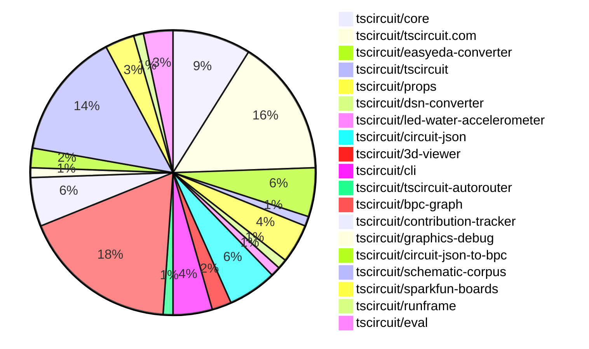
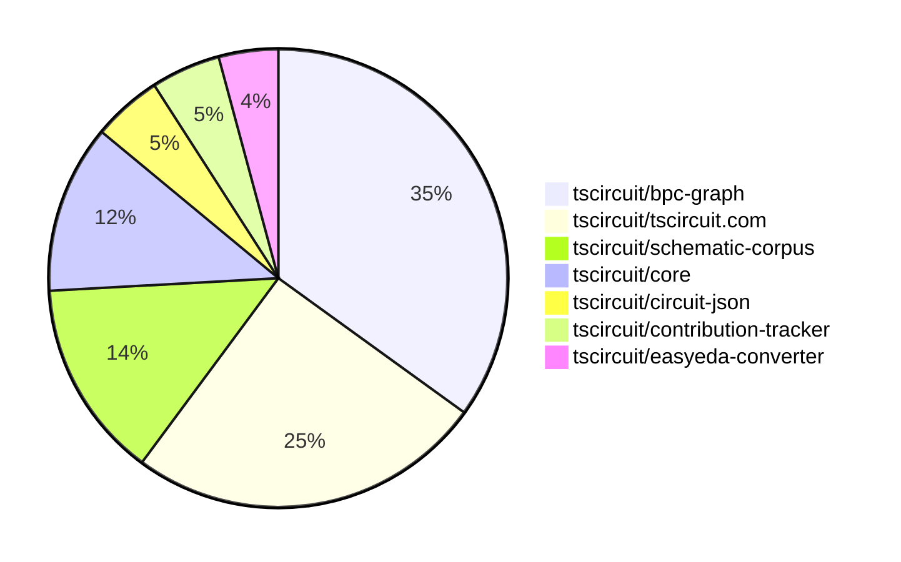

# Contribution Overview 2025-07-02

## PRs by Repository

## Contributor Overview

| Contributor | 🐳 Major | 🐙 Minor | 🐌 Tiny | ⭐ | Issues Created | Discussion Contributions |
|-------------|---------|---------|---------|-----|----------------|--------------------------|
| [seveibar](#seveibar) | 12 | 2 | 16 | 👑 | 0 | 0🔹 0🔶 0💎 |
| [ArnavK-09](#ArnavK-09) | 6 | 3 | 3 | ⭐⭐⭐ | 0 | 0🔹 0🔶 0💎 |
| [imrishabh18](#imrishabh18) | 2 | 3 | 11 | ⭐⭐ | 0 | 0🔹 0🔶 0💎 |
| [Abse2001](#Abse2001) | 2 | 1 | 9 | ⭐⭐ | 0 | 0🔹 0🔶 0💎 |
| [ShiboSoftwareDev](#ShiboSoftwareDev) | 0 | 1 | 8 | ⭐⭐ | 0 | 0🔹 0🔶 0💎 |
| [Anshgrover23](#Anshgrover23) | 0 | 0 | 5 | ⭐ | 0 | 0🔹 0🔶 0💎 |
| [MustafaMulla29](#MustafaMulla29) | 1 | 0 | 1 | ⭐ | 0 | 0🔹 0🔶 0💎 |
| [tscircuitbot](#tscircuitbot) | 0 | 0 | 3 |  | 0 | 0🔹 0🔶 0💎 |
| [ricohageman](#ricohageman) | 0 | 1 | 0 |  | 0 | 0🔹 0🔶 0💎 |

### Discussion Contribution Legend

- 🔹 Normal Comments: Basic participation with minimal effort
- 🔶 Great Informative Comments: Thoughtful participation that adds value
- 💎 Incredible Comments: Exceptional participation with high-quality content

## Review Table

[reviews-received-hover]: ## "Number of reviews received for PRs for this contributor"
[approvals-received-hover]: ## "Number of approvals received for PRs this contributor authored"
[rejections-received-hover]: ## "Number of rejections received for PRs this contributor authored"
[prs-opened-hover]: ## "Number of PRs opened by this contributor"
[issues-created-hover]: ## "Number of issues created by this contributor"
[bountied-issues-hover]: ## "Number of issues this contributor created with a bounty"
[bountied-issue-$-hover]: ## "Total bounty amount placed on issues authored by this contributor"

| Contributor | Reviews Received | Approvals Received | Rejections Received | Approvals | Rejections | PRs Opened | PRs Merged | Issues Created | Bountied Issues | Bountied Issue $ |
|---|---|---|---|---|---|---|---|---|---|---|
| [imrishabh18](#imrishabh18) | 10 | 6 | 0 | 2 | 0 | 17 | 16 | 0 | 0 | 0 |
| [ShiboSoftwareDev](#ShiboSoftwareDev) | 14 | 9 | 1 | 6 | 0 | 11 | 10 | 0 | 0 | 0 |
| [seveibar](#seveibar) | 14 | 0 | 0 | 32 | 1 | 39 | 30 | 0 | 0 | 0 |
| [graphite-app[bot]](#graphite-app[bot]) | 0 | 0 | 0 | 0 | 0 | 0 | 0 | 0 | 0 | 0 |
| [Anshgrover23](#Anshgrover23) | 10 | 10 | 0 | 1 | 1 | 9 | 5 | 0 | 0 | 0 |
| [techmannih](#techmannih) | 0 | 0 | 0 | 4 | 0 | 0 | 0 | 0 | 0 | 0 |
| [cursor[bot]](#cursor[bot]) | 0 | 0 | 0 | 0 | 0 | 0 | 0 | 0 | 0 | 0 |
| [ArnavK-09](#ArnavK-09) | 28 | 13 | 1 | 2 | 0 | 14 | 12 | 0 | 0 | 0 |
| [ajsb85](#ajsb85) | 0 | 0 | 0 | 0 | 0 | 1 | 0 | 0 | 0 | 0 |
| [inline-arc](#inline-arc) | 2 | 0 | 0 | 0 | 0 | 1 | 0 | 0 | 0 | 0 |
| [tscircuitbot](#tscircuitbot) | 0 | 0 | 0 | 0 | 0 | 13 | 3 | 0 | 0 | 0 |
| [MustafaMulla29](#MustafaMulla29) | 5 | 5 | 0 | 0 | 0 | 2 | 2 | 0 | 0 | 0 |
| [ricohageman](#ricohageman) | 3 | 1 | 0 | 0 | 0 | 2 | 1 | 0 | 0 | 0 |
| [Abse2001](#Abse2001) | 3 | 3 | 0 | 0 | 0 | 13 | 12 | 0 | 0 | 0 |

## Top 7 Repositories by Contribution Points

## Changes by Repository

### [tscircuit/core](https://github.com/tscircuit/core)

| PR # | Impact | Rating | Contributor | Description |
|------|--------|--------|-------------|-------------|
| [#1025](https://github.com/tscircuit/core/pull/1025) | 🐳 Major | ⭐⭐⭐ | imrishabh18 | Fixes incorrect positioning of schematic text within translated groups by computing positions using global coordinates instead of local coordinates. |
| [#1027](https://github.com/tscircuit/core/pull/1027) | 🐳 Major | ⭐⭐⭐ | seveibar | Refactors the schematic layout matching algorithm to utilize partitioning for improved layout efficiency. |
| [#1029](https://github.com/tscircuit/core/pull/1029) | 🐙 Minor | ⭐⭐ | imrishabh18 | Adds the autorouter_configuration property to the pcb_group in the circuit_json, allowing for trace clearance settings to be specified for autorouting. |
| [#1028](https://github.com/tscircuit/core/pull/1028) | 🐙 Minor | ⭐⭐ | imrishabh18 | Fixes the could not find port error when the pinheader component is processed inside a group due to incorrect name substitution. |
| [#1031](https://github.com/tscircuit/core/pull/1031) | 🐙 Minor | ⭐⭐ | seveibar | Fixes the offset issue in match-adapt layouts by ensuring that the groups global schematic position is respected during layout calculations. |

🐌 Tiny Contributions (3)

| PR # | Impact | Contributor | Description |
|------|--------|-------------|-------------|
| [#1032](https://github.com/tscircuit/core/pull/1032) | 🐌 Tiny | seveibar | Adds a test to ensure that matchAdapt groups operate independently in the circuit layout. |
| [#1030](https://github.com/tscircuit/core/pull/1030) | 🐌 Tiny | seveibar | Reproduces a bug related to match adaptation offset in schematic rendering with a comprehensive test case. |
| [#1024](https://github.com/tscircuit/core/pull/1024) | 🐌 Tiny | seveibar | Adds a type declaration to the import statement for the schematic corpus, specifying that the imported data is in JSON format. |

### [tscircuit/tscircuit.com](https://github.com/tscircuit/tscircuit.com)

| PR # | Impact | Rating | Contributor | Description |
|------|--------|--------|-------------|-------------|
| [#1399](https://github.com/tscircuit/tscircuit.com/pull/1399) | 🐳 Major | ⭐⭐⭐ | imrishabh18 | Adds support for URL encoding of all package files, enabling the loading of multiple files from a URL and utilizing new multi-file sharing in the editor. |
| [#1410](https://github.com/tscircuit/tscircuit.com/pull/1410) | 🐳 Major | ⭐⭐⭐ | ArnavK-09 | Modifies the fuzzy matching logic in CmdKMenu to prepend Import to option names, enhancing search relevance for import-related commands. |
| [#1405](https://github.com/tscircuit/tscircuit.com/pull/1405) | 🐳 Major | ⭐⭐⭐ | ArnavK-09 | Adds functionality to download circuit PNG images for unsaved packages or during live editing sessions. |
| [#1403](https://github.com/tscircuit/tscircuit.com/pull/1403) | 🐳 Major | ⭐⭐⭐ | ArnavK-09 | Adds a confirmation dialog for discarding unsaved changes, allowing users to confirm before losing their changes. |
| [#1404](https://github.com/tscircuit/tscircuit.com/pull/1404) | 🐳 Major | ⭐⭐⭐ | ArnavK-09 | Hides hidden files from the search results when using the ctrlfind functionality. |
| [#1401](https://github.com/tscircuit/tscircuit.com/pull/1401) | 🐳 Major | ⭐⭐⭐ | ArnavK-09 | Introduces a file tree structure to display TypeScript files and folders, adds search functionality to filter files based on user input, integrates CodeMirror for viewing and editing file content with syntax highlighting, implements file statistics display, and enhances UI with responsive sidebar and improved layout for better user experience. |
| [#1392](https://github.com/tscircuit/tscircuit.com/pull/1392) | 🐳 Major | ⭐⭐⭐ | ArnavK-09 | Adds functionality to download package files as a ZIP archive, similar to GitHubs download feature. |
| [#1406](https://github.com/tscircuit/tscircuit.com/pull/1406) | 🐙 Minor | ⭐⭐ | ArnavK-09 | Adds functionality to copy AI review text to clipboard when the AI review tab is active. |

🐌 Tiny Contributions (6)

| PR # | Impact | Contributor | Description |
|------|--------|-------------|-------------|
| [#1412](https://github.com/tscircuit/tscircuit.com/pull/1412) | 🐌 Tiny | imrishabh18 | Updates the easyeda dependency version from 0.0.181 to 0.0.195 in package.json. |
| [#1409](https://github.com/tscircuit/tscircuit.com/pull/1409) | 🐌 Tiny | imrishabh18 | Fixes the search dropdown layering issue by raising the z-index to ensure it appears above the PCB viewer. |
| [#1400](https://github.com/tscircuit/tscircuit.com/pull/1400) | 🐌 Tiny | imrishabh18 | Fixes the display of transpilation logs by changing the log message field from message to msg in the LogContent component. |
| [#1397](https://github.com/tscircuit/tscircuit.com/pull/1397) | 🐌 Tiny | Anshgrover23 | Updates the versions of the tscircuitcore and tscircuiteval dependencies in package.json. |
| [#1414](https://github.com/tscircuit/tscircuit.com/pull/1414) | 🐌 Tiny | ArnavK-09 | Adds a new proxy route with validation for headers and domain restrictions, along with tests to ensure proper functionality. |
| [#1402](https://github.com/tscircuit/tscircuit.com/pull/1402) | 🐌 Tiny | ArnavK-09 | Adds a themed loading state to the RunFrame component, replacing the default loading text with a styled loading animation. |

### [tscircuit/easyeda-converter](https://github.com/tscircuit/easyeda-converter)

| PR # | Impact | Rating | Contributor | Description |
|------|--------|--------|-------------|-------------|
| [#277](https://github.com/tscircuit/easyeda-converter/pull/277) | 🐙 Minor | ⭐⭐ | imrishabh18 | Fixes the parsing of the rotation value for SMT pads in EasyEDA files, ensuring accurate representation in the converted circuit JSON. |

🐌 Tiny Contributions (4)

| PR # | Impact | Contributor | Description |
|------|--------|-------------|-------------|
| [#282](https://github.com/tscircuit/easyeda-converter/pull/282) | 🐌 Tiny | imrishabh18 | Fixes the export paths in package.json to point to the correct files for the main module and browser module. |
| [#281](https://github.com/tscircuit/easyeda-converter/pull/281) | 🐌 Tiny | imrishabh18 | Separates the build process for the library and command line interface into distinct scripts in package.json. |
| [#280](https://github.com/tscircuit/easyeda-converter/pull/280) | 🐌 Tiny | imrishabh18 | Adds tscircuit as a peer dependency in package.json to ensure compatibility with the TypeScript version used in the project. |
| [#279](https://github.com/tscircuit/easyeda-converter/pull/279) | 🐌 Tiny | imrishabh18 | Removes redundant dependencies and updates existing dependencies to their latest versions in the project. |

### [tscircuit/tscircuit](https://github.com/tscircuit/tscircuit)

🐌 Tiny Contributions (1)

| PR # | Impact | Contributor | Description |
|------|--------|-------------|-------------|
| [#695](https://github.com/tscircuit/tscircuit/pull/695) | 🐌 Tiny | imrishabh18 | Adds the graphics-debug package and updates the versions of core and eval packages in the project. |

### [tscircuit/props](https://github.com/tscircuit/props)

🐌 Tiny Contributions (4)

| PR # | Impact | Contributor | Description |
|------|--------|-------------|-------------|
| [#311](https://github.com/tscircuit/props/pull/311) | 🐌 Tiny | imrishabh18 | Extends AutorouterConfig with preset options for routing configurations. |
| [#315](https://github.com/tscircuit/props/pull/315) | 🐌 Tiny | ShiboSoftwareDev | Updates the README formatting process in the GitHub workflow to use Prettier instead of Biome for consistent code style. |
| [#313](https://github.com/tscircuit/props/pull/313) | 🐌 Tiny | ShiboSoftwareDev | Introduces new props for SchematicTable, SchematicCell, and SchematicRow components, enhancing their configurability in schematic designs. |
| [#310](https://github.com/tscircuit/props/pull/310) | 🐌 Tiny | seveibar | Adds an optional traceClearance distance to the AutorouterConfig, allowing for more precise autorouting configurations. |

### [tscircuit/dsn-converter](https://github.com/tscircuit/dsn-converter)

🐌 Tiny Contributions (1)

| PR # | Impact | Contributor | Description |
|------|--------|-------------|-------------|
| [#108](https://github.com/tscircuit/dsn-converter/pull/108) | 🐌 Tiny | imrishabh18 | Adds a configuration option for traceClearance to customize the clearance distance between traces and pads in the freerouting process. |

### [tscircuit/led-water-accelerometer](https://github.com/tscircuit/led-water-accelerometer)

🐌 Tiny Contributions (1)

| PR # | Impact | Contributor | Description |
|------|--------|-------------|-------------|
| [#4](https://github.com/tscircuit/led-water-accelerometer/pull/4) | 🐌 Tiny | imrishabh18 | Adds an additional column to the LED matrix, increasing the column count from 7 to 8 and adjusting spacing accordingly. |

### [tscircuit/circuit-json](https://github.com/tscircuit/circuit-json)

| PR # | Impact | Rating | Contributor | Description |
|------|--------|--------|-------------|-------------|
| [#237](https://github.com/tscircuit/circuit-json/pull/237) | 🐙 Minor | ⭐⭐ | ShiboSoftwareDev | Adds a new schematic_table element to the circuit-json specification, enabling structured data display in schematics. |
| [#236](https://github.com/tscircuit/circuit-json/pull/236) | 🐙 Minor | ⭐⭐ | seveibar | Adds optional autorouter fields in the pcb_group schema and interface, documents these fields in README, and tests pcb_group autorouter options. |

🐌 Tiny Contributions (3)

| PR # | Impact | Contributor | Description |
|------|--------|-------------|-------------|
| [#238](https://github.com/tscircuit/circuit-json/pull/238) | 🐌 Tiny | ShiboSoftwareDev | Renames the rows property to cells in the schematic table data structure to improve clarity and consistency in the codebase. |
| [#233](https://github.com/tscircuit/circuit-json/pull/233) | 🐌 Tiny | seveibar | Fixes README generation logic to correctly parse nested interfaces using TypeScript AST, ensuring accurate documentation output. |
| [#235](https://github.com/tscircuit/circuit-json/pull/235) | 🐌 Tiny | Anshgrover23 | Adds an optional boolean property is_connected to the SchematicPort interface to indicate the connection status of schematic ports. |

### [tscircuit/3d-viewer](https://github.com/tscircuit/3d-viewer)

🐌 Tiny Contributions (2)

| PR # | Impact | Contributor | Description |
|------|--------|-------------|-------------|
| [#372](https://github.com/tscircuit/3d-viewer/pull/372) | 🐌 Tiny | ShiboSoftwareDev | Changes the rendering of circuit stories to be asynchronous, allowing traces to be rendered correctly in the CadViewer. |
| [#370](https://github.com/tscircuit/3d-viewer/pull/370) | 🐌 Tiny | ShiboSoftwareDev | Fixes error handling for invalid STL URLs in the 3D model loader, ensuring proper error messages are displayed when fetching fails. |

### [tscircuit/cli](https://github.com/tscircuit/cli)

🐌 Tiny Contributions (4)

| PR # | Impact | Contributor | Description |
|------|--------|-------------|-------------|
| [#260](https://github.com/tscircuit/cli/pull/260) | 🐌 Tiny | ShiboSoftwareDev | Updates the tsci build command to only build files ending in .circuit.tsx or .board.tsx when no file path is specified, preventing automatic building of index files. |
| [#258](https://github.com/tscircuit/cli/pull/258) | 🐌 Tiny | ShiboSoftwareDev | Fixes the build process to only include .circuit.tsx and .board.tsx files, resolving an error in the previous implementation. |
| [#257](https://github.com/tscircuit/cli/pull/257) | 🐌 Tiny | Anshgrover23 | Updates the version of the circuit-to-svg dependency from 0.0.163 to 0.0.164 in package.json. |
| [#256](https://github.com/tscircuit/cli/pull/256) | 🐌 Tiny | Anshgrover23 | Updates the version of the tscircuitrunframe dependency from 0.0.649 to 0.0.656 in package.json. |

### [tscircuit/tscircuit-autorouter](https://github.com/tscircuit/tscircuit-autorouter)

🐌 Tiny Contributions (1)

| PR # | Impact | Contributor | Description |
|------|--------|-------------|-------------|
| [#185](https://github.com/tscircuit/tscircuit-autorouter/pull/185) | 🐌 Tiny | ShiboSoftwareDev | Adds a new JSON representation for the cn673 node with port points and a corresponding fixture for testing in the HyperHighDensityDebugger. |

### [tscircuit/bpc-graph](https://github.com/tscircuit/bpc-graph)

| PR # | Impact | Rating | Contributor | Description |
|------|--------|--------|-------------|-------------|
| [#43](https://github.com/tscircuit/bpc-graph/pull/43) | 🐳 Major | ⭐⭐⭐ | seveibar | Adds functionality to use network length as a tie-breaker in graph distance calculations, enhancing the assignment solvers decision-making process. |
| [#42](https://github.com/tscircuit/bpc-graph/pull/42) | 🐳 Major | ⭐⭐⭐ | seveibar | Switches to a partial floating graph and evaluates the next best floating box id to add, refactoring and storing last computed evaluations and showing them. |
| [#41](https://github.com/tscircuit/bpc-graph/pull/41) | 🐳 Major | ⭐⭐⭐ | seveibar | Adds weighted Jaccard similarity calculation for assignment debugging, along with tests and visual enhancements. |
| [#39](https://github.com/tscircuit/bpc-graph/pull/39) | 🐳 Major | ⭐⭐⭐ | seveibar | Adds functionality to allow for variable degrees of distance introspection in graph comparisons, enhancing the flexibility of distance calculations between BPC graphs. |
| [#38](https://github.com/tscircuit/bpc-graph/pull/38) | 🐳 Major | ⭐⭐⭐ | seveibar | Introduces a new assignment solver for matching floating boxes to fixed boxes in a graph, along with a debugging interface for visualizing the assignment process. |
| [#37](https://github.com/tscircuit/bpc-graph/pull/37) | 🐳 Major | ⭐⭐⭐ | seveibar | Adds a new feature to calculate WL distance using colors in the BPC graph representation. |
| [#36](https://github.com/tscircuit/bpc-graph/pull/36) | 🐳 Major | ⭐⭐⭐ | seveibar | Adjusts the exploration order in the schematic partitioning process to prioritize pins with fewer connections, improving the efficiency of the partitioning algorithm. |
| [#35](https://github.com/tscircuit/bpc-graph/pull/35) | 🐳 Major | ⭐⭐⭐ | seveibar | This PR implements a major rewrite of the schematic graph partitioning logic to improve clarity and functionality, including the addition of new methods for better observability and debugging. |
| [#30](https://github.com/tscircuit/bpc-graph/pull/30) | 🐳 Major | ⭐⭐⭐ | seveibar | Adds a new function for layout schematic graphs, enabling better organization and representation of circuit schematics. |
| [#29](https://github.com/tscircuit/bpc-graph/pull/29) | 🐳 Major | ⭐⭐⭐ | seveibar | Adds a complete layout process with partitioning, including new methods for partition matching, duplicate pin handling, and graph adaptations. |
| [#28](https://github.com/tscircuit/bpc-graph/pull/28) | 🐳 Major | ⭐⭐⭐ | seveibar | Introduces a new partitioning algorithm for managing pin connections in circuit layouts, allowing for better organization of pins based on their connections and directions. |
| [#33](https://github.com/tscircuit/bpc-graph/pull/33) | 🐙 Minor | ⭐⭐ | ricohageman | Aligns the center of partitioned boxes to the origin in merged graphs, ensuring consistent positioning across multiple graphs. |

🐌 Tiny Contributions (4)

| PR # | Impact | Contributor | Description |
|------|--------|-------------|-------------|
| [#32](https://github.com/tscircuit/bpc-graph/pull/32) | 🐌 Tiny | seveibar | Adds a test that reproduces a core issue related to the tscircuitsch02 circuit, facilitating easier debugging and verification of the issue. |
| [#31](https://github.com/tscircuit/bpc-graph/pull/31) | 🐌 Tiny | seveibar | Changes the layoutSchematicGraph function to require a corpus parameter instead of bundling it, allowing for more flexible graph processing. |
| [#27](https://github.com/tscircuit/bpc-graph/pull/27) | 🐌 Tiny | seveibar | Replaces the existing tscircuit code example with a simpler version that has exact matches in the corpus, improving clarity and usability for users. |
| [#21](https://github.com/tscircuit/bpc-graph/pull/21) | 🐌 Tiny | seveibar | Adds a test for a tscircuit code example that generates a schematic and verifies its SVG output. |

### [tscircuit/contribution-tracker](https://github.com/tscircuit/contribution-tracker)

| PR # | Impact | Rating | Contributor | Description |
|------|--------|--------|-------------|-------------|
| [#189](https://github.com/tscircuit/contribution-tracker/pull/189) | 🐙 Minor | ⭐⭐ | ArnavK-09 | This PR changes the weekly overview generation to count repositories from Wednesday to Wednesday and adds a star rating display in the README for each pull request. |
| [#188](https://github.com/tscircuit/contribution-tracker/pull/188) | 🐙 Minor | ⭐⭐ | ArnavK-09 | Updates the notification system to display contribution star ratings instead of impact for pull requests. |

🐌 Tiny Contributions (3)

| PR # | Impact | Contributor | Description |
|------|--------|-------------|-------------|
| [#194](https://github.com/tscircuit/contribution-tracker/pull/194) | 🐌 Tiny | seveibar | Fixes markdown bullet formatting in changelogs to use standard - instead of non-standard bullets. |
| [#193](https://github.com/tscircuit/contribution-tracker/pull/193) | 🐌 Tiny | seveibar | I had to do a lot of custom scripting to get the new numbers for june, many bonuses were applied |
| [#192](https://github.com/tscircuit/contribution-tracker/pull/192) | 🐌 Tiny | seveibar | Comments out the fetching of contributor issues to avoid hitting GitHub rate limits and updates scoring tests to cap review points at 5 instead of 10. |

### [tscircuit/graphics-debug](https://github.com/tscircuit/graphics-debug)

🐌 Tiny Contributions (1)

| PR # | Impact | Contributor | Description |
|------|--------|-------------|-------------|
| [#69](https://github.com/tscircuit/graphics-debug/pull/69) | 🐌 Tiny | seveibar | Adds a titles option to the stackGraphicsVertically function, allowing titles to be displayed left of each stacked graphic, and updates the README and tests accordingly. |

### [tscircuit/circuit-json-to-bpc](https://github.com/tscircuit/circuit-json-to-bpc)

🐌 Tiny Contributions (2)

| PR # | Impact | Contributor | Description |
|------|--------|-------------|-------------|
| [#4](https://github.com/tscircuit/circuit-json-to-bpc/pull/4) | 🐌 Tiny | seveibar | Adds a readable ID option to the circuit JSON to BPC conversion process, improving debugging capabilities by allowing users to see more meaningful identifiers instead of raw IDs. |
| [#3](https://github.com/tscircuit/circuit-json-to-bpc/pull/3) | 🐌 Tiny | seveibar | This PR adds boxAttributes for net labels, allowing BPC Graphs to implement special logic for managing large net label networks. |

### [tscircuit/schematic-corpus](https://github.com/tscircuit/schematic-corpus)

| PR # | Impact | Rating | Contributor | Description |
|------|--------|--------|-------------|-------------|
| [#54](https://github.com/tscircuit/schematic-corpus/pull/54) | 🐳 Major | ⭐⭐⭐ | Abse2001 | Adds a new design (design039) that implements a new autolayout algorithm for schematic components, enhancing the placement and routing of electronic components on the board. |
| [#50](https://github.com/tscircuit/schematic-corpus/pull/50) | 🐳 Major | ⭐⭐⭐ | Abse2001 | Adds a new design035 component to enhance the autolayout algorithm in the schematic corpus. |
| [#42](https://github.com/tscircuit/schematic-corpus/pull/42) | 🐙 Minor | ⭐⭐ | Abse2001 | Redesigns the schematic for design014 by updating component placements and connections, enhancing the overall layout and functionality. |

🐌 Tiny Contributions (10)

| PR # | Impact | Contributor | Description |
|------|--------|-------------|-------------|
| [#43](https://github.com/tscircuit/schematic-corpus/pull/43) | 🐌 Tiny | seveibar | Adds TypeScript definitions for the build system and updates the main export path in package.json to point to the new index file. |
| [#53](https://github.com/tscircuit/schematic-corpus/pull/53) | 🐌 Tiny | Abse2001 | Adds a new design (design038) that implements a new autolayout algorithm for circuit schematics, enhancing the placement of components based on specified manual edits. |
| [#52](https://github.com/tscircuit/schematic-corpus/pull/52) | 🐌 Tiny | Abse2001 | Adds a new design (design037) that enhances the autolayout algorithm by introducing specific manual edits for component placements in the schematic. |
| [#51](https://github.com/tscircuit/schematic-corpus/pull/51) | 🐌 Tiny | Abse2001 | Adds a new design (design036) that implements a new layout for the autolayout algorithm in the schematic corpus. |
| [#49](https://github.com/tscircuit/schematic-corpus/pull/49) | 🐌 Tiny | Abse2001 | Adds a new circuit design (design034) that enhances the autolayout algorithm by providing specific manual placements for components in the schematic. |
| [#47](https://github.com/tscircuit/schematic-corpus/pull/47) | 🐌 Tiny | Abse2001 | Adds a new design (design033) that implements a manual layout for components in the autolayout algorithm, enhancing the placement of schematic elements. |
| [#46](https://github.com/tscircuit/schematic-corpus/pull/46) | 🐌 Tiny | Abse2001 | Adds a new design (design032) that implements a manual layout for components in the autolayout algorithm, enhancing the placement of schematic elements. |
| [#45](https://github.com/tscircuit/schematic-corpus/pull/45) | 🐌 Tiny | Abse2001 | Adds a new design (design031) that implements a specific layout for components in the autolayout algorithm. |
| [#44](https://github.com/tscircuit/schematic-corpus/pull/44) | 🐌 Tiny | Abse2001 | Adds a new design (design030) that implements a manual layout for components to enhance the autolayout algorithms performance. |
| [#41](https://github.com/tscircuit/schematic-corpus/pull/41) | 🐌 Tiny | Abse2001 | Fixes inconsistent widths of schematic boxes across various designs in the schematic corpus. |

### [tscircuit/sparkfun-boards](https://github.com/tscircuit/sparkfun-boards)

| PR # | Impact | Rating | Contributor | Description |
|------|--------|--------|-------------|-------------|
| [#22](https://github.com/tscircuit/sparkfun-boards/pull/22) | 🐳 Major | ⭐⭐⭐ | MustafaMulla29 | Introduces a new circuit board for the Sparkfun Mini Linear 3D Hall Effect Sensor, including its schematic and footprint. |

🐌 Tiny Contributions (2)

| PR # | Impact | Contributor | Description |
|------|--------|-------------|-------------|
| [#41](https://github.com/tscircuit/sparkfun-boards/pull/41) | 🐌 Tiny | Anshgrover23 | No description provided |
| [#38](https://github.com/tscircuit/sparkfun-boards/pull/38) | 🐌 Tiny | MustafaMulla29 | No description provided |

### [tscircuit/runframe](https://github.com/tscircuit/runframe)

🐌 Tiny Contributions (1)

| PR # | Impact | Contributor | Description |
|------|--------|-------------|-------------|
| [#839](https://github.com/tscircuit/runframe/pull/839) | 🐌 Tiny | ArnavK-09 | Adds an ImportComponentDialog component to facilitate the import of components in the application. |

### [tscircuit/eval](https://github.com/tscircuit/eval)

🐌 Tiny Contributions (3)

| PR # | Impact | Contributor | Description |
|------|--------|-------------|-------------|
| [#638](https://github.com/tscircuit/eval/pull/638) | 🐌 Tiny | tscircuitbot | Automated update of tscircuitcore to v0.0.540, which includes dependency updates without introducing new functionality. |
| [#632](https://github.com/tscircuit/eval/pull/632) | 🐌 Tiny | tscircuitbot | Updates the tscircuitcore dependency to version 0.0.537, ensuring compatibility with the latest features and fixes. |
| [#630](https://github.com/tscircuit/eval/pull/630) | 🐌 Tiny | tscircuitbot | Updates the tscircuitcore dependency to version 0.0.536, reflecting the latest changes and improvements in the core library. |

## Changes by Contributor

### [imrishabh18](https://github.com/imrishabh18)

| PRs # | Impact | Rating | Description |
|------|--------|--------|-------------|
| [#1025](https://github.com/tscircuit/core/pull/1025) | 🐳 Major | ⭐⭐⭐ | Fixes incorrect positioning of schematic text within translated groups by computing positions using global coordinates instead of local coordinates. |
| [#1399](https://github.com/tscircuit/tscircuit.com/pull/1399) | 🐳 Major | ⭐⭐⭐ | Adds support for URL encoding of all package files, enabling the loading of multiple files from a URL and utilizing new multi-file sharing in the editor. |
| [#277](https://github.com/tscircuit/easyeda-converter/pull/277) | 🐙 Minor | ⭐⭐ | Fixes the parsing of the rotation value for SMT pads in EasyEDA files, ensuring accurate representation in the converted circuit JSON. |
| [#1029](https://github.com/tscircuit/core/pull/1029) | 🐙 Minor | ⭐⭐ | Adds the autorouter_configuration property to the pcb_group in the circuit_json, allowing for trace clearance settings to be specified for autorouting. |
| [#1028](https://github.com/tscircuit/core/pull/1028) | 🐙 Minor | ⭐⭐ | Fixes the could not find port error when the pinheader component is processed inside a group due to incorrect name substitution. |

🐌 Tiny Contributions (11)

| PR # | Impact | Description |
|------|--------|-------------|
| [#695](https://github.com/tscircuit/tscircuit/pull/695) | 🐌 Tiny | Adds the graphics-debug package and updates the versions of core and eval packages in the project. |
| [#311](https://github.com/tscircuit/props/pull/311) | 🐌 Tiny | Extends AutorouterConfig with preset options for routing configurations. |
| [#282](https://github.com/tscircuit/easyeda-converter/pull/282) | 🐌 Tiny | Fixes the export paths in package.json to point to the correct files for the main module and browser module. |
| [#281](https://github.com/tscircuit/easyeda-converter/pull/281) | 🐌 Tiny | Separates the build process for the library and command line interface into distinct scripts in package.json. |
| [#280](https://github.com/tscircuit/easyeda-converter/pull/280) | 🐌 Tiny | Adds tscircuit as a peer dependency in package.json to ensure compatibility with the TypeScript version used in the project. |
| [#279](https://github.com/tscircuit/easyeda-converter/pull/279) | 🐌 Tiny | Removes redundant dependencies and updates existing dependencies to their latest versions in the project. |
| [#108](https://github.com/tscircuit/dsn-converter/pull/108) | 🐌 Tiny | Adds a configuration option for traceClearance to customize the clearance distance between traces and pads in the freerouting process. |
| [#1412](https://github.com/tscircuit/tscircuit.com/pull/1412) | 🐌 Tiny | Updates the easyeda dependency version from 0.0.181 to 0.0.195 in package.json. |
| [#1409](https://github.com/tscircuit/tscircuit.com/pull/1409) | 🐌 Tiny | Fixes the search dropdown layering issue by raising the z-index to ensure it appears above the PCB viewer. |
| [#1400](https://github.com/tscircuit/tscircuit.com/pull/1400) | 🐌 Tiny | Fixes the display of transpilation logs by changing the log message field from message to msg in the LogContent component. |
| [#4](https://github.com/tscircuit/led-water-accelerometer/pull/4) | 🐌 Tiny | Adds an additional column to the LED matrix, increasing the column count from 7 to 8 and adjusting spacing accordingly. |

### [ShiboSoftwareDev](https://github.com/ShiboSoftwareDev)

| PRs # | Impact | Rating | Description |
|------|--------|--------|-------------|
| [#237](https://github.com/tscircuit/circuit-json/pull/237) | 🐙 Minor | ⭐⭐ | Adds a new schematic_table element to the circuit-json specification, enabling structured data display in schematics. |

🐌 Tiny Contributions (8)

| PR # | Impact | Description |
|------|--------|-------------|
| [#238](https://github.com/tscircuit/circuit-json/pull/238) | 🐌 Tiny | Renames the rows property to cells in the schematic table data structure to improve clarity and consistency in the codebase. |
| [#315](https://github.com/tscircuit/props/pull/315) | 🐌 Tiny | Updates the README formatting process in the GitHub workflow to use Prettier instead of Biome for consistent code style. |
| [#313](https://github.com/tscircuit/props/pull/313) | 🐌 Tiny | Introduces new props for SchematicTable, SchematicCell, and SchematicRow components, enhancing their configurability in schematic designs. |
| [#372](https://github.com/tscircuit/3d-viewer/pull/372) | 🐌 Tiny | Changes the rendering of circuit stories to be asynchronous, allowing traces to be rendered correctly in the CadViewer. |
| [#370](https://github.com/tscircuit/3d-viewer/pull/370) | 🐌 Tiny | Fixes error handling for invalid STL URLs in the 3D model loader, ensuring proper error messages are displayed when fetching fails. |
| [#260](https://github.com/tscircuit/cli/pull/260) | 🐌 Tiny | Updates the tsci build command to only build files ending in .circuit.tsx or .board.tsx when no file path is specified, preventing automatic building of index files. |
| [#258](https://github.com/tscircuit/cli/pull/258) | 🐌 Tiny | Fixes the build process to only include .circuit.tsx and .board.tsx files, resolving an error in the previous implementation. |
| [#185](https://github.com/tscircuit/tscircuit-autorouter/pull/185) | 🐌 Tiny | Adds a new JSON representation for the cn673 node with port points and a corresponding fixture for testing in the HyperHighDensityDebugger. |

### [seveibar](https://github.com/seveibar)

| PRs # | Impact | Rating | Description |
|------|--------|--------|-------------|
| [#1027](https://github.com/tscircuit/core/pull/1027) | 🐳 Major | ⭐⭐⭐ | Refactors the schematic layout matching algorithm to utilize partitioning for improved layout efficiency. |
| [#43](https://github.com/tscircuit/bpc-graph/pull/43) | 🐳 Major | ⭐⭐⭐ | Adds functionality to use network length as a tie-breaker in graph distance calculations, enhancing the assignment solvers decision-making process. |
| [#42](https://github.com/tscircuit/bpc-graph/pull/42) | 🐳 Major | ⭐⭐⭐ | Switches to a partial floating graph and evaluates the next best floating box id to add, refactoring and storing last computed evaluations and showing them. |
| [#41](https://github.com/tscircuit/bpc-graph/pull/41) | 🐳 Major | ⭐⭐⭐ | Adds weighted Jaccard similarity calculation for assignment debugging, along with tests and visual enhancements. |
| [#39](https://github.com/tscircuit/bpc-graph/pull/39) | 🐳 Major | ⭐⭐⭐ | Adds functionality to allow for variable degrees of distance introspection in graph comparisons, enhancing the flexibility of distance calculations between BPC graphs. |
| [#38](https://github.com/tscircuit/bpc-graph/pull/38) | 🐳 Major | ⭐⭐⭐ | Introduces a new assignment solver for matching floating boxes to fixed boxes in a graph, along with a debugging interface for visualizing the assignment process. |
| [#37](https://github.com/tscircuit/bpc-graph/pull/37) | 🐳 Major | ⭐⭐⭐ | Adds a new feature to calculate WL distance using colors in the BPC graph representation. |
| [#36](https://github.com/tscircuit/bpc-graph/pull/36) | 🐳 Major | ⭐⭐⭐ | Adjusts the exploration order in the schematic partitioning process to prioritize pins with fewer connections, improving the efficiency of the partitioning algorithm. |
| [#35](https://github.com/tscircuit/bpc-graph/pull/35) | 🐳 Major | ⭐⭐⭐ | This PR implements a major rewrite of the schematic graph partitioning logic to improve clarity and functionality, including the addition of new methods for better observability and debugging. |
| [#30](https://github.com/tscircuit/bpc-graph/pull/30) | 🐳 Major | ⭐⭐⭐ | Adds a new function for layout schematic graphs, enabling better organization and representation of circuit schematics. |
| [#29](https://github.com/tscircuit/bpc-graph/pull/29) | 🐳 Major | ⭐⭐⭐ | Adds a complete layout process with partitioning, including new methods for partition matching, duplicate pin handling, and graph adaptations. |
| [#28](https://github.com/tscircuit/bpc-graph/pull/28) | 🐳 Major | ⭐⭐⭐ | Introduces a new partitioning algorithm for managing pin connections in circuit layouts, allowing for better organization of pins based on their connections and directions. |
| [#236](https://github.com/tscircuit/circuit-json/pull/236) | 🐙 Minor | ⭐⭐ | Adds optional autorouter fields in the pcb_group schema and interface, documents these fields in README, and tests pcb_group autorouter options. |
| [#1031](https://github.com/tscircuit/core/pull/1031) | 🐙 Minor | ⭐⭐ | Fixes the offset issue in match-adapt layouts by ensuring that the groups global schematic position is respected during layout calculations. |

🐌 Tiny Contributions (16)

| PR # | Impact | Description |
|------|--------|-------------|
| [#233](https://github.com/tscircuit/circuit-json/pull/233) | 🐌 Tiny | Fixes README generation logic to correctly parse nested interfaces using TypeScript AST, ensuring accurate documentation output. |
| [#310](https://github.com/tscircuit/props/pull/310) | 🐌 Tiny | Adds an optional traceClearance distance to the AutorouterConfig, allowing for more precise autorouting configurations. |
| [#1032](https://github.com/tscircuit/core/pull/1032) | 🐌 Tiny | Adds a test to ensure that matchAdapt groups operate independently in the circuit layout. |
| [#1030](https://github.com/tscircuit/core/pull/1030) | 🐌 Tiny | Reproduces a bug related to match adaptation offset in schematic rendering with a comprehensive test case. |
| [#1024](https://github.com/tscircuit/core/pull/1024) | 🐌 Tiny | Adds a type declaration to the import statement for the schematic corpus, specifying that the imported data is in JSON format. |
| [#194](https://github.com/tscircuit/contribution-tracker/pull/194) | 🐌 Tiny | Fixes markdown bullet formatting in changelogs to use standard - instead of non-standard bullets. |
| [#193](https://github.com/tscircuit/contribution-tracker/pull/193) | 🐌 Tiny | I had to do a lot of custom scripting to get the new numbers for june, many bonuses were applied |
| [#192](https://github.com/tscircuit/contribution-tracker/pull/192) | 🐌 Tiny | Comments out the fetching of contributor issues to avoid hitting GitHub rate limits and updates scoring tests to cap review points at 5 instead of 10. |
| [#69](https://github.com/tscircuit/graphics-debug/pull/69) | 🐌 Tiny | Adds a titles option to the stackGraphicsVertically function, allowing titles to be displayed left of each stacked graphic, and updates the README and tests accordingly. |
| [#32](https://github.com/tscircuit/bpc-graph/pull/32) | 🐌 Tiny | Adds a test that reproduces a core issue related to the tscircuitsch02 circuit, facilitating easier debugging and verification of the issue. |
| [#31](https://github.com/tscircuit/bpc-graph/pull/31) | 🐌 Tiny | Changes the layoutSchematicGraph function to require a corpus parameter instead of bundling it, allowing for more flexible graph processing. |
| [#27](https://github.com/tscircuit/bpc-graph/pull/27) | 🐌 Tiny | Replaces the existing tscircuit code example with a simpler version that has exact matches in the corpus, improving clarity and usability for users. |
| [#21](https://github.com/tscircuit/bpc-graph/pull/21) | 🐌 Tiny | Adds a test for a tscircuit code example that generates a schematic and verifies its SVG output. |
| [#4](https://github.com/tscircuit/circuit-json-to-bpc/pull/4) | 🐌 Tiny | Adds a readable ID option to the circuit JSON to BPC conversion process, improving debugging capabilities by allowing users to see more meaningful identifiers instead of raw IDs. |
| [#3](https://github.com/tscircuit/circuit-json-to-bpc/pull/3) | 🐌 Tiny | This PR adds boxAttributes for net labels, allowing BPC Graphs to implement special logic for managing large net label networks. |
| [#43](https://github.com/tscircuit/schematic-corpus/pull/43) | 🐌 Tiny | Adds TypeScript definitions for the build system and updates the main export path in package.json to point to the new index file. |

### [Anshgrover23](https://github.com/Anshgrover23)

🐌 Tiny Contributions (5)

| PR # | Impact | Description |
|------|--------|-------------|
| [#235](https://github.com/tscircuit/circuit-json/pull/235) | 🐌 Tiny | Adds an optional boolean property is_connected to the SchematicPort interface to indicate the connection status of schematic ports. |
| [#1397](https://github.com/tscircuit/tscircuit.com/pull/1397) | 🐌 Tiny | Updates the versions of the tscircuitcore and tscircuiteval dependencies in package.json. |
| [#257](https://github.com/tscircuit/cli/pull/257) | 🐌 Tiny | Updates the version of the circuit-to-svg dependency from 0.0.163 to 0.0.164 in package.json. |
| [#256](https://github.com/tscircuit/cli/pull/256) | 🐌 Tiny | Updates the version of the tscircuitrunframe dependency from 0.0.649 to 0.0.656 in package.json. |
| [#41](https://github.com/tscircuit/sparkfun-boards/pull/41) | 🐌 Tiny | No description provided |

### [ArnavK-09](https://github.com/ArnavK-09)

| PRs # | Impact | Rating | Description |
|------|--------|--------|-------------|
| [#1410](https://github.com/tscircuit/tscircuit.com/pull/1410) | 🐳 Major | ⭐⭐⭐ | Modifies the fuzzy matching logic in CmdKMenu to prepend Import to option names, enhancing search relevance for import-related commands. |
| [#1405](https://github.com/tscircuit/tscircuit.com/pull/1405) | 🐳 Major | ⭐⭐⭐ | Adds functionality to download circuit PNG images for unsaved packages or during live editing sessions. |
| [#1403](https://github.com/tscircuit/tscircuit.com/pull/1403) | 🐳 Major | ⭐⭐⭐ | Adds a confirmation dialog for discarding unsaved changes, allowing users to confirm before losing their changes. |
| [#1404](https://github.com/tscircuit/tscircuit.com/pull/1404) | 🐳 Major | ⭐⭐⭐ | Hides hidden files from the search results when using the ctrlfind functionality. |
| [#1401](https://github.com/tscircuit/tscircuit.com/pull/1401) | 🐳 Major | ⭐⭐⭐ | Introduces a file tree structure to display TypeScript files and folders, adds search functionality to filter files based on user input, integrates CodeMirror for viewing and editing file content with syntax highlighting, implements file statistics display, and enhances UI with responsive sidebar and improved layout for better user experience. |
| [#1392](https://github.com/tscircuit/tscircuit.com/pull/1392) | 🐳 Major | ⭐⭐⭐ | Adds functionality to download package files as a ZIP archive, similar to GitHubs download feature. |
| [#189](https://github.com/tscircuit/contribution-tracker/pull/189) | 🐙 Minor | ⭐⭐ | This PR changes the weekly overview generation to count repositories from Wednesday to Wednesday and adds a star rating display in the README for each pull request. |
| [#188](https://github.com/tscircuit/contribution-tracker/pull/188) | 🐙 Minor | ⭐⭐ | Updates the notification system to display contribution star ratings instead of impact for pull requests. |
| [#1406](https://github.com/tscircuit/tscircuit.com/pull/1406) | 🐙 Minor | ⭐⭐ | Adds functionality to copy AI review text to clipboard when the AI review tab is active. |

🐌 Tiny Contributions (3)

| PR # | Impact | Description |
|------|--------|-------------|
| [#1414](https://github.com/tscircuit/tscircuit.com/pull/1414) | 🐌 Tiny | Adds a new proxy route with validation for headers and domain restrictions, along with tests to ensure proper functionality. |
| [#1402](https://github.com/tscircuit/tscircuit.com/pull/1402) | 🐌 Tiny | Adds a themed loading state to the RunFrame component, replacing the default loading text with a styled loading animation. |
| [#839](https://github.com/tscircuit/runframe/pull/839) | 🐌 Tiny | Adds an ImportComponentDialog component to facilitate the import of components in the application. |

### [tscircuitbot](https://github.com/tscircuitbot)

🐌 Tiny Contributions (3)

| PR # | Impact | Description |
|------|--------|-------------|
| [#638](https://github.com/tscircuit/eval/pull/638) | 🐌 Tiny | Automated update of tscircuitcore to v0.0.540, which includes dependency updates without introducing new functionality. |
| [#632](https://github.com/tscircuit/eval/pull/632) | 🐌 Tiny | Updates the tscircuitcore dependency to version 0.0.537, ensuring compatibility with the latest features and fixes. |
| [#630](https://github.com/tscircuit/eval/pull/630) | 🐌 Tiny | Updates the tscircuitcore dependency to version 0.0.536, reflecting the latest changes and improvements in the core library. |

### [MustafaMulla29](https://github.com/MustafaMulla29)

| PRs # | Impact | Rating | Description |
|------|--------|--------|-------------|
| [#22](https://github.com/tscircuit/sparkfun-boards/pull/22) | 🐳 Major | ⭐⭐⭐ | Introduces a new circuit board for the Sparkfun Mini Linear 3D Hall Effect Sensor, including its schematic and footprint. |

🐌 Tiny Contributions (1)

| PR # | Impact | Description |
|------|--------|-------------|
| [#38](https://github.com/tscircuit/sparkfun-boards/pull/38) | 🐌 Tiny | No description provided |

### [ricohageman](https://github.com/ricohageman)

| PRs # | Impact | Rating | Description |
|------|--------|--------|-------------|
| [#33](https://github.com/tscircuit/bpc-graph/pull/33) | 🐙 Minor | ⭐⭐ | Aligns the center of partitioned boxes to the origin in merged graphs, ensuring consistent positioning across multiple graphs. |

### [Abse2001](https://github.com/Abse2001)

| PRs # | Impact | Rating | Description |
|------|--------|--------|-------------|
| [#54](https://github.com/tscircuit/schematic-corpus/pull/54) | 🐳 Major | ⭐⭐⭐ | Adds a new design (design039) that implements a new autolayout algorithm for schematic components, enhancing the placement and routing of electronic components on the board. |
| [#50](https://github.com/tscircuit/schematic-corpus/pull/50) | 🐳 Major | ⭐⭐⭐ | Adds a new design035 component to enhance the autolayout algorithm in the schematic corpus. |
| [#42](https://github.com/tscircuit/schematic-corpus/pull/42) | 🐙 Minor | ⭐⭐ | Redesigns the schematic for design014 by updating component placements and connections, enhancing the overall layout and functionality. |

🐌 Tiny Contributions (9)

| PR # | Impact | Description |
|------|--------|-------------|
| [#53](https://github.com/tscircuit/schematic-corpus/pull/53) | 🐌 Tiny | Adds a new design (design038) that implements a new autolayout algorithm for circuit schematics, enhancing the placement of components based on specified manual edits. |
| [#52](https://github.com/tscircuit/schematic-corpus/pull/52) | 🐌 Tiny | Adds a new design (design037) that enhances the autolayout algorithm by introducing specific manual edits for component placements in the schematic. |
| [#51](https://github.com/tscircuit/schematic-corpus/pull/51) | 🐌 Tiny | Adds a new design (design036) that implements a new layout for the autolayout algorithm in the schematic corpus. |
| [#49](https://github.com/tscircuit/schematic-corpus/pull/49) | 🐌 Tiny | Adds a new circuit design (design034) that enhances the autolayout algorithm by providing specific manual placements for components in the schematic. |
| [#47](https://github.com/tscircuit/schematic-corpus/pull/47) | 🐌 Tiny | Adds a new design (design033) that implements a manual layout for components in the autolayout algorithm, enhancing the placement of schematic elements. |
| [#46](https://github.com/tscircuit/schematic-corpus/pull/46) | 🐌 Tiny | Adds a new design (design032) that implements a manual layout for components in the autolayout algorithm, enhancing the placement of schematic elements. |
| [#45](https://github.com/tscircuit/schematic-corpus/pull/45) | 🐌 Tiny | Adds a new design (design031) that implements a specific layout for components in the autolayout algorithm. |
| [#44](https://github.com/tscircuit/schematic-corpus/pull/44) | 🐌 Tiny | Adds a new design (design030) that implements a manual layout for components to enhance the autolayout algorithms performance. |
| [#41](https://github.com/tscircuit/schematic-corpus/pull/41) | 🐌 Tiny | Fixes inconsistent widths of schematic boxes across various designs in the schematic corpus. |

## Repository Owners

| Repository | Codeowners |
|------------|------------|
| [tscircuit.com](https://github.com/tscircuit/tscircuit.com/blob/main/.github/CODEOWNERS) | [imrishabh18](https://github.com/imrishabh18) |

## Repos by Owner

| User | Repo |
|------|------|
| [imrishabh18](https://github.com/imrishabh18) | [tscircuit.com](https://github.com/tscircuit/tscircuit.com/blob/main/.github/CODEOWNERS) |

