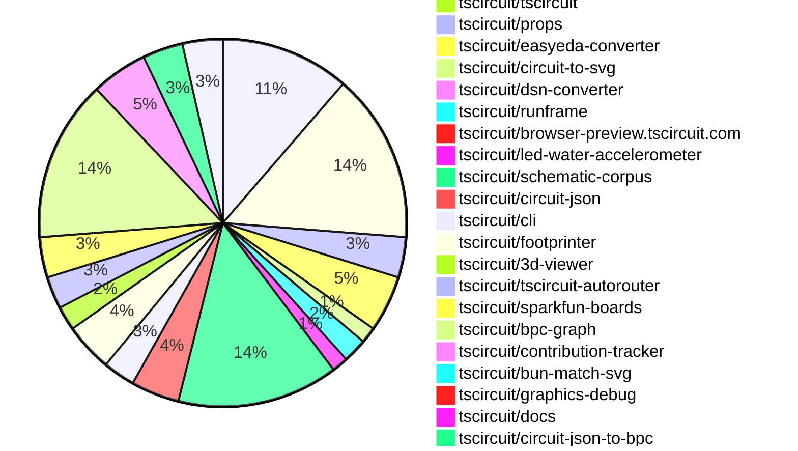
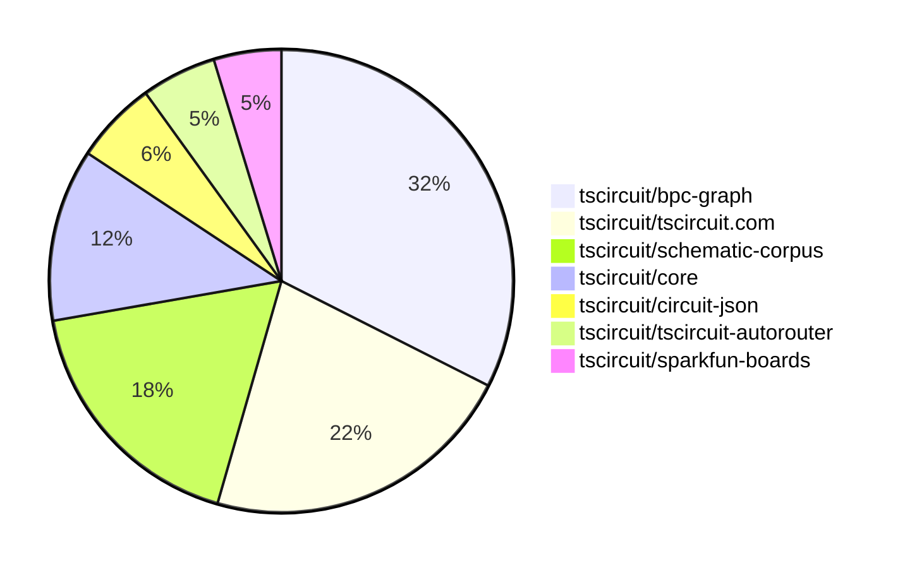

# Contribution Overview 2025-07-02

## PRs by Repository

## Contributor Overview

| Contributor | 🐳 Major | 🐙 Minor | 🐌 Tiny | ⭐ | Issues Created | Discussion Contributions |
|-------------|---------|---------|---------|-----|----------------|--------------------------|
| [seveibar](#seveibar) | 14 | 2 | 32 | 👑 | 0 | 0🔹 0🔶 0💎 |
| [ArnavK-09](#ArnavK-09) | 5 | 4 | 6 | ⭐⭐⭐ | 0 | 0🔹 0🔶 0💎 |
| [ShiboSoftwareDev](#ShiboSoftwareDev) | 3 | 2 | 11 | ⭐⭐⭐ | 0 | 0🔹 0🔶 0💎 |
| [Abse2001](#Abse2001) | 4 | 2 | 11 | ⭐⭐ | 0 | 0🔹 0🔶 0💎 |
| [imrishabh18](#imrishabh18) | 2 | 2 | 25 | ⭐⭐ | 0 | 0🔹 0🔶 0💎 |
| [ricohageman](#ricohageman) | 2 | 0 | 2 | ⭐⭐ | 0 | 0🔹 0🔶 0💎 |
| [MustafaMulla29](#MustafaMulla29) | 1 | 1 | 2 | ⭐ | 0 | 0🔹 0🔶 0💎 |
| [Anshgrover23](#Anshgrover23) | 0 | 0 | 5 | ⭐ | 0 | 0🔹 0🔶 0💎 |
| [abimaelmartell](#abimaelmartell) | 0 | 1 | 3 | ⭐ | 0 | 0🔹 0🔶 0💎 |
| [tscircuitbot](#tscircuitbot) | 0 | 0 | 5 | ⭐ | 0 | 0🔹 0🔶 0💎 |
| [andrii-balitskyi](#andrii-balitskyi) | 0 | 1 | 0 |  | 0 | 0🔹 0🔶 0💎 |

### Discussion Contribution Legend

- 🔹 Normal Comments: Basic participation with minimal effort
- 🔶 Great Informative Comments: Thoughtful participation that adds value
- 💎 Incredible Comments: Exceptional participation with high-quality content

## Review Table

[reviews-received-hover]: ## "Number of reviews received for PRs for this contributor"
[approvals-received-hover]: ## "Number of approvals received for PRs this contributor authored"
[rejections-received-hover]: ## "Number of rejections received for PRs this contributor authored"
[prs-opened-hover]: ## "Number of PRs opened by this contributor"
[issues-created-hover]: ## "Number of issues created by this contributor"
[bountied-issues-hover]: ## "Number of issues this contributor created with a bounty"
[bountied-issue-$-hover]: ## "Total bounty amount placed on issues authored by this contributor"

| Contributor | Reviews Received | Approvals Received | Rejections Received | Approvals | Rejections | PRs Opened | PRs Merged | Issues Created | Bountied Issues | Bountied Issue $ |
|---|---|---|---|---|---|---|---|---|---|---|
| [imrishabh18](#imrishabh18) | 20 | 11 | 1 | 3 | 0 | 31 | 29 | 0 | 0 | 0 |
| [ShiboSoftwareDev](#ShiboSoftwareDev) | 24 | 15 | 1 | 10 | 0 | 19 | 17 | 0 | 0 | 0 |
| [seveibar](#seveibar) | 27 | 1 | 0 | 56 | 2 | 64 | 48 | 0 | 0 | 0 |
| [graphite-app[bot]](#graphite-app[bot]) | 0 | 0 | 0 | 0 | 0 | 0 | 0 | 0 | 0 | 0 |
| [Anshgrover23](#Anshgrover23) | 10 | 10 | 0 | 1 | 1 | 9 | 5 | 0 | 0 | 0 |
| [techmannih](#techmannih) | 0 | 0 | 0 | 4 | 0 | 0 | 0 | 0 | 0 | 0 |
| [cursor[bot]](#cursor[bot]) | 0 | 0 | 0 | 0 | 0 | 0 | 0 | 0 | 0 | 0 |
| [abimaelmartell](#abimaelmartell) | 3 | 3 | 0 | 0 | 0 | 5 | 4 | 0 | 0 | 0 |
| [MustafaMulla29](#MustafaMulla29) | 11 | 10 | 0 | 0 | 0 | 7 | 4 | 0 | 0 | 0 |
| [ricohageman](#ricohageman) | 7 | 4 | 0 | 0 | 0 | 5 | 4 | 0 | 0 | 0 |
| [ArnavK-09](#ArnavK-09) | 32 | 17 | 1 | 2 | 0 | 17 | 15 | 0 | 0 | 0 |
| [ajsb85](#ajsb85) | 0 | 0 | 0 | 0 | 0 | 1 | 0 | 0 | 0 | 0 |
| [andrii-balitskyi](#andrii-balitskyi) | 1 | 1 | 0 | 0 | 0 | 1 | 1 | 0 | 0 | 0 |
| [Abse2001](#Abse2001) | 10 | 4 | 0 | 0 | 0 | 19 | 17 | 0 | 0 | 0 |
| [inline-arc](#inline-arc) | 3 | 0 | 0 | 0 | 0 | 1 | 0 | 0 | 0 | 0 |
| [tscircuitbot](#tscircuitbot) | 0 | 0 | 0 | 0 | 0 | 25 | 5 | 0 | 0 | 0 |

## Top 7 Repositories by Contribution Points

## Changes by Repository

### [tscircuit/core](https://github.com/tscircuit/core)

| PR # | Impact | Rating | Contributor | Description |
|------|--------|--------|-------------|-------------|
| [#1025](https://github.com/tscircuit/core/pull/1025) | 🐳 Major | ⭐⭐⭐ | imrishabh18 | Fixes incorrect positioning of schematic text within translated groups by computing the position using global coordinates instead of local coordinates. |
| [#1029](https://github.com/tscircuit/core/pull/1029) | 🐙 Minor | ⭐⭐ | imrishabh18 | Adds the autorouter_configuration property to the pcb_group in the circuit_json, allowing for trace clearance settings to be specified for autorouting. |
| [#1028](https://github.com/tscircuit/core/pull/1028) | 🐙 Minor | ⭐⭐ | imrishabh18 | Fixes the could not find port error when the pinheader component is processed inside a group due to incorrect name substitution. |
| [#1031](https://github.com/tscircuit/core/pull/1031) | 🐙 Minor | ⭐⭐ | seveibar | Fixes the offset issue in match-adapt layouts by ensuring that the groups global schematic position is respected when applying layout adjustments. |
| [#1039](https://github.com/tscircuit/core/pull/1039) | 🐙 Minor | ⭐⭐ | abimaelmartell | Fixes pin count inference for solderjumper components when the pin count is not explicitly provided, by inferring it from the footprint. |

🐌 Tiny Contributions (11)

| PR # | Impact | Contributor | Description |
|------|--------|-------------|-------------|
| [#1033](https://github.com/tscircuit/core/pull/1033) | 🐌 Tiny | imrishabh18 | Adds support for the autorouter configuration by introducing a preset property, allowing users to specify routing presets for enhanced autorouting functionality. |
| [#1043](https://github.com/tscircuit/core/pull/1043) | 🐌 Tiny | seveibar | Updates the bpc-graph and schematic corpus dependencies in the project. |
| [#1035](https://github.com/tscircuit/core/pull/1035) | 🐌 Tiny | seveibar | Adds a snapshot test for pushbutton rotations in a grid layout, ensuring correct rendering and functionality of pushbutton components in various orientations. |
| [#1032](https://github.com/tscircuit/core/pull/1032) | 🐌 Tiny | seveibar | Adds a test to ensure that matchAdapt groups operate independently in the circuit layout. |
| [#1030](https://github.com/tscircuit/core/pull/1030) | 🐌 Tiny | seveibar | Reproduces a bug related to match adaptation offset in schematic rendering with a comprehensive test case. |
| [#1027](https://github.com/tscircuit/core/pull/1027) | 🐌 Tiny | seveibar | Refactors the schematic layout matching adaptation process by removing redundant code and optimizing the layout generation for better performance. |
| [#1024](https://github.com/tscircuit/core/pull/1024) | 🐌 Tiny | seveibar | Adds a type declaration to the import statement for the schematic-corpus, specifying that the imported data is in JSON format. |
| [#1040](https://github.com/tscircuit/core/pull/1040) | 🐌 Tiny | abimaelmartell | Fixes the default position of netlabels to the connected schematic port when no specific coordinates are provided. |
| [#1041](https://github.com/tscircuit/core/pull/1041) | 🐌 Tiny | abimaelmartell | Allows inferring pin count from pinLabels only when no footprint exists and adds a snapshot test verifying schematic pins with pinLabels only. |
| [#1038](https://github.com/tscircuit/core/pull/1038) | 🐌 Tiny | MustafaMulla29 | Updates the footprinter dependency to version 0.0.189 and applies the fixed 0603 footprint in the core snapshots. |
| [#1042](https://github.com/tscircuit/core/pull/1042) | 🐌 Tiny | ricohageman | Updates the autorouter dependency version from 0.0.89 to 0.0.93 in package.json |

### [tscircuit/tscircuit.com](https://github.com/tscircuit/tscircuit.com)

| PR # | Impact | Rating | Contributor | Description |
|------|--------|--------|-------------|-------------|
| [#1399](https://github.com/tscircuit/tscircuit.com/pull/1399) | 🐳 Major | ⭐⭐⭐ | imrishabh18 | Adds support for URL encoding of all package files, enabling the loading of multiple files from a URL and utilizing new multi-file sharing in the editor. |
| [#1410](https://github.com/tscircuit/tscircuit.com/pull/1410) | 🐳 Major | ⭐⭐⭐ | ArnavK-09 | Modifies the fuzzy matching logic in CmdKMenu to prepend Import to option names, enhancing search relevance for import-related commands. |
| [#1405](https://github.com/tscircuit/tscircuit.com/pull/1405) | 🐳 Major | ⭐⭐⭐ | ArnavK-09 | Adds functionality to download circuit PNG images for unsaved packages or during live editing sessions. |
| [#1403](https://github.com/tscircuit/tscircuit.com/pull/1403) | 🐳 Major | ⭐⭐⭐ | ArnavK-09 | Adds a confirmation dialog for discarding unsaved changes, allowing users to confirm before losing their changes. |
| [#1401](https://github.com/tscircuit/tscircuit.com/pull/1401) | 🐳 Major | ⭐⭐⭐ | ArnavK-09 | Introduces a file tree structure to display TypeScript files and folders, adds search functionality to filter files based on user input, integrates CodeMirror for viewing and editing file content with syntax highlighting, implements file statistics display, and enhances UI with a responsive sidebar and improved layout. |
| [#1392](https://github.com/tscircuit/tscircuit.com/pull/1392) | 🐳 Major | ⭐⭐⭐ | ArnavK-09 | Adds functionality to download package files as a ZIP archive, similar to GitHubs download feature. |
| [#1406](https://github.com/tscircuit/tscircuit.com/pull/1406) | 🐙 Minor | ⭐⭐ | ArnavK-09 | Adds functionality to copy AI review text to clipboard when the AI review tab is active. |
| [#1404](https://github.com/tscircuit/tscircuit.com/pull/1404) | 🐙 Minor | ⭐⭐ | ArnavK-09 | Hides hidden files from the search results when using the ctrlfind functionality. |
| [#1376](https://github.com/tscircuit/tscircuit.com/pull/1376) | 🐙 Minor | ⭐⭐ | andrii-balitskyi | Fixes reload logic in ErrorBoundary to handle fetch-related failures more gracefully by implementing a timeout and visibility change listener for reloading the page. |

🐌 Tiny Contributions (12)

| PR # | Impact | Contributor | Description |
|------|--------|-------------|-------------|
| [#1416](https://github.com/tscircuit/tscircuit.com/pull/1416) | 🐌 Tiny | imrishabh18 | Ensures that the react-query cache is invalidated upon package deletion, prompting a refetch and displaying a 404 page if the package no longer exists. |
| [#1419](https://github.com/tscircuit/tscircuit.com/pull/1419) | 🐌 Tiny | imrishabh18 | Removes the refresh logs button from the build header, streamlining the user interface. |
| [#1418](https://github.com/tscircuit/tscircuit.com/pull/1418) | 🐌 Tiny | imrishabh18 | Refactors the CodeAndPreview component by separating the export of types, leading to faster loading of the landing page. |
| [#1417](https://github.com/tscircuit/tscircuit.com/pull/1417) | 🐌 Tiny | imrishabh18 | Prevents unnecessary refetching of trending and latest packages when the window gains focus, improving performance and user experience. |
| [#1415](https://github.com/tscircuit/tscircuit.com/pull/1415) | 🐌 Tiny | imrishabh18 | Updates the tscircuitrunframe dependency to version 0.0.669 in package.json. |
| [#1412](https://github.com/tscircuit/tscircuit.com/pull/1412) | 🐌 Tiny | imrishabh18 | Updates the easyeda dependency version from 0.0.181 to 0.0.195 in package.json. |
| [#1409](https://github.com/tscircuit/tscircuit.com/pull/1409) | 🐌 Tiny | imrishabh18 | Fixes the search dropdown layering issue by raising the z-index to ensure it appears above the PCB viewer. |
| [#1400](https://github.com/tscircuit/tscircuit.com/pull/1400) | 🐌 Tiny | imrishabh18 | Fixes the display of transpilation logs by changing the log message field from message to msg in the LogContent component. |
| [#1397](https://github.com/tscircuit/tscircuit.com/pull/1397) | 🐌 Tiny | Anshgrover23 | Updates the versions of the tscircuitcore and tscircuiteval dependencies in package.json. |
| [#1420](https://github.com/tscircuit/tscircuit.com/pull/1420) | 🐌 Tiny | ArnavK-09 | Removes the outdated file dialog and eliminates an unnecessary request to the snippets route in the EditorNav component. |
| [#1414](https://github.com/tscircuit/tscircuit.com/pull/1414) | 🐌 Tiny | ArnavK-09 | Adds a new proxy route with validation for headers and domain restrictions, along with corresponding tests to ensure functionality. |
| [#1402](https://github.com/tscircuit/tscircuit.com/pull/1402) | 🐌 Tiny | ArnavK-09 | Adds a themed loading state to the RunFrame component, replacing the default loading text with a styled loading animation. |

### [tscircuit/tscircuit](https://github.com/tscircuit/tscircuit)

🐌 Tiny Contributions (1)

| PR # | Impact | Contributor | Description |
|------|--------|-------------|-------------|
| [#695](https://github.com/tscircuit/tscircuit/pull/695) | 🐌 Tiny | imrishabh18 | Adds the graphics-debug package and updates the versions of core and eval packages in the project. |

### [tscircuit/props](https://github.com/tscircuit/props)

🐌 Tiny Contributions (5)

| PR # | Impact | Contributor | Description |
|------|--------|-------------|-------------|
| [#311](https://github.com/tscircuit/props/pull/311) | 🐌 Tiny | imrishabh18 | Adds preset options to the AutorouterConfig for improved routing configurations. |
| [#316](https://github.com/tscircuit/props/pull/316) | 🐌 Tiny | ShiboSoftwareDev | Refactors the SchematicCell and SchematicTable components to make certain properties optional and adds new properties for better layout control. |
| [#315](https://github.com/tscircuit/props/pull/315) | 🐌 Tiny | ShiboSoftwareDev | Updates the README formatting process in the GitHub workflow to use Prettier instead of Biome for consistent code style. |
| [#313](https://github.com/tscircuit/props/pull/313) | 🐌 Tiny | ShiboSoftwareDev | Introduces new props for SchematicTable, SchematicCell, and SchematicRow components to enhance their configurability and usability. |
| [#310](https://github.com/tscircuit/props/pull/310) | 🐌 Tiny | seveibar | Adds an optional traceClearance distance to the AutorouterConfig interface, allowing for more precise autorouting configurations. |

### [tscircuit/easyeda-converter](https://github.com/tscircuit/easyeda-converter)

🐌 Tiny Contributions (7)

| PR # | Impact | Contributor | Description |
|------|--------|-------------|-------------|
| [#284](https://github.com/tscircuit/easyeda-converter/pull/284) | 🐌 Tiny | imrishabh18 | Changes the import path for the normalizeManufacturerPartNumber function to its full path in the codebase. |
| [#282](https://github.com/tscircuit/easyeda-converter/pull/282) | 🐌 Tiny | imrishabh18 | Fixes the export path in package.json to correctly point to the main entry file and its types definition. |
| [#281](https://github.com/tscircuit/easyeda-converter/pull/281) | 🐌 Tiny | imrishabh18 | Separates the build process for the library and command line interface into distinct scripts in package.json. |
| [#280](https://github.com/tscircuit/easyeda-converter/pull/280) | 🐌 Tiny | imrishabh18 | Adds tscircuit as a peer dependency in package.json to ensure compatibility with the TypeScript version used in the project. |
| [#279](https://github.com/tscircuit/easyeda-converter/pull/279) | 🐌 Tiny | imrishabh18 | Removes redundant dependencies and updates existing dependencies to their latest versions in the project. |
| [#277](https://github.com/tscircuit/easyeda-converter/pull/277) | 🐌 Tiny | imrishabh18 | Fixes parsing of the rotation value for SMT pads in EasyEDA files, ensuring accurate representation in the converted circuit JSON. |
| [#283](https://github.com/tscircuit/easyeda-converter/pull/283) | 🐌 Tiny | seveibar | Switches build scripts to tsup-node to skip bundling of node modules, ensuring compatibility with Vercel deployment. |

### [tscircuit/circuit-to-svg](https://github.com/tscircuit/circuit-to-svg)

| PR # | Impact | Rating | Contributor | Description |
|------|--------|--------|-------------|-------------|
| [#278](https://github.com/tscircuit/circuit-to-svg/pull/278) | 🐳 Major | ⭐⭐⭐⭐ | ShiboSoftwareDev | This PR introduces support for rendering schematic_table and schematic_table_cell elements in the schematic SVG output. |

🐌 Tiny Contributions (1)

| PR # | Impact | Contributor | Description |
|------|--------|-------------|-------------|
| [#279](https://github.com/tscircuit/circuit-to-svg/pull/279) | 🐌 Tiny | imrishabh18 | Adds a data-circuit-to-svg-version attribute to the root svg element in generated SVGs, allowing users to see the version of the circuit-to-svg package used for debugging purposes. |

### [tscircuit/dsn-converter](https://github.com/tscircuit/dsn-converter)

🐌 Tiny Contributions (1)

| PR # | Impact | Contributor | Description |
|------|--------|-------------|-------------|
| [#108](https://github.com/tscircuit/dsn-converter/pull/108) | 🐌 Tiny | imrishabh18 | Adds a configuration option for traceClearance to customize the distance between traces and pads in the freerouting process. |

### [tscircuit/runframe](https://github.com/tscircuit/runframe)

🐌 Tiny Contributions (3)

| PR # | Impact | Contributor | Description |
|------|--------|-------------|-------------|
| [#853](https://github.com/tscircuit/runframe/pull/853) | 🐌 Tiny | imrishabh18 | Wraps the CircuitJsonPreview component in a div that sets its height to 100 of the viewport height, ensuring proper rendering of the canvas element. |
| [#848](https://github.com/tscircuit/runframe/pull/848) | 🐌 Tiny | imrishabh18 | Updates the easyeda dependency version from 0.0.185 to 0.0.201 in package.json. |
| [#839](https://github.com/tscircuit/runframe/pull/839) | 🐌 Tiny | ArnavK-09 | Adds an ImportComponentDialog component to facilitate the import of components in the application. |

### [tscircuit/browser-preview.tscircuit.com](https://github.com/tscircuit/browser-preview.tscircuit.com)

🐌 Tiny Contributions (1)

| PR # | Impact | Contributor | Description |
|------|--------|-------------|-------------|
| [#250](https://github.com/tscircuit/browser-preview.tscircuit.com/pull/250) | 🐌 Tiny | imrishabh18 | Fixes the height of the CAD viewer in the RunFrame component by updating the runframe dependency to a newer version. |

### [tscircuit/led-water-accelerometer](https://github.com/tscircuit/led-water-accelerometer)

🐌 Tiny Contributions (2)

| PR # | Impact | Contributor | Description |
|------|--------|-------------|-------------|
| [#5](https://github.com/tscircuit/led-water-accelerometer/pull/5) | 🐌 Tiny | imrishabh18 | Removes stale references to old packages in the lockfile that are not present in the registry, resolving build failures. |
| [#4](https://github.com/tscircuit/led-water-accelerometer/pull/4) | 🐌 Tiny | imrishabh18 | Adds an additional column to the LED matrix, increasing the column count from 7 to 8 and adjusting spacing accordingly. |

### [tscircuit/schematic-corpus](https://github.com/tscircuit/schematic-corpus)

| PR # | Impact | Rating | Contributor | Description |
|------|--------|--------|-------------|-------------|
| [#59](https://github.com/tscircuit/schematic-corpus/pull/59) | 🐳 Major | ⭐⭐⭐ | Abse2001 | Adds a new design (design044) that implements a new autolayout algorithm for circuit board design. |
| [#58](https://github.com/tscircuit/schematic-corpus/pull/58) | 🐳 Major | ⭐⭐⭐ | Abse2001 | Adds a new design (design043) that implements a new autolayout algorithm for circuit board design. |
| [#54](https://github.com/tscircuit/schematic-corpus/pull/54) | 🐳 Major | ⭐⭐⭐ | Abse2001 | Adds a new design (design039) that implements a new autolayout algorithm for schematic components, enhancing the placement and routing of electronic components on the board. |
| [#53](https://github.com/tscircuit/schematic-corpus/pull/53) | 🐳 Major | ⭐⭐⭐ | Abse2001 | Adds a new design (design038) that implements a new autolayout algorithm for circuit schematics, enhancing the placement of components based on specified manual edits. |
| [#50](https://github.com/tscircuit/schematic-corpus/pull/50) | 🐙 Minor | ⭐⭐ | Abse2001 | Adds a new design035 component to enhance the autolayout algorithm functionality in the schematic corpus. |
| [#42](https://github.com/tscircuit/schematic-corpus/pull/42) | 🐙 Minor | ⭐⭐ | Abse2001 | Redesigns the schematic for design014 by updating component placements and connections, enhancing the overall layout and functionality. |

🐌 Tiny Contributions (14)

| PR # | Impact | Contributor | Description |
|------|--------|-------------|-------------|
| [#56](https://github.com/tscircuit/schematic-corpus/pull/56) | 🐌 Tiny | imrishabh18 | Adds bpc-graph as a peer dependency in the package.json file and updates the import statement for the bundled BPC graphs. |
| [#55](https://github.com/tscircuit/schematic-corpus/pull/55) | 🐌 Tiny | seveibar | Adds two new designs (design040 and design041) featuring simple resistor and capacitor layouts to the schematic corpus. |
| [#43](https://github.com/tscircuit/schematic-corpus/pull/43) | 🐌 Tiny | seveibar | Adds TypeScript definitions for the build system and updates the main export path in package.json to point to the new index file. |
| [#61](https://github.com/tscircuit/schematic-corpus/pull/61) | 🐌 Tiny | Abse2001 | Adds a new design046 circuit to enhance the autolayout algorithm with specific manual placements for components. |
| [#60](https://github.com/tscircuit/schematic-corpus/pull/60) | 🐌 Tiny | Abse2001 | Adds a new design045 circuit to enhance the autolayout algorithm with specific manual edits for component placements. |
| [#57](https://github.com/tscircuit/schematic-corpus/pull/57) | 🐌 Tiny | Abse2001 | Adds a new design file that implements a new autolayout algorithm for circuit board design. |
| [#52](https://github.com/tscircuit/schematic-corpus/pull/52) | 🐌 Tiny | Abse2001 | Adds a new design (design037) that implements a manual layout for components in the autolayout algorithm, enhancing the placement of resistors and jumpers in the schematic. |
| [#51](https://github.com/tscircuit/schematic-corpus/pull/51) | 🐌 Tiny | Abse2001 | Adds a new design (design036) that implements a specific layout for components in the schematic, enhancing the autolayout algorithms functionality. |
| [#49](https://github.com/tscircuit/schematic-corpus/pull/49) | 🐌 Tiny | Abse2001 | Adds a new circuit design (design034) that implements a new autolayout algorithm for better component placement in schematics. |
| [#47](https://github.com/tscircuit/schematic-corpus/pull/47) | 🐌 Tiny | Abse2001 | Adds a new design (design033) that implements a manual layout for components in the autolayout algorithm, enhancing the placement of components on the schematic board. |
| [#46](https://github.com/tscircuit/schematic-corpus/pull/46) | 🐌 Tiny | Abse2001 | Adds a new design (design032) that implements a manual layout for components in the autolayout algorithm, enhancing the placement of schematic elements. |
| [#45](https://github.com/tscircuit/schematic-corpus/pull/45) | 🐌 Tiny | Abse2001 | Adds a new design (design031) that implements a custom layout for components in the schematic, enhancing the autolayout algorithms functionality. |
| [#44](https://github.com/tscircuit/schematic-corpus/pull/44) | 🐌 Tiny | Abse2001 | Adds a new design (design030) that implements a manual layout for components in the autolayout algorithm, enhancing the placement of components on the schematic board. |
| [#41](https://github.com/tscircuit/schematic-corpus/pull/41) | 🐌 Tiny | Abse2001 | Fixes inconsistent widths of schematic boxes across multiple designs to ensure uniformity in appearance. |

### [tscircuit/circuit-json](https://github.com/tscircuit/circuit-json)

| PR # | Impact | Rating | Contributor | Description |
|------|--------|--------|-------------|-------------|
| [#239](https://github.com/tscircuit/circuit-json/pull/239) | 🐳 Major | ⭐⭐⭐ | ShiboSoftwareDev | Adds a new element SchematicTableCell to define cells within a schematic table, enhancing the structure and representation of schematic data. |
| [#237](https://github.com/tscircuit/circuit-json/pull/237) | 🐙 Minor | ⭐⭐ | ShiboSoftwareDev | Adds a new schematic_table element to the circuit-json specification, enabling structured data display in schematics. |
| [#236](https://github.com/tscircuit/circuit-json/pull/236) | 🐙 Minor | ⭐⭐ | seveibar | Adds optional autorouter fields in the pcb_group schema and interface, documents these fields in README, and tests pcb_group autorouter options. |

🐌 Tiny Contributions (3)

| PR # | Impact | Contributor | Description |
|------|--------|-------------|-------------|
| [#238](https://github.com/tscircuit/circuit-json/pull/238) | 🐌 Tiny | ShiboSoftwareDev | Renames the rows property to cells in the schematic table data structure to improve clarity and consistency in the codebase. |
| [#233](https://github.com/tscircuit/circuit-json/pull/233) | 🐌 Tiny | seveibar | Fixes README generation for nested interfaces by using TypeScript AST to parse interfaces for documentation generation, updating the README docs generation logic, and regenerating the README. |
| [#235](https://github.com/tscircuit/circuit-json/pull/235) | 🐌 Tiny | Anshgrover23 | Adds an optional boolean property is_connected to the SchematicPort interface to indicate the connection status of schematic ports. |

### [tscircuit/cli](https://github.com/tscircuit/cli)

| PR # | Impact | Rating | Contributor | Description |
|------|--------|--------|-------------|-------------|
| [#260](https://github.com/tscircuit/cli/pull/260) | 🐳 Major | ⭐⭐⭐ | ShiboSoftwareDev | Updates the tsci build command to only build files ending in .circuit.tsx or .board.tsx when no file path is specified, preventing automatic building of index files. |

🐌 Tiny Contributions (3)

| PR # | Impact | Contributor | Description |
|------|--------|-------------|-------------|
| [#258](https://github.com/tscircuit/cli/pull/258) | 🐌 Tiny | ShiboSoftwareDev | Fixes the build process to only include .circuit.tsx and .board.tsx files, resolving an error related to unsupported file types. |
| [#257](https://github.com/tscircuit/cli/pull/257) | 🐌 Tiny | Anshgrover23 | Updates the version of the circuit-to-svg dependency from 0.0.163 to 0.0.164 in package.json. |
| [#256](https://github.com/tscircuit/cli/pull/256) | 🐌 Tiny | Anshgrover23 | Updates the version of the tscircuitrunframe dependency from 0.0.649 to 0.0.656 in package.json. |

### [tscircuit/footprinter](https://github.com/tscircuit/footprinter)

| PR # | Impact | Rating | Contributor | Description |
|------|--------|--------|-------------|-------------|
| [#308](https://github.com/tscircuit/footprinter/pull/308) | 🐙 Minor | ⭐⭐ | ShiboSoftwareDev | Changes the order of VSSOP pins to correct the pin numbering and layout for better alignment with standard specifications. |

🐌 Tiny Contributions (5)

| PR # | Impact | Contributor | Description |
|------|--------|-------------|-------------|
| [#311](https://github.com/tscircuit/footprinter/pull/311) | 🐌 Tiny | seveibar | Adds a new m2host footprint generator and associated tests, along with an update to the circuit-json dependency. |
| [#317](https://github.com/tscircuit/footprinter/pull/317) | 🐌 Tiny | seveibar | Updates the dependency circuit-to-svg to version 0.0.164 in package.json. |
| [#314](https://github.com/tscircuit/footprinter/pull/314) | 🐌 Tiny | seveibar | Removes the lockfile configuration from the bunfig.toml, preventing the saving of lockfile during installation. |
| [#318](https://github.com/tscircuit/footprinter/pull/318) | 🐌 Tiny | abimaelmartell | Adds a new SOT25 footprint generator using SOT23 logic, exposing it through the footprinter API and including tests. |
| [#316](https://github.com/tscircuit/footprinter/pull/316) | 🐌 Tiny | MustafaMulla29 | Fixes the dimensions of the 0603 footprint to correct inaccuracies in the specifications. |

### [tscircuit/3d-viewer](https://github.com/tscircuit/3d-viewer)

🐌 Tiny Contributions (3)

| PR # | Impact | Contributor | Description |
|------|--------|-------------|-------------|
| [#375](https://github.com/tscircuit/3d-viewer/pull/375) | 🐌 Tiny | ShiboSoftwareDev | Also added the led flashlight as a story test The error component wasnt correctly displaying the error Error tooltip style now: !image(https:github.comuser-attachmentsassetsc8793eed-7329-43ad-87de-77bd5b2ee355) it used to be too far to the right |
| [#372](https://github.com/tscircuit/3d-viewer/pull/372) | 🐌 Tiny | ShiboSoftwareDev | Changes the rendering of circuit stories to be asynchronous, allowing traces to be rendered correctly in the CadViewer component. |
| [#370](https://github.com/tscircuit/3d-viewer/pull/370) | 🐌 Tiny | ShiboSoftwareDev | Fixes error handling for invalid STL URLs in the 3D model loader, ensuring proper error messages are displayed when fetching fails. |

### [tscircuit/tscircuit-autorouter](https://github.com/tscircuit/tscircuit-autorouter)

| PR # | Impact | Rating | Contributor | Description |
|------|--------|--------|-------------|-------------|
| [#193](https://github.com/tscircuit/tscircuit-autorouter/pull/193) | 🐳 Major | ⭐⭐⭐ | ricohageman | Fixes autorouting failure when the ViaPossibilitiesSolver2 fails to find a solution within the iteration limit, preventing the MultiHeadSolver from failing directly after a single iteration. |
| [#192](https://github.com/tscircuit/tscircuit-autorouter/pull/192) | 🐳 Major | ⭐⭐⭐ | ricohageman | Re-enables closed form high density routing functionality and adds a fixture for testing related issues. |

🐌 Tiny Contributions (2)

| PR # | Impact | Contributor | Description |
|------|--------|-------------|-------------|
| [#188](https://github.com/tscircuit/tscircuit-autorouter/pull/188) | 🐌 Tiny | ShiboSoftwareDev | Introduces a high-density fixture for the node cn755, including its capacity mesh and port points. |
| [#185](https://github.com/tscircuit/tscircuit-autorouter/pull/185) | 🐌 Tiny | ShiboSoftwareDev | Adds a new JSON representation for the cn673 node with port points and a corresponding React component for debugging. |

### [tscircuit/sparkfun-boards](https://github.com/tscircuit/sparkfun-boards)

| PR # | Impact | Rating | Contributor | Description |
|------|--------|--------|-------------|-------------|
| [#22](https://github.com/tscircuit/sparkfun-boards/pull/22) | 🐳 Major | ⭐⭐⭐ | MustafaMulla29 | Introduces a new circuit board for the Sparkfun Mini Linear 3D Hall Effect Sensor, including its schematic and footprint. |
| [#38](https://github.com/tscircuit/sparkfun-boards/pull/38) | 🐙 Minor | ⭐⭐ | MustafaMulla29 | No description provided |

🐌 Tiny Contributions (3)

| PR # | Impact | Contributor | Description |
|------|--------|-------------|-------------|
| [#44](https://github.com/tscircuit/sparkfun-boards/pull/44) | 🐌 Tiny | ShiboSoftwareDev | Adds ShiboSoftwareDev as a code owner for the SparkFun I2C DAC Breakout MCP4725 and includes a new entry for the author in the CODEOWNERS file. |
| [#42](https://github.com/tscircuit/sparkfun-boards/pull/42) | 🐌 Tiny | seveibar | Adds a CODEOWNERS file to specify ownership of board directories and renames board directories to remove spaces for better compatibility. |
| [#41](https://github.com/tscircuit/sparkfun-boards/pull/41) | 🐌 Tiny | Anshgrover23 | No description provided |

### [tscircuit/bpc-graph](https://github.com/tscircuit/bpc-graph)

| PR # | Impact | Rating | Contributor | Description |
|------|--------|--------|-------------|-------------|
| [#48](https://github.com/tscircuit/bpc-graph/pull/48) | 🐳 Major | ⭐⭐⭐ | seveibar | Fixes assignment by using normalized perimeter distance instead of angle distance for pin similarity in the matching algorithm for pins. |
| [#46](https://github.com/tscircuit/bpc-graph/pull/46) | 🐳 Major | ⭐⭐⭐ | seveibar | Adds functionality to adjust the layout of floating boxes in relation to fixed boxes during the net adaptation process, ensuring proper width matching and alignment. |
| [#45](https://github.com/tscircuit/bpc-graph/pull/45) | 🐳 Major | ⭐⭐⭐ | seveibar | add snapshot to help with understanding the issue add resistor capacitor example with corpus updated with match init debugger component clean up assignment page and add example with proper assignment for tscircutisch04 fix accidentally removed import allow getting pin assignments from assignment solver, fix tscircuitsch04 edit operation issues rewrite net adapt remove log lines |
| [#43](https://github.com/tscircuit/bpc-graph/pull/43) | 🐳 Major | ⭐⭐⭐ | seveibar | Introduces a new method for calculating graph distances that incorporates network length as a tie-breaker in the assignment solver. |
| [#42](https://github.com/tscircuit/bpc-graph/pull/42) | 🐳 Major | ⭐⭐⭐ | seveibar | Switches to a partial floating graph and evaluates the next best floating box id to add, refactoring and storing last computed evaluations and showing them. |
| [#41](https://github.com/tscircuit/bpc-graph/pull/41) | 🐳 Major | ⭐⭐⭐ | seveibar | Adds a new weighted Jaccard similarity function for assignment debugging, along with tests and visual enhancements. |
| [#39](https://github.com/tscircuit/bpc-graph/pull/39) | 🐳 Major | ⭐⭐⭐ | seveibar | Adds functionality to allow for variable degrees of distance introspection in graph comparisons, enhancing the flexibility of distance calculations between BPC graphs. |
| [#38](https://github.com/tscircuit/bpc-graph/pull/38) | 🐳 Major | ⭐⭐⭐ | seveibar | Introduces a new assignment solver for matching floating boxes to fixed boxes in a graph, along with a debugging interface for visualizing the assignment process. |
| [#37](https://github.com/tscircuit/bpc-graph/pull/37) | 🐳 Major | ⭐⭐⭐ | seveibar | Adds a new feature to calculate WL distance using colors in the BPC graph representation. |
| [#36](https://github.com/tscircuit/bpc-graph/pull/36) | 🐳 Major | ⭐⭐⭐ | seveibar | Adjusts the exploration order in the schematic partitioning process to prioritize pins with fewer connections, improving efficiency in net partitioning. |
| [#35](https://github.com/tscircuit/bpc-graph/pull/35) | 🐳 Major | ⭐⭐⭐ | seveibar | This PR implements a major rewrite of the schematic graph partitioning logic to enhance clarity and functionality, including the addition of new methods for better observability and debugging. |
| [#30](https://github.com/tscircuit/bpc-graph/pull/30) | 🐳 Major | ⭐⭐⭐ | seveibar | Adds a new function for layout schematic graphs, enabling better organization and representation of circuit schematics. |
| [#29](https://github.com/tscircuit/bpc-graph/pull/29) | 🐳 Major | ⭐⭐⭐ | seveibar | Adds a complete layout process with partitioning, including new methods for partition matching, duplicate pin handling, and graph adaptations. |
| [#28](https://github.com/tscircuit/bpc-graph/pull/28) | 🐳 Major | ⭐⭐⭐ | seveibar | Introduces a new partitioning algorithm for graph layout that utilizes singleton keys to manage pin connections effectively. |

🐌 Tiny Contributions (6)

| PR # | Impact | Contributor | Description |
|------|--------|-------------|-------------|
| [#50](https://github.com/tscircuit/bpc-graph/pull/50) | 🐌 Tiny | seveibar | Changes the dependency of tscircuitschematic-corpus from a regular dependency to a peer dependency in package.json. |
| [#32](https://github.com/tscircuit/bpc-graph/pull/32) | 🐌 Tiny | seveibar | Adds a test that reproduces a core issue related to the tscircuitsch02 circuit, facilitating easier debugging and verification of the issue. |
| [#31](https://github.com/tscircuit/bpc-graph/pull/31) | 🐌 Tiny | seveibar | Changes the layoutSchematicGraph function to require a corpus parameter instead of bundling it, allowing for more flexible graph layout processing. |
| [#27](https://github.com/tscircuit/bpc-graph/pull/27) | 🐌 Tiny | seveibar | Replaces the existing tscircuit code example with a simpler version that has exact matches in the corpus, improving clarity and usability for users. |
| [#21](https://github.com/tscircuit/bpc-graph/pull/21) | 🐌 Tiny | seveibar | Adds a test for a tscircuit code example that generates a schematic and verifies its SVG output. |
| [#33](https://github.com/tscircuit/bpc-graph/pull/33) | 🐌 Tiny | ricohageman | Aligns the center of partitioned boxes to the origin in merged graphs, ensuring consistent positioning across all graphs. |

### [tscircuit/contribution-tracker](https://github.com/tscircuit/contribution-tracker)

| PR # | Impact | Rating | Contributor | Description |
|------|--------|--------|-------------|-------------|
| [#189](https://github.com/tscircuit/contribution-tracker/pull/189) | 🐙 Minor | ⭐⭐ | ArnavK-09 | This PR changes the weekly overview generation to count repositories from Wednesday to Wednesday and adds a star rating display in the README for each pull request. |
| [#188](https://github.com/tscircuit/contribution-tracker/pull/188) | 🐙 Minor | ⭐⭐ | ArnavK-09 | Updates the notification system to display contribution star ratings instead of impact for pull requests. |

🐌 Tiny Contributions (5)

| PR # | Impact | Contributor | Description |
|------|--------|-------------|-------------|
| [#194](https://github.com/tscircuit/contribution-tracker/pull/194) | 🐌 Tiny | seveibar | Fixes markdown bullet formatting in changelogs to use standard - instead of non-standard bullets. |
| [#193](https://github.com/tscircuit/contribution-tracker/pull/193) | 🐌 Tiny | seveibar | I had to do a lot of custom scripting to get the new numbers for june, many bonuses were applied |
| [#192](https://github.com/tscircuit/contribution-tracker/pull/192) | 🐌 Tiny | seveibar | Comments out the fetching of bountied issues and issues created for contributors to avoid hitting GitHub API rate limits, and updates scoring tests to cap review points at 5 instead of 10. |
| [#196](https://github.com/tscircuit/contribution-tracker/pull/196) | 🐌 Tiny | ArnavK-09 | Changes the review cap for code owners from 5 to 10 distinct PRs reviewed, allowing for a higher score for code owners in the contributor scoring system. |
| [#197](https://github.com/tscircuit/contribution-tracker/pull/197) | 🐌 Tiny | ArnavK-09 | Introduces a mobile-friendly card layout for displaying pull requests, enhancing usability on smaller screens. |

### [tscircuit/bun-match-svg](https://github.com/tscircuit/bun-match-svg)

🐌 Tiny Contributions (1)

| PR # | Impact | Contributor | Description |
|------|--------|-------------|-------------|
| [#11](https://github.com/tscircuit/bun-match-svg/pull/11) | 🐌 Tiny | seveibar | Updates snapshot functions to only write new files when images differ or when FORCE_BUN_UPDATE_SNAPSHOTS is set, and adds a regression test ensuring identical SVGs dont rewrite snapshots. |

### [tscircuit/graphics-debug](https://github.com/tscircuit/graphics-debug)

🐌 Tiny Contributions (1)

| PR # | Impact | Contributor | Description |
|------|--------|-------------|-------------|
| [#69](https://github.com/tscircuit/graphics-debug/pull/69) | 🐌 Tiny | seveibar | Adds a titles option to the stackGraphicsVertically function, allowing titles to be displayed left of each stacked graphic, and updates the README and tests accordingly. |

### [tscircuit/docs](https://github.com/tscircuit/docs)

🐌 Tiny Contributions (1)

| PR # | Impact | Contributor | Description |
|------|--------|-------------|-------------|
| [#95](https://github.com/tscircuit/docs/pull/95) | 🐌 Tiny | seveibar | Removes the ChatGPT link from the ai-context documentation, streamlining the information provided to users. |

### [tscircuit/circuit-json-to-bpc](https://github.com/tscircuit/circuit-json-to-bpc)

🐌 Tiny Contributions (5)

| PR # | Impact | Contributor | Description |
|------|--------|-------------|-------------|
| [#7](https://github.com/tscircuit/circuit-json-to-bpc/pull/7) | 🐌 Tiny | seveibar | Adds source_trace_id and schematic_trace_id to schematic_net_label when inferring net labels, enhancing traceability in net label generation. |
| [#6](https://github.com/tscircuit/circuit-json-to-bpc/pull/6) | 🐌 Tiny | seveibar | Removes the requirement for a source_trace when inferring net labels in BPC graph generation, allowing for more flexible net label generation. |
| [#5](https://github.com/tscircuit/circuit-json-to-bpc/pull/5) | 🐌 Tiny | seveibar | Adds a helper function to generate implicit net labels for schematic ports that are not connected via a trace, along with tests for this functionality. |
| [#4](https://github.com/tscircuit/circuit-json-to-bpc/pull/4) | 🐌 Tiny | seveibar | Adds a readable ID option to the circuit JSON conversion process, improving debugging capabilities by allowing users to see more meaningful identifiers for components and labels. |
| [#3](https://github.com/tscircuit/circuit-json-to-bpc/pull/3) | 🐌 Tiny | seveibar | Adds boxAttributes to net labels, allowing BPC Graphs to implement special logic for managing large net label networks. |

### [tscircuit/deps.tscircuit.com](https://github.com/tscircuit/deps.tscircuit.com)

🐌 Tiny Contributions (1)

| PR # | Impact | Contributor | Description |
|------|--------|-------------|-------------|
| [#24](https://github.com/tscircuit/deps.tscircuit.com/pull/24) | 🐌 Tiny | seveibar | Adds the tscircuitfootprinter package as a dependency and categorizes it under Specifications, updating the dependency graph and testing its mapping. |

### [tscircuit/eval](https://github.com/tscircuit/eval)

🐌 Tiny Contributions (5)

| PR # | Impact | Contributor | Description |
|------|--------|-------------|-------------|
| [#654](https://github.com/tscircuit/eval/pull/654) | 🐌 Tiny | tscircuitbot | Updates the tscircuitcore package to version 0.0.549, reflecting the latest changes and improvements in the core library. |
| [#644](https://github.com/tscircuit/eval/pull/644) | 🐌 Tiny | tscircuitbot | Updates the tscircuitcore dependency to version 0.0.543, ensuring compatibility with the latest features and fixes from the core library. |
| [#638](https://github.com/tscircuit/eval/pull/638) | 🐌 Tiny | tscircuitbot | Updates the tscircuitcore dependency from version 0.0.537 to 0.0.540 and updates the circuit-json dependency from version 0.0.212 to 0.0.215. |
| [#632](https://github.com/tscircuit/eval/pull/632) | 🐌 Tiny | tscircuitbot | Updates the tscircuitcore dependency to version 0.0.537, ensuring compatibility with the latest features and fixes provided by the core library. |
| [#630](https://github.com/tscircuit/eval/pull/630) | 🐌 Tiny | tscircuitbot | Updates the tscircuitcore dependency to version 0.0.536, reflecting the latest changes and improvements in the core library. |

## Changes by Contributor

### [imrishabh18](https://github.com/imrishabh18)

| PRs # | Impact | Rating | Description |
|------|--------|--------|-------------|
| [#1025](https://github.com/tscircuit/core/pull/1025) | 🐳 Major | ⭐⭐⭐ | Fixes incorrect positioning of schematic text within translated groups by computing the position using global coordinates instead of local coordinates. |
| [#1399](https://github.com/tscircuit/tscircuit.com/pull/1399) | 🐳 Major | ⭐⭐⭐ | Adds support for URL encoding of all package files, enabling the loading of multiple files from a URL and utilizing new multi-file sharing in the editor. |
| [#1029](https://github.com/tscircuit/core/pull/1029) | 🐙 Minor | ⭐⭐ | Adds the autorouter_configuration property to the pcb_group in the circuit_json, allowing for trace clearance settings to be specified for autorouting. |
| [#1028](https://github.com/tscircuit/core/pull/1028) | 🐙 Minor | ⭐⭐ | Fixes the could not find port error when the pinheader component is processed inside a group due to incorrect name substitution. |

🐌 Tiny Contributions (25)

| PR # | Impact | Description |
|------|--------|-------------|
| [#695](https://github.com/tscircuit/tscircuit/pull/695) | 🐌 Tiny | Adds the graphics-debug package and updates the versions of core and eval packages in the project. |
| [#311](https://github.com/tscircuit/props/pull/311) | 🐌 Tiny | Adds preset options to the AutorouterConfig for improved routing configurations. |
| [#284](https://github.com/tscircuit/easyeda-converter/pull/284) | 🐌 Tiny | Changes the import path for the normalizeManufacturerPartNumber function to its full path in the codebase. |
| [#282](https://github.com/tscircuit/easyeda-converter/pull/282) | 🐌 Tiny | Fixes the export path in package.json to correctly point to the main entry file and its types definition. |
| [#281](https://github.com/tscircuit/easyeda-converter/pull/281) | 🐌 Tiny | Separates the build process for the library and command line interface into distinct scripts in package.json. |
| [#280](https://github.com/tscircuit/easyeda-converter/pull/280) | 🐌 Tiny | Adds tscircuit as a peer dependency in package.json to ensure compatibility with the TypeScript version used in the project. |
| [#279](https://github.com/tscircuit/easyeda-converter/pull/279) | 🐌 Tiny | Removes redundant dependencies and updates existing dependencies to their latest versions in the project. |
| [#277](https://github.com/tscircuit/easyeda-converter/pull/277) | 🐌 Tiny | Fixes parsing of the rotation value for SMT pads in EasyEDA files, ensuring accurate representation in the converted circuit JSON. |
| [#1033](https://github.com/tscircuit/core/pull/1033) | 🐌 Tiny | Adds support for the autorouter configuration by introducing a preset property, allowing users to specify routing presets for enhanced autorouting functionality. |
| [#279](https://github.com/tscircuit/circuit-to-svg/pull/279) | 🐌 Tiny | Adds a data-circuit-to-svg-version attribute to the root svg element in generated SVGs, allowing users to see the version of the circuit-to-svg package used for debugging purposes. |
| [#108](https://github.com/tscircuit/dsn-converter/pull/108) | 🐌 Tiny | Adds a configuration option for traceClearance to customize the distance between traces and pads in the freerouting process. |
| [#1416](https://github.com/tscircuit/tscircuit.com/pull/1416) | 🐌 Tiny | Ensures that the react-query cache is invalidated upon package deletion, prompting a refetch and displaying a 404 page if the package no longer exists. |
| [#1419](https://github.com/tscircuit/tscircuit.com/pull/1419) | 🐌 Tiny | Removes the refresh logs button from the build header, streamlining the user interface. |
| [#1418](https://github.com/tscircuit/tscircuit.com/pull/1418) | 🐌 Tiny | Refactors the CodeAndPreview component by separating the export of types, leading to faster loading of the landing page. |
| [#1417](https://github.com/tscircuit/tscircuit.com/pull/1417) | 🐌 Tiny | Prevents unnecessary refetching of trending and latest packages when the window gains focus, improving performance and user experience. |
| [#1415](https://github.com/tscircuit/tscircuit.com/pull/1415) | 🐌 Tiny | Updates the tscircuitrunframe dependency to version 0.0.669 in package.json. |
| [#1412](https://github.com/tscircuit/tscircuit.com/pull/1412) | 🐌 Tiny | Updates the easyeda dependency version from 0.0.181 to 0.0.195 in package.json. |
| [#1409](https://github.com/tscircuit/tscircuit.com/pull/1409) | 🐌 Tiny | Fixes the search dropdown layering issue by raising the z-index to ensure it appears above the PCB viewer. |
| [#1400](https://github.com/tscircuit/tscircuit.com/pull/1400) | 🐌 Tiny | Fixes the display of transpilation logs by changing the log message field from message to msg in the LogContent component. |
| [#853](https://github.com/tscircuit/runframe/pull/853) | 🐌 Tiny | Wraps the CircuitJsonPreview component in a div that sets its height to 100 of the viewport height, ensuring proper rendering of the canvas element. |
| [#848](https://github.com/tscircuit/runframe/pull/848) | 🐌 Tiny | Updates the easyeda dependency version from 0.0.185 to 0.0.201 in package.json. |
| [#250](https://github.com/tscircuit/browser-preview.tscircuit.com/pull/250) | 🐌 Tiny | Fixes the height of the CAD viewer in the RunFrame component by updating the runframe dependency to a newer version. |
| [#5](https://github.com/tscircuit/led-water-accelerometer/pull/5) | 🐌 Tiny | Removes stale references to old packages in the lockfile that are not present in the registry, resolving build failures. |
| [#4](https://github.com/tscircuit/led-water-accelerometer/pull/4) | 🐌 Tiny | Adds an additional column to the LED matrix, increasing the column count from 7 to 8 and adjusting spacing accordingly. |
| [#56](https://github.com/tscircuit/schematic-corpus/pull/56) | 🐌 Tiny | Adds bpc-graph as a peer dependency in the package.json file and updates the import statement for the bundled BPC graphs. |

### [ShiboSoftwareDev](https://github.com/ShiboSoftwareDev)

| PRs # | Impact | Rating | Description |
|------|--------|--------|-------------|
| [#278](https://github.com/tscircuit/circuit-to-svg/pull/278) | 🐳 Major | ⭐⭐⭐⭐ | This PR introduces support for rendering schematic_table and schematic_table_cell elements in the schematic SVG output. |
| [#239](https://github.com/tscircuit/circuit-json/pull/239) | 🐳 Major | ⭐⭐⭐ | Adds a new element SchematicTableCell to define cells within a schematic table, enhancing the structure and representation of schematic data. |
| [#260](https://github.com/tscircuit/cli/pull/260) | 🐳 Major | ⭐⭐⭐ | Updates the tsci build command to only build files ending in .circuit.tsx or .board.tsx when no file path is specified, preventing automatic building of index files. |
| [#237](https://github.com/tscircuit/circuit-json/pull/237) | 🐙 Minor | ⭐⭐ | Adds a new schematic_table element to the circuit-json specification, enabling structured data display in schematics. |
| [#308](https://github.com/tscircuit/footprinter/pull/308) | 🐙 Minor | ⭐⭐ | Changes the order of VSSOP pins to correct the pin numbering and layout for better alignment with standard specifications. |

🐌 Tiny Contributions (11)

| PR # | Impact | Description |
|------|--------|-------------|
| [#238](https://github.com/tscircuit/circuit-json/pull/238) | 🐌 Tiny | Renames the rows property to cells in the schematic table data structure to improve clarity and consistency in the codebase. |
| [#316](https://github.com/tscircuit/props/pull/316) | 🐌 Tiny | Refactors the SchematicCell and SchematicTable components to make certain properties optional and adds new properties for better layout control. |
| [#315](https://github.com/tscircuit/props/pull/315) | 🐌 Tiny | Updates the README formatting process in the GitHub workflow to use Prettier instead of Biome for consistent code style. |
| [#313](https://github.com/tscircuit/props/pull/313) | 🐌 Tiny | Introduces new props for SchematicTable, SchematicCell, and SchematicRow components to enhance their configurability and usability. |
| [#375](https://github.com/tscircuit/3d-viewer/pull/375) | 🐌 Tiny | Also added the led flashlight as a story test The error component wasnt correctly displaying the error Error tooltip style now: !image(https:github.comuser-attachmentsassetsc8793eed-7329-43ad-87de-77bd5b2ee355) it used to be too far to the right |
| [#372](https://github.com/tscircuit/3d-viewer/pull/372) | 🐌 Tiny | Changes the rendering of circuit stories to be asynchronous, allowing traces to be rendered correctly in the CadViewer component. |
| [#370](https://github.com/tscircuit/3d-viewer/pull/370) | 🐌 Tiny | Fixes error handling for invalid STL URLs in the 3D model loader, ensuring proper error messages are displayed when fetching fails. |
| [#258](https://github.com/tscircuit/cli/pull/258) | 🐌 Tiny | Fixes the build process to only include .circuit.tsx and .board.tsx files, resolving an error related to unsupported file types. |
| [#188](https://github.com/tscircuit/tscircuit-autorouter/pull/188) | 🐌 Tiny | Introduces a high-density fixture for the node cn755, including its capacity mesh and port points. |
| [#185](https://github.com/tscircuit/tscircuit-autorouter/pull/185) | 🐌 Tiny | Adds a new JSON representation for the cn673 node with port points and a corresponding React component for debugging. |
| [#44](https://github.com/tscircuit/sparkfun-boards/pull/44) | 🐌 Tiny | Adds ShiboSoftwareDev as a code owner for the SparkFun I2C DAC Breakout MCP4725 and includes a new entry for the author in the CODEOWNERS file. |

### [seveibar](https://github.com/seveibar)

| PRs # | Impact | Rating | Description |
|------|--------|--------|-------------|
| [#48](https://github.com/tscircuit/bpc-graph/pull/48) | 🐳 Major | ⭐⭐⭐ | Fixes assignment by using normalized perimeter distance instead of angle distance for pin similarity in the matching algorithm for pins. |
| [#46](https://github.com/tscircuit/bpc-graph/pull/46) | 🐳 Major | ⭐⭐⭐ | Adds functionality to adjust the layout of floating boxes in relation to fixed boxes during the net adaptation process, ensuring proper width matching and alignment. |
| [#45](https://github.com/tscircuit/bpc-graph/pull/45) | 🐳 Major | ⭐⭐⭐ | add snapshot to help with understanding the issue add resistor capacitor example with corpus updated with match init debugger component clean up assignment page and add example with proper assignment for tscircutisch04 fix accidentally removed import allow getting pin assignments from assignment solver, fix tscircuitsch04 edit operation issues rewrite net adapt remove log lines |
| [#43](https://github.com/tscircuit/bpc-graph/pull/43) | 🐳 Major | ⭐⭐⭐ | Introduces a new method for calculating graph distances that incorporates network length as a tie-breaker in the assignment solver. |
| [#42](https://github.com/tscircuit/bpc-graph/pull/42) | 🐳 Major | ⭐⭐⭐ | Switches to a partial floating graph and evaluates the next best floating box id to add, refactoring and storing last computed evaluations and showing them. |
| [#41](https://github.com/tscircuit/bpc-graph/pull/41) | 🐳 Major | ⭐⭐⭐ | Adds a new weighted Jaccard similarity function for assignment debugging, along with tests and visual enhancements. |
| [#39](https://github.com/tscircuit/bpc-graph/pull/39) | 🐳 Major | ⭐⭐⭐ | Adds functionality to allow for variable degrees of distance introspection in graph comparisons, enhancing the flexibility of distance calculations between BPC graphs. |
| [#38](https://github.com/tscircuit/bpc-graph/pull/38) | 🐳 Major | ⭐⭐⭐ | Introduces a new assignment solver for matching floating boxes to fixed boxes in a graph, along with a debugging interface for visualizing the assignment process. |
| [#37](https://github.com/tscircuit/bpc-graph/pull/37) | 🐳 Major | ⭐⭐⭐ | Adds a new feature to calculate WL distance using colors in the BPC graph representation. |
| [#36](https://github.com/tscircuit/bpc-graph/pull/36) | 🐳 Major | ⭐⭐⭐ | Adjusts the exploration order in the schematic partitioning process to prioritize pins with fewer connections, improving efficiency in net partitioning. |
| [#35](https://github.com/tscircuit/bpc-graph/pull/35) | 🐳 Major | ⭐⭐⭐ | This PR implements a major rewrite of the schematic graph partitioning logic to enhance clarity and functionality, including the addition of new methods for better observability and debugging. |
| [#30](https://github.com/tscircuit/bpc-graph/pull/30) | 🐳 Major | ⭐⭐⭐ | Adds a new function for layout schematic graphs, enabling better organization and representation of circuit schematics. |
| [#29](https://github.com/tscircuit/bpc-graph/pull/29) | 🐳 Major | ⭐⭐⭐ | Adds a complete layout process with partitioning, including new methods for partition matching, duplicate pin handling, and graph adaptations. |
| [#28](https://github.com/tscircuit/bpc-graph/pull/28) | 🐳 Major | ⭐⭐⭐ | Introduces a new partitioning algorithm for graph layout that utilizes singleton keys to manage pin connections effectively. |
| [#236](https://github.com/tscircuit/circuit-json/pull/236) | 🐙 Minor | ⭐⭐ | Adds optional autorouter fields in the pcb_group schema and interface, documents these fields in README, and tests pcb_group autorouter options. |
| [#1031](https://github.com/tscircuit/core/pull/1031) | 🐙 Minor | ⭐⭐ | Fixes the offset issue in match-adapt layouts by ensuring that the groups global schematic position is respected when applying layout adjustments. |

🐌 Tiny Contributions (32)

| PR # | Impact | Description |
|------|--------|-------------|
| [#233](https://github.com/tscircuit/circuit-json/pull/233) | 🐌 Tiny | Fixes README generation for nested interfaces by using TypeScript AST to parse interfaces for documentation generation, updating the README docs generation logic, and regenerating the README. |
| [#310](https://github.com/tscircuit/props/pull/310) | 🐌 Tiny | Adds an optional traceClearance distance to the AutorouterConfig interface, allowing for more precise autorouting configurations. |
| [#311](https://github.com/tscircuit/footprinter/pull/311) | 🐌 Tiny | Adds a new m2host footprint generator and associated tests, along with an update to the circuit-json dependency. |
| [#317](https://github.com/tscircuit/footprinter/pull/317) | 🐌 Tiny | Updates the dependency circuit-to-svg to version 0.0.164 in package.json. |
| [#314](https://github.com/tscircuit/footprinter/pull/314) | 🐌 Tiny | Removes the lockfile configuration from the bunfig.toml, preventing the saving of lockfile during installation. |
| [#283](https://github.com/tscircuit/easyeda-converter/pull/283) | 🐌 Tiny | Switches build scripts to tsup-node to skip bundling of node modules, ensuring compatibility with Vercel deployment. |
| [#1043](https://github.com/tscircuit/core/pull/1043) | 🐌 Tiny | Updates the bpc-graph and schematic corpus dependencies in the project. |
| [#1035](https://github.com/tscircuit/core/pull/1035) | 🐌 Tiny | Adds a snapshot test for pushbutton rotations in a grid layout, ensuring correct rendering and functionality of pushbutton components in various orientations. |
| [#1032](https://github.com/tscircuit/core/pull/1032) | 🐌 Tiny | Adds a test to ensure that matchAdapt groups operate independently in the circuit layout. |
| [#1030](https://github.com/tscircuit/core/pull/1030) | 🐌 Tiny | Reproduces a bug related to match adaptation offset in schematic rendering with a comprehensive test case. |
| [#1027](https://github.com/tscircuit/core/pull/1027) | 🐌 Tiny | Refactors the schematic layout matching adaptation process by removing redundant code and optimizing the layout generation for better performance. |
| [#1024](https://github.com/tscircuit/core/pull/1024) | 🐌 Tiny | Adds a type declaration to the import statement for the schematic-corpus, specifying that the imported data is in JSON format. |
| [#194](https://github.com/tscircuit/contribution-tracker/pull/194) | 🐌 Tiny | Fixes markdown bullet formatting in changelogs to use standard - instead of non-standard bullets. |
| [#193](https://github.com/tscircuit/contribution-tracker/pull/193) | 🐌 Tiny | I had to do a lot of custom scripting to get the new numbers for june, many bonuses were applied |
| [#192](https://github.com/tscircuit/contribution-tracker/pull/192) | 🐌 Tiny | Comments out the fetching of bountied issues and issues created for contributors to avoid hitting GitHub API rate limits, and updates scoring tests to cap review points at 5 instead of 10. |
| [#11](https://github.com/tscircuit/bun-match-svg/pull/11) | 🐌 Tiny | Updates snapshot functions to only write new files when images differ or when FORCE_BUN_UPDATE_SNAPSHOTS is set, and adds a regression test ensuring identical SVGs dont rewrite snapshots. |
| [#69](https://github.com/tscircuit/graphics-debug/pull/69) | 🐌 Tiny | Adds a titles option to the stackGraphicsVertically function, allowing titles to be displayed left of each stacked graphic, and updates the README and tests accordingly. |
| [#95](https://github.com/tscircuit/docs/pull/95) | 🐌 Tiny | Removes the ChatGPT link from the ai-context documentation, streamlining the information provided to users. |
| [#42](https://github.com/tscircuit/sparkfun-boards/pull/42) | 🐌 Tiny | Adds a CODEOWNERS file to specify ownership of board directories and renames board directories to remove spaces for better compatibility. |
| [#50](https://github.com/tscircuit/bpc-graph/pull/50) | 🐌 Tiny | Changes the dependency of tscircuitschematic-corpus from a regular dependency to a peer dependency in package.json. |
| [#32](https://github.com/tscircuit/bpc-graph/pull/32) | 🐌 Tiny | Adds a test that reproduces a core issue related to the tscircuitsch02 circuit, facilitating easier debugging and verification of the issue. |
| [#31](https://github.com/tscircuit/bpc-graph/pull/31) | 🐌 Tiny | Changes the layoutSchematicGraph function to require a corpus parameter instead of bundling it, allowing for more flexible graph layout processing. |
| [#27](https://github.com/tscircuit/bpc-graph/pull/27) | 🐌 Tiny | Replaces the existing tscircuit code example with a simpler version that has exact matches in the corpus, improving clarity and usability for users. |
| [#21](https://github.com/tscircuit/bpc-graph/pull/21) | 🐌 Tiny | Adds a test for a tscircuit code example that generates a schematic and verifies its SVG output. |
| [#7](https://github.com/tscircuit/circuit-json-to-bpc/pull/7) | 🐌 Tiny | Adds source_trace_id and schematic_trace_id to schematic_net_label when inferring net labels, enhancing traceability in net label generation. |
| [#6](https://github.com/tscircuit/circuit-json-to-bpc/pull/6) | 🐌 Tiny | Removes the requirement for a source_trace when inferring net labels in BPC graph generation, allowing for more flexible net label generation. |
| [#5](https://github.com/tscircuit/circuit-json-to-bpc/pull/5) | 🐌 Tiny | Adds a helper function to generate implicit net labels for schematic ports that are not connected via a trace, along with tests for this functionality. |
| [#4](https://github.com/tscircuit/circuit-json-to-bpc/pull/4) | 🐌 Tiny | Adds a readable ID option to the circuit JSON conversion process, improving debugging capabilities by allowing users to see more meaningful identifiers for components and labels. |
| [#3](https://github.com/tscircuit/circuit-json-to-bpc/pull/3) | 🐌 Tiny | Adds boxAttributes to net labels, allowing BPC Graphs to implement special logic for managing large net label networks. |
| [#55](https://github.com/tscircuit/schematic-corpus/pull/55) | 🐌 Tiny | Adds two new designs (design040 and design041) featuring simple resistor and capacitor layouts to the schematic corpus. |
| [#43](https://github.com/tscircuit/schematic-corpus/pull/43) | 🐌 Tiny | Adds TypeScript definitions for the build system and updates the main export path in package.json to point to the new index file. |
| [#24](https://github.com/tscircuit/deps.tscircuit.com/pull/24) | 🐌 Tiny | Adds the tscircuitfootprinter package as a dependency and categorizes it under Specifications, updating the dependency graph and testing its mapping. |

### [Anshgrover23](https://github.com/Anshgrover23)

🐌 Tiny Contributions (5)

| PR # | Impact | Description |
|------|--------|-------------|
| [#235](https://github.com/tscircuit/circuit-json/pull/235) | 🐌 Tiny | Adds an optional boolean property is_connected to the SchematicPort interface to indicate the connection status of schematic ports. |
| [#1397](https://github.com/tscircuit/tscircuit.com/pull/1397) | 🐌 Tiny | Updates the versions of the tscircuitcore and tscircuiteval dependencies in package.json. |
| [#257](https://github.com/tscircuit/cli/pull/257) | 🐌 Tiny | Updates the version of the circuit-to-svg dependency from 0.0.163 to 0.0.164 in package.json. |
| [#256](https://github.com/tscircuit/cli/pull/256) | 🐌 Tiny | Updates the version of the tscircuitrunframe dependency from 0.0.649 to 0.0.656 in package.json. |
| [#41](https://github.com/tscircuit/sparkfun-boards/pull/41) | 🐌 Tiny | No description provided |

### [abimaelmartell](https://github.com/abimaelmartell)

| PRs # | Impact | Rating | Description |
|------|--------|--------|-------------|
| [#1039](https://github.com/tscircuit/core/pull/1039) | 🐙 Minor | ⭐⭐ | Fixes pin count inference for solderjumper components when the pin count is not explicitly provided, by inferring it from the footprint. |

🐌 Tiny Contributions (3)

| PR # | Impact | Description |
|------|--------|-------------|
| [#318](https://github.com/tscircuit/footprinter/pull/318) | 🐌 Tiny | Adds a new SOT25 footprint generator using SOT23 logic, exposing it through the footprinter API and including tests. |
| [#1040](https://github.com/tscircuit/core/pull/1040) | 🐌 Tiny | Fixes the default position of netlabels to the connected schematic port when no specific coordinates are provided. |
| [#1041](https://github.com/tscircuit/core/pull/1041) | 🐌 Tiny | Allows inferring pin count from pinLabels only when no footprint exists and adds a snapshot test verifying schematic pins with pinLabels only. |

### [MustafaMulla29](https://github.com/MustafaMulla29)

| PRs # | Impact | Rating | Description |
|------|--------|--------|-------------|
| [#22](https://github.com/tscircuit/sparkfun-boards/pull/22) | 🐳 Major | ⭐⭐⭐ | Introduces a new circuit board for the Sparkfun Mini Linear 3D Hall Effect Sensor, including its schematic and footprint. |
| [#38](https://github.com/tscircuit/sparkfun-boards/pull/38) | 🐙 Minor | ⭐⭐ | No description provided |

🐌 Tiny Contributions (2)

| PR # | Impact | Description |
|------|--------|-------------|
| [#316](https://github.com/tscircuit/footprinter/pull/316) | 🐌 Tiny | Fixes the dimensions of the 0603 footprint to correct inaccuracies in the specifications. |
| [#1038](https://github.com/tscircuit/core/pull/1038) | 🐌 Tiny | Updates the footprinter dependency to version 0.0.189 and applies the fixed 0603 footprint in the core snapshots. |

### [ricohageman](https://github.com/ricohageman)

| PRs # | Impact | Rating | Description |
|------|--------|--------|-------------|
| [#193](https://github.com/tscircuit/tscircuit-autorouter/pull/193) | 🐳 Major | ⭐⭐⭐ | Fixes autorouting failure when the ViaPossibilitiesSolver2 fails to find a solution within the iteration limit, preventing the MultiHeadSolver from failing directly after a single iteration. |
| [#192](https://github.com/tscircuit/tscircuit-autorouter/pull/192) | 🐳 Major | ⭐⭐⭐ | Re-enables closed form high density routing functionality and adds a fixture for testing related issues. |

🐌 Tiny Contributions (2)

| PR # | Impact | Description |
|------|--------|-------------|
| [#1042](https://github.com/tscircuit/core/pull/1042) | 🐌 Tiny | Updates the autorouter dependency version from 0.0.89 to 0.0.93 in package.json |
| [#33](https://github.com/tscircuit/bpc-graph/pull/33) | 🐌 Tiny | Aligns the center of partitioned boxes to the origin in merged graphs, ensuring consistent positioning across all graphs. |

### [ArnavK-09](https://github.com/ArnavK-09)

| PRs # | Impact | Rating | Description |
|------|--------|--------|-------------|
| [#1410](https://github.com/tscircuit/tscircuit.com/pull/1410) | 🐳 Major | ⭐⭐⭐ | Modifies the fuzzy matching logic in CmdKMenu to prepend Import to option names, enhancing search relevance for import-related commands. |
| [#1405](https://github.com/tscircuit/tscircuit.com/pull/1405) | 🐳 Major | ⭐⭐⭐ | Adds functionality to download circuit PNG images for unsaved packages or during live editing sessions. |
| [#1403](https://github.com/tscircuit/tscircuit.com/pull/1403) | 🐳 Major | ⭐⭐⭐ | Adds a confirmation dialog for discarding unsaved changes, allowing users to confirm before losing their changes. |
| [#1401](https://github.com/tscircuit/tscircuit.com/pull/1401) | 🐳 Major | ⭐⭐⭐ | Introduces a file tree structure to display TypeScript files and folders, adds search functionality to filter files based on user input, integrates CodeMirror for viewing and editing file content with syntax highlighting, implements file statistics display, and enhances UI with a responsive sidebar and improved layout. |
| [#1392](https://github.com/tscircuit/tscircuit.com/pull/1392) | 🐳 Major | ⭐⭐⭐ | Adds functionality to download package files as a ZIP archive, similar to GitHubs download feature. |
| [#189](https://github.com/tscircuit/contribution-tracker/pull/189) | 🐙 Minor | ⭐⭐ | This PR changes the weekly overview generation to count repositories from Wednesday to Wednesday and adds a star rating display in the README for each pull request. |
| [#188](https://github.com/tscircuit/contribution-tracker/pull/188) | 🐙 Minor | ⭐⭐ | Updates the notification system to display contribution star ratings instead of impact for pull requests. |
| [#1406](https://github.com/tscircuit/tscircuit.com/pull/1406) | 🐙 Minor | ⭐⭐ | Adds functionality to copy AI review text to clipboard when the AI review tab is active. |
| [#1404](https://github.com/tscircuit/tscircuit.com/pull/1404) | 🐙 Minor | ⭐⭐ | Hides hidden files from the search results when using the ctrlfind functionality. |

🐌 Tiny Contributions (6)

| PR # | Impact | Description |
|------|--------|-------------|
| [#196](https://github.com/tscircuit/contribution-tracker/pull/196) | 🐌 Tiny | Changes the review cap for code owners from 5 to 10 distinct PRs reviewed, allowing for a higher score for code owners in the contributor scoring system. |
| [#197](https://github.com/tscircuit/contribution-tracker/pull/197) | 🐌 Tiny | Introduces a mobile-friendly card layout for displaying pull requests, enhancing usability on smaller screens. |
| [#1420](https://github.com/tscircuit/tscircuit.com/pull/1420) | 🐌 Tiny | Removes the outdated file dialog and eliminates an unnecessary request to the snippets route in the EditorNav component. |
| [#1414](https://github.com/tscircuit/tscircuit.com/pull/1414) | 🐌 Tiny | Adds a new proxy route with validation for headers and domain restrictions, along with corresponding tests to ensure functionality. |
| [#1402](https://github.com/tscircuit/tscircuit.com/pull/1402) | 🐌 Tiny | Adds a themed loading state to the RunFrame component, replacing the default loading text with a styled loading animation. |
| [#839](https://github.com/tscircuit/runframe/pull/839) | 🐌 Tiny | Adds an ImportComponentDialog component to facilitate the import of components in the application. |

### [andrii-balitskyi](https://github.com/andrii-balitskyi)

| PRs # | Impact | Rating | Description |
|------|--------|--------|-------------|
| [#1376](https://github.com/tscircuit/tscircuit.com/pull/1376) | 🐙 Minor | ⭐⭐ | Fixes reload logic in ErrorBoundary to handle fetch-related failures more gracefully by implementing a timeout and visibility change listener for reloading the page. |

### [tscircuitbot](https://github.com/tscircuitbot)

🐌 Tiny Contributions (5)

| PR # | Impact | Description |
|------|--------|-------------|
| [#654](https://github.com/tscircuit/eval/pull/654) | 🐌 Tiny | Updates the tscircuitcore package to version 0.0.549, reflecting the latest changes and improvements in the core library. |
| [#644](https://github.com/tscircuit/eval/pull/644) | 🐌 Tiny | Updates the tscircuitcore dependency to version 0.0.543, ensuring compatibility with the latest features and fixes from the core library. |
| [#638](https://github.com/tscircuit/eval/pull/638) | 🐌 Tiny | Updates the tscircuitcore dependency from version 0.0.537 to 0.0.540 and updates the circuit-json dependency from version 0.0.212 to 0.0.215. |
| [#632](https://github.com/tscircuit/eval/pull/632) | 🐌 Tiny | Updates the tscircuitcore dependency to version 0.0.537, ensuring compatibility with the latest features and fixes provided by the core library. |
| [#630](https://github.com/tscircuit/eval/pull/630) | 🐌 Tiny | Updates the tscircuitcore dependency to version 0.0.536, reflecting the latest changes and improvements in the core library. |

### [Abse2001](https://github.com/Abse2001)

| PRs # | Impact | Rating | Description |
|------|--------|--------|-------------|
| [#59](https://github.com/tscircuit/schematic-corpus/pull/59) | 🐳 Major | ⭐⭐⭐ | Adds a new design (design044) that implements a new autolayout algorithm for circuit board design. |
| [#58](https://github.com/tscircuit/schematic-corpus/pull/58) | 🐳 Major | ⭐⭐⭐ | Adds a new design (design043) that implements a new autolayout algorithm for circuit board design. |
| [#54](https://github.com/tscircuit/schematic-corpus/pull/54) | 🐳 Major | ⭐⭐⭐ | Adds a new design (design039) that implements a new autolayout algorithm for schematic components, enhancing the placement and routing of electronic components on the board. |
| [#53](https://github.com/tscircuit/schematic-corpus/pull/53) | 🐳 Major | ⭐⭐⭐ | Adds a new design (design038) that implements a new autolayout algorithm for circuit schematics, enhancing the placement of components based on specified manual edits. |
| [#50](https://github.com/tscircuit/schematic-corpus/pull/50) | 🐙 Minor | ⭐⭐ | Adds a new design035 component to enhance the autolayout algorithm functionality in the schematic corpus. |
| [#42](https://github.com/tscircuit/schematic-corpus/pull/42) | 🐙 Minor | ⭐⭐ | Redesigns the schematic for design014 by updating component placements and connections, enhancing the overall layout and functionality. |

🐌 Tiny Contributions (11)

| PR # | Impact | Description |
|------|--------|-------------|
| [#61](https://github.com/tscircuit/schematic-corpus/pull/61) | 🐌 Tiny | Adds a new design046 circuit to enhance the autolayout algorithm with specific manual placements for components. |
| [#60](https://github.com/tscircuit/schematic-corpus/pull/60) | 🐌 Tiny | Adds a new design045 circuit to enhance the autolayout algorithm with specific manual edits for component placements. |
| [#57](https://github.com/tscircuit/schematic-corpus/pull/57) | 🐌 Tiny | Adds a new design file that implements a new autolayout algorithm for circuit board design. |
| [#52](https://github.com/tscircuit/schematic-corpus/pull/52) | 🐌 Tiny | Adds a new design (design037) that implements a manual layout for components in the autolayout algorithm, enhancing the placement of resistors and jumpers in the schematic. |
| [#51](https://github.com/tscircuit/schematic-corpus/pull/51) | 🐌 Tiny | Adds a new design (design036) that implements a specific layout for components in the schematic, enhancing the autolayout algorithms functionality. |
| [#49](https://github.com/tscircuit/schematic-corpus/pull/49) | 🐌 Tiny | Adds a new circuit design (design034) that implements a new autolayout algorithm for better component placement in schematics. |
| [#47](https://github.com/tscircuit/schematic-corpus/pull/47) | 🐌 Tiny | Adds a new design (design033) that implements a manual layout for components in the autolayout algorithm, enhancing the placement of components on the schematic board. |
| [#46](https://github.com/tscircuit/schematic-corpus/pull/46) | 🐌 Tiny | Adds a new design (design032) that implements a manual layout for components in the autolayout algorithm, enhancing the placement of schematic elements. |
| [#45](https://github.com/tscircuit/schematic-corpus/pull/45) | 🐌 Tiny | Adds a new design (design031) that implements a custom layout for components in the schematic, enhancing the autolayout algorithms functionality. |
| [#44](https://github.com/tscircuit/schematic-corpus/pull/44) | 🐌 Tiny | Adds a new design (design030) that implements a manual layout for components in the autolayout algorithm, enhancing the placement of components on the schematic board. |
| [#41](https://github.com/tscircuit/schematic-corpus/pull/41) | 🐌 Tiny | Fixes inconsistent widths of schematic boxes across multiple designs to ensure uniformity in appearance. |

## Repository Owners

| Repository | Codeowners |
|------------|------------|
| [circuit-to-svg](https://github.com/tscircuit/circuit-to-svg/blob/main/.github/CODEOWNERS) | [imrishabh18](https://github.com/imrishabh18) |
| [tscircuit.com](https://github.com/tscircuit/tscircuit.com/blob/main/.github/CODEOWNERS) | [imrishabh18](https://github.com/imrishabh18) |
| [footprinter](https://github.com/tscircuit/footprinter/blob/main/.github/CODEOWNERS) | [seveibar](https://github.com/seveibar) |

## Repos by Owner

| User | Repo |
|------|------|
| [imrishabh18](https://github.com/imrishabh18) | [circuit-to-svg](https://github.com/tscircuit/circuit-to-svg/blob/main/.github/CODEOWNERS) |
|  | [tscircuit.com](https://github.com/tscircuit/tscircuit.com/blob/main/.github/CODEOWNERS) |
| [seveibar](https://github.com/seveibar) | [footprinter](https://github.com/tscircuit/footprinter/blob/main/.github/CODEOWNERS) |

