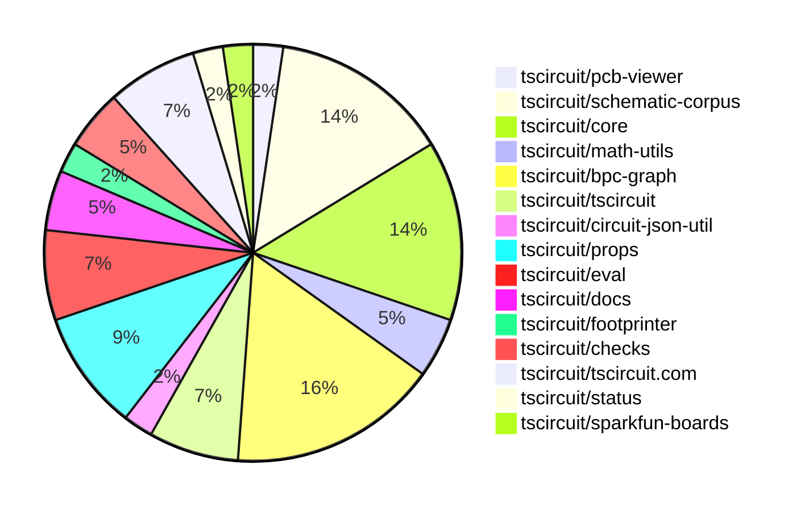
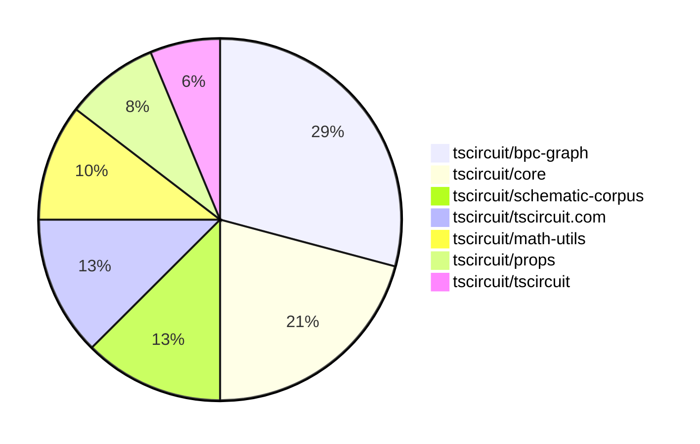

# Contribution Overview 2025-07-09

## PRs by Repository

## Contributor Overview

| Contributor | 🐳 Major | 🐙 Minor | 🐌 Tiny | ⭐ | Issues Created | Discussion Contributions |
|-------------|---------|---------|---------|-----|----------------|--------------------------|
| [seveibar](#seveibar) | 4 | 1 | 19 | ⭐⭐⭐ | 0 | 0🔹 0🔶 0💎 |
| [imrishabh18](#imrishabh18) | 0 | 1 | 8 | ⭐ | 0 | 0🔹 0🔶 0💎 |
| [Abse2001](#Abse2001) | 0 | 0 | 2 | ⭐ | 0 | 0🔹 0🔶 0💎 |
| [techmannih](#techmannih) | 0 | 0 | 4 | ⭐ | 0 | 0🔹 0🔶 0💎 |
| [ArnavK-09](#ArnavK-09) | 1 | 0 | 0 | ⭐ | 0 | 0🔹 0🔶 0💎 |
| [MustafaMulla29](#MustafaMulla29) | 0 | 0 | 1 |  | 0 | 0🔹 0🔶 0💎 |
| [abimaelmartell](#abimaelmartell) | 0 | 0 | 1 |  | 0 | 0🔹 0🔶 0💎 |
| [tscircuitbot](#tscircuitbot) | 0 | 0 | 1 |  | 0 | 0🔹 0🔶 0💎 |

### Discussion Contribution Legend

- 🔹 Normal Comments: Basic participation with minimal effort
- 🔶 Great Informative Comments: Thoughtful participation that adds value
- 💎 Incredible Comments: Exceptional participation with high-quality content

## Review Table

[reviews-received-hover]: ## "Number of reviews received for PRs for this contributor"
[approvals-received-hover]: ## "Number of approvals received for PRs this contributor authored"
[rejections-received-hover]: ## "Number of rejections received for PRs this contributor authored"
[prs-opened-hover]: ## "Number of PRs opened by this contributor"
[issues-created-hover]: ## "Number of issues created by this contributor"
[bountied-issues-hover]: ## "Number of issues this contributor created with a bounty"
[bountied-issue-$-hover]: ## "Total bounty amount placed on issues authored by this contributor"

| Contributor | Reviews Received | Approvals Received | Rejections Received | Approvals | Rejections | PRs Opened | PRs Merged | Issues Created | Bountied Issues | Bountied Issue $ |
|---|---|---|---|---|---|---|---|---|---|---|
| [techmannih](#techmannih) | 9 | 4 | 1 | 0 | 1 | 7 | 4 | 0 | 0 | 0 |
| [imrishabh18](#imrishabh18) | 11 | 8 | 0 | 1 | 1 | 15 | 10 | 0 | 0 | 0 |
| [seveibar](#seveibar) | 11 | 0 | 0 | 13 | 1 | 34 | 26 | 0 | 0 | 0 |
| [cursor[bot]](#cursor[bot]) | 0 | 0 | 0 | 0 | 0 | 0 | 0 | 0 | 0 | 0 |
| [andrii-balitskyi](#andrii-balitskyi) | 2 | 2 | 0 | 0 | 0 | 6 | 3 | 0 | 0 | 0 |
| [MustafaMulla29](#MustafaMulla29) | 12 | 2 | 2 | 0 | 0 | 4 | 1 | 0 | 0 | 0 |
| [graphite-app[bot]](#graphite-app[bot]) | 0 | 0 | 0 | 0 | 0 | 0 | 0 | 0 | 0 | 0 |
| [abimaelmartell](#abimaelmartell) | 3 | 0 | 0 | 0 | 0 | 2 | 1 | 0 | 0 | 0 |
| [ArnavK-09](#ArnavK-09) | 4 | 0 | 0 | 0 | 0 | 3 | 1 | 0 | 0 | 0 |
| [tscircuitbot](#tscircuitbot) | 1 | 0 | 0 | 0 | 0 | 12 | 1 | 0 | 0 | 0 |
| [Abse2001](#Abse2001) | 2 | 2 | 0 | 3 | 0 | 3 | 2 | 0 | 0 | 0 |
| [ShiboSoftwareDev](#ShiboSoftwareDev) | 0 | 0 | 0 | 1 | 0 | 0 | 0 | 0 | 0 | 0 |

## Top 7 Repositories by Contribution Points

## Changes by Repository

### [tscircuit/pcb-viewer](https://github.com/tscircuit/pcb-viewer)

🐌 Tiny Contributions (1)

| PR # | Impact | Contributor | Description |
|------|--------|-------------|-------------|
| [#347](https://github.com/tscircuit/pcb-viewer/pull/347) | 🐌 Tiny | techmannih | Updates the circuit-to-svg dependency to version 0.0.166 in package.json. |

### [tscircuit/schematic-corpus](https://github.com/tscircuit/schematic-corpus)

🐌 Tiny Contributions (6)

| PR # | Impact | Contributor | Description |
|------|--------|-------------|-------------|
| [#70](https://github.com/tscircuit/schematic-corpus/pull/70) | 🐌 Tiny | techmannih | Adds a new design (design047) to the schematic corpus, which includes a new circuit board layout for improved autorouting functionality. |
| [#72](https://github.com/tscircuit/schematic-corpus/pull/72) | 🐌 Tiny | techmannih | Adds a new design048 circuit to the schematic corpus, which is intended to enhance the autorouting algorithm. |
| [#63](https://github.com/tscircuit/schematic-corpus/pull/63) | 🐌 Tiny | techmannih | Fixes incorrect pin connections in design019, ensuring proper netlabel connections for the autolayout algorithm. |
| [#64](https://github.com/tscircuit/schematic-corpus/pull/64) | 🐌 Tiny | seveibar | Adds a script to copy SVG snapshots to the site build output directory during the site build process. |
| [#62](https://github.com/tscircuit/schematic-corpus/pull/62) | 🐌 Tiny | seveibar | Adds functionality to export BPC graphs without net labels, allowing for better handling of circuits that do not utilize net labels. |
| [#71](https://github.com/tscircuit/schematic-corpus/pull/71) | 🐌 Tiny | Abse2001 | Adds a CODEOWNERS file to define code ownership for schematic-corpus designs. |

### [tscircuit/core](https://github.com/tscircuit/core)

| PR # | Impact | Rating | Contributor | Description |
|------|--------|--------|-------------|-------------|
| [#1045](https://github.com/tscircuit/core/pull/1045) | 🐳 Major | ⭐⭐⭐ | seveibar | Adds elbow routing functionality for schematic traces, allowing for more flexible routing before falling back to autorouter when obstacles are encountered. |
| [#1050](https://github.com/tscircuit/core/pull/1050) | 🐙 Minor | ⭐⭐ | imrishabh18 | Fixes runtime error caused by incorrect import of circuit-to-svg, preventing tests from passing after updating tscircuit with the latest core. |

🐌 Tiny Contributions (4)

| PR # | Impact | Contributor | Description |
|------|--------|-------------|-------------|
| [#1054](https://github.com/tscircuit/core/pull/1054) | 🐌 Tiny | seveibar | Updates the circuit-json dependency to version 0.0.219 to prevent accidental installation of zod v4. |
| [#1053](https://github.com/tscircuit/core/pull/1053) | 🐌 Tiny | seveibar | Removes support for layoutlayoutBuilder in PrimitiveComponent and Group components, streamlining the layout handling to only manual edits. |
| [#1052](https://github.com/tscircuit/core/pull/1052) | 🐌 Tiny | seveibar | Fixes layout generation for schematic groups by introducing layout variants that handle pins without not_connected status, improving the adaptability of the layout process. |
| [#1047](https://github.com/tscircuit/core/pull/1047) | 🐌 Tiny | seveibar | Stops the layout of net labels in the BPC graph and introduces a system for writing debug graphics, while ensuring debug graphics are not written during CI. |

### [tscircuit/math-utils](https://github.com/tscircuit/math-utils)

| PR # | Impact | Rating | Contributor | Description |
|------|--------|--------|-------------|-------------|
| [#13](https://github.com/tscircuit/math-utils/pull/13) | 🐳 Major | ⭐⭐⭐ | seveibar | Adds a new helper function to check for segment-rectangle intersections and cleans up the lockfile by removing the bun.lockb file and adding a bunfig.toml to disable lockfile saving. |

🐌 Tiny Contributions (1)

| PR # | Impact | Contributor | Description |
|------|--------|-------------|-------------|
| [#12](https://github.com/tscircuit/math-utils/pull/12) | 🐌 Tiny | seveibar | Removes the lockfile for bun and introduces a new bunfig.toml configuration file that disables lockfile saving. |

### [tscircuit/bpc-graph](https://github.com/tscircuit/bpc-graph)

| PR # | Impact | Rating | Contributor | Description |
|------|--------|--------|-------------|-------------|
| [#55](https://github.com/tscircuit/bpc-graph/pull/55) | 🐳 Major | ⭐⭐⭐ | seveibar | Adds functionality to handle layout variants for schematic graphs, allowing for better adaptation of floating boxes with mutable pin offsets. |
| [#51](https://github.com/tscircuit/bpc-graph/pull/51) | 🐳 Major | ⭐⭐⭐ | seveibar | Fixes incorrect partitioning by implementing a depth-first search (DFS) algorithm that prioritizes processing the smallest nets first. |
| [#52](https://github.com/tscircuit/bpc-graph/pull/52) | 🐙 Minor | ⭐⭐ | seveibar | Fixes reproduction issue in schematic rendering by utilizing the correct corpus without net labels. |

🐌 Tiny Contributions (4)

| PR # | Impact | Contributor | Description |
|------|--------|-------------|-------------|
| [#57](https://github.com/tscircuit/bpc-graph/pull/57) | 🐌 Tiny | seveibar | Updates the package.json dependencies and modifies a test file by removing a property from a component. |
| [#56](https://github.com/tscircuit/bpc-graph/pull/56) | 🐌 Tiny | seveibar | Clarifies layoutSchematicGraphVariants output by renaming result to fixedGraph for better code readability and understanding. |
| [#54](https://github.com/tscircuit/bpc-graph/pull/54) | 🐌 Tiny | seveibar | Adds a new interactive schematic layout page that allows users to visualize the layout process of circuits, including graph partitioning, corpus matching, net adaptation, and final layout merging. |
| [#53](https://github.com/tscircuit/bpc-graph/pull/53) | 🐌 Tiny | seveibar | Sets the graphics title in the getGraphicsForBpcGraph function when a title is provided in the options. |

### [tscircuit/tscircuit](https://github.com/tscircuit/tscircuit)

🐌 Tiny Contributions (3)

| PR # | Impact | Contributor | Description |
|------|--------|-------------|-------------|
| [#700](https://github.com/tscircuit/tscircuit/pull/700) | 🐌 Tiny | seveibar | Updates dependency versions in package.json to ensure all core dependencies are included and correctly pinned, preventing overrides. |
| [#699](https://github.com/tscircuit/tscircuit/pull/699) | 🐌 Tiny | imrishabh18 | Updates the footprinter dependency to version 0.0.193 in package.json. |
| [#698](https://github.com/tscircuit/tscircuit/pull/698) | 🐌 Tiny | imrishabh18 | Fix errors on test due to stale lock file. |

### [tscircuit/circuit-json-util](https://github.com/tscircuit/circuit-json-util)

🐌 Tiny Contributions (1)

| PR # | Impact | Contributor | Description |
|------|--------|-------------|-------------|
| [#38](https://github.com/tscircuit/circuit-json-util/pull/38) | 🐌 Tiny | seveibar | Exposes the subtree helper in the public API. |

### [tscircuit/props](https://github.com/tscircuit/props)

🐌 Tiny Contributions (4)

| PR # | Impact | Contributor | Description |
|------|--------|-------------|-------------|
| [#320](https://github.com/tscircuit/props/pull/320) | 🐌 Tiny | seveibar | Removes lockfiles and the dependency on tscircuitlayout from the project. |
| [#319](https://github.com/tscircuit/props/pull/319) | 🐌 Tiny | seveibar | Removes support for the layout property in SubcircuitGroupProps and related components, impacting how layout configurations are handled in the library. |
| [#318](https://github.com/tscircuit/props/pull/318) | 🐌 Tiny | MustafaMulla29 | Adds the pcbPinLabels prop to components, enabling users to specify labels for PCB pins, enhancing the clarity of schematic representations. |
| [#317](https://github.com/tscircuit/props/pull/317) | 🐌 Tiny | abimaelmartell | Allows chip components to specify connections using either pin numbers or labels, enhancing flexibility in component configuration. |

### [tscircuit/eval](https://github.com/tscircuit/eval)

🐌 Tiny Contributions (3)

| PR # | Impact | Contributor | Description |
|------|--------|-------------|-------------|
| [#673](https://github.com/tscircuit/eval/pull/673) | 🐌 Tiny | seveibar | Updates the versions of the core and circuit-json dependencies in the project. |
| [#670](https://github.com/tscircuit/eval/pull/670) | 🐌 Tiny | seveibar | Updates the core version of the tscircuitcore package and modifies the dependency management script to synchronize dependencies with the core package. |
| [#662](https://github.com/tscircuit/eval/pull/662) | 🐌 Tiny | tscircuitbot | Automated update of tscircuitcore to v0.0.553, which includes dependency updates without introducing new functionality. |

### [tscircuit/docs](https://github.com/tscircuit/docs)

🐌 Tiny Contributions (2)

| PR # | Impact | Contributor | Description |
|------|--------|-------------|-------------|
| [#98](https://github.com/tscircuit/docs/pull/98) | 🐌 Tiny | seveibar | Documents the usage and options for the tsci init command, providing users with clear instructions on initializing a new TSCircuit project. |
| [#97](https://github.com/tscircuit/docs/pull/97) | 🐌 Tiny | seveibar | Removes the Publishing Modules documentation page from the repository. |

### [tscircuit/footprinter](https://github.com/tscircuit/footprinter)

🐌 Tiny Contributions (1)

| PR # | Impact | Contributor | Description |
|------|--------|-------------|-------------|
| [#319](https://github.com/tscircuit/footprinter/pull/319) | 🐌 Tiny | imrishabh18 | Adds support for custom pad sizes for the 0603 footprint, including a regression test for the new functionality and clarification on numeric string handling. |

### [tscircuit/checks](https://github.com/tscircuit/checks)

🐌 Tiny Contributions (2)

| PR # | Impact | Contributor | Description |
|------|--------|-------------|-------------|
| [#57](https://github.com/tscircuit/checks/pull/57) | 🐌 Tiny | imrishabh18 | Removes the checkTraceSpacing method, which checks for minimum spacing between PCB traces, from the codebase. |
| [#55](https://github.com/tscircuit/checks/pull/55) | 🐌 Tiny | imrishabh18 | Adds a DRC check to ensure that two PCB traces maintain a minimum specified distance between them. |

### [tscircuit/tscircuit.com](https://github.com/tscircuit/tscircuit.com)

| PR # | Impact | Rating | Contributor | Description |
|------|--------|--------|-------------|-------------|
| [#1408](https://github.com/tscircuit/tscircuit.com/pull/1408) | 🐳 Major | ⭐⭐⭐ | ArnavK-09 | Adds a new import dialog for components from Runframe, allowing users to select and import components directly into the code editor. |

🐌 Tiny Contributions (2)

| PR # | Impact | Contributor | Description |
|------|--------|-------------|-------------|
| [#1427](https://github.com/tscircuit/tscircuit.com/pull/1427) | 🐌 Tiny | imrishabh18 | Adds tscircuit as a new dependency in the project, enabling its functionalities for future development. |
| [#1425](https://github.com/tscircuit/tscircuit.com/pull/1425) | 🐌 Tiny | imrishabh18 | Corrects the toast message displayed when requesting an AI review from An AI review has been generated. to An AI review has been requested. |

### [tscircuit/status](https://github.com/tscircuit/status)

🐌 Tiny Contributions (1)

| PR # | Impact | Contributor | Description |
|------|--------|-------------|-------------|
| [#46](https://github.com/tscircuit/status/pull/46) | 🐌 Tiny | imrishabh18 | Adds a health check for the tscircuit package to ensure its proper installation and functionality by running a series of checks including installation, initialization, and building of a circuit. |

### [tscircuit/sparkfun-boards](https://github.com/tscircuit/sparkfun-boards)

🐌 Tiny Contributions (1)

| PR # | Impact | Contributor | Description |
|------|--------|-------------|-------------|
| [#55](https://github.com/tscircuit/sparkfun-boards/pull/55) | 🐌 Tiny | Abse2001 | Updates the username for the SparkFun Transceiver Breakout MAX3232 in the CODEOWNERS file. |

## Changes by Contributor

### [techmannih](https://github.com/techmannih)

🐌 Tiny Contributions (4)

| PR # | Impact | Description |
|------|--------|-------------|
| [#347](https://github.com/tscircuit/pcb-viewer/pull/347) | 🐌 Tiny | Updates the circuit-to-svg dependency to version 0.0.166 in package.json. |
| [#70](https://github.com/tscircuit/schematic-corpus/pull/70) | 🐌 Tiny | Adds a new design (design047) to the schematic corpus, which includes a new circuit board layout for improved autorouting functionality. |
| [#72](https://github.com/tscircuit/schematic-corpus/pull/72) | 🐌 Tiny | Adds a new design048 circuit to the schematic corpus, which is intended to enhance the autorouting algorithm. |
| [#63](https://github.com/tscircuit/schematic-corpus/pull/63) | 🐌 Tiny | Fixes incorrect pin connections in design019, ensuring proper netlabel connections for the autolayout algorithm. |

### [seveibar](https://github.com/seveibar)

| PRs # | Impact | Rating | Description |
|------|--------|--------|-------------|
| [#1045](https://github.com/tscircuit/core/pull/1045) | 🐳 Major | ⭐⭐⭐ | Adds elbow routing functionality for schematic traces, allowing for more flexible routing before falling back to autorouter when obstacles are encountered. |
| [#13](https://github.com/tscircuit/math-utils/pull/13) | 🐳 Major | ⭐⭐⭐ | Adds a new helper function to check for segment-rectangle intersections and cleans up the lockfile by removing the bun.lockb file and adding a bunfig.toml to disable lockfile saving. |
| [#55](https://github.com/tscircuit/bpc-graph/pull/55) | 🐳 Major | ⭐⭐⭐ | Adds functionality to handle layout variants for schematic graphs, allowing for better adaptation of floating boxes with mutable pin offsets. |
| [#51](https://github.com/tscircuit/bpc-graph/pull/51) | 🐳 Major | ⭐⭐⭐ | Fixes incorrect partitioning by implementing a depth-first search (DFS) algorithm that prioritizes processing the smallest nets first. |
| [#52](https://github.com/tscircuit/bpc-graph/pull/52) | 🐙 Minor | ⭐⭐ | Fixes reproduction issue in schematic rendering by utilizing the correct corpus without net labels. |

🐌 Tiny Contributions (19)

| PR # | Impact | Description |
|------|--------|-------------|
| [#700](https://github.com/tscircuit/tscircuit/pull/700) | 🐌 Tiny | Updates dependency versions in package.json to ensure all core dependencies are included and correctly pinned, preventing overrides. |
| [#38](https://github.com/tscircuit/circuit-json-util/pull/38) | 🐌 Tiny | Exposes the subtree helper in the public API. |
| [#320](https://github.com/tscircuit/props/pull/320) | 🐌 Tiny | Removes lockfiles and the dependency on tscircuitlayout from the project. |
| [#319](https://github.com/tscircuit/props/pull/319) | 🐌 Tiny | Removes support for the layout property in SubcircuitGroupProps and related components, impacting how layout configurations are handled in the library. |
| [#1054](https://github.com/tscircuit/core/pull/1054) | 🐌 Tiny | Updates the circuit-json dependency to version 0.0.219 to prevent accidental installation of zod v4. |
| [#1053](https://github.com/tscircuit/core/pull/1053) | 🐌 Tiny | Removes support for layoutlayoutBuilder in PrimitiveComponent and Group components, streamlining the layout handling to only manual edits. |
| [#1052](https://github.com/tscircuit/core/pull/1052) | 🐌 Tiny | Fixes layout generation for schematic groups by introducing layout variants that handle pins without not_connected status, improving the adaptability of the layout process. |
| [#1047](https://github.com/tscircuit/core/pull/1047) | 🐌 Tiny | Stops the layout of net labels in the BPC graph and introduces a system for writing debug graphics, while ensuring debug graphics are not written during CI. |
| [#12](https://github.com/tscircuit/math-utils/pull/12) | 🐌 Tiny | Removes the lockfile for bun and introduces a new bunfig.toml configuration file that disables lockfile saving. |
| [#673](https://github.com/tscircuit/eval/pull/673) | 🐌 Tiny | Updates the versions of the core and circuit-json dependencies in the project. |
| [#670](https://github.com/tscircuit/eval/pull/670) | 🐌 Tiny | Updates the core version of the tscircuitcore package and modifies the dependency management script to synchronize dependencies with the core package. |
| [#98](https://github.com/tscircuit/docs/pull/98) | 🐌 Tiny | Documents the usage and options for the tsci init command, providing users with clear instructions on initializing a new TSCircuit project. |
| [#97](https://github.com/tscircuit/docs/pull/97) | 🐌 Tiny | Removes the Publishing Modules documentation page from the repository. |
| [#57](https://github.com/tscircuit/bpc-graph/pull/57) | 🐌 Tiny | Updates the package.json dependencies and modifies a test file by removing a property from a component. |
| [#56](https://github.com/tscircuit/bpc-graph/pull/56) | 🐌 Tiny | Clarifies layoutSchematicGraphVariants output by renaming result to fixedGraph for better code readability and understanding. |
| [#54](https://github.com/tscircuit/bpc-graph/pull/54) | 🐌 Tiny | Adds a new interactive schematic layout page that allows users to visualize the layout process of circuits, including graph partitioning, corpus matching, net adaptation, and final layout merging. |
| [#53](https://github.com/tscircuit/bpc-graph/pull/53) | 🐌 Tiny | Sets the graphics title in the getGraphicsForBpcGraph function when a title is provided in the options. |
| [#64](https://github.com/tscircuit/schematic-corpus/pull/64) | 🐌 Tiny | Adds a script to copy SVG snapshots to the site build output directory during the site build process. |
| [#62](https://github.com/tscircuit/schematic-corpus/pull/62) | 🐌 Tiny | Adds functionality to export BPC graphs without net labels, allowing for better handling of circuits that do not utilize net labels. |

### [imrishabh18](https://github.com/imrishabh18)

| PRs # | Impact | Rating | Description |
|------|--------|--------|-------------|
| [#1050](https://github.com/tscircuit/core/pull/1050) | 🐙 Minor | ⭐⭐ | Fixes runtime error caused by incorrect import of circuit-to-svg, preventing tests from passing after updating tscircuit with the latest core. |

🐌 Tiny Contributions (8)

| PR # | Impact | Description |
|------|--------|-------------|
| [#699](https://github.com/tscircuit/tscircuit/pull/699) | 🐌 Tiny | Updates the footprinter dependency to version 0.0.193 in package.json. |
| [#698](https://github.com/tscircuit/tscircuit/pull/698) | 🐌 Tiny | Fix errors on test due to stale lock file. |
| [#319](https://github.com/tscircuit/footprinter/pull/319) | 🐌 Tiny | Adds support for custom pad sizes for the 0603 footprint, including a regression test for the new functionality and clarification on numeric string handling. |
| [#57](https://github.com/tscircuit/checks/pull/57) | 🐌 Tiny | Removes the checkTraceSpacing method, which checks for minimum spacing between PCB traces, from the codebase. |
| [#55](https://github.com/tscircuit/checks/pull/55) | 🐌 Tiny | Adds a DRC check to ensure that two PCB traces maintain a minimum specified distance between them. |
| [#1427](https://github.com/tscircuit/tscircuit.com/pull/1427) | 🐌 Tiny | Adds tscircuit as a new dependency in the project, enabling its functionalities for future development. |
| [#1425](https://github.com/tscircuit/tscircuit.com/pull/1425) | 🐌 Tiny | Corrects the toast message displayed when requesting an AI review from An AI review has been generated. to An AI review has been requested. |
| [#46](https://github.com/tscircuit/status/pull/46) | 🐌 Tiny | Adds a health check for the tscircuit package to ensure its proper installation and functionality by running a series of checks including installation, initialization, and building of a circuit. |

### [MustafaMulla29](https://github.com/MustafaMulla29)

🐌 Tiny Contributions (1)

| PR # | Impact | Description |
|------|--------|-------------|
| [#318](https://github.com/tscircuit/props/pull/318) | 🐌 Tiny | Adds the pcbPinLabels prop to components, enabling users to specify labels for PCB pins, enhancing the clarity of schematic representations. |

### [abimaelmartell](https://github.com/abimaelmartell)

🐌 Tiny Contributions (1)

| PR # | Impact | Description |
|------|--------|-------------|
| [#317](https://github.com/tscircuit/props/pull/317) | 🐌 Tiny | Allows chip components to specify connections using either pin numbers or labels, enhancing flexibility in component configuration. |

### [ArnavK-09](https://github.com/ArnavK-09)

| PRs # | Impact | Rating | Description |
|------|--------|--------|-------------|
| [#1408](https://github.com/tscircuit/tscircuit.com/pull/1408) | 🐳 Major | ⭐⭐⭐ | Adds a new import dialog for components from Runframe, allowing users to select and import components directly into the code editor. |

### [tscircuitbot](https://github.com/tscircuitbot)

🐌 Tiny Contributions (1)

| PR # | Impact | Description |
|------|--------|-------------|
| [#662](https://github.com/tscircuit/eval/pull/662) | 🐌 Tiny | Automated update of tscircuitcore to v0.0.553, which includes dependency updates without introducing new functionality. |

### [Abse2001](https://github.com/Abse2001)

🐌 Tiny Contributions (2)

| PR # | Impact | Description |
|------|--------|-------------|
| [#55](https://github.com/tscircuit/sparkfun-boards/pull/55) | 🐌 Tiny | Updates the username for the SparkFun Transceiver Breakout MAX3232 in the CODEOWNERS file. |
| [#71](https://github.com/tscircuit/schematic-corpus/pull/71) | 🐌 Tiny | Adds a CODEOWNERS file to define code ownership for schematic-corpus designs. |

## Repository Owners

| Repository | Codeowners |
|------------|------------|
| [tscircuit.com](https://github.com/tscircuit/tscircuit.com/blob/main/.github/CODEOWNERS) | [imrishabh18](https://github.com/imrishabh18) |
| [cli](https://github.com/tscircuit/cli/blob/main/.github/CODEOWNERS) | [imrishabh18](https://github.com/imrishabh18) |

## Repos by Owner

| User | Repo |
|------|------|
| [imrishabh18](https://github.com/imrishabh18) | [tscircuit.com](https://github.com/tscircuit/tscircuit.com/blob/main/.github/CODEOWNERS) |
|  | [cli](https://github.com/tscircuit/cli/blob/main/.github/CODEOWNERS) |

