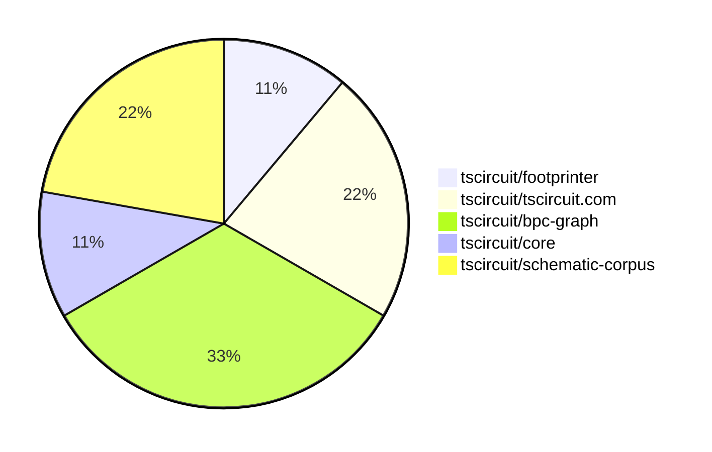
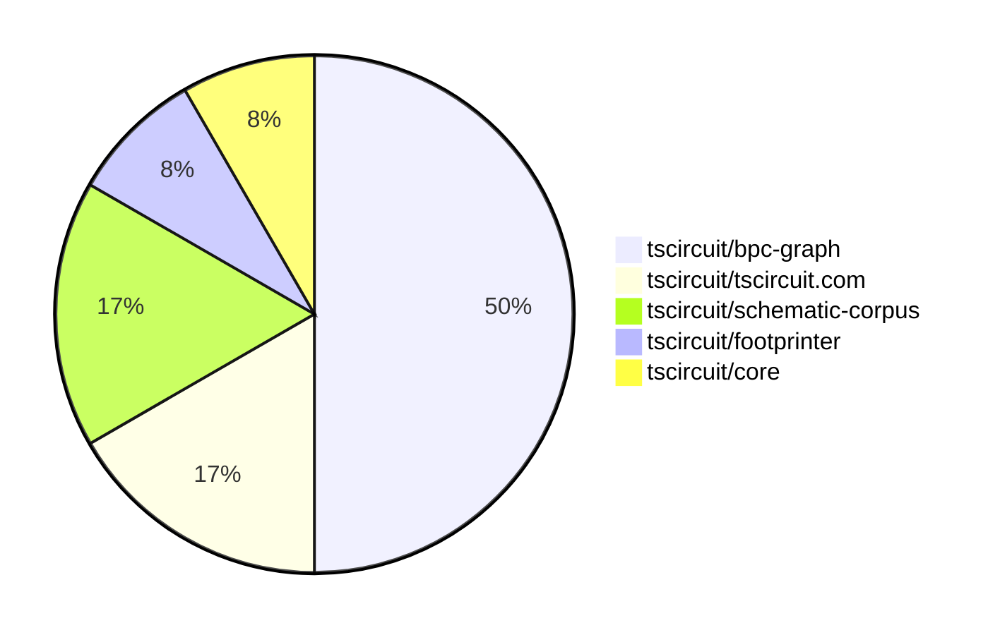

# Contribution Overview 2025-07-09

## PRs by Repository

## Contributor Overview

| Contributor | 🐳 Major | 🐙 Minor | 🐌 Tiny | ⭐ | Issues Created | Discussion Contributions |
|-------------|---------|---------|---------|-----|----------------|--------------------------|
| [seveibar](#seveibar) | 1 | 0 | 4 | ⭐⭐ | 0 | 0🔹 0🔶 0💎 |
| [imrishabh18](#imrishabh18) | 0 | 0 | 3 |  | 0 | 0🔹 0🔶 0💎 |
| [techmannih](#techmannih) | 0 | 0 | 1 |  | 0 | 0🔹 0🔶 0💎 |

### Discussion Contribution Legend

- 🔹 Normal Comments: Basic participation with minimal effort
- 🔶 Great Informative Comments: Thoughtful participation that adds value
- 💎 Incredible Comments: Exceptional participation with high-quality content

## Review Table

[reviews-received-hover]: ## "Number of reviews received for PRs for this contributor"
[approvals-received-hover]: ## "Number of approvals received for PRs this contributor authored"
[rejections-received-hover]: ## "Number of rejections received for PRs this contributor authored"
[prs-opened-hover]: ## "Number of PRs opened by this contributor"
[issues-created-hover]: ## "Number of issues created by this contributor"
[bountied-issues-hover]: ## "Number of issues this contributor created with a bounty"
[bountied-issue-$-hover]: ## "Total bounty amount placed on issues authored by this contributor"

| Contributor | Reviews Received | Approvals Received | Rejections Received | Approvals | Rejections | PRs Opened | PRs Merged | Issues Created | Bountied Issues | Bountied Issue $ |
|---|---|---|---|---|---|---|---|---|---|---|
| [imrishabh18](#imrishabh18) | 3 | 2 | 0 | 0 | 0 | 7 | 4 | 0 | 0 | 0 |
| [seveibar](#seveibar) | 1 | 0 | 0 | 5 | 1 | 7 | 5 | 0 | 0 | 0 |
| [graphite-app[bot]](#graphite-app[bot]) | 0 | 0 | 0 | 0 | 0 | 0 | 0 | 0 | 0 | 0 |
| [cursor[bot]](#cursor[bot]) | 0 | 0 | 0 | 0 | 0 | 0 | 0 | 0 | 0 | 0 |
| [techmannih](#techmannih) | 3 | 1 | 1 | 0 | 0 | 2 | 1 | 0 | 0 | 0 |
| [MustafaMulla29](#MustafaMulla29) | 8 | 1 | 0 | 0 | 0 | 2 | 0 | 0 | 0 | 0 |
| [andrii-balitskyi](#andrii-balitskyi) | 2 | 2 | 0 | 0 | 0 | 4 | 3 | 0 | 0 | 0 |
| [tscircuitbot](#tscircuitbot) | 0 | 0 | 0 | 0 | 0 | 2 | 0 | 0 | 0 | 0 |
| [Abse2001](#Abse2001) | 0 | 0 | 0 | 1 | 0 | 0 | 0 | 0 | 0 | 0 |

## Top 7 Repositories by Contribution Points

## Changes by Repository

### [tscircuit/footprinter](https://github.com/tscircuit/footprinter)

🐌 Tiny Contributions (1)

| PR # | Impact | Contributor | Description |
|------|--------|-------------|-------------|
| [#319](https://github.com/tscircuit/footprinter/pull/319) | 🐌 Tiny | imrishabh18 | Adds support for custom pad sizes for the 0603 footprint, including a regression test and clarification on numeric string handling. |

### [tscircuit/tscircuit.com](https://github.com/tscircuit/tscircuit.com)

🐌 Tiny Contributions (2)

| PR # | Impact | Contributor | Description |
|------|--------|-------------|-------------|
| [#1427](https://github.com/tscircuit/tscircuit.com/pull/1427) | 🐌 Tiny | imrishabh18 | Adds tscircuit as a new dependency in the project, enabling its functionalities for future development. |
| [#1425](https://github.com/tscircuit/tscircuit.com/pull/1425) | 🐌 Tiny | imrishabh18 | Corrects the toast message displayed when requesting an AI review from An AI review has been generated. to An AI review has been requested. |

### [tscircuit/bpc-graph](https://github.com/tscircuit/bpc-graph)

| PR # | Impact | Rating | Contributor | Description |
|------|--------|--------|-------------|-------------|
| [#51](https://github.com/tscircuit/bpc-graph/pull/51) | 🐳 Major | ⭐⭐⭐ | seveibar | Fixes incorrect partitioning by implementing a depth-first search (DFS) algorithm that prioritizes processing the smallest nets first. |

🐌 Tiny Contributions (2)

| PR # | Impact | Contributor | Description |
|------|--------|-------------|-------------|
| [#53](https://github.com/tscircuit/bpc-graph/pull/53) | 🐌 Tiny | seveibar | Sets the graphics title in the getGraphicsForBpcGraph function when a title is provided in the options. |
| [#52](https://github.com/tscircuit/bpc-graph/pull/52) | 🐌 Tiny | seveibar | Fixes reproduction issue in tests by using the correct corpus without net labels, ensuring accurate schematic representation. |

### [tscircuit/core](https://github.com/tscircuit/core)

🐌 Tiny Contributions (1)

| PR # | Impact | Contributor | Description |
|------|--------|-------------|-------------|
| [#1047](https://github.com/tscircuit/core/pull/1047) | 🐌 Tiny | seveibar | Stops the layout of net labels in the BPC graph and introduces a system for writing debug graphics, while ensuring debug graphics are not written during CI. |

### [tscircuit/schematic-corpus](https://github.com/tscircuit/schematic-corpus)

🐌 Tiny Contributions (2)

| PR # | Impact | Contributor | Description |
|------|--------|-------------|-------------|
| [#62](https://github.com/tscircuit/schematic-corpus/pull/62) | 🐌 Tiny | seveibar | Adds functionality to export BPC graphs without net labels, allowing for better handling of circuits that do not utilize net labels. |
| [#63](https://github.com/tscircuit/schematic-corpus/pull/63) | 🐌 Tiny | techmannih | Fixes incorrect pin connections in design019, ensuring proper netlabel connections for the autolayout algorithm. |

## Changes by Contributor

### [imrishabh18](https://github.com/imrishabh18)

🐌 Tiny Contributions (3)

| PR # | Impact | Description |
|------|--------|-------------|
| [#319](https://github.com/tscircuit/footprinter/pull/319) | 🐌 Tiny | Adds support for custom pad sizes for the 0603 footprint, including a regression test and clarification on numeric string handling. |
| [#1427](https://github.com/tscircuit/tscircuit.com/pull/1427) | 🐌 Tiny | Adds tscircuit as a new dependency in the project, enabling its functionalities for future development. |
| [#1425](https://github.com/tscircuit/tscircuit.com/pull/1425) | 🐌 Tiny | Corrects the toast message displayed when requesting an AI review from An AI review has been generated. to An AI review has been requested. |

### [seveibar](https://github.com/seveibar)

| PRs # | Impact | Rating | Description |
|------|--------|--------|-------------|
| [#51](https://github.com/tscircuit/bpc-graph/pull/51) | 🐳 Major | ⭐⭐⭐ | Fixes incorrect partitioning by implementing a depth-first search (DFS) algorithm that prioritizes processing the smallest nets first. |

🐌 Tiny Contributions (4)

| PR # | Impact | Description |
|------|--------|-------------|
| [#1047](https://github.com/tscircuit/core/pull/1047) | 🐌 Tiny | Stops the layout of net labels in the BPC graph and introduces a system for writing debug graphics, while ensuring debug graphics are not written during CI. |
| [#53](https://github.com/tscircuit/bpc-graph/pull/53) | 🐌 Tiny | Sets the graphics title in the getGraphicsForBpcGraph function when a title is provided in the options. |
| [#52](https://github.com/tscircuit/bpc-graph/pull/52) | 🐌 Tiny | Fixes reproduction issue in tests by using the correct corpus without net labels, ensuring accurate schematic representation. |
| [#62](https://github.com/tscircuit/schematic-corpus/pull/62) | 🐌 Tiny | Adds functionality to export BPC graphs without net labels, allowing for better handling of circuits that do not utilize net labels. |

### [techmannih](https://github.com/techmannih)

🐌 Tiny Contributions (1)

| PR # | Impact | Description |
|------|--------|-------------|
| [#63](https://github.com/tscircuit/schematic-corpus/pull/63) | 🐌 Tiny | Fixes incorrect pin connections in design019, ensuring proper netlabel connections for the autolayout algorithm. |

## Repository Owners

| Repository | Codeowners |
|------------|------------|
| [tscircuit.com](https://github.com/tscircuit/tscircuit.com/blob/main/.github/CODEOWNERS) | [imrishabh18](https://github.com/imrishabh18) |

## Repos by Owner

| User | Repo |
|------|------|
| [imrishabh18](https://github.com/imrishabh18) | [tscircuit.com](https://github.com/tscircuit/tscircuit.com/blob/main/.github/CODEOWNERS) |

