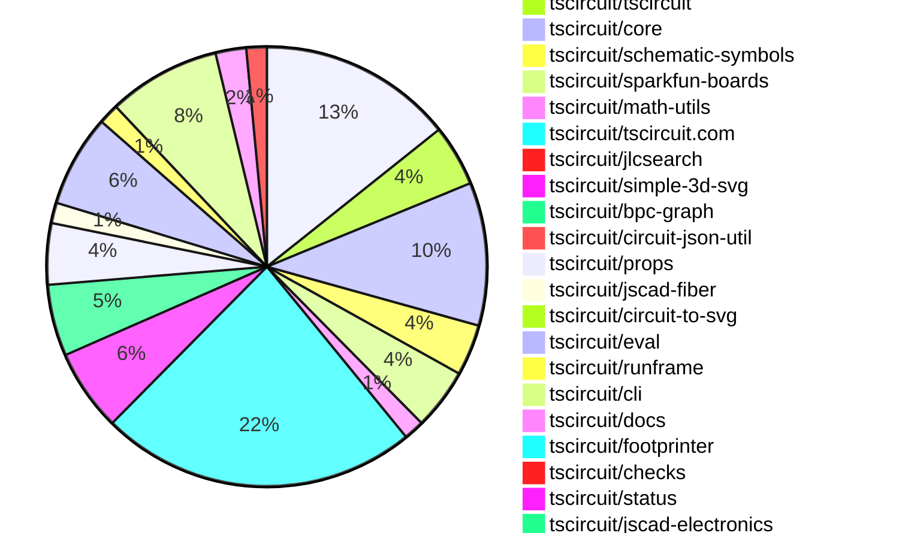
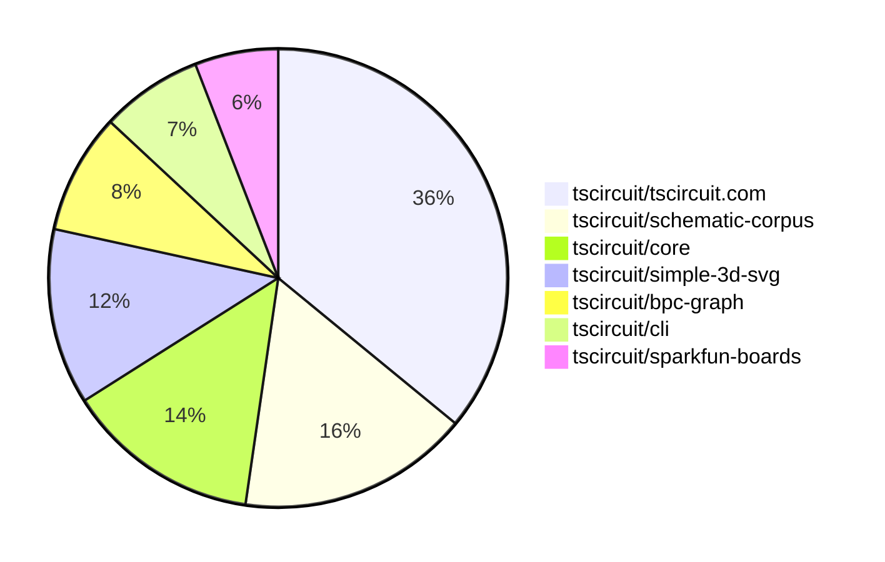

# Contribution Overview 2025-07-09

## PRs by Repository

## Contributor Overview

| Contributor | 🐳 Major | 🐙 Minor | 🐌 Tiny | ⭐ | Issues Created | Discussion Contributions |
|-------------|---------|---------|---------|-----|----------------|--------------------------|
| [seveibar](#seveibar) | 13 | 3 | 47 | 👑👑 | 0 | 0🔹 0🔶 0💎 |
| [ArnavK-09](#ArnavK-09) | 3 | 1 | 11 | ⭐⭐ | 0 | 0🔹 0🔶 0💎 |
| [imrishabh18](#imrishabh18) | 0 | 2 | 12 | ⭐⭐ | 0 | 0🔹 0🔶 0💎 |
| [techmannih](#techmannih) | 2 | 0 | 10 | ⭐⭐ | 0 | 0🔹 0🔶 0💎 |
| [Abse2001](#Abse2001) | 0 | 2 | 14 | ⭐⭐ | 0 | 0🔹 0🔶 0💎 |
| [ShiboSoftwareDev](#ShiboSoftwareDev) | 2 | 0 | 2 | ⭐⭐ | 0 | 0🔹 0🔶 0💎 |
| [MustafaMulla29](#MustafaMulla29) | 0 | 0 | 12 | ⭐⭐ | 0 | 0🔹 0🔶 0💎 |
| [tscircuitbot](#tscircuitbot) | 0 | 0 | 4 | ⭐ | 0 | 0🔹 0🔶 0💎 |
| [abimaelmartell](#abimaelmartell) | 0 | 0 | 1 |  | 0 | 0🔹 0🔶 0💎 |
| [andrii-balitskyi](#andrii-balitskyi) | 0 | 0 | 1 |  | 0 | 0🔹 0🔶 0💎 |
| [nuraci](#nuraci) | 0 | 0 | 0 |  | 0 | 0🔹 1🔶 0💎 |

### Discussion Contribution Legend

- 🔹 Normal Comments: Basic participation with minimal effort
- 🔶 Great Informative Comments: Thoughtful participation that adds value
- 💎 Incredible Comments: Exceptional participation with high-quality content

## Review Table

[reviews-received-hover]: ## "Number of reviews received for PRs for this contributor"
[approvals-received-hover]: ## "Number of approvals received for PRs this contributor authored"
[rejections-received-hover]: ## "Number of rejections received for PRs this contributor authored"
[prs-opened-hover]: ## "Number of PRs opened by this contributor"
[issues-created-hover]: ## "Number of issues created by this contributor"
[bountied-issues-hover]: ## "Number of issues this contributor created with a bounty"
[bountied-issue-$-hover]: ## "Total bounty amount placed on issues authored by this contributor"

| Contributor | Reviews Received | Approvals Received | Rejections Received | Approvals | Rejections | PRs Opened | PRs Merged | Issues Created | Bountied Issues | Bountied Issue $ |
|---|---|---|---|---|---|---|---|---|---|---|
| [techmannih](#techmannih) | 21 | 11 | 2 | 0 | 2 | 18 | 12 | 0 | 0 | 0 |
| [imrishabh18](#imrishabh18) | 14 | 11 | 0 | 5 | 2 | 20 | 15 | 0 | 0 | 0 |
| [Abse2001](#Abse2001) | 15 | 11 | 0 | 10 | 0 | 19 | 16 | 0 | 0 | 0 |
| [seveibar](#seveibar) | 49 | 0 | 0 | 50 | 3 | 95 | 65 | 0 | 0 | 0 |
| [cursor[bot]](#cursor[bot]) | 0 | 0 | 0 | 0 | 0 | 0 | 0 | 0 | 0 | 0 |
| [ShiboSoftwareDev](#ShiboSoftwareDev) | 8 | 5 | 1 | 6 | 1 | 9 | 4 | 0 | 0 | 0 |
| [graphite-app[bot]](#graphite-app[bot]) | 0 | 0 | 0 | 0 | 0 | 0 | 0 | 0 | 0 | 0 |
| [andrii-balitskyi](#andrii-balitskyi) | 5 | 4 | 1 | 0 | 0 | 9 | 4 | 0 | 0 | 0 |
| [MustafaMulla29](#MustafaMulla29) | 31 | 16 | 4 | 0 | 0 | 20 | 12 | 0 | 0 | 0 |
| [abimaelmartell](#abimaelmartell) | 3 | 0 | 0 | 0 | 0 | 2 | 1 | 0 | 0 | 0 |
| [ArnavK-09](#ArnavK-09) | 21 | 14 | 0 | 1 | 0 | 15 | 15 | 0 | 0 | 0 |
| [tscircuitbot](#tscircuitbot) | 1 | 0 | 0 | 0 | 0 | 27 | 4 | 0 | 0 | 0 |
| [nuraci](#nuraci) | 0 | 0 | 0 | 0 | 0 | 0 | 0 | 0 | 0 | 0 |

## Top 7 Repositories by Contribution Points

## Changes by Repository

### [tscircuit/schematic-corpus](https://github.com/tscircuit/schematic-corpus)

| PR # | Impact | Rating | Contributor | Description |
|------|--------|--------|-------------|-------------|
| [#70](https://github.com/tscircuit/schematic-corpus/pull/70) | 🐳 Major | ⭐⭐⭐ | techmannih | Adds a new design (design047) to enhance the autorouting algorithm by introducing a new circuit board layout. |
| [#72](https://github.com/tscircuit/schematic-corpus/pull/72) | 🐳 Major | ⭐⭐⭐ | techmannih | Adds a new design048 circuit to enhance the autorouting algorithm functionality. |

🌠Tiny Contributions (17)

| PR # | Impact | Contributor | Description |
|------|--------|-------------|-------------|
| [#83](https://github.com/tscircuit/schematic-corpus/pull/83) | 🐌 Tiny | techmannih | Adds a new design (design055) to the schematic corpus, which includes a new circuit layout for improved autolayout functionality. |
| [#78](https://github.com/tscircuit/schematic-corpus/pull/78) | 🐌 Tiny | techmannih | Adds a new design (design053) to the schematic corpus, which enhances the autolayout algorithm by providing a new circuit board layout. |
| [#76](https://github.com/tscircuit/schematic-corpus/pull/76) | 🐌 Tiny | techmannih | Adds a new design (design051) to the schematic corpus, which is intended to enhance the autorouting algorithm. |
| [#63](https://github.com/tscircuit/schematic-corpus/pull/63) | 🐌 Tiny | techmannih | Fixes incorrect pin connections in design019, ensuring proper netlabel connections for the autolayout algorithm. |
| [#64](https://github.com/tscircuit/schematic-corpus/pull/64) | 🐌 Tiny | seveibar | Adds a script to copy SVG snapshots to the site build output directory during the site build process. |
| [#62](https://github.com/tscircuit/schematic-corpus/pull/62) | 🐌 Tiny | seveibar | Adds functionality to export BPC graphs without net labels, allowing for better handling of circuits that do not utilize net labels. |
| [#86](https://github.com/tscircuit/schematic-corpus/pull/86) | 🐌 Tiny | Abse2001 | Adds a new design (design058) to the schematic corpus, which includes manual edits for component placements to enhance the autolayout algorithm. |
| [#85](https://github.com/tscircuit/schematic-corpus/pull/85) | 🐌 Tiny | Abse2001 | Adds a new design (design057) to the schematic corpus, which includes a new circuit board layout and manual edits for component placements to enhance the autolayout algorithm. |
| [#84](https://github.com/tscircuit/schematic-corpus/pull/84) | 🐌 Tiny | Abse2001 | Adds a new design (design056) to the schematic corpus, which includes a new circuit board layout for improved autolayout algorithm functionality. |
| [#82](https://github.com/tscircuit/schematic-corpus/pull/82) | 🐌 Tiny | Abse2001 | Removes schPinStyle usage from multiple designs, ensuring consistent pin styling across the circuit designs. |
| [#81](https://github.com/tscircuit/schematic-corpus/pull/81) | 🐌 Tiny | Abse2001 | Fixes the issue where the code owner is not requested for review by changing the CODEOWNERS file to include all files in the designs directory. |
| [#77](https://github.com/tscircuit/schematic-corpus/pull/77) | 🐌 Tiny | Abse2001 | Adds a new design (design054) to the schematic corpus, which includes a new circuit board layout and manual edits for component placements to enhance the autolayout algorithm. |
| [#75](https://github.com/tscircuit/schematic-corpus/pull/75) | 🐌 Tiny | Abse2001 | Adds a new design (design050) to the schematic corpus, which includes a resistor, capacitor, and net labels, aimed at enhancing the autorouting algorithm. |
| [#71](https://github.com/tscircuit/schematic-corpus/pull/71) | 🐌 Tiny | Abse2001 | Adds a CODEOWNERS file to define code ownership for schematic-corpus designs. |
| [#80](https://github.com/tscircuit/schematic-corpus/pull/80) | 🐌 Tiny | MustafaMulla29 | Removes the schPinStyle property from the design52 component, simplifying the design structure. |
| [#79](https://github.com/tscircuit/schematic-corpus/pull/79) | 🐌 Tiny | MustafaMulla29 | Adds a new design (design52) to the schematic corpus, which enhances the autorouting algorithm by providing a new circuit board design. |
| [#73](https://github.com/tscircuit/schematic-corpus/pull/73) | 🐌 Tiny | MustafaMulla29 | Adds a new design (design049) to the schematic corpus, which is intended to enhance the autorouting algorithms performance. |

### [tscircuit/pcb-viewer](https://github.com/tscircuit/pcb-viewer)

🌠Tiny Contributions (1)

| PR # | Impact | Contributor | Description |
|------|--------|-------------|-------------|
| [#347](https://github.com/tscircuit/pcb-viewer/pull/347) | 🐌 Tiny | techmannih | Updates the circuit-to-svg dependency to version 0.0.166 in package.json. |

### [tscircuit/tscircuit](https://github.com/tscircuit/tscircuit)

🌠Tiny Contributions (6)

| PR # | Impact | Contributor | Description |
|------|--------|-------------|-------------|
| [#705](https://github.com/tscircuit/tscircuit/pull/705) | 🐌 Tiny | techmannih | Updates the tscircuitcore dependency to version 0.0.564 in package.json. |
| [#703](https://github.com/tscircuit/tscircuit/pull/703) | 🐌 Tiny | techmannih | Updates the tscircuitsimple-3d-svg package to version 0.0.28 in package.json. |
| [#701](https://github.com/tscircuit/tscircuit/pull/701) | 🐌 Tiny | seveibar | Adds a new smoke test to verify the installation and initialization of the CLI tool in a temporary environment. |
| [#700](https://github.com/tscircuit/tscircuit/pull/700) | 🐌 Tiny | seveibar | Updates dependency versions in package.json to ensure all core dependencies are included and correctly pinned, preventing overrides. |
| [#699](https://github.com/tscircuit/tscircuit/pull/699) | 🐌 Tiny | imrishabh18 | Updates the footprinter dependency to version 0.0.193 in package.json |
| [#698](https://github.com/tscircuit/tscircuit/pull/698) | 🐌 Tiny | imrishabh18 | Fix errors on test due to stale lock file. |

### [tscircuit/core](https://github.com/tscircuit/core)

| PR # | Impact | Rating | Contributor | Description |
|------|--------|--------|-------------|-------------|
| [#1045](https://github.com/tscircuit/core/pull/1045) | 🐳 Major | ⭐⭐⭐ | seveibar | Adds elbow routing functionality for schematic traces, allowing for more flexible routing before falling back to autorouting when obstacles are encountered. |
| [#1059](https://github.com/tscircuit/core/pull/1059) | 🐳 Major | ⭐⭐⭐ | ShiboSoftwareDev | Adds SchematicTable, SchematicRow, and SchematicCell components to the library, allowing for structured schematic representations with text children support. |
| [#1050](https://github.com/tscircuit/core/pull/1050) | 🐙 Minor | ⭐⭐ | imrishabh18 | Fixes runtime error caused by incorrect import of circuit-to-svg, preventing tests from passing after updating tscircuit with the latest core. |

🌠Tiny Contributions (11)

| PR # | Impact | Contributor | Description |
|------|--------|-------------|-------------|
| [#1065](https://github.com/tscircuit/core/pull/1065) | 🐌 Tiny | techmannih | Updates the tscircuitfootprinter package to version 0.0.193 in package.json. |
| [#1060](https://github.com/tscircuit/core/pull/1060) | 🐌 Tiny | seveibar | Defaults schematic_port.is_connected to false and updates it when traces are inserted, along with adding tests for this behavior. |
| [#1056](https://github.com/tscircuit/core/pull/1056) | 🐌 Tiny | seveibar | Updates React and related dependencies to version 19.1.0, which may resolve downstream issues related to compatibility and performance. |
| [#1054](https://github.com/tscircuit/core/pull/1054) | 🐌 Tiny | seveibar | Updates the circuit-json dependency to version 0.0.219 to prevent accidental installation of zod v4. |
| [#1053](https://github.com/tscircuit/core/pull/1053) | 🐌 Tiny | seveibar | Removes support for layoutlayoutBuilder in PrimitiveComponent and Group components, streamlining the layout handling process by relying solely on manual edits. |
| [#1052](https://github.com/tscircuit/core/pull/1052) | 🐌 Tiny | seveibar | Fixes layout generation for schematic groups by introducing layout variants that handle pins without not_connected status, improving the adaptability of the layout process. |
| [#1047](https://github.com/tscircuit/core/pull/1047) | 🐌 Tiny | seveibar | Stops the layout of net labels in the BPC graph and introduces a system for writing debug graphics, while ensuring debug graphics are not written during CI. |
| [#1066](https://github.com/tscircuit/core/pull/1066) | 🐌 Tiny | Abse2001 | Introduces a new avalanche diode symbol variant and corresponding tests for the diode component. |
| [#1063](https://github.com/tscircuit/core/pull/1063) | 🐌 Tiny | Abse2001 | Introduces a new Schottky diode symbol variant and corresponding tests for rendering in schematic and PCB snapshots. |
| [#1058](https://github.com/tscircuit/core/pull/1058) | 🐌 Tiny | MustafaMulla29 | Adds a new prop pcbPinLabels to allow separate labeling for PCB components, enhancing the distinction between PCB and schematic representations. |
| [#1057](https://github.com/tscircuit/core/pull/1057) | 🐌 Tiny | MustafaMulla29 | Updates the dependency version of tscircuitprops to include the newly exported property pcbPinLabels. |

### [tscircuit/schematic-symbols](https://github.com/tscircuit/schematic-symbols)

| PR # | Impact | Rating | Contributor | Description |
|------|--------|--------|-------------|-------------|
| [#320](https://github.com/tscircuit/schematic-symbols/pull/320) | 🐙 Minor | ⭐⭐ | Abse2001 | Fixes the positioning of the REF text to always appear above the VAL text in bipolar transistor symbols. |
| [#318](https://github.com/tscircuit/schematic-symbols/pull/318) | 🐙 Minor | ⭐⭐ | Abse2001 | Introduces new NPN and PNP transistor symbols in various orientations (right, left, up, down) for schematic representation. |

🌠Tiny Contributions (3)

| PR # | Impact | Contributor | Description |
|------|--------|-------------|-------------|
| [#322](https://github.com/tscircuit/schematic-symbols/pull/322) | 🐌 Tiny | techmannih | Adds techmannih as a new code owner in the CODEOWNERS file. |
| [#319](https://github.com/tscircuit/schematic-symbols/pull/319) | 🐌 Tiny | seveibar | Documents the pin numbering direction in the README, specifying how to number pins based on the symbols direction and polarity. |
| [#321](https://github.com/tscircuit/schematic-symbols/pull/321) | 🐌 Tiny | Abse2001 | Introduces new variants of the Avalanche Diode schematic symbol for different orientations (right, left, up, down). |

### [tscircuit/sparkfun-boards](https://github.com/tscircuit/sparkfun-boards)

| PR # | Impact | Rating | Contributor | Description |
|------|--------|--------|-------------|-------------|
| [#64](https://github.com/tscircuit/sparkfun-boards/pull/64) | 🐳 Major | ⭐⭐⭐ | ShiboSoftwareDev | Introduces a new circuit board for the SparkFun ESLOV to Qwiic Bridge, including its schematic and footprint definitions. |

🌠Tiny Contributions (5)

| PR # | Impact | Contributor | Description |
|------|--------|-------------|-------------|
| [#68](https://github.com/tscircuit/sparkfun-boards/pull/68) | 🐌 Tiny | techmannih | Fixes the ground connection for the capacitor on the USB-to-Serial Breakout (FT232RL) board, ensuring proper functionality and stability. |
| [#55](https://github.com/tscircuit/sparkfun-boards/pull/55) | 🐌 Tiny | Abse2001 | Updates the username for the SparkFun Transceiver Breakout MAX3232 in the CODEOWNERS file. |
| [#66](https://github.com/tscircuit/sparkfun-boards/pull/66) | 🐌 Tiny | MustafaMulla29 | Updates the tscircuitcli and tscircuit dependencies to versions 0.1.170 and 0.0.535 respectively, and updates the PCB and schematic snapshots accordingly. |
| [#62](https://github.com/tscircuit/sparkfun-boards/pull/62) | 🐌 Tiny | MustafaMulla29 | Updates the dependency version of tscircuitprops to 0.0.257, which likely includes changes related to the pcbPinLabels prop. |
| [#56](https://github.com/tscircuit/sparkfun-boards/pull/56) | 🐌 Tiny | MustafaMulla29 | No description provided |

### [tscircuit/math-utils](https://github.com/tscircuit/math-utils)

| PR # | Impact | Rating | Contributor | Description |
|------|--------|--------|-------------|-------------|
| [#13](https://github.com/tscircuit/math-utils/pull/13) | 🐳 Major | ⭐⭐⭐ | seveibar | Adds a new helper function to check for segment-rectangle intersections and cleans up the lockfile by removing the bun.lockb file and adding a bunfig.toml to disable lockfile saving. |

🌠Tiny Contributions (1)

| PR # | Impact | Contributor | Description |
|------|--------|-------------|-------------|
| [#12](https://github.com/tscircuit/math-utils/pull/12) | 🐌 Tiny | seveibar | Removes the lockfile for bun and introduces a new bunfig.toml configuration file that disables lockfile saving. |

### [tscircuit/tscircuit.com](https://github.com/tscircuit/tscircuit.com)

| PR # | Impact | Rating | Contributor | Description |
|------|--------|--------|-------------|-------------|
| [#1466](https://github.com/tscircuit/tscircuit.com/pull/1466) | 🐳 Major | ⭐⭐⭐ | seveibar | Redirects users to the newly created datasheet upon pressing the Create Datasheet button on the search page. |
| [#1465](https://github.com/tscircuit/tscircuit.com/pull/1465) | 🐳 Major | ⭐⭐⭐ | seveibar | Adds a Create Datasheet button that appears when a search query returns no results, allowing users to create a datasheet for the searched item directly. |
| [#1454](https://github.com/tscircuit/tscircuit.com/pull/1454) | 🐳 Major | ⭐⭐⭐ | seveibar | Adds expandable text for capabilities and improves layout by showing PDF URLs first and displaying a processing placeholder when information is lacking. |
| [#1450](https://github.com/tscircuit/tscircuit.com/pull/1450) | 🐳 Major | ⭐⭐⭐ | seveibar | Adds a new landing page for datasheets and implements case-insensitive querying for datasheet retrieval. |
| [#1449](https://github.com/tscircuit/tscircuit.com/pull/1449) | 🐳 Major | ⭐⭐⭐ | seveibar | Adds a new API route datasheetslist, fetches datasheets by chip name with getDatasheetByChipName, and displays chip datasheet info at datasheets:chipName. |
| [#1436](https://github.com/tscircuit/tscircuit.com/pull/1436) | 🐳 Major | ⭐⭐⭐ | ArnavK-09 | Adds support for line navigation in the CodeEditor and GlobalFindReplace components, allowing users to navigate directly to specific lines in files. |
| [#1408](https://github.com/tscircuit/tscircuit.com/pull/1408) | 🐳 Major | ⭐⭐⭐ | ArnavK-09 | Adds a new import dialog for selecting components from Runframe, allowing users to import components directly into the code editor. |
| [#1464](https://github.com/tscircuit/tscircuit.com/pull/1464) | 🐙 Minor | ⭐⭐ | seveibar | Adds an ai_description field to the datasheet schema and database client, includes it when populating fake datasheets, and updates tests accordingly. |
| [#1457](https://github.com/tscircuit/tscircuit.com/pull/1457) | 🐙 Minor | ⭐⭐ | imrishabh18 | Fixes the prefetch request issue caused by improper URL handling in the PrefetchPageLink component, ensuring that only valid paths trigger prefetching. |
| [#1438](https://github.com/tscircuit/tscircuit.com/pull/1438) | 🐙 Minor | ⭐⭐ | ArnavK-09 | Fixes the issue where the RunFrame component would rerender unnecessarily on mobile devices, improving user experience and developer experience. |

🌠Tiny Contributions (21)

| PR # | Impact | Contributor | Description |
|------|--------|-------------|-------------|
| [#1455](https://github.com/tscircuit/tscircuit.com/pull/1455) | 🐌 Tiny | seveibar | Adds a link for downloading the datasheet JSON for a specific chip. |
| [#1451](https://github.com/tscircuit/tscircuit.com/pull/1451) | 🐌 Tiny | seveibar | Adds Datasheets links to the standard header and landing page header for easy access to datasheets. |
| [#1452](https://github.com/tscircuit/tscircuit.com/pull/1452) | 🐌 Tiny | seveibar | Fixes the URL for fetching the datasheet list from the correct registry path. |
| [#1447](https://github.com/tscircuit/tscircuit.com/pull/1447) | 🐌 Tiny | seveibar | Adds a new endpoint datasheetslist to the fake API, allowing users to filter datasheets by chip_name and retrieve all datasheets using the is_popular flag. |
| [#1456](https://github.com/tscircuit/tscircuit.com/pull/1456) | 🐌 Tiny | imrishabh18 | Removes the refetching of the account balance every minute, which may reduce unnecessary network requests and improve performance. |
| [#1444](https://github.com/tscircuit/tscircuit.com/pull/1444) | 🐌 Tiny | imrishabh18 | Limits the number of latest packages displayed on the dashboard to 10 results. |
| [#1445](https://github.com/tscircuit/tscircuit.com/pull/1445) | 🐌 Tiny | imrishabh18 | Fixes log message display by handling the message property in log objects, ensuring that log messages are shown correctly. |
| [#1427](https://github.com/tscircuit/tscircuit.com/pull/1427) | 🐌 Tiny | imrishabh18 | Adds tscircuit as a new dependency in the project, enabling its functionalities for use in the application. |
| [#1425](https://github.com/tscircuit/tscircuit.com/pull/1425) | 🐌 Tiny | imrishabh18 | Corrects the toast message displayed when requesting an AI review from An AI review has been generated. to An AI review has been requested. |
| [#1468](https://github.com/tscircuit/tscircuit.com/pull/1468) | 🐌 Tiny | Abse2001 | Fixes the issue where the Schottky symbol was not found in the schematic symbols library by updating the schematic-symbols dependency to version 0.0.171. |
| [#1461](https://github.com/tscircuit/tscircuit.com/pull/1461) | 🐌 Tiny | ArnavK-09 | Fixes height issues and adjusts button design for better alignment and aesthetics. |
| [#1460](https://github.com/tscircuit/tscircuit.com/pull/1460) | 🐌 Tiny | ArnavK-09 | Adds a fallback image for the 3D board in the PackageCard component when the primary image fails to load. |
| [#1458](https://github.com/tscircuit/tscircuit.com/pull/1458) | 🐌 Tiny | ArnavK-09 | Updates button styles for Download and Code buttons in the header components to enhance visual consistency and user experience. |
| [#1459](https://github.com/tscircuit/tscircuit.com/pull/1459) | 🐌 Tiny | ArnavK-09 | Updates the datasheets search page layout and functionality to align with the websites design, enhancing user interaction and experience. |
| [#1441](https://github.com/tscircuit/tscircuit.com/pull/1441) | 🐌 Tiny | ArnavK-09 | Updates the PackageCard component to conditionally load images based on the default view specified, defaulting to a 3D view if the specified view is not available. |
| [#1442](https://github.com/tscircuit/tscircuit.com/pull/1442) | 🐌 Tiny | ArnavK-09 | Changes the redirection behavior in CmdKMenu to navigate to the package view instead of the editor directly. |
| [#1440](https://github.com/tscircuit/tscircuit.com/pull/1440) | 🐌 Tiny | ArnavK-09 | Fixes issue where package metadata was coming back as undefined in the API response. |
| [#1439](https://github.com/tscircuit/tscircuit.com/pull/1439) | 🐌 Tiny | ArnavK-09 | Fixes the handling of 404 errors for package views by returning a custom HTML response when a package is not found. |
| [#1437](https://github.com/tscircuit/tscircuit.com/pull/1437) | 🐌 Tiny | ArnavK-09 | Fixes the local trending page by ensuring it correctly filters and sorts packages based on their star count, and makes minor adjustments to the EditorNav component. |
| [#1435](https://github.com/tscircuit/tscircuit.com/pull/1435) | 🐌 Tiny | ArnavK-09 | Renames the snippet base URL hook to use the packages keyword instead of snippets, updating all relevant components and hooks accordingly. |
| [#1434](https://github.com/tscircuit/tscircuit.com/pull/1434) | 🐌 Tiny | ArnavK-09 | Adds conditional rendering for package type and visibility options based on the owners GitHub username, allowing the owner to change the package type and visibility settings. |

### [tscircuit/jlcsearch](https://github.com/tscircuit/jlcsearch)

| PR # | Impact | Rating | Contributor | Description |
|------|--------|--------|-------------|-------------|
| [#63](https://github.com/tscircuit/jlcsearch/pull/63) | 🐳 Major | ⭐⭐⭐ | seveibar | Adds a new page and API route for buck-boost converters, including a derived table and updated database types. |

### [tscircuit/simple-3d-svg](https://github.com/tscircuit/simple-3d-svg)

| PR # | Impact | Rating | Contributor | Description |
|------|--------|--------|-------------|-------------|
| [#36](https://github.com/tscircuit/simple-3d-svg/pull/36) | 🐳 Major | ⭐⭐⭐ | seveibar | Introduces binary space partitioning for advanced face sorting in 3D rendering, allowing for improved image handling and depth sorting of rendered elements. |
| [#34](https://github.com/tscircuit/simple-3d-svg/pull/34) | 🐳 Major | ⭐⭐⭐ | seveibar | break up large render.ts file more refactoring more breakup wip adding cosmos support dragrotate cosmos setup replicate simple face sort issue larger svgs |
| [#29](https://github.com/tscircuit/simple-3d-svg/pull/29) | 🐳 Major | ⭐⭐⭐ | seveibar | Adds an interactive example allowing users to drag and rotate an OBJ model in place using a new HTML and TypeScript implementation. |
| [#43](https://github.com/tscircuit/simple-3d-svg/pull/43) | 🐙 Minor | ⭐⭐ | seveibar | Fixes black stroke lines on surfaces that cause missing images in BSP rendering. |
| [#41](https://github.com/tscircuit/simple-3d-svg/pull/41) | 🐙 Minor | ⭐⭐ | seveibar | Avoids stroking faces created by BSP splits and maintains image mapping for textured faces after BSP splits. |

🌠Tiny Contributions (3)

| PR # | Impact | Contributor | Description |
|------|--------|-------------|-------------|
| [#40](https://github.com/tscircuit/simple-3d-svg/pull/40) | 🐌 Tiny | seveibar | Reproduces a bug related to board line rendering in the DragRotate component. |
| [#39](https://github.com/tscircuit/simple-3d-svg/pull/39) | 🐌 Tiny | seveibar | This PR enables the resolution of imports from the lib and tests directories in the Vite configuration, allowing for better organization and modularization of code. |
| [#30](https://github.com/tscircuit/simple-3d-svg/pull/30) | 🐌 Tiny | seveibar | Fixes face culling issue by ensuring all faces are rendered regardless of their normal direction. |

### [tscircuit/bpc-graph](https://github.com/tscircuit/bpc-graph)

| PR # | Impact | Rating | Contributor | Description |
|------|--------|--------|-------------|-------------|
| [#55](https://github.com/tscircuit/bpc-graph/pull/55) | 🐳 Major | ⭐⭐⭐ | seveibar | Adds functionality to handle layout variants for schematic graphs, allowing for better adaptation of floating boxes with mutable pin offsets. |
| [#51](https://github.com/tscircuit/bpc-graph/pull/51) | 🐳 Major | ⭐⭐⭐ | seveibar | Fixes incorrect partitioning by implementing a depth-first search (DFS) algorithm that prioritizes processing the smallest nets first. |

🌠Tiny Contributions (5)

| PR # | Impact | Contributor | Description |
|------|--------|-------------|-------------|
| [#57](https://github.com/tscircuit/bpc-graph/pull/57) | 🐌 Tiny | seveibar | Updates the package.json dependencies and modifies a test file by removing a prop from a component. |
| [#56](https://github.com/tscircuit/bpc-graph/pull/56) | 🐌 Tiny | seveibar | Clarifies layoutSchematicGraphVariants output by renaming result to fixedGraph for better code readability and understanding. |
| [#54](https://github.com/tscircuit/bpc-graph/pull/54) | 🐌 Tiny | seveibar | Adds a new interactive schematic layout page that allows users to visualize the layout process of circuits, including graph partitioning, corpus matching, net adaptation, and final layout merging. |
| [#53](https://github.com/tscircuit/bpc-graph/pull/53) | 🐌 Tiny | seveibar | Sets the graphics title in the getGraphicsForBpcGraph function when a title is provided in the options. |
| [#52](https://github.com/tscircuit/bpc-graph/pull/52) | 🐌 Tiny | seveibar | Fixes reproduction issue in tests by using the correct corpus without net labels, ensuring accurate schematic representation. |

### [tscircuit/circuit-json-util](https://github.com/tscircuit/circuit-json-util)

🌠Tiny Contributions (1)

| PR # | Impact | Contributor | Description |
|------|--------|-------------|-------------|
| [#38](https://github.com/tscircuit/circuit-json-util/pull/38) | 🐌 Tiny | seveibar | Exposes the subtree helper in the public API. |

### [tscircuit/props](https://github.com/tscircuit/props)

🌠Tiny Contributions (6)

| PR # | Impact | Contributor | Description |
|------|--------|-------------|-------------|
| [#320](https://github.com/tscircuit/props/pull/320) | 🐌 Tiny | seveibar | Removes lockfiles and the dependency on tscircuitlayout from the project. |
| [#319](https://github.com/tscircuit/props/pull/319) | 🐌 Tiny | seveibar | Removes support for the layout property in SubcircuitGroupProps and related components, impacting how layout configurations are handled in the library. |
| [#326](https://github.com/tscircuit/props/pull/326) | 🐌 Tiny | Abse2001 | Adds support for an avalanche diode variant in the diode properties interface. |
| [#324](https://github.com/tscircuit/props/pull/324) | 🐌 Tiny | ShiboSoftwareDev | Adds a new optional text property to the SchematicCellProps interface, allowing users to specify text content for schematic cells. |
| [#318](https://github.com/tscircuit/props/pull/318) | 🐌 Tiny | MustafaMulla29 | Adds the pcbPinLabels prop to components to enable showing or hiding pin labels in schematics, enhancing flexibility in schematic representation. |
| [#317](https://github.com/tscircuit/props/pull/317) | 🐌 Tiny | abimaelmartell | Allows chip components to specify connections using either pin numbers or labels, enhancing flexibility in component configuration. |

### [tscircuit/jscad-fiber](https://github.com/tscircuit/jscad-fiber)

🌠Tiny Contributions (2)

| PR # | Impact | Contributor | Description |
|------|--------|-------------|-------------|
| [#110](https://github.com/tscircuit/jscad-fiber/pull/110) | 🐌 Tiny | seveibar | Changes the CI workflow to use bun instead of npm for formatting and updates the dev dependency lucide-react to a newer version. |
| [#109](https://github.com/tscircuit/jscad-fiber/pull/109) | 🐌 Tiny | seveibar | Adds react-reconciler as a peer dependency and updates its version in the package.json file. |

### [tscircuit/circuit-to-svg](https://github.com/tscircuit/circuit-to-svg)

🌠Tiny Contributions (1)

| PR # | Impact | Contributor | Description |
|------|--------|-------------|-------------|
| [#281](https://github.com/tscircuit/circuit-to-svg/pull/281) | 🐌 Tiny | seveibar | Adds an invisible rectangle for hover effects on connected ports and updates the bun-match-svg dependency. |

### [tscircuit/eval](https://github.com/tscircuit/eval)

🌠Tiny Contributions (9)

| PR # | Impact | Contributor | Description |
|------|--------|-------------|-------------|
| [#679](https://github.com/tscircuit/eval/pull/679) | 🐌 Tiny | seveibar | Adds additional debug logging in the entrypoint to assist with debugging processes. |
| [#678](https://github.com/tscircuit/eval/pull/678) | 🐌 Tiny | seveibar | Adds detailed debugging information to the CircuitRunner and related components, improving traceability during execution. |
| [#675](https://github.com/tscircuit/eval/pull/675) | 🐌 Tiny | seveibar | Fixes the example3 test by bundling dependencies in the web worker to avoid network dependency issues and replacing a RedLed component with a resistor in the test. |
| [#673](https://github.com/tscircuit/eval/pull/673) | 🐌 Tiny | seveibar | Updates the versions of the tscircuitcore and circuit-json dependencies in package.json. |
| [#670](https://github.com/tscircuit/eval/pull/670) | 🐌 Tiny | seveibar | Updates the core version of the tscircuitcore package and modifies the dependency management script to synchronize dependencies with the core package. |
| [#693](https://github.com/tscircuit/eval/pull/693) | 🐌 Tiny | tscircuitbot | Updates the tscircuitcore dependency from version 0.0.560 to 0.0.564 in package.json. |
| [#684](https://github.com/tscircuit/eval/pull/684) | 🐌 Tiny | tscircuitbot | Updates the tscircuitcore dependency from version 0.0.558 to 0.0.560 in package.json. |
| [#677](https://github.com/tscircuit/eval/pull/677) | 🐌 Tiny | tscircuitbot | Updates the tscircuitcore package to version 0.0.558 and updates related dependencies to their latest versions. |
| [#662](https://github.com/tscircuit/eval/pull/662) | 🐌 Tiny | tscircuitbot | Updates the tscircuitcore package from version 0.0.549 to 0.0.553 and updates the graphics-debug package from version 0.0.57 to 0.0.60. |

### [tscircuit/runframe](https://github.com/tscircuit/runframe)

🌠Tiny Contributions (2)

| PR # | Impact | Contributor | Description |
|------|--------|-------------|-------------|
| [#871](https://github.com/tscircuit/runframe/pull/871) | 🐌 Tiny | seveibar | Adds a GitHub Actions workflow for continuous branch release and modifies package.json to adjust build scripts and dependencies. |
| [#869](https://github.com/tscircuit/runframe/pull/869) | 🐌 Tiny | seveibar | Updates the jscad-fiber dependency to version 0.0.80 in package.json |

### [tscircuit/cli](https://github.com/tscircuit/cli)

🌠Tiny Contributions (11)

| PR # | Impact | Contributor | Description |
|------|--------|-------------|-------------|
| [#271](https://github.com/tscircuit/cli/pull/271) | 🐌 Tiny | seveibar | Adds a smoketest Dockerfile, modifies the circuit JSON generation to support both default and named exports, and adds a script for smoketesting. |
| [#270](https://github.com/tscircuit/cli/pull/270) | 🐌 Tiny | seveibar | Replaces the use of eval for importing tsx files with dynamic import, enhancing security and performance. |
| [#267](https://github.com/tscircuit/cli/pull/267) | 🐌 Tiny | seveibar | Adds a debug environment variable for the tsci build process in the smoke-init-test workflow. |
| [#266](https://github.com/tscircuit/cli/pull/266) | 🐌 Tiny | seveibar | Adds zod version 3 as a peer dependency in package.json |
| [#265](https://github.com/tscircuit/cli/pull/265) | 🐌 Tiny | seveibar | Adds a GitHub Actions workflow to validate the tsci init command by running smoke tests in a temporary environment. |
| [#264](https://github.com/tscircuit/cli/pull/264) | 🐌 Tiny | seveibar | Updates the version of tscircuit and related dependencies in the project. |
| [#263](https://github.com/tscircuit/cli/pull/263) | 🐌 Tiny | seveibar | Adds debug logging for the fsMap object during circuit JSON generation, enabling better visibility into the file system mapping process. |
| [#262](https://github.com/tscircuit/cli/pull/262) | 🐌 Tiny | imrishabh18 | Add -y--yes option to tsci init to allow users to skip prompts and use default values during project initialization. |
| [#274](https://github.com/tscircuit/cli/pull/274) | 🐌 Tiny | MustafaMulla29 | Updates the bun-match-svg dependency from version 0.0.11 to 0.0.12 in package.json. |
| [#273](https://github.com/tscircuit/cli/pull/273) | 🐌 Tiny | MustafaMulla29 | Updates the tscircuit dependency to version 0.0.535 to include the implementation of pcbPinLabels. |
| [#272](https://github.com/tscircuit/cli/pull/272) | 🐌 Tiny | MustafaMulla29 | Updates the tscircuitprops dependency from version 0.0.244 to 0.0.257 in package.json. |

### [tscircuit/docs](https://github.com/tscircuit/docs)

🌠Tiny Contributions (3)

| PR # | Impact | Contributor | Description |
|------|--------|-------------|-------------|
| [#99](https://github.com/tscircuit/docs/pull/99) | 🐌 Tiny | seveibar | Adds documentation for using the tscircuitapi SDK to fetch datasheets. |
| [#98](https://github.com/tscircuit/docs/pull/98) | 🐌 Tiny | seveibar | Documents the usage and options for the tsci init command, providing users with clear instructions on initializing a new TSCircuit project. |
| [#97](https://github.com/tscircuit/docs/pull/97) | 🐌 Tiny | seveibar | Removes the Publishing Modules documentation page from the repository. |

### [tscircuit/footprinter](https://github.com/tscircuit/footprinter)

🌠Tiny Contributions (1)

| PR # | Impact | Contributor | Description |
|------|--------|-------------|-------------|
| [#319](https://github.com/tscircuit/footprinter/pull/319) | 🐌 Tiny | imrishabh18 | Adds support for custom pad sizes for the 0603 footprint, including a regression test for the new functionality and clarification on numeric string handling. |

### [tscircuit/checks](https://github.com/tscircuit/checks)

🌠Tiny Contributions (2)

| PR # | Impact | Contributor | Description |
|------|--------|-------------|-------------|
| [#57](https://github.com/tscircuit/checks/pull/57) | 🐌 Tiny | imrishabh18 | Removes the checkTraceSpacing method, which checks for minimum spacing between PCB traces, from the codebase. |
| [#55](https://github.com/tscircuit/checks/pull/55) | 🐌 Tiny | imrishabh18 | Adds a DRC check to ensure that two PCB traces maintain a minimum specified distance between them. |

### [tscircuit/status](https://github.com/tscircuit/status)

🌠Tiny Contributions (1)

| PR # | Impact | Contributor | Description |
|------|--------|-------------|-------------|
| [#46](https://github.com/tscircuit/status/pull/46) | 🐌 Tiny | imrishabh18 | Adds a health check for the tscircuit package to ensure its proper installation and functionality by running a series of checks including installation, initialization, and building of a circuit. |

### [tscircuit/jscad-electronics](https://github.com/tscircuit/jscad-electronics)

🌠Tiny Contributions (1)

| PR # | Impact | Contributor | Description |
|------|--------|-------------|-------------|
| [#99](https://github.com/tscircuit/jscad-electronics/pull/99) | 🐌 Tiny | ShiboSoftwareDev | Adds a new VSSOP component and related examples for 3D modeling in the jscad-electronics library. |

### [tscircuit/easyeda-converter](https://github.com/tscircuit/easyeda-converter)

🌠Tiny Contributions (1)

| PR # | Impact | Contributor | Description |
|------|--------|-------------|-------------|
| [#287](https://github.com/tscircuit/easyeda-converter/pull/287) | 🐌 Tiny | andrii-balitskyi | Implements conversion of plusminus pin label suffixes inside PinShapeSchema, re-exports normalizePinLabels from tscircuitcore, updates conversions and tests to reflect new normalization behavior, and adds test for parsing pin labels with  and - suffixes. |

### [tscircuit/circuit-json-to-simple-3d](https://github.com/tscircuit/circuit-json-to-simple-3d)

| PR # | Impact | Rating | Contributor | Description |
|------|--------|--------|-------------|-------------|
| [#6](https://github.com/tscircuit/circuit-json-to-simple-3d/pull/6) | 🐳 Major | ⭐⭐⭐ | ArnavK-09 | Adds support for zoom levels and customizable background colors in SVG rendering of circuit designs. |

## Changes by Contributor

### [techmannih](https://github.com/techmannih)

| PRs # | Impact | Rating | Description |
|------|--------|--------|-------------|
| [#70](https://github.com/tscircuit/schematic-corpus/pull/70) | 🐳 Major | ⭐⭐⭐ | Adds a new design (design047) to enhance the autorouting algorithm by introducing a new circuit board layout. |
| [#72](https://github.com/tscircuit/schematic-corpus/pull/72) | 🐳 Major | ⭐⭐⭐ | Adds a new design048 circuit to enhance the autorouting algorithm functionality. |

🌠Tiny Contributions (10)

| PR # | Impact | Description |
|------|--------|-------------|
| [#347](https://github.com/tscircuit/pcb-viewer/pull/347) | 🐌 Tiny | Updates the circuit-to-svg dependency to version 0.0.166 in package.json. |
| [#705](https://github.com/tscircuit/tscircuit/pull/705) | 🐌 Tiny | Updates the tscircuitcore dependency to version 0.0.564 in package.json. |
| [#703](https://github.com/tscircuit/tscircuit/pull/703) | 🐌 Tiny | Updates the tscircuitsimple-3d-svg package to version 0.0.28 in package.json. |
| [#1065](https://github.com/tscircuit/core/pull/1065) | 🐌 Tiny | Updates the tscircuitfootprinter package to version 0.0.193 in package.json. |
| [#322](https://github.com/tscircuit/schematic-symbols/pull/322) | 🐌 Tiny | Adds techmannih as a new code owner in the CODEOWNERS file. |
| [#68](https://github.com/tscircuit/sparkfun-boards/pull/68) | 🐌 Tiny | Fixes the ground connection for the capacitor on the USB-to-Serial Breakout (FT232RL) board, ensuring proper functionality and stability. |
| [#83](https://github.com/tscircuit/schematic-corpus/pull/83) | 🐌 Tiny | Adds a new design (design055) to the schematic corpus, which includes a new circuit layout for improved autolayout functionality. |
| [#78](https://github.com/tscircuit/schematic-corpus/pull/78) | 🐌 Tiny | Adds a new design (design053) to the schematic corpus, which enhances the autolayout algorithm by providing a new circuit board layout. |
| [#76](https://github.com/tscircuit/schematic-corpus/pull/76) | 🐌 Tiny | Adds a new design (design051) to the schematic corpus, which is intended to enhance the autorouting algorithm. |
| [#63](https://github.com/tscircuit/schematic-corpus/pull/63) | 🐌 Tiny | Fixes incorrect pin connections in design019, ensuring proper netlabel connections for the autolayout algorithm. |

### [seveibar](https://github.com/seveibar)

| PRs # | Impact | Rating | Description |
|------|--------|--------|-------------|
| [#1045](https://github.com/tscircuit/core/pull/1045) | 🐳 Major | ⭐⭐⭐ | Adds elbow routing functionality for schematic traces, allowing for more flexible routing before falling back to autorouting when obstacles are encountered. |
| [#13](https://github.com/tscircuit/math-utils/pull/13) | 🐳 Major | ⭐⭐⭐ | Adds a new helper function to check for segment-rectangle intersections and cleans up the lockfile by removing the bun.lockb file and adding a bunfig.toml to disable lockfile saving. |
| [#1466](https://github.com/tscircuit/tscircuit.com/pull/1466) | 🐳 Major | ⭐⭐⭐ | Redirects users to the newly created datasheet upon pressing the Create Datasheet button on the search page. |
| [#1465](https://github.com/tscircuit/tscircuit.com/pull/1465) | 🐳 Major | ⭐⭐⭐ | Adds a Create Datasheet button that appears when a search query returns no results, allowing users to create a datasheet for the searched item directly. |
| [#1454](https://github.com/tscircuit/tscircuit.com/pull/1454) | 🐳 Major | ⭐⭐⭐ | Adds expandable text for capabilities and improves layout by showing PDF URLs first and displaying a processing placeholder when information is lacking. |
| [#1450](https://github.com/tscircuit/tscircuit.com/pull/1450) | 🐳 Major | ⭐⭐⭐ | Adds a new landing page for datasheets and implements case-insensitive querying for datasheet retrieval. |
| [#1449](https://github.com/tscircuit/tscircuit.com/pull/1449) | 🐳 Major | ⭐⭐⭐ | Adds a new API route datasheetslist, fetches datasheets by chip name with getDatasheetByChipName, and displays chip datasheet info at datasheets:chipName. |
| [#63](https://github.com/tscircuit/jlcsearch/pull/63) | 🐳 Major | ⭐⭐⭐ | Adds a new page and API route for buck-boost converters, including a derived table and updated database types. |
| [#36](https://github.com/tscircuit/simple-3d-svg/pull/36) | 🐳 Major | ⭐⭐⭐ | Introduces binary space partitioning for advanced face sorting in 3D rendering, allowing for improved image handling and depth sorting of rendered elements. |
| [#34](https://github.com/tscircuit/simple-3d-svg/pull/34) | 🐳 Major | ⭐⭐⭐ | break up large render.ts file more refactoring more breakup wip adding cosmos support dragrotate cosmos setup replicate simple face sort issue larger svgs |
| [#29](https://github.com/tscircuit/simple-3d-svg/pull/29) | 🐳 Major | ⭐⭐⭐ | Adds an interactive example allowing users to drag and rotate an OBJ model in place using a new HTML and TypeScript implementation. |
| [#55](https://github.com/tscircuit/bpc-graph/pull/55) | 🐳 Major | ⭐⭐⭐ | Adds functionality to handle layout variants for schematic graphs, allowing for better adaptation of floating boxes with mutable pin offsets. |
| [#51](https://github.com/tscircuit/bpc-graph/pull/51) | 🐳 Major | ⭐⭐⭐ | Fixes incorrect partitioning by implementing a depth-first search (DFS) algorithm that prioritizes processing the smallest nets first. |
| [#1464](https://github.com/tscircuit/tscircuit.com/pull/1464) | 🐙 Minor | ⭐⭐ | Adds an ai_description field to the datasheet schema and database client, includes it when populating fake datasheets, and updates tests accordingly. |
| [#43](https://github.com/tscircuit/simple-3d-svg/pull/43) | 🐙 Minor | ⭐⭐ | Fixes black stroke lines on surfaces that cause missing images in BSP rendering. |
| [#41](https://github.com/tscircuit/simple-3d-svg/pull/41) | 🐙 Minor | ⭐⭐ | Avoids stroking faces created by BSP splits and maintains image mapping for textured faces after BSP splits. |

🌠Tiny Contributions (47)

| PR # | Impact | Description |
|------|--------|-------------|
| [#701](https://github.com/tscircuit/tscircuit/pull/701) | 🐌 Tiny | Adds a new smoke test to verify the installation and initialization of the CLI tool in a temporary environment. |
| [#700](https://github.com/tscircuit/tscircuit/pull/700) | 🐌 Tiny | Updates dependency versions in package.json to ensure all core dependencies are included and correctly pinned, preventing overrides. |
| [#38](https://github.com/tscircuit/circuit-json-util/pull/38) | 🐌 Tiny | Exposes the subtree helper in the public API. |
| [#320](https://github.com/tscircuit/props/pull/320) | 🐌 Tiny | Removes lockfiles and the dependency on tscircuitlayout from the project. |
| [#319](https://github.com/tscircuit/props/pull/319) | 🐌 Tiny | Removes support for the layout property in SubcircuitGroupProps and related components, impacting how layout configurations are handled in the library. |
| [#1060](https://github.com/tscircuit/core/pull/1060) | 🐌 Tiny | Defaults schematic_port.is_connected to false and updates it when traces are inserted, along with adding tests for this behavior. |
| [#1056](https://github.com/tscircuit/core/pull/1056) | 🐌 Tiny | Updates React and related dependencies to version 19.1.0, which may resolve downstream issues related to compatibility and performance. |
| [#1054](https://github.com/tscircuit/core/pull/1054) | 🐌 Tiny | Updates the circuit-json dependency to version 0.0.219 to prevent accidental installation of zod v4. |
| [#1053](https://github.com/tscircuit/core/pull/1053) | 🐌 Tiny | Removes support for layoutlayoutBuilder in PrimitiveComponent and Group components, streamlining the layout handling process by relying solely on manual edits. |
| [#1052](https://github.com/tscircuit/core/pull/1052) | 🐌 Tiny | Fixes layout generation for schematic groups by introducing layout variants that handle pins without not_connected status, improving the adaptability of the layout process. |
| [#1047](https://github.com/tscircuit/core/pull/1047) | 🐌 Tiny | Stops the layout of net labels in the BPC graph and introduces a system for writing debug graphics, while ensuring debug graphics are not written during CI. |
| [#110](https://github.com/tscircuit/jscad-fiber/pull/110) | 🐌 Tiny | Changes the CI workflow to use bun instead of npm for formatting and updates the dev dependency lucide-react to a newer version. |
| [#109](https://github.com/tscircuit/jscad-fiber/pull/109) | 🐌 Tiny | Adds react-reconciler as a peer dependency and updates its version in the package.json file. |
| [#281](https://github.com/tscircuit/circuit-to-svg/pull/281) | 🐌 Tiny | Adds an invisible rectangle for hover effects on connected ports and updates the bun-match-svg dependency. |
| [#319](https://github.com/tscircuit/schematic-symbols/pull/319) | 🐌 Tiny | Documents the pin numbering direction in the README, specifying how to number pins based on the symbols direction and polarity. |
| [#12](https://github.com/tscircuit/math-utils/pull/12) | 🐌 Tiny | Removes the lockfile for bun and introduces a new bunfig.toml configuration file that disables lockfile saving. |
| [#1455](https://github.com/tscircuit/tscircuit.com/pull/1455) | 🐌 Tiny | Adds a link for downloading the datasheet JSON for a specific chip. |
| [#1451](https://github.com/tscircuit/tscircuit.com/pull/1451) | 🐌 Tiny | Adds Datasheets links to the standard header and landing page header for easy access to datasheets. |
| [#1452](https://github.com/tscircuit/tscircuit.com/pull/1452) | 🐌 Tiny | Fixes the URL for fetching the datasheet list from the correct registry path. |
| [#1447](https://github.com/tscircuit/tscircuit.com/pull/1447) | 🐌 Tiny | Adds a new endpoint datasheetslist to the fake API, allowing users to filter datasheets by chip_name and retrieve all datasheets using the is_popular flag. |
| [#679](https://github.com/tscircuit/eval/pull/679) | 🐌 Tiny | Adds additional debug logging in the entrypoint to assist with debugging processes. |
| [#678](https://github.com/tscircuit/eval/pull/678) | 🐌 Tiny | Adds detailed debugging information to the CircuitRunner and related components, improving traceability during execution. |
| [#675](https://github.com/tscircuit/eval/pull/675) | 🐌 Tiny | Fixes the example3 test by bundling dependencies in the web worker to avoid network dependency issues and replacing a RedLed component with a resistor in the test. |
| [#673](https://github.com/tscircuit/eval/pull/673) | 🐌 Tiny | Updates the versions of the tscircuitcore and circuit-json dependencies in package.json. |
| [#670](https://github.com/tscircuit/eval/pull/670) | 🐌 Tiny | Updates the core version of the tscircuitcore package and modifies the dependency management script to synchronize dependencies with the core package. |
| [#871](https://github.com/tscircuit/runframe/pull/871) | 🐌 Tiny | Adds a GitHub Actions workflow for continuous branch release and modifies package.json to adjust build scripts and dependencies. |
| [#869](https://github.com/tscircuit/runframe/pull/869) | 🐌 Tiny | Updates the jscad-fiber dependency to version 0.0.80 in package.json |
| [#271](https://github.com/tscircuit/cli/pull/271) | 🐌 Tiny | Adds a smoketest Dockerfile, modifies the circuit JSON generation to support both default and named exports, and adds a script for smoketesting. |
| [#270](https://github.com/tscircuit/cli/pull/270) | 🐌 Tiny | Replaces the use of eval for importing tsx files with dynamic import, enhancing security and performance. |
| [#267](https://github.com/tscircuit/cli/pull/267) | 🐌 Tiny | Adds a debug environment variable for the tsci build process in the smoke-init-test workflow. |
| [#266](https://github.com/tscircuit/cli/pull/266) | 🐌 Tiny | Adds zod version 3 as a peer dependency in package.json |
| [#265](https://github.com/tscircuit/cli/pull/265) | 🐌 Tiny | Adds a GitHub Actions workflow to validate the tsci init command by running smoke tests in a temporary environment. |
| [#264](https://github.com/tscircuit/cli/pull/264) | 🐌 Tiny | Updates the version of tscircuit and related dependencies in the project. |
| [#263](https://github.com/tscircuit/cli/pull/263) | 🐌 Tiny | Adds debug logging for the fsMap object during circuit JSON generation, enabling better visibility into the file system mapping process. |
| [#99](https://github.com/tscircuit/docs/pull/99) | 🐌 Tiny | Adds documentation for using the tscircuitapi SDK to fetch datasheets. |
| [#98](https://github.com/tscircuit/docs/pull/98) | 🐌 Tiny | Documents the usage and options for the tsci init command, providing users with clear instructions on initializing a new TSCircuit project. |
| [#97](https://github.com/tscircuit/docs/pull/97) | 🐌 Tiny | Removes the Publishing Modules documentation page from the repository. |
| [#40](https://github.com/tscircuit/simple-3d-svg/pull/40) | 🐌 Tiny | Reproduces a bug related to board line rendering in the DragRotate component. |
| [#39](https://github.com/tscircuit/simple-3d-svg/pull/39) | 🐌 Tiny | This PR enables the resolution of imports from the lib and tests directories in the Vite configuration, allowing for better organization and modularization of code. |
| [#30](https://github.com/tscircuit/simple-3d-svg/pull/30) | 🐌 Tiny | Fixes face culling issue by ensuring all faces are rendered regardless of their normal direction. |
| [#57](https://github.com/tscircuit/bpc-graph/pull/57) | 🐌 Tiny | Updates the package.json dependencies and modifies a test file by removing a prop from a component. |
| [#56](https://github.com/tscircuit/bpc-graph/pull/56) | 🐌 Tiny | Clarifies layoutSchematicGraphVariants output by renaming result to fixedGraph for better code readability and understanding. |
| [#54](https://github.com/tscircuit/bpc-graph/pull/54) | 🐌 Tiny | Adds a new interactive schematic layout page that allows users to visualize the layout process of circuits, including graph partitioning, corpus matching, net adaptation, and final layout merging. |
| [#53](https://github.com/tscircuit/bpc-graph/pull/53) | 🐌 Tiny | Sets the graphics title in the getGraphicsForBpcGraph function when a title is provided in the options. |
| [#52](https://github.com/tscircuit/bpc-graph/pull/52) | 🐌 Tiny | Fixes reproduction issue in tests by using the correct corpus without net labels, ensuring accurate schematic representation. |
| [#64](https://github.com/tscircuit/schematic-corpus/pull/64) | 🐌 Tiny | Adds a script to copy SVG snapshots to the site build output directory during the site build process. |
| [#62](https://github.com/tscircuit/schematic-corpus/pull/62) | 🐌 Tiny | Adds functionality to export BPC graphs without net labels, allowing for better handling of circuits that do not utilize net labels. |

### [imrishabh18](https://github.com/imrishabh18)

| PRs # | Impact | Rating | Description |
|------|--------|--------|-------------|
| [#1050](https://github.com/tscircuit/core/pull/1050) | 🐙 Minor | ⭐⭐ | Fixes runtime error caused by incorrect import of circuit-to-svg, preventing tests from passing after updating tscircuit with the latest core. |
| [#1457](https://github.com/tscircuit/tscircuit.com/pull/1457) | 🐙 Minor | ⭐⭐ | Fixes the prefetch request issue caused by improper URL handling in the PrefetchPageLink component, ensuring that only valid paths trigger prefetching. |

🌠Tiny Contributions (12)

| PR # | Impact | Description |
|------|--------|-------------|
| [#699](https://github.com/tscircuit/tscircuit/pull/699) | 🐌 Tiny | Updates the footprinter dependency to version 0.0.193 in package.json |
| [#698](https://github.com/tscircuit/tscircuit/pull/698) | 🐌 Tiny | Fix errors on test due to stale lock file. |
| [#319](https://github.com/tscircuit/footprinter/pull/319) | 🐌 Tiny | Adds support for custom pad sizes for the 0603 footprint, including a regression test for the new functionality and clarification on numeric string handling. |
| [#57](https://github.com/tscircuit/checks/pull/57) | 🐌 Tiny | Removes the checkTraceSpacing method, which checks for minimum spacing between PCB traces, from the codebase. |
| [#55](https://github.com/tscircuit/checks/pull/55) | 🐌 Tiny | Adds a DRC check to ensure that two PCB traces maintain a minimum specified distance between them. |
| [#1456](https://github.com/tscircuit/tscircuit.com/pull/1456) | 🐌 Tiny | Removes the refetching of the account balance every minute, which may reduce unnecessary network requests and improve performance. |
| [#1444](https://github.com/tscircuit/tscircuit.com/pull/1444) | 🐌 Tiny | Limits the number of latest packages displayed on the dashboard to 10 results. |
| [#1445](https://github.com/tscircuit/tscircuit.com/pull/1445) | 🐌 Tiny | Fixes log message display by handling the message property in log objects, ensuring that log messages are shown correctly. |
| [#1427](https://github.com/tscircuit/tscircuit.com/pull/1427) | 🐌 Tiny | Adds tscircuit as a new dependency in the project, enabling its functionalities for use in the application. |
| [#1425](https://github.com/tscircuit/tscircuit.com/pull/1425) | 🐌 Tiny | Corrects the toast message displayed when requesting an AI review from An AI review has been generated. to An AI review has been requested. |
| [#46](https://github.com/tscircuit/status/pull/46) | 🐌 Tiny | Adds a health check for the tscircuit package to ensure its proper installation and functionality by running a series of checks including installation, initialization, and building of a circuit. |
| [#262](https://github.com/tscircuit/cli/pull/262) | 🐌 Tiny | Add -y--yes option to tsci init to allow users to skip prompts and use default values during project initialization. |

### [Abse2001](https://github.com/Abse2001)

| PRs # | Impact | Rating | Description |
|------|--------|--------|-------------|
| [#320](https://github.com/tscircuit/schematic-symbols/pull/320) | 🐙 Minor | ⭐⭐ | Fixes the positioning of the REF text to always appear above the VAL text in bipolar transistor symbols. |
| [#318](https://github.com/tscircuit/schematic-symbols/pull/318) | 🐙 Minor | ⭐⭐ | Introduces new NPN and PNP transistor symbols in various orientations (right, left, up, down) for schematic representation. |

🌠Tiny Contributions (14)

| PR # | Impact | Description |
|------|--------|-------------|
| [#326](https://github.com/tscircuit/props/pull/326) | 🐌 Tiny | Adds support for an avalanche diode variant in the diode properties interface. |
| [#1066](https://github.com/tscircuit/core/pull/1066) | 🐌 Tiny | Introduces a new avalanche diode symbol variant and corresponding tests for the diode component. |
| [#1063](https://github.com/tscircuit/core/pull/1063) | 🐌 Tiny | Introduces a new Schottky diode symbol variant and corresponding tests for rendering in schematic and PCB snapshots. |
| [#321](https://github.com/tscircuit/schematic-symbols/pull/321) | 🐌 Tiny | Introduces new variants of the Avalanche Diode schematic symbol for different orientations (right, left, up, down). |
| [#1468](https://github.com/tscircuit/tscircuit.com/pull/1468) | 🐌 Tiny | Fixes the issue where the Schottky symbol was not found in the schematic symbols library by updating the schematic-symbols dependency to version 0.0.171. |
| [#55](https://github.com/tscircuit/sparkfun-boards/pull/55) | 🐌 Tiny | Updates the username for the SparkFun Transceiver Breakout MAX3232 in the CODEOWNERS file. |
| [#86](https://github.com/tscircuit/schematic-corpus/pull/86) | 🐌 Tiny | Adds a new design (design058) to the schematic corpus, which includes manual edits for component placements to enhance the autolayout algorithm. |
| [#85](https://github.com/tscircuit/schematic-corpus/pull/85) | 🐌 Tiny | Adds a new design (design057) to the schematic corpus, which includes a new circuit board layout and manual edits for component placements to enhance the autolayout algorithm. |
| [#84](https://github.com/tscircuit/schematic-corpus/pull/84) | 🐌 Tiny | Adds a new design (design056) to the schematic corpus, which includes a new circuit board layout for improved autolayout algorithm functionality. |
| [#82](https://github.com/tscircuit/schematic-corpus/pull/82) | 🐌 Tiny | Removes schPinStyle usage from multiple designs, ensuring consistent pin styling across the circuit designs. |
| [#81](https://github.com/tscircuit/schematic-corpus/pull/81) | 🐌 Tiny | Fixes the issue where the code owner is not requested for review by changing the CODEOWNERS file to include all files in the designs directory. |
| [#77](https://github.com/tscircuit/schematic-corpus/pull/77) | 🐌 Tiny | Adds a new design (design054) to the schematic corpus, which includes a new circuit board layout and manual edits for component placements to enhance the autolayout algorithm. |
| [#75](https://github.com/tscircuit/schematic-corpus/pull/75) | 🐌 Tiny | Adds a new design (design050) to the schematic corpus, which includes a resistor, capacitor, and net labels, aimed at enhancing the autorouting algorithm. |
| [#71](https://github.com/tscircuit/schematic-corpus/pull/71) | 🐌 Tiny | Adds a CODEOWNERS file to define code ownership for schematic-corpus designs. |

### [ShiboSoftwareDev](https://github.com/ShiboSoftwareDev)

| PRs # | Impact | Rating | Description |
|------|--------|--------|-------------|
| [#1059](https://github.com/tscircuit/core/pull/1059) | 🐳 Major | ⭐⭐⭐ | Adds SchematicTable, SchematicRow, and SchematicCell components to the library, allowing for structured schematic representations with text children support. |
| [#64](https://github.com/tscircuit/sparkfun-boards/pull/64) | 🐳 Major | ⭐⭐⭐ | Introduces a new circuit board for the SparkFun ESLOV to Qwiic Bridge, including its schematic and footprint definitions. |

🌠Tiny Contributions (2)

| PR # | Impact | Description |
|------|--------|-------------|
| [#324](https://github.com/tscircuit/props/pull/324) | 🐌 Tiny | Adds a new optional text property to the SchematicCellProps interface, allowing users to specify text content for schematic cells. |
| [#99](https://github.com/tscircuit/jscad-electronics/pull/99) | 🐌 Tiny | Adds a new VSSOP component and related examples for 3D modeling in the jscad-electronics library. |

### [MustafaMulla29](https://github.com/MustafaMulla29)

🌠Tiny Contributions (12)

| PR # | Impact | Description |
|------|--------|-------------|
| [#318](https://github.com/tscircuit/props/pull/318) | 🐌 Tiny | Adds the pcbPinLabels prop to components to enable showing or hiding pin labels in schematics, enhancing flexibility in schematic representation. |
| [#1058](https://github.com/tscircuit/core/pull/1058) | 🐌 Tiny | Adds a new prop pcbPinLabels to allow separate labeling for PCB components, enhancing the distinction between PCB and schematic representations. |
| [#1057](https://github.com/tscircuit/core/pull/1057) | 🐌 Tiny | Updates the dependency version of tscircuitprops to include the newly exported property pcbPinLabels. |
| [#274](https://github.com/tscircuit/cli/pull/274) | 🐌 Tiny | Updates the bun-match-svg dependency from version 0.0.11 to 0.0.12 in package.json. |
| [#273](https://github.com/tscircuit/cli/pull/273) | 🐌 Tiny | Updates the tscircuit dependency to version 0.0.535 to include the implementation of pcbPinLabels. |
| [#272](https://github.com/tscircuit/cli/pull/272) | 🐌 Tiny | Updates the tscircuitprops dependency from version 0.0.244 to 0.0.257 in package.json. |
| [#66](https://github.com/tscircuit/sparkfun-boards/pull/66) | 🐌 Tiny | Updates the tscircuitcli and tscircuit dependencies to versions 0.1.170 and 0.0.535 respectively, and updates the PCB and schematic snapshots accordingly. |
| [#62](https://github.com/tscircuit/sparkfun-boards/pull/62) | 🐌 Tiny | Updates the dependency version of tscircuitprops to 0.0.257, which likely includes changes related to the pcbPinLabels prop. |
| [#56](https://github.com/tscircuit/sparkfun-boards/pull/56) | 🐌 Tiny | No description provided |
| [#80](https://github.com/tscircuit/schematic-corpus/pull/80) | 🐌 Tiny | Removes the schPinStyle property from the design52 component, simplifying the design structure. |
| [#79](https://github.com/tscircuit/schematic-corpus/pull/79) | 🐌 Tiny | Adds a new design (design52) to the schematic corpus, which enhances the autorouting algorithm by providing a new circuit board design. |
| [#73](https://github.com/tscircuit/schematic-corpus/pull/73) | 🐌 Tiny | Adds a new design (design049) to the schematic corpus, which is intended to enhance the autorouting algorithms performance. |

### [abimaelmartell](https://github.com/abimaelmartell)

🌠Tiny Contributions (1)

| PR # | Impact | Description |
|------|--------|-------------|
| [#317](https://github.com/tscircuit/props/pull/317) | 🐌 Tiny | Allows chip components to specify connections using either pin numbers or labels, enhancing flexibility in component configuration. |

### [andrii-balitskyi](https://github.com/andrii-balitskyi)

🌠Tiny Contributions (1)

| PR # | Impact | Description |
|------|--------|-------------|
| [#287](https://github.com/tscircuit/easyeda-converter/pull/287) | 🐌 Tiny | Implements conversion of plusminus pin label suffixes inside PinShapeSchema, re-exports normalizePinLabels from tscircuitcore, updates conversions and tests to reflect new normalization behavior, and adds test for parsing pin labels with  and - suffixes. |

### [ArnavK-09](https://github.com/ArnavK-09)

| PRs # | Impact | Rating | Description |
|------|--------|--------|-------------|
| [#1436](https://github.com/tscircuit/tscircuit.com/pull/1436) | 🐳 Major | ⭐⭐⭐ | Adds support for line navigation in the CodeEditor and GlobalFindReplace components, allowing users to navigate directly to specific lines in files. |
| [#1408](https://github.com/tscircuit/tscircuit.com/pull/1408) | 🐳 Major | ⭐⭐⭐ | Adds a new import dialog for selecting components from Runframe, allowing users to import components directly into the code editor. |
| [#6](https://github.com/tscircuit/circuit-json-to-simple-3d/pull/6) | 🐳 Major | ⭐⭐⭐ | Adds support for zoom levels and customizable background colors in SVG rendering of circuit designs. |
| [#1438](https://github.com/tscircuit/tscircuit.com/pull/1438) | 🐙 Minor | ⭐⭐ | Fixes the issue where the RunFrame component would rerender unnecessarily on mobile devices, improving user experience and developer experience. |

🌠Tiny Contributions (11)

| PR # | Impact | Description |
|------|--------|-------------|
| [#1461](https://github.com/tscircuit/tscircuit.com/pull/1461) | 🐌 Tiny | Fixes height issues and adjusts button design for better alignment and aesthetics. |
| [#1460](https://github.com/tscircuit/tscircuit.com/pull/1460) | 🐌 Tiny | Adds a fallback image for the 3D board in the PackageCard component when the primary image fails to load. |
| [#1458](https://github.com/tscircuit/tscircuit.com/pull/1458) | 🐌 Tiny | Updates button styles for Download and Code buttons in the header components to enhance visual consistency and user experience. |
| [#1459](https://github.com/tscircuit/tscircuit.com/pull/1459) | 🐌 Tiny | Updates the datasheets search page layout and functionality to align with the websites design, enhancing user interaction and experience. |
| [#1441](https://github.com/tscircuit/tscircuit.com/pull/1441) | 🐌 Tiny | Updates the PackageCard component to conditionally load images based on the default view specified, defaulting to a 3D view if the specified view is not available. |
| [#1442](https://github.com/tscircuit/tscircuit.com/pull/1442) | 🐌 Tiny | Changes the redirection behavior in CmdKMenu to navigate to the package view instead of the editor directly. |
| [#1440](https://github.com/tscircuit/tscircuit.com/pull/1440) | 🐌 Tiny | Fixes issue where package metadata was coming back as undefined in the API response. |
| [#1439](https://github.com/tscircuit/tscircuit.com/pull/1439) | 🐌 Tiny | Fixes the handling of 404 errors for package views by returning a custom HTML response when a package is not found. |
| [#1437](https://github.com/tscircuit/tscircuit.com/pull/1437) | 🐌 Tiny | Fixes the local trending page by ensuring it correctly filters and sorts packages based on their star count, and makes minor adjustments to the EditorNav component. |
| [#1435](https://github.com/tscircuit/tscircuit.com/pull/1435) | 🐌 Tiny | Renames the snippet base URL hook to use the packages keyword instead of snippets, updating all relevant components and hooks accordingly. |
| [#1434](https://github.com/tscircuit/tscircuit.com/pull/1434) | 🐌 Tiny | Adds conditional rendering for package type and visibility options based on the owners GitHub username, allowing the owner to change the package type and visibility settings. |

### [tscircuitbot](https://github.com/tscircuitbot)

🌠Tiny Contributions (4)

| PR # | Impact | Description |
|------|--------|-------------|
| [#693](https://github.com/tscircuit/eval/pull/693) | 🐌 Tiny | Updates the tscircuitcore dependency from version 0.0.560 to 0.0.564 in package.json. |
| [#684](https://github.com/tscircuit/eval/pull/684) | 🐌 Tiny | Updates the tscircuitcore dependency from version 0.0.558 to 0.0.560 in package.json. |
| [#677](https://github.com/tscircuit/eval/pull/677) | 🐌 Tiny | Updates the tscircuitcore package to version 0.0.558 and updates related dependencies to their latest versions. |
| [#662](https://github.com/tscircuit/eval/pull/662) | 🐌 Tiny | Updates the tscircuitcore package from version 0.0.549 to 0.0.553 and updates the graphics-debug package from version 0.0.57 to 0.0.60. |

## Repository Owners

| Repository | Codeowners |
|------------|------------|
| [footprinter](https://github.com/tscircuit/footprinter/blob/main/.github/CODEOWNERS) | [techmannih](https://github.com/techmannih) |
| [schematic-symbols](https://github.com/tscircuit/schematic-symbols/blob/main/.github/CODEOWNERS) | [techmannih](https://github.com/techmannih), [seveibar](https://github.com/seveibar) |
| [tscircuit.com](https://github.com/tscircuit/tscircuit.com/blob/main/.github/CODEOWNERS) | [imrishabh18](https://github.com/imrishabh18), [seveibar](https://github.com/seveibar) |
| [cli](https://github.com/tscircuit/cli/blob/main/.github/CODEOWNERS) | [imrishabh18](https://github.com/imrishabh18), [seveibar](https://github.com/seveibar) |

## Repos by Owner

| User | Repo |
|------|------|
| [techmannih](https://github.com/techmannih) | [footprinter](https://github.com/tscircuit/footprinter/blob/main/.github/CODEOWNERS) |
|  | [schematic-symbols](https://github.com/tscircuit/schematic-symbols/blob/main/.github/CODEOWNERS) |
| [imrishabh18](https://github.com/imrishabh18) | [tscircuit.com](https://github.com/tscircuit/tscircuit.com/blob/main/.github/CODEOWNERS) |
|  | [cli](https://github.com/tscircuit/cli/blob/main/.github/CODEOWNERS) |
| [seveibar](https://github.com/seveibar) | [schematic-symbols](https://github.com/tscircuit/schematic-symbols/blob/main/.github/CODEOWNERS) |
|  | [tscircuit.com](https://github.com/tscircuit/tscircuit.com/blob/main/.github/CODEOWNERS) |
|  | [cli](https://github.com/tscircuit/cli/blob/main/.github/CODEOWNERS) |

