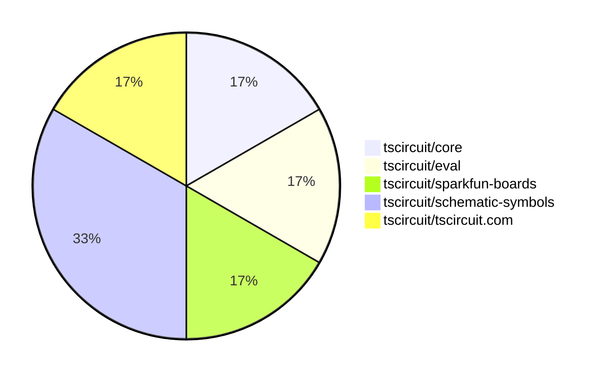
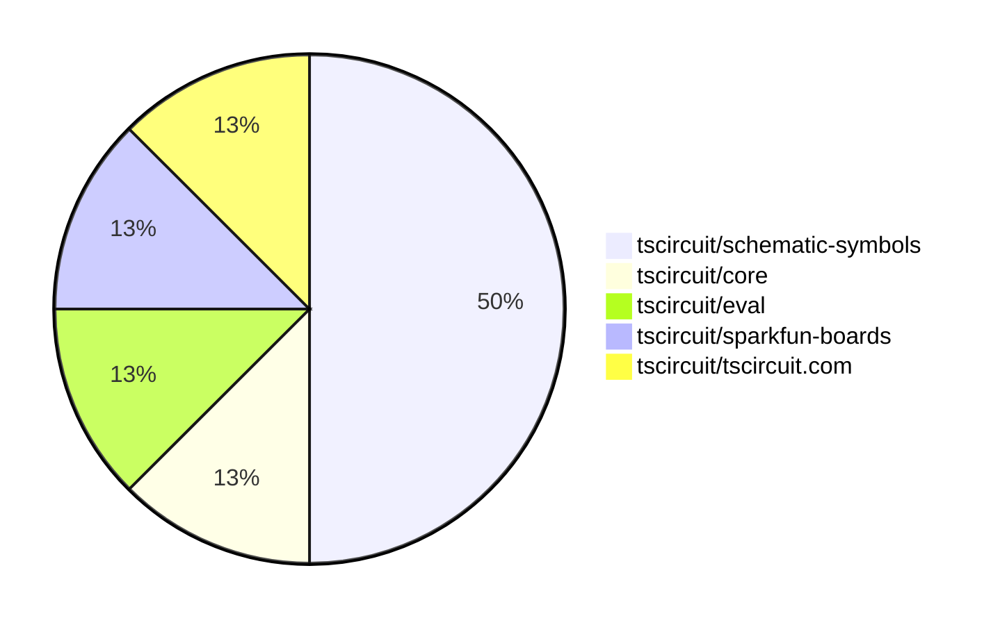

# Contribution Overview 2025-07-16

## PRs by Repository

## Contributor Overview

| Contributor | 🐳 Major | 🐙 Minor | 🐌 Tiny | ⭐ | Issues Created | Discussion Contributions |
|-------------|---------|---------|---------|-----|----------------|--------------------------|
| [techmannih](#techmannih) | 0 | 2 | 0 | ⭐ | 0 | 0🔹 0🔶 0💎 |
| [MustafaMulla29](#MustafaMulla29) | 0 | 0 | 3 |  | 0 | 0🔹 0🔶 0💎 |
| [ArnavK-09](#ArnavK-09) | 0 | 0 | 1 |  | 0 | 0🔹 0🔶 0💎 |

### Discussion Contribution Legend

- 🔹 Normal Comments: Basic participation with minimal effort
- 🔶 Great Informative Comments: Thoughtful participation that adds value
- 💎 Incredible Comments: Exceptional participation with high-quality content

## Review Table

[reviews-received-hover]: ## "Number of reviews received for PRs for this contributor"
[approvals-received-hover]: ## "Number of approvals received for PRs this contributor authored"
[rejections-received-hover]: ## "Number of rejections received for PRs this contributor authored"
[prs-opened-hover]: ## "Number of PRs opened by this contributor"
[issues-created-hover]: ## "Number of issues created by this contributor"
[bountied-issues-hover]: ## "Number of issues this contributor created with a bounty"
[bountied-issue-$-hover]: ## "Total bounty amount placed on issues authored by this contributor"

| Contributor | Reviews Received | Approvals Received | Rejections Received | Approvals | Rejections | PRs Opened | PRs Merged | Issues Created | Bountied Issues | Bountied Issue $ |
|---|---|---|---|---|---|---|---|---|---|---|
| [MustafaMulla29](#MustafaMulla29) | 3 | 3 | 0 | 0 | 0 | 3 | 3 | 0 | 0 | 0 |
| [ShiboSoftwareDev](#ShiboSoftwareDev) | 0 | 0 | 0 | 3 | 0 | 0 | 0 | 0 | 0 | 0 |
| [techmannih](#techmannih) | 2 | 2 | 0 | 0 | 0 | 2 | 2 | 0 | 0 | 0 |
| [seveibar](#seveibar) | 1 | 0 | 0 | 4 | 0 | 2 | 0 | 0 | 0 | 0 |
| [imrishabh18](#imrishabh18) | 0 | 0 | 0 | 1 | 0 | 0 | 0 | 0 | 0 | 0 |
| [Abse2001](#Abse2001) | 4 | 2 | 0 | 0 | 0 | 3 | 0 | 0 | 0 | 0 |
| [ArnavK-09](#ArnavK-09) | 2 | 1 | 0 | 0 | 0 | 1 | 1 | 0 | 0 | 0 |
| [graphite-app[bot]](#graphite-app[bot]) | 0 | 0 | 0 | 0 | 0 | 0 | 0 | 0 | 0 | 0 |
| [tscircuitbot](#tscircuitbot) | 0 | 0 | 0 | 0 | 0 | 2 | 0 | 0 | 0 | 0 |
| [cursor[bot]](#cursor[bot]) | 0 | 0 | 0 | 0 | 0 | 0 | 0 | 0 | 0 | 0 |

## Top 7 Repositories by Contribution Points

## Changes by Repository

### [tscircuit/core](https://github.com/tscircuit/core)

🐌 Tiny Contributions (1)

| PR # | Impact | Contributor | Description |
|------|--------|-------------|-------------|
| [#1076](https://github.com/tscircuit/core/pull/1076) | 🐌 Tiny | MustafaMulla29 | Updates the footprinter dependency to version 0.0.203 to support the _textbottom flag for 0603 components. |

### [tscircuit/eval](https://github.com/tscircuit/eval)

🐌 Tiny Contributions (1)

| PR # | Impact | Contributor | Description |
|------|--------|-------------|-------------|
| [#707](https://github.com/tscircuit/eval/pull/707) | 🐌 Tiny | MustafaMulla29 | Updates the tscircuitcore dependency from version 0.0.564 to 0.0.571 in package.json. |

### [tscircuit/sparkfun-boards](https://github.com/tscircuit/sparkfun-boards)

🐌 Tiny Contributions (1)

| PR # | Impact | Contributor | Description |
|------|--------|-------------|-------------|
| [#74](https://github.com/tscircuit/sparkfun-boards/pull/74) | 🐌 Tiny | MustafaMulla29 | Updates the tscircuit dependency version from 0.0.541 to 0.0.543 in package.json. |

### [tscircuit/schematic-symbols](https://github.com/tscircuit/schematic-symbols)

| PR # | Impact | Rating | Contributor | Description |
|------|--------|--------|-------------|-------------|
| [#336](https://github.com/tscircuit/schematic-symbols/pull/336) | 🐙 Minor | ⭐⭐ | techmannih | Adds alternative pin labels (Base, Emitter, Collector) to NPN and PNP bipolar transistor symbols for better clarity and usability. |
| [#335](https://github.com/tscircuit/schematic-symbols/pull/335) | 🐙 Minor | ⭐⭐ | techmannih | Fixes pin numbering for PNP and NPN bipolar transistors to follow a clockwise convention, ensuring consistency in schematic representations. |

### [tscircuit/tscircuit.com](https://github.com/tscircuit/tscircuit.com)

🐌 Tiny Contributions (1)

| PR # | Impact | Contributor | Description |
|------|--------|-------------|-------------|
| [#1476](https://github.com/tscircuit/tscircuit.com/pull/1476) | 🐌 Tiny | ArnavK-09 | Adds a session token check to ensure users are logged in before importing components from jlcpcb. |

## Changes by Contributor

### [MustafaMulla29](https://github.com/MustafaMulla29)

🐌 Tiny Contributions (3)

| PR # | Impact | Description |
|------|--------|-------------|
| [#1076](https://github.com/tscircuit/core/pull/1076) | 🐌 Tiny | Updates the footprinter dependency to version 0.0.203 to support the _textbottom flag for 0603 components. |
| [#707](https://github.com/tscircuit/eval/pull/707) | 🐌 Tiny | Updates the tscircuitcore dependency from version 0.0.564 to 0.0.571 in package.json. |
| [#74](https://github.com/tscircuit/sparkfun-boards/pull/74) | 🐌 Tiny | Updates the tscircuit dependency version from 0.0.541 to 0.0.543 in package.json. |

### [techmannih](https://github.com/techmannih)

| PRs # | Impact | Rating | Description |
|------|--------|--------|-------------|
| [#336](https://github.com/tscircuit/schematic-symbols/pull/336) | 🐙 Minor | ⭐⭐ | Adds alternative pin labels (Base, Emitter, Collector) to NPN and PNP bipolar transistor symbols for better clarity and usability. |
| [#335](https://github.com/tscircuit/schematic-symbols/pull/335) | 🐙 Minor | ⭐⭐ | Fixes pin numbering for PNP and NPN bipolar transistors to follow a clockwise convention, ensuring consistency in schematic representations. |

### [ArnavK-09](https://github.com/ArnavK-09)

🐌 Tiny Contributions (1)

| PR # | Impact | Description |
|------|--------|-------------|
| [#1476](https://github.com/tscircuit/tscircuit.com/pull/1476) | 🐌 Tiny | Adds a session token check to ensure users are logged in before importing components from jlcpcb. |

## Repository Owners

| Repository | Codeowners |
|------------|------------|
| [sparkfun-boards](https://github.com/tscircuit/sparkfun-boards/blob/main/.github/CODEOWNERS) | [MustafaMulla29](https://github.com/MustafaMulla29) |
| [schematic-symbols](https://github.com/tscircuit/schematic-symbols/blob/main/.github/CODEOWNERS) | [techmannih](https://github.com/techmannih) |
| [schematic-corpus](https://github.com/tscircuit/schematic-corpus/blob/main/.github/CODEOWNERS) | [Abse2001](https://github.com/Abse2001) |

## Repos by Owner

| User | Repo |
|------|------|
| [MustafaMulla29](https://github.com/MustafaMulla29) | [sparkfun-boards](https://github.com/tscircuit/sparkfun-boards/blob/main/.github/CODEOWNERS) |
| [techmannih](https://github.com/techmannih) | [schematic-symbols](https://github.com/tscircuit/schematic-symbols/blob/main/.github/CODEOWNERS) |
| [Abse2001](https://github.com/Abse2001) | [schematic-corpus](https://github.com/tscircuit/schematic-corpus/blob/main/.github/CODEOWNERS) |

