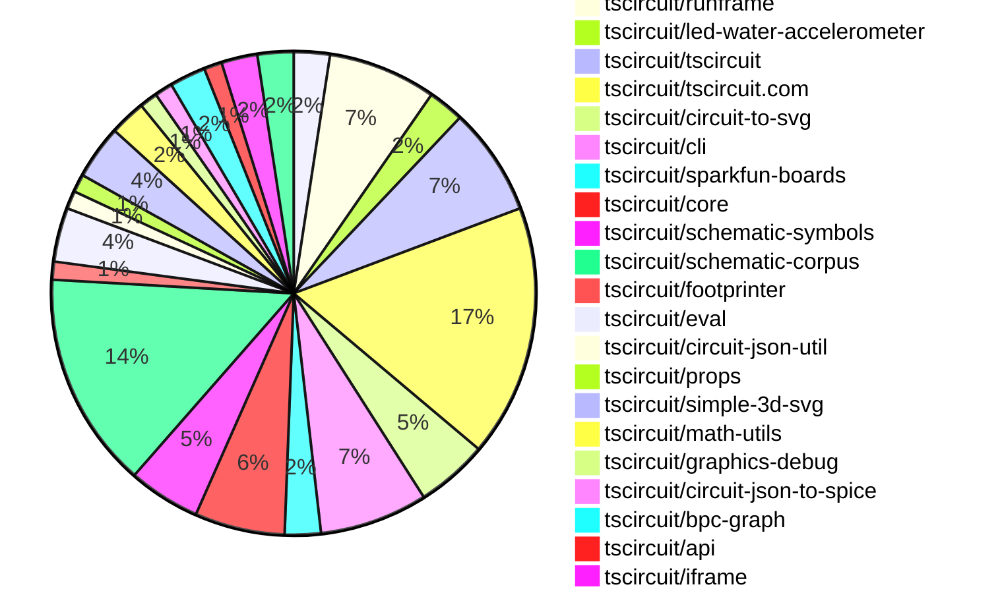
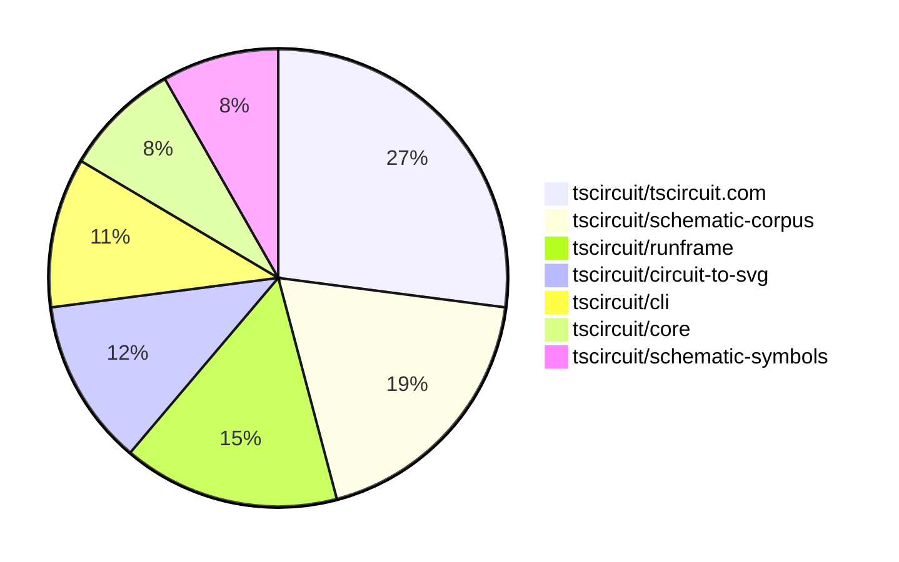

# Contribution Overview 2025-07-16

## PRs by Repository

## Contributor Overview

| Contributor | 🐳 Major | 🐙 Minor | 🐌 Tiny | ⭐ | Issues Created | Discussion Contributions |
|-------------|---------|---------|---------|-----|----------------|--------------------------|
| [seveibar](#seveibar) | 2 | 1 | 13 | ⭐⭐⭐ | 0 | 0🔹 0🔶 0💎 |
| [Abse2001](#Abse2001) | 3 | 3 | 10 | ⭐⭐⭐ | 0 | 0🔹 0🔶 0💎 |
| [ArnavK-09](#ArnavK-09) | 3 | 3 | 10 | ⭐⭐ | 0 | 0🔹 0🔶 0💎 |
| [imrishabh18](#imrishabh18) | 1 | 2 | 4 | ⭐⭐ | 0 | 0🔹 0🔶 0💎 |
| [MustafaMulla29](#MustafaMulla29) | 1 | 0 | 14 | ⭐⭐ | 0 | 0🔹 0🔶 0💎 |
| [techmannih](#techmannih) | 0 | 3 | 4 | ⭐⭐ | 0 | 0🔹 0🔶 0💎 |
| [ShiboSoftwareDev](#ShiboSoftwareDev) | 0 | 0 | 2 | ⭐ | 0 | 0🔹 0🔶 0💎 |
| [andrii-balitskyi](#andrii-balitskyi) | 1 | 0 | 1 | ⭐ | 0 | 0🔹 0🔶 0💎 |
| [abimaelmartell](#abimaelmartell) | 0 | 0 | 1 |  | 0 | 0🔹 0🔶 0💎 |
| [tscircuitbot](#tscircuitbot) | 0 | 0 | 1 |  | 0 | 0🔹 0🔶 0💎 |

### Discussion Contribution Legend

- 🔹 Normal Comments: Basic participation with minimal effort
- 🔶 Great Informative Comments: Thoughtful participation that adds value
- 💎 Incredible Comments: Exceptional participation with high-quality content

## Review Table

[reviews-received-hover]: ## "Number of reviews received for PRs for this contributor"
[approvals-received-hover]: ## "Number of approvals received for PRs this contributor authored"
[rejections-received-hover]: ## "Number of rejections received for PRs this contributor authored"
[prs-opened-hover]: ## "Number of PRs opened by this contributor"
[issues-created-hover]: ## "Number of issues created by this contributor"
[bountied-issues-hover]: ## "Number of issues this contributor created with a bounty"
[bountied-issue-$-hover]: ## "Total bounty amount placed on issues authored by this contributor"

| Contributor | Reviews Received | Approvals Received | Rejections Received | Approvals | Rejections | PRs Opened | PRs Merged | Score | Issues Created | Bountied Issues | Bountied Issue $ |
|---|---|---|---|---|---|---|---|---|---|---|---|
| [imrishabh18](#imrishabh18) | 5 | 4 | 0 | 3 | 0 | 7 | 7 | 15 | 0 | 0 | 0 |
| [seveibar](#seveibar) | 9 | 0 | 0 | 42 | 0 | 21 | 16 | 35.5 | 0 | 0 | 0 |
| [Abse2001](#Abse2001) | 20 | 16 | 0 | 10 | 0 | 18 | 16 | 34.5 | 0 | 0 | 0 |
| [MustafaMulla29](#MustafaMulla29) | 15 | 14 | 0 | 0 | 0 | 19 | 15 | 15 | 0 | 0 | 0 |
| [ShiboSoftwareDev](#ShiboSoftwareDev) | 3 | 3 | 0 | 9 | 0 | 3 | 2 | 9 | 0 | 0 | 0 |
| [andrii-balitskyi](#andrii-balitskyi) | 2 | 2 | 0 | 0 | 0 | 3 | 2 | 5 | 0 | 0 | 0 |
| [graphite-app[bot]](#graphite-app[bot]) | 0 | 0 | 0 | 0 | 0 | 0 | 0 | 0 | 0 | 0 | 0 |
| [techmannih](#techmannih) | 11 | 7 | 0 | 2 | 0 | 7 | 7 | 12 | 0 | 0 | 0 |
| [cursor[bot]](#cursor[bot]) | 0 | 0 | 0 | 0 | 0 | 0 | 0 | 0 | 0 | 0 | 0 |
| [ArnavK-09](#ArnavK-09) | 23 | 19 | 0 | 0 | 0 | 24 | 17 | 28 | 0 | 0 | 0 |
| [abimaelmartell](#abimaelmartell) | 1 | 1 | 0 | 0 | 0 | 1 | 1 | 1 | 0 | 0 | 0 |
| [tscircuitbot](#tscircuitbot) | 0 | 0 | 0 | 0 | 0 | 8 | 1 | 1 | 0 | 0 | 0 |

## Top 7 Repositories by Contribution Points

## Changes by Repository

### [tscircuit/docs](https://github.com/tscircuit/docs)

| PR # | Impact | Rating | Contributor | Description |
|------|--------|--------|-------------|-------------|
| [#103](https://github.com/tscircuit/docs/pull/103) | 🐳 Major | ⭐⭐⭐ | imrishabh18 | Adds documentation on how to run tscircuit code using a standalone HTML file without build tooling. |

🐌 Tiny Contributions (1)

| PR # | Impact | Contributor | Description |
|------|--------|-------------|-------------|
| [#101](https://github.com/tscircuit/docs/pull/101) | 🐌 Tiny | seveibar | Adds documentation for the compile.tscircuit.com API, detailing usage, endpoints, and examples for compiling tscircuit user code into Circuit JSON. |

### [tscircuit/runframe](https://github.com/tscircuit/runframe)

| PR # | Impact | Rating | Contributor | Description |
|------|--------|--------|-------------|-------------|
| [#885](https://github.com/tscircuit/runframe/pull/885) | 🐳 Major | ⭐⭐⭐ | seveibar | This PR adds availableTabs and defaultTab props to the RunFrame component, allowing users to specify which tabs are available and which tab should be selected by default in the CircuitJsonPreview. |
| [#895](https://github.com/tscircuit/runframe/pull/895) | 🐳 Major | ⭐⭐⭐ | ArnavK-09 | related https:github.comtscircuittscircuit.comissues1443 |
| [#900](https://github.com/tscircuit/runframe/pull/900) | 🐙 Minor | ⭐⭐ | imrishabh18 | Parses script typetscircuit-tsx blocks automatically in standalone build and renders RunFrame with collected fsMap when used without the file server. |

🐌 Tiny Contributions (3)

| PR # | Impact | Contributor | Description |
|------|--------|-------------|-------------|
| [#902](https://github.com/tscircuit/runframe/pull/902) | 🐌 Tiny | imrishabh18 | Allows scripttypetscircuit-tsx tags to load from src for dynamic script loading. |
| [#892](https://github.com/tscircuit/runframe/pull/892) | 🐌 Tiny | ArnavK-09 | Adds support for customizable main component rendering in RunFrameWithApi by introducing mainComponentPath from the window object. |
| [#887](https://github.com/tscircuit/runframe/pull/887) | 🐌 Tiny | ArnavK-09 | Adjusted the width of the dialog content for better responsiveness. Improved text sizes and spacing for dialog titles, descriptions, and buttons. Enhanced the layout of search results and component details for better usability. Updated styles for various elements to ensure consistency across different screen sizes. Fixed minor layout issues in the component details dialog for improved visual clarity. fix black background issue |

### [tscircuit/led-water-accelerometer](https://github.com/tscircuit/led-water-accelerometer)

| PR # | Impact | Rating | Contributor | Description |
|------|--------|--------|-------------|-------------|
| [#7](https://github.com/tscircuit/led-water-accelerometer/pull/7) | 🐙 Minor | ⭐⭐ | imrishabh18 | Adds firmware to control a NeoPixel LED matrix for displaying animated text and patterns, specifically for the tscircuit logo. |

🐌 Tiny Contributions (1)

| PR # | Impact | Contributor | Description |
|------|--------|-------------|-------------|
| [#6](https://github.com/tscircuit/led-water-accelerometer/pull/6) | 🐌 Tiny | imrishabh18 | Adds functionality to support vertical flipping in the water simulation, allowing for more accurate representation of gravity effects on the LED display. |

### [tscircuit/tscircuit](https://github.com/tscircuit/tscircuit)

🐌 Tiny Contributions (6)

| PR # | Impact | Contributor | Description |
|------|--------|-------------|-------------|
| [#713](https://github.com/tscircuit/tscircuit/pull/713) | 🐌 Tiny | imrishabh18 | Exports the standalone version of runframe as browser.min.js during the build process, allowing for easier integration in browser environments. |
| [#712](https://github.com/tscircuit/tscircuit/pull/712) | 🐌 Tiny | Abse2001 | Updates the circuit-to-svg dependency version from 0.0.166 to 0.0.173 in package.json. |
| [#711](https://github.com/tscircuit/tscircuit/pull/711) | 🐌 Tiny | Abse2001 | Updates the version of the tscircuitcore dependency from 0.0.573 to 0.0.574 in package.json. |
| [#709](https://github.com/tscircuit/tscircuit/pull/709) | 🐌 Tiny | Abse2001 | Updates the CLI dependency version from 0.1.175 to 0.1.176 in package.json |
| [#710](https://github.com/tscircuit/tscircuit/pull/710) | 🐌 Tiny | MustafaMulla29 | Updates the circuit-to-svg dependency from version 0.0.166 to 0.0.170 in package.json. |
| [#708](https://github.com/tscircuit/tscircuit/pull/708) | 🐌 Tiny | MustafaMulla29 | Updates the version of the tscircuiteval package from 0.0.260 to 0.0.261 in package.json. |

### [tscircuit/tscircuit.com](https://github.com/tscircuit/tscircuit.com)

| PR # | Impact | Rating | Contributor | Description |
|------|--------|--------|-------------|-------------|
| [#1488](https://github.com/tscircuit/tscircuit.com/pull/1488) | 🐳 Major | ⭐⭐⭐ | ArnavK-09 | Adds a keyboard shortcut (ctrlm) to open the file creation sidebar in the CodeEditor component. |
| [#1487](https://github.com/tscircuit/tscircuit.com/pull/1487) | 🐳 Major | ⭐⭐⭐ | ArnavK-09 | Fixes file selection logic to correctly handle hidden files in the CodeEditorHeader and useFileManagement hook, ensuring users can select visible files only. |
| [#1489](https://github.com/tscircuit/tscircuit.com/pull/1489) | 🐙 Minor | ⭐⭐ | ArnavK-09 | Adds new UI components and improves the layout of the DatasheetPage for better user experience. |
| [#1481](https://github.com/tscircuit/tscircuit.com/pull/1481) | 🐙 Minor | ⭐⭐ | ArnavK-09 | Prevents the entire page from loading when rendering the 3D preview by using Reacts Suspense for loading state management. |
| [#1475](https://github.com/tscircuit/tscircuit.com/pull/1475) | 🐙 Minor | ⭐⭐ | ArnavK-09 | Replaces plain text loading indicator with animated placeholders in ShikiCodeViewer for improved user experience during loading states. |

🐌 Tiny Contributions (9)

| PR # | Impact | Contributor | Description |
|------|--------|-------------|-------------|
| [#1491](https://github.com/tscircuit/tscircuit.com/pull/1491) | 🐌 Tiny | imrishabh18 | Hides the file delete option in the FileSidebar component for users who do not own the package, ensuring that only the owner can delete files. |
| [#1490](https://github.com/tscircuit/tscircuit.com/pull/1490) | 🐌 Tiny | seveibar | Extends LogContent to display additional fields from log objects on the build page. |
| [#1495](https://github.com/tscircuit/tscircuit.com/pull/1495) | 🐌 Tiny | ArnavK-09 | Updates multiple dependencies to their latest versions, potentially fixing issues related to outdated packages. |
| [#1492](https://github.com/tscircuit/tscircuit.com/pull/1492) | 🐌 Tiny | ArnavK-09 | Fixes layout issues and styling inconsistencies across various pages in the application, including the dashboard, datasheet, and trending pages. |
| [#1484](https://github.com/tscircuit/tscircuit.com/pull/1484) | 🐌 Tiny | ArnavK-09 | Removes a line that causes an error during the JLCPCB import process. |
| [#1479](https://github.com/tscircuit/tscircuit.com/pull/1479) | 🐌 Tiny | ArnavK-09 | Fixes the jlcpcb import functionality by correcting the fetch request headers and method handling in the CodeEditorHeader component. |
| [#1476](https://github.com/tscircuit/tscircuit.com/pull/1476) | 🐌 Tiny | ArnavK-09 | Adds session token validation for importing components from jlcpcb, ensuring users are logged in before proceeding with the import. |
| [#1493](https://github.com/tscircuit/tscircuit.com/pull/1493) | 🐌 Tiny | ShiboSoftwareDev | Adds the capability to download a SPICE netlist for a given circuit using the circuit-json-to-spice package. |
| [#1486](https://github.com/tscircuit/tscircuit.com/pull/1486) | 🐌 Tiny | abimaelmartell | Adds a new section to the datasheet page that displays an AI-generated description if available, otherwise shows a placeholder message. |

### [tscircuit/circuit-to-svg](https://github.com/tscircuit/circuit-to-svg)

| PR # | Impact | Rating | Contributor | Description |
|------|--------|--------|-------------|-------------|
| [#289](https://github.com/tscircuit/circuit-to-svg/pull/289) | 🐳 Major | ⭐⭐⭐ | Abse2001 | Fixes inconsistent stroke width rendering for resizable SVG schematic boxes based on zoom level. |
| [#288](https://github.com/tscircuit/circuit-to-svg/pull/288) | 🐳 Major | ⭐⭐⭐ | andrii-balitskyi | Adds support for rendering polygon SMT pads in SVG, including bounds calculation and testing. |

🐌 Tiny Contributions (2)

| PR # | Impact | Contributor | Description |
|------|--------|-------------|-------------|
| [#290](https://github.com/tscircuit/circuit-to-svg/pull/290) | 🐌 Tiny | Abse2001 | Updates the tscircuitfootprinter dependency from version 0.0.203 to 0.0.204 in package.json. |
| [#287](https://github.com/tscircuit/circuit-to-svg/pull/287) | 🐌 Tiny | MustafaMulla29 | Updates the footprinter dependency to version 0.0.203, enabling support for the _textbottom flag. |

### [tscircuit/cli](https://github.com/tscircuit/cli)

| PR # | Impact | Rating | Contributor | Description |
|------|--------|--------|-------------|-------------|
| [#281](https://github.com/tscircuit/cli/pull/281) | 🐳 Major | ⭐⭐⭐ | Abse2001 | Introduces image-based visual diffing to enhance the reliability of snapshot verification in the CLI tool. |

🐌 Tiny Contributions (5)

| PR # | Impact | Contributor | Description |
|------|--------|-------------|-------------|
| [#288](https://github.com/tscircuit/cli/pull/288) | 🐌 Tiny | Abse2001 | Updates dependencies for circuit-json-to-readable-netlist and tscircuit to their latest versions. |
| [#282](https://github.com/tscircuit/cli/pull/282) | 🐌 Tiny | Abse2001 | Fixes the static import of the looks-same library to ensure it is correctly imported and used in the snapshot comparison functionality. |
| [#284](https://github.com/tscircuit/cli/pull/284) | 🐌 Tiny | MustafaMulla29 | Updates the tscircuit dependency version from 0.0.540 to 0.0.546 in package.json to incorporate the latest changes and improvements from the tscircuit library. |
| [#285](https://github.com/tscircuit/cli/pull/285) | 🐌 Tiny | ArnavK-09 | Adds explicit file existence check for provided entrypoint file name and updates the entrypoint detection logic to include additional file types. |
| [#286](https://github.com/tscircuit/cli/pull/286) | 🐌 Tiny | ArnavK-09 | Fixes the issue where either an entrypoint or mainComponentPath must be provided, resolving the related issue 174. |

### [tscircuit/sparkfun-boards](https://github.com/tscircuit/sparkfun-boards)

| PR # | Impact | Rating | Contributor | Description |
|------|--------|--------|-------------|-------------|
| [#84](https://github.com/tscircuit/sparkfun-boards/pull/84) | 🐳 Major | ⭐⭐⭐ | Abse2001 | No description provided |

🐌 Tiny Contributions (1)

| PR # | Impact | Contributor | Description |
|------|--------|-------------|-------------|
| [#74](https://github.com/tscircuit/sparkfun-boards/pull/74) | 🐌 Tiny | MustafaMulla29 | Updates the tscircuit dependency version from 0.0.541 to 0.0.543 in package.json. |

### [tscircuit/core](https://github.com/tscircuit/core)

| PR # | Impact | Rating | Contributor | Description |
|------|--------|--------|-------------|-------------|
| [#1081](https://github.com/tscircuit/core/pull/1081) | 🐙 Minor | ⭐⭐ | Abse2001 | Fixes bug where top and bottom schPinArrangement dont function correctly when left or right arrangements are not defined. |
| [#1077](https://github.com/tscircuit/core/pull/1077) | 🐙 Minor | ⭐⭐ | techmannih | Fixes pin aliases for transistors to use standard labels (collector, emitter, base) in connections, ensuring correct schematic representation. |

🐌 Tiny Contributions (3)

| PR # | Impact | Contributor | Description |
|------|--------|-------------|-------------|
| [#1082](https://github.com/tscircuit/core/pull/1082) | 🐌 Tiny | Abse2001 | Updates the version of the tscircuitfootprinter dependency from 0.0.203 to 0.0.204 in package.json. |
| [#1079](https://github.com/tscircuit/core/pull/1079) | 🐌 Tiny | Abse2001 | Reproduces a bug related to externally connected pins in circuit design, providing a test case for further investigation and resolution. |
| [#1076](https://github.com/tscircuit/core/pull/1076) | 🐌 Tiny | MustafaMulla29 | Updates the footprinter dependency to version 0.0.203 to support the _textbottom flag for 0603 components. |

### [tscircuit/schematic-symbols](https://github.com/tscircuit/schematic-symbols)

| PR # | Impact | Rating | Contributor | Description |
|------|--------|--------|-------------|-------------|
| [#334](https://github.com/tscircuit/schematic-symbols/pull/334) | 🐙 Minor | ⭐⭐ | Abse2001 | Refactors the symbol generation script and updates text anchor positioning logic to allow for more precise placement of text elements in schematic symbols. |
| [#336](https://github.com/tscircuit/schematic-symbols/pull/336) | 🐙 Minor | ⭐⭐ | techmannih | Adds alternative pin labels (Base, Emitter, Collector) to NPN and PNP bipolar transistor symbols for better clarity and usability. |
| [#335](https://github.com/tscircuit/schematic-symbols/pull/335) | 🐙 Minor | ⭐⭐ | techmannih | Fixes pin numbering for PNP and NPN bipolar transistors to adhere to a clockwise convention, ensuring consistency in schematic representations. |

🐌 Tiny Contributions (1)

| PR # | Impact | Contributor | Description |
|------|--------|-------------|-------------|
| [#337](https://github.com/tscircuit/schematic-symbols/pull/337) | 🐌 Tiny | techmannih | Adds alternative pin labels (Base, Emitter, Collector) to the PNP bipolar transistor symbol for better clarity and usability. |

### [tscircuit/schematic-corpus](https://github.com/tscircuit/schematic-corpus)

| PR # | Impact | Rating | Contributor | Description |
|------|--------|--------|-------------|-------------|
| [#98](https://github.com/tscircuit/schematic-corpus/pull/98) | 🐳 Major | ⭐⭐⭐ | MustafaMulla29 | Adds a new circuit design (design63) that enhances the autorouting algorithm by providing a new schematic representation and component layout. |
| [#95](https://github.com/tscircuit/schematic-corpus/pull/95) | 🐙 Minor | ⭐⭐ | Abse2001 | Introduces a GitHub star button and a mobile-friendly burger menu for navigation, enhancing user interaction and accessibility on both site and mobile views. |

🐌 Tiny Contributions (10)

| PR # | Impact | Contributor | Description |
|------|--------|-------------|-------------|
| [#94](https://github.com/tscircuit/schematic-corpus/pull/94) | 🐌 Tiny | Abse2001 | Updates the tscircuit dependency from version 0.0.532 to 0.0.546 in package.json. |
| [#105](https://github.com/tscircuit/schematic-corpus/pull/105) | 🐌 Tiny | MustafaMulla29 | Adds a new design (design67) to the schematic corpus, which is intended to enhance the autorouting algorithms performance. |
| [#100](https://github.com/tscircuit/schematic-corpus/pull/100) | 🐌 Tiny | MustafaMulla29 | Adds a new design component (design065) to the schematic corpus, which enhances the autorouting algorithm by providing a new circuit board design. |
| [#99](https://github.com/tscircuit/schematic-corpus/pull/99) | 🐌 Tiny | MustafaMulla29 | Adds a new design (design064) to the schematic corpus, which includes a circuit board layout with specific components and connections for improved autorouting functionality. |
| [#97](https://github.com/tscircuit/schematic-corpus/pull/97) | 🐌 Tiny | MustafaMulla29 | Adds a new design (design62) to the schematic corpus, which is intended to enhance the autorouting algorithm. |
| [#96](https://github.com/tscircuit/schematic-corpus/pull/96) | 🐌 Tiny | MustafaMulla29 | Adds a new design (design61) to the schematic corpus, which includes a new circuit board layout for improved autorouting functionality. |
| [#89](https://github.com/tscircuit/schematic-corpus/pull/89) | 🐌 Tiny | MustafaMulla29 | Adds a new circuit design (design60) to enhance the autorouting algorithm by providing a new schematic representation and component layout. |
| [#104](https://github.com/tscircuit/schematic-corpus/pull/104) | 🐌 Tiny | techmannih | Renames design61 and design62 files to design061 and design062 respectively for consistency in naming conventions. |
| [#101](https://github.com/tscircuit/schematic-corpus/pull/101) | 🐌 Tiny | techmannih | Adds a new design (design059) to the schematic corpus, which includes a new circuit layout for improved autolayout functionality. |
| [#102](https://github.com/tscircuit/schematic-corpus/pull/102) | 🐌 Tiny | techmannih | Adds a new design (design066) to the schematic corpus, which includes a new circuit layout for improved autolayout functionality. |

### [tscircuit/footprinter](https://github.com/tscircuit/footprinter)

🐌 Tiny Contributions (1)

| PR # | Impact | Contributor | Description |
|------|--------|-------------|-------------|
| [#332](https://github.com/tscircuit/footprinter/pull/332) | 🐌 Tiny | Abse2001 | Adds support for placing silkscreen reference text on the bottom layer of the PCB. |

### [tscircuit/eval](https://github.com/tscircuit/eval)

🐌 Tiny Contributions (3)

| PR # | Impact | Contributor | Description |
|------|--------|-------------|-------------|
| [#709](https://github.com/tscircuit/eval/pull/709) | 🐌 Tiny | MustafaMulla29 | Updates the version of the tscircuitfootprinter dependency from 0.0.193 to 0.0.203 in package.json. |
| [#707](https://github.com/tscircuit/eval/pull/707) | 🐌 Tiny | MustafaMulla29 | Updates the tscircuitcore dependency version from 0.0.564 to 0.0.571 in package.json. |
| [#716](https://github.com/tscircuit/eval/pull/716) | 🐌 Tiny | tscircuitbot | Updates the tscircuitcore dependency from version 0.0.571 to 0.0.574, along with several other related dependencies in package.json. |

### [tscircuit/circuit-json-util](https://github.com/tscircuit/circuit-json-util)

🐌 Tiny Contributions (1)

| PR # | Impact | Contributor | Description |
|------|--------|-------------|-------------|
| [#39](https://github.com/tscircuit/circuit-json-util/pull/39) | 🐌 Tiny | andrii-balitskyi | Adds support for polygons with points array in the getDebugLayoutObject function, allowing for more flexible layout debugging. |

### [tscircuit/props](https://github.com/tscircuit/props)

| PR # | Impact | Rating | Contributor | Description |
|------|--------|--------|-------------|-------------|
| [#330](https://github.com/tscircuit/props/pull/330) | 🐳 Major | ⭐⭐⭐ | seveibar | Summary drop dcSimulationVoltage from PinAttributeMap regenerate docs and format markdown files  Testing bun test testschip3-type-tests.test.tsx bun run format |

### [tscircuit/simple-3d-svg](https://github.com/tscircuit/simple-3d-svg)

| PR # | Impact | Rating | Contributor | Description |
|------|--------|--------|-------------|-------------|
| [#45](https://github.com/tscircuit/simple-3d-svg/pull/45) | 🐙 Minor | ⭐⭐ | seveibar | Adds optional parameters showAxes, showOrigin, and showGrid to the renderScene function, enabling the rendering of a small XYZ axis guide and origin lines in the SVG output. |

🐌 Tiny Contributions (2)

| PR # | Impact | Contributor | Description |
|------|--------|-------------|-------------|
| [#47](https://github.com/tscircuit/simple-3d-svg/pull/47) | 🐌 Tiny | seveibar | Transforms STL model coordinates from Z-up to Y-up by applying a rotation, ensuring compatibility with Y-up systems. |
| [#46](https://github.com/tscircuit/simple-3d-svg/pull/46) | 🐌 Tiny | seveibar | Adds gradient fading to axis lines in the SVG rendering of the origin, enhancing visual clarity. |

### [tscircuit/math-utils](https://github.com/tscircuit/math-utils)

🐌 Tiny Contributions (2)

| PR # | Impact | Contributor | Description |
|------|--------|-------------|-------------|
| [#15](https://github.com/tscircuit/math-utils/pull/15) | 🐌 Tiny | seveibar | Links API functions in the README to their implementation files for better navigation and understanding of the codebase. |
| [#14](https://github.com/tscircuit/math-utils/pull/14) | 🐌 Tiny | seveibar | Adds an API table summarizing all exported methods in the README. |

### [tscircuit/graphics-debug](https://github.com/tscircuit/graphics-debug)

🐌 Tiny Contributions (1)

| PR # | Impact | Contributor | Description |
|------|--------|-------------|-------------|
| [#70](https://github.com/tscircuit/graphics-debug/pull/70) | 🐌 Tiny | seveibar | Adds documentation for the usage of the InteractiveGraphics component from the graphics-debugreact package. |

### [tscircuit/circuit-json-to-spice](https://github.com/tscircuit/circuit-json-to-spice)

🐌 Tiny Contributions (1)

| PR # | Impact | Contributor | Description |
|------|--------|-------------|-------------|
| [#5](https://github.com/tscircuit/circuit-json-to-spice/pull/5) | 🐌 Tiny | seveibar | Adds integration tests for the EEcircuit-engine, including a new bunfig.toml configuration and updates to dependencies. |

### [tscircuit/bpc-graph](https://github.com/tscircuit/bpc-graph)

🐌 Tiny Contributions (2)

| PR # | Impact | Contributor | Description |
|------|--------|-------------|-------------|
| [#68](https://github.com/tscircuit/bpc-graph/pull/68) | 🐌 Tiny | seveibar | Adds documentation for layoutSchematic and layoutSchematicWithInputVariants functions in the README.md file. |
| [#66](https://github.com/tscircuit/bpc-graph/pull/66) | 🐌 Tiny | seveibar | Removes tscircuitschematic-corpus as a peer dependency from the package.json file. |

### [tscircuit/api](https://github.com/tscircuit/api)

🐌 Tiny Contributions (1)

| PR # | Impact | Contributor | Description |
|------|--------|-------------|-------------|
| [#5](https://github.com/tscircuit/api/pull/5) | 🐌 Tiny | seveibar | Adds a new API client method to compile user code into Circuit JSON format via client.compile.compileCode, along with documentation and tests for this functionality. |

### [tscircuit/iframe](https://github.com/tscircuit/iframe)

🐌 Tiny Contributions (2)

| PR # | Impact | Contributor | Description |
|------|--------|-------------|-------------|
| [#3](https://github.com/tscircuit/iframe/pull/3) | 🐌 Tiny | seveibar | Documents the props of the TscircuitIframe component in the README file, providing clear descriptions and types for each prop. |
| [#2](https://github.com/tscircuit/iframe/pull/2) | 🐌 Tiny | seveibar | Adds error handling events and additional property supporttypes for the TscircuitIframe component, enhancing its functionality for user interactions and error management. |

### [tscircuit/contribution-tracker](https://github.com/tscircuit/contribution-tracker)

🐌 Tiny Contributions (2)

| PR # | Impact | Contributor | Description |
|------|--------|-------------|-------------|
| [#203](https://github.com/tscircuit/contribution-tracker/pull/203) | 🐌 Tiny | ArnavK-09 | Adds a score column to the contributor statistics in the markdown generation process, allowing for a more comprehensive overview of contributions. |
| [#202](https://github.com/tscircuit/contribution-tracker/pull/202) | 🐌 Tiny | ShiboSoftwareDev | Adds functionality to fetch and parse the CODEOWNERS file from the root or .github directory, improving code ownership management. |

## Changes by Contributor

### [imrishabh18](https://github.com/imrishabh18)

| PRs # | Impact | Rating | Description |
|------|--------|--------|-------------|
| [#103](https://github.com/tscircuit/docs/pull/103) | 🐳 Major | ⭐⭐⭐ | Adds documentation on how to run tscircuit code using a standalone HTML file without build tooling. |
| [#900](https://github.com/tscircuit/runframe/pull/900) | 🐙 Minor | ⭐⭐ | Parses script typetscircuit-tsx blocks automatically in standalone build and renders RunFrame with collected fsMap when used without the file server. |
| [#7](https://github.com/tscircuit/led-water-accelerometer/pull/7) | 🐙 Minor | ⭐⭐ | Adds firmware to control a NeoPixel LED matrix for displaying animated text and patterns, specifically for the tscircuit logo. |

🐌 Tiny Contributions (4)

| PR # | Impact | Description |
|------|--------|-------------|
| [#713](https://github.com/tscircuit/tscircuit/pull/713) | 🐌 Tiny | Exports the standalone version of runframe as browser.min.js during the build process, allowing for easier integration in browser environments. |
| [#1491](https://github.com/tscircuit/tscircuit.com/pull/1491) | 🐌 Tiny | Hides the file delete option in the FileSidebar component for users who do not own the package, ensuring that only the owner can delete files. |
| [#902](https://github.com/tscircuit/runframe/pull/902) | 🐌 Tiny | Allows scripttypetscircuit-tsx tags to load from src for dynamic script loading. |
| [#6](https://github.com/tscircuit/led-water-accelerometer/pull/6) | 🐌 Tiny | Adds functionality to support vertical flipping in the water simulation, allowing for more accurate representation of gravity effects on the LED display. |

### [Abse2001](https://github.com/Abse2001)

| PRs # | Impact | Rating | Description |
|------|--------|--------|-------------|
| [#289](https://github.com/tscircuit/circuit-to-svg/pull/289) | 🐳 Major | ⭐⭐⭐ | Fixes inconsistent stroke width rendering for resizable SVG schematic boxes based on zoom level. |
| [#281](https://github.com/tscircuit/cli/pull/281) | 🐳 Major | ⭐⭐⭐ | Introduces image-based visual diffing to enhance the reliability of snapshot verification in the CLI tool. |
| [#84](https://github.com/tscircuit/sparkfun-boards/pull/84) | 🐳 Major | ⭐⭐⭐ | No description provided |
| [#1081](https://github.com/tscircuit/core/pull/1081) | 🐙 Minor | ⭐⭐ | Fixes bug where top and bottom schPinArrangement dont function correctly when left or right arrangements are not defined. |
| [#334](https://github.com/tscircuit/schematic-symbols/pull/334) | 🐙 Minor | ⭐⭐ | Refactors the symbol generation script and updates text anchor positioning logic to allow for more precise placement of text elements in schematic symbols. |
| [#95](https://github.com/tscircuit/schematic-corpus/pull/95) | 🐙 Minor | ⭐⭐ | Introduces a GitHub star button and a mobile-friendly burger menu for navigation, enhancing user interaction and accessibility on both site and mobile views. |

🐌 Tiny Contributions (10)

| PR # | Impact | Description |
|------|--------|-------------|
| [#712](https://github.com/tscircuit/tscircuit/pull/712) | 🐌 Tiny | Updates the circuit-to-svg dependency version from 0.0.166 to 0.0.173 in package.json. |
| [#711](https://github.com/tscircuit/tscircuit/pull/711) | 🐌 Tiny | Updates the version of the tscircuitcore dependency from 0.0.573 to 0.0.574 in package.json. |
| [#709](https://github.com/tscircuit/tscircuit/pull/709) | 🐌 Tiny | Updates the CLI dependency version from 0.1.175 to 0.1.176 in package.json |
| [#332](https://github.com/tscircuit/footprinter/pull/332) | 🐌 Tiny | Adds support for placing silkscreen reference text on the bottom layer of the PCB. |
| [#1082](https://github.com/tscircuit/core/pull/1082) | 🐌 Tiny | Updates the version of the tscircuitfootprinter dependency from 0.0.203 to 0.0.204 in package.json. |
| [#1079](https://github.com/tscircuit/core/pull/1079) | 🐌 Tiny | Reproduces a bug related to externally connected pins in circuit design, providing a test case for further investigation and resolution. |
| [#290](https://github.com/tscircuit/circuit-to-svg/pull/290) | 🐌 Tiny | Updates the tscircuitfootprinter dependency from version 0.0.203 to 0.0.204 in package.json. |
| [#288](https://github.com/tscircuit/cli/pull/288) | 🐌 Tiny | Updates dependencies for circuit-json-to-readable-netlist and tscircuit to their latest versions. |
| [#282](https://github.com/tscircuit/cli/pull/282) | 🐌 Tiny | Fixes the static import of the looks-same library to ensure it is correctly imported and used in the snapshot comparison functionality. |
| [#94](https://github.com/tscircuit/schematic-corpus/pull/94) | 🐌 Tiny | Updates the tscircuit dependency from version 0.0.532 to 0.0.546 in package.json. |

### [MustafaMulla29](https://github.com/MustafaMulla29)

| PRs # | Impact | Rating | Description |
|------|--------|--------|-------------|
| [#98](https://github.com/tscircuit/schematic-corpus/pull/98) | 🐳 Major | ⭐⭐⭐ | Adds a new circuit design (design63) that enhances the autorouting algorithm by providing a new schematic representation and component layout. |

🐌 Tiny Contributions (14)

| PR # | Impact | Description |
|------|--------|-------------|
| [#710](https://github.com/tscircuit/tscircuit/pull/710) | 🐌 Tiny | Updates the circuit-to-svg dependency from version 0.0.166 to 0.0.170 in package.json. |
| [#708](https://github.com/tscircuit/tscircuit/pull/708) | 🐌 Tiny | Updates the version of the tscircuiteval package from 0.0.260 to 0.0.261 in package.json. |
| [#1076](https://github.com/tscircuit/core/pull/1076) | 🐌 Tiny | Updates the footprinter dependency to version 0.0.203 to support the _textbottom flag for 0603 components. |
| [#287](https://github.com/tscircuit/circuit-to-svg/pull/287) | 🐌 Tiny | Updates the footprinter dependency to version 0.0.203, enabling support for the _textbottom flag. |
| [#709](https://github.com/tscircuit/eval/pull/709) | 🐌 Tiny | Updates the version of the tscircuitfootprinter dependency from 0.0.193 to 0.0.203 in package.json. |
| [#707](https://github.com/tscircuit/eval/pull/707) | 🐌 Tiny | Updates the tscircuitcore dependency version from 0.0.564 to 0.0.571 in package.json. |
| [#284](https://github.com/tscircuit/cli/pull/284) | 🐌 Tiny | Updates the tscircuit dependency version from 0.0.540 to 0.0.546 in package.json to incorporate the latest changes and improvements from the tscircuit library. |
| [#74](https://github.com/tscircuit/sparkfun-boards/pull/74) | 🐌 Tiny | Updates the tscircuit dependency version from 0.0.541 to 0.0.543 in package.json. |
| [#105](https://github.com/tscircuit/schematic-corpus/pull/105) | 🐌 Tiny | Adds a new design (design67) to the schematic corpus, which is intended to enhance the autorouting algorithms performance. |
| [#100](https://github.com/tscircuit/schematic-corpus/pull/100) | 🐌 Tiny | Adds a new design component (design065) to the schematic corpus, which enhances the autorouting algorithm by providing a new circuit board design. |
| [#99](https://github.com/tscircuit/schematic-corpus/pull/99) | 🐌 Tiny | Adds a new design (design064) to the schematic corpus, which includes a circuit board layout with specific components and connections for improved autorouting functionality. |
| [#97](https://github.com/tscircuit/schematic-corpus/pull/97) | 🐌 Tiny | Adds a new design (design62) to the schematic corpus, which is intended to enhance the autorouting algorithm. |
| [#96](https://github.com/tscircuit/schematic-corpus/pull/96) | 🐌 Tiny | Adds a new design (design61) to the schematic corpus, which includes a new circuit board layout for improved autorouting functionality. |
| [#89](https://github.com/tscircuit/schematic-corpus/pull/89) | 🐌 Tiny | Adds a new circuit design (design60) to enhance the autorouting algorithm by providing a new schematic representation and component layout. |

### [andrii-balitskyi](https://github.com/andrii-balitskyi)

| PRs # | Impact | Rating | Description |
|------|--------|--------|-------------|
| [#288](https://github.com/tscircuit/circuit-to-svg/pull/288) | 🐳 Major | ⭐⭐⭐ | Adds support for rendering polygon SMT pads in SVG, including bounds calculation and testing. |

🐌 Tiny Contributions (1)

| PR # | Impact | Description |
|------|--------|-------------|
| [#39](https://github.com/tscircuit/circuit-json-util/pull/39) | 🐌 Tiny | Adds support for polygons with points array in the getDebugLayoutObject function, allowing for more flexible layout debugging. |

### [seveibar](https://github.com/seveibar)

| PRs # | Impact | Rating | Description |
|------|--------|--------|-------------|
| [#330](https://github.com/tscircuit/props/pull/330) | 🐳 Major | ⭐⭐⭐ | Summary drop dcSimulationVoltage from PinAttributeMap regenerate docs and format markdown files  Testing bun test testschip3-type-tests.test.tsx bun run format |
| [#885](https://github.com/tscircuit/runframe/pull/885) | 🐳 Major | ⭐⭐⭐ | This PR adds availableTabs and defaultTab props to the RunFrame component, allowing users to specify which tabs are available and which tab should be selected by default in the CircuitJsonPreview. |
| [#45](https://github.com/tscircuit/simple-3d-svg/pull/45) | 🐙 Minor | ⭐⭐ | Adds optional parameters showAxes, showOrigin, and showGrid to the renderScene function, enabling the rendering of a small XYZ axis guide and origin lines in the SVG output. |

🐌 Tiny Contributions (13)

| PR # | Impact | Description |
|------|--------|-------------|
| [#15](https://github.com/tscircuit/math-utils/pull/15) | 🐌 Tiny | Links API functions in the README to their implementation files for better navigation and understanding of the codebase. |
| [#14](https://github.com/tscircuit/math-utils/pull/14) | 🐌 Tiny | Adds an API table summarizing all exported methods in the README. |
| [#1490](https://github.com/tscircuit/tscircuit.com/pull/1490) | 🐌 Tiny | Extends LogContent to display additional fields from log objects on the build page. |
| [#70](https://github.com/tscircuit/graphics-debug/pull/70) | 🐌 Tiny | Adds documentation for the usage of the InteractiveGraphics component from the graphics-debugreact package. |
| [#5](https://github.com/tscircuit/circuit-json-to-spice/pull/5) | 🐌 Tiny | Adds integration tests for the EEcircuit-engine, including a new bunfig.toml configuration and updates to dependencies. |
| [#101](https://github.com/tscircuit/docs/pull/101) | 🐌 Tiny | Adds documentation for the compile.tscircuit.com API, detailing usage, endpoints, and examples for compiling tscircuit user code into Circuit JSON. |
| [#47](https://github.com/tscircuit/simple-3d-svg/pull/47) | 🐌 Tiny | Transforms STL model coordinates from Z-up to Y-up by applying a rotation, ensuring compatibility with Y-up systems. |
| [#46](https://github.com/tscircuit/simple-3d-svg/pull/46) | 🐌 Tiny | Adds gradient fading to axis lines in the SVG rendering of the origin, enhancing visual clarity. |
| [#68](https://github.com/tscircuit/bpc-graph/pull/68) | 🐌 Tiny | Adds documentation for layoutSchematic and layoutSchematicWithInputVariants functions in the README.md file. |
| [#66](https://github.com/tscircuit/bpc-graph/pull/66) | 🐌 Tiny | Removes tscircuitschematic-corpus as a peer dependency from the package.json file. |
| [#5](https://github.com/tscircuit/api/pull/5) | 🐌 Tiny | Adds a new API client method to compile user code into Circuit JSON format via client.compile.compileCode, along with documentation and tests for this functionality. |
| [#3](https://github.com/tscircuit/iframe/pull/3) | 🐌 Tiny | Documents the props of the TscircuitIframe component in the README file, providing clear descriptions and types for each prop. |
| [#2](https://github.com/tscircuit/iframe/pull/2) | 🐌 Tiny | Adds error handling events and additional property supporttypes for the TscircuitIframe component, enhancing its functionality for user interactions and error management. |

### [techmannih](https://github.com/techmannih)

| PRs # | Impact | Rating | Description |
|------|--------|--------|-------------|
| [#1077](https://github.com/tscircuit/core/pull/1077) | 🐙 Minor | ⭐⭐ | Fixes pin aliases for transistors to use standard labels (collector, emitter, base) in connections, ensuring correct schematic representation. |
| [#336](https://github.com/tscircuit/schematic-symbols/pull/336) | 🐙 Minor | ⭐⭐ | Adds alternative pin labels (Base, Emitter, Collector) to NPN and PNP bipolar transistor symbols for better clarity and usability. |
| [#335](https://github.com/tscircuit/schematic-symbols/pull/335) | 🐙 Minor | ⭐⭐ | Fixes pin numbering for PNP and NPN bipolar transistors to adhere to a clockwise convention, ensuring consistency in schematic representations. |

🐌 Tiny Contributions (4)

| PR # | Impact | Description |
|------|--------|-------------|
| [#337](https://github.com/tscircuit/schematic-symbols/pull/337) | 🐌 Tiny | Adds alternative pin labels (Base, Emitter, Collector) to the PNP bipolar transistor symbol for better clarity and usability. |
| [#104](https://github.com/tscircuit/schematic-corpus/pull/104) | 🐌 Tiny | Renames design61 and design62 files to design061 and design062 respectively for consistency in naming conventions. |
| [#101](https://github.com/tscircuit/schematic-corpus/pull/101) | 🐌 Tiny | Adds a new design (design059) to the schematic corpus, which includes a new circuit layout for improved autolayout functionality. |
| [#102](https://github.com/tscircuit/schematic-corpus/pull/102) | 🐌 Tiny | Adds a new design (design066) to the schematic corpus, which includes a new circuit layout for improved autolayout functionality. |

### [ArnavK-09](https://github.com/ArnavK-09)

| PRs # | Impact | Rating | Description |
|------|--------|--------|-------------|
| [#1488](https://github.com/tscircuit/tscircuit.com/pull/1488) | 🐳 Major | ⭐⭐⭐ | Adds a keyboard shortcut (ctrlm) to open the file creation sidebar in the CodeEditor component. |
| [#1487](https://github.com/tscircuit/tscircuit.com/pull/1487) | 🐳 Major | ⭐⭐⭐ | Fixes file selection logic to correctly handle hidden files in the CodeEditorHeader and useFileManagement hook, ensuring users can select visible files only. |
| [#895](https://github.com/tscircuit/runframe/pull/895) | 🐳 Major | ⭐⭐⭐ | related https:github.comtscircuittscircuit.comissues1443 |
| [#1489](https://github.com/tscircuit/tscircuit.com/pull/1489) | 🐙 Minor | ⭐⭐ | Adds new UI components and improves the layout of the DatasheetPage for better user experience. |
| [#1481](https://github.com/tscircuit/tscircuit.com/pull/1481) | 🐙 Minor | ⭐⭐ | Prevents the entire page from loading when rendering the 3D preview by using Reacts Suspense for loading state management. |
| [#1475](https://github.com/tscircuit/tscircuit.com/pull/1475) | 🐙 Minor | ⭐⭐ | Replaces plain text loading indicator with animated placeholders in ShikiCodeViewer for improved user experience during loading states. |

🐌 Tiny Contributions (10)

| PR # | Impact | Description |
|------|--------|-------------|
| [#203](https://github.com/tscircuit/contribution-tracker/pull/203) | 🐌 Tiny | Adds a score column to the contributor statistics in the markdown generation process, allowing for a more comprehensive overview of contributions. |
| [#1495](https://github.com/tscircuit/tscircuit.com/pull/1495) | 🐌 Tiny | Updates multiple dependencies to their latest versions, potentially fixing issues related to outdated packages. |
| [#1492](https://github.com/tscircuit/tscircuit.com/pull/1492) | 🐌 Tiny | Fixes layout issues and styling inconsistencies across various pages in the application, including the dashboard, datasheet, and trending pages. |
| [#1484](https://github.com/tscircuit/tscircuit.com/pull/1484) | 🐌 Tiny | Removes a line that causes an error during the JLCPCB import process. |
| [#1479](https://github.com/tscircuit/tscircuit.com/pull/1479) | 🐌 Tiny | Fixes the jlcpcb import functionality by correcting the fetch request headers and method handling in the CodeEditorHeader component. |
| [#1476](https://github.com/tscircuit/tscircuit.com/pull/1476) | 🐌 Tiny | Adds session token validation for importing components from jlcpcb, ensuring users are logged in before proceeding with the import. |
| [#892](https://github.com/tscircuit/runframe/pull/892) | 🐌 Tiny | Adds support for customizable main component rendering in RunFrameWithApi by introducing mainComponentPath from the window object. |
| [#887](https://github.com/tscircuit/runframe/pull/887) | 🐌 Tiny | Adjusted the width of the dialog content for better responsiveness. Improved text sizes and spacing for dialog titles, descriptions, and buttons. Enhanced the layout of search results and component details for better usability. Updated styles for various elements to ensure consistency across different screen sizes. Fixed minor layout issues in the component details dialog for improved visual clarity. fix black background issue |
| [#285](https://github.com/tscircuit/cli/pull/285) | 🐌 Tiny | Adds explicit file existence check for provided entrypoint file name and updates the entrypoint detection logic to include additional file types. |
| [#286](https://github.com/tscircuit/cli/pull/286) | 🐌 Tiny | Fixes the issue where either an entrypoint or mainComponentPath must be provided, resolving the related issue 174. |

### [ShiboSoftwareDev](https://github.com/ShiboSoftwareDev)

🐌 Tiny Contributions (2)

| PR # | Impact | Description |
|------|--------|-------------|
| [#202](https://github.com/tscircuit/contribution-tracker/pull/202) | 🐌 Tiny | Adds functionality to fetch and parse the CODEOWNERS file from the root or .github directory, improving code ownership management. |
| [#1493](https://github.com/tscircuit/tscircuit.com/pull/1493) | 🐌 Tiny | Adds the capability to download a SPICE netlist for a given circuit using the circuit-json-to-spice package. |

### [abimaelmartell](https://github.com/abimaelmartell)

🐌 Tiny Contributions (1)

| PR # | Impact | Description |
|------|--------|-------------|
| [#1486](https://github.com/tscircuit/tscircuit.com/pull/1486) | 🐌 Tiny | Adds a new section to the datasheet page that displays an AI-generated description if available, otherwise shows a placeholder message. |

### [tscircuitbot](https://github.com/tscircuitbot)

🐌 Tiny Contributions (1)

| PR # | Impact | Description |
|------|--------|-------------|
| [#716](https://github.com/tscircuit/eval/pull/716) | 🐌 Tiny | Updates the tscircuitcore dependency from version 0.0.571 to 0.0.574, along with several other related dependencies in package.json. |

## Repository Owners

| Repository | Codeowners |
|------------|------------|
| [tscircuit.com](https://github.com/tscircuit/tscircuit.com/blob/main/.github/CODEOWNERS) | [imrishabh18](https://github.com/imrishabh18), [seveibar](https://github.com/seveibar) |
| [sparkfun-boards](https://github.com/tscircuit/sparkfun-boards/blob/main/.github/CODEOWNERS) | [Abse2001](https://github.com/Abse2001), [MustafaMulla29](https://github.com/MustafaMulla29) |
| [schematic-corpus](https://github.com/tscircuit/schematic-corpus/blob/main/.github/CODEOWNERS) | [Abse2001](https://github.com/Abse2001) |
| [schematic-symbols](https://github.com/tscircuit/schematic-symbols/blob/main/.github/CODEOWNERS) | [techmannih](https://github.com/techmannih) |
| [cli](https://github.com/tscircuit/cli/blob/main/.github/CODEOWNERS) | [ArnavK-09](https://github.com/ArnavK-09) |

## Repos by Owner

| User | Repo |
|------|------|
| [imrishabh18](https://github.com/imrishabh18) | [tscircuit.com](https://github.com/tscircuit/tscircuit.com/blob/main/.github/CODEOWNERS) |
| [seveibar](https://github.com/seveibar) | [tscircuit.com](https://github.com/tscircuit/tscircuit.com/blob/main/.github/CODEOWNERS) |
| [Abse2001](https://github.com/Abse2001) | [sparkfun-boards](https://github.com/tscircuit/sparkfun-boards/blob/main/.github/CODEOWNERS) |
|  | [schematic-corpus](https://github.com/tscircuit/schematic-corpus/blob/main/.github/CODEOWNERS) |
| [MustafaMulla29](https://github.com/MustafaMulla29) | [sparkfun-boards](https://github.com/tscircuit/sparkfun-boards/blob/main/.github/CODEOWNERS) |
| [techmannih](https://github.com/techmannih) | [schematic-symbols](https://github.com/tscircuit/schematic-symbols/blob/main/.github/CODEOWNERS) |
| [ArnavK-09](https://github.com/ArnavK-09) | [cli](https://github.com/tscircuit/cli/blob/main/.github/CODEOWNERS) |

