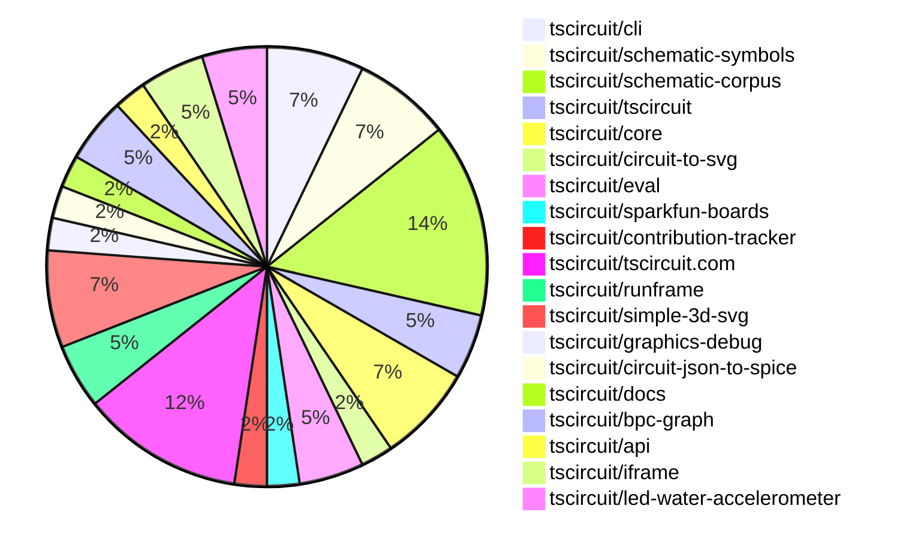
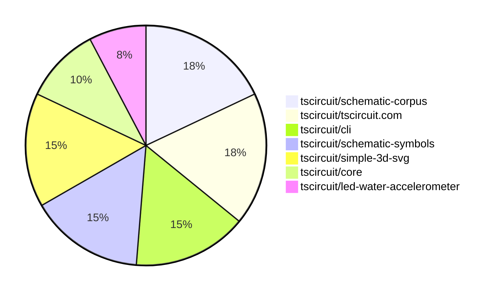

# Contribution Overview 2025-07-16

## PRs by Repository

## Contributor Overview

| Contributor | 🐳 Major | 🐙 Minor | 🐌 Tiny | ⭐ | Issues Created | Discussion Contributions |
|-------------|---------|---------|---------|-----|----------------|--------------------------|
| [seveibar](#seveibar) | 1 | 0 | 11 | ⭐⭐ | 0 | 0🔹 0🔶 0💎 |
| [Abse2001](#Abse2001) | 1 | 2 | 4 | ⭐⭐ | 0 | 0🔹 0🔶 0💎 |
| [MustafaMulla29](#MustafaMulla29) | 0 | 0 | 11 | ⭐ | 0 | 0🔹 0🔶 0💎 |
| [ArnavK-09](#ArnavK-09) | 0 | 2 | 4 | ⭐ | 0 | 0🔹 0🔶 0💎 |
| [techmannih](#techmannih) | 0 | 3 | 0 | ⭐ | 0 | 0🔹 0🔶 0💎 |
| [ShiboSoftwareDev](#ShiboSoftwareDev) | 0 | 0 | 1 | ⭐ | 0 | 0🔹 0🔶 0💎 |
| [imrishabh18](#imrishabh18) | 0 | 1 | 1 | ⭐ | 0 | 0🔹 0🔶 0💎 |

### Discussion Contribution Legend

- 🔹 Normal Comments: Basic participation with minimal effort
- 🔶 Great Informative Comments: Thoughtful participation that adds value
- 💎 Incredible Comments: Exceptional participation with high-quality content

## Review Table

[reviews-received-hover]: ## "Number of reviews received for PRs for this contributor"
[approvals-received-hover]: ## "Number of approvals received for PRs this contributor authored"
[rejections-received-hover]: ## "Number of rejections received for PRs this contributor authored"
[prs-opened-hover]: ## "Number of PRs opened by this contributor"
[issues-created-hover]: ## "Number of issues created by this contributor"
[bountied-issues-hover]: ## "Number of issues this contributor created with a bounty"
[bountied-issue-$-hover]: ## "Total bounty amount placed on issues authored by this contributor"

| Contributor | Reviews Received | Approvals Received | Rejections Received | Approvals | Rejections | PRs Opened | PRs Merged | Issues Created | Bountied Issues | Bountied Issue $ |
|---|---|---|---|---|---|---|---|---|---|---|
| [MustafaMulla29](#MustafaMulla29) | 10 | 9 | 0 | 0 | 0 | 14 | 11 | 0 | 0 | 0 |
| [Abse2001](#Abse2001) | 9 | 7 | 0 | 4 | 0 | 8 | 7 | 0 | 0 | 0 |
| [seveibar](#seveibar) | 6 | 0 | 0 | 18 | 0 | 15 | 12 | 0 | 0 | 0 |
| [techmannih](#techmannih) | 4 | 3 | 0 | 0 | 0 | 3 | 3 | 0 | 0 | 0 |
| [ShiboSoftwareDev](#ShiboSoftwareDev) | 1 | 1 | 0 | 4 | 0 | 1 | 1 | 0 | 0 | 0 |
| [graphite-app[bot]](#graphite-app[bot]) | 0 | 0 | 0 | 0 | 0 | 0 | 0 | 0 | 0 | 0 |
| [imrishabh18](#imrishabh18) | 0 | 0 | 0 | 1 | 0 | 2 | 2 | 0 | 0 | 0 |
| [abimaelmartell](#abimaelmartell) | 0 | 0 | 0 | 0 | 0 | 1 | 0 | 0 | 0 | 0 |
| [ArnavK-09](#ArnavK-09) | 10 | 7 | 0 | 0 | 0 | 9 | 6 | 0 | 0 | 0 |
| [tscircuitbot](#tscircuitbot) | 0 | 0 | 0 | 0 | 0 | 4 | 0 | 0 | 0 | 0 |
| [cursor[bot]](#cursor[bot]) | 0 | 0 | 0 | 0 | 0 | 0 | 0 | 0 | 0 | 0 |
| [andrii-balitskyi](#andrii-balitskyi) | 0 | 0 | 0 | 0 | 0 | 1 | 0 | 0 | 0 | 0 |

## Top 7 Repositories by Contribution Points

## Changes by Repository

### [tscircuit/cli](https://github.com/tscircuit/cli)

| PR # | Impact | Rating | Contributor | Description |
|------|--------|--------|-------------|-------------|
| [#281](https://github.com/tscircuit/cli/pull/281) | 🐳 Major | ⭐⭐⭐ | Abse2001 | Introduces image-based visual diffing to enhance the reliability of snapshot verification in the CLI tool. |

🌠Tiny Contributions (2)

| PR # | Impact | Contributor | Description |
|------|--------|-------------|-------------|
| [#282](https://github.com/tscircuit/cli/pull/282) | 🐌 Tiny | Abse2001 | Fixes the static import of the looks-same library to ensure it is correctly imported and utilized in the snapshot comparison functionality. |
| [#284](https://github.com/tscircuit/cli/pull/284) | 🐌 Tiny | MustafaMulla29 | Updates the tscircuit dependency version from 0.0.540 to 0.0.546 in package.json to incorporate the latest changes and improvements from the tscircuit library. |

### [tscircuit/schematic-symbols](https://github.com/tscircuit/schematic-symbols)

| PR # | Impact | Rating | Contributor | Description |
|------|--------|--------|-------------|-------------|
| [#334](https://github.com/tscircuit/schematic-symbols/pull/334) | 🐙 Minor | ⭐⭐ | Abse2001 | Refactors the symbol generation script and updates text anchor positioning logic to allow for more precise placement of text in schematic symbols. |
| [#336](https://github.com/tscircuit/schematic-symbols/pull/336) | 🐙 Minor | ⭐⭐ | techmannih | Adds alternative pin labels (Base, Emitter, Collector) to NPN and PNP bipolar transistor symbols for better clarity and usability. |
| [#335](https://github.com/tscircuit/schematic-symbols/pull/335) | 🐙 Minor | ⭐⭐ | techmannih | Fixes pin numbering for PNP and NPN bipolar transistors to adhere to a clockwise convention, ensuring consistency in schematic representations. |

### [tscircuit/schematic-corpus](https://github.com/tscircuit/schematic-corpus)

| PR # | Impact | Rating | Contributor | Description |
|------|--------|--------|-------------|-------------|
| [#95](https://github.com/tscircuit/schematic-corpus/pull/95) | 🐙 Minor | ⭐⭐ | Abse2001 | Introduces a GitHub star button and a mobile-friendly burger menu for navigation, enhancing user interaction and accessibility on both site and mobile views. |

🌠Tiny Contributions (5)

| PR # | Impact | Contributor | Description |
|------|--------|-------------|-------------|
| [#94](https://github.com/tscircuit/schematic-corpus/pull/94) | 🐌 Tiny | Abse2001 | Updates the tscircuit dependency version from 0.0.532 to 0.0.546 in package.json. |
| [#98](https://github.com/tscircuit/schematic-corpus/pull/98) | 🐌 Tiny | MustafaMulla29 | Adds a new circuit design (design63) to enhance the autorouting algorithm by providing a new schematic and component layout. |
| [#97](https://github.com/tscircuit/schematic-corpus/pull/97) | 🐌 Tiny | MustafaMulla29 | Adds a new design (design62) to the schematic corpus, which is intended to enhance the autorouting algorithm. |
| [#96](https://github.com/tscircuit/schematic-corpus/pull/96) | 🐌 Tiny | MustafaMulla29 | Adds a new design (design61) to the schematic corpus, which is intended to enhance the autorouting algorithm. |
| [#89](https://github.com/tscircuit/schematic-corpus/pull/89) | 🐌 Tiny | MustafaMulla29 | Adds a new circuit design (design60) to enhance the autorouting algorithms performance and capabilities. |

### [tscircuit/tscircuit](https://github.com/tscircuit/tscircuit)

🌠Tiny Contributions (2)

| PR # | Impact | Contributor | Description |
|------|--------|-------------|-------------|
| [#709](https://github.com/tscircuit/tscircuit/pull/709) | 🐌 Tiny | Abse2001 | Updates the CLI dependency version from 0.1.175 to 0.1.176 in package.json |
| [#708](https://github.com/tscircuit/tscircuit/pull/708) | 🐌 Tiny | MustafaMulla29 | Updates the version of the tscircuiteval package from 0.0.260 to 0.0.261 in package.json. |

### [tscircuit/core](https://github.com/tscircuit/core)

| PR # | Impact | Rating | Contributor | Description |
|------|--------|--------|-------------|-------------|
| [#1077](https://github.com/tscircuit/core/pull/1077) | 🐙 Minor | ⭐⭐ | techmannih | Fixes pin aliases for transistors to use standard labels (collector, emitter, base) in connections, ensuring correct schematic representation. |

🌠Tiny Contributions (2)

| PR # | Impact | Contributor | Description |
|------|--------|-------------|-------------|
| [#1079](https://github.com/tscircuit/core/pull/1079) | 🐌 Tiny | Abse2001 | Adds a test case that reproduces a bug related to externally connected pins in circuit designs. |
| [#1076](https://github.com/tscircuit/core/pull/1076) | 🐌 Tiny | MustafaMulla29 | Updates the footprinter dependency to version 0.0.203 to support the _textbottom flag for 0603 components. |

### [tscircuit/circuit-to-svg](https://github.com/tscircuit/circuit-to-svg)

🌠Tiny Contributions (1)

| PR # | Impact | Contributor | Description |
|------|--------|-------------|-------------|
| [#287](https://github.com/tscircuit/circuit-to-svg/pull/287) | 🐌 Tiny | MustafaMulla29 | Updates the footprinter dependency to version 0.0.203, enabling support for the _textbottom flag. |

### [tscircuit/eval](https://github.com/tscircuit/eval)

🌠Tiny Contributions (2)

| PR # | Impact | Contributor | Description |
|------|--------|-------------|-------------|
| [#709](https://github.com/tscircuit/eval/pull/709) | 🐌 Tiny | MustafaMulla29 | Updates the version of the tscircuitfootprinter dependency from 0.0.193 to 0.0.203 in package.json. |
| [#707](https://github.com/tscircuit/eval/pull/707) | 🐌 Tiny | MustafaMulla29 | Updates the tscircuitcore dependency to version 0.0.571 in package.json. |

### [tscircuit/sparkfun-boards](https://github.com/tscircuit/sparkfun-boards)

🌠Tiny Contributions (1)

| PR # | Impact | Contributor | Description |
|------|--------|-------------|-------------|
| [#74](https://github.com/tscircuit/sparkfun-boards/pull/74) | 🐌 Tiny | MustafaMulla29 | Updates the tscircuit dependency version from 0.0.541 to 0.0.543 in package.json. |

### [tscircuit/contribution-tracker](https://github.com/tscircuit/contribution-tracker)

🌠Tiny Contributions (1)

| PR # | Impact | Contributor | Description |
|------|--------|-------------|-------------|
| [#202](https://github.com/tscircuit/contribution-tracker/pull/202) | 🐌 Tiny | ShiboSoftwareDev | Adds functionality to fetch and parse the CODEOWNERS file from the root or .github directory, improving code ownership management. |

### [tscircuit/tscircuit.com](https://github.com/tscircuit/tscircuit.com)

| PR # | Impact | Rating | Contributor | Description |
|------|--------|--------|-------------|-------------|
| [#1481](https://github.com/tscircuit/tscircuit.com/pull/1481) | 🐙 Minor | ⭐⭐ | ArnavK-09 | Prevents the entire page from loading when rendering the 3D preview by implementing a Suspense fallback for the CadViewer component. |
| [#1475](https://github.com/tscircuit/tscircuit.com/pull/1475) | 🐙 Minor | ⭐⭐ | ArnavK-09 | Replaces plain text loading indicator with animated placeholders in ShikiCodeViewer for improved user experience during loading states. |

🌠Tiny Contributions (3)

| PR # | Impact | Contributor | Description |
|------|--------|-------------|-------------|
| [#1484](https://github.com/tscircuit/tscircuit.com/pull/1484) | 🐌 Tiny | ArnavK-09 | Removes a line that causes an error during the JLCPCB import process, preventing the failure of file creation. |
| [#1479](https://github.com/tscircuit/tscircuit.com/pull/1479) | 🐌 Tiny | ArnavK-09 | Fixes the jlcpcb import functionality by correcting the fetch request headers and method handling in the CodeEditorHeader component. |
| [#1476](https://github.com/tscircuit/tscircuit.com/pull/1476) | 🐌 Tiny | ArnavK-09 | Adds session token validation for importing components from jlcpcb, ensuring users are logged in before proceeding with the import. |

### [tscircuit/runframe](https://github.com/tscircuit/runframe)

🌠Tiny Contributions (2)

| PR # | Impact | Contributor | Description |
|------|--------|-------------|-------------|
| [#887](https://github.com/tscircuit/runframe/pull/887) | 🐌 Tiny | ArnavK-09 | Adjusted the width of the dialog content for better responsiveness. Improved text sizes and spacing for dialog titles, descriptions, and buttons. Enhanced the layout of search results and component details for better usability. Updated styles for various elements to ensure consistency across different screen sizes. Fixed minor layout issues in the component details dialog for improved visual clarity. fix black background issue |
| [#885](https://github.com/tscircuit/runframe/pull/885) | 🐌 Tiny | seveibar | Add availableTabs and defaultTab props to RunFrame, forward props to CircuitJsonPreview, support availableTabsdefaultTab in preview and standalone preview, document the new props in README. |

### [tscircuit/simple-3d-svg](https://github.com/tscircuit/simple-3d-svg)

| PR # | Impact | Rating | Contributor | Description |
|------|--------|--------|-------------|-------------|
| [#45](https://github.com/tscircuit/simple-3d-svg/pull/45) | 🐳 Major | ⭐⭐⭐ | seveibar | Adds optional parameters showAxes, showOrigin, and showGrid to the renderScene function, enabling the rendering of a small XYZ axis guide and origin lines in the SVG output. |

🌠Tiny Contributions (2)

| PR # | Impact | Contributor | Description |
|------|--------|-------------|-------------|
| [#47](https://github.com/tscircuit/simple-3d-svg/pull/47) | 🐌 Tiny | seveibar | Transforms STL model coordinates from Z-up to Y-up by applying a rotation, ensuring compatibility with Y-up systems. |
| [#46](https://github.com/tscircuit/simple-3d-svg/pull/46) | 🐌 Tiny | seveibar | Adds gradient fading to axis lines in the SVG rendering of the origin, enhancing visual clarity. |

### [tscircuit/graphics-debug](https://github.com/tscircuit/graphics-debug)

🌠Tiny Contributions (1)

| PR # | Impact | Contributor | Description |
|------|--------|-------------|-------------|
| [#70](https://github.com/tscircuit/graphics-debug/pull/70) | 🐌 Tiny | seveibar | Adds documentation for the usage of the InteractiveGraphics component from the graphics-debugreact package. |

### [tscircuit/circuit-json-to-spice](https://github.com/tscircuit/circuit-json-to-spice)

🌠Tiny Contributions (1)

| PR # | Impact | Contributor | Description |
|------|--------|-------------|-------------|
| [#5](https://github.com/tscircuit/circuit-json-to-spice/pull/5) | 🐌 Tiny | seveibar | Adds integration tests for the EEcircuit-engine to ensure proper simulation of circuit components. |

### [tscircuit/docs](https://github.com/tscircuit/docs)

🌠Tiny Contributions (1)

| PR # | Impact | Contributor | Description |
|------|--------|-------------|-------------|
| [#101](https://github.com/tscircuit/docs/pull/101) | 🐌 Tiny | seveibar | Adds documentation for the compile.tscircuit.com API, detailing usage, endpoints, and examples for compiling tscircuit user code into Circuit JSON. |

### [tscircuit/bpc-graph](https://github.com/tscircuit/bpc-graph)

🌠Tiny Contributions (2)

| PR # | Impact | Contributor | Description |
|------|--------|-------------|-------------|
| [#68](https://github.com/tscircuit/bpc-graph/pull/68) | 🐌 Tiny | seveibar | Adds documentation for layoutSchematic and layoutSchematicWithInputVariants functions in the README.md file. |
| [#66](https://github.com/tscircuit/bpc-graph/pull/66) | 🐌 Tiny | seveibar | Removes tscircuitschematic-corpus as a peer dependency from the package.json file. |

### [tscircuit/api](https://github.com/tscircuit/api)

🌠Tiny Contributions (1)

| PR # | Impact | Contributor | Description |
|------|--------|-------------|-------------|
| [#5](https://github.com/tscircuit/api/pull/5) | 🐌 Tiny | seveibar | Adds a new API client method for compiling user code into Circuit JSON format via client.compile.compileCode, along with documentation and tests for this functionality. |

### [tscircuit/iframe](https://github.com/tscircuit/iframe)

🌠Tiny Contributions (2)

| PR # | Impact | Contributor | Description |
|------|--------|-------------|-------------|
| [#3](https://github.com/tscircuit/iframe/pull/3) | 🐌 Tiny | seveibar | Documents the props of the TscircuitIframe component in the README file. |
| [#2](https://github.com/tscircuit/iframe/pull/2) | 🐌 Tiny | seveibar | Adds error handling events and additional properties to the TscircuitIframe component, enhancing its functionality for user interaction and error management. |

### [tscircuit/led-water-accelerometer](https://github.com/tscircuit/led-water-accelerometer)

| PR # | Impact | Rating | Contributor | Description |
|------|--------|--------|-------------|-------------|
| [#7](https://github.com/tscircuit/led-water-accelerometer/pull/7) | 🐙 Minor | ⭐⭐ | imrishabh18 | Adds firmware to control a NeoPixel LED matrix for displaying animated text and patterns, specifically for the tscircuit logo. |

🌠Tiny Contributions (1)

| PR # | Impact | Contributor | Description |
|------|--------|-------------|-------------|
| [#6](https://github.com/tscircuit/led-water-accelerometer/pull/6) | 🐌 Tiny | imrishabh18 | Adds functionality to support vertical flipping in the water simulation, allowing for more accurate representation of gravity effects on the LED display. |

## Changes by Contributor

### [Abse2001](https://github.com/Abse2001)

| PRs # | Impact | Rating | Description |
|------|--------|--------|-------------|
| [#281](https://github.com/tscircuit/cli/pull/281) | 🐳 Major | ⭐⭐⭐ | Introduces image-based visual diffing to enhance the reliability of snapshot verification in the CLI tool. |
| [#334](https://github.com/tscircuit/schematic-symbols/pull/334) | 🐙 Minor | ⭐⭐ | Refactors the symbol generation script and updates text anchor positioning logic to allow for more precise placement of text in schematic symbols. |
| [#95](https://github.com/tscircuit/schematic-corpus/pull/95) | 🐙 Minor | ⭐⭐ | Introduces a GitHub star button and a mobile-friendly burger menu for navigation, enhancing user interaction and accessibility on both site and mobile views. |

🌠Tiny Contributions (4)

| PR # | Impact | Description |
|------|--------|-------------|
| [#709](https://github.com/tscircuit/tscircuit/pull/709) | 🐌 Tiny | Updates the CLI dependency version from 0.1.175 to 0.1.176 in package.json |
| [#1079](https://github.com/tscircuit/core/pull/1079) | 🐌 Tiny | Adds a test case that reproduces a bug related to externally connected pins in circuit designs. |
| [#282](https://github.com/tscircuit/cli/pull/282) | 🐌 Tiny | Fixes the static import of the looks-same library to ensure it is correctly imported and utilized in the snapshot comparison functionality. |
| [#94](https://github.com/tscircuit/schematic-corpus/pull/94) | 🐌 Tiny | Updates the tscircuit dependency version from 0.0.532 to 0.0.546 in package.json. |

### [MustafaMulla29](https://github.com/MustafaMulla29)

🌠Tiny Contributions (11)

| PR # | Impact | Description |
|------|--------|-------------|
| [#708](https://github.com/tscircuit/tscircuit/pull/708) | 🐌 Tiny | Updates the version of the tscircuiteval package from 0.0.260 to 0.0.261 in package.json. |
| [#1076](https://github.com/tscircuit/core/pull/1076) | 🐌 Tiny | Updates the footprinter dependency to version 0.0.203 to support the _textbottom flag for 0603 components. |
| [#287](https://github.com/tscircuit/circuit-to-svg/pull/287) | 🐌 Tiny | Updates the footprinter dependency to version 0.0.203, enabling support for the _textbottom flag. |
| [#709](https://github.com/tscircuit/eval/pull/709) | 🐌 Tiny | Updates the version of the tscircuitfootprinter dependency from 0.0.193 to 0.0.203 in package.json. |
| [#707](https://github.com/tscircuit/eval/pull/707) | 🐌 Tiny | Updates the tscircuitcore dependency to version 0.0.571 in package.json. |
| [#284](https://github.com/tscircuit/cli/pull/284) | 🐌 Tiny | Updates the tscircuit dependency version from 0.0.540 to 0.0.546 in package.json to incorporate the latest changes and improvements from the tscircuit library. |
| [#74](https://github.com/tscircuit/sparkfun-boards/pull/74) | 🐌 Tiny | Updates the tscircuit dependency version from 0.0.541 to 0.0.543 in package.json. |
| [#98](https://github.com/tscircuit/schematic-corpus/pull/98) | 🐌 Tiny | Adds a new circuit design (design63) to enhance the autorouting algorithm by providing a new schematic and component layout. |
| [#97](https://github.com/tscircuit/schematic-corpus/pull/97) | 🐌 Tiny | Adds a new design (design62) to the schematic corpus, which is intended to enhance the autorouting algorithm. |
| [#96](https://github.com/tscircuit/schematic-corpus/pull/96) | 🐌 Tiny | Adds a new design (design61) to the schematic corpus, which is intended to enhance the autorouting algorithm. |
| [#89](https://github.com/tscircuit/schematic-corpus/pull/89) | 🐌 Tiny | Adds a new circuit design (design60) to enhance the autorouting algorithms performance and capabilities. |

### [techmannih](https://github.com/techmannih)

| PRs # | Impact | Rating | Description |
|------|--------|--------|-------------|
| [#1077](https://github.com/tscircuit/core/pull/1077) | 🐙 Minor | ⭐⭐ | Fixes pin aliases for transistors to use standard labels (collector, emitter, base) in connections, ensuring correct schematic representation. |
| [#336](https://github.com/tscircuit/schematic-symbols/pull/336) | 🐙 Minor | ⭐⭐ | Adds alternative pin labels (Base, Emitter, Collector) to NPN and PNP bipolar transistor symbols for better clarity and usability. |
| [#335](https://github.com/tscircuit/schematic-symbols/pull/335) | 🐙 Minor | ⭐⭐ | Fixes pin numbering for PNP and NPN bipolar transistors to adhere to a clockwise convention, ensuring consistency in schematic representations. |

### [ShiboSoftwareDev](https://github.com/ShiboSoftwareDev)

🌠Tiny Contributions (1)

| PR # | Impact | Description |
|------|--------|-------------|
| [#202](https://github.com/tscircuit/contribution-tracker/pull/202) | 🐌 Tiny | Adds functionality to fetch and parse the CODEOWNERS file from the root or .github directory, improving code ownership management. |

### [ArnavK-09](https://github.com/ArnavK-09)

| PRs # | Impact | Rating | Description |
|------|--------|--------|-------------|
| [#1481](https://github.com/tscircuit/tscircuit.com/pull/1481) | 🐙 Minor | ⭐⭐ | Prevents the entire page from loading when rendering the 3D preview by implementing a Suspense fallback for the CadViewer component. |
| [#1475](https://github.com/tscircuit/tscircuit.com/pull/1475) | 🐙 Minor | ⭐⭐ | Replaces plain text loading indicator with animated placeholders in ShikiCodeViewer for improved user experience during loading states. |

🌠Tiny Contributions (4)

| PR # | Impact | Description |
|------|--------|-------------|
| [#1484](https://github.com/tscircuit/tscircuit.com/pull/1484) | 🐌 Tiny | Removes a line that causes an error during the JLCPCB import process, preventing the failure of file creation. |
| [#1479](https://github.com/tscircuit/tscircuit.com/pull/1479) | 🐌 Tiny | Fixes the jlcpcb import functionality by correcting the fetch request headers and method handling in the CodeEditorHeader component. |
| [#1476](https://github.com/tscircuit/tscircuit.com/pull/1476) | 🐌 Tiny | Adds session token validation for importing components from jlcpcb, ensuring users are logged in before proceeding with the import. |
| [#887](https://github.com/tscircuit/runframe/pull/887) | 🐌 Tiny | Adjusted the width of the dialog content for better responsiveness. Improved text sizes and spacing for dialog titles, descriptions, and buttons. Enhanced the layout of search results and component details for better usability. Updated styles for various elements to ensure consistency across different screen sizes. Fixed minor layout issues in the component details dialog for improved visual clarity. fix black background issue |

### [seveibar](https://github.com/seveibar)

| PRs # | Impact | Rating | Description |
|------|--------|--------|-------------|
| [#45](https://github.com/tscircuit/simple-3d-svg/pull/45) | 🐳 Major | ⭐⭐⭐ | Adds optional parameters showAxes, showOrigin, and showGrid to the renderScene function, enabling the rendering of a small XYZ axis guide and origin lines in the SVG output. |

🌠Tiny Contributions (11)

| PR # | Impact | Description |
|------|--------|-------------|
| [#70](https://github.com/tscircuit/graphics-debug/pull/70) | 🐌 Tiny | Adds documentation for the usage of the InteractiveGraphics component from the graphics-debugreact package. |
| [#5](https://github.com/tscircuit/circuit-json-to-spice/pull/5) | 🐌 Tiny | Adds integration tests for the EEcircuit-engine to ensure proper simulation of circuit components. |
| [#885](https://github.com/tscircuit/runframe/pull/885) | 🐌 Tiny | Add availableTabs and defaultTab props to RunFrame, forward props to CircuitJsonPreview, support availableTabsdefaultTab in preview and standalone preview, document the new props in README. |
| [#101](https://github.com/tscircuit/docs/pull/101) | 🐌 Tiny | Adds documentation for the compile.tscircuit.com API, detailing usage, endpoints, and examples for compiling tscircuit user code into Circuit JSON. |
| [#47](https://github.com/tscircuit/simple-3d-svg/pull/47) | 🐌 Tiny | Transforms STL model coordinates from Z-up to Y-up by applying a rotation, ensuring compatibility with Y-up systems. |
| [#46](https://github.com/tscircuit/simple-3d-svg/pull/46) | 🐌 Tiny | Adds gradient fading to axis lines in the SVG rendering of the origin, enhancing visual clarity. |
| [#68](https://github.com/tscircuit/bpc-graph/pull/68) | 🐌 Tiny | Adds documentation for layoutSchematic and layoutSchematicWithInputVariants functions in the README.md file. |
| [#66](https://github.com/tscircuit/bpc-graph/pull/66) | 🐌 Tiny | Removes tscircuitschematic-corpus as a peer dependency from the package.json file. |
| [#5](https://github.com/tscircuit/api/pull/5) | 🐌 Tiny | Adds a new API client method for compiling user code into Circuit JSON format via client.compile.compileCode, along with documentation and tests for this functionality. |
| [#3](https://github.com/tscircuit/iframe/pull/3) | 🐌 Tiny | Documents the props of the TscircuitIframe component in the README file. |
| [#2](https://github.com/tscircuit/iframe/pull/2) | 🐌 Tiny | Adds error handling events and additional properties to the TscircuitIframe component, enhancing its functionality for user interaction and error management. |

### [imrishabh18](https://github.com/imrishabh18)

| PRs # | Impact | Rating | Description |
|------|--------|--------|-------------|
| [#7](https://github.com/tscircuit/led-water-accelerometer/pull/7) | 🐙 Minor | ⭐⭐ | Adds firmware to control a NeoPixel LED matrix for displaying animated text and patterns, specifically for the tscircuit logo. |

🌠Tiny Contributions (1)

| PR # | Impact | Description |
|------|--------|-------------|
| [#6](https://github.com/tscircuit/led-water-accelerometer/pull/6) | 🐌 Tiny | Adds functionality to support vertical flipping in the water simulation, allowing for more accurate representation of gravity effects on the LED display. |

## Repository Owners

| Repository | Codeowners |
|------------|------------|
| [sparkfun-boards](https://github.com/tscircuit/sparkfun-boards/blob/main/.github/CODEOWNERS) | [MustafaMulla29](https://github.com/MustafaMulla29) |
| [schematic-corpus](https://github.com/tscircuit/schematic-corpus/blob/main/.github/CODEOWNERS) | [Abse2001](https://github.com/Abse2001) |
| [schematic-symbols](https://github.com/tscircuit/schematic-symbols/blob/main/.github/CODEOWNERS) | [techmannih](https://github.com/techmannih) |

## Repos by Owner

| User | Repo |
|------|------|
| [MustafaMulla29](https://github.com/MustafaMulla29) | [sparkfun-boards](https://github.com/tscircuit/sparkfun-boards/blob/main/.github/CODEOWNERS) |
| [Abse2001](https://github.com/Abse2001) | [schematic-corpus](https://github.com/tscircuit/schematic-corpus/blob/main/.github/CODEOWNERS) |
| [techmannih](https://github.com/techmannih) | [schematic-symbols](https://github.com/tscircuit/schematic-symbols/blob/main/.github/CODEOWNERS) |

