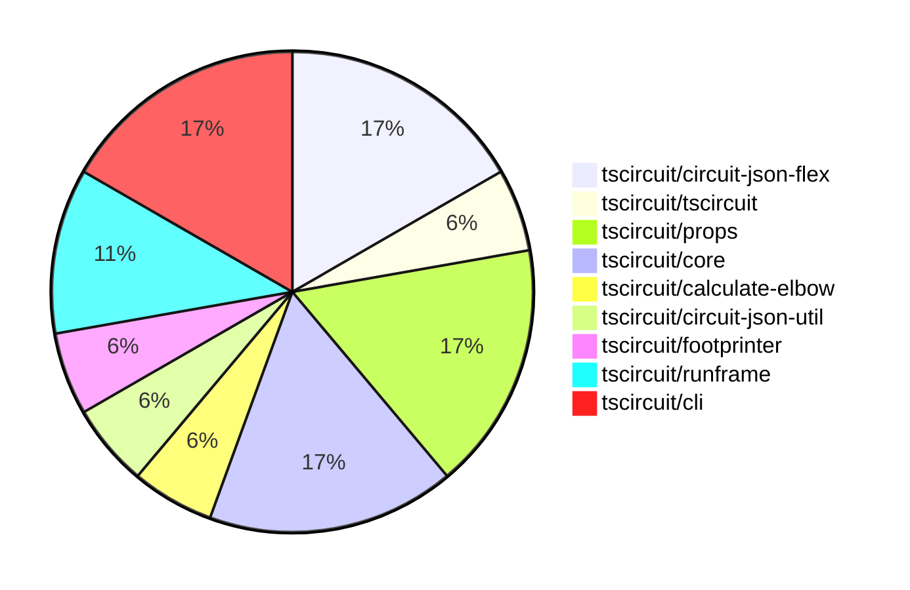
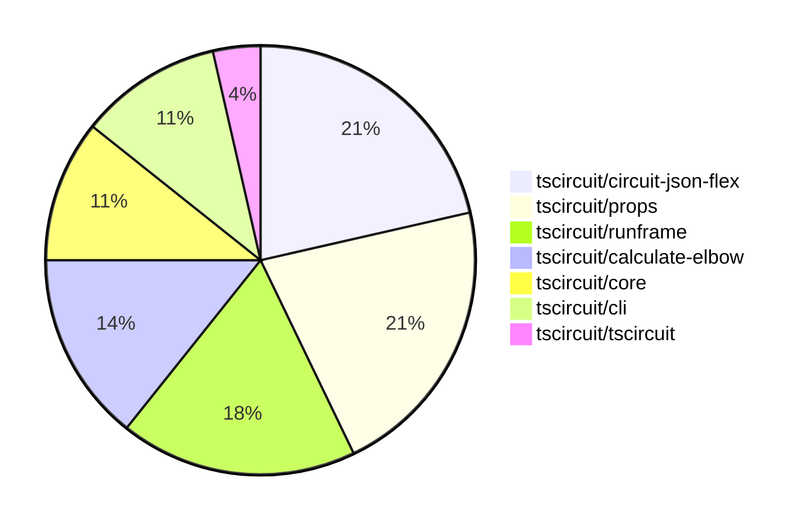

# Contribution Overview 2025-07-23

## PRs by Repository

## Contributor Overview

| Contributor | 🐳 Major | 🐙 Minor | 🐌 Tiny | ⭐ | Issues Created | Discussion Contributions |
|-------------|---------|---------|---------|-----|----------------|--------------------------|
| [seveibar](#seveibar) | 2 | 0 | 3 | ⭐⭐ | 0 | 0🔹 0🔶 0💎 |
| [imrishabh18](#imrishabh18) | 1 | 0 | 6 | ⭐ | 0 | 0🔹 0🔶 0💎 |
| [ArnavK-09](#ArnavK-09) | 1 | 0 | 4 | ⭐ | 0 | 0🔹 0🔶 0💎 |
| [techmannih](#techmannih) | 0 | 0 | 1 |  | 0 | 0🔹 0🔶 0💎 |

### Discussion Contribution Legend

- 🔹 Normal Comments: Basic participation with minimal effort
- 🔶 Great Informative Comments: Thoughtful participation that adds value
- 💎 Incredible Comments: Exceptional participation with high-quality content

## Review Table

[reviews-received-hover]: ## "Number of reviews received for PRs for this contributor"
[approvals-received-hover]: ## "Number of approvals received for PRs this contributor authored"
[rejections-received-hover]: ## "Number of rejections received for PRs this contributor authored"
[prs-opened-hover]: ## "Number of PRs opened by this contributor"
[issues-created-hover]: ## "Number of issues created by this contributor"
[bountied-issues-hover]: ## "Number of issues this contributor created with a bounty"
[bountied-issue-$-hover]: ## "Total bounty amount placed on issues authored by this contributor"

| Contributor | Reviews Received | Approvals Received | Rejections Received | Approvals | Rejections | PRs Opened | PRs Merged | Score | Issues Created | Bountied Issues | Bountied Issue $ |
|---|---|---|---|---|---|---|---|---|---|---|---|
| [imrishabh18](#imrishabh18) | 3 | 3 | 0 | 0 | 0 | 7 | 7 | 9.5 | 0 | 0 | 0 |
| [seveibar](#seveibar) | 2 | 0 | 0 | 11 | 0 | 5 | 5 | 20 | 0 | 0 | 0 |
| [cursor[bot]](#cursor[bot]) | 0 | 0 | 0 | 0 | 0 | 0 | 0 | 0 | 0 | 0 | 0 |
| [techmannih](#techmannih) | 4 | 2 | 0 | 0 | 0 | 1 | 1 | 1 | 0 | 0 | 0 |
| [graphite-app[bot]](#graphite-app[bot]) | 0 | 0 | 0 | 0 | 0 | 0 | 0 | 0 | 0 | 0 | 0 |
| [ShiboSoftwareDev](#ShiboSoftwareDev) | 0 | 0 | 0 | 1 | 0 | 0 | 0 | 0 | 0 | 0 | 0 |
| [abimaelmartell](#abimaelmartell) | 0 | 0 | 0 | 0 | 0 | 1 | 0 | 0 | 0 | 0 | 0 |
| [ArnavK-09](#ArnavK-09) | 8 | 6 | 0 | 0 | 0 | 7 | 6 | 7 | 0 | 0 | 0 |
| [Abse2001](#Abse2001) | 0 | 0 | 0 | 0 | 0 | 1 | 0 | 0 | 0 | 0 | 0 |
| [tscircuitbot](#tscircuitbot) | 0 | 0 | 0 | 0 | 0 | 6 | 0 | 0 | 0 | 0 | 0 |
| [MustafaMulla29](#MustafaMulla29) | 1 | 1 | 0 | 0 | 0 | 3 | 0 | 0 | 0 | 0 | 0 |

## Top 7 Repositories by Contribution Points

## Changes by Repository

### [tscircuit/circuit-json-flex](https://github.com/tscircuit/circuit-json-flex)

| PR # | Impact | Rating | Contributor | Description |
|------|--------|--------|-------------|-------------|
| [#2](https://github.com/tscircuit/circuit-json-flex/pull/2) | 🐳 Major | ⭐⭐⭐ | imrishabh18 | Introduces a layout function that arranges PCB components using a flex-box algorithm, allowing for dynamic positioning within a specified container. |

🐌 Tiny Contributions (2)

| PR # | Impact | Contributor | Description |
|------|--------|-------------|-------------|
| [#4](https://github.com/tscircuit/circuit-json-flex/pull/4) | 🐌 Tiny | imrishabh18 | Adds a build script to the package.json for building the project using tsup-node, facilitating the release process. |
| [#3](https://github.com/tscircuit/circuit-json-flex/pull/3) | 🐌 Tiny | imrishabh18 | Adds support for subcircuit groups in the layout of circuit JSON, allowing for better organization and rendering of PCB components within groups. |

### [tscircuit/tscircuit](https://github.com/tscircuit/tscircuit)

🐌 Tiny Contributions (1)

| PR # | Impact | Contributor | Description |
|------|--------|-------------|-------------|
| [#714](https://github.com/tscircuit/tscircuit/pull/714) | 🐌 Tiny | imrishabh18 | Updates the version of the tscircuitcore dependency from 0.0.574 to 0.0.576 in package.json. |

### [tscircuit/props](https://github.com/tscircuit/props)

| PR # | Impact | Rating | Contributor | Description |
|------|--------|--------|-------------|-------------|
| [#331](https://github.com/tscircuit/props/pull/331) | 🐳 Major | ⭐⭐⭐ | seveibar | Summary add area options and square sizing to subcircuitGroupProps move board dimension properties into subcircuitGroupProps simplify BoardProps and update generated docs  Testing bun test testsboard.test.ts bun test testsstampboard.test.ts bun test tests |

🐌 Tiny Contributions (2)

| PR # | Impact | Contributor | Description |
|------|--------|-------------|-------------|
| [#333](https://github.com/tscircuit/props/pull/333) | 🐌 Tiny | imrishabh18 | Adds additional justifyContent values (space-between, space-around, space-evenly) to the layout configuration for improved layout options. |
| [#332](https://github.com/tscircuit/props/pull/332) | 🐌 Tiny | seveibar | Adds new layout properties for packing strategy in layout configuration. |

### [tscircuit/core](https://github.com/tscircuit/core)

🐌 Tiny Contributions (3)

| PR # | Impact | Contributor | Description |
|------|--------|-------------|-------------|
| [#1088](https://github.com/tscircuit/core/pull/1088) | 🐌 Tiny | imrishabh18 | Adds support for a new PCB layout mode called flex in the Group component, allowing for flexible layout configurations. |
| [#1085](https://github.com/tscircuit/core/pull/1085) | 🐌 Tiny | imrishabh18 | Allows the width and height of the pcb_group to be set via props, enabling more flexible layout configurations. |
| [#1087](https://github.com/tscircuit/core/pull/1087) | 🐌 Tiny | seveibar | Adds PCB packing functionality by implementing a new packing layout strategy for components on the PCB. |

### [tscircuit/calculate-elbow](https://github.com/tscircuit/calculate-elbow)

| PR # | Impact | Rating | Contributor | Description |
|------|--------|--------|-------------|-------------|
| [#4](https://github.com/tscircuit/calculate-elbow/pull/4) | 🐳 Major | ⭐⭐⭐ | seveibar | Fixes elbow calculation for x- to y cases when the start is right and above the destination by overshooting, adds a test for this scenario, and updates the tsdown dependency to the latest version. |

### [tscircuit/circuit-json-util](https://github.com/tscircuit/circuit-json-util)

🐌 Tiny Contributions (1)

| PR # | Impact | Contributor | Description |
|------|--------|-------------|-------------|
| [#40](https://github.com/tscircuit/circuit-json-util/pull/40) | 🐌 Tiny | seveibar | Adds a utility function repositionPcbComponentTo for moving PCB components and their children to a new center in the circuit JSON structure. |

### [tscircuit/footprinter](https://github.com/tscircuit/footprinter)

🐌 Tiny Contributions (1)

| PR # | Impact | Contributor | Description |
|------|--------|-------------|-------------|
| [#322](https://github.com/tscircuit/footprinter/pull/322) | 🐌 Tiny | techmannih | Adds a new footprint variant for JST-SH connectors, allowing for better integration of these components in PCB designs. |

### [tscircuit/runframe](https://github.com/tscircuit/runframe)

| PR # | Impact | Rating | Contributor | Description |
|------|--------|--------|-------------|-------------|
| [#898](https://github.com/tscircuit/runframe/pull/898) | 🐳 Major | ⭐⭐⭐ | ArnavK-09 | img width1847 height988 altimage srchttps:github.comuser-attachmentsassetse09727d3-52dc-413d-a701-0d41b629438a  https:github.comuser-attachmentsassets7139446f-7066-4594-8b9c-f40db8ac0acd |

🐌 Tiny Contributions (1)

| PR # | Impact | Contributor | Description |
|------|--------|-------------|-------------|
| [#908](https://github.com/tscircuit/runframe/pull/908) | 🐌 Tiny | ArnavK-09 | Fixes placeholder text in FileSelectorCombobox and refactors state variable names for clarity in file selection logic. |

### [tscircuit/cli](https://github.com/tscircuit/cli)

🐌 Tiny Contributions (3)

| PR # | Impact | Contributor | Description |
|------|--------|-------------|-------------|
| [#293](https://github.com/tscircuit/cli/pull/293) | 🐌 Tiny | ArnavK-09 | Updates the tscircuitrunframe dependency to version 0.0.722 to resolve development command issues. |
| [#292](https://github.com/tscircuit/cli/pull/292) | 🐌 Tiny | ArnavK-09 | Replaces hardcoded entrypoint path with dynamic retrieval using getEntrypoint function in the development command. |
| [#291](https://github.com/tscircuit/cli/pull/291) | 🐌 Tiny | ArnavK-09 | Updates the version of the runframe and other dependencies in the project. |

## Changes by Contributor

### [imrishabh18](https://github.com/imrishabh18)

| PRs # | Impact | Rating | Description |
|------|--------|--------|-------------|
| [#2](https://github.com/tscircuit/circuit-json-flex/pull/2) | 🐳 Major | ⭐⭐⭐ | Introduces a layout function that arranges PCB components using a flex-box algorithm, allowing for dynamic positioning within a specified container. |

🐌 Tiny Contributions (6)

| PR # | Impact | Description |
|------|--------|-------------|
| [#714](https://github.com/tscircuit/tscircuit/pull/714) | 🐌 Tiny | Updates the version of the tscircuitcore dependency from 0.0.574 to 0.0.576 in package.json. |
| [#333](https://github.com/tscircuit/props/pull/333) | 🐌 Tiny | Adds additional justifyContent values (space-between, space-around, space-evenly) to the layout configuration for improved layout options. |
| [#1088](https://github.com/tscircuit/core/pull/1088) | 🐌 Tiny | Adds support for a new PCB layout mode called flex in the Group component, allowing for flexible layout configurations. |
| [#1085](https://github.com/tscircuit/core/pull/1085) | 🐌 Tiny | Allows the width and height of the pcb_group to be set via props, enabling more flexible layout configurations. |
| [#4](https://github.com/tscircuit/circuit-json-flex/pull/4) | 🐌 Tiny | Adds a build script to the package.json for building the project using tsup-node, facilitating the release process. |
| [#3](https://github.com/tscircuit/circuit-json-flex/pull/3) | 🐌 Tiny | Adds support for subcircuit groups in the layout of circuit JSON, allowing for better organization and rendering of PCB components within groups. |

### [seveibar](https://github.com/seveibar)

| PRs # | Impact | Rating | Description |
|------|--------|--------|-------------|
| [#331](https://github.com/tscircuit/props/pull/331) | 🐳 Major | ⭐⭐⭐ | Summary add area options and square sizing to subcircuitGroupProps move board dimension properties into subcircuitGroupProps simplify BoardProps and update generated docs  Testing bun test testsboard.test.ts bun test testsstampboard.test.ts bun test tests |
| [#4](https://github.com/tscircuit/calculate-elbow/pull/4) | 🐳 Major | ⭐⭐⭐ | Fixes elbow calculation for x- to y cases when the start is right and above the destination by overshooting, adds a test for this scenario, and updates the tsdown dependency to the latest version. |

🐌 Tiny Contributions (3)

| PR # | Impact | Description |
|------|--------|-------------|
| [#40](https://github.com/tscircuit/circuit-json-util/pull/40) | 🐌 Tiny | Adds a utility function repositionPcbComponentTo for moving PCB components and their children to a new center in the circuit JSON structure. |
| [#332](https://github.com/tscircuit/props/pull/332) | 🐌 Tiny | Adds new layout properties for packing strategy in layout configuration. |
| [#1087](https://github.com/tscircuit/core/pull/1087) | 🐌 Tiny | Adds PCB packing functionality by implementing a new packing layout strategy for components on the PCB. |

### [techmannih](https://github.com/techmannih)

🐌 Tiny Contributions (1)

| PR # | Impact | Description |
|------|--------|-------------|
| [#322](https://github.com/tscircuit/footprinter/pull/322) | 🐌 Tiny | Adds a new footprint variant for JST-SH connectors, allowing for better integration of these components in PCB designs. |

### [ArnavK-09](https://github.com/ArnavK-09)

| PRs # | Impact | Rating | Description |
|------|--------|--------|-------------|
| [#898](https://github.com/tscircuit/runframe/pull/898) | 🐳 Major | ⭐⭐⭐ | img width1847 height988 altimage srchttps:github.comuser-attachmentsassetse09727d3-52dc-413d-a701-0d41b629438a  https:github.comuser-attachmentsassets7139446f-7066-4594-8b9c-f40db8ac0acd |

🐌 Tiny Contributions (4)

| PR # | Impact | Description |
|------|--------|-------------|
| [#908](https://github.com/tscircuit/runframe/pull/908) | 🐌 Tiny | Fixes placeholder text in FileSelectorCombobox and refactors state variable names for clarity in file selection logic. |
| [#293](https://github.com/tscircuit/cli/pull/293) | 🐌 Tiny | Updates the tscircuitrunframe dependency to version 0.0.722 to resolve development command issues. |
| [#292](https://github.com/tscircuit/cli/pull/292) | 🐌 Tiny | Replaces hardcoded entrypoint path with dynamic retrieval using getEntrypoint function in the development command. |
| [#291](https://github.com/tscircuit/cli/pull/291) | 🐌 Tiny | Updates the version of the runframe and other dependencies in the project. |

## Repository Owners

| Repository | Codeowners |
|------------|------------|
| [footprinter](https://github.com/tscircuit/footprinter/blob/main/.github/CODEOWNERS) | [techmannih](https://github.com/techmannih) |
| [cli](https://github.com/tscircuit/cli/blob/main/.github/CODEOWNERS) | [ArnavK-09](https://github.com/ArnavK-09) |

## Repos by Owner

| User | Repo |
|------|------|
| [techmannih](https://github.com/techmannih) | [footprinter](https://github.com/tscircuit/footprinter/blob/main/.github/CODEOWNERS) |
| [ArnavK-09](https://github.com/ArnavK-09) | [cli](https://github.com/tscircuit/cli/blob/main/.github/CODEOWNERS) |

