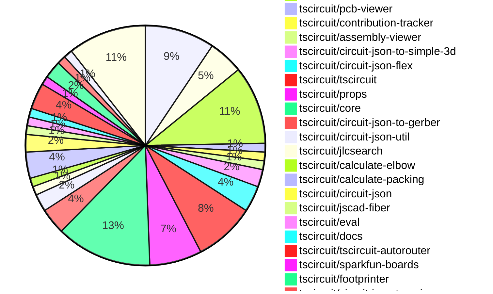
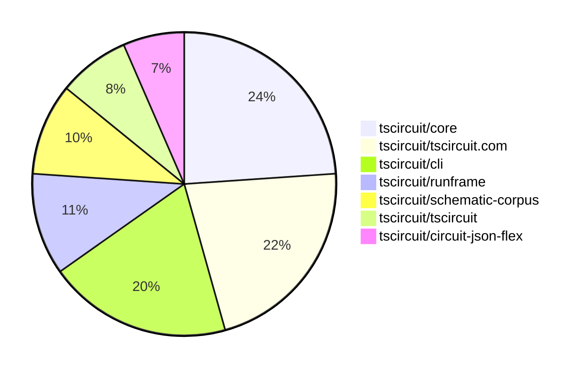

# Contribution Overview 2025-07-23

## PRs by Repository

## Contributor Overview

| Contributor | 🐳 Major | 🐙 Minor | 🐌 Tiny | ⭐ | Issues Created | Discussion Contributions |
|-------------|---------|---------|---------|-----|----------------|--------------------------|
| [seveibar](#seveibar) | 8 | 2 | 23 | 👑 | 0 | 0🔹 0🔶 0💎 |
| [ArnavK-09](#ArnavK-09) | 7 | 0 | 10 | ⭐⭐⭐ | 0 | 0🔹 0🔶 0💎 |
| [Abse2001](#Abse2001) | 0 | 1 | 5 | ⭐⭐ | 0 | 0🔹 0🔶 0💎 |
| [imrishabh18](#imrishabh18) | 1 | 0 | 13 | ⭐⭐ | 0 | 0🔹 0🔶 0💎 |
| [MustafaMulla29](#MustafaMulla29) | 0 | 0 | 9 | ⭐ | 0 | 0🔹 0🔶 0💎 |
| [abimaelmartell](#abimaelmartell) | 1 | 1 | 0 | ⭐ | 0 | 0🔹 0🔶 0💎 |
| [ShiboSoftwareDev](#ShiboSoftwareDev) | 0 | 1 | 1 | ⭐ | 0 | 0🔹 0🔶 0💎 |
| [techmannih](#techmannih) | 0 | 0 | 1 |  | 0 | 0🔹 0🔶 0💎 |
| [andrii-balitskyi](#andrii-balitskyi) | 0 | 0 | 1 |  | 0 | 0🔹 0🔶 0💎 |

### Discussion Contribution Legend

- 🔹 Normal Comments: Basic participation with minimal effort
- 🔶 Great Informative Comments: Thoughtful participation that adds value
- 💎 Incredible Comments: Exceptional participation with high-quality content

## Review Table

[reviews-received-hover]: ## "Number of reviews received for PRs for this contributor"
[approvals-received-hover]: ## "Number of approvals received for PRs this contributor authored"
[rejections-received-hover]: ## "Number of rejections received for PRs this contributor authored"
[prs-opened-hover]: ## "Number of PRs opened by this contributor"
[issues-created-hover]: ## "Number of issues created by this contributor"
[bountied-issues-hover]: ## "Number of issues this contributor created with a bounty"
[bountied-issue-$-hover]: ## "Total bounty amount placed on issues authored by this contributor"

| Contributor | Reviews Received | Approvals Received | Rejections Received | Approvals | Rejections | PRs Opened | PRs Merged | Score | Issues Created | Bountied Issues | Bountied Issue $ |
|---|---|---|---|---|---|---|---|---|---|---|---|
| [ArnavK-09](#ArnavK-09) | 20 | 17 | 0 | 0 | 0 | 18 | 18 | 36.5 | 0 | 0 | 0 |
| [seveibar](#seveibar) | 13 | 0 | 0 | 33 | 1 | 37 | 33 | 63 | 0 | 0 | 0 |
| [imrishabh18](#imrishabh18) | 12 | 6 | 1 | 0 | 0 | 17 | 14 | 14.5 | 0 | 0 | 0 |
| [cursor[bot]](#cursor[bot]) | 0 | 0 | 0 | 0 | 0 | 0 | 0 | 0 | 0 | 0 | 0 |
| [Abse2001](#Abse2001) | 7 | 6 | 0 | 9 | 0 | 7 | 6 | 15.5 | 0 | 0 | 0 |
| [ShiboSoftwareDev](#ShiboSoftwareDev) | 3 | 1 | 0 | 3 | 0 | 2 | 2 | 5.5 | 0 | 0 | 0 |
| [graphite-app[bot]](#graphite-app[bot]) | 0 | 0 | 0 | 0 | 0 | 0 | 0 | 0 | 0 | 0 | 0 |
| [techmannih](#techmannih) | 4 | 2 | 0 | 0 | 0 | 1 | 1 | 1 | 0 | 0 | 0 |
| [andrii-balitskyi](#andrii-balitskyi) | 3 | 1 | 0 | 0 | 0 | 2 | 1 | 1 | 0 | 0 | 0 |
| [abimaelmartell](#abimaelmartell) | 2 | 2 | 0 | 0 | 0 | 4 | 2 | 6 | 0 | 0 | 0 |
| [tscircuitbot](#tscircuitbot) | 0 | 0 | 0 | 0 | 0 | 22 | 0 | 0 | 0 | 0 | 0 |
| [MustafaMulla29](#MustafaMulla29) | 10 | 10 | 0 | 0 | 0 | 9 | 9 | 9 | 0 | 0 | 0 |

## Top 7 Repositories by Contribution Points

## Changes by Repository

### [tscircuit/tscircuit.com](https://github.com/tscircuit/tscircuit.com)

| PR # | Impact | Rating | Contributor | Description |
|------|--------|--------|-------------|-------------|
| [#1508](https://github.com/tscircuit/tscircuit.com/pull/1508) | 🐳 Major | ⭐⭐⭐ | ArnavK-09 | Add validation to ensure circuit JSON exists before allowing AI review request. This prevents errors when the required data is missing. |
| [#1505](https://github.com/tscircuit/tscircuit.com/pull/1505) | 🐳 Major | ⭐⭐⭐ | ArnavK-09 | Fixes real-time updates for package details when files change during detail updates. |
| [#1504](https://github.com/tscircuit/tscircuit.com/pull/1504) | 🐳 Major | ⭐⭐⭐ | ArnavK-09 | Adds a click handler for the license file in the sidebar, enabling automatic viewing of the license file when clicked. |
| [#1501](https://github.com/tscircuit/tscircuit.com/pull/1501) | 🐳 Major | ⭐⭐⭐ | ArnavK-09 | Adds functionality to rename files in the file sidebar, allowing users to modify file names directly within the interface. |

🐌 Tiny Contributions (4)

| PR # | Impact | Contributor | Description |
|------|--------|-------------|-------------|
| [#1506](https://github.com/tscircuit/tscircuit.com/pull/1506) | 🐌 Tiny | ArnavK-09 | Automatically generates a random package name if none is provided by the user during package creation. |
| [#1507](https://github.com/tscircuit/tscircuit.com/pull/1507) | 🐌 Tiny | ArnavK-09 | Adjusts loading state height in CodeAndPreview component, modifies dropdown menu item padding in main-content-header, and redesigns error boundary with improved visuals and reload option. |
| [#1503](https://github.com/tscircuit/tscircuit.com/pull/1503) | 🐌 Tiny | imrishabh18 | Add the packages marked and react-error-boundary (required by runframe) |
| [#1502](https://github.com/tscircuit/tscircuit.com/pull/1502) | 🐌 Tiny | Abse2001 | Moves dotenv configuration from the entry point to vite.config for better environment variable management. |

### [tscircuit/runframe](https://github.com/tscircuit/runframe)

| PR # | Impact | Rating | Contributor | Description |
|------|--------|--------|-------------|-------------|
| [#914](https://github.com/tscircuit/runframe/pull/914) | 🐳 Major | ⭐⭐⭐ | ArnavK-09 | Adds utilities for converting Uint8Array to base64 and compressing file maps, enabling the sharing of multiple files in error reports. |
| [#898](https://github.com/tscircuit/runframe/pull/898) | 🐳 Major | ⭐⭐⭐ | ArnavK-09 | img width1847 height988 altimage srchttps:github.comuser-attachmentsassetse09727d3-52dc-413d-a701-0d41b629438a  https:github.comuser-attachmentsassets7139446f-7066-4594-8b9c-f40db8ac0acd |

🐌 Tiny Contributions (2)

| PR # | Impact | Contributor | Description |
|------|--------|-------------|-------------|
| [#908](https://github.com/tscircuit/runframe/pull/908) | 🐌 Tiny | ArnavK-09 | Fixes placeholder text in FileSelectorCombobox and refactors state variable names for clarity in file selection logic. |
| [#915](https://github.com/tscircuit/runframe/pull/915) | 🐌 Tiny | imrishabh18 | Adds utilities for encoding file maps and enhances issue reporting links in the RunFrame preview components. |

### [tscircuit/cli](https://github.com/tscircuit/cli)

| PR # | Impact | Rating | Contributor | Description |
|------|--------|--------|-------------|-------------|
| [#294](https://github.com/tscircuit/cli/pull/294) | 🐳 Major | ⭐⭐⭐ | ArnavK-09 | Add recursive search for entrypoints in child directories with depth limit, improve validation for project directory and file paths, add constants for allowed entrypoint names and search limits, better error handling and validation messages, remove unused saveProjectConfig import, support listing all files in root dir where cmd ran |
| [#299](https://github.com/tscircuit/cli/pull/299) | 🐳 Major | ⭐⭐⭐ | seveibar | Adds an interactive command to the CLI for importing components from JLCPCB or the tscircuit registry. |
| [#298](https://github.com/tscircuit/cli/pull/298) | 🐳 Major | ⭐⭐⭐ | seveibar | Extends the tsci search command to query the JLC search API and display star counts for registry results while removing the interactive selection process. |

🐌 Tiny Contributions (6)

| PR # | Impact | Contributor | Description |
|------|--------|-------------|-------------|
| [#293](https://github.com/tscircuit/cli/pull/293) | 🐌 Tiny | ArnavK-09 | Updates the tscircuitrunframe dependency to version 0.0.722 to resolve development command issues. |
| [#292](https://github.com/tscircuit/cli/pull/292) | 🐌 Tiny | ArnavK-09 | Replaces hardcoded entrypoint path with dynamic retrieval using getEntrypoint function in development command registration. |
| [#291](https://github.com/tscircuit/cli/pull/291) | 🐌 Tiny | ArnavK-09 | Updates the runframe dependency version and modifies the main component path variable in the getIndex function. |
| [#297](https://github.com/tscircuit/cli/pull/297) | 🐌 Tiny | seveibar | Fixes the production outage by ensuring that tscircuit dependencies are imported from userland during the build process, allowing for proper resolution of dependencies. |
| [#296](https://github.com/tscircuit/cli/pull/296) | 🐌 Tiny | seveibar | Add explicit script for bun build to reduce bundling issue and dont bundle typescript |
| [#295](https://github.com/tscircuit/cli/pull/295) | 🐌 Tiny | Abse2001 | Makes the tscircuit dependency optional to resolve version mismatch issues in the project. |

### [tscircuit/pcb-viewer](https://github.com/tscircuit/pcb-viewer)

🐌 Tiny Contributions (1)

| PR # | Impact | Contributor | Description |
|------|--------|-------------|-------------|
| [#348](https://github.com/tscircuit/pcb-viewer/pull/348) | 🐌 Tiny | ArnavK-09 | Adds react, react-dom, react-reconciler, and react-reconciler-18 as external dependencies in the build configuration. |

### [tscircuit/contribution-tracker](https://github.com/tscircuit/contribution-tracker)

🐌 Tiny Contributions (1)

| PR # | Impact | Contributor | Description |
|------|--------|-------------|-------------|
| [#205](https://github.com/tscircuit/contribution-tracker/pull/205) | 🐌 Tiny | ArnavK-09 | Clarify that PR assessment descriptions should use plain text only without any hyperlinks or image links to maintain consistency in output format. |

### [tscircuit/assembly-viewer](https://github.com/tscircuit/assembly-viewer)

🐌 Tiny Contributions (1)

| PR # | Impact | Contributor | Description |
|------|--------|-------------|-------------|
| [#6](https://github.com/tscircuit/assembly-viewer/pull/6) | 🐌 Tiny | ArnavK-09 | Changes the background color of the AssemblyViewer component from F5F1ED to FFFFFF. |

### [tscircuit/circuit-json-to-simple-3d](https://github.com/tscircuit/circuit-json-to-simple-3d)

| PR # | Impact | Rating | Contributor | Description |
|------|--------|--------|-------------|-------------|
| [#7](https://github.com/tscircuit/circuit-json-to-simple-3d/pull/7) | 🐙 Minor | ⭐⭐ | seveibar | Integrates 3D model support into the rendering process for circuit designs, allowing for the inclusion of CAD models in the 3D SVG output. |

🐌 Tiny Contributions (1)

| PR # | Impact | Contributor | Description |
|------|--------|-------------|-------------|
| [#8](https://github.com/tscircuit/circuit-json-to-simple-3d/pull/8) | 🐌 Tiny | ArnavK-09 | Fixes the lock file to ensure that npm publish can be resumed without issues. |

### [tscircuit/circuit-json-flex](https://github.com/tscircuit/circuit-json-flex)

| PR # | Impact | Rating | Contributor | Description |
|------|--------|--------|-------------|-------------|
| [#2](https://github.com/tscircuit/circuit-json-flex/pull/2) | 🐳 Major | ⭐⭐⭐ | imrishabh18 | Introduces a layout function that arranges PCB components using a flex-box algorithm, allowing for dynamic positioning within a specified container. |

🐌 Tiny Contributions (2)

| PR # | Impact | Contributor | Description |
|------|--------|-------------|-------------|
| [#4](https://github.com/tscircuit/circuit-json-flex/pull/4) | 🐌 Tiny | imrishabh18 | Adds a build script in npm for releasing the project using tsup-node. |
| [#3](https://github.com/tscircuit/circuit-json-flex/pull/3) | 🐌 Tiny | imrishabh18 | Adds support for subcircuit groups in the layout circuit JSON functionality, allowing for better organization and rendering of PCB components within groups. |

### [tscircuit/tscircuit](https://github.com/tscircuit/tscircuit)

🐌 Tiny Contributions (7)

| PR # | Impact | Contributor | Description |
|------|--------|-------------|-------------|
| [#718](https://github.com/tscircuit/tscircuit/pull/718) | 🐌 Tiny | imrishabh18 | Updates the versions of tscircuitcore and tscircuitprops in package.json to the latest compatible versions. |
| [#714](https://github.com/tscircuit/tscircuit/pull/714) | 🐌 Tiny | imrishabh18 | Updates the tscircuitcore dependency version from 0.0.574 to 0.0.576 in package.json |
| [#721](https://github.com/tscircuit/tscircuit/pull/721) | 🐌 Tiny | seveibar | Updates the CLI dependency to fix an outage caused by a userland import issue. |
| [#720](https://github.com/tscircuit/tscircuit/pull/720) | 🐌 Tiny | seveibar | Fixes libonly package generation and adds jscad-fiber and jscad-planner dependencies to the project. |
| [#719](https://github.com/tscircuit/tscircuit/pull/719) | 🐌 Tiny | seveibar | Adds a new workflow to publish a libonly version of the package, creating a separate package.json for it. |
| [#717](https://github.com/tscircuit/tscircuit/pull/717) | 🐌 Tiny | seveibar | Updates the CLI and packages to lock to a single version of react-reconciler, ensuring consistent behavior across the application. |
| [#715](https://github.com/tscircuit/tscircuit/pull/715) | 🐌 Tiny | Abse2001 | Updates the tscircuitcli dependency version from 0.1.179 to 0.1.185 and adds yalc. and .yalc to .gitignore. |

### [tscircuit/props](https://github.com/tscircuit/props)

🐌 Tiny Contributions (6)

| PR # | Impact | Contributor | Description |
|------|--------|-------------|-------------|
| [#333](https://github.com/tscircuit/props/pull/333) | 🐌 Tiny | imrishabh18 | Adds new justifyContent values (space-between, space-around, space-evenly) to the layout configuration for improved layout options. |
| [#337](https://github.com/tscircuit/props/pull/337) | 🐌 Tiny | seveibar | Adds a layers option in BoardProps with 2 or 4 as allowed values, tests the layers option, updates documentation, and upgrades the expect-type dev dependency. |
| [#336](https://github.com/tscircuit/props/pull/336) | 🐌 Tiny | seveibar | Adds support for a relative layout mode in group layout configuration, including documentation and tests for parsing the new layout mode. |
| [#335](https://github.com/tscircuit/props/pull/335) | 🐌 Tiny | seveibar | Adds a step to format the README file using Prettier after it is generated by the script. |
| [#332](https://github.com/tscircuit/props/pull/332) | 🐌 Tiny | seveibar | Adds new layout properties for packing strategy in layout configuration. |
| [#331](https://github.com/tscircuit/props/pull/331) | 🐌 Tiny | seveibar | Summary add area options and square sizing to subcircuitGroupProps move board dimension properties into subcircuitGroupProps simplify BoardProps and update generated docs  Testing bun test testsboard.test.ts bun test testsstampboard.test.ts bun test tests |

### [tscircuit/core](https://github.com/tscircuit/core)

| PR # | Impact | Rating | Contributor | Description |
|------|--------|--------|-------------|-------------|
| [#1094](https://github.com/tscircuit/core/pull/1094) | 🐳 Major | ⭐⭐⭐ | seveibar | Enhances the error message for unsupported components by providing a link to documentation and hints for users. |
| [#1087](https://github.com/tscircuit/core/pull/1087) | 🐳 Major | ⭐⭐⭐ | seveibar | Adds PCB packing functionality by implementing calculate-packing and updating properties for layout implementation. |
| [#1092](https://github.com/tscircuit/core/pull/1092) | 🐳 Major | ⭐⭐⭐ | abimaelmartell | Fixes incorrect junction placement on schematic traces due to floating-point precision issues, ensuring junctions only appear at actual intersections between traces. |
| [#1099](https://github.com/tscircuit/core/pull/1099) | 🐙 Minor | ⭐⭐ | seveibar | Populates parent_source_group_id when rendering nested groups and updates circuit-json to the latest version. |
| [#1098](https://github.com/tscircuit/core/pull/1098) | 🐙 Minor | ⭐⭐ | abimaelmartell | Fixes bug in calculate-elbow logic for schematic traces by mapping facingDirection values to expected string values, resolving incorrect SVG generation for schematic traces. |

🐌 Tiny Contributions (6)

| PR # | Impact | Contributor | Description |
|------|--------|-------------|-------------|
| [#1091](https://github.com/tscircuit/core/pull/1091) | 🐌 Tiny | imrishabh18 | Adds support for flex layout within the board component, allowing for dynamic arrangement of child components based on specified justifyContent properties. |
| [#1088](https://github.com/tscircuit/core/pull/1088) | 🐌 Tiny | imrishabh18 | Adds support for a new PCB layout mode called flex in the Group component, allowing for flexible layout configurations. |
| [#1085](https://github.com/tscircuit/core/pull/1085) | 🐌 Tiny | imrishabh18 | Allows the width and height of the pcb_group to be specified as props, enabling more flexible layout configurations. |
| [#1095](https://github.com/tscircuit/core/pull/1095) | 🐌 Tiny | seveibar | Adds support for rotating packed components in PCB layout. |
| [#1096](https://github.com/tscircuit/core/pull/1096) | 🐌 Tiny | seveibar | Sets the default schematic layout to match-adapt when no layout is chosen and children do not position themselves, while skipping auto layout if manual placements are present. |
| [#1093](https://github.com/tscircuit/core/pull/1093) | 🐌 Tiny | seveibar | Add a test for a flex board containing pack-layout groups and update calculate-packing to the latest version. |

### [tscircuit/circuit-json-to-gerber](https://github.com/tscircuit/circuit-json-to-gerber)

🐌 Tiny Contributions (3)

| PR # | Impact | Contributor | Description |
|------|--------|-------------|-------------|
| [#50](https://github.com/tscircuit/circuit-json-to-gerber/pull/50) | 🐌 Tiny | imrishabh18 | Moves circuit-json from dependencies to devDependencies in package.json |
| [#47](https://github.com/tscircuit/circuit-json-to-gerber/pull/47) | 🐌 Tiny | imrishabh18 | Adds a Renovate configuration file to automate dependency updates and manage package versions. |
| [#46](https://github.com/tscircuit/circuit-json-to-gerber/pull/46) | 🐌 Tiny | imrishabh18 | Updates the version of the circuit-json dependency from a wildcard to a specific version (0.0.220) in package.json |

### [tscircuit/circuit-json-util](https://github.com/tscircuit/circuit-json-util)

| PR # | Impact | Rating | Contributor | Description |
|------|--------|--------|-------------|-------------|
| [#42](https://github.com/tscircuit/circuit-json-util/pull/42) | 🐳 Major | ⭐⭐⭐ | seveibar | Adds the getCircuitJsonTree function for building a tree structure of circuit elements and fixes the buildSubtree function to ignore parent_source_group_id. |

🐌 Tiny Contributions (1)

| PR # | Impact | Contributor | Description |
|------|--------|-------------|-------------|
| [#40](https://github.com/tscircuit/circuit-json-util/pull/40) | 🐌 Tiny | seveibar | Adds a utility function to reposition PCB components and their children within the circuit JSON structure. |

### [tscircuit/jlcsearch](https://github.com/tscircuit/jlcsearch)

| PR # | Impact | Rating | Contributor | Description |
|------|--------|--------|-------------|-------------|
| [#66](https://github.com/tscircuit/jlcsearch/pull/66) | 🐳 Major | ⭐⭐⭐ | seveibar | Adds relay component support including a new derived table and API endpoints for relay data retrieval. |

### [tscircuit/calculate-elbow](https://github.com/tscircuit/calculate-elbow)

| PR # | Impact | Rating | Contributor | Description |
|------|--------|--------|-------------|-------------|
| [#4](https://github.com/tscircuit/calculate-elbow/pull/4) | 🐳 Major | ⭐⭐⭐ | seveibar | Fixes elbow calculation for x- to y cases when the start point is right and above the destination by implementing an overshooting strategy and adds a test for this scenario. |

### [tscircuit/calculate-packing](https://github.com/tscircuit/calculate-packing)

| PR # | Impact | Rating | Contributor | Description |
|------|--------|--------|-------------|-------------|
| [#3](https://github.com/tscircuit/calculate-packing/pull/3) | 🐳 Major | ⭐⭐⭐ | seveibar | Fixes the issue where candidate components are not being invalidated based on the minGap distance during rotation calculations. |

🐌 Tiny Contributions (2)

| PR # | Impact | Contributor | Description |
|------|--------|-------------|-------------|
| [#4](https://github.com/tscircuit/calculate-packing/pull/4) | 🐌 Tiny | seveibar | Adds support for specifying available rotation degrees for components, allowing for more flexible placement during packing. |
| [#2](https://github.com/tscircuit/calculate-packing/pull/2) | 🐌 Tiny | seveibar | No description provided |

### [tscircuit/circuit-json](https://github.com/tscircuit/circuit-json)

| PR # | Impact | Rating | Contributor | Description |
|------|--------|--------|-------------|-------------|
| [#244](https://github.com/tscircuit/circuit-json/pull/244) | 🐙 Minor | ⭐⭐ | ShiboSoftwareDev | Defines a voltage source for simulation purposes, applying a voltage difference between two source ports. |

🐌 Tiny Contributions (1)

| PR # | Impact | Contributor | Description |
|------|--------|-------------|-------------|
| [#243](https://github.com/tscircuit/circuit-json/pull/243) | 🐌 Tiny | seveibar | Adds an optional parent_source_group_id field to the source group model for better hierarchical representation. |

### [tscircuit/jscad-fiber](https://github.com/tscircuit/jscad-fiber)

🐌 Tiny Contributions (1)

| PR # | Impact | Contributor | Description |
|------|--------|-------------|-------------|
| [#111](https://github.com/tscircuit/jscad-fiber/pull/111) | 🐌 Tiny | seveibar | Adds optional peer dependencies for three libraries, allowing users to use the package without requiring these libraries. |

### [tscircuit/eval](https://github.com/tscircuit/eval)

🐌 Tiny Contributions (1)

| PR # | Impact | Contributor | Description |
|------|--------|-------------|-------------|
| [#726](https://github.com/tscircuit/eval/pull/726) | 🐌 Tiny | seveibar | Updates the jscad-fiber dependency to version 0.0.82, adding more optional dependencies for enhanced functionality. |

### [tscircuit/docs](https://github.com/tscircuit/docs)

🐌 Tiny Contributions (1)

| PR # | Impact | Contributor | Description |
|------|--------|-------------|-------------|
| [#104](https://github.com/tscircuit/docs/pull/104) | 🐌 Tiny | seveibar | Documents the jlcsearch.tscircuit.com API in the Web APIs section. |

### [tscircuit/tscircuit-autorouter](https://github.com/tscircuit/tscircuit-autorouter)

🐌 Tiny Contributions (3)

| PR # | Impact | Contributor | Description |
|------|--------|-------------|-------------|
| [#218](https://github.com/tscircuit/tscircuit-autorouter/pull/218) | 🐌 Tiny | seveibar | Adds a new example for a 4-layer autorouting configuration using the AutoroutingPipelineDebugger component. |
| [#217](https://github.com/tscircuit/tscircuit-autorouter/pull/217) | 🐌 Tiny | seveibar | Moves the convertSrjToGraphicsObject function into lib utilities, exports it from the package index, and updates imports in solver and tests. |
| [#219](https://github.com/tscircuit/tscircuit-autorouter/pull/219) | 🐌 Tiny | Abse2001 | Adds a JSON fixture and a React component to reproduce a bug in the highdensity85 autorouter. |

### [tscircuit/sparkfun-boards](https://github.com/tscircuit/sparkfun-boards)

| PR # | Impact | Rating | Contributor | Description |
|------|--------|--------|-------------|-------------|
| [#85](https://github.com/tscircuit/sparkfun-boards/pull/85) | 🐙 Minor | ⭐⭐ | Abse2001 | No description provided |

### [tscircuit/footprinter](https://github.com/tscircuit/footprinter)

🐌 Tiny Contributions (2)

| PR # | Impact | Contributor | Description |
|------|--------|-------------|-------------|
| [#333](https://github.com/tscircuit/footprinter/pull/333) | 🐌 Tiny | Abse2001 | Renames the backsidelabel parameter to bottomsidepinlabel in the pinrow definition and related tests. |
| [#322](https://github.com/tscircuit/footprinter/pull/322) | 🐌 Tiny | techmannih | Introduces a new footprint variant for the JST-SH connector, allowing for better integration of this component in circuit designs. |

### [tscircuit/circuit-json-to-spice](https://github.com/tscircuit/circuit-json-to-spice)

🐌 Tiny Contributions (1)

| PR # | Impact | Contributor | Description |
|------|--------|-------------|-------------|
| [#6](https://github.com/tscircuit/circuit-json-to-spice/pull/6) | 🐌 Tiny | ShiboSoftwareDev | This PR updates package dependencies and formats the codebase for consistency. |

### [tscircuit/easyeda-converter](https://github.com/tscircuit/easyeda-converter)

🐌 Tiny Contributions (1)

| PR # | Impact | Contributor | Description |
|------|--------|-------------|-------------|
| [#289](https://github.com/tscircuit/easyeda-converter/pull/289) | 🐌 Tiny | andrii-balitskyi | Adds support for POLYGON pad shapes in the EasyEDA to TSCircuit conversion process, allowing for more complex pad designs. |

### [tscircuit/schematic-corpus](https://github.com/tscircuit/schematic-corpus)

🐌 Tiny Contributions (9)

| PR # | Impact | Contributor | Description |
|------|--------|-------------|-------------|
| [#114](https://github.com/tscircuit/schematic-corpus/pull/114) | 🐌 Tiny | MustafaMulla29 | Adds a new circuit design (design76) to enhance the matchAdapt algorithm functionality. |
| [#113](https://github.com/tscircuit/schematic-corpus/pull/113) | 🐌 Tiny | MustafaMulla29 | Adds a new design (design075) to the schematic corpus, which includes a new circuit board layout and connections for a capacitor and chip. |
| [#112](https://github.com/tscircuit/schematic-corpus/pull/112) | 🐌 Tiny | MustafaMulla29 | Adds a new circuit design (design74) to enhance the matchAdapt algorithm functionality. |
| [#111](https://github.com/tscircuit/schematic-corpus/pull/111) | 🐌 Tiny | MustafaMulla29 | Adds a new design component (design73) to enhance the matchAdapt algorithm functionality. |
| [#110](https://github.com/tscircuit/schematic-corpus/pull/110) | 🐌 Tiny | MustafaMulla29 | Adds a new design (design72) to enhance the matchAdapt algorithm functionality. |
| [#109](https://github.com/tscircuit/schematic-corpus/pull/109) | 🐌 Tiny | MustafaMulla29 | Adds a new design (design071) to the schematic corpus, which includes a new circuit board layout and components for the matchAdapt algorithm. |
| [#107](https://github.com/tscircuit/schematic-corpus/pull/107) | 🐌 Tiny | MustafaMulla29 | Adds a new circuit design (design69) to enhance the matchAdapt algorithm functionality. |
| [#106](https://github.com/tscircuit/schematic-corpus/pull/106) | 🐌 Tiny | MustafaMulla29 | Adds a new circuit design (design68) to enhance the matchAdapt algorithm functionality. |
| [#108](https://github.com/tscircuit/schematic-corpus/pull/108) | 🐌 Tiny | MustafaMulla29 | Adds a new circuit design (design70) to enhance the matchAdapt algorithm functionality. |

## Changes by Contributor

### [ArnavK-09](https://github.com/ArnavK-09)

| PRs # | Impact | Rating | Description |
|------|--------|--------|-------------|
| [#1508](https://github.com/tscircuit/tscircuit.com/pull/1508) | 🐳 Major | ⭐⭐⭐ | Add validation to ensure circuit JSON exists before allowing AI review request. This prevents errors when the required data is missing. |
| [#1505](https://github.com/tscircuit/tscircuit.com/pull/1505) | 🐳 Major | ⭐⭐⭐ | Fixes real-time updates for package details when files change during detail updates. |
| [#1504](https://github.com/tscircuit/tscircuit.com/pull/1504) | 🐳 Major | ⭐⭐⭐ | Adds a click handler for the license file in the sidebar, enabling automatic viewing of the license file when clicked. |
| [#1501](https://github.com/tscircuit/tscircuit.com/pull/1501) | 🐳 Major | ⭐⭐⭐ | Adds functionality to rename files in the file sidebar, allowing users to modify file names directly within the interface. |
| [#914](https://github.com/tscircuit/runframe/pull/914) | 🐳 Major | ⭐⭐⭐ | Adds utilities for converting Uint8Array to base64 and compressing file maps, enabling the sharing of multiple files in error reports. |
| [#898](https://github.com/tscircuit/runframe/pull/898) | 🐳 Major | ⭐⭐⭐ | img width1847 height988 altimage srchttps:github.comuser-attachmentsassetse09727d3-52dc-413d-a701-0d41b629438a  https:github.comuser-attachmentsassets7139446f-7066-4594-8b9c-f40db8ac0acd |
| [#294](https://github.com/tscircuit/cli/pull/294) | 🐳 Major | ⭐⭐⭐ | Add recursive search for entrypoints in child directories with depth limit, improve validation for project directory and file paths, add constants for allowed entrypoint names and search limits, better error handling and validation messages, remove unused saveProjectConfig import, support listing all files in root dir where cmd ran |

🐌 Tiny Contributions (10)

| PR # | Impact | Description |
|------|--------|-------------|
| [#348](https://github.com/tscircuit/pcb-viewer/pull/348) | 🐌 Tiny | Adds react, react-dom, react-reconciler, and react-reconciler-18 as external dependencies in the build configuration. |
| [#205](https://github.com/tscircuit/contribution-tracker/pull/205) | 🐌 Tiny | Clarify that PR assessment descriptions should use plain text only without any hyperlinks or image links to maintain consistency in output format. |
| [#1506](https://github.com/tscircuit/tscircuit.com/pull/1506) | 🐌 Tiny | Automatically generates a random package name if none is provided by the user during package creation. |
| [#1507](https://github.com/tscircuit/tscircuit.com/pull/1507) | 🐌 Tiny | Adjusts loading state height in CodeAndPreview component, modifies dropdown menu item padding in main-content-header, and redesigns error boundary with improved visuals and reload option. |
| [#908](https://github.com/tscircuit/runframe/pull/908) | 🐌 Tiny | Fixes placeholder text in FileSelectorCombobox and refactors state variable names for clarity in file selection logic. |
| [#293](https://github.com/tscircuit/cli/pull/293) | 🐌 Tiny | Updates the tscircuitrunframe dependency to version 0.0.722 to resolve development command issues. |
| [#292](https://github.com/tscircuit/cli/pull/292) | 🐌 Tiny | Replaces hardcoded entrypoint path with dynamic retrieval using getEntrypoint function in development command registration. |
| [#291](https://github.com/tscircuit/cli/pull/291) | 🐌 Tiny | Updates the runframe dependency version and modifies the main component path variable in the getIndex function. |
| [#6](https://github.com/tscircuit/assembly-viewer/pull/6) | 🐌 Tiny | Changes the background color of the AssemblyViewer component from F5F1ED to FFFFFF. |
| [#8](https://github.com/tscircuit/circuit-json-to-simple-3d/pull/8) | 🐌 Tiny | Fixes the lock file to ensure that npm publish can be resumed without issues. |

### [imrishabh18](https://github.com/imrishabh18)

| PRs # | Impact | Rating | Description |
|------|--------|--------|-------------|
| [#2](https://github.com/tscircuit/circuit-json-flex/pull/2) | 🐳 Major | ⭐⭐⭐ | Introduces a layout function that arranges PCB components using a flex-box algorithm, allowing for dynamic positioning within a specified container. |

🐌 Tiny Contributions (13)

| PR # | Impact | Description |
|------|--------|-------------|
| [#718](https://github.com/tscircuit/tscircuit/pull/718) | 🐌 Tiny | Updates the versions of tscircuitcore and tscircuitprops in package.json to the latest compatible versions. |
| [#714](https://github.com/tscircuit/tscircuit/pull/714) | 🐌 Tiny | Updates the tscircuitcore dependency version from 0.0.574 to 0.0.576 in package.json |
| [#333](https://github.com/tscircuit/props/pull/333) | 🐌 Tiny | Adds new justifyContent values (space-between, space-around, space-evenly) to the layout configuration for improved layout options. |
| [#1091](https://github.com/tscircuit/core/pull/1091) | 🐌 Tiny | Adds support for flex layout within the board component, allowing for dynamic arrangement of child components based on specified justifyContent properties. |
| [#1088](https://github.com/tscircuit/core/pull/1088) | 🐌 Tiny | Adds support for a new PCB layout mode called flex in the Group component, allowing for flexible layout configurations. |
| [#1085](https://github.com/tscircuit/core/pull/1085) | 🐌 Tiny | Allows the width and height of the pcb_group to be specified as props, enabling more flexible layout configurations. |
| [#50](https://github.com/tscircuit/circuit-json-to-gerber/pull/50) | 🐌 Tiny | Moves circuit-json from dependencies to devDependencies in package.json |
| [#47](https://github.com/tscircuit/circuit-json-to-gerber/pull/47) | 🐌 Tiny | Adds a Renovate configuration file to automate dependency updates and manage package versions. |
| [#46](https://github.com/tscircuit/circuit-json-to-gerber/pull/46) | 🐌 Tiny | Updates the version of the circuit-json dependency from a wildcard to a specific version (0.0.220) in package.json |
| [#1503](https://github.com/tscircuit/tscircuit.com/pull/1503) | 🐌 Tiny | Add the packages marked and react-error-boundary (required by runframe) |
| [#915](https://github.com/tscircuit/runframe/pull/915) | 🐌 Tiny | Adds utilities for encoding file maps and enhances issue reporting links in the RunFrame preview components. |
| [#4](https://github.com/tscircuit/circuit-json-flex/pull/4) | 🐌 Tiny | Adds a build script in npm for releasing the project using tsup-node. |
| [#3](https://github.com/tscircuit/circuit-json-flex/pull/3) | 🐌 Tiny | Adds support for subcircuit groups in the layout circuit JSON functionality, allowing for better organization and rendering of PCB components within groups. |

### [seveibar](https://github.com/seveibar)

| PRs # | Impact | Rating | Description |
|------|--------|--------|-------------|
| [#42](https://github.com/tscircuit/circuit-json-util/pull/42) | 🐳 Major | ⭐⭐⭐ | Adds the getCircuitJsonTree function for building a tree structure of circuit elements and fixes the buildSubtree function to ignore parent_source_group_id. |
| [#1094](https://github.com/tscircuit/core/pull/1094) | 🐳 Major | ⭐⭐⭐ | Enhances the error message for unsupported components by providing a link to documentation and hints for users. |
| [#1087](https://github.com/tscircuit/core/pull/1087) | 🐳 Major | ⭐⭐⭐ | Adds PCB packing functionality by implementing calculate-packing and updating properties for layout implementation. |
| [#66](https://github.com/tscircuit/jlcsearch/pull/66) | 🐳 Major | ⭐⭐⭐ | Adds relay component support including a new derived table and API endpoints for relay data retrieval. |
| [#299](https://github.com/tscircuit/cli/pull/299) | 🐳 Major | ⭐⭐⭐ | Adds an interactive command to the CLI for importing components from JLCPCB or the tscircuit registry. |
| [#298](https://github.com/tscircuit/cli/pull/298) | 🐳 Major | ⭐⭐⭐ | Extends the tsci search command to query the JLC search API and display star counts for registry results while removing the interactive selection process. |
| [#4](https://github.com/tscircuit/calculate-elbow/pull/4) | 🐳 Major | ⭐⭐⭐ | Fixes elbow calculation for x- to y cases when the start point is right and above the destination by implementing an overshooting strategy and adds a test for this scenario. |
| [#3](https://github.com/tscircuit/calculate-packing/pull/3) | 🐳 Major | ⭐⭐⭐ | Fixes the issue where candidate components are not being invalidated based on the minGap distance during rotation calculations. |
| [#1099](https://github.com/tscircuit/core/pull/1099) | 🐙 Minor | ⭐⭐ | Populates parent_source_group_id when rendering nested groups and updates circuit-json to the latest version. |
| [#7](https://github.com/tscircuit/circuit-json-to-simple-3d/pull/7) | 🐙 Minor | ⭐⭐ | Integrates 3D model support into the rendering process for circuit designs, allowing for the inclusion of CAD models in the 3D SVG output. |

🐌 Tiny Contributions (23)

| PR # | Impact | Description |
|------|--------|-------------|
| [#721](https://github.com/tscircuit/tscircuit/pull/721) | 🐌 Tiny | Updates the CLI dependency to fix an outage caused by a userland import issue. |
| [#720](https://github.com/tscircuit/tscircuit/pull/720) | 🐌 Tiny | Fixes libonly package generation and adds jscad-fiber and jscad-planner dependencies to the project. |
| [#719](https://github.com/tscircuit/tscircuit/pull/719) | 🐌 Tiny | Adds a new workflow to publish a libonly version of the package, creating a separate package.json for it. |
| [#717](https://github.com/tscircuit/tscircuit/pull/717) | 🐌 Tiny | Updates the CLI and packages to lock to a single version of react-reconciler, ensuring consistent behavior across the application. |
| [#243](https://github.com/tscircuit/circuit-json/pull/243) | 🐌 Tiny | Adds an optional parent_source_group_id field to the source group model for better hierarchical representation. |
| [#40](https://github.com/tscircuit/circuit-json-util/pull/40) | 🐌 Tiny | Adds a utility function to reposition PCB components and their children within the circuit JSON structure. |
| [#337](https://github.com/tscircuit/props/pull/337) | 🐌 Tiny | Adds a layers option in BoardProps with 2 or 4 as allowed values, tests the layers option, updates documentation, and upgrades the expect-type dev dependency. |
| [#336](https://github.com/tscircuit/props/pull/336) | 🐌 Tiny | Adds support for a relative layout mode in group layout configuration, including documentation and tests for parsing the new layout mode. |
| [#335](https://github.com/tscircuit/props/pull/335) | 🐌 Tiny | Adds a step to format the README file using Prettier after it is generated by the script. |
| [#332](https://github.com/tscircuit/props/pull/332) | 🐌 Tiny | Adds new layout properties for packing strategy in layout configuration. |
| [#331](https://github.com/tscircuit/props/pull/331) | 🐌 Tiny | Summary add area options and square sizing to subcircuitGroupProps move board dimension properties into subcircuitGroupProps simplify BoardProps and update generated docs  Testing bun test testsboard.test.ts bun test testsstampboard.test.ts bun test tests |
| [#1095](https://github.com/tscircuit/core/pull/1095) | 🐌 Tiny | Adds support for rotating packed components in PCB layout. |
| [#1096](https://github.com/tscircuit/core/pull/1096) | 🐌 Tiny | Sets the default schematic layout to match-adapt when no layout is chosen and children do not position themselves, while skipping auto layout if manual placements are present. |
| [#1093](https://github.com/tscircuit/core/pull/1093) | 🐌 Tiny | Add a test for a flex board containing pack-layout groups and update calculate-packing to the latest version. |
| [#111](https://github.com/tscircuit/jscad-fiber/pull/111) | 🐌 Tiny | Adds optional peer dependencies for three libraries, allowing users to use the package without requiring these libraries. |
| [#726](https://github.com/tscircuit/eval/pull/726) | 🐌 Tiny | Updates the jscad-fiber dependency to version 0.0.82, adding more optional dependencies for enhanced functionality. |
| [#297](https://github.com/tscircuit/cli/pull/297) | 🐌 Tiny | Fixes the production outage by ensuring that tscircuit dependencies are imported from userland during the build process, allowing for proper resolution of dependencies. |
| [#296](https://github.com/tscircuit/cli/pull/296) | 🐌 Tiny | Add explicit script for bun build to reduce bundling issue and dont bundle typescript |
| [#104](https://github.com/tscircuit/docs/pull/104) | 🐌 Tiny | Documents the jlcsearch.tscircuit.com API in the Web APIs section. |
| [#218](https://github.com/tscircuit/tscircuit-autorouter/pull/218) | 🐌 Tiny | Adds a new example for a 4-layer autorouting configuration using the AutoroutingPipelineDebugger component. |
| [#217](https://github.com/tscircuit/tscircuit-autorouter/pull/217) | 🐌 Tiny | Moves the convertSrjToGraphicsObject function into lib utilities, exports it from the package index, and updates imports in solver and tests. |
| [#4](https://github.com/tscircuit/calculate-packing/pull/4) | 🐌 Tiny | Adds support for specifying available rotation degrees for components, allowing for more flexible placement during packing. |
| [#2](https://github.com/tscircuit/calculate-packing/pull/2) | 🐌 Tiny | No description provided |

### [Abse2001](https://github.com/Abse2001)

| PRs # | Impact | Rating | Description |
|------|--------|--------|-------------|
| [#85](https://github.com/tscircuit/sparkfun-boards/pull/85) | 🐙 Minor | ⭐⭐ | No description provided |

🐌 Tiny Contributions (5)

| PR # | Impact | Description |
|------|--------|-------------|
| [#715](https://github.com/tscircuit/tscircuit/pull/715) | 🐌 Tiny | Updates the tscircuitcli dependency version from 0.1.179 to 0.1.185 and adds yalc. and .yalc to .gitignore. |
| [#333](https://github.com/tscircuit/footprinter/pull/333) | 🐌 Tiny | Renames the backsidelabel parameter to bottomsidepinlabel in the pinrow definition and related tests. |
| [#1502](https://github.com/tscircuit/tscircuit.com/pull/1502) | 🐌 Tiny | Moves dotenv configuration from the entry point to vite.config for better environment variable management. |
| [#295](https://github.com/tscircuit/cli/pull/295) | 🐌 Tiny | Makes the tscircuit dependency optional to resolve version mismatch issues in the project. |
| [#219](https://github.com/tscircuit/tscircuit-autorouter/pull/219) | 🐌 Tiny | Adds a JSON fixture and a React component to reproduce a bug in the highdensity85 autorouter. |

### [ShiboSoftwareDev](https://github.com/ShiboSoftwareDev)

| PRs # | Impact | Rating | Description |
|------|--------|--------|-------------|
| [#244](https://github.com/tscircuit/circuit-json/pull/244) | 🐙 Minor | ⭐⭐ | Defines a voltage source for simulation purposes, applying a voltage difference between two source ports. |

🐌 Tiny Contributions (1)

| PR # | Impact | Description |
|------|--------|-------------|
| [#6](https://github.com/tscircuit/circuit-json-to-spice/pull/6) | 🐌 Tiny | This PR updates package dependencies and formats the codebase for consistency. |

### [techmannih](https://github.com/techmannih)

🐌 Tiny Contributions (1)

| PR # | Impact | Description |
|------|--------|-------------|
| [#322](https://github.com/tscircuit/footprinter/pull/322) | 🐌 Tiny | Introduces a new footprint variant for the JST-SH connector, allowing for better integration of this component in circuit designs. |

### [andrii-balitskyi](https://github.com/andrii-balitskyi)

🐌 Tiny Contributions (1)

| PR # | Impact | Description |
|------|--------|-------------|
| [#289](https://github.com/tscircuit/easyeda-converter/pull/289) | 🐌 Tiny | Adds support for POLYGON pad shapes in the EasyEDA to TSCircuit conversion process, allowing for more complex pad designs. |

### [abimaelmartell](https://github.com/abimaelmartell)

| PRs # | Impact | Rating | Description |
|------|--------|--------|-------------|
| [#1092](https://github.com/tscircuit/core/pull/1092) | 🐳 Major | ⭐⭐⭐ | Fixes incorrect junction placement on schematic traces due to floating-point precision issues, ensuring junctions only appear at actual intersections between traces. |
| [#1098](https://github.com/tscircuit/core/pull/1098) | 🐙 Minor | ⭐⭐ | Fixes bug in calculate-elbow logic for schematic traces by mapping facingDirection values to expected string values, resolving incorrect SVG generation for schematic traces. |

### [MustafaMulla29](https://github.com/MustafaMulla29)

🐌 Tiny Contributions (9)

| PR # | Impact | Description |
|------|--------|-------------|
| [#114](https://github.com/tscircuit/schematic-corpus/pull/114) | 🐌 Tiny | Adds a new circuit design (design76) to enhance the matchAdapt algorithm functionality. |
| [#113](https://github.com/tscircuit/schematic-corpus/pull/113) | 🐌 Tiny | Adds a new design (design075) to the schematic corpus, which includes a new circuit board layout and connections for a capacitor and chip. |
| [#112](https://github.com/tscircuit/schematic-corpus/pull/112) | 🐌 Tiny | Adds a new circuit design (design74) to enhance the matchAdapt algorithm functionality. |
| [#111](https://github.com/tscircuit/schematic-corpus/pull/111) | 🐌 Tiny | Adds a new design component (design73) to enhance the matchAdapt algorithm functionality. |
| [#110](https://github.com/tscircuit/schematic-corpus/pull/110) | 🐌 Tiny | Adds a new design (design72) to enhance the matchAdapt algorithm functionality. |
| [#109](https://github.com/tscircuit/schematic-corpus/pull/109) | 🐌 Tiny | Adds a new design (design071) to the schematic corpus, which includes a new circuit board layout and components for the matchAdapt algorithm. |
| [#107](https://github.com/tscircuit/schematic-corpus/pull/107) | 🐌 Tiny | Adds a new circuit design (design69) to enhance the matchAdapt algorithm functionality. |
| [#106](https://github.com/tscircuit/schematic-corpus/pull/106) | 🐌 Tiny | Adds a new circuit design (design68) to enhance the matchAdapt algorithm functionality. |
| [#108](https://github.com/tscircuit/schematic-corpus/pull/108) | 🐌 Tiny | Adds a new circuit design (design70) to enhance the matchAdapt algorithm functionality. |

## Repository Owners

| Repository | Codeowners |
|------------|------------|
| [cli](https://github.com/tscircuit/cli/blob/main/.github/CODEOWNERS) | [ArnavK-09](https://github.com/ArnavK-09), [seveibar](https://github.com/seveibar) |
| [tscircuit.com](https://github.com/tscircuit/tscircuit.com/blob/main/.github/CODEOWNERS) | [imrishabh18](https://github.com/imrishabh18) |
| [sparkfun-boards](https://github.com/tscircuit/sparkfun-boards/blob/main/.github/CODEOWNERS) | [Abse2001](https://github.com/Abse2001) |
| [footprinter](https://github.com/tscircuit/footprinter/blob/main/.github/CODEOWNERS) | [techmannih](https://github.com/techmannih) |

## Repos by Owner

| User | Repo |
|------|------|
| [ArnavK-09](https://github.com/ArnavK-09) | [cli](https://github.com/tscircuit/cli/blob/main/.github/CODEOWNERS) |
| [seveibar](https://github.com/seveibar) | [cli](https://github.com/tscircuit/cli/blob/main/.github/CODEOWNERS) |
| [imrishabh18](https://github.com/imrishabh18) | [tscircuit.com](https://github.com/tscircuit/tscircuit.com/blob/main/.github/CODEOWNERS) |
| [Abse2001](https://github.com/Abse2001) | [sparkfun-boards](https://github.com/tscircuit/sparkfun-boards/blob/main/.github/CODEOWNERS) |
| [techmannih](https://github.com/techmannih) | [footprinter](https://github.com/tscircuit/footprinter/blob/main/.github/CODEOWNERS) |

