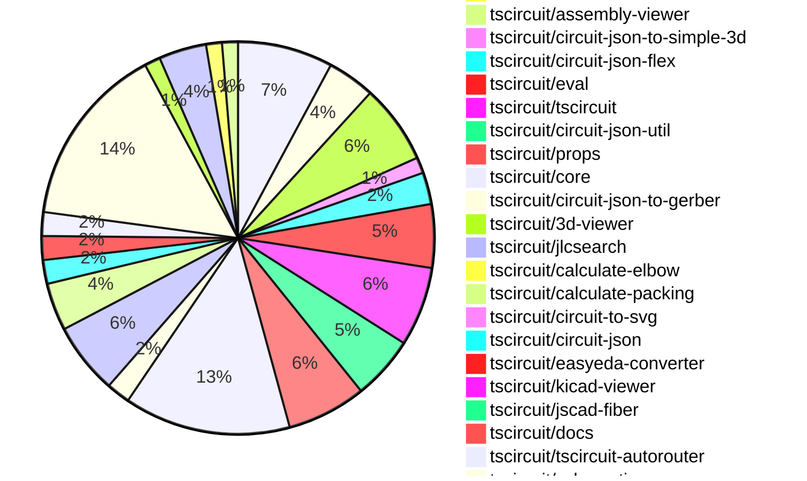
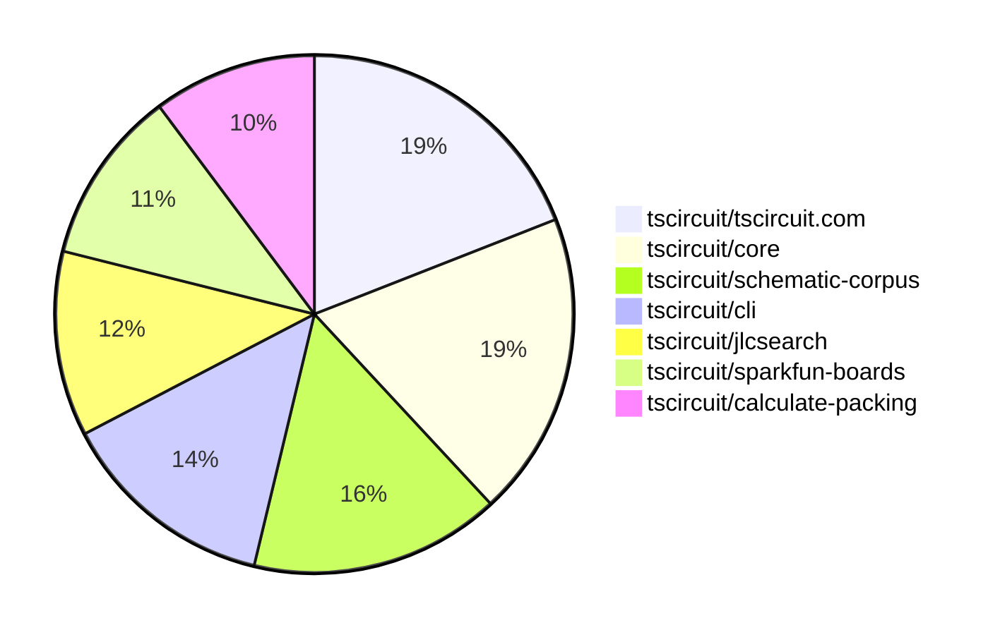

# Contribution Overview 2025-07-23

## PRs by Repository

## Contributor Overview

| Contributor | 🐳 Major | 🐙 Minor | 🐌 Tiny | ⭐ | Issues Created | Discussion Contributions |
|-------------|---------|---------|---------|-----|----------------|--------------------------|
| [seveibar](#seveibar) | 12 | 8 | 56 | 👑👑 | 0 | 0🔹 0🔶 0💎 |
| [ArnavK-09](#ArnavK-09) | 8 | 1 | 9 | ⭐⭐⭐ | 0 | 0🔹 0🔶 0💎 |
| [Abse2001](#Abse2001) | 2 | 1 | 13 | ⭐⭐⭐ | 0 | 0🔹 0🔶 0💎 |
| [imrishabh18](#imrishabh18) | 2 | 1 | 19 | ⭐⭐ | 0 | 0🔹 0🔶 0💎 |
| [MustafaMulla29](#MustafaMulla29) | 1 | 0 | 13 | ⭐⭐ | 0 | 0🔹 0🔶 0💎 |
| [ShiboSoftwareDev](#ShiboSoftwareDev) | 0 | 2 | 2 | ⭐⭐ | 0 | 0🔹 0🔶 0💎 |
| [abimaelmartell](#abimaelmartell) | 0 | 2 | 1 | ⭐ | 0 | 0🔹 0🔶 0💎 |
| [techmannih](#techmannih) | 0 | 0 | 4 | ⭐ | 0 | 0🔹 0🔶 0💎 |
| [tscircuitbot](#tscircuitbot) | 0 | 0 | 4 | ⭐ | 0 | 0🔹 0🔶 0💎 |
| [andrii-balitskyi](#andrii-balitskyi) | 0 | 0 | 1 |  | 0 | 0🔹 0🔶 0💎 |

### Discussion Contribution Legend

- 🔹 Normal Comments: Basic participation with minimal effort
- 🔶 Great Informative Comments: Thoughtful participation that adds value
- 💎 Incredible Comments: Exceptional participation with high-quality content

## Review Table

[reviews-received-hover]: ## "Number of reviews received for PRs for this contributor"
[approvals-received-hover]: ## "Number of approvals received for PRs this contributor authored"
[rejections-received-hover]: ## "Number of rejections received for PRs this contributor authored"
[prs-opened-hover]: ## "Number of PRs opened by this contributor"
[issues-created-hover]: ## "Number of issues created by this contributor"
[bountied-issues-hover]: ## "Number of issues this contributor created with a bounty"
[bountied-issue-$-hover]: ## "Total bounty amount placed on issues authored by this contributor"

| Contributor | Reviews Received | Approvals Received | Rejections Received | Approvals | Rejections | PRs Opened | PRs Merged | Score | Issues Created | Bountied Issues | Bountied Issue $ |
|---|---|---|---|---|---|---|---|---|---|---|---|
| [ArnavK-09](#ArnavK-09) | 21 | 18 | 0 | 0 | 0 | 19 | 19 | 41.5 | 0 | 0 | 0 |
| [seveibar](#seveibar) | 32 | 0 | 0 | 43 | 1 | 88 | 76 | 84 | 0 | 0 | 0 |
| [imrishabh18](#imrishabh18) | 19 | 11 | 1 | 1 | 0 | 28 | 22 | 24.5 | 0 | 0 | 0 |
| [cursor[bot]](#cursor[bot]) | 0 | 0 | 0 | 0 | 0 | 0 | 0 | 0 | 0 | 0 | 0 |
| [Abse2001](#Abse2001) | 10 | 9 | 0 | 15 | 0 | 16 | 16 | 31 | 0 | 0 | 0 |
| [graphite-app[bot]](#graphite-app[bot]) | 0 | 0 | 0 | 0 | 0 | 0 | 0 | 0 | 0 | 0 | 0 |
| [ShiboSoftwareDev](#ShiboSoftwareDev) | 8 | 5 | 0 | 8 | 0 | 5 | 4 | 13.5 | 0 | 0 | 0 |
| [techmannih](#techmannih) | 7 | 5 | 0 | 0 | 1 | 5 | 4 | 4 | 0 | 0 | 0 |
| [andrii-balitskyi](#andrii-balitskyi) | 3 | 1 | 0 | 0 | 0 | 2 | 1 | 1 | 0 | 0 | 0 |
| [abimaelmartell](#abimaelmartell) | 4 | 3 | 0 | 0 | 0 | 6 | 3 | 5 | 0 | 0 | 0 |
| [copilot-pull-request-reviewer[bot]](#copilot-pull-request-reviewer[bot]) | 0 | 0 | 0 | 0 | 0 | 0 | 0 | 0 | 0 | 0 | 0 |
| [tscircuitbot](#tscircuitbot) | 0 | 0 | 0 | 0 | 0 | 42 | 4 | 4 | 0 | 0 | 0 |
| [MustafaMulla29](#MustafaMulla29) | 16 | 15 | 1 | 0 | 0 | 14 | 14 | 14 | 0 | 0 | 0 |

## Top 7 Repositories by Contribution Points

## Changes by Repository

### [tscircuit/tscircuit.com](https://github.com/tscircuit/tscircuit.com)

| PR # | Impact | Rating | Contributor | Description |
|------|--------|--------|-------------|-------------|
| [#1508](https://github.com/tscircuit/tscircuit.com/pull/1508) | 🐳 Major | ⭐⭐⭐ | ArnavK-09 | Add validation to ensure circuit JSON exists before allowing AI review request. This prevents errors when the required data is missing. |
| [#1506](https://github.com/tscircuit/tscircuit.com/pull/1506) | 🐳 Major | ⭐⭐⭐ | ArnavK-09 | Automatically generates a package name based on the users account and existing packages if no name is provided. |
| [#1505](https://github.com/tscircuit/tscircuit.com/pull/1505) | 🐳 Major | ⭐⭐⭐ | ArnavK-09 | Fixes real-time updates for package details when files change during detail updates. |
| [#1504](https://github.com/tscircuit/tscircuit.com/pull/1504) | 🐳 Major | ⭐⭐⭐ | ArnavK-09 | Adds a click handler for the license file in the sidebar, enabling automatic viewing of the license file when clicked. |
| [#1501](https://github.com/tscircuit/tscircuit.com/pull/1501) | 🐳 Major | ⭐⭐⭐ | ArnavK-09 | Adds file renaming functionality to the file management system, allowing users to rename files while preserving folder structures and handling errors appropriately. |
| [#1509](https://github.com/tscircuit/tscircuit.com/pull/1509) | 🐙 Minor | ⭐⭐ | ArnavK-09 | Fixes incorrect component fetching by using the actual component name from props instead of a hardcoded value. |

🌠Tiny Contributions (6)

| PR # | Impact | Contributor | Description |
|------|--------|-------------|-------------|
| [#1507](https://github.com/tscircuit/tscircuit.com/pull/1507) | 🐌 Tiny | ArnavK-09 | Adjusts loading state height in CodeAndPreview component, modifies dropdown menu item padding in main-content-header, and redesigns error boundary with improved visuals and reload option. |
| [#1512](https://github.com/tscircuit/tscircuit.com/pull/1512) | 🐌 Tiny | imrishabh18 | Sets the eval version to 0.0.264 temporarily to avoid issues with the latest eval version until it is stable |
| [#1503](https://github.com/tscircuit/tscircuit.com/pull/1503) | 🐌 Tiny | imrishabh18 | Add the packages marked and react-error-boundary (required by runframe) |
| [#1513](https://github.com/tscircuit/tscircuit.com/pull/1513) | 🐌 Tiny | seveibar | Updates the evaluation version used in the CodeAndPreview component to the latest version, ensuring compatibility and access to the latest features. |
| [#1502](https://github.com/tscircuit/tscircuit.com/pull/1502) | 🐌 Tiny | Abse2001 | Moves dotenv configuration from the entrypoint to vite.config for better environment variable management. |
| [#1510](https://github.com/tscircuit/tscircuit.com/pull/1510) | 🐌 Tiny | abimaelmartell | Fixes the import functionality to use JLCPCB Part Number instead of just the component name. |

### [tscircuit/runframe](https://github.com/tscircuit/runframe)

| PR # | Impact | Rating | Contributor | Description |
|------|--------|--------|-------------|-------------|
| [#914](https://github.com/tscircuit/runframe/pull/914) | 🐳 Major | ⭐⭐⭐ | ArnavK-09 | Add utilities for converting Uint8Array to base64 and for encoding file maps, enabling the sharing of multiple files in error reports. |
| [#898](https://github.com/tscircuit/runframe/pull/898) | 🐳 Major | ⭐⭐⭐ | ArnavK-09 | img width1847 height988 altimage srchttps:github.comuser-attachmentsassetse09727d3-52dc-413d-a701-0d41b629438a  https:github.comuser-attachmentsassets7139446f-7066-4594-8b9c-f40db8ac0acd |

🌠Tiny Contributions (4)

| PR # | Impact | Contributor | Description |
|------|--------|-------------|-------------|
| [#908](https://github.com/tscircuit/runframe/pull/908) | 🐌 Tiny | ArnavK-09 | Fixes placeholder text in FileSelectorCombobox and refactors state variable names for clarity in file selection logic. |
| [#928](https://github.com/tscircuit/runframe/pull/928) | 🐌 Tiny | imrishabh18 | Makes the Report Issue button visible on the errors tab even when there are no errors, allowing users to report issues more easily. |
| [#925](https://github.com/tscircuit/runframe/pull/925) | 🐌 Tiny | imrishabh18 | Resolves eval version to the numeric latest version instead of the literal string latest |
| [#915](https://github.com/tscircuit/runframe/pull/915) | 🐌 Tiny | imrishabh18 | Adds utilities for encoding file maps and enhances issue reporting links in the RunFrame preview components. |

### [tscircuit/cli](https://github.com/tscircuit/cli)

| PR # | Impact | Rating | Contributor | Description |
|------|--------|--------|-------------|-------------|
| [#294](https://github.com/tscircuit/cli/pull/294) | 🐳 Major | ⭐⭐⭐ | ArnavK-09 | Add recursive search for entrypoints in child directories with depth limit, improve validation for project directory and file paths, add constants for allowed entrypoint names and search limits, better error handling and validation messages, remove unused saveProjectConfig import, support listing all files in root dir where cmd ran |
| [#299](https://github.com/tscircuit/cli/pull/299) | 🐳 Major | ⭐⭐⭐ | seveibar | Adds an interactive command to the CLI for importing components from JLCPCB or the tscircuit registry. |
| [#298](https://github.com/tscircuit/cli/pull/298) | 🐳 Major | ⭐⭐⭐ | seveibar | Extends the tsci search command to query the JLC search API and display star counts for registry results, while removing the interactive selection part of the search command. |
| [#301](https://github.com/tscircuit/cli/pull/301) | 🐙 Minor | ⭐⭐ | ShiboSoftwareDev | Adds support for generating 3D PNG snapshots of circuit designs in addition to existing SVG snapshots. |

🌠Tiny Contributions (6)

| PR # | Impact | Contributor | Description |
|------|--------|-------------|-------------|
| [#293](https://github.com/tscircuit/cli/pull/293) | 🐌 Tiny | ArnavK-09 | Updates the tscircuitrunframe dependency to version 0.0.722 to resolve development command issues. |
| [#292](https://github.com/tscircuit/cli/pull/292) | 🐌 Tiny | ArnavK-09 | Replaces hardcoded entrypoint path with dynamic retrieval using getEntrypoint function in the development command. |
| [#291](https://github.com/tscircuit/cli/pull/291) | 🐌 Tiny | ArnavK-09 | Updates the version of the runframe and other dependencies in the project. |
| [#297](https://github.com/tscircuit/cli/pull/297) | 🐌 Tiny | seveibar | Fixes the production outage by importing tscircuit dependencies from userland during the build process, ensuring that the correct version is utilized. |
| [#296](https://github.com/tscircuit/cli/pull/296) | 🐌 Tiny | seveibar | Adds an explicit script for bun build to reduce bundling issues and prevents bundling of typescript. |
| [#295](https://github.com/tscircuit/cli/pull/295) | 🐌 Tiny | Abse2001 | Fixes dependency version mismatch by making tscircuit an optional peer dependency in package.json |

### [tscircuit/pcb-viewer](https://github.com/tscircuit/pcb-viewer)

🌠Tiny Contributions (1)

| PR # | Impact | Contributor | Description |
|------|--------|-------------|-------------|
| [#348](https://github.com/tscircuit/pcb-viewer/pull/348) | 🐌 Tiny | ArnavK-09 | Adds react, react-dom, react-reconciler, and react-reconciler-18 as external dependencies in the build configuration. |

### [tscircuit/contribution-tracker](https://github.com/tscircuit/contribution-tracker)

🌠Tiny Contributions (1)

| PR # | Impact | Contributor | Description |
|------|--------|-------------|-------------|
| [#205](https://github.com/tscircuit/contribution-tracker/pull/205) | 🐌 Tiny | ArnavK-09 | Clarify that PR assessment descriptions should use plain text only without any hyperlinks or image links to maintain consistency in output format. |

### [tscircuit/assembly-viewer](https://github.com/tscircuit/assembly-viewer)

🌠Tiny Contributions (1)

| PR # | Impact | Contributor | Description |
|------|--------|-------------|-------------|
| [#6](https://github.com/tscircuit/assembly-viewer/pull/6) | 🐌 Tiny | ArnavK-09 | Changes the background color of the AssemblyViewer component from a light beige (F5F1ED) to white (FFFFFF). |

### [tscircuit/circuit-json-to-simple-3d](https://github.com/tscircuit/circuit-json-to-simple-3d)

| PR # | Impact | Rating | Contributor | Description |
|------|--------|--------|-------------|-------------|
| [#7](https://github.com/tscircuit/circuit-json-to-simple-3d/pull/7) | 🐳 Major | ⭐⭐⭐ | seveibar | Integrates 3D model support into the rendering process for circuit designs, allowing for the inclusion of CAD models in the 3D SVG output. |

🌠Tiny Contributions (1)

| PR # | Impact | Contributor | Description |
|------|--------|-------------|-------------|
| [#8](https://github.com/tscircuit/circuit-json-to-simple-3d/pull/8) | 🐌 Tiny | ArnavK-09 | Fixes the lock file to ensure that npm publish can be resumed without issues. |

### [tscircuit/circuit-json-flex](https://github.com/tscircuit/circuit-json-flex)

| PR # | Impact | Rating | Contributor | Description |
|------|--------|--------|-------------|-------------|
| [#6](https://github.com/tscircuit/circuit-json-flex/pull/6) | 🐳 Major | ⭐⭐⭐ | imrishabh18 | No description provided |
| [#2](https://github.com/tscircuit/circuit-json-flex/pull/2) | 🐳 Major | ⭐⭐⭐ | imrishabh18 | Adds a new function to layout PCB components using a flex-box algorithm, allowing for dynamic positioning of components within a specified container. |

🌠Tiny Contributions (2)

| PR # | Impact | Contributor | Description |
|------|--------|-------------|-------------|
| [#4](https://github.com/tscircuit/circuit-json-flex/pull/4) | 🐌 Tiny | imrishabh18 | Adds a build script to package.json for compiling TypeScript files into a distributable format using tsup-node. |
| [#3](https://github.com/tscircuit/circuit-json-flex/pull/3) | 🐌 Tiny | imrishabh18 | Adds support for subcircuit groups in the layout of circuit JSON, allowing for better organization and rendering of PCB elements. |

### [tscircuit/eval](https://github.com/tscircuit/eval)

| PR # | Impact | Rating | Contributor | Description |
|------|--------|--------|-------------|-------------|
| [#751](https://github.com/tscircuit/eval/pull/751) | 🐙 Minor | ⭐⭐ | imrishabh18 | Fixes the issue of auto-adding a board wrapper when the main component already contains a group element, ensuring only a single source_group is created. |

🌠Tiny Contributions (7)

| PR # | Impact | Contributor | Description |
|------|--------|-------------|-------------|
| [#746](https://github.com/tscircuit/eval/pull/746) | 🐌 Tiny | seveibar | Fixes the issue where the eval function fails to load due to the zod library not being bundled, and adds a version method to the CircuitRunner class to check the health of the worker. |
| [#745](https://github.com/tscircuit/eval/pull/745) | 🐌 Tiny | seveibar | Locks the zod library version to 3 in package.json to ensure compatibility and prevent breaking changes from future updates. |
| [#726](https://github.com/tscircuit/eval/pull/726) | 🐌 Tiny | seveibar | Updates the jscad-fiber dependency to version 0.0.82, adding more optional dependencies for enhanced functionality. |
| [#765](https://github.com/tscircuit/eval/pull/765) | 🐌 Tiny | tscircuitbot | Updates the tscircuitcore package from version 0.0.593 to 0.0.596 and updates tscircuitcircuit-json-util and tscircuitprops to their respective newer versions. |
| [#759](https://github.com/tscircuit/eval/pull/759) | 🐌 Tiny | tscircuitbot | Updates the tscircuitcore dependency to version 0.0.593 in package.json. |
| [#743](https://github.com/tscircuit/eval/pull/743) | 🐌 Tiny | tscircuitbot | Updates the tscircuitcore dependency to version 0.0.587 without introducing new functionality. |
| [#741](https://github.com/tscircuit/eval/pull/741) | 🐌 Tiny | tscircuitbot | Updates the tscircuitcore package to version 0.0.586, along with minor updates to related dependencies in package.json. |

### [tscircuit/tscircuit](https://github.com/tscircuit/tscircuit)

🌠Tiny Contributions (10)

| PR # | Impact | Contributor | Description |
|------|--------|-------------|-------------|
| [#724](https://github.com/tscircuit/tscircuit/pull/724) | 🐌 Tiny | imrishabh18 | Updates the circuit-json-util dependency to version 0.0.58 in package.json |
| [#723](https://github.com/tscircuit/tscircuit/pull/723) | 🐌 Tiny | imrishabh18 | Updates the version of the tscircuitcircuit-json-util package from 0.0.54 to 0.0.57 in package.json |
| [#718](https://github.com/tscircuit/tscircuit/pull/718) | 🐌 Tiny | imrishabh18 | Updates the versions of tscircuitcore and tscircuitprops in package.json to the latest releases. |
| [#714](https://github.com/tscircuit/tscircuit/pull/714) | 🐌 Tiny | imrishabh18 | Updates the tscircuitcore dependency version from 0.0.574 to 0.0.576 in package.json |
| [#722](https://github.com/tscircuit/tscircuit/pull/722) | 🐌 Tiny | seveibar | Adds new dependencies for packing and flex support, and updates existing dependencies in the project. |
| [#721](https://github.com/tscircuit/tscircuit/pull/721) | 🐌 Tiny | seveibar | Updates the CLI dependency to fix an outage caused by a userland import issue. |
| [#720](https://github.com/tscircuit/tscircuit/pull/720) | 🐌 Tiny | seveibar | Fixes libonly package generation and adds jscad-fiber and jscad-planner dependencies to the project. |
| [#719](https://github.com/tscircuit/tscircuit/pull/719) | 🐌 Tiny | seveibar | Adds a new workflow to publish a libonly version of the package, creating a separate package.json for it. |
| [#717](https://github.com/tscircuit/tscircuit/pull/717) | 🐌 Tiny | seveibar | Locks the project to a single version of react-reconciler to ensure consistent behavior across environments. |
| [#715](https://github.com/tscircuit/tscircuit/pull/715) | 🐌 Tiny | Abse2001 | Updates the tscircuitcli dependency version from 0.1.179 to 0.1.185 in package.json and adds yalc. and .yalc to .gitignore. |

### [tscircuit/circuit-json-util](https://github.com/tscircuit/circuit-json-util)

| PR # | Impact | Rating | Contributor | Description |
|------|--------|--------|-------------|-------------|
| [#42](https://github.com/tscircuit/circuit-json-util/pull/42) | 🐳 Major | ⭐⭐⭐ | seveibar | Adds the getCircuitJsonTree function for building a tree structure of circuit elements and fixes the buildSubtree function to ignore parent_source_group_id. |

🌠Tiny Contributions (7)

| PR # | Impact | Contributor | Description |
|------|--------|-------------|-------------|
| [#47](https://github.com/tscircuit/circuit-json-util/pull/47) | 🐌 Tiny | imrishabh18 | Ensures that root-level source groups are included in the circuit JSON tree even when there are no nested groups. |
| [#49](https://github.com/tscircuit/circuit-json-util/pull/49) | 🐌 Tiny | seveibar | Maps silkscreenpath to pcb_silkscreen_path and adds tests for the transformation functionality. |
| [#48](https://github.com/tscircuit/circuit-json-util/pull/48) | 🐌 Tiny | seveibar | Flips the width and height of PCB components when they are rotated by 90 or 270 degrees. |
| [#45](https://github.com/tscircuit/circuit-json-util/pull/45) | 🐌 Tiny | seveibar | Adds better handling for cases where no groups are present in the circuit JSON tree, allowing for a more graceful return of the tree structure without errors. |
| [#44](https://github.com/tscircuit/circuit-json-util/pull/44) | 🐌 Tiny | seveibar | Changes the source_group_id property in the options parameter from a required string to an optional string. |
| [#43](https://github.com/tscircuit/circuit-json-util/pull/43) | 🐌 Tiny | seveibar | Fixes issues in the getCircuitJsonTree function by ensuring child nodes are properly initialized and improves the tree structure generation. |
| [#40](https://github.com/tscircuit/circuit-json-util/pull/40) | 🐌 Tiny | seveibar | Add a utility function to reposition PCB components and their children in the circuit JSON structure, allowing for easier manipulation of component layouts. |

### [tscircuit/props](https://github.com/tscircuit/props)

| PR # | Impact | Rating | Contributor | Description |
|------|--------|--------|-------------|-------------|
| [#331](https://github.com/tscircuit/props/pull/331) | 🐳 Major | ⭐⭐⭐ | seveibar | Summary add area options and square sizing to subcircuitGroupProps move board dimension properties into subcircuitGroupProps simplify BoardProps and update generated docs  Testing bun test testsboard.test.ts bun test testsstampboard.test.ts bun test tests |

🌠Tiny Contributions (9)

| PR # | Impact | Contributor | Description |
|------|--------|-------------|-------------|
| [#333](https://github.com/tscircuit/props/pull/333) | 🐌 Tiny | imrishabh18 | Adds new justifyContent values (space-between, space-around, space-evenly) to the layout configuration for improved layout options. |
| [#341](https://github.com/tscircuit/props/pull/341) | 🐌 Tiny | seveibar | Adds a new optional property rightAngle to the PinHeaderProps interface, allowing users to specify if the header is a right-angle style connector. |
| [#340](https://github.com/tscircuit/props/pull/340) | 🐌 Tiny | seveibar | Adds unpopulated as a gender option for pin headers, updating documentation accordingly. |
| [#339](https://github.com/tscircuit/props/pull/339) | 🐌 Tiny | seveibar | Extends BaseGroupProps with new PCB layout properties and deprecates existing grid and flex properties. |
| [#338](https://github.com/tscircuit/props/pull/338) | 🐌 Tiny | seveibar | Adds new pack order strategies: first_to_last and highest_to_lowest_pin_count, updates documentation, and tests new enum values. |
| [#337](https://github.com/tscircuit/props/pull/337) | 🐌 Tiny | seveibar | Adds a layers option in BoardProps with 2 or 4 as allowed values, updates documentation, and upgrades the expect-type dev dependency. |
| [#336](https://github.com/tscircuit/props/pull/336) | 🐌 Tiny | seveibar | Adds support for a relative layout mode in group layout configuration, including documentation and tests for parsing the new layout mode. |
| [#335](https://github.com/tscircuit/props/pull/335) | 🐌 Tiny | seveibar | Adds a step to format the README file using Prettier after it is generated by the script. |
| [#332](https://github.com/tscircuit/props/pull/332) | 🐌 Tiny | seveibar | Adds new layout properties for packing strategy in layout configuration. |

### [tscircuit/core](https://github.com/tscircuit/core)

| PR # | Impact | Rating | Contributor | Description |
|------|--------|--------|-------------|-------------|
| [#1104](https://github.com/tscircuit/core/pull/1104) | 🐙 Minor | ⭐⭐ | seveibar | Fixes unnamed components by providing unique names and applies group transforms to improve layout handling of components within groups. |
| [#1105](https://github.com/tscircuit/core/pull/1105) | 🐙 Minor | ⭐⭐ | seveibar | Fixes PCB and schematic grid layouts to correctly read the gridGap property and ensures minimum distances between overlapping plated holes are verified. |
| [#1103](https://github.com/tscircuit/core/pull/1103) | 🐙 Minor | ⭐⭐ | seveibar | Adds reproduction for overlapping plated holes when using grid layout with mm string gap and parses string grid gaps in PCB and schematic layout helpers. |
| [#1101](https://github.com/tscircuit/core/pull/1101) | 🐙 Minor | ⭐⭐ | seveibar | Adds support for board layers in autorouting by exposing subcircuit layer count and utilizing the board layers property for routing traces. |
| [#1099](https://github.com/tscircuit/core/pull/1099) | 🐙 Minor | ⭐⭐ | seveibar | Populates parent_source_group_id when rendering nested groups and updates circuit-json to the latest version. |
| [#1098](https://github.com/tscircuit/core/pull/1098) | 🐙 Minor | ⭐⭐ | abimaelmartell | Fixes bug in calculate-elbow logic for schematic traces by mapping facingDirection values to expected string values, resolving incorrect SVG generation for schematic traces. |
| [#1092](https://github.com/tscircuit/core/pull/1092) | 🐙 Minor | ⭐⭐ | abimaelmartell | Fixes incorrect junction placement on schematic traces due to floating-point precision issues, ensuring junctions only appear at actual intersections between traces. |

🌠Tiny Contributions (14)

| PR # | Impact | Contributor | Description |
|------|--------|-------------|-------------|
| [#1091](https://github.com/tscircuit/core/pull/1091) | 🐌 Tiny | imrishabh18 | Adds support for flex layout within the board component, allowing for dynamic arrangement of child components based on specified justifyContent properties. |
| [#1088](https://github.com/tscircuit/core/pull/1088) | 🐌 Tiny | imrishabh18 | Adds support for flex layout in PCB design, allowing for more flexible component arrangements. |
| [#1085](https://github.com/tscircuit/core/pull/1085) | 🐌 Tiny | imrishabh18 | Allows the width and height of the pcb_group to be specified as props, enabling more flexible layout configurations. |
| [#1110](https://github.com/tscircuit/core/pull/1110) | 🐌 Tiny | seveibar | Fixes the issue where silkscreen elements do not correctly write the pcb_component_id, ensuring proper identification and rendering of PCB components. |
| [#1109](https://github.com/tscircuit/core/pull/1109) | 🐌 Tiny | seveibar | Bumps tscircuitcircuit-json-util to version 0.0.60 and removes the group test file testsgroup.test.ts. |
| [#1108](https://github.com/tscircuit/core/pull/1108) | 🐌 Tiny | seveibar | Updates the tscircuitprops dependency, adjusts PCB layout gridflex logic for new prop names, and tests parsing of PCB layout props. |
| [#1106](https://github.com/tscircuit/core/pull/1106) | 🐌 Tiny | seveibar | Adds a test for nested group packing and updates the bun-match-svg dependency to the latest version. |
| [#1107](https://github.com/tscircuit/core/pull/1107) | 🐌 Tiny | seveibar | Auto-generates pinrowpinCount footprint when only pinCount is provided and covers the new default with a snapshot test. |
| [#1100](https://github.com/tscircuit/core/pull/1100) | 🐌 Tiny | seveibar | Adds support for nested packing in PCB layout without requiring connections between components. |
| [#1095](https://github.com/tscircuit/core/pull/1095) | 🐌 Tiny | seveibar | Adds support for rotating packed components in PCB layout. |
| [#1096](https://github.com/tscircuit/core/pull/1096) | 🐌 Tiny | seveibar | Sets the default schematic layout to match-adapt when no layout is chosen and children do not position themselves, while skipping auto layout if manual placements are present. |
| [#1093](https://github.com/tscircuit/core/pull/1093) | 🐌 Tiny | seveibar | Add a test for a flex board containing pack-layout groups and update calculate-packing to the latest version. |
| [#1094](https://github.com/tscircuit/core/pull/1094) | 🐌 Tiny | seveibar | Enhances the error message for unsupported components by providing a link to documentation and hints for users. |
| [#1087](https://github.com/tscircuit/core/pull/1087) | 🐌 Tiny | seveibar | Adds PCB packing functionality by implementing calculate-packing and updating properties for layout preparation. |

### [tscircuit/circuit-json-to-gerber](https://github.com/tscircuit/circuit-json-to-gerber)

🌠Tiny Contributions (3)

| PR # | Impact | Contributor | Description |
|------|--------|-------------|-------------|
| [#50](https://github.com/tscircuit/circuit-json-to-gerber/pull/50) | 🐌 Tiny | imrishabh18 | Moves circuit-json from dependencies to devDependencies in package.json |
| [#47](https://github.com/tscircuit/circuit-json-to-gerber/pull/47) | 🐌 Tiny | imrishabh18 | Adds a Renovate configuration file to manage dependency updates automatically. |
| [#46](https://github.com/tscircuit/circuit-json-to-gerber/pull/46) | 🐌 Tiny | imrishabh18 | Updates the version of the circuit-json dependency from a wildcard to a specific version (0.0.220) in package.json |

### [tscircuit/3d-viewer](https://github.com/tscircuit/3d-viewer)

| PR # | Impact | Rating | Contributor | Description |
|------|--------|--------|-------------|-------------|
| [#390](https://github.com/tscircuit/3d-viewer/pull/390) | 🐳 Major | ⭐⭐⭐ | seveibar | Adds functionality to disable auto-rotate when the user interacts with the viewer and allows toggling of auto-rotate via a context menu. |

### [tscircuit/jlcsearch](https://github.com/tscircuit/jlcsearch)

| PR # | Impact | Rating | Contributor | Description |
|------|--------|--------|-------------|-------------|
| [#70](https://github.com/tscircuit/jlcsearch/pull/70) | 🐳 Major | ⭐⭐⭐ | seveibar | Adds a new derived table for PCIe M.2 connectors, updates the setup script, creates a list page and JSON endpoint, documents the connectors, and adds a basic test for the new route. |
| [#66](https://github.com/tscircuit/jlcsearch/pull/66) | 🐳 Major | ⭐⭐⭐ | seveibar | Adds relay support by introducing a new relay component and related database schema, along with a new route for listing relays. |
| [#73](https://github.com/tscircuit/jlcsearch/pull/73) | 🐙 Minor | ⭐⭐ | seveibar | Adds width, length, and height attributes to the switch table and exposes them in the API and UI. |
| [#68](https://github.com/tscircuit/jlcsearch/pull/68) | 🐙 Minor | ⭐⭐ | seveibar | Add a new derived table for USB-C connectors, implement a new route for accessing USB-C connector data, and update the database types accordingly. |

🌠Tiny Contributions (5)

| PR # | Impact | Contributor | Description |
|------|--------|-------------|-------------|
| [#74](https://github.com/tscircuit/jlcsearch/pull/74) | 🐌 Tiny | seveibar | Restricts the LED-with-IC derived table to the RGB LED category and rewrites the route query to join components and filter by category. |
| [#71](https://github.com/tscircuit/jlcsearch/pull/71) | 🐌 Tiny | seveibar | Tweaks the withCacheHeaders middleware to refresh cache after 5 minutes and serve stale content when revalidating or if the origin fails. |
| [#72](https://github.com/tscircuit/jlcsearch/pull/72) | 🐌 Tiny | seveibar | Allows empty gender query on headerslist and tests that it doesnt cause an error. |
| [#69](https://github.com/tscircuit/jlcsearch/pull/69) | 🐌 Tiny | seveibar | Fixes tests to handle optional color field in LED data and relaxes API search tests for empty results. |
| [#67](https://github.com/tscircuit/jlcsearch/pull/67) | 🐌 Tiny | seveibar | Adds a new page for analog switches, including a route for filtering and displaying switch data, along with tests for the new functionality. |

### [tscircuit/calculate-elbow](https://github.com/tscircuit/calculate-elbow)

| PR # | Impact | Rating | Contributor | Description |
|------|--------|--------|-------------|-------------|
| [#4](https://github.com/tscircuit/calculate-elbow/pull/4) | 🐳 Major | ⭐⭐⭐ | seveibar | Fixes elbow calculation for x- to y cases when the start point is right and above the destination by implementing an overshooting strategy and adding a test for this scenario. |

### [tscircuit/calculate-packing](https://github.com/tscircuit/calculate-packing)

| PR # | Impact | Rating | Contributor | Description |
|------|--------|--------|-------------|-------------|
| [#6](https://github.com/tscircuit/calculate-packing/pull/6) | 🐳 Major | ⭐⭐⭐ | seveibar | This PR introduces a new method for converting nested circuit JSON structures into pack output, enhancing the handling of nested groups in circuit designs. |
| [#5](https://github.com/tscircuit/calculate-packing/pull/5) | 🐳 Major | ⭐⭐⭐ | seveibar | Adds support for disconnected packing direction in the packing algorithm, allowing components to be placed based on their nearest to center or specified direction. |
| [#3](https://github.com/tscircuit/calculate-packing/pull/3) | 🐳 Major | ⭐⭐⭐ | seveibar | Fixes the issue where candidate components are not being invalidated correctly based on the minGap distance during rotation calculations. |

🌠Tiny Contributions (3)

| PR # | Impact | Contributor | Description |
|------|--------|-------------|-------------|
| [#7](https://github.com/tscircuit/calculate-packing/pull/7) | 🐌 Tiny | seveibar | Fixes incorrect warning messages for unsupported smtpad shapes in the packing layout. |
| [#4](https://github.com/tscircuit/calculate-packing/pull/4) | 🐌 Tiny | seveibar | Adds support for specifying available rotation degrees for components, allowing for more flexible placement during packing. |
| [#2](https://github.com/tscircuit/calculate-packing/pull/2) | 🐌 Tiny | seveibar | No description provided |

### [tscircuit/circuit-to-svg](https://github.com/tscircuit/circuit-to-svg)

| PR # | Impact | Rating | Contributor | Description |
|------|--------|--------|-------------|-------------|
| [#291](https://github.com/tscircuit/circuit-to-svg/pull/291) | 🐙 Minor | ⭐⭐ | seveibar | Adds support for rendering rotated pill holes with rectangular pads in PCB and assembly SVGs, along with a test for this new rendering feature. |

### [tscircuit/circuit-json](https://github.com/tscircuit/circuit-json)

| PR # | Impact | Rating | Contributor | Description |
|------|--------|--------|-------------|-------------|
| [#244](https://github.com/tscircuit/circuit-json/pull/244) | 🐙 Minor | ⭐⭐ | ShiboSoftwareDev | Defines a voltage source for simulation purposes, applying a voltage difference between two source ports. |

🌠Tiny Contributions (2)

| PR # | Impact | Contributor | Description |
|------|--------|-------------|-------------|
| [#245](https://github.com/tscircuit/circuit-json/pull/245) | 🐌 Tiny | seveibar | Introduce rotated pill hole and pad types for plated holes and SMT pads, including documentation and tests for the new interface. |
| [#243](https://github.com/tscircuit/circuit-json/pull/243) | 🐌 Tiny | seveibar | Adds an optional parent_source_group_id field to the source group schema and interface. |

### [tscircuit/easyeda-converter](https://github.com/tscircuit/easyeda-converter)

🌠Tiny Contributions (3)

| PR # | Impact | Contributor | Description |
|------|--------|-------------|-------------|
| [#300](https://github.com/tscircuit/easyeda-converter/pull/300) | 🐌 Tiny | seveibar | Adds a new matcher toMatch3dSnapshot for testing 3D snapshots of circuitJson, enabling support for 3D snapshot testing in the test preload. |
| [#299](https://github.com/tscircuit/easyeda-converter/pull/299) | 🐌 Tiny | seveibar | Adds 3D snapshot testing functionality to the project, enabling the generation and validation of 3D SVG representations of circuit components. |
| [#289](https://github.com/tscircuit/easyeda-converter/pull/289) | 🐌 Tiny | andrii-balitskyi | Adds support for POLYGON pad shapes in the EasyEDA to TSCircuit conversion process, allowing for more complex pad geometries. |

### [tscircuit/kicad-viewer](https://github.com/tscircuit/kicad-viewer)

🌠Tiny Contributions (1)

| PR # | Impact | Contributor | Description |
|------|--------|-------------|-------------|
| [#9](https://github.com/tscircuit/kicad-viewer/pull/9) | 🐌 Tiny | seveibar | Adds a prebuild script that generates Circuit JSON files for all KiCad footprints and documents the prebuild step in the README. |

### [tscircuit/jscad-fiber](https://github.com/tscircuit/jscad-fiber)

🌠Tiny Contributions (1)

| PR # | Impact | Contributor | Description |
|------|--------|-------------|-------------|
| [#111](https://github.com/tscircuit/jscad-fiber/pull/111) | 🐌 Tiny | seveibar | Adds optional peer dependencies for react-threefiber, jscadmodeling, and three in package.json, allowing for more flexible installations. |

### [tscircuit/docs](https://github.com/tscircuit/docs)

🌠Tiny Contributions (1)

| PR # | Impact | Contributor | Description |
|------|--------|-------------|-------------|
| [#104](https://github.com/tscircuit/docs/pull/104) | 🐌 Tiny | seveibar | Documents the jlcsearch.tscircuit.com API in the Web APIs section. |

### [tscircuit/tscircuit-autorouter](https://github.com/tscircuit/tscircuit-autorouter)

🌠Tiny Contributions (3)

| PR # | Impact | Contributor | Description |
|------|--------|-------------|-------------|
| [#218](https://github.com/tscircuit/tscircuit-autorouter/pull/218) | 🐌 Tiny | seveibar | Adds a new example for a 4-layer autorouting configuration using the AutoroutingPipelineDebugger component. |
| [#217](https://github.com/tscircuit/tscircuit-autorouter/pull/217) | 🐌 Tiny | seveibar | Moves the SRJ graphics converter into lib utilities, exports it from the package index, and updates imports in solver and tests. |
| [#219](https://github.com/tscircuit/tscircuit-autorouter/pull/219) | 🐌 Tiny | Abse2001 | Adds a JSON fixture and a React component to reproduce a bug in the highdensity85 autorouter. |

### [tscircuit/schematic-corpus](https://github.com/tscircuit/schematic-corpus)

🌠Tiny Contributions (23)

| PR # | Impact | Contributor | Description |
|------|--------|-------------|-------------|
| [#120](https://github.com/tscircuit/schematic-corpus/pull/120) | 🐌 Tiny | seveibar | Adds a test to verify that schematic components do not overlap in the circuit design. |
| [#126](https://github.com/tscircuit/schematic-corpus/pull/126) | 🐌 Tiny | Abse2001 | Adds a new circuit design (design086) that includes a chip, resistor, and capacitor with specific placements and connections for improved functionality in the matchAdapt algorithm. |
| [#125](https://github.com/tscircuit/schematic-corpus/pull/125) | 🐌 Tiny | Abse2001 | Creates a new schematic design for circuit board with specific components and connections. |
| [#124](https://github.com/tscircuit/schematic-corpus/pull/124) | 🐌 Tiny | Abse2001 | Adds a new design (design084) to the schematic corpus to enhance the matchAdapt algorithm functionality. |
| [#123](https://github.com/tscircuit/schematic-corpus/pull/123) | 🐌 Tiny | Abse2001 | Adds a new circuit design (design083) to enhance the matchAdapt algorithm functionality. |
| [#117](https://github.com/tscircuit/schematic-corpus/pull/117) | 🐌 Tiny | Abse2001 | Adds a new circuit design (design78) to enhance the matchAdapt algorithm functionality. |
| [#116](https://github.com/tscircuit/schematic-corpus/pull/116) | 🐌 Tiny | Abse2001 | Adds a new circuit design (design77) to enhance the matchAdapt algorithm functionality. |
| [#115](https://github.com/tscircuit/schematic-corpus/pull/115) | 🐌 Tiny | Abse2001 | Updates the tscircuit dependency to the latest version, which includes the latest autorouter patch. |
| [#129](https://github.com/tscircuit/schematic-corpus/pull/129) | 🐌 Tiny | techmannih | Adds a new design (design088) to enhance the matchAdapt algorithm functionality. |
| [#128](https://github.com/tscircuit/schematic-corpus/pull/128) | 🐌 Tiny | techmannih | Adds a new design (design087) to enhance the matchAdapt algorithm functionality. |
| [#121](https://github.com/tscircuit/schematic-corpus/pull/121) | 🐌 Tiny | techmannih | Adds a new circuit design (design081) to enhance the matchAdapt algorithm and renames an existing design (design080) for clarity. |
| [#122](https://github.com/tscircuit/schematic-corpus/pull/122) | 🐌 Tiny | MustafaMulla29 | Adds a new circuit design (design82) to enhance the matchAdapt algorithm functionality. |
| [#119](https://github.com/tscircuit/schematic-corpus/pull/119) | 🐌 Tiny | MustafaMulla29 | Adds a new design component (design80) to enhance the matchAdapt algorithm functionality. |
| [#118](https://github.com/tscircuit/schematic-corpus/pull/118) | 🐌 Tiny | MustafaMulla29 | Adds a new circuit design (design79) to enhance the matchAdapt algorithm functionality. |
| [#114](https://github.com/tscircuit/schematic-corpus/pull/114) | 🐌 Tiny | MustafaMulla29 | Adds a new circuit design (design76) to enhance the matchAdapt algorithm functionality. |
| [#113](https://github.com/tscircuit/schematic-corpus/pull/113) | 🐌 Tiny | MustafaMulla29 | Adds a new design (design075) to enhance the matchAdapt algorithm with a specific circuit board layout and connections. |
| [#112](https://github.com/tscircuit/schematic-corpus/pull/112) | 🐌 Tiny | MustafaMulla29 | Adds a new circuit design (design74) to enhance the matchAdapt algorithm functionality. |
| [#111](https://github.com/tscircuit/schematic-corpus/pull/111) | 🐌 Tiny | MustafaMulla29 | Adds a new design component (design73) to enhance the matchAdapt algorithm functionality. |
| [#110](https://github.com/tscircuit/schematic-corpus/pull/110) | 🐌 Tiny | MustafaMulla29 | Adds a new design (design072) to the schematic corpus, which includes a new circuit board layout and connections for components. |
| [#109](https://github.com/tscircuit/schematic-corpus/pull/109) | 🐌 Tiny | MustafaMulla29 | Adds a new circuit design (design071) to enhance the matchAdapt algorithm functionality. |
| [#107](https://github.com/tscircuit/schematic-corpus/pull/107) | 🐌 Tiny | MustafaMulla29 | Adds a new circuit design (design69) to enhance the matchAdapt algorithm functionality. |
| [#106](https://github.com/tscircuit/schematic-corpus/pull/106) | 🐌 Tiny | MustafaMulla29 | Adds a new circuit design (design68) to the schematic corpus, which includes various components like capacitors, resistors, and diodes for the matchAdapt algorithm. |
| [#108](https://github.com/tscircuit/schematic-corpus/pull/108) | 🐌 Tiny | MustafaMulla29 | Adds a new circuit design (design70) to enhance the matchAdapt algorithm functionality. |

### [tscircuit/iframe](https://github.com/tscircuit/iframe)

🌠Tiny Contributions (2)

| PR # | Impact | Contributor | Description |
|------|--------|-------------|-------------|
| [#5](https://github.com/tscircuit/iframe/pull/5) | 🐌 Tiny | seveibar | Adds documentation for evalVersion and forceLatestEvalVersion props in README and introduces a new format:check script for Biome without write flag. |
| [#4](https://github.com/tscircuit/iframe/pull/4) | 🐌 Tiny | seveibar | Adds evalVersion and forceLatestEvalVersion properties to TscircuitIframeProps for enhanced iframe configuration. |

### [tscircuit/sparkfun-boards](https://github.com/tscircuit/sparkfun-boards)

| PR # | Impact | Rating | Contributor | Description |
|------|--------|--------|-------------|-------------|
| [#88](https://github.com/tscircuit/sparkfun-boards/pull/88) | 🐳 Major | ⭐⭐⭐ | Abse2001 | Introduces a new circuit board design for the SparkFun Line Sensor Breakout QRE1113, including schematic and footprint definitions. |
| [#86](https://github.com/tscircuit/sparkfun-boards/pull/86) | 🐳 Major | ⭐⭐⭐ | Abse2001 | Introduces a new SparkFun Line Sensor Breakout QRE1113 Analog board with associated schematic and footprint. |
| [#46](https://github.com/tscircuit/sparkfun-boards/pull/46) | 🐳 Major | ⭐⭐⭐ | MustafaMulla29 | Introduces a new circuit board for the SparkFun Transceiver Breakout - RS-485, including its schematic and footprint. |
| [#85](https://github.com/tscircuit/sparkfun-boards/pull/85) | 🐙 Minor | ⭐⭐ | Abse2001 | No description provided |

🌠Tiny Contributions (2)

| PR # | Impact | Contributor | Description |
|------|--------|-------------|-------------|
| [#92](https://github.com/tscircuit/sparkfun-boards/pull/92) | 🐌 Tiny | Abse2001 | Updates the CODEOWNERS file to assign ownership of additional SparkFun boards to specific users. |
| [#93](https://github.com/tscircuit/sparkfun-boards/pull/93) | 🐌 Tiny | MustafaMulla29 | Adds a new board to the CODEOWNERS file for ownership assignment. |

### [tscircuit/footprinter](https://github.com/tscircuit/footprinter)

🌠Tiny Contributions (2)

| PR # | Impact | Contributor | Description |
|------|--------|-------------|-------------|
| [#333](https://github.com/tscircuit/footprinter/pull/333) | 🐌 Tiny | Abse2001 | Renames the backsidelabel parameter to bottomsidepinlabel in the pinrow definition and related tests. |
| [#322](https://github.com/tscircuit/footprinter/pull/322) | 🐌 Tiny | techmannih | Introduces a new footprint variant for the JST-SH connector, allowing for better integration of this component in circuit designs. |

### [tscircuit/circuit-json-to-spice](https://github.com/tscircuit/circuit-json-to-spice)

🌠Tiny Contributions (2)

| PR # | Impact | Contributor | Description |
|------|--------|-------------|-------------|
| [#7](https://github.com/tscircuit/circuit-json-to-spice/pull/7) | 🐌 Tiny | ShiboSoftwareDev | Adds support for simulation voltage sources in the circuit JSON to SPICE conversion process. |
| [#6](https://github.com/tscircuit/circuit-json-to-spice/pull/6) | 🐌 Tiny | ShiboSoftwareDev | This PR updates package dependencies and formats the codebase for consistency. |

## Changes by Contributor

### [ArnavK-09](https://github.com/ArnavK-09)

| PRs # | Impact | Rating | Description |
|------|--------|--------|-------------|
| [#1508](https://github.com/tscircuit/tscircuit.com/pull/1508) | 🐳 Major | ⭐⭐⭐ | Add validation to ensure circuit JSON exists before allowing AI review request. This prevents errors when the required data is missing. |
| [#1506](https://github.com/tscircuit/tscircuit.com/pull/1506) | 🐳 Major | ⭐⭐⭐ | Automatically generates a package name based on the users account and existing packages if no name is provided. |
| [#1505](https://github.com/tscircuit/tscircuit.com/pull/1505) | 🐳 Major | ⭐⭐⭐ | Fixes real-time updates for package details when files change during detail updates. |
| [#1504](https://github.com/tscircuit/tscircuit.com/pull/1504) | 🐳 Major | ⭐⭐⭐ | Adds a click handler for the license file in the sidebar, enabling automatic viewing of the license file when clicked. |
| [#1501](https://github.com/tscircuit/tscircuit.com/pull/1501) | 🐳 Major | ⭐⭐⭐ | Adds file renaming functionality to the file management system, allowing users to rename files while preserving folder structures and handling errors appropriately. |
| [#914](https://github.com/tscircuit/runframe/pull/914) | 🐳 Major | ⭐⭐⭐ | Add utilities for converting Uint8Array to base64 and for encoding file maps, enabling the sharing of multiple files in error reports. |
| [#898](https://github.com/tscircuit/runframe/pull/898) | 🐳 Major | ⭐⭐⭐ | img width1847 height988 altimage srchttps:github.comuser-attachmentsassetse09727d3-52dc-413d-a701-0d41b629438a  https:github.comuser-attachmentsassets7139446f-7066-4594-8b9c-f40db8ac0acd |
| [#294](https://github.com/tscircuit/cli/pull/294) | 🐳 Major | ⭐⭐⭐ | Add recursive search for entrypoints in child directories with depth limit, improve validation for project directory and file paths, add constants for allowed entrypoint names and search limits, better error handling and validation messages, remove unused saveProjectConfig import, support listing all files in root dir where cmd ran |
| [#1509](https://github.com/tscircuit/tscircuit.com/pull/1509) | 🐙 Minor | ⭐⭐ | Fixes incorrect component fetching by using the actual component name from props instead of a hardcoded value. |

🌠Tiny Contributions (9)

| PR # | Impact | Description |
|------|--------|-------------|
| [#348](https://github.com/tscircuit/pcb-viewer/pull/348) | 🐌 Tiny | Adds react, react-dom, react-reconciler, and react-reconciler-18 as external dependencies in the build configuration. |
| [#205](https://github.com/tscircuit/contribution-tracker/pull/205) | 🐌 Tiny | Clarify that PR assessment descriptions should use plain text only without any hyperlinks or image links to maintain consistency in output format. |
| [#1507](https://github.com/tscircuit/tscircuit.com/pull/1507) | 🐌 Tiny | Adjusts loading state height in CodeAndPreview component, modifies dropdown menu item padding in main-content-header, and redesigns error boundary with improved visuals and reload option. |
| [#908](https://github.com/tscircuit/runframe/pull/908) | 🐌 Tiny | Fixes placeholder text in FileSelectorCombobox and refactors state variable names for clarity in file selection logic. |
| [#293](https://github.com/tscircuit/cli/pull/293) | 🐌 Tiny | Updates the tscircuitrunframe dependency to version 0.0.722 to resolve development command issues. |
| [#292](https://github.com/tscircuit/cli/pull/292) | 🐌 Tiny | Replaces hardcoded entrypoint path with dynamic retrieval using getEntrypoint function in the development command. |
| [#291](https://github.com/tscircuit/cli/pull/291) | 🐌 Tiny | Updates the version of the runframe and other dependencies in the project. |
| [#6](https://github.com/tscircuit/assembly-viewer/pull/6) | 🐌 Tiny | Changes the background color of the AssemblyViewer component from a light beige (F5F1ED) to white (FFFFFF). |
| [#8](https://github.com/tscircuit/circuit-json-to-simple-3d/pull/8) | 🐌 Tiny | Fixes the lock file to ensure that npm publish can be resumed without issues. |

### [imrishabh18](https://github.com/imrishabh18)

| PRs # | Impact | Rating | Description |
|------|--------|--------|-------------|
| [#6](https://github.com/tscircuit/circuit-json-flex/pull/6) | 🐳 Major | ⭐⭐⭐ | No description provided |
| [#2](https://github.com/tscircuit/circuit-json-flex/pull/2) | 🐳 Major | ⭐⭐⭐ | Adds a new function to layout PCB components using a flex-box algorithm, allowing for dynamic positioning of components within a specified container. |
| [#751](https://github.com/tscircuit/eval/pull/751) | 🐙 Minor | ⭐⭐ | Fixes the issue of auto-adding a board wrapper when the main component already contains a group element, ensuring only a single source_group is created. |

🌠Tiny Contributions (19)

| PR # | Impact | Description |
|------|--------|-------------|
| [#724](https://github.com/tscircuit/tscircuit/pull/724) | 🐌 Tiny | Updates the circuit-json-util dependency to version 0.0.58 in package.json |
| [#723](https://github.com/tscircuit/tscircuit/pull/723) | 🐌 Tiny | Updates the version of the tscircuitcircuit-json-util package from 0.0.54 to 0.0.57 in package.json |
| [#718](https://github.com/tscircuit/tscircuit/pull/718) | 🐌 Tiny | Updates the versions of tscircuitcore and tscircuitprops in package.json to the latest releases. |
| [#714](https://github.com/tscircuit/tscircuit/pull/714) | 🐌 Tiny | Updates the tscircuitcore dependency version from 0.0.574 to 0.0.576 in package.json |
| [#47](https://github.com/tscircuit/circuit-json-util/pull/47) | 🐌 Tiny | Ensures that root-level source groups are included in the circuit JSON tree even when there are no nested groups. |
| [#333](https://github.com/tscircuit/props/pull/333) | 🐌 Tiny | Adds new justifyContent values (space-between, space-around, space-evenly) to the layout configuration for improved layout options. |
| [#1091](https://github.com/tscircuit/core/pull/1091) | 🐌 Tiny | Adds support for flex layout within the board component, allowing for dynamic arrangement of child components based on specified justifyContent properties. |
| [#1088](https://github.com/tscircuit/core/pull/1088) | 🐌 Tiny | Adds support for flex layout in PCB design, allowing for more flexible component arrangements. |
| [#1085](https://github.com/tscircuit/core/pull/1085) | 🐌 Tiny | Allows the width and height of the pcb_group to be specified as props, enabling more flexible layout configurations. |
| [#50](https://github.com/tscircuit/circuit-json-to-gerber/pull/50) | 🐌 Tiny | Moves circuit-json from dependencies to devDependencies in package.json |
| [#47](https://github.com/tscircuit/circuit-json-to-gerber/pull/47) | 🐌 Tiny | Adds a Renovate configuration file to manage dependency updates automatically. |
| [#46](https://github.com/tscircuit/circuit-json-to-gerber/pull/46) | 🐌 Tiny | Updates the version of the circuit-json dependency from a wildcard to a specific version (0.0.220) in package.json |
| [#1512](https://github.com/tscircuit/tscircuit.com/pull/1512) | 🐌 Tiny | Sets the eval version to 0.0.264 temporarily to avoid issues with the latest eval version until it is stable |
| [#1503](https://github.com/tscircuit/tscircuit.com/pull/1503) | 🐌 Tiny | Add the packages marked and react-error-boundary (required by runframe) |
| [#928](https://github.com/tscircuit/runframe/pull/928) | 🐌 Tiny | Makes the Report Issue button visible on the errors tab even when there are no errors, allowing users to report issues more easily. |
| [#925](https://github.com/tscircuit/runframe/pull/925) | 🐌 Tiny | Resolves eval version to the numeric latest version instead of the literal string latest |
| [#915](https://github.com/tscircuit/runframe/pull/915) | 🐌 Tiny | Adds utilities for encoding file maps and enhances issue reporting links in the RunFrame preview components. |
| [#4](https://github.com/tscircuit/circuit-json-flex/pull/4) | 🐌 Tiny | Adds a build script to package.json for compiling TypeScript files into a distributable format using tsup-node. |
| [#3](https://github.com/tscircuit/circuit-json-flex/pull/3) | 🐌 Tiny | Adds support for subcircuit groups in the layout of circuit JSON, allowing for better organization and rendering of PCB elements. |

### [seveibar](https://github.com/seveibar)

| PRs # | Impact | Rating | Description |
|------|--------|--------|-------------|
| [#42](https://github.com/tscircuit/circuit-json-util/pull/42) | 🐳 Major | ⭐⭐⭐ | Adds the getCircuitJsonTree function for building a tree structure of circuit elements and fixes the buildSubtree function to ignore parent_source_group_id. |
| [#331](https://github.com/tscircuit/props/pull/331) | 🐳 Major | ⭐⭐⭐ | Summary add area options and square sizing to subcircuitGroupProps move board dimension properties into subcircuitGroupProps simplify BoardProps and update generated docs  Testing bun test testsboard.test.ts bun test testsstampboard.test.ts bun test tests |
| [#390](https://github.com/tscircuit/3d-viewer/pull/390) | 🐳 Major | ⭐⭐⭐ | Adds functionality to disable auto-rotate when the user interacts with the viewer and allows toggling of auto-rotate via a context menu. |
| [#70](https://github.com/tscircuit/jlcsearch/pull/70) | 🐳 Major | ⭐⭐⭐ | Adds a new derived table for PCIe M.2 connectors, updates the setup script, creates a list page and JSON endpoint, documents the connectors, and adds a basic test for the new route. |
| [#66](https://github.com/tscircuit/jlcsearch/pull/66) | 🐳 Major | ⭐⭐⭐ | Adds relay support by introducing a new relay component and related database schema, along with a new route for listing relays. |
| [#299](https://github.com/tscircuit/cli/pull/299) | 🐳 Major | ⭐⭐⭐ | Adds an interactive command to the CLI for importing components from JLCPCB or the tscircuit registry. |
| [#298](https://github.com/tscircuit/cli/pull/298) | 🐳 Major | ⭐⭐⭐ | Extends the tsci search command to query the JLC search API and display star counts for registry results, while removing the interactive selection part of the search command. |
| [#7](https://github.com/tscircuit/circuit-json-to-simple-3d/pull/7) | 🐳 Major | ⭐⭐⭐ | Integrates 3D model support into the rendering process for circuit designs, allowing for the inclusion of CAD models in the 3D SVG output. |
| [#4](https://github.com/tscircuit/calculate-elbow/pull/4) | 🐳 Major | ⭐⭐⭐ | Fixes elbow calculation for x- to y cases when the start point is right and above the destination by implementing an overshooting strategy and adding a test for this scenario. |
| [#6](https://github.com/tscircuit/calculate-packing/pull/6) | 🐳 Major | ⭐⭐⭐ | This PR introduces a new method for converting nested circuit JSON structures into pack output, enhancing the handling of nested groups in circuit designs. |
| [#5](https://github.com/tscircuit/calculate-packing/pull/5) | 🐳 Major | ⭐⭐⭐ | Adds support for disconnected packing direction in the packing algorithm, allowing components to be placed based on their nearest to center or specified direction. |
| [#3](https://github.com/tscircuit/calculate-packing/pull/3) | 🐳 Major | ⭐⭐⭐ | Fixes the issue where candidate components are not being invalidated correctly based on the minGap distance during rotation calculations. |
| [#1104](https://github.com/tscircuit/core/pull/1104) | 🐙 Minor | ⭐⭐ | Fixes unnamed components by providing unique names and applies group transforms to improve layout handling of components within groups. |
| [#1105](https://github.com/tscircuit/core/pull/1105) | 🐙 Minor | ⭐⭐ | Fixes PCB and schematic grid layouts to correctly read the gridGap property and ensures minimum distances between overlapping plated holes are verified. |
| [#1103](https://github.com/tscircuit/core/pull/1103) | 🐙 Minor | ⭐⭐ | Adds reproduction for overlapping plated holes when using grid layout with mm string gap and parses string grid gaps in PCB and schematic layout helpers. |
| [#1101](https://github.com/tscircuit/core/pull/1101) | 🐙 Minor | ⭐⭐ | Adds support for board layers in autorouting by exposing subcircuit layer count and utilizing the board layers property for routing traces. |
| [#1099](https://github.com/tscircuit/core/pull/1099) | 🐙 Minor | ⭐⭐ | Populates parent_source_group_id when rendering nested groups and updates circuit-json to the latest version. |
| [#291](https://github.com/tscircuit/circuit-to-svg/pull/291) | 🐙 Minor | ⭐⭐ | Adds support for rendering rotated pill holes with rectangular pads in PCB and assembly SVGs, along with a test for this new rendering feature. |
| [#73](https://github.com/tscircuit/jlcsearch/pull/73) | 🐙 Minor | ⭐⭐ | Adds width, length, and height attributes to the switch table and exposes them in the API and UI. |
| [#68](https://github.com/tscircuit/jlcsearch/pull/68) | 🐙 Minor | ⭐⭐ | Add a new derived table for USB-C connectors, implement a new route for accessing USB-C connector data, and update the database types accordingly. |

🌠Tiny Contributions (56)

| PR # | Impact | Description |
|------|--------|-------------|
| [#722](https://github.com/tscircuit/tscircuit/pull/722) | 🐌 Tiny | Adds new dependencies for packing and flex support, and updates existing dependencies in the project. |
| [#721](https://github.com/tscircuit/tscircuit/pull/721) | 🐌 Tiny | Updates the CLI dependency to fix an outage caused by a userland import issue. |
| [#720](https://github.com/tscircuit/tscircuit/pull/720) | 🐌 Tiny | Fixes libonly package generation and adds jscad-fiber and jscad-planner dependencies to the project. |
| [#719](https://github.com/tscircuit/tscircuit/pull/719) | 🐌 Tiny | Adds a new workflow to publish a libonly version of the package, creating a separate package.json for it. |
| [#717](https://github.com/tscircuit/tscircuit/pull/717) | 🐌 Tiny | Locks the project to a single version of react-reconciler to ensure consistent behavior across environments. |
| [#245](https://github.com/tscircuit/circuit-json/pull/245) | 🐌 Tiny | Introduce rotated pill hole and pad types for plated holes and SMT pads, including documentation and tests for the new interface. |
| [#243](https://github.com/tscircuit/circuit-json/pull/243) | 🐌 Tiny | Adds an optional parent_source_group_id field to the source group schema and interface. |
| [#49](https://github.com/tscircuit/circuit-json-util/pull/49) | 🐌 Tiny | Maps silkscreenpath to pcb_silkscreen_path and adds tests for the transformation functionality. |
| [#48](https://github.com/tscircuit/circuit-json-util/pull/48) | 🐌 Tiny | Flips the width and height of PCB components when they are rotated by 90 or 270 degrees. |
| [#45](https://github.com/tscircuit/circuit-json-util/pull/45) | 🐌 Tiny | Adds better handling for cases where no groups are present in the circuit JSON tree, allowing for a more graceful return of the tree structure without errors. |
| [#44](https://github.com/tscircuit/circuit-json-util/pull/44) | 🐌 Tiny | Changes the source_group_id property in the options parameter from a required string to an optional string. |
| [#43](https://github.com/tscircuit/circuit-json-util/pull/43) | 🐌 Tiny | Fixes issues in the getCircuitJsonTree function by ensuring child nodes are properly initialized and improves the tree structure generation. |
| [#40](https://github.com/tscircuit/circuit-json-util/pull/40) | 🐌 Tiny | Add a utility function to reposition PCB components and their children in the circuit JSON structure, allowing for easier manipulation of component layouts. |
| [#341](https://github.com/tscircuit/props/pull/341) | 🐌 Tiny | Adds a new optional property rightAngle to the PinHeaderProps interface, allowing users to specify if the header is a right-angle style connector. |
| [#340](https://github.com/tscircuit/props/pull/340) | 🐌 Tiny | Adds unpopulated as a gender option for pin headers, updating documentation accordingly. |
| [#339](https://github.com/tscircuit/props/pull/339) | 🐌 Tiny | Extends BaseGroupProps with new PCB layout properties and deprecates existing grid and flex properties. |
| [#338](https://github.com/tscircuit/props/pull/338) | 🐌 Tiny | Adds new pack order strategies: first_to_last and highest_to_lowest_pin_count, updates documentation, and tests new enum values. |
| [#337](https://github.com/tscircuit/props/pull/337) | 🐌 Tiny | Adds a layers option in BoardProps with 2 or 4 as allowed values, updates documentation, and upgrades the expect-type dev dependency. |
| [#336](https://github.com/tscircuit/props/pull/336) | 🐌 Tiny | Adds support for a relative layout mode in group layout configuration, including documentation and tests for parsing the new layout mode. |
| [#335](https://github.com/tscircuit/props/pull/335) | 🐌 Tiny | Adds a step to format the README file using Prettier after it is generated by the script. |
| [#332](https://github.com/tscircuit/props/pull/332) | 🐌 Tiny | Adds new layout properties for packing strategy in layout configuration. |
| [#300](https://github.com/tscircuit/easyeda-converter/pull/300) | 🐌 Tiny | Adds a new matcher toMatch3dSnapshot for testing 3D snapshots of circuitJson, enabling support for 3D snapshot testing in the test preload. |
| [#299](https://github.com/tscircuit/easyeda-converter/pull/299) | 🐌 Tiny | Adds 3D snapshot testing functionality to the project, enabling the generation and validation of 3D SVG representations of circuit components. |
| [#9](https://github.com/tscircuit/kicad-viewer/pull/9) | 🐌 Tiny | Adds a prebuild script that generates Circuit JSON files for all KiCad footprints and documents the prebuild step in the README. |
| [#1110](https://github.com/tscircuit/core/pull/1110) | 🐌 Tiny | Fixes the issue where silkscreen elements do not correctly write the pcb_component_id, ensuring proper identification and rendering of PCB components. |
| [#1109](https://github.com/tscircuit/core/pull/1109) | 🐌 Tiny | Bumps tscircuitcircuit-json-util to version 0.0.60 and removes the group test file testsgroup.test.ts. |
| [#1108](https://github.com/tscircuit/core/pull/1108) | 🐌 Tiny | Updates the tscircuitprops dependency, adjusts PCB layout gridflex logic for new prop names, and tests parsing of PCB layout props. |
| [#1106](https://github.com/tscircuit/core/pull/1106) | 🐌 Tiny | Adds a test for nested group packing and updates the bun-match-svg dependency to the latest version. |
| [#1107](https://github.com/tscircuit/core/pull/1107) | 🐌 Tiny | Auto-generates pinrowpinCount footprint when only pinCount is provided and covers the new default with a snapshot test. |
| [#1100](https://github.com/tscircuit/core/pull/1100) | 🐌 Tiny | Adds support for nested packing in PCB layout without requiring connections between components. |
| [#1095](https://github.com/tscircuit/core/pull/1095) | 🐌 Tiny | Adds support for rotating packed components in PCB layout. |
| [#1096](https://github.com/tscircuit/core/pull/1096) | 🐌 Tiny | Sets the default schematic layout to match-adapt when no layout is chosen and children do not position themselves, while skipping auto layout if manual placements are present. |
| [#1093](https://github.com/tscircuit/core/pull/1093) | 🐌 Tiny | Add a test for a flex board containing pack-layout groups and update calculate-packing to the latest version. |
| [#1094](https://github.com/tscircuit/core/pull/1094) | 🐌 Tiny | Enhances the error message for unsupported components by providing a link to documentation and hints for users. |
| [#1087](https://github.com/tscircuit/core/pull/1087) | 🐌 Tiny | Adds PCB packing functionality by implementing calculate-packing and updating properties for layout preparation. |
| [#111](https://github.com/tscircuit/jscad-fiber/pull/111) | 🐌 Tiny | Adds optional peer dependencies for react-threefiber, jscadmodeling, and three in package.json, allowing for more flexible installations. |
| [#1513](https://github.com/tscircuit/tscircuit.com/pull/1513) | 🐌 Tiny | Updates the evaluation version used in the CodeAndPreview component to the latest version, ensuring compatibility and access to the latest features. |
| [#74](https://github.com/tscircuit/jlcsearch/pull/74) | 🐌 Tiny | Restricts the LED-with-IC derived table to the RGB LED category and rewrites the route query to join components and filter by category. |
| [#71](https://github.com/tscircuit/jlcsearch/pull/71) | 🐌 Tiny | Tweaks the withCacheHeaders middleware to refresh cache after 5 minutes and serve stale content when revalidating or if the origin fails. |
| [#72](https://github.com/tscircuit/jlcsearch/pull/72) | 🐌 Tiny | Allows empty gender query on headerslist and tests that it doesnt cause an error. |
| [#69](https://github.com/tscircuit/jlcsearch/pull/69) | 🐌 Tiny | Fixes tests to handle optional color field in LED data and relaxes API search tests for empty results. |
| [#67](https://github.com/tscircuit/jlcsearch/pull/67) | 🐌 Tiny | Adds a new page for analog switches, including a route for filtering and displaying switch data, along with tests for the new functionality. |
| [#746](https://github.com/tscircuit/eval/pull/746) | 🐌 Tiny | Fixes the issue where the eval function fails to load due to the zod library not being bundled, and adds a version method to the CircuitRunner class to check the health of the worker. |
| [#745](https://github.com/tscircuit/eval/pull/745) | 🐌 Tiny | Locks the zod library version to 3 in package.json to ensure compatibility and prevent breaking changes from future updates. |
| [#726](https://github.com/tscircuit/eval/pull/726) | 🐌 Tiny | Updates the jscad-fiber dependency to version 0.0.82, adding more optional dependencies for enhanced functionality. |
| [#297](https://github.com/tscircuit/cli/pull/297) | 🐌 Tiny | Fixes the production outage by importing tscircuit dependencies from userland during the build process, ensuring that the correct version is utilized. |
| [#296](https://github.com/tscircuit/cli/pull/296) | 🐌 Tiny | Adds an explicit script for bun build to reduce bundling issues and prevents bundling of typescript. |
| [#104](https://github.com/tscircuit/docs/pull/104) | 🐌 Tiny | Documents the jlcsearch.tscircuit.com API in the Web APIs section. |
| [#218](https://github.com/tscircuit/tscircuit-autorouter/pull/218) | 🐌 Tiny | Adds a new example for a 4-layer autorouting configuration using the AutoroutingPipelineDebugger component. |
| [#217](https://github.com/tscircuit/tscircuit-autorouter/pull/217) | 🐌 Tiny | Moves the SRJ graphics converter into lib utilities, exports it from the package index, and updates imports in solver and tests. |
| [#120](https://github.com/tscircuit/schematic-corpus/pull/120) | 🐌 Tiny | Adds a test to verify that schematic components do not overlap in the circuit design. |
| [#5](https://github.com/tscircuit/iframe/pull/5) | 🐌 Tiny | Adds documentation for evalVersion and forceLatestEvalVersion props in README and introduces a new format:check script for Biome without write flag. |
| [#4](https://github.com/tscircuit/iframe/pull/4) | 🐌 Tiny | Adds evalVersion and forceLatestEvalVersion properties to TscircuitIframeProps for enhanced iframe configuration. |
| [#7](https://github.com/tscircuit/calculate-packing/pull/7) | 🐌 Tiny | Fixes incorrect warning messages for unsupported smtpad shapes in the packing layout. |
| [#4](https://github.com/tscircuit/calculate-packing/pull/4) | 🐌 Tiny | Adds support for specifying available rotation degrees for components, allowing for more flexible placement during packing. |
| [#2](https://github.com/tscircuit/calculate-packing/pull/2) | 🐌 Tiny | No description provided |

### [Abse2001](https://github.com/Abse2001)

| PRs # | Impact | Rating | Description |
|------|--------|--------|-------------|
| [#88](https://github.com/tscircuit/sparkfun-boards/pull/88) | 🐳 Major | ⭐⭐⭐ | Introduces a new circuit board design for the SparkFun Line Sensor Breakout QRE1113, including schematic and footprint definitions. |
| [#86](https://github.com/tscircuit/sparkfun-boards/pull/86) | 🐳 Major | ⭐⭐⭐ | Introduces a new SparkFun Line Sensor Breakout QRE1113 Analog board with associated schematic and footprint. |
| [#85](https://github.com/tscircuit/sparkfun-boards/pull/85) | 🐙 Minor | ⭐⭐ | No description provided |

🌠Tiny Contributions (13)

| PR # | Impact | Description |
|------|--------|-------------|
| [#715](https://github.com/tscircuit/tscircuit/pull/715) | 🐌 Tiny | Updates the tscircuitcli dependency version from 0.1.179 to 0.1.185 in package.json and adds yalc. and .yalc to .gitignore. |
| [#333](https://github.com/tscircuit/footprinter/pull/333) | 🐌 Tiny | Renames the backsidelabel parameter to bottomsidepinlabel in the pinrow definition and related tests. |
| [#1502](https://github.com/tscircuit/tscircuit.com/pull/1502) | 🐌 Tiny | Moves dotenv configuration from the entrypoint to vite.config for better environment variable management. |
| [#295](https://github.com/tscircuit/cli/pull/295) | 🐌 Tiny | Fixes dependency version mismatch by making tscircuit an optional peer dependency in package.json |
| [#219](https://github.com/tscircuit/tscircuit-autorouter/pull/219) | 🐌 Tiny | Adds a JSON fixture and a React component to reproduce a bug in the highdensity85 autorouter. |
| [#92](https://github.com/tscircuit/sparkfun-boards/pull/92) | 🐌 Tiny | Updates the CODEOWNERS file to assign ownership of additional SparkFun boards to specific users. |
| [#126](https://github.com/tscircuit/schematic-corpus/pull/126) | 🐌 Tiny | Adds a new circuit design (design086) that includes a chip, resistor, and capacitor with specific placements and connections for improved functionality in the matchAdapt algorithm. |
| [#125](https://github.com/tscircuit/schematic-corpus/pull/125) | 🐌 Tiny | Creates a new schematic design for circuit board with specific components and connections. |
| [#124](https://github.com/tscircuit/schematic-corpus/pull/124) | 🐌 Tiny | Adds a new design (design084) to the schematic corpus to enhance the matchAdapt algorithm functionality. |
| [#123](https://github.com/tscircuit/schematic-corpus/pull/123) | 🐌 Tiny | Adds a new circuit design (design083) to enhance the matchAdapt algorithm functionality. |
| [#117](https://github.com/tscircuit/schematic-corpus/pull/117) | 🐌 Tiny | Adds a new circuit design (design78) to enhance the matchAdapt algorithm functionality. |
| [#116](https://github.com/tscircuit/schematic-corpus/pull/116) | 🐌 Tiny | Adds a new circuit design (design77) to enhance the matchAdapt algorithm functionality. |
| [#115](https://github.com/tscircuit/schematic-corpus/pull/115) | 🐌 Tiny | Updates the tscircuit dependency to the latest version, which includes the latest autorouter patch. |

### [ShiboSoftwareDev](https://github.com/ShiboSoftwareDev)

| PRs # | Impact | Rating | Description |
|------|--------|--------|-------------|
| [#244](https://github.com/tscircuit/circuit-json/pull/244) | 🐙 Minor | ⭐⭐ | Defines a voltage source for simulation purposes, applying a voltage difference between two source ports. |
| [#301](https://github.com/tscircuit/cli/pull/301) | 🐙 Minor | ⭐⭐ | Adds support for generating 3D PNG snapshots of circuit designs in addition to existing SVG snapshots. |

🌠Tiny Contributions (2)

| PR # | Impact | Description |
|------|--------|-------------|
| [#7](https://github.com/tscircuit/circuit-json-to-spice/pull/7) | 🐌 Tiny | Adds support for simulation voltage sources in the circuit JSON to SPICE conversion process. |
| [#6](https://github.com/tscircuit/circuit-json-to-spice/pull/6) | 🐌 Tiny | This PR updates package dependencies and formats the codebase for consistency. |

### [techmannih](https://github.com/techmannih)

🌠Tiny Contributions (4)

| PR # | Impact | Description |
|------|--------|-------------|
| [#322](https://github.com/tscircuit/footprinter/pull/322) | 🐌 Tiny | Introduces a new footprint variant for the JST-SH connector, allowing for better integration of this component in circuit designs. |
| [#129](https://github.com/tscircuit/schematic-corpus/pull/129) | 🐌 Tiny | Adds a new design (design088) to enhance the matchAdapt algorithm functionality. |
| [#128](https://github.com/tscircuit/schematic-corpus/pull/128) | 🐌 Tiny | Adds a new design (design087) to enhance the matchAdapt algorithm functionality. |
| [#121](https://github.com/tscircuit/schematic-corpus/pull/121) | 🐌 Tiny | Adds a new circuit design (design081) to enhance the matchAdapt algorithm and renames an existing design (design080) for clarity. |

### [andrii-balitskyi](https://github.com/andrii-balitskyi)

🌠Tiny Contributions (1)

| PR # | Impact | Description |
|------|--------|-------------|
| [#289](https://github.com/tscircuit/easyeda-converter/pull/289) | 🐌 Tiny | Adds support for POLYGON pad shapes in the EasyEDA to TSCircuit conversion process, allowing for more complex pad geometries. |

### [abimaelmartell](https://github.com/abimaelmartell)

| PRs # | Impact | Rating | Description |
|------|--------|--------|-------------|
| [#1098](https://github.com/tscircuit/core/pull/1098) | 🐙 Minor | ⭐⭐ | Fixes bug in calculate-elbow logic for schematic traces by mapping facingDirection values to expected string values, resolving incorrect SVG generation for schematic traces. |
| [#1092](https://github.com/tscircuit/core/pull/1092) | 🐙 Minor | ⭐⭐ | Fixes incorrect junction placement on schematic traces due to floating-point precision issues, ensuring junctions only appear at actual intersections between traces. |

🌠Tiny Contributions (1)

| PR # | Impact | Description |
|------|--------|-------------|
| [#1510](https://github.com/tscircuit/tscircuit.com/pull/1510) | 🐌 Tiny | Fixes the import functionality to use JLCPCB Part Number instead of just the component name. |

### [tscircuitbot](https://github.com/tscircuitbot)

🌠Tiny Contributions (4)

| PR # | Impact | Description |
|------|--------|-------------|
| [#765](https://github.com/tscircuit/eval/pull/765) | 🐌 Tiny | Updates the tscircuitcore package from version 0.0.593 to 0.0.596 and updates tscircuitcircuit-json-util and tscircuitprops to their respective newer versions. |
| [#759](https://github.com/tscircuit/eval/pull/759) | 🐌 Tiny | Updates the tscircuitcore dependency to version 0.0.593 in package.json. |
| [#743](https://github.com/tscircuit/eval/pull/743) | 🐌 Tiny | Updates the tscircuitcore dependency to version 0.0.587 without introducing new functionality. |
| [#741](https://github.com/tscircuit/eval/pull/741) | 🐌 Tiny | Updates the tscircuitcore package to version 0.0.586, along with minor updates to related dependencies in package.json. |

### [MustafaMulla29](https://github.com/MustafaMulla29)

| PRs # | Impact | Rating | Description |
|------|--------|--------|-------------|
| [#46](https://github.com/tscircuit/sparkfun-boards/pull/46) | 🐳 Major | ⭐⭐⭐ | Introduces a new circuit board for the SparkFun Transceiver Breakout - RS-485, including its schematic and footprint. |

🌠Tiny Contributions (13)

| PR # | Impact | Description |
|------|--------|-------------|
| [#93](https://github.com/tscircuit/sparkfun-boards/pull/93) | 🐌 Tiny | Adds a new board to the CODEOWNERS file for ownership assignment. |
| [#122](https://github.com/tscircuit/schematic-corpus/pull/122) | 🐌 Tiny | Adds a new circuit design (design82) to enhance the matchAdapt algorithm functionality. |
| [#119](https://github.com/tscircuit/schematic-corpus/pull/119) | 🐌 Tiny | Adds a new design component (design80) to enhance the matchAdapt algorithm functionality. |
| [#118](https://github.com/tscircuit/schematic-corpus/pull/118) | 🐌 Tiny | Adds a new circuit design (design79) to enhance the matchAdapt algorithm functionality. |
| [#114](https://github.com/tscircuit/schematic-corpus/pull/114) | 🐌 Tiny | Adds a new circuit design (design76) to enhance the matchAdapt algorithm functionality. |
| [#113](https://github.com/tscircuit/schematic-corpus/pull/113) | 🐌 Tiny | Adds a new design (design075) to enhance the matchAdapt algorithm with a specific circuit board layout and connections. |
| [#112](https://github.com/tscircuit/schematic-corpus/pull/112) | 🐌 Tiny | Adds a new circuit design (design74) to enhance the matchAdapt algorithm functionality. |
| [#111](https://github.com/tscircuit/schematic-corpus/pull/111) | 🐌 Tiny | Adds a new design component (design73) to enhance the matchAdapt algorithm functionality. |
| [#110](https://github.com/tscircuit/schematic-corpus/pull/110) | 🐌 Tiny | Adds a new design (design072) to the schematic corpus, which includes a new circuit board layout and connections for components. |
| [#109](https://github.com/tscircuit/schematic-corpus/pull/109) | 🐌 Tiny | Adds a new circuit design (design071) to enhance the matchAdapt algorithm functionality. |
| [#107](https://github.com/tscircuit/schematic-corpus/pull/107) | 🐌 Tiny | Adds a new circuit design (design69) to enhance the matchAdapt algorithm functionality. |
| [#106](https://github.com/tscircuit/schematic-corpus/pull/106) | 🐌 Tiny | Adds a new circuit design (design68) to the schematic corpus, which includes various components like capacitors, resistors, and diodes for the matchAdapt algorithm. |
| [#108](https://github.com/tscircuit/schematic-corpus/pull/108) | 🐌 Tiny | Adds a new circuit design (design70) to enhance the matchAdapt algorithm functionality. |

## Repository Owners

| Repository | Codeowners |
|------------|------------|
| [cli](https://github.com/tscircuit/cli/blob/main/.github/CODEOWNERS) | [ArnavK-09](https://github.com/ArnavK-09), [seveibar](https://github.com/seveibar), [imrishabh18](https://github.com/imrishabh18) |
| [footprinter](https://github.com/tscircuit/footprinter/blob/main/.github/CODEOWNERS) | [seveibar](https://github.com/seveibar), [techmannih](https://github.com/techmannih) |
| [jscad-electronics](https://github.com/tscircuit/jscad-electronics/blob/main/.github/CODEOWNERS) | [seveibar](https://github.com/seveibar) |
| [tscircuit.com](https://github.com/tscircuit/tscircuit.com/blob/main/.github/CODEOWNERS) | [seveibar](https://github.com/seveibar), [imrishabh18](https://github.com/imrishabh18) |
| [sparkfun-boards](https://github.com/tscircuit/sparkfun-boards/blob/main/.github/CODEOWNERS) | [Abse2001](https://github.com/Abse2001), [MustafaMulla29](https://github.com/MustafaMulla29) |
| [schematic-corpus](https://github.com/tscircuit/schematic-corpus/blob/main/.github/CODEOWNERS) | [Abse2001](https://github.com/Abse2001) |

## Repos by Owner

| User | Repo |
|------|------|
| [ArnavK-09](https://github.com/ArnavK-09) | [cli](https://github.com/tscircuit/cli/blob/main/.github/CODEOWNERS) |
| [seveibar](https://github.com/seveibar) | [footprinter](https://github.com/tscircuit/footprinter/blob/main/.github/CODEOWNERS) |
|  | [jscad-electronics](https://github.com/tscircuit/jscad-electronics/blob/main/.github/CODEOWNERS) |
|  | [tscircuit.com](https://github.com/tscircuit/tscircuit.com/blob/main/.github/CODEOWNERS) |
|  | [cli](https://github.com/tscircuit/cli/blob/main/.github/CODEOWNERS) |
| [imrishabh18](https://github.com/imrishabh18) | [tscircuit.com](https://github.com/tscircuit/tscircuit.com/blob/main/.github/CODEOWNERS) |
|  | [cli](https://github.com/tscircuit/cli/blob/main/.github/CODEOWNERS) |
| [Abse2001](https://github.com/Abse2001) | [sparkfun-boards](https://github.com/tscircuit/sparkfun-boards/blob/main/.github/CODEOWNERS) |
|  | [schematic-corpus](https://github.com/tscircuit/schematic-corpus/blob/main/.github/CODEOWNERS) |
| [techmannih](https://github.com/techmannih) | [footprinter](https://github.com/tscircuit/footprinter/blob/main/.github/CODEOWNERS) |
| [MustafaMulla29](https://github.com/MustafaMulla29) | [sparkfun-boards](https://github.com/tscircuit/sparkfun-boards/blob/main/.github/CODEOWNERS) |

