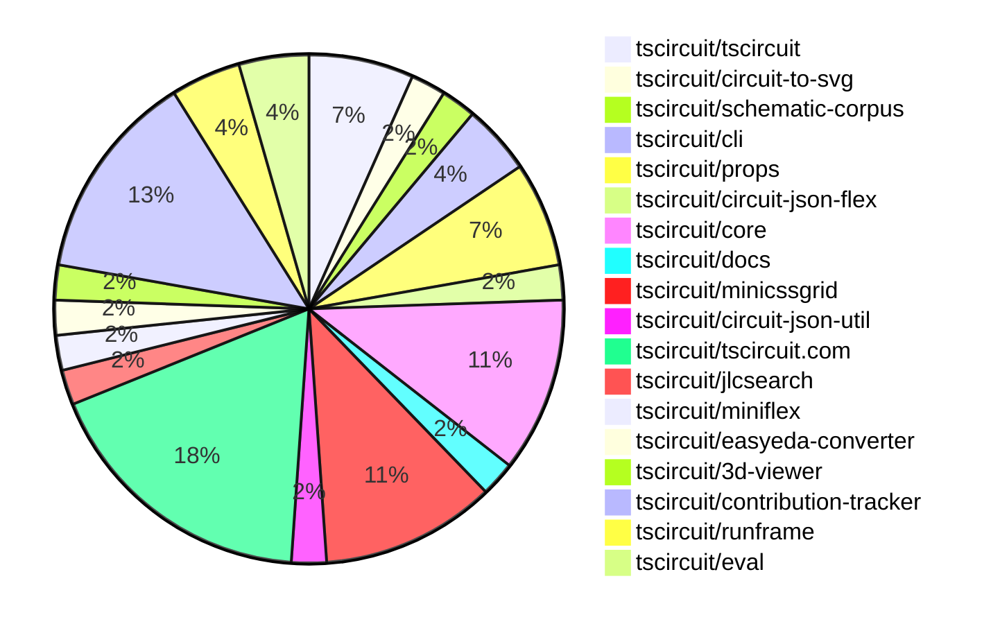
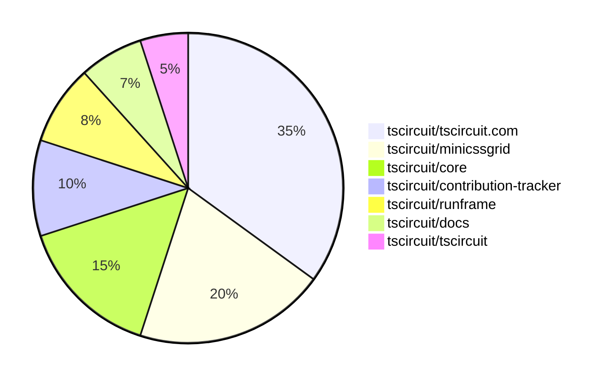

# Contribution Overview 2025-07-30

## PRs by Repository

## Contributor Overview

| Contributor | 🐳 Major | 🐙 Minor | 🐌 Tiny | ⭐ | Score | Discussion Contributions |
|-------------|---------|---------|---------|-----|----------------|--------------------------|
| [seveibar](#seveibar) | 4 | 1 | 11 | ⭐⭐⭐ | 42 | 0🔹 0🔶 0💎 |
| [ArnavK-09](#ArnavK-09) | 4 | 1 | 10 | ⭐⭐ | 28 | 0🔹 0🔶 0💎 |
| [imrishabh18](#imrishabh18) | 0 | 0 | 4 | ⭐ | 6 | 0🔹 0🔶 0💎 |
| [andrii-balitskyi](#andrii-balitskyi) | 1 | 1 | 0 | ⭐ | 6 | 0🔹 0🔶 0💎 |
| [MustafaMulla29](#MustafaMulla29) | 0 | 0 | 3 |  | 2.5 | 0🔹 0🔶 0💎 |
| [ShiboSoftwareDev](#ShiboSoftwareDev) | 0 | 0 | 2 |  | 2.5 | 0🔹 0🔶 0💎 |
| [abimaelmartell](#abimaelmartell) | 0 | 1 | 0 |  | 2 | 0🔹 0🔶 0💎 |
| [tscircuitbot](#tscircuitbot) | 0 | 0 | 2 |  | 2 | 0🔹 0🔶 0💎 |

### Discussion Contribution Legend

- 🔹 Normal Comments: Basic participation with minimal effort
- 🔶 Great Informative Comments: Thoughtful participation that adds value
- 💎 Incredible Comments: Exceptional participation with high-quality content

## Review Table

[reviews-received-hover]: ## "Number of reviews received for PRs for this contributor"
[approvals-received-hover]: ## "Number of approvals received for PRs this contributor authored"
[rejections-received-hover]: ## "Number of rejections received for PRs this contributor authored"
[prs-opened-hover]: ## "Number of PRs opened by this contributor"
[issues-created-hover]: ## "Number of issues created by this contributor"
[bountied-issues-hover]: ## "Number of issues this contributor created with a bounty"
[bountied-issue-$-hover]: ## "Total bounty amount placed on issues authored by this contributor"

| Contributor | Reviews Received | Approvals Received | Rejections Received | Approvals | Rejections | PRs Opened | PRs Merged | Score | Issues Created | Bountied Issues | Bountied Issue $ |
|---|---|---|---|---|---|---|---|---|---|---|---|
| [ShiboSoftwareDev](#ShiboSoftwareDev) | 4 | 4 | 0 | 1 | 0 | 4 | 2 | 2.5 | 0 | 0 | 0 |
| [MustafaMulla29](#MustafaMulla29) | 3 | 3 | 0 | 0 | 0 | 4 | 3 | 2.5 | 0 | 0 | 0 |
| [seveibar](#seveibar) | 4 | 0 | 0 | 22 | 1 | 18 | 16 | 42 | 0 | 0 | 0 |
| [imrishabh18](#imrishabh18) | 2 | 1 | 0 | 2 | 1 | 12 | 5 | 6 | 0 | 0 | 0 |
| [andrii-balitskyi](#andrii-balitskyi) | 3 | 2 | 0 | 0 | 0 | 4 | 2 | 6 | 0 | 0 | 0 |
| [graphite-app[bot]](#graphite-app[bot]) | 0 | 0 | 0 | 0 | 0 | 0 | 0 | 0 | 0 | 0 | 0 |
| [Abse2001](#Abse2001) | 2 | 0 | 1 | 2 | 0 | 1 | 0 | 0 | 0 | 0 | 0 |
| [abimaelmartell](#abimaelmartell) | 3 | 1 | 0 | 0 | 0 | 1 | 1 | 2 | 0 | 0 | 0 |
| [copilot-pull-request-reviewer[bot]](#copilot-pull-request-reviewer[bot]) | 0 | 0 | 0 | 0 | 0 | 0 | 0 | 0 | 0 | 0 | 0 |
| [ArnavK-09](#ArnavK-09) | 17 | 16 | 0 | 0 | 0 | 15 | 15 | 28 | 0 | 0 | 0 |
| [tscircuitbot](#tscircuitbot) | 0 | 0 | 0 | 0 | 0 | 11 | 2 | 2 | 0 | 0 | 0 |
| [LakshitAgarwal](#LakshitAgarwal) | 2 | 0 | 1 | 0 | 0 | 1 | 0 | 0 | 0 | 0 | 0 |

## Top 7 Repositories by Contribution Points

## Changes by Repository

### [tscircuit/tscircuit](https://github.com/tscircuit/tscircuit)

🐌 Tiny Contributions (3)

| PR # | Impact | Contributor | Description |
|------|--------|-------------|-------------|
| [#730](https://github.com/tscircuit/tscircuit/pull/730) | 🐌 Tiny | MustafaMulla29 | Updates the circuit-to-svg package to version 0.0.175 in package.json |
| [#729](https://github.com/tscircuit/tscircuit/pull/729) | 🐌 Tiny | ShiboSoftwareDev | Adds the tscircuitminiflex package and updates several dependencies in package.json |
| [#728](https://github.com/tscircuit/tscircuit/pull/728) | 🐌 Tiny | imrishabh18 | Updates the CLI dependency version from 0.1.190 to 0.1.191 in package.json |

### [tscircuit/circuit-to-svg](https://github.com/tscircuit/circuit-to-svg)

🐌 Tiny Contributions (1)

| PR # | Impact | Contributor | Description |
|------|--------|-------------|-------------|
| [#292](https://github.com/tscircuit/circuit-to-svg/pull/292) | 🐌 Tiny | MustafaMulla29 | Replaces all dependencies related to tscircuit with a single dependency on the tscircuit package. |

### [tscircuit/schematic-corpus](https://github.com/tscircuit/schematic-corpus)

🐌 Tiny Contributions (1)

| PR # | Impact | Contributor | Description |
|------|--------|-------------|-------------|
| [#133](https://github.com/tscircuit/schematic-corpus/pull/133) | 🐌 Tiny | MustafaMulla29 | Adds a new circuit design (design89) to enhance the matchAdapt algorithm functionality. |

### [tscircuit/cli](https://github.com/tscircuit/cli)

🐌 Tiny Contributions (2)

| PR # | Impact | Contributor | Description |
|------|--------|-------------|-------------|
| [#305](https://github.com/tscircuit/cli/pull/305) | 🐌 Tiny | ShiboSoftwareDev | Fixes issue where PCB and schematic differences are saved as PNG files instead of SVG, ensuring correct file formats are used for visual diffs. |
| [#303](https://github.com/tscircuit/cli/pull/303) | 🐌 Tiny | imrishabh18 | Updates the tscircuitrunframe dependency to version 0.0.752 in package.json |

### [tscircuit/props](https://github.com/tscircuit/props)

🐌 Tiny Contributions (3)

| PR # | Impact | Contributor | Description |
|------|--------|-------------|-------------|
| [#346](https://github.com/tscircuit/props/pull/346) | 🐌 Tiny | imrishabh18 | Adds a connections prop to the crystal  component, allowing users to specify connections and updates documentation accordingly. |
| [#345](https://github.com/tscircuit/props/pull/345) | 🐌 Tiny | seveibar | Adds a new property pcbFlexGap to the BaseGroupProps interface, allowing for flexible gap settings in PCB layouts. |
| [#342](https://github.com/tscircuit/props/pull/342) | 🐌 Tiny | seveibar | Add gridRowGap and gridColumnGap to layout config, expose new PCB grid gap fields on group props, update generated docs, bump dev dependency zod, document and test the new props |

### [tscircuit/circuit-json-flex](https://github.com/tscircuit/circuit-json-flex)

🐌 Tiny Contributions (1)

| PR # | Impact | Contributor | Description |
|------|--------|-------------|-------------|
| [#9](https://github.com/tscircuit/circuit-json-flex/pull/9) | 🐌 Tiny | imrishabh18 | Adds a test for rendering a board without specified dimensions, ensuring proper layout behavior for components without column and row gaps. |

### [tscircuit/core](https://github.com/tscircuit/core)

| PR # | Impact | Rating | Contributor | Description |
|------|--------|--------|-------------|-------------|
| [#1124](https://github.com/tscircuit/core/pull/1124) | 🐳 Major | ⭐⭐⭐ | seveibar | Adds support for inline flex layout in PCB groups, allowing for more flexible arrangement of components within the circuit design. |
| [#1090](https://github.com/tscircuit/core/pull/1090) | 🐙 Minor | ⭐⭐ | andrii-balitskyi | Fixes crash when externallyConnectedPins references pins not visible in schPinArrangement |

🐌 Tiny Contributions (3)

| PR # | Impact | Contributor | Description |
|------|--------|-------------|-------------|
| [#1123](https://github.com/tscircuit/core/pull/1123) | 🐌 Tiny | seveibar | Adds support for pcbFlexGap and moves PcbComponentSizeCalculation prior to layout, enhancing layout flexibility. |
| [#1121](https://github.com/tscircuit/core/pull/1121) | 🐌 Tiny | seveibar | Adds support for new layout properties including pcbPack, pcbGridRowGap, and pcbGridColumnGap in the Group component, while updating dependencies and removing obsolete tests. |
| [#1120](https://github.com/tscircuit/core/pull/1120) | 🐌 Tiny | seveibar | Fixes board auto-sizing to ignore components from other subcircuits, ensuring accurate dimensions for the board. |

### [tscircuit/docs](https://github.com/tscircuit/docs)

| PR # | Impact | Rating | Contributor | Description |
|------|--------|--------|-------------|-------------|
| [#105](https://github.com/tscircuit/docs/pull/105) | 🐳 Major | ⭐⭐⭐ | seveibar | Adds documentation for the new PCB automatic layout features, including methods for grid, flex, and pack layouts. |

### [tscircuit/minicssgrid](https://github.com/tscircuit/minicssgrid)

| PR # | Impact | Rating | Contributor | Description |
|------|--------|--------|-------------|-------------|
| [#7](https://github.com/tscircuit/minicssgrid/pull/7) | 🐳 Major | ⭐⭐⭐ | seveibar | Adds inline grid support by implementing auto-sizing and track counting for CSS grid layouts, enhancing layout flexibility without requiring explicit container dimensions. |
| [#5](https://github.com/tscircuit/minicssgrid/pull/5) | 🐳 Major | ⭐⭐⭐ | seveibar | html supports contentWidthcontentHeight add content width and height to examples |
| [#4](https://github.com/tscircuit/minicssgrid/pull/4) | 🐙 Minor | ⭐⭐ | seveibar | make sure widthheight is predictable - wip simplify level7 - regenerate browser results |

🐌 Tiny Contributions (2)

| PR # | Impact | Contributor | Description |
|------|--------|-------------|-------------|
| [#9](https://github.com/tscircuit/minicssgrid/pull/9) | 🐌 Tiny | seveibar | Removes borders from HTML elements to simplify the calculation of their bounds in the browser results. |
| [#6](https://github.com/tscircuit/minicssgrid/pull/6) | 🐌 Tiny | seveibar | Adds support for gaps and auto tracks, ensures predictable widthheight, simplifies level7, regenerates browser results, updates snapshots, and enhances README with usage details. |

### [tscircuit/circuit-json-util](https://github.com/tscircuit/circuit-json-util)

🐌 Tiny Contributions (1)

| PR # | Impact | Contributor | Description |
|------|--------|-------------|-------------|
| [#56](https://github.com/tscircuit/circuit-json-util/pull/56) | 🐌 Tiny | seveibar | Adds functionality to reposition a group of PCB elements within a circuit JSON structure based on a new center point. |

### [tscircuit/tscircuit.com](https://github.com/tscircuit/tscircuit.com)

| PR # | Impact | Rating | Contributor | Description |
|------|--------|--------|-------------|-------------|
| [#1533](https://github.com/tscircuit/tscircuit.com/pull/1533) | 🐳 Major | ⭐⭐⭐ | ArnavK-09 | Adds circuitJson support to the DownloadButtonAndMenu component, enabling multiple image format downloads. |
| [#1530](https://github.com/tscircuit/tscircuit.com/pull/1530) | 🐳 Major | ⭐⭐⭐ | ArnavK-09 | Adds TypeScript navigation features including Go to Definition functionality and TypeScript environment setup for improved code editing experience. |
| [#1531](https://github.com/tscircuit/tscircuit.com/pull/1531) | 🐳 Major | ⭐⭐⭐ | ArnavK-09 | Add account search functionality to the command menu and implement a new API endpoint for account search. |
| [#1522](https://github.com/tscircuit/tscircuit.com/pull/1522) | 🐳 Major | ⭐⭐⭐ | ArnavK-09 | Add a star icon and count display next to package tags to show popularity metrics. |
| [#1520](https://github.com/tscircuit/tscircuit.com/pull/1520) | 🐙 Minor | ⭐⭐ | ArnavK-09 | Adds a mobile menu toggle with MenuX icons, restructures navigation for better mobile experience, and updates background styling for different screen sizes. |

🐌 Tiny Contributions (3)

| PR # | Impact | Contributor | Description |
|------|--------|-------------|-------------|
| [#1523](https://github.com/tscircuit/tscircuit.com/pull/1523) | 🐌 Tiny | seveibar | Updates the demo link on the landing page to point to the correct example. |
| [#1532](https://github.com/tscircuit/tscircuit.com/pull/1532) | 🐌 Tiny | ArnavK-09 | Fixes rendering issue where dimensions for RunFrame are uneven, causing layout problems in the preview. |
| [#1521](https://github.com/tscircuit/tscircuit.com/pull/1521) | 🐌 Tiny | ArnavK-09 | Add conditional rendering of rebuild button to only show when the current user matches the package author, preventing unauthorized users from triggering rebuilds. |

### [tscircuit/jlcsearch](https://github.com/tscircuit/jlcsearch)

🐌 Tiny Contributions (1)

| PR # | Impact | Contributor | Description |
|------|--------|-------------|-------------|
| [#75](https://github.com/tscircuit/jlcsearch/pull/75) | 🐌 Tiny | seveibar | Adds documentation for PCIe M.2 connectors with orientation examples and links to the homepage. |

### [tscircuit/miniflex](https://github.com/tscircuit/miniflex)

🐌 Tiny Contributions (1)

| PR # | Impact | Contributor | Description |
|------|--------|-------------|-------------|
| [#2](https://github.com/tscircuit/miniflex/pull/2) | 🐌 Tiny | seveibar | Adds a metadata attribute to flex items and resolves type issues in the flexbox implementation. |

### [tscircuit/easyeda-converter](https://github.com/tscircuit/easyeda-converter)

| PR # | Impact | Rating | Contributor | Description |
|------|--------|--------|-------------|-------------|
| [#303](https://github.com/tscircuit/easyeda-converter/pull/303) | 🐙 Minor | ⭐⭐ | abimaelmartell | Introduces a new method for handling rectangular plated holes in PCB designs by utilizing pill holes with specified rectangle padding and rotation properties. |

### [tscircuit/3d-viewer](https://github.com/tscircuit/3d-viewer)

🐌 Tiny Contributions (1)

| PR # | Impact | Contributor | Description |
|------|--------|-------------|-------------|
| [#395](https://github.com/tscircuit/3d-viewer/pull/395) | 🐌 Tiny | ArnavK-09 | Add version number from package.json to the viewer controls panel to help users identify which version theyre using. |

### [tscircuit/contribution-tracker](https://github.com/tscircuit/contribution-tracker)

🐌 Tiny Contributions (6)

| PR # | Impact | Contributor | Description |
|------|--------|-------------|-------------|
| [#212](https://github.com/tscircuit/contribution-tracker/pull/212) | 🐌 Tiny | ArnavK-09 | Skip adding empty owners in the generated markdown for repositories, preventing blank entries in the codeowners section. |
| [#211](https://github.com/tscircuit/contribution-tracker/pull/211) | 🐌 Tiny | ArnavK-09 | Deduplicates owner links and repository entries in the generated markdown for CODEOWNERS. |
| [#207](https://github.com/tscircuit/contribution-tracker/pull/207) | 🐌 Tiny | ArnavK-09 | Adjusts score thresholds for the contributor graph to ensure accurate representation of contributor scores. |
| [#208](https://github.com/tscircuit/contribution-tracker/pull/208) | 🐌 Tiny | ArnavK-09 | Removes redundant discussion scoring logic and updates the column name to better reflect the data being displayed. The score column now shows the total contribution score directly. |
| [#209](https://github.com/tscircuit/contribution-tracker/pull/209) | 🐌 Tiny | ArnavK-09 | Adds debug logging for cache hits and misses in the AI object generation process to aid in production debugging. |
| [#210](https://github.com/tscircuit/contribution-tracker/pull/210) | 🐌 Tiny | ArnavK-09 | Fixes the issue where code owners for repositories were not displayed correctly, ensuring all code owners are shown gracefully in the contribution overview. |

### [tscircuit/runframe](https://github.com/tscircuit/runframe)

| PR # | Impact | Rating | Contributor | Description |
|------|--------|--------|-------------|-------------|
| [#882](https://github.com/tscircuit/runframe/pull/882) | 🐳 Major | ⭐⭐⭐ | andrii-balitskyi | Adds a version selector for the tscircuiteval package, allowing users to choose from multiple versions instead of being limited to the latest version. |

🐌 Tiny Contributions (1)

| PR # | Impact | Contributor | Description |
|------|--------|-------------|-------------|
| [#951](https://github.com/tscircuit/runframe/pull/951) | 🐌 Tiny | ArnavK-09 | Part 1 !image(https:github.comuser-attachmentsassets11300df3-9584-4968-adc9-690a640cd883) |

### [tscircuit/eval](https://github.com/tscircuit/eval)

🐌 Tiny Contributions (2)

| PR # | Impact | Contributor | Description |
|------|--------|-------------|-------------|
| [#787](https://github.com/tscircuit/eval/pull/787) | 🐌 Tiny | tscircuitbot | Updates the tscircuitcore package from version 0.0.603 to 0.0.607 and updates related dependencies in package.json. |
| [#779](https://github.com/tscircuit/eval/pull/779) | 🐌 Tiny | tscircuitbot | Updates the tscircuitcore package from version 0.0.598 to 0.0.603 and updates several other dependencies in package.json. |

## Changes by Contributor

### [MustafaMulla29](https://github.com/MustafaMulla29)

🐌 Tiny Contributions (3)

| PR # | Impact | Description |
|------|--------|-------------|
| [#730](https://github.com/tscircuit/tscircuit/pull/730) | 🐌 Tiny | Updates the circuit-to-svg package to version 0.0.175 in package.json |
| [#292](https://github.com/tscircuit/circuit-to-svg/pull/292) | 🐌 Tiny | Replaces all dependencies related to tscircuit with a single dependency on the tscircuit package. |
| [#133](https://github.com/tscircuit/schematic-corpus/pull/133) | 🐌 Tiny | Adds a new circuit design (design89) to enhance the matchAdapt algorithm functionality. |

### [ShiboSoftwareDev](https://github.com/ShiboSoftwareDev)

🐌 Tiny Contributions (2)

| PR # | Impact | Description |
|------|--------|-------------|
| [#729](https://github.com/tscircuit/tscircuit/pull/729) | 🐌 Tiny | Adds the tscircuitminiflex package and updates several dependencies in package.json |
| [#305](https://github.com/tscircuit/cli/pull/305) | 🐌 Tiny | Fixes issue where PCB and schematic differences are saved as PNG files instead of SVG, ensuring correct file formats are used for visual diffs. |

### [imrishabh18](https://github.com/imrishabh18)

🐌 Tiny Contributions (4)

| PR # | Impact | Description |
|------|--------|-------------|
| [#728](https://github.com/tscircuit/tscircuit/pull/728) | 🐌 Tiny | Updates the CLI dependency version from 0.1.190 to 0.1.191 in package.json |
| [#346](https://github.com/tscircuit/props/pull/346) | 🐌 Tiny | Adds a connections prop to the crystal  component, allowing users to specify connections and updates documentation accordingly. |
| [#303](https://github.com/tscircuit/cli/pull/303) | 🐌 Tiny | Updates the tscircuitrunframe dependency to version 0.0.752 in package.json |
| [#9](https://github.com/tscircuit/circuit-json-flex/pull/9) | 🐌 Tiny | Adds a test for rendering a board without specified dimensions, ensuring proper layout behavior for components without column and row gaps. |

### [seveibar](https://github.com/seveibar)

| PRs # | Impact | Rating | Description |
|------|--------|--------|-------------|
| [#1124](https://github.com/tscircuit/core/pull/1124) | 🐳 Major | ⭐⭐⭐ | Adds support for inline flex layout in PCB groups, allowing for more flexible arrangement of components within the circuit design. |
| [#105](https://github.com/tscircuit/docs/pull/105) | 🐳 Major | ⭐⭐⭐ | Adds documentation for the new PCB automatic layout features, including methods for grid, flex, and pack layouts. |
| [#7](https://github.com/tscircuit/minicssgrid/pull/7) | 🐳 Major | ⭐⭐⭐ | Adds inline grid support by implementing auto-sizing and track counting for CSS grid layouts, enhancing layout flexibility without requiring explicit container dimensions. |
| [#5](https://github.com/tscircuit/minicssgrid/pull/5) | 🐳 Major | ⭐⭐⭐ | html supports contentWidthcontentHeight add content width and height to examples |
| [#4](https://github.com/tscircuit/minicssgrid/pull/4) | 🐙 Minor | ⭐⭐ | make sure widthheight is predictable - wip simplify level7 - regenerate browser results |

🐌 Tiny Contributions (11)

| PR # | Impact | Description |
|------|--------|-------------|
| [#56](https://github.com/tscircuit/circuit-json-util/pull/56) | 🐌 Tiny | Adds functionality to reposition a group of PCB elements within a circuit JSON structure based on a new center point. |
| [#345](https://github.com/tscircuit/props/pull/345) | 🐌 Tiny | Adds a new property pcbFlexGap to the BaseGroupProps interface, allowing for flexible gap settings in PCB layouts. |
| [#342](https://github.com/tscircuit/props/pull/342) | 🐌 Tiny | Add gridRowGap and gridColumnGap to layout config, expose new PCB grid gap fields on group props, update generated docs, bump dev dependency zod, document and test the new props |
| [#1123](https://github.com/tscircuit/core/pull/1123) | 🐌 Tiny | Adds support for pcbFlexGap and moves PcbComponentSizeCalculation prior to layout, enhancing layout flexibility. |
| [#1121](https://github.com/tscircuit/core/pull/1121) | 🐌 Tiny | Adds support for new layout properties including pcbPack, pcbGridRowGap, and pcbGridColumnGap in the Group component, while updating dependencies and removing obsolete tests. |
| [#1120](https://github.com/tscircuit/core/pull/1120) | 🐌 Tiny | Fixes board auto-sizing to ignore components from other subcircuits, ensuring accurate dimensions for the board. |
| [#1523](https://github.com/tscircuit/tscircuit.com/pull/1523) | 🐌 Tiny | Updates the demo link on the landing page to point to the correct example. |
| [#75](https://github.com/tscircuit/jlcsearch/pull/75) | 🐌 Tiny | Adds documentation for PCIe M.2 connectors with orientation examples and links to the homepage. |
| [#2](https://github.com/tscircuit/miniflex/pull/2) | 🐌 Tiny | Adds a metadata attribute to flex items and resolves type issues in the flexbox implementation. |
| [#9](https://github.com/tscircuit/minicssgrid/pull/9) | 🐌 Tiny | Removes borders from HTML elements to simplify the calculation of their bounds in the browser results. |
| [#6](https://github.com/tscircuit/minicssgrid/pull/6) | 🐌 Tiny | Adds support for gaps and auto tracks, ensures predictable widthheight, simplifies level7, regenerates browser results, updates snapshots, and enhances README with usage details. |

### [abimaelmartell](https://github.com/abimaelmartell)

| PRs # | Impact | Rating | Description |
|------|--------|--------|-------------|
| [#303](https://github.com/tscircuit/easyeda-converter/pull/303) | 🐙 Minor | ⭐⭐ | Introduces a new method for handling rectangular plated holes in PCB designs by utilizing pill holes with specified rectangle padding and rotation properties. |

### [ArnavK-09](https://github.com/ArnavK-09)

| PRs # | Impact | Rating | Description |
|------|--------|--------|-------------|
| [#1533](https://github.com/tscircuit/tscircuit.com/pull/1533) | 🐳 Major | ⭐⭐⭐ | Adds circuitJson support to the DownloadButtonAndMenu component, enabling multiple image format downloads. |
| [#1530](https://github.com/tscircuit/tscircuit.com/pull/1530) | 🐳 Major | ⭐⭐⭐ | Adds TypeScript navigation features including Go to Definition functionality and TypeScript environment setup for improved code editing experience. |
| [#1531](https://github.com/tscircuit/tscircuit.com/pull/1531) | 🐳 Major | ⭐⭐⭐ | Add account search functionality to the command menu and implement a new API endpoint for account search. |
| [#1522](https://github.com/tscircuit/tscircuit.com/pull/1522) | 🐳 Major | ⭐⭐⭐ | Add a star icon and count display next to package tags to show popularity metrics. |
| [#1520](https://github.com/tscircuit/tscircuit.com/pull/1520) | 🐙 Minor | ⭐⭐ | Adds a mobile menu toggle with MenuX icons, restructures navigation for better mobile experience, and updates background styling for different screen sizes. |

🐌 Tiny Contributions (10)

| PR # | Impact | Description |
|------|--------|-------------|
| [#395](https://github.com/tscircuit/3d-viewer/pull/395) | 🐌 Tiny | Add version number from package.json to the viewer controls panel to help users identify which version theyre using. |
| [#212](https://github.com/tscircuit/contribution-tracker/pull/212) | 🐌 Tiny | Skip adding empty owners in the generated markdown for repositories, preventing blank entries in the codeowners section. |
| [#211](https://github.com/tscircuit/contribution-tracker/pull/211) | 🐌 Tiny | Deduplicates owner links and repository entries in the generated markdown for CODEOWNERS. |
| [#207](https://github.com/tscircuit/contribution-tracker/pull/207) | 🐌 Tiny | Adjusts score thresholds for the contributor graph to ensure accurate representation of contributor scores. |
| [#208](https://github.com/tscircuit/contribution-tracker/pull/208) | 🐌 Tiny | Removes redundant discussion scoring logic and updates the column name to better reflect the data being displayed. The score column now shows the total contribution score directly. |
| [#209](https://github.com/tscircuit/contribution-tracker/pull/209) | 🐌 Tiny | Adds debug logging for cache hits and misses in the AI object generation process to aid in production debugging. |
| [#210](https://github.com/tscircuit/contribution-tracker/pull/210) | 🐌 Tiny | Fixes the issue where code owners for repositories were not displayed correctly, ensuring all code owners are shown gracefully in the contribution overview. |
| [#1532](https://github.com/tscircuit/tscircuit.com/pull/1532) | 🐌 Tiny | Fixes rendering issue where dimensions for RunFrame are uneven, causing layout problems in the preview. |
| [#1521](https://github.com/tscircuit/tscircuit.com/pull/1521) | 🐌 Tiny | Add conditional rendering of rebuild button to only show when the current user matches the package author, preventing unauthorized users from triggering rebuilds. |
| [#951](https://github.com/tscircuit/runframe/pull/951) | 🐌 Tiny | Part 1 !image(https:github.comuser-attachmentsassets11300df3-9584-4968-adc9-690a640cd883) |

### [andrii-balitskyi](https://github.com/andrii-balitskyi)

| PRs # | Impact | Rating | Description |
|------|--------|--------|-------------|
| [#882](https://github.com/tscircuit/runframe/pull/882) | 🐳 Major | ⭐⭐⭐ | Adds a version selector for the tscircuiteval package, allowing users to choose from multiple versions instead of being limited to the latest version. |
| [#1090](https://github.com/tscircuit/core/pull/1090) | 🐙 Minor | ⭐⭐ | Fixes crash when externallyConnectedPins references pins not visible in schPinArrangement |

### [tscircuitbot](https://github.com/tscircuitbot)

🐌 Tiny Contributions (2)

| PR # | Impact | Description |
|------|--------|-------------|
| [#787](https://github.com/tscircuit/eval/pull/787) | 🐌 Tiny | Updates the tscircuitcore package from version 0.0.603 to 0.0.607 and updates related dependencies in package.json. |
| [#779](https://github.com/tscircuit/eval/pull/779) | 🐌 Tiny | Updates the tscircuitcore package from version 0.0.598 to 0.0.603 and updates several other dependencies in package.json. |

## Repository Owners

| Repository | Codeowners |
|------------|------------|
| [builder](https://github.com/tscircuit/builder/blob/main/.github/CODEOWNERS) | [seveibar](https://github.com/seveibar)
| [pcb-viewer](https://github.com/tscircuit/pcb-viewer/blob/main/.github/CODEOWNERS) | [seveibar](https://github.com/seveibar), [ShiboSoftwareDev](https://github.com/ShiboSoftwareDev)
| [footprints](https://github.com/tscircuit/footprints/blob/main/.github/CODEOWNERS) | [seveibar](https://github.com/seveibar)
| [footprinter](https://github.com/tscircuit/footprinter/blob/main/.github/CODEOWNERS) | [seveibar](https://github.com/seveibar), [techmannih](https://github.com/techmannih)
| [winterspec](https://github.com/tscircuit/winterspec/blob/main/.github/CODEOWNERS) | [seveibar](https://github.com/seveibar), [ShiboSoftwareDev](https://github.com/ShiboSoftwareDev)
| [jscad-electronics](https://github.com/tscircuit/jscad-electronics/blob/main/.github/CODEOWNERS) | [seveibar](https://github.com/seveibar), [abhijitxy](https://github.com/abhijitxy), [anas-sarkez](https://github.com/anas-sarkez)
| [circuit-to-svg](https://github.com/tscircuit/circuit-to-svg/blob/main/.github/CODEOWNERS) | [imrishabh18](https://github.com/imrishabh18)
| [schematic-symbols](https://github.com/tscircuit/schematic-symbols/blob/main/.github/CODEOWNERS) | [seveibar](https://github.com/seveibar), [imrishabh18](https://github.com/imrishabh18), [techmannih](https://github.com/techmannih)
| [circuit-json-to-gerber](https://github.com/tscircuit/circuit-json-to-gerber/blob/main/.github/CODEOWNERS) | [seveibar](https://github.com/seveibar), [ShiboSoftwareDev](https://github.com/ShiboSoftwareDev)
| [tscircuit.com](https://github.com/tscircuit/tscircuit.com/blob/main/.github/CODEOWNERS) | [seveibar](https://github.com/seveibar), [imrishabh18](https://github.com/imrishabh18)
| [cli](https://github.com/tscircuit/cli/blob/main/.github/CODEOWNERS) | [seveibar](https://github.com/seveibar), [imrishabh18](https://github.com/imrishabh18), [ArnavK-09](https://github.com/ArnavK-09)
| [issue-roulette](https://github.com/tscircuit/issue-roulette/blob/main/.github/CODEOWNERS) | [Anshgrover23](https://github.com/Anshgrover23)
| [sparkfun-boards](https://github.com/tscircuit/sparkfun-boards/blob/main/.github/CODEOWNERS) | [ShiboSoftwareDev](https://github.com/ShiboSoftwareDev), [MustafaMulla29](https://github.com/MustafaMulla29), [Anshgrover23](https://github.com/Anshgrover23), [Abse2001](https://github.com/Abse2001), [techmannih](https://github.com/techmannih)
| [schematic-corpus](https://github.com/tscircuit/schematic-corpus/blob/main/.github/CODEOWNERS) | [Abse2001](https://github.com/Abse2001)

## Repositories by Owner

| User | Repo |
|------|------|
| [seveibar](https://github.com/seveibar) | [builder](https://github.com/tscircuit/builder/blob/main/.github/CODEOWNERS) |
|  | [pcb-viewer](https://github.com/tscircuit/pcb-viewer/blob/main/.github/CODEOWNERS) |
|  | [footprints](https://github.com/tscircuit/footprints/blob/main/.github/CODEOWNERS) |
|  | [footprinter](https://github.com/tscircuit/footprinter/blob/main/.github/CODEOWNERS) |
|  | [winterspec](https://github.com/tscircuit/winterspec/blob/main/.github/CODEOWNERS) |
|  | [jscad-electronics](https://github.com/tscircuit/jscad-electronics/blob/main/.github/CODEOWNERS) |
|  | [schematic-symbols](https://github.com/tscircuit/schematic-symbols/blob/main/.github/CODEOWNERS) |
|  | [circuit-json-to-gerber](https://github.com/tscircuit/circuit-json-to-gerber/blob/main/.github/CODEOWNERS) |
|  | [tscircuit.com](https://github.com/tscircuit/tscircuit.com/blob/main/.github/CODEOWNERS) |
|  | [cli](https://github.com/tscircuit/cli/blob/main/.github/CODEOWNERS) |
| [ShiboSoftwareDev](https://github.com/ShiboSoftwareDev) | [pcb-viewer](https://github.com/tscircuit/pcb-viewer/blob/main/.github/CODEOWNERS) |
|  | [winterspec](https://github.com/tscircuit/winterspec/blob/main/.github/CODEOWNERS) |
|  | [circuit-json-to-gerber](https://github.com/tscircuit/circuit-json-to-gerber/blob/main/.github/CODEOWNERS) |
|  | [sparkfun-boards](https://github.com/tscircuit/sparkfun-boards/blob/main/.github/CODEOWNERS) |
| [techmannih](https://github.com/techmannih) | [footprinter](https://github.com/tscircuit/footprinter/blob/main/.github/CODEOWNERS) |
|  | [schematic-symbols](https://github.com/tscircuit/schematic-symbols/blob/main/.github/CODEOWNERS) |
|  | [sparkfun-boards](https://github.com/tscircuit/sparkfun-boards/blob/main/.github/CODEOWNERS) |
| [abhijitxy](https://github.com/abhijitxy) | [jscad-electronics](https://github.com/tscircuit/jscad-electronics/blob/main/.github/CODEOWNERS) |
| [anas-sarkez](https://github.com/anas-sarkez) | [jscad-electronics](https://github.com/tscircuit/jscad-electronics/blob/main/.github/CODEOWNERS) |
| [imrishabh18](https://github.com/imrishabh18) | [circuit-to-svg](https://github.com/tscircuit/circuit-to-svg/blob/main/.github/CODEOWNERS) |
|  | [schematic-symbols](https://github.com/tscircuit/schematic-symbols/blob/main/.github/CODEOWNERS) |
|  | [tscircuit.com](https://github.com/tscircuit/tscircuit.com/blob/main/.github/CODEOWNERS) |
|  | [cli](https://github.com/tscircuit/cli/blob/main/.github/CODEOWNERS) |
| [ArnavK-09](https://github.com/ArnavK-09) | [cli](https://github.com/tscircuit/cli/blob/main/.github/CODEOWNERS) |
| [Anshgrover23](https://github.com/Anshgrover23) | [issue-roulette](https://github.com/tscircuit/issue-roulette/blob/main/.github/CODEOWNERS) |
|  | [sparkfun-boards](https://github.com/tscircuit/sparkfun-boards/blob/main/.github/CODEOWNERS) |
| [MustafaMulla29](https://github.com/MustafaMulla29) | [sparkfun-boards](https://github.com/tscircuit/sparkfun-boards/blob/main/.github/CODEOWNERS) |
| [Abse2001](https://github.com/Abse2001) | [sparkfun-boards](https://github.com/tscircuit/sparkfun-boards/blob/main/.github/CODEOWNERS) |
|  | [schematic-corpus](https://github.com/tscircuit/schematic-corpus/blob/main/.github/CODEOWNERS) |

