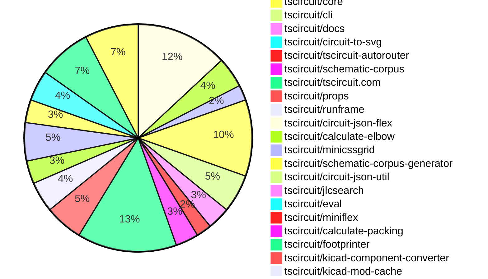
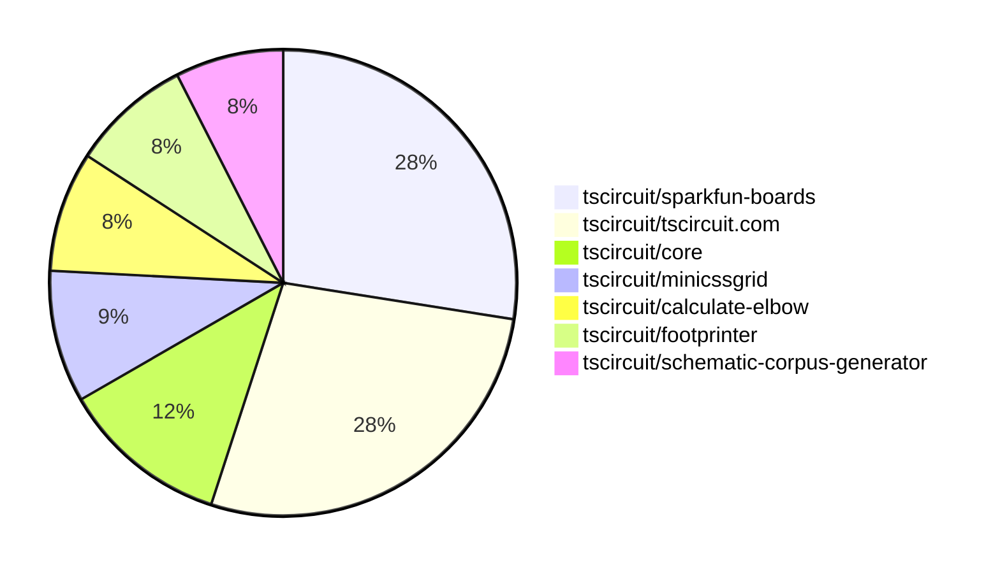

# Contribution Overview 2025-07-30

## PRs by Repository

## Contributor Overview

| Contributor | 🐳 Major | 🐙 Minor | 🐌 Tiny | ⭐ | Score | Discussion Contributions |
|-------------|---------|---------|---------|-----|----------------|--------------------------|
| [seveibar](#seveibar) | 9 | 2 | 21 | 👑 | 65 | 0🔹 0🔶 0💎 |
| [ArnavK-09](#ArnavK-09) | 6 | 1 | 13 | ⭐⭐⭐ | 39.5 | 0🔹 0🔶 0💎 |
| [Abse2001](#Abse2001) | 5 | 0 | 9 | ⭐⭐⭐ | 32.5 | 0🔹 0🔶 0💎 |
| [ShiboSoftwareDev](#ShiboSoftwareDev) | 3 | 0 | 9 | ⭐⭐⭐ | 31.5 | 0🔹 0🔶 0💎 |
| [MustafaMulla29](#MustafaMulla29) | 1 | 1 | 7 | ⭐⭐ | 12.5 | 0🔹 0🔶 0💎 |
| [imrishabh18](#imrishabh18) | 0 | 1 | 8 | ⭐⭐ | 12.5 | 0🔹 0🔶 0💎 |
| [andrii-balitskyi](#andrii-balitskyi) | 1 | 1 | 0 | ⭐ | 6 | 0🔹 0🔶 0💎 |
| [techmannih](#techmannih) | 0 | 1 | 1 | ⭐ | 5 | 0🔹 0🔶 0💎 |
| [tscircuitbot](#tscircuitbot) | 0 | 0 | 3 |  | 3 | 0🔹 0🔶 0💎 |
| [abimaelmartell](#abimaelmartell) | 0 | 0 | 1 |  | 1 | 0🔹 0🔶 0💎 |

### Discussion Contribution Legend

- 🔹 Normal Comments: Basic participation with minimal effort
- 🔶 Great Informative Comments: Thoughtful participation that adds value
- 💎 Incredible Comments: Exceptional participation with high-quality content

## Review Table

[reviews-received-hover]: ## "Number of reviews received for PRs for this contributor"
[approvals-received-hover]: ## "Number of approvals received for PRs this contributor authored"
[rejections-received-hover]: ## "Number of rejections received for PRs this contributor authored"
[prs-opened-hover]: ## "Number of PRs opened by this contributor"
[issues-created-hover]: ## "Number of issues created by this contributor"
[bountied-issues-hover]: ## "Number of issues this contributor created with a bounty"
[bountied-issue-$-hover]: ## "Total bounty amount placed on issues authored by this contributor"

| Contributor | Reviews Received | Approvals Received | Rejections Received | Approvals | Rejections | PRs Opened | PRs Merged | Score | Issues Created | Bountied Issues | Bountied Issue $ |
|---|---|---|---|---|---|---|---|---|---|---|---|
| [ShiboSoftwareDev](#ShiboSoftwareDev) | 19 | 13 | 0 | 13 | 0 | 14 | 12 | 31.5 | 0 | 0 | 0 |
| [seveibar](#seveibar) | 11 | 1 | 0 | 43 | 1 | 42 | 33 | 65 | 0 | 0 | 0 |
| [google-labs-jules[bot]](#google-labs-jules[bot]) | 0 | 0 | 0 | 0 | 0 | 1 | 0 | 0 | 0 | 0 | 0 |
| [MustafaMulla29](#MustafaMulla29) | 10 | 9 | 0 | 0 | 0 | 9 | 9 | 12.5 | 0 | 0 | 0 |
| [imrishabh18](#imrishabh18) | 8 | 6 | 1 | 3 | 1 | 14 | 10 | 12.5 | 0 | 0 | 0 |
| [graphite-app[bot]](#graphite-app[bot]) | 0 | 0 | 0 | 0 | 0 | 0 | 0 | 0 | 0 | 0 | 0 |
| [pxlpal](#pxlpal) | 1 | 0 | 0 | 0 | 0 | 1 | 0 | 0 | 0 | 0 | 0 |
| [andrii-balitskyi](#andrii-balitskyi) | 6 | 2 | 1 | 0 | 0 | 4 | 2 | 6 | 0 | 0 | 0 |
| [Abse2001](#Abse2001) | 17 | 12 | 0 | 4 | 0 | 14 | 14 | 32.5 | 0 | 0 | 0 |
| [techmannih](#techmannih) | 2 | 1 | 0 | 0 | 2 | 2 | 2 | 5 | 0 | 0 | 0 |
| [babyo77](#babyo77) | 2 | 0 | 1 | 0 | 0 | 2 | 0 | 0 | 0 | 0 | 0 |
| [abimaelmartell](#abimaelmartell) | 3 | 1 | 0 | 0 | 0 | 2 | 1 | 1 | 0 | 0 | 0 |
| [copilot-pull-request-reviewer[bot]](#copilot-pull-request-reviewer[bot]) | 0 | 0 | 0 | 0 | 0 | 0 | 0 | 0 | 0 | 0 | 0 |
| [ArnavK-09](#ArnavK-09) | 24 | 20 | 0 | 2 | 1 | 21 | 20 | 39.5 | 0 | 0 | 0 |
| [tscircuitbot](#tscircuitbot) | 0 | 0 | 0 | 0 | 0 | 20 | 3 | 3 | 0 | 0 | 0 |
| [LakshitAgarwal](#LakshitAgarwal) | 3 | 0 | 2 | 0 | 0 | 1 | 0 | 0 | 0 | 0 | 0 |

## Top 7 Repositories by Contribution Points

## Changes by Repository

### [tscircuit/circuit-json-to-spice](https://github.com/tscircuit/circuit-json-to-spice)

| PR # | Impact | Rating | Contributor | Description |
|------|--------|--------|-------------|-------------|
| [#8](https://github.com/tscircuit/circuit-json-to-spice/pull/8) | 🐳 Major | ⭐⭐⭐ | ShiboSoftwareDev | Refactors the circuitJsonToSpice function to better align with SPICE specifications, including improved handling of source components and ports, and introduces a new SpiceSubcircuit class for better netlist management. |

### [tscircuit/sparkfun-boards](https://github.com/tscircuit/sparkfun-boards)

| PR # | Impact | Rating | Contributor | Description |
|------|--------|--------|-------------|-------------|
| [#106](https://github.com/tscircuit/sparkfun-boards/pull/106) | 🐳 Major | ⭐⭐⭐ | ShiboSoftwareDev | Introduces a new circuit board for the SparkFun Roller Encoder Breakout, including its schematic and footprint. |
| [#104](https://github.com/tscircuit/sparkfun-boards/pull/104) | 🐳 Major | ⭐⭐⭐ | ShiboSoftwareDev | Introduces a new circuit board design for the SparkFun SOIC to DIP Adapter with a complete schematic and PCB layout. |
| [#73](https://github.com/tscircuit/sparkfun-boards/pull/73) | 🐳 Major | ⭐⭐⭐ | MustafaMulla29 | Introduces a new circuit board for the SparkFun Voltage-Level Translator Breakout - TXB0104, including its schematic and footprint. |
| [#105](https://github.com/tscircuit/sparkfun-boards/pull/105) | 🐳 Major | ⭐⭐⭐ | Abse2001 | Introduces a new circuit board for the SparkFun SSOP to DIP Adapter with associated schematic and documentation. |
| [#103](https://github.com/tscircuit/sparkfun-boards/pull/103) | 🐳 Major | ⭐⭐⭐ | Abse2001 | Introduces a new circuit board for the SparkFun Haptic Motor Driver DRV2605L, including its schematic and footprint. |
| [#102](https://github.com/tscircuit/sparkfun-boards/pull/102) | 🐳 Major | ⭐⭐⭐ | Abse2001 | Introduces a new circuit board for the SparkFun ToF Range Finder VL6180, including its schematic and PCB layout. |
| [#99](https://github.com/tscircuit/sparkfun-boards/pull/99) | 🐳 Major | ⭐⭐⭐ | Abse2001 | Introduces a new circuit board for the SparkFun Altitude Pressure Sensor Breakout MPL3115A2, including its schematic and footprint. |

🐌 Tiny Contributions (5)

| PR # | Impact | Contributor | Description |
|------|--------|-------------|-------------|
| [#98](https://github.com/tscircuit/sparkfun-boards/pull/98) | 🐌 Tiny | ShiboSoftwareDev | Adds 3D snapshot generation for all circuit boards in the repository, enhancing visualization capabilities. |
| [#101](https://github.com/tscircuit/sparkfun-boards/pull/101) | 🐌 Tiny | MustafaMulla29 | Updates the CODEOWNERS file to include the new SparkFun Voltage Level Translator Breakout board under the ownership of MustafaMulla29. |
| [#96](https://github.com/tscircuit/sparkfun-boards/pull/96) | 🐌 Tiny | MustafaMulla29 | No description provided |
| [#107](https://github.com/tscircuit/sparkfun-boards/pull/107) | 🐌 Tiny | Abse2001 | Updates the CODEOWNERS file to assign new ownership for additional SparkFun boards. |
| [#97](https://github.com/tscircuit/sparkfun-boards/pull/97) | 🐌 Tiny | Abse2001 | Fixes the footprint label for bottom side pins in the circuit design files for multiple boards. |

### [tscircuit/tscircuit](https://github.com/tscircuit/tscircuit)

🐌 Tiny Contributions (4)

| PR # | Impact | Contributor | Description |
|------|--------|-------------|-------------|
| [#731](https://github.com/tscircuit/tscircuit/pull/731) | 🐌 Tiny | ShiboSoftwareDev | Updates the version of the circuit-json-to-simple-3d dependency from 0.0.2 to 0.0.6 in package.json |
| [#729](https://github.com/tscircuit/tscircuit/pull/729) | 🐌 Tiny | ShiboSoftwareDev | Adds the tscircuitminiflex package and updates several existing dependencies in package.json |
| [#730](https://github.com/tscircuit/tscircuit/pull/730) | 🐌 Tiny | MustafaMulla29 | Updates the circuit-to-svg package to version 0.0.175 in package.json |
| [#728](https://github.com/tscircuit/tscircuit/pull/728) | 🐌 Tiny | imrishabh18 | Updates the CLI dependency version from 0.1.190 to 0.1.191 in package.json |

### [tscircuit/circuit-json](https://github.com/tscircuit/circuit-json)

🐌 Tiny Contributions (2)

| PR # | Impact | Contributor | Description |
|------|--------|-------------|-------------|
| [#248](https://github.com/tscircuit/circuit-json/pull/248) | 🐌 Tiny | ShiboSoftwareDev | Adds positive_source_net_id and negative_source_net_id fields to the simulation_voltage_source interface for enhanced simulation capabilities. |
| [#247](https://github.com/tscircuit/circuit-json/pull/247) | 🐌 Tiny | seveibar | Adds an optional layout_mode field to the pcb_group interface, allowing users to specify layout preferences, along with documentation and tests for this new feature. |

### [tscircuit/core](https://github.com/tscircuit/core)

| PR # | Impact | Rating | Contributor | Description |
|------|--------|--------|-------------|-------------|
| [#1124](https://github.com/tscircuit/core/pull/1124) | 🐳 Major | ⭐⭐⭐ | seveibar | Adds support for inline flex layout in PCB groups, allowing for more flexible arrangement of components within the circuit design. |
| [#1090](https://github.com/tscircuit/core/pull/1090) | 🐙 Minor | ⭐⭐ | andrii-balitskyi | Fixes crash when externallyConnectedPins references pins not visible in schPinArrangement |

🐌 Tiny Contributions (8)

| PR # | Impact | Contributor | Description |
|------|--------|-------------|-------------|
| [#1130](https://github.com/tscircuit/core/pull/1130) | 🐌 Tiny | ShiboSoftwareDev | Adds functionality to create a simulation voltage source for chips with specific pin attributes, enhancing circuit simulation capabilities. |
| [#1129](https://github.com/tscircuit/core/pull/1129) | 🐌 Tiny | ShiboSoftwareDev | Updates the tscircuitsimple-3d-svg dependency to version 0.0.38 in package.json |
| [#1127](https://github.com/tscircuit/core/pull/1127) | 🐌 Tiny | ShiboSoftwareDev | Updates the dependency version of circuit-json-to-simple-3d from 0.0.2 to 0.0.6 and modifies the SVG conversion function to await the result of the conversion process. |
| [#1125](https://github.com/tscircuit/core/pull/1125) | 🐌 Tiny | imrishabh18 | Adds validation for pin labels to prevent leading or trailing spaces in error messages for InvalidProps. |
| [#1126](https://github.com/tscircuit/core/pull/1126) | 🐌 Tiny | seveibar | Adds support for the pcbGap property in PCB layout packing, allowing for more flexible component spacing. |
| [#1123](https://github.com/tscircuit/core/pull/1123) | 🐌 Tiny | seveibar | Adds support for pcbFlexGap and moves PcbComponentSizeCalculation prior to layout, enhancing layout flexibility. |
| [#1121](https://github.com/tscircuit/core/pull/1121) | 🐌 Tiny | seveibar | Adds support for new layout properties including pcbPack, pcbGridRowGap, and pcbGridColumnGap in the Group component, while updating dependencies and removing obsolete tests. |
| [#1120](https://github.com/tscircuit/core/pull/1120) | 🐌 Tiny | seveibar | Fixes board auto-sizing to ignore components from other subcircuits, ensuring accurate dimensions for the board. |

### [tscircuit/cli](https://github.com/tscircuit/cli)

🐌 Tiny Contributions (5)

| PR # | Impact | Contributor | Description |
|------|--------|-------------|-------------|
| [#306](https://github.com/tscircuit/cli/pull/306) | 🐌 Tiny | ShiboSoftwareDev | Updates the dependency from circuit-json-to-simple-3d to a newer version in package.json |
| [#305](https://github.com/tscircuit/cli/pull/305) | 🐌 Tiny | ShiboSoftwareDev | Fixes issue where PCB and schematic differences are saved as PNG files instead of SVG, ensuring correct file formats are used for visual diffs. |
| [#308](https://github.com/tscircuit/cli/pull/308) | 🐌 Tiny | imrishabh18 | Updates the tscircuitrunframe dependency to version 0.0.770 in package.json |
| [#303](https://github.com/tscircuit/cli/pull/303) | 🐌 Tiny | imrishabh18 | Updates the tscircuitrunframe dependency to version 0.0.752 in package.json |
| [#307](https://github.com/tscircuit/cli/pull/307) | 🐌 Tiny | seveibar | Enables the tsci snapshot command to accept a directory path, allowing users to generate snapshots for multiple board and circuit files within that directory. |

### [tscircuit/docs](https://github.com/tscircuit/docs)

| PR # | Impact | Rating | Contributor | Description |
|------|--------|--------|-------------|-------------|
| [#107](https://github.com/tscircuit/docs/pull/107) | 🐙 Minor | ⭐⭐ | MustafaMulla29 | Adds documentation for the inductor built-in component, detailing its specifications, usage, and examples. |
| [#106](https://github.com/tscircuit/docs/pull/106) | 🐙 Minor | ⭐⭐ | seveibar | Simplifies the display of code examples and improves the layout of the CircuitPreview component in documentation files. |

🐌 Tiny Contributions (1)

| PR # | Impact | Contributor | Description |
|------|--------|-------------|-------------|
| [#105](https://github.com/tscircuit/docs/pull/105) | 🐌 Tiny | seveibar | Adds documentation for the new PCB automatic layout features including methods for grid, flex, and pack layouts. |

### [tscircuit/circuit-to-svg](https://github.com/tscircuit/circuit-to-svg)

🐌 Tiny Contributions (1)

| PR # | Impact | Contributor | Description |
|------|--------|-------------|-------------|
| [#292](https://github.com/tscircuit/circuit-to-svg/pull/292) | 🐌 Tiny | MustafaMulla29 | Replaces all dependencies related to tscircuit with a single dependency on the tscircuit package. |

### [tscircuit/tscircuit-autorouter](https://github.com/tscircuit/tscircuit-autorouter)

| PR # | Impact | Rating | Contributor | Description |
|------|--------|--------|-------------|-------------|
| [#225](https://github.com/tscircuit/tscircuit-autorouter/pull/225) | 🐳 Major | ⭐⭐⭐ | seveibar | Fixes the issue where the Flatbush index is incorrectly created with zero items by implementing a fallback to rbush for empty inputs and ensuring proper handling of the index capacity. |

🐌 Tiny Contributions (1)

| PR # | Impact | Contributor | Description |
|------|--------|-------------|-------------|
| [#226](https://github.com/tscircuit/tscircuit-autorouter/pull/226) | 🐌 Tiny | MustafaMulla29 | Adds a bug report JSON and a corresponding fixture for testing the autorouting system. |

### [tscircuit/schematic-corpus](https://github.com/tscircuit/schematic-corpus)

| PR # | Impact | Rating | Contributor | Description |
|------|--------|--------|-------------|-------------|
| [#134](https://github.com/tscircuit/schematic-corpus/pull/134) | 🐳 Major | ⭐⭐⭐ | seveibar | Adds new generated 3-pin circuit designs with initial packing and layout calculations to the schematic corpus. |

🐌 Tiny Contributions (2)

| PR # | Impact | Contributor | Description |
|------|--------|-------------|-------------|
| [#135](https://github.com/tscircuit/schematic-corpus/pull/135) | 🐌 Tiny | MustafaMulla29 | Adds a new circuit design (design090) to enhance the matchAdapt algorithm functionality. |
| [#133](https://github.com/tscircuit/schematic-corpus/pull/133) | 🐌 Tiny | MustafaMulla29 | Adds a new circuit design (design89) to enhance the matchAdapt algorithm functionality. |

### [tscircuit/tscircuit.com](https://github.com/tscircuit/tscircuit.com)

| PR # | Impact | Rating | Contributor | Description |
|------|--------|--------|-------------|-------------|
| [#1537](https://github.com/tscircuit/tscircuit.com/pull/1537) | 🐳 Major | ⭐⭐⭐ | ArnavK-09 | Adds folder support to the file sidebar, allowing users to create and manage files within folders, enhancing file organization. |
| [#1534](https://github.com/tscircuit/tscircuit.com/pull/1534) | 🐳 Major | ⭐⭐⭐ | ArnavK-09 | Adds a new dialog component for creating releases, allowing users to specify versioning and manage package releases effectively. |
| [#1533](https://github.com/tscircuit/tscircuit.com/pull/1533) | 🐳 Major | ⭐⭐⭐ | ArnavK-09 | Adds circuitJson support to the DownloadButtonAndMenu component, enabling multiple image format downloads. |
| [#1530](https://github.com/tscircuit/tscircuit.com/pull/1530) | 🐳 Major | ⭐⭐⭐ | ArnavK-09 | Adds TypeScript navigation features including Go to Definition functionality and TypeScript environment setup for improved code editing experience. |
| [#1531](https://github.com/tscircuit/tscircuit.com/pull/1531) | 🐳 Major | ⭐⭐⭐ | ArnavK-09 | Add account search functionality to the command menu and implement a new API endpoint for account search. |
| [#1522](https://github.com/tscircuit/tscircuit.com/pull/1522) | 🐳 Major | ⭐⭐⭐ | ArnavK-09 | Add a star icon and count display next to package tags to show popularity metrics, with a default of 0 if not available. |
| [#1528](https://github.com/tscircuit/tscircuit.com/pull/1528) | 🐙 Minor | ⭐⭐ | imrishabh18 | Fixes the issue where the CodeEditor loses focus and the undo functionality fails when the entire text of the file is cleared. |
| [#1520](https://github.com/tscircuit/tscircuit.com/pull/1520) | 🐙 Minor | ⭐⭐ | ArnavK-09 | Adds a mobile menu toggle with MenuX icons, restructures navigation for better mobile experience, and updates background styling for different screen sizes |

🐌 Tiny Contributions (5)

| PR # | Impact | Contributor | Description |
|------|--------|-------------|-------------|
| [#1527](https://github.com/tscircuit/tscircuit.com/pull/1527) | 🐌 Tiny | imrishabh18 | Imports components from JLCPCB into the imports directory when using the CodeEditor import dialog |
| [#1523](https://github.com/tscircuit/tscircuit.com/pull/1523) | 🐌 Tiny | seveibar | Updates the demo link on the landing page to point to the correct example. |
| [#1538](https://github.com/tscircuit/tscircuit.com/pull/1538) | 🐌 Tiny | ArnavK-09 | Reduces sidebar width from 34rem to 14rem when open and removes unnecessary red border color |
| [#1532](https://github.com/tscircuit/tscircuit.com/pull/1532) | 🐌 Tiny | ArnavK-09 | Fixes rendering issue where dimensions for RunFrame were uneven, causing layout problems in the preview. |
| [#1521](https://github.com/tscircuit/tscircuit.com/pull/1521) | 🐌 Tiny | ArnavK-09 | Add conditional rendering of rebuild button to only show when the current user matches the package author, preventing unauthorized users from triggering rebuilds. |

### [tscircuit/props](https://github.com/tscircuit/props)

🐌 Tiny Contributions (5)

| PR # | Impact | Contributor | Description |
|------|--------|-------------|-------------|
| [#346](https://github.com/tscircuit/props/pull/346) | 🐌 Tiny | imrishabh18 | Adds a new connections prop to the crystal  component, allowing users to specify connections for the crystal and includes documentation and tests for this new functionality. |
| [#350](https://github.com/tscircuit/props/pull/350) | 🐌 Tiny | seveibar | Adds schematic layout properties for schFlex, schPack, and schGrid to the group, enabling enhanced layout configurations in schematic designs. |
| [#349](https://github.com/tscircuit/props/pull/349) | 🐌 Tiny | seveibar | Adds new properties for pcbPadding and its directional variants to group components, along with documentation updates and unit tests. |
| [#345](https://github.com/tscircuit/props/pull/345) | 🐌 Tiny | seveibar | Adds a new property pcbFlexGap to the BaseGroupProps interface, allowing for flexible gap settings in PCB layouts. |
| [#342](https://github.com/tscircuit/props/pull/342) | 🐌 Tiny | seveibar | Add gridRowGap and gridColumnGap to layout config, expose new PCB grid gap fields on group props, update generated docs, bump dev dependency zod, document and test the new props. |

### [tscircuit/runframe](https://github.com/tscircuit/runframe)

| PR # | Impact | Rating | Contributor | Description |
|------|--------|--------|-------------|-------------|
| [#882](https://github.com/tscircuit/runframe/pull/882) | 🐳 Major | ⭐⭐⭐ | andrii-balitskyi | Adds a version selector for the tscircuiteval package, allowing users to choose from multiple versions instead of being limited to the latest version. |

🐌 Tiny Contributions (3)

| PR # | Impact | Contributor | Description |
|------|--------|-------------|-------------|
| [#959](https://github.com/tscircuit/runframe/pull/959) | 🐌 Tiny | imrishabh18 | Removes unnecessary hook calls that were causing memory call stack issues in the ErrorTabContent component. |
| [#957](https://github.com/tscircuit/runframe/pull/957) | 🐌 Tiny | ArnavK-09 | Changes the URL in the encodeFsMapToUrlHash function to a specific domain instead of using the window location origin. |
| [#951](https://github.com/tscircuit/runframe/pull/951) | 🐌 Tiny | ArnavK-09 | Part 1 img width958 height521 altimage srchttps:github.comuser-attachmentsassets11300df3-9584-4968-adc9-690a640cd883 |

### [tscircuit/circuit-json-flex](https://github.com/tscircuit/circuit-json-flex)

🐌 Tiny Contributions (1)

| PR # | Impact | Contributor | Description |
|------|--------|-------------|-------------|
| [#9](https://github.com/tscircuit/circuit-json-flex/pull/9) | 🐌 Tiny | imrishabh18 | Adds a test for rendering a board without specified dimensions, ensuring proper layout handling for components without columnGap and rowGap. |

### [tscircuit/calculate-elbow](https://github.com/tscircuit/calculate-elbow)

| PR # | Impact | Rating | Contributor | Description |
|------|--------|--------|-------------|-------------|
| [#7](https://github.com/tscircuit/calculate-elbow/pull/7) | 🐳 Major | ⭐⭐⭐ | seveibar | Simplifies the elbow calculation implementation by removing unused logic, adding rotation normalization, and implementing mirroring, while also skipping failing tests and adding new balanced tests. |
| [#6](https://github.com/tscircuit/calculate-elbow/pull/6) | 🐳 Major | ⭐⭐⭐ | seveibar | Pre-sorts input points before calculating elbow paths and reverses the result if the original order is flipped, ensuring correct path orientation. Updates README documentation and tests to verify functionality with reversed inputs. |
| [#5](https://github.com/tscircuit/calculate-elbow/pull/5) | 🐙 Minor | ⭐⭐ | seveibar | Fixes overshooting issue when routing from y to x elbows where the start point is positioned right or above the end point, and adds unit tests for this case. |

### [tscircuit/minicssgrid](https://github.com/tscircuit/minicssgrid)

| PR # | Impact | Rating | Contributor | Description |
|------|--------|--------|-------------|-------------|
| [#7](https://github.com/tscircuit/minicssgrid/pull/7) | 🐳 Major | ⭐⭐⭐ | seveibar | Adds inline grid support by implementing auto-sizing and track counting for CSS grid layouts, enhancing layout flexibility without requiring explicit container dimensions. |
| [#5](https://github.com/tscircuit/minicssgrid/pull/5) | 🐳 Major | ⭐⭐⭐ | seveibar | html supports contentWidthcontentHeight add content width and height to examples |

🐌 Tiny Contributions (3)

| PR # | Impact | Contributor | Description |
|------|--------|-------------|-------------|
| [#9](https://github.com/tscircuit/minicssgrid/pull/9) | 🐌 Tiny | seveibar | Removes borders from HTML elements to simplify the calculation of their bounds in the browser results. |
| [#6](https://github.com/tscircuit/minicssgrid/pull/6) | 🐌 Tiny | seveibar | Adds support for gaps and auto tracks, ensures predictable widthheight, simplifies level7, regenerates browser results, updates boundary logic, and enhances README with usage details. |
| [#4](https://github.com/tscircuit/minicssgrid/pull/4) | 🐌 Tiny | seveibar | make sure widthheight is predictable wip simplify level7 regenerate browser results |

### [tscircuit/schematic-corpus-generator](https://github.com/tscircuit/schematic-corpus-generator)

| PR # | Impact | Rating | Contributor | Description |
|------|--------|--------|-------------|-------------|
| [#4](https://github.com/tscircuit/schematic-corpus-generator/pull/4) | 🐳 Major | ⭐⭐⭐ | seveibar | increase max iterations in ui wip add getCode implementation for patterns add code display remove RootCircuit (nonexistent element) init script format generate initial snapshots add slight vertical extension when a symbol is horizontal regenerate p2 fix bad dims being loaded add getSubVariants test add schematic net label support wip minor memoization improve memoization for variant generation further wip improve variant generation speed compute p2 minor adjustments minor changes to logging add verbose wip update snapshots |
| [#2](https://github.com/tscircuit/schematic-corpus-generator/pull/2) | 🐳 Major | ⭐⭐⭐ | seveibar | Adds a new TwoPinCapacitorAndResistor component to support additional two-pin variants in schematic generation. |

🐌 Tiny Contributions (1)

| PR # | Impact | Contributor | Description |
|------|--------|-------------|-------------|
| [#3](https://github.com/tscircuit/schematic-corpus-generator/pull/3) | 🐌 Tiny | seveibar | Adds reference schematics and up to 4 capacitor variations for improved schematic generation. |

### [tscircuit/circuit-json-util](https://github.com/tscircuit/circuit-json-util)

🐌 Tiny Contributions (1)

| PR # | Impact | Contributor | Description |
|------|--------|-------------|-------------|
| [#56](https://github.com/tscircuit/circuit-json-util/pull/56) | 🐌 Tiny | seveibar | Adds functionality to reposition a group of PCB elements within a circuit JSON structure based on a new center point. |

### [tscircuit/jlcsearch](https://github.com/tscircuit/jlcsearch)

🐌 Tiny Contributions (1)

| PR # | Impact | Contributor | Description |
|------|--------|-------------|-------------|
| [#75](https://github.com/tscircuit/jlcsearch/pull/75) | 🐌 Tiny | seveibar | Adds documentation for PCIe M.2 connectors with orientation examples and links to the homepage. |

### [tscircuit/eval](https://github.com/tscircuit/eval)

🐌 Tiny Contributions (4)

| PR # | Impact | Contributor | Description |
|------|--------|-------------|-------------|
| [#727](https://github.com/tscircuit/eval/pull/727) | 🐌 Tiny | seveibar | Removes the legacy documentation file for example circuit transpilation and execution implementation. |
| [#795](https://github.com/tscircuit/eval/pull/795) | 🐌 Tiny | tscircuitbot | Updates the tscircuitcore package and other related dependencies to their latest versions. |
| [#787](https://github.com/tscircuit/eval/pull/787) | 🐌 Tiny | tscircuitbot | Updates the tscircuitcore package to version 0.0.607 and other related dependencies in package.json. |
| [#779](https://github.com/tscircuit/eval/pull/779) | 🐌 Tiny | tscircuitbot | Updates the tscircuitcore package to version 0.0.603 and other related dependencies in package.json. |

### [tscircuit/miniflex](https://github.com/tscircuit/miniflex)

🐌 Tiny Contributions (1)

| PR # | Impact | Contributor | Description |
|------|--------|-------------|-------------|
| [#2](https://github.com/tscircuit/miniflex/pull/2) | 🐌 Tiny | seveibar | Adds a metadata attribute to flex items and resolves type issues in the codebase. |

### [tscircuit/calculate-packing](https://github.com/tscircuit/calculate-packing)

🐌 Tiny Contributions (1)

| PR # | Impact | Contributor | Description |
|------|--------|-------------|-------------|
| [#8](https://github.com/tscircuit/calculate-packing/pull/8) | 🐌 Tiny | seveibar | Adds support for a packFirst parameter that allows users to specify components that should be prioritized in the packing order. |

### [tscircuit/footprinter](https://github.com/tscircuit/footprinter)

| PR # | Impact | Rating | Contributor | Description |
|------|--------|--------|-------------|-------------|
| [#338](https://github.com/tscircuit/footprinter/pull/338) | 🐳 Major | ⭐⭐⭐ | Abse2001 | Adds a function to compare footprint accuracy between Footprinter and KiCad, allowing users to validate their designs against KiCads footprint data. |

🐌 Tiny Contributions (6)

| PR # | Impact | Contributor | Description |
|------|--------|-------------|-------------|
| [#344](https://github.com/tscircuit/footprinter/pull/344) | 🐌 Tiny | Abse2001 | Adjusts the dimensions of passive component footprints to match KiCad specifications. |
| [#343](https://github.com/tscircuit/footprinter/pull/343) | 🐌 Tiny | Abse2001 | Fixes dimensions of electronic component footprints and adds tests for KiCad parity. |
| [#342](https://github.com/tscircuit/footprinter/pull/342) | 🐌 Tiny | Abse2001 | Fixes electronic component footprint dimensions and adds KiCad parity tests for improved validation of footprint accuracy. |
| [#341](https://github.com/tscircuit/footprinter/pull/341) | 🐌 Tiny | Abse2001 | Fixes dimensions of electronic component footprints and adds tests for verifying footprint parity with KiCad. |
| [#340](https://github.com/tscircuit/footprinter/pull/340) | 🐌 Tiny | Abse2001 | Adds functionality to select the metric version of electronic component footprints based on the naming convention used in the definitions. |
| [#339](https://github.com/tscircuit/footprinter/pull/339) | 🐌 Tiny | techmannih | Updates the circuit-to-svg dependency to version 0.0.175 in package.json |

### [tscircuit/kicad-component-converter](https://github.com/tscircuit/kicad-component-converter)

🐌 Tiny Contributions (1)

| PR # | Impact | Contributor | Description |
|------|--------|-------------|-------------|
| [#123](https://github.com/tscircuit/kicad-component-converter/pull/123) | 🐌 Tiny | Abse2001 | Fixes pad parsing to only include pads on the F.Cu layer and adds a test to ensure exactly 2 SMT pads are present in the footprint. |

### [tscircuit/kicad-mod-cache](https://github.com/tscircuit/kicad-mod-cache)

🐌 Tiny Contributions (1)

| PR # | Impact | Contributor | Description |
|------|--------|-------------|-------------|
| [#2](https://github.com/tscircuit/kicad-mod-cache/pull/2) | 🐌 Tiny | Abse2001 | Updates the kicad-component-converter dependency from version 0.1.8 to 0.1.9 in package.json |

### [tscircuit/schematic-symbols](https://github.com/tscircuit/schematic-symbols)

| PR # | Impact | Rating | Contributor | Description |
|------|--------|--------|-------------|-------------|
| [#338](https://github.com/tscircuit/schematic-symbols/pull/338) | 🐙 Minor | ⭐⭐ | techmannih | Fixes alignment and size issues in the triangle shape of the filled diode symbol. |

### [tscircuit/easyeda-converter](https://github.com/tscircuit/easyeda-converter)

🐌 Tiny Contributions (1)

| PR # | Impact | Contributor | Description |
|------|--------|-------------|-------------|
| [#303](https://github.com/tscircuit/easyeda-converter/pull/303) | 🐌 Tiny | abimaelmartell | Introduces a new method for handling rectangular plated holes by using pill holes with specified dimensions and rotation properties. |

### [tscircuit/3d-viewer](https://github.com/tscircuit/3d-viewer)

🐌 Tiny Contributions (1)

| PR # | Impact | Contributor | Description |
|------|--------|-------------|-------------|
| [#395](https://github.com/tscircuit/3d-viewer/pull/395) | 🐌 Tiny | ArnavK-09 | Add version number from package.json to the viewer controls panel to help users identify which version theyre using. |

### [tscircuit/contribution-tracker](https://github.com/tscircuit/contribution-tracker)

🐌 Tiny Contributions (7)

| PR # | Impact | Contributor | Description |
|------|--------|-------------|-------------|
| [#213](https://github.com/tscircuit/contribution-tracker/pull/213) | 🐌 Tiny | ArnavK-09 | Fixes error handling for fetching codeowners and PR diff data, ensuring graceful degradation when fetch operations fail. |
| [#212](https://github.com/tscircuit/contribution-tracker/pull/212) | 🐌 Tiny | ArnavK-09 | Skip empty owners in markdown generation for repositories, preventing blank entries in the generated markdown. |
| [#211](https://github.com/tscircuit/contribution-tracker/pull/211) | 🐌 Tiny | ArnavK-09 | Deduplicates owner links and repository entries in the generated markdown for CODEOWNERS. |
| [#207](https://github.com/tscircuit/contribution-tracker/pull/207) | 🐌 Tiny | ArnavK-09 | Syncs score thresholds for the contributor graph to align with updated scoring criteria. |
| [#208](https://github.com/tscircuit/contribution-tracker/pull/208) | 🐌 Tiny | ArnavK-09 | Removes redundant discussion scoring logic and updates the column name to better reflect the data being displayed, with the score column now showing the total contribution score directly. |
| [#209](https://github.com/tscircuit/contribution-tracker/pull/209) | 🐌 Tiny | ArnavK-09 | Adds debug logging for cache hits and misses in the AI object generation process to aid in production debugging. |
| [#210](https://github.com/tscircuit/contribution-tracker/pull/210) | 🐌 Tiny | ArnavK-09 | Fixes the issue where code owners for repositories were not displayed correctly, ensuring all code owners are shown gracefully in the contribution overview. |

## Changes by Contributor

### [ShiboSoftwareDev](https://github.com/ShiboSoftwareDev)

| PRs # | Impact | Rating | Description |
|------|--------|--------|-------------|
| [#8](https://github.com/tscircuit/circuit-json-to-spice/pull/8) | 🐳 Major | ⭐⭐⭐ | Refactors the circuitJsonToSpice function to better align with SPICE specifications, including improved handling of source components and ports, and introduces a new SpiceSubcircuit class for better netlist management. |
| [#106](https://github.com/tscircuit/sparkfun-boards/pull/106) | 🐳 Major | ⭐⭐⭐ | Introduces a new circuit board for the SparkFun Roller Encoder Breakout, including its schematic and footprint. |
| [#104](https://github.com/tscircuit/sparkfun-boards/pull/104) | 🐳 Major | ⭐⭐⭐ | Introduces a new circuit board design for the SparkFun SOIC to DIP Adapter with a complete schematic and PCB layout. |

🐌 Tiny Contributions (9)

| PR # | Impact | Description |
|------|--------|-------------|
| [#731](https://github.com/tscircuit/tscircuit/pull/731) | 🐌 Tiny | Updates the version of the circuit-json-to-simple-3d dependency from 0.0.2 to 0.0.6 in package.json |
| [#729](https://github.com/tscircuit/tscircuit/pull/729) | 🐌 Tiny | Adds the tscircuitminiflex package and updates several existing dependencies in package.json |
| [#248](https://github.com/tscircuit/circuit-json/pull/248) | 🐌 Tiny | Adds positive_source_net_id and negative_source_net_id fields to the simulation_voltage_source interface for enhanced simulation capabilities. |
| [#1130](https://github.com/tscircuit/core/pull/1130) | 🐌 Tiny | Adds functionality to create a simulation voltage source for chips with specific pin attributes, enhancing circuit simulation capabilities. |
| [#1129](https://github.com/tscircuit/core/pull/1129) | 🐌 Tiny | Updates the tscircuitsimple-3d-svg dependency to version 0.0.38 in package.json |
| [#1127](https://github.com/tscircuit/core/pull/1127) | 🐌 Tiny | Updates the dependency version of circuit-json-to-simple-3d from 0.0.2 to 0.0.6 and modifies the SVG conversion function to await the result of the conversion process. |
| [#306](https://github.com/tscircuit/cli/pull/306) | 🐌 Tiny | Updates the dependency from circuit-json-to-simple-3d to a newer version in package.json |
| [#305](https://github.com/tscircuit/cli/pull/305) | 🐌 Tiny | Fixes issue where PCB and schematic differences are saved as PNG files instead of SVG, ensuring correct file formats are used for visual diffs. |
| [#98](https://github.com/tscircuit/sparkfun-boards/pull/98) | 🐌 Tiny | Adds 3D snapshot generation for all circuit boards in the repository, enhancing visualization capabilities. |

### [MustafaMulla29](https://github.com/MustafaMulla29)

| PRs # | Impact | Rating | Description |
|------|--------|--------|-------------|
| [#73](https://github.com/tscircuit/sparkfun-boards/pull/73) | 🐳 Major | ⭐⭐⭐ | Introduces a new circuit board for the SparkFun Voltage-Level Translator Breakout - TXB0104, including its schematic and footprint. |
| [#107](https://github.com/tscircuit/docs/pull/107) | 🐙 Minor | ⭐⭐ | Adds documentation for the inductor built-in component, detailing its specifications, usage, and examples. |

🐌 Tiny Contributions (7)

| PR # | Impact | Description |
|------|--------|-------------|
| [#730](https://github.com/tscircuit/tscircuit/pull/730) | 🐌 Tiny | Updates the circuit-to-svg package to version 0.0.175 in package.json |
| [#292](https://github.com/tscircuit/circuit-to-svg/pull/292) | 🐌 Tiny | Replaces all dependencies related to tscircuit with a single dependency on the tscircuit package. |
| [#226](https://github.com/tscircuit/tscircuit-autorouter/pull/226) | 🐌 Tiny | Adds a bug report JSON and a corresponding fixture for testing the autorouting system. |
| [#101](https://github.com/tscircuit/sparkfun-boards/pull/101) | 🐌 Tiny | Updates the CODEOWNERS file to include the new SparkFun Voltage Level Translator Breakout board under the ownership of MustafaMulla29. |
| [#96](https://github.com/tscircuit/sparkfun-boards/pull/96) | 🐌 Tiny | No description provided |
| [#135](https://github.com/tscircuit/schematic-corpus/pull/135) | 🐌 Tiny | Adds a new circuit design (design090) to enhance the matchAdapt algorithm functionality. |
| [#133](https://github.com/tscircuit/schematic-corpus/pull/133) | 🐌 Tiny | Adds a new circuit design (design89) to enhance the matchAdapt algorithm functionality. |

### [imrishabh18](https://github.com/imrishabh18)

| PRs # | Impact | Rating | Description |
|------|--------|--------|-------------|
| [#1528](https://github.com/tscircuit/tscircuit.com/pull/1528) | 🐙 Minor | ⭐⭐ | Fixes the issue where the CodeEditor loses focus and the undo functionality fails when the entire text of the file is cleared. |

🐌 Tiny Contributions (8)

| PR # | Impact | Description |
|------|--------|-------------|
| [#728](https://github.com/tscircuit/tscircuit/pull/728) | 🐌 Tiny | Updates the CLI dependency version from 0.1.190 to 0.1.191 in package.json |
| [#346](https://github.com/tscircuit/props/pull/346) | 🐌 Tiny | Adds a new connections prop to the crystal  component, allowing users to specify connections for the crystal and includes documentation and tests for this new functionality. |
| [#1125](https://github.com/tscircuit/core/pull/1125) | 🐌 Tiny | Adds validation for pin labels to prevent leading or trailing spaces in error messages for InvalidProps. |
| [#1527](https://github.com/tscircuit/tscircuit.com/pull/1527) | 🐌 Tiny | Imports components from JLCPCB into the imports directory when using the CodeEditor import dialog |
| [#959](https://github.com/tscircuit/runframe/pull/959) | 🐌 Tiny | Removes unnecessary hook calls that were causing memory call stack issues in the ErrorTabContent component. |
| [#308](https://github.com/tscircuit/cli/pull/308) | 🐌 Tiny | Updates the tscircuitrunframe dependency to version 0.0.770 in package.json |
| [#303](https://github.com/tscircuit/cli/pull/303) | 🐌 Tiny | Updates the tscircuitrunframe dependency to version 0.0.752 in package.json |
| [#9](https://github.com/tscircuit/circuit-json-flex/pull/9) | 🐌 Tiny | Adds a test for rendering a board without specified dimensions, ensuring proper layout handling for components without columnGap and rowGap. |

### [seveibar](https://github.com/seveibar)

| PRs # | Impact | Rating | Description |
|------|--------|--------|-------------|
| [#1124](https://github.com/tscircuit/core/pull/1124) | 🐳 Major | ⭐⭐⭐ | Adds support for inline flex layout in PCB groups, allowing for more flexible arrangement of components within the circuit design. |
| [#225](https://github.com/tscircuit/tscircuit-autorouter/pull/225) | 🐳 Major | ⭐⭐⭐ | Fixes the issue where the Flatbush index is incorrectly created with zero items by implementing a fallback to rbush for empty inputs and ensuring proper handling of the index capacity. |
| [#134](https://github.com/tscircuit/schematic-corpus/pull/134) | 🐳 Major | ⭐⭐⭐ | Adds new generated 3-pin circuit designs with initial packing and layout calculations to the schematic corpus. |
| [#7](https://github.com/tscircuit/calculate-elbow/pull/7) | 🐳 Major | ⭐⭐⭐ | Simplifies the elbow calculation implementation by removing unused logic, adding rotation normalization, and implementing mirroring, while also skipping failing tests and adding new balanced tests. |
| [#6](https://github.com/tscircuit/calculate-elbow/pull/6) | 🐳 Major | ⭐⭐⭐ | Pre-sorts input points before calculating elbow paths and reverses the result if the original order is flipped, ensuring correct path orientation. Updates README documentation and tests to verify functionality with reversed inputs. |
| [#7](https://github.com/tscircuit/minicssgrid/pull/7) | 🐳 Major | ⭐⭐⭐ | Adds inline grid support by implementing auto-sizing and track counting for CSS grid layouts, enhancing layout flexibility without requiring explicit container dimensions. |
| [#5](https://github.com/tscircuit/minicssgrid/pull/5) | 🐳 Major | ⭐⭐⭐ | html supports contentWidthcontentHeight add content width and height to examples |
| [#4](https://github.com/tscircuit/schematic-corpus-generator/pull/4) | 🐳 Major | ⭐⭐⭐ | increase max iterations in ui wip add getCode implementation for patterns add code display remove RootCircuit (nonexistent element) init script format generate initial snapshots add slight vertical extension when a symbol is horizontal regenerate p2 fix bad dims being loaded add getSubVariants test add schematic net label support wip minor memoization improve memoization for variant generation further wip improve variant generation speed compute p2 minor adjustments minor changes to logging add verbose wip update snapshots |
| [#2](https://github.com/tscircuit/schematic-corpus-generator/pull/2) | 🐳 Major | ⭐⭐⭐ | Adds a new TwoPinCapacitorAndResistor component to support additional two-pin variants in schematic generation. |
| [#106](https://github.com/tscircuit/docs/pull/106) | 🐙 Minor | ⭐⭐ | Simplifies the display of code examples and improves the layout of the CircuitPreview component in documentation files. |
| [#5](https://github.com/tscircuit/calculate-elbow/pull/5) | 🐙 Minor | ⭐⭐ | Fixes overshooting issue when routing from y to x elbows where the start point is positioned right or above the end point, and adds unit tests for this case. |

🐌 Tiny Contributions (21)

| PR # | Impact | Description |
|------|--------|-------------|
| [#247](https://github.com/tscircuit/circuit-json/pull/247) | 🐌 Tiny | Adds an optional layout_mode field to the pcb_group interface, allowing users to specify layout preferences, along with documentation and tests for this new feature. |
| [#56](https://github.com/tscircuit/circuit-json-util/pull/56) | 🐌 Tiny | Adds functionality to reposition a group of PCB elements within a circuit JSON structure based on a new center point. |
| [#350](https://github.com/tscircuit/props/pull/350) | 🐌 Tiny | Adds schematic layout properties for schFlex, schPack, and schGrid to the group, enabling enhanced layout configurations in schematic designs. |
| [#349](https://github.com/tscircuit/props/pull/349) | 🐌 Tiny | Adds new properties for pcbPadding and its directional variants to group components, along with documentation updates and unit tests. |
| [#345](https://github.com/tscircuit/props/pull/345) | 🐌 Tiny | Adds a new property pcbFlexGap to the BaseGroupProps interface, allowing for flexible gap settings in PCB layouts. |
| [#342](https://github.com/tscircuit/props/pull/342) | 🐌 Tiny | Add gridRowGap and gridColumnGap to layout config, expose new PCB grid gap fields on group props, update generated docs, bump dev dependency zod, document and test the new props. |
| [#1126](https://github.com/tscircuit/core/pull/1126) | 🐌 Tiny | Adds support for the pcbGap property in PCB layout packing, allowing for more flexible component spacing. |
| [#1123](https://github.com/tscircuit/core/pull/1123) | 🐌 Tiny | Adds support for pcbFlexGap and moves PcbComponentSizeCalculation prior to layout, enhancing layout flexibility. |
| [#1121](https://github.com/tscircuit/core/pull/1121) | 🐌 Tiny | Adds support for new layout properties including pcbPack, pcbGridRowGap, and pcbGridColumnGap in the Group component, while updating dependencies and removing obsolete tests. |
| [#1120](https://github.com/tscircuit/core/pull/1120) | 🐌 Tiny | Fixes board auto-sizing to ignore components from other subcircuits, ensuring accurate dimensions for the board. |
| [#1523](https://github.com/tscircuit/tscircuit.com/pull/1523) | 🐌 Tiny | Updates the demo link on the landing page to point to the correct example. |
| [#75](https://github.com/tscircuit/jlcsearch/pull/75) | 🐌 Tiny | Adds documentation for PCIe M.2 connectors with orientation examples and links to the homepage. |
| [#727](https://github.com/tscircuit/eval/pull/727) | 🐌 Tiny | Removes the legacy documentation file for example circuit transpilation and execution implementation. |
| [#307](https://github.com/tscircuit/cli/pull/307) | 🐌 Tiny | Enables the tsci snapshot command to accept a directory path, allowing users to generate snapshots for multiple board and circuit files within that directory. |
| [#105](https://github.com/tscircuit/docs/pull/105) | 🐌 Tiny | Adds documentation for the new PCB automatic layout features including methods for grid, flex, and pack layouts. |
| [#2](https://github.com/tscircuit/miniflex/pull/2) | 🐌 Tiny | Adds a metadata attribute to flex items and resolves type issues in the codebase. |
| [#8](https://github.com/tscircuit/calculate-packing/pull/8) | 🐌 Tiny | Adds support for a packFirst parameter that allows users to specify components that should be prioritized in the packing order. |
| [#9](https://github.com/tscircuit/minicssgrid/pull/9) | 🐌 Tiny | Removes borders from HTML elements to simplify the calculation of their bounds in the browser results. |
| [#6](https://github.com/tscircuit/minicssgrid/pull/6) | 🐌 Tiny | Adds support for gaps and auto tracks, ensures predictable widthheight, simplifies level7, regenerates browser results, updates boundary logic, and enhances README with usage details. |
| [#4](https://github.com/tscircuit/minicssgrid/pull/4) | 🐌 Tiny | make sure widthheight is predictable wip simplify level7 regenerate browser results |
| [#3](https://github.com/tscircuit/schematic-corpus-generator/pull/3) | 🐌 Tiny | Adds reference schematics and up to 4 capacitor variations for improved schematic generation. |

### [Abse2001](https://github.com/Abse2001)

| PRs # | Impact | Rating | Description |
|------|--------|--------|-------------|
| [#338](https://github.com/tscircuit/footprinter/pull/338) | 🐳 Major | ⭐⭐⭐ | Adds a function to compare footprint accuracy between Footprinter and KiCad, allowing users to validate their designs against KiCads footprint data. |
| [#105](https://github.com/tscircuit/sparkfun-boards/pull/105) | 🐳 Major | ⭐⭐⭐ | Introduces a new circuit board for the SparkFun SSOP to DIP Adapter with associated schematic and documentation. |
| [#103](https://github.com/tscircuit/sparkfun-boards/pull/103) | 🐳 Major | ⭐⭐⭐ | Introduces a new circuit board for the SparkFun Haptic Motor Driver DRV2605L, including its schematic and footprint. |
| [#102](https://github.com/tscircuit/sparkfun-boards/pull/102) | 🐳 Major | ⭐⭐⭐ | Introduces a new circuit board for the SparkFun ToF Range Finder VL6180, including its schematic and PCB layout. |
| [#99](https://github.com/tscircuit/sparkfun-boards/pull/99) | 🐳 Major | ⭐⭐⭐ | Introduces a new circuit board for the SparkFun Altitude Pressure Sensor Breakout MPL3115A2, including its schematic and footprint. |

🐌 Tiny Contributions (9)

| PR # | Impact | Description |
|------|--------|-------------|
| [#344](https://github.com/tscircuit/footprinter/pull/344) | 🐌 Tiny | Adjusts the dimensions of passive component footprints to match KiCad specifications. |
| [#343](https://github.com/tscircuit/footprinter/pull/343) | 🐌 Tiny | Fixes dimensions of electronic component footprints and adds tests for KiCad parity. |
| [#342](https://github.com/tscircuit/footprinter/pull/342) | 🐌 Tiny | Fixes electronic component footprint dimensions and adds KiCad parity tests for improved validation of footprint accuracy. |
| [#341](https://github.com/tscircuit/footprinter/pull/341) | 🐌 Tiny | Fixes dimensions of electronic component footprints and adds tests for verifying footprint parity with KiCad. |
| [#340](https://github.com/tscircuit/footprinter/pull/340) | 🐌 Tiny | Adds functionality to select the metric version of electronic component footprints based on the naming convention used in the definitions. |
| [#123](https://github.com/tscircuit/kicad-component-converter/pull/123) | 🐌 Tiny | Fixes pad parsing to only include pads on the F.Cu layer and adds a test to ensure exactly 2 SMT pads are present in the footprint. |
| [#2](https://github.com/tscircuit/kicad-mod-cache/pull/2) | 🐌 Tiny | Updates the kicad-component-converter dependency from version 0.1.8 to 0.1.9 in package.json |
| [#107](https://github.com/tscircuit/sparkfun-boards/pull/107) | 🐌 Tiny | Updates the CODEOWNERS file to assign new ownership for additional SparkFun boards. |
| [#97](https://github.com/tscircuit/sparkfun-boards/pull/97) | 🐌 Tiny | Fixes the footprint label for bottom side pins in the circuit design files for multiple boards. |

### [techmannih](https://github.com/techmannih)

| PRs # | Impact | Rating | Description |
|------|--------|--------|-------------|
| [#338](https://github.com/tscircuit/schematic-symbols/pull/338) | 🐙 Minor | ⭐⭐ | Fixes alignment and size issues in the triangle shape of the filled diode symbol. |

🐌 Tiny Contributions (1)

| PR # | Impact | Description |
|------|--------|-------------|
| [#339](https://github.com/tscircuit/footprinter/pull/339) | 🐌 Tiny | Updates the circuit-to-svg dependency to version 0.0.175 in package.json |

### [abimaelmartell](https://github.com/abimaelmartell)

🐌 Tiny Contributions (1)

| PR # | Impact | Description |
|------|--------|-------------|
| [#303](https://github.com/tscircuit/easyeda-converter/pull/303) | 🐌 Tiny | Introduces a new method for handling rectangular plated holes by using pill holes with specified dimensions and rotation properties. |

### [ArnavK-09](https://github.com/ArnavK-09)

| PRs # | Impact | Rating | Description |
|------|--------|--------|-------------|
| [#1537](https://github.com/tscircuit/tscircuit.com/pull/1537) | 🐳 Major | ⭐⭐⭐ | Adds folder support to the file sidebar, allowing users to create and manage files within folders, enhancing file organization. |
| [#1534](https://github.com/tscircuit/tscircuit.com/pull/1534) | 🐳 Major | ⭐⭐⭐ | Adds a new dialog component for creating releases, allowing users to specify versioning and manage package releases effectively. |
| [#1533](https://github.com/tscircuit/tscircuit.com/pull/1533) | 🐳 Major | ⭐⭐⭐ | Adds circuitJson support to the DownloadButtonAndMenu component, enabling multiple image format downloads. |
| [#1530](https://github.com/tscircuit/tscircuit.com/pull/1530) | 🐳 Major | ⭐⭐⭐ | Adds TypeScript navigation features including Go to Definition functionality and TypeScript environment setup for improved code editing experience. |
| [#1531](https://github.com/tscircuit/tscircuit.com/pull/1531) | 🐳 Major | ⭐⭐⭐ | Add account search functionality to the command menu and implement a new API endpoint for account search. |
| [#1522](https://github.com/tscircuit/tscircuit.com/pull/1522) | 🐳 Major | ⭐⭐⭐ | Add a star icon and count display next to package tags to show popularity metrics, with a default of 0 if not available. |
| [#1520](https://github.com/tscircuit/tscircuit.com/pull/1520) | 🐙 Minor | ⭐⭐ | Adds a mobile menu toggle with MenuX icons, restructures navigation for better mobile experience, and updates background styling for different screen sizes |

🐌 Tiny Contributions (13)

| PR # | Impact | Description |
|------|--------|-------------|
| [#395](https://github.com/tscircuit/3d-viewer/pull/395) | 🐌 Tiny | Add version number from package.json to the viewer controls panel to help users identify which version theyre using. |
| [#213](https://github.com/tscircuit/contribution-tracker/pull/213) | 🐌 Tiny | Fixes error handling for fetching codeowners and PR diff data, ensuring graceful degradation when fetch operations fail. |
| [#212](https://github.com/tscircuit/contribution-tracker/pull/212) | 🐌 Tiny | Skip empty owners in markdown generation for repositories, preventing blank entries in the generated markdown. |
| [#211](https://github.com/tscircuit/contribution-tracker/pull/211) | 🐌 Tiny | Deduplicates owner links and repository entries in the generated markdown for CODEOWNERS. |
| [#207](https://github.com/tscircuit/contribution-tracker/pull/207) | 🐌 Tiny | Syncs score thresholds for the contributor graph to align with updated scoring criteria. |
| [#208](https://github.com/tscircuit/contribution-tracker/pull/208) | 🐌 Tiny | Removes redundant discussion scoring logic and updates the column name to better reflect the data being displayed, with the score column now showing the total contribution score directly. |
| [#209](https://github.com/tscircuit/contribution-tracker/pull/209) | 🐌 Tiny | Adds debug logging for cache hits and misses in the AI object generation process to aid in production debugging. |
| [#210](https://github.com/tscircuit/contribution-tracker/pull/210) | 🐌 Tiny | Fixes the issue where code owners for repositories were not displayed correctly, ensuring all code owners are shown gracefully in the contribution overview. |
| [#1538](https://github.com/tscircuit/tscircuit.com/pull/1538) | 🐌 Tiny | Reduces sidebar width from 34rem to 14rem when open and removes unnecessary red border color |
| [#1532](https://github.com/tscircuit/tscircuit.com/pull/1532) | 🐌 Tiny | Fixes rendering issue where dimensions for RunFrame were uneven, causing layout problems in the preview. |
| [#1521](https://github.com/tscircuit/tscircuit.com/pull/1521) | 🐌 Tiny | Add conditional rendering of rebuild button to only show when the current user matches the package author, preventing unauthorized users from triggering rebuilds. |
| [#957](https://github.com/tscircuit/runframe/pull/957) | 🐌 Tiny | Changes the URL in the encodeFsMapToUrlHash function to a specific domain instead of using the window location origin. |
| [#951](https://github.com/tscircuit/runframe/pull/951) | 🐌 Tiny | Part 1 img width958 height521 altimage srchttps:github.comuser-attachmentsassets11300df3-9584-4968-adc9-690a640cd883 |

### [andrii-balitskyi](https://github.com/andrii-balitskyi)

| PRs # | Impact | Rating | Description |
|------|--------|--------|-------------|
| [#882](https://github.com/tscircuit/runframe/pull/882) | 🐳 Major | ⭐⭐⭐ | Adds a version selector for the tscircuiteval package, allowing users to choose from multiple versions instead of being limited to the latest version. |
| [#1090](https://github.com/tscircuit/core/pull/1090) | 🐙 Minor | ⭐⭐ | Fixes crash when externallyConnectedPins references pins not visible in schPinArrangement |

### [tscircuitbot](https://github.com/tscircuitbot)

🐌 Tiny Contributions (3)

| PR # | Impact | Description |
|------|--------|-------------|
| [#795](https://github.com/tscircuit/eval/pull/795) | 🐌 Tiny | Updates the tscircuitcore package and other related dependencies to their latest versions. |
| [#787](https://github.com/tscircuit/eval/pull/787) | 🐌 Tiny | Updates the tscircuitcore package to version 0.0.607 and other related dependencies in package.json. |
| [#779](https://github.com/tscircuit/eval/pull/779) | 🐌 Tiny | Updates the tscircuitcore package to version 0.0.603 and other related dependencies in package.json. |

## Repository Owners

| Repository | Codeowners |
|------------|------------|
| [builder](https://github.com/tscircuit/builder/blob/main/.github/CODEOWNERS) | [seveibar](https://github.com/seveibar)
| [pcb-viewer](https://github.com/tscircuit/pcb-viewer/blob/main/.github/CODEOWNERS) | [seveibar](https://github.com/seveibar), [ShiboSoftwareDev](https://github.com/ShiboSoftwareDev)
| [footprints](https://github.com/tscircuit/footprints/blob/main/.github/CODEOWNERS) | [seveibar](https://github.com/seveibar)
| [footprinter](https://github.com/tscircuit/footprinter/blob/main/.github/CODEOWNERS) | [seveibar](https://github.com/seveibar), [techmannih](https://github.com/techmannih)
| [winterspec](https://github.com/tscircuit/winterspec/blob/main/.github/CODEOWNERS) | [seveibar](https://github.com/seveibar), [ShiboSoftwareDev](https://github.com/ShiboSoftwareDev)
| [jscad-electronics](https://github.com/tscircuit/jscad-electronics/blob/main/.github/CODEOWNERS) | [seveibar](https://github.com/seveibar), [abhijitxy](https://github.com/abhijitxy), [anas-sarkez](https://github.com/anas-sarkez)
| [circuit-to-svg](https://github.com/tscircuit/circuit-to-svg/blob/main/.github/CODEOWNERS) | [imrishabh18](https://github.com/imrishabh18)
| [schematic-symbols](https://github.com/tscircuit/schematic-symbols/blob/main/.github/CODEOWNERS) | [seveibar](https://github.com/seveibar), [imrishabh18](https://github.com/imrishabh18), [techmannih](https://github.com/techmannih)
| [circuit-json-to-gerber](https://github.com/tscircuit/circuit-json-to-gerber/blob/main/.github/CODEOWNERS) | [seveibar](https://github.com/seveibar), [ShiboSoftwareDev](https://github.com/ShiboSoftwareDev)
| [tscircuit.com](https://github.com/tscircuit/tscircuit.com/blob/main/.github/CODEOWNERS) | [seveibar](https://github.com/seveibar), [imrishabh18](https://github.com/imrishabh18)
| [cli](https://github.com/tscircuit/cli/blob/main/.github/CODEOWNERS) | [seveibar](https://github.com/seveibar), [imrishabh18](https://github.com/imrishabh18), [ArnavK-09](https://github.com/ArnavK-09)
| [issue-roulette](https://github.com/tscircuit/issue-roulette/blob/main/.github/CODEOWNERS) | [Anshgrover23](https://github.com/Anshgrover23)
| [sparkfun-boards](https://github.com/tscircuit/sparkfun-boards/blob/main/.github/CODEOWNERS) | [ShiboSoftwareDev](https://github.com/ShiboSoftwareDev), [MustafaMulla29](https://github.com/MustafaMulla29), [Anshgrover23](https://github.com/Anshgrover23), [Abse2001](https://github.com/Abse2001), [techmannih](https://github.com/techmannih)
| [schematic-corpus](https://github.com/tscircuit/schematic-corpus/blob/main/.github/CODEOWNERS) | [Abse2001](https://github.com/Abse2001)

## Repositories by Owner

| User | Repo |
|------|------|
| [seveibar](https://github.com/seveibar) | [builder](https://github.com/tscircuit/builder/blob/main/.github/CODEOWNERS) |
|  | [pcb-viewer](https://github.com/tscircuit/pcb-viewer/blob/main/.github/CODEOWNERS) |
|  | [footprints](https://github.com/tscircuit/footprints/blob/main/.github/CODEOWNERS) |
|  | [footprinter](https://github.com/tscircuit/footprinter/blob/main/.github/CODEOWNERS) |
|  | [winterspec](https://github.com/tscircuit/winterspec/blob/main/.github/CODEOWNERS) |
|  | [jscad-electronics](https://github.com/tscircuit/jscad-electronics/blob/main/.github/CODEOWNERS) |
|  | [schematic-symbols](https://github.com/tscircuit/schematic-symbols/blob/main/.github/CODEOWNERS) |
|  | [circuit-json-to-gerber](https://github.com/tscircuit/circuit-json-to-gerber/blob/main/.github/CODEOWNERS) |
|  | [tscircuit.com](https://github.com/tscircuit/tscircuit.com/blob/main/.github/CODEOWNERS) |
|  | [cli](https://github.com/tscircuit/cli/blob/main/.github/CODEOWNERS) |
| [ShiboSoftwareDev](https://github.com/ShiboSoftwareDev) | [pcb-viewer](https://github.com/tscircuit/pcb-viewer/blob/main/.github/CODEOWNERS) |
|  | [winterspec](https://github.com/tscircuit/winterspec/blob/main/.github/CODEOWNERS) |
|  | [circuit-json-to-gerber](https://github.com/tscircuit/circuit-json-to-gerber/blob/main/.github/CODEOWNERS) |
|  | [sparkfun-boards](https://github.com/tscircuit/sparkfun-boards/blob/main/.github/CODEOWNERS) |
| [techmannih](https://github.com/techmannih) | [footprinter](https://github.com/tscircuit/footprinter/blob/main/.github/CODEOWNERS) |
|  | [schematic-symbols](https://github.com/tscircuit/schematic-symbols/blob/main/.github/CODEOWNERS) |
|  | [sparkfun-boards](https://github.com/tscircuit/sparkfun-boards/blob/main/.github/CODEOWNERS) |
| [abhijitxy](https://github.com/abhijitxy) | [jscad-electronics](https://github.com/tscircuit/jscad-electronics/blob/main/.github/CODEOWNERS) |
| [anas-sarkez](https://github.com/anas-sarkez) | [jscad-electronics](https://github.com/tscircuit/jscad-electronics/blob/main/.github/CODEOWNERS) |
| [imrishabh18](https://github.com/imrishabh18) | [circuit-to-svg](https://github.com/tscircuit/circuit-to-svg/blob/main/.github/CODEOWNERS) |
|  | [schematic-symbols](https://github.com/tscircuit/schematic-symbols/blob/main/.github/CODEOWNERS) |
|  | [tscircuit.com](https://github.com/tscircuit/tscircuit.com/blob/main/.github/CODEOWNERS) |
|  | [cli](https://github.com/tscircuit/cli/blob/main/.github/CODEOWNERS) |
| [ArnavK-09](https://github.com/ArnavK-09) | [cli](https://github.com/tscircuit/cli/blob/main/.github/CODEOWNERS) |
| [Anshgrover23](https://github.com/Anshgrover23) | [issue-roulette](https://github.com/tscircuit/issue-roulette/blob/main/.github/CODEOWNERS) |
|  | [sparkfun-boards](https://github.com/tscircuit/sparkfun-boards/blob/main/.github/CODEOWNERS) |
| [MustafaMulla29](https://github.com/MustafaMulla29) | [sparkfun-boards](https://github.com/tscircuit/sparkfun-boards/blob/main/.github/CODEOWNERS) |
| [Abse2001](https://github.com/Abse2001) | [sparkfun-boards](https://github.com/tscircuit/sparkfun-boards/blob/main/.github/CODEOWNERS) |
|  | [schematic-corpus](https://github.com/tscircuit/schematic-corpus/blob/main/.github/CODEOWNERS) |

