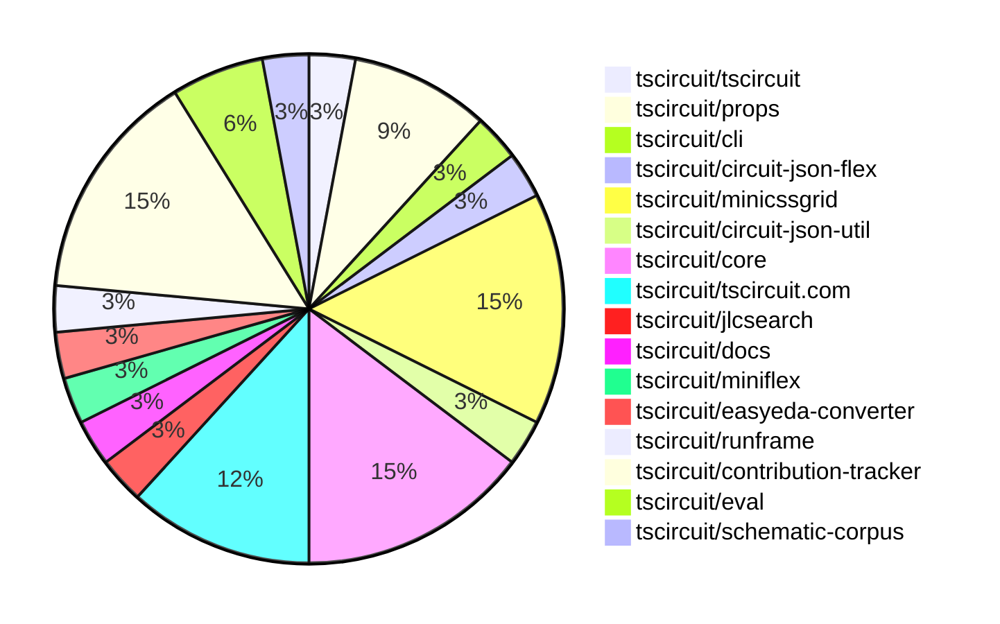
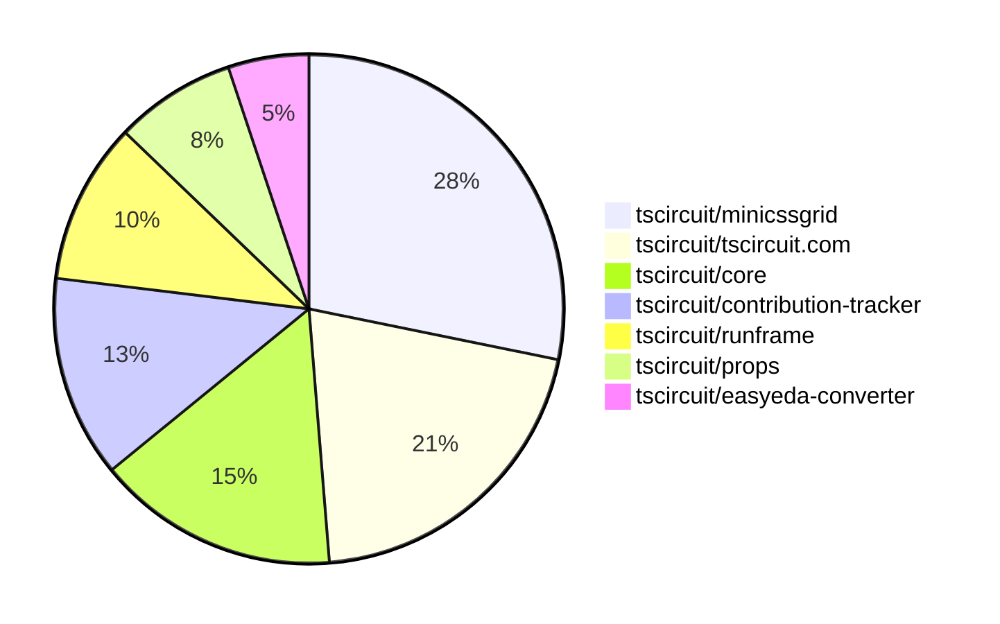

# Contribution Overview 2025-07-30

## PRs by Repository

## Contributor Overview

| Contributor | 🐳 Major | 🐙 Minor | 🐌 Tiny | ⭐ | Score | Discussion Contributions |
|-------------|---------|---------|---------|-----|----------------|--------------------------|
| [seveibar](#seveibar) | 2 | 0 | 14 | ⭐⭐ | 26 | 0🔹 0🔶 0💎 |
| [ArnavK-09](#ArnavK-09) | 1 | 1 | 6 | ⭐⭐ | 12 | 0🔹 0🔶 0💎 |
| [andrii-balitskyi](#andrii-balitskyi) | 1 | 1 | 0 | ⭐ | 6 | 0🔹 0🔶 0💎 |
| [imrishabh18](#imrishabh18) | 0 | 0 | 4 | ⭐ | 5 | 0🔹 0🔶 0💎 |
| [abimaelmartell](#abimaelmartell) | 0 | 1 | 0 |  | 2 | 0🔹 0🔶 0💎 |
| [tscircuitbot](#tscircuitbot) | 0 | 0 | 2 |  | 2 | 0🔹 0🔶 0💎 |
| [MustafaMulla29](#MustafaMulla29) | 0 | 0 | 1 |  | 1 | 0🔹 0🔶 0💎 |

### Discussion Contribution Legend

- 🔹 Normal Comments: Basic participation with minimal effort
- 🔶 Great Informative Comments: Thoughtful participation that adds value
- 💎 Incredible Comments: Exceptional participation with high-quality content

## Review Table

[reviews-received-hover]: ## "Number of reviews received for PRs for this contributor"
[approvals-received-hover]: ## "Number of approvals received for PRs this contributor authored"
[rejections-received-hover]: ## "Number of rejections received for PRs this contributor authored"
[prs-opened-hover]: ## "Number of PRs opened by this contributor"
[issues-created-hover]: ## "Number of issues created by this contributor"
[bountied-issues-hover]: ## "Number of issues this contributor created with a bounty"
[bountied-issue-$-hover]: ## "Total bounty amount placed on issues authored by this contributor"

| Contributor | Reviews Received | Approvals Received | Rejections Received | Approvals | Rejections | PRs Opened | PRs Merged | Score | Issues Created | Bountied Issues | Bountied Issue $ |
|---|---|---|---|---|---|---|---|---|---|---|---|
| [imrishabh18](#imrishabh18) | 2 | 1 | 0 | 1 | 1 | 12 | 5 | 5 | 0 | 0 | 0 |
| [seveibar](#seveibar) | 4 | 0 | 0 | 11 | 0 | 18 | 16 | 26 | 0 | 0 | 0 |
| [andrii-balitskyi](#andrii-balitskyi) | 3 | 2 | 0 | 0 | 0 | 4 | 2 | 6 | 0 | 0 | 0 |
| [graphite-app[bot]](#graphite-app[bot]) | 0 | 0 | 0 | 0 | 0 | 0 | 0 | 0 | 0 | 0 | 0 |
| [abimaelmartell](#abimaelmartell) | 3 | 1 | 0 | 0 | 0 | 1 | 1 | 2 | 0 | 0 | 0 |
| [copilot-pull-request-reviewer[bot]](#copilot-pull-request-reviewer[bot]) | 0 | 0 | 0 | 0 | 0 | 0 | 0 | 0 | 0 | 0 | 0 |
| [ArnavK-09](#ArnavK-09) | 8 | 8 | 0 | 0 | 0 | 9 | 8 | 12 | 0 | 0 | 0 |
| [tscircuitbot](#tscircuitbot) | 0 | 0 | 0 | 0 | 0 | 11 | 2 | 2 | 0 | 0 | 0 |
| [LakshitAgarwal](#LakshitAgarwal) | 2 | 0 | 1 | 0 | 0 | 1 | 0 | 0 | 0 | 0 | 0 |
| [MustafaMulla29](#MustafaMulla29) | 1 | 1 | 0 | 0 | 0 | 1 | 1 | 1 | 0 | 0 | 0 |
| [Abse2001](#Abse2001) | 0 | 0 | 0 | 1 | 0 | 0 | 0 | 0 | 0 | 0 | 0 |

## Top 7 Repositories by Contribution Points

## Changes by Repository

### [tscircuit/tscircuit](https://github.com/tscircuit/tscircuit)

🐌 Tiny Contributions (1)

| PR # | Impact | Contributor | Description |
|------|--------|-------------|-------------|
| [#728](https://github.com/tscircuit/tscircuit/pull/728) | 🐌 Tiny | imrishabh18 | Updates the CLI dependency version from 0.1.190 to 0.1.191 in package.json |

### [tscircuit/props](https://github.com/tscircuit/props)

🐌 Tiny Contributions (3)

| PR # | Impact | Contributor | Description |
|------|--------|-------------|-------------|
| [#346](https://github.com/tscircuit/props/pull/346) | 🐌 Tiny | imrishabh18 | Adds a connections prop to the crystal  component, allowing users to specify connections and updates documentation accordingly. |
| [#345](https://github.com/tscircuit/props/pull/345) | 🐌 Tiny | seveibar | Adds a new property pcbFlexGap to the BaseGroupProps interface, allowing for flexible gap settings in PCB layouts. |
| [#342](https://github.com/tscircuit/props/pull/342) | 🐌 Tiny | seveibar | Add gridRowGap and gridColumnGap to layout config, expose new PCB grid gap fields on group props, update generated docs, bump dev dependency zod, document and test the new props |

### [tscircuit/cli](https://github.com/tscircuit/cli)

🐌 Tiny Contributions (1)

| PR # | Impact | Contributor | Description |
|------|--------|-------------|-------------|
| [#303](https://github.com/tscircuit/cli/pull/303) | 🐌 Tiny | imrishabh18 | Updates the tscircuitrunframe dependency to version 0.0.752 in package.json |

### [tscircuit/circuit-json-flex](https://github.com/tscircuit/circuit-json-flex)

🐌 Tiny Contributions (1)

| PR # | Impact | Contributor | Description |
|------|--------|-------------|-------------|
| [#9](https://github.com/tscircuit/circuit-json-flex/pull/9) | 🐌 Tiny | imrishabh18 | Adds a test for rendering a board without specified dimensions, ensuring proper layout behavior for components without column and row gaps. |

### [tscircuit/minicssgrid](https://github.com/tscircuit/minicssgrid)

| PR # | Impact | Rating | Contributor | Description |
|------|--------|--------|-------------|-------------|
| [#7](https://github.com/tscircuit/minicssgrid/pull/7) | 🐳 Major | ⭐⭐⭐ | seveibar | Adds support for inline grid layout in the CSS grid implementation, allowing for more flexible and responsive designs. |
| [#5](https://github.com/tscircuit/minicssgrid/pull/5) | 🐳 Major | ⭐⭐⭐ | seveibar | html supports contentWidthcontentHeight add content width and height to examples |

🐌 Tiny Contributions (3)

| PR # | Impact | Contributor | Description |
|------|--------|-------------|-------------|
| [#9](https://github.com/tscircuit/minicssgrid/pull/9) | 🐌 Tiny | seveibar | Removes borders from HTML elements to simplify the calculation of their bounds in the browser results. |
| [#6](https://github.com/tscircuit/minicssgrid/pull/6) | 🐌 Tiny | seveibar | Adds workflows for format checking, testing, and publishing to npm, while also updating browser snapshots and improving layout logic in the CSS grid implementation. |
| [#4](https://github.com/tscircuit/minicssgrid/pull/4) | 🐌 Tiny | seveibar | make sure widthheight is predictable wip simplify level7 regenerate browser results |

### [tscircuit/circuit-json-util](https://github.com/tscircuit/circuit-json-util)

🐌 Tiny Contributions (1)

| PR # | Impact | Contributor | Description |
|------|--------|-------------|-------------|
| [#56](https://github.com/tscircuit/circuit-json-util/pull/56) | 🐌 Tiny | seveibar | Adds functionality to reposition a group of PCB elements within a circuit JSON structure based on a new center point. |

### [tscircuit/core](https://github.com/tscircuit/core)

| PR # | Impact | Rating | Contributor | Description |
|------|--------|--------|-------------|-------------|
| [#1090](https://github.com/tscircuit/core/pull/1090) | 🐙 Minor | ⭐⭐ | andrii-balitskyi | Fixes crash when externallyConnectedPins references pins not visible in schPinArrangement |

🐌 Tiny Contributions (4)

| PR # | Impact | Contributor | Description |
|------|--------|-------------|-------------|
| [#1124](https://github.com/tscircuit/core/pull/1124) | 🐌 Tiny | seveibar | Adds support for inline flex layout in PCB groups, allowing for more flexible component arrangement. |
| [#1123](https://github.com/tscircuit/core/pull/1123) | 🐌 Tiny | seveibar | Adds support for pcbFlexGap and moves PcbComponentSizeCalculation prior to layout, along with flex snapshot updates. |
| [#1121](https://github.com/tscircuit/core/pull/1121) | 🐌 Tiny | seveibar | Adds support for new layout properties including pcbPack, pcbGridRowGap, and pcbGridColumnGap in the Group component, while updating dependencies and removing obsolete tests. |
| [#1120](https://github.com/tscircuit/core/pull/1120) | 🐌 Tiny | seveibar | Fixes board auto-sizing to ignore components from other subcircuits, ensuring accurate dimensions for the board. |

### [tscircuit/tscircuit.com](https://github.com/tscircuit/tscircuit.com)

| PR # | Impact | Rating | Contributor | Description |
|------|--------|--------|-------------|-------------|
| [#1522](https://github.com/tscircuit/tscircuit.com/pull/1522) | 🐳 Major | ⭐⭐⭐ | ArnavK-09 | Add a star icon and count display next to package tags to show popularity metrics. |
| [#1520](https://github.com/tscircuit/tscircuit.com/pull/1520) | 🐙 Minor | ⭐⭐ | ArnavK-09 | Add mobile menu toggle with MenuX icons, restructure navigation for better mobile experience, and update background styling for different screen sizes |

🐌 Tiny Contributions (2)

| PR # | Impact | Contributor | Description |
|------|--------|-------------|-------------|
| [#1523](https://github.com/tscircuit/tscircuit.com/pull/1523) | 🐌 Tiny | seveibar | Updates the demo link on the landing page to point to the correct example. |
| [#1521](https://github.com/tscircuit/tscircuit.com/pull/1521) | 🐌 Tiny | ArnavK-09 | Add conditional rendering of rebuild button to only show when the current user matches the package author, preventing unauthorized users from triggering rebuilds. |

### [tscircuit/jlcsearch](https://github.com/tscircuit/jlcsearch)

🐌 Tiny Contributions (1)

| PR # | Impact | Contributor | Description |
|------|--------|-------------|-------------|
| [#75](https://github.com/tscircuit/jlcsearch/pull/75) | 🐌 Tiny | seveibar | Adds documentation for PCIe M.2 connectors with orientation examples and links to the homepage. |

### [tscircuit/docs](https://github.com/tscircuit/docs)

🐌 Tiny Contributions (1)

| PR # | Impact | Contributor | Description |
|------|--------|-------------|-------------|
| [#105](https://github.com/tscircuit/docs/pull/105) | 🐌 Tiny | seveibar | Adds documentation for the new PCB automatic layout features including methods for layout such as pcbFlex, pcbGrid, and pcbPack. |

### [tscircuit/miniflex](https://github.com/tscircuit/miniflex)

🐌 Tiny Contributions (1)

| PR # | Impact | Contributor | Description |
|------|--------|-------------|-------------|
| [#2](https://github.com/tscircuit/miniflex/pull/2) | 🐌 Tiny | seveibar | Adds a metadata attribute to flex items and resolves type issues in the codebase. |

### [tscircuit/easyeda-converter](https://github.com/tscircuit/easyeda-converter)

| PR # | Impact | Rating | Contributor | Description |
|------|--------|--------|-------------|-------------|
| [#303](https://github.com/tscircuit/easyeda-converter/pull/303) | 🐙 Minor | ⭐⭐ | abimaelmartell | Introduces a new method for handling rectangular plated holes by using pill_hole_with_rect_pad with rectPad and pcbRotation properties, enhancing the footprint generation for rectangular pads. |

### [tscircuit/runframe](https://github.com/tscircuit/runframe)

| PR # | Impact | Rating | Contributor | Description |
|------|--------|--------|-------------|-------------|
| [#882](https://github.com/tscircuit/runframe/pull/882) | 🐳 Major | ⭐⭐⭐ | andrii-balitskyi | Adds a version selector for the tscircuiteval package, allowing users to choose from multiple versions instead of being limited to the latest version. |

### [tscircuit/contribution-tracker](https://github.com/tscircuit/contribution-tracker)

🐌 Tiny Contributions (5)

| PR # | Impact | Contributor | Description |
|------|--------|-------------|-------------|
| [#211](https://github.com/tscircuit/contribution-tracker/pull/211) | 🐌 Tiny | ArnavK-09 | Deduplicates owner links and repository entries in the generated markdown for CODEOWNERS. |
| [#207](https://github.com/tscircuit/contribution-tracker/pull/207) | 🐌 Tiny | ArnavK-09 | Adjusts score thresholds for the contributor graph to ensure accurate representation of contributor scores. |
| [#208](https://github.com/tscircuit/contribution-tracker/pull/208) | 🐌 Tiny | ArnavK-09 | Removes redundant discussion scoring logic and updates the column name to better reflect the data being displayed. The score column now shows the total contribution score directly. |
| [#209](https://github.com/tscircuit/contribution-tracker/pull/209) | 🐌 Tiny | ArnavK-09 | Adds debug logging for cache hits and misses in the AI object generation process to aid in production debugging. |
| [#210](https://github.com/tscircuit/contribution-tracker/pull/210) | 🐌 Tiny | ArnavK-09 | Fixes the issue where code owners for repositories were not displayed correctly, ensuring all code owners are shown gracefully in the contribution overview. |

### [tscircuit/eval](https://github.com/tscircuit/eval)

🐌 Tiny Contributions (2)

| PR # | Impact | Contributor | Description |
|------|--------|-------------|-------------|
| [#787](https://github.com/tscircuit/eval/pull/787) | 🐌 Tiny | tscircuitbot | Updates the tscircuitcore package from version 0.0.603 to 0.0.607 and updates related dependencies in package.json. |
| [#779](https://github.com/tscircuit/eval/pull/779) | 🐌 Tiny | tscircuitbot | Updates the tscircuitcore package to version 0.0.603 and other related dependencies in package.json. |

### [tscircuit/schematic-corpus](https://github.com/tscircuit/schematic-corpus)

🐌 Tiny Contributions (1)

| PR # | Impact | Contributor | Description |
|------|--------|-------------|-------------|
| [#133](https://github.com/tscircuit/schematic-corpus/pull/133) | 🐌 Tiny | MustafaMulla29 | Adds a new circuit design (design89) to enhance the matchAdapt algorithm functionality. |

## Changes by Contributor

### [imrishabh18](https://github.com/imrishabh18)

🐌 Tiny Contributions (4)

| PR # | Impact | Description |
|------|--------|-------------|
| [#728](https://github.com/tscircuit/tscircuit/pull/728) | 🐌 Tiny | Updates the CLI dependency version from 0.1.190 to 0.1.191 in package.json |
| [#346](https://github.com/tscircuit/props/pull/346) | 🐌 Tiny | Adds a connections prop to the crystal  component, allowing users to specify connections and updates documentation accordingly. |
| [#303](https://github.com/tscircuit/cli/pull/303) | 🐌 Tiny | Updates the tscircuitrunframe dependency to version 0.0.752 in package.json |
| [#9](https://github.com/tscircuit/circuit-json-flex/pull/9) | 🐌 Tiny | Adds a test for rendering a board without specified dimensions, ensuring proper layout behavior for components without column and row gaps. |

### [seveibar](https://github.com/seveibar)

| PRs # | Impact | Rating | Description |
|------|--------|--------|-------------|
| [#7](https://github.com/tscircuit/minicssgrid/pull/7) | 🐳 Major | ⭐⭐⭐ | Adds support for inline grid layout in the CSS grid implementation, allowing for more flexible and responsive designs. |
| [#5](https://github.com/tscircuit/minicssgrid/pull/5) | 🐳 Major | ⭐⭐⭐ | html supports contentWidthcontentHeight add content width and height to examples |

🐌 Tiny Contributions (14)

| PR # | Impact | Description |
|------|--------|-------------|
| [#56](https://github.com/tscircuit/circuit-json-util/pull/56) | 🐌 Tiny | Adds functionality to reposition a group of PCB elements within a circuit JSON structure based on a new center point. |
| [#345](https://github.com/tscircuit/props/pull/345) | 🐌 Tiny | Adds a new property pcbFlexGap to the BaseGroupProps interface, allowing for flexible gap settings in PCB layouts. |
| [#342](https://github.com/tscircuit/props/pull/342) | 🐌 Tiny | Add gridRowGap and gridColumnGap to layout config, expose new PCB grid gap fields on group props, update generated docs, bump dev dependency zod, document and test the new props |
| [#1124](https://github.com/tscircuit/core/pull/1124) | 🐌 Tiny | Adds support for inline flex layout in PCB groups, allowing for more flexible component arrangement. |
| [#1123](https://github.com/tscircuit/core/pull/1123) | 🐌 Tiny | Adds support for pcbFlexGap and moves PcbComponentSizeCalculation prior to layout, along with flex snapshot updates. |
| [#1121](https://github.com/tscircuit/core/pull/1121) | 🐌 Tiny | Adds support for new layout properties including pcbPack, pcbGridRowGap, and pcbGridColumnGap in the Group component, while updating dependencies and removing obsolete tests. |
| [#1120](https://github.com/tscircuit/core/pull/1120) | 🐌 Tiny | Fixes board auto-sizing to ignore components from other subcircuits, ensuring accurate dimensions for the board. |
| [#1523](https://github.com/tscircuit/tscircuit.com/pull/1523) | 🐌 Tiny | Updates the demo link on the landing page to point to the correct example. |
| [#75](https://github.com/tscircuit/jlcsearch/pull/75) | 🐌 Tiny | Adds documentation for PCIe M.2 connectors with orientation examples and links to the homepage. |
| [#105](https://github.com/tscircuit/docs/pull/105) | 🐌 Tiny | Adds documentation for the new PCB automatic layout features including methods for layout such as pcbFlex, pcbGrid, and pcbPack. |
| [#2](https://github.com/tscircuit/miniflex/pull/2) | 🐌 Tiny | Adds a metadata attribute to flex items and resolves type issues in the codebase. |
| [#9](https://github.com/tscircuit/minicssgrid/pull/9) | 🐌 Tiny | Removes borders from HTML elements to simplify the calculation of their bounds in the browser results. |
| [#6](https://github.com/tscircuit/minicssgrid/pull/6) | 🐌 Tiny | Adds workflows for format checking, testing, and publishing to npm, while also updating browser snapshots and improving layout logic in the CSS grid implementation. |
| [#4](https://github.com/tscircuit/minicssgrid/pull/4) | 🐌 Tiny | make sure widthheight is predictable wip simplify level7 regenerate browser results |

### [abimaelmartell](https://github.com/abimaelmartell)

| PRs # | Impact | Rating | Description |
|------|--------|--------|-------------|
| [#303](https://github.com/tscircuit/easyeda-converter/pull/303) | 🐙 Minor | ⭐⭐ | Introduces a new method for handling rectangular plated holes by using pill_hole_with_rect_pad with rectPad and pcbRotation properties, enhancing the footprint generation for rectangular pads. |

### [andrii-balitskyi](https://github.com/andrii-balitskyi)

| PRs # | Impact | Rating | Description |
|------|--------|--------|-------------|
| [#882](https://github.com/tscircuit/runframe/pull/882) | 🐳 Major | ⭐⭐⭐ | Adds a version selector for the tscircuiteval package, allowing users to choose from multiple versions instead of being limited to the latest version. |
| [#1090](https://github.com/tscircuit/core/pull/1090) | 🐙 Minor | ⭐⭐ | Fixes crash when externallyConnectedPins references pins not visible in schPinArrangement |

### [ArnavK-09](https://github.com/ArnavK-09)

| PRs # | Impact | Rating | Description |
|------|--------|--------|-------------|
| [#1522](https://github.com/tscircuit/tscircuit.com/pull/1522) | 🐳 Major | ⭐⭐⭐ | Add a star icon and count display next to package tags to show popularity metrics. |
| [#1520](https://github.com/tscircuit/tscircuit.com/pull/1520) | 🐙 Minor | ⭐⭐ | Add mobile menu toggle with MenuX icons, restructure navigation for better mobile experience, and update background styling for different screen sizes |

🐌 Tiny Contributions (6)

| PR # | Impact | Description |
|------|--------|-------------|
| [#211](https://github.com/tscircuit/contribution-tracker/pull/211) | 🐌 Tiny | Deduplicates owner links and repository entries in the generated markdown for CODEOWNERS. |
| [#207](https://github.com/tscircuit/contribution-tracker/pull/207) | 🐌 Tiny | Adjusts score thresholds for the contributor graph to ensure accurate representation of contributor scores. |
| [#208](https://github.com/tscircuit/contribution-tracker/pull/208) | 🐌 Tiny | Removes redundant discussion scoring logic and updates the column name to better reflect the data being displayed. The score column now shows the total contribution score directly. |
| [#209](https://github.com/tscircuit/contribution-tracker/pull/209) | 🐌 Tiny | Adds debug logging for cache hits and misses in the AI object generation process to aid in production debugging. |
| [#210](https://github.com/tscircuit/contribution-tracker/pull/210) | 🐌 Tiny | Fixes the issue where code owners for repositories were not displayed correctly, ensuring all code owners are shown gracefully in the contribution overview. |
| [#1521](https://github.com/tscircuit/tscircuit.com/pull/1521) | 🐌 Tiny | Add conditional rendering of rebuild button to only show when the current user matches the package author, preventing unauthorized users from triggering rebuilds. |

### [tscircuitbot](https://github.com/tscircuitbot)

🐌 Tiny Contributions (2)

| PR # | Impact | Description |
|------|--------|-------------|
| [#787](https://github.com/tscircuit/eval/pull/787) | 🐌 Tiny | Updates the tscircuitcore package from version 0.0.603 to 0.0.607 and updates related dependencies in package.json. |
| [#779](https://github.com/tscircuit/eval/pull/779) | 🐌 Tiny | Updates the tscircuitcore package to version 0.0.603 and other related dependencies in package.json. |

### [MustafaMulla29](https://github.com/MustafaMulla29)

🐌 Tiny Contributions (1)

| PR # | Impact | Description |
|------|--------|-------------|
| [#133](https://github.com/tscircuit/schematic-corpus/pull/133) | 🐌 Tiny | Adds a new circuit design (design89) to enhance the matchAdapt algorithm functionality. |

## Repository Owners

| Repository | Codeowners |
|------------|------------|
| [gerbis](https://github.com/tscircuit/gerbis/blob/main/.github/CODEOWNERS) |  |
| [builder](https://github.com/tscircuit/builder/blob/main/.github/CODEOWNERS) | [seveibar](https://github.com/seveibar) |
| [schematic-viewer](https://github.com/tscircuit/schematic-viewer/blob/main/.github/CODEOWNERS) |  |
| [pcb-viewer](https://github.com/tscircuit/pcb-viewer/blob/main/.github/CODEOWNERS) | [seveibar](https://github.com/seveibar), [ShiboSoftwareDev](https://github.com/ShiboSoftwareDev) |
| [react-fiber](https://github.com/tscircuit/react-fiber/blob/main/.github/CODEOWNERS) |  |
| [eagle-xml-converter](https://github.com/tscircuit/eagle-xml-converter/blob/main/.github/CODEOWNERS) |  |
| [sparkfun-packages-old](https://github.com/tscircuit/sparkfun-packages-old/blob/main/.github/CODEOWNERS) |  |
| [debug.tscircuit.com-frontend](https://github.com/tscircuit/debug.tscircuit.com-frontend/blob/main/.github/CODEOWNERS) |  |
| [homepage](https://github.com/tscircuit/homepage/blob/main/.github/CODEOWNERS) |  |
| [debug-viewer](https://github.com/tscircuit/debug-viewer/blob/main/.github/CODEOWNERS) |  |
| [log-soup](https://github.com/tscircuit/log-soup/blob/main/.github/CODEOWNERS) |  |
| [sparkfun-footprints](https://github.com/tscircuit/sparkfun-footprints/blob/main/.github/CODEOWNERS) |  |
| [routing](https://github.com/tscircuit/routing/blob/main/.github/CODEOWNERS) |  |
| [rfc](https://github.com/tscircuit/rfc/blob/main/.github/CODEOWNERS) |  |
| [tscircuit-old](https://github.com/tscircuit/tscircuit-old/blob/main/.github/CODEOWNERS) |  |
| [supergrid](https://github.com/tscircuit/supergrid/blob/main/.github/CODEOWNERS) |  |
| [table-viewer](https://github.com/tscircuit/table-viewer/blob/main/.github/CODEOWNERS) |  |
| [compiler](https://github.com/tscircuit/compiler/blob/main/.github/CODEOWNERS) |  |
| [tscircuit](https://github.com/tscircuit/tscircuit/blob/main/.github/CODEOWNERS) |  |
| [v0.0.x-cli](https://github.com/tscircuit/v0.0.x-cli/blob/main/.github/CODEOWNERS) |  |
| [footprints](https://github.com/tscircuit/footprints/blob/main/.github/CODEOWNERS) | [seveibar](https://github.com/seveibar) |
| [mm](https://github.com/tscircuit/mm/blob/main/.github/CODEOWNERS) |  |
| [jumpers](https://github.com/tscircuit/jumpers/blob/main/.github/CODEOWNERS) |  |
| [circuit-json](https://github.com/tscircuit/circuit-json/blob/main/.github/CODEOWNERS) |  |
| [battery](https://github.com/tscircuit/battery/blob/main/.github/CODEOWNERS) |  |
| [a555timer](https://github.com/tscircuit/a555timer/blob/main/.github/CODEOWNERS) |  |
| [docs-old](https://github.com/tscircuit/docs-old/blob/main/.github/CODEOWNERS) |  |
| [blinking-led-circuit](https://github.com/tscircuit/blinking-led-circuit/blob/main/.github/CODEOWNERS) |  |
| [schematic-layout-testing](https://github.com/tscircuit/schematic-layout-testing/blob/main/.github/CODEOWNERS) |  |
| [schematic-autolayout](https://github.com/tscircuit/schematic-autolayout/blob/main/.github/CODEOWNERS) |  |
| [.github](https://github.com/tscircuit/.github/blob/main/.github/CODEOWNERS) |  |
| [legacy-layout](https://github.com/tscircuit/legacy-layout/blob/main/.github/CODEOWNERS) |  |
| [circuit-json-util](https://github.com/tscircuit/circuit-json-util/blob/main/.github/CODEOWNERS) |  |
| [props](https://github.com/tscircuit/props/blob/main/.github/CODEOWNERS) |  |
| [footprinter](https://github.com/tscircuit/footprinter/blob/main/.github/CODEOWNERS) | [seveibar](https://github.com/seveibar), [techmannih](https://github.com/techmannih) |
| [design-rule-checks](https://github.com/tscircuit/design-rule-checks/blob/main/.github/CODEOWNERS) |  |
| [linting](https://github.com/tscircuit/linting/blob/main/.github/CODEOWNERS) |  |
| [kicad-component-converter](https://github.com/tscircuit/kicad-component-converter/blob/main/.github/CODEOWNERS) |  |
| [text-to-footprint](https://github.com/tscircuit/text-to-footprint/blob/main/.github/CODEOWNERS) |  |
| [soup-to-kicad-mod](https://github.com/tscircuit/soup-to-kicad-mod/blob/main/.github/CODEOWNERS) |  |
| [easyeda-converter](https://github.com/tscircuit/easyeda-converter/blob/main/.github/CODEOWNERS) |  |
| [kicad-viewer](https://github.com/tscircuit/kicad-viewer/blob/main/.github/CODEOWNERS) |  |
| [specctra-dsn-json](https://github.com/tscircuit/specctra-dsn-json/blob/main/.github/CODEOWNERS) |  |
| [a5v-buck-regulator](https://github.com/tscircuit/a5v-buck-regulator/blob/main/.github/CODEOWNERS) |  |
| [make-electronics-with-code](https://github.com/tscircuit/make-electronics-with-code/blob/main/.github/CODEOWNERS) |  |
| [manual-edit-events](https://github.com/tscircuit/manual-edit-events/blob/main/.github/CODEOWNERS) |  |
| [new-notifier](https://github.com/tscircuit/new-notifier/blob/main/.github/CODEOWNERS) |  |
| [freerouting-http](https://github.com/tscircuit/freerouting-http/blob/main/.github/CODEOWNERS) |  |
| [motor-controller](https://github.com/tscircuit/motor-controller/blob/main/.github/CODEOWNERS) |  |
| [3d-viewer](https://github.com/tscircuit/3d-viewer/blob/main/.github/CODEOWNERS) |  |
| [simple-test-projects](https://github.com/tscircuit/simple-test-projects/blob/main/.github/CODEOWNERS) |  |
| [jscad-planner](https://github.com/tscircuit/jscad-planner/blob/main/.github/CODEOWNERS) |  |
| [winterspec](https://github.com/tscircuit/winterspec/blob/main/.github/CODEOWNERS) | [seveibar](https://github.com/seveibar), [ShiboSoftwareDev](https://github.com/ShiboSoftwareDev) |
| [core](https://github.com/tscircuit/core/blob/main/.github/CODEOWNERS) |  |
| [jscad-electronics](https://github.com/tscircuit/jscad-electronics/blob/main/.github/CODEOWNERS) | [seveibar](https://github.com/seveibar), [abhijitxy](https://github.com/abhijitxy), [anas-sarkez](https://github.com/anas-sarkez) |
| [jscad-fiber](https://github.com/tscircuit/jscad-fiber/blob/main/.github/CODEOWNERS) |  |
| [plop](https://github.com/tscircuit/plop/blob/main/.github/CODEOWNERS) |  |
| [version-tracker](https://github.com/tscircuit/version-tracker/blob/main/.github/CODEOWNERS) |  |
| [contribution-tracker](https://github.com/tscircuit/contribution-tracker/blob/main/.github/CODEOWNERS) |  |
| [microcontroller](https://github.com/tscircuit/microcontroller/blob/main/.github/CODEOWNERS) |  |
| [circuit-to-svg](https://github.com/tscircuit/circuit-to-svg/blob/main/.github/CODEOWNERS) | [imrishabh18](https://github.com/imrishabh18) |
| [autorouting](https://github.com/tscircuit/autorouting/blob/main/.github/CODEOWNERS) |  |
| [autorouting.com](https://github.com/tscircuit/autorouting.com/blob/main/.github/CODEOWNERS) |  |
| [checks](https://github.com/tscircuit/checks/blob/main/.github/CODEOWNERS) |  |
| [circuit-to-png](https://github.com/tscircuit/circuit-to-png/blob/main/.github/CODEOWNERS) |  |
| [aider-github-action](https://github.com/tscircuit/aider-github-action/blob/main/.github/CODEOWNERS) |  |
| [bunaider](https://github.com/tscircuit/bunaider/blob/main/.github/CODEOWNERS) |  |
| [equation-route-solver](https://github.com/tscircuit/equation-route-solver/blob/main/.github/CODEOWNERS) |  |
| [arduino-nano](https://github.com/tscircuit/arduino-nano/blob/main/.github/CODEOWNERS) |  |
| [keyboard-controller](https://github.com/tscircuit/keyboard-controller/blob/main/.github/CODEOWNERS) |  |
| [schematic-symbols](https://github.com/tscircuit/schematic-symbols/blob/main/.github/CODEOWNERS) | [seveibar](https://github.com/seveibar), [imrishabh18](https://github.com/imrishabh18), [techmannih](https://github.com/techmannih) |
| [tscircuit-badge-menu](https://github.com/tscircuit/tscircuit-badge-menu/blob/main/.github/CODEOWNERS) |  |
| [template-api-project](https://github.com/tscircuit/template-api-project/blob/main/.github/CODEOWNERS) |  |
| [circuit-json-to-gerber](https://github.com/tscircuit/circuit-json-to-gerber/blob/main/.github/CODEOWNERS) | [seveibar](https://github.com/seveibar), [ShiboSoftwareDev](https://github.com/ShiboSoftwareDev) |
| [bun-match-svg](https://github.com/tscircuit/bun-match-svg/blob/main/.github/CODEOWNERS) |  |
| [template](https://github.com/tscircuit/template/blob/main/.github/CODEOWNERS) |  |
| [template-api-fake](https://github.com/tscircuit/template-api-fake/blob/main/.github/CODEOWNERS) |  |
| [contribution-notifications](https://github.com/tscircuit/contribution-notifications/blob/main/.github/CODEOWNERS) |  |
| [freerouting](https://github.com/tscircuit/freerouting/blob/main/.github/CODEOWNERS) |  |
| [circuit-json-to-connectivity-map](https://github.com/tscircuit/circuit-json-to-connectivity-map/blob/main/.github/CODEOWNERS) |  |
| [handbook](https://github.com/tscircuit/handbook/blob/main/.github/CODEOWNERS) |  |
| [math-utils](https://github.com/tscircuit/math-utils/blob/main/.github/CODEOWNERS) |  |
| [kicad-converter](https://github.com/tscircuit/kicad-converter/blob/main/.github/CODEOWNERS) |  |
| [dsn-converter](https://github.com/tscircuit/dsn-converter/blob/main/.github/CODEOWNERS) |  |
| [bun-ffi-benchmarking](https://github.com/tscircuit/bun-ffi-benchmarking/blob/main/.github/CODEOWNERS) |  |
| [hackoberfest](https://github.com/tscircuit/hackoberfest/blob/main/.github/CODEOWNERS) |  |
| [pico2](https://github.com/tscircuit/pico2/blob/main/.github/CODEOWNERS) |  |
| [circuit-json-to-bom-csv](https://github.com/tscircuit/circuit-json-to-bom-csv/blob/main/.github/CODEOWNERS) |  |
| [circuit-json-to-pnp-csv](https://github.com/tscircuit/circuit-json-to-pnp-csv/blob/main/.github/CODEOWNERS) |  |
| [tscircuit.com](https://github.com/tscircuit/tscircuit.com/blob/main/.github/CODEOWNERS) | [seveibar](https://github.com/seveibar), [imrishabh18](https://github.com/imrishabh18) |
| [prompt-benchmarks](https://github.com/tscircuit/prompt-benchmarks/blob/main/.github/CODEOWNERS) |  |
| [extract-codefence](https://github.com/tscircuit/extract-codefence/blob/main/.github/CODEOWNERS) |  |
| [alphabet](https://github.com/tscircuit/alphabet/blob/main/.github/CODEOWNERS) |  |
| [snippet-runner](https://github.com/tscircuit/snippet-runner/blob/main/.github/CODEOWNERS) |  |
| [featured-snippets](https://github.com/tscircuit/featured-snippets/blob/main/.github/CODEOWNERS) |  |
| [fake-freerouting](https://github.com/tscircuit/fake-freerouting/blob/main/.github/CODEOWNERS) |  |
| [dsn-viewer](https://github.com/tscircuit/dsn-viewer/blob/main/.github/CODEOWNERS) |  |
| [jlcsearch](https://github.com/tscircuit/jlcsearch/blob/main/.github/CODEOWNERS) |  |
| [format-si-unit](https://github.com/tscircuit/format-si-unit/blob/main/.github/CODEOWNERS) |  |
| [freerouting-cli](https://github.com/tscircuit/freerouting-cli/blob/main/.github/CODEOWNERS) |  |
| [graphics-debug](https://github.com/tscircuit/graphics-debug/blob/main/.github/CODEOWNERS) |  |
| [status](https://github.com/tscircuit/status/blob/main/.github/CODEOWNERS) |  |
| [add-pr-comment-proxy](https://github.com/tscircuit/add-pr-comment-proxy/blob/main/.github/CODEOWNERS) |  |
| [webworker-experimental](https://github.com/tscircuit/webworker-experimental/blob/main/.github/CODEOWNERS) |  |
| [eval](https://github.com/tscircuit/eval/blob/main/.github/CODEOWNERS) |  |
| [name-scan](https://github.com/tscircuit/name-scan/blob/main/.github/CODEOWNERS) |  |
| [circuit-json-to-spice](https://github.com/tscircuit/circuit-json-to-spice/blob/main/.github/CODEOWNERS) |  |
| [ngspice](https://github.com/tscircuit/ngspice/blob/main/.github/CODEOWNERS) |  |
| [runframe](https://github.com/tscircuit/runframe/blob/main/.github/CODEOWNERS) |  |
| [cli](https://github.com/tscircuit/cli/blob/main/.github/CODEOWNERS) | [seveibar](https://github.com/seveibar), [imrishabh18](https://github.com/imrishabh18), [ArnavK-09](https://github.com/ArnavK-09) |
| [file-server](https://github.com/tscircuit/file-server/blob/main/.github/CODEOWNERS) |  |
| [run-snippet](https://github.com/tscircuit/run-snippet/blob/main/.github/CODEOWNERS) |  |
| [use-mouse-matrix-transform](https://github.com/tscircuit/use-mouse-matrix-transform/blob/main/.github/CODEOWNERS) |  |
| [lint](https://github.com/tscircuit/lint/blob/main/.github/CODEOWNERS) |  |
| [circuit-json-viewer](https://github.com/tscircuit/circuit-json-viewer/blob/main/.github/CODEOWNERS) |  |
| [pver](https://github.com/tscircuit/pver/blob/main/.github/CODEOWNERS) |  |
| [maintenance-tracker](https://github.com/tscircuit/maintenance-tracker/blob/main/.github/CODEOWNERS) |  |
| [assembly-viewer](https://github.com/tscircuit/assembly-viewer/blob/main/.github/CODEOWNERS) |  |
| [circuit-json-to-readable-netlist](https://github.com/tscircuit/circuit-json-to-readable-netlist/blob/main/.github/CODEOWNERS) |  |
| [circuit-json-to-tscircuit](https://github.com/tscircuit/circuit-json-to-tscircuit/blob/main/.github/CODEOWNERS) |  |
| [create-snippet-url](https://github.com/tscircuit/create-snippet-url/blob/main/.github/CODEOWNERS) |  |
| [led-matrix-server](https://github.com/tscircuit/led-matrix-server/blob/main/.github/CODEOWNERS) |  |
| [typed-ky](https://github.com/tscircuit/typed-ky/blob/main/.github/CODEOWNERS) |  |
| [eval-legacy](https://github.com/tscircuit/eval-legacy/blob/main/.github/CODEOWNERS) |  |
| [benchmark-cli](https://github.com/tscircuit/benchmark-cli/blob/main/.github/CODEOWNERS) |  |
| [pr-evaluation-benchmark](https://github.com/tscircuit/pr-evaluation-benchmark/blob/main/.github/CODEOWNERS) |  |
| [import](https://github.com/tscircuit/import/blob/main/.github/CODEOWNERS) |  |
| [code-editor](https://github.com/tscircuit/code-editor/blob/main/.github/CODEOWNERS) |  |
| [circuitjson.com](https://github.com/tscircuit/circuitjson.com/blob/main/.github/CODEOWNERS) |  |
| [fake-anthropic](https://github.com/tscircuit/fake-anthropic/blob/main/.github/CODEOWNERS) |  |
| [trending-snippet-autoposter](https://github.com/tscircuit/trending-snippet-autoposter/blob/main/.github/CODEOWNERS) |  |
| [fake-reddit](https://github.com/tscircuit/fake-reddit/blob/main/.github/CODEOWNERS) |  |
| [issue-roulette](https://github.com/tscircuit/issue-roulette/blob/main/.github/CODEOWNERS) | [Anshgrover23](https://github.com/Anshgrover23) |
| [recursive-pattern-autorouter](https://github.com/tscircuit/recursive-pattern-autorouter/blob/main/.github/CODEOWNERS) |  |
| [elkjs-autolayout](https://github.com/tscircuit/elkjs-autolayout/blob/main/.github/CODEOWNERS) |  |
| [fake-algora](https://github.com/tscircuit/fake-algora/blob/main/.github/CODEOWNERS) |  |
| [youtube-live-stream](https://github.com/tscircuit/youtube-live-stream/blob/main/.github/CODEOWNERS) |  |
| [autorouting-cache-engine](https://github.com/tscircuit/autorouting-cache-engine/blob/main/.github/CODEOWNERS) |  |
| [elkjs-evaluation](https://github.com/tscircuit/elkjs-evaluation/blob/main/.github/CODEOWNERS) |  |
| [svg.tscircuit.com](https://github.com/tscircuit/svg.tscircuit.com/blob/main/.github/CODEOWNERS) |  |
| [docs](https://github.com/tscircuit/docs/blob/main/.github/CODEOWNERS) |  |
| [ny-algorithm](https://github.com/tscircuit/ny-algorithm/blob/main/.github/CODEOWNERS) |  |
| [tscircuit-autorouter](https://github.com/tscircuit/tscircuit-autorouter/blob/main/.github/CODEOWNERS) |  |
| [solid-use-mouse-matrix-transform](https://github.com/tscircuit/solid-use-mouse-matrix-transform/blob/main/.github/CODEOWNERS) |  |
| [board-off](https://github.com/tscircuit/board-off/blob/main/.github/CODEOWNERS) |  |
| [browser-preview.tscircuit.com](https://github.com/tscircuit/browser-preview.tscircuit.com/blob/main/.github/CODEOWNERS) |  |
| [chat.tscircuit.com](https://github.com/tscircuit/chat.tscircuit.com/blob/main/.github/CODEOWNERS) |  |
| [keyboards](https://github.com/tscircuit/keyboards/blob/main/.github/CODEOWNERS) |  |
| [route-json](https://github.com/tscircuit/route-json/blob/main/.github/CODEOWNERS) |  |
| [versions.tscircuit.com](https://github.com/tscircuit/versions.tscircuit.com/blob/main/.github/CODEOWNERS) |  |
| [keyboard-utils](https://github.com/tscircuit/keyboard-utils/blob/main/.github/CODEOWNERS) |  |
| [cla](https://github.com/tscircuit/cla/blob/main/.github/CODEOWNERS) |  |
| [parts-engine](https://github.com/tscircuit/parts-engine/blob/main/.github/CODEOWNERS) |  |
| [kicad-pcb](https://github.com/tscircuit/kicad-pcb/blob/main/.github/CODEOWNERS) |  |
| [sparkfun-boards](https://github.com/tscircuit/sparkfun-boards/blob/main/.github/CODEOWNERS) | [ShiboSoftwareDev](https://github.com/ShiboSoftwareDev), [MustafaMulla29](https://github.com/MustafaMulla29), [Anshgrover23](https://github.com/Anshgrover23), [Abse2001](https://github.com/Abse2001), [techmannih](https://github.com/techmannih) |
| [fake-postmark](https://github.com/tscircuit/fake-postmark/blob/main/.github/CODEOWNERS) |  |
| [fake-npm-registry](https://github.com/tscircuit/fake-npm-registry/blob/main/.github/CODEOWNERS) |  |
| [dependency-check](https://github.com/tscircuit/dependency-check/blob/main/.github/CODEOWNERS) |  |
| [miniflex](https://github.com/tscircuit/miniflex/blob/main/.github/CODEOWNERS) |  |
| [schematic-match-adapt](https://github.com/tscircuit/schematic-match-adapt/blob/main/.github/CODEOWNERS) |  |
| [simple-3d-svg](https://github.com/tscircuit/simple-3d-svg/blob/main/.github/CODEOWNERS) |  |
| [circuit-json-to-simple-3d](https://github.com/tscircuit/circuit-json-to-simple-3d/blob/main/.github/CODEOWNERS) |  |
| [schematic-layout-editor](https://github.com/tscircuit/schematic-layout-editor/blob/main/.github/CODEOWNERS) |  |
| [gyromug](https://github.com/tscircuit/gyromug/blob/main/.github/CODEOWNERS) |  |
| [schematic-layout-utils](https://github.com/tscircuit/schematic-layout-utils/blob/main/.github/CODEOWNERS) |  |
| [led-water-accelerometer](https://github.com/tscircuit/led-water-accelerometer/blob/main/.github/CODEOWNERS) |  |
| [bpc-graph](https://github.com/tscircuit/bpc-graph/blob/main/.github/CODEOWNERS) |  |
| [circuit-json-to-bpc](https://github.com/tscircuit/circuit-json-to-bpc/blob/main/.github/CODEOWNERS) |  |
| [schematic-corpus](https://github.com/tscircuit/schematic-corpus/blob/main/.github/CODEOWNERS) | [Abse2001](https://github.com/Abse2001) |
| [deps.tscircuit.com](https://github.com/tscircuit/deps.tscircuit.com/blob/main/.github/CODEOWNERS) |  |
| [calculate-elbow](https://github.com/tscircuit/calculate-elbow/blob/main/.github/CODEOWNERS) |  |
| [api](https://github.com/tscircuit/api/blob/main/.github/CODEOWNERS) |  |
| [calculate-cell-boundaries](https://github.com/tscircuit/calculate-cell-boundaries/blob/main/.github/CODEOWNERS) |  |
| [cdn.tscircuit.com](https://github.com/tscircuit/cdn.tscircuit.com/blob/main/.github/CODEOWNERS) |  |
| [ground-plane-calculator](https://github.com/tscircuit/ground-plane-calculator/blob/main/.github/CODEOWNERS) |  |
| [prefab-board](https://github.com/tscircuit/prefab-board/blob/main/.github/CODEOWNERS) |  |
| [micromod-connector](https://github.com/tscircuit/micromod-connector/blob/main/.github/CODEOWNERS) |  |
| [EEcircuit-engine](https://github.com/tscircuit/EEcircuit-engine/blob/main/.github/CODEOWNERS) |  |
| [iframe](https://github.com/tscircuit/iframe/blob/main/.github/CODEOWNERS) |  |
| [sparkfun-micromod-board](https://github.com/tscircuit/sparkfun-micromod-board/blob/main/.github/CODEOWNERS) |  |
| [calculate-packing](https://github.com/tscircuit/calculate-packing/blob/main/.github/CODEOWNERS) |  |
| [circuit-json-flex](https://github.com/tscircuit/circuit-json-flex/blob/main/.github/CODEOWNERS) |  |
| [packages](https://github.com/tscircuit/packages/blob/main/.github/CODEOWNERS) |  |
| [minicssgrid](https://github.com/tscircuit/minicssgrid/blob/main/.github/CODEOWNERS) |  |

## Repositories by Owner

| User | Repo |
|------|------|
| [seveibar](https://github.com/seveibar) | [builder](https://github.com/tscircuit/builder/blob/main/.github/CODEOWNERS) |
|  | [pcb-viewer](https://github.com/tscircuit/pcb-viewer/blob/main/.github/CODEOWNERS) |
|  | [footprints](https://github.com/tscircuit/footprints/blob/main/.github/CODEOWNERS) |
|  | [footprinter](https://github.com/tscircuit/footprinter/blob/main/.github/CODEOWNERS) |
|  | [winterspec](https://github.com/tscircuit/winterspec/blob/main/.github/CODEOWNERS) |
|  | [jscad-electronics](https://github.com/tscircuit/jscad-electronics/blob/main/.github/CODEOWNERS) |
|  | [schematic-symbols](https://github.com/tscircuit/schematic-symbols/blob/main/.github/CODEOWNERS) |
|  | [circuit-json-to-gerber](https://github.com/tscircuit/circuit-json-to-gerber/blob/main/.github/CODEOWNERS) |
|  | [tscircuit.com](https://github.com/tscircuit/tscircuit.com/blob/main/.github/CODEOWNERS) |
|  | [cli](https://github.com/tscircuit/cli/blob/main/.github/CODEOWNERS) |
| [ShiboSoftwareDev](https://github.com/ShiboSoftwareDev) | [pcb-viewer](https://github.com/tscircuit/pcb-viewer/blob/main/.github/CODEOWNERS) |
|  | [winterspec](https://github.com/tscircuit/winterspec/blob/main/.github/CODEOWNERS) |
|  | [circuit-json-to-gerber](https://github.com/tscircuit/circuit-json-to-gerber/blob/main/.github/CODEOWNERS) |
|  | [sparkfun-boards](https://github.com/tscircuit/sparkfun-boards/blob/main/.github/CODEOWNERS) |
| [techmannih](https://github.com/techmannih) | [footprinter](https://github.com/tscircuit/footprinter/blob/main/.github/CODEOWNERS) |
|  | [schematic-symbols](https://github.com/tscircuit/schematic-symbols/blob/main/.github/CODEOWNERS) |
|  | [sparkfun-boards](https://github.com/tscircuit/sparkfun-boards/blob/main/.github/CODEOWNERS) |
| [abhijitxy](https://github.com/abhijitxy) | [jscad-electronics](https://github.com/tscircuit/jscad-electronics/blob/main/.github/CODEOWNERS) |
| [anas-sarkez](https://github.com/anas-sarkez) | [jscad-electronics](https://github.com/tscircuit/jscad-electronics/blob/main/.github/CODEOWNERS) |
| [imrishabh18](https://github.com/imrishabh18) | [circuit-to-svg](https://github.com/tscircuit/circuit-to-svg/blob/main/.github/CODEOWNERS) |
|  | [schematic-symbols](https://github.com/tscircuit/schematic-symbols/blob/main/.github/CODEOWNERS) |
|  | [tscircuit.com](https://github.com/tscircuit/tscircuit.com/blob/main/.github/CODEOWNERS) |
|  | [cli](https://github.com/tscircuit/cli/blob/main/.github/CODEOWNERS) |
| [ArnavK-09](https://github.com/ArnavK-09) | [cli](https://github.com/tscircuit/cli/blob/main/.github/CODEOWNERS) |
| [Anshgrover23](https://github.com/Anshgrover23) | [issue-roulette](https://github.com/tscircuit/issue-roulette/blob/main/.github/CODEOWNERS) |
|  | [sparkfun-boards](https://github.com/tscircuit/sparkfun-boards/blob/main/.github/CODEOWNERS) |
| [MustafaMulla29](https://github.com/MustafaMulla29) | [sparkfun-boards](https://github.com/tscircuit/sparkfun-boards/blob/main/.github/CODEOWNERS) |
| [Abse2001](https://github.com/Abse2001) | [sparkfun-boards](https://github.com/tscircuit/sparkfun-boards/blob/main/.github/CODEOWNERS) |
|  | [schematic-corpus](https://github.com/tscircuit/schematic-corpus/blob/main/.github/CODEOWNERS) |

