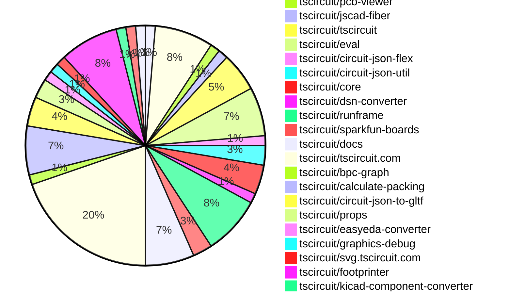
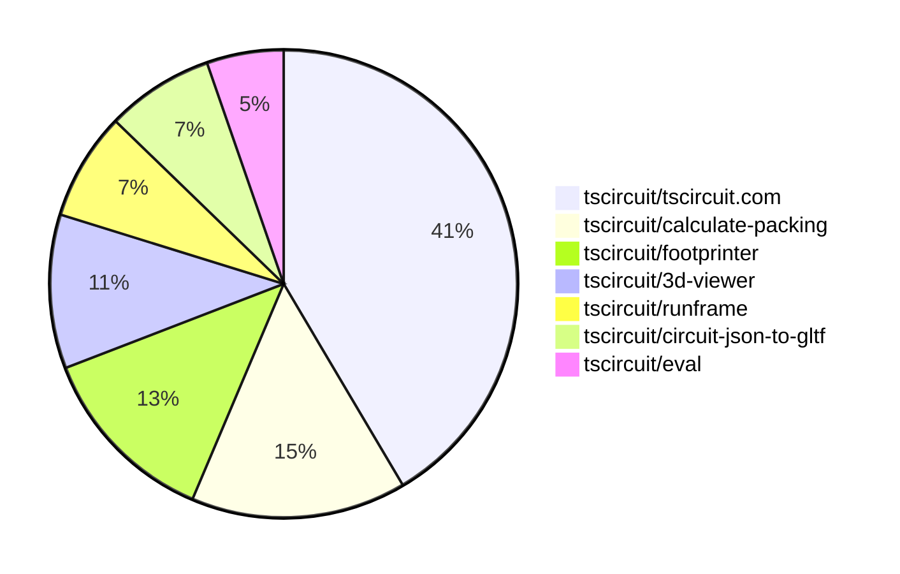

# Contribution Overview 2025-08-06

## PRs by Repository

## Contributor Overview

| Contributor | 🐳 Major | 🐙 Minor | 🐌 Tiny | ⭐ | Score | Discussion Contributions |
|-------------|---------|---------|---------|-----|----------------|--------------------------|
| [seveibar](#seveibar) | 8 | 2 | 18 | 👑 | 61 | 0🔹 0🔶 0💎 |
| [ArnavK-09](#ArnavK-09) | 4 | 3 | 5 | ⭐⭐ | 27 | 0🔹 0🔶 0💎 |
| [ShiboSoftwareDev](#ShiboSoftwareDev) | 2 | 3 | 6 | ⭐⭐ | 22 | 0🔹 0🔶 0💎 |
| [Abse2001](#Abse2001) | 2 | 1 | 4 | ⭐⭐ | 13.5 | 0🔹 0🔶 0💎 |
| [MustafaMulla29](#MustafaMulla29) | 1 | 0 | 7 | ⭐⭐ | 11 | 0🔹 0🔶 0💎 |
| [imrishabh18](#imrishabh18) | 0 | 0 | 6 | ⭐ | 7 | 0🔹 0🔶 0💎 |
| [tscircuitbot](#tscircuitbot) | 0 | 0 | 2 |  | 2 | 0🔹 0🔶 0💎 |
| [pxlpal](#pxlpal) | 0 | 0 | 1 |  | 1 | 0🔹 0🔶 0💎 |
| [techmannih](#techmannih) | 0 | 0 | 1 |  | 1 | 0🔹 0🔶 0💎 |

### Discussion Contribution Legend

- 🔹 Normal Comments: Basic participation with minimal effort
- 🔶 Great Informative Comments: Thoughtful participation that adds value
- 💎 Incredible Comments: Exceptional participation with high-quality content

## Review Table

[reviews-received-hover]: ## "Number of reviews received for PRs for this contributor"
[approvals-received-hover]: ## "Number of approvals received for PRs this contributor authored"
[rejections-received-hover]: ## "Number of rejections received for PRs this contributor authored"
[prs-opened-hover]: ## "Number of PRs opened by this contributor"
[issues-created-hover]: ## "Number of issues created by this contributor"
[bountied-issues-hover]: ## "Number of issues this contributor created with a bounty"
[bountied-issue-$-hover]: ## "Total bounty amount placed on issues authored by this contributor"

| Contributor | Reviews Received | Approvals Received | Rejections Received | Approvals | Rejections | PRs Opened | PRs Merged | Score | Issues Created | Bountied Issues | Bountied Issue $ |
|---|---|---|---|---|---|---|---|---|---|---|---|
| [ShiboSoftwareDev](#ShiboSoftwareDev) | 14 | 11 | 0 | 2 | 0 | 14 | 12 | 22 | 0 | 0 | 0 |
| [seveibar](#seveibar) | 5 | 0 | 0 | 37 | 3 | 38 | 28 | 61 | 0 | 0 | 0 |
| [graphite-app[bot]](#graphite-app[bot]) | 0 | 0 | 0 | 0 | 0 | 0 | 0 | 0 | 0 | 0 | 0 |
| [imrishabh18](#imrishabh18) | 2 | 2 | 0 | 1 | 1 | 6 | 6 | 7 | 0 | 0 | 0 |
| [MustafaMulla29](#MustafaMulla29) | 17 | 8 | 1 | 0 | 0 | 10 | 8 | 11 | 0 | 0 | 0 |
| [pxlpal](#pxlpal) | 2 | 1 | 0 | 0 | 0 | 1 | 1 | 1 | 0 | 0 | 0 |
| [Abse2001](#Abse2001) | 8 | 7 | 0 | 0 | 0 | 8 | 7 | 13.5 | 0 | 0 | 0 |
| [techmannih](#techmannih) | 2 | 0 | 1 | 0 | 0 | 2 | 1 | 1 | 0 | 0 | 0 |
| [baeoca](#baeoca) | 1 | 0 | 1 | 0 | 0 | 2 | 0 | 0 | 0 | 0 | 0 |
| [ArnavK-09](#ArnavK-09) | 19 | 11 | 1 | 0 | 0 | 12 | 12 | 27 | 0 | 0 | 0 |
| [tscircuitbot](#tscircuitbot) | 0 | 0 | 0 | 0 | 0 | 7 | 2 | 2 | 0 | 0 | 0 |

## Top 7 Repositories by Contribution Points

## Changes by Repository

### [tscircuit/schematic-viewer](https://github.com/tscircuit/schematic-viewer)

| PR # | Impact | Rating | Contributor | Description |
|------|--------|--------|-------------|-------------|
| [#102](https://github.com/tscircuit/schematic-viewer/pull/102) | 🐳 Major | ⭐⭐⭐ | ShiboSoftwareDev | The simulation is run in a background web worker to ensure the UI remains responsive. The simulation reruns in the background when the circuit json changes |

### [tscircuit/3d-viewer](https://github.com/tscircuit/3d-viewer)

| PR # | Impact | Rating | Contributor | Description |
|------|--------|--------|-------------|-------------|
| [#401](https://github.com/tscircuit/3d-viewer/pull/401) | 🐳 Major | ⭐⭐⭐ | ShiboSoftwareDev | Replaces the react-three library with a vanilla three.js implementation to replicate the required functionalities. |
| [#402](https://github.com/tscircuit/3d-viewer/pull/402) | 🐙 Minor | ⭐⭐ | ShiboSoftwareDev | Fixes the tooltip not stopping when the hovered object is removed from the scene, ensuring proper hover behavior in the 3D viewer. |

🐌 Tiny Contributions (4)

| PR # | Impact | Contributor | Description |
|------|--------|-------------|-------------|
| [#404](https://github.com/tscircuit/3d-viewer/pull/404) | 🐌 Tiny | ShiboSoftwareDev | Adds a new CODEOWNERS file designating ShiboSoftwareDev as the code owner for the repository |
| [#403](https://github.com/tscircuit/3d-viewer/pull/403) | 🐌 Tiny | ShiboSoftwareDev | Fixes tooltip behavior to ensure consistent display and interaction when hovering over 3D objects. |
| [#398](https://github.com/tscircuit/3d-viewer/pull/398) | 🐌 Tiny | ShiboSoftwareDev | Updates the version of react-threedrei from 9.121.4 to 10.6.1 in package.json to resolve compatibility issues with react-reconciler. |
| [#397](https://github.com/tscircuit/3d-viewer/pull/397) | 🐌 Tiny | seveibar | Updates package dependencies and modifies import statements in the CadViewerContainer and ContainerWithTooltip components. |

### [tscircuit/pcb-viewer](https://github.com/tscircuit/pcb-viewer)

| PR # | Impact | Rating | Contributor | Description |
|------|--------|--------|-------------|-------------|
| [#352](https://github.com/tscircuit/pcb-viewer/pull/352) | 🐙 Minor | ⭐⭐ | ShiboSoftwareDev | Adds support for rendering rotated pill holes with rectangular pads in PCB designs, enhancing the PCBViewers capabilities. |

### [tscircuit/jscad-fiber](https://github.com/tscircuit/jscad-fiber)

| PR # | Impact | Rating | Contributor | Description |
|------|--------|--------|-------------|-------------|
| [#112](https://github.com/tscircuit/jscad-fiber/pull/112) | 🐙 Minor | ⭐⭐ | ShiboSoftwareDev | Replaces the react-three librarys primitive component with a local implementation to manage THREE.Object3D in the scene. |

### [tscircuit/tscircuit](https://github.com/tscircuit/tscircuit)

🐌 Tiny Contributions (4)

| PR # | Impact | Contributor | Description |
|------|--------|-------------|-------------|
| [#735](https://github.com/tscircuit/tscircuit/pull/735) | 🐌 Tiny | ShiboSoftwareDev | Updates the jscad-fiber dependency from version 0.0.82 to 0.0.83 in package.json |
| [#734](https://github.com/tscircuit/tscircuit/pull/734) | 🐌 Tiny | imrishabh18 | Injects the bundled eval CDN URL into the runframe during the build process, replacing a placeholder in the standalone script with the actual URL. |
| [#733](https://github.com/tscircuit/tscircuit/pull/733) | 🐌 Tiny | MustafaMulla29 | Updates the tscircuiteval dependency to version 0.0.279 to support the implementation of the showSilkscreenPinLabels property. |
| [#732](https://github.com/tscircuit/tscircuit/pull/732) | 🐌 Tiny | seveibar | Copies the webworker entry point file into the package distribution directory for easier access and deployment. |

### [tscircuit/eval](https://github.com/tscircuit/eval)

🐌 Tiny Contributions (5)

| PR # | Impact | Contributor | Description |
|------|--------|-------------|-------------|
| [#812](https://github.com/tscircuit/eval/pull/812) | 🐌 Tiny | ShiboSoftwareDev | Updates the jscad-fiber dependency from version 0.0.82 to 0.0.83 in package.json |
| [#807](https://github.com/tscircuit/eval/pull/807) | 🐌 Tiny | MustafaMulla29 | Updates the core dependency to version 0.0.616 to support the implementation of the showSilkscreenPinLabels property. |
| [#804](https://github.com/tscircuit/eval/pull/804) | 🐌 Tiny | ArnavK-09 | Removes unnecessary conditional wrapping of components in a board, simplifying the default entrypoint setup. |
| [#803](https://github.com/tscircuit/eval/pull/803) | 🐌 Tiny | tscircuitbot | Automated update of tscircuitcore to v0.0.615. |
| [#801](https://github.com/tscircuit/eval/pull/801) | 🐌 Tiny | tscircuitbot | Automated update of tscircuitcore to v0.0.614. |

### [tscircuit/circuit-json-flex](https://github.com/tscircuit/circuit-json-flex)

🐌 Tiny Contributions (1)

| PR # | Impact | Contributor | Description |
|------|--------|-------------|-------------|
| [#10](https://github.com/tscircuit/circuit-json-flex/pull/10) | 🐌 Tiny | ShiboSoftwareDev | Removes tscircuit from peer dependencies in package.json, addressing dependency issues with bpc-graph versions. |

### [tscircuit/circuit-json-util](https://github.com/tscircuit/circuit-json-util)

🐌 Tiny Contributions (2)

| PR # | Impact | Contributor | Description |
|------|--------|-------------|-------------|
| [#58](https://github.com/tscircuit/circuit-json-util/pull/58) | 🐌 Tiny | imrishabh18 | Adds type definitions for FlexBoxOptions from the tscircuitminiflex package to improve type safety in flex container sizing calculations. |
| [#57](https://github.com/tscircuit/circuit-json-util/pull/57) | 🐌 Tiny | imrishabh18 | Add getMinimumFlexContainer utility to compute minimal flexbox container size and export it from the library index, along with tests for container sizing in row and column directions. |

### [tscircuit/core](https://github.com/tscircuit/core)

🐌 Tiny Contributions (3)

| PR # | Impact | Contributor | Description |
|------|--------|-------------|-------------|
| [#1136](https://github.com/tscircuit/core/pull/1136) | 🐌 Tiny | imrishabh18 | Removes the usage and dependency of tscircuitcircuit-json-flex and updates tscircuitcircuit-json-util to use its getMinimumFlexContainer method instead. |
| [#1134](https://github.com/tscircuit/core/pull/1134) | 🐌 Tiny | MustafaMulla29 | Adds the showSilkscreenPinLabels prop to PinHeader component to control visibility of silkscreen pin labels in generated footprints. |
| [#1133](https://github.com/tscircuit/core/pull/1133) | 🐌 Tiny | seveibar | Add manual routing support for traces using pcbPath, allowing them to be treated as obstacles and skipping autorouting for defined paths. |

### [tscircuit/dsn-converter](https://github.com/tscircuit/dsn-converter)

🐌 Tiny Contributions (1)

| PR # | Impact | Contributor | Description |
|------|--------|-------------|-------------|
| [#111](https://github.com/tscircuit/dsn-converter/pull/111) | 🐌 Tiny | imrishabh18 | Adds support for a new plated hole shape circular_hole_with_rect_pad in the PCB design process, allowing for rectangular pads to be associated with circular holes. |

### [tscircuit/runframe](https://github.com/tscircuit/runframe)

| PR # | Impact | Rating | Contributor | Description |
|------|--------|--------|-------------|-------------|
| [#968](https://github.com/tscircuit/runframe/pull/968) | 🐙 Minor | ⭐⭐ | ArnavK-09 | Fixes URL encoding errors in ErrorTabContent that were breaking tscircuit.com |

🐌 Tiny Contributions (5)

| PR # | Impact | Contributor | Description |
|------|--------|-------------|-------------|
| [#977](https://github.com/tscircuit/runframe/pull/977) | 🐌 Tiny | imrishabh18 | Fixes the RunFrame component to correctly use evalWebWorkerBlobUrl instead of workerBlobUrl for web worker blob URL handling. |
| [#976](https://github.com/tscircuit/runframe/pull/976) | 🐌 Tiny | seveibar | Prevents treeshaking of the worker blob URL by ensuring it is not undefined when injected into the RunFrame component. |
| [#974](https://github.com/tscircuit/runframe/pull/974) | 🐌 Tiny | seveibar | Refactors the standalone component to use local React types instead of relying on global React types. |
| [#973](https://github.com/tscircuit/runframe/pull/973) | 🐌 Tiny | seveibar | Adds a mechanism to inject a CDN URL for the webworker blob, allowing for dynamic updates to the worker script used in the application. |
| [#969](https://github.com/tscircuit/runframe/pull/969) | 🐌 Tiny | seveibar | Updates the easyeda dependency to version 0.0.217 in package.json |

### [tscircuit/sparkfun-boards](https://github.com/tscircuit/sparkfun-boards)

| PR # | Impact | Rating | Contributor | Description |
|------|--------|--------|-------------|-------------|
| [#109](https://github.com/tscircuit/sparkfun-boards/pull/109) | 🐳 Major | ⭐⭐⭐ | MustafaMulla29 | Introduces a new circuit board for the SparkFun Atmospheric Sensor Breakout - BME280, including its schematic and footprint. |

🐌 Tiny Contributions (1)

| PR # | Impact | Contributor | Description |
|------|--------|-------------|-------------|
| [#110](https://github.com/tscircuit/sparkfun-boards/pull/110) | 🐌 Tiny | MustafaMulla29 | Updates the tscircuit dependency to version 0.0.585 to include the latest core feature for showing silkscreen pin labels. |

### [tscircuit/docs](https://github.com/tscircuit/docs)

🐌 Tiny Contributions (5)

| PR # | Impact | Contributor | Description |
|------|--------|-------------|-------------|
| [#112](https://github.com/tscircuit/docs/pull/112) | 🐌 Tiny | MustafaMulla29 | Adds documentation for the testpoint  component, detailing its usage, properties, and implementation on PCBs. |
| [#109](https://github.com/tscircuit/docs/pull/109) | 🐌 Tiny | MustafaMulla29 | Adds documentation for the fuse component, detailing its properties, usage, and specifications. |
| [#108](https://github.com/tscircuit/docs/pull/108) | 🐌 Tiny | MustafaMulla29 | Adds documentation for the battery  element, detailing its usage, specifications, and examples. |
| [#111](https://github.com/tscircuit/docs/pull/111) | 🐌 Tiny | seveibar | Refines the display of manual PCB path trace examples by updating the syntax for specifying trace connections in the documentation. |
| [#110](https://github.com/tscircuit/docs/pull/110) | 🐌 Tiny | seveibar | Documents the pcbPath and pcbPathRelativeTo properties on the trace  element and adds an example for manual PCB pathing with a notch. |

### [tscircuit/tscircuit.com](https://github.com/tscircuit/tscircuit.com)

| PR # | Impact | Rating | Contributor | Description |
|------|--------|--------|-------------|-------------|
| [#1547](https://github.com/tscircuit/tscircuit.com/pull/1547) | 🐳 Major | ⭐⭐⭐ | seveibar | Allows the package releases page to function correctly even when no build is available, ensuring users can still access release information. |
| [#1546](https://github.com/tscircuit/tscircuit.com/pull/1546) | 🐳 Major | ⭐⭐⭐ | seveibar | Refactors the UI to replace view-connected-repo with releases, introduces new pages for releases and release details, and updates the data model for package releases and builds. |
| [#1545](https://github.com/tscircuit/tscircuit.com/pull/1545) | 🐳 Major | ⭐⭐⭐ | seveibar | Adds a GitHub repository selector component with a refresh button and search functionality, allowing users to refresh their repositories and search through them. |
| [#1551](https://github.com/tscircuit/tscircuit.com/pull/1551) | 🐳 Major | ⭐⭐⭐ | ArnavK-09 | Refactors the build status logic and modifies the preview component to enhance its functionality and user experience. |
| [#1549](https://github.com/tscircuit/tscircuit.com/pull/1549) | 🐳 Major | ⭐⭐⭐ | ArnavK-09 | feat(preview): add new release preview page and loading states refactor(files): extract file tree transformation logic to separate utility fix(routing): update all preview and build links to use release-based URLs |
| [#1544](https://github.com/tscircuit/tscircuit.com/pull/1544) | 🐳 Major | ⭐⭐⭐ | ArnavK-09 | This pull request introduces new endpoints for listing package builds and retrieving specific package build details. It also includes the necessary schema definitions and integration tests to ensure functionality. The changes enhance the APIs capabilities related to package builds, allowing for better management and retrieval of build information. |
| [#1542](https://github.com/tscircuit/tscircuit.com/pull/1542) | 🐳 Major | ⭐⭐⭐ | ArnavK-09 | Replace ConnectedReposCards with ConnectedPackagesList component Add GitHub repo linkingunlinking functionality Improve UI for connected packages with build status and preview Remove unused ConnectedRepoSettings component Update API to handle nullable github_repo_full_name Remove extra settings dialog |
| [#1554](https://github.com/tscircuit/tscircuit.com/pull/1554) | 🐙 Minor | ⭐⭐ | seveibar | Fixes a bug where accessing children of a node could lead to runtime errors due to undefined properties. |
| [#1555](https://github.com/tscircuit/tscircuit.com/pull/1555) | 🐙 Minor | ⭐⭐ | ArnavK-09 | Update schema to move branch_name, commit_message, and commit_author from PackageBuild to PackageRelease, update UI components to use release metadata instead of build metadata, fix route paths to use releases instead of release, remove mock package builds data, set default sidebar state to collapsed in preview page, and ask user to connect github repo |
| [#1543](https://github.com/tscircuit/tscircuit.com/pull/1543) | 🐙 Minor | ⭐⭐ | ArnavK-09 | Add allow_pr_previews field to package schema and update API, pass currentAllowPrPreviews to edit dialog components, update GitHubRepositorySelector to use allowPrPreviews instead of enablePrPreview, and include is_pr_preview and github_pr_number in package release mapping. |

🐌 Tiny Contributions (5)

| PR # | Impact | Contributor | Description |
|------|--------|-------------|-------------|
| [#1553](https://github.com/tscircuit/tscircuit.com/pull/1553) | 🐌 Tiny | seveibar | Increases the timeout duration for reloading the application from 10 seconds to 3 minutes when an error occurs, allowing for a longer wait before a reload is triggered. |
| [#1548](https://github.com/tscircuit/tscircuit.com/pull/1548) | 🐌 Tiny | seveibar | Adds handling for cases where package build information is not available, improving user feedback in the UI. |
| [#1557](https://github.com/tscircuit/tscircuit.com/pull/1557) | 🐌 Tiny | ArnavK-09 | Updates the tscircuitrunframe dependency to version 0.0.781 in package.json |
| [#1556](https://github.com/tscircuit/tscircuit.com/pull/1556) | 🐌 Tiny | ArnavK-09 | Updates the default description in the MobileSidebar component to an empty string instead of a predefined text. |
| [#1550](https://github.com/tscircuit/tscircuit.com/pull/1550) | 🐌 Tiny | ArnavK-09 | Add custom scrollbar styling for html and body elements to enhance visual appearance. |

### [tscircuit/bpc-graph](https://github.com/tscircuit/bpc-graph)

| PR # | Impact | Rating | Contributor | Description |
|------|--------|--------|-------------|-------------|
| [#69](https://github.com/tscircuit/bpc-graph/pull/69) | 🐳 Major | ⭐⭐⭐ | seveibar | Implements a new algorithm for partitioning a canonical right-facing graph into smaller right-facing graphs based on gaps between pins. |

### [tscircuit/calculate-packing](https://github.com/tscircuit/calculate-packing)

| PR # | Impact | Rating | Contributor | Description |
|------|--------|--------|-------------|-------------|
| [#12](https://github.com/tscircuit/calculate-packing/pull/12) | 🐳 Major | ⭐⭐⭐ | seveibar | Fixes the issue where rotation is incorrectly altered after rotation trials and removes excessive logging during the process. |
| [#11](https://github.com/tscircuit/calculate-packing/pull/11) | 🐳 Major | ⭐⭐⭐ | seveibar | This pull request introduces additional fixes and testing for the minimum distance packing algorithm in the calculate-packing library. It includes the addition of a new file for guidance on development practices and the removal of an outdated packing solver implementation, replaced by a phased approach to packing. |
| [#9](https://github.com/tscircuit/calculate-packing/pull/9) | 🐳 Major | ⭐⭐⭐ | seveibar | Adds a new packing strategy that optimizes component placement by minimizing the sum of distances to connected pads on the network. |

🐌 Tiny Contributions (2)

| PR # | Impact | Contributor | Description |
|------|--------|-------------|-------------|
| [#13](https://github.com/tscircuit/calculate-packing/pull/13) | 🐌 Tiny | seveibar | Adds a new React component for debugging pack iterations with JSON input and visualization of packing state. |
| [#10](https://github.com/tscircuit/calculate-packing/pull/10) | 🐌 Tiny | seveibar | Adds a reproduction case for a packing issue and fixes network IDs for the reproduction of stacking pack distance, along with a final stacking fix. |

### [tscircuit/circuit-json-to-gltf](https://github.com/tscircuit/circuit-json-to-gltf)

| PR # | Impact | Rating | Contributor | Description |
|------|--------|--------|-------------|-------------|
| [#3](https://github.com/tscircuit/circuit-json-to-gltf/pull/3) | 🐳 Major | ⭐⭐⭐ | seveibar | ignore reference repos attempt at intiial implementation wip Cosmos and browser viewer for gltf to see results wip wip format load usbc flashlight by default wip wip debugging texture mapping wip svg to png dynamic tech swap fix topbottom texture fix texture rotation fix model orientation fix opacity and back face issue for obj models fix unknown model transparency fix mtl rendering |
| [#4](https://github.com/tscircuit/circuit-json-to-gltf/pull/4) | 🐙 Minor | ⭐⭐ | seveibar | Fixes the trace colors in the rendering of circuit boards by adjusting color values for soldermask and material properties in the GLTF export. |

🐌 Tiny Contributions (1)

| PR # | Impact | Contributor | Description |
|------|--------|-------------|-------------|
| [#5](https://github.com/tscircuit/circuit-json-to-gltf/pull/5) | 🐌 Tiny | seveibar | Adds GitHub workflows for format checking, testing, and publishing to npm. |

### [tscircuit/props](https://github.com/tscircuit/props)

🐌 Tiny Contributions (2)

| PR # | Impact | Contributor | Description |
|------|--------|-------------|-------------|
| [#354](https://github.com/tscircuit/props/pull/354) | 🐌 Tiny | seveibar | Adds properties to allow traces to specify a reference and explicit PCB path via pcbPathRelativeTo and pcbPath. |
| [#351](https://github.com/tscircuit/props/pull/351) | 🐌 Tiny | pxlpal | Adds autocomplete functionality for common electronic component footprints in the footprint prop. |

### [tscircuit/easyeda-converter](https://github.com/tscircuit/easyeda-converter)

🐌 Tiny Contributions (1)

| PR # | Impact | Contributor | Description |
|------|--------|-------------|-------------|
| [#306](https://github.com/tscircuit/easyeda-converter/pull/306) | 🐌 Tiny | seveibar | Summary add latest C2040 raw easy asset and conversion test allow text shapes to accept any font weightdecoration support colors as object or array in EasyEDA schema  Testing BUN_UPDATE_SNAPSHOTS1 bun test testsconvert-to-tsC2040-to-ts.test.ts testsfetch-testsc2040.test.ts bun test testsconvert-to-tsC2040-to-ts.test.ts testsfetch-testsc2040.test.ts |

### [tscircuit/graphics-debug](https://github.com/tscircuit/graphics-debug)

🐌 Tiny Contributions (1)

| PR # | Impact | Contributor | Description |
|------|--------|-------------|-------------|
| [#71](https://github.com/tscircuit/graphics-debug/pull/71) | 🐌 Tiny | seveibar | Adds functionality to load the camera position in the interactive graphics component. |

### [tscircuit/svg.tscircuit.com](https://github.com/tscircuit/svg.tscircuit.com)

🐌 Tiny Contributions (1)

| PR # | Impact | Contributor | Description |
|------|--------|-------------|-------------|
| [#270](https://github.com/tscircuit/svg.tscircuit.com/pull/270) | 🐌 Tiny | seveibar | Updates the tscircuit dependency version from 0.0.581 to 0.0.582 in package.json |

### [tscircuit/footprinter](https://github.com/tscircuit/footprinter)

| PR # | Impact | Rating | Contributor | Description |
|------|--------|--------|-------------|-------------|
| [#347](https://github.com/tscircuit/footprinter/pull/347) | 🐳 Major | ⭐⭐⭐ | Abse2001 | Adds a boolean difference visualization feature for comparing PCB pads and plated holes, enhancing alignment analysis between Footprinter and KiCad. |
| [#345](https://github.com/tscircuit/footprinter/pull/345) | 🐳 Major | ⭐⭐⭐ | Abse2001 | Adds full support for KiCad plated holes, including accurate area calculations, bounding box fixes, and enhanced debug logging for visual comparisons. |

🐌 Tiny Contributions (4)

| PR # | Impact | Contributor | Description |
|------|--------|-------------|-------------|
| [#352](https://github.com/tscircuit/footprinter/pull/352) | 🐌 Tiny | Abse2001 | Adds a test for the TSSOP-10_3x3mm_P0.5mm footprint to ensure parity between Footprinter and KiCad. |
| [#350](https://github.com/tscircuit/footprinter/pull/350) | 🐌 Tiny | Abse2001 | Adds a test for the SOIC-20W_7.6x12.8mm_P1.27mm footprint to ensure parity between Footprinter and KiCad. |
| [#348](https://github.com/tscircuit/footprinter/pull/348) | 🐌 Tiny | Abse2001 | Fixes DIP pin row spacing and adjusts silkscreen to align with hole centers and clearance for better PCB design accuracy. |
| [#351](https://github.com/tscircuit/footprinter/pull/351) | 🐌 Tiny | techmannih | Updates the bun-match-svg dependency from version 0.0.10 to 0.0.12 in package.json |

### [tscircuit/kicad-component-converter](https://github.com/tscircuit/kicad-component-converter)

| PR # | Impact | Rating | Contributor | Description |
|------|--------|--------|-------------|-------------|
| [#124](https://github.com/tscircuit/kicad-component-converter/pull/124) | 🐙 Minor | ⭐⭐ | Abse2001 | Adds parsing for plated and non-plated holes in KiCad components, including full test coverage for the new functionality. |

### [tscircuit/kicad-mod-cache](https://github.com/tscircuit/kicad-mod-cache)

🐌 Tiny Contributions (1)

| PR # | Impact | Contributor | Description |
|------|--------|-------------|-------------|
| [#3](https://github.com/tscircuit/kicad-mod-cache/pull/3) | 🐌 Tiny | Abse2001 | Updates the kicad-component-converter dependency from version 0.1.9 to 0.1.10 in package.json |

### [tscircuit/contribution-tracker](https://github.com/tscircuit/contribution-tracker)

🐌 Tiny Contributions (1)

| PR # | Impact | Contributor | Description |
|------|--------|-------------|-------------|
| [#214](https://github.com/tscircuit/contribution-tracker/pull/214) | 🐌 Tiny | ArnavK-09 | This PR refactors the prompt generation function to avoid displaying No description provided when there is no description in the pull request. Instead, it conditionally includes the description only if it exists, improving the clarity of the output. |

## Changes by Contributor

### [ShiboSoftwareDev](https://github.com/ShiboSoftwareDev)

| PRs # | Impact | Rating | Description |
|------|--------|--------|-------------|
| [#102](https://github.com/tscircuit/schematic-viewer/pull/102) | 🐳 Major | ⭐⭐⭐ | The simulation is run in a background web worker to ensure the UI remains responsive. The simulation reruns in the background when the circuit json changes |
| [#401](https://github.com/tscircuit/3d-viewer/pull/401) | 🐳 Major | ⭐⭐⭐ | Replaces the react-three library with a vanilla three.js implementation to replicate the required functionalities. |
| [#352](https://github.com/tscircuit/pcb-viewer/pull/352) | 🐙 Minor | ⭐⭐ | Adds support for rendering rotated pill holes with rectangular pads in PCB designs, enhancing the PCBViewers capabilities. |
| [#402](https://github.com/tscircuit/3d-viewer/pull/402) | 🐙 Minor | ⭐⭐ | Fixes the tooltip not stopping when the hovered object is removed from the scene, ensuring proper hover behavior in the 3D viewer. |
| [#112](https://github.com/tscircuit/jscad-fiber/pull/112) | 🐙 Minor | ⭐⭐ | Replaces the react-three librarys primitive component with a local implementation to manage THREE.Object3D in the scene. |

🐌 Tiny Contributions (6)

| PR # | Impact | Description |
|------|--------|-------------|
| [#735](https://github.com/tscircuit/tscircuit/pull/735) | 🐌 Tiny | Updates the jscad-fiber dependency from version 0.0.82 to 0.0.83 in package.json |
| [#404](https://github.com/tscircuit/3d-viewer/pull/404) | 🐌 Tiny | Adds a new CODEOWNERS file designating ShiboSoftwareDev as the code owner for the repository |
| [#403](https://github.com/tscircuit/3d-viewer/pull/403) | 🐌 Tiny | Fixes tooltip behavior to ensure consistent display and interaction when hovering over 3D objects. |
| [#398](https://github.com/tscircuit/3d-viewer/pull/398) | 🐌 Tiny | Updates the version of react-threedrei from 9.121.4 to 10.6.1 in package.json to resolve compatibility issues with react-reconciler. |
| [#812](https://github.com/tscircuit/eval/pull/812) | 🐌 Tiny | Updates the jscad-fiber dependency from version 0.0.82 to 0.0.83 in package.json |
| [#10](https://github.com/tscircuit/circuit-json-flex/pull/10) | 🐌 Tiny | Removes tscircuit from peer dependencies in package.json, addressing dependency issues with bpc-graph versions. |

### [imrishabh18](https://github.com/imrishabh18)

🐌 Tiny Contributions (6)

| PR # | Impact | Description |
|------|--------|-------------|
| [#734](https://github.com/tscircuit/tscircuit/pull/734) | 🐌 Tiny | Injects the bundled eval CDN URL into the runframe during the build process, replacing a placeholder in the standalone script with the actual URL. |
| [#58](https://github.com/tscircuit/circuit-json-util/pull/58) | 🐌 Tiny | Adds type definitions for FlexBoxOptions from the tscircuitminiflex package to improve type safety in flex container sizing calculations. |
| [#57](https://github.com/tscircuit/circuit-json-util/pull/57) | 🐌 Tiny | Add getMinimumFlexContainer utility to compute minimal flexbox container size and export it from the library index, along with tests for container sizing in row and column directions. |
| [#1136](https://github.com/tscircuit/core/pull/1136) | 🐌 Tiny | Removes the usage and dependency of tscircuitcircuit-json-flex and updates tscircuitcircuit-json-util to use its getMinimumFlexContainer method instead. |
| [#111](https://github.com/tscircuit/dsn-converter/pull/111) | 🐌 Tiny | Adds support for a new plated hole shape circular_hole_with_rect_pad in the PCB design process, allowing for rectangular pads to be associated with circular holes. |
| [#977](https://github.com/tscircuit/runframe/pull/977) | 🐌 Tiny | Fixes the RunFrame component to correctly use evalWebWorkerBlobUrl instead of workerBlobUrl for web worker blob URL handling. |

### [MustafaMulla29](https://github.com/MustafaMulla29)

| PRs # | Impact | Rating | Description |
|------|--------|--------|-------------|
| [#109](https://github.com/tscircuit/sparkfun-boards/pull/109) | 🐳 Major | ⭐⭐⭐ | Introduces a new circuit board for the SparkFun Atmospheric Sensor Breakout - BME280, including its schematic and footprint. |

🐌 Tiny Contributions (7)

| PR # | Impact | Description |
|------|--------|-------------|
| [#733](https://github.com/tscircuit/tscircuit/pull/733) | 🐌 Tiny | Updates the tscircuiteval dependency to version 0.0.279 to support the implementation of the showSilkscreenPinLabels property. |
| [#1134](https://github.com/tscircuit/core/pull/1134) | 🐌 Tiny | Adds the showSilkscreenPinLabels prop to PinHeader component to control visibility of silkscreen pin labels in generated footprints. |
| [#807](https://github.com/tscircuit/eval/pull/807) | 🐌 Tiny | Updates the core dependency to version 0.0.616 to support the implementation of the showSilkscreenPinLabels property. |
| [#112](https://github.com/tscircuit/docs/pull/112) | 🐌 Tiny | Adds documentation for the testpoint  component, detailing its usage, properties, and implementation on PCBs. |
| [#109](https://github.com/tscircuit/docs/pull/109) | 🐌 Tiny | Adds documentation for the fuse component, detailing its properties, usage, and specifications. |
| [#108](https://github.com/tscircuit/docs/pull/108) | 🐌 Tiny | Adds documentation for the battery  element, detailing its usage, specifications, and examples. |
| [#110](https://github.com/tscircuit/sparkfun-boards/pull/110) | 🐌 Tiny | Updates the tscircuit dependency to version 0.0.585 to include the latest core feature for showing silkscreen pin labels. |

### [seveibar](https://github.com/seveibar)

| PRs # | Impact | Rating | Description |
|------|--------|--------|-------------|
| [#1547](https://github.com/tscircuit/tscircuit.com/pull/1547) | 🐳 Major | ⭐⭐⭐ | Allows the package releases page to function correctly even when no build is available, ensuring users can still access release information. |
| [#1546](https://github.com/tscircuit/tscircuit.com/pull/1546) | 🐳 Major | ⭐⭐⭐ | Refactors the UI to replace view-connected-repo with releases, introduces new pages for releases and release details, and updates the data model for package releases and builds. |
| [#1545](https://github.com/tscircuit/tscircuit.com/pull/1545) | 🐳 Major | ⭐⭐⭐ | Adds a GitHub repository selector component with a refresh button and search functionality, allowing users to refresh their repositories and search through them. |
| [#69](https://github.com/tscircuit/bpc-graph/pull/69) | 🐳 Major | ⭐⭐⭐ | Implements a new algorithm for partitioning a canonical right-facing graph into smaller right-facing graphs based on gaps between pins. |
| [#12](https://github.com/tscircuit/calculate-packing/pull/12) | 🐳 Major | ⭐⭐⭐ | Fixes the issue where rotation is incorrectly altered after rotation trials and removes excessive logging during the process. |
| [#11](https://github.com/tscircuit/calculate-packing/pull/11) | 🐳 Major | ⭐⭐⭐ | This pull request introduces additional fixes and testing for the minimum distance packing algorithm in the calculate-packing library. It includes the addition of a new file for guidance on development practices and the removal of an outdated packing solver implementation, replaced by a phased approach to packing. |
| [#9](https://github.com/tscircuit/calculate-packing/pull/9) | 🐳 Major | ⭐⭐⭐ | Adds a new packing strategy that optimizes component placement by minimizing the sum of distances to connected pads on the network. |
| [#3](https://github.com/tscircuit/circuit-json-to-gltf/pull/3) | 🐳 Major | ⭐⭐⭐ | ignore reference repos attempt at intiial implementation wip Cosmos and browser viewer for gltf to see results wip wip format load usbc flashlight by default wip wip debugging texture mapping wip svg to png dynamic tech swap fix topbottom texture fix texture rotation fix model orientation fix opacity and back face issue for obj models fix unknown model transparency fix mtl rendering |
| [#1554](https://github.com/tscircuit/tscircuit.com/pull/1554) | 🐙 Minor | ⭐⭐ | Fixes a bug where accessing children of a node could lead to runtime errors due to undefined properties. |
| [#4](https://github.com/tscircuit/circuit-json-to-gltf/pull/4) | 🐙 Minor | ⭐⭐ | Fixes the trace colors in the rendering of circuit boards by adjusting color values for soldermask and material properties in the GLTF export. |

🐌 Tiny Contributions (18)

| PR # | Impact | Description |
|------|--------|-------------|
| [#732](https://github.com/tscircuit/tscircuit/pull/732) | 🐌 Tiny | Copies the webworker entry point file into the package distribution directory for easier access and deployment. |
| [#354](https://github.com/tscircuit/props/pull/354) | 🐌 Tiny | Adds properties to allow traces to specify a reference and explicit PCB path via pcbPathRelativeTo and pcbPath. |
| [#306](https://github.com/tscircuit/easyeda-converter/pull/306) | 🐌 Tiny | Summary add latest C2040 raw easy asset and conversion test allow text shapes to accept any font weightdecoration support colors as object or array in EasyEDA schema  Testing BUN_UPDATE_SNAPSHOTS1 bun test testsconvert-to-tsC2040-to-ts.test.ts testsfetch-testsc2040.test.ts bun test testsconvert-to-tsC2040-to-ts.test.ts testsfetch-testsc2040.test.ts |
| [#397](https://github.com/tscircuit/3d-viewer/pull/397) | 🐌 Tiny | Updates package dependencies and modifies import statements in the CadViewerContainer and ContainerWithTooltip components. |
| [#1133](https://github.com/tscircuit/core/pull/1133) | 🐌 Tiny | Add manual routing support for traces using pcbPath, allowing them to be treated as obstacles and skipping autorouting for defined paths. |
| [#1553](https://github.com/tscircuit/tscircuit.com/pull/1553) | 🐌 Tiny | Increases the timeout duration for reloading the application from 10 seconds to 3 minutes when an error occurs, allowing for a longer wait before a reload is triggered. |
| [#1548](https://github.com/tscircuit/tscircuit.com/pull/1548) | 🐌 Tiny | Adds handling for cases where package build information is not available, improving user feedback in the UI. |
| [#71](https://github.com/tscircuit/graphics-debug/pull/71) | 🐌 Tiny | Adds functionality to load the camera position in the interactive graphics component. |
| [#976](https://github.com/tscircuit/runframe/pull/976) | 🐌 Tiny | Prevents treeshaking of the worker blob URL by ensuring it is not undefined when injected into the RunFrame component. |
| [#974](https://github.com/tscircuit/runframe/pull/974) | 🐌 Tiny | Refactors the standalone component to use local React types instead of relying on global React types. |
| [#973](https://github.com/tscircuit/runframe/pull/973) | 🐌 Tiny | Adds a mechanism to inject a CDN URL for the webworker blob, allowing for dynamic updates to the worker script used in the application. |
| [#969](https://github.com/tscircuit/runframe/pull/969) | 🐌 Tiny | Updates the easyeda dependency to version 0.0.217 in package.json |
| [#270](https://github.com/tscircuit/svg.tscircuit.com/pull/270) | 🐌 Tiny | Updates the tscircuit dependency version from 0.0.581 to 0.0.582 in package.json |
| [#111](https://github.com/tscircuit/docs/pull/111) | 🐌 Tiny | Refines the display of manual PCB path trace examples by updating the syntax for specifying trace connections in the documentation. |
| [#110](https://github.com/tscircuit/docs/pull/110) | 🐌 Tiny | Documents the pcbPath and pcbPathRelativeTo properties on the trace  element and adds an example for manual PCB pathing with a notch. |
| [#13](https://github.com/tscircuit/calculate-packing/pull/13) | 🐌 Tiny | Adds a new React component for debugging pack iterations with JSON input and visualization of packing state. |
| [#10](https://github.com/tscircuit/calculate-packing/pull/10) | 🐌 Tiny | Adds a reproduction case for a packing issue and fixes network IDs for the reproduction of stacking pack distance, along with a final stacking fix. |
| [#5](https://github.com/tscircuit/circuit-json-to-gltf/pull/5) | 🐌 Tiny | Adds GitHub workflows for format checking, testing, and publishing to npm. |

### [pxlpal](https://github.com/pxlpal)

🐌 Tiny Contributions (1)

| PR # | Impact | Description |
|------|--------|-------------|
| [#351](https://github.com/tscircuit/props/pull/351) | 🐌 Tiny | Adds autocomplete functionality for common electronic component footprints in the footprint prop. |

### [Abse2001](https://github.com/Abse2001)

| PRs # | Impact | Rating | Description |
|------|--------|--------|-------------|
| [#347](https://github.com/tscircuit/footprinter/pull/347) | 🐳 Major | ⭐⭐⭐ | Adds a boolean difference visualization feature for comparing PCB pads and plated holes, enhancing alignment analysis between Footprinter and KiCad. |
| [#345](https://github.com/tscircuit/footprinter/pull/345) | 🐳 Major | ⭐⭐⭐ | Adds full support for KiCad plated holes, including accurate area calculations, bounding box fixes, and enhanced debug logging for visual comparisons. |
| [#124](https://github.com/tscircuit/kicad-component-converter/pull/124) | 🐙 Minor | ⭐⭐ | Adds parsing for plated and non-plated holes in KiCad components, including full test coverage for the new functionality. |

🐌 Tiny Contributions (4)

| PR # | Impact | Description |
|------|--------|-------------|
| [#352](https://github.com/tscircuit/footprinter/pull/352) | 🐌 Tiny | Adds a test for the TSSOP-10_3x3mm_P0.5mm footprint to ensure parity between Footprinter and KiCad. |
| [#350](https://github.com/tscircuit/footprinter/pull/350) | 🐌 Tiny | Adds a test for the SOIC-20W_7.6x12.8mm_P1.27mm footprint to ensure parity between Footprinter and KiCad. |
| [#348](https://github.com/tscircuit/footprinter/pull/348) | 🐌 Tiny | Fixes DIP pin row spacing and adjusts silkscreen to align with hole centers and clearance for better PCB design accuracy. |
| [#3](https://github.com/tscircuit/kicad-mod-cache/pull/3) | 🐌 Tiny | Updates the kicad-component-converter dependency from version 0.1.9 to 0.1.10 in package.json |

### [techmannih](https://github.com/techmannih)

🐌 Tiny Contributions (1)

| PR # | Impact | Description |
|------|--------|-------------|
| [#351](https://github.com/tscircuit/footprinter/pull/351) | 🐌 Tiny | Updates the bun-match-svg dependency from version 0.0.10 to 0.0.12 in package.json |

### [ArnavK-09](https://github.com/ArnavK-09)

| PRs # | Impact | Rating | Description |
|------|--------|--------|-------------|
| [#1551](https://github.com/tscircuit/tscircuit.com/pull/1551) | 🐳 Major | ⭐⭐⭐ | Refactors the build status logic and modifies the preview component to enhance its functionality and user experience. |
| [#1549](https://github.com/tscircuit/tscircuit.com/pull/1549) | 🐳 Major | ⭐⭐⭐ | feat(preview): add new release preview page and loading states refactor(files): extract file tree transformation logic to separate utility fix(routing): update all preview and build links to use release-based URLs |
| [#1544](https://github.com/tscircuit/tscircuit.com/pull/1544) | 🐳 Major | ⭐⭐⭐ | This pull request introduces new endpoints for listing package builds and retrieving specific package build details. It also includes the necessary schema definitions and integration tests to ensure functionality. The changes enhance the APIs capabilities related to package builds, allowing for better management and retrieval of build information. |
| [#1542](https://github.com/tscircuit/tscircuit.com/pull/1542) | 🐳 Major | ⭐⭐⭐ | Replace ConnectedReposCards with ConnectedPackagesList component Add GitHub repo linkingunlinking functionality Improve UI for connected packages with build status and preview Remove unused ConnectedRepoSettings component Update API to handle nullable github_repo_full_name Remove extra settings dialog |
| [#1555](https://github.com/tscircuit/tscircuit.com/pull/1555) | 🐙 Minor | ⭐⭐ | Update schema to move branch_name, commit_message, and commit_author from PackageBuild to PackageRelease, update UI components to use release metadata instead of build metadata, fix route paths to use releases instead of release, remove mock package builds data, set default sidebar state to collapsed in preview page, and ask user to connect github repo |
| [#1543](https://github.com/tscircuit/tscircuit.com/pull/1543) | 🐙 Minor | ⭐⭐ | Add allow_pr_previews field to package schema and update API, pass currentAllowPrPreviews to edit dialog components, update GitHubRepositorySelector to use allowPrPreviews instead of enablePrPreview, and include is_pr_preview and github_pr_number in package release mapping. |
| [#968](https://github.com/tscircuit/runframe/pull/968) | 🐙 Minor | ⭐⭐ | Fixes URL encoding errors in ErrorTabContent that were breaking tscircuit.com |

🐌 Tiny Contributions (5)

| PR # | Impact | Description |
|------|--------|-------------|
| [#214](https://github.com/tscircuit/contribution-tracker/pull/214) | 🐌 Tiny | This PR refactors the prompt generation function to avoid displaying No description provided when there is no description in the pull request. Instead, it conditionally includes the description only if it exists, improving the clarity of the output. |
| [#1557](https://github.com/tscircuit/tscircuit.com/pull/1557) | 🐌 Tiny | Updates the tscircuitrunframe dependency to version 0.0.781 in package.json |
| [#1556](https://github.com/tscircuit/tscircuit.com/pull/1556) | 🐌 Tiny | Updates the default description in the MobileSidebar component to an empty string instead of a predefined text. |
| [#1550](https://github.com/tscircuit/tscircuit.com/pull/1550) | 🐌 Tiny | Add custom scrollbar styling for html and body elements to enhance visual appearance. |
| [#804](https://github.com/tscircuit/eval/pull/804) | 🐌 Tiny | Removes unnecessary conditional wrapping of components in a board, simplifying the default entrypoint setup. |

### [tscircuitbot](https://github.com/tscircuitbot)

🐌 Tiny Contributions (2)

| PR # | Impact | Description |
|------|--------|-------------|
| [#803](https://github.com/tscircuit/eval/pull/803) | 🐌 Tiny | Automated update of tscircuitcore to v0.0.615. |
| [#801](https://github.com/tscircuit/eval/pull/801) | 🐌 Tiny | Automated update of tscircuitcore to v0.0.614. |

## Repository Owners

| Repository | Codeowners |
|------------|------------|
| [builder](https://github.com/tscircuit/builder/blob/main/.github/CODEOWNERS) | [seveibar](https://github.com/seveibar)
| [pcb-viewer](https://github.com/tscircuit/pcb-viewer/blob/main/.github/CODEOWNERS) | [seveibar](https://github.com/seveibar), [ShiboSoftwareDev](https://github.com/ShiboSoftwareDev)
| [footprints](https://github.com/tscircuit/footprints/blob/main/.github/CODEOWNERS) | [seveibar](https://github.com/seveibar)
| [footprinter](https://github.com/tscircuit/footprinter/blob/main/.github/CODEOWNERS) | [seveibar](https://github.com/seveibar), [techmannih](https://github.com/techmannih)
| [3d-viewer](https://github.com/tscircuit/3d-viewer/blob/main/.github/CODEOWNERS) | [ShiboSoftwareDev](https://github.com/ShiboSoftwareDev)
| [winterspec](https://github.com/tscircuit/winterspec/blob/main/.github/CODEOWNERS) | [seveibar](https://github.com/seveibar), [ShiboSoftwareDev](https://github.com/ShiboSoftwareDev)
| [jscad-electronics](https://github.com/tscircuit/jscad-electronics/blob/main/.github/CODEOWNERS) | [seveibar](https://github.com/seveibar), [abhijitxy](https://github.com/abhijitxy), [anas-sarkez](https://github.com/anas-sarkez)
| [circuit-to-svg](https://github.com/tscircuit/circuit-to-svg/blob/main/.github/CODEOWNERS) | [imrishabh18](https://github.com/imrishabh18)
| [schematic-symbols](https://github.com/tscircuit/schematic-symbols/blob/main/.github/CODEOWNERS) | [seveibar](https://github.com/seveibar), [imrishabh18](https://github.com/imrishabh18), [techmannih](https://github.com/techmannih)
| [circuit-json-to-gerber](https://github.com/tscircuit/circuit-json-to-gerber/blob/main/.github/CODEOWNERS) | [seveibar](https://github.com/seveibar), [ShiboSoftwareDev](https://github.com/ShiboSoftwareDev)
| [tscircuit.com](https://github.com/tscircuit/tscircuit.com/blob/main/.github/CODEOWNERS) | [seveibar](https://github.com/seveibar), [imrishabh18](https://github.com/imrishabh18)
| [cli](https://github.com/tscircuit/cli/blob/main/.github/CODEOWNERS) | [seveibar](https://github.com/seveibar), [imrishabh18](https://github.com/imrishabh18), [ArnavK-09](https://github.com/ArnavK-09)
| [issue-roulette](https://github.com/tscircuit/issue-roulette/blob/main/.github/CODEOWNERS) | [Anshgrover23](https://github.com/Anshgrover23)
| [sparkfun-boards](https://github.com/tscircuit/sparkfun-boards/blob/main/.github/CODEOWNERS) | [ShiboSoftwareDev](https://github.com/ShiboSoftwareDev), [MustafaMulla29](https://github.com/MustafaMulla29), [Anshgrover23](https://github.com/Anshgrover23), [Abse2001](https://github.com/Abse2001), [techmannih](https://github.com/techmannih)
| [schematic-corpus](https://github.com/tscircuit/schematic-corpus/blob/main/.github/CODEOWNERS) | [Abse2001](https://github.com/Abse2001)

## Repositories by Owner

| User | Repo |
|------|------|
| [seveibar](https://github.com/seveibar) | [builder](https://github.com/tscircuit/builder/blob/main/.github/CODEOWNERS) |
|  | [pcb-viewer](https://github.com/tscircuit/pcb-viewer/blob/main/.github/CODEOWNERS) |
|  | [footprints](https://github.com/tscircuit/footprints/blob/main/.github/CODEOWNERS) |
|  | [footprinter](https://github.com/tscircuit/footprinter/blob/main/.github/CODEOWNERS) |
|  | [winterspec](https://github.com/tscircuit/winterspec/blob/main/.github/CODEOWNERS) |
|  | [jscad-electronics](https://github.com/tscircuit/jscad-electronics/blob/main/.github/CODEOWNERS) |
|  | [schematic-symbols](https://github.com/tscircuit/schematic-symbols/blob/main/.github/CODEOWNERS) |
|  | [circuit-json-to-gerber](https://github.com/tscircuit/circuit-json-to-gerber/blob/main/.github/CODEOWNERS) |
|  | [tscircuit.com](https://github.com/tscircuit/tscircuit.com/blob/main/.github/CODEOWNERS) |
|  | [cli](https://github.com/tscircuit/cli/blob/main/.github/CODEOWNERS) |
| [ShiboSoftwareDev](https://github.com/ShiboSoftwareDev) | [pcb-viewer](https://github.com/tscircuit/pcb-viewer/blob/main/.github/CODEOWNERS) |
|  | [3d-viewer](https://github.com/tscircuit/3d-viewer/blob/main/.github/CODEOWNERS) |
|  | [winterspec](https://github.com/tscircuit/winterspec/blob/main/.github/CODEOWNERS) |
|  | [circuit-json-to-gerber](https://github.com/tscircuit/circuit-json-to-gerber/blob/main/.github/CODEOWNERS) |
|  | [sparkfun-boards](https://github.com/tscircuit/sparkfun-boards/blob/main/.github/CODEOWNERS) |
| [techmannih](https://github.com/techmannih) | [footprinter](https://github.com/tscircuit/footprinter/blob/main/.github/CODEOWNERS) |
|  | [schematic-symbols](https://github.com/tscircuit/schematic-symbols/blob/main/.github/CODEOWNERS) |
|  | [sparkfun-boards](https://github.com/tscircuit/sparkfun-boards/blob/main/.github/CODEOWNERS) |
| [abhijitxy](https://github.com/abhijitxy) | [jscad-electronics](https://github.com/tscircuit/jscad-electronics/blob/main/.github/CODEOWNERS) |
| [anas-sarkez](https://github.com/anas-sarkez) | [jscad-electronics](https://github.com/tscircuit/jscad-electronics/blob/main/.github/CODEOWNERS) |
| [imrishabh18](https://github.com/imrishabh18) | [circuit-to-svg](https://github.com/tscircuit/circuit-to-svg/blob/main/.github/CODEOWNERS) |
|  | [schematic-symbols](https://github.com/tscircuit/schematic-symbols/blob/main/.github/CODEOWNERS) |
|  | [tscircuit.com](https://github.com/tscircuit/tscircuit.com/blob/main/.github/CODEOWNERS) |
|  | [cli](https://github.com/tscircuit/cli/blob/main/.github/CODEOWNERS) |
| [ArnavK-09](https://github.com/ArnavK-09) | [cli](https://github.com/tscircuit/cli/blob/main/.github/CODEOWNERS) |
| [Anshgrover23](https://github.com/Anshgrover23) | [issue-roulette](https://github.com/tscircuit/issue-roulette/blob/main/.github/CODEOWNERS) |
|  | [sparkfun-boards](https://github.com/tscircuit/sparkfun-boards/blob/main/.github/CODEOWNERS) |
| [MustafaMulla29](https://github.com/MustafaMulla29) | [sparkfun-boards](https://github.com/tscircuit/sparkfun-boards/blob/main/.github/CODEOWNERS) |
| [Abse2001](https://github.com/Abse2001) | [sparkfun-boards](https://github.com/tscircuit/sparkfun-boards/blob/main/.github/CODEOWNERS) |
|  | [schematic-corpus](https://github.com/tscircuit/schematic-corpus/blob/main/.github/CODEOWNERS) |

