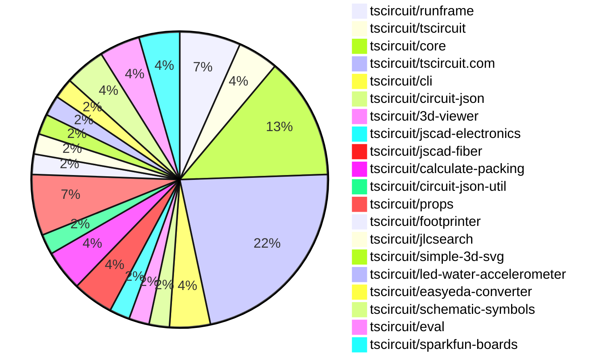
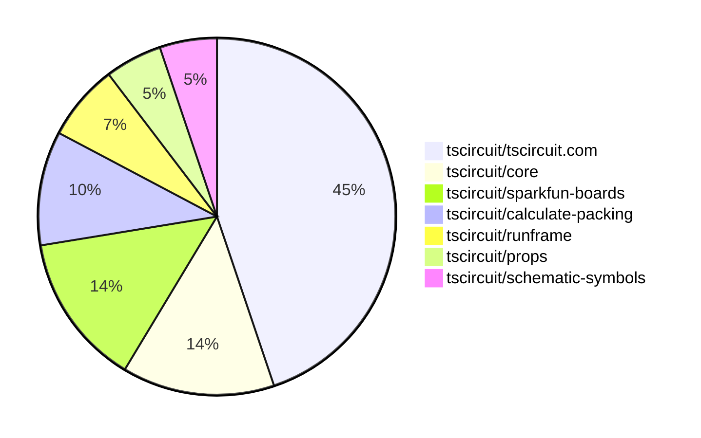

# Contribution Overview 2025-08-13

## PRs by Repository

## Contributor Overview

| Contributor | 🐳 Major | 🐙 Minor | 🐌 Tiny | ⭐ | Score | Discussion Contributions |
|-------------|---------|---------|---------|-----|----------------|--------------------------|
| [seveibar](#seveibar) | 2 | 2 | 9 | ⭐⭐⭐ | 36 | 0🔹 0🔶 0💎 |
| [ArnavK-09](#ArnavK-09) | 4 | 1 | 8 | ⭐⭐ | 28 | 0🔹 0🔶 0💎 |
| [imrishabh18](#imrishabh18) | 0 | 1 | 8 | ⭐⭐ | 13 | 0🔹 0🔶 0💎 |
| [techmannih](#techmannih) | 0 | 1 | 1 | ⭐ | 5 | 0🔹 0🔶 0💎 |
| [ShiboSoftwareDev](#ShiboSoftwareDev) | 1 | 0 | 0 | ⭐ | 5 | 0🔹 0🔶 0💎 |
| [MustafaMulla29](#MustafaMulla29) | 1 | 0 | 0 | ⭐ | 4 | 0🔹 0🔶 0💎 |
| [pxlpal](#pxlpal) | 0 | 1 | 1 |  | 3 | 0🔹 0🔶 0💎 |
| [abimaelmartell](#abimaelmartell) | 0 | 1 | 1 |  | 3 | 0🔹 0🔶 0💎 |
| [tscircuitbot](#tscircuitbot) | 0 | 0 | 2 |  | 2 | 0🔹 0🔶 0💎 |

### Discussion Contribution Legend

- 🔹 Normal Comments: Basic participation with minimal effort
- 🔶 Great Informative Comments: Thoughtful participation that adds value
- 💎 Incredible Comments: Exceptional participation with high-quality content

## Review Table

[reviews-received-hover]: ## "Number of reviews received for PRs for this contributor"
[approvals-received-hover]: ## "Number of approvals received for PRs this contributor authored"
[rejections-received-hover]: ## "Number of rejections received for PRs this contributor authored"
[prs-opened-hover]: ## "Number of PRs opened by this contributor"
[issues-created-hover]: ## "Number of issues created by this contributor"
[bountied-issues-hover]: ## "Number of issues this contributor created with a bounty"
[bountied-issue-$-hover]: ## "Total bounty amount placed on issues authored by this contributor"

| Contributor | Reviews Received | Approvals Received | Rejections Received | Approvals | Rejections | PRs Opened | PRs Merged | Score | Issues Created | Bountied Issues | Bountied Issue $ |
|---|---|---|---|---|---|---|---|---|---|---|---|
| [MustafaMulla29](#MustafaMulla29) | 15 | 2 | 6 | 0 | 0 | 4 | 1 | 4 | 0 | 0 | 0 |
| [seveibar](#seveibar) | 4 | 1 | 0 | 26 | 6 | 17 | 13 | 36 | 0 | 0 | 0 |
| [imrishabh18](#imrishabh18) | 14 | 5 | 1 | 1 | 1 | 12 | 9 | 13 | 0 | 0 | 0 |
| [abimaelmartell](#abimaelmartell) | 3 | 2 | 1 | 0 | 0 | 5 | 2 | 3 | 0 | 0 | 0 |
| [ArnavK-09](#ArnavK-09) | 23 | 15 | 0 | 2 | 0 | 17 | 14 | 28 | 0 | 0 | 0 |
| [graphite-app[bot]](#graphite-app[bot]) | 0 | 0 | 0 | 0 | 0 | 0 | 0 | 0 | 0 | 0 | 0 |
| [pxlpal](#pxlpal) | 7 | 4 | 1 | 0 | 0 | 5 | 2 | 3 | 0 | 0 | 0 |
| [techmannih](#techmannih) | 2 | 1 | 0 | 0 | 2 | 2 | 2 | 5 | 0 | 0 | 0 |
| [Abse2001](#Abse2001) | 0 | 0 | 0 | 0 | 0 | 1 | 0 | 0 | 0 | 0 | 0 |
| [tscircuitbot](#tscircuitbot) | 0 | 0 | 0 | 0 | 0 | 11 | 2 | 2 | 0 | 0 | 0 |
| [ShiboSoftwareDev](#ShiboSoftwareDev) | 0 | 0 | 0 | 1 | 0 | 2 | 1 | 5 | 0 | 0 | 0 |

## Top 7 Repositories by Contribution Points

## Changes by Repository

### [tscircuit/runframe](https://github.com/tscircuit/runframe)

| PR # | Impact | Rating | Contributor | Description |
|------|--------|--------|-------------|-------------|
| [#999](https://github.com/tscircuit/runframe/pull/999) | 🐙 Minor | ⭐⭐ | imrishabh18 | Fixes the process reference error in the browser console by ensuring the tscircuit code works without needing to define window.process in the HTML. |

🐌 Tiny Contributions (2)

| PR # | Impact | Contributor | Description |
|------|--------|-------------|-------------|
| [#996](https://github.com/tscircuit/runframe/pull/996) | 🐌 Tiny | imrishabh18 | Renames the RunFrameCliLeftHeader component to FileMenuLeftHeader and adds support for the isWebEmbedded prop, modifying the components behavior based on its value. |
| [#994](https://github.com/tscircuit/runframe/pull/994) | 🐌 Tiny | seveibar | Updates the schematic-symbols dependency to version 0.0.185 in package.json |

### [tscircuit/tscircuit](https://github.com/tscircuit/tscircuit)

🐌 Tiny Contributions (2)

| PR # | Impact | Contributor | Description |
|------|--------|-------------|-------------|
| [#739](https://github.com/tscircuit/tscircuit/pull/739) | 🐌 Tiny | imrishabh18 | Updates the tscircuitrunframe dependency to version 0.0.808, ensuring compatibility without the use of process. |
| [#738](https://github.com/tscircuit/tscircuit/pull/738) | 🐌 Tiny | imrishabh18 | Updates the version of the tscircuitrunframe dependency in package.json from 0.0.788 to 0.0.806 |

### [tscircuit/core](https://github.com/tscircuit/core)

| PR # | Impact | Rating | Contributor | Description |
|------|--------|--------|-------------|-------------|
| [#1153](https://github.com/tscircuit/core/pull/1153) | 🐙 Minor | ⭐⭐ | seveibar | Fixes issue where match pack layout fails for overlapping groups in schematic designs |
| [#1160](https://github.com/tscircuit/core/pull/1160) | 🐙 Minor | ⭐⭐ | abimaelmartell | Fixes the pcbPack tilting issue by correcting the rotation calculations in the layout packing process. |

🐌 Tiny Contributions (4)

| PR # | Impact | Contributor | Description |
|------|--------|-------------|-------------|
| [#1158](https://github.com/tscircuit/core/pull/1158) | 🐌 Tiny | imrishabh18 | Adds support for a new schematic flex layout mode in the Group component, allowing for more flexible arrangement of schematic elements. |
| [#1148](https://github.com/tscircuit/core/pull/1148) | 🐌 Tiny | imrishabh18 | Changes the error type from source_trace_not_connected to source_trace_not_connected_error in error handling and related tests. |
| [#1154](https://github.com/tscircuit/core/pull/1154) | 🐌 Tiny | seveibar | Adds support for positive and negative pin aliases for capacitors defined with footprinter, aligning with IPC standards. |
| [#1159](https://github.com/tscircuit/core/pull/1159) | 🐌 Tiny | abimaelmartell | Updates the calculate-elbow dependency version from 0.0.5 to 0.0.9 in package.json |

### [tscircuit/tscircuit.com](https://github.com/tscircuit/tscircuit.com)

| PR # | Impact | Rating | Contributor | Description |
|------|--------|--------|-------------|-------------|
| [#1578](https://github.com/tscircuit/tscircuit.com/pull/1578) | 🐳 Major | ⭐⭐⭐ | ArnavK-09 | Adds a new option to download circuit designs as 3D PNG images, enhancing the download functionality for users. |
| [#1562](https://github.com/tscircuit/tscircuit.com/pull/1562) | 🐳 Major | ⭐⭐⭐ | ArnavK-09 | Adds a function to download GLTF models from Circuit JSON and updates the DownloadButtonAndMenu component to support GLB and GLTF formats. |
| [#1574](https://github.com/tscircuit/tscircuit.com/pull/1574) | 🐳 Major | ⭐⭐⭐ | ArnavK-09 | Optimizes file content fetching in the ImportantFilesView component to prevent multiple requests and reduce latency during loading. |
| [#1572](https://github.com/tscircuit/tscircuit.com/pull/1572) | 🐳 Major | ⭐⭐⭐ | ArnavK-09 | Adds loading and error states for the package build preview, improving user feedback during image loading. |
| [#1569](https://github.com/tscircuit/tscircuit.com/pull/1569) | 🐳 Major | ⭐⭐⭐ | seveibar | Show package page content while package files load and only display skeletons in file sections if files are loading, renaming loading flag to arePackageFilesLoading. |
| [#1573](https://github.com/tscircuit/tscircuit.com/pull/1573) | 🐙 Minor | ⭐⭐ | ArnavK-09 | Only show AI description tab when hasAiContent is true and AI review tab when hasAiReview is true or user is owner. This prevents showing empty or irrelevant tabs to users. |

🐌 Tiny Contributions (4)

| PR # | Impact | Contributor | Description |
|------|--------|-------------|-------------|
| [#1570](https://github.com/tscircuit/tscircuit.com/pull/1570) | 🐌 Tiny | imrishabh18 | Hides the GitHub repository button and View Source option when a package does not have a linked repository, ensuring that these options are only available when a repository is connected. |
| [#1579](https://github.com/tscircuit/tscircuit.com/pull/1579) | 🐌 Tiny | ArnavK-09 | Refactors the ShikiCodeViewer component to improve loading state handling and code rendering logic. |
| [#1575](https://github.com/tscircuit/tscircuit.com/pull/1575) | 🐌 Tiny | ArnavK-09 | Adjusts the position of the dropdown menu in the HeaderLogin component for better mobile usability. |
| [#1577](https://github.com/tscircuit/tscircuit.com/pull/1577) | 🐌 Tiny | ArnavK-09 | Removes unused components, pages, and dependencies, including cleaning up commented code and unused imports. |

### [tscircuit/cli](https://github.com/tscircuit/cli)

🐌 Tiny Contributions (2)

| PR # | Impact | Contributor | Description |
|------|--------|-------------|-------------|
| [#312](https://github.com/tscircuit/cli/pull/312) | 🐌 Tiny | imrishabh18 | Fixes a warning message that appears on every command execution in the CLI tool. |
| [#313](https://github.com/tscircuit/cli/pull/313) | 🐌 Tiny | imrishabh18 | Handles cancellation of interactive sessions gracefully by catching TypeErrors and exiting with a specific code. |

### [tscircuit/circuit-json](https://github.com/tscircuit/circuit-json)

🐌 Tiny Contributions (1)

| PR # | Impact | Contributor | Description |
|------|--------|-------------|-------------|
| [#253](https://github.com/tscircuit/circuit-json/pull/253) | 🐌 Tiny | ArnavK-09 | Replaces the nanoid dependency with a custom randomId function for generating random string IDs in the circuit element key generation process. |

### [tscircuit/3d-viewer](https://github.com/tscircuit/3d-viewer)

🐌 Tiny Contributions (1)

| PR # | Impact | Contributor | Description |
|------|--------|-------------|-------------|
| [#410](https://github.com/tscircuit/3d-viewer/pull/410) | 🐌 Tiny | ArnavK-09 | Update biome.json schema version, fix type annotations for React refs, and update package.json dependencies to newer versions while removing unused imports from storybook files. |

### [tscircuit/jscad-electronics](https://github.com/tscircuit/jscad-electronics)

🐌 Tiny Contributions (1)

| PR # | Impact | Contributor | Description |
|------|--------|-------------|-------------|
| [#105](https://github.com/tscircuit/jscad-electronics/pull/105) | 🐌 Tiny | ArnavK-09 | Update React and related types to version 19, remove unused jscad-fiber and react-dom from devDependencies, add sourcemap generation to build script, bump tscircuitfootprinter and vite versions |

### [tscircuit/jscad-fiber](https://github.com/tscircuit/jscad-fiber)

🐌 Tiny Contributions (2)

| PR # | Impact | Contributor | Description |
|------|--------|-------------|-------------|
| [#114](https://github.com/tscircuit/jscad-fiber/pull/114) | 🐌 Tiny | ArnavK-09 | Updates GitHub Actions workflows by upgrading actionscheckout and setup-bun to the latest versions, and adds a new build-check workflow with Node 20 and a frozen lockfile. |
| [#113](https://github.com/tscircuit/jscad-fiber/pull/113) | 🐌 Tiny | ArnavK-09 | Removes react, react-dom, and react-reconciler as they are no longer needed, and updates react-threedrei and react-threefiber to specific versions for better compatibility. |

### [tscircuit/calculate-packing](https://github.com/tscircuit/calculate-packing)

| PR # | Impact | Rating | Contributor | Description |
|------|--------|--------|-------------|-------------|
| [#18](https://github.com/tscircuit/calculate-packing/pull/18) | 🐳 Major | ⭐⭐⭐ | seveibar | Simplifies outlines by merging adjacent collinear segments into a single segment, improving outline representation. |
| [#17](https://github.com/tscircuit/calculate-packing/pull/17) | 🐙 Minor | ⭐⭐ | seveibar | Adds a new output field ccwRotationDegrees to the packed components to preserve rotation information during packing. |

### [tscircuit/circuit-json-util](https://github.com/tscircuit/circuit-json-util)

🐌 Tiny Contributions (1)

| PR # | Impact | Contributor | Description |
|------|--------|-------------|-------------|
| [#60](https://github.com/tscircuit/circuit-json-util/pull/60) | 🐌 Tiny | seveibar | Add repositionSchematicComponentTo and repositionSchematicGroupTo functions for moving schematic components and groups, including bounds calculation and typecheck fixes during transformations. |

### [tscircuit/props](https://github.com/tscircuit/props)

🐌 Tiny Contributions (3)

| PR # | Impact | Contributor | Description |
|------|--------|-------------|-------------|
| [#358](https://github.com/tscircuit/props/pull/358) | 🐌 Tiny | seveibar | Allows setting schStroke on trace components to control schematic stroke color and accepts any string value, along with adding tests for schStroke. |
| [#356](https://github.com/tscircuit/props/pull/356) | 🐌 Tiny | seveibar | Adds manufacturerPartNumber and mpn properties to the crystal component, along with documentation and tests for these new properties. |
| [#357](https://github.com/tscircuit/props/pull/357) | 🐌 Tiny | pxlpal | Allows internallyConnectedPins to include numbers in jumper, connector, and chip props, documents number support in README and generated docs, and adds a test for numeric internally connected pins. |

### [tscircuit/footprinter](https://github.com/tscircuit/footprinter)

🐌 Tiny Contributions (1)

| PR # | Impact | Contributor | Description |
|------|--------|-------------|-------------|
| [#361](https://github.com/tscircuit/footprinter/pull/361) | 🐌 Tiny | seveibar | Add silkscreen label margin option to control spacing between pads and silkscreen labels, and skip pin-1 triangle marker when silkscreen labels are enabled. |

### [tscircuit/jlcsearch](https://github.com/tscircuit/jlcsearch)

🐌 Tiny Contributions (1)

| PR # | Impact | Contributor | Description |
|------|--------|-------------|-------------|
| [#78](https://github.com/tscircuit/jlcsearch/pull/78) | 🐌 Tiny | seveibar | Adds a new search route for RISC-V processors, documents them, and links them from the component overview. |

### [tscircuit/simple-3d-svg](https://github.com/tscircuit/simple-3d-svg)

🐌 Tiny Contributions (1)

| PR # | Impact | Contributor | Description |
|------|--------|-------------|-------------|
| [#55](https://github.com/tscircuit/simple-3d-svg/pull/55) | 🐌 Tiny | seveibar | Adds support for parsing and rendering colors from 3MF basematerials, allowing mesh triangles to display their respective colors during rendering. |

### [tscircuit/led-water-accelerometer](https://github.com/tscircuit/led-water-accelerometer)

🐌 Tiny Contributions (1)

| PR # | Impact | Contributor | Description |
|------|--------|-------------|-------------|
| [#8](https://github.com/tscircuit/led-water-accelerometer/pull/8) | 🐌 Tiny | seveibar | Adds an image to the README file of the project. |

### [tscircuit/easyeda-converter](https://github.com/tscircuit/easyeda-converter)

| PR # | Impact | Rating | Contributor | Description |
|------|--------|--------|-------------|-------------|
| [#309](https://github.com/tscircuit/easyeda-converter/pull/309) | 🐙 Minor | ⭐⭐ | pxlpal | Fixes CAD component recentering and model seating logic to ensure proper placement and orientation of components on the PCB. |

### [tscircuit/schematic-symbols](https://github.com/tscircuit/schematic-symbols)

| PR # | Impact | Rating | Contributor | Description |
|------|--------|--------|-------------|-------------|
| [#342](https://github.com/tscircuit/schematic-symbols/pull/342) | 🐙 Minor | ⭐⭐ | techmannih | Fixes pin numbering for crystal symbols to follow the counter-clockwise convention, correcting the labels for pins 2 and 4. |

🐌 Tiny Contributions (1)

| PR # | Impact | Contributor | Description |
|------|--------|-------------|-------------|
| [#343](https://github.com/tscircuit/schematic-symbols/pull/343) | 🐌 Tiny | techmannih | Updates the bun-match-svg dependency to version 0.0.12 in the package.json file. |

### [tscircuit/eval](https://github.com/tscircuit/eval)

🐌 Tiny Contributions (2)

| PR # | Impact | Contributor | Description |
|------|--------|-------------|-------------|
| [#838](https://github.com/tscircuit/eval/pull/838) | 🐌 Tiny | tscircuitbot | Automated update of tscircuitcore to v0.0.630. |
| [#828](https://github.com/tscircuit/eval/pull/828) | 🐌 Tiny | tscircuitbot | Updates the tscircuitcore dependency to version 0.0.625 in the package.json file. |

### [tscircuit/sparkfun-boards](https://github.com/tscircuit/sparkfun-boards)

| PR # | Impact | Rating | Contributor | Description |
|------|--------|--------|-------------|-------------|
| [#122](https://github.com/tscircuit/sparkfun-boards/pull/122) | 🐳 Major | ⭐⭐⭐ | ShiboSoftwareDev | Adds a new SparkFun SOIC to DIP Adapter 8 Pin circuit board with associated schematic and documentation. |
| [#117](https://github.com/tscircuit/sparkfun-boards/pull/117) | 🐳 Major | ⭐⭐⭐ | MustafaMulla29 | Introduces a new circuit board for the SparkFun RFID Reader Breakout, including its schematic and footprint. |

## Changes by Contributor

### [imrishabh18](https://github.com/imrishabh18)

| PRs # | Impact | Rating | Description |
|------|--------|--------|-------------|
| [#999](https://github.com/tscircuit/runframe/pull/999) | 🐙 Minor | ⭐⭐ | Fixes the process reference error in the browser console by ensuring the tscircuit code works without needing to define window.process in the HTML. |

🐌 Tiny Contributions (8)

| PR # | Impact | Description |
|------|--------|-------------|
| [#739](https://github.com/tscircuit/tscircuit/pull/739) | 🐌 Tiny | Updates the tscircuitrunframe dependency to version 0.0.808, ensuring compatibility without the use of process. |
| [#738](https://github.com/tscircuit/tscircuit/pull/738) | 🐌 Tiny | Updates the version of the tscircuitrunframe dependency in package.json from 0.0.788 to 0.0.806 |
| [#1158](https://github.com/tscircuit/core/pull/1158) | 🐌 Tiny | Adds support for a new schematic flex layout mode in the Group component, allowing for more flexible arrangement of schematic elements. |
| [#1148](https://github.com/tscircuit/core/pull/1148) | 🐌 Tiny | Changes the error type from source_trace_not_connected to source_trace_not_connected_error in error handling and related tests. |
| [#1570](https://github.com/tscircuit/tscircuit.com/pull/1570) | 🐌 Tiny | Hides the GitHub repository button and View Source option when a package does not have a linked repository, ensuring that these options are only available when a repository is connected. |
| [#996](https://github.com/tscircuit/runframe/pull/996) | 🐌 Tiny | Renames the RunFrameCliLeftHeader component to FileMenuLeftHeader and adds support for the isWebEmbedded prop, modifying the components behavior based on its value. |
| [#312](https://github.com/tscircuit/cli/pull/312) | 🐌 Tiny | Fixes a warning message that appears on every command execution in the CLI tool. |
| [#313](https://github.com/tscircuit/cli/pull/313) | 🐌 Tiny | Handles cancellation of interactive sessions gracefully by catching TypeErrors and exiting with a specific code. |

### [ArnavK-09](https://github.com/ArnavK-09)

| PRs # | Impact | Rating | Description |
|------|--------|--------|-------------|
| [#1578](https://github.com/tscircuit/tscircuit.com/pull/1578) | 🐳 Major | ⭐⭐⭐ | Adds a new option to download circuit designs as 3D PNG images, enhancing the download functionality for users. |
| [#1562](https://github.com/tscircuit/tscircuit.com/pull/1562) | 🐳 Major | ⭐⭐⭐ | Adds a function to download GLTF models from Circuit JSON and updates the DownloadButtonAndMenu component to support GLB and GLTF formats. |
| [#1574](https://github.com/tscircuit/tscircuit.com/pull/1574) | 🐳 Major | ⭐⭐⭐ | Optimizes file content fetching in the ImportantFilesView component to prevent multiple requests and reduce latency during loading. |
| [#1572](https://github.com/tscircuit/tscircuit.com/pull/1572) | 🐳 Major | ⭐⭐⭐ | Adds loading and error states for the package build preview, improving user feedback during image loading. |
| [#1573](https://github.com/tscircuit/tscircuit.com/pull/1573) | 🐙 Minor | ⭐⭐ | Only show AI description tab when hasAiContent is true and AI review tab when hasAiReview is true or user is owner. This prevents showing empty or irrelevant tabs to users. |

🐌 Tiny Contributions (8)

| PR # | Impact | Description |
|------|--------|-------------|
| [#253](https://github.com/tscircuit/circuit-json/pull/253) | 🐌 Tiny | Replaces the nanoid dependency with a custom randomId function for generating random string IDs in the circuit element key generation process. |
| [#410](https://github.com/tscircuit/3d-viewer/pull/410) | 🐌 Tiny | Update biome.json schema version, fix type annotations for React refs, and update package.json dependencies to newer versions while removing unused imports from storybook files. |
| [#105](https://github.com/tscircuit/jscad-electronics/pull/105) | 🐌 Tiny | Update React and related types to version 19, remove unused jscad-fiber and react-dom from devDependencies, add sourcemap generation to build script, bump tscircuitfootprinter and vite versions |
| [#114](https://github.com/tscircuit/jscad-fiber/pull/114) | 🐌 Tiny | Updates GitHub Actions workflows by upgrading actionscheckout and setup-bun to the latest versions, and adds a new build-check workflow with Node 20 and a frozen lockfile. |
| [#113](https://github.com/tscircuit/jscad-fiber/pull/113) | 🐌 Tiny | Removes react, react-dom, and react-reconciler as they are no longer needed, and updates react-threedrei and react-threefiber to specific versions for better compatibility. |
| [#1579](https://github.com/tscircuit/tscircuit.com/pull/1579) | 🐌 Tiny | Refactors the ShikiCodeViewer component to improve loading state handling and code rendering logic. |
| [#1575](https://github.com/tscircuit/tscircuit.com/pull/1575) | 🐌 Tiny | Adjusts the position of the dropdown menu in the HeaderLogin component for better mobile usability. |
| [#1577](https://github.com/tscircuit/tscircuit.com/pull/1577) | 🐌 Tiny | Removes unused components, pages, and dependencies, including cleaning up commented code and unused imports. |

### [seveibar](https://github.com/seveibar)

| PRs # | Impact | Rating | Description |
|------|--------|--------|-------------|
| [#1569](https://github.com/tscircuit/tscircuit.com/pull/1569) | 🐳 Major | ⭐⭐⭐ | Show package page content while package files load and only display skeletons in file sections if files are loading, renaming loading flag to arePackageFilesLoading. |
| [#18](https://github.com/tscircuit/calculate-packing/pull/18) | 🐳 Major | ⭐⭐⭐ | Simplifies outlines by merging adjacent collinear segments into a single segment, improving outline representation. |
| [#1153](https://github.com/tscircuit/core/pull/1153) | 🐙 Minor | ⭐⭐ | Fixes issue where match pack layout fails for overlapping groups in schematic designs |
| [#17](https://github.com/tscircuit/calculate-packing/pull/17) | 🐙 Minor | ⭐⭐ | Adds a new output field ccwRotationDegrees to the packed components to preserve rotation information during packing. |

🐌 Tiny Contributions (9)

| PR # | Impact | Description |
|------|--------|-------------|
| [#60](https://github.com/tscircuit/circuit-json-util/pull/60) | 🐌 Tiny | Add repositionSchematicComponentTo and repositionSchematicGroupTo functions for moving schematic components and groups, including bounds calculation and typecheck fixes during transformations. |
| [#358](https://github.com/tscircuit/props/pull/358) | 🐌 Tiny | Allows setting schStroke on trace components to control schematic stroke color and accepts any string value, along with adding tests for schStroke. |
| [#356](https://github.com/tscircuit/props/pull/356) | 🐌 Tiny | Adds manufacturerPartNumber and mpn properties to the crystal component, along with documentation and tests for these new properties. |
| [#361](https://github.com/tscircuit/footprinter/pull/361) | 🐌 Tiny | Add silkscreen label margin option to control spacing between pads and silkscreen labels, and skip pin-1 triangle marker when silkscreen labels are enabled. |
| [#1154](https://github.com/tscircuit/core/pull/1154) | 🐌 Tiny | Adds support for positive and negative pin aliases for capacitors defined with footprinter, aligning with IPC standards. |
| [#78](https://github.com/tscircuit/jlcsearch/pull/78) | 🐌 Tiny | Adds a new search route for RISC-V processors, documents them, and links them from the component overview. |
| [#994](https://github.com/tscircuit/runframe/pull/994) | 🐌 Tiny | Updates the schematic-symbols dependency to version 0.0.185 in package.json |
| [#55](https://github.com/tscircuit/simple-3d-svg/pull/55) | 🐌 Tiny | Adds support for parsing and rendering colors from 3MF basematerials, allowing mesh triangles to display their respective colors during rendering. |
| [#8](https://github.com/tscircuit/led-water-accelerometer/pull/8) | 🐌 Tiny | Adds an image to the README file of the project. |

### [pxlpal](https://github.com/pxlpal)

| PRs # | Impact | Rating | Description |
|------|--------|--------|-------------|
| [#309](https://github.com/tscircuit/easyeda-converter/pull/309) | 🐙 Minor | ⭐⭐ | Fixes CAD component recentering and model seating logic to ensure proper placement and orientation of components on the PCB. |

🐌 Tiny Contributions (1)

| PR # | Impact | Description |
|------|--------|-------------|
| [#357](https://github.com/tscircuit/props/pull/357) | 🐌 Tiny | Allows internallyConnectedPins to include numbers in jumper, connector, and chip props, documents number support in README and generated docs, and adds a test for numeric internally connected pins. |

### [abimaelmartell](https://github.com/abimaelmartell)

| PRs # | Impact | Rating | Description |
|------|--------|--------|-------------|
| [#1160](https://github.com/tscircuit/core/pull/1160) | 🐙 Minor | ⭐⭐ | Fixes the pcbPack tilting issue by correcting the rotation calculations in the layout packing process. |

🐌 Tiny Contributions (1)

| PR # | Impact | Description |
|------|--------|-------------|
| [#1159](https://github.com/tscircuit/core/pull/1159) | 🐌 Tiny | Updates the calculate-elbow dependency version from 0.0.5 to 0.0.9 in package.json |

### [techmannih](https://github.com/techmannih)

| PRs # | Impact | Rating | Description |
|------|--------|--------|-------------|
| [#342](https://github.com/tscircuit/schematic-symbols/pull/342) | 🐙 Minor | ⭐⭐ | Fixes pin numbering for crystal symbols to follow the counter-clockwise convention, correcting the labels for pins 2 and 4. |

🐌 Tiny Contributions (1)

| PR # | Impact | Description |
|------|--------|-------------|
| [#343](https://github.com/tscircuit/schematic-symbols/pull/343) | 🐌 Tiny | Updates the bun-match-svg dependency to version 0.0.12 in the package.json file. |

### [tscircuitbot](https://github.com/tscircuitbot)

🐌 Tiny Contributions (2)

| PR # | Impact | Description |
|------|--------|-------------|
| [#838](https://github.com/tscircuit/eval/pull/838) | 🐌 Tiny | Automated update of tscircuitcore to v0.0.630. |
| [#828](https://github.com/tscircuit/eval/pull/828) | 🐌 Tiny | Updates the tscircuitcore dependency to version 0.0.625 in the package.json file. |

### [ShiboSoftwareDev](https://github.com/ShiboSoftwareDev)

| PRs # | Impact | Rating | Description |
|------|--------|--------|-------------|
| [#122](https://github.com/tscircuit/sparkfun-boards/pull/122) | 🐳 Major | ⭐⭐⭐ | Adds a new SparkFun SOIC to DIP Adapter 8 Pin circuit board with associated schematic and documentation. |

### [MustafaMulla29](https://github.com/MustafaMulla29)

| PRs # | Impact | Rating | Description |
|------|--------|--------|-------------|
| [#117](https://github.com/tscircuit/sparkfun-boards/pull/117) | 🐳 Major | ⭐⭐⭐ | Introduces a new circuit board for the SparkFun RFID Reader Breakout, including its schematic and footprint. |

## Repository Owners

| Repository | Codeowners |
|------------|------------|
| [builder](https://github.com/tscircuit/builder/blob/main/.github/CODEOWNERS) | [seveibar](https://github.com/seveibar)
| [pcb-viewer](https://github.com/tscircuit/pcb-viewer/blob/main/.github/CODEOWNERS) | [seveibar](https://github.com/seveibar), [ShiboSoftwareDev](https://github.com/ShiboSoftwareDev)
| [footprints](https://github.com/tscircuit/footprints/blob/main/.github/CODEOWNERS) | [seveibar](https://github.com/seveibar)
| [footprinter](https://github.com/tscircuit/footprinter/blob/main/.github/CODEOWNERS) | [seveibar](https://github.com/seveibar), [techmannih](https://github.com/techmannih)
| [3d-viewer](https://github.com/tscircuit/3d-viewer/blob/main/.github/CODEOWNERS) | [ShiboSoftwareDev](https://github.com/ShiboSoftwareDev)
| [winterspec](https://github.com/tscircuit/winterspec/blob/main/.github/CODEOWNERS) | [seveibar](https://github.com/seveibar), [ShiboSoftwareDev](https://github.com/ShiboSoftwareDev)
| [jscad-electronics](https://github.com/tscircuit/jscad-electronics/blob/main/.github/CODEOWNERS) | [seveibar](https://github.com/seveibar), [abhijitxy](https://github.com/abhijitxy), [anas-sarkez](https://github.com/anas-sarkez)
| [circuit-to-svg](https://github.com/tscircuit/circuit-to-svg/blob/main/.github/CODEOWNERS) | [imrishabh18](https://github.com/imrishabh18)
| [schematic-symbols](https://github.com/tscircuit/schematic-symbols/blob/main/.github/CODEOWNERS) | [seveibar](https://github.com/seveibar), [imrishabh18](https://github.com/imrishabh18), [techmannih](https://github.com/techmannih)
| [circuit-json-to-gerber](https://github.com/tscircuit/circuit-json-to-gerber/blob/main/.github/CODEOWNERS) | [seveibar](https://github.com/seveibar), [ShiboSoftwareDev](https://github.com/ShiboSoftwareDev)
| [tscircuit.com](https://github.com/tscircuit/tscircuit.com/blob/main/.github/CODEOWNERS) | [seveibar](https://github.com/seveibar), [imrishabh18](https://github.com/imrishabh18)
| [cli](https://github.com/tscircuit/cli/blob/main/.github/CODEOWNERS) | [seveibar](https://github.com/seveibar), [imrishabh18](https://github.com/imrishabh18), [ArnavK-09](https://github.com/ArnavK-09)
| [issue-roulette](https://github.com/tscircuit/issue-roulette/blob/main/.github/CODEOWNERS) | [Anshgrover23](https://github.com/Anshgrover23)
| [sparkfun-boards](https://github.com/tscircuit/sparkfun-boards/blob/main/.github/CODEOWNERS) | [ShiboSoftwareDev](https://github.com/ShiboSoftwareDev), [MustafaMulla29](https://github.com/MustafaMulla29), [Anshgrover23](https://github.com/Anshgrover23), [Abse2001](https://github.com/Abse2001), [techmannih](https://github.com/techmannih)
| [schematic-corpus](https://github.com/tscircuit/schematic-corpus/blob/main/.github/CODEOWNERS) | [Abse2001](https://github.com/Abse2001)

## Repositories by Owner

| User | Repo |
|------|------|
| [seveibar](https://github.com/seveibar) | [builder](https://github.com/tscircuit/builder/blob/main/.github/CODEOWNERS) |
|  | [pcb-viewer](https://github.com/tscircuit/pcb-viewer/blob/main/.github/CODEOWNERS) |
|  | [footprints](https://github.com/tscircuit/footprints/blob/main/.github/CODEOWNERS) |
|  | [footprinter](https://github.com/tscircuit/footprinter/blob/main/.github/CODEOWNERS) |
|  | [winterspec](https://github.com/tscircuit/winterspec/blob/main/.github/CODEOWNERS) |
|  | [jscad-electronics](https://github.com/tscircuit/jscad-electronics/blob/main/.github/CODEOWNERS) |
|  | [schematic-symbols](https://github.com/tscircuit/schematic-symbols/blob/main/.github/CODEOWNERS) |
|  | [circuit-json-to-gerber](https://github.com/tscircuit/circuit-json-to-gerber/blob/main/.github/CODEOWNERS) |
|  | [tscircuit.com](https://github.com/tscircuit/tscircuit.com/blob/main/.github/CODEOWNERS) |
|  | [cli](https://github.com/tscircuit/cli/blob/main/.github/CODEOWNERS) |
| [ShiboSoftwareDev](https://github.com/ShiboSoftwareDev) | [pcb-viewer](https://github.com/tscircuit/pcb-viewer/blob/main/.github/CODEOWNERS) |
|  | [3d-viewer](https://github.com/tscircuit/3d-viewer/blob/main/.github/CODEOWNERS) |
|  | [winterspec](https://github.com/tscircuit/winterspec/blob/main/.github/CODEOWNERS) |
|  | [circuit-json-to-gerber](https://github.com/tscircuit/circuit-json-to-gerber/blob/main/.github/CODEOWNERS) |
|  | [sparkfun-boards](https://github.com/tscircuit/sparkfun-boards/blob/main/.github/CODEOWNERS) |
| [techmannih](https://github.com/techmannih) | [footprinter](https://github.com/tscircuit/footprinter/blob/main/.github/CODEOWNERS) |
|  | [schematic-symbols](https://github.com/tscircuit/schematic-symbols/blob/main/.github/CODEOWNERS) |
|  | [sparkfun-boards](https://github.com/tscircuit/sparkfun-boards/blob/main/.github/CODEOWNERS) |
| [abhijitxy](https://github.com/abhijitxy) | [jscad-electronics](https://github.com/tscircuit/jscad-electronics/blob/main/.github/CODEOWNERS) |
| [anas-sarkez](https://github.com/anas-sarkez) | [jscad-electronics](https://github.com/tscircuit/jscad-electronics/blob/main/.github/CODEOWNERS) |
| [imrishabh18](https://github.com/imrishabh18) | [circuit-to-svg](https://github.com/tscircuit/circuit-to-svg/blob/main/.github/CODEOWNERS) |
|  | [schematic-symbols](https://github.com/tscircuit/schematic-symbols/blob/main/.github/CODEOWNERS) |
|  | [tscircuit.com](https://github.com/tscircuit/tscircuit.com/blob/main/.github/CODEOWNERS) |
|  | [cli](https://github.com/tscircuit/cli/blob/main/.github/CODEOWNERS) |
| [ArnavK-09](https://github.com/ArnavK-09) | [cli](https://github.com/tscircuit/cli/blob/main/.github/CODEOWNERS) |
| [Anshgrover23](https://github.com/Anshgrover23) | [issue-roulette](https://github.com/tscircuit/issue-roulette/blob/main/.github/CODEOWNERS) |
|  | [sparkfun-boards](https://github.com/tscircuit/sparkfun-boards/blob/main/.github/CODEOWNERS) |
| [MustafaMulla29](https://github.com/MustafaMulla29) | [sparkfun-boards](https://github.com/tscircuit/sparkfun-boards/blob/main/.github/CODEOWNERS) |
| [Abse2001](https://github.com/Abse2001) | [sparkfun-boards](https://github.com/tscircuit/sparkfun-boards/blob/main/.github/CODEOWNERS) |
|  | [schematic-corpus](https://github.com/tscircuit/schematic-corpus/blob/main/.github/CODEOWNERS) |

