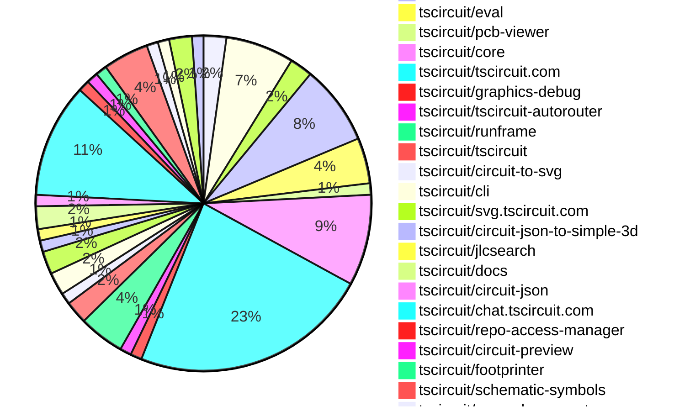
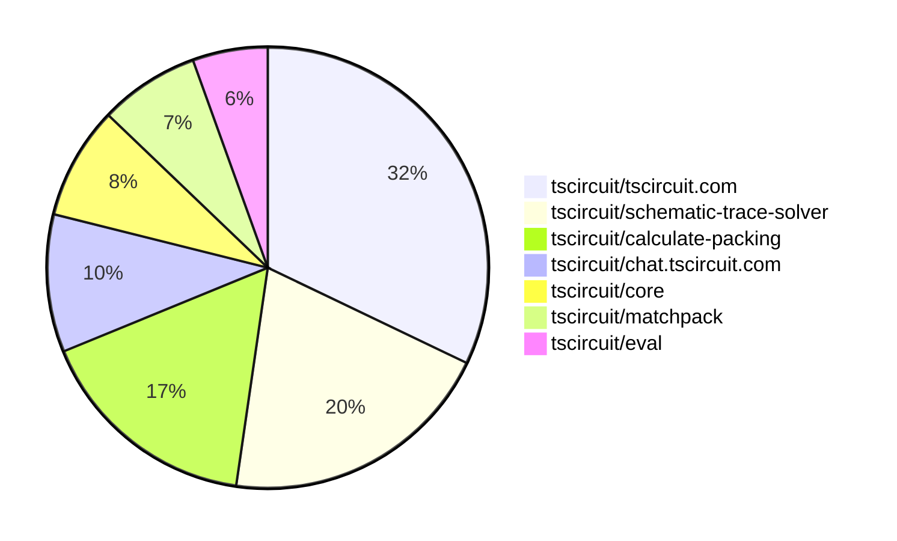

# Contribution Overview 2025-08-20

## PRs by Repository

## Contributor Overview

| Contributor | 🐳 Major | 🐙 Minor | 🐌 Tiny | ⭐ | Score | Discussion Contributions |
|-------------|---------|---------|---------|-----|----------------|--------------------------|
| [seveibar](#seveibar) | 12 | 1 | 14 | 👑 | 67 | 0🔹 0🔶 0💎 |
| [ArnavK-09](#ArnavK-09) | 2 | 5 | 13 | ⭐⭐⭐ | 31 | 0🔹 0🔶 0💎 |
| [imrishabh18](#imrishabh18) | 2 | 3 | 14 | ⭐⭐ | 27 | 0🔹 0🔶 0💎 |
| [abimaelmartell](#abimaelmartell) | 1 | 2 | 12 | ⭐⭐ | 21 | 0🔹 0🔶 0💎 |
| [techmannih](#techmannih) | 0 | 3 | 3 | ⭐⭐ | 13 | 0🔹 0🔶 0💎 |
| [pxlpal](#pxlpal) | 0 | 1 | 2 | ⭐ | 4 | 0🔹 0🔶 0💎 |
| [ShiboSoftwareDev](#ShiboSoftwareDev) | 0 | 0 | 1 |  | 2 | 0🔹 0🔶 0💎 |

### Discussion Contribution Legend

- 🔹 Normal Comments: Basic participation with minimal effort
- 🔶 Great Informative Comments: Thoughtful participation that adds value
- 💎 Incredible Comments: Exceptional participation with high-quality content

## Review Table

[reviews-received-hover]: ## "Number of reviews received for PRs for this contributor"
[approvals-received-hover]: ## "Number of approvals received for PRs this contributor authored"
[rejections-received-hover]: ## "Number of rejections received for PRs this contributor authored"
[prs-opened-hover]: ## "Number of PRs opened by this contributor"
[issues-created-hover]: ## "Number of issues created by this contributor"
[bountied-issues-hover]: ## "Number of issues this contributor created with a bounty"
[bountied-issue-$-hover]: ## "Total bounty amount placed on issues authored by this contributor"

| Contributor | Reviews Received | Approvals Received | Rejections Received | Approvals | Rejections | PRs Opened | PRs Merged | Score | Issues Created | Bountied Issues | Bountied Issue $ |
|---|---|---|---|---|---|---|---|---|---|---|---|
| [seveibar](#seveibar) | 0 | 0 | 0 | 50 | 3 | 34 | 28 | 67 | 0 | 0 | 0 |
| [abimaelmartell](#abimaelmartell) | 13 | 10 | 0 | 3 | 0 | 16 | 15 | 21 | 0 | 0 | 0 |
| [imrishabh18](#imrishabh18) | 32 | 16 | 1 | 2 | 1 | 30 | 19 | 27 | 0 | 0 | 0 |
| [pxlpal](#pxlpal) | 6 | 3 | 1 | 0 | 0 | 4 | 3 | 4 | 0 | 0 | 0 |
| [techmannih](#techmannih) | 19 | 5 | 1 | 0 | 0 | 9 | 6 | 13 | 0 | 0 | 0 |
| [graphite-app[bot]](#graphite-app[bot]) | 0 | 0 | 0 | 0 | 0 | 0 | 0 | 0 | 0 | 0 | 0 |
| [ArnavK-09](#ArnavK-09) | 26 | 21 | 0 | 2 | 0 | 21 | 20 | 31 | 0 | 0 | 0 |
| [thesloppyguy](#thesloppyguy) | 0 | 0 | 0 | 0 | 0 | 1 | 0 | 0 | 0 | 0 | 0 |
| [ShiboSoftwareDev](#ShiboSoftwareDev) | 8 | 2 | 1 | 0 | 0 | 2 | 1 | 2 | 0 | 0 | 0 |
| [tscircuitbot](#tscircuitbot) | 0 | 0 | 0 | 0 | 0 | 16 | 0 | 0 | 0 | 0 | 0 |
| [copilot-pull-request-reviewer[bot]](#copilot-pull-request-reviewer[bot]) | 0 | 0 | 0 | 0 | 0 | 0 | 0 | 0 | 0 | 0 | 0 |

## Top 7 Repositories by Contribution Points

## Changes by Repository

### [tscircuit/calculate-elbow](https://github.com/tscircuit/calculate-elbow)

| PR # | Impact | Rating | Contributor | Description |
|------|--------|--------|-------------|-------------|
| [#9](https://github.com/tscircuit/calculate-elbow/pull/9) | 🐳 Major | ⭐⭐⭐ | seveibar | Fixes edge case handling in elbow calculations to ensure accurate routing paths for various configurations of start and end points. |

🐌 Tiny Contributions (1)

| PR # | Impact | Contributor | Description |
|------|--------|-------------|-------------|
| [#10](https://github.com/tscircuit/calculate-elbow/pull/10) | 🐌 Tiny | seveibar | Removes global debug assignments from the codebase to clean up the build output. |

### [tscircuit/calculate-packing](https://github.com/tscircuit/calculate-packing)

| PR # | Impact | Rating | Contributor | Description |
|------|--------|--------|-------------|-------------|
| [#28](https://github.com/tscircuit/calculate-packing/pull/28) | 🐳 Major | ⭐⭐⭐ | seveibar | Adds an epsilon value for overlap checks to fix capacitor alignment issues for voltage regulators in the core functionality of the packing algorithm. |
| [#27](https://github.com/tscircuit/calculate-packing/pull/27) | 🐳 Major | ⭐⭐⭐ | seveibar | Pad to Pad vs Pad to Center Optimization !image(https:github.comuser-attachmentsassetsb3306b25-1e3b-49af-a415-0db9c248ba3d) |
| [#26](https://github.com/tscircuit/calculate-packing/pull/26) | 🐳 Major | ⭐⭐⭐ | seveibar | This pull request addresses issues with invalid outline generation in the outline construction process. It introduces a new approach to constructing outlines that is more stable and reliable. The changes include the addition of new utility functions for bounding box calculations and improvements to the outline construction logic to ensure valid outputs. |
| [#23](https://github.com/tscircuit/calculate-packing/pull/23) | 🐳 Major | ⭐⭐⭐ | seveibar | pack placement strategy wip pack solver 2 single component pack solver init add packsolver2 test with error remove stroke widths that were making things less visible, add test identifying insideoutside of outline for componentToPlace using poitnInOutline always show pads of outline segment while being solved switch PackSolver2 as the default for PackDebugger improve pointInOutline to match segment style. Improve normal calculation fix normal segment placement placeholder for viable outline segment computation add largest rect insideoutside bounds solver add largest rect outside outline solver improve visual and fix last-minute offset when irls is solved |

🐌 Tiny Contributions (2)

| PR # | Impact | Contributor | Description |
|------|--------|-------------|-------------|
| [#25](https://github.com/tscircuit/calculate-packing/pull/25) | 🐌 Tiny | seveibar | Adds getConstructorParams method to PackSolver2 and modifies it in SingleComponentPackSolver to return parameters in a new format. |
| [#24](https://github.com/tscircuit/calculate-packing/pull/24) | 🐌 Tiny | seveibar | Adds PackSolver2 to the exports in the index file, making it available for use in other modules. |

### [tscircuit/matchpack](https://github.com/tscircuit/matchpack)

| PR # | Impact | Rating | Contributor | Description |
|------|--------|--------|-------------|-------------|
| [#10](https://github.com/tscircuit/matchpack/pull/10) | 🐳 Major | ⭐⭐⭐ | seveibar | Add PasteInput page for parsing LayoutPipelineSolver InputProblem and fix rotation offsets not loading properly from PackSolver2 |
| [#9](https://github.com/tscircuit/matchpack/pull/9) | 🐳 Major | ⭐⭐⭐ | seveibar | Fixes issues with the outline missing packed components and resolves problems in the PackSolver2 implementation. |

### [tscircuit/schematic-trace-solver](https://github.com/tscircuit/schematic-trace-solver)

| PR # | Impact | Rating | Contributor | Description |
|------|--------|--------|-------------|-------------|
| [#10](https://github.com/tscircuit/schematic-trace-solver/pull/10) | 🐳 Major | ⭐⭐⭐ | seveibar | Implements a GenericSolverDebugger and fixes an issue where trace lines sometimes incorrectly pass through chips in the schematic. |
| [#7](https://github.com/tscircuit/schematic-trace-solver/pull/7) | 🐳 Major | ⭐⭐⭐ | seveibar | Refactors the net label placement solver to improve the placement of single orientation labels (VCCGND) by breaking up functions and cleaning up the code, resulting in a more efficient algorithm for net label placement. |
| [#4](https://github.com/tscircuit/schematic-trace-solver/pull/4) | 🐳 Major | ⭐⭐⭐ | seveibar | Sets a maximum distance for MSP pairs in net connections and places net labels at independent trace islands. |
| [#3](https://github.com/tscircuit/schematic-trace-solver/pull/3) | 🐳 Major | ⭐⭐⭐ | seveibar | Add a new example, improve pin direction calculation, and prevent the first or last segment of a trace from being moved. |
| [#2](https://github.com/tscircuit/schematic-trace-solver/pull/2) | 🐳 Major | ⭐⭐⭐ | seveibar | add visualize input problem more tailwind insertion, fix toolbar spacing, show input problem in msp solver improve visualization schematic trace lines start wip guidelines solver implement guidelines calculation |

🐌 Tiny Contributions (2)

| PR # | Impact | Contributor | Description |
|------|--------|-------------|-------------|
| [#6](https://github.com/tscircuit/schematic-trace-solver/pull/6) | 🐌 Tiny | seveibar | Expands chip dimensions to ensure all pins are within or on the chip boundary without shrinking the chip size. |
| [#5](https://github.com/tscircuit/schematic-trace-solver/pull/5) | 🐌 Tiny | seveibar | Fixes issue where pins inside chips are incorrectly positioned, leading to net label problems. |

### [tscircuit/eval](https://github.com/tscircuit/eval)

| PR # | Impact | Rating | Contributor | Description |
|------|--------|--------|-------------|-------------|
| [#873](https://github.com/tscircuit/eval/pull/873) | 🐙 Minor | ⭐⭐ | seveibar | Adds a new method executeComponent to the CircuitRunner and CircuitWebWorker classes, allowing for the execution of React components within the circuit context. |
| [#855](https://github.com/tscircuit/eval/pull/855) | 🐙 Minor | ⭐⭐ | ArnavK-09 | Fixes the prioritization of default exports over named exports in component rendering. |

🐌 Tiny Contributions (2)

| PR # | Impact | Contributor | Description |
|------|--------|-------------|-------------|
| [#866](https://github.com/tscircuit/eval/pull/866) | 🐌 Tiny | seveibar | Refactors test organization into directories, introduces a validation script for test matrix coverage, and updates the core library to version 0.0.640. |
| [#853](https://github.com/tscircuit/eval/pull/853) | 🐌 Tiny | imrishabh18 | Adds a fetch proxy to the web worker, allowing fetch requests to be routed through the main thread, which is useful in restricted environments where worker fetch requests are blocked. |

### [tscircuit/pcb-viewer](https://github.com/tscircuit/pcb-viewer)

🐌 Tiny Contributions (1)

| PR # | Impact | Contributor | Description |
|------|--------|-------------|-------------|
| [#357](https://github.com/tscircuit/pcb-viewer/pull/357) | 🐌 Tiny | seveibar | Modifies the build process to exclude tscircuitcore from the bundled output, allowing it to be treated as an external dependency. |

### [tscircuit/core](https://github.com/tscircuit/core)

| PR # | Impact | Rating | Contributor | Description |
|------|--------|--------|-------------|-------------|
| [#1168](https://github.com/tscircuit/core/pull/1168) | 🐙 Minor | ⭐⭐ | imrishabh18 | Calculates the dimensions of a schematic group based on its components when explicit dimensions are not provided, ensuring proper layout in the flex system. |

🐌 Tiny Contributions (7)

| PR # | Impact | Contributor | Description |
|------|--------|-------------|-------------|
| [#1182](https://github.com/tscircuit/core/pull/1182) | 🐌 Tiny | seveibar | Removes support for React Reconciler 18, consolidating to React Reconciler for version 19 and above. |
| [#1181](https://github.com/tscircuit/core/pull/1181) | 🐌 Tiny | seveibar | Adds a new tsup configuration file to ensure compatibility with older bundlers by disabling import assertions and lowering the target to ES2020. |
| [#1180](https://github.com/tscircuit/core/pull/1180) | 🐌 Tiny | seveibar | Adds an exports field to package.json to define module entry points for different environments. |
| [#1171](https://github.com/tscircuit/core/pull/1171) | 🐌 Tiny | seveibar | Updates the versions of the tscircuitmatchpack and calculate-packing dependencies in the project. |
| [#1166](https://github.com/tscircuit/core/pull/1166) | 🐌 Tiny | imrishabh18 | Adds support for grouping in grid layout and refactors the layout method for better readability and maintainability. |
| [#1170](https://github.com/tscircuit/core/pull/1170) | 🐌 Tiny | techmannih | Handles worker self.location.origin in getClientOrigin and adds tests verifying origin selection in browser and worker contexts |
| [#1172](https://github.com/tscircuit/core/pull/1172) | 🐌 Tiny | pxlpal | Changes the display of capacitance in the schematic symbol to use the raw string value instead of formatting it, allowing for more accurate representation of user-defined capacitance values. |

### [tscircuit/tscircuit.com](https://github.com/tscircuit/tscircuit.com)

| PR # | Impact | Rating | Contributor | Description |
|------|--------|--------|-------------|-------------|
| [#1593](https://github.com/tscircuit/tscircuit.com/pull/1593) | 🐳 Major | ⭐⭐⭐ | abimaelmartell | Eliminates duplicate API requests for package release data by standardizing the use of a shared hook across components, improving caching and performance. |
| [#1612](https://github.com/tscircuit/tscircuit.com/pull/1612) | 🐳 Major | ⭐⭐⭐ | ArnavK-09 | Adds user search functionality to the existing search page, allowing users to search for accounts alongside packages. |
| [#1608](https://github.com/tscircuit/tscircuit.com/pull/1608) | 🐳 Major | ⭐⭐⭐ | ArnavK-09 | Fixes image previews not loading by synchronizing the images route and updating the image rendering logic to support new formats. |
| [#1601](https://github.com/tscircuit/tscircuit.com/pull/1601) | 🐙 Minor | ⭐⭐ | abimaelmartell | Fixes a race condition that occurs when loading files, ensuring that the loading state accurately reflects the status of file retrieval. |
| [#1596](https://github.com/tscircuit/tscircuit.com/pull/1596) | 🐙 Minor | ⭐⭐ | imrishabh18 | Hides the fileMenu next to the Run button in the editor interface, streamlining the user experience. |
| [#1603](https://github.com/tscircuit/tscircuit.com/pull/1603) | 🐙 Minor | ⭐⭐ | ArnavK-09 | Fixes the path resolution for the main component and selected component in the CodeEditor, ensuring correct file selection based on URL parameters. |
| [#1606](https://github.com/tscircuit/tscircuit.com/pull/1606) | 🐙 Minor | ⭐⭐ | ArnavK-09 | Fixes the resolution of hidden files and addresses a bug in folder selection within the file sidebar component. |
| [#1600](https://github.com/tscircuit/tscircuit.com/pull/1600) | 🐙 Minor | ⭐⭐ | ArnavK-09 | Fixes intermittent file loading issues in the file management system. |

🐌 Tiny Contributions (13)

| PR # | Impact | Contributor | Description |
|------|--------|-------------|-------------|
| [#1611](https://github.com/tscircuit/tscircuit.com/pull/1611) | 🐌 Tiny | seveibar | Removes the mention of drag-and-drop tools from the homepage subtitle and updates the generated index description accordingly. |
| [#1610](https://github.com/tscircuit/tscircuit.com/pull/1610) | 🐌 Tiny | abimaelmartell | Refactors the code to eliminate repeated requests for package data by consolidating the data fetching into a single hook. |
| [#1609](https://github.com/tscircuit/tscircuit.com/pull/1609) | 🐌 Tiny | abimaelmartell | Updates API URL references from registry-api.tscircuit.com to api.tscircuit.com in various files. |
| [#1595](https://github.com/tscircuit/tscircuit.com/pull/1595) | 🐌 Tiny | abimaelmartell | Switches the package_fileslist API to use GET with query parameters, updating client hooks and components accordingly, and adjusting registry utilities and tests to reflect this change. |
| [#1594](https://github.com/tscircuit/tscircuit.com/pull/1594) | 🐌 Tiny | abimaelmartell | Avoid unnecessary package_filesget call by listing release files first and load LICENSE file content only when present in release. |
| [#1592](https://github.com/tscircuit/tscircuit.com/pull/1592) | 🐌 Tiny | abimaelmartell | Changes the package_filesget endpoint to use GET with query parameters, updates client hooks and scripts accordingly, and aligns tests with the new GET behavior. |
| [#1605](https://github.com/tscircuit/tscircuit.com/pull/1605) | 🐌 Tiny | imrishabh18 | Hides rename and delete actions in the file tree for packages not owned by the current user, and renames the file modification flag to canModifyFiles. |
| [#1597](https://github.com/tscircuit/tscircuit.com/pull/1597) | 🐌 Tiny | imrishabh18 | Fixes the GitHub repository selector dropdown styling to ensure it matches the trigger width and stays aligned, while wrapping repository options in CommandList for consistent styling and behavior. |
| [#1607](https://github.com/tscircuit/tscircuit.com/pull/1607) | 🐌 Tiny | ArnavK-09 | Add draggablefalse to various components to prevent unwanted dragging, apply select-none class to improve text selection behavior, replace custom spinner with Loader2 icon for consistency, update search input attributes for better accessibility, and fix package image URL path in search component. |
| [#1602](https://github.com/tscircuit/tscircuit.com/pull/1602) | 🐌 Tiny | ArnavK-09 | Fixes loading issues in RunFrame by updating the runframe dependency to a newer version. |
| [#1599](https://github.com/tscircuit/tscircuit.com/pull/1599) | 🐌 Tiny | ArnavK-09 | Fixes the base URL for the registry API and improves logging for package loading operations in the autoload dev packages functionality. |
| [#1604](https://github.com/tscircuit/tscircuit.com/pull/1604) | 🐌 Tiny | ArnavK-09 | Updates loading indicators in Datasheet and Quickstart pages to use a new Loader component with adjusted styling. |
| [#1598](https://github.com/tscircuit/tscircuit.com/pull/1598) | 🐌 Tiny | ArnavK-09 | Fixes layout issues in the CmdKMenu component by adjusting Tailwind CSS classes for better responsiveness and visual alignment. |

### [tscircuit/graphics-debug](https://github.com/tscircuit/graphics-debug)

🐌 Tiny Contributions (1)

| PR # | Impact | Contributor | Description |
|------|--------|-------------|-------------|
| [#72](https://github.com/tscircuit/graphics-debug/pull/72) | 🐌 Tiny | seveibar | Removes the pretty library to reduce the bundle size of the application. |

### [tscircuit/tscircuit-autorouter](https://github.com/tscircuit/tscircuit-autorouter)

🐌 Tiny Contributions (1)

| PR # | Impact | Contributor | Description |
|------|--------|-------------|-------------|
| [#232](https://github.com/tscircuit/tscircuit-autorouter/pull/232) | 🐌 Tiny | seveibar | Adds minification to the build process using Terser for optimized output. |

### [tscircuit/runframe](https://github.com/tscircuit/runframe)

| PR # | Impact | Rating | Contributor | Description |
|------|--------|--------|-------------|-------------|
| [#1026](https://github.com/tscircuit/runframe/pull/1026) | 🐙 Minor | ⭐⭐ | abimaelmartell | Fixes a timing issue in standalone mode by ensuring that the DOM is fully loaded before executing further scripts. |

🐌 Tiny Contributions (3)

| PR # | Impact | Contributor | Description |
|------|--------|-------------|-------------|
| [#1022](https://github.com/tscircuit/runframe/pull/1022) | 🐌 Tiny | imrishabh18 | Sets the enableFetchProxy property to true for standalone bundles in the RunFrame component, allowing for enhanced web worker functionality. |
| [#1018](https://github.com/tscircuit/runframe/pull/1018) | 🐌 Tiny | imrishabh18 | Adds an option to control the visibility of the file menu in the RunFrame component based on the showFileMenu prop. |
| [#1020](https://github.com/tscircuit/runframe/pull/1020) | 🐌 Tiny | ArnavK-09 | https:runframe-git-a18-tscircuit.vercel.app?fixtureId7B22path223A22examples2Fexample23-files-loading-skeleton.fixture.tsx227D |

### [tscircuit/tscircuit](https://github.com/tscircuit/tscircuit)

🐌 Tiny Contributions (2)

| PR # | Impact | Contributor | Description |
|------|--------|-------------|-------------|
| [#741](https://github.com/tscircuit/tscircuit/pull/741) | 🐌 Tiny | abimaelmartell | Removes the CDN fetch for webworker.min.js and replaces it with a local dependency from minicssgrid. |
| [#740](https://github.com/tscircuit/tscircuit/pull/740) | 🐌 Tiny | abimaelmartell | Adds minicssgrid as a dependency to resolve a blocking issue with dependency updates in the core. |

### [tscircuit/circuit-to-svg](https://github.com/tscircuit/circuit-to-svg)

🐌 Tiny Contributions (1)

| PR # | Impact | Contributor | Description |
|------|--------|-------------|-------------|
| [#296](https://github.com/tscircuit/circuit-to-svg/pull/296) | 🐌 Tiny | abimaelmartell | Fixes the output directory for Vercel deployment from cosmos-export to examplescosmos-export |

### [tscircuit/cli](https://github.com/tscircuit/cli)

🐌 Tiny Contributions (2)

| PR # | Impact | Contributor | Description |
|------|--------|-------------|-------------|
| [#314](https://github.com/tscircuit/cli/pull/314) | 🐌 Tiny | abimaelmartell | Updates the tscircuitrunframe dependency to version 0.0.831 in package.json |
| [#315](https://github.com/tscircuit/cli/pull/315) | 🐌 Tiny | imrishabh18 | Ensures setupTsciProject adds dev and start scripts that run tsci dev and verifies cloned packages include required scripts while extending invalid URL format test timeout. |

### [tscircuit/svg.tscircuit.com](https://github.com/tscircuit/svg.tscircuit.com)

🐌 Tiny Contributions (2)

| PR # | Impact | Contributor | Description |
|------|--------|-------------|-------------|
| [#289](https://github.com/tscircuit/svg.tscircuit.com/pull/289) | 🐌 Tiny | abimaelmartell | Allow passing base64-encoded circuit JSON via circuit_json query param, document new API option in README, and test PCB SVG generation using circuit_json. |
| [#288](https://github.com/tscircuit/svg.tscircuit.com/pull/288) | 🐌 Tiny | abimaelmartell | Adds comprehensive API usage documentation for generating SVGs from TSCircuit code, including endpoints, parameters, and examples. |

### [tscircuit/circuit-json-to-simple-3d](https://github.com/tscircuit/circuit-json-to-simple-3d)

🐌 Tiny Contributions (1)

| PR # | Impact | Contributor | Description |
|------|--------|-------------|-------------|
| [#12](https://github.com/tscircuit/circuit-json-to-simple-3d/pull/12) | 🐌 Tiny | abimaelmartell | Adds functionality to render PCB components without requiring a PCB board, allowing for standalone component visualization. |

### [tscircuit/jlcsearch](https://github.com/tscircuit/jlcsearch)

| PR # | Impact | Rating | Contributor | Description |
|------|--------|--------|-------------|-------------|
| [#80](https://github.com/tscircuit/jlcsearch/pull/80) | 🐳 Major | ⭐⭐⭐ | imrishabh18 | Add a new category for FPC connectors, including a derived table, a route for listing connectors with filtering options, and documentation for the new category. |

### [tscircuit/docs](https://github.com/tscircuit/docs)

| PR # | Impact | Rating | Contributor | Description |
|------|--------|--------|-------------|-------------|
| [#113](https://github.com/tscircuit/docs/pull/113) | 🐳 Major | ⭐⭐⭐ | imrishabh18 | Changes the CDN URL for loading the tscircuit library from jsDelivr to Cloudflare, ensuring users access the latest version of the library. |

🐌 Tiny Contributions (1)

| PR # | Impact | Contributor | Description |
|------|--------|-------------|-------------|
| [#114](https://github.com/tscircuit/docs/pull/114) | 🐌 Tiny | pxlpal | Removes commented-out code related to future syntax for schPinStyle in the Chip documentation. |

### [tscircuit/circuit-json](https://github.com/tscircuit/circuit-json)

| PR # | Impact | Rating | Contributor | Description |
|------|--------|--------|-------------|-------------|
| [#257](https://github.com/tscircuit/circuit-json/pull/257) | 🐙 Minor | ⭐⭐ | imrishabh18 | Adds a new warning type for ignored source properties in circuit components |

### [tscircuit/chat.tscircuit.com](https://github.com/tscircuit/chat.tscircuit.com)

| PR # | Impact | Rating | Contributor | Description |
|------|--------|--------|-------------|-------------|
| [#31](https://github.com/tscircuit/chat.tscircuit.com/pull/31) | 🐙 Minor | ⭐⭐ | ArnavK-09 | Fixes package import issues and improves styling for better user experience. |

🐌 Tiny Contributions (9)

| PR # | Impact | Contributor | Description |
|------|--------|-------------|-------------|
| [#28](https://github.com/tscircuit/chat.tscircuit.com/pull/28) | 🐌 Tiny | imrishabh18 | Fixes the 401 unauthorized error for the apivote and apidocument endpoints, allowing public read access to documents for shared chats. |
| [#26](https://github.com/tscircuit/chat.tscircuit.com/pull/26) | 🐌 Tiny | imrishabh18 | Increases the maximum duration for processing requests from 60 seconds to 300 seconds to accommodate longer processing times for the GPT 5 model. |
| [#25](https://github.com/tscircuit/chat.tscircuit.com/pull/25) | 🐌 Tiny | imrishabh18 | Changes the AI model used for title generation from gpt-5 to gpt-5-mini while retaining gpt-5 for code generation. |
| [#24](https://github.com/tscircuit/chat.tscircuit.com/pull/24) | 🐌 Tiny | imrishabh18 | Implements improved error handling in the chat API and sets the temperature parameter to a default value of 1 for GPT-5. |
| [#23](https://github.com/tscircuit/chat.tscircuit.com/pull/23) | 🐌 Tiny | imrishabh18 | Changes the default chat model to gpt-5 and adds gpt-5 as a new model for general assistance. |
| [#32](https://github.com/tscircuit/chat.tscircuit.com/pull/32) | 🐌 Tiny | ArnavK-09 | Replaces the Python language support in the code editor with JavaScript and updates the markdown rendering to use Streamdown instead of ReactMarkdown. |
| [#29](https://github.com/tscircuit/chat.tscircuit.com/pull/29) | 🐌 Tiny | ArnavK-09 | Exports the db client in queries.ts for better reusability, removes unused imports and files, and adds dynamic iframe height calculation in TscircuitIframe to avoid SSR issues. |
| [#30](https://github.com/tscircuit/chat.tscircuit.com/pull/30) | 🐌 Tiny | ArnavK-09 | Updated dotenv to version 17.2.1 Updated jose to version 6.0.13 Updated lucide-react to version 0.542.0 Updated next to version 15.5.0 Updated next-themes to version 0.4.6 Updated react to version 19.1.0 Updated react-dom to version 19.1.0 Updated sharp to version 0.34.3 Updated swc helpers and other related packages Added new opengraph image and updated favicon Improved TypeScript configuration in next-env.d.ts Removed experimental PPR configuration from next.config.ts Enhanced chat header with new icons and improved accessibility |
| [#27](https://github.com/tscircuit/chat.tscircuit.com/pull/27) | 🐌 Tiny | ArnavK-09 | This pull request introduces a new GitHub Actions workflow for checking code formatting and applies formatting changes across the codebase. The workflow is triggered on pushes and pull requests to the main branch, ensuring that the code adheres to the specified formatting rules before merging. |

### [tscircuit/repo-access-manager](https://github.com/tscircuit/repo-access-manager)

🐌 Tiny Contributions (1)

| PR # | Impact | Contributor | Description |
|------|--------|-------------|-------------|
| [#1](https://github.com/tscircuit/repo-access-manager/pull/1) | 🐌 Tiny | imrishabh18 | Adds GitHub Actions workflows to manage repository access for teams using a PAT token, allowing for automated permission syncing based on YAML configurations. |

### [tscircuit/circuit-preview](https://github.com/tscircuit/circuit-preview)

🐌 Tiny Contributions (1)

| PR # | Impact | Contributor | Description |
|------|--------|-------------|-------------|
| [#3](https://github.com/tscircuit/circuit-preview/pull/3) | 🐌 Tiny | imrishabh18 | Adds a GitHub Actions workflow for publishing to npm using pver on push to the main branch. |

### [tscircuit/footprinter](https://github.com/tscircuit/footprinter)

| PR # | Impact | Rating | Contributor | Description |
|------|--------|--------|-------------|-------------|
| [#364](https://github.com/tscircuit/footprinter/pull/364) | 🐙 Minor | ⭐⭐ | techmannih | Fixes string parser to ignore empty or invalid segments when parsing footprint strings, broadening the isNotNull helper to exclude undefined values and adding tests for parsing strings with stray underscores. |

### [tscircuit/schematic-symbols](https://github.com/tscircuit/schematic-symbols)

| PR # | Impact | Rating | Contributor | Description |
|------|--------|--------|-------------|-------------|
| [#353](https://github.com/tscircuit/schematic-symbols/pull/353) | 🐙 Minor | ⭐⭐ | techmannih | Fixes pin numbering for the Icled symbol to follow the counter-clockwise convention, correcting the labels for right ports from 4 and 3 to 3 and 4 respectively. |
| [#349](https://github.com/tscircuit/schematic-symbols/pull/349) | 🐙 Minor | ⭐⭐ | techmannih | Fixes handling of zero width and height in resizeSymbol function, ensuring proper resizing behavior and adding tests for zero-dimension cases. |

🐌 Tiny Contributions (2)

| PR # | Impact | Contributor | Description |
|------|--------|-------------|-------------|
| [#348](https://github.com/tscircuit/schematic-symbols/pull/348) | 🐌 Tiny | techmannih | Scales the circle radius and text font size when resizing symbols, and adds tests to verify the scaling functionality. |
| [#351](https://github.com/tscircuit/schematic-symbols/pull/351) | 🐌 Tiny | techmannih | Removes a stray console log statement from the getBoundsOfSvgJson function to clean up the codebase. |

### [tscircuit/easyeda-converter](https://github.com/tscircuit/easyeda-converter)

| PR # | Impact | Rating | Contributor | Description |
|------|--------|--------|-------------|-------------|
| [#312](https://github.com/tscircuit/easyeda-converter/pull/312) | 🐙 Minor | ⭐⭐ | pxlpal | Fixes CAD rotation issues when converting EasyEDA models to circuit JSON format, ensuring correct orientation based on Z rotation values. |

### [tscircuit/3d-viewer](https://github.com/tscircuit/3d-viewer)

🐌 Tiny Contributions (1)

| PR # | Impact | Contributor | Description |
|------|--------|-------------|-------------|
| [#421](https://github.com/tscircuit/3d-viewer/pull/421) | 🐌 Tiny | ArnavK-09 | Updates the circuit-json dependency to version 0.0.232 to resolve polyfill errors. |

### [tscircuit/jscad-electronics](https://github.com/tscircuit/jscad-electronics)

🐌 Tiny Contributions (2)

| PR # | Impact | Contributor | Description |
|------|--------|-------------|-------------|
| [#108](https://github.com/tscircuit/jscad-electronics/pull/108) | 🐌 Tiny | ArnavK-09 | Removes an unnecessary console log statement from the Footprinter3d component to clean up the code. |
| [#107](https://github.com/tscircuit/jscad-electronics/pull/107) | 🐌 Tiny | ArnavK-09 | Updates dependencies in package.json and fixes type casting in BGA component rendering. |

### [tscircuit/circuit-json-to-spice](https://github.com/tscircuit/circuit-json-to-spice)

🐌 Tiny Contributions (1)

| PR # | Impact | Contributor | Description |
|------|--------|-------------|-------------|
| [#9](https://github.com/tscircuit/circuit-json-to-spice/pull/9) | 🐌 Tiny | ShiboSoftwareDev | Converts AC voltage sources in circuit JSON to SPICE format, enabling simulation of AC circuits. |

## Changes by Contributor

### [seveibar](https://github.com/seveibar)

| PRs # | Impact | Rating | Description |
|------|--------|--------|-------------|
| [#9](https://github.com/tscircuit/calculate-elbow/pull/9) | 🐳 Major | ⭐⭐⭐ | Fixes edge case handling in elbow calculations to ensure accurate routing paths for various configurations of start and end points. |
| [#28](https://github.com/tscircuit/calculate-packing/pull/28) | 🐳 Major | ⭐⭐⭐ | Adds an epsilon value for overlap checks to fix capacitor alignment issues for voltage regulators in the core functionality of the packing algorithm. |
| [#27](https://github.com/tscircuit/calculate-packing/pull/27) | 🐳 Major | ⭐⭐⭐ | Pad to Pad vs Pad to Center Optimization !image(https:github.comuser-attachmentsassetsb3306b25-1e3b-49af-a415-0db9c248ba3d) |
| [#26](https://github.com/tscircuit/calculate-packing/pull/26) | 🐳 Major | ⭐⭐⭐ | This pull request addresses issues with invalid outline generation in the outline construction process. It introduces a new approach to constructing outlines that is more stable and reliable. The changes include the addition of new utility functions for bounding box calculations and improvements to the outline construction logic to ensure valid outputs. |
| [#23](https://github.com/tscircuit/calculate-packing/pull/23) | 🐳 Major | ⭐⭐⭐ | pack placement strategy wip pack solver 2 single component pack solver init add packsolver2 test with error remove stroke widths that were making things less visible, add test identifying insideoutside of outline for componentToPlace using poitnInOutline always show pads of outline segment while being solved switch PackSolver2 as the default for PackDebugger improve pointInOutline to match segment style. Improve normal calculation fix normal segment placement placeholder for viable outline segment computation add largest rect insideoutside bounds solver add largest rect outside outline solver improve visual and fix last-minute offset when irls is solved |
| [#10](https://github.com/tscircuit/matchpack/pull/10) | 🐳 Major | ⭐⭐⭐ | Add PasteInput page for parsing LayoutPipelineSolver InputProblem and fix rotation offsets not loading properly from PackSolver2 |
| [#9](https://github.com/tscircuit/matchpack/pull/9) | 🐳 Major | ⭐⭐⭐ | Fixes issues with the outline missing packed components and resolves problems in the PackSolver2 implementation. |
| [#10](https://github.com/tscircuit/schematic-trace-solver/pull/10) | 🐳 Major | ⭐⭐⭐ | Implements a GenericSolverDebugger and fixes an issue where trace lines sometimes incorrectly pass through chips in the schematic. |
| [#7](https://github.com/tscircuit/schematic-trace-solver/pull/7) | 🐳 Major | ⭐⭐⭐ | Refactors the net label placement solver to improve the placement of single orientation labels (VCCGND) by breaking up functions and cleaning up the code, resulting in a more efficient algorithm for net label placement. |
| [#4](https://github.com/tscircuit/schematic-trace-solver/pull/4) | 🐳 Major | ⭐⭐⭐ | Sets a maximum distance for MSP pairs in net connections and places net labels at independent trace islands. |
| [#3](https://github.com/tscircuit/schematic-trace-solver/pull/3) | 🐳 Major | ⭐⭐⭐ | Add a new example, improve pin direction calculation, and prevent the first or last segment of a trace from being moved. |
| [#2](https://github.com/tscircuit/schematic-trace-solver/pull/2) | 🐳 Major | ⭐⭐⭐ | add visualize input problem more tailwind insertion, fix toolbar spacing, show input problem in msp solver improve visualization schematic trace lines start wip guidelines solver implement guidelines calculation |
| [#873](https://github.com/tscircuit/eval/pull/873) | 🐙 Minor | ⭐⭐ | Adds a new method executeComponent to the CircuitRunner and CircuitWebWorker classes, allowing for the execution of React components within the circuit context. |

🐌 Tiny Contributions (14)

| PR # | Impact | Description |
|------|--------|-------------|
| [#357](https://github.com/tscircuit/pcb-viewer/pull/357) | 🐌 Tiny | Modifies the build process to exclude tscircuitcore from the bundled output, allowing it to be treated as an external dependency. |
| [#1182](https://github.com/tscircuit/core/pull/1182) | 🐌 Tiny | Removes support for React Reconciler 18, consolidating to React Reconciler for version 19 and above. |
| [#1181](https://github.com/tscircuit/core/pull/1181) | 🐌 Tiny | Adds a new tsup configuration file to ensure compatibility with older bundlers by disabling import assertions and lowering the target to ES2020. |
| [#1180](https://github.com/tscircuit/core/pull/1180) | 🐌 Tiny | Adds an exports field to package.json to define module entry points for different environments. |
| [#1171](https://github.com/tscircuit/core/pull/1171) | 🐌 Tiny | Updates the versions of the tscircuitmatchpack and calculate-packing dependencies in the project. |
| [#1611](https://github.com/tscircuit/tscircuit.com/pull/1611) | 🐌 Tiny | Removes the mention of drag-and-drop tools from the homepage subtitle and updates the generated index description accordingly. |
| [#72](https://github.com/tscircuit/graphics-debug/pull/72) | 🐌 Tiny | Removes the pretty library to reduce the bundle size of the application. |
| [#866](https://github.com/tscircuit/eval/pull/866) | 🐌 Tiny | Refactors test organization into directories, introduces a validation script for test matrix coverage, and updates the core library to version 0.0.640. |
| [#232](https://github.com/tscircuit/tscircuit-autorouter/pull/232) | 🐌 Tiny | Adds minification to the build process using Terser for optimized output. |
| [#10](https://github.com/tscircuit/calculate-elbow/pull/10) | 🐌 Tiny | Removes global debug assignments from the codebase to clean up the build output. |
| [#25](https://github.com/tscircuit/calculate-packing/pull/25) | 🐌 Tiny | Adds getConstructorParams method to PackSolver2 and modifies it in SingleComponentPackSolver to return parameters in a new format. |
| [#24](https://github.com/tscircuit/calculate-packing/pull/24) | 🐌 Tiny | Adds PackSolver2 to the exports in the index file, making it available for use in other modules. |
| [#6](https://github.com/tscircuit/schematic-trace-solver/pull/6) | 🐌 Tiny | Expands chip dimensions to ensure all pins are within or on the chip boundary without shrinking the chip size. |
| [#5](https://github.com/tscircuit/schematic-trace-solver/pull/5) | 🐌 Tiny | Fixes issue where pins inside chips are incorrectly positioned, leading to net label problems. |

### [abimaelmartell](https://github.com/abimaelmartell)

| PRs # | Impact | Rating | Description |
|------|--------|--------|-------------|
| [#1593](https://github.com/tscircuit/tscircuit.com/pull/1593) | 🐳 Major | ⭐⭐⭐ | Eliminates duplicate API requests for package release data by standardizing the use of a shared hook across components, improving caching and performance. |
| [#1601](https://github.com/tscircuit/tscircuit.com/pull/1601) | 🐙 Minor | ⭐⭐ | Fixes a race condition that occurs when loading files, ensuring that the loading state accurately reflects the status of file retrieval. |
| [#1026](https://github.com/tscircuit/runframe/pull/1026) | 🐙 Minor | ⭐⭐ | Fixes a timing issue in standalone mode by ensuring that the DOM is fully loaded before executing further scripts. |

🐌 Tiny Contributions (12)

| PR # | Impact | Description |
|------|--------|-------------|
| [#741](https://github.com/tscircuit/tscircuit/pull/741) | 🐌 Tiny | Removes the CDN fetch for webworker.min.js and replaces it with a local dependency from minicssgrid. |
| [#740](https://github.com/tscircuit/tscircuit/pull/740) | 🐌 Tiny | Adds minicssgrid as a dependency to resolve a blocking issue with dependency updates in the core. |
| [#296](https://github.com/tscircuit/circuit-to-svg/pull/296) | 🐌 Tiny | Fixes the output directory for Vercel deployment from cosmos-export to examplescosmos-export |
| [#1610](https://github.com/tscircuit/tscircuit.com/pull/1610) | 🐌 Tiny | Refactors the code to eliminate repeated requests for package data by consolidating the data fetching into a single hook. |
| [#1609](https://github.com/tscircuit/tscircuit.com/pull/1609) | 🐌 Tiny | Updates API URL references from registry-api.tscircuit.com to api.tscircuit.com in various files. |
| [#1595](https://github.com/tscircuit/tscircuit.com/pull/1595) | 🐌 Tiny | Switches the package_fileslist API to use GET with query parameters, updating client hooks and components accordingly, and adjusting registry utilities and tests to reflect this change. |
| [#1594](https://github.com/tscircuit/tscircuit.com/pull/1594) | 🐌 Tiny | Avoid unnecessary package_filesget call by listing release files first and load LICENSE file content only when present in release. |
| [#1592](https://github.com/tscircuit/tscircuit.com/pull/1592) | 🐌 Tiny | Changes the package_filesget endpoint to use GET with query parameters, updates client hooks and scripts accordingly, and aligns tests with the new GET behavior. |
| [#314](https://github.com/tscircuit/cli/pull/314) | 🐌 Tiny | Updates the tscircuitrunframe dependency to version 0.0.831 in package.json |
| [#289](https://github.com/tscircuit/svg.tscircuit.com/pull/289) | 🐌 Tiny | Allow passing base64-encoded circuit JSON via circuit_json query param, document new API option in README, and test PCB SVG generation using circuit_json. |
| [#288](https://github.com/tscircuit/svg.tscircuit.com/pull/288) | 🐌 Tiny | Adds comprehensive API usage documentation for generating SVGs from TSCircuit code, including endpoints, parameters, and examples. |
| [#12](https://github.com/tscircuit/circuit-json-to-simple-3d/pull/12) | 🐌 Tiny | Adds functionality to render PCB components without requiring a PCB board, allowing for standalone component visualization. |

### [imrishabh18](https://github.com/imrishabh18)

| PRs # | Impact | Rating | Description |
|------|--------|--------|-------------|
| [#80](https://github.com/tscircuit/jlcsearch/pull/80) | 🐳 Major | ⭐⭐⭐ | Add a new category for FPC connectors, including a derived table, a route for listing connectors with filtering options, and documentation for the new category. |
| [#113](https://github.com/tscircuit/docs/pull/113) | 🐳 Major | ⭐⭐⭐ | Changes the CDN URL for loading the tscircuit library from jsDelivr to Cloudflare, ensuring users access the latest version of the library. |
| [#257](https://github.com/tscircuit/circuit-json/pull/257) | 🐙 Minor | ⭐⭐ | Adds a new warning type for ignored source properties in circuit components |
| [#1168](https://github.com/tscircuit/core/pull/1168) | 🐙 Minor | ⭐⭐ | Calculates the dimensions of a schematic group based on its components when explicit dimensions are not provided, ensuring proper layout in the flex system. |
| [#1596](https://github.com/tscircuit/tscircuit.com/pull/1596) | 🐙 Minor | ⭐⭐ | Hides the fileMenu next to the Run button in the editor interface, streamlining the user experience. |

🐌 Tiny Contributions (14)

| PR # | Impact | Description |
|------|--------|-------------|
| [#1166](https://github.com/tscircuit/core/pull/1166) | 🐌 Tiny | Adds support for grouping in grid layout and refactors the layout method for better readability and maintainability. |
| [#1605](https://github.com/tscircuit/tscircuit.com/pull/1605) | 🐌 Tiny | Hides rename and delete actions in the file tree for packages not owned by the current user, and renames the file modification flag to canModifyFiles. |
| [#1597](https://github.com/tscircuit/tscircuit.com/pull/1597) | 🐌 Tiny | Fixes the GitHub repository selector dropdown styling to ensure it matches the trigger width and stays aligned, while wrapping repository options in CommandList for consistent styling and behavior. |
| [#853](https://github.com/tscircuit/eval/pull/853) | 🐌 Tiny | Adds a fetch proxy to the web worker, allowing fetch requests to be routed through the main thread, which is useful in restricted environments where worker fetch requests are blocked. |
| [#1022](https://github.com/tscircuit/runframe/pull/1022) | 🐌 Tiny | Sets the enableFetchProxy property to true for standalone bundles in the RunFrame component, allowing for enhanced web worker functionality. |
| [#1018](https://github.com/tscircuit/runframe/pull/1018) | 🐌 Tiny | Adds an option to control the visibility of the file menu in the RunFrame component based on the showFileMenu prop. |
| [#315](https://github.com/tscircuit/cli/pull/315) | 🐌 Tiny | Ensures setupTsciProject adds dev and start scripts that run tsci dev and verifies cloned packages include required scripts while extending invalid URL format test timeout. |
| [#28](https://github.com/tscircuit/chat.tscircuit.com/pull/28) | 🐌 Tiny | Fixes the 401 unauthorized error for the apivote and apidocument endpoints, allowing public read access to documents for shared chats. |
| [#26](https://github.com/tscircuit/chat.tscircuit.com/pull/26) | 🐌 Tiny | Increases the maximum duration for processing requests from 60 seconds to 300 seconds to accommodate longer processing times for the GPT 5 model. |
| [#25](https://github.com/tscircuit/chat.tscircuit.com/pull/25) | 🐌 Tiny | Changes the AI model used for title generation from gpt-5 to gpt-5-mini while retaining gpt-5 for code generation. |
| [#24](https://github.com/tscircuit/chat.tscircuit.com/pull/24) | 🐌 Tiny | Implements improved error handling in the chat API and sets the temperature parameter to a default value of 1 for GPT-5. |
| [#23](https://github.com/tscircuit/chat.tscircuit.com/pull/23) | 🐌 Tiny | Changes the default chat model to gpt-5 and adds gpt-5 as a new model for general assistance. |
| [#1](https://github.com/tscircuit/repo-access-manager/pull/1) | 🐌 Tiny | Adds GitHub Actions workflows to manage repository access for teams using a PAT token, allowing for automated permission syncing based on YAML configurations. |
| [#3](https://github.com/tscircuit/circuit-preview/pull/3) | 🐌 Tiny | Adds a GitHub Actions workflow for publishing to npm using pver on push to the main branch. |

### [techmannih](https://github.com/techmannih)

| PRs # | Impact | Rating | Description |
|------|--------|--------|-------------|
| [#364](https://github.com/tscircuit/footprinter/pull/364) | 🐙 Minor | ⭐⭐ | Fixes string parser to ignore empty or invalid segments when parsing footprint strings, broadening the isNotNull helper to exclude undefined values and adding tests for parsing strings with stray underscores. |
| [#353](https://github.com/tscircuit/schematic-symbols/pull/353) | 🐙 Minor | ⭐⭐ | Fixes pin numbering for the Icled symbol to follow the counter-clockwise convention, correcting the labels for right ports from 4 and 3 to 3 and 4 respectively. |
| [#349](https://github.com/tscircuit/schematic-symbols/pull/349) | 🐙 Minor | ⭐⭐ | Fixes handling of zero width and height in resizeSymbol function, ensuring proper resizing behavior and adding tests for zero-dimension cases. |

🐌 Tiny Contributions (3)

| PR # | Impact | Description |
|------|--------|-------------|
| [#1170](https://github.com/tscircuit/core/pull/1170) | 🐌 Tiny | Handles worker self.location.origin in getClientOrigin and adds tests verifying origin selection in browser and worker contexts |
| [#348](https://github.com/tscircuit/schematic-symbols/pull/348) | 🐌 Tiny | Scales the circle radius and text font size when resizing symbols, and adds tests to verify the scaling functionality. |
| [#351](https://github.com/tscircuit/schematic-symbols/pull/351) | 🐌 Tiny | Removes a stray console log statement from the getBoundsOfSvgJson function to clean up the codebase. |

### [pxlpal](https://github.com/pxlpal)

| PRs # | Impact | Rating | Description |
|------|--------|--------|-------------|
| [#312](https://github.com/tscircuit/easyeda-converter/pull/312) | 🐙 Minor | ⭐⭐ | Fixes CAD rotation issues when converting EasyEDA models to circuit JSON format, ensuring correct orientation based on Z rotation values. |

🐌 Tiny Contributions (2)

| PR # | Impact | Description |
|------|--------|-------------|
| [#1172](https://github.com/tscircuit/core/pull/1172) | 🐌 Tiny | Changes the display of capacitance in the schematic symbol to use the raw string value instead of formatting it, allowing for more accurate representation of user-defined capacitance values. |
| [#114](https://github.com/tscircuit/docs/pull/114) | 🐌 Tiny | Removes commented-out code related to future syntax for schPinStyle in the Chip documentation. |

### [ArnavK-09](https://github.com/ArnavK-09)

| PRs # | Impact | Rating | Description |
|------|--------|--------|-------------|
| [#1612](https://github.com/tscircuit/tscircuit.com/pull/1612) | 🐳 Major | ⭐⭐⭐ | Adds user search functionality to the existing search page, allowing users to search for accounts alongside packages. |
| [#1608](https://github.com/tscircuit/tscircuit.com/pull/1608) | 🐳 Major | ⭐⭐⭐ | Fixes image previews not loading by synchronizing the images route and updating the image rendering logic to support new formats. |
| [#1603](https://github.com/tscircuit/tscircuit.com/pull/1603) | 🐙 Minor | ⭐⭐ | Fixes the path resolution for the main component and selected component in the CodeEditor, ensuring correct file selection based on URL parameters. |
| [#1606](https://github.com/tscircuit/tscircuit.com/pull/1606) | 🐙 Minor | ⭐⭐ | Fixes the resolution of hidden files and addresses a bug in folder selection within the file sidebar component. |
| [#1600](https://github.com/tscircuit/tscircuit.com/pull/1600) | 🐙 Minor | ⭐⭐ | Fixes intermittent file loading issues in the file management system. |
| [#855](https://github.com/tscircuit/eval/pull/855) | 🐙 Minor | ⭐⭐ | Fixes the prioritization of default exports over named exports in component rendering. |
| [#31](https://github.com/tscircuit/chat.tscircuit.com/pull/31) | 🐙 Minor | ⭐⭐ | Fixes package import issues and improves styling for better user experience. |

🐌 Tiny Contributions (13)

| PR # | Impact | Description |
|------|--------|-------------|
| [#421](https://github.com/tscircuit/3d-viewer/pull/421) | 🐌 Tiny | Updates the circuit-json dependency to version 0.0.232 to resolve polyfill errors. |
| [#108](https://github.com/tscircuit/jscad-electronics/pull/108) | 🐌 Tiny | Removes an unnecessary console log statement from the Footprinter3d component to clean up the code. |
| [#107](https://github.com/tscircuit/jscad-electronics/pull/107) | 🐌 Tiny | Updates dependencies in package.json and fixes type casting in BGA component rendering. |
| [#1607](https://github.com/tscircuit/tscircuit.com/pull/1607) | 🐌 Tiny | Add draggablefalse to various components to prevent unwanted dragging, apply select-none class to improve text selection behavior, replace custom spinner with Loader2 icon for consistency, update search input attributes for better accessibility, and fix package image URL path in search component. |
| [#1602](https://github.com/tscircuit/tscircuit.com/pull/1602) | 🐌 Tiny | Fixes loading issues in RunFrame by updating the runframe dependency to a newer version. |
| [#1599](https://github.com/tscircuit/tscircuit.com/pull/1599) | 🐌 Tiny | Fixes the base URL for the registry API and improves logging for package loading operations in the autoload dev packages functionality. |
| [#1604](https://github.com/tscircuit/tscircuit.com/pull/1604) | 🐌 Tiny | Updates loading indicators in Datasheet and Quickstart pages to use a new Loader component with adjusted styling. |
| [#1598](https://github.com/tscircuit/tscircuit.com/pull/1598) | 🐌 Tiny | Fixes layout issues in the CmdKMenu component by adjusting Tailwind CSS classes for better responsiveness and visual alignment. |
| [#1020](https://github.com/tscircuit/runframe/pull/1020) | 🐌 Tiny | https:runframe-git-a18-tscircuit.vercel.app?fixtureId7B22path223A22examples2Fexample23-files-loading-skeleton.fixture.tsx227D |
| [#32](https://github.com/tscircuit/chat.tscircuit.com/pull/32) | 🐌 Tiny | Replaces the Python language support in the code editor with JavaScript and updates the markdown rendering to use Streamdown instead of ReactMarkdown. |
| [#29](https://github.com/tscircuit/chat.tscircuit.com/pull/29) | 🐌 Tiny | Exports the db client in queries.ts for better reusability, removes unused imports and files, and adds dynamic iframe height calculation in TscircuitIframe to avoid SSR issues. |
| [#30](https://github.com/tscircuit/chat.tscircuit.com/pull/30) | 🐌 Tiny | Updated dotenv to version 17.2.1 Updated jose to version 6.0.13 Updated lucide-react to version 0.542.0 Updated next to version 15.5.0 Updated next-themes to version 0.4.6 Updated react to version 19.1.0 Updated react-dom to version 19.1.0 Updated sharp to version 0.34.3 Updated swc helpers and other related packages Added new opengraph image and updated favicon Improved TypeScript configuration in next-env.d.ts Removed experimental PPR configuration from next.config.ts Enhanced chat header with new icons and improved accessibility |
| [#27](https://github.com/tscircuit/chat.tscircuit.com/pull/27) | 🐌 Tiny | This pull request introduces a new GitHub Actions workflow for checking code formatting and applies formatting changes across the codebase. The workflow is triggered on pushes and pull requests to the main branch, ensuring that the code adheres to the specified formatting rules before merging. |

### [ShiboSoftwareDev](https://github.com/ShiboSoftwareDev)

🐌 Tiny Contributions (1)

| PR # | Impact | Description |
|------|--------|-------------|
| [#9](https://github.com/tscircuit/circuit-json-to-spice/pull/9) | 🐌 Tiny | Converts AC voltage sources in circuit JSON to SPICE format, enabling simulation of AC circuits. |

## Repository Owners

| Repository | Codeowners |
|------------|------------|
| [builder](https://github.com/tscircuit/builder/blob/main/.github/CODEOWNERS) | [seveibar](https://github.com/seveibar)
| [pcb-viewer](https://github.com/tscircuit/pcb-viewer/blob/main/.github/CODEOWNERS) | [seveibar](https://github.com/seveibar), [ShiboSoftwareDev](https://github.com/ShiboSoftwareDev)
| [footprints-old](https://github.com/tscircuit/footprints-old/blob/main/.github/CODEOWNERS) | [seveibar](https://github.com/seveibar)
| [footprinter](https://github.com/tscircuit/footprinter/blob/main/.github/CODEOWNERS) | [seveibar](https://github.com/seveibar), [techmannih](https://github.com/techmannih)
| [3d-viewer](https://github.com/tscircuit/3d-viewer/blob/main/.github/CODEOWNERS) | [ShiboSoftwareDev](https://github.com/ShiboSoftwareDev)
| [winterspec](https://github.com/tscircuit/winterspec/blob/main/.github/CODEOWNERS) | [seveibar](https://github.com/seveibar), [ShiboSoftwareDev](https://github.com/ShiboSoftwareDev)
| [jscad-electronics](https://github.com/tscircuit/jscad-electronics/blob/main/.github/CODEOWNERS) | [seveibar](https://github.com/seveibar), [abhijitxy](https://github.com/abhijitxy), [anas-sarkez](https://github.com/anas-sarkez)
| [circuit-to-svg](https://github.com/tscircuit/circuit-to-svg/blob/main/.github/CODEOWNERS) | [imrishabh18](https://github.com/imrishabh18)
| [schematic-symbols](https://github.com/tscircuit/schematic-symbols/blob/main/.github/CODEOWNERS) | [seveibar](https://github.com/seveibar), [imrishabh18](https://github.com/imrishabh18), [techmannih](https://github.com/techmannih)
| [circuit-json-to-gerber](https://github.com/tscircuit/circuit-json-to-gerber/blob/main/.github/CODEOWNERS) | [seveibar](https://github.com/seveibar), [ShiboSoftwareDev](https://github.com/ShiboSoftwareDev)
| [tscircuit.com](https://github.com/tscircuit/tscircuit.com/blob/main/.github/CODEOWNERS) | [seveibar](https://github.com/seveibar), [imrishabh18](https://github.com/imrishabh18)
| [cli](https://github.com/tscircuit/cli/blob/main/.github/CODEOWNERS) | [seveibar](https://github.com/seveibar), [imrishabh18](https://github.com/imrishabh18), [ArnavK-09](https://github.com/ArnavK-09)
| [issue-roulette](https://github.com/tscircuit/issue-roulette/blob/main/.github/CODEOWNERS) | [Anshgrover23](https://github.com/Anshgrover23)
| [sparkfun-boards](https://github.com/tscircuit/sparkfun-boards/blob/main/.github/CODEOWNERS) | [ShiboSoftwareDev](https://github.com/ShiboSoftwareDev), [Abse2001](https://github.com/Abse2001), [MustafaMulla29](https://github.com/MustafaMulla29), [Anshgrover23](https://github.com/Anshgrover23), [techmannih](https://github.com/techmannih)
| [schematic-corpus](https://github.com/tscircuit/schematic-corpus/blob/main/.github/CODEOWNERS) | [Abse2001](https://github.com/Abse2001)

## Repositories by Owner

| User | Repo |
|------|------|
| [seveibar](https://github.com/seveibar) | [builder](https://github.com/tscircuit/builder/blob/main/.github/CODEOWNERS) |
|  | [pcb-viewer](https://github.com/tscircuit/pcb-viewer/blob/main/.github/CODEOWNERS) |
|  | [footprints-old](https://github.com/tscircuit/footprints-old/blob/main/.github/CODEOWNERS) |
|  | [footprinter](https://github.com/tscircuit/footprinter/blob/main/.github/CODEOWNERS) |
|  | [winterspec](https://github.com/tscircuit/winterspec/blob/main/.github/CODEOWNERS) |
|  | [jscad-electronics](https://github.com/tscircuit/jscad-electronics/blob/main/.github/CODEOWNERS) |
|  | [schematic-symbols](https://github.com/tscircuit/schematic-symbols/blob/main/.github/CODEOWNERS) |
|  | [circuit-json-to-gerber](https://github.com/tscircuit/circuit-json-to-gerber/blob/main/.github/CODEOWNERS) |
|  | [tscircuit.com](https://github.com/tscircuit/tscircuit.com/blob/main/.github/CODEOWNERS) |
|  | [cli](https://github.com/tscircuit/cli/blob/main/.github/CODEOWNERS) |
| [ShiboSoftwareDev](https://github.com/ShiboSoftwareDev) | [pcb-viewer](https://github.com/tscircuit/pcb-viewer/blob/main/.github/CODEOWNERS) |
|  | [3d-viewer](https://github.com/tscircuit/3d-viewer/blob/main/.github/CODEOWNERS) |
|  | [winterspec](https://github.com/tscircuit/winterspec/blob/main/.github/CODEOWNERS) |
|  | [circuit-json-to-gerber](https://github.com/tscircuit/circuit-json-to-gerber/blob/main/.github/CODEOWNERS) |
|  | [sparkfun-boards](https://github.com/tscircuit/sparkfun-boards/blob/main/.github/CODEOWNERS) |
| [techmannih](https://github.com/techmannih) | [footprinter](https://github.com/tscircuit/footprinter/blob/main/.github/CODEOWNERS) |
|  | [schematic-symbols](https://github.com/tscircuit/schematic-symbols/blob/main/.github/CODEOWNERS) |
|  | [sparkfun-boards](https://github.com/tscircuit/sparkfun-boards/blob/main/.github/CODEOWNERS) |
| [abhijitxy](https://github.com/abhijitxy) | [jscad-electronics](https://github.com/tscircuit/jscad-electronics/blob/main/.github/CODEOWNERS) |
| [anas-sarkez](https://github.com/anas-sarkez) | [jscad-electronics](https://github.com/tscircuit/jscad-electronics/blob/main/.github/CODEOWNERS) |
| [imrishabh18](https://github.com/imrishabh18) | [circuit-to-svg](https://github.com/tscircuit/circuit-to-svg/blob/main/.github/CODEOWNERS) |
|  | [schematic-symbols](https://github.com/tscircuit/schematic-symbols/blob/main/.github/CODEOWNERS) |
|  | [tscircuit.com](https://github.com/tscircuit/tscircuit.com/blob/main/.github/CODEOWNERS) |
|  | [cli](https://github.com/tscircuit/cli/blob/main/.github/CODEOWNERS) |
| [ArnavK-09](https://github.com/ArnavK-09) | [cli](https://github.com/tscircuit/cli/blob/main/.github/CODEOWNERS) |
| [Anshgrover23](https://github.com/Anshgrover23) | [issue-roulette](https://github.com/tscircuit/issue-roulette/blob/main/.github/CODEOWNERS) |
|  | [sparkfun-boards](https://github.com/tscircuit/sparkfun-boards/blob/main/.github/CODEOWNERS) |
| [Abse2001](https://github.com/Abse2001) | [sparkfun-boards](https://github.com/tscircuit/sparkfun-boards/blob/main/.github/CODEOWNERS) |
|  | [schematic-corpus](https://github.com/tscircuit/schematic-corpus/blob/main/.github/CODEOWNERS) |
| [MustafaMulla29](https://github.com/MustafaMulla29) | [sparkfun-boards](https://github.com/tscircuit/sparkfun-boards/blob/main/.github/CODEOWNERS) |

