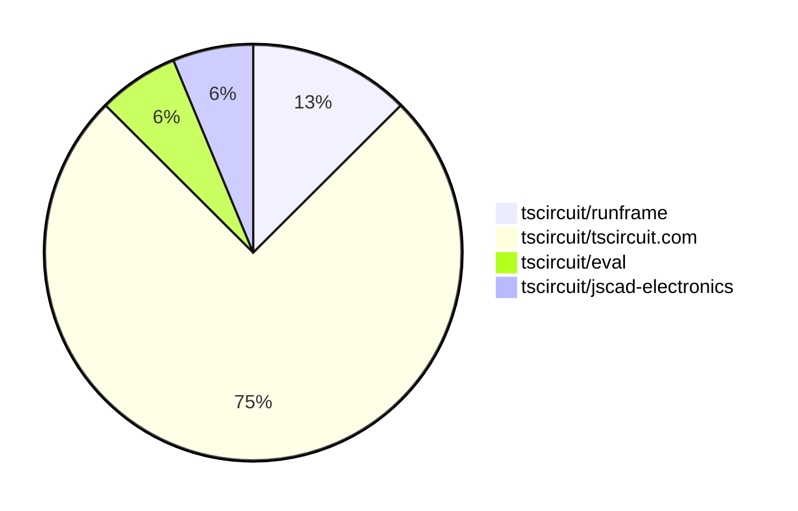
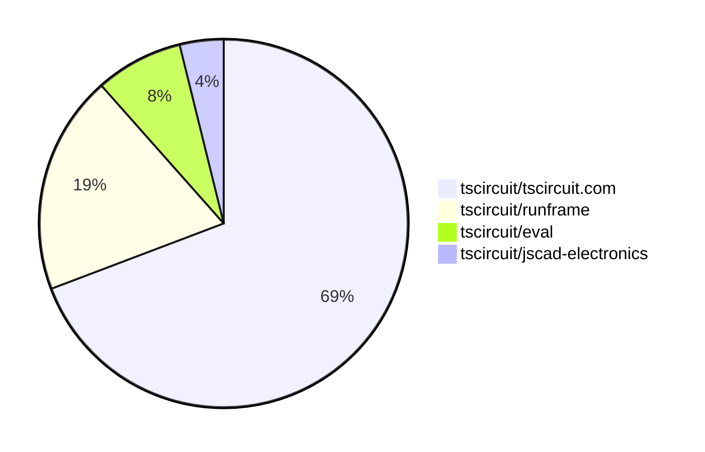

# Contribution Overview 2025-08-20

## PRs by Repository

## Contributor Overview

| Contributor | 🐳 Major | 🐙 Minor | 🐌 Tiny | ⭐ | Score | Discussion Contributions |
|-------------|---------|---------|---------|-----|----------------|--------------------------|
| [ArnavK-09](#ArnavK-09) | 1 | 2 | 5 | ⭐⭐ | 13.5 | 0🔹 0🔶 0💎 |
| [abimaelmartell](#abimaelmartell) | 1 | 1 | 3 | ⭐⭐ | 12 | 0🔹 0🔶 0💎 |
| [imrishabh18](#imrishabh18) | 0 | 1 | 2 | ⭐ | 5 | 0🔹 0🔶 0💎 |

### Discussion Contribution Legend

- 🔹 Normal Comments: Basic participation with minimal effort
- 🔶 Great Informative Comments: Thoughtful participation that adds value
- 💎 Incredible Comments: Exceptional participation with high-quality content

## Review Table

[reviews-received-hover]: ## "Number of reviews received for PRs for this contributor"
[approvals-received-hover]: ## "Number of approvals received for PRs this contributor authored"
[rejections-received-hover]: ## "Number of rejections received for PRs this contributor authored"
[prs-opened-hover]: ## "Number of PRs opened by this contributor"
[issues-created-hover]: ## "Number of issues created by this contributor"
[bountied-issues-hover]: ## "Number of issues this contributor created with a bounty"
[bountied-issue-$-hover]: ## "Total bounty amount placed on issues authored by this contributor"

| Contributor | Reviews Received | Approvals Received | Rejections Received | Approvals | Rejections | PRs Opened | PRs Merged | Score | Issues Created | Bountied Issues | Bountied Issue $ |
|---|---|---|---|---|---|---|---|---|---|---|---|
| [imrishabh18](#imrishabh18) | 8 | 2 | 1 | 0 | 1 | 9 | 3 | 5 | 0 | 0 | 0 |
| [graphite-app[bot]](#graphite-app[bot]) | 0 | 0 | 0 | 0 | 0 | 0 | 0 | 0 | 0 | 0 | 0 |
| [seveibar](#seveibar) | 0 | 0 | 0 | 7 | 1 | 2 | 0 | 0 | 0 | 0 | 0 |
| [ArnavK-09](#ArnavK-09) | 12 | 8 | 1 | 1 | 0 | 9 | 8 | 13.5 | 0 | 0 | 0 |
| [abimaelmartell](#abimaelmartell) | 2 | 1 | 0 | 3 | 0 | 6 | 5 | 12 | 0 | 0 | 0 |

## Top 7 Repositories by Contribution Points

## Changes by Repository

### [tscircuit/runframe](https://github.com/tscircuit/runframe)

| PR # | Impact | Rating | Contributor | Description |
|------|--------|--------|-------------|-------------|
| [#1020](https://github.com/tscircuit/runframe/pull/1020) | 🐳 Major | ⭐⭐⭐ | ArnavK-09 | https:runframe-git-a18-tscircuit.vercel.app?fixtureId7B22path223A22examples2Fexample23-files-loading-skeleton.fixture.tsx227D |

🐌 Tiny Contributions (1)

| PR # | Impact | Contributor | Description |
|------|--------|-------------|-------------|
| [#1018](https://github.com/tscircuit/runframe/pull/1018) | 🐌 Tiny | imrishabh18 | Adds an option to control the visibility of the file menu in the RunFrame component based on the showFileMenu prop. |

### [tscircuit/tscircuit.com](https://github.com/tscircuit/tscircuit.com)

| PR # | Impact | Rating | Contributor | Description |
|------|--------|--------|-------------|-------------|
| [#1593](https://github.com/tscircuit/tscircuit.com/pull/1593) | 🐳 Major | ⭐⭐⭐ | abimaelmartell | Eliminates duplicate API requests for package release data by standardizing the use of a shared hook across components, improving caching and performance. |
| [#1600](https://github.com/tscircuit/tscircuit.com/pull/1600) | 🐙 Minor | ⭐⭐ | ArnavK-09 | Fixes an issue where files do not load consistently due to improper caching and refetching settings in the file management hooks. |
| [#1601](https://github.com/tscircuit/tscircuit.com/pull/1601) | 🐙 Minor | ⭐⭐ | abimaelmartell | Fixes a race condition that occurs when loading files, ensuring that the loading state accurately reflects the status of file retrieval. |
| [#1596](https://github.com/tscircuit/tscircuit.com/pull/1596) | 🐙 Minor | ⭐⭐ | imrishabh18 | Hides the fileMenu next to the Run button in the editor interface, streamlining the user experience. |

🐌 Tiny Contributions (8)

| PR # | Impact | Contributor | Description |
|------|--------|-------------|-------------|
| [#1602](https://github.com/tscircuit/tscircuit.com/pull/1602) | 🐌 Tiny | ArnavK-09 | Fixes loading issues in RunFrame by updating the runframe dependency to a newer version. |
| [#1599](https://github.com/tscircuit/tscircuit.com/pull/1599) | 🐌 Tiny | ArnavK-09 | Fixes the base URL for the registry API and improves logging for package loading operations in the autoload dev packages functionality. |
| [#1604](https://github.com/tscircuit/tscircuit.com/pull/1604) | 🐌 Tiny | ArnavK-09 | Updates loading indicators in the datasheet and quickstart pages to use a new Loader2 component with adjusted styling. |
| [#1598](https://github.com/tscircuit/tscircuit.com/pull/1598) | 🐌 Tiny | ArnavK-09 | Fixes layout issues in the CmdKMenu component by adjusting Tailwind CSS classes for better responsiveness and visual alignment. |
| [#1595](https://github.com/tscircuit/tscircuit.com/pull/1595) | 🐌 Tiny | abimaelmartell | Switches the package_fileslist API to use GET with query parameters, updating client hooks and components accordingly, and adjusting registry utilities and tests to reflect this change. |
| [#1594](https://github.com/tscircuit/tscircuit.com/pull/1594) | 🐌 Tiny | abimaelmartell | Avoid unnecessary package_filesget call by listing release files first and load LICENSE file content only when present in release. |
| [#1592](https://github.com/tscircuit/tscircuit.com/pull/1592) | 🐌 Tiny | abimaelmartell | Changes the package_filesget endpoint to use GET with query parameters, updates client hooks and scripts accordingly, and aligns tests with the new GET behavior. |
| [#1597](https://github.com/tscircuit/tscircuit.com/pull/1597) | 🐌 Tiny | imrishabh18 | Fixes the GitHub repository selector dropdown styling to ensure it matches the trigger width and stays aligned, while wrapping repository options in CommandList for consistent styling and behavior. |

### [tscircuit/eval](https://github.com/tscircuit/eval)

| PR # | Impact | Rating | Contributor | Description |
|------|--------|--------|-------------|-------------|
| [#855](https://github.com/tscircuit/eval/pull/855) | 🐙 Minor | ⭐⭐ | ArnavK-09 | Fixes the prioritization of default exports over named exports in component rendering. |

### [tscircuit/jscad-electronics](https://github.com/tscircuit/jscad-electronics)

🐌 Tiny Contributions (1)

| PR # | Impact | Contributor | Description |
|------|--------|-------------|-------------|
| [#107](https://github.com/tscircuit/jscad-electronics/pull/107) | 🐌 Tiny | ArnavK-09 | Updates dependencies in package.json and fixes type casting in BGA component rendering. |

## Changes by Contributor

### [ArnavK-09](https://github.com/ArnavK-09)

| PRs # | Impact | Rating | Description |
|------|--------|--------|-------------|
| [#1020](https://github.com/tscircuit/runframe/pull/1020) | 🐳 Major | ⭐⭐⭐ | https:runframe-git-a18-tscircuit.vercel.app?fixtureId7B22path223A22examples2Fexample23-files-loading-skeleton.fixture.tsx227D |
| [#1600](https://github.com/tscircuit/tscircuit.com/pull/1600) | 🐙 Minor | ⭐⭐ | Fixes an issue where files do not load consistently due to improper caching and refetching settings in the file management hooks. |
| [#855](https://github.com/tscircuit/eval/pull/855) | 🐙 Minor | ⭐⭐ | Fixes the prioritization of default exports over named exports in component rendering. |

🐌 Tiny Contributions (5)

| PR # | Impact | Description |
|------|--------|-------------|
| [#107](https://github.com/tscircuit/jscad-electronics/pull/107) | 🐌 Tiny | Updates dependencies in package.json and fixes type casting in BGA component rendering. |
| [#1602](https://github.com/tscircuit/tscircuit.com/pull/1602) | 🐌 Tiny | Fixes loading issues in RunFrame by updating the runframe dependency to a newer version. |
| [#1599](https://github.com/tscircuit/tscircuit.com/pull/1599) | 🐌 Tiny | Fixes the base URL for the registry API and improves logging for package loading operations in the autoload dev packages functionality. |
| [#1604](https://github.com/tscircuit/tscircuit.com/pull/1604) | 🐌 Tiny | Updates loading indicators in the datasheet and quickstart pages to use a new Loader2 component with adjusted styling. |
| [#1598](https://github.com/tscircuit/tscircuit.com/pull/1598) | 🐌 Tiny | Fixes layout issues in the CmdKMenu component by adjusting Tailwind CSS classes for better responsiveness and visual alignment. |

### [abimaelmartell](https://github.com/abimaelmartell)

| PRs # | Impact | Rating | Description |
|------|--------|--------|-------------|
| [#1593](https://github.com/tscircuit/tscircuit.com/pull/1593) | 🐳 Major | ⭐⭐⭐ | Eliminates duplicate API requests for package release data by standardizing the use of a shared hook across components, improving caching and performance. |
| [#1601](https://github.com/tscircuit/tscircuit.com/pull/1601) | 🐙 Minor | ⭐⭐ | Fixes a race condition that occurs when loading files, ensuring that the loading state accurately reflects the status of file retrieval. |

🐌 Tiny Contributions (3)

| PR # | Impact | Description |
|------|--------|-------------|
| [#1595](https://github.com/tscircuit/tscircuit.com/pull/1595) | 🐌 Tiny | Switches the package_fileslist API to use GET with query parameters, updating client hooks and components accordingly, and adjusting registry utilities and tests to reflect this change. |
| [#1594](https://github.com/tscircuit/tscircuit.com/pull/1594) | 🐌 Tiny | Avoid unnecessary package_filesget call by listing release files first and load LICENSE file content only when present in release. |
| [#1592](https://github.com/tscircuit/tscircuit.com/pull/1592) | 🐌 Tiny | Changes the package_filesget endpoint to use GET with query parameters, updates client hooks and scripts accordingly, and aligns tests with the new GET behavior. |

### [imrishabh18](https://github.com/imrishabh18)

| PRs # | Impact | Rating | Description |
|------|--------|--------|-------------|
| [#1596](https://github.com/tscircuit/tscircuit.com/pull/1596) | 🐙 Minor | ⭐⭐ | Hides the fileMenu next to the Run button in the editor interface, streamlining the user experience. |

🐌 Tiny Contributions (2)

| PR # | Impact | Description |
|------|--------|-------------|
| [#1597](https://github.com/tscircuit/tscircuit.com/pull/1597) | 🐌 Tiny | Fixes the GitHub repository selector dropdown styling to ensure it matches the trigger width and stays aligned, while wrapping repository options in CommandList for consistent styling and behavior. |
| [#1018](https://github.com/tscircuit/runframe/pull/1018) | 🐌 Tiny | Adds an option to control the visibility of the file menu in the RunFrame component based on the showFileMenu prop. |

## Repository Owners

| Repository | Codeowners |
|------------|------------|
| [builder](https://github.com/tscircuit/builder/blob/main/.github/CODEOWNERS) | [seveibar](https://github.com/seveibar)
| [pcb-viewer](https://github.com/tscircuit/pcb-viewer/blob/main/.github/CODEOWNERS) | [seveibar](https://github.com/seveibar), [ShiboSoftwareDev](https://github.com/ShiboSoftwareDev)
| [footprints-old](https://github.com/tscircuit/footprints-old/blob/main/.github/CODEOWNERS) | [seveibar](https://github.com/seveibar)
| [footprinter](https://github.com/tscircuit/footprinter/blob/main/.github/CODEOWNERS) | [seveibar](https://github.com/seveibar), [techmannih](https://github.com/techmannih)
| [3d-viewer](https://github.com/tscircuit/3d-viewer/blob/main/.github/CODEOWNERS) | [ShiboSoftwareDev](https://github.com/ShiboSoftwareDev)
| [winterspec](https://github.com/tscircuit/winterspec/blob/main/.github/CODEOWNERS) | [seveibar](https://github.com/seveibar), [ShiboSoftwareDev](https://github.com/ShiboSoftwareDev)
| [jscad-electronics](https://github.com/tscircuit/jscad-electronics/blob/main/.github/CODEOWNERS) | [seveibar](https://github.com/seveibar), [abhijitxy](https://github.com/abhijitxy), [anas-sarkez](https://github.com/anas-sarkez)
| [circuit-to-svg](https://github.com/tscircuit/circuit-to-svg/blob/main/.github/CODEOWNERS) | [imrishabh18](https://github.com/imrishabh18)
| [schematic-symbols](https://github.com/tscircuit/schematic-symbols/blob/main/.github/CODEOWNERS) | [seveibar](https://github.com/seveibar), [imrishabh18](https://github.com/imrishabh18), [techmannih](https://github.com/techmannih)
| [circuit-json-to-gerber](https://github.com/tscircuit/circuit-json-to-gerber/blob/main/.github/CODEOWNERS) | [seveibar](https://github.com/seveibar), [ShiboSoftwareDev](https://github.com/ShiboSoftwareDev)
| [tscircuit.com](https://github.com/tscircuit/tscircuit.com/blob/main/.github/CODEOWNERS) | [seveibar](https://github.com/seveibar), [imrishabh18](https://github.com/imrishabh18)
| [cli](https://github.com/tscircuit/cli/blob/main/.github/CODEOWNERS) | [seveibar](https://github.com/seveibar), [imrishabh18](https://github.com/imrishabh18), [ArnavK-09](https://github.com/ArnavK-09)
| [issue-roulette](https://github.com/tscircuit/issue-roulette/blob/main/.github/CODEOWNERS) | [Anshgrover23](https://github.com/Anshgrover23)
| [sparkfun-boards](https://github.com/tscircuit/sparkfun-boards/blob/main/.github/CODEOWNERS) | [ShiboSoftwareDev](https://github.com/ShiboSoftwareDev), [Abse2001](https://github.com/Abse2001), [MustafaMulla29](https://github.com/MustafaMulla29), [Anshgrover23](https://github.com/Anshgrover23), [techmannih](https://github.com/techmannih)
| [schematic-corpus](https://github.com/tscircuit/schematic-corpus/blob/main/.github/CODEOWNERS) | [Abse2001](https://github.com/Abse2001)

## Repositories by Owner

| User | Repo |
|------|------|
| [seveibar](https://github.com/seveibar) | [builder](https://github.com/tscircuit/builder/blob/main/.github/CODEOWNERS) |
|  | [pcb-viewer](https://github.com/tscircuit/pcb-viewer/blob/main/.github/CODEOWNERS) |
|  | [footprints-old](https://github.com/tscircuit/footprints-old/blob/main/.github/CODEOWNERS) |
|  | [footprinter](https://github.com/tscircuit/footprinter/blob/main/.github/CODEOWNERS) |
|  | [winterspec](https://github.com/tscircuit/winterspec/blob/main/.github/CODEOWNERS) |
|  | [jscad-electronics](https://github.com/tscircuit/jscad-electronics/blob/main/.github/CODEOWNERS) |
|  | [schematic-symbols](https://github.com/tscircuit/schematic-symbols/blob/main/.github/CODEOWNERS) |
|  | [circuit-json-to-gerber](https://github.com/tscircuit/circuit-json-to-gerber/blob/main/.github/CODEOWNERS) |
|  | [tscircuit.com](https://github.com/tscircuit/tscircuit.com/blob/main/.github/CODEOWNERS) |
|  | [cli](https://github.com/tscircuit/cli/blob/main/.github/CODEOWNERS) |
| [ShiboSoftwareDev](https://github.com/ShiboSoftwareDev) | [pcb-viewer](https://github.com/tscircuit/pcb-viewer/blob/main/.github/CODEOWNERS) |
|  | [3d-viewer](https://github.com/tscircuit/3d-viewer/blob/main/.github/CODEOWNERS) |
|  | [winterspec](https://github.com/tscircuit/winterspec/blob/main/.github/CODEOWNERS) |
|  | [circuit-json-to-gerber](https://github.com/tscircuit/circuit-json-to-gerber/blob/main/.github/CODEOWNERS) |
|  | [sparkfun-boards](https://github.com/tscircuit/sparkfun-boards/blob/main/.github/CODEOWNERS) |
| [techmannih](https://github.com/techmannih) | [footprinter](https://github.com/tscircuit/footprinter/blob/main/.github/CODEOWNERS) |
|  | [schematic-symbols](https://github.com/tscircuit/schematic-symbols/blob/main/.github/CODEOWNERS) |
|  | [sparkfun-boards](https://github.com/tscircuit/sparkfun-boards/blob/main/.github/CODEOWNERS) |
| [abhijitxy](https://github.com/abhijitxy) | [jscad-electronics](https://github.com/tscircuit/jscad-electronics/blob/main/.github/CODEOWNERS) |
| [anas-sarkez](https://github.com/anas-sarkez) | [jscad-electronics](https://github.com/tscircuit/jscad-electronics/blob/main/.github/CODEOWNERS) |
| [imrishabh18](https://github.com/imrishabh18) | [circuit-to-svg](https://github.com/tscircuit/circuit-to-svg/blob/main/.github/CODEOWNERS) |
|  | [schematic-symbols](https://github.com/tscircuit/schematic-symbols/blob/main/.github/CODEOWNERS) |
|  | [tscircuit.com](https://github.com/tscircuit/tscircuit.com/blob/main/.github/CODEOWNERS) |
|  | [cli](https://github.com/tscircuit/cli/blob/main/.github/CODEOWNERS) |
| [ArnavK-09](https://github.com/ArnavK-09) | [cli](https://github.com/tscircuit/cli/blob/main/.github/CODEOWNERS) |
| [Anshgrover23](https://github.com/Anshgrover23) | [issue-roulette](https://github.com/tscircuit/issue-roulette/blob/main/.github/CODEOWNERS) |
|  | [sparkfun-boards](https://github.com/tscircuit/sparkfun-boards/blob/main/.github/CODEOWNERS) |
| [Abse2001](https://github.com/Abse2001) | [sparkfun-boards](https://github.com/tscircuit/sparkfun-boards/blob/main/.github/CODEOWNERS) |
|  | [schematic-corpus](https://github.com/tscircuit/schematic-corpus/blob/main/.github/CODEOWNERS) |
| [MustafaMulla29](https://github.com/MustafaMulla29) | [sparkfun-boards](https://github.com/tscircuit/sparkfun-boards/blob/main/.github/CODEOWNERS) |

