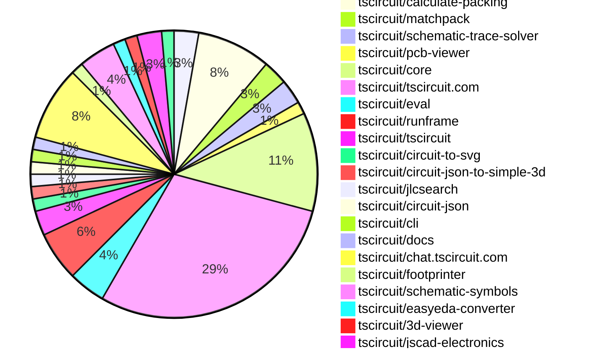
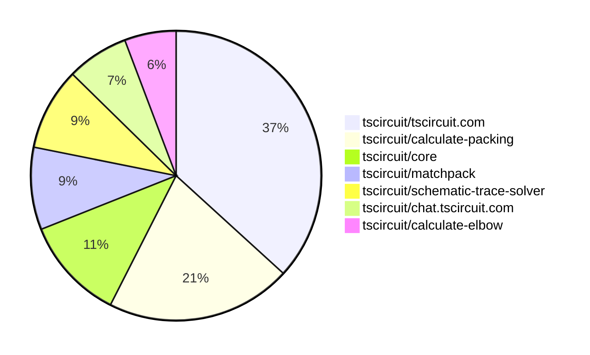

# Contribution Overview 2025-08-20

## PRs by Repository

## Contributor Overview

| Contributor | 🐳 Major | 🐙 Minor | 🐌 Tiny | ⭐ | Score | Discussion Contributions |
|-------------|---------|---------|---------|-----|----------------|--------------------------|
| [seveibar](#seveibar) | 9 | 0 | 10 | 👑 | 61 | 0🔹 0🔶 0💎 |
| [ArnavK-09](#ArnavK-09) | 2 | 3 | 11 | ⭐⭐ | 26 | 0🔹 0🔶 0💎 |
| [imrishabh18](#imrishabh18) | 1 | 2 | 14 | ⭐⭐ | 20 | 0🔹 0🔶 0💎 |
| [abimaelmartell](#abimaelmartell) | 0 | 3 | 9 | ⭐⭐ | 18 | 0🔹 0🔶 0💎 |
| [techmannih](#techmannih) | 0 | 2 | 3 | ⭐ | 10 | 0🔹 0🔶 0💎 |
| [pxlpal](#pxlpal) | 0 | 1 | 1 | ⭐ | 4 | 0🔹 0🔶 0💎 |
| [ShiboSoftwareDev](#ShiboSoftwareDev) | 0 | 0 | 1 |  | 1 | 0🔹 0🔶 0💎 |

### Discussion Contribution Legend

- 🔹 Normal Comments: Basic participation with minimal effort
- 🔶 Great Informative Comments: Thoughtful participation that adds value
- 💎 Incredible Comments: Exceptional participation with high-quality content

## Review Table

[reviews-received-hover]: ## "Number of reviews received for PRs for this contributor"
[approvals-received-hover]: ## "Number of approvals received for PRs this contributor authored"
[rejections-received-hover]: ## "Number of rejections received for PRs this contributor authored"
[prs-opened-hover]: ## "Number of PRs opened by this contributor"
[issues-created-hover]: ## "Number of issues created by this contributor"
[bountied-issues-hover]: ## "Number of issues this contributor created with a bounty"
[bountied-issue-$-hover]: ## "Total bounty amount placed on issues authored by this contributor"

| Contributor | Reviews Received | Approvals Received | Rejections Received | Approvals | Rejections | PRs Opened | PRs Merged | Score | Issues Created | Bountied Issues | Bountied Issue $ |
|---|---|---|---|---|---|---|---|---|---|---|---|
| [seveibar](#seveibar) | 0 | 0 | 0 | 39 | 3 | 24 | 19 | 61 | 0 | 0 | 0 |
| [abimaelmartell](#abimaelmartell) | 10 | 8 | 0 | 3 | 0 | 15 | 12 | 18 | 0 | 0 | 0 |
| [imrishabh18](#imrishabh18) | 24 | 13 | 1 | 2 | 0 | 26 | 17 | 20 | 0 | 0 | 0 |
| [pxlpal](#pxlpal) | 6 | 3 | 1 | 0 | 0 | 4 | 2 | 4 | 0 | 0 | 0 |
| [techmannih](#techmannih) | 18 | 4 | 1 | 0 | 0 | 8 | 5 | 10 | 0 | 0 | 0 |
| [graphite-app[bot]](#graphite-app[bot]) | 0 | 0 | 0 | 0 | 0 | 0 | 0 | 0 | 0 | 0 | 0 |
| [ArnavK-09](#ArnavK-09) | 22 | 17 | 0 | 2 | 0 | 17 | 16 | 26 | 0 | 0 | 0 |
| [tscircuitbot](#tscircuitbot) | 0 | 0 | 0 | 0 | 0 | 16 | 0 | 0 | 0 | 0 | 0 |
| [ShiboSoftwareDev](#ShiboSoftwareDev) | 1 | 1 | 0 | 0 | 0 | 1 | 1 | 1 | 0 | 0 | 0 |
| [copilot-pull-request-reviewer[bot]](#copilot-pull-request-reviewer[bot]) | 0 | 0 | 0 | 0 | 0 | 0 | 0 | 0 | 0 | 0 | 0 |

## Top 7 Repositories by Contribution Points

## Changes by Repository

### [tscircuit/calculate-elbow](https://github.com/tscircuit/calculate-elbow)

| PR # | Impact | Rating | Contributor | Description |
|------|--------|--------|-------------|-------------|
| [#9](https://github.com/tscircuit/calculate-elbow/pull/9) | 🐳 Major | ⭐⭐⭐ | seveibar | Fixes edge case handling in elbow calculations to ensure accurate routing paths for various configurations of start and end points. |

🐌 Tiny Contributions (1)

| PR # | Impact | Contributor | Description |
|------|--------|-------------|-------------|
| [#10](https://github.com/tscircuit/calculate-elbow/pull/10) | 🐌 Tiny | seveibar | Removes global debug assignments from the codebase to clean up the build output. |

### [tscircuit/calculate-packing](https://github.com/tscircuit/calculate-packing)

| PR # | Impact | Rating | Contributor | Description |
|------|--------|--------|-------------|-------------|
| [#28](https://github.com/tscircuit/calculate-packing/pull/28) | 🐳 Major | ⭐⭐⭐ | seveibar | Fixes overlap check for packed components by adding epsilon, ensuring proper alignment of voltage regulator caps. |
| [#27](https://github.com/tscircuit/calculate-packing/pull/27) | 🐳 Major | ⭐⭐⭐ | seveibar | Pad to Pad vs Pad to Center Optimization !image(https:github.comuser-attachmentsassetsb3306b25-1e3b-49af-a415-0db9c248ba3d) |
| [#26](https://github.com/tscircuit/calculate-packing/pull/26) | 🐳 Major | ⭐⭐⭐ | seveibar | This pull request addresses an issue with invalid outline generation in the constructOutline function. It introduces a new approach that enhances stability and correctness in generating outlines from packed components. The changes include the addition of new utility functions for bounding calculations and improved error handling during polygon operations. |
| [#23](https://github.com/tscircuit/calculate-packing/pull/23) | 🐳 Major | ⭐⭐⭐ | seveibar | pack placement strategy wip pack solver 2 single component pack solver init add packsolver2 test with error remove stroke widths that were making things less visible, add test identifying insideoutside of outline for componentToPlace using poitnInOutline always show pads of outline segment while being solved switch PackSolver2 as the default for PackDebugger improve pointInOutline to match segment style. Improve normal calculation fix normal segment placement placeholder for viable outline segment computation add largest rect insideoutside bounds solver add largest rect outside outline solver improve visual and fix last-minute offset when irls is solved |

🐌 Tiny Contributions (2)

| PR # | Impact | Contributor | Description |
|------|--------|-------------|-------------|
| [#25](https://github.com/tscircuit/calculate-packing/pull/25) | 🐌 Tiny | seveibar | Adds getConstructorParams method to PackSolver2 and modifies it in SingleComponentPackSolver to return an object instead of an array. |
| [#24](https://github.com/tscircuit/calculate-packing/pull/24) | 🐌 Tiny | seveibar | Adds PackSolver2 to the exports in the index file, making it available for use in other modules. |

### [tscircuit/matchpack](https://github.com/tscircuit/matchpack)

| PR # | Impact | Rating | Contributor | Description |
|------|--------|--------|-------------|-------------|
| [#10](https://github.com/tscircuit/matchpack/pull/10) | 🐳 Major | ⭐⭐⭐ | seveibar | Add a PasteInput page for parsing InputProblem and fix rotation offsets not loading properly from PackSolver2. |
| [#9](https://github.com/tscircuit/matchpack/pull/9) | 🐳 Major | ⭐⭐⭐ | seveibar | Fixes issues with the outline missing packed components and resolves problems in the PackSolver2 implementation. |

### [tscircuit/schematic-trace-solver](https://github.com/tscircuit/schematic-trace-solver)

| PR # | Impact | Rating | Contributor | Description |
|------|--------|--------|-------------|-------------|
| [#3](https://github.com/tscircuit/schematic-trace-solver/pull/3) | 🐳 Major | ⭐⭐⭐ | seveibar | Add a new example, improve pin direction calculation, and prevent the first or last segment of a trace from being moved during overlap resolution. |
| [#2](https://github.com/tscircuit/schematic-trace-solver/pull/2) | 🐳 Major | ⭐⭐⭐ | seveibar | add visualize input problem more tailwind insertion, fix toolbar spacing, show input problem in msp solver improve visualization schematic trace lines start wip guidelines solver implement guidelines calculation |

### [tscircuit/pcb-viewer](https://github.com/tscircuit/pcb-viewer)

🐌 Tiny Contributions (1)

| PR # | Impact | Contributor | Description |
|------|--------|-------------|-------------|
| [#357](https://github.com/tscircuit/pcb-viewer/pull/357) | 🐌 Tiny | seveibar | Modifies the build process to exclude tscircuitcore from the bundled output, allowing it to be treated as an external dependency. |

### [tscircuit/core](https://github.com/tscircuit/core)

| PR # | Impact | Rating | Contributor | Description |
|------|--------|--------|-------------|-------------|
| [#1168](https://github.com/tscircuit/core/pull/1168) | 🐙 Minor | ⭐⭐ | imrishabh18 | Calculates the size of a schematic group based on its components when explicit dimensions are not provided, ensuring proper layout in the absence of predefined sizes. |
| [#1166](https://github.com/tscircuit/core/pull/1166) | 🐙 Minor | ⭐⭐ | imrishabh18 | Refactors the Group_doInitialPcbLayoutGrid method to support grouping in grid layouts and improve readability. |

🐌 Tiny Contributions (6)

| PR # | Impact | Contributor | Description |
|------|--------|-------------|-------------|
| [#1182](https://github.com/tscircuit/core/pull/1182) | 🐌 Tiny | seveibar | Removes support for React Reconciler 18, consolidating to React Reconciler 19 for rendering. |
| [#1181](https://github.com/tscircuit/core/pull/1181) | 🐌 Tiny | seveibar | Adds a new configuration file to support compatibility with older bundlers by disabling import assertions and lowering the target to ES2020. |
| [#1180](https://github.com/tscircuit/core/pull/1180) | 🐌 Tiny | seveibar | Adds an exports field to package.json to define module entry points for different environments. |
| [#1171](https://github.com/tscircuit/core/pull/1171) | 🐌 Tiny | seveibar | Updates the versions of the tscircuitmatchpack and calculate-packing dependencies in the project. |
| [#1170](https://github.com/tscircuit/core/pull/1170) | 🐌 Tiny | techmannih | Handles worker self.location.origin in getClientOrigin and adds tests verifying origin selection in browser and worker contexts |
| [#1172](https://github.com/tscircuit/core/pull/1172) | 🐌 Tiny | pxlpal | Changes the display of capacitance in the schematic symbol to use the raw string value instead of formatting it, allowing for more accurate representation of user-defined capacitance values. |

### [tscircuit/tscircuit.com](https://github.com/tscircuit/tscircuit.com)

| PR # | Impact | Rating | Contributor | Description |
|------|--------|--------|-------------|-------------|
| [#1612](https://github.com/tscircuit/tscircuit.com/pull/1612) | 🐳 Major | ⭐⭐⭐ | ArnavK-09 | Adds user search functionality to the existing search page, allowing users to search for accounts alongside packages. |
| [#1608](https://github.com/tscircuit/tscircuit.com/pull/1608) | 🐳 Major | ⭐⭐⭐ | ArnavK-09 | Fixes image previews not loading by synchronizing the images route and enhancing the 3D SVG rendering functionality. |
| [#1601](https://github.com/tscircuit/tscircuit.com/pull/1601) | 🐙 Minor | ⭐⭐ | abimaelmartell | Fixes a race condition that occurs when loading files, ensuring that the loading state accurately reflects the status of file retrieval. |
| [#1593](https://github.com/tscircuit/tscircuit.com/pull/1593) | 🐙 Minor | ⭐⭐ | abimaelmartell | Eliminates duplicate API requests for package release data by standardizing the fetching logic across components to use a shared hook, improving performance and cache consistency. |
| [#1603](https://github.com/tscircuit/tscircuit.com/pull/1603) | 🐙 Minor | ⭐⭐ | ArnavK-09 | Fixes the path resolution for the main component and selected component in the CodeEditor, ensuring correct file selection based on URL parameters. |
| [#1606](https://github.com/tscircuit/tscircuit.com/pull/1606) | 🐙 Minor | ⭐⭐ | ArnavK-09 | Fixes the resolution of hidden files and corrects a bug in the folder selection process within the file sidebar component. |
| [#1600](https://github.com/tscircuit/tscircuit.com/pull/1600) | 🐙 Minor | ⭐⭐ | ArnavK-09 | Fixes intermittent file loading issues in the file management system |

🐌 Tiny Contributions (14)

| PR # | Impact | Contributor | Description |
|------|--------|-------------|-------------|
| [#1611](https://github.com/tscircuit/tscircuit.com/pull/1611) | 🐌 Tiny | seveibar | Removes the mention of drag-and-drop tools from the homepage subtitle and updates the generated index description accordingly. |
| [#1610](https://github.com/tscircuit/tscircuit.com/pull/1610) | 🐌 Tiny | abimaelmartell | Removes redundant requests for package data by consolidating hooks in the editor and package editor components. |
| [#1609](https://github.com/tscircuit/tscircuit.com/pull/1609) | 🐌 Tiny | abimaelmartell | Updates API URL references from registry-api.tscircuit.com to api.tscircuit.com in various files. |
| [#1595](https://github.com/tscircuit/tscircuit.com/pull/1595) | 🐌 Tiny | abimaelmartell | Switches the package_fileslist API to use GET with query parameters, updating client hooks and components accordingly. |
| [#1594](https://github.com/tscircuit/tscircuit.com/pull/1594) | 🐌 Tiny | abimaelmartell | Avoids unnecessary calls to fetch the LICENSE file by checking for its existence in the release files first, thus optimizing the data fetching process. |
| [#1592](https://github.com/tscircuit/tscircuit.com/pull/1592) | 🐌 Tiny | abimaelmartell | Changes the package_filesget endpoint to use GET with query parameters, updates client hooks and scripts accordingly, and aligns tests with the new GET behavior. |
| [#1605](https://github.com/tscircuit/tscircuit.com/pull/1605) | 🐌 Tiny | imrishabh18 | Hides rename and delete actions in the file tree for packages not owned by the current user, and renames the file modification flag to canModifyFiles. |
| [#1597](https://github.com/tscircuit/tscircuit.com/pull/1597) | 🐌 Tiny | imrishabh18 | Fixes alignment and styling issues in the GitHub repository selector dropdown to ensure it matches the trigger width and maintains consistent behavior. |
| [#1596](https://github.com/tscircuit/tscircuit.com/pull/1596) | 🐌 Tiny | imrishabh18 | Hides the file menu next to the Run button in the editor interface, streamlining the user experience. |
| [#1607](https://github.com/tscircuit/tscircuit.com/pull/1607) | 🐌 Tiny | ArnavK-09 | Add draggablefalse to various components to prevent unwanted dragging, apply select-none class to improve text selection behavior, replace custom spinner with Loader2 icon for consistency, update search input attributes for better accessibility, and fix package image URL path in search component. |
| [#1602](https://github.com/tscircuit/tscircuit.com/pull/1602) | 🐌 Tiny | ArnavK-09 | Fixes loading issues in RunFrame by updating the runframe dependency to version 0.0.827 |
| [#1599](https://github.com/tscircuit/tscircuit.com/pull/1599) | 🐌 Tiny | ArnavK-09 | Fixes the base URL for the registry API and improves logging for package loading operations in the autoload dev packages functionality. |
| [#1604](https://github.com/tscircuit/tscircuit.com/pull/1604) | 🐌 Tiny | ArnavK-09 | Updates loading indicators in Datasheet and Quickstart pages to use a new Loader component with adjusted styling. |
| [#1598](https://github.com/tscircuit/tscircuit.com/pull/1598) | 🐌 Tiny | ArnavK-09 | Fixes layout issues in the CmdKMenu component by adjusting Tailwind CSS classes for better responsiveness and visual alignment. |

### [tscircuit/eval](https://github.com/tscircuit/eval)

🐌 Tiny Contributions (3)

| PR # | Impact | Contributor | Description |
|------|--------|-------------|-------------|
| [#866](https://github.com/tscircuit/eval/pull/866) | 🐌 Tiny | seveibar | Refactors test organization into directories, introduces a validation script for test matrix coverage, and updates the core library to version 0.0.640. |
| [#853](https://github.com/tscircuit/eval/pull/853) | 🐌 Tiny | imrishabh18 | Adds a fetch proxy to the web worker, allowing fetch requests to be routed through the main thread, which is useful in restricted environments where worker fetch requests are blocked. |
| [#855](https://github.com/tscircuit/eval/pull/855) | 🐌 Tiny | ArnavK-09 | Fixes the prioritization of default exports over named exports in component rendering. |

### [tscircuit/runframe](https://github.com/tscircuit/runframe)

| PR # | Impact | Rating | Contributor | Description |
|------|--------|--------|-------------|-------------|
| [#1026](https://github.com/tscircuit/runframe/pull/1026) | 🐙 Minor | ⭐⭐ | abimaelmartell | Ensures that the DOM is fully loaded before rendering the RunFrame component in standalone mode, preventing potential rendering issues. |

🐌 Tiny Contributions (3)

| PR # | Impact | Contributor | Description |
|------|--------|-------------|-------------|
| [#1022](https://github.com/tscircuit/runframe/pull/1022) | 🐌 Tiny | imrishabh18 | Sets the enableFetchProxy property to true for standalone bundles in the RunFrame component, allowing for enhanced web worker functionality. |
| [#1018](https://github.com/tscircuit/runframe/pull/1018) | 🐌 Tiny | imrishabh18 | Adds an option to control the visibility of the file menu in the RunFrame component based on the showFileMenu prop. |
| [#1020](https://github.com/tscircuit/runframe/pull/1020) | 🐌 Tiny | ArnavK-09 | https:runframe-git-a18-tscircuit.vercel.app?fixtureId7B22path223A22examples2Fexample23-files-loading-skeleton.fixture.tsx227D |

### [tscircuit/tscircuit](https://github.com/tscircuit/tscircuit)

🐌 Tiny Contributions (2)

| PR # | Impact | Contributor | Description |
|------|--------|-------------|-------------|
| [#741](https://github.com/tscircuit/tscircuit/pull/741) | 🐌 Tiny | abimaelmartell | Removes the CDN fetch for webworker.min.js and replaces it with a local dependency from minicssgrid. |
| [#740](https://github.com/tscircuit/tscircuit/pull/740) | 🐌 Tiny | abimaelmartell | Adds minicssgrid as a dependency to resolve a blocking issue with dependency updates in the core. |

### [tscircuit/circuit-to-svg](https://github.com/tscircuit/circuit-to-svg)

🐌 Tiny Contributions (1)

| PR # | Impact | Contributor | Description |
|------|--------|-------------|-------------|
| [#296](https://github.com/tscircuit/circuit-to-svg/pull/296) | 🐌 Tiny | abimaelmartell | Fixes the output directory for Vercel deployment from cosmos-export to examplescosmos-export |

### [tscircuit/circuit-json-to-simple-3d](https://github.com/tscircuit/circuit-json-to-simple-3d)

🐌 Tiny Contributions (1)

| PR # | Impact | Contributor | Description |
|------|--------|-------------|-------------|
| [#12](https://github.com/tscircuit/circuit-json-to-simple-3d/pull/12) | 🐌 Tiny | abimaelmartell | Adds functionality to render PCB components without requiring a PCB board, allowing for standalone component visualization. |

### [tscircuit/jlcsearch](https://github.com/tscircuit/jlcsearch)

| PR # | Impact | Rating | Contributor | Description |
|------|--------|--------|-------------|-------------|
| [#80](https://github.com/tscircuit/jlcsearch/pull/80) | 🐳 Major | ⭐⭐⭐ | imrishabh18 | Add a new category for FPC connectors, including a derived table, a route for listing connectors with filtering options, and documentation for the new category. |

### [tscircuit/circuit-json](https://github.com/tscircuit/circuit-json)

🐌 Tiny Contributions (1)

| PR # | Impact | Contributor | Description |
|------|--------|-------------|-------------|
| [#257](https://github.com/tscircuit/circuit-json/pull/257) | 🐌 Tiny | imrishabh18 | Adds a new warning type for ignored source properties in circuit components |

### [tscircuit/cli](https://github.com/tscircuit/cli)

🐌 Tiny Contributions (1)

| PR # | Impact | Contributor | Description |
|------|--------|-------------|-------------|
| [#315](https://github.com/tscircuit/cli/pull/315) | 🐌 Tiny | imrishabh18 | Adds dev and start scripts to the package.json of cloned packages to run tsci dev and extends the timeout for invalid URL format tests. |

### [tscircuit/docs](https://github.com/tscircuit/docs)

🐌 Tiny Contributions (1)

| PR # | Impact | Contributor | Description |
|------|--------|-------------|-------------|
| [#113](https://github.com/tscircuit/docs/pull/113) | 🐌 Tiny | imrishabh18 | Changes the CDN URL for loading the tscircuit library from jsDelivr to Cloudflares CDN. |

### [tscircuit/chat.tscircuit.com](https://github.com/tscircuit/chat.tscircuit.com)

🐌 Tiny Contributions (6)

| PR # | Impact | Contributor | Description |
|------|--------|-------------|-------------|
| [#28](https://github.com/tscircuit/chat.tscircuit.com/pull/28) | 🐌 Tiny | imrishabh18 | Fixes the 401 unauthorized error for the apivote and apidocument endpoints, allowing public read access to documents for shared chats. |
| [#26](https://github.com/tscircuit/chat.tscircuit.com/pull/26) | 🐌 Tiny | imrishabh18 | Increases the maximum duration for processing requests from 60 seconds to 300 seconds to accommodate longer processing times for the GPT 5 model. |
| [#25](https://github.com/tscircuit/chat.tscircuit.com/pull/25) | 🐌 Tiny | imrishabh18 | Changes the AI model used for title generation from gpt-5 to gpt-5-mini and adds gpt-5-mini as a new model option for general assistance. |
| [#24](https://github.com/tscircuit/chat.tscircuit.com/pull/24) | 🐌 Tiny | imrishabh18 | Adds better error handling for chat requests and sets the temperature parameter to 1 for GPT-5 model usage. |
| [#23](https://github.com/tscircuit/chat.tscircuit.com/pull/23) | 🐌 Tiny | imrishabh18 | Changes the default chat model to gpt-5 and adds gpt-5 as a new model for general assistance. |
| [#27](https://github.com/tscircuit/chat.tscircuit.com/pull/27) | 🐌 Tiny | ArnavK-09 | This pull request introduces a new GitHub Actions workflow for checking code formatting and applies formatting changes across the codebase. The workflow is triggered on pushes and pull requests to the main branch, ensuring that code adheres to the specified formatting rules before merging. |

### [tscircuit/footprinter](https://github.com/tscircuit/footprinter)

| PR # | Impact | Rating | Contributor | Description |
|------|--------|--------|-------------|-------------|
| [#364](https://github.com/tscircuit/footprinter/pull/364) | 🐙 Minor | ⭐⭐ | techmannih | Fixes string parser to ignore empty or invalid segments when parsing footprint strings and broadens isNotNull helper to exclude undefined values. |

### [tscircuit/schematic-symbols](https://github.com/tscircuit/schematic-symbols)

| PR # | Impact | Rating | Contributor | Description |
|------|--------|--------|-------------|-------------|
| [#349](https://github.com/tscircuit/schematic-symbols/pull/349) | 🐙 Minor | ⭐⭐ | techmannih | Fixes handling of zero width and height in resizeSymbol function, ensuring proper resizing behavior and adding tests for zero-dimension cases. |

🐌 Tiny Contributions (2)

| PR # | Impact | Contributor | Description |
|------|--------|-------------|-------------|
| [#348](https://github.com/tscircuit/schematic-symbols/pull/348) | 🐌 Tiny | techmannih | Scales the circle radius and text font size when resizing symbols, and adds tests to verify the scaling functionality. |
| [#351](https://github.com/tscircuit/schematic-symbols/pull/351) | 🐌 Tiny | techmannih | Removes a stray console log statement from the getBoundsOfSvgJson function to clean up the code. |

### [tscircuit/easyeda-converter](https://github.com/tscircuit/easyeda-converter)

| PR # | Impact | Rating | Contributor | Description |
|------|--------|--------|-------------|-------------|
| [#312](https://github.com/tscircuit/easyeda-converter/pull/312) | 🐙 Minor | ⭐⭐ | pxlpal | Fixes CAD rotation issues when converting EasyEDA models to circuit JSON format, ensuring correct orientation based on Z rotation values. |

### [tscircuit/3d-viewer](https://github.com/tscircuit/3d-viewer)

🐌 Tiny Contributions (1)

| PR # | Impact | Contributor | Description |
|------|--------|-------------|-------------|
| [#421](https://github.com/tscircuit/3d-viewer/pull/421) | 🐌 Tiny | ArnavK-09 | Updates the circuit-json dependency to version 0.0.232 to resolve polyfill errors. |

### [tscircuit/jscad-electronics](https://github.com/tscircuit/jscad-electronics)

🐌 Tiny Contributions (2)

| PR # | Impact | Contributor | Description |
|------|--------|-------------|-------------|
| [#108](https://github.com/tscircuit/jscad-electronics/pull/108) | 🐌 Tiny | ArnavK-09 | Removes an unnecessary console log statement from the Footprinter3d component to clean up the code. |
| [#107](https://github.com/tscircuit/jscad-electronics/pull/107) | 🐌 Tiny | ArnavK-09 | Updates dependencies in package.json and fixes type casting in BGA component. |

### [tscircuit/circuit-json-to-spice](https://github.com/tscircuit/circuit-json-to-spice)

🐌 Tiny Contributions (1)

| PR # | Impact | Contributor | Description |
|------|--------|-------------|-------------|
| [#9](https://github.com/tscircuit/circuit-json-to-spice/pull/9) | 🐌 Tiny | ShiboSoftwareDev | Converts AC voltage sources in circuit JSON to SPICE format, enabling simulation of AC circuits. |

## Changes by Contributor

### [seveibar](https://github.com/seveibar)

| PRs # | Impact | Rating | Description |
|------|--------|--------|-------------|
| [#9](https://github.com/tscircuit/calculate-elbow/pull/9) | 🐳 Major | ⭐⭐⭐ | Fixes edge case handling in elbow calculations to ensure accurate routing paths for various configurations of start and end points. |
| [#28](https://github.com/tscircuit/calculate-packing/pull/28) | 🐳 Major | ⭐⭐⭐ | Fixes overlap check for packed components by adding epsilon, ensuring proper alignment of voltage regulator caps. |
| [#27](https://github.com/tscircuit/calculate-packing/pull/27) | 🐳 Major | ⭐⭐⭐ | Pad to Pad vs Pad to Center Optimization !image(https:github.comuser-attachmentsassetsb3306b25-1e3b-49af-a415-0db9c248ba3d) |
| [#26](https://github.com/tscircuit/calculate-packing/pull/26) | 🐳 Major | ⭐⭐⭐ | This pull request addresses an issue with invalid outline generation in the constructOutline function. It introduces a new approach that enhances stability and correctness in generating outlines from packed components. The changes include the addition of new utility functions for bounding calculations and improved error handling during polygon operations. |
| [#23](https://github.com/tscircuit/calculate-packing/pull/23) | 🐳 Major | ⭐⭐⭐ | pack placement strategy wip pack solver 2 single component pack solver init add packsolver2 test with error remove stroke widths that were making things less visible, add test identifying insideoutside of outline for componentToPlace using poitnInOutline always show pads of outline segment while being solved switch PackSolver2 as the default for PackDebugger improve pointInOutline to match segment style. Improve normal calculation fix normal segment placement placeholder for viable outline segment computation add largest rect insideoutside bounds solver add largest rect outside outline solver improve visual and fix last-minute offset when irls is solved |
| [#10](https://github.com/tscircuit/matchpack/pull/10) | 🐳 Major | ⭐⭐⭐ | Add a PasteInput page for parsing InputProblem and fix rotation offsets not loading properly from PackSolver2. |
| [#9](https://github.com/tscircuit/matchpack/pull/9) | 🐳 Major | ⭐⭐⭐ | Fixes issues with the outline missing packed components and resolves problems in the PackSolver2 implementation. |
| [#3](https://github.com/tscircuit/schematic-trace-solver/pull/3) | 🐳 Major | ⭐⭐⭐ | Add a new example, improve pin direction calculation, and prevent the first or last segment of a trace from being moved during overlap resolution. |
| [#2](https://github.com/tscircuit/schematic-trace-solver/pull/2) | 🐳 Major | ⭐⭐⭐ | add visualize input problem more tailwind insertion, fix toolbar spacing, show input problem in msp solver improve visualization schematic trace lines start wip guidelines solver implement guidelines calculation |

🐌 Tiny Contributions (10)

| PR # | Impact | Description |
|------|--------|-------------|
| [#357](https://github.com/tscircuit/pcb-viewer/pull/357) | 🐌 Tiny | Modifies the build process to exclude tscircuitcore from the bundled output, allowing it to be treated as an external dependency. |
| [#1182](https://github.com/tscircuit/core/pull/1182) | 🐌 Tiny | Removes support for React Reconciler 18, consolidating to React Reconciler 19 for rendering. |
| [#1181](https://github.com/tscircuit/core/pull/1181) | 🐌 Tiny | Adds a new configuration file to support compatibility with older bundlers by disabling import assertions and lowering the target to ES2020. |
| [#1180](https://github.com/tscircuit/core/pull/1180) | 🐌 Tiny | Adds an exports field to package.json to define module entry points for different environments. |
| [#1171](https://github.com/tscircuit/core/pull/1171) | 🐌 Tiny | Updates the versions of the tscircuitmatchpack and calculate-packing dependencies in the project. |
| [#1611](https://github.com/tscircuit/tscircuit.com/pull/1611) | 🐌 Tiny | Removes the mention of drag-and-drop tools from the homepage subtitle and updates the generated index description accordingly. |
| [#866](https://github.com/tscircuit/eval/pull/866) | 🐌 Tiny | Refactors test organization into directories, introduces a validation script for test matrix coverage, and updates the core library to version 0.0.640. |
| [#10](https://github.com/tscircuit/calculate-elbow/pull/10) | 🐌 Tiny | Removes global debug assignments from the codebase to clean up the build output. |
| [#25](https://github.com/tscircuit/calculate-packing/pull/25) | 🐌 Tiny | Adds getConstructorParams method to PackSolver2 and modifies it in SingleComponentPackSolver to return an object instead of an array. |
| [#24](https://github.com/tscircuit/calculate-packing/pull/24) | 🐌 Tiny | Adds PackSolver2 to the exports in the index file, making it available for use in other modules. |

### [abimaelmartell](https://github.com/abimaelmartell)

| PRs # | Impact | Rating | Description |
|------|--------|--------|-------------|
| [#1601](https://github.com/tscircuit/tscircuit.com/pull/1601) | 🐙 Minor | ⭐⭐ | Fixes a race condition that occurs when loading files, ensuring that the loading state accurately reflects the status of file retrieval. |
| [#1593](https://github.com/tscircuit/tscircuit.com/pull/1593) | 🐙 Minor | ⭐⭐ | Eliminates duplicate API requests for package release data by standardizing the fetching logic across components to use a shared hook, improving performance and cache consistency. |
| [#1026](https://github.com/tscircuit/runframe/pull/1026) | 🐙 Minor | ⭐⭐ | Ensures that the DOM is fully loaded before rendering the RunFrame component in standalone mode, preventing potential rendering issues. |

🐌 Tiny Contributions (9)

| PR # | Impact | Description |
|------|--------|-------------|
| [#741](https://github.com/tscircuit/tscircuit/pull/741) | 🐌 Tiny | Removes the CDN fetch for webworker.min.js and replaces it with a local dependency from minicssgrid. |
| [#740](https://github.com/tscircuit/tscircuit/pull/740) | 🐌 Tiny | Adds minicssgrid as a dependency to resolve a blocking issue with dependency updates in the core. |
| [#296](https://github.com/tscircuit/circuit-to-svg/pull/296) | 🐌 Tiny | Fixes the output directory for Vercel deployment from cosmos-export to examplescosmos-export |
| [#1610](https://github.com/tscircuit/tscircuit.com/pull/1610) | 🐌 Tiny | Removes redundant requests for package data by consolidating hooks in the editor and package editor components. |
| [#1609](https://github.com/tscircuit/tscircuit.com/pull/1609) | 🐌 Tiny | Updates API URL references from registry-api.tscircuit.com to api.tscircuit.com in various files. |
| [#1595](https://github.com/tscircuit/tscircuit.com/pull/1595) | 🐌 Tiny | Switches the package_fileslist API to use GET with query parameters, updating client hooks and components accordingly. |
| [#1594](https://github.com/tscircuit/tscircuit.com/pull/1594) | 🐌 Tiny | Avoids unnecessary calls to fetch the LICENSE file by checking for its existence in the release files first, thus optimizing the data fetching process. |
| [#1592](https://github.com/tscircuit/tscircuit.com/pull/1592) | 🐌 Tiny | Changes the package_filesget endpoint to use GET with query parameters, updates client hooks and scripts accordingly, and aligns tests with the new GET behavior. |
| [#12](https://github.com/tscircuit/circuit-json-to-simple-3d/pull/12) | 🐌 Tiny | Adds functionality to render PCB components without requiring a PCB board, allowing for standalone component visualization. |

### [imrishabh18](https://github.com/imrishabh18)

| PRs # | Impact | Rating | Description |
|------|--------|--------|-------------|
| [#80](https://github.com/tscircuit/jlcsearch/pull/80) | 🐳 Major | ⭐⭐⭐ | Add a new category for FPC connectors, including a derived table, a route for listing connectors with filtering options, and documentation for the new category. |
| [#1168](https://github.com/tscircuit/core/pull/1168) | 🐙 Minor | ⭐⭐ | Calculates the size of a schematic group based on its components when explicit dimensions are not provided, ensuring proper layout in the absence of predefined sizes. |
| [#1166](https://github.com/tscircuit/core/pull/1166) | 🐙 Minor | ⭐⭐ | Refactors the Group_doInitialPcbLayoutGrid method to support grouping in grid layouts and improve readability. |

🐌 Tiny Contributions (14)

| PR # | Impact | Description |
|------|--------|-------------|
| [#257](https://github.com/tscircuit/circuit-json/pull/257) | 🐌 Tiny | Adds a new warning type for ignored source properties in circuit components |
| [#1605](https://github.com/tscircuit/tscircuit.com/pull/1605) | 🐌 Tiny | Hides rename and delete actions in the file tree for packages not owned by the current user, and renames the file modification flag to canModifyFiles. |
| [#1597](https://github.com/tscircuit/tscircuit.com/pull/1597) | 🐌 Tiny | Fixes alignment and styling issues in the GitHub repository selector dropdown to ensure it matches the trigger width and maintains consistent behavior. |
| [#1596](https://github.com/tscircuit/tscircuit.com/pull/1596) | 🐌 Tiny | Hides the file menu next to the Run button in the editor interface, streamlining the user experience. |
| [#853](https://github.com/tscircuit/eval/pull/853) | 🐌 Tiny | Adds a fetch proxy to the web worker, allowing fetch requests to be routed through the main thread, which is useful in restricted environments where worker fetch requests are blocked. |
| [#1022](https://github.com/tscircuit/runframe/pull/1022) | 🐌 Tiny | Sets the enableFetchProxy property to true for standalone bundles in the RunFrame component, allowing for enhanced web worker functionality. |
| [#1018](https://github.com/tscircuit/runframe/pull/1018) | 🐌 Tiny | Adds an option to control the visibility of the file menu in the RunFrame component based on the showFileMenu prop. |
| [#315](https://github.com/tscircuit/cli/pull/315) | 🐌 Tiny | Adds dev and start scripts to the package.json of cloned packages to run tsci dev and extends the timeout for invalid URL format tests. |
| [#113](https://github.com/tscircuit/docs/pull/113) | 🐌 Tiny | Changes the CDN URL for loading the tscircuit library from jsDelivr to Cloudflares CDN. |
| [#28](https://github.com/tscircuit/chat.tscircuit.com/pull/28) | 🐌 Tiny | Fixes the 401 unauthorized error for the apivote and apidocument endpoints, allowing public read access to documents for shared chats. |
| [#26](https://github.com/tscircuit/chat.tscircuit.com/pull/26) | 🐌 Tiny | Increases the maximum duration for processing requests from 60 seconds to 300 seconds to accommodate longer processing times for the GPT 5 model. |
| [#25](https://github.com/tscircuit/chat.tscircuit.com/pull/25) | 🐌 Tiny | Changes the AI model used for title generation from gpt-5 to gpt-5-mini and adds gpt-5-mini as a new model option for general assistance. |
| [#24](https://github.com/tscircuit/chat.tscircuit.com/pull/24) | 🐌 Tiny | Adds better error handling for chat requests and sets the temperature parameter to 1 for GPT-5 model usage. |
| [#23](https://github.com/tscircuit/chat.tscircuit.com/pull/23) | 🐌 Tiny | Changes the default chat model to gpt-5 and adds gpt-5 as a new model for general assistance. |

### [techmannih](https://github.com/techmannih)

| PRs # | Impact | Rating | Description |
|------|--------|--------|-------------|
| [#364](https://github.com/tscircuit/footprinter/pull/364) | 🐙 Minor | ⭐⭐ | Fixes string parser to ignore empty or invalid segments when parsing footprint strings and broadens isNotNull helper to exclude undefined values. |
| [#349](https://github.com/tscircuit/schematic-symbols/pull/349) | 🐙 Minor | ⭐⭐ | Fixes handling of zero width and height in resizeSymbol function, ensuring proper resizing behavior and adding tests for zero-dimension cases. |

🐌 Tiny Contributions (3)

| PR # | Impact | Description |
|------|--------|-------------|
| [#1170](https://github.com/tscircuit/core/pull/1170) | 🐌 Tiny | Handles worker self.location.origin in getClientOrigin and adds tests verifying origin selection in browser and worker contexts |
| [#348](https://github.com/tscircuit/schematic-symbols/pull/348) | 🐌 Tiny | Scales the circle radius and text font size when resizing symbols, and adds tests to verify the scaling functionality. |
| [#351](https://github.com/tscircuit/schematic-symbols/pull/351) | 🐌 Tiny | Removes a stray console log statement from the getBoundsOfSvgJson function to clean up the code. |

### [pxlpal](https://github.com/pxlpal)

| PRs # | Impact | Rating | Description |
|------|--------|--------|-------------|
| [#312](https://github.com/tscircuit/easyeda-converter/pull/312) | 🐙 Minor | ⭐⭐ | Fixes CAD rotation issues when converting EasyEDA models to circuit JSON format, ensuring correct orientation based on Z rotation values. |

🐌 Tiny Contributions (1)

| PR # | Impact | Description |
|------|--------|-------------|
| [#1172](https://github.com/tscircuit/core/pull/1172) | 🐌 Tiny | Changes the display of capacitance in the schematic symbol to use the raw string value instead of formatting it, allowing for more accurate representation of user-defined capacitance values. |

### [ArnavK-09](https://github.com/ArnavK-09)

| PRs # | Impact | Rating | Description |
|------|--------|--------|-------------|
| [#1612](https://github.com/tscircuit/tscircuit.com/pull/1612) | 🐳 Major | ⭐⭐⭐ | Adds user search functionality to the existing search page, allowing users to search for accounts alongside packages. |
| [#1608](https://github.com/tscircuit/tscircuit.com/pull/1608) | 🐳 Major | ⭐⭐⭐ | Fixes image previews not loading by synchronizing the images route and enhancing the 3D SVG rendering functionality. |
| [#1603](https://github.com/tscircuit/tscircuit.com/pull/1603) | 🐙 Minor | ⭐⭐ | Fixes the path resolution for the main component and selected component in the CodeEditor, ensuring correct file selection based on URL parameters. |
| [#1606](https://github.com/tscircuit/tscircuit.com/pull/1606) | 🐙 Minor | ⭐⭐ | Fixes the resolution of hidden files and corrects a bug in the folder selection process within the file sidebar component. |
| [#1600](https://github.com/tscircuit/tscircuit.com/pull/1600) | 🐙 Minor | ⭐⭐ | Fixes intermittent file loading issues in the file management system |

🐌 Tiny Contributions (11)

| PR # | Impact | Description |
|------|--------|-------------|
| [#421](https://github.com/tscircuit/3d-viewer/pull/421) | 🐌 Tiny | Updates the circuit-json dependency to version 0.0.232 to resolve polyfill errors. |
| [#108](https://github.com/tscircuit/jscad-electronics/pull/108) | 🐌 Tiny | Removes an unnecessary console log statement from the Footprinter3d component to clean up the code. |
| [#107](https://github.com/tscircuit/jscad-electronics/pull/107) | 🐌 Tiny | Updates dependencies in package.json and fixes type casting in BGA component. |
| [#1607](https://github.com/tscircuit/tscircuit.com/pull/1607) | 🐌 Tiny | Add draggablefalse to various components to prevent unwanted dragging, apply select-none class to improve text selection behavior, replace custom spinner with Loader2 icon for consistency, update search input attributes for better accessibility, and fix package image URL path in search component. |
| [#1602](https://github.com/tscircuit/tscircuit.com/pull/1602) | 🐌 Tiny | Fixes loading issues in RunFrame by updating the runframe dependency to version 0.0.827 |
| [#1599](https://github.com/tscircuit/tscircuit.com/pull/1599) | 🐌 Tiny | Fixes the base URL for the registry API and improves logging for package loading operations in the autoload dev packages functionality. |
| [#1604](https://github.com/tscircuit/tscircuit.com/pull/1604) | 🐌 Tiny | Updates loading indicators in Datasheet and Quickstart pages to use a new Loader component with adjusted styling. |
| [#1598](https://github.com/tscircuit/tscircuit.com/pull/1598) | 🐌 Tiny | Fixes layout issues in the CmdKMenu component by adjusting Tailwind CSS classes for better responsiveness and visual alignment. |
| [#855](https://github.com/tscircuit/eval/pull/855) | 🐌 Tiny | Fixes the prioritization of default exports over named exports in component rendering. |
| [#1020](https://github.com/tscircuit/runframe/pull/1020) | 🐌 Tiny | https:runframe-git-a18-tscircuit.vercel.app?fixtureId7B22path223A22examples2Fexample23-files-loading-skeleton.fixture.tsx227D |
| [#27](https://github.com/tscircuit/chat.tscircuit.com/pull/27) | 🐌 Tiny | This pull request introduces a new GitHub Actions workflow for checking code formatting and applies formatting changes across the codebase. The workflow is triggered on pushes and pull requests to the main branch, ensuring that code adheres to the specified formatting rules before merging. |

### [ShiboSoftwareDev](https://github.com/ShiboSoftwareDev)

🐌 Tiny Contributions (1)

| PR # | Impact | Description |
|------|--------|-------------|
| [#9](https://github.com/tscircuit/circuit-json-to-spice/pull/9) | 🐌 Tiny | Converts AC voltage sources in circuit JSON to SPICE format, enabling simulation of AC circuits. |

## Repository Owners

| Repository | Codeowners |
|------------|------------|
| [builder](https://github.com/tscircuit/builder/blob/main/.github/CODEOWNERS) | [seveibar](https://github.com/seveibar)
| [pcb-viewer](https://github.com/tscircuit/pcb-viewer/blob/main/.github/CODEOWNERS) | [seveibar](https://github.com/seveibar), [ShiboSoftwareDev](https://github.com/ShiboSoftwareDev)
| [footprints-old](https://github.com/tscircuit/footprints-old/blob/main/.github/CODEOWNERS) | [seveibar](https://github.com/seveibar)
| [footprinter](https://github.com/tscircuit/footprinter/blob/main/.github/CODEOWNERS) | [seveibar](https://github.com/seveibar), [techmannih](https://github.com/techmannih)
| [3d-viewer](https://github.com/tscircuit/3d-viewer/blob/main/.github/CODEOWNERS) | [ShiboSoftwareDev](https://github.com/ShiboSoftwareDev)
| [winterspec](https://github.com/tscircuit/winterspec/blob/main/.github/CODEOWNERS) | [seveibar](https://github.com/seveibar), [ShiboSoftwareDev](https://github.com/ShiboSoftwareDev)
| [jscad-electronics](https://github.com/tscircuit/jscad-electronics/blob/main/.github/CODEOWNERS) | [seveibar](https://github.com/seveibar), [abhijitxy](https://github.com/abhijitxy), [anas-sarkez](https://github.com/anas-sarkez)
| [circuit-to-svg](https://github.com/tscircuit/circuit-to-svg/blob/main/.github/CODEOWNERS) | [imrishabh18](https://github.com/imrishabh18)
| [schematic-symbols](https://github.com/tscircuit/schematic-symbols/blob/main/.github/CODEOWNERS) | [seveibar](https://github.com/seveibar), [imrishabh18](https://github.com/imrishabh18), [techmannih](https://github.com/techmannih)
| [circuit-json-to-gerber](https://github.com/tscircuit/circuit-json-to-gerber/blob/main/.github/CODEOWNERS) | [seveibar](https://github.com/seveibar), [ShiboSoftwareDev](https://github.com/ShiboSoftwareDev)
| [tscircuit.com](https://github.com/tscircuit/tscircuit.com/blob/main/.github/CODEOWNERS) | [seveibar](https://github.com/seveibar), [imrishabh18](https://github.com/imrishabh18)
| [cli](https://github.com/tscircuit/cli/blob/main/.github/CODEOWNERS) | [seveibar](https://github.com/seveibar), [imrishabh18](https://github.com/imrishabh18), [ArnavK-09](https://github.com/ArnavK-09)
| [issue-roulette](https://github.com/tscircuit/issue-roulette/blob/main/.github/CODEOWNERS) | [Anshgrover23](https://github.com/Anshgrover23)
| [sparkfun-boards](https://github.com/tscircuit/sparkfun-boards/blob/main/.github/CODEOWNERS) | [ShiboSoftwareDev](https://github.com/ShiboSoftwareDev), [Abse2001](https://github.com/Abse2001), [MustafaMulla29](https://github.com/MustafaMulla29), [Anshgrover23](https://github.com/Anshgrover23), [techmannih](https://github.com/techmannih)
| [schematic-corpus](https://github.com/tscircuit/schematic-corpus/blob/main/.github/CODEOWNERS) | [Abse2001](https://github.com/Abse2001)

## Repositories by Owner

| User | Repo |
|------|------|
| [seveibar](https://github.com/seveibar) | [builder](https://github.com/tscircuit/builder/blob/main/.github/CODEOWNERS) |
|  | [pcb-viewer](https://github.com/tscircuit/pcb-viewer/blob/main/.github/CODEOWNERS) |
|  | [footprints-old](https://github.com/tscircuit/footprints-old/blob/main/.github/CODEOWNERS) |
|  | [footprinter](https://github.com/tscircuit/footprinter/blob/main/.github/CODEOWNERS) |
|  | [winterspec](https://github.com/tscircuit/winterspec/blob/main/.github/CODEOWNERS) |
|  | [jscad-electronics](https://github.com/tscircuit/jscad-electronics/blob/main/.github/CODEOWNERS) |
|  | [schematic-symbols](https://github.com/tscircuit/schematic-symbols/blob/main/.github/CODEOWNERS) |
|  | [circuit-json-to-gerber](https://github.com/tscircuit/circuit-json-to-gerber/blob/main/.github/CODEOWNERS) |
|  | [tscircuit.com](https://github.com/tscircuit/tscircuit.com/blob/main/.github/CODEOWNERS) |
|  | [cli](https://github.com/tscircuit/cli/blob/main/.github/CODEOWNERS) |
| [ShiboSoftwareDev](https://github.com/ShiboSoftwareDev) | [pcb-viewer](https://github.com/tscircuit/pcb-viewer/blob/main/.github/CODEOWNERS) |
|  | [3d-viewer](https://github.com/tscircuit/3d-viewer/blob/main/.github/CODEOWNERS) |
|  | [winterspec](https://github.com/tscircuit/winterspec/blob/main/.github/CODEOWNERS) |
|  | [circuit-json-to-gerber](https://github.com/tscircuit/circuit-json-to-gerber/blob/main/.github/CODEOWNERS) |
|  | [sparkfun-boards](https://github.com/tscircuit/sparkfun-boards/blob/main/.github/CODEOWNERS) |
| [techmannih](https://github.com/techmannih) | [footprinter](https://github.com/tscircuit/footprinter/blob/main/.github/CODEOWNERS) |
|  | [schematic-symbols](https://github.com/tscircuit/schematic-symbols/blob/main/.github/CODEOWNERS) |
|  | [sparkfun-boards](https://github.com/tscircuit/sparkfun-boards/blob/main/.github/CODEOWNERS) |
| [abhijitxy](https://github.com/abhijitxy) | [jscad-electronics](https://github.com/tscircuit/jscad-electronics/blob/main/.github/CODEOWNERS) |
| [anas-sarkez](https://github.com/anas-sarkez) | [jscad-electronics](https://github.com/tscircuit/jscad-electronics/blob/main/.github/CODEOWNERS) |
| [imrishabh18](https://github.com/imrishabh18) | [circuit-to-svg](https://github.com/tscircuit/circuit-to-svg/blob/main/.github/CODEOWNERS) |
|  | [schematic-symbols](https://github.com/tscircuit/schematic-symbols/blob/main/.github/CODEOWNERS) |
|  | [tscircuit.com](https://github.com/tscircuit/tscircuit.com/blob/main/.github/CODEOWNERS) |
|  | [cli](https://github.com/tscircuit/cli/blob/main/.github/CODEOWNERS) |
| [ArnavK-09](https://github.com/ArnavK-09) | [cli](https://github.com/tscircuit/cli/blob/main/.github/CODEOWNERS) |
| [Anshgrover23](https://github.com/Anshgrover23) | [issue-roulette](https://github.com/tscircuit/issue-roulette/blob/main/.github/CODEOWNERS) |
|  | [sparkfun-boards](https://github.com/tscircuit/sparkfun-boards/blob/main/.github/CODEOWNERS) |
| [Abse2001](https://github.com/Abse2001) | [sparkfun-boards](https://github.com/tscircuit/sparkfun-boards/blob/main/.github/CODEOWNERS) |
|  | [schematic-corpus](https://github.com/tscircuit/schematic-corpus/blob/main/.github/CODEOWNERS) |
| [MustafaMulla29](https://github.com/MustafaMulla29) | [sparkfun-boards](https://github.com/tscircuit/sparkfun-boards/blob/main/.github/CODEOWNERS) |

