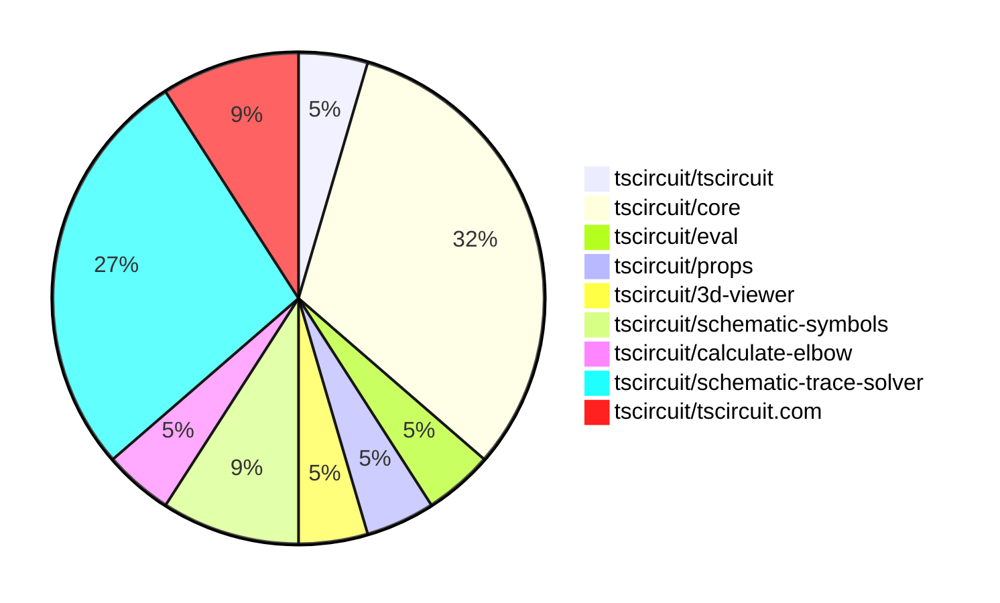
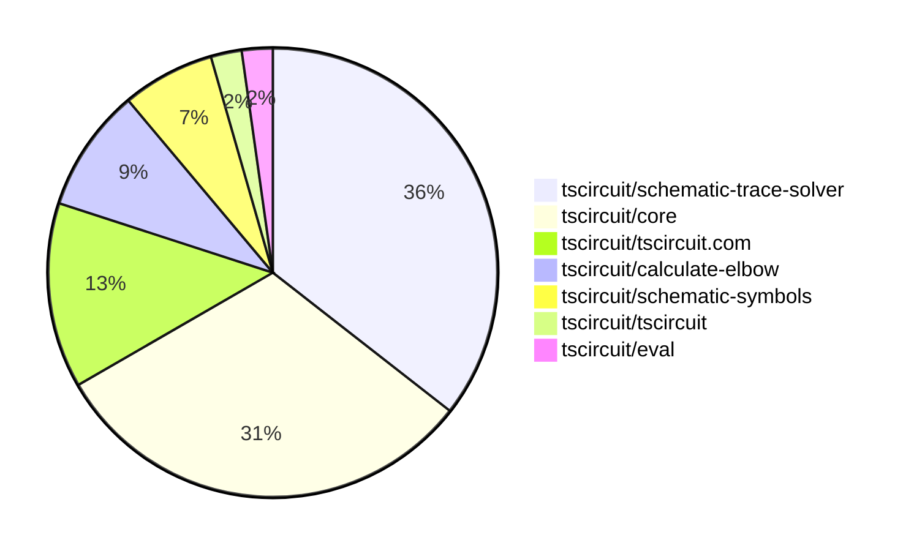

# Contribution Overview 2025-08-27

## PRs by Repository

## Contributor Overview

| Contributor | 🐳 Major | 🐙 Minor | 🐌 Tiny | ⭐ | Score | Discussion Contributions |
|-------------|---------|---------|---------|-----|----------------|--------------------------|
| [seveibar](#seveibar) | 5 | 2 | 2 | ⭐⭐⭐ | 34 | 0🔹 0🔶 0💎 |
| [imrishabh18](#imrishabh18) | 0 | 2 | 1 | ⭐ | 7 | 0🔹 0🔶 0💎 |
| [abimaelmartell](#abimaelmartell) | 1 | 1 | 0 | ⭐ | 6 | 0🔹 0🔶 0💎 |
| [MustafaMulla29](#MustafaMulla29) | 0 | 0 | 3 | ⭐ | 4 | 0🔹 0🔶 0💎 |
| [techmannih](#techmannih) | 0 | 1 | 0 | ⭐ | 4 | 0🔹 0🔶 0💎 |
| [ShiboSoftwareDev](#ShiboSoftwareDev) | 0 | 0 | 3 |  | 3 | 0🔹 0🔶 0💎 |
| [baeoc](#baeoc) | 0 | 1 | 0 |  | 2 | 0🔹 0🔶 0💎 |

### Discussion Contribution Legend

- 🔹 Normal Comments: Basic participation with minimal effort
- 🔶 Great Informative Comments: Thoughtful participation that adds value
- 💎 Incredible Comments: Exceptional participation with high-quality content

## Review Table

[reviews-received-hover]: ## "Number of reviews received for PRs for this contributor"
[approvals-received-hover]: ## "Number of approvals received for PRs this contributor authored"
[rejections-received-hover]: ## "Number of rejections received for PRs this contributor authored"
[prs-opened-hover]: ## "Number of PRs opened by this contributor"
[issues-created-hover]: ## "Number of issues created by this contributor"
[bountied-issues-hover]: ## "Number of issues this contributor created with a bounty"
[bountied-issue-$-hover]: ## "Total bounty amount placed on issues authored by this contributor"

| Contributor | Reviews Received | Approvals Received | Rejections Received | Approvals | Rejections | PRs Opened | PRs Merged | Score | Issues Created | Bountied Issues | Bountied Issue $ |
|---|---|---|---|---|---|---|---|---|---|---|---|
| [MustafaMulla29](#MustafaMulla29) | 6 | 3 | 0 | 0 | 0 | 4 | 3 | 4 | 0 | 0 | 0 |
| [seveibar](#seveibar) | 0 | 0 | 0 | 12 | 2 | 10 | 10 | 34 | 0 | 0 | 0 |
| [ShiboSoftwareDev](#ShiboSoftwareDev) | 12 | 5 | 0 | 0 | 0 | 4 | 3 | 3 | 0 | 0 | 0 |
| [graphite-app[bot]](#graphite-app[bot]) | 0 | 0 | 0 | 0 | 0 | 0 | 0 | 0 | 0 | 0 | 0 |
| [baeoc](#baeoc) | 6 | 3 | 1 | 0 | 0 | 2 | 1 | 2 | 0 | 0 | 0 |
| [Anshgrover23](#Anshgrover23) | 0 | 0 | 0 | 1 | 0 | 0 | 0 | 0 | 0 | 0 | 0 |
| [imrishabh18](#imrishabh18) | 5 | 3 | 0 | 2 | 0 | 3 | 3 | 7 | 0 | 0 | 0 |
| [techmannih](#techmannih) | 2 | 0 | 1 | 1 | 0 | 3 | 1 | 4 | 0 | 0 | 0 |
| [abimaelmartell](#abimaelmartell) | 1 | 1 | 0 | 0 | 0 | 2 | 2 | 6 | 0 | 0 | 0 |
| [tscircuitbot](#tscircuitbot) | 0 | 0 | 0 | 0 | 0 | 12 | 0 | 0 | 0 | 0 | 0 |
| [pxlpal](#pxlpal) | 1 | 1 | 0 | 0 | 0 | 1 | 0 | 0 | 0 | 0 | 0 |

## Top 7 Repositories by Contribution Points

## Changes by Repository

### [tscircuit/tscircuit](https://github.com/tscircuit/tscircuit)

🐌 Tiny Contributions (1)

| PR # | Impact | Contributor | Description |
|------|--------|-------------|-------------|
| [#744](https://github.com/tscircuit/tscircuit/pull/744) | 🐌 Tiny | MustafaMulla29 | Updates the core and eval packages to newer versions and removes the schematic-corpus dependency from the project. |

### [tscircuit/core](https://github.com/tscircuit/core)

| PR # | Impact | Rating | Contributor | Description |
|------|--------|--------|-------------|-------------|
| [#1192](https://github.com/tscircuit/core/pull/1192) | 🐳 Major | ⭐⭐⭐ | seveibar | Fixes missing net label placements in the MSP schematic trace routing, addressing a regression issue. |
| [#1189](https://github.com/tscircuit/core/pull/1189) | 🐙 Minor | ⭐⭐ | seveibar | Fixes regression in schematic trace routing that caused failures in rendering net labels for jumper connections. |
| [#1193](https://github.com/tscircuit/core/pull/1193) | 🐙 Minor | ⭐⭐ | baeoc | Fixes incorrect mapping of the emitter pin to the collector pin for NPN transistors in the Transistor component. |
| [#1179](https://github.com/tscircuit/core/pull/1179) | 🐙 Minor | ⭐⭐ | imrishabh18 | Fixes the issue where connections are incorrectly assigned to unnamed chips, defaulting to the first chips connection instead. |
| [#1169](https://github.com/tscircuit/core/pull/1169) | 🐙 Minor | ⭐⭐ | imrishabh18 | Fixes rendering issues in the Chip component when invalid pin labels are provided, allowing valid labels to render while excluding invalid ones with warnings. |

🐌 Tiny Contributions (2)

| PR # | Impact | Contributor | Description |
|------|--------|-------------|-------------|
| [#1190](https://github.com/tscircuit/core/pull/1190) | 🐌 Tiny | MustafaMulla29 | Removes the schematic-corpus and related code from the project, impacting how schematics are handled and represented. |
| [#1191](https://github.com/tscircuit/core/pull/1191) | 🐌 Tiny | imrishabh18 | Fixes failing test error in GitHub CI action by correcting import paths for the createUseComponent function. |

### [tscircuit/eval](https://github.com/tscircuit/eval)

🐌 Tiny Contributions (1)

| PR # | Impact | Contributor | Description |
|------|--------|-------------|-------------|
| [#887](https://github.com/tscircuit/eval/pull/887) | 🐌 Tiny | MustafaMulla29 | Updates the core library version, installs the schematic-trace-solver package, and removes the schematic-corpus dependency from the project. |

### [tscircuit/props](https://github.com/tscircuit/props)

🐌 Tiny Contributions (1)

| PR # | Impact | Contributor | Description |
|------|--------|-------------|-------------|
| [#361](https://github.com/tscircuit/props/pull/361) | 🐌 Tiny | ShiboSoftwareDev | Adds a duty cycle property to the VoltageSource component, allowing users to specify the duty cycle as a percentage or a decimal value. |

### [tscircuit/3d-viewer](https://github.com/tscircuit/3d-viewer)

🐌 Tiny Contributions (1)

| PR # | Impact | Contributor | Description |
|------|--------|-------------|-------------|
| [#423](https://github.com/tscircuit/3d-viewer/pull/423) | 🐌 Tiny | ShiboSoftwareDev | Changes the way manifold-3d is imported by loading it from a CDN instead of bundling the WASM file, which optimizes the build process and reduces the bundle size. |

### [tscircuit/schematic-symbols](https://github.com/tscircuit/schematic-symbols)

| PR # | Impact | Rating | Contributor | Description |
|------|--------|--------|-------------|-------------|
| [#357](https://github.com/tscircuit/schematic-symbols/pull/357) | 🐙 Minor | ⭐⭐ | techmannih | Fixes pin numbering to follow the counter-clockwise convention for the opamp with power symbol. |

🐌 Tiny Contributions (1)

| PR # | Impact | Contributor | Description |
|------|--------|-------------|-------------|
| [#354](https://github.com/tscircuit/schematic-symbols/pull/354) | 🐌 Tiny | ShiboSoftwareDev | Adds a new square wave symbol to the schematic symbols library, completing the boost converter component set. |

### [tscircuit/calculate-elbow](https://github.com/tscircuit/calculate-elbow)

| PR # | Impact | Rating | Contributor | Description |
|------|--------|--------|-------------|-------------|
| [#11](https://github.com/tscircuit/calculate-elbow/pull/11) | 🐳 Major | ⭐⭐⭐ | seveibar | Fixes small floating point errors causing incorrect path construction in elbow calculations. |

### [tscircuit/schematic-trace-solver](https://github.com/tscircuit/schematic-trace-solver)

| PR # | Impact | Rating | Contributor | Description |
|------|--------|--------|-------------|-------------|
| [#17](https://github.com/tscircuit/schematic-trace-solver/pull/17) | 🐳 Major | ⭐⭐⭐ | seveibar | Orders single-line solver candidate paths by path length so shorter traces are tried first and tests that the solver selects the shortest available candidate path. |
| [#16](https://github.com/tscircuit/schematic-trace-solver/pull/16) | 🐳 Major | ⭐⭐⭐ | seveibar | Adds a PasteInput page, updates calculate-elbow to fix floating point issues with near-axis aligned traces, and introduces download functionality for page.tsx and test.ts files. |
| [#13](https://github.com/tscircuit/schematic-trace-solver/pull/13) | 🐳 Major | ⭐⭐⭐ | seveibar | Fixes MSP connection pair solver to return all pairs and adds logging for better debugging. |
| [#15](https://github.com/tscircuit/schematic-trace-solver/pull/15) | 🐙 Minor | ⭐⭐ | seveibar | Adds netId, mspConnectionPairIds, and pinIds to the NetLabelPlacement interface to enhance net label placement functionality. |

🐌 Tiny Contributions (2)

| PR # | Impact | Contributor | Description |
|------|--------|-------------|-------------|
| [#18](https://github.com/tscircuit/schematic-trace-solver/pull/18) | 🐌 Tiny | seveibar | Adds a reproduction example for a missing net label issue in the schematic trace solver. |
| [#14](https://github.com/tscircuit/schematic-trace-solver/pull/14) | 🐌 Tiny | seveibar | Adds pinIds to the SolvedTracePath interface to enhance trace path identification in schematic solving. |

### [tscircuit/tscircuit.com](https://github.com/tscircuit/tscircuit.com)

| PR # | Impact | Rating | Contributor | Description |
|------|--------|--------|-------------|-------------|
| [#1613](https://github.com/tscircuit/tscircuit.com/pull/1613) | 🐳 Major | ⭐⭐⭐ | abimaelmartell | Fetches schematic, PCB, and 3D images for package releases and displays them above the build overview. |
| [#1614](https://github.com/tscircuit/tscircuit.com/pull/1614) | 🐙 Minor | ⭐⭐ | abimaelmartell | Expose image generation build info in API and schema, show image generation logs on preview and build details pages, and test that package releases return image generation fields. |

## Changes by Contributor

### [MustafaMulla29](https://github.com/MustafaMulla29)

🐌 Tiny Contributions (3)

| PR # | Impact | Description |
|------|--------|-------------|
| [#744](https://github.com/tscircuit/tscircuit/pull/744) | 🐌 Tiny | Updates the core and eval packages to newer versions and removes the schematic-corpus dependency from the project. |
| [#1190](https://github.com/tscircuit/core/pull/1190) | 🐌 Tiny | Removes the schematic-corpus and related code from the project, impacting how schematics are handled and represented. |
| [#887](https://github.com/tscircuit/eval/pull/887) | 🐌 Tiny | Updates the core library version, installs the schematic-trace-solver package, and removes the schematic-corpus dependency from the project. |

### [ShiboSoftwareDev](https://github.com/ShiboSoftwareDev)

🐌 Tiny Contributions (3)

| PR # | Impact | Description |
|------|--------|-------------|
| [#361](https://github.com/tscircuit/props/pull/361) | 🐌 Tiny | Adds a duty cycle property to the VoltageSource component, allowing users to specify the duty cycle as a percentage or a decimal value. |
| [#423](https://github.com/tscircuit/3d-viewer/pull/423) | 🐌 Tiny | Changes the way manifold-3d is imported by loading it from a CDN instead of bundling the WASM file, which optimizes the build process and reduces the bundle size. |
| [#354](https://github.com/tscircuit/schematic-symbols/pull/354) | 🐌 Tiny | Adds a new square wave symbol to the schematic symbols library, completing the boost converter component set. |

### [seveibar](https://github.com/seveibar)

| PRs # | Impact | Rating | Description |
|------|--------|--------|-------------|
| [#1192](https://github.com/tscircuit/core/pull/1192) | 🐳 Major | ⭐⭐⭐ | Fixes missing net label placements in the MSP schematic trace routing, addressing a regression issue. |
| [#11](https://github.com/tscircuit/calculate-elbow/pull/11) | 🐳 Major | ⭐⭐⭐ | Fixes small floating point errors causing incorrect path construction in elbow calculations. |
| [#17](https://github.com/tscircuit/schematic-trace-solver/pull/17) | 🐳 Major | ⭐⭐⭐ | Orders single-line solver candidate paths by path length so shorter traces are tried first and tests that the solver selects the shortest available candidate path. |
| [#16](https://github.com/tscircuit/schematic-trace-solver/pull/16) | 🐳 Major | ⭐⭐⭐ | Adds a PasteInput page, updates calculate-elbow to fix floating point issues with near-axis aligned traces, and introduces download functionality for page.tsx and test.ts files. |
| [#13](https://github.com/tscircuit/schematic-trace-solver/pull/13) | 🐳 Major | ⭐⭐⭐ | Fixes MSP connection pair solver to return all pairs and adds logging for better debugging. |
| [#1189](https://github.com/tscircuit/core/pull/1189) | 🐙 Minor | ⭐⭐ | Fixes regression in schematic trace routing that caused failures in rendering net labels for jumper connections. |
| [#15](https://github.com/tscircuit/schematic-trace-solver/pull/15) | 🐙 Minor | ⭐⭐ | Adds netId, mspConnectionPairIds, and pinIds to the NetLabelPlacement interface to enhance net label placement functionality. |

🐌 Tiny Contributions (2)

| PR # | Impact | Description |
|------|--------|-------------|
| [#18](https://github.com/tscircuit/schematic-trace-solver/pull/18) | 🐌 Tiny | Adds a reproduction example for a missing net label issue in the schematic trace solver. |
| [#14](https://github.com/tscircuit/schematic-trace-solver/pull/14) | 🐌 Tiny | Adds pinIds to the SolvedTracePath interface to enhance trace path identification in schematic solving. |

### [baeoc](https://github.com/baeoc)

| PRs # | Impact | Rating | Description |
|------|--------|--------|-------------|
| [#1193](https://github.com/tscircuit/core/pull/1193) | 🐙 Minor | ⭐⭐ | Fixes incorrect mapping of the emitter pin to the collector pin for NPN transistors in the Transistor component. |

### [imrishabh18](https://github.com/imrishabh18)

| PRs # | Impact | Rating | Description |
|------|--------|--------|-------------|
| [#1179](https://github.com/tscircuit/core/pull/1179) | 🐙 Minor | ⭐⭐ | Fixes the issue where connections are incorrectly assigned to unnamed chips, defaulting to the first chips connection instead. |
| [#1169](https://github.com/tscircuit/core/pull/1169) | 🐙 Minor | ⭐⭐ | Fixes rendering issues in the Chip component when invalid pin labels are provided, allowing valid labels to render while excluding invalid ones with warnings. |

🐌 Tiny Contributions (1)

| PR # | Impact | Description |
|------|--------|-------------|
| [#1191](https://github.com/tscircuit/core/pull/1191) | 🐌 Tiny | Fixes failing test error in GitHub CI action by correcting import paths for the createUseComponent function. |

### [techmannih](https://github.com/techmannih)

| PRs # | Impact | Rating | Description |
|------|--------|--------|-------------|
| [#357](https://github.com/tscircuit/schematic-symbols/pull/357) | 🐙 Minor | ⭐⭐ | Fixes pin numbering to follow the counter-clockwise convention for the opamp with power symbol. |

### [abimaelmartell](https://github.com/abimaelmartell)

| PRs # | Impact | Rating | Description |
|------|--------|--------|-------------|
| [#1613](https://github.com/tscircuit/tscircuit.com/pull/1613) | 🐳 Major | ⭐⭐⭐ | Fetches schematic, PCB, and 3D images for package releases and displays them above the build overview. |
| [#1614](https://github.com/tscircuit/tscircuit.com/pull/1614) | 🐙 Minor | ⭐⭐ | Expose image generation build info in API and schema, show image generation logs on preview and build details pages, and test that package releases return image generation fields. |

## Repository Owners

| Repository | Codeowners |
|------------|------------|
| [builder](https://github.com/tscircuit/builder/blob/main/.github/CODEOWNERS) | [seveibar](https://github.com/seveibar)
| [pcb-viewer](https://github.com/tscircuit/pcb-viewer/blob/main/.github/CODEOWNERS) | [seveibar](https://github.com/seveibar), [ShiboSoftwareDev](https://github.com/ShiboSoftwareDev)
| [footprints-old](https://github.com/tscircuit/footprints-old/blob/main/.github/CODEOWNERS) | [seveibar](https://github.com/seveibar)
| [footprinter](https://github.com/tscircuit/footprinter/blob/main/.github/CODEOWNERS) | [seveibar](https://github.com/seveibar), [techmannih](https://github.com/techmannih)
| [3d-viewer](https://github.com/tscircuit/3d-viewer/blob/main/.github/CODEOWNERS) | [ShiboSoftwareDev](https://github.com/ShiboSoftwareDev)
| [winterspec](https://github.com/tscircuit/winterspec/blob/main/.github/CODEOWNERS) | [seveibar](https://github.com/seveibar), [ShiboSoftwareDev](https://github.com/ShiboSoftwareDev)
| [jscad-electronics](https://github.com/tscircuit/jscad-electronics/blob/main/.github/CODEOWNERS) | [seveibar](https://github.com/seveibar), [abhijitxy](https://github.com/abhijitxy), [anas-sarkez](https://github.com/anas-sarkez)
| [circuit-to-svg](https://github.com/tscircuit/circuit-to-svg/blob/main/.github/CODEOWNERS) | [imrishabh18](https://github.com/imrishabh18)
| [schematic-symbols](https://github.com/tscircuit/schematic-symbols/blob/main/.github/CODEOWNERS) | [seveibar](https://github.com/seveibar), [imrishabh18](https://github.com/imrishabh18), [techmannih](https://github.com/techmannih)
| [circuit-json-to-gerber](https://github.com/tscircuit/circuit-json-to-gerber/blob/main/.github/CODEOWNERS) | [seveibar](https://github.com/seveibar), [ShiboSoftwareDev](https://github.com/ShiboSoftwareDev)
| [tscircuit.com](https://github.com/tscircuit/tscircuit.com/blob/main/.github/CODEOWNERS) | [seveibar](https://github.com/seveibar), [imrishabh18](https://github.com/imrishabh18)
| [cli](https://github.com/tscircuit/cli/blob/main/.github/CODEOWNERS) | [seveibar](https://github.com/seveibar), [imrishabh18](https://github.com/imrishabh18), [ArnavK-09](https://github.com/ArnavK-09)
| [issue-roulette](https://github.com/tscircuit/issue-roulette/blob/main/.github/CODEOWNERS) | [Anshgrover23](https://github.com/Anshgrover23)
| [sparkfun-boards](https://github.com/tscircuit/sparkfun-boards/blob/main/.github/CODEOWNERS) | [ShiboSoftwareDev](https://github.com/ShiboSoftwareDev), [Abse2001](https://github.com/Abse2001), [MustafaMulla29](https://github.com/MustafaMulla29), [Anshgrover23](https://github.com/Anshgrover23), [techmannih](https://github.com/techmannih)
| [schematic-corpus](https://github.com/tscircuit/schematic-corpus/blob/main/.github/CODEOWNERS) | [Abse2001](https://github.com/Abse2001)

## Repositories by Owner

| User | Repo |
|------|------|
| [seveibar](https://github.com/seveibar) | [builder](https://github.com/tscircuit/builder/blob/main/.github/CODEOWNERS) |
|  | [pcb-viewer](https://github.com/tscircuit/pcb-viewer/blob/main/.github/CODEOWNERS) |
|  | [footprints-old](https://github.com/tscircuit/footprints-old/blob/main/.github/CODEOWNERS) |
|  | [footprinter](https://github.com/tscircuit/footprinter/blob/main/.github/CODEOWNERS) |
|  | [winterspec](https://github.com/tscircuit/winterspec/blob/main/.github/CODEOWNERS) |
|  | [jscad-electronics](https://github.com/tscircuit/jscad-electronics/blob/main/.github/CODEOWNERS) |
|  | [schematic-symbols](https://github.com/tscircuit/schematic-symbols/blob/main/.github/CODEOWNERS) |
|  | [circuit-json-to-gerber](https://github.com/tscircuit/circuit-json-to-gerber/blob/main/.github/CODEOWNERS) |
|  | [tscircuit.com](https://github.com/tscircuit/tscircuit.com/blob/main/.github/CODEOWNERS) |
|  | [cli](https://github.com/tscircuit/cli/blob/main/.github/CODEOWNERS) |
| [ShiboSoftwareDev](https://github.com/ShiboSoftwareDev) | [pcb-viewer](https://github.com/tscircuit/pcb-viewer/blob/main/.github/CODEOWNERS) |
|  | [3d-viewer](https://github.com/tscircuit/3d-viewer/blob/main/.github/CODEOWNERS) |
|  | [winterspec](https://github.com/tscircuit/winterspec/blob/main/.github/CODEOWNERS) |
|  | [circuit-json-to-gerber](https://github.com/tscircuit/circuit-json-to-gerber/blob/main/.github/CODEOWNERS) |
|  | [sparkfun-boards](https://github.com/tscircuit/sparkfun-boards/blob/main/.github/CODEOWNERS) |
| [techmannih](https://github.com/techmannih) | [footprinter](https://github.com/tscircuit/footprinter/blob/main/.github/CODEOWNERS) |
|  | [schematic-symbols](https://github.com/tscircuit/schematic-symbols/blob/main/.github/CODEOWNERS) |
|  | [sparkfun-boards](https://github.com/tscircuit/sparkfun-boards/blob/main/.github/CODEOWNERS) |
| [abhijitxy](https://github.com/abhijitxy) | [jscad-electronics](https://github.com/tscircuit/jscad-electronics/blob/main/.github/CODEOWNERS) |
| [anas-sarkez](https://github.com/anas-sarkez) | [jscad-electronics](https://github.com/tscircuit/jscad-electronics/blob/main/.github/CODEOWNERS) |
| [imrishabh18](https://github.com/imrishabh18) | [circuit-to-svg](https://github.com/tscircuit/circuit-to-svg/blob/main/.github/CODEOWNERS) |
|  | [schematic-symbols](https://github.com/tscircuit/schematic-symbols/blob/main/.github/CODEOWNERS) |
|  | [tscircuit.com](https://github.com/tscircuit/tscircuit.com/blob/main/.github/CODEOWNERS) |
|  | [cli](https://github.com/tscircuit/cli/blob/main/.github/CODEOWNERS) |
| [ArnavK-09](https://github.com/ArnavK-09) | [cli](https://github.com/tscircuit/cli/blob/main/.github/CODEOWNERS) |
| [Anshgrover23](https://github.com/Anshgrover23) | [issue-roulette](https://github.com/tscircuit/issue-roulette/blob/main/.github/CODEOWNERS) |
|  | [sparkfun-boards](https://github.com/tscircuit/sparkfun-boards/blob/main/.github/CODEOWNERS) |
| [Abse2001](https://github.com/Abse2001) | [sparkfun-boards](https://github.com/tscircuit/sparkfun-boards/blob/main/.github/CODEOWNERS) |
|  | [schematic-corpus](https://github.com/tscircuit/schematic-corpus/blob/main/.github/CODEOWNERS) |
| [MustafaMulla29](https://github.com/MustafaMulla29) | [sparkfun-boards](https://github.com/tscircuit/sparkfun-boards/blob/main/.github/CODEOWNERS) |

