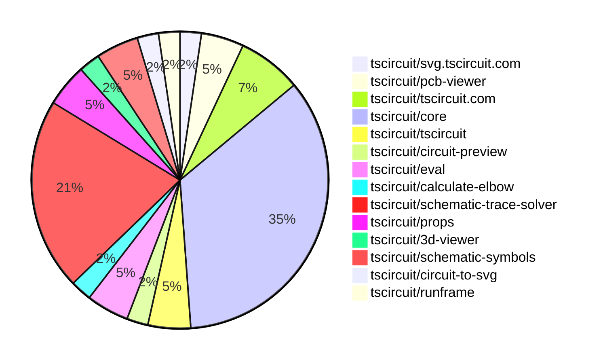
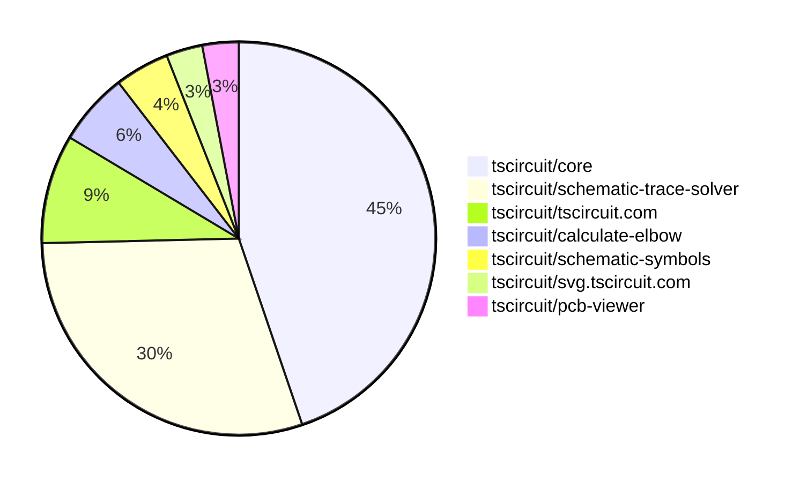

# Contribution Overview 2025-08-27

## PRs by Repository

## Contributor Overview

| Contributor | 🐳 Major | 🐙 Minor | 🐌 Tiny | ⭐ | Score | Discussion Contributions |
|-------------|---------|---------|---------|-----|----------------|--------------------------|
| [seveibar](#seveibar) | 5 | 6 | 6 | ⭐⭐⭐ | 49 | 0🔹 0🔶 0💎 |
| [imrishabh18](#imrishabh18) | 0 | 4 | 4 | ⭐⭐ | 14 | 0🔹 0🔶 0💎 |
| [baeoc](#baeoc) | 1 | 2 | 0 | ⭐ | 9 | 0🔹 0🔶 0💎 |
| [ArnavK-09](#ArnavK-09) | 0 | 1 | 3 | ⭐ | 5 | 0🔹 0🔶 0💎 |
| [abimaelmartell](#abimaelmartell) | 1 | 0 | 1 | ⭐ | 5 | 0🔹 0🔶 0💎 |
| [MustafaMulla29](#MustafaMulla29) | 0 | 0 | 3 | ⭐ | 4 | 0🔹 0🔶 0💎 |
| [techmannih](#techmannih) | 0 | 1 | 0 | ⭐ | 4 | 0🔹 0🔶 0💎 |
| [ShiboSoftwareDev](#ShiboSoftwareDev) | 0 | 0 | 3 |  | 3 | 0🔹 0🔶 0💎 |
| [pxlpal](#pxlpal) | 0 | 1 | 0 |  | 2 | 0🔹 0🔶 0💎 |
| [tscircuitbot](#tscircuitbot) | 0 | 0 | 1 |  | 1 | 0🔹 0🔶 0💎 |

### Discussion Contribution Legend

- 🔹 Normal Comments: Basic participation with minimal effort
- 🔶 Great Informative Comments: Thoughtful participation that adds value
- 💎 Incredible Comments: Exceptional participation with high-quality content

## Review Table

[reviews-received-hover]: ## "Number of reviews received for PRs for this contributor"
[approvals-received-hover]: ## "Number of approvals received for PRs this contributor authored"
[rejections-received-hover]: ## "Number of rejections received for PRs this contributor authored"
[prs-opened-hover]: ## "Number of PRs opened by this contributor"
[issues-created-hover]: ## "Number of issues created by this contributor"
[bountied-issues-hover]: ## "Number of issues this contributor created with a bounty"
[bountied-issue-$-hover]: ## "Total bounty amount placed on issues authored by this contributor"

| Contributor | Reviews Received | Approvals Received | Rejections Received | Approvals | Rejections | PRs Opened | PRs Merged | Score | Issues Created | Bountied Issues | Bountied Issue $ |
|---|---|---|---|---|---|---|---|---|---|---|---|
| [ArnavK-09](#ArnavK-09) | 5 | 4 | 0 | 0 | 0 | 4 | 4 | 5 | 0 | 0 | 0 |
| [seveibar](#seveibar) | 1 | 0 | 0 | 21 | 6 | 21 | 18 | 49 | 0 | 0 | 0 |
| [imrishabh18](#imrishabh18) | 12 | 6 | 0 | 2 | 0 | 10 | 8 | 14 | 0 | 0 | 0 |
| [MustafaMulla29](#MustafaMulla29) | 7 | 3 | 1 | 0 | 0 | 5 | 3 | 4 | 0 | 0 | 0 |
| [ShiboSoftwareDev](#ShiboSoftwareDev) | 12 | 5 | 0 | 0 | 0 | 4 | 3 | 3 | 0 | 0 | 0 |
| [graphite-app[bot]](#graphite-app[bot]) | 0 | 0 | 0 | 0 | 0 | 0 | 0 | 0 | 0 | 0 | 0 |
| [baeoc](#baeoc) | 15 | 5 | 4 | 0 | 0 | 6 | 3 | 9 | 0 | 0 | 0 |
| [chatgpt-codex-connector[bot]](#chatgpt-codex-connector[bot]) | 0 | 0 | 0 | 0 | 0 | 0 | 0 | 0 | 0 | 0 | 0 |
| [Anshgrover23](#Anshgrover23) | 0 | 0 | 0 | 1 | 0 | 0 | 0 | 0 | 0 | 0 | 0 |
| [techmannih](#techmannih) | 2 | 0 | 1 | 1 | 0 | 3 | 1 | 4 | 0 | 0 | 0 |
| [abimaelmartell](#abimaelmartell) | 1 | 1 | 0 | 0 | 0 | 2 | 2 | 5 | 0 | 0 | 0 |
| [tscircuitbot](#tscircuitbot) | 0 | 0 | 0 | 0 | 0 | 28 | 1 | 1 | 0 | 0 | 0 |
| [pxlpal](#pxlpal) | 1 | 1 | 0 | 0 | 0 | 1 | 1 | 2 | 0 | 0 | 0 |

## Top 7 Repositories by Contribution Points

## Changes by Repository

### [tscircuit/svg.tscircuit.com](https://github.com/tscircuit/svg.tscircuit.com)

| PR # | Impact | Rating | Contributor | Description |
|------|--------|--------|-------------|-------------|
| [#290](https://github.com/tscircuit/svg.tscircuit.com/pull/290) | 🐙 Minor | ⭐⭐ | ArnavK-09 | Add background coloropacity and default zoom multiplier parameters to the 3D SVG conversion function to provide more control over the output visualization |

### [tscircuit/pcb-viewer](https://github.com/tscircuit/pcb-viewer)

🐌 Tiny Contributions (2)

| PR # | Impact | Contributor | Description |
|------|--------|-------------|-------------|
| [#360](https://github.com/tscircuit/pcb-viewer/pull/360) | 🐌 Tiny | ArnavK-09 | Integrates local storage functionality to persist PCB groups visibility settings across sessions. |
| [#359](https://github.com/tscircuit/pcb-viewer/pull/359) | 🐌 Tiny | ArnavK-09 | Sets the default visibility of PCB groups to true, correcting a previous misconfiguration that could confuse users expecting grouped PCB elements to be visible by default. |

### [tscircuit/tscircuit.com](https://github.com/tscircuit/tscircuit.com)

| PR # | Impact | Rating | Contributor | Description |
|------|--------|--------|-------------|-------------|
| [#1613](https://github.com/tscircuit/tscircuit.com/pull/1613) | 🐳 Major | ⭐⭐⭐ | abimaelmartell | Fetches schematic, PCB, and 3D images for package releases and displays them above the build overview. |

🐌 Tiny Contributions (2)

| PR # | Impact | Contributor | Description |
|------|--------|-------------|-------------|
| [#1616](https://github.com/tscircuit/tscircuit.com/pull/1616) | 🐌 Tiny | ArnavK-09 | Adjusts the background colors of images in the release detail page based on the view type (PCB or schematic). |
| [#1614](https://github.com/tscircuit/tscircuit.com/pull/1614) | 🐌 Tiny | abimaelmartell | Expose image generation build info in API and schema, show image generation logs on preview and build details pages, and test that package releases return image generation fields. |

### [tscircuit/core](https://github.com/tscircuit/core)

| PR # | Impact | Rating | Contributor | Description |
|------|--------|--------|-------------|-------------|
| [#1198](https://github.com/tscircuit/core/pull/1198) | 🐳 Major | ⭐⭐⭐ | seveibar | Fixes net label rendering issue by ensuring labels are drawn only when a source net or assigned display name is present, improving schematic clarity. |
| [#1193](https://github.com/tscircuit/core/pull/1193) | 🐳 Major | ⭐⭐⭐ | baeoc | Fixes incorrect mapping of the emitter pin to the collector pin for NPN transistors in the Transistor component. |
| [#1208](https://github.com/tscircuit/core/pull/1208) | 🐙 Minor | ⭐⭐ | imrishabh18 | Adds the source_trace_not_connected_error to circuit-json to handle cases where traces are not connected to ports correctly. |
| [#1207](https://github.com/tscircuit/core/pull/1207) | 🐙 Minor | ⭐⭐ | imrishabh18 | Fixes the PCB layout behavior to ensure that explicit positions set on components (pcbX and pcbY) take precedence over the automatic flex layout. |
| [#1179](https://github.com/tscircuit/core/pull/1179) | 🐙 Minor | ⭐⭐ | imrishabh18 | Fixes the issue where connections are incorrectly assigned to unnamed chips, defaulting to the first chips connection instead. |
| [#1169](https://github.com/tscircuit/core/pull/1169) | 🐙 Minor | ⭐⭐ | imrishabh18 | Fixes rendering failure of the component when invalid pin labels are provided, allowing valid labels to render while excluding invalid ones with warnings. |
| [#1199](https://github.com/tscircuit/core/pull/1199) | 🐙 Minor | ⭐⭐ | seveibar | Fixes MSP overreach by adjusting maxMspPairDistance and refactoring transistor tests for better coverage. |
| [#1196](https://github.com/tscircuit/core/pull/1196) | 🐙 Minor | ⭐⭐ | seveibar | Fixes missing net label placements in schematic rendering when using the match-adapt feature. |
| [#1194](https://github.com/tscircuit/core/pull/1194) | 🐙 Minor | ⭐⭐ | seveibar | Removes duplicate layered netlabels from schematic display, ensuring that only unique labels are rendered in the schematic view. |
| [#1192](https://github.com/tscircuit/core/pull/1192) | 🐙 Minor | ⭐⭐ | seveibar | Fixes missing net label placements in the MSP schematic trace routing, addressing a regression issue. |
| [#1189](https://github.com/tscircuit/core/pull/1189) | 🐙 Minor | ⭐⭐ | seveibar | Fixes regression in schematic trace routing that caused failures in rendering net labels for jumper connections. |

🐌 Tiny Contributions (4)

| PR # | Impact | Contributor | Description |
|------|--------|-------------|-------------|
| [#1183](https://github.com/tscircuit/core/pull/1183) | 🐌 Tiny | imrishabh18 | Fixes the tree construction and child ordering for groups with pcbFlex by utilizing group.child in the PCB layout process. |
| [#1191](https://github.com/tscircuit/core/pull/1191) | 🐌 Tiny | imrishabh18 | Fixes failing test error in GitHub CI action by correcting import paths for the createUseComponent function. |
| [#1190](https://github.com/tscircuit/core/pull/1190) | 🐌 Tiny | MustafaMulla29 | Removes the schematic-corpus and related code from the project, impacting how schematics are handled and represented. |
| [#1200](https://github.com/tscircuit/core/pull/1200) | 🐌 Tiny | seveibar | Enables the MSP schematic trace solver feature in the circuit simulation environment. |

### [tscircuit/tscircuit](https://github.com/tscircuit/tscircuit)

🐌 Tiny Contributions (2)

| PR # | Impact | Contributor | Description |
|------|--------|-------------|-------------|
| [#745](https://github.com/tscircuit/tscircuit/pull/745) | 🐌 Tiny | imrishabh18 | Updates the version of the tscircuitcore dependency from 0.0.651 to 0.0.659 in package.json |
| [#744](https://github.com/tscircuit/tscircuit/pull/744) | 🐌 Tiny | MustafaMulla29 | Updates the core and eval packages to newer versions and removes the schematic-corpus dependency from the project. |

### [tscircuit/circuit-preview](https://github.com/tscircuit/circuit-preview)

🐌 Tiny Contributions (1)

| PR # | Impact | Contributor | Description |
|------|--------|-------------|-------------|
| [#7](https://github.com/tscircuit/circuit-preview/pull/7) | 🐌 Tiny | imrishabh18 | Adds configuration for Cosmos preview deployment and introduces a new Vite configuration file for exporting Cosmos components. |

### [tscircuit/eval](https://github.com/tscircuit/eval)

🐌 Tiny Contributions (2)

| PR # | Impact | Contributor | Description |
|------|--------|-------------|-------------|
| [#887](https://github.com/tscircuit/eval/pull/887) | 🐌 Tiny | MustafaMulla29 | Updates the core library version, installs the schematic-trace-solver package, and removes the schematic-corpus dependency from the project. |
| [#907](https://github.com/tscircuit/eval/pull/907) | 🐌 Tiny | tscircuitbot | Updates the tscircuitcore dependency from version 0.0.650 to 0.0.660, along with minor updates to other dependencies in package.json. |

### [tscircuit/calculate-elbow](https://github.com/tscircuit/calculate-elbow)

| PR # | Impact | Rating | Contributor | Description |
|------|--------|--------|-------------|-------------|
| [#11](https://github.com/tscircuit/calculate-elbow/pull/11) | 🐳 Major | ⭐⭐⭐ | seveibar | Fixes small floating point errors causing incorrect path construction in elbow calculations |

### [tscircuit/schematic-trace-solver](https://github.com/tscircuit/schematic-trace-solver)

| PR # | Impact | Rating | Contributor | Description |
|------|--------|--------|-------------|-------------|
| [#22](https://github.com/tscircuit/schematic-trace-solver/pull/22) | 🐳 Major | ⭐⭐⭐ | seveibar | Fixes the issue where diagonal traces sometimes appear in the schematic trace solver, ensuring that only strictly orthogonal paths are generated. |
| [#17](https://github.com/tscircuit/schematic-trace-solver/pull/17) | 🐳 Major | ⭐⭐⭐ | seveibar | Orders single-line solver candidate paths by path length so shorter traces are tried first and tests that the solver selects the shortest available candidate path. |
| [#16](https://github.com/tscircuit/schematic-trace-solver/pull/16) | 🐳 Major | ⭐⭐⭐ | seveibar | Adds a PasteInput page, introduces download functionality for page.tsx and test.ts files, and fixes floating point issues in calculate elbow for near-axis aligned traces. |
| [#14](https://github.com/tscircuit/schematic-trace-solver/pull/14) | 🐙 Minor | ⭐⭐ | seveibar | Adds pinIds to the SolvedTracePath interface to enhance trace path data structure. |
| [#21](https://github.com/tscircuit/schematic-trace-solver/pull/21) | 🐙 Minor | ⭐⭐ | baeoc | Fixes missing net label for trace group island in Example07, ensuring proper label placement for overlapping traces. |

🐌 Tiny Contributions (4)

| PR # | Impact | Contributor | Description |
|------|--------|-------------|-------------|
| [#24](https://github.com/tscircuit/schematic-trace-solver/pull/24) | 🐌 Tiny | seveibar | Fixes the issue of MSP connection pairs being created over too long of a distance by enforcing a maximum Manhattan distance between pins. |
| [#18](https://github.com/tscircuit/schematic-trace-solver/pull/18) | 🐌 Tiny | seveibar | Adds a reproduction example for a missing net label issue in the schematic trace solver. |
| [#15](https://github.com/tscircuit/schematic-trace-solver/pull/15) | 🐌 Tiny | seveibar | Adds netId, mspConnectionPairIds, and pinIds to the NetLabelPlacement interface to enhance net label placement functionality. |
| [#13](https://github.com/tscircuit/schematic-trace-solver/pull/13) | 🐌 Tiny | seveibar | Fixes MSP connection pair solver to return all pairs and adds logging for better debugging. |

### [tscircuit/props](https://github.com/tscircuit/props)

🐌 Tiny Contributions (2)

| PR # | Impact | Contributor | Description |
|------|--------|-------------|-------------|
| [#362](https://github.com/tscircuit/props/pull/362) | 🐌 Tiny | seveibar | Adds an optional schMaxTraceDistance property to SubcircuitGroupProps, allowing users to specify the maximum length a trace can span on the schematic. |
| [#361](https://github.com/tscircuit/props/pull/361) | 🐌 Tiny | ShiboSoftwareDev | Adds a duty cycle property to the VoltageSource component, allowing users to specify the duty cycle as a percentage or a decimal value. |

### [tscircuit/3d-viewer](https://github.com/tscircuit/3d-viewer)

🐌 Tiny Contributions (1)

| PR # | Impact | Contributor | Description |
|------|--------|-------------|-------------|
| [#423](https://github.com/tscircuit/3d-viewer/pull/423) | 🐌 Tiny | ShiboSoftwareDev | Changes the way manifold-3d is imported by loading it from a CDN instead of bundling the WASM file, which optimizes the build process and reduces the bundle size. |

### [tscircuit/schematic-symbols](https://github.com/tscircuit/schematic-symbols)

| PR # | Impact | Rating | Contributor | Description |
|------|--------|--------|-------------|-------------|
| [#357](https://github.com/tscircuit/schematic-symbols/pull/357) | 🐙 Minor | ⭐⭐ | techmannih | Fixes pin numbering for the opamp with power to follow the counter-clockwise convention, correcting the pin assignments for output and power connections. |

🐌 Tiny Contributions (1)

| PR # | Impact | Contributor | Description |
|------|--------|-------------|-------------|
| [#354](https://github.com/tscircuit/schematic-symbols/pull/354) | 🐌 Tiny | ShiboSoftwareDev | Adds a new square wave symbol to the schematic symbols library, completing the boost converter component set. |

### [tscircuit/circuit-to-svg](https://github.com/tscircuit/circuit-to-svg)

| PR # | Impact | Rating | Contributor | Description |
|------|--------|--------|-------------|-------------|
| [#298](https://github.com/tscircuit/circuit-to-svg/pull/298) | 🐙 Minor | ⭐⭐ | baeoc | Draws reference designators on schematic above schematic traces to improve visibility and clarity. |

### [tscircuit/runframe](https://github.com/tscircuit/runframe)

| PR # | Impact | Rating | Contributor | Description |
|------|--------|--------|-------------|-------------|
| [#1033](https://github.com/tscircuit/runframe/pull/1033) | 🐙 Minor | ⭐⭐ | pxlpal | Refactors the ImportComponentDialog to handle component importing and toast messaging internally, allowing for custom headers to be passed for JLCPCB proxy requests and simplifying its usage in FileMenuLeftHeader. |

## Changes by Contributor

### [ArnavK-09](https://github.com/ArnavK-09)

| PRs # | Impact | Rating | Description |
|------|--------|--------|-------------|
| [#290](https://github.com/tscircuit/svg.tscircuit.com/pull/290) | 🐙 Minor | ⭐⭐ | Add background coloropacity and default zoom multiplier parameters to the 3D SVG conversion function to provide more control over the output visualization |

🐌 Tiny Contributions (3)

| PR # | Impact | Description |
|------|--------|-------------|
| [#360](https://github.com/tscircuit/pcb-viewer/pull/360) | 🐌 Tiny | Integrates local storage functionality to persist PCB groups visibility settings across sessions. |
| [#359](https://github.com/tscircuit/pcb-viewer/pull/359) | 🐌 Tiny | Sets the default visibility of PCB groups to true, correcting a previous misconfiguration that could confuse users expecting grouped PCB elements to be visible by default. |
| [#1616](https://github.com/tscircuit/tscircuit.com/pull/1616) | 🐌 Tiny | Adjusts the background colors of images in the release detail page based on the view type (PCB or schematic). |

### [imrishabh18](https://github.com/imrishabh18)

| PRs # | Impact | Rating | Description |
|------|--------|--------|-------------|
| [#1208](https://github.com/tscircuit/core/pull/1208) | 🐙 Minor | ⭐⭐ | Adds the source_trace_not_connected_error to circuit-json to handle cases where traces are not connected to ports correctly. |
| [#1207](https://github.com/tscircuit/core/pull/1207) | 🐙 Minor | ⭐⭐ | Fixes the PCB layout behavior to ensure that explicit positions set on components (pcbX and pcbY) take precedence over the automatic flex layout. |
| [#1179](https://github.com/tscircuit/core/pull/1179) | 🐙 Minor | ⭐⭐ | Fixes the issue where connections are incorrectly assigned to unnamed chips, defaulting to the first chips connection instead. |
| [#1169](https://github.com/tscircuit/core/pull/1169) | 🐙 Minor | ⭐⭐ | Fixes rendering failure of the component when invalid pin labels are provided, allowing valid labels to render while excluding invalid ones with warnings. |

🐌 Tiny Contributions (4)

| PR # | Impact | Description |
|------|--------|-------------|
| [#745](https://github.com/tscircuit/tscircuit/pull/745) | 🐌 Tiny | Updates the version of the tscircuitcore dependency from 0.0.651 to 0.0.659 in package.json |
| [#1183](https://github.com/tscircuit/core/pull/1183) | 🐌 Tiny | Fixes the tree construction and child ordering for groups with pcbFlex by utilizing group.child in the PCB layout process. |
| [#1191](https://github.com/tscircuit/core/pull/1191) | 🐌 Tiny | Fixes failing test error in GitHub CI action by correcting import paths for the createUseComponent function. |
| [#7](https://github.com/tscircuit/circuit-preview/pull/7) | 🐌 Tiny | Adds configuration for Cosmos preview deployment and introduces a new Vite configuration file for exporting Cosmos components. |

### [MustafaMulla29](https://github.com/MustafaMulla29)

🐌 Tiny Contributions (3)

| PR # | Impact | Description |
|------|--------|-------------|
| [#744](https://github.com/tscircuit/tscircuit/pull/744) | 🐌 Tiny | Updates the core and eval packages to newer versions and removes the schematic-corpus dependency from the project. |
| [#1190](https://github.com/tscircuit/core/pull/1190) | 🐌 Tiny | Removes the schematic-corpus and related code from the project, impacting how schematics are handled and represented. |
| [#887](https://github.com/tscircuit/eval/pull/887) | 🐌 Tiny | Updates the core library version, installs the schematic-trace-solver package, and removes the schematic-corpus dependency from the project. |

### [seveibar](https://github.com/seveibar)

| PRs # | Impact | Rating | Description |
|------|--------|--------|-------------|
| [#1198](https://github.com/tscircuit/core/pull/1198) | 🐳 Major | ⭐⭐⭐ | Fixes net label rendering issue by ensuring labels are drawn only when a source net or assigned display name is present, improving schematic clarity. |
| [#11](https://github.com/tscircuit/calculate-elbow/pull/11) | 🐳 Major | ⭐⭐⭐ | Fixes small floating point errors causing incorrect path construction in elbow calculations |
| [#22](https://github.com/tscircuit/schematic-trace-solver/pull/22) | 🐳 Major | ⭐⭐⭐ | Fixes the issue where diagonal traces sometimes appear in the schematic trace solver, ensuring that only strictly orthogonal paths are generated. |
| [#17](https://github.com/tscircuit/schematic-trace-solver/pull/17) | 🐳 Major | ⭐⭐⭐ | Orders single-line solver candidate paths by path length so shorter traces are tried first and tests that the solver selects the shortest available candidate path. |
| [#16](https://github.com/tscircuit/schematic-trace-solver/pull/16) | 🐳 Major | ⭐⭐⭐ | Adds a PasteInput page, introduces download functionality for page.tsx and test.ts files, and fixes floating point issues in calculate elbow for near-axis aligned traces. |
| [#1199](https://github.com/tscircuit/core/pull/1199) | 🐙 Minor | ⭐⭐ | Fixes MSP overreach by adjusting maxMspPairDistance and refactoring transistor tests for better coverage. |
| [#1196](https://github.com/tscircuit/core/pull/1196) | 🐙 Minor | ⭐⭐ | Fixes missing net label placements in schematic rendering when using the match-adapt feature. |
| [#1194](https://github.com/tscircuit/core/pull/1194) | 🐙 Minor | ⭐⭐ | Removes duplicate layered netlabels from schematic display, ensuring that only unique labels are rendered in the schematic view. |
| [#1192](https://github.com/tscircuit/core/pull/1192) | 🐙 Minor | ⭐⭐ | Fixes missing net label placements in the MSP schematic trace routing, addressing a regression issue. |
| [#1189](https://github.com/tscircuit/core/pull/1189) | 🐙 Minor | ⭐⭐ | Fixes regression in schematic trace routing that caused failures in rendering net labels for jumper connections. |
| [#14](https://github.com/tscircuit/schematic-trace-solver/pull/14) | 🐙 Minor | ⭐⭐ | Adds pinIds to the SolvedTracePath interface to enhance trace path data structure. |

🐌 Tiny Contributions (6)

| PR # | Impact | Description |
|------|--------|-------------|
| [#362](https://github.com/tscircuit/props/pull/362) | 🐌 Tiny | Adds an optional schMaxTraceDistance property to SubcircuitGroupProps, allowing users to specify the maximum length a trace can span on the schematic. |
| [#1200](https://github.com/tscircuit/core/pull/1200) | 🐌 Tiny | Enables the MSP schematic trace solver feature in the circuit simulation environment. |
| [#24](https://github.com/tscircuit/schematic-trace-solver/pull/24) | 🐌 Tiny | Fixes the issue of MSP connection pairs being created over too long of a distance by enforcing a maximum Manhattan distance between pins. |
| [#18](https://github.com/tscircuit/schematic-trace-solver/pull/18) | 🐌 Tiny | Adds a reproduction example for a missing net label issue in the schematic trace solver. |
| [#15](https://github.com/tscircuit/schematic-trace-solver/pull/15) | 🐌 Tiny | Adds netId, mspConnectionPairIds, and pinIds to the NetLabelPlacement interface to enhance net label placement functionality. |
| [#13](https://github.com/tscircuit/schematic-trace-solver/pull/13) | 🐌 Tiny | Fixes MSP connection pair solver to return all pairs and adds logging for better debugging. |

### [ShiboSoftwareDev](https://github.com/ShiboSoftwareDev)

🐌 Tiny Contributions (3)

| PR # | Impact | Description |
|------|--------|-------------|
| [#361](https://github.com/tscircuit/props/pull/361) | 🐌 Tiny | Adds a duty cycle property to the VoltageSource component, allowing users to specify the duty cycle as a percentage or a decimal value. |
| [#423](https://github.com/tscircuit/3d-viewer/pull/423) | 🐌 Tiny | Changes the way manifold-3d is imported by loading it from a CDN instead of bundling the WASM file, which optimizes the build process and reduces the bundle size. |
| [#354](https://github.com/tscircuit/schematic-symbols/pull/354) | 🐌 Tiny | Adds a new square wave symbol to the schematic symbols library, completing the boost converter component set. |

### [baeoc](https://github.com/baeoc)

| PRs # | Impact | Rating | Description |
|------|--------|--------|-------------|
| [#1193](https://github.com/tscircuit/core/pull/1193) | 🐳 Major | ⭐⭐⭐ | Fixes incorrect mapping of the emitter pin to the collector pin for NPN transistors in the Transistor component. |
| [#298](https://github.com/tscircuit/circuit-to-svg/pull/298) | 🐙 Minor | ⭐⭐ | Draws reference designators on schematic above schematic traces to improve visibility and clarity. |
| [#21](https://github.com/tscircuit/schematic-trace-solver/pull/21) | 🐙 Minor | ⭐⭐ | Fixes missing net label for trace group island in Example07, ensuring proper label placement for overlapping traces. |

### [techmannih](https://github.com/techmannih)

| PRs # | Impact | Rating | Description |
|------|--------|--------|-------------|
| [#357](https://github.com/tscircuit/schematic-symbols/pull/357) | 🐙 Minor | ⭐⭐ | Fixes pin numbering for the opamp with power to follow the counter-clockwise convention, correcting the pin assignments for output and power connections. |

### [abimaelmartell](https://github.com/abimaelmartell)

| PRs # | Impact | Rating | Description |
|------|--------|--------|-------------|
| [#1613](https://github.com/tscircuit/tscircuit.com/pull/1613) | 🐳 Major | ⭐⭐⭐ | Fetches schematic, PCB, and 3D images for package releases and displays them above the build overview. |

🐌 Tiny Contributions (1)

| PR # | Impact | Description |
|------|--------|-------------|
| [#1614](https://github.com/tscircuit/tscircuit.com/pull/1614) | 🐌 Tiny | Expose image generation build info in API and schema, show image generation logs on preview and build details pages, and test that package releases return image generation fields. |

### [tscircuitbot](https://github.com/tscircuitbot)

🐌 Tiny Contributions (1)

| PR # | Impact | Description |
|------|--------|-------------|
| [#907](https://github.com/tscircuit/eval/pull/907) | 🐌 Tiny | Updates the tscircuitcore dependency from version 0.0.650 to 0.0.660, along with minor updates to other dependencies in package.json. |

### [pxlpal](https://github.com/pxlpal)

| PRs # | Impact | Rating | Description |
|------|--------|--------|-------------|
| [#1033](https://github.com/tscircuit/runframe/pull/1033) | 🐙 Minor | ⭐⭐ | Refactors the ImportComponentDialog to handle component importing and toast messaging internally, allowing for custom headers to be passed for JLCPCB proxy requests and simplifying its usage in FileMenuLeftHeader. |

## Repository Owners

| Repository | Codeowners |
|------------|------------|
| [builder](https://github.com/tscircuit/builder/blob/main/.github/CODEOWNERS) | [seveibar](https://github.com/seveibar)
| [pcb-viewer](https://github.com/tscircuit/pcb-viewer/blob/main/.github/CODEOWNERS) | [seveibar](https://github.com/seveibar), [ShiboSoftwareDev](https://github.com/ShiboSoftwareDev)
| [footprints-old](https://github.com/tscircuit/footprints-old/blob/main/.github/CODEOWNERS) | [seveibar](https://github.com/seveibar)
| [footprinter](https://github.com/tscircuit/footprinter/blob/main/.github/CODEOWNERS) | [seveibar](https://github.com/seveibar), [techmannih](https://github.com/techmannih)
| [3d-viewer](https://github.com/tscircuit/3d-viewer/blob/main/.github/CODEOWNERS) | [ShiboSoftwareDev](https://github.com/ShiboSoftwareDev)
| [winterspec](https://github.com/tscircuit/winterspec/blob/main/.github/CODEOWNERS) | [seveibar](https://github.com/seveibar), [ShiboSoftwareDev](https://github.com/ShiboSoftwareDev)
| [jscad-electronics](https://github.com/tscircuit/jscad-electronics/blob/main/.github/CODEOWNERS) | [seveibar](https://github.com/seveibar), [abhijitxy](https://github.com/abhijitxy), [anas-sarkez](https://github.com/anas-sarkez)
| [circuit-to-svg](https://github.com/tscircuit/circuit-to-svg/blob/main/.github/CODEOWNERS) | [imrishabh18](https://github.com/imrishabh18)
| [schematic-symbols](https://github.com/tscircuit/schematic-symbols/blob/main/.github/CODEOWNERS) | [seveibar](https://github.com/seveibar), [imrishabh18](https://github.com/imrishabh18), [techmannih](https://github.com/techmannih)
| [circuit-json-to-gerber](https://github.com/tscircuit/circuit-json-to-gerber/blob/main/.github/CODEOWNERS) | [seveibar](https://github.com/seveibar), [ShiboSoftwareDev](https://github.com/ShiboSoftwareDev)
| [tscircuit.com](https://github.com/tscircuit/tscircuit.com/blob/main/.github/CODEOWNERS) | [seveibar](https://github.com/seveibar), [imrishabh18](https://github.com/imrishabh18)
| [cli](https://github.com/tscircuit/cli/blob/main/.github/CODEOWNERS) | [seveibar](https://github.com/seveibar), [imrishabh18](https://github.com/imrishabh18), [ArnavK-09](https://github.com/ArnavK-09)
| [issue-roulette](https://github.com/tscircuit/issue-roulette/blob/main/.github/CODEOWNERS) | [Anshgrover23](https://github.com/Anshgrover23)
| [sparkfun-boards](https://github.com/tscircuit/sparkfun-boards/blob/main/.github/CODEOWNERS) | [ShiboSoftwareDev](https://github.com/ShiboSoftwareDev), [Abse2001](https://github.com/Abse2001), [MustafaMulla29](https://github.com/MustafaMulla29), [Anshgrover23](https://github.com/Anshgrover23), [techmannih](https://github.com/techmannih)
| [schematic-corpus](https://github.com/tscircuit/schematic-corpus/blob/main/.github/CODEOWNERS) | [Abse2001](https://github.com/Abse2001)

## Repositories by Owner

| User | Repo |
|------|------|
| [seveibar](https://github.com/seveibar) | [builder](https://github.com/tscircuit/builder/blob/main/.github/CODEOWNERS) |
|  | [pcb-viewer](https://github.com/tscircuit/pcb-viewer/blob/main/.github/CODEOWNERS) |
|  | [footprints-old](https://github.com/tscircuit/footprints-old/blob/main/.github/CODEOWNERS) |
|  | [footprinter](https://github.com/tscircuit/footprinter/blob/main/.github/CODEOWNERS) |
|  | [winterspec](https://github.com/tscircuit/winterspec/blob/main/.github/CODEOWNERS) |
|  | [jscad-electronics](https://github.com/tscircuit/jscad-electronics/blob/main/.github/CODEOWNERS) |
|  | [schematic-symbols](https://github.com/tscircuit/schematic-symbols/blob/main/.github/CODEOWNERS) |
|  | [circuit-json-to-gerber](https://github.com/tscircuit/circuit-json-to-gerber/blob/main/.github/CODEOWNERS) |
|  | [tscircuit.com](https://github.com/tscircuit/tscircuit.com/blob/main/.github/CODEOWNERS) |
|  | [cli](https://github.com/tscircuit/cli/blob/main/.github/CODEOWNERS) |
| [ShiboSoftwareDev](https://github.com/ShiboSoftwareDev) | [pcb-viewer](https://github.com/tscircuit/pcb-viewer/blob/main/.github/CODEOWNERS) |
|  | [3d-viewer](https://github.com/tscircuit/3d-viewer/blob/main/.github/CODEOWNERS) |
|  | [winterspec](https://github.com/tscircuit/winterspec/blob/main/.github/CODEOWNERS) |
|  | [circuit-json-to-gerber](https://github.com/tscircuit/circuit-json-to-gerber/blob/main/.github/CODEOWNERS) |
|  | [sparkfun-boards](https://github.com/tscircuit/sparkfun-boards/blob/main/.github/CODEOWNERS) |
| [techmannih](https://github.com/techmannih) | [footprinter](https://github.com/tscircuit/footprinter/blob/main/.github/CODEOWNERS) |
|  | [schematic-symbols](https://github.com/tscircuit/schematic-symbols/blob/main/.github/CODEOWNERS) |
|  | [sparkfun-boards](https://github.com/tscircuit/sparkfun-boards/blob/main/.github/CODEOWNERS) |
| [abhijitxy](https://github.com/abhijitxy) | [jscad-electronics](https://github.com/tscircuit/jscad-electronics/blob/main/.github/CODEOWNERS) |
| [anas-sarkez](https://github.com/anas-sarkez) | [jscad-electronics](https://github.com/tscircuit/jscad-electronics/blob/main/.github/CODEOWNERS) |
| [imrishabh18](https://github.com/imrishabh18) | [circuit-to-svg](https://github.com/tscircuit/circuit-to-svg/blob/main/.github/CODEOWNERS) |
|  | [schematic-symbols](https://github.com/tscircuit/schematic-symbols/blob/main/.github/CODEOWNERS) |
|  | [tscircuit.com](https://github.com/tscircuit/tscircuit.com/blob/main/.github/CODEOWNERS) |
|  | [cli](https://github.com/tscircuit/cli/blob/main/.github/CODEOWNERS) |
| [ArnavK-09](https://github.com/ArnavK-09) | [cli](https://github.com/tscircuit/cli/blob/main/.github/CODEOWNERS) |
| [Anshgrover23](https://github.com/Anshgrover23) | [issue-roulette](https://github.com/tscircuit/issue-roulette/blob/main/.github/CODEOWNERS) |
|  | [sparkfun-boards](https://github.com/tscircuit/sparkfun-boards/blob/main/.github/CODEOWNERS) |
| [Abse2001](https://github.com/Abse2001) | [sparkfun-boards](https://github.com/tscircuit/sparkfun-boards/blob/main/.github/CODEOWNERS) |
|  | [schematic-corpus](https://github.com/tscircuit/schematic-corpus/blob/main/.github/CODEOWNERS) |
| [MustafaMulla29](https://github.com/MustafaMulla29) | [sparkfun-boards](https://github.com/tscircuit/sparkfun-boards/blob/main/.github/CODEOWNERS) |

