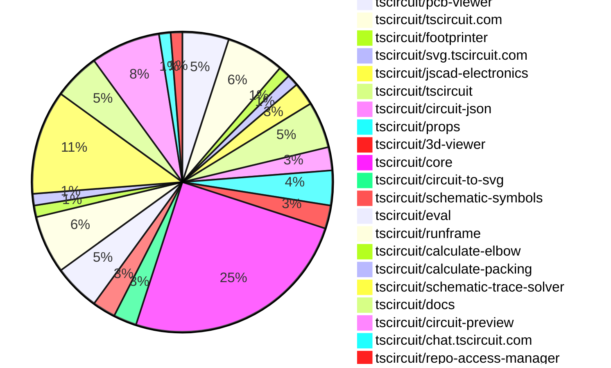
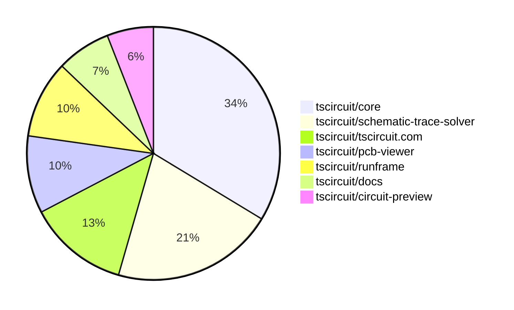

# Contribution Overview 2025-08-27

## PRs by Repository

## Contributor Overview

| Contributor | 🐳 Major | 🐙 Minor | 🐌 Tiny | ⭐ | Score | Discussion Contributions |
|-------------|---------|---------|---------|-----|----------------|--------------------------|
| [seveibar](#seveibar) | 7 | 7 | 15 | 👑 | 67 | 0🔹 0🔶 0💎 |
| [imrishabh18](#imrishabh18) | 3 | 4 | 14 | ⭐⭐⭐ | 33 | 0🔹 0🔶 0💎 |
| [abimaelmartell](#abimaelmartell) | 2 | 1 | 2 | ⭐⭐ | 12 | 0🔹 0🔶 0💎 |
| [ShiboSoftwareDev](#ShiboSoftwareDev) | 0 | 1 | 10 | ⭐⭐ | 12 | 0🔹 0🔶 0💎 |
| [ArnavK-09](#ArnavK-09) | 2 | 0 | 2 | ⭐ | 10 | 0🔹 0🔶 0💎 |
| [baeoc](#baeoc) | 0 | 3 | 0 | ⭐ | 8 | 0🔹 0🔶 0💎 |
| [techmannih](#techmannih) | 0 | 1 | 0 | ⭐ | 6 | 0🔹 0🔶 0💎 |
| [MustafaMulla29](#MustafaMulla29) | 0 | 0 | 3 | ⭐ | 4 | 0🔹 0🔶 0💎 |
| [tscircuitbot](#tscircuitbot) | 0 | 0 | 2 |  | 2 | 0🔹 0🔶 0💎 |
| [pxlpal](#pxlpal) | 0 | 1 | 0 |  | 2 | 0🔹 0🔶 0💎 |

### Discussion Contribution Legend

- 🔹 Normal Comments: Basic participation with minimal effort
- 🔶 Great Informative Comments: Thoughtful participation that adds value
- 💎 Incredible Comments: Exceptional participation with high-quality content

## Review Table

[reviews-received-hover]: ## "Number of reviews received for PRs for this contributor"
[approvals-received-hover]: ## "Number of approvals received for PRs this contributor authored"
[rejections-received-hover]: ## "Number of rejections received for PRs this contributor authored"
[prs-opened-hover]: ## "Number of PRs opened by this contributor"
[issues-created-hover]: ## "Number of issues created by this contributor"
[bountied-issues-hover]: ## "Number of issues this contributor created with a bounty"
[bountied-issue-$-hover]: ## "Total bounty amount placed on issues authored by this contributor"

| Contributor | Reviews Received | Approvals Received | Rejections Received | Approvals | Rejections | PRs Opened | PRs Merged | Score | Issues Created | Bountied Issues | Bountied Issue $ |
|---|---|---|---|---|---|---|---|---|---|---|---|
| [abimaelmartell](#abimaelmartell) | 7 | 5 | 0 | 0 | 0 | 6 | 5 | 12 | 0 | 0 | 0 |
| [seveibar](#seveibar) | 11 | 0 | 0 | 40 | 7 | 33 | 30 | 67 | 0 | 0 | 0 |
| [graphite-app[bot]](#graphite-app[bot]) | 0 | 0 | 0 | 0 | 0 | 0 | 0 | 0 | 0 | 0 | 0 |
| [ArnavK-09](#ArnavK-09) | 5 | 4 | 0 | 0 | 0 | 5 | 4 | 10 | 0 | 0 | 0 |
| [ShiboSoftwareDev](#ShiboSoftwareDev) | 25 | 15 | 0 | 0 | 0 | 13 | 11 | 12 | 0 | 0 | 0 |
| [imrishabh18](#imrishabh18) | 21 | 12 | 0 | 2 | 1 | 26 | 22 | 33 | 0 | 0 | 0 |
| [MustafaMulla29](#MustafaMulla29) | 7 | 3 | 1 | 0 | 0 | 5 | 3 | 4 | 0 | 0 | 0 |
| [chatgpt-codex-connector[bot]](#chatgpt-codex-connector[bot]) | 0 | 0 | 0 | 0 | 0 | 0 | 0 | 0 | 0 | 0 | 0 |
| [techmannih](#techmannih) | 3 | 0 | 1 | 2 | 0 | 3 | 1 | 6 | 0 | 0 | 0 |
| [AnasSarkiz](#AnasSarkiz) | 2 | 0 | 2 | 0 | 0 | 1 | 0 | 0 | 0 | 0 | 0 |
| [baeoc](#baeoc) | 16 | 5 | 4 | 0 | 0 | 6 | 3 | 8 | 0 | 0 | 0 |
| [Anshgrover23](#Anshgrover23) | 0 | 0 | 0 | 1 | 0 | 0 | 0 | 0 | 0 | 0 | 0 |
| [tscircuitbot](#tscircuitbot) | 0 | 0 | 0 | 0 | 0 | 37 | 2 | 2 | 0 | 0 | 0 |
| [pxlpal](#pxlpal) | 1 | 1 | 0 | 0 | 0 | 1 | 1 | 2 | 0 | 0 | 0 |

## Top 7 Repositories by Contribution Points

## Changes by Repository

### [tscircuit/pcb-viewer](https://github.com/tscircuit/pcb-viewer)

| PR # | Impact | Rating | Contributor | Description |
|------|--------|--------|-------------|-------------|
| [#356](https://github.com/tscircuit/pcb-viewer/pull/356) | 🐳 Major | ⭐⭐⭐ | abimaelmartell | Refactors the computation of circuitJsonKey in PCBViewer to use a new utility that generates a stable, content-based key from PCB element bounds and IDs, ensuring keys change only with meaningful PCB content changes. |
| [#360](https://github.com/tscircuit/pcb-viewer/pull/360) | 🐳 Major | ⭐⭐⭐ | ArnavK-09 | Integrates local storage functionality to persist PCB groups visibility settings across sessions. |

🐌 Tiny Contributions (2)

| PR # | Impact | Contributor | Description |
|------|--------|-------------|-------------|
| [#361](https://github.com/tscircuit/pcb-viewer/pull/361) | 🐌 Tiny | abimaelmartell | Removes the private field from package.json, allowing the package to be published. |
| [#359](https://github.com/tscircuit/pcb-viewer/pull/359) | 🐌 Tiny | ArnavK-09 | Sets the default visibility of PCB groups to true, correcting a previous misconfiguration that could confuse users expecting to see grouped PCB elements by default. |

### [tscircuit/tscircuit.com](https://github.com/tscircuit/tscircuit.com)

| PR # | Impact | Rating | Contributor | Description |
|------|--------|--------|-------------|-------------|
| [#1613](https://github.com/tscircuit/tscircuit.com/pull/1613) | 🐳 Major | ⭐⭐⭐ | abimaelmartell | Fetches schematic, PCB, and 3D images for package releases and displays them above the build overview. |
| [#1618](https://github.com/tscircuit/tscircuit.com/pull/1618) | 🐳 Major | ⭐⭐⭐ | imrishabh18 | Fixes regression where starring a package did not update the UI to reflect the change in star status. |
| [#1614](https://github.com/tscircuit/tscircuit.com/pull/1614) | 🐙 Minor | ⭐⭐ | abimaelmartell | Expose image generation build info in API and schema, show image generation logs on preview and build details pages, and test that package releases return image generation fields. |
| [#1620](https://github.com/tscircuit/tscircuit.com/pull/1620) | 🐙 Minor | ⭐⭐ | imrishabh18 | Fixes a bug where hooks were conditionally run, ensuring consistent behavior in the usePackageStarring hook. |

🐌 Tiny Contributions (1)

| PR # | Impact | Contributor | Description |
|------|--------|-------------|-------------|
| [#1616](https://github.com/tscircuit/tscircuit.com/pull/1616) | 🐌 Tiny | ArnavK-09 | Adjusts the background colors of images in the release detail page based on the view type (PCB or schematic). |

### [tscircuit/footprinter](https://github.com/tscircuit/footprinter)

🐌 Tiny Contributions (1)

| PR # | Impact | Contributor | Description |
|------|--------|-------------|-------------|
| [#365](https://github.com/tscircuit/footprinter/pull/365) | 🐌 Tiny | abimaelmartell | Fixes the alignment of m2host pads in the layout by adjusting their positioning based on layer type. |

### [tscircuit/svg.tscircuit.com](https://github.com/tscircuit/svg.tscircuit.com)

| PR # | Impact | Rating | Contributor | Description |
|------|--------|--------|-------------|-------------|
| [#290](https://github.com/tscircuit/svg.tscircuit.com/pull/290) | 🐳 Major | ⭐⭐⭐ | ArnavK-09 | Add background coloropacity and default zoom multiplier parameters to the 3D SVG conversion function to provide more control over the output visualization |

### [tscircuit/jscad-electronics](https://github.com/tscircuit/jscad-electronics)

| PR # | Impact | Rating | Contributor | Description |
|------|--------|--------|-------------|-------------|
| [#109](https://github.com/tscircuit/jscad-electronics/pull/109) | 🐙 Minor | ⭐⭐ | ShiboSoftwareDev | Removes the dependency on jscad-fiber by implementing createJSCADRenderer and convertCSGToThreeGeom functions directly. |

🐌 Tiny Contributions (1)

| PR # | Impact | Contributor | Description |
|------|--------|-------------|-------------|
| [#110](https://github.com/tscircuit/jscad-electronics/pull/110) | 🐌 Tiny | ShiboSoftwareDev | Makes jscad-fiber an optional peer dependency to prevent auto-installation when importing the vanilla version of jscad-electronics |

### [tscircuit/tscircuit](https://github.com/tscircuit/tscircuit)

🐌 Tiny Contributions (4)

| PR # | Impact | Contributor | Description |
|------|--------|-------------|-------------|
| [#747](https://github.com/tscircuit/tscircuit/pull/747) | 🐌 Tiny | ShiboSoftwareDev | Removes the jscad-fiber dependency and updates the tscircuiteval package version from 0.0.293 to 0.0.294. |
| [#746](https://github.com/tscircuit/tscircuit/pull/746) | 🐌 Tiny | seveibar | Updates several major package dependencies and adds the connectivity-map package for enhanced connectivity features. |
| [#745](https://github.com/tscircuit/tscircuit/pull/745) | 🐌 Tiny | imrishabh18 | Updates the version of the tscircuitcore dependency from 0.0.651 to 0.0.659 in package.json |
| [#744](https://github.com/tscircuit/tscircuit/pull/744) | 🐌 Tiny | MustafaMulla29 | Updates the core and eval packages to newer versions and removes the schematic-corpus dependency from the project. |

### [tscircuit/circuit-json](https://github.com/tscircuit/circuit-json)

🐌 Tiny Contributions (2)

| PR # | Impact | Contributor | Description |
|------|--------|-------------|-------------|
| [#258](https://github.com/tscircuit/circuit-json/pull/258) | 🐌 Tiny | ShiboSoftwareDev | Adds a duty cycle parameter to the AC voltage source simulation, allowing users to specify the duty cycle as a percentage or decimal value. |
| [#259](https://github.com/tscircuit/circuit-json/pull/259) | 🐌 Tiny | seveibar | Add source_pin_missing_trace_warning schema for detecting unconnected component pins and export new warning type with documentation in README. |

### [tscircuit/props](https://github.com/tscircuit/props)

🐌 Tiny Contributions (3)

| PR # | Impact | Contributor | Description |
|------|--------|-------------|-------------|
| [#361](https://github.com/tscircuit/props/pull/361) | 🐌 Tiny | ShiboSoftwareDev | Adds a duty cycle property to the VoltageSource component, allowing users to specify the duty cycle as a percentage or a decimal value. |
| [#363](https://github.com/tscircuit/props/pull/363) | 🐌 Tiny | seveibar | Allows pinLabels on PinHeader to accept a record of labels or an array, adds tests for this functionality, and updates documentation accordingly. |
| [#362](https://github.com/tscircuit/props/pull/362) | 🐌 Tiny | seveibar | Adds an optional schMaxTraceDistance property to SubcircuitGroupProps, documents the new property, regenerates props references, and tests parsing of schMaxTraceDistance. |

### [tscircuit/3d-viewer](https://github.com/tscircuit/3d-viewer)

🐌 Tiny Contributions (2)

| PR # | Impact | Contributor | Description |
|------|--------|-------------|-------------|
| [#423](https://github.com/tscircuit/3d-viewer/pull/423) | 🐌 Tiny | ShiboSoftwareDev | Changes the way manifold-3d is imported by loading it from a CDN instead of bundling the WASM file, which optimizes the build process and reduces bundle size. |
| [#426](https://github.com/tscircuit/3d-viewer/pull/426) | 🐌 Tiny | imrishabh18 | Adds support for the circular_hole_with_rect_pad shape in the manifold processing, allowing for the creation of circular holes with rectangular pads in PCB designs. |

### [tscircuit/core](https://github.com/tscircuit/core)

| PR # | Impact | Rating | Contributor | Description |
|------|--------|--------|-------------|-------------|
| [#1198](https://github.com/tscircuit/core/pull/1198) | 🐳 Major | ⭐⭐⭐ | seveibar | Fixes net label rendering issue where labels are not drawn if theres a trace but no source net or assigned display name. |
| [#1194](https://github.com/tscircuit/core/pull/1194) | 🐳 Major | ⭐⭐⭐ | seveibar | Removes duplicate netlabels from the schematic display to prevent rendering issues and improve clarity in schematic representations. |
| [#1209](https://github.com/tscircuit/core/pull/1209) | 🐙 Minor | ⭐⭐ | seveibar | Adds reproduction of the 555 timer chip and fixes PCB packing to prevent components from being packed inside each other. |
| [#1199](https://github.com/tscircuit/core/pull/1199) | 🐙 Minor | ⭐⭐ | seveibar | Fixes MSP overreach by adjusting maxMspPairDistance and refactoring transistor tests for better coverage and accuracy. |
| [#1196](https://github.com/tscircuit/core/pull/1196) | 🐙 Minor | ⭐⭐ | seveibar | Fixes missing net label placements in schematic rendering when using the match-adapt feature. |
| [#1192](https://github.com/tscircuit/core/pull/1192) | 🐙 Minor | ⭐⭐ | seveibar | Fixes missing net label placements in the MSP schematic trace routing, addressing a regression issue. |
| [#1189](https://github.com/tscircuit/core/pull/1189) | 🐙 Minor | ⭐⭐ | seveibar | Fixes regression in schematic trace routing that caused failures in rendering net labels for jumper connections in specific scenarios. |
| [#1179](https://github.com/tscircuit/core/pull/1179) | 🐙 Minor | ⭐⭐ | imrishabh18 | Fixes the issue where connections are incorrectly assigned when multiple chips are present without names, defaulting to the first chips connection. |
| [#1169](https://github.com/tscircuit/core/pull/1169) | 🐙 Minor | ⭐⭐ | imrishabh18 | Fixes rendering issues in the Chip component when invalid pin labels are provided, allowing valid labels to render while excluding invalid ones with warnings. |
| [#1193](https://github.com/tscircuit/core/pull/1193) | 🐙 Minor | ⭐⭐ | baeoc | Fixes incorrect mapping of the emitter pin to the collector pin for NPN transistors in the Transistor component. |

🐌 Tiny Contributions (10)

| PR # | Impact | Contributor | Description |
|------|--------|-------------|-------------|
| [#1212](https://github.com/tscircuit/core/pull/1212) | 🐌 Tiny | ShiboSoftwareDev | Adds functionality to the voltagesource component to generate square wave signals, including a duty cycle parameter, and updates schematic symbols accordingly. |
| [#1211](https://github.com/tscircuit/core/pull/1211) | 🐌 Tiny | seveibar | Allows PinHeader to compute pin count from record pin labels and adds tests for record-style pinLabels. |
| [#1210](https://github.com/tscircuit/core/pull/1210) | 🐌 Tiny | seveibar | Adds warnings for unconnected required pins in circuit designs, enhancing error detection for users. |
| [#1200](https://github.com/tscircuit/core/pull/1200) | 🐌 Tiny | seveibar | Enables the MSP schematic trace routing feature in the circuit simulation environment. |
| [#1216](https://github.com/tscircuit/core/pull/1216) | 🐌 Tiny | imrishabh18 | Adds default behavior for pcb packing when multiple direct children are present without explicit PCB coordinates. |
| [#1208](https://github.com/tscircuit/core/pull/1208) | 🐌 Tiny | imrishabh18 | Adds the source_trace_not_connected_error to circuit-json to handle cases where traces are not connected to ports properly. |
| [#1207](https://github.com/tscircuit/core/pull/1207) | 🐌 Tiny | imrishabh18 | Fixes the PCB layout behavior to ensure that explicit positions set on components (pcbX and pcbY) take precedence over the automatic flex layout. |
| [#1183](https://github.com/tscircuit/core/pull/1183) | 🐌 Tiny | imrishabh18 | Fixes the tree construction and child ordering for groups with pcbFlex by utilizing group.child, ensuring proper layout and positioning of components on the PCB. |
| [#1191](https://github.com/tscircuit/core/pull/1191) | 🐌 Tiny | imrishabh18 | Fixes failing test error in GitHub CI action by correcting import paths for component hooks. |
| [#1190](https://github.com/tscircuit/core/pull/1190) | 🐌 Tiny | MustafaMulla29 | Removes the schematic-corpus and related code from the project, impacting how schematics are handled and represented. |

### [tscircuit/circuit-to-svg](https://github.com/tscircuit/circuit-to-svg)

| PR # | Impact | Rating | Contributor | Description |
|------|--------|--------|-------------|-------------|
| [#298](https://github.com/tscircuit/circuit-to-svg/pull/298) | 🐙 Minor | ⭐⭐ | baeoc | Draws reference designators on schematic above schematic traces for improved visibility. |

🐌 Tiny Contributions (1)

| PR # | Impact | Contributor | Description |
|------|--------|-------------|-------------|
| [#299](https://github.com/tscircuit/circuit-to-svg/pull/299) | 🐌 Tiny | ShiboSoftwareDev | Updates the tscircuit dependency to remove jscad-fiber as a nested dependency. |

### [tscircuit/schematic-symbols](https://github.com/tscircuit/schematic-symbols)

| PR # | Impact | Rating | Contributor | Description |
|------|--------|--------|-------------|-------------|
| [#357](https://github.com/tscircuit/schematic-symbols/pull/357) | 🐙 Minor | ⭐⭐ | techmannih | Fixes pin numbering to follow the counter-clockwise convention for the opamp with power symbol. |

🐌 Tiny Contributions (1)

| PR # | Impact | Contributor | Description |
|------|--------|-------------|-------------|
| [#354](https://github.com/tscircuit/schematic-symbols/pull/354) | 🐌 Tiny | ShiboSoftwareDev | Adds a new schematic symbol for a square wave generator, completing the boost converter component set. |

### [tscircuit/eval](https://github.com/tscircuit/eval)

🐌 Tiny Contributions (4)

| PR # | Impact | Contributor | Description |
|------|--------|-------------|-------------|
| [#917](https://github.com/tscircuit/eval/pull/917) | 🐌 Tiny | ShiboSoftwareDev | removes jscad-fiber from dependencies and execution context |
| [#887](https://github.com/tscircuit/eval/pull/887) | 🐌 Tiny | MustafaMulla29 | Updates the core library version, installs the schematic-trace-solver package, and removes the schematic-corpus dependency from the project. |
| [#908](https://github.com/tscircuit/eval/pull/908) | 🐌 Tiny | tscircuitbot | Automated update of tscircuitcore to v0.0.661. |
| [#907](https://github.com/tscircuit/eval/pull/907) | 🐌 Tiny | tscircuitbot | Automated update of tscircuitcore to v0.0.660. |

### [tscircuit/runframe](https://github.com/tscircuit/runframe)

| PR # | Impact | Rating | Contributor | Description |
|------|--------|--------|-------------|-------------|
| [#1043](https://github.com/tscircuit/runframe/pull/1043) | 🐳 Major | ⭐⭐⭐ | imrishabh18 | Enables file downloads in a new tab when the application is running inside an iframe sandbox, improving usability for JSON and ZIP file downloads. |
| [#1037](https://github.com/tscircuit/runframe/pull/1037) | 🐙 Minor | ⭐⭐ | imrishabh18 | Fixes an issue where circuit JSON was incorrectly fetched from runframeStore when in a standalone bundle context. |
| [#1033](https://github.com/tscircuit/runframe/pull/1033) | 🐙 Minor | ⭐⭐ | pxlpal | Refactors the ImportComponentDialog to handle component importing and toast messaging internally, allowing for custom headers to be passed to JLCPCB proxy requests and simplifying the usage of ImportComponentDialog in FileMenuLeftHeader. |

🐌 Tiny Contributions (2)

| PR # | Impact | Contributor | Description |
|------|--------|-------------|-------------|
| [#1032](https://github.com/tscircuit/runframe/pull/1032) | 🐌 Tiny | ShiboSoftwareDev | This pull request updates the project to use React version 19, which includes various improvements and new features. |
| [#1040](https://github.com/tscircuit/runframe/pull/1040) | 🐌 Tiny | imrishabh18 | Provides a fallback mechanism for circuitJson when storeCircuitJson is not available, ensuring that props.circuitJson is used instead. |

### [tscircuit/calculate-elbow](https://github.com/tscircuit/calculate-elbow)

| PR # | Impact | Rating | Contributor | Description |
|------|--------|--------|-------------|-------------|
| [#11](https://github.com/tscircuit/calculate-elbow/pull/11) | 🐳 Major | ⭐⭐⭐ | seveibar | Fixes small floating point errors causing incorrect path construction in elbow calculations |

### [tscircuit/calculate-packing](https://github.com/tscircuit/calculate-packing)

| PR # | Impact | Rating | Contributor | Description |
|------|--------|--------|-------------|-------------|
| [#29](https://github.com/tscircuit/calculate-packing/pull/29) | 🐳 Major | ⭐⭐⭐ | seveibar | This pull request introduces a new feature that adds a center pad to components, which helps prevent them from packing inside other components. This is achieved by modifying the buildPackedComponent function to include an optional parameter shouldAddInnerObstacles. If this parameter is set to true, an inner pad is created based on the components bounds, which is then added to the list of pads for that component. This change is expected to improve the layout and organization of components in the circuit design. |

### [tscircuit/schematic-trace-solver](https://github.com/tscircuit/schematic-trace-solver)

| PR # | Impact | Rating | Contributor | Description |
|------|--------|--------|-------------|-------------|
| [#22](https://github.com/tscircuit/schematic-trace-solver/pull/22) | 🐳 Major | ⭐⭐⭐ | seveibar | Fixes the issue where diagonal traces appear in the schematic trace solver, ensuring that only orthogonal paths are generated. |
| [#17](https://github.com/tscircuit/schematic-trace-solver/pull/17) | 🐳 Major | ⭐⭐⭐ | seveibar | Orders single-line solver candidate paths by path length so shorter traces are tried first and tests that the solver selects the shortest available candidate path. |
| [#16](https://github.com/tscircuit/schematic-trace-solver/pull/16) | 🐳 Major | ⭐⭐⭐ | seveibar | Adds a PasteInput page, introduces download functionality for page.tsx and test.ts files, and fixes floating point issues in calculate elbow for near-axis aligned traces. |
| [#15](https://github.com/tscircuit/schematic-trace-solver/pull/15) | 🐙 Minor | ⭐⭐ | seveibar | Adds netId, mspConnectionPairIds, and pinIds to the NetLabelPlacement interface to enhance net label placement functionality. |
| [#13](https://github.com/tscircuit/schematic-trace-solver/pull/13) | 🐙 Minor | ⭐⭐ | seveibar | Fixes MSP connection pair solver to return all pairs and adds logging for better debugging. |
| [#21](https://github.com/tscircuit/schematic-trace-solver/pull/21) | 🐙 Minor | ⭐⭐ | baeoc | Fixes missing net label for trace group island in Example07 |

🐌 Tiny Contributions (3)

| PR # | Impact | Contributor | Description |
|------|--------|-------------|-------------|
| [#24](https://github.com/tscircuit/schematic-trace-solver/pull/24) | 🐌 Tiny | seveibar | Fixes the issue of MSP connection pairs being created over too long of a distance by enforcing a maximum Manhattan distance between pins. |
| [#18](https://github.com/tscircuit/schematic-trace-solver/pull/18) | 🐌 Tiny | seveibar | Adds a reproduction example for a missing net label issue in the schematic trace solver. |
| [#14](https://github.com/tscircuit/schematic-trace-solver/pull/14) | 🐌 Tiny | seveibar | Adds pinIds to the SolvedTracePath interface to enhance trace path identification in schematic solving. |

### [tscircuit/docs](https://github.com/tscircuit/docs)

| PR # | Impact | Rating | Contributor | Description |
|------|--------|--------|-------------|-------------|
| [#115](https://github.com/tscircuit/docs/pull/115) | 🐳 Major | ⭐⭐⭐ | imrishabh18 | Adds a guide for using tscircuit with ChatGPT, including code snippets and instructions for rendering circuits in the ChatGPT Canvas. |

🐌 Tiny Contributions (3)

| PR # | Impact | Contributor | Description |
|------|--------|-------------|-------------|
| [#117](https://github.com/tscircuit/docs/pull/117) | 🐌 Tiny | seveibar | Updates the ChatGPT instructions to remove the use of babel and provides detailed context for using tscircuit effectively within ChatGPT. |
| [#116](https://github.com/tscircuit/docs/pull/116) | 🐌 Tiny | seveibar | Removes references to the matchAdapt algorithm from the automatic schematic layout guide and describes layout using a pattern matching and packing algorithm instead. |
| [#118](https://github.com/tscircuit/docs/pull/118) | 🐌 Tiny | imrishabh18 | Moves the ChatGPT usage guide to the quickstart section for better accessibility and organization. |

### [tscircuit/circuit-preview](https://github.com/tscircuit/circuit-preview)

🐌 Tiny Contributions (6)

| PR # | Impact | Contributor | Description |
|------|--------|-------------|-------------|
| [#10](https://github.com/tscircuit/circuit-preview/pull/10) | 🐌 Tiny | seveibar | Refactors the CircuitPreview component to accept a circuitReactElement prop instead of a circuit prop, improving the components clarity and usage. |
| [#9](https://github.com/tscircuit/circuit-preview/pull/9) | 🐌 Tiny | seveibar | Adds TODO comments and emits warnings for circuit issues to assist in debugging and correction by ChatGPT. |
| [#8](https://github.com/tscircuit/circuit-preview/pull/8) | 🐌 Tiny | seveibar | Adds Babel standalone to the project, allowing users to remove it from the setup instructions. |
| [#12](https://github.com/tscircuit/circuit-preview/pull/12) | 🐌 Tiny | imrishabh18 | Updates the tscircuitrunframe dependency to version 0.0.844 in package.json |
| [#11](https://github.com/tscircuit/circuit-preview/pull/11) | 🐌 Tiny | imrishabh18 | Updates the tscircuitrunframe dependency version from 0.0.835 to 0.0.841 in package.json |
| [#7](https://github.com/tscircuit/circuit-preview/pull/7) | 🐌 Tiny | imrishabh18 | Adds configuration for Cosmos to enable preview functionality during deployment. |

### [tscircuit/chat.tscircuit.com](https://github.com/tscircuit/chat.tscircuit.com)

🐌 Tiny Contributions (1)

| PR # | Impact | Contributor | Description |
|------|--------|-------------|-------------|
| [#34](https://github.com/tscircuit/chat.tscircuit.com/pull/34) | 🐌 Tiny | imrishabh18 | Add the option for 555 timer as one of the suggested actions |

### [tscircuit/repo-access-manager](https://github.com/tscircuit/repo-access-manager)

🐌 Tiny Contributions (1)

| PR # | Impact | Contributor | Description |
|------|--------|-------------|-------------|
| [#3](https://github.com/tscircuit/repo-access-manager/pull/3) | 🐌 Tiny | imrishabh18 | Refactors the repository access management by consolidating multiple YAML files into a single repositories.yml file for easier management of repository permissions. |

## Changes by Contributor

### [abimaelmartell](https://github.com/abimaelmartell)

| PRs # | Impact | Rating | Description |
|------|--------|--------|-------------|
| [#356](https://github.com/tscircuit/pcb-viewer/pull/356) | 🐳 Major | ⭐⭐⭐ | Refactors the computation of circuitJsonKey in PCBViewer to use a new utility that generates a stable, content-based key from PCB element bounds and IDs, ensuring keys change only with meaningful PCB content changes. |
| [#1613](https://github.com/tscircuit/tscircuit.com/pull/1613) | 🐳 Major | ⭐⭐⭐ | Fetches schematic, PCB, and 3D images for package releases and displays them above the build overview. |
| [#1614](https://github.com/tscircuit/tscircuit.com/pull/1614) | 🐙 Minor | ⭐⭐ | Expose image generation build info in API and schema, show image generation logs on preview and build details pages, and test that package releases return image generation fields. |

🐌 Tiny Contributions (2)

| PR # | Impact | Description |
|------|--------|-------------|
| [#361](https://github.com/tscircuit/pcb-viewer/pull/361) | 🐌 Tiny | Removes the private field from package.json, allowing the package to be published. |
| [#365](https://github.com/tscircuit/footprinter/pull/365) | 🐌 Tiny | Fixes the alignment of m2host pads in the layout by adjusting their positioning based on layer type. |

### [ArnavK-09](https://github.com/ArnavK-09)

| PRs # | Impact | Rating | Description |
|------|--------|--------|-------------|
| [#360](https://github.com/tscircuit/pcb-viewer/pull/360) | 🐳 Major | ⭐⭐⭐ | Integrates local storage functionality to persist PCB groups visibility settings across sessions. |
| [#290](https://github.com/tscircuit/svg.tscircuit.com/pull/290) | 🐳 Major | ⭐⭐⭐ | Add background coloropacity and default zoom multiplier parameters to the 3D SVG conversion function to provide more control over the output visualization |

🐌 Tiny Contributions (2)

| PR # | Impact | Description |
|------|--------|-------------|
| [#359](https://github.com/tscircuit/pcb-viewer/pull/359) | 🐌 Tiny | Sets the default visibility of PCB groups to true, correcting a previous misconfiguration that could confuse users expecting to see grouped PCB elements by default. |
| [#1616](https://github.com/tscircuit/tscircuit.com/pull/1616) | 🐌 Tiny | Adjusts the background colors of images in the release detail page based on the view type (PCB or schematic). |

### [ShiboSoftwareDev](https://github.com/ShiboSoftwareDev)

| PRs # | Impact | Rating | Description |
|------|--------|--------|-------------|
| [#109](https://github.com/tscircuit/jscad-electronics/pull/109) | 🐙 Minor | ⭐⭐ | Removes the dependency on jscad-fiber by implementing createJSCADRenderer and convertCSGToThreeGeom functions directly. |

🐌 Tiny Contributions (10)

| PR # | Impact | Description |
|------|--------|-------------|
| [#747](https://github.com/tscircuit/tscircuit/pull/747) | 🐌 Tiny | Removes the jscad-fiber dependency and updates the tscircuiteval package version from 0.0.293 to 0.0.294. |
| [#258](https://github.com/tscircuit/circuit-json/pull/258) | 🐌 Tiny | Adds a duty cycle parameter to the AC voltage source simulation, allowing users to specify the duty cycle as a percentage or decimal value. |
| [#361](https://github.com/tscircuit/props/pull/361) | 🐌 Tiny | Adds a duty cycle property to the VoltageSource component, allowing users to specify the duty cycle as a percentage or a decimal value. |
| [#423](https://github.com/tscircuit/3d-viewer/pull/423) | 🐌 Tiny | Changes the way manifold-3d is imported by loading it from a CDN instead of bundling the WASM file, which optimizes the build process and reduces bundle size. |
| [#1212](https://github.com/tscircuit/core/pull/1212) | 🐌 Tiny | Adds functionality to the voltagesource component to generate square wave signals, including a duty cycle parameter, and updates schematic symbols accordingly. |
| [#110](https://github.com/tscircuit/jscad-electronics/pull/110) | 🐌 Tiny | Makes jscad-fiber an optional peer dependency to prevent auto-installation when importing the vanilla version of jscad-electronics |
| [#299](https://github.com/tscircuit/circuit-to-svg/pull/299) | 🐌 Tiny | Updates the tscircuit dependency to remove jscad-fiber as a nested dependency. |
| [#354](https://github.com/tscircuit/schematic-symbols/pull/354) | 🐌 Tiny | Adds a new schematic symbol for a square wave generator, completing the boost converter component set. |
| [#917](https://github.com/tscircuit/eval/pull/917) | 🐌 Tiny | removes jscad-fiber from dependencies and execution context |
| [#1032](https://github.com/tscircuit/runframe/pull/1032) | 🐌 Tiny | This pull request updates the project to use React version 19, which includes various improvements and new features. |

### [seveibar](https://github.com/seveibar)

| PRs # | Impact | Rating | Description |
|------|--------|--------|-------------|
| [#1198](https://github.com/tscircuit/core/pull/1198) | 🐳 Major | ⭐⭐⭐ | Fixes net label rendering issue where labels are not drawn if theres a trace but no source net or assigned display name. |
| [#1194](https://github.com/tscircuit/core/pull/1194) | 🐳 Major | ⭐⭐⭐ | Removes duplicate netlabels from the schematic display to prevent rendering issues and improve clarity in schematic representations. |
| [#11](https://github.com/tscircuit/calculate-elbow/pull/11) | 🐳 Major | ⭐⭐⭐ | Fixes small floating point errors causing incorrect path construction in elbow calculations |
| [#29](https://github.com/tscircuit/calculate-packing/pull/29) | 🐳 Major | ⭐⭐⭐ | This pull request introduces a new feature that adds a center pad to components, which helps prevent them from packing inside other components. This is achieved by modifying the buildPackedComponent function to include an optional parameter shouldAddInnerObstacles. If this parameter is set to true, an inner pad is created based on the components bounds, which is then added to the list of pads for that component. This change is expected to improve the layout and organization of components in the circuit design. |
| [#22](https://github.com/tscircuit/schematic-trace-solver/pull/22) | 🐳 Major | ⭐⭐⭐ | Fixes the issue where diagonal traces appear in the schematic trace solver, ensuring that only orthogonal paths are generated. |
| [#17](https://github.com/tscircuit/schematic-trace-solver/pull/17) | 🐳 Major | ⭐⭐⭐ | Orders single-line solver candidate paths by path length so shorter traces are tried first and tests that the solver selects the shortest available candidate path. |
| [#16](https://github.com/tscircuit/schematic-trace-solver/pull/16) | 🐳 Major | ⭐⭐⭐ | Adds a PasteInput page, introduces download functionality for page.tsx and test.ts files, and fixes floating point issues in calculate elbow for near-axis aligned traces. |
| [#1209](https://github.com/tscircuit/core/pull/1209) | 🐙 Minor | ⭐⭐ | Adds reproduction of the 555 timer chip and fixes PCB packing to prevent components from being packed inside each other. |
| [#1199](https://github.com/tscircuit/core/pull/1199) | 🐙 Minor | ⭐⭐ | Fixes MSP overreach by adjusting maxMspPairDistance and refactoring transistor tests for better coverage and accuracy. |
| [#1196](https://github.com/tscircuit/core/pull/1196) | 🐙 Minor | ⭐⭐ | Fixes missing net label placements in schematic rendering when using the match-adapt feature. |
| [#1192](https://github.com/tscircuit/core/pull/1192) | 🐙 Minor | ⭐⭐ | Fixes missing net label placements in the MSP schematic trace routing, addressing a regression issue. |
| [#1189](https://github.com/tscircuit/core/pull/1189) | 🐙 Minor | ⭐⭐ | Fixes regression in schematic trace routing that caused failures in rendering net labels for jumper connections in specific scenarios. |
| [#15](https://github.com/tscircuit/schematic-trace-solver/pull/15) | 🐙 Minor | ⭐⭐ | Adds netId, mspConnectionPairIds, and pinIds to the NetLabelPlacement interface to enhance net label placement functionality. |
| [#13](https://github.com/tscircuit/schematic-trace-solver/pull/13) | 🐙 Minor | ⭐⭐ | Fixes MSP connection pair solver to return all pairs and adds logging for better debugging. |

🐌 Tiny Contributions (15)

| PR # | Impact | Description |
|------|--------|-------------|
| [#746](https://github.com/tscircuit/tscircuit/pull/746) | 🐌 Tiny | Updates several major package dependencies and adds the connectivity-map package for enhanced connectivity features. |
| [#259](https://github.com/tscircuit/circuit-json/pull/259) | 🐌 Tiny | Add source_pin_missing_trace_warning schema for detecting unconnected component pins and export new warning type with documentation in README. |
| [#363](https://github.com/tscircuit/props/pull/363) | 🐌 Tiny | Allows pinLabels on PinHeader to accept a record of labels or an array, adds tests for this functionality, and updates documentation accordingly. |
| [#362](https://github.com/tscircuit/props/pull/362) | 🐌 Tiny | Adds an optional schMaxTraceDistance property to SubcircuitGroupProps, documents the new property, regenerates props references, and tests parsing of schMaxTraceDistance. |
| [#1211](https://github.com/tscircuit/core/pull/1211) | 🐌 Tiny | Allows PinHeader to compute pin count from record pin labels and adds tests for record-style pinLabels. |
| [#1210](https://github.com/tscircuit/core/pull/1210) | 🐌 Tiny | Adds warnings for unconnected required pins in circuit designs, enhancing error detection for users. |
| [#1200](https://github.com/tscircuit/core/pull/1200) | 🐌 Tiny | Enables the MSP schematic trace routing feature in the circuit simulation environment. |
| [#117](https://github.com/tscircuit/docs/pull/117) | 🐌 Tiny | Updates the ChatGPT instructions to remove the use of babel and provides detailed context for using tscircuit effectively within ChatGPT. |
| [#116](https://github.com/tscircuit/docs/pull/116) | 🐌 Tiny | Removes references to the matchAdapt algorithm from the automatic schematic layout guide and describes layout using a pattern matching and packing algorithm instead. |
| [#24](https://github.com/tscircuit/schematic-trace-solver/pull/24) | 🐌 Tiny | Fixes the issue of MSP connection pairs being created over too long of a distance by enforcing a maximum Manhattan distance between pins. |
| [#18](https://github.com/tscircuit/schematic-trace-solver/pull/18) | 🐌 Tiny | Adds a reproduction example for a missing net label issue in the schematic trace solver. |
| [#14](https://github.com/tscircuit/schematic-trace-solver/pull/14) | 🐌 Tiny | Adds pinIds to the SolvedTracePath interface to enhance trace path identification in schematic solving. |
| [#10](https://github.com/tscircuit/circuit-preview/pull/10) | 🐌 Tiny | Refactors the CircuitPreview component to accept a circuitReactElement prop instead of a circuit prop, improving the components clarity and usage. |
| [#9](https://github.com/tscircuit/circuit-preview/pull/9) | 🐌 Tiny | Adds TODO comments and emits warnings for circuit issues to assist in debugging and correction by ChatGPT. |
| [#8](https://github.com/tscircuit/circuit-preview/pull/8) | 🐌 Tiny | Adds Babel standalone to the project, allowing users to remove it from the setup instructions. |

### [imrishabh18](https://github.com/imrishabh18)

| PRs # | Impact | Rating | Description |
|------|--------|--------|-------------|
| [#1618](https://github.com/tscircuit/tscircuit.com/pull/1618) | 🐳 Major | ⭐⭐⭐ | Fixes regression where starring a package did not update the UI to reflect the change in star status. |
| [#1043](https://github.com/tscircuit/runframe/pull/1043) | 🐳 Major | ⭐⭐⭐ | Enables file downloads in a new tab when the application is running inside an iframe sandbox, improving usability for JSON and ZIP file downloads. |
| [#115](https://github.com/tscircuit/docs/pull/115) | 🐳 Major | ⭐⭐⭐ | Adds a guide for using tscircuit with ChatGPT, including code snippets and instructions for rendering circuits in the ChatGPT Canvas. |
| [#1179](https://github.com/tscircuit/core/pull/1179) | 🐙 Minor | ⭐⭐ | Fixes the issue where connections are incorrectly assigned when multiple chips are present without names, defaulting to the first chips connection. |
| [#1169](https://github.com/tscircuit/core/pull/1169) | 🐙 Minor | ⭐⭐ | Fixes rendering issues in the Chip component when invalid pin labels are provided, allowing valid labels to render while excluding invalid ones with warnings. |
| [#1620](https://github.com/tscircuit/tscircuit.com/pull/1620) | 🐙 Minor | ⭐⭐ | Fixes a bug where hooks were conditionally run, ensuring consistent behavior in the usePackageStarring hook. |
| [#1037](https://github.com/tscircuit/runframe/pull/1037) | 🐙 Minor | ⭐⭐ | Fixes an issue where circuit JSON was incorrectly fetched from runframeStore when in a standalone bundle context. |

🐌 Tiny Contributions (14)

| PR # | Impact | Description |
|------|--------|-------------|
| [#745](https://github.com/tscircuit/tscircuit/pull/745) | 🐌 Tiny | Updates the version of the tscircuitcore dependency from 0.0.651 to 0.0.659 in package.json |
| [#426](https://github.com/tscircuit/3d-viewer/pull/426) | 🐌 Tiny | Adds support for the circular_hole_with_rect_pad shape in the manifold processing, allowing for the creation of circular holes with rectangular pads in PCB designs. |
| [#1216](https://github.com/tscircuit/core/pull/1216) | 🐌 Tiny | Adds default behavior for pcb packing when multiple direct children are present without explicit PCB coordinates. |
| [#1208](https://github.com/tscircuit/core/pull/1208) | 🐌 Tiny | Adds the source_trace_not_connected_error to circuit-json to handle cases where traces are not connected to ports properly. |
| [#1207](https://github.com/tscircuit/core/pull/1207) | 🐌 Tiny | Fixes the PCB layout behavior to ensure that explicit positions set on components (pcbX and pcbY) take precedence over the automatic flex layout. |
| [#1183](https://github.com/tscircuit/core/pull/1183) | 🐌 Tiny | Fixes the tree construction and child ordering for groups with pcbFlex by utilizing group.child, ensuring proper layout and positioning of components on the PCB. |
| [#1191](https://github.com/tscircuit/core/pull/1191) | 🐌 Tiny | Fixes failing test error in GitHub CI action by correcting import paths for component hooks. |
| [#1040](https://github.com/tscircuit/runframe/pull/1040) | 🐌 Tiny | Provides a fallback mechanism for circuitJson when storeCircuitJson is not available, ensuring that props.circuitJson is used instead. |
| [#118](https://github.com/tscircuit/docs/pull/118) | 🐌 Tiny | Moves the ChatGPT usage guide to the quickstart section for better accessibility and organization. |
| [#34](https://github.com/tscircuit/chat.tscircuit.com/pull/34) | 🐌 Tiny | Add the option for 555 timer as one of the suggested actions |
| [#3](https://github.com/tscircuit/repo-access-manager/pull/3) | 🐌 Tiny | Refactors the repository access management by consolidating multiple YAML files into a single repositories.yml file for easier management of repository permissions. |
| [#12](https://github.com/tscircuit/circuit-preview/pull/12) | 🐌 Tiny | Updates the tscircuitrunframe dependency to version 0.0.844 in package.json |
| [#11](https://github.com/tscircuit/circuit-preview/pull/11) | 🐌 Tiny | Updates the tscircuitrunframe dependency version from 0.0.835 to 0.0.841 in package.json |
| [#7](https://github.com/tscircuit/circuit-preview/pull/7) | 🐌 Tiny | Adds configuration for Cosmos to enable preview functionality during deployment. |

### [MustafaMulla29](https://github.com/MustafaMulla29)

🐌 Tiny Contributions (3)

| PR # | Impact | Description |
|------|--------|-------------|
| [#744](https://github.com/tscircuit/tscircuit/pull/744) | 🐌 Tiny | Updates the core and eval packages to newer versions and removes the schematic-corpus dependency from the project. |
| [#1190](https://github.com/tscircuit/core/pull/1190) | 🐌 Tiny | Removes the schematic-corpus and related code from the project, impacting how schematics are handled and represented. |
| [#887](https://github.com/tscircuit/eval/pull/887) | 🐌 Tiny | Updates the core library version, installs the schematic-trace-solver package, and removes the schematic-corpus dependency from the project. |

### [baeoc](https://github.com/baeoc)

| PRs # | Impact | Rating | Description |
|------|--------|--------|-------------|
| [#1193](https://github.com/tscircuit/core/pull/1193) | 🐙 Minor | ⭐⭐ | Fixes incorrect mapping of the emitter pin to the collector pin for NPN transistors in the Transistor component. |
| [#298](https://github.com/tscircuit/circuit-to-svg/pull/298) | 🐙 Minor | ⭐⭐ | Draws reference designators on schematic above schematic traces for improved visibility. |
| [#21](https://github.com/tscircuit/schematic-trace-solver/pull/21) | 🐙 Minor | ⭐⭐ | Fixes missing net label for trace group island in Example07 |

### [techmannih](https://github.com/techmannih)

| PRs # | Impact | Rating | Description |
|------|--------|--------|-------------|
| [#357](https://github.com/tscircuit/schematic-symbols/pull/357) | 🐙 Minor | ⭐⭐ | Fixes pin numbering to follow the counter-clockwise convention for the opamp with power symbol. |

### [tscircuitbot](https://github.com/tscircuitbot)

🐌 Tiny Contributions (2)

| PR # | Impact | Description |
|------|--------|-------------|
| [#908](https://github.com/tscircuit/eval/pull/908) | 🐌 Tiny | Automated update of tscircuitcore to v0.0.661. |
| [#907](https://github.com/tscircuit/eval/pull/907) | 🐌 Tiny | Automated update of tscircuitcore to v0.0.660. |

### [pxlpal](https://github.com/pxlpal)

| PRs # | Impact | Rating | Description |
|------|--------|--------|-------------|
| [#1033](https://github.com/tscircuit/runframe/pull/1033) | 🐙 Minor | ⭐⭐ | Refactors the ImportComponentDialog to handle component importing and toast messaging internally, allowing for custom headers to be passed to JLCPCB proxy requests and simplifying the usage of ImportComponentDialog in FileMenuLeftHeader. |

## Repository Owners

| Repository | Codeowners |
|------------|------------|
| [builder](https://github.com/tscircuit/builder/blob/main/.github/CODEOWNERS) | [seveibar](https://github.com/seveibar)
| [pcb-viewer](https://github.com/tscircuit/pcb-viewer/blob/main/.github/CODEOWNERS) | [seveibar](https://github.com/seveibar), [ShiboSoftwareDev](https://github.com/ShiboSoftwareDev)
| [footprints-old](https://github.com/tscircuit/footprints-old/blob/main/.github/CODEOWNERS) | [seveibar](https://github.com/seveibar)
| [footprinter](https://github.com/tscircuit/footprinter/blob/main/.github/CODEOWNERS) | [seveibar](https://github.com/seveibar), [techmannih](https://github.com/techmannih)
| [3d-viewer](https://github.com/tscircuit/3d-viewer/blob/main/.github/CODEOWNERS) | [ShiboSoftwareDev](https://github.com/ShiboSoftwareDev)
| [winterspec](https://github.com/tscircuit/winterspec/blob/main/.github/CODEOWNERS) | [seveibar](https://github.com/seveibar), [ShiboSoftwareDev](https://github.com/ShiboSoftwareDev)
| [jscad-electronics](https://github.com/tscircuit/jscad-electronics/blob/main/.github/CODEOWNERS) | [seveibar](https://github.com/seveibar), [abhijitxy](https://github.com/abhijitxy), [anas-sarkez](https://github.com/anas-sarkez)
| [circuit-to-svg](https://github.com/tscircuit/circuit-to-svg/blob/main/.github/CODEOWNERS) | [imrishabh18](https://github.com/imrishabh18)
| [schematic-symbols](https://github.com/tscircuit/schematic-symbols/blob/main/.github/CODEOWNERS) | [seveibar](https://github.com/seveibar), [imrishabh18](https://github.com/imrishabh18), [techmannih](https://github.com/techmannih)
| [circuit-json-to-gerber](https://github.com/tscircuit/circuit-json-to-gerber/blob/main/.github/CODEOWNERS) | [seveibar](https://github.com/seveibar), [ShiboSoftwareDev](https://github.com/ShiboSoftwareDev)
| [tscircuit.com](https://github.com/tscircuit/tscircuit.com/blob/main/.github/CODEOWNERS) | [seveibar](https://github.com/seveibar), [imrishabh18](https://github.com/imrishabh18)
| [cli](https://github.com/tscircuit/cli/blob/main/.github/CODEOWNERS) | [seveibar](https://github.com/seveibar), [imrishabh18](https://github.com/imrishabh18), [ArnavK-09](https://github.com/ArnavK-09)
| [issue-roulette](https://github.com/tscircuit/issue-roulette/blob/main/.github/CODEOWNERS) | [Anshgrover23](https://github.com/Anshgrover23)
| [sparkfun-boards](https://github.com/tscircuit/sparkfun-boards/blob/main/.github/CODEOWNERS) | [ShiboSoftwareDev](https://github.com/ShiboSoftwareDev), [Abse2001](https://github.com/Abse2001), [MustafaMulla29](https://github.com/MustafaMulla29), [Anshgrover23](https://github.com/Anshgrover23), [techmannih](https://github.com/techmannih)
| [schematic-corpus](https://github.com/tscircuit/schematic-corpus/blob/main/.github/CODEOWNERS) | [Abse2001](https://github.com/Abse2001)

## Repositories by Owner

| User | Repo |
|------|------|
| [seveibar](https://github.com/seveibar) | [builder](https://github.com/tscircuit/builder/blob/main/.github/CODEOWNERS) |
|  | [pcb-viewer](https://github.com/tscircuit/pcb-viewer/blob/main/.github/CODEOWNERS) |
|  | [footprints-old](https://github.com/tscircuit/footprints-old/blob/main/.github/CODEOWNERS) |
|  | [footprinter](https://github.com/tscircuit/footprinter/blob/main/.github/CODEOWNERS) |
|  | [winterspec](https://github.com/tscircuit/winterspec/blob/main/.github/CODEOWNERS) |
|  | [jscad-electronics](https://github.com/tscircuit/jscad-electronics/blob/main/.github/CODEOWNERS) |
|  | [schematic-symbols](https://github.com/tscircuit/schematic-symbols/blob/main/.github/CODEOWNERS) |
|  | [circuit-json-to-gerber](https://github.com/tscircuit/circuit-json-to-gerber/blob/main/.github/CODEOWNERS) |
|  | [tscircuit.com](https://github.com/tscircuit/tscircuit.com/blob/main/.github/CODEOWNERS) |
|  | [cli](https://github.com/tscircuit/cli/blob/main/.github/CODEOWNERS) |
| [ShiboSoftwareDev](https://github.com/ShiboSoftwareDev) | [pcb-viewer](https://github.com/tscircuit/pcb-viewer/blob/main/.github/CODEOWNERS) |
|  | [3d-viewer](https://github.com/tscircuit/3d-viewer/blob/main/.github/CODEOWNERS) |
|  | [winterspec](https://github.com/tscircuit/winterspec/blob/main/.github/CODEOWNERS) |
|  | [circuit-json-to-gerber](https://github.com/tscircuit/circuit-json-to-gerber/blob/main/.github/CODEOWNERS) |
|  | [sparkfun-boards](https://github.com/tscircuit/sparkfun-boards/blob/main/.github/CODEOWNERS) |
| [techmannih](https://github.com/techmannih) | [footprinter](https://github.com/tscircuit/footprinter/blob/main/.github/CODEOWNERS) |
|  | [schematic-symbols](https://github.com/tscircuit/schematic-symbols/blob/main/.github/CODEOWNERS) |
|  | [sparkfun-boards](https://github.com/tscircuit/sparkfun-boards/blob/main/.github/CODEOWNERS) |
| [abhijitxy](https://github.com/abhijitxy) | [jscad-electronics](https://github.com/tscircuit/jscad-electronics/blob/main/.github/CODEOWNERS) |
| [anas-sarkez](https://github.com/anas-sarkez) | [jscad-electronics](https://github.com/tscircuit/jscad-electronics/blob/main/.github/CODEOWNERS) |
| [imrishabh18](https://github.com/imrishabh18) | [circuit-to-svg](https://github.com/tscircuit/circuit-to-svg/blob/main/.github/CODEOWNERS) |
|  | [schematic-symbols](https://github.com/tscircuit/schematic-symbols/blob/main/.github/CODEOWNERS) |
|  | [tscircuit.com](https://github.com/tscircuit/tscircuit.com/blob/main/.github/CODEOWNERS) |
|  | [cli](https://github.com/tscircuit/cli/blob/main/.github/CODEOWNERS) |
| [ArnavK-09](https://github.com/ArnavK-09) | [cli](https://github.com/tscircuit/cli/blob/main/.github/CODEOWNERS) |
| [Anshgrover23](https://github.com/Anshgrover23) | [issue-roulette](https://github.com/tscircuit/issue-roulette/blob/main/.github/CODEOWNERS) |
|  | [sparkfun-boards](https://github.com/tscircuit/sparkfun-boards/blob/main/.github/CODEOWNERS) |
| [Abse2001](https://github.com/Abse2001) | [sparkfun-boards](https://github.com/tscircuit/sparkfun-boards/blob/main/.github/CODEOWNERS) |
|  | [schematic-corpus](https://github.com/tscircuit/schematic-corpus/blob/main/.github/CODEOWNERS) |
| [MustafaMulla29](https://github.com/MustafaMulla29) | [sparkfun-boards](https://github.com/tscircuit/sparkfun-boards/blob/main/.github/CODEOWNERS) |

