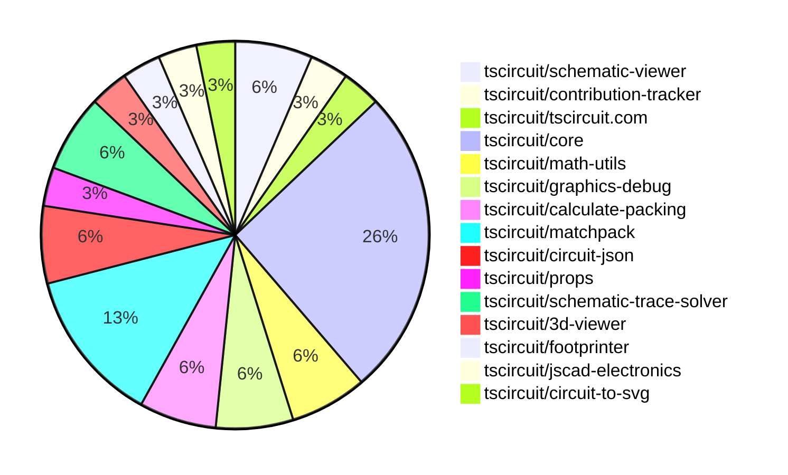
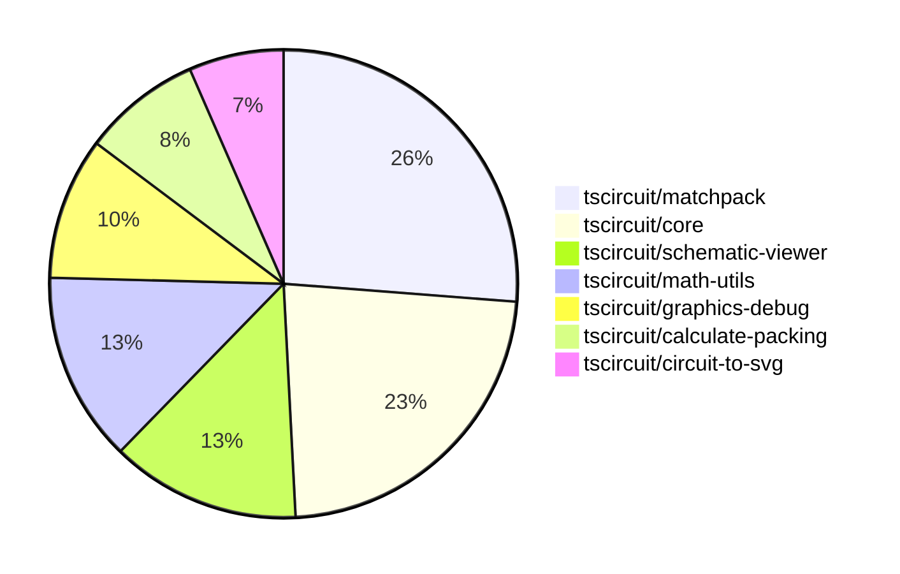

# Contribution Overview 2025-09-03

## PRs by Repository

## Contributor Overview

| Contributor | 🐳 Major | 🐙 Minor | 🐌 Tiny | ⭐ | Score | Discussion Contributions |
|-------------|---------|---------|---------|-----|----------------|--------------------------|
| [seveibar](#seveibar) | 9 | 6 | 4 | 👑 | 60 | 0🔹 0🔶 0💎 |
| [ArnavK-09](#ArnavK-09) | 2 | 0 | 2 | ⭐ | 10 | 0🔹 0🔶 0💎 |
| [imrishabh18](#imrishabh18) | 1 | 0 | 2 | ⭐ | 7 | 0🔹 0🔶 0💎 |
| [techmannih](#techmannih) | 0 | 1 | 2 | ⭐ | 6 | 0🔹 0🔶 0💎 |
| [MustafaMulla29](#MustafaMulla29) | 0 | 0 | 1 |  | 1 | 0🔹 0🔶 0💎 |
| [AnasSarkiz](#AnasSarkiz) | 0 | 0 | 1 |  | 1 | 0🔹 0🔶 0💎 |

### Discussion Contribution Legend

- 🔹 Normal Comments: Basic participation with minimal effort
- 🔶 Great Informative Comments: Thoughtful participation that adds value
- 💎 Incredible Comments: Exceptional participation with high-quality content

## Review Table

[reviews-received-hover]: ## "Number of reviews received for PRs for this contributor"
[approvals-received-hover]: ## "Number of approvals received for PRs this contributor authored"
[rejections-received-hover]: ## "Number of rejections received for PRs this contributor authored"
[prs-opened-hover]: ## "Number of PRs opened by this contributor"
[issues-created-hover]: ## "Number of issues created by this contributor"
[bountied-issues-hover]: ## "Number of issues this contributor created with a bounty"
[bountied-issue-$-hover]: ## "Total bounty amount placed on issues authored by this contributor"

| Contributor | Reviews Received | Approvals Received | Rejections Received | Approvals | Rejections | PRs Opened | PRs Merged | Score | Issues Created | Bountied Issues | Bountied Issue $ |
|---|---|---|---|---|---|---|---|---|---|---|---|
| [baeoc](#baeoc) | 3 | 0 | 1 | 0 | 0 | 2 | 0 | 0 | 0 | 0 | 0 |
| [ArnavK-09](#ArnavK-09) | 5 | 4 | 0 | 0 | 0 | 4 | 4 | 10 | 0 | 0 | 0 |
| [seveibar](#seveibar) | 4 | 0 | 0 | 10 | 3 | 20 | 19 | 60 | 0 | 0 | 0 |
| [JrmyDev](#JrmyDev) | 4 | 0 | 1 | 0 | 0 | 1 | 0 | 0 | 0 | 0 | 0 |
| [techmannih](#techmannih) | 11 | 4 | 0 | 0 | 0 | 6 | 3 | 6 | 0 | 0 | 0 |
| [ShiboSoftwareDev](#ShiboSoftwareDev) | 0 | 0 | 0 | 2 | 0 | 0 | 0 | 0 | 0 | 0 | 0 |
| [imrishabh18](#imrishabh18) | 14 | 2 | 0 | 0 | 1 | 6 | 3 | 7 | 0 | 0 | 0 |
| [Abse2001](#Abse2001) | 7 | 0 | 0 | 0 | 0 | 1 | 0 | 0 | 0 | 0 | 0 |
| [MustafaMulla29](#MustafaMulla29) | 7 | 1 | 2 | 0 | 0 | 2 | 1 | 1 | 0 | 0 | 0 |
| [aryel780](#aryel780) | 1 | 0 | 0 | 0 | 0 | 1 | 0 | 0 | 0 | 0 | 0 |
| [AnasSarkiz](#AnasSarkiz) | 2 | 1 | 0 | 0 | 0 | 1 | 1 | 1 | 0 | 0 | 0 |
| [tscircuitbot](#tscircuitbot) | 0 | 0 | 0 | 0 | 0 | 8 | 0 | 0 | 0 | 0 | 0 |

## Top 7 Repositories by Contribution Points

## Changes by Repository

### [tscircuit/schematic-viewer](https://github.com/tscircuit/schematic-viewer)

| PR # | Impact | Rating | Contributor | Description |
|------|--------|--------|-------------|-------------|
| [#120](https://github.com/tscircuit/schematic-viewer/pull/120) | 🐳 Major | ⭐⭐⭐ | ArnavK-09 | Adds mobile touch support for group viewing functionality in the schematic viewer, allowing users to interact with components using touch events. |
| [#119](https://github.com/tscircuit/schematic-viewer/pull/119) | 🐳 Major | ⭐⭐⭐ | ArnavK-09 | Adds mobile touch support for group viewing functionality in the ViewMenu component, allowing users to toggle group visibility with touch events. |

### [tscircuit/contribution-tracker](https://github.com/tscircuit/contribution-tracker)

🐌 Tiny Contributions (1)

| PR # | Impact | Contributor | Description |
|------|--------|-------------|-------------|
| [#218](https://github.com/tscircuit/contribution-tracker/pull/218) | 🐌 Tiny | ArnavK-09 | Adds a new component to display the list of project maintainers with their roles and avatars. |

### [tscircuit/tscircuit.com](https://github.com/tscircuit/tscircuit.com)

🐌 Tiny Contributions (1)

| PR # | Impact | Contributor | Description |
|------|--------|-------------|-------------|
| [#1628](https://github.com/tscircuit/tscircuit.com/pull/1628) | 🐌 Tiny | ArnavK-09 | Disables the order button for packages that have no available releases to prevent users from attempting to place orders that would fail. |

### [tscircuit/core](https://github.com/tscircuit/core)

| PR # | Impact | Rating | Contributor | Description |
|------|--------|--------|-------------|-------------|
| [#1273](https://github.com/tscircuit/core/pull/1273) | 🐳 Major | ⭐⭐⭐ | seveibar | Updates the matchpack dependency to version 0.0.12 and the calculate-packing dependency to version 0.0.31, optimizing symmetry handling in the packing algorithm. |
| [#1274](https://github.com/tscircuit/core/pull/1274) | 🐙 Minor | ⭐⭐ | seveibar | Add a pinout  component backed by simple_pinout source type and update dependencies. |
| [#1271](https://github.com/tscircuit/core/pull/1271) | 🐙 Minor | ⭐⭐ | seveibar | Skip the rp2040 decoupling capacitors test and add a benchmark for the RP2040 decoupling capacitors, registering it on the benchmark page. |
| [#1268](https://github.com/tscircuit/core/pull/1268) | 🐙 Minor | ⭐⭐ | seveibar | Adds an example circuit for the RP2040 microcontroller that includes decoupling capacitors for power stability. |

🐌 Tiny Contributions (4)

| PR # | Impact | Contributor | Description |
|------|--------|-------------|-------------|
| [#1272](https://github.com/tscircuit/core/pull/1272) | 🐌 Tiny | seveibar | Add instructions for getting inputs to algorithms and improve matchpack debug output |
| [#1278](https://github.com/tscircuit/core/pull/1278) | 🐌 Tiny | imrishabh18 | Adds a test for overlapping junctions and crossings in circuit schematics to ensure correct rendering and functionality. |
| [#1267](https://github.com/tscircuit/core/pull/1267) | 🐌 Tiny | MustafaMulla29 | Automatically adjusts silkscreen reference designator text position for passive components when they overlap with other components. |
| [#1260](https://github.com/tscircuit/core/pull/1260) | 🐌 Tiny | AnasSarkiz | Reproduces a bug where the same net is not combined in a circuit layout involving a connector, resistor, and solder jumper. |

### [tscircuit/math-utils](https://github.com/tscircuit/math-utils)

| PR # | Impact | Rating | Contributor | Description |
|------|--------|--------|-------------|-------------|
| [#18](https://github.com/tscircuit/math-utils/pull/18) | 🐳 Major | ⭐⭐⭐ | seveibar | Adds utilities to compute overlapping area and minimum distance between bounding rectangles, along with documentation updates. |
| [#17](https://github.com/tscircuit/math-utils/pull/17) | 🐳 Major | ⭐⭐⭐ | seveibar | Adds a function to determine if two bounding rectangles overlap, along with corresponding tests. |

### [tscircuit/graphics-debug](https://github.com/tscircuit/graphics-debug)

| PR # | Impact | Rating | Contributor | Description |
|------|--------|--------|-------------|-------------|
| [#73](https://github.com/tscircuit/graphics-debug/pull/73) | 🐳 Major | ⭐⭐⭐ | seveibar | Sorts rectangles by area before rendering so smaller ones appear on top when overlapping, and adds utility and tests for sorting rectangles by area. |
| [#74](https://github.com/tscircuit/graphics-debug/pull/74) | 🐙 Minor | ⭐⭐ | seveibar | Fixes the dimension overlay to ensure the key listener for the d hotkey is active immediately without requiring a mouse enterleave cycle. |

### [tscircuit/calculate-packing](https://github.com/tscircuit/calculate-packing)

| PR # | Impact | Rating | Contributor | Description |
|------|--------|--------|-------------|-------------|
| [#30](https://github.com/tscircuit/calculate-packing/pull/30) | 🐳 Major | ⭐⭐⭐ | seveibar | This pull request introduces a new packing strategy called minimum_closest_sum_squared_distance to the OutlineSegmentCandidatePointSolver and SingleComponentPackSolver classes. It adds a new solver, TwoPhaseIrlsSolver, which implements this strategy. The changes include modifications to existing classes to accommodate the new strategy, ensuring that the packing algorithms can utilize this new method for improved packing efficiency. |

🐌 Tiny Contributions (1)

| PR # | Impact | Contributor | Description |
|------|--------|-------------|-------------|
| [#31](https://github.com/tscircuit/calculate-packing/pull/31) | 🐌 Tiny | seveibar | Fixes the incorrect passing of pack placement strategies in the OutlineSegmentCandidatePointSolver and SingleComponentPackSolver classes. |

### [tscircuit/matchpack](https://github.com/tscircuit/matchpack)

| PR # | Impact | Rating | Contributor | Description |
|------|--------|--------|-------------|-------------|
| [#19](https://github.com/tscircuit/matchpack/pull/19) | 🐳 Major | ⭐⭐⭐ | seveibar | Adds functionality to separate decoupling capacitors into their own partitions while partitioning remaining chips based on strong pin connections. |
| [#18](https://github.com/tscircuit/matchpack/pull/18) | 🐳 Major | ⭐⭐⭐ | seveibar | Adds a new solver to identify decoupling capacitor groups based on specific criteria, including pin configuration and connections to main chips, along with caching for input problem visualization. |
| [#17](https://github.com/tscircuit/matchpack/pull/17) | 🐳 Major | ⭐⭐⭐ | seveibar | Changes the packing placement strategy to minimum_closest_sum_squared_distance for improved packing symmetry in circuit layouts. |
| [#16](https://github.com/tscircuit/matchpack/pull/16) | 🐳 Major | ⭐⭐⭐ | seveibar | Adds functionality to ensure that the chip body pad fully envelopes the pads for inner partition packing, improving layout accuracy. |

### [tscircuit/circuit-json](https://github.com/tscircuit/circuit-json)

| PR # | Impact | Rating | Contributor | Description |
|------|--------|--------|-------------|-------------|
| [#261](https://github.com/tscircuit/circuit-json/pull/261) | 🐙 Minor | ⭐⭐ | seveibar | Adds a SourceSimplePinout schema without a pin name list, includes it in unions and exports, and tests its parsing and union inclusion. |

🐌 Tiny Contributions (1)

| PR # | Impact | Contributor | Description |
|------|--------|-------------|-------------|
| [#262](https://github.com/tscircuit/circuit-json/pull/262) | 🐌 Tiny | seveibar | Make schematic_trace.source_trace_id optional and add optional schematic_trace.subcircuit_connectivity_map_key, along with documentation and tests for these new fields. |

### [tscircuit/props](https://github.com/tscircuit/props)

| PR # | Impact | Rating | Contributor | Description |
|------|--------|--------|-------------|-------------|
| [#366](https://github.com/tscircuit/props/pull/366) | 🐙 Minor | ⭐⭐ | seveibar | Add a pinout  component that reuses chip props, documents PinoutProps in README and component types, exports new pinout schema, and adds basic parsing test. |

### [tscircuit/schematic-trace-solver](https://github.com/tscircuit/schematic-trace-solver)

🐌 Tiny Contributions (2)

| PR # | Impact | Contributor | Description |
|------|--------|-------------|-------------|
| [#35](https://github.com/tscircuit/schematic-trace-solver/pull/35) | 🐌 Tiny | seveibar | Add SVG test and setup for matcher functionality to improve testing of schematic trace solvers. |
| [#37](https://github.com/tscircuit/schematic-trace-solver/pull/37) | 🐌 Tiny | imrishabh18 | Adds example input problems and corresponding tests for the schematic trace solver functionality. |

### [tscircuit/3d-viewer](https://github.com/tscircuit/3d-viewer)

| PR # | Impact | Rating | Contributor | Description |
|------|--------|--------|-------------|-------------|
| [#449](https://github.com/tscircuit/3d-viewer/pull/449) | 🐙 Minor | ⭐⭐ | techmannih | Fixes hole drilling on pads to ensure proper material removal during PCB fabrication. |

### [tscircuit/footprinter](https://github.com/tscircuit/footprinter)

🐌 Tiny Contributions (1)

| PR # | Impact | Contributor | Description |
|------|--------|-------------|-------------|
| [#366](https://github.com/tscircuit/footprinter/pull/366) | 🐌 Tiny | techmannih | Removes the outer plating around stampboard holes to ensure proper fit and functionality of components. |

### [tscircuit/jscad-electronics](https://github.com/tscircuit/jscad-electronics)

🐌 Tiny Contributions (1)

| PR # | Impact | Contributor | Description |
|------|--------|-------------|-------------|
| [#119](https://github.com/tscircuit/jscad-electronics/pull/119) | 🐌 Tiny | techmannih | Updates the tscircuitfootprinter dependency to version 0.0.234 in the package.json file. |

### [tscircuit/circuit-to-svg](https://github.com/tscircuit/circuit-to-svg)

| PR # | Impact | Rating | Contributor | Description |
|------|--------|--------|-------------|-------------|
| [#302](https://github.com/tscircuit/circuit-to-svg/pull/302) | 🐳 Major | ⭐⭐⭐ | imrishabh18 | Fixes rendering issue where hops and arcs are buried under traces in schematic SVG output, ensuring correct visual layering of elements. |

## Changes by Contributor

### [ArnavK-09](https://github.com/ArnavK-09)

| PRs # | Impact | Rating | Description |
|------|--------|--------|-------------|
| [#120](https://github.com/tscircuit/schematic-viewer/pull/120) | 🐳 Major | ⭐⭐⭐ | Adds mobile touch support for group viewing functionality in the schematic viewer, allowing users to interact with components using touch events. |
| [#119](https://github.com/tscircuit/schematic-viewer/pull/119) | 🐳 Major | ⭐⭐⭐ | Adds mobile touch support for group viewing functionality in the ViewMenu component, allowing users to toggle group visibility with touch events. |

🐌 Tiny Contributions (2)

| PR # | Impact | Description |
|------|--------|-------------|
| [#218](https://github.com/tscircuit/contribution-tracker/pull/218) | 🐌 Tiny | Adds a new component to display the list of project maintainers with their roles and avatars. |
| [#1628](https://github.com/tscircuit/tscircuit.com/pull/1628) | 🐌 Tiny | Disables the order button for packages that have no available releases to prevent users from attempting to place orders that would fail. |

### [seveibar](https://github.com/seveibar)

| PRs # | Impact | Rating | Description |
|------|--------|--------|-------------|
| [#1273](https://github.com/tscircuit/core/pull/1273) | 🐳 Major | ⭐⭐⭐ | Updates the matchpack dependency to version 0.0.12 and the calculate-packing dependency to version 0.0.31, optimizing symmetry handling in the packing algorithm. |
| [#18](https://github.com/tscircuit/math-utils/pull/18) | 🐳 Major | ⭐⭐⭐ | Adds utilities to compute overlapping area and minimum distance between bounding rectangles, along with documentation updates. |
| [#17](https://github.com/tscircuit/math-utils/pull/17) | 🐳 Major | ⭐⭐⭐ | Adds a function to determine if two bounding rectangles overlap, along with corresponding tests. |
| [#73](https://github.com/tscircuit/graphics-debug/pull/73) | 🐳 Major | ⭐⭐⭐ | Sorts rectangles by area before rendering so smaller ones appear on top when overlapping, and adds utility and tests for sorting rectangles by area. |
| [#30](https://github.com/tscircuit/calculate-packing/pull/30) | 🐳 Major | ⭐⭐⭐ | This pull request introduces a new packing strategy called minimum_closest_sum_squared_distance to the OutlineSegmentCandidatePointSolver and SingleComponentPackSolver classes. It adds a new solver, TwoPhaseIrlsSolver, which implements this strategy. The changes include modifications to existing classes to accommodate the new strategy, ensuring that the packing algorithms can utilize this new method for improved packing efficiency. |
| [#19](https://github.com/tscircuit/matchpack/pull/19) | 🐳 Major | ⭐⭐⭐ | Adds functionality to separate decoupling capacitors into their own partitions while partitioning remaining chips based on strong pin connections. |
| [#18](https://github.com/tscircuit/matchpack/pull/18) | 🐳 Major | ⭐⭐⭐ | Adds a new solver to identify decoupling capacitor groups based on specific criteria, including pin configuration and connections to main chips, along with caching for input problem visualization. |
| [#17](https://github.com/tscircuit/matchpack/pull/17) | 🐳 Major | ⭐⭐⭐ | Changes the packing placement strategy to minimum_closest_sum_squared_distance for improved packing symmetry in circuit layouts. |
| [#16](https://github.com/tscircuit/matchpack/pull/16) | 🐳 Major | ⭐⭐⭐ | Adds functionality to ensure that the chip body pad fully envelopes the pads for inner partition packing, improving layout accuracy. |
| [#261](https://github.com/tscircuit/circuit-json/pull/261) | 🐙 Minor | ⭐⭐ | Adds a SourceSimplePinout schema without a pin name list, includes it in unions and exports, and tests its parsing and union inclusion. |
| [#366](https://github.com/tscircuit/props/pull/366) | 🐙 Minor | ⭐⭐ | Add a pinout  component that reuses chip props, documents PinoutProps in README and component types, exports new pinout schema, and adds basic parsing test. |
| [#1274](https://github.com/tscircuit/core/pull/1274) | 🐙 Minor | ⭐⭐ | Add a pinout  component backed by simple_pinout source type and update dependencies. |
| [#1271](https://github.com/tscircuit/core/pull/1271) | 🐙 Minor | ⭐⭐ | Skip the rp2040 decoupling capacitors test and add a benchmark for the RP2040 decoupling capacitors, registering it on the benchmark page. |
| [#1268](https://github.com/tscircuit/core/pull/1268) | 🐙 Minor | ⭐⭐ | Adds an example circuit for the RP2040 microcontroller that includes decoupling capacitors for power stability. |
| [#74](https://github.com/tscircuit/graphics-debug/pull/74) | 🐙 Minor | ⭐⭐ | Fixes the dimension overlay to ensure the key listener for the d hotkey is active immediately without requiring a mouse enterleave cycle. |

🐌 Tiny Contributions (4)

| PR # | Impact | Description |
|------|--------|-------------|
| [#262](https://github.com/tscircuit/circuit-json/pull/262) | 🐌 Tiny | Make schematic_trace.source_trace_id optional and add optional schematic_trace.subcircuit_connectivity_map_key, along with documentation and tests for these new fields. |
| [#1272](https://github.com/tscircuit/core/pull/1272) | 🐌 Tiny | Add instructions for getting inputs to algorithms and improve matchpack debug output |
| [#31](https://github.com/tscircuit/calculate-packing/pull/31) | 🐌 Tiny | Fixes the incorrect passing of pack placement strategies in the OutlineSegmentCandidatePointSolver and SingleComponentPackSolver classes. |
| [#35](https://github.com/tscircuit/schematic-trace-solver/pull/35) | 🐌 Tiny | Add SVG test and setup for matcher functionality to improve testing of schematic trace solvers. |

### [techmannih](https://github.com/techmannih)

| PRs # | Impact | Rating | Description |
|------|--------|--------|-------------|
| [#449](https://github.com/tscircuit/3d-viewer/pull/449) | 🐙 Minor | ⭐⭐ | Fixes hole drilling on pads to ensure proper material removal during PCB fabrication. |

🐌 Tiny Contributions (2)

| PR # | Impact | Description |
|------|--------|-------------|
| [#366](https://github.com/tscircuit/footprinter/pull/366) | 🐌 Tiny | Removes the outer plating around stampboard holes to ensure proper fit and functionality of components. |
| [#119](https://github.com/tscircuit/jscad-electronics/pull/119) | 🐌 Tiny | Updates the tscircuitfootprinter dependency to version 0.0.234 in the package.json file. |

### [imrishabh18](https://github.com/imrishabh18)

| PRs # | Impact | Rating | Description |
|------|--------|--------|-------------|
| [#302](https://github.com/tscircuit/circuit-to-svg/pull/302) | 🐳 Major | ⭐⭐⭐ | Fixes rendering issue where hops and arcs are buried under traces in schematic SVG output, ensuring correct visual layering of elements. |

🐌 Tiny Contributions (2)

| PR # | Impact | Description |
|------|--------|-------------|
| [#1278](https://github.com/tscircuit/core/pull/1278) | 🐌 Tiny | Adds a test for overlapping junctions and crossings in circuit schematics to ensure correct rendering and functionality. |
| [#37](https://github.com/tscircuit/schematic-trace-solver/pull/37) | 🐌 Tiny | Adds example input problems and corresponding tests for the schematic trace solver functionality. |

### [MustafaMulla29](https://github.com/MustafaMulla29)

🐌 Tiny Contributions (1)

| PR # | Impact | Description |
|------|--------|-------------|
| [#1267](https://github.com/tscircuit/core/pull/1267) | 🐌 Tiny | Automatically adjusts silkscreen reference designator text position for passive components when they overlap with other components. |

### [AnasSarkiz](https://github.com/AnasSarkiz)

🐌 Tiny Contributions (1)

| PR # | Impact | Description |
|------|--------|-------------|
| [#1260](https://github.com/tscircuit/core/pull/1260) | 🐌 Tiny | Reproduces a bug where the same net is not combined in a circuit layout involving a connector, resistor, and solder jumper. |

## Repository Owners

| Repository | Codeowners |
|------------|------------|
| [builder](https://github.com/tscircuit/builder/blob/main/.github/CODEOWNERS) | [seveibar](https://github.com/seveibar)
| [pcb-viewer](https://github.com/tscircuit/pcb-viewer/blob/main/.github/CODEOWNERS) | [seveibar](https://github.com/seveibar), [ShiboSoftwareDev](https://github.com/ShiboSoftwareDev)
| [footprints-old](https://github.com/tscircuit/footprints-old/blob/main/.github/CODEOWNERS) | [seveibar](https://github.com/seveibar)
| [footprinter](https://github.com/tscircuit/footprinter/blob/main/.github/CODEOWNERS) | [seveibar](https://github.com/seveibar), [techmannih](https://github.com/techmannih)
| [3d-viewer](https://github.com/tscircuit/3d-viewer/blob/main/.github/CODEOWNERS) | [ShiboSoftwareDev](https://github.com/ShiboSoftwareDev)
| [winterspec](https://github.com/tscircuit/winterspec/blob/main/.github/CODEOWNERS) | [seveibar](https://github.com/seveibar), [ShiboSoftwareDev](https://github.com/ShiboSoftwareDev)
| [jscad-electronics](https://github.com/tscircuit/jscad-electronics/blob/main/.github/CODEOWNERS) | [seveibar](https://github.com/seveibar), [abhijitxy](https://github.com/abhijitxy), [anas-sarkez](https://github.com/anas-sarkez)
| [circuit-to-svg](https://github.com/tscircuit/circuit-to-svg/blob/main/.github/CODEOWNERS) | [imrishabh18](https://github.com/imrishabh18)
| [schematic-symbols](https://github.com/tscircuit/schematic-symbols/blob/main/.github/CODEOWNERS) | [seveibar](https://github.com/seveibar), [imrishabh18](https://github.com/imrishabh18), [techmannih](https://github.com/techmannih)
| [circuit-json-to-gerber](https://github.com/tscircuit/circuit-json-to-gerber/blob/main/.github/CODEOWNERS) | [seveibar](https://github.com/seveibar), [ShiboSoftwareDev](https://github.com/ShiboSoftwareDev)
| [tscircuit.com](https://github.com/tscircuit/tscircuit.com/blob/main/.github/CODEOWNERS) | [seveibar](https://github.com/seveibar), [imrishabh18](https://github.com/imrishabh18)
| [cli](https://github.com/tscircuit/cli/blob/main/.github/CODEOWNERS) | [seveibar](https://github.com/seveibar), [imrishabh18](https://github.com/imrishabh18), [ArnavK-09](https://github.com/ArnavK-09)
| [issue-roulette](https://github.com/tscircuit/issue-roulette/blob/main/.github/CODEOWNERS) | [Anshgrover23](https://github.com/Anshgrover23)
| [sparkfun-boards](https://github.com/tscircuit/sparkfun-boards/blob/main/.github/CODEOWNERS) | [ShiboSoftwareDev](https://github.com/ShiboSoftwareDev), [Abse2001](https://github.com/Abse2001), [MustafaMulla29](https://github.com/MustafaMulla29), [Anshgrover23](https://github.com/Anshgrover23), [techmannih](https://github.com/techmannih)
| [schematic-corpus](https://github.com/tscircuit/schematic-corpus/blob/main/.github/CODEOWNERS) | [Abse2001](https://github.com/Abse2001)

## Repositories by Owner

| User | Repo |
|------|------|
| [seveibar](https://github.com/seveibar) | [builder](https://github.com/tscircuit/builder/blob/main/.github/CODEOWNERS) |
|  | [pcb-viewer](https://github.com/tscircuit/pcb-viewer/blob/main/.github/CODEOWNERS) |
|  | [footprints-old](https://github.com/tscircuit/footprints-old/blob/main/.github/CODEOWNERS) |
|  | [footprinter](https://github.com/tscircuit/footprinter/blob/main/.github/CODEOWNERS) |
|  | [winterspec](https://github.com/tscircuit/winterspec/blob/main/.github/CODEOWNERS) |
|  | [jscad-electronics](https://github.com/tscircuit/jscad-electronics/blob/main/.github/CODEOWNERS) |
|  | [schematic-symbols](https://github.com/tscircuit/schematic-symbols/blob/main/.github/CODEOWNERS) |
|  | [circuit-json-to-gerber](https://github.com/tscircuit/circuit-json-to-gerber/blob/main/.github/CODEOWNERS) |
|  | [tscircuit.com](https://github.com/tscircuit/tscircuit.com/blob/main/.github/CODEOWNERS) |
|  | [cli](https://github.com/tscircuit/cli/blob/main/.github/CODEOWNERS) |
| [ShiboSoftwareDev](https://github.com/ShiboSoftwareDev) | [pcb-viewer](https://github.com/tscircuit/pcb-viewer/blob/main/.github/CODEOWNERS) |
|  | [3d-viewer](https://github.com/tscircuit/3d-viewer/blob/main/.github/CODEOWNERS) |
|  | [winterspec](https://github.com/tscircuit/winterspec/blob/main/.github/CODEOWNERS) |
|  | [circuit-json-to-gerber](https://github.com/tscircuit/circuit-json-to-gerber/blob/main/.github/CODEOWNERS) |
|  | [sparkfun-boards](https://github.com/tscircuit/sparkfun-boards/blob/main/.github/CODEOWNERS) |
| [techmannih](https://github.com/techmannih) | [footprinter](https://github.com/tscircuit/footprinter/blob/main/.github/CODEOWNERS) |
|  | [schematic-symbols](https://github.com/tscircuit/schematic-symbols/blob/main/.github/CODEOWNERS) |
|  | [sparkfun-boards](https://github.com/tscircuit/sparkfun-boards/blob/main/.github/CODEOWNERS) |
| [abhijitxy](https://github.com/abhijitxy) | [jscad-electronics](https://github.com/tscircuit/jscad-electronics/blob/main/.github/CODEOWNERS) |
| [anas-sarkez](https://github.com/anas-sarkez) | [jscad-electronics](https://github.com/tscircuit/jscad-electronics/blob/main/.github/CODEOWNERS) |
| [imrishabh18](https://github.com/imrishabh18) | [circuit-to-svg](https://github.com/tscircuit/circuit-to-svg/blob/main/.github/CODEOWNERS) |
|  | [schematic-symbols](https://github.com/tscircuit/schematic-symbols/blob/main/.github/CODEOWNERS) |
|  | [tscircuit.com](https://github.com/tscircuit/tscircuit.com/blob/main/.github/CODEOWNERS) |
|  | [cli](https://github.com/tscircuit/cli/blob/main/.github/CODEOWNERS) |
| [ArnavK-09](https://github.com/ArnavK-09) | [cli](https://github.com/tscircuit/cli/blob/main/.github/CODEOWNERS) |
| [Anshgrover23](https://github.com/Anshgrover23) | [issue-roulette](https://github.com/tscircuit/issue-roulette/blob/main/.github/CODEOWNERS) |
|  | [sparkfun-boards](https://github.com/tscircuit/sparkfun-boards/blob/main/.github/CODEOWNERS) |
| [Abse2001](https://github.com/Abse2001) | [sparkfun-boards](https://github.com/tscircuit/sparkfun-boards/blob/main/.github/CODEOWNERS) |
|  | [schematic-corpus](https://github.com/tscircuit/schematic-corpus/blob/main/.github/CODEOWNERS) |
| [MustafaMulla29](https://github.com/MustafaMulla29) | [sparkfun-boards](https://github.com/tscircuit/sparkfun-boards/blob/main/.github/CODEOWNERS) |

