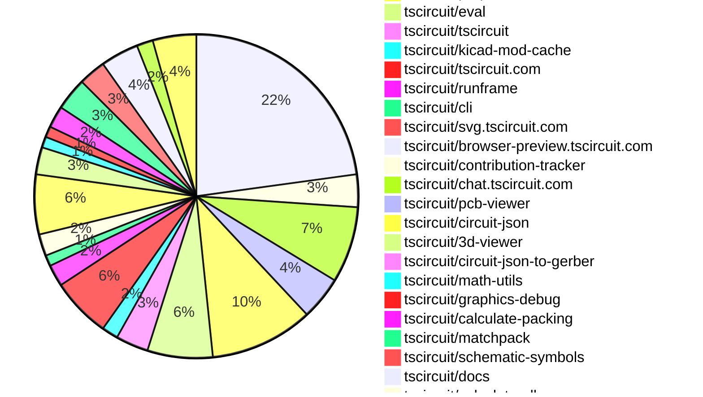
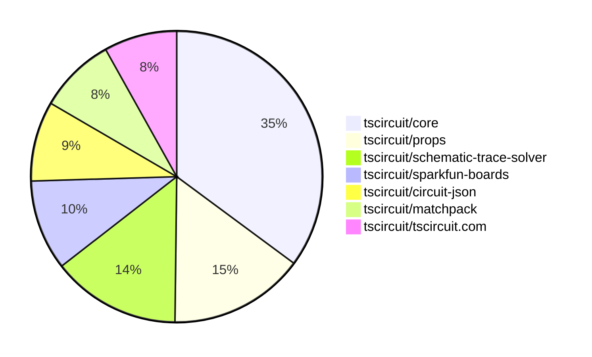

# Contribution Overview 2025-09-03

## PRs by Repository

## Contributor Overview

| Contributor | 🐳 Major | 🐙 Minor | 🐌 Tiny | ⭐ | Score | Discussion Contributions |
|-------------|---------|---------|---------|-----|----------------|--------------------------|
| [seveibar](#seveibar) | 21 | 41 | 24 | 👑👑 | 99 | 1🔹 2🔶 0💎 |
| [ShiboSoftwareDev](#ShiboSoftwareDev) | 9 | 13 | 5 | 👑 | 75 | 0🔹 0🔶 0💎 |
| [imrishabh18](#imrishabh18) | 5 | 7 | 17 | 👑 | 51 | 0🔹 0🔶 0💎 |
| [ArnavK-09](#ArnavK-09) | 5 | 2 | 11 | ⭐⭐⭐ | 34.5 | 0🔹 0🔶 0💎 |
| [Abse2001](#Abse2001) | 6 | 4 | 2 | ⭐⭐⭐ | 34 | 0🔹 0🔶 0💎 |
| [techmannih](#techmannih) | 1 | 3 | 3 | ⭐⭐ | 18 | 1🔹 0🔶 0💎 |
| [MustafaMulla29](#MustafaMulla29) | 2 | 2 | 2 | ⭐⭐ | 14 | 0🔹 0🔶 0💎 |
| [Ayushjhawar8](#Ayushjhawar8) | 0 | 0 | 3 |  | 3 | 0🔹 0🔶 0💎 |
| [tscircuitbot](#tscircuitbot) | 0 | 0 | 2 |  | 2 | 0🔹 0🔶 0💎 |
| [0hmX](#0hmX) | 0 | 1 | 0 |  | 2 | 0🔹 0🔶 0💎 |
| [AnasSarkiz](#AnasSarkiz) | 0 | 0 | 1 |  | 1 | 0🔹 0🔶 0💎 |
| [raykholo](#raykholo) | 0 | 0 | 0 | ⭐ | 0 | 0🔹 2🔶 1💎 |
| [nathaniel-brough](#nathaniel-brough) | 0 | 0 | 0 |  | 0 | 1🔹 0🔶 0💎 |

### Discussion Contribution Legend

- 🔹 Normal Comments: Basic participation with minimal effort
- 🔶 Great Informative Comments: Thoughtful participation that adds value
- 💎 Incredible Comments: Exceptional participation with high-quality content

## Review Table

[reviews-received-hover]: ## "Number of reviews received for PRs for this contributor"
[approvals-received-hover]: ## "Number of approvals received for PRs this contributor authored"
[rejections-received-hover]: ## "Number of rejections received for PRs this contributor authored"
[prs-opened-hover]: ## "Number of PRs opened by this contributor"
[issues-created-hover]: ## "Number of issues created by this contributor"
[bountied-issues-hover]: ## "Number of issues this contributor created with a bounty"
[bountied-issue-$-hover]: ## "Total bounty amount placed on issues authored by this contributor"

| Contributor | Reviews Received | Approvals Received | Rejections Received | Approvals | Rejections | PRs Opened | PRs Merged | Score | Issues Created | Bountied Issues | Bountied Issue $ |
|---|---|---|---|---|---|---|---|---|---|---|---|
| [ArnavK-09](#ArnavK-09) | 28 | 21 | 0 | 0 | 0 | 22 | 18 | 34.5 | 0 | 0 | 0 |
| [seveibar](#seveibar) | 31 | 0 | 0 | 79 | 7 | 106 | 88 | 99 | 0 | 0 | 0 |
| [imrishabh18](#imrishabh18) | 29 | 15 | 1 | 4 | 2 | 40 | 30 | 51 | 0 | 0 | 0 |
| [JrmyDev](#JrmyDev) | 5 | 0 | 1 | 0 | 0 | 1 | 0 | 0 | 0 | 0 | 0 |
| [techmannih](#techmannih) | 20 | 8 | 0 | 2 | 0 | 10 | 7 | 18 | 0 | 0 | 0 |
| [baeoc](#baeoc) | 3 | 0 | 1 | 0 | 0 | 2 | 0 | 0 | 0 | 0 | 0 |
| [ShiboSoftwareDev](#ShiboSoftwareDev) | 41 | 28 | 1 | 10 | 0 | 33 | 29 | 75 | 0 | 0 | 0 |
| [MAVRICK-1](#MAVRICK-1) | 0 | 0 | 0 | 0 | 0 | 1 | 0 | 0 | 0 | 0 | 0 |
| [Abse2001](#Abse2001) | 16 | 12 | 0 | 0 | 0 | 16 | 12 | 34 | 0 | 0 | 0 |
| [nailoo](#nailoo) | 2 | 0 | 1 | 0 | 0 | 3 | 0 | 0 | 0 | 0 | 0 |
| [bryanwills](#bryanwills) | 0 | 0 | 0 | 0 | 0 | 1 | 0 | 0 | 0 | 0 | 0 |
| [MustafaMulla29](#MustafaMulla29) | 17 | 6 | 3 | 0 | 0 | 8 | 6 | 14 | 0 | 0 | 0 |
| [aryel780](#aryel780) | 1 | 0 | 0 | 0 | 0 | 1 | 0 | 0 | 0 | 0 | 0 |
| [AnasSarkiz](#AnasSarkiz) | 6 | 1 | 0 | 0 | 0 | 2 | 1 | 1 | 0 | 0 | 0 |
| [pxlpal](#pxlpal) | 7 | 0 | 1 | 0 | 0 | 1 | 0 | 0 | 0 | 0 | 0 |
| [Ayushjhawar8](#Ayushjhawar8) | 4 | 3 | 0 | 0 | 0 | 4 | 3 | 3 | 0 | 0 | 0 |
| [tscircuitbot](#tscircuitbot) | 0 | 0 | 0 | 0 | 0 | 71 | 2 | 2 | 0 | 0 | 0 |
| [0hmX](#0hmX) | 1 | 1 | 0 | 0 | 0 | 2 | 1 | 2 | 0 | 0 | 0 |
| [raykholo](#raykholo) | 0 | 0 | 0 | 0 | 0 | 0 | 0 | 8 | 0 | 0 | 0 |
| [nathaniel-brough](#nathaniel-brough) | 0 | 0 | 0 | 0 | 0 | 0 | 0 | 1 | 0 | 0 | 0 |

## Top 7 Repositories by Contribution Points

## Changes by Repository

### [tscircuit/core](https://github.com/tscircuit/core)

| PR # | Impact | Rating | Contributor | Description |
|------|--------|--------|-------------|-------------|
| [#1294](https://github.com/tscircuit/core/pull/1294) | 🐳 Major | ⭐⭐⭐ | imrishabh18 | Adds support for autorouting of footprints that are fetched asynchronously, ensuring proper rendering and handling of PCB components. |
| [#1279](https://github.com/tscircuit/core/pull/1279) | 🐳 Major | ⭐⭐⭐ | imrishabh18 | Adds a subcircuit_connectivity_map_key to schematic traces to improve connectivity mapping between subcircuits. |
| [#1318](https://github.com/tscircuit/core/pull/1318) | 🐳 Major | ⭐⭐⭐ | seveibar | Preserves cadModel returned by platform footprint library resolvers, supports additional cad model formats when creating cad components, defers cad model rendering until footprint resolution completes, and types footprint library resolver responses to remove casts. |
| [#1312](https://github.com/tscircuit/core/pull/1312) | 🐳 Major | ⭐⭐⭐ | seveibar | Group components connected by constraints before packing, treat constraint clusters as single packable units, reposition members after packing, and enable component constraint regression test. |
| [#1290](https://github.com/tscircuit/core/pull/1290) | 🐳 Major | ⭐⭐⭐ | seveibar | Fixes backward net labels in schematic traces and updates the trace solver for improved debuggability and performance. |
| [#1281](https://github.com/tscircuit/core/pull/1281) | 🐳 Major | ⭐⭐⭐ | seveibar | Fixes schematic trace configuration for better snapshot reliability and updates Matchpack to new defaults while adjusting trace distance settings. |
| [#1273](https://github.com/tscircuit/core/pull/1273) | 🐳 Major | ⭐⭐⭐ | seveibar | Updates the matchpack dependency to version 0.0.12 and the calculate-packing dependency to version 0.0.31, optimizing symmetry handling in the packing algorithm. |
| [#1292](https://github.com/tscircuit/core/pull/1292) | 🐳 Major | ⭐⭐⭐ | techmannih | Fixes the issue of traces being rendered twice when only manual routing is expected in the autorouting system. |
| [#1296](https://github.com/tscircuit/core/pull/1296) | 🐳 Major | ⭐⭐⭐ | MustafaMulla29 | Refines the calculation of silkscreen text positioning to prevent overlaps by implementing a more accurate bounding box calculation and exporting the related function for better modularity. |
| [#1306](https://github.com/tscircuit/core/pull/1306) | 🐙 Minor | ⭐⭐ | imrishabh18 | Fixes autosizing of the board when components fetch their footprints asynchronously. |
| [#1289](https://github.com/tscircuit/core/pull/1289) | 🐙 Minor | ⭐⭐ | imrishabh18 | Adds support for parsing and rendering footprints from a library map, enhancing footprint handling in the NormalComponent. |
| [#1278](https://github.com/tscircuit/core/pull/1278) | 🐙 Minor | ⭐⭐ | imrishabh18 | Adds a test for overlapping junctions and crossings in circuit schematics. |
| [#1288](https://github.com/tscircuit/core/pull/1288) | 🐙 Minor | ⭐⭐ | ShiboSoftwareDev | Adds support for specifying a GLTF model for a component via the gltfUrl property within the cadModel prop. |
| [#1284](https://github.com/tscircuit/core/pull/1284) | 🐙 Minor | ⭐⭐ | ShiboSoftwareDev | Adds the ability to display power direction arrows on schematic ports based on the pinAttributes property of a component, enhancing schematic clarity by visually indicating the intended direction of power flow for pins. |
| [#1319](https://github.com/tscircuit/core/pull/1319) | 🐙 Minor | ⭐⭐ | seveibar | Handles async footprint URL and library failures by inserting external_footprint_load_error into the circuit DB, adds tests for external_footprint_load_error and footprint library map errors, updates circuit-json dependency to latest, and includes component identifier and footprint source in error messages. |
| [#1317](https://github.com/tscircuit/core/pull/1317) | 🐙 Minor | ⭐⭐ | seveibar | Adds a thresholded SVG snapshot matcher to prevent trivial snapshot churn by checking the SVG diff percentage and preloading a custom matcher to apply the threshold globally. |
| [#1315](https://github.com/tscircuit/core/pull/1315) | 🐙 Minor | ⭐⭐ | seveibar | Replaces the VCC and GND symbols with rail symbols in the schematic representation. |
| [#1314](https://github.com/tscircuit/core/pull/1314) | 🐙 Minor | ⭐⭐ | seveibar | Adds margin handling for schematic components in matchpack layout, ensuring that margin properties are respected and applied correctly during layout calculations. |
| [#1311](https://github.com/tscircuit/core/pull/1311) | 🐙 Minor | ⭐⭐ | seveibar | Adds support for pcbOrientation in PinHeader, centralizing PCB rotation logic and ensuring correct placement of pins based on orientation. |
| [#1305](https://github.com/tscircuit/core/pull/1305) | 🐙 Minor | ⭐⭐ | seveibar | Adds a script to sync external projects from tscircuit.com into testsprojects, omitting lockfiles and config files, and includes a synced example with a basic snapshot test. |
| [#1303](https://github.com/tscircuit/core/pull/1303) | 🐙 Minor | ⭐⭐ | seveibar | Redirects debug outputs to the RootCircuit event emitter, allowing RunFrame to capture and log debug information more effectively. |
| [#1304](https://github.com/tscircuit/core/pull/1304) | 🐙 Minor | ⭐⭐ | seveibar | Fixes intermittent boolean operation errors by updating the calculate-packing library to version 0.0.33 and unskipping the repro44 PCB Pack test. |
| [#1302](https://github.com/tscircuit/core/pull/1302) | 🐙 Minor | ⭐⭐ | seveibar | Adds an enableDebug function to the RootCircuit class to control debug logging. |
| [#1301](https://github.com/tscircuit/core/pull/1301) | 🐙 Minor | ⭐⭐ | seveibar | Fixes flaky tests in the footprinter module by updating assertions, removing unreliable snapshots, and skipping a test due to a known bug in boolean operations. |
| [#1274](https://github.com/tscircuit/core/pull/1274) | 🐙 Minor | ⭐⭐ | seveibar | Adds a new pinout  component backed by simple_pinout source type and updates dependencies. |
| [#1271](https://github.com/tscircuit/core/pull/1271) | 🐙 Minor | ⭐⭐ | seveibar | Skip the rp2040 decoupling capacitors test and add a benchmark for the RP2040 decoupling capacitors, registering it on the benchmark page. |
| [#1268](https://github.com/tscircuit/core/pull/1268) | 🐙 Minor | ⭐⭐ | seveibar | Adds an example circuit for the RP2040 microcontroller featuring decoupling capacitors for power stability. |
| [#1283](https://github.com/tscircuit/core/pull/1283) | 🐙 Minor | ⭐⭐ | techmannih | Adds support for manual via traces in the PCB layout, allowing traces to connect to via layers. |
| [#1270](https://github.com/tscircuit/core/pull/1270) | 🐙 Minor | ⭐⭐ | Abse2001 | Fixes the rendering of manual PCB trace paths to support group rotation, ensuring accurate placement and orientation of traces in the PCB layout. |
| [#1287](https://github.com/tscircuit/core/pull/1287) | 🐙 Minor | ⭐⭐ | MustafaMulla29 | Prevents the creation of components with the same name in a subcircuit, ensuring that naming conflicts are handled gracefully by marking conflicting components for removal and logging an error. |
| [#1267](https://github.com/tscircuit/core/pull/1267) | 🐙 Minor | ⭐⭐ | MustafaMulla29 | Automatically adjusts silkscreen reference designator text position for passive components when they overlap with other components. |

🐌 Tiny Contributions (11)

| PR # | Impact | Contributor | Description |
|------|--------|-------------|-------------|
| [#1280](https://github.com/tscircuit/core/pull/1280) | 🐌 Tiny | imrishabh18 | Updates the circuit-to-svg dependency to version 0.0.182 in the package.json file. |
| [#1297](https://github.com/tscircuit/core/pull/1297) | 🐌 Tiny | ShiboSoftwareDev | Fixes NetLabelPlacementSolver to process each net only once |
| [#1286](https://github.com/tscircuit/core/pull/1286) | 🐌 Tiny | ShiboSoftwareDev | Updates the versions of the tscircuitprops and circuit-json dependencies in package.json |
| [#1316](https://github.com/tscircuit/core/pull/1316) | 🐌 Tiny | seveibar | Updates the tscircuitprops dependency to version 0.0.311 and regenerates the multilayer obstacle route snapshot. |
| [#1310](https://github.com/tscircuit/core/pull/1310) | 🐌 Tiny | seveibar | Adds a new test for PCB component constraints, currently marked as skipped. |
| [#1308](https://github.com/tscircuit/core/pull/1308) | 🐌 Tiny | seveibar | Changes the maximum schematic trace distance for the RP2040 example and updates the properties for KiCad autocomplete functionality. |
| [#1298](https://github.com/tscircuit/core/pull/1298) | 🐌 Tiny | seveibar | Updates the schematic-trace-solver to fix the issue of straight lines connecting to the side of a schematic trace. |
| [#1272](https://github.com/tscircuit/core/pull/1272) | 🐌 Tiny | seveibar | Add instructions for getting inputs to algorithms and improve matchpack debug output |
| [#1295](https://github.com/tscircuit/core/pull/1295) | 🐌 Tiny | MustafaMulla29 | Updates the version of the tscircuitmath-utils dependency from 0.0.19 to 0.0.21 in package.json |
| [#1293](https://github.com/tscircuit/core/pull/1293) | 🐌 Tiny | MustafaMulla29 | Updates the math-utils dependency to version 0.0.19 to support the SilkscreenOverlapAdjustment render phase. |
| [#1260](https://github.com/tscircuit/core/pull/1260) | 🐌 Tiny | AnasSarkiz | Reproduces a bug where the same net is not combined in a circuit layout involving a connector, resistor, and solder jumper. |

### [tscircuit/circuit-to-svg](https://github.com/tscircuit/circuit-to-svg)

| PR # | Impact | Rating | Contributor | Description |
|------|--------|--------|-------------|-------------|
| [#303](https://github.com/tscircuit/circuit-to-svg/pull/303) | 🐳 Major | ⭐⭐⭐ | imrishabh18 | Adds functionality to highlight all traces sharing the same connectivity key when hovered over in the schematic view. |
| [#302](https://github.com/tscircuit/circuit-to-svg/pull/302) | 🐳 Major | ⭐⭐⭐ | imrishabh18 | Fixes rendering issue where hops and arcs are buried under traces in schematic SVG output, ensuring correct visual layering of elements. |
| [#308](https://github.com/tscircuit/circuit-to-svg/pull/308) | 🐳 Major | ⭐⭐⭐ | ShiboSoftwareDev | Adds support for B-rep copper pours in PCB SVG conversion, including a new utility function for rendering and comprehensive tests for various shapes. |
| [#307](https://github.com/tscircuit/circuit-to-svg/pull/307) | 🐳 Major | ⭐⭐⭐ | ShiboSoftwareDev | Add support for rendering pcb_copper_pour elements in the PCB SVG output, enabling visualization of rectangular and polygonal copper pours on both top and bottom layers. |
| [#309](https://github.com/tscircuit/circuit-to-svg/pull/309) | 🐙 Minor | ⭐⭐ | ShiboSoftwareDev | Fixes a circuit JSON error caused by identical names for components in the schematic. |

🐌 Tiny Contributions (1)

| PR # | Impact | Contributor | Description |
|------|--------|-------------|-------------|
| [#306](https://github.com/tscircuit/circuit-to-svg/pull/306) | 🐌 Tiny | ShiboSoftwareDev | Reduces the size of arrows for schematic ports in SVG rendering. |

### [tscircuit/schematic-trace-solver](https://github.com/tscircuit/schematic-trace-solver)

| PR # | Impact | Rating | Contributor | Description |
|------|--------|--------|-------------|-------------|
| [#58](https://github.com/tscircuit/schematic-trace-solver/pull/58) | 🐳 Major | ⭐⭐⭐ | imrishabh18 | Adds a new optional parameter netLabelWidth to the net label placement solver, allowing for customizable net label widths based on net IDs. |
| [#44](https://github.com/tscircuit/schematic-trace-solver/pull/44) | 🐳 Major | ⭐⭐⭐ | ShiboSoftwareDev | Addresses a limitation in the TraceOverlapShiftSolver where it would fail to resolve overlaps on trace segments connected directly to pins by implementing a jog-based resolution strategy and increasing overlap detection tolerance. |
| [#39](https://github.com/tscircuit/schematic-trace-solver/pull/39) | 🐳 Major | ⭐⭐⭐ | ShiboSoftwareDev | Add logic to SchematicTraceSingleLineSolver to reject candidate elbow segments that would cross a chips center line on an axis where related pins on that chip face both directions (e.g., pins on both left and right faces - vertical center line restricted). |
| [#54](https://github.com/tscircuit/schematic-trace-solver/pull/54) | 🐳 Major | ⭐⭐⭐ | seveibar | Fixes the issue with straight line tracing in schematic rendering by adding new graphical representations for connections and paths. |
| [#50](https://github.com/tscircuit/schematic-trace-solver/pull/50) | 🐳 Major | ⭐⭐⭐ | seveibar | Implements the elbow-shift method for single trace solving, rewriting the SchematicTraceSingleLineSolver to enhance pathfinding capabilities and avoid collisions with restricted center lines. |
| [#49](https://github.com/tscircuit/schematic-trace-solver/pull/49) | 🐳 Major | ⭐⭐⭐ | seveibar | Fixes an infinite loop issue in the trace solver algorithm by validating candidate paths before solving. |
| [#43](https://github.com/tscircuit/schematic-trace-solver/pull/43) | 🐳 Major | ⭐⭐⭐ | seveibar | Fixes net label placement failure by implementing a fallback mechanism when overlaps occur during placement. |
| [#53](https://github.com/tscircuit/schematic-trace-solver/pull/53) | 🐙 Minor | ⭐⭐ | ShiboSoftwareDev | Fixes redundant net label creation by ensuring each net is processed only once, preventing spurious islands and labels. |
| [#30](https://github.com/tscircuit/schematic-trace-solver/pull/30) | 🐙 Minor | ⭐⭐ | 0hmX | Add U-turn generation for elbow routing in schematic trace generation, allowing traces to double back cleanly when overshooting their destination. |

🐌 Tiny Contributions (5)

| PR # | Impact | Contributor | Description |
|------|--------|-------------|-------------|
| [#37](https://github.com/tscircuit/schematic-trace-solver/pull/37) | 🐌 Tiny | imrishabh18 | Adds new example problems and corresponding tests for the schematic trace solver functionality. |
| [#51](https://github.com/tscircuit/schematic-trace-solver/pull/51) | 🐌 Tiny | seveibar | This pull request introduces several new example files and tests that reproduce major active issues in the core schematic trace solver. The examples are designed to help developers understand and address these issues effectively. |
| [#48](https://github.com/tscircuit/schematic-trace-solver/pull/48) | 🐌 Tiny | seveibar | Reproduces an infinite loop issue in the schematic trace solver by providing a detailed input problem for debugging. |
| [#41](https://github.com/tscircuit/schematic-trace-solver/pull/41) | 🐌 Tiny | seveibar | Reproduces a bug related to net label placement failure in the schematic trace solver. |
| [#35](https://github.com/tscircuit/schematic-trace-solver/pull/35) | 🐌 Tiny | seveibar | Add matcher functionality and example snapshots for testing the Schematic Trace Solver. |

### [tscircuit/schematic-viewer](https://github.com/tscircuit/schematic-viewer)

| PR # | Impact | Rating | Contributor | Description |
|------|--------|--------|-------------|-------------|
| [#124](https://github.com/tscircuit/schematic-viewer/pull/124) | 🐳 Major | ⭐⭐⭐ | ArnavK-09 | Adds localStorage persistence for the groups view in the schematic viewer, allowing users to disable group visibility and retain this setting across sessions. |
| [#120](https://github.com/tscircuit/schematic-viewer/pull/120) | 🐳 Major | ⭐⭐⭐ | ArnavK-09 | Adds mobile touch support for group viewing functionality in the schematic viewer, allowing users to interact with components using touch events. |
| [#119](https://github.com/tscircuit/schematic-viewer/pull/119) | 🐳 Major | ⭐⭐⭐ | ArnavK-09 | Adds mobile touch support for group viewing functionality in the schematic viewer, allowing users to interact with groups using touch events. |
| [#129](https://github.com/tscircuit/schematic-viewer/pull/129) | 🐙 Minor | ⭐⭐ | imrishabh18 | Fixes the issue where group overlays disappear during view panning by maintaining the latest touch handler reference. |
| [#125](https://github.com/tscircuit/schematic-viewer/pull/125) | 🐙 Minor | ⭐⭐ | ArnavK-09 | Fixes issue where schematic groups do not render when preferred settings are stored in local storage. |

🐌 Tiny Contributions (3)

| PR # | Impact | Contributor | Description |
|------|--------|-------------|-------------|
| [#128](https://github.com/tscircuit/schematic-viewer/pull/128) | 🐌 Tiny | ArnavK-09 | Fixes the z-index value for the view menu in the schematic viewer to ensure proper layering of UI elements. |
| [#127](https://github.com/tscircuit/schematic-viewer/pull/127) | 🐌 Tiny | ArnavK-09 | Adjusts z-index values for control elements to ensure proper layering in the schematic viewer interface. |
| [#126](https://github.com/tscircuit/schematic-viewer/pull/126) | 🐌 Tiny | ArnavK-09 | Adds version information display in the menu for improved debugging. |

### [tscircuit/props](https://github.com/tscircuit/props)

| PR # | Impact | Rating | Contributor | Description |
|------|--------|--------|-------------|-------------|
| [#380](https://github.com/tscircuit/props/pull/380) | 🐳 Major | ⭐⭐⭐ | ShiboSoftwareDev | Adds support for glb, step, and wrl CAD models in the props library by extending the CadModelBase interface and creating new model types. |
| [#388](https://github.com/tscircuit/props/pull/388) | 🐳 Major | ⭐⭐⭐ | seveibar | Defines FootprintLibraryResult and allows footprintLibraryMap functions to return optional cadModel, along with documentation and tests for this functionality. |
| [#374](https://github.com/tscircuit/props/pull/374) | 🐙 Minor | ⭐⭐ | imrishabh18 | Fixes type definition for footprintLibraryMap to support a function that fetches footprint data from a given path. |
| [#372](https://github.com/tscircuit/props/pull/372) | 🐙 Minor | ⭐⭐ | ShiboSoftwareDev | Adds support for glTF model URLs in the CAD model interface, allowing users to specify a glTF URL for CAD models. |
| [#371](https://github.com/tscircuit/props/pull/371) | 🐙 Minor | ⭐⭐ | ShiboSoftwareDev | Adds support for rect, circle, and polygon shapes in CopperPour components, along with a connectsTo prop for net association, zod schemas for validation, and comprehensive unit tests. |
| [#387](https://github.com/tscircuit/props/pull/387) | 🐙 Minor | ⭐⭐ | seveibar | Adds an optional symbol property to CommonLayoutProps, allowing it to accept a string or React element, along with the necessary validation and documentation updates. |
| [#386](https://github.com/tscircuit/props/pull/386) | 🐙 Minor | ⭐⭐ | seveibar | Adds schematic margin properties to the common layout, documents these properties in generated documentation, and includes tests for parsing the margin props. |
| [#385](https://github.com/tscircuit/props/pull/385) | 🐙 Minor | ⭐⭐ | seveibar | Add PCB margin layout fields to component schemas, document PCB margin props in generated docs, and test PCB margin parsing for components. |
| [#381](https://github.com/tscircuit/props/pull/381) | 🐙 Minor | ⭐⭐ | seveibar | Adds a new pcbOrientation property to the PinHeader component, allowing users to specify the orientation of the header on the PCB, along with corresponding documentation and tests. |
| [#383](https://github.com/tscircuit/props/pull/383) | 🐙 Minor | ⭐⭐ | seveibar | Adds the ability to set pcbPositionAnchor to customize the PCB coordinate origin, documents it in generated component docs, and tests it with the resistor component. |
| [#378](https://github.com/tscircuit/props/pull/378) | 🐙 Minor | ⭐⭐ | seveibar | Allows footprint library functions to return cadModel along with footprintCircuitJson, and includes documentation and tests for this functionality. |
| [#370](https://github.com/tscircuit/props/pull/370) | 🐙 Minor | ⭐⭐ | seveibar | Add optional connections to VoltageSourceProps, enabling the specification of connections for voltage sources in the components props. |
| [#369](https://github.com/tscircuit/props/pull/369) | 🐙 Minor | ⭐⭐ | seveibar | Adds support for connections prop in the inductor  component, including documentation and tests for parsing connections. |
| [#368](https://github.com/tscircuit/props/pull/368) | 🐙 Minor | ⭐⭐ | seveibar | Adds an optional borderRadius property for board components, updates documentation, and includes tests for borderRadius parsing. |
| [#367](https://github.com/tscircuit/props/pull/367) | 🐙 Minor | ⭐⭐ | seveibar | Add a new symbol  container element with associated properties and tests for parsing symbol props. |
| [#366](https://github.com/tscircuit/props/pull/366) | 🐙 Minor | ⭐⭐ | seveibar | Add a pinout  component that reuses chip props, documents PinoutProps in README and component types, exports new pinout schema, and adds basic parsing test. |

🐌 Tiny Contributions (3)

| PR # | Impact | Contributor | Description |
|------|--------|-------------|-------------|
| [#390](https://github.com/tscircuit/props/pull/390) | 🐌 Tiny | seveibar | Adds a stalebot workflow to automatically close inactive issues and PRs after a specified period of inactivity. |
| [#384](https://github.com/tscircuit/props/pull/384) | 🐌 Tiny | seveibar | Fixes the KiCad autocomplete strings to ensure correct formatting and usage in the application. |
| [#375](https://github.com/tscircuit/props/pull/375) | 🐌 Tiny | seveibar | Summary generate kicad footprint autocomplete type from hosted KiCad footprint list expose KicadAutocompleteStringPath and integrate into FootprintProp strip .kicad_mod and .pretty suffixes from footprint paths  Testing bun run format bun test tests |

### [tscircuit/eval](https://github.com/tscircuit/eval)

| PR # | Impact | Rating | Contributor | Description |
|------|--------|--------|-------------|-------------|
| [#1024](https://github.com/tscircuit/eval/pull/1024) | 🐙 Minor | ⭐⭐ | imrishabh18 | Exports the platform configuration for use in the browser-preview service by modifying the CircuitRunner worker. |
| [#1001](https://github.com/tscircuit/eval/pull/1001) | 🐙 Minor | ⭐⭐ | imrishabh18 | Adds support for fetching KiCad footprints from a remote cache in the platform configuration. |
| [#1004](https://github.com/tscircuit/eval/pull/1004) | 🐙 Minor | ⭐⭐ | ShiboSoftwareDev | Adds support for importing npm packages directly in web worker evaluated code, enabling dynamic fetching and execution of packages like lodash and uuid. |
| [#961](https://github.com/tscircuit/eval/pull/961) | 🐙 Minor | ⭐⭐ | ShiboSoftwareDev | Adds support for importing local .obj files, allowing developers to use local 3D models for CAD components in their designs. |
| [#1017](https://github.com/tscircuit/eval/pull/1017) | 🐙 Minor | ⭐⭐ | seveibar | Adds cadModel with model_wrl_url to the platform configuration when loading KiCad footprints, ensuring the correct URL is returned for the 3D model. |
| [#1000](https://github.com/tscircuit/eval/pull/1000) | 🐙 Minor | ⭐⭐ | seveibar | Fixes the issue where debug logs were not appearing in the CircuitRunner and CircuitWebWorker by ensuring the debug functionality is correctly enabled and tested. |
| [#999](https://github.com/tscircuit/eval/pull/999) | 🐙 Minor | ⭐⭐ | seveibar | Adds support for enabling a debug namespace in the CircuitRunner and CircuitWebWorker, allowing circuits to emit debug log output. |

🐌 Tiny Contributions (5)

| PR # | Impact | Contributor | Description |
|------|--------|-------------|-------------|
| [#1008](https://github.com/tscircuit/eval/pull/1008) | 🐌 Tiny | imrishabh18 | Filters silkscreen text to only include entries with text equal to REF and adds snapshot testing for circuit SVG rendering. |
| [#1007](https://github.com/tscircuit/eval/pull/1007) | 🐌 Tiny | imrishabh18 | Removes the extra trailing slash from the KiCad footprint cache URL to ensure proper URL formatting. |
| [#960](https://github.com/tscircuit/eval/pull/960) | 🐌 Tiny | imrishabh18 | Updates the core and props dependencies to newer versions in the package.json file |
| [#1021](https://github.com/tscircuit/eval/pull/1021) | 🐌 Tiny | tscircuitbot | Automated update of tscircuitcore to v0.0.712. |
| [#988](https://github.com/tscircuit/eval/pull/988) | 🐌 Tiny | tscircuitbot | Automated update of tscircuitcore to v0.0.699. |

### [tscircuit/tscircuit](https://github.com/tscircuit/tscircuit)

🐌 Tiny Contributions (6)

| PR # | Impact | Contributor | Description |
|------|--------|-------------|-------------|
| [#767](https://github.com/tscircuit/tscircuit/pull/767) | 🐌 Tiny | imrishabh18 | Updates the tscircuiteval dependency version from 0.0.303 to 0.0.311 in package.json |
| [#766](https://github.com/tscircuit/tscircuit/pull/766) | 🐌 Tiny | imrishabh18 | Updates the versions of the tscircuitcore and circuit-json dependencies in package.json |
| [#756](https://github.com/tscircuit/tscircuit/pull/756) | 🐌 Tiny | imrishabh18 | Updates the version of the tscircuitcore and tscircuitprops dependencies in package.json |
| [#755](https://github.com/tscircuit/tscircuit/pull/755) | 🐌 Tiny | imrishabh18 | Updates the circuit-to-svg dependency version from 0.0.174 to 0.0.182 in package.json |
| [#754](https://github.com/tscircuit/tscircuit/pull/754) | 🐌 Tiny | imrishabh18 | Updates the circuit-json dependency version from 0.0.236 to 0.0.238 in package.json |
| [#765](https://github.com/tscircuit/tscircuit/pull/765) | 🐌 Tiny | seveibar | Updates dependencies in package.json and adds the flatbush library for spatial indexing. |

### [tscircuit/kicad-mod-cache](https://github.com/tscircuit/kicad-mod-cache)

🐌 Tiny Contributions (3)

| PR # | Impact | Contributor | Description |
|------|--------|-------------|-------------|
| [#5](https://github.com/tscircuit/kicad-mod-cache/pull/5) | 🐌 Tiny | imrishabh18 | Adds support for API paths without the .pretty suffix and introduces GitHub workflows for automated testing and publishing to npm. |
| [#6](https://github.com/tscircuit/kicad-mod-cache/pull/6) | 🐌 Tiny | imrishabh18 | Fixes CORS issues by properly setting CORS headers for GET and OPTIONS requests in the route handling. |
| [#7](https://github.com/tscircuit/kicad-mod-cache/pull/7) | 🐌 Tiny | seveibar | Serve WRL 3D model files from the kicad-packages3D repository, document availability of 3D models on the index page, test WRL route handling, modularize wildcard route logic and add biome formatter script. |

### [tscircuit/tscircuit.com](https://github.com/tscircuit/tscircuit.com)

| PR # | Impact | Rating | Contributor | Description |
|------|--------|--------|-------------|-------------|
| [#1637](https://github.com/tscircuit/tscircuit.com/pull/1637) | 🐳 Major | ⭐⭐⭐ | ArnavK-09 | Adds a loading toast notification to inform users of the download status when downloading a large ZIP package, preventing a blank status during the process. |
| [#1631](https://github.com/tscircuit/tscircuit.com/pull/1631) | 🐳 Major | ⭐⭐⭐ | ArnavK-09 | Adds functionality to manually update AI description and usage instructions for packages by their owners. |
| [#1636](https://github.com/tscircuit/tscircuit.com/pull/1636) | 🐙 Minor | ⭐⭐ | ArnavK-09 | Allows downloading of legacy packages to maintain backwards compatibility for users. |
| [#1649](https://github.com/tscircuit/tscircuit.com/pull/1649) | 🐙 Minor | ⭐⭐ | seveibar | Add user permissions information to package responses for authenticated users on the apipackagesget and apipackageslist endpoints, including management capabilities for package owners. |
| [#1643](https://github.com/tscircuit/tscircuit.com/pull/1643) | 🐙 Minor | ⭐⭐ | seveibar | Adds support for Sentry error monitoring by initializing Sentry on the client when the SENTRY_DSN environment variable is provided, and exposes it to the frontend as VITE_SENTRY_DSN. |
| [#1640](https://github.com/tscircuit/tscircuit.com/pull/1640) | 🐙 Minor | ⭐⭐ | seveibar | Fetches 3D package release images as dist3d.png and returns a data URL, rendering 3D previews from PNG data across preview components. |

🐌 Tiny Contributions (5)

| PR # | Impact | Contributor | Description |
|------|--------|-------------|-------------|
| [#1632](https://github.com/tscircuit/tscircuit.com/pull/1632) | 🐌 Tiny | imrishabh18 | Updates the dependencies for tscircuit and circuit-to-svg to version 0.0.618 and 0.0.182 respectively, enabling support for trace highlighting functionality. |
| [#1635](https://github.com/tscircuit/tscircuit.com/pull/1635) | 🐌 Tiny | ArnavK-09 | Fixes z-index overlapping issues in dropdown menus and updates dependencies for improved functionality. |
| [#1633](https://github.com/tscircuit/tscircuit.com/pull/1633) | 🐌 Tiny | ArnavK-09 | Updates the schematic-viewer dependency to version 2.0.38 and disables preview groups in the SchematicViewer component. |
| [#1628](https://github.com/tscircuit/tscircuit.com/pull/1628) | 🐌 Tiny | ArnavK-09 | Disables the order button for packages that have no available releases to prevent users from attempting to place orders that would fail. |
| [#1639](https://github.com/tscircuit/tscircuit.com/pull/1639) | 🐌 Tiny | seveibar | Removes the Datasheets link from the header components in the application. |

### [tscircuit/runframe](https://github.com/tscircuit/runframe)

| PR # | Impact | Rating | Contributor | Description |
|------|--------|--------|-------------|-------------|
| [#1099](https://github.com/tscircuit/runframe/pull/1099) | 🐳 Major | ⭐⭐⭐ | seveibar | Add options in render log for rerunning with debug outputs and show download button as disabled when there are no outputs. |

🐌 Tiny Contributions (3)

| PR # | Impact | Contributor | Description |
|------|--------|-------------|-------------|
| [#1076](https://github.com/tscircuit/runframe/pull/1076) | 🐌 Tiny | imrishabh18 | Updates the circuit-to-svg and tscircuit dependencies to newer versions in package.json |
| [#1091](https://github.com/tscircuit/runframe/pull/1091) | 🐌 Tiny | ArnavK-09 | This pull request addresses an issue with the z-index of the DropdownMenuContent component in the CircuitJsonPreview. The z-index was updated to ensure proper layering of UI elements, preventing overlap issues. |
| [#1081](https://github.com/tscircuit/runframe/pull/1081) | 🐌 Tiny | ShiboSoftwareDev | Updates the 3D viewer dependency to version 0.0.365 in the package.json file. |

### [tscircuit/cli](https://github.com/tscircuit/cli)

| PR # | Impact | Rating | Contributor | Description |
|------|--------|--------|-------------|-------------|
| [#319](https://github.com/tscircuit/cli/pull/319) | 🐳 Major | ⭐⭐⭐ | ShiboSoftwareDev | this was possible with the updated made to 3d-viewer and eval the resistor is a normal .obj file and the other is an OpenCASCADE obj file img width1654 height1324 altimage srchttps:github.comuser-attachmentsassets2f5faca8-d22e-4301-8119-7d019c8a4efb  claim https:github.comtscircuitcliissues316 closes https:github.comtscircuitcliissues316 |

🐌 Tiny Contributions (1)

| PR # | Impact | Contributor | Description |
|------|--------|-------------|-------------|
| [#318](https://github.com/tscircuit/cli/pull/318) | 🐌 Tiny | imrishabh18 | Updates the dependencies for tscircuitrunframe and tscircuit in package.json to newer versions. |

### [tscircuit/svg.tscircuit.com](https://github.com/tscircuit/svg.tscircuit.com)

🐌 Tiny Contributions (1)

| PR # | Impact | Contributor | Description |
|------|--------|-------------|-------------|
| [#292](https://github.com/tscircuit/svg.tscircuit.com/pull/292) | 🐌 Tiny | imrishabh18 | Updates the package to React 19 and the tscircuit library to version 0.0.627, along with adding a new test for async footprint conversion. |

### [tscircuit/browser-preview.tscircuit.com](https://github.com/tscircuit/browser-preview.tscircuit.com)

🐌 Tiny Contributions (1)

| PR # | Impact | Contributor | Description |
|------|--------|-------------|-------------|
| [#343](https://github.com/tscircuit/browser-preview.tscircuit.com/pull/343) | 🐌 Tiny | imrishabh18 | Updates package dependencies to support KiCad async preview functionality. |

### [tscircuit/contribution-tracker](https://github.com/tscircuit/contribution-tracker)

| PR # | Impact | Rating | Contributor | Description |
|------|--------|--------|-------------|-------------|
| [#219](https://github.com/tscircuit/contribution-tracker/pull/219) | 🐳 Major | ⭐⭐⭐ | MustafaMulla29 | Updates the scoring mechanism for contribution ratings by adjusting the multipliers for core changes and major improvements to core data modeling. |

🐌 Tiny Contributions (3)

| PR # | Impact | Contributor | Description |
|------|--------|-------------|-------------|
| [#221](https://github.com/tscircuit/contribution-tracker/pull/221) | 🐌 Tiny | ArnavK-09 | Changes the maintainer designation for ArnavK-09 from maintainer2 to maintainer3 in the scoring module. |
| [#220](https://github.com/tscircuit/contribution-tracker/pull/220) | 🐌 Tiny | ArnavK-09 | Skip analysis for pull requests when the contributor is in EXCLUDED_BOTS or their login contains bot. |
| [#218](https://github.com/tscircuit/contribution-tracker/pull/218) | 🐌 Tiny | ArnavK-09 | Adds a new component to display the list of project maintainers with their roles and avatars. |

### [tscircuit/chat.tscircuit.com](https://github.com/tscircuit/chat.tscircuit.com)

🐌 Tiny Contributions (1)

| PR # | Impact | Contributor | Description |
|------|--------|-------------|-------------|
| [#43](https://github.com/tscircuit/chat.tscircuit.com/pull/43) | 🐌 Tiny | ArnavK-09 | Fixes various styling issues in the user interface, including scrollbar visibility and padding adjustments for better layout. |

### [tscircuit/pcb-viewer](https://github.com/tscircuit/pcb-viewer)

| PR # | Impact | Rating | Contributor | Description |
|------|--------|--------|-------------|-------------|
| [#367](https://github.com/tscircuit/pcb-viewer/pull/367) | 🐳 Major | ⭐⭐⭐ | ShiboSoftwareDev | Adds support for rendering pcb_copper_pour elements in the PCB viewer, including rect and polygon shapes with rotation. |

### [tscircuit/circuit-json](https://github.com/tscircuit/circuit-json)

| PR # | Impact | Rating | Contributor | Description |
|------|--------|--------|-------------|-------------|
| [#267](https://github.com/tscircuit/circuit-json/pull/267) | 🐳 Major | ⭐⭐⭐ | ShiboSoftwareDev | Replaces the circular copper pour option with a BRep shape, allowing for more complex copper pour geometries on PCBs. |
| [#268](https://github.com/tscircuit/circuit-json/pull/268) | 🐙 Minor | ⭐⭐ | ShiboSoftwareDev | Adds optional model_glb_url and model_step_url properties to cad_component for supporting .glb and .step 3D models. |
| [#266](https://github.com/tscircuit/circuit-json/pull/266) | 🐙 Minor | ⭐⭐ | ShiboSoftwareDev | Adds support for model_gltf_url in CAD component definitions |
| [#265](https://github.com/tscircuit/circuit-json/pull/265) | 🐙 Minor | ⭐⭐ | ShiboSoftwareDev | Adds the pcb_copper_pour element to the Circuit JSON specification, enabling the definition of copper pour areas on a PCB for ground planes and net connections. |
| [#271](https://github.com/tscircuit/circuit-json/pull/271) | 🐙 Minor | ⭐⭐ | seveibar | Adds external footprint load error handling with optional metadata and exposes it through PCB and circuit unions, along with documentation and tests. |
| [#270](https://github.com/tscircuit/circuit-json/pull/270) | 🐙 Minor | ⭐⭐ | seveibar | Add optional model_wrl_url for CAD components to support VRML models |
| [#263](https://github.com/tscircuit/circuit-json/pull/263) | 🐙 Minor | ⭐⭐ | seveibar | Adds a boolean flag is_positive_voltage_source to the SourceNet schema and interface, updates documentation, and includes tests for parsing this new flag. |
| [#262](https://github.com/tscircuit/circuit-json/pull/262) | 🐙 Minor | ⭐⭐ | seveibar | Make schematic_trace.source_trace_id optional and add optional schematic_trace.subcircuit_connectivity_map_key, along with documentation and tests for these new fields. |
| [#261](https://github.com/tscircuit/circuit-json/pull/261) | 🐙 Minor | ⭐⭐ | seveibar | Adds a SourceSimplePinout schema without a pin name list, includes it in unions and exports, and tests its parsing and union inclusion. |
| [#264](https://github.com/tscircuit/circuit-json/pull/264) | 🐙 Minor | ⭐⭐ | techmannih | Adds support for manually placed vias in the source domain, allowing for more precise circuit design. |

🐌 Tiny Contributions (1)

| PR # | Impact | Contributor | Description |
|------|--------|-------------|-------------|
| [#269](https://github.com/tscircuit/circuit-json/pull/269) | 🐌 Tiny | techmannih | Removes the x and y position attributes and the layers attribute from the source_manually_placed_via interface in the circuit-json repository. |

### [tscircuit/3d-viewer](https://github.com/tscircuit/3d-viewer)

| PR # | Impact | Rating | Contributor | Description |
|------|--------|--------|-------------|-------------|
| [#455](https://github.com/tscircuit/3d-viewer/pull/455) | 🐳 Major | ⭐⭐⭐ | ShiboSoftwareDev | This pull request enhances the OBJ file loader to support models exported from OpenCASCADE. These files often reference external .mtl files that are not included, causing the loader to fail when attempting to fetch them. Changes: Modified useGlobalObjLoader.ts to strip mtllib directives from the OBJ file content before parsing, preventing failed network requests. The loader now gracefully handles OBJ files that do not contain any embedded material definitions. Added storiesOpenCascadeObj.stories.tsx to test and demonstrate loading an OBJ file from OpenCASCADE. |
| [#456](https://github.com/tscircuit/3d-viewer/pull/456) | 🐙 Minor | ⭐⭐ | ShiboSoftwareDev | Adds support for rendering pcb_copper_pour elements in the 3D viewer for both the Jscad and Manifold engines. |
| [#463](https://github.com/tscircuit/3d-viewer/pull/463) | 🐙 Minor | ⭐⭐ | seveibar | Adds support for loading VRML models by implementing a VRMLLoader and updating the component to handle .wrl files alongside existing model formats. |
| [#449](https://github.com/tscircuit/3d-viewer/pull/449) | 🐙 Minor | ⭐⭐ | techmannih | Fixes the issue where holes were not being drilled through pads correctly, ensuring proper material removal during the PCB manufacturing process. |

🐌 Tiny Contributions (1)

| PR # | Impact | Contributor | Description |
|------|--------|-------------|-------------|
| [#460](https://github.com/tscircuit/3d-viewer/pull/460) | 🐌 Tiny | ShiboSoftwareDev | Adds support for loading GLTF models in the CAD viewer by introducing a new GltfModel component and updating existing components to utilize the new gltfUrl property. |

### [tscircuit/circuit-json-to-gerber](https://github.com/tscircuit/circuit-json-to-gerber)

| PR # | Impact | Rating | Contributor | Description |
|------|--------|--------|-------------|-------------|
| [#53](https://github.com/tscircuit/circuit-json-to-gerber/pull/53) | 🐙 Minor | ⭐⭐ | ShiboSoftwareDev | Implements the pcb_copper_pour element for Gerber generation, handling rectangular and polygonal copper pours using Gerber region commands (G36G37) and emitting the layer polarity command in headers to ensure filled regions are rendered correctly. |

### [tscircuit/math-utils](https://github.com/tscircuit/math-utils)

| PR # | Impact | Rating | Contributor | Description |
|------|--------|--------|-------------|-------------|
| [#18](https://github.com/tscircuit/math-utils/pull/18) | 🐳 Major | ⭐⭐⭐ | seveibar | Add utilities to compute overlapping area and minimum distance between bounding rectangles, along with documentation updates. |
| [#17](https://github.com/tscircuit/math-utils/pull/17) | 🐳 Major | ⭐⭐⭐ | seveibar | Adds a function to determine if two bounding rectangles overlap, along with corresponding tests. |

### [tscircuit/graphics-debug](https://github.com/tscircuit/graphics-debug)

| PR # | Impact | Rating | Contributor | Description |
|------|--------|--------|-------------|-------------|
| [#73](https://github.com/tscircuit/graphics-debug/pull/73) | 🐳 Major | ⭐⭐⭐ | seveibar | Sorts rectangles by area before rendering so smaller ones appear on top when overlapping, and adds utility and tests for sorting rectangles by area. |
| [#74](https://github.com/tscircuit/graphics-debug/pull/74) | 🐙 Minor | ⭐⭐ | seveibar | Fixes the dimension overlay to ensure the key listener for the d hotkey is active immediately without requiring a mouse enterleave cycle. |

### [tscircuit/calculate-packing](https://github.com/tscircuit/calculate-packing)

| PR # | Impact | Rating | Contributor | Description |
|------|--------|--------|-------------|-------------|
| [#36](https://github.com/tscircuit/calculate-packing/pull/36) | 🐳 Major | ⭐⭐⭐ | seveibar | Adds fallbacks and an alternative boolean mode to handle failures in constructing outlines from packed components. |
| [#30](https://github.com/tscircuit/calculate-packing/pull/30) | 🐳 Major | ⭐⭐⭐ | seveibar | This pull request introduces a new packing strategy called minimum_closest_sum_squared_distance to the OutlineSegmentCandidatePointSolver and SingleComponentPackSolver classes. It implements a two-phase optimization approach to improve the packing of components in a circuit design, addressing issues with misalignment in previous strategies. |
| [#31](https://github.com/tscircuit/calculate-packing/pull/31) | 🐙 Minor | ⭐⭐ | seveibar | Fixes the incorrect passing of pack placement strategies in the OutlineSegmentCandidatePointSolver and SingleComponentPackSolver classes. |

🐌 Tiny Contributions (1)

| PR # | Impact | Contributor | Description |
|------|--------|-------------|-------------|
| [#35](https://github.com/tscircuit/calculate-packing/pull/35) | 🐌 Tiny | seveibar | Reproduces a bug related to packing components in the circuit design by adding a new test case and JSON configuration for the packing solver. |

### [tscircuit/matchpack](https://github.com/tscircuit/matchpack)

| PR # | Impact | Rating | Contributor | Description |
|------|--------|--------|-------------|-------------|
| [#24](https://github.com/tscircuit/matchpack/pull/24) | 🐳 Major | ⭐⭐⭐ | seveibar | Adds voltage source metadata to net definitions and modifies decoupling partition logic to require at least two decoupling capacitors connected to a positive voltage source and ground. |
| [#23](https://github.com/tscircuit/matchpack/pull/23) | 🐳 Major | ⭐⭐⭐ | seveibar | Optimizes the packing algorithm to prioritize direct connections between pins, enhancing the efficiency of the packing process. |
| [#19](https://github.com/tscircuit/matchpack/pull/19) | 🐳 Major | ⭐⭐⭐ | seveibar | Adds functionality to separate decoupling capacitors into their own partitions while partitioning remaining chips based on strong pin connections. |
| [#18](https://github.com/tscircuit/matchpack/pull/18) | 🐳 Major | ⭐⭐⭐ | seveibar | Adds a new solver to identify decoupling capacitor groups based on specific criteria, including pin configuration and connections to main chips, along with caching for input problem visualization. |
| [#17](https://github.com/tscircuit/matchpack/pull/17) | 🐳 Major | ⭐⭐⭐ | seveibar | Changes the packing placement strategy to minimum_closest_sum_squared_distance for improved packing symmetry in circuit layouts. |
| [#16](https://github.com/tscircuit/matchpack/pull/16) | 🐙 Minor | ⭐⭐ | seveibar | Adds functionality to ensure that the chip body pad fully envelopes the pads for inner partition packing, improving layout accuracy. |

### [tscircuit/schematic-symbols](https://github.com/tscircuit/schematic-symbols)

| PR # | Impact | Rating | Contributor | Description |
|------|--------|--------|-------------|-------------|
| [#362](https://github.com/tscircuit/schematic-symbols/pull/362) | 🐙 Minor | ⭐⭐ | seveibar | Resizes the VCC symbol to match the dimensions of the rail symbol across all orientations and updates the SVG snapshots accordingly. |
| [#360](https://github.com/tscircuit/schematic-symbols/pull/360) | 🐙 Minor | ⭐⭐ | seveibar | Renames the ground2 symbol to rail and fixes its orientation for proper rendering. |

🐌 Tiny Contributions (3)

| PR # | Impact | Contributor | Description |
|------|--------|-------------|-------------|
| [#365](https://github.com/tscircuit/schematic-symbols/pull/365) | 🐌 Tiny | seveibar | Halves the horizontal offset of capacitor text labels for better alignment in schematic symbols. |
| [#361](https://github.com/tscircuit/schematic-symbols/pull/361) | 🐌 Tiny | seveibar | Add digital ground symbol sized like rail and composed of a small triangle, include digital ground in symbol indexes and type definitions |
| [#359](https://github.com/tscircuit/schematic-symbols/pull/359) | 🐌 Tiny | seveibar | Rounds symbol JSON values to three decimals instead of two |

### [tscircuit/docs](https://github.com/tscircuit/docs)

🐌 Tiny Contributions (7)

| PR # | Impact | Contributor | Description |
|------|--------|-------------|-------------|
| [#134](https://github.com/tscircuit/docs/pull/134) | 🐌 Tiny | seveibar | Add a guide for connecting GitHub repositories to tscircuit for automatic updates and easier sharing of boards. |
| [#133](https://github.com/tscircuit/docs/pull/133) | 🐌 Tiny | seveibar | Moves various guides into the tscircuit-essentials directory for better organization and accessibility. |
| [#130](https://github.com/tscircuit/docs/pull/130) | 🐌 Tiny | seveibar | Moves existing guides related to running tscircuit into a new subdirectory for better organization and adds a new category index file for the guides. |
| [#127](https://github.com/tscircuit/docs/pull/127) | 🐌 Tiny | seveibar | Add guide on using JavaScript expressions to derive component values, including examples for voltage dividers and LC resonant circuits, and fixes to examples for correct component representation. |
| [#137](https://github.com/tscircuit/docs/pull/137) | 🐌 Tiny | Ayushjhawar8 | Fixes the sidebar issue by introducing a hideable sidebar feature in the Docusaurus configuration. |
| [#132](https://github.com/tscircuit/docs/pull/132) | 🐌 Tiny | Ayushjhawar8 | Fixes layout issues in circuit previews by cleaning up the container and ensuring consistent rendering of PCB, schematic, and 3D previews. |
| [#129](https://github.com/tscircuit/docs/pull/129) | 🐌 Tiny | Ayushjhawar8 | Fixes layout issues by moving background colors from img tags to parent containers and adjusting object-fit properties for PCB, schematic, and 3D previews in both split-view and single-view layouts. |

### [tscircuit/calculate-elbow](https://github.com/tscircuit/calculate-elbow)

🐌 Tiny Contributions (1)

| PR # | Impact | Contributor | Description |
|------|--------|-------------|-------------|
| [#14](https://github.com/tscircuit/calculate-elbow/pull/14) | 🐌 Tiny | seveibar | Fixes calculation logic for elbow bends when points are not aligned, ensuring correct rendering of paths in the circuit layout. |

### [tscircuit/footprinter](https://github.com/tscircuit/footprinter)

| PR # | Impact | Rating | Contributor | Description |
|------|--------|--------|-------------|-------------|
| [#368](https://github.com/tscircuit/footprinter/pull/368) | 🐙 Minor | ⭐⭐ | Abse2001 | Adds a pillpads parameter to SOIC footprints, allowing for the creation of pill-shaped pads instead of rectangular ones. |
| [#367](https://github.com/tscircuit/footprinter/pull/367) | 🐙 Minor | ⭐⭐ | Abse2001 | Adds support for pill-shaped SMT pads in the footprinter, allowing users to create pads with a pill shape in their designs. |

🐌 Tiny Contributions (1)

| PR # | Impact | Contributor | Description |
|------|--------|-------------|-------------|
| [#366](https://github.com/tscircuit/footprinter/pull/366) | 🐌 Tiny | techmannih | Removes the outer plating around stampboard holes to ensure proper fit and functionality of components. |

### [tscircuit/jscad-electronics](https://github.com/tscircuit/jscad-electronics)

🐌 Tiny Contributions (1)

| PR # | Impact | Contributor | Description |
|------|--------|-------------|-------------|
| [#119](https://github.com/tscircuit/jscad-electronics/pull/119) | 🐌 Tiny | techmannih | Updates the tscircuitfootprinter dependency to version 0.0.234 in the package.json file. |

### [tscircuit/sparkfun-boards](https://github.com/tscircuit/sparkfun-boards)

| PR # | Impact | Rating | Contributor | Description |
|------|--------|--------|-------------|-------------|
| [#144](https://github.com/tscircuit/sparkfun-boards/pull/144) | 🐳 Major | ⭐⭐⭐ | Abse2001 | Adds a new Sparkfun Breakout Board for the XBee Module, including its schematic and PCB layout. |
| [#147](https://github.com/tscircuit/sparkfun-boards/pull/147) | 🐳 Major | ⭐⭐⭐ | Abse2001 | Adds a new circuit board design for the SparkFun RGB LED Breakout WS2812B, including schematic and footprint definitions. |
| [#146](https://github.com/tscircuit/sparkfun-boards/pull/146) | 🐳 Major | ⭐⭐⭐ | Abse2001 | Adds a new SparkFun Triple Axis Accelerometer Breakout board with complete schematic and footprint definitions. |
| [#145](https://github.com/tscircuit/sparkfun-boards/pull/145) | 🐳 Major | ⭐⭐⭐ | Abse2001 | Adds a new SparkFun Ambient Light Sensor VEML7700 Qwiic board with complete schematic and footprint definitions. |
| [#140](https://github.com/tscircuit/sparkfun-boards/pull/140) | 🐳 Major | ⭐⭐⭐ | Abse2001 | Introduces a new SparkFun SDMMC Card Breakout board with associated schematic and footprint files. |
| [#138](https://github.com/tscircuit/sparkfun-boards/pull/138) | 🐳 Major | ⭐⭐⭐ | Abse2001 | Adds a new SparkFun SSOP to DIP adapter board with complete schematic and PCB design. |

🐌 Tiny Contributions (2)

| PR # | Impact | Contributor | Description |
|------|--------|-------------|-------------|
| [#143](https://github.com/tscircuit/sparkfun-boards/pull/143) | 🐌 Tiny | Abse2001 | Updates 3D images for various SparkFun boards by replacing existing snapshots with new ones and adding support for PNG format. |
| [#137](https://github.com/tscircuit/sparkfun-boards/pull/137) | 🐌 Tiny | Abse2001 | Fixes the position of ports JP2 and JP5 on the SparkFun Proximity Sensor Breakout 20cm VCNL4040 Qwiic board. |

### [tscircuit/easyeda-converter](https://github.com/tscircuit/easyeda-converter)

| PR # | Impact | Rating | Contributor | Description |
|------|--------|--------|-------------|-------------|
| [#317](https://github.com/tscircuit/easyeda-converter/pull/317) | 🐙 Minor | ⭐⭐ | Abse2001 | Fixes handling of NaN rotation values in PadSchema by implementing a safeNumber helper that defaults to 0. |

## Changes by Contributor

### [imrishabh18](https://github.com/imrishabh18)

| PRs # | Impact | Rating | Description |
|------|--------|--------|-------------|
| [#1294](https://github.com/tscircuit/core/pull/1294) | 🐳 Major | ⭐⭐⭐ | Adds support for autorouting of footprints that are fetched asynchronously, ensuring proper rendering and handling of PCB components. |
| [#1279](https://github.com/tscircuit/core/pull/1279) | 🐳 Major | ⭐⭐⭐ | Adds a subcircuit_connectivity_map_key to schematic traces to improve connectivity mapping between subcircuits. |
| [#303](https://github.com/tscircuit/circuit-to-svg/pull/303) | 🐳 Major | ⭐⭐⭐ | Adds functionality to highlight all traces sharing the same connectivity key when hovered over in the schematic view. |
| [#302](https://github.com/tscircuit/circuit-to-svg/pull/302) | 🐳 Major | ⭐⭐⭐ | Fixes rendering issue where hops and arcs are buried under traces in schematic SVG output, ensuring correct visual layering of elements. |
| [#58](https://github.com/tscircuit/schematic-trace-solver/pull/58) | 🐳 Major | ⭐⭐⭐ | Adds a new optional parameter netLabelWidth to the net label placement solver, allowing for customizable net label widths based on net IDs. |
| [#129](https://github.com/tscircuit/schematic-viewer/pull/129) | 🐙 Minor | ⭐⭐ | Fixes the issue where group overlays disappear during view panning by maintaining the latest touch handler reference. |
| [#374](https://github.com/tscircuit/props/pull/374) | 🐙 Minor | ⭐⭐ | Fixes type definition for footprintLibraryMap to support a function that fetches footprint data from a given path. |
| [#1306](https://github.com/tscircuit/core/pull/1306) | 🐙 Minor | ⭐⭐ | Fixes autosizing of the board when components fetch their footprints asynchronously. |
| [#1289](https://github.com/tscircuit/core/pull/1289) | 🐙 Minor | ⭐⭐ | Adds support for parsing and rendering footprints from a library map, enhancing footprint handling in the NormalComponent. |
| [#1278](https://github.com/tscircuit/core/pull/1278) | 🐙 Minor | ⭐⭐ | Adds a test for overlapping junctions and crossings in circuit schematics. |
| [#1024](https://github.com/tscircuit/eval/pull/1024) | 🐙 Minor | ⭐⭐ | Exports the platform configuration for use in the browser-preview service by modifying the CircuitRunner worker. |
| [#1001](https://github.com/tscircuit/eval/pull/1001) | 🐙 Minor | ⭐⭐ | Adds support for fetching KiCad footprints from a remote cache in the platform configuration. |

🐌 Tiny Contributions (17)

| PR # | Impact | Description |
|------|--------|-------------|
| [#767](https://github.com/tscircuit/tscircuit/pull/767) | 🐌 Tiny | Updates the tscircuiteval dependency version from 0.0.303 to 0.0.311 in package.json |
| [#766](https://github.com/tscircuit/tscircuit/pull/766) | 🐌 Tiny | Updates the versions of the tscircuitcore and circuit-json dependencies in package.json |
| [#756](https://github.com/tscircuit/tscircuit/pull/756) | 🐌 Tiny | Updates the version of the tscircuitcore and tscircuitprops dependencies in package.json |
| [#755](https://github.com/tscircuit/tscircuit/pull/755) | 🐌 Tiny | Updates the circuit-to-svg dependency version from 0.0.174 to 0.0.182 in package.json |
| [#754](https://github.com/tscircuit/tscircuit/pull/754) | 🐌 Tiny | Updates the circuit-json dependency version from 0.0.236 to 0.0.238 in package.json |
| [#5](https://github.com/tscircuit/kicad-mod-cache/pull/5) | 🐌 Tiny | Adds support for API paths without the .pretty suffix and introduces GitHub workflows for automated testing and publishing to npm. |
| [#6](https://github.com/tscircuit/kicad-mod-cache/pull/6) | 🐌 Tiny | Fixes CORS issues by properly setting CORS headers for GET and OPTIONS requests in the route handling. |
| [#1280](https://github.com/tscircuit/core/pull/1280) | 🐌 Tiny | Updates the circuit-to-svg dependency to version 0.0.182 in the package.json file. |
| [#1632](https://github.com/tscircuit/tscircuit.com/pull/1632) | 🐌 Tiny | Updates the dependencies for tscircuit and circuit-to-svg to version 0.0.618 and 0.0.182 respectively, enabling support for trace highlighting functionality. |
| [#1008](https://github.com/tscircuit/eval/pull/1008) | 🐌 Tiny | Filters silkscreen text to only include entries with text equal to REF and adds snapshot testing for circuit SVG rendering. |
| [#1007](https://github.com/tscircuit/eval/pull/1007) | 🐌 Tiny | Removes the extra trailing slash from the KiCad footprint cache URL to ensure proper URL formatting. |
| [#960](https://github.com/tscircuit/eval/pull/960) | 🐌 Tiny | Updates the core and props dependencies to newer versions in the package.json file |
| [#1076](https://github.com/tscircuit/runframe/pull/1076) | 🐌 Tiny | Updates the circuit-to-svg and tscircuit dependencies to newer versions in package.json |
| [#318](https://github.com/tscircuit/cli/pull/318) | 🐌 Tiny | Updates the dependencies for tscircuitrunframe and tscircuit in package.json to newer versions. |
| [#292](https://github.com/tscircuit/svg.tscircuit.com/pull/292) | 🐌 Tiny | Updates the package to React 19 and the tscircuit library to version 0.0.627, along with adding a new test for async footprint conversion. |
| [#343](https://github.com/tscircuit/browser-preview.tscircuit.com/pull/343) | 🐌 Tiny | Updates package dependencies to support KiCad async preview functionality. |
| [#37](https://github.com/tscircuit/schematic-trace-solver/pull/37) | 🐌 Tiny | Adds new example problems and corresponding tests for the schematic trace solver functionality. |

### [ArnavK-09](https://github.com/ArnavK-09)

| PRs # | Impact | Rating | Description |
|------|--------|--------|-------------|
| [#124](https://github.com/tscircuit/schematic-viewer/pull/124) | 🐳 Major | ⭐⭐⭐ | Adds localStorage persistence for the groups view in the schematic viewer, allowing users to disable group visibility and retain this setting across sessions. |
| [#120](https://github.com/tscircuit/schematic-viewer/pull/120) | 🐳 Major | ⭐⭐⭐ | Adds mobile touch support for group viewing functionality in the schematic viewer, allowing users to interact with components using touch events. |
| [#119](https://github.com/tscircuit/schematic-viewer/pull/119) | 🐳 Major | ⭐⭐⭐ | Adds mobile touch support for group viewing functionality in the schematic viewer, allowing users to interact with groups using touch events. |
| [#1637](https://github.com/tscircuit/tscircuit.com/pull/1637) | 🐳 Major | ⭐⭐⭐ | Adds a loading toast notification to inform users of the download status when downloading a large ZIP package, preventing a blank status during the process. |
| [#1631](https://github.com/tscircuit/tscircuit.com/pull/1631) | 🐳 Major | ⭐⭐⭐ | Adds functionality to manually update AI description and usage instructions for packages by their owners. |
| [#125](https://github.com/tscircuit/schematic-viewer/pull/125) | 🐙 Minor | ⭐⭐ | Fixes issue where schematic groups do not render when preferred settings are stored in local storage. |
| [#1636](https://github.com/tscircuit/tscircuit.com/pull/1636) | 🐙 Minor | ⭐⭐ | Allows downloading of legacy packages to maintain backwards compatibility for users. |

🐌 Tiny Contributions (11)

| PR # | Impact | Description |
|------|--------|-------------|
| [#128](https://github.com/tscircuit/schematic-viewer/pull/128) | 🐌 Tiny | Fixes the z-index value for the view menu in the schematic viewer to ensure proper layering of UI elements. |
| [#127](https://github.com/tscircuit/schematic-viewer/pull/127) | 🐌 Tiny | Adjusts z-index values for control elements to ensure proper layering in the schematic viewer interface. |
| [#126](https://github.com/tscircuit/schematic-viewer/pull/126) | 🐌 Tiny | Adds version information display in the menu for improved debugging. |
| [#221](https://github.com/tscircuit/contribution-tracker/pull/221) | 🐌 Tiny | Changes the maintainer designation for ArnavK-09 from maintainer2 to maintainer3 in the scoring module. |
| [#220](https://github.com/tscircuit/contribution-tracker/pull/220) | 🐌 Tiny | Skip analysis for pull requests when the contributor is in EXCLUDED_BOTS or their login contains bot. |
| [#218](https://github.com/tscircuit/contribution-tracker/pull/218) | 🐌 Tiny | Adds a new component to display the list of project maintainers with their roles and avatars. |
| [#1635](https://github.com/tscircuit/tscircuit.com/pull/1635) | 🐌 Tiny | Fixes z-index overlapping issues in dropdown menus and updates dependencies for improved functionality. |
| [#1633](https://github.com/tscircuit/tscircuit.com/pull/1633) | 🐌 Tiny | Updates the schematic-viewer dependency to version 2.0.38 and disables preview groups in the SchematicViewer component. |
| [#1628](https://github.com/tscircuit/tscircuit.com/pull/1628) | 🐌 Tiny | Disables the order button for packages that have no available releases to prevent users from attempting to place orders that would fail. |
| [#1091](https://github.com/tscircuit/runframe/pull/1091) | 🐌 Tiny | This pull request addresses an issue with the z-index of the DropdownMenuContent component in the CircuitJsonPreview. The z-index was updated to ensure proper layering of UI elements, preventing overlap issues. |
| [#43](https://github.com/tscircuit/chat.tscircuit.com/pull/43) | 🐌 Tiny | Fixes various styling issues in the user interface, including scrollbar visibility and padding adjustments for better layout. |

### [ShiboSoftwareDev](https://github.com/ShiboSoftwareDev)

| PRs # | Impact | Rating | Description |
|------|--------|--------|-------------|
| [#367](https://github.com/tscircuit/pcb-viewer/pull/367) | 🐳 Major | ⭐⭐⭐ | Adds support for rendering pcb_copper_pour elements in the PCB viewer, including rect and polygon shapes with rotation. |
| [#267](https://github.com/tscircuit/circuit-json/pull/267) | 🐳 Major | ⭐⭐⭐ | Replaces the circular copper pour option with a BRep shape, allowing for more complex copper pour geometries on PCBs. |
| [#380](https://github.com/tscircuit/props/pull/380) | 🐳 Major | ⭐⭐⭐ | Adds support for glb, step, and wrl CAD models in the props library by extending the CadModelBase interface and creating new model types. |
| [#455](https://github.com/tscircuit/3d-viewer/pull/455) | 🐳 Major | ⭐⭐⭐ | This pull request enhances the OBJ file loader to support models exported from OpenCASCADE. These files often reference external .mtl files that are not included, causing the loader to fail when attempting to fetch them. Changes: Modified useGlobalObjLoader.ts to strip mtllib directives from the OBJ file content before parsing, preventing failed network requests. The loader now gracefully handles OBJ files that do not contain any embedded material definitions. Added storiesOpenCascadeObj.stories.tsx to test and demonstrate loading an OBJ file from OpenCASCADE. |
| [#308](https://github.com/tscircuit/circuit-to-svg/pull/308) | 🐳 Major | ⭐⭐⭐ | Adds support for B-rep copper pours in PCB SVG conversion, including a new utility function for rendering and comprehensive tests for various shapes. |
| [#307](https://github.com/tscircuit/circuit-to-svg/pull/307) | 🐳 Major | ⭐⭐⭐ | Add support for rendering pcb_copper_pour elements in the PCB SVG output, enabling visualization of rectangular and polygonal copper pours on both top and bottom layers. |
| [#319](https://github.com/tscircuit/cli/pull/319) | 🐳 Major | ⭐⭐⭐ | this was possible with the updated made to 3d-viewer and eval the resistor is a normal .obj file and the other is an OpenCASCADE obj file img width1654 height1324 altimage srchttps:github.comuser-attachmentsassets2f5faca8-d22e-4301-8119-7d019c8a4efb  claim https:github.comtscircuitcliissues316 closes https:github.comtscircuitcliissues316 |
| [#44](https://github.com/tscircuit/schematic-trace-solver/pull/44) | 🐳 Major | ⭐⭐⭐ | Addresses a limitation in the TraceOverlapShiftSolver where it would fail to resolve overlaps on trace segments connected directly to pins by implementing a jog-based resolution strategy and increasing overlap detection tolerance. |
| [#39](https://github.com/tscircuit/schematic-trace-solver/pull/39) | 🐳 Major | ⭐⭐⭐ | Add logic to SchematicTraceSingleLineSolver to reject candidate elbow segments that would cross a chips center line on an axis where related pins on that chip face both directions (e.g., pins on both left and right faces - vertical center line restricted). |
| [#268](https://github.com/tscircuit/circuit-json/pull/268) | 🐙 Minor | ⭐⭐ | Adds optional model_glb_url and model_step_url properties to cad_component for supporting .glb and .step 3D models. |
| [#266](https://github.com/tscircuit/circuit-json/pull/266) | 🐙 Minor | ⭐⭐ | Adds support for model_gltf_url in CAD component definitions |
| [#265](https://github.com/tscircuit/circuit-json/pull/265) | 🐙 Minor | ⭐⭐ | Adds the pcb_copper_pour element to the Circuit JSON specification, enabling the definition of copper pour areas on a PCB for ground planes and net connections. |
| [#372](https://github.com/tscircuit/props/pull/372) | 🐙 Minor | ⭐⭐ | Adds support for glTF model URLs in the CAD model interface, allowing users to specify a glTF URL for CAD models. |
| [#371](https://github.com/tscircuit/props/pull/371) | 🐙 Minor | ⭐⭐ | Adds support for rect, circle, and polygon shapes in CopperPour components, along with a connectsTo prop for net association, zod schemas for validation, and comprehensive unit tests. |
| [#456](https://github.com/tscircuit/3d-viewer/pull/456) | 🐙 Minor | ⭐⭐ | Adds support for rendering pcb_copper_pour elements in the 3D viewer for both the Jscad and Manifold engines. |
| [#1288](https://github.com/tscircuit/core/pull/1288) | 🐙 Minor | ⭐⭐ | Adds support for specifying a GLTF model for a component via the gltfUrl property within the cadModel prop. |
| [#1284](https://github.com/tscircuit/core/pull/1284) | 🐙 Minor | ⭐⭐ | Adds the ability to display power direction arrows on schematic ports based on the pinAttributes property of a component, enhancing schematic clarity by visually indicating the intended direction of power flow for pins. |
| [#309](https://github.com/tscircuit/circuit-to-svg/pull/309) | 🐙 Minor | ⭐⭐ | Fixes a circuit JSON error caused by identical names for components in the schematic. |
| [#53](https://github.com/tscircuit/circuit-json-to-gerber/pull/53) | 🐙 Minor | ⭐⭐ | Implements the pcb_copper_pour element for Gerber generation, handling rectangular and polygonal copper pours using Gerber region commands (G36G37) and emitting the layer polarity command in headers to ensure filled regions are rendered correctly. |
| [#1004](https://github.com/tscircuit/eval/pull/1004) | 🐙 Minor | ⭐⭐ | Adds support for importing npm packages directly in web worker evaluated code, enabling dynamic fetching and execution of packages like lodash and uuid. |
| [#961](https://github.com/tscircuit/eval/pull/961) | 🐙 Minor | ⭐⭐ | Adds support for importing local .obj files, allowing developers to use local 3D models for CAD components in their designs. |
| [#53](https://github.com/tscircuit/schematic-trace-solver/pull/53) | 🐙 Minor | ⭐⭐ | Fixes redundant net label creation by ensuring each net is processed only once, preventing spurious islands and labels. |

🐌 Tiny Contributions (5)

| PR # | Impact | Description |
|------|--------|-------------|
| [#460](https://github.com/tscircuit/3d-viewer/pull/460) | 🐌 Tiny | Adds support for loading GLTF models in the CAD viewer by introducing a new GltfModel component and updating existing components to utilize the new gltfUrl property. |
| [#1297](https://github.com/tscircuit/core/pull/1297) | 🐌 Tiny | Fixes NetLabelPlacementSolver to process each net only once |
| [#1286](https://github.com/tscircuit/core/pull/1286) | 🐌 Tiny | Updates the versions of the tscircuitprops and circuit-json dependencies in package.json |
| [#306](https://github.com/tscircuit/circuit-to-svg/pull/306) | 🐌 Tiny | Reduces the size of arrows for schematic ports in SVG rendering. |
| [#1081](https://github.com/tscircuit/runframe/pull/1081) | 🐌 Tiny | Updates the 3D viewer dependency to version 0.0.365 in the package.json file. |

### [seveibar](https://github.com/seveibar)

| PRs # | Impact | Rating | Description |
|------|--------|--------|-------------|
| [#388](https://github.com/tscircuit/props/pull/388) | 🐳 Major | ⭐⭐⭐ | Defines FootprintLibraryResult and allows footprintLibraryMap functions to return optional cadModel, along with documentation and tests for this functionality. |
| [#1318](https://github.com/tscircuit/core/pull/1318) | 🐳 Major | ⭐⭐⭐ | Preserves cadModel returned by platform footprint library resolvers, supports additional cad model formats when creating cad components, defers cad model rendering until footprint resolution completes, and types footprint library resolver responses to remove casts. |
| [#1312](https://github.com/tscircuit/core/pull/1312) | 🐳 Major | ⭐⭐⭐ | Group components connected by constraints before packing, treat constraint clusters as single packable units, reposition members after packing, and enable component constraint regression test. |
| [#1290](https://github.com/tscircuit/core/pull/1290) | 🐳 Major | ⭐⭐⭐ | Fixes backward net labels in schematic traces and updates the trace solver for improved debuggability and performance. |
| [#1281](https://github.com/tscircuit/core/pull/1281) | 🐳 Major | ⭐⭐⭐ | Fixes schematic trace configuration for better snapshot reliability and updates Matchpack to new defaults while adjusting trace distance settings. |
| [#1273](https://github.com/tscircuit/core/pull/1273) | 🐳 Major | ⭐⭐⭐ | Updates the matchpack dependency to version 0.0.12 and the calculate-packing dependency to version 0.0.31, optimizing symmetry handling in the packing algorithm. |
| [#18](https://github.com/tscircuit/math-utils/pull/18) | 🐳 Major | ⭐⭐⭐ | Add utilities to compute overlapping area and minimum distance between bounding rectangles, along with documentation updates. |
| [#17](https://github.com/tscircuit/math-utils/pull/17) | 🐳 Major | ⭐⭐⭐ | Adds a function to determine if two bounding rectangles overlap, along with corresponding tests. |
| [#73](https://github.com/tscircuit/graphics-debug/pull/73) | 🐳 Major | ⭐⭐⭐ | Sorts rectangles by area before rendering so smaller ones appear on top when overlapping, and adds utility and tests for sorting rectangles by area. |
| [#1099](https://github.com/tscircuit/runframe/pull/1099) | 🐳 Major | ⭐⭐⭐ | Add options in render log for rerunning with debug outputs and show download button as disabled when there are no outputs. |
| [#36](https://github.com/tscircuit/calculate-packing/pull/36) | 🐳 Major | ⭐⭐⭐ | Adds fallbacks and an alternative boolean mode to handle failures in constructing outlines from packed components. |
| [#30](https://github.com/tscircuit/calculate-packing/pull/30) | 🐳 Major | ⭐⭐⭐ | This pull request introduces a new packing strategy called minimum_closest_sum_squared_distance to the OutlineSegmentCandidatePointSolver and SingleComponentPackSolver classes. It implements a two-phase optimization approach to improve the packing of components in a circuit design, addressing issues with misalignment in previous strategies. |
| [#24](https://github.com/tscircuit/matchpack/pull/24) | 🐳 Major | ⭐⭐⭐ | Adds voltage source metadata to net definitions and modifies decoupling partition logic to require at least two decoupling capacitors connected to a positive voltage source and ground. |
| [#23](https://github.com/tscircuit/matchpack/pull/23) | 🐳 Major | ⭐⭐⭐ | Optimizes the packing algorithm to prioritize direct connections between pins, enhancing the efficiency of the packing process. |
| [#19](https://github.com/tscircuit/matchpack/pull/19) | 🐳 Major | ⭐⭐⭐ | Adds functionality to separate decoupling capacitors into their own partitions while partitioning remaining chips based on strong pin connections. |
| [#18](https://github.com/tscircuit/matchpack/pull/18) | 🐳 Major | ⭐⭐⭐ | Adds a new solver to identify decoupling capacitor groups based on specific criteria, including pin configuration and connections to main chips, along with caching for input problem visualization. |
| [#17](https://github.com/tscircuit/matchpack/pull/17) | 🐳 Major | ⭐⭐⭐ | Changes the packing placement strategy to minimum_closest_sum_squared_distance for improved packing symmetry in circuit layouts. |
| [#54](https://github.com/tscircuit/schematic-trace-solver/pull/54) | 🐳 Major | ⭐⭐⭐ | Fixes the issue with straight line tracing in schematic rendering by adding new graphical representations for connections and paths. |
| [#50](https://github.com/tscircuit/schematic-trace-solver/pull/50) | 🐳 Major | ⭐⭐⭐ | Implements the elbow-shift method for single trace solving, rewriting the SchematicTraceSingleLineSolver to enhance pathfinding capabilities and avoid collisions with restricted center lines. |
| [#49](https://github.com/tscircuit/schematic-trace-solver/pull/49) | 🐳 Major | ⭐⭐⭐ | Fixes an infinite loop issue in the trace solver algorithm by validating candidate paths before solving. |
| [#43](https://github.com/tscircuit/schematic-trace-solver/pull/43) | 🐳 Major | ⭐⭐⭐ | Fixes net label placement failure by implementing a fallback mechanism when overlaps occur during placement. |
| [#271](https://github.com/tscircuit/circuit-json/pull/271) | 🐙 Minor | ⭐⭐ | Adds external footprint load error handling with optional metadata and exposes it through PCB and circuit unions, along with documentation and tests. |
| [#270](https://github.com/tscircuit/circuit-json/pull/270) | 🐙 Minor | ⭐⭐ | Add optional model_wrl_url for CAD components to support VRML models |
| [#263](https://github.com/tscircuit/circuit-json/pull/263) | 🐙 Minor | ⭐⭐ | Adds a boolean flag is_positive_voltage_source to the SourceNet schema and interface, updates documentation, and includes tests for parsing this new flag. |
| [#262](https://github.com/tscircuit/circuit-json/pull/262) | 🐙 Minor | ⭐⭐ | Make schematic_trace.source_trace_id optional and add optional schematic_trace.subcircuit_connectivity_map_key, along with documentation and tests for these new fields. |
| [#261](https://github.com/tscircuit/circuit-json/pull/261) | 🐙 Minor | ⭐⭐ | Adds a SourceSimplePinout schema without a pin name list, includes it in unions and exports, and tests its parsing and union inclusion. |
| [#387](https://github.com/tscircuit/props/pull/387) | 🐙 Minor | ⭐⭐ | Adds an optional symbol property to CommonLayoutProps, allowing it to accept a string or React element, along with the necessary validation and documentation updates. |
| [#386](https://github.com/tscircuit/props/pull/386) | 🐙 Minor | ⭐⭐ | Adds schematic margin properties to the common layout, documents these properties in generated documentation, and includes tests for parsing the margin props. |
| [#385](https://github.com/tscircuit/props/pull/385) | 🐙 Minor | ⭐⭐ | Add PCB margin layout fields to component schemas, document PCB margin props in generated docs, and test PCB margin parsing for components. |
| [#381](https://github.com/tscircuit/props/pull/381) | 🐙 Minor | ⭐⭐ | Adds a new pcbOrientation property to the PinHeader component, allowing users to specify the orientation of the header on the PCB, along with corresponding documentation and tests. |
| [#383](https://github.com/tscircuit/props/pull/383) | 🐙 Minor | ⭐⭐ | Adds the ability to set pcbPositionAnchor to customize the PCB coordinate origin, documents it in generated component docs, and tests it with the resistor component. |
| [#378](https://github.com/tscircuit/props/pull/378) | 🐙 Minor | ⭐⭐ | Allows footprint library functions to return cadModel along with footprintCircuitJson, and includes documentation and tests for this functionality. |
| [#370](https://github.com/tscircuit/props/pull/370) | 🐙 Minor | ⭐⭐ | Add optional connections to VoltageSourceProps, enabling the specification of connections for voltage sources in the components props. |
| [#369](https://github.com/tscircuit/props/pull/369) | 🐙 Minor | ⭐⭐ | Adds support for connections prop in the inductor  component, including documentation and tests for parsing connections. |
| [#368](https://github.com/tscircuit/props/pull/368) | 🐙 Minor | ⭐⭐ | Adds an optional borderRadius property for board components, updates documentation, and includes tests for borderRadius parsing. |
| [#367](https://github.com/tscircuit/props/pull/367) | 🐙 Minor | ⭐⭐ | Add a new symbol  container element with associated properties and tests for parsing symbol props. |
| [#366](https://github.com/tscircuit/props/pull/366) | 🐙 Minor | ⭐⭐ | Add a pinout  component that reuses chip props, documents PinoutProps in README and component types, exports new pinout schema, and adds basic parsing test. |
| [#463](https://github.com/tscircuit/3d-viewer/pull/463) | 🐙 Minor | ⭐⭐ | Adds support for loading VRML models by implementing a VRMLLoader and updating the component to handle .wrl files alongside existing model formats. |
| [#1319](https://github.com/tscircuit/core/pull/1319) | 🐙 Minor | ⭐⭐ | Handles async footprint URL and library failures by inserting external_footprint_load_error into the circuit DB, adds tests for external_footprint_load_error and footprint library map errors, updates circuit-json dependency to latest, and includes component identifier and footprint source in error messages. |
| [#1317](https://github.com/tscircuit/core/pull/1317) | 🐙 Minor | ⭐⭐ | Adds a thresholded SVG snapshot matcher to prevent trivial snapshot churn by checking the SVG diff percentage and preloading a custom matcher to apply the threshold globally. |
| [#1315](https://github.com/tscircuit/core/pull/1315) | 🐙 Minor | ⭐⭐ | Replaces the VCC and GND symbols with rail symbols in the schematic representation. |
| [#1314](https://github.com/tscircuit/core/pull/1314) | 🐙 Minor | ⭐⭐ | Adds margin handling for schematic components in matchpack layout, ensuring that margin properties are respected and applied correctly during layout calculations. |
| [#1311](https://github.com/tscircuit/core/pull/1311) | 🐙 Minor | ⭐⭐ | Adds support for pcbOrientation in PinHeader, centralizing PCB rotation logic and ensuring correct placement of pins based on orientation. |
| [#1305](https://github.com/tscircuit/core/pull/1305) | 🐙 Minor | ⭐⭐ | Adds a script to sync external projects from tscircuit.com into testsprojects, omitting lockfiles and config files, and includes a synced example with a basic snapshot test. |
| [#1303](https://github.com/tscircuit/core/pull/1303) | 🐙 Minor | ⭐⭐ | Redirects debug outputs to the RootCircuit event emitter, allowing RunFrame to capture and log debug information more effectively. |
| [#1304](https://github.com/tscircuit/core/pull/1304) | 🐙 Minor | ⭐⭐ | Fixes intermittent boolean operation errors by updating the calculate-packing library to version 0.0.33 and unskipping the repro44 PCB Pack test. |
| [#1302](https://github.com/tscircuit/core/pull/1302) | 🐙 Minor | ⭐⭐ | Adds an enableDebug function to the RootCircuit class to control debug logging. |
| [#1301](https://github.com/tscircuit/core/pull/1301) | 🐙 Minor | ⭐⭐ | Fixes flaky tests in the footprinter module by updating assertions, removing unreliable snapshots, and skipping a test due to a known bug in boolean operations. |
| [#1274](https://github.com/tscircuit/core/pull/1274) | 🐙 Minor | ⭐⭐ | Adds a new pinout  component backed by simple_pinout source type and updates dependencies. |
| [#1271](https://github.com/tscircuit/core/pull/1271) | 🐙 Minor | ⭐⭐ | Skip the rp2040 decoupling capacitors test and add a benchmark for the RP2040 decoupling capacitors, registering it on the benchmark page. |
| [#1268](https://github.com/tscircuit/core/pull/1268) | 🐙 Minor | ⭐⭐ | Adds an example circuit for the RP2040 microcontroller featuring decoupling capacitors for power stability. |
| [#362](https://github.com/tscircuit/schematic-symbols/pull/362) | 🐙 Minor | ⭐⭐ | Resizes the VCC symbol to match the dimensions of the rail symbol across all orientations and updates the SVG snapshots accordingly. |
| [#360](https://github.com/tscircuit/schematic-symbols/pull/360) | 🐙 Minor | ⭐⭐ | Renames the ground2 symbol to rail and fixes its orientation for proper rendering. |
| [#1649](https://github.com/tscircuit/tscircuit.com/pull/1649) | 🐙 Minor | ⭐⭐ | Add user permissions information to package responses for authenticated users on the apipackagesget and apipackageslist endpoints, including management capabilities for package owners. |
| [#1643](https://github.com/tscircuit/tscircuit.com/pull/1643) | 🐙 Minor | ⭐⭐ | Adds support for Sentry error monitoring by initializing Sentry on the client when the SENTRY_DSN environment variable is provided, and exposes it to the frontend as VITE_SENTRY_DSN. |
| [#1640](https://github.com/tscircuit/tscircuit.com/pull/1640) | 🐙 Minor | ⭐⭐ | Fetches 3D package release images as dist3d.png and returns a data URL, rendering 3D previews from PNG data across preview components. |
| [#74](https://github.com/tscircuit/graphics-debug/pull/74) | 🐙 Minor | ⭐⭐ | Fixes the dimension overlay to ensure the key listener for the d hotkey is active immediately without requiring a mouse enterleave cycle. |
| [#1017](https://github.com/tscircuit/eval/pull/1017) | 🐙 Minor | ⭐⭐ | Adds cadModel with model_wrl_url to the platform configuration when loading KiCad footprints, ensuring the correct URL is returned for the 3D model. |
| [#1000](https://github.com/tscircuit/eval/pull/1000) | 🐙 Minor | ⭐⭐ | Fixes the issue where debug logs were not appearing in the CircuitRunner and CircuitWebWorker by ensuring the debug functionality is correctly enabled and tested. |
| [#999](https://github.com/tscircuit/eval/pull/999) | 🐙 Minor | ⭐⭐ | Adds support for enabling a debug namespace in the CircuitRunner and CircuitWebWorker, allowing circuits to emit debug log output. |
| [#31](https://github.com/tscircuit/calculate-packing/pull/31) | 🐙 Minor | ⭐⭐ | Fixes the incorrect passing of pack placement strategies in the OutlineSegmentCandidatePointSolver and SingleComponentPackSolver classes. |
| [#16](https://github.com/tscircuit/matchpack/pull/16) | 🐙 Minor | ⭐⭐ | Adds functionality to ensure that the chip body pad fully envelopes the pads for inner partition packing, improving layout accuracy. |

🐌 Tiny Contributions (24)

| PR # | Impact | Description |
|------|--------|-------------|
| [#765](https://github.com/tscircuit/tscircuit/pull/765) | 🐌 Tiny | Updates dependencies in package.json and adds the flatbush library for spatial indexing. |
| [#390](https://github.com/tscircuit/props/pull/390) | 🐌 Tiny | Adds a stalebot workflow to automatically close inactive issues and PRs after a specified period of inactivity. |
| [#384](https://github.com/tscircuit/props/pull/384) | 🐌 Tiny | Fixes the KiCad autocomplete strings to ensure correct formatting and usage in the application. |
| [#375](https://github.com/tscircuit/props/pull/375) | 🐌 Tiny | Summary generate kicad footprint autocomplete type from hosted KiCad footprint list expose KicadAutocompleteStringPath and integrate into FootprintProp strip .kicad_mod and .pretty suffixes from footprint paths  Testing bun run format bun test tests |
| [#7](https://github.com/tscircuit/kicad-mod-cache/pull/7) | 🐌 Tiny | Serve WRL 3D model files from the kicad-packages3D repository, document availability of 3D models on the index page, test WRL route handling, modularize wildcard route logic and add biome formatter script. |
| [#1316](https://github.com/tscircuit/core/pull/1316) | 🐌 Tiny | Updates the tscircuitprops dependency to version 0.0.311 and regenerates the multilayer obstacle route snapshot. |
| [#1310](https://github.com/tscircuit/core/pull/1310) | 🐌 Tiny | Adds a new test for PCB component constraints, currently marked as skipped. |
| [#1308](https://github.com/tscircuit/core/pull/1308) | 🐌 Tiny | Changes the maximum schematic trace distance for the RP2040 example and updates the properties for KiCad autocomplete functionality. |
| [#1298](https://github.com/tscircuit/core/pull/1298) | 🐌 Tiny | Updates the schematic-trace-solver to fix the issue of straight lines connecting to the side of a schematic trace. |
| [#1272](https://github.com/tscircuit/core/pull/1272) | 🐌 Tiny | Add instructions for getting inputs to algorithms and improve matchpack debug output |
| [#365](https://github.com/tscircuit/schematic-symbols/pull/365) | 🐌 Tiny | Halves the horizontal offset of capacitor text labels for better alignment in schematic symbols. |
| [#361](https://github.com/tscircuit/schematic-symbols/pull/361) | 🐌 Tiny | Add digital ground symbol sized like rail and composed of a small triangle, include digital ground in symbol indexes and type definitions |
| [#359](https://github.com/tscircuit/schematic-symbols/pull/359) | 🐌 Tiny | Rounds symbol JSON values to three decimals instead of two |
| [#1639](https://github.com/tscircuit/tscircuit.com/pull/1639) | 🐌 Tiny | Removes the Datasheets link from the header components in the application. |
| [#134](https://github.com/tscircuit/docs/pull/134) | 🐌 Tiny | Add a guide for connecting GitHub repositories to tscircuit for automatic updates and easier sharing of boards. |
| [#133](https://github.com/tscircuit/docs/pull/133) | 🐌 Tiny | Moves various guides into the tscircuit-essentials directory for better organization and accessibility. |
| [#130](https://github.com/tscircuit/docs/pull/130) | 🐌 Tiny | Moves existing guides related to running tscircuit into a new subdirectory for better organization and adds a new category index file for the guides. |
| [#127](https://github.com/tscircuit/docs/pull/127) | 🐌 Tiny | Add guide on using JavaScript expressions to derive component values, including examples for voltage dividers and LC resonant circuits, and fixes to examples for correct component representation. |
| [#14](https://github.com/tscircuit/calculate-elbow/pull/14) | 🐌 Tiny | Fixes calculation logic for elbow bends when points are not aligned, ensuring correct rendering of paths in the circuit layout. |
| [#35](https://github.com/tscircuit/calculate-packing/pull/35) | 🐌 Tiny | Reproduces a bug related to packing components in the circuit design by adding a new test case and JSON configuration for the packing solver. |
| [#51](https://github.com/tscircuit/schematic-trace-solver/pull/51) | 🐌 Tiny | This pull request introduces several new example files and tests that reproduce major active issues in the core schematic trace solver. The examples are designed to help developers understand and address these issues effectively. |
| [#48](https://github.com/tscircuit/schematic-trace-solver/pull/48) | 🐌 Tiny | Reproduces an infinite loop issue in the schematic trace solver by providing a detailed input problem for debugging. |
| [#41](https://github.com/tscircuit/schematic-trace-solver/pull/41) | 🐌 Tiny | Reproduces a bug related to net label placement failure in the schematic trace solver. |
| [#35](https://github.com/tscircuit/schematic-trace-solver/pull/35) | 🐌 Tiny | Add matcher functionality and example snapshots for testing the Schematic Trace Solver. |

### [techmannih](https://github.com/techmannih)

| PRs # | Impact | Rating | Description |
|------|--------|--------|-------------|
| [#1292](https://github.com/tscircuit/core/pull/1292) | 🐳 Major | ⭐⭐⭐ | Fixes the issue of traces being rendered twice when only manual routing is expected in the autorouting system. |
| [#264](https://github.com/tscircuit/circuit-json/pull/264) | 🐙 Minor | ⭐⭐ | Adds support for manually placed vias in the source domain, allowing for more precise circuit design. |
| [#449](https://github.com/tscircuit/3d-viewer/pull/449) | 🐙 Minor | ⭐⭐ | Fixes the issue where holes were not being drilled through pads correctly, ensuring proper material removal during the PCB manufacturing process. |
| [#1283](https://github.com/tscircuit/core/pull/1283) | 🐙 Minor | ⭐⭐ | Adds support for manual via traces in the PCB layout, allowing traces to connect to via layers. |

🐌 Tiny Contributions (3)

| PR # | Impact | Description |
|------|--------|-------------|
| [#269](https://github.com/tscircuit/circuit-json/pull/269) | 🐌 Tiny | Removes the x and y position attributes and the layers attribute from the source_manually_placed_via interface in the circuit-json repository. |
| [#366](https://github.com/tscircuit/footprinter/pull/366) | 🐌 Tiny | Removes the outer plating around stampboard holes to ensure proper fit and functionality of components. |
| [#119](https://github.com/tscircuit/jscad-electronics/pull/119) | 🐌 Tiny | Updates the tscircuitfootprinter dependency to version 0.0.234 in the package.json file. |

### [Abse2001](https://github.com/Abse2001)

| PRs # | Impact | Rating | Description |
|------|--------|--------|-------------|
| [#144](https://github.com/tscircuit/sparkfun-boards/pull/144) | 🐳 Major | ⭐⭐⭐ | Adds a new Sparkfun Breakout Board for the XBee Module, including its schematic and PCB layout. |
| [#147](https://github.com/tscircuit/sparkfun-boards/pull/147) | 🐳 Major | ⭐⭐⭐ | Adds a new circuit board design for the SparkFun RGB LED Breakout WS2812B, including schematic and footprint definitions. |
| [#146](https://github.com/tscircuit/sparkfun-boards/pull/146) | 🐳 Major | ⭐⭐⭐ | Adds a new SparkFun Triple Axis Accelerometer Breakout board with complete schematic and footprint definitions. |
| [#145](https://github.com/tscircuit/sparkfun-boards/pull/145) | 🐳 Major | ⭐⭐⭐ | Adds a new SparkFun Ambient Light Sensor VEML7700 Qwiic board with complete schematic and footprint definitions. |
| [#140](https://github.com/tscircuit/sparkfun-boards/pull/140) | 🐳 Major | ⭐⭐⭐ | Introduces a new SparkFun SDMMC Card Breakout board with associated schematic and footprint files. |
| [#138](https://github.com/tscircuit/sparkfun-boards/pull/138) | 🐳 Major | ⭐⭐⭐ | Adds a new SparkFun SSOP to DIP adapter board with complete schematic and PCB design. |
| [#368](https://github.com/tscircuit/footprinter/pull/368) | 🐙 Minor | ⭐⭐ | Adds a pillpads parameter to SOIC footprints, allowing for the creation of pill-shaped pads instead of rectangular ones. |
| [#367](https://github.com/tscircuit/footprinter/pull/367) | 🐙 Minor | ⭐⭐ | Adds support for pill-shaped SMT pads in the footprinter, allowing users to create pads with a pill shape in their designs. |
| [#317](https://github.com/tscircuit/easyeda-converter/pull/317) | 🐙 Minor | ⭐⭐ | Fixes handling of NaN rotation values in PadSchema by implementing a safeNumber helper that defaults to 0. |
| [#1270](https://github.com/tscircuit/core/pull/1270) | 🐙 Minor | ⭐⭐ | Fixes the rendering of manual PCB trace paths to support group rotation, ensuring accurate placement and orientation of traces in the PCB layout. |

🐌 Tiny Contributions (2)

| PR # | Impact | Description |
|------|--------|-------------|
| [#143](https://github.com/tscircuit/sparkfun-boards/pull/143) | 🐌 Tiny | Updates 3D images for various SparkFun boards by replacing existing snapshots with new ones and adding support for PNG format. |
| [#137](https://github.com/tscircuit/sparkfun-boards/pull/137) | 🐌 Tiny | Fixes the position of ports JP2 and JP5 on the SparkFun Proximity Sensor Breakout 20cm VCNL4040 Qwiic board. |

### [MustafaMulla29](https://github.com/MustafaMulla29)

| PRs # | Impact | Rating | Description |
|------|--------|--------|-------------|
| [#1296](https://github.com/tscircuit/core/pull/1296) | 🐳 Major | ⭐⭐⭐ | Refines the calculation of silkscreen text positioning to prevent overlaps by implementing a more accurate bounding box calculation and exporting the related function for better modularity. |
| [#219](https://github.com/tscircuit/contribution-tracker/pull/219) | 🐳 Major | ⭐⭐⭐ | Updates the scoring mechanism for contribution ratings by adjusting the multipliers for core changes and major improvements to core data modeling. |
| [#1287](https://github.com/tscircuit/core/pull/1287) | 🐙 Minor | ⭐⭐ | Prevents the creation of components with the same name in a subcircuit, ensuring that naming conflicts are handled gracefully by marking conflicting components for removal and logging an error. |
| [#1267](https://github.com/tscircuit/core/pull/1267) | 🐙 Minor | ⭐⭐ | Automatically adjusts silkscreen reference designator text position for passive components when they overlap with other components. |

🐌 Tiny Contributions (2)

| PR # | Impact | Description |
|------|--------|-------------|
| [#1295](https://github.com/tscircuit/core/pull/1295) | 🐌 Tiny | Updates the version of the tscircuitmath-utils dependency from 0.0.19 to 0.0.21 in package.json |
| [#1293](https://github.com/tscircuit/core/pull/1293) | 🐌 Tiny | Updates the math-utils dependency to version 0.0.19 to support the SilkscreenOverlapAdjustment render phase. |

### [AnasSarkiz](https://github.com/AnasSarkiz)

🐌 Tiny Contributions (1)

| PR # | Impact | Description |
|------|--------|-------------|
| [#1260](https://github.com/tscircuit/core/pull/1260) | 🐌 Tiny | Reproduces a bug where the same net is not combined in a circuit layout involving a connector, resistor, and solder jumper. |

### [tscircuitbot](https://github.com/tscircuitbot)

🐌 Tiny Contributions (2)

| PR # | Impact | Description |
|------|--------|-------------|
| [#1021](https://github.com/tscircuit/eval/pull/1021) | 🐌 Tiny | Automated update of tscircuitcore to v0.0.712. |
| [#988](https://github.com/tscircuit/eval/pull/988) | 🐌 Tiny | Automated update of tscircuitcore to v0.0.699. |

### [Ayushjhawar8](https://github.com/Ayushjhawar8)

🐌 Tiny Contributions (3)

| PR # | Impact | Description |
|------|--------|-------------|
| [#137](https://github.com/tscircuit/docs/pull/137) | 🐌 Tiny | Fixes the sidebar issue by introducing a hideable sidebar feature in the Docusaurus configuration. |
| [#132](https://github.com/tscircuit/docs/pull/132) | 🐌 Tiny | Fixes layout issues in circuit previews by cleaning up the container and ensuring consistent rendering of PCB, schematic, and 3D previews. |
| [#129](https://github.com/tscircuit/docs/pull/129) | 🐌 Tiny | Fixes layout issues by moving background colors from img tags to parent containers and adjusting object-fit properties for PCB, schematic, and 3D previews in both split-view and single-view layouts. |

### [0hmX](https://github.com/0hmX)

| PRs # | Impact | Rating | Description |
|------|--------|--------|-------------|
| [#30](https://github.com/tscircuit/schematic-trace-solver/pull/30) | 🐙 Minor | ⭐⭐ | Add U-turn generation for elbow routing in schematic trace generation, allowing traces to double back cleanly when overshooting their destination. |

## Repository Owners

| Repository | Codeowners |
|------------|------------|
| [builder](https://github.com/tscircuit/builder/blob/main/.github/CODEOWNERS) | [seveibar](https://github.com/seveibar)
| [pcb-viewer](https://github.com/tscircuit/pcb-viewer/blob/main/.github/CODEOWNERS) | [seveibar](https://github.com/seveibar), [ShiboSoftwareDev](https://github.com/ShiboSoftwareDev)
| [footprints-old](https://github.com/tscircuit/footprints-old/blob/main/.github/CODEOWNERS) | [seveibar](https://github.com/seveibar)
| [footprinter](https://github.com/tscircuit/footprinter/blob/main/.github/CODEOWNERS) | [seveibar](https://github.com/seveibar), [techmannih](https://github.com/techmannih)
| [3d-viewer](https://github.com/tscircuit/3d-viewer/blob/main/.github/CODEOWNERS) | [ShiboSoftwareDev](https://github.com/ShiboSoftwareDev)
| [winterspec](https://github.com/tscircuit/winterspec/blob/main/.github/CODEOWNERS) | [seveibar](https://github.com/seveibar), [ShiboSoftwareDev](https://github.com/ShiboSoftwareDev)
| [jscad-electronics](https://github.com/tscircuit/jscad-electronics/blob/main/.github/CODEOWNERS) | [seveibar](https://github.com/seveibar), [abhijitxy](https://github.com/abhijitxy), [anas-sarkez](https://github.com/anas-sarkez)
| [circuit-to-svg](https://github.com/tscircuit/circuit-to-svg/blob/main/.github/CODEOWNERS) | [imrishabh18](https://github.com/imrishabh18)
| [schematic-symbols](https://github.com/tscircuit/schematic-symbols/blob/main/.github/CODEOWNERS) | [seveibar](https://github.com/seveibar), [imrishabh18](https://github.com/imrishabh18), [techmannih](https://github.com/techmannih)
| [circuit-json-to-gerber](https://github.com/tscircuit/circuit-json-to-gerber/blob/main/.github/CODEOWNERS) | [seveibar](https://github.com/seveibar), [ShiboSoftwareDev](https://github.com/ShiboSoftwareDev)
| [tscircuit.com](https://github.com/tscircuit/tscircuit.com/blob/main/.github/CODEOWNERS) | [seveibar](https://github.com/seveibar), [imrishabh18](https://github.com/imrishabh18)
| [cli](https://github.com/tscircuit/cli/blob/main/.github/CODEOWNERS) | [seveibar](https://github.com/seveibar), [imrishabh18](https://github.com/imrishabh18), [ArnavK-09](https://github.com/ArnavK-09)
| [issue-roulette](https://github.com/tscircuit/issue-roulette/blob/main/.github/CODEOWNERS) | [Anshgrover23](https://github.com/Anshgrover23)
| [sparkfun-boards](https://github.com/tscircuit/sparkfun-boards/blob/main/.github/CODEOWNERS) | [ShiboSoftwareDev](https://github.com/ShiboSoftwareDev), [Abse2001](https://github.com/Abse2001), [MustafaMulla29](https://github.com/MustafaMulla29), [Anshgrover23](https://github.com/Anshgrover23), [techmannih](https://github.com/techmannih)
| [schematic-corpus](https://github.com/tscircuit/schematic-corpus/blob/main/.github/CODEOWNERS) | [Abse2001](https://github.com/Abse2001)

## Repositories by Owner

| User | Repo |
|------|------|
| [seveibar](https://github.com/seveibar) | [builder](https://github.com/tscircuit/builder/blob/main/.github/CODEOWNERS) |
|  | [pcb-viewer](https://github.com/tscircuit/pcb-viewer/blob/main/.github/CODEOWNERS) |
|  | [footprints-old](https://github.com/tscircuit/footprints-old/blob/main/.github/CODEOWNERS) |
|  | [footprinter](https://github.com/tscircuit/footprinter/blob/main/.github/CODEOWNERS) |
|  | [winterspec](https://github.com/tscircuit/winterspec/blob/main/.github/CODEOWNERS) |
|  | [jscad-electronics](https://github.com/tscircuit/jscad-electronics/blob/main/.github/CODEOWNERS) |
|  | [schematic-symbols](https://github.com/tscircuit/schematic-symbols/blob/main/.github/CODEOWNERS) |
|  | [circuit-json-to-gerber](https://github.com/tscircuit/circuit-json-to-gerber/blob/main/.github/CODEOWNERS) |
|  | [tscircuit.com](https://github.com/tscircuit/tscircuit.com/blob/main/.github/CODEOWNERS) |
|  | [cli](https://github.com/tscircuit/cli/blob/main/.github/CODEOWNERS) |
| [ShiboSoftwareDev](https://github.com/ShiboSoftwareDev) | [pcb-viewer](https://github.com/tscircuit/pcb-viewer/blob/main/.github/CODEOWNERS) |
|  | [3d-viewer](https://github.com/tscircuit/3d-viewer/blob/main/.github/CODEOWNERS) |
|  | [winterspec](https://github.com/tscircuit/winterspec/blob/main/.github/CODEOWNERS) |
|  | [circuit-json-to-gerber](https://github.com/tscircuit/circuit-json-to-gerber/blob/main/.github/CODEOWNERS) |
|  | [sparkfun-boards](https://github.com/tscircuit/sparkfun-boards/blob/main/.github/CODEOWNERS) |
| [techmannih](https://github.com/techmannih) | [footprinter](https://github.com/tscircuit/footprinter/blob/main/.github/CODEOWNERS) |
|  | [schematic-symbols](https://github.com/tscircuit/schematic-symbols/blob/main/.github/CODEOWNERS) |
|  | [sparkfun-boards](https://github.com/tscircuit/sparkfun-boards/blob/main/.github/CODEOWNERS) |
| [abhijitxy](https://github.com/abhijitxy) | [jscad-electronics](https://github.com/tscircuit/jscad-electronics/blob/main/.github/CODEOWNERS) |
| [anas-sarkez](https://github.com/anas-sarkez) | [jscad-electronics](https://github.com/tscircuit/jscad-electronics/blob/main/.github/CODEOWNERS) |
| [imrishabh18](https://github.com/imrishabh18) | [circuit-to-svg](https://github.com/tscircuit/circuit-to-svg/blob/main/.github/CODEOWNERS) |
|  | [schematic-symbols](https://github.com/tscircuit/schematic-symbols/blob/main/.github/CODEOWNERS) |
|  | [tscircuit.com](https://github.com/tscircuit/tscircuit.com/blob/main/.github/CODEOWNERS) |
|  | [cli](https://github.com/tscircuit/cli/blob/main/.github/CODEOWNERS) |
| [ArnavK-09](https://github.com/ArnavK-09) | [cli](https://github.com/tscircuit/cli/blob/main/.github/CODEOWNERS) |
| [Anshgrover23](https://github.com/Anshgrover23) | [issue-roulette](https://github.com/tscircuit/issue-roulette/blob/main/.github/CODEOWNERS) |
|  | [sparkfun-boards](https://github.com/tscircuit/sparkfun-boards/blob/main/.github/CODEOWNERS) |
| [Abse2001](https://github.com/Abse2001) | [sparkfun-boards](https://github.com/tscircuit/sparkfun-boards/blob/main/.github/CODEOWNERS) |
|  | [schematic-corpus](https://github.com/tscircuit/schematic-corpus/blob/main/.github/CODEOWNERS) |
| [MustafaMulla29](https://github.com/MustafaMulla29) | [sparkfun-boards](https://github.com/tscircuit/sparkfun-boards/blob/main/.github/CODEOWNERS) |

