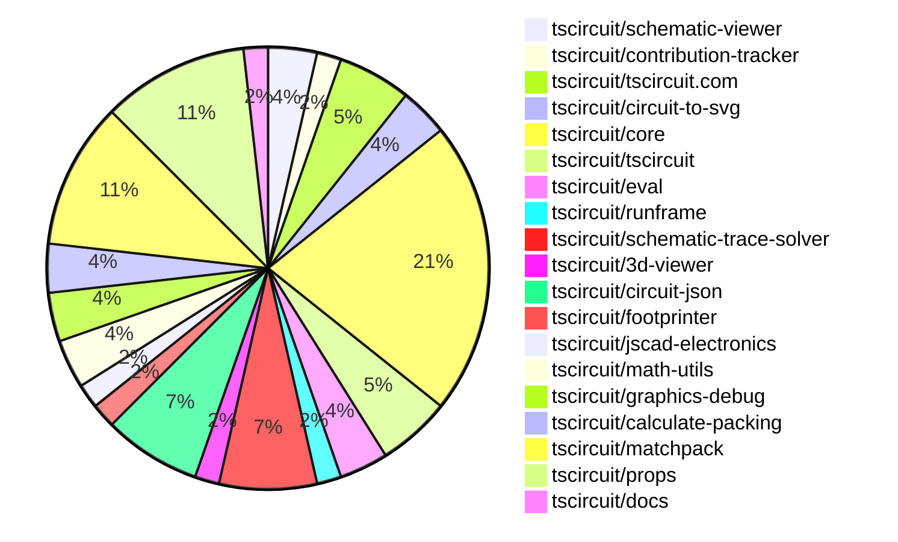
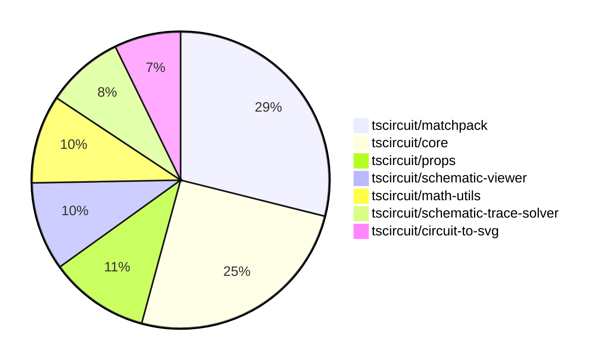

# Contribution Overview 2025-09-03

## PRs by Repository

## Contributor Overview

| Contributor | 🐳 Major | 🐙 Minor | 🐌 Tiny | ⭐ | Score | Discussion Contributions |
|-------------|---------|---------|---------|-----|----------------|--------------------------|
| [seveibar](#seveibar) | 11 | 8 | 10 | 👑👑 | 79 | 0🔹 0🔶 0💎 |
| [imrishabh18](#imrishabh18) | 1 | 2 | 9 | ⭐⭐ | 18 | 0🔹 0🔶 0💎 |
| [ArnavK-09](#ArnavK-09) | 2 | 0 | 3 | ⭐⭐ | 11 | 0🔹 0🔶 0💎 |
| [ShiboSoftwareDev](#ShiboSoftwareDev) | 1 | 1 | 1 | ⭐ | 9 | 0🔹 0🔶 0💎 |
| [techmannih](#techmannih) | 0 | 1 | 3 | ⭐ | 8 | 0🔹 0🔶 0💎 |
| [Abse2001](#Abse2001) | 0 | 1 | 0 |  | 2 | 0🔹 0🔶 0💎 |
| [MustafaMulla29](#MustafaMulla29) | 0 | 0 | 1 |  | 1 | 0🔹 0🔶 0💎 |
| [AnasSarkiz](#AnasSarkiz) | 0 | 0 | 1 |  | 1 | 0🔹 0🔶 0💎 |

### Discussion Contribution Legend

- 🔹 Normal Comments: Basic participation with minimal effort
- 🔶 Great Informative Comments: Thoughtful participation that adds value
- 💎 Incredible Comments: Exceptional participation with high-quality content

## Review Table

[reviews-received-hover]: ## "Number of reviews received for PRs for this contributor"
[approvals-received-hover]: ## "Number of approvals received for PRs this contributor authored"
[rejections-received-hover]: ## "Number of rejections received for PRs this contributor authored"
[prs-opened-hover]: ## "Number of PRs opened by this contributor"
[issues-created-hover]: ## "Number of issues created by this contributor"
[bountied-issues-hover]: ## "Number of issues this contributor created with a bounty"
[bountied-issue-$-hover]: ## "Total bounty amount placed on issues authored by this contributor"

| Contributor | Reviews Received | Approvals Received | Rejections Received | Approvals | Rejections | PRs Opened | PRs Merged | Score | Issues Created | Bountied Issues | Bountied Issue $ |
|---|---|---|---|---|---|---|---|---|---|---|---|
| [JrmyDev](#JrmyDev) | 5 | 0 | 1 | 0 | 0 | 1 | 0 | 0 | 0 | 0 | 0 |
| [seveibar](#seveibar) | 6 | 0 | 0 | 19 | 3 | 33 | 29 | 79 | 0 | 0 | 0 |
| [techmannih](#techmannih) | 14 | 5 | 0 | 0 | 0 | 7 | 4 | 8 | 0 | 0 | 0 |
| [baeoc](#baeoc) | 3 | 0 | 1 | 0 | 0 | 2 | 0 | 0 | 0 | 0 | 0 |
| [ArnavK-09](#ArnavK-09) | 7 | 5 | 0 | 0 | 0 | 5 | 5 | 11 | 0 | 0 | 0 |
| [imrishabh18](#imrishabh18) | 15 | 5 | 0 | 0 | 1 | 14 | 12 | 18 | 0 | 0 | 0 |
| [ShiboSoftwareDev](#ShiboSoftwareDev) | 6 | 3 | 0 | 2 | 0 | 4 | 3 | 9 | 0 | 0 | 0 |
| [Abse2001](#Abse2001) | 2 | 1 | 0 | 0 | 0 | 1 | 1 | 2 | 0 | 0 | 0 |
| [MustafaMulla29](#MustafaMulla29) | 7 | 1 | 2 | 0 | 0 | 2 | 1 | 1 | 0 | 0 | 0 |
| [aryel780](#aryel780) | 1 | 0 | 0 | 0 | 0 | 1 | 0 | 0 | 0 | 0 | 0 |
| [AnasSarkiz](#AnasSarkiz) | 2 | 1 | 0 | 0 | 0 | 1 | 1 | 1 | 0 | 0 | 0 |
| [Ayushjhawar8](#Ayushjhawar8) | 1 | 0 | 0 | 0 | 0 | 2 | 0 | 0 | 0 | 0 | 0 |
| [tscircuitbot](#tscircuitbot) | 0 | 0 | 0 | 0 | 0 | 16 | 0 | 0 | 0 | 0 | 0 |
| [0hmX](#0hmX) | 0 | 0 | 0 | 0 | 0 | 1 | 0 | 0 | 0 | 0 | 0 |

## Top 7 Repositories by Contribution Points

## Changes by Repository

### [tscircuit/schematic-viewer](https://github.com/tscircuit/schematic-viewer)

| PR # | Impact | Rating | Contributor | Description |
|------|--------|--------|-------------|-------------|
| [#120](https://github.com/tscircuit/schematic-viewer/pull/120) | 🐳 Major | ⭐⭐⭐ | ArnavK-09 | Adds mobile touch support for group viewing functionality in the schematic viewer, allowing users to interact with components using touch events. |
| [#119](https://github.com/tscircuit/schematic-viewer/pull/119) | 🐳 Major | ⭐⭐⭐ | ArnavK-09 | Adds mobile touch support for group viewing functionality in the ViewMenu component, allowing users to toggle group visibility using touch events. |

### [tscircuit/contribution-tracker](https://github.com/tscircuit/contribution-tracker)

🐌 Tiny Contributions (1)

| PR # | Impact | Contributor | Description |
|------|--------|-------------|-------------|
| [#218](https://github.com/tscircuit/contribution-tracker/pull/218) | 🐌 Tiny | ArnavK-09 | Adds a new component to display the list of project maintainers with their roles and avatars. |

### [tscircuit/tscircuit.com](https://github.com/tscircuit/tscircuit.com)

🐌 Tiny Contributions (3)

| PR # | Impact | Contributor | Description |
|------|--------|-------------|-------------|
| [#1631](https://github.com/tscircuit/tscircuit.com/pull/1631) | 🐌 Tiny | ArnavK-09 | Adds functionality to manually update AI description and usage instructions for a package by its owner. |
| [#1628](https://github.com/tscircuit/tscircuit.com/pull/1628) | 🐌 Tiny | ArnavK-09 | Disables the order button for packages that have no available releases to prevent users from attempting to place orders that would fail. |
| [#1632](https://github.com/tscircuit/tscircuit.com/pull/1632) | 🐌 Tiny | imrishabh18 | Updates the dependencies for tscircuit and circuit-to-svg to version 0.0.618 and 0.0.182 respectively, enabling support for trace highlighting functionality. |

### [tscircuit/circuit-to-svg](https://github.com/tscircuit/circuit-to-svg)

| PR # | Impact | Rating | Contributor | Description |
|------|--------|--------|-------------|-------------|
| [#302](https://github.com/tscircuit/circuit-to-svg/pull/302) | 🐳 Major | ⭐⭐⭐ | imrishabh18 | Fixes rendering issue where hops and arcs are buried under traces in schematic SVG output, ensuring correct visual layering of elements. |
| [#303](https://github.com/tscircuit/circuit-to-svg/pull/303) | 🐙 Minor | ⭐⭐ | imrishabh18 | Adds functionality to highlight all traces sharing the same connectivity key when hovered over in the schematic view. |

### [tscircuit/core](https://github.com/tscircuit/core)

| PR # | Impact | Rating | Contributor | Description |
|------|--------|--------|-------------|-------------|
| [#1273](https://github.com/tscircuit/core/pull/1273) | 🐳 Major | ⭐⭐⭐ | seveibar | Updates the matchpack dependency to version 0.0.12 and the calculate-packing dependency to version 0.0.31, optimizing symmetry handling in the packing algorithm. |
| [#1279](https://github.com/tscircuit/core/pull/1279) | 🐙 Minor | ⭐⭐ | imrishabh18 | Adds a subcircuit_connectivity_map_key to the schematic_trace to enhance connectivity mapping in schematic traces. |
| [#1281](https://github.com/tscircuit/core/pull/1281) | 🐙 Minor | ⭐⭐ | seveibar | Fixes schematic trace configuration for better snapshot reliability and updates matchpack to new defaults. |
| [#1274](https://github.com/tscircuit/core/pull/1274) | 🐙 Minor | ⭐⭐ | seveibar | Adds a new pinout  component backed by simple_pinout source type and updates dependencies. |
| [#1271](https://github.com/tscircuit/core/pull/1271) | 🐙 Minor | ⭐⭐ | seveibar | Skip the rp2040 decoupling capacitors test and add a benchmark for the RP2040 decoupling capacitors, registering it on the benchmark page. |
| [#1268](https://github.com/tscircuit/core/pull/1268) | 🐙 Minor | ⭐⭐ | seveibar | Adds an example circuit for the RP2040 microcontroller featuring decoupling capacitors for improved stability and performance. |
| [#1270](https://github.com/tscircuit/core/pull/1270) | 🐙 Minor | ⭐⭐ | Abse2001 | Fixes the rendering of manual PCB trace paths to support group rotation, ensuring accurate placement and orientation of traces in the PCB layout. |

🐌 Tiny Contributions (5)

| PR # | Impact | Contributor | Description |
|------|--------|-------------|-------------|
| [#1280](https://github.com/tscircuit/core/pull/1280) | 🐌 Tiny | imrishabh18 | Updates the circuit-to-svg dependency to version 0.0.182 in the package.json file. |
| [#1278](https://github.com/tscircuit/core/pull/1278) | 🐌 Tiny | imrishabh18 | Adds a test for overlapping junctions and crossings in circuit schematics. |
| [#1272](https://github.com/tscircuit/core/pull/1272) | 🐌 Tiny | seveibar | Add instructions for getting inputs to algorithms and improve matchpack debug output |
| [#1267](https://github.com/tscircuit/core/pull/1267) | 🐌 Tiny | MustafaMulla29 | Automatically adjusts silkscreen reference designator text position for passive components when they overlap with other components. |
| [#1260](https://github.com/tscircuit/core/pull/1260) | 🐌 Tiny | AnasSarkiz | Reproduces a bug where the same net is not combined in circuit layouts involving connectors, resistors, and solder jumpers. |

### [tscircuit/tscircuit](https://github.com/tscircuit/tscircuit)

🐌 Tiny Contributions (3)

| PR # | Impact | Contributor | Description |
|------|--------|-------------|-------------|
| [#756](https://github.com/tscircuit/tscircuit/pull/756) | 🐌 Tiny | imrishabh18 | Updates the version of tscircuitcore from 0.0.681 to 0.0.683 and tscircuitprops from 0.0.289 to 0.0.296 in package.json |
| [#755](https://github.com/tscircuit/tscircuit/pull/755) | 🐌 Tiny | imrishabh18 | Updates the circuit-to-svg dependency version from 0.0.174 to 0.0.182 in package.json |
| [#754](https://github.com/tscircuit/tscircuit/pull/754) | 🐌 Tiny | imrishabh18 | Updates the circuit-json dependency version from 0.0.236 to 0.0.238 in package.json |

### [tscircuit/eval](https://github.com/tscircuit/eval)

🐌 Tiny Contributions (2)

| PR # | Impact | Contributor | Description |
|------|--------|-------------|-------------|
| [#960](https://github.com/tscircuit/eval/pull/960) | 🐌 Tiny | imrishabh18 | Updates the core dependencies in the package.json file to newer versions. |
| [#961](https://github.com/tscircuit/eval/pull/961) | 🐌 Tiny | ShiboSoftwareDev | Adds support for importing local .obj files as blob URLs for CAD components in designs. |

### [tscircuit/runframe](https://github.com/tscircuit/runframe)

🐌 Tiny Contributions (1)

| PR # | Impact | Contributor | Description |
|------|--------|-------------|-------------|
| [#1076](https://github.com/tscircuit/runframe/pull/1076) | 🐌 Tiny | imrishabh18 | Updates the circuit-to-svg and tscircuit dependencies to newer versions in package.json |

### [tscircuit/schematic-trace-solver](https://github.com/tscircuit/schematic-trace-solver)

| PR # | Impact | Rating | Contributor | Description |
|------|--------|--------|-------------|-------------|
| [#39](https://github.com/tscircuit/schematic-trace-solver/pull/39) | 🐳 Major | ⭐⭐⭐ | ShiboSoftwareDev | Add logic to SchematicTraceSingleLineSolver to reject candidate elbow segments that would cross a chips center line on an axis where related pins on that chip face both directions (e.g., pins on both left and right faces - vertical center line restricted). |

🐌 Tiny Contributions (3)

| PR # | Impact | Contributor | Description |
|------|--------|-------------|-------------|
| [#37](https://github.com/tscircuit/schematic-trace-solver/pull/37) | 🐌 Tiny | imrishabh18 | Adds new examples and corresponding tests for the schematic trace solver functionality. |
| [#41](https://github.com/tscircuit/schematic-trace-solver/pull/41) | 🐌 Tiny | seveibar | Reproduces a bug related to net label placement failure in the schematic trace solver. |
| [#35](https://github.com/tscircuit/schematic-trace-solver/pull/35) | 🐌 Tiny | seveibar | Add SVG testing capabilities and setup for matcher functionality in the schematic trace solver. |

### [tscircuit/3d-viewer](https://github.com/tscircuit/3d-viewer)

| PR # | Impact | Rating | Contributor | Description |
|------|--------|--------|-------------|-------------|
| [#449](https://github.com/tscircuit/3d-viewer/pull/449) | 🐙 Minor | ⭐⭐ | techmannih | Fixes hole drilling on pads to ensure proper material removal during PCB fabrication. |

### [tscircuit/circuit-json](https://github.com/tscircuit/circuit-json)

| PR # | Impact | Rating | Contributor | Description |
|------|--------|--------|-------------|-------------|
| [#261](https://github.com/tscircuit/circuit-json/pull/261) | 🐙 Minor | ⭐⭐ | seveibar | Adds a new SourceSimplePinout schema without a pin name list, includes it in unions and exports, and tests its parsing and union inclusion. |

🐌 Tiny Contributions (3)

| PR # | Impact | Contributor | Description |
|------|--------|-------------|-------------|
| [#264](https://github.com/tscircuit/circuit-json/pull/264) | 🐌 Tiny | techmannih | Adds support for manually placed vias in the source domain, defining their properties and structure. |
| [#263](https://github.com/tscircuit/circuit-json/pull/263) | 🐌 Tiny | seveibar | Adds a boolean flag is_positive_voltage_source to the SourceNet schema and interface, updates documentation, and includes tests for parsing this new flag. |
| [#262](https://github.com/tscircuit/circuit-json/pull/262) | 🐌 Tiny | seveibar | Make schematic_trace.source_trace_id optional and add optional schematic_trace.subcircuit_connectivity_map_key, along with documentation and tests for these new fields. |

### [tscircuit/footprinter](https://github.com/tscircuit/footprinter)

🐌 Tiny Contributions (1)

| PR # | Impact | Contributor | Description |
|------|--------|-------------|-------------|
| [#366](https://github.com/tscircuit/footprinter/pull/366) | 🐌 Tiny | techmannih | Removes the outer plating around stampboard holes to ensure proper fit and functionality of components. |

### [tscircuit/jscad-electronics](https://github.com/tscircuit/jscad-electronics)

🐌 Tiny Contributions (1)

| PR # | Impact | Contributor | Description |
|------|--------|-------------|-------------|
| [#119](https://github.com/tscircuit/jscad-electronics/pull/119) | 🐌 Tiny | techmannih | Updates the tscircuitfootprinter dependency to version 0.0.234 in the package.json file. |

### [tscircuit/math-utils](https://github.com/tscircuit/math-utils)

| PR # | Impact | Rating | Contributor | Description |
|------|--------|--------|-------------|-------------|
| [#18](https://github.com/tscircuit/math-utils/pull/18) | 🐳 Major | ⭐⭐⭐ | seveibar | Add utilities to compute overlapping area and minimum distance between bounding rectangles, along with documentation updates. |
| [#17](https://github.com/tscircuit/math-utils/pull/17) | 🐳 Major | ⭐⭐⭐ | seveibar | Adds a function to determine if two bounding rectangles overlap, along with corresponding tests. |

### [tscircuit/graphics-debug](https://github.com/tscircuit/graphics-debug)

| PR # | Impact | Rating | Contributor | Description |
|------|--------|--------|-------------|-------------|
| [#73](https://github.com/tscircuit/graphics-debug/pull/73) | 🐳 Major | ⭐⭐⭐ | seveibar | Sorts rectangles by area before rendering so smaller ones appear on top when overlapping, and adds utility and tests for sorting rectangles by area. |
| [#74](https://github.com/tscircuit/graphics-debug/pull/74) | 🐙 Minor | ⭐⭐ | seveibar | Fixes the dimension overlay to ensure the hotkey for dimensions remains active immediately without requiring mouse interaction. |

### [tscircuit/calculate-packing](https://github.com/tscircuit/calculate-packing)

| PR # | Impact | Rating | Contributor | Description |
|------|--------|--------|-------------|-------------|
| [#30](https://github.com/tscircuit/calculate-packing/pull/30) | 🐳 Major | ⭐⭐⭐ | seveibar | This pull request introduces a new packing strategy called minimum_closest_sum_squared_distance to the OutlineSegmentCandidatePointSolver and SingleComponentPackSolver classes. It implements a two-phase optimization approach to improve the packing of components by minimizing the distance to the closest target point after an initial optimization phase. The changes include modifications to existing classes and the addition of a new TwoPhaseIrlsSolver class to handle the new strategy. This enhancement aims to improve the overall efficiency and accuracy of the packing algorithm. |

🐌 Tiny Contributions (1)

| PR # | Impact | Contributor | Description |
|------|--------|-------------|-------------|
| [#31](https://github.com/tscircuit/calculate-packing/pull/31) | 🐌 Tiny | seveibar | Fixes the incorrect passing of pack placement strategies in the OutlineSegmentCandidatePointSolver and SingleComponentPackSolver classes. |

### [tscircuit/matchpack](https://github.com/tscircuit/matchpack)

| PR # | Impact | Rating | Contributor | Description |
|------|--------|--------|-------------|-------------|
| [#24](https://github.com/tscircuit/matchpack/pull/24) | 🐳 Major | ⭐⭐⭐ | seveibar | Adds voltage source metadata to net definitions and modifies decoupling partition logic to require at least two decoupling capacitors connected to a positive voltage source and ground. |
| [#23](https://github.com/tscircuit/matchpack/pull/23) | 🐳 Major | ⭐⭐⭐ | seveibar | Optimizes the packing algorithm to prioritize direct connections between pins, enhancing the efficiency of the packing process. |
| [#19](https://github.com/tscircuit/matchpack/pull/19) | 🐳 Major | ⭐⭐⭐ | seveibar | Adds functionality to separate decoupling capacitors into their own partitions while partitioning remaining chips based on strong pin connections. |
| [#18](https://github.com/tscircuit/matchpack/pull/18) | 🐳 Major | ⭐⭐⭐ | seveibar | Adds a new solver to identify decoupling capacitor groups based on specific criteria, including pin configuration and connections to main chips. |
| [#17](https://github.com/tscircuit/matchpack/pull/17) | 🐳 Major | ⭐⭐⭐ | seveibar | Switches the packing placement strategy to minimum_closest_sum_squared_distance for improved packing symmetry in circuit layouts. |
| [#16](https://github.com/tscircuit/matchpack/pull/16) | 🐳 Major | ⭐⭐⭐ | seveibar | Adjusts the packing algorithm to ensure that the chip body pad fully envelopes the pads, improving layout accuracy in inner partition packing. |

### [tscircuit/props](https://github.com/tscircuit/props)

| PR # | Impact | Rating | Contributor | Description |
|------|--------|--------|-------------|-------------|
| [#367](https://github.com/tscircuit/props/pull/367) | 🐙 Minor | ⭐⭐ | seveibar | Add SymbolProps and symbolProps for new symbol  container, export and document the symbol  schematic element, and add tests for symbol props parsing. |
| [#366](https://github.com/tscircuit/props/pull/366) | 🐙 Minor | ⭐⭐ | seveibar | Add a pinout  component that reuses chip props, documents PinoutProps in README, exports new pinout schema, and adds basic parsing test. |
| [#371](https://github.com/tscircuit/props/pull/371) | 🐙 Minor | ⭐⭐ | ShiboSoftwareDev | Adds support for rect, circle, and polygon shapes in CopperPour components, along with a connectsTo prop for net association, zod schemas for validation, and comprehensive unit tests. |

🐌 Tiny Contributions (3)

| PR # | Impact | Contributor | Description |
|------|--------|-------------|-------------|
| [#370](https://github.com/tscircuit/props/pull/370) | 🐌 Tiny | seveibar | Add optional connections to VoltageSourceProps, enabling the specification of connections for voltage sources in the components props. |
| [#369](https://github.com/tscircuit/props/pull/369) | 🐌 Tiny | seveibar | Adds support for connections prop in the inductor  component, including documentation and tests for parsing connections. |
| [#368](https://github.com/tscircuit/props/pull/368) | 🐌 Tiny | seveibar | Adds an optional borderRadius property for board components, updates documentation, and includes tests for borderRadius parsing. |

### [tscircuit/docs](https://github.com/tscircuit/docs)

🐌 Tiny Contributions (1)

| PR # | Impact | Contributor | Description |
|------|--------|-------------|-------------|
| [#127](https://github.com/tscircuit/docs/pull/127) | 🐌 Tiny | seveibar | Add a guide on using JavaScript expressions to derive component values, including examples for voltage dividers and LC resonant circuits, while fixing existing examples and ensuring successful site builds. |

## Changes by Contributor

### [ArnavK-09](https://github.com/ArnavK-09)

| PRs # | Impact | Rating | Description |
|------|--------|--------|-------------|
| [#120](https://github.com/tscircuit/schematic-viewer/pull/120) | 🐳 Major | ⭐⭐⭐ | Adds mobile touch support for group viewing functionality in the schematic viewer, allowing users to interact with components using touch events. |
| [#119](https://github.com/tscircuit/schematic-viewer/pull/119) | 🐳 Major | ⭐⭐⭐ | Adds mobile touch support for group viewing functionality in the ViewMenu component, allowing users to toggle group visibility using touch events. |

🐌 Tiny Contributions (3)

| PR # | Impact | Description |
|------|--------|-------------|
| [#218](https://github.com/tscircuit/contribution-tracker/pull/218) | 🐌 Tiny | Adds a new component to display the list of project maintainers with their roles and avatars. |
| [#1631](https://github.com/tscircuit/tscircuit.com/pull/1631) | 🐌 Tiny | Adds functionality to manually update AI description and usage instructions for a package by its owner. |
| [#1628](https://github.com/tscircuit/tscircuit.com/pull/1628) | 🐌 Tiny | Disables the order button for packages that have no available releases to prevent users from attempting to place orders that would fail. |

### [imrishabh18](https://github.com/imrishabh18)

| PRs # | Impact | Rating | Description |
|------|--------|--------|-------------|
| [#302](https://github.com/tscircuit/circuit-to-svg/pull/302) | 🐳 Major | ⭐⭐⭐ | Fixes rendering issue where hops and arcs are buried under traces in schematic SVG output, ensuring correct visual layering of elements. |
| [#1279](https://github.com/tscircuit/core/pull/1279) | 🐙 Minor | ⭐⭐ | Adds a subcircuit_connectivity_map_key to the schematic_trace to enhance connectivity mapping in schematic traces. |
| [#303](https://github.com/tscircuit/circuit-to-svg/pull/303) | 🐙 Minor | ⭐⭐ | Adds functionality to highlight all traces sharing the same connectivity key when hovered over in the schematic view. |

🐌 Tiny Contributions (9)

| PR # | Impact | Description |
|------|--------|-------------|
| [#756](https://github.com/tscircuit/tscircuit/pull/756) | 🐌 Tiny | Updates the version of tscircuitcore from 0.0.681 to 0.0.683 and tscircuitprops from 0.0.289 to 0.0.296 in package.json |
| [#755](https://github.com/tscircuit/tscircuit/pull/755) | 🐌 Tiny | Updates the circuit-to-svg dependency version from 0.0.174 to 0.0.182 in package.json |
| [#754](https://github.com/tscircuit/tscircuit/pull/754) | 🐌 Tiny | Updates the circuit-json dependency version from 0.0.236 to 0.0.238 in package.json |
| [#1280](https://github.com/tscircuit/core/pull/1280) | 🐌 Tiny | Updates the circuit-to-svg dependency to version 0.0.182 in the package.json file. |
| [#1278](https://github.com/tscircuit/core/pull/1278) | 🐌 Tiny | Adds a test for overlapping junctions and crossings in circuit schematics. |
| [#1632](https://github.com/tscircuit/tscircuit.com/pull/1632) | 🐌 Tiny | Updates the dependencies for tscircuit and circuit-to-svg to version 0.0.618 and 0.0.182 respectively, enabling support for trace highlighting functionality. |
| [#960](https://github.com/tscircuit/eval/pull/960) | 🐌 Tiny | Updates the core dependencies in the package.json file to newer versions. |
| [#1076](https://github.com/tscircuit/runframe/pull/1076) | 🐌 Tiny | Updates the circuit-to-svg and tscircuit dependencies to newer versions in package.json |
| [#37](https://github.com/tscircuit/schematic-trace-solver/pull/37) | 🐌 Tiny | Adds new examples and corresponding tests for the schematic trace solver functionality. |

### [techmannih](https://github.com/techmannih)

| PRs # | Impact | Rating | Description |
|------|--------|--------|-------------|
| [#449](https://github.com/tscircuit/3d-viewer/pull/449) | 🐙 Minor | ⭐⭐ | Fixes hole drilling on pads to ensure proper material removal during PCB fabrication. |

🐌 Tiny Contributions (3)

| PR # | Impact | Description |
|------|--------|-------------|
| [#264](https://github.com/tscircuit/circuit-json/pull/264) | 🐌 Tiny | Adds support for manually placed vias in the source domain, defining their properties and structure. |
| [#366](https://github.com/tscircuit/footprinter/pull/366) | 🐌 Tiny | Removes the outer plating around stampboard holes to ensure proper fit and functionality of components. |
| [#119](https://github.com/tscircuit/jscad-electronics/pull/119) | 🐌 Tiny | Updates the tscircuitfootprinter dependency to version 0.0.234 in the package.json file. |

### [seveibar](https://github.com/seveibar)

| PRs # | Impact | Rating | Description |
|------|--------|--------|-------------|
| [#1273](https://github.com/tscircuit/core/pull/1273) | 🐳 Major | ⭐⭐⭐ | Updates the matchpack dependency to version 0.0.12 and the calculate-packing dependency to version 0.0.31, optimizing symmetry handling in the packing algorithm. |
| [#18](https://github.com/tscircuit/math-utils/pull/18) | 🐳 Major | ⭐⭐⭐ | Add utilities to compute overlapping area and minimum distance between bounding rectangles, along with documentation updates. |
| [#17](https://github.com/tscircuit/math-utils/pull/17) | 🐳 Major | ⭐⭐⭐ | Adds a function to determine if two bounding rectangles overlap, along with corresponding tests. |
| [#73](https://github.com/tscircuit/graphics-debug/pull/73) | 🐳 Major | ⭐⭐⭐ | Sorts rectangles by area before rendering so smaller ones appear on top when overlapping, and adds utility and tests for sorting rectangles by area. |
| [#30](https://github.com/tscircuit/calculate-packing/pull/30) | 🐳 Major | ⭐⭐⭐ | This pull request introduces a new packing strategy called minimum_closest_sum_squared_distance to the OutlineSegmentCandidatePointSolver and SingleComponentPackSolver classes. It implements a two-phase optimization approach to improve the packing of components by minimizing the distance to the closest target point after an initial optimization phase. The changes include modifications to existing classes and the addition of a new TwoPhaseIrlsSolver class to handle the new strategy. This enhancement aims to improve the overall efficiency and accuracy of the packing algorithm. |
| [#24](https://github.com/tscircuit/matchpack/pull/24) | 🐳 Major | ⭐⭐⭐ | Adds voltage source metadata to net definitions and modifies decoupling partition logic to require at least two decoupling capacitors connected to a positive voltage source and ground. |
| [#23](https://github.com/tscircuit/matchpack/pull/23) | 🐳 Major | ⭐⭐⭐ | Optimizes the packing algorithm to prioritize direct connections between pins, enhancing the efficiency of the packing process. |
| [#19](https://github.com/tscircuit/matchpack/pull/19) | 🐳 Major | ⭐⭐⭐ | Adds functionality to separate decoupling capacitors into their own partitions while partitioning remaining chips based on strong pin connections. |
| [#18](https://github.com/tscircuit/matchpack/pull/18) | 🐳 Major | ⭐⭐⭐ | Adds a new solver to identify decoupling capacitor groups based on specific criteria, including pin configuration and connections to main chips. |
| [#17](https://github.com/tscircuit/matchpack/pull/17) | 🐳 Major | ⭐⭐⭐ | Switches the packing placement strategy to minimum_closest_sum_squared_distance for improved packing symmetry in circuit layouts. |
| [#16](https://github.com/tscircuit/matchpack/pull/16) | 🐳 Major | ⭐⭐⭐ | Adjusts the packing algorithm to ensure that the chip body pad fully envelopes the pads, improving layout accuracy in inner partition packing. |
| [#261](https://github.com/tscircuit/circuit-json/pull/261) | 🐙 Minor | ⭐⭐ | Adds a new SourceSimplePinout schema without a pin name list, includes it in unions and exports, and tests its parsing and union inclusion. |
| [#367](https://github.com/tscircuit/props/pull/367) | 🐙 Minor | ⭐⭐ | Add SymbolProps and symbolProps for new symbol  container, export and document the symbol  schematic element, and add tests for symbol props parsing. |
| [#366](https://github.com/tscircuit/props/pull/366) | 🐙 Minor | ⭐⭐ | Add a pinout  component that reuses chip props, documents PinoutProps in README, exports new pinout schema, and adds basic parsing test. |
| [#1281](https://github.com/tscircuit/core/pull/1281) | 🐙 Minor | ⭐⭐ | Fixes schematic trace configuration for better snapshot reliability and updates matchpack to new defaults. |
| [#1274](https://github.com/tscircuit/core/pull/1274) | 🐙 Minor | ⭐⭐ | Adds a new pinout  component backed by simple_pinout source type and updates dependencies. |
| [#1271](https://github.com/tscircuit/core/pull/1271) | 🐙 Minor | ⭐⭐ | Skip the rp2040 decoupling capacitors test and add a benchmark for the RP2040 decoupling capacitors, registering it on the benchmark page. |
| [#1268](https://github.com/tscircuit/core/pull/1268) | 🐙 Minor | ⭐⭐ | Adds an example circuit for the RP2040 microcontroller featuring decoupling capacitors for improved stability and performance. |
| [#74](https://github.com/tscircuit/graphics-debug/pull/74) | 🐙 Minor | ⭐⭐ | Fixes the dimension overlay to ensure the hotkey for dimensions remains active immediately without requiring mouse interaction. |

🐌 Tiny Contributions (10)

| PR # | Impact | Description |
|------|--------|-------------|
| [#263](https://github.com/tscircuit/circuit-json/pull/263) | 🐌 Tiny | Adds a boolean flag is_positive_voltage_source to the SourceNet schema and interface, updates documentation, and includes tests for parsing this new flag. |
| [#262](https://github.com/tscircuit/circuit-json/pull/262) | 🐌 Tiny | Make schematic_trace.source_trace_id optional and add optional schematic_trace.subcircuit_connectivity_map_key, along with documentation and tests for these new fields. |
| [#370](https://github.com/tscircuit/props/pull/370) | 🐌 Tiny | Add optional connections to VoltageSourceProps, enabling the specification of connections for voltage sources in the components props. |
| [#369](https://github.com/tscircuit/props/pull/369) | 🐌 Tiny | Adds support for connections prop in the inductor  component, including documentation and tests for parsing connections. |
| [#368](https://github.com/tscircuit/props/pull/368) | 🐌 Tiny | Adds an optional borderRadius property for board components, updates documentation, and includes tests for borderRadius parsing. |
| [#1272](https://github.com/tscircuit/core/pull/1272) | 🐌 Tiny | Add instructions for getting inputs to algorithms and improve matchpack debug output |
| [#127](https://github.com/tscircuit/docs/pull/127) | 🐌 Tiny | Add a guide on using JavaScript expressions to derive component values, including examples for voltage dividers and LC resonant circuits, while fixing existing examples and ensuring successful site builds. |
| [#31](https://github.com/tscircuit/calculate-packing/pull/31) | 🐌 Tiny | Fixes the incorrect passing of pack placement strategies in the OutlineSegmentCandidatePointSolver and SingleComponentPackSolver classes. |
| [#41](https://github.com/tscircuit/schematic-trace-solver/pull/41) | 🐌 Tiny | Reproduces a bug related to net label placement failure in the schematic trace solver. |
| [#35](https://github.com/tscircuit/schematic-trace-solver/pull/35) | 🐌 Tiny | Add SVG testing capabilities and setup for matcher functionality in the schematic trace solver. |

### [ShiboSoftwareDev](https://github.com/ShiboSoftwareDev)

| PRs # | Impact | Rating | Description |
|------|--------|--------|-------------|
| [#39](https://github.com/tscircuit/schematic-trace-solver/pull/39) | 🐳 Major | ⭐⭐⭐ | Add logic to SchematicTraceSingleLineSolver to reject candidate elbow segments that would cross a chips center line on an axis where related pins on that chip face both directions (e.g., pins on both left and right faces - vertical center line restricted). |
| [#371](https://github.com/tscircuit/props/pull/371) | 🐙 Minor | ⭐⭐ | Adds support for rect, circle, and polygon shapes in CopperPour components, along with a connectsTo prop for net association, zod schemas for validation, and comprehensive unit tests. |

🐌 Tiny Contributions (1)

| PR # | Impact | Description |
|------|--------|-------------|
| [#961](https://github.com/tscircuit/eval/pull/961) | 🐌 Tiny | Adds support for importing local .obj files as blob URLs for CAD components in designs. |

### [Abse2001](https://github.com/Abse2001)

| PRs # | Impact | Rating | Description |
|------|--------|--------|-------------|
| [#1270](https://github.com/tscircuit/core/pull/1270) | 🐙 Minor | ⭐⭐ | Fixes the rendering of manual PCB trace paths to support group rotation, ensuring accurate placement and orientation of traces in the PCB layout. |

### [MustafaMulla29](https://github.com/MustafaMulla29)

🐌 Tiny Contributions (1)

| PR # | Impact | Description |
|------|--------|-------------|
| [#1267](https://github.com/tscircuit/core/pull/1267) | 🐌 Tiny | Automatically adjusts silkscreen reference designator text position for passive components when they overlap with other components. |

### [AnasSarkiz](https://github.com/AnasSarkiz)

🐌 Tiny Contributions (1)

| PR # | Impact | Description |
|------|--------|-------------|
| [#1260](https://github.com/tscircuit/core/pull/1260) | 🐌 Tiny | Reproduces a bug where the same net is not combined in circuit layouts involving connectors, resistors, and solder jumpers. |

## Repository Owners

| Repository | Codeowners |
|------------|------------|
| [builder](https://github.com/tscircuit/builder/blob/main/.github/CODEOWNERS) | [seveibar](https://github.com/seveibar)
| [pcb-viewer](https://github.com/tscircuit/pcb-viewer/blob/main/.github/CODEOWNERS) | [seveibar](https://github.com/seveibar), [ShiboSoftwareDev](https://github.com/ShiboSoftwareDev)
| [footprints-old](https://github.com/tscircuit/footprints-old/blob/main/.github/CODEOWNERS) | [seveibar](https://github.com/seveibar)
| [footprinter](https://github.com/tscircuit/footprinter/blob/main/.github/CODEOWNERS) | [seveibar](https://github.com/seveibar), [techmannih](https://github.com/techmannih)
| [3d-viewer](https://github.com/tscircuit/3d-viewer/blob/main/.github/CODEOWNERS) | [ShiboSoftwareDev](https://github.com/ShiboSoftwareDev)
| [winterspec](https://github.com/tscircuit/winterspec/blob/main/.github/CODEOWNERS) | [seveibar](https://github.com/seveibar), [ShiboSoftwareDev](https://github.com/ShiboSoftwareDev)
| [jscad-electronics](https://github.com/tscircuit/jscad-electronics/blob/main/.github/CODEOWNERS) | [seveibar](https://github.com/seveibar), [abhijitxy](https://github.com/abhijitxy), [anas-sarkez](https://github.com/anas-sarkez)
| [circuit-to-svg](https://github.com/tscircuit/circuit-to-svg/blob/main/.github/CODEOWNERS) | [imrishabh18](https://github.com/imrishabh18)
| [schematic-symbols](https://github.com/tscircuit/schematic-symbols/blob/main/.github/CODEOWNERS) | [seveibar](https://github.com/seveibar), [imrishabh18](https://github.com/imrishabh18), [techmannih](https://github.com/techmannih)
| [circuit-json-to-gerber](https://github.com/tscircuit/circuit-json-to-gerber/blob/main/.github/CODEOWNERS) | [seveibar](https://github.com/seveibar), [ShiboSoftwareDev](https://github.com/ShiboSoftwareDev)
| [tscircuit.com](https://github.com/tscircuit/tscircuit.com/blob/main/.github/CODEOWNERS) | [seveibar](https://github.com/seveibar), [imrishabh18](https://github.com/imrishabh18)
| [cli](https://github.com/tscircuit/cli/blob/main/.github/CODEOWNERS) | [seveibar](https://github.com/seveibar), [imrishabh18](https://github.com/imrishabh18), [ArnavK-09](https://github.com/ArnavK-09)
| [issue-roulette](https://github.com/tscircuit/issue-roulette/blob/main/.github/CODEOWNERS) | [Anshgrover23](https://github.com/Anshgrover23)
| [sparkfun-boards](https://github.com/tscircuit/sparkfun-boards/blob/main/.github/CODEOWNERS) | [ShiboSoftwareDev](https://github.com/ShiboSoftwareDev), [Abse2001](https://github.com/Abse2001), [MustafaMulla29](https://github.com/MustafaMulla29), [Anshgrover23](https://github.com/Anshgrover23), [techmannih](https://github.com/techmannih)
| [schematic-corpus](https://github.com/tscircuit/schematic-corpus/blob/main/.github/CODEOWNERS) | [Abse2001](https://github.com/Abse2001)

## Repositories by Owner

| User | Repo |
|------|------|
| [seveibar](https://github.com/seveibar) | [builder](https://github.com/tscircuit/builder/blob/main/.github/CODEOWNERS) |
|  | [pcb-viewer](https://github.com/tscircuit/pcb-viewer/blob/main/.github/CODEOWNERS) |
|  | [footprints-old](https://github.com/tscircuit/footprints-old/blob/main/.github/CODEOWNERS) |
|  | [footprinter](https://github.com/tscircuit/footprinter/blob/main/.github/CODEOWNERS) |
|  | [winterspec](https://github.com/tscircuit/winterspec/blob/main/.github/CODEOWNERS) |
|  | [jscad-electronics](https://github.com/tscircuit/jscad-electronics/blob/main/.github/CODEOWNERS) |
|  | [schematic-symbols](https://github.com/tscircuit/schematic-symbols/blob/main/.github/CODEOWNERS) |
|  | [circuit-json-to-gerber](https://github.com/tscircuit/circuit-json-to-gerber/blob/main/.github/CODEOWNERS) |
|  | [tscircuit.com](https://github.com/tscircuit/tscircuit.com/blob/main/.github/CODEOWNERS) |
|  | [cli](https://github.com/tscircuit/cli/blob/main/.github/CODEOWNERS) |
| [ShiboSoftwareDev](https://github.com/ShiboSoftwareDev) | [pcb-viewer](https://github.com/tscircuit/pcb-viewer/blob/main/.github/CODEOWNERS) |
|  | [3d-viewer](https://github.com/tscircuit/3d-viewer/blob/main/.github/CODEOWNERS) |
|  | [winterspec](https://github.com/tscircuit/winterspec/blob/main/.github/CODEOWNERS) |
|  | [circuit-json-to-gerber](https://github.com/tscircuit/circuit-json-to-gerber/blob/main/.github/CODEOWNERS) |
|  | [sparkfun-boards](https://github.com/tscircuit/sparkfun-boards/blob/main/.github/CODEOWNERS) |
| [techmannih](https://github.com/techmannih) | [footprinter](https://github.com/tscircuit/footprinter/blob/main/.github/CODEOWNERS) |
|  | [schematic-symbols](https://github.com/tscircuit/schematic-symbols/blob/main/.github/CODEOWNERS) |
|  | [sparkfun-boards](https://github.com/tscircuit/sparkfun-boards/blob/main/.github/CODEOWNERS) |
| [abhijitxy](https://github.com/abhijitxy) | [jscad-electronics](https://github.com/tscircuit/jscad-electronics/blob/main/.github/CODEOWNERS) |
| [anas-sarkez](https://github.com/anas-sarkez) | [jscad-electronics](https://github.com/tscircuit/jscad-electronics/blob/main/.github/CODEOWNERS) |
| [imrishabh18](https://github.com/imrishabh18) | [circuit-to-svg](https://github.com/tscircuit/circuit-to-svg/blob/main/.github/CODEOWNERS) |
|  | [schematic-symbols](https://github.com/tscircuit/schematic-symbols/blob/main/.github/CODEOWNERS) |
|  | [tscircuit.com](https://github.com/tscircuit/tscircuit.com/blob/main/.github/CODEOWNERS) |
|  | [cli](https://github.com/tscircuit/cli/blob/main/.github/CODEOWNERS) |
| [ArnavK-09](https://github.com/ArnavK-09) | [cli](https://github.com/tscircuit/cli/blob/main/.github/CODEOWNERS) |
| [Anshgrover23](https://github.com/Anshgrover23) | [issue-roulette](https://github.com/tscircuit/issue-roulette/blob/main/.github/CODEOWNERS) |
|  | [sparkfun-boards](https://github.com/tscircuit/sparkfun-boards/blob/main/.github/CODEOWNERS) |
| [Abse2001](https://github.com/Abse2001) | [sparkfun-boards](https://github.com/tscircuit/sparkfun-boards/blob/main/.github/CODEOWNERS) |
|  | [schematic-corpus](https://github.com/tscircuit/schematic-corpus/blob/main/.github/CODEOWNERS) |
| [MustafaMulla29](https://github.com/MustafaMulla29) | [sparkfun-boards](https://github.com/tscircuit/sparkfun-boards/blob/main/.github/CODEOWNERS) |

