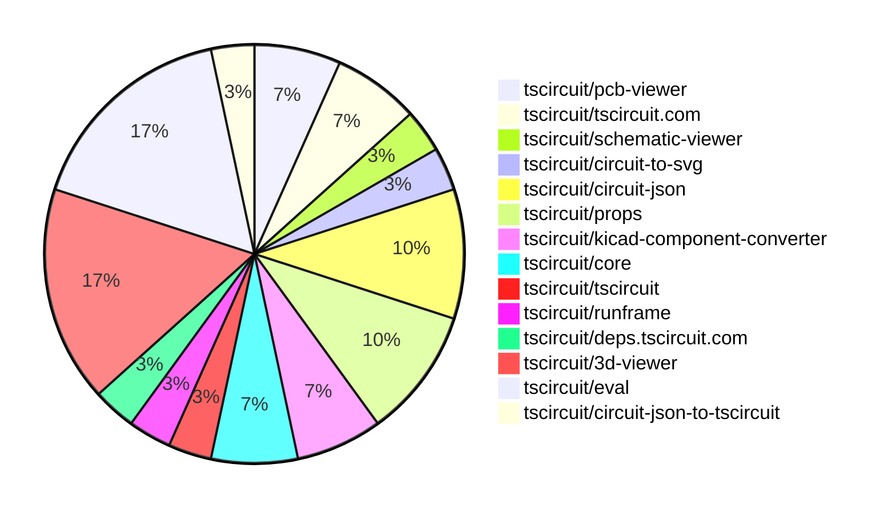
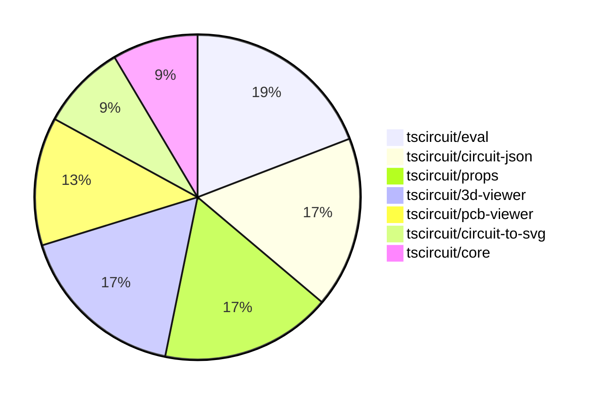

# Contribution Overview 2025-09-10

## PRs by Repository

## Contributor Overview

| Contributor | 🐳 Major | 🐙 Minor | 🐌 Tiny | ⭐ | Score | Discussion Contributions |
|-------------|---------|---------|---------|-----|----------------|--------------------------|
| [seveibar](#seveibar) | 0 | 7 | 2 | ⭐⭐ | 24 | 0🔹 0🔶 0💎 |
| [imrishabh18](#imrishabh18) | 1 | 5 | 5 | ⭐⭐ | 19.5 | 0🔹 0🔶 0💎 |
| [ShiboSoftwareDev](#ShiboSoftwareDev) | 1 | 2 | 1 | ⭐ | 9 | 0🔹 0🔶 0💎 |
| [ArnavK-09](#ArnavK-09) | 1 | 1 | 1 | ⭐ | 7 | 0🔹 0🔶 0💎 |
| [AnasSarkiz](#AnasSarkiz) | 1 | 0 | 0 | ⭐ | 4 | 0🔹 0🔶 0💎 |
| [Abse2001](#Abse2001) | 0 | 1 | 0 |  | 2 | 0🔹 0🔶 0💎 |
| [tscircuitbot](#tscircuitbot) | 0 | 0 | 1 |  | 1 | 0🔹 0🔶 0💎 |

### Discussion Contribution Legend

- 🔹 Normal Comments: Basic participation with minimal effort
- 🔶 Great Informative Comments: Thoughtful participation that adds value
- 💎 Incredible Comments: Exceptional participation with high-quality content

## Review Table

[reviews-received-hover]: ## "Number of reviews received for PRs for this contributor"
[approvals-received-hover]: ## "Number of approvals received for PRs this contributor authored"
[rejections-received-hover]: ## "Number of rejections received for PRs this contributor authored"
[prs-opened-hover]: ## "Number of PRs opened by this contributor"
[issues-created-hover]: ## "Number of issues created by this contributor"
[bountied-issues-hover]: ## "Number of issues this contributor created with a bounty"
[bountied-issue-$-hover]: ## "Total bounty amount placed on issues authored by this contributor"

| Contributor | Reviews Received | Approvals Received | Rejections Received | Approvals | Rejections | PRs Opened | PRs Merged | Score | Issues Created | Bountied Issues | Bountied Issue $ |
|---|---|---|---|---|---|---|---|---|---|---|---|
| [ArnavK-09](#ArnavK-09) | 4 | 3 | 0 | 0 | 0 | 3 | 3 | 7 | 0 | 0 | 0 |
| [seveibar](#seveibar) | 3 | 0 | 0 | 12 | 3 | 11 | 9 | 24 | 0 | 0 | 0 |
| [imrishabh18](#imrishabh18) | 6 | 2 | 0 | 1 | 0 | 12 | 11 | 19.5 | 0 | 0 | 0 |
| [techmannih](#techmannih) | 2 | 0 | 1 | 0 | 0 | 2 | 0 | 0 | 0 | 0 | 0 |
| [AnasSarkiz](#AnasSarkiz) | 14 | 1 | 2 | 0 | 0 | 3 | 1 | 4 | 0 | 0 | 0 |
| [ShiboSoftwareDev](#ShiboSoftwareDev) | 5 | 5 | 0 | 0 | 0 | 5 | 4 | 9 | 0 | 0 | 0 |
| [Abse2001](#Abse2001) | 3 | 2 | 0 | 0 | 0 | 1 | 1 | 2 | 0 | 0 | 0 |
| [tscircuitbot](#tscircuitbot) | 0 | 0 | 0 | 0 | 0 | 4 | 1 | 1 | 0 | 0 | 0 |
| [DiwanshuVerma](#DiwanshuVerma) | 0 | 0 | 0 | 0 | 0 | 1 | 0 | 0 | 0 | 0 | 0 |

## Top 7 Repositories by Contribution Points

## Changes by Repository

### [tscircuit/pcb-viewer](https://github.com/tscircuit/pcb-viewer)

| PR # | Impact | Rating | Contributor | Description |
|------|--------|--------|-------------|-------------|
| [#369](https://github.com/tscircuit/pcb-viewer/pull/369) | 🐳 Major | ⭐⭐⭐ | ArnavK-09 | fix 368  claim 368 |
| [#371](https://github.com/tscircuit/pcb-viewer/pull/371) | 🐙 Minor | ⭐⭐ | imrishabh18 | Adds support for hole offsets in the circular hole with rectangular pad element in PCBViewer. |

### [tscircuit/tscircuit.com](https://github.com/tscircuit/tscircuit.com)

| PR # | Impact | Rating | Contributor | Description |
|------|--------|--------|-------------|-------------|
| [#1638](https://github.com/tscircuit/tscircuit.com/pull/1638) | 🐙 Minor | ⭐⭐ | ArnavK-09 | Fixes a bug where the UI displayed outdated content after files were saved, ensuring the latest changes are reflected immediately. |

🐌 Tiny Contributions (1)

| PR # | Impact | Contributor | Description |
|------|--------|-------------|-------------|
| [#1655](https://github.com/tscircuit/tscircuit.com/pull/1655) | 🐌 Tiny | imrishabh18 | Updates the versions of the 3D viewer and assembly viewer dependencies in the project. |

### [tscircuit/schematic-viewer](https://github.com/tscircuit/schematic-viewer)

🐌 Tiny Contributions (1)

| PR # | Impact | Contributor | Description |
|------|--------|-------------|-------------|
| [#130](https://github.com/tscircuit/schematic-viewer/pull/130) | 🐌 Tiny | ArnavK-09 | Removes rounded borders from group overlays in the schematic viewer by setting the rx and ry attributes to 0. |

### [tscircuit/circuit-to-svg](https://github.com/tscircuit/circuit-to-svg)

| PR # | Impact | Rating | Contributor | Description |
|------|--------|--------|-------------|-------------|
| [#310](https://github.com/tscircuit/circuit-to-svg/pull/310) | 🐳 Major | ⭐⭐⭐ | imrishabh18 | Adds an offset for the hole inside the pad in PCB designs, allowing for more precise placement of holes in relation to their pads. |

### [tscircuit/circuit-json](https://github.com/tscircuit/circuit-json)

| PR # | Impact | Rating | Contributor | Description |
|------|--------|--------|-------------|-------------|
| [#272](https://github.com/tscircuit/circuit-json/pull/272) | 🐳 Major | ⭐⭐⭐ | AnasSarkiz | Add PcbComponentOutsideBoardError to detect when PCB components are placed outside the boards physical boundaries, with detailed positioning data for debugging and automated correction. |
| [#274](https://github.com/tscircuit/circuit-json/pull/274) | 🐙 Minor | ⭐⭐ | imrishabh18 | Adds hole offset parameters for circular plated holes with rectangular pads to allow for non-centered hole placement. |
| [#273](https://github.com/tscircuit/circuit-json/pull/273) | 🐙 Minor | ⭐⭐ | seveibar | Adds an optional model_unit_to_mm_scale_factor to the CAD component schema, allowing for unit scaling in CAD components. |

### [tscircuit/props](https://github.com/tscircuit/props)

| PR # | Impact | Rating | Contributor | Description |
|------|--------|--------|-------------|-------------|
| [#376](https://github.com/tscircuit/props/pull/376) | 🐳 Major | ⭐⭐⭐ | ShiboSoftwareDev | Refactors the copper-pour component to support a more flexible and customizable interface for different shapes. |
| [#392](https://github.com/tscircuit/props/pull/392) | 🐙 Minor | ⭐⭐ | imrishabh18 | Adds properties pcbHoleOffsetX and pcbHoleOffsetY to the CircularHoleWithRectPlatedProps interface for specifying PCB hole offsets. |
| [#391](https://github.com/tscircuit/props/pull/391) | 🐙 Minor | ⭐⭐ | seveibar | Allows specifying CAD model unit scale via optional modelUnitToMmScale and covers the new CAD model property in tests. |

### [tscircuit/kicad-component-converter](https://github.com/tscircuit/kicad-component-converter)

| PR # | Impact | Rating | Contributor | Description |
|------|--------|--------|-------------|-------------|
| [#129](https://github.com/tscircuit/kicad-component-converter/pull/129) | 🐙 Minor | ⭐⭐ | imrishabh18 | Adds support for a new pad shape circular_hole_with_rect_pad in the KiCad component converter, allowing for better representation of specific PCB designs. |

🐌 Tiny Contributions (1)

| PR # | Impact | Contributor | Description |
|------|--------|-------------|-------------|
| [#128](https://github.com/tscircuit/kicad-component-converter/pull/128) | 🐌 Tiny | imrishabh18 | Fixes support for failing kicad_mod file for capacitor_6x2 by filtering out non-numeric flags before parsing attributes. |

### [tscircuit/core](https://github.com/tscircuit/core)

| PR # | Impact | Rating | Contributor | Description |
|------|--------|--------|-------------|-------------|
| [#1326](https://github.com/tscircuit/core/pull/1326) | 🐙 Minor | ⭐⭐ | imrishabh18 | Adds support for hole offset in the shape circular_hole_with_rect_pad by introducing new properties for hole offsets in the PlatedHole component. |
| [#1325](https://github.com/tscircuit/core/pull/1325) | 🐙 Minor | ⭐⭐ | seveibar | Maps cadModel.modelUnitToMmScale onto cad_component.model_unit_to_mm_scale_factor and updates dependencies for CAD component scale factor propagation. |

### [tscircuit/tscircuit](https://github.com/tscircuit/tscircuit)

🐌 Tiny Contributions (1)

| PR # | Impact | Contributor | Description |
|------|--------|-------------|-------------|
| [#769](https://github.com/tscircuit/tscircuit/pull/769) | 🐌 Tiny | imrishabh18 | Updates the versions of the tscircuitprops and circuit-json dependencies in package.json |

### [tscircuit/runframe](https://github.com/tscircuit/runframe)

🐌 Tiny Contributions (1)

| PR # | Impact | Contributor | Description |
|------|--------|-------------|-------------|
| [#1112](https://github.com/tscircuit/runframe/pull/1112) | 🐌 Tiny | imrishabh18 | Updates the 3D viewer dependency and adds an example for using an asynchronous footprint circuit in the RunFrame component. |

### [tscircuit/deps.tscircuit.com](https://github.com/tscircuit/deps.tscircuit.com)

🐌 Tiny Contributions (1)

| PR # | Impact | Contributor | Description |
|------|--------|-------------|-------------|
| [#26](https://github.com/tscircuit/deps.tscircuit.com/pull/26) | 🐌 Tiny | imrishabh18 | Adds a new Upstream category to the dependency graph, allowing users to filter dependencies that are crucial for circuit preview and rendering. |

### [tscircuit/3d-viewer](https://github.com/tscircuit/3d-viewer)

| PR # | Impact | Rating | Contributor | Description |
|------|--------|--------|-------------|-------------|
| [#470](https://github.com/tscircuit/3d-viewer/pull/470) | 🐙 Minor | ⭐⭐ | seveibar | Adds model unit scaling support and removes KiCad autoscaling line |
| [#469](https://github.com/tscircuit/3d-viewer/pull/469) | 🐙 Minor | ⭐⭐ | seveibar | Sanitizes VRML DEFUSE names containing hyphens before parsing, ensuring compatibility with the VRML parser and adds a regression test for this functionality. |
| [#472](https://github.com/tscircuit/3d-viewer/pull/472) | 🐙 Minor | ⭐⭐ | Abse2001 | Fixes tooltip positioning calculations to ensure tooltips are displayed correctly when the 3D viewer is embedded in containers with different positioning contexts. |

🐌 Tiny Contributions (2)

| PR # | Impact | Contributor | Description |
|------|--------|-------------|-------------|
| [#468](https://github.com/tscircuit/3d-viewer/pull/468) | 🐌 Tiny | seveibar | Fixes start script, adds KiCad resistor story, adds proper async rendering, and replicates VRMLLoader error. |
| [#465](https://github.com/tscircuit/3d-viewer/pull/465) | 🐌 Tiny | ShiboSoftwareDev | Adds a story test for GLTF model support in the CadViewer component. |

### [tscircuit/eval](https://github.com/tscircuit/eval)

| PR # | Impact | Rating | Contributor | Description |
|------|--------|--------|-------------|-------------|
| [#1029](https://github.com/tscircuit/eval/pull/1029) | 🐙 Minor | ⭐⭐ | seveibar | Sets the model unit scale for WRLs derived from KiCad STEP files to 2.54 mm. |
| [#1028](https://github.com/tscircuit/eval/pull/1028) | 🐙 Minor | ⭐⭐ | seveibar | Adds an export for the function that retrieves the default platform configuration for tscircuit. |
| [#1032](https://github.com/tscircuit/eval/pull/1032) | 🐙 Minor | ⭐⭐ | ShiboSoftwareDev | Adds support for importing .gltf files that reference external binary (.bin) or image assets, enabling inlining of these assets as data URIs within the GLTF JSON structure. |
| [#1033](https://github.com/tscircuit/eval/pull/1033) | 🐙 Minor | ⭐⭐ | ShiboSoftwareDev | Fixes an issue where NPM packages with their own dependencies were not being resolved correctly by implementing recursive loading of transitive dependencies. |

🐌 Tiny Contributions (1)

| PR # | Impact | Contributor | Description |
|------|--------|-------------|-------------|
| [#1031](https://github.com/tscircuit/eval/pull/1031) | 🐌 Tiny | tscircuitbot | Automated update of tscircuitcore to v0.0.715. |

### [tscircuit/circuit-json-to-tscircuit](https://github.com/tscircuit/circuit-json-to-tscircuit)

🐌 Tiny Contributions (1)

| PR # | Impact | Contributor | Description |
|------|--------|-------------|-------------|
| [#9](https://github.com/tscircuit/circuit-json-to-tscircuit/pull/9) | 🐌 Tiny | seveibar | Removes the deprecated createUseComponent hook from the generated component template and updates the component generation to use ChipProps instead. |

## Changes by Contributor

### [ArnavK-09](https://github.com/ArnavK-09)

| PRs # | Impact | Rating | Description |
|------|--------|--------|-------------|
| [#369](https://github.com/tscircuit/pcb-viewer/pull/369) | 🐳 Major | ⭐⭐⭐ | fix 368  claim 368 |
| [#1638](https://github.com/tscircuit/tscircuit.com/pull/1638) | 🐙 Minor | ⭐⭐ | Fixes a bug where the UI displayed outdated content after files were saved, ensuring the latest changes are reflected immediately. |

🐌 Tiny Contributions (1)

| PR # | Impact | Description |
|------|--------|-------------|
| [#130](https://github.com/tscircuit/schematic-viewer/pull/130) | 🐌 Tiny | Removes rounded borders from group overlays in the schematic viewer by setting the rx and ry attributes to 0. |

### [imrishabh18](https://github.com/imrishabh18)

| PRs # | Impact | Rating | Description |
|------|--------|--------|-------------|
| [#310](https://github.com/tscircuit/circuit-to-svg/pull/310) | 🐳 Major | ⭐⭐⭐ | Adds an offset for the hole inside the pad in PCB designs, allowing for more precise placement of holes in relation to their pads. |
| [#371](https://github.com/tscircuit/pcb-viewer/pull/371) | 🐙 Minor | ⭐⭐ | Adds support for hole offsets in the circular hole with rectangular pad element in PCBViewer. |
| [#274](https://github.com/tscircuit/circuit-json/pull/274) | 🐙 Minor | ⭐⭐ | Adds hole offset parameters for circular plated holes with rectangular pads to allow for non-centered hole placement. |
| [#392](https://github.com/tscircuit/props/pull/392) | 🐙 Minor | ⭐⭐ | Adds properties pcbHoleOffsetX and pcbHoleOffsetY to the CircularHoleWithRectPlatedProps interface for specifying PCB hole offsets. |
| [#129](https://github.com/tscircuit/kicad-component-converter/pull/129) | 🐙 Minor | ⭐⭐ | Adds support for a new pad shape circular_hole_with_rect_pad in the KiCad component converter, allowing for better representation of specific PCB designs. |
| [#1326](https://github.com/tscircuit/core/pull/1326) | 🐙 Minor | ⭐⭐ | Adds support for hole offset in the shape circular_hole_with_rect_pad by introducing new properties for hole offsets in the PlatedHole component. |

🐌 Tiny Contributions (5)

| PR # | Impact | Description |
|------|--------|-------------|
| [#769](https://github.com/tscircuit/tscircuit/pull/769) | 🐌 Tiny | Updates the versions of the tscircuitprops and circuit-json dependencies in package.json |
| [#128](https://github.com/tscircuit/kicad-component-converter/pull/128) | 🐌 Tiny | Fixes support for failing kicad_mod file for capacitor_6x2 by filtering out non-numeric flags before parsing attributes. |
| [#1655](https://github.com/tscircuit/tscircuit.com/pull/1655) | 🐌 Tiny | Updates the versions of the 3D viewer and assembly viewer dependencies in the project. |
| [#1112](https://github.com/tscircuit/runframe/pull/1112) | 🐌 Tiny | Updates the 3D viewer dependency and adds an example for using an asynchronous footprint circuit in the RunFrame component. |
| [#26](https://github.com/tscircuit/deps.tscircuit.com/pull/26) | 🐌 Tiny | Adds a new Upstream category to the dependency graph, allowing users to filter dependencies that are crucial for circuit preview and rendering. |

### [seveibar](https://github.com/seveibar)

| PRs # | Impact | Rating | Description |
|------|--------|--------|-------------|
| [#273](https://github.com/tscircuit/circuit-json/pull/273) | 🐙 Minor | ⭐⭐ | Adds an optional model_unit_to_mm_scale_factor to the CAD component schema, allowing for unit scaling in CAD components. |
| [#391](https://github.com/tscircuit/props/pull/391) | 🐙 Minor | ⭐⭐ | Allows specifying CAD model unit scale via optional modelUnitToMmScale and covers the new CAD model property in tests. |
| [#470](https://github.com/tscircuit/3d-viewer/pull/470) | 🐙 Minor | ⭐⭐ | Adds model unit scaling support and removes KiCad autoscaling line |
| [#469](https://github.com/tscircuit/3d-viewer/pull/469) | 🐙 Minor | ⭐⭐ | Sanitizes VRML DEFUSE names containing hyphens before parsing, ensuring compatibility with the VRML parser and adds a regression test for this functionality. |
| [#1325](https://github.com/tscircuit/core/pull/1325) | 🐙 Minor | ⭐⭐ | Maps cadModel.modelUnitToMmScale onto cad_component.model_unit_to_mm_scale_factor and updates dependencies for CAD component scale factor propagation. |
| [#1029](https://github.com/tscircuit/eval/pull/1029) | 🐙 Minor | ⭐⭐ | Sets the model unit scale for WRLs derived from KiCad STEP files to 2.54 mm. |
| [#1028](https://github.com/tscircuit/eval/pull/1028) | 🐙 Minor | ⭐⭐ | Adds an export for the function that retrieves the default platform configuration for tscircuit. |

🐌 Tiny Contributions (2)

| PR # | Impact | Description |
|------|--------|-------------|
| [#468](https://github.com/tscircuit/3d-viewer/pull/468) | 🐌 Tiny | Fixes start script, adds KiCad resistor story, adds proper async rendering, and replicates VRMLLoader error. |
| [#9](https://github.com/tscircuit/circuit-json-to-tscircuit/pull/9) | 🐌 Tiny | Removes the deprecated createUseComponent hook from the generated component template and updates the component generation to use ChipProps instead. |

### [AnasSarkiz](https://github.com/AnasSarkiz)

| PRs # | Impact | Rating | Description |
|------|--------|--------|-------------|
| [#272](https://github.com/tscircuit/circuit-json/pull/272) | 🐳 Major | ⭐⭐⭐ | Add PcbComponentOutsideBoardError to detect when PCB components are placed outside the boards physical boundaries, with detailed positioning data for debugging and automated correction. |

### [ShiboSoftwareDev](https://github.com/ShiboSoftwareDev)

| PRs # | Impact | Rating | Description |
|------|--------|--------|-------------|
| [#376](https://github.com/tscircuit/props/pull/376) | 🐳 Major | ⭐⭐⭐ | Refactors the copper-pour component to support a more flexible and customizable interface for different shapes. |
| [#1032](https://github.com/tscircuit/eval/pull/1032) | 🐙 Minor | ⭐⭐ | Adds support for importing .gltf files that reference external binary (.bin) or image assets, enabling inlining of these assets as data URIs within the GLTF JSON structure. |
| [#1033](https://github.com/tscircuit/eval/pull/1033) | 🐙 Minor | ⭐⭐ | Fixes an issue where NPM packages with their own dependencies were not being resolved correctly by implementing recursive loading of transitive dependencies. |

🐌 Tiny Contributions (1)

| PR # | Impact | Description |
|------|--------|-------------|
| [#465](https://github.com/tscircuit/3d-viewer/pull/465) | 🐌 Tiny | Adds a story test for GLTF model support in the CadViewer component. |

### [Abse2001](https://github.com/Abse2001)

| PRs # | Impact | Rating | Description |
|------|--------|--------|-------------|
| [#472](https://github.com/tscircuit/3d-viewer/pull/472) | 🐙 Minor | ⭐⭐ | Fixes tooltip positioning calculations to ensure tooltips are displayed correctly when the 3D viewer is embedded in containers with different positioning contexts. |

### [tscircuitbot](https://github.com/tscircuitbot)

🐌 Tiny Contributions (1)

| PR # | Impact | Description |
|------|--------|-------------|
| [#1031](https://github.com/tscircuit/eval/pull/1031) | 🐌 Tiny | Automated update of tscircuitcore to v0.0.715. |

## Repository Owners

| Repository | Codeowners |
|------------|------------|
| [builder](https://github.com/tscircuit/builder/blob/main/.github/CODEOWNERS) | [seveibar](https://github.com/seveibar)
| [pcb-viewer](https://github.com/tscircuit/pcb-viewer/blob/main/.github/CODEOWNERS) | [seveibar](https://github.com/seveibar), [ShiboSoftwareDev](https://github.com/ShiboSoftwareDev)
| [footprints-old](https://github.com/tscircuit/footprints-old/blob/main/.github/CODEOWNERS) | [seveibar](https://github.com/seveibar)
| [footprinter](https://github.com/tscircuit/footprinter/blob/main/.github/CODEOWNERS) | [seveibar](https://github.com/seveibar), [techmannih](https://github.com/techmannih)
| [3d-viewer](https://github.com/tscircuit/3d-viewer/blob/main/.github/CODEOWNERS) | [ShiboSoftwareDev](https://github.com/ShiboSoftwareDev)
| [winterspec](https://github.com/tscircuit/winterspec/blob/main/.github/CODEOWNERS) | [seveibar](https://github.com/seveibar), [ShiboSoftwareDev](https://github.com/ShiboSoftwareDev)
| [jscad-electronics](https://github.com/tscircuit/jscad-electronics/blob/main/.github/CODEOWNERS) | [seveibar](https://github.com/seveibar), [abhijitxy](https://github.com/abhijitxy), [anas-sarkez](https://github.com/anas-sarkez)
| [circuit-to-svg](https://github.com/tscircuit/circuit-to-svg/blob/main/.github/CODEOWNERS) | [imrishabh18](https://github.com/imrishabh18)
| [schematic-symbols](https://github.com/tscircuit/schematic-symbols/blob/main/.github/CODEOWNERS) | [seveibar](https://github.com/seveibar), [imrishabh18](https://github.com/imrishabh18), [techmannih](https://github.com/techmannih)
| [circuit-json-to-gerber](https://github.com/tscircuit/circuit-json-to-gerber/blob/main/.github/CODEOWNERS) | [seveibar](https://github.com/seveibar), [ShiboSoftwareDev](https://github.com/ShiboSoftwareDev)
| [tscircuit.com](https://github.com/tscircuit/tscircuit.com/blob/main/.github/CODEOWNERS) | [seveibar](https://github.com/seveibar), [imrishabh18](https://github.com/imrishabh18)
| [cli](https://github.com/tscircuit/cli/blob/main/.github/CODEOWNERS) | [seveibar](https://github.com/seveibar), [imrishabh18](https://github.com/imrishabh18), [ArnavK-09](https://github.com/ArnavK-09)
| [issue-roulette](https://github.com/tscircuit/issue-roulette/blob/main/.github/CODEOWNERS) | [Anshgrover23](https://github.com/Anshgrover23)
| [sparkfun-boards](https://github.com/tscircuit/sparkfun-boards/blob/main/.github/CODEOWNERS) | [ShiboSoftwareDev](https://github.com/ShiboSoftwareDev), [Abse2001](https://github.com/Abse2001), [MustafaMulla29](https://github.com/MustafaMulla29), [Anshgrover23](https://github.com/Anshgrover23), [techmannih](https://github.com/techmannih)
| [schematic-corpus](https://github.com/tscircuit/schematic-corpus/blob/main/.github/CODEOWNERS) | [Abse2001](https://github.com/Abse2001)

## Repositories by Owner

| User | Repo |
|------|------|
| [seveibar](https://github.com/seveibar) | [builder](https://github.com/tscircuit/builder/blob/main/.github/CODEOWNERS) |
|  | [pcb-viewer](https://github.com/tscircuit/pcb-viewer/blob/main/.github/CODEOWNERS) |
|  | [footprints-old](https://github.com/tscircuit/footprints-old/blob/main/.github/CODEOWNERS) |
|  | [footprinter](https://github.com/tscircuit/footprinter/blob/main/.github/CODEOWNERS) |
|  | [winterspec](https://github.com/tscircuit/winterspec/blob/main/.github/CODEOWNERS) |
|  | [jscad-electronics](https://github.com/tscircuit/jscad-electronics/blob/main/.github/CODEOWNERS) |
|  | [schematic-symbols](https://github.com/tscircuit/schematic-symbols/blob/main/.github/CODEOWNERS) |
|  | [circuit-json-to-gerber](https://github.com/tscircuit/circuit-json-to-gerber/blob/main/.github/CODEOWNERS) |
|  | [tscircuit.com](https://github.com/tscircuit/tscircuit.com/blob/main/.github/CODEOWNERS) |
|  | [cli](https://github.com/tscircuit/cli/blob/main/.github/CODEOWNERS) |
| [ShiboSoftwareDev](https://github.com/ShiboSoftwareDev) | [pcb-viewer](https://github.com/tscircuit/pcb-viewer/blob/main/.github/CODEOWNERS) |
|  | [3d-viewer](https://github.com/tscircuit/3d-viewer/blob/main/.github/CODEOWNERS) |
|  | [winterspec](https://github.com/tscircuit/winterspec/blob/main/.github/CODEOWNERS) |
|  | [circuit-json-to-gerber](https://github.com/tscircuit/circuit-json-to-gerber/blob/main/.github/CODEOWNERS) |
|  | [sparkfun-boards](https://github.com/tscircuit/sparkfun-boards/blob/main/.github/CODEOWNERS) |
| [techmannih](https://github.com/techmannih) | [footprinter](https://github.com/tscircuit/footprinter/blob/main/.github/CODEOWNERS) |
|  | [schematic-symbols](https://github.com/tscircuit/schematic-symbols/blob/main/.github/CODEOWNERS) |
|  | [sparkfun-boards](https://github.com/tscircuit/sparkfun-boards/blob/main/.github/CODEOWNERS) |
| [abhijitxy](https://github.com/abhijitxy) | [jscad-electronics](https://github.com/tscircuit/jscad-electronics/blob/main/.github/CODEOWNERS) |
| [anas-sarkez](https://github.com/anas-sarkez) | [jscad-electronics](https://github.com/tscircuit/jscad-electronics/blob/main/.github/CODEOWNERS) |
| [imrishabh18](https://github.com/imrishabh18) | [circuit-to-svg](https://github.com/tscircuit/circuit-to-svg/blob/main/.github/CODEOWNERS) |
|  | [schematic-symbols](https://github.com/tscircuit/schematic-symbols/blob/main/.github/CODEOWNERS) |
|  | [tscircuit.com](https://github.com/tscircuit/tscircuit.com/blob/main/.github/CODEOWNERS) |
|  | [cli](https://github.com/tscircuit/cli/blob/main/.github/CODEOWNERS) |
| [ArnavK-09](https://github.com/ArnavK-09) | [cli](https://github.com/tscircuit/cli/blob/main/.github/CODEOWNERS) |
| [Anshgrover23](https://github.com/Anshgrover23) | [issue-roulette](https://github.com/tscircuit/issue-roulette/blob/main/.github/CODEOWNERS) |
|  | [sparkfun-boards](https://github.com/tscircuit/sparkfun-boards/blob/main/.github/CODEOWNERS) |
| [Abse2001](https://github.com/Abse2001) | [sparkfun-boards](https://github.com/tscircuit/sparkfun-boards/blob/main/.github/CODEOWNERS) |
|  | [schematic-corpus](https://github.com/tscircuit/schematic-corpus/blob/main/.github/CODEOWNERS) |
| [MustafaMulla29](https://github.com/MustafaMulla29) | [sparkfun-boards](https://github.com/tscircuit/sparkfun-boards/blob/main/.github/CODEOWNERS) |

