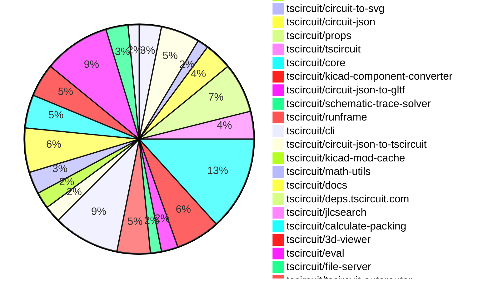
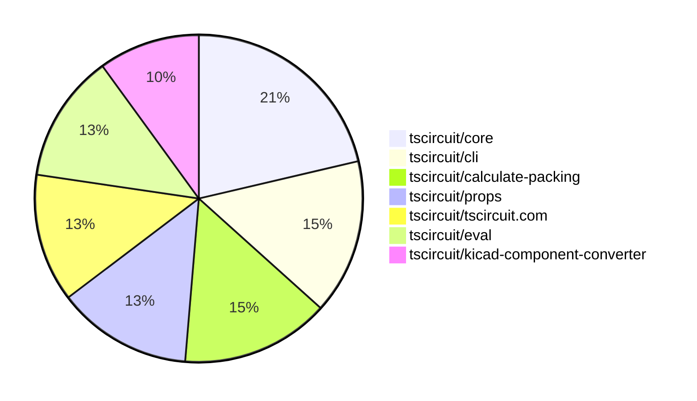

# Contribution Overview 2025-09-10

## PRs by Repository

## Contributor Overview

| Contributor | 🐳 Major | 🐙 Minor | 🐌 Tiny | ⭐ | Score | Discussion Contributions |
|-------------|---------|---------|---------|-----|----------------|--------------------------|
| [seveibar](#seveibar) | 13 | 23 | 27 | 👑👑 | 99 | 0🔹 0🔶 0💎 |
| [imrishabh18](#imrishabh18) | 3 | 16 | 13 | 👑 | 54 | 0🔹 0🔶 0💎 |
| [ArnavK-09](#ArnavK-09) | 5 | 1 | 1 | ⭐⭐ | 23 | 0🔹 0🔶 0💎 |
| [ShiboSoftwareDev](#ShiboSoftwareDev) | 3 | 4 | 2 | ⭐⭐ | 21.5 | 0🔹 0🔶 0💎 |
| [techmannih](#techmannih) | 1 | 3 | 2 | ⭐⭐ | 17 | 0🔹 0🔶 0💎 |
| [AnasSarkiz](#AnasSarkiz) | 2 | 4 | 1 | ⭐⭐ | 17 | 0🔹 0🔶 0💎 |
| [Abse2001](#Abse2001) | 0 | 1 | 2 | ⭐ | 4 | 0🔹 0🔶 0💎 |
| [tscircuitbot](#tscircuitbot) | 0 | 0 | 4 | ⭐ | 4 | 0🔹 0🔶 0💎 |
| [Heinrich-XIAO](#Heinrich-XIAO) | 0 | 1 | 0 |  | 2 | 0🔹 0🔶 0💎 |
| [devroy10](#devroy10) | 0 | 1 | 0 |  | 2 | 0🔹 0🔶 0💎 |

### Discussion Contribution Legend

- 🔹 Normal Comments: Basic participation with minimal effort
- 🔶 Great Informative Comments: Thoughtful participation that adds value
- 💎 Incredible Comments: Exceptional participation with high-quality content

## Review Table

[reviews-received-hover]: ## "Number of reviews received for PRs for this contributor"
[approvals-received-hover]: ## "Number of approvals received for PRs this contributor authored"
[rejections-received-hover]: ## "Number of rejections received for PRs this contributor authored"
[prs-opened-hover]: ## "Number of PRs opened by this contributor"
[issues-created-hover]: ## "Number of issues created by this contributor"
[bountied-issues-hover]: ## "Number of issues this contributor created with a bounty"
[bountied-issue-$-hover]: ## "Total bounty amount placed on issues authored by this contributor"

| Contributor | Reviews Received | Approvals Received | Rejections Received | Approvals | Rejections | PRs Opened | PRs Merged | Score | Issues Created | Bountied Issues | Bountied Issue $ |
|---|---|---|---|---|---|---|---|---|---|---|---|
| [ArnavK-09](#ArnavK-09) | 25 | 7 | 1 | 0 | 0 | 9 | 7 | 23 | 0 | 0 | 0 |
| [seveibar](#seveibar) | 21 | 0 | 0 | 39 | 11 | 80 | 64 | 99 | 0 | 0 | 0 |
| [techmannih](#techmannih) | 26 | 4 | 3 | 0 | 1 | 14 | 6 | 17 | 0 | 0 | 0 |
| [imrishabh18](#imrishabh18) | 15 | 10 | 0 | 3 | 3 | 34 | 32 | 54 | 0 | 0 | 0 |
| [sharmaut](#sharmaut) | 2 | 0 | 0 | 0 | 0 | 4 | 0 | 0 | 0 | 0 | 0 |
| [Excellencedev](#Excellencedev) | 2 | 0 | 1 | 0 | 0 | 2 | 0 | 0 | 0 | 0 | 0 |
| [AnasSarkiz](#AnasSarkiz) | 14 | 6 | 0 | 0 | 0 | 9 | 7 | 17 | 0 | 0 | 0 |
| [ShiboSoftwareDev](#ShiboSoftwareDev) | 20 | 9 | 1 | 0 | 0 | 11 | 9 | 21.5 | 0 | 0 | 0 |
| [Abse2001](#Abse2001) | 4 | 3 | 0 | 0 | 0 | 3 | 3 | 4 | 0 | 0 | 0 |
| [sudarshan-magar7](#sudarshan-magar7) | 0 | 0 | 0 | 0 | 0 | 1 | 0 | 0 | 0 | 0 | 0 |
| [BenraouaneSoufiane](#BenraouaneSoufiane) | 0 | 0 | 0 | 0 | 0 | 1 | 0 | 0 | 0 | 0 | 0 |
| [Heinrich-XIAO](#Heinrich-XIAO) | 2 | 1 | 0 | 0 | 0 | 2 | 1 | 2 | 0 | 0 | 0 |
| [tscircuitbot](#tscircuitbot) | 0 | 0 | 0 | 0 | 0 | 27 | 4 | 4 | 0 | 0 | 0 |
| [Ayushjhawar8](#Ayushjhawar8) | 1 | 0 | 0 | 0 | 0 | 1 | 0 | 0 | 0 | 0 | 0 |
| [devroy10](#devroy10) | 2 | 1 | 0 | 0 | 0 | 1 | 1 | 2 | 0 | 0 | 0 |
| [tribhuwan-kumar](#tribhuwan-kumar) | 1 | 0 | 0 | 0 | 0 | 1 | 0 | 0 | 0 | 0 | 0 |
| [baeoc](#baeoc) | 1 | 0 | 0 | 0 | 0 | 1 | 0 | 0 | 0 | 0 | 0 |
| [MAVRICK-1](#MAVRICK-1) | 4 | 1 | 3 | 0 | 0 | 2 | 0 | 0 | 0 | 0 | 0 |
| [melmathari](#melmathari) | 0 | 0 | 0 | 0 | 0 | 1 | 0 | 0 | 0 | 0 | 0 |
| [Bhavyajain21](#Bhavyajain21) | 1 | 0 | 0 | 0 | 0 | 1 | 0 | 0 | 0 | 0 | 0 |
| [DiwanshuVerma](#DiwanshuVerma) | 0 | 0 | 0 | 0 | 0 | 1 | 0 | 0 | 0 | 0 | 0 |
| [0hmX](#0hmX) | 14 | 0 | 4 | 0 | 0 | 2 | 0 | 0 | 0 | 0 | 0 |
| [Vincenzo-Verma](#Vincenzo-Verma) | 1 | 0 | 0 | 0 | 0 | 1 | 0 | 0 | 0 | 0 | 0 |
| [abhix4](#abhix4) | 0 | 0 | 0 | 0 | 0 | 1 | 0 | 0 | 0 | 0 | 0 |
| [gurjeetsinghvirdee](#gurjeetsinghvirdee) | 2 | 0 | 2 | 0 | 0 | 1 | 0 | 0 | 0 | 0 | 0 |
| [h30s](#h30s) | 0 | 0 | 0 | 0 | 0 | 1 | 0 | 0 | 0 | 0 | 0 |
| [rish170](#rish170) | 1 | 0 | 0 | 0 | 0 | 1 | 0 | 0 | 0 | 0 | 0 |

## Top 7 Repositories by Contribution Points

## Changes by Repository

### [tscircuit/pcb-viewer](https://github.com/tscircuit/pcb-viewer)

| PR # | Impact | Rating | Contributor | Description |
|------|--------|--------|-------------|-------------|
| [#369](https://github.com/tscircuit/pcb-viewer/pull/369) | 🐳 Major | ⭐⭐⭐ | ArnavK-09 | fix 368  claim 368 |
| [#372](https://github.com/tscircuit/pcb-viewer/pull/372) | 🐙 Minor | ⭐⭐ | ArnavK-09 | Fixes the overlap issue between the dropdown and error list in the toolbar overlay, ensuring that the error list is only displayed when there are errors present. |
| [#375](https://github.com/tscircuit/pcb-viewer/pull/375) | 🐙 Minor | ⭐⭐ | techmannih | Adds support for rectangular border radius in pad rendering for PCB designs. |
| [#371](https://github.com/tscircuit/pcb-viewer/pull/371) | 🐙 Minor | ⭐⭐ | imrishabh18 | Adds support for hole offsets in the circular_hole_with_rect_pad element, allowing for precise positioning of holes in PCB designs. |

### [tscircuit/tscircuit.com](https://github.com/tscircuit/tscircuit.com)

| PR # | Impact | Rating | Contributor | Description |
|------|--------|--------|-------------|-------------|
| [#1662](https://github.com/tscircuit/tscircuit.com/pull/1662) | 🐳 Major | ⭐⭐⭐ | ArnavK-09 | Adds a confirmation dialog to warn users about unsaved changes before navigating away from the editor. |
| [#1663](https://github.com/tscircuit/tscircuit.com/pull/1663) | 🐳 Major | ⭐⭐⭐ | ArnavK-09 | Refactors image loading logic to replace SVG loading with direct PNG URLs from API, adds skeleton loading states for better UX, removes unnecessary file path checks, and consolidates view configuration into a single constant. |
| [#1661](https://github.com/tscircuit/tscircuit.com/pull/1661) | 🐳 Major | ⭐⭐⭐ | ArnavK-09 | Removes unused import and adds functionality for Circuit JSON import dialog in the CmdK menu. |
| [#1638](https://github.com/tscircuit/tscircuit.com/pull/1638) | 🐳 Major | ⭐⭐⭐ | ArnavK-09 | Fixes an issue where the UI displayed outdated content after files were saved, ensuring the latest changes are reflected immediately. |

🌠Tiny Contributions (3)

| PR # | Impact | Contributor | Description |
|------|--------|-------------|-------------|
| [#1655](https://github.com/tscircuit/tscircuit.com/pull/1655) | 🐌 Tiny | imrishabh18 | Updates the versions of the 3D viewer and assembly viewer dependencies in the project. |
| [#1665](https://github.com/tscircuit/tscircuit.com/pull/1665) | 🐌 Tiny | seveibar | Updates the schematic-symbols dependency to version 0.0.201 in package.json |
| [#1657](https://github.com/tscircuit/tscircuit.com/pull/1657) | 🐌 Tiny | Abse2001 | Updates the dependency version of the 3d-viewer package from 0.0.375 to 0.0.379 in package.json |

### [tscircuit/schematic-viewer](https://github.com/tscircuit/schematic-viewer)

🌠Tiny Contributions (1)

| PR # | Impact | Contributor | Description |
|------|--------|-------------|-------------|
| [#130](https://github.com/tscircuit/schematic-viewer/pull/130) | 🐌 Tiny | ArnavK-09 | Removes rounded borders from group overlays in the schematic viewer by setting the rx and ry attributes to 0. |

### [tscircuit/circuit-to-svg](https://github.com/tscircuit/circuit-to-svg)

| PR # | Impact | Rating | Contributor | Description |
|------|--------|--------|-------------|-------------|
| [#313](https://github.com/tscircuit/circuit-to-svg/pull/313) | 🐳 Major | ⭐⭐⭐ | techmannih | Adds support for rect_border_radius in PCB and SMT pad definitions, allowing for rounded corners in SVG rendering. |
| [#310](https://github.com/tscircuit/circuit-to-svg/pull/310) | 🐙 Minor | ⭐⭐ | imrishabh18 | Adds support for an offset in the circular hole within a rectangular pad in PCB designs, allowing for more precise placement of holes in the layout. |

### [tscircuit/circuit-json](https://github.com/tscircuit/circuit-json)

| PR # | Impact | Rating | Contributor | Description |
|------|--------|--------|-------------|-------------|
| [#275](https://github.com/tscircuit/circuit-json/pull/275) | 🐙 Minor | ⭐⭐ | techmannih | Adds knockout functionality for silkscreen text in PCB designs, allowing for customizable padding around the text. |
| [#274](https://github.com/tscircuit/circuit-json/pull/274) | 🐙 Minor | ⭐⭐ | imrishabh18 | Adds hole offset parameters for circular plated holes with rectangular pads to allow for non-centered hole placement. |
| [#276](https://github.com/tscircuit/circuit-json/pull/276) | 🐙 Minor | ⭐⭐ | seveibar | Add optional rect_border_radius to plated hole types using rectangular pads and support rect_border_radius on rectangular and rotated SMT pads, along with documentation and tests for the new option. |
| [#273](https://github.com/tscircuit/circuit-json/pull/273) | 🐙 Minor | ⭐⭐ | seveibar | Adds an optional model_unit_to_mm_scale_factor to the CAD component schema, allowing for unit scaling in CAD components. |
| [#272](https://github.com/tscircuit/circuit-json/pull/272) | 🐙 Minor | ⭐⭐ | AnasSarkiz | Add PcbComponentOutsideBoardError to detect when PCB components are placed outside the boards physical boundaries, with detailed positioning data for debugging and automated correction. |

### [tscircuit/props](https://github.com/tscircuit/props)

| PR # | Impact | Rating | Contributor | Description |
|------|--------|--------|-------------|-------------|
| [#396](https://github.com/tscircuit/props/pull/396) | 🐳 Major | ⭐⭐⭐ | seveibar | Adds support for ReactElement in CadModelProp type and updates the CadAssemblyProps interface to include children prop. |
| [#376](https://github.com/tscircuit/props/pull/376) | 🐳 Major | ⭐⭐⭐ | ShiboSoftwareDev | Refactors the copper-pour component to support a more flexible and customizable interface for defining copper pours in PCB layouts. |
| [#393](https://github.com/tscircuit/props/pull/393) | 🐙 Minor | ⭐⭐ | techmannih | Adds properties for knockout and knockout padding to silkscreen text components, allowing for better control over text rendering. |
| [#392](https://github.com/tscircuit/props/pull/392) | 🐙 Minor | ⭐⭐ | imrishabh18 | Adds properties pcbHoleOffsetX and pcbHoleOffsetY to the CircularHoleWithRectPlatedProps interface for specifying PCB hole offsets. |
| [#397](https://github.com/tscircuit/props/pull/397) | 🐙 Minor | ⭐⭐ | seveibar | Adds support for freerouting in autorouter presets, switches autorouter presets to snake_case, and documents the deprecation of kebab-case presets. |
| [#395](https://github.com/tscircuit/props/pull/395) | 🐙 Minor | ⭐⭐ | seveibar | Add cadassembly  component mirroring footprint orientation support and introduce cadmodel  component with pcbXpcbYpcbZ and generic modelUrl source, along with documentation and export of the new components. |
| [#391](https://github.com/tscircuit/props/pull/391) | 🐙 Minor | ⭐⭐ | seveibar | Allows specifying CAD model unit scale via optional modelUnitToMmScale and covers new CAD model property in tests. |

🌠Tiny Contributions (2)

| PR # | Impact | Contributor | Description |
|------|--------|-------------|-------------|
| [#398](https://github.com/tscircuit/props/pull/398) | 🐌 Tiny | seveibar | Adds project-specific settings through a new projectConfig interface derived from platformConfig, updates documentation, and removes platform-only options. |
| [#394](https://github.com/tscircuit/props/pull/394) | 🐌 Tiny | seveibar | Adds an optional projectBaseUrl to PlatformConfig, documents it in README, and tests its parsing functionality. |

### [tscircuit/tscircuit](https://github.com/tscircuit/tscircuit)

🌠Tiny Contributions (5)

| PR # | Impact | Contributor | Description |
|------|--------|-------------|-------------|
| [#773](https://github.com/tscircuit/tscircuit/pull/773) | 🐌 Tiny | techmannih | Updates the circuit-json dependency to version 0.0.251 in package.json |
| [#769](https://github.com/tscircuit/tscircuit/pull/769) | 🐌 Tiny | imrishabh18 | Updates the versions of the circuit-json and props dependencies in package.json |
| [#784](https://github.com/tscircuit/tscircuit/pull/784) | 🐌 Tiny | seveibar | Updates the tscircuitrunframe dependency to version 0.0.930 and the schematic-symbols dependency to version 0.0.201, ensuring that the runframe is always up to date. |
| [#777](https://github.com/tscircuit/tscircuit/pull/777) | 🐌 Tiny | seveibar | Adds PinLabelsProp to the exported types from the props module, allowing users to utilize this new property in their components. |
| [#772](https://github.com/tscircuit/tscircuit/pull/772) | 🐌 Tiny | seveibar | Exports the ChipProps type from the tscircuitprops module for use in other parts of the application. |

### [tscircuit/core](https://github.com/tscircuit/core)

| PR # | Impact | Rating | Contributor | Description |
|------|--------|--------|-------------|-------------|
| [#1332](https://github.com/tscircuit/core/pull/1332) | 🐳 Major | ⭐⭐⭐ | seveibar | Passes component pcbMargin values to calculate-packing using chipMarginsMap and adds a test to ensure pcbMargin reaches packing library. |
| [#1345](https://github.com/tscircuit/core/pull/1345) | 🐳 Major | ⭐⭐⭐ | ShiboSoftwareDev | Adds a new copperpour  primitive component for creating copper fills on PCB layers, including a CopperPour class and a new rendering phase for PCB copper pours. |
| [#1339](https://github.com/tscircuit/core/pull/1339) | 🐙 Minor | ⭐⭐ | imrishabh18 | Adds support for new plated hole shapes: pill and oval in the circuit design. |
| [#1321](https://github.com/tscircuit/core/pull/1321) | 🐙 Minor | ⭐⭐ | imrishabh18 | Fixes the issue where the pcbPack functionality fails to work with asynchronous footprints in the circuit rendering process. |
| [#1326](https://github.com/tscircuit/core/pull/1326) | 🐙 Minor | ⭐⭐ | imrishabh18 | Adds support for hole offset in the shape circular_hole_with_rect_pad by introducing new properties for hole offsets in the PlatedHole component. |
| [#1341](https://github.com/tscircuit/core/pull/1341) | 🐙 Minor | ⭐⭐ | seveibar | Allows components to anchor pcbXpcbY to pins or nine-point positions via pcbPositionAnchor and aligns components during the new PcbComponentAnchorAlignment render phase. |
| [#1334](https://github.com/tscircuit/core/pull/1334) | 🐙 Minor | ⭐⭐ | seveibar | Adds cadmodel and cadassembly elements and their corresponding primitive classes to support 3D model rendering in the circuit design. |
| [#1327](https://github.com/tscircuit/core/pull/1327) | 🐙 Minor | ⭐⭐ | seveibar | Generates a rounded board outline when borderRadius is set and adds a PCB snapshot test for the rounded board. |
| [#1325](https://github.com/tscircuit/core/pull/1325) | 🐙 Minor | ⭐⭐ | seveibar | Updates the CAD model unit scale factor mapping and upgrades dependencies for improved functionality. |
| [#1351](https://github.com/tscircuit/core/pull/1351) | 🐙 Minor | ⭐⭐ | AnasSarkiz | Adds a test PCB board featuring a custom polygon-shaped SMT pad for enhanced component placement. |
| [#1336](https://github.com/tscircuit/core/pull/1336) | 🐙 Minor | ⭐⭐ | AnasSarkiz | Adds a design rule check that flags components extending beyond the board outline during design rule checking. |

🌠Tiny Contributions (6)

| PR # | Impact | Contributor | Description |
|------|--------|-------------|-------------|
| [#1340](https://github.com/tscircuit/core/pull/1340) | 🐌 Tiny | techmannih | Updates the circuit-json dependency to version 0.0.252 in package.json |
| [#1349](https://github.com/tscircuit/core/pull/1349) | 🐌 Tiny | seveibar | Updates the dependencies for calculate-packing and schematic-trace-solver to their latest versions in package.json |
| [#1346](https://github.com/tscircuit/core/pull/1346) | 🐌 Tiny | seveibar | Updates the version of schematic symbols in the package.json file from 0.0.198 to 0.0.201 |
| [#1338](https://github.com/tscircuit/core/pull/1338) | 🐌 Tiny | seveibar | Summary add getTestStaticAssetsServer to serve local models allow getTestFixture to start the fake static asset server update model-related tests to use local models  Testing bunx tsc --noEmit bun test testscomponentsnormal-componentsresistor-cadmodel-react-element.test.tsx bun test testscomponentsnormal-componentschip-cadassembly-react-element.test.tsx bun test testscomponentsnormal-componentsred-led-name-validation.test.tsx bun test testscomponentsnormal-componentsresistor-cad-component-position.test.tsx BUN_UPDATE_SNAPSHOTS1 bun test testscomponentsnormal-componentschip-override-footprint-ports-when-schPortArrangement.test.tsx BUN_UPDATE_SNAPSHOTS1 bun test testscomponentsnormal-componentscustom-footprint-4-ports.test.tsx |
| [#1337](https://github.com/tscircuit/core/pull/1337) | 🐌 Tiny | seveibar | Waits for footprints to load before running downstream PCB phases and updates the PCB snapshot for footprint library map test. |
| [#1335](https://github.com/tscircuit/core/pull/1335) | 🐌 Tiny | seveibar | Adds a snapshot test for PCB packing with margin and removes the spy implementation from the test. |

### [tscircuit/kicad-component-converter](https://github.com/tscircuit/kicad-component-converter)

| PR # | Impact | Rating | Contributor | Description |
|------|--------|--------|-------------|-------------|
| [#131](https://github.com/tscircuit/kicad-component-converter/pull/131) | 🐳 Major | ⭐⭐⭐ | imrishabh18 | Adds a button to download the generated tsx code from circuit JSON. |
| [#137](https://github.com/tscircuit/kicad-component-converter/pull/137) | 🐙 Minor | ⭐⭐ | imrishabh18 | Adds support for rectangular border radius in PCB plated holes, enhancing the representation of holes with rounded corners. |
| [#129](https://github.com/tscircuit/kicad-component-converter/pull/129) | 🐙 Minor | ⭐⭐ | imrishabh18 | Adds support for a new pad shape circular_hole_with_rect_pad in the KiCad component converter, allowing for better representation of specific PCB designs. |
| [#128](https://github.com/tscircuit/kicad-component-converter/pull/128) | 🐙 Minor | ⭐⭐ | imrishabh18 | Fixes parsing issues in kicad_mod files for capacitors by filtering out non-numeric values before parsing attributes. |
| [#134](https://github.com/tscircuit/kicad-component-converter/pull/134) | 🐙 Minor | ⭐⭐ | ShiboSoftwareDev | Adds support for the fp_poly directive in KiCad module files, enabling the conversion of polygon shapes on copper, silkscreen, and fabrication layers into appropriate circuit elements. |

🌠Tiny Contributions (3)

| PR # | Impact | Contributor | Description |
|------|--------|-------------|-------------|
| [#136](https://github.com/tscircuit/kicad-component-converter/pull/136) | 🐌 Tiny | imrishabh18 | Is adding the schematic_port inside this library correct? Or it needs to be created inside core? |
| [#130](https://github.com/tscircuit/kicad-component-converter/pull/130) | 🐌 Tiny | imrishabh18 | Adds a vercel.json configuration file for Vercel deployment and updates dependencies in package.json to ensure compatibility with the build process. |
| [#135](https://github.com/tscircuit/kicad-component-converter/pull/135) | 🐌 Tiny | seveibar | Adds a test for loading JST connectors and verifies the output against expected SVG snapshots. |

### [tscircuit/circuit-json-to-gltf](https://github.com/tscircuit/circuit-json-to-gltf)

| PR # | Impact | Rating | Contributor | Description |
|------|--------|--------|-------------|-------------|
| [#9](https://github.com/tscircuit/circuit-json-to-gltf/pull/9) | 🐳 Major | ⭐⭐⭐ | imrishabh18 | Enables SVG to PNG conversion in a Node.js environment using native Resvg for high-quality rendering, with a fallback to browser methods if necessary. |
| [#10](https://github.com/tscircuit/circuit-json-to-gltf/pull/10) | 🐙 Minor | ⭐⭐ | imrishabh18 | Fixes the parsing issue of GLB files in the model viewer by adding a buffer reference to the embedded binary data and ensuring proper padding for JSON data. |

🌠Tiny Contributions (1)

| PR # | Impact | Contributor | Description |
|------|--------|-------------|-------------|
| [#8](https://github.com/tscircuit/circuit-json-to-gltf/pull/8) | 🐌 Tiny | imrishabh18 | Fixes the relative import of the WASM file in the svg-to-png-browser utility to ensure proper loading in Node.js environments. |

### [tscircuit/schematic-trace-solver](https://github.com/tscircuit/schematic-trace-solver)

| PR # | Impact | Rating | Contributor | Description |
|------|--------|--------|-------------|-------------|
| [#63](https://github.com/tscircuit/schematic-trace-solver/pull/63) | 🐳 Major | ⭐⭐⭐ | imrishabh18 | Ensures that the trace path connects the first and last points of the schematic trace solver, adding a sanity check for path validation. |

🌠Tiny Contributions (1)

| PR # | Impact | Contributor | Description |
|------|--------|-------------|-------------|
| [#59](https://github.com/tscircuit/schematic-trace-solver/pull/59) | 🐌 Tiny | imrishabh18 | Adds a test case for the schematic trace solver to address missing schematic-trace for certain orientations. |

### [tscircuit/runframe](https://github.com/tscircuit/runframe)

| PR # | Impact | Rating | Contributor | Description |
|------|--------|--------|-------------|-------------|
| [#1140](https://github.com/tscircuit/runframe/pull/1140) | 🐳 Major | ⭐⭐⭐ | seveibar | Adds support for project base URL paths to facilitate the loading of static files, including local object files, within the application. |
| [#1132](https://github.com/tscircuit/runframe/pull/1132) | 🐳 Major | ⭐⭐⭐ | ShiboSoftwareDev | This took a while to get done, front end is annoying This PR introduces a new Kicad tab to the Import Component dialog, allowing users to search for and copy standard Kicad footprint names. New Kicad Tab: A dedicated tab for searching Kicad footprints. Fuzzy Search: Implements fuzzy searching using fuse.js against a cached list of Kicads standard library footprints. Copy to Clipboard: The primary action for a Kicad footprint is to copy the formatted string (e.g., kicad:Resistor_SMD:R_0402_1005Metric) to the users clipboard for easy use in their circuit code. |
| [#1130](https://github.com/tscircuit/runframe/pull/1130) | 🐙 Minor | ⭐⭐ | imrishabh18 | Excludes resvgresvg-js from the bundling process and fixes the GLB export functionality by ensuring valid data is returned before creating a blob for download. |
| [#1121](https://github.com/tscircuit/runframe/pull/1121) | 🐙 Minor | ⭐⭐ | imrishabh18 | Adds a GLB export option in the RunFrame file menu, allowing users to export circuit designs in the GLB format using the circuit-json-to-gltf library. |
| [#1127](https://github.com/tscircuit/runframe/pull/1127) | 🐙 Minor | ⭐⭐ | devroy10 | Fixes the faulty logic that prevented the local API from initializing in development environments, ensuring proper functionality for local testing. |

🌠Tiny Contributions (1)

| PR # | Impact | Contributor | Description |
|------|--------|-------------|-------------|
| [#1112](https://github.com/tscircuit/runframe/pull/1112) | 🐌 Tiny | imrishabh18 | Updates the 3D viewer dependency and adds an example for using an asynchronous footprint circuit in the RunFrame component. |

### [tscircuit/cli](https://github.com/tscircuit/cli)

| PR # | Impact | Rating | Contributor | Description |
|------|--------|--------|-------------|-------------|
| [#338](https://github.com/tscircuit/cli/pull/338) | 🐳 Major | ⭐⭐⭐ | seveibar | Add --kicad option to tsci search to only query KiCad footprints |
| [#336](https://github.com/tscircuit/cli/pull/336) | 🐳 Major | ⭐⭐⭐ | seveibar | Extends the tsci search command to query the KiCad footprint index with fuzzy matching, documents the search command for footprints, CAD models, or packages, and adds a test for the KiCad footprint search. |
| [#331](https://github.com/tscircuit/cli/pull/331) | 🐙 Minor | ⭐⭐ | imrishabh18 | Adds support for exporting circuit JSON as GLB and updates the tscircuitrunframe package to the latest version. |
| [#330](https://github.com/tscircuit/cli/pull/330) | 🐙 Minor | ⭐⭐ | imrishabh18 | Add a command to convert .kicad_mod files into TSX components using the tsci convert command. |
| [#340](https://github.com/tscircuit/cli/pull/340) | 🐙 Minor | ⭐⭐ | seveibar | Fixes crash in search command when JLC search returns no components |
| [#337](https://github.com/tscircuit/cli/pull/337) | 🐙 Minor | ⭐⭐ | seveibar | Prefixes KiCad footprint search results with kicad: for easier copypaste into tscircuit and updates CLI test to expect kicad: prefix. |
| [#332](https://github.com/tscircuit/cli/pull/332) | 🐙 Minor | ⭐⭐ | ShiboSoftwareDev | Enables successful import of npm packages in the CLI after updates to eval and runframe. |

🌠Tiny Contributions (5)

| PR # | Impact | Contributor | Description |
|------|--------|-------------|-------------|
| [#345](https://github.com/tscircuit/cli/pull/345) | 🐌 Tiny | seveibar | Updates the file server dependency to version 0.0.28 and fixes the loading of .obj files. |
| [#344](https://github.com/tscircuit/cli/pull/344) | 🐌 Tiny | seveibar | Updates the tscircuitrunframe package to version 0.0.931 in the project dependencies. |
| [#343](https://github.com/tscircuit/cli/pull/343) | 🐌 Tiny | seveibar | Updates the tscircuitfile-server and tscircuitrunframe packages to their latest versions. |
| [#327](https://github.com/tscircuit/cli/pull/327) | 🐌 Tiny | seveibar | Updates the RunFrame and easyeda dependencies to their latest versions in the package.json file |
| [#322](https://github.com/tscircuit/cli/pull/322) | 🐌 Tiny | ShiboSoftwareDev | Updates various dependencies in the project, including tscircuitmath-utils and tscircuitprops, to newer versions and adds tscircuitcircuit-json-util as a new dependency. |

### [tscircuit/circuit-json-to-tscircuit](https://github.com/tscircuit/circuit-json-to-tscircuit)

| PR # | Impact | Rating | Contributor | Description |
|------|--------|--------|-------------|-------------|
| [#11](https://github.com/tscircuit/circuit-json-to-tscircuit/pull/11) | 🐙 Minor | ⭐⭐ | imrishabh18 | Adds silkscreentext and silkscreenpath elements to the generated TSX code for PCB designs, enhancing the representation of silkscreen features. |

🌠Tiny Contributions (2)

| PR # | Impact | Contributor | Description |
|------|--------|-------------|-------------|
| [#10](https://github.com/tscircuit/circuit-json-to-tscircuit/pull/10) | 🐌 Tiny | imrishabh18 | Changes the build process to utilize tsup-node instead of tsup for building TypeScript files. |
| [#9](https://github.com/tscircuit/circuit-json-to-tscircuit/pull/9) | 🐌 Tiny | seveibar | Removes the deprecated createUseComponent hook from the generated component template and updates the component generation to use ChipProps instead. |

### [tscircuit/kicad-mod-cache](https://github.com/tscircuit/kicad-mod-cache)

🌠Tiny Contributions (3)

| PR # | Impact | Contributor | Description |
|------|--------|-------------|-------------|
| [#10](https://github.com/tscircuit/kicad-mod-cache/pull/10) | 🐌 Tiny | imrishabh18 | Updates the kicad-component-converter dependency from version 0.1.17 to 0.1.18 in package.json |
| [#9](https://github.com/tscircuit/kicad-mod-cache/pull/9) | 🐌 Tiny | imrishabh18 | Updates the kicad-component-converter dependency from version 0.1.16 to 0.1.17 in package.json |
| [#8](https://github.com/tscircuit/kicad-mod-cache/pull/8) | 🐌 Tiny | seveibar | Updates the kicad-component-converter dependency to version 0.1.16 and adds bun-types for improved TypeScript support including DOM library. |

### [tscircuit/math-utils](https://github.com/tscircuit/math-utils)

| PR # | Impact | Rating | Contributor | Description |
|------|--------|--------|-------------|-------------|
| [#22](https://github.com/tscircuit/math-utils/pull/22) | 🐳 Major | ⭐⭐⭐ | seveibar | Adds a utility function to compute the overlapping bounds of two rectangles and includes tests for various intersection scenarios. |
| [#20](https://github.com/tscircuit/math-utils/pull/20) | 🐙 Minor | ⭐⭐ | Heinrich-XIAO | Creates a new function computeGapBetweenBoxes to calculate the gap between two boxes, addressing issues with the previous computeDistanceBetweenBoxes function while maintaining backward compatibility. |

🌠Tiny Contributions (2)

| PR # | Impact | Contributor | Description |
|------|--------|-------------|-------------|
| [#19](https://github.com/tscircuit/math-utils/pull/19) | 🐌 Tiny | imrishabh18 | Replaces package-lock.json with bun.lock to manage dependencies using Bun instead of npm. |
| [#21](https://github.com/tscircuit/math-utils/pull/21) | 🐌 Tiny | seveibar | Renames computeDistanceBetweenBoxes to computeManhattanDistanceBetweenBoxes, adds a deprecated alias, and documents and tests the new function. |

### [tscircuit/docs](https://github.com/tscircuit/docs)

| PR # | Impact | Rating | Contributor | Description |
|------|--------|--------|-------------|-------------|
| [#144](https://github.com/tscircuit/docs/pull/144) | 🐳 Major | ⭐⭐⭐ | seveibar | Add documentation for the tsci search command, including usage examples and output. |

🌠Tiny Contributions (7)

| PR # | Impact | Contributor | Description |
|------|--------|-------------|-------------|
| [#139](https://github.com/tscircuit/docs/pull/139) | 🐌 Tiny | imrishabh18 | Adds documentation for using KiCads footprint libraries with tscircuit, detailing the format and usage of the kicad: prefix for footprint references. |
| [#147](https://github.com/tscircuit/docs/pull/147) | 🐌 Tiny | seveibar | Documents the layer property for the testpoint  element, specifying its placement on the PCB and providing an example for a bottom-layer test point. |
| [#146](https://github.com/tscircuit/docs/pull/146) | 🐌 Tiny | seveibar | Adds a recommendation for using kicad: footprint strings directly in the documentation to simplify the process of referencing standard footprints from KiCad. |
| [#145](https://github.com/tscircuit/docs/pull/145) | 🐌 Tiny | seveibar | Removes an accidental .trim() from the ChatGPT quickstart guide to ensure generated documentation remains clean. |
| [#143](https://github.com/tscircuit/docs/pull/143) | 🐌 Tiny | seveibar | Moves guidance on component properties related to part selection and do-not-place instructions to dedicated sections for better clarity. |
| [#142](https://github.com/tscircuit/docs/pull/142) | 🐌 Tiny | seveibar | Fixes the sidebar category label for tscircuit Essentials by renaming the category JSON file to the correct format. |
| [#148](https://github.com/tscircuit/docs/pull/148) | 🐌 Tiny | AnasSarkiz | Adds an example usage of a polygon-shaped SMT pad in the documentation, including its properties and an example code snippet. |

### [tscircuit/deps.tscircuit.com](https://github.com/tscircuit/deps.tscircuit.com)

🌠Tiny Contributions (1)

| PR # | Impact | Contributor | Description |
|------|--------|-------------|-------------|
| [#26](https://github.com/tscircuit/deps.tscircuit.com/pull/26) | 🐌 Tiny | imrishabh18 | Adds a new Upstream category to the dependency graph, allowing users to filter dependencies related to the core version used in circuit previews. |

### [tscircuit/jlcsearch](https://github.com/tscircuit/jlcsearch)

| PR # | Impact | Rating | Contributor | Description |
|------|--------|--------|-------------|-------------|
| [#86](https://github.com/tscircuit/jlcsearch/pull/86) | 🐳 Major | ⭐⭐⭐ | seveibar | Add JST connector derived table and route, expose JST connectors link on home page, and cover JST connectors API with tests. |

### [tscircuit/calculate-packing](https://github.com/tscircuit/calculate-packing)

| PR # | Impact | Rating | Contributor | Description |
|------|--------|--------|-------------|-------------|
| [#47](https://github.com/tscircuit/calculate-packing/pull/47) | 🐳 Major | ⭐⭐⭐ | seveibar | Adds bounds to the PackInput structure and visualizes these bounds in the packing algorithms. |
| [#46](https://github.com/tscircuit/calculate-packing/pull/46) | 🐳 Major | ⭐⭐⭐ | seveibar | Add obstacle handling in packing algorithm to ensure components maintain minimum gap from obstacles during placement. |
| [#44](https://github.com/tscircuit/calculate-packing/pull/44) | 🐳 Major | ⭐⭐⭐ | seveibar | Refactors outward normal calculation to prevent errors during computation and improve reliability in outline segment processing. |
| [#42](https://github.com/tscircuit/calculate-packing/pull/42) | 🐳 Major | ⭐⭐⭐ | seveibar | obstacle viz add obstacle packing test add visualization for obstacles remove legacy PhasedPackSolver |
| [#41](https://github.com/tscircuit/calculate-packing/pull/41) | 🐳 Major | ⭐⭐⭐ | seveibar | Adds a new InputObstacle type to define obstacles with properties such as obstacleId, absoluteCenter, width, and height for packing calculations. |
| [#39](https://github.com/tscircuit/calculate-packing/pull/39) | 🐙 Minor | ⭐⭐ | seveibar | Allows the conversion of circuit JSON to pack output to expand pads using a chip margins map, enabling custom chip margin support for pad resizing. |

### [tscircuit/3d-viewer](https://github.com/tscircuit/3d-viewer)

| PR # | Impact | Rating | Contributor | Description |
|------|--------|--------|-------------|-------------|
| [#480](https://github.com/tscircuit/3d-viewer/pull/480) | 🐳 Major | ⭐⭐⭐ | AnasSarkiz | Add support for a custom orbit target based on the board center from circuit JSON. Orbit controls now center on the actual board center instead of the origin (0,0,0). |
| [#470](https://github.com/tscircuit/3d-viewer/pull/470) | 🐙 Minor | ⭐⭐ | seveibar | Adds model unit scaling support and removes KiCad autoscaling line |
| [#469](https://github.com/tscircuit/3d-viewer/pull/469) | 🐙 Minor | ⭐⭐ | seveibar | Sanitizes VRML DEFUSE names containing hyphens before parsing, ensuring compatibility with the VRML parser and adds a regression test for this functionality. |
| [#472](https://github.com/tscircuit/3d-viewer/pull/472) | 🐙 Minor | ⭐⭐ | Abse2001 | Fixes tooltip positioning calculations to ensure tooltips are displayed correctly when the 3D viewer is embedded in containers with different positioning contexts. |

🌠Tiny Contributions (2)

| PR # | Impact | Contributor | Description |
|------|--------|-------------|-------------|
| [#468](https://github.com/tscircuit/3d-viewer/pull/468) | 🐌 Tiny | seveibar | Fixes start script, adds KiCad resistor story, adds proper async rendering, and replicates VRMLLoader error. |
| [#465](https://github.com/tscircuit/3d-viewer/pull/465) | 🐌 Tiny | ShiboSoftwareDev | Adds a story test for GLTF model support in the CadViewer component. |

### [tscircuit/eval](https://github.com/tscircuit/eval)

| PR # | Impact | Rating | Contributor | Description |
|------|--------|--------|-------------|-------------|
| [#1057](https://github.com/tscircuit/eval/pull/1057) | 🐙 Minor | ⭐⭐ | seveibar | Modifies the importLocalFile function to allow static assets to be imported even if they are not present in the fsMap, preventing errors when accessing static files. |
| [#1053](https://github.com/tscircuit/eval/pull/1053) | 🐙 Minor | ⭐⭐ | seveibar | Adds support for importing static files with specific extensions (.glb, .gltf, .obj, .kicad_mod) by allowing file paths to be resolved to URLs based on a configured project base URL. |
| [#1045](https://github.com/tscircuit/eval/pull/1045) | 🐙 Minor | ⭐⭐ | seveibar | Adds support for importing .glb files by converting them to object URLs and includes a regression test to ensure functionality. |
| [#1029](https://github.com/tscircuit/eval/pull/1029) | 🐙 Minor | ⭐⭐ | seveibar | Sets the model unit scale for WRLs derived from KiCad STEP files to 2.54 cm. |
| [#1028](https://github.com/tscircuit/eval/pull/1028) | 🐙 Minor | ⭐⭐ | seveibar | Adds an export for the function that retrieves the default platform configuration for tscircuit. |
| [#1032](https://github.com/tscircuit/eval/pull/1032) | 🐙 Minor | ⭐⭐ | ShiboSoftwareDev | Adds support for importing .gltf files with external binary and image assets, enabling inlining of these assets as data URIs within the GLTF structure. |
| [#1033](https://github.com/tscircuit/eval/pull/1033) | 🐙 Minor | ⭐⭐ | ShiboSoftwareDev | Fixes an issue where NPM packages with their own dependencies were not being resolved correctly by implementing recursive loading of transitive dependencies. |

🌠Tiny Contributions (5)

| PR # | Impact | Contributor | Description |
|------|--------|-------------|-------------|
| [#1056](https://github.com/tscircuit/eval/pull/1056) | 🐌 Tiny | seveibar | Retries bun tests on segmentation faults for up to three attempts before failing. |
| [#1050](https://github.com/tscircuit/eval/pull/1050) | 🐌 Tiny | tscircuitbot | Updates the tscircuitcore package from version 0.0.722 to 0.0.723 and updates the circuit-json package from version 0.0.251 to 0.0.252. |
| [#1049](https://github.com/tscircuit/eval/pull/1049) | 🐌 Tiny | tscircuitbot | Automated update of tscircuitcore to v0.0.722. |
| [#1042](https://github.com/tscircuit/eval/pull/1042) | 🐌 Tiny | tscircuitbot | Automated update of tscircuitcore to v0.0.719 and other dependencies in package.json |
| [#1031](https://github.com/tscircuit/eval/pull/1031) | 🐌 Tiny | tscircuitbot | Updates the tscircuitcore package from version 0.0.712 to 0.0.715 and updates the tscircuitschematic-trace-solver and circuit-json dependencies to their respective newer versions. |

### [tscircuit/file-server](https://github.com/tscircuit/file-server)

| PR # | Impact | Rating | Contributor | Description |
|------|--------|--------|-------------|-------------|
| [#19](https://github.com/tscircuit/file-server/pull/19) | 🐙 Minor | ⭐⭐ | seveibar | Handles nested file paths in static route and tests static file serving with nested path |
| [#18](https://github.com/tscircuit/file-server/pull/18) | 🐙 Minor | ⭐⭐ | seveibar | Adds download and static file links to the admin file details page, using relative paths to support proxies with path prefixes. |
| [#17](https://github.com/tscircuit/file-server/pull/17) | 🐙 Minor | ⭐⭐ | seveibar | Add support for storing and serving binary file content alongside text content, including updates to the API and tests for binary file operations. |
| [#16](https://github.com/tscircuit/file-server/pull/16) | 🐙 Minor | ⭐⭐ | seveibar | Adds a new route for serving static files with appropriate MIME types based on file extensions. |

### [tscircuit/tscircuit-autorouter](https://github.com/tscircuit/tscircuit-autorouter)

🌠Tiny Contributions (1)

| PR # | Impact | Contributor | Description |
|------|--------|-------------|-------------|
| [#243](https://github.com/tscircuit/tscircuit-autorouter/pull/243) | 🐌 Tiny | seveibar | Add CI workflows for building the project using bun, including a standard build and a Vercel build. |

### [tscircuit/checks](https://github.com/tscircuit/checks)

| PR # | Impact | Rating | Contributor | Description |
|------|--------|--------|-------------|-------------|
| [#73](https://github.com/tscircuit/checks/pull/73) | 🐳 Major | ⭐⭐⭐ | AnasSarkiz | Add polygon collision detection for PCB component boundary validation using flattenjs, including rotation support and detailed error reporting for custom board shapes. |
| [#74](https://github.com/tscircuit/checks/pull/74) | 🐙 Minor | ⭐⭐ | AnasSarkiz | Prevents checkPcbComponentsOutOfBoard from crashing when encountering components with no real footprint by skipping them during DRC checks. |

### [tscircuit/common](https://github.com/tscircuit/common)

🌠Tiny Contributions (1)

| PR # | Impact | Contributor | Description |
|------|--------|-------------|-------------|
| [#9](https://github.com/tscircuit/common/pull/9) | 🐌 Tiny | Abse2001 | Add ArduinoShield component with standard pin header configuration, including proper pin labeling for digital, analog, power, and communication pins, and footprint specifications for standard Arduino headers. |

## Changes by Contributor

### [ArnavK-09](https://github.com/ArnavK-09)

| PRs # | Impact | Rating | Description |
|------|--------|--------|-------------|
| [#369](https://github.com/tscircuit/pcb-viewer/pull/369) | 🐳 Major | ⭐⭐⭐ | fix 368  claim 368 |
| [#1662](https://github.com/tscircuit/tscircuit.com/pull/1662) | 🐳 Major | ⭐⭐⭐ | Adds a confirmation dialog to warn users about unsaved changes before navigating away from the editor. |
| [#1663](https://github.com/tscircuit/tscircuit.com/pull/1663) | 🐳 Major | ⭐⭐⭐ | Refactors image loading logic to replace SVG loading with direct PNG URLs from API, adds skeleton loading states for better UX, removes unnecessary file path checks, and consolidates view configuration into a single constant. |
| [#1661](https://github.com/tscircuit/tscircuit.com/pull/1661) | 🐳 Major | ⭐⭐⭐ | Removes unused import and adds functionality for Circuit JSON import dialog in the CmdK menu. |
| [#1638](https://github.com/tscircuit/tscircuit.com/pull/1638) | 🐳 Major | ⭐⭐⭐ | Fixes an issue where the UI displayed outdated content after files were saved, ensuring the latest changes are reflected immediately. |
| [#372](https://github.com/tscircuit/pcb-viewer/pull/372) | 🐙 Minor | ⭐⭐ | Fixes the overlap issue between the dropdown and error list in the toolbar overlay, ensuring that the error list is only displayed when there are errors present. |

🌠Tiny Contributions (1)

| PR # | Impact | Description |
|------|--------|-------------|
| [#130](https://github.com/tscircuit/schematic-viewer/pull/130) | 🐌 Tiny | Removes rounded borders from group overlays in the schematic viewer by setting the rx and ry attributes to 0. |

### [techmannih](https://github.com/techmannih)

| PRs # | Impact | Rating | Description |
|------|--------|--------|-------------|
| [#313](https://github.com/tscircuit/circuit-to-svg/pull/313) | 🐳 Major | ⭐⭐⭐ | Adds support for rect_border_radius in PCB and SMT pad definitions, allowing for rounded corners in SVG rendering. |
| [#375](https://github.com/tscircuit/pcb-viewer/pull/375) | 🐙 Minor | ⭐⭐ | Adds support for rectangular border radius in pad rendering for PCB designs. |
| [#275](https://github.com/tscircuit/circuit-json/pull/275) | 🐙 Minor | ⭐⭐ | Adds knockout functionality for silkscreen text in PCB designs, allowing for customizable padding around the text. |
| [#393](https://github.com/tscircuit/props/pull/393) | 🐙 Minor | ⭐⭐ | Adds properties for knockout and knockout padding to silkscreen text components, allowing for better control over text rendering. |

🌠Tiny Contributions (2)

| PR # | Impact | Description |
|------|--------|-------------|
| [#773](https://github.com/tscircuit/tscircuit/pull/773) | 🐌 Tiny | Updates the circuit-json dependency to version 0.0.251 in package.json |
| [#1340](https://github.com/tscircuit/core/pull/1340) | 🐌 Tiny | Updates the circuit-json dependency to version 0.0.252 in package.json |

### [imrishabh18](https://github.com/imrishabh18)

| PRs # | Impact | Rating | Description |
|------|--------|--------|-------------|
| [#131](https://github.com/tscircuit/kicad-component-converter/pull/131) | 🐳 Major | ⭐⭐⭐ | Adds a button to download the generated tsx code from circuit JSON. |
| [#9](https://github.com/tscircuit/circuit-json-to-gltf/pull/9) | 🐳 Major | ⭐⭐⭐ | Enables SVG to PNG conversion in a Node.js environment using native Resvg for high-quality rendering, with a fallback to browser methods if necessary. |
| [#63](https://github.com/tscircuit/schematic-trace-solver/pull/63) | 🐳 Major | ⭐⭐⭐ | Ensures that the trace path connects the first and last points of the schematic trace solver, adding a sanity check for path validation. |
| [#371](https://github.com/tscircuit/pcb-viewer/pull/371) | 🐙 Minor | ⭐⭐ | Adds support for hole offsets in the circular_hole_with_rect_pad element, allowing for precise positioning of holes in PCB designs. |
| [#274](https://github.com/tscircuit/circuit-json/pull/274) | 🐙 Minor | ⭐⭐ | Adds hole offset parameters for circular plated holes with rectangular pads to allow for non-centered hole placement. |
| [#392](https://github.com/tscircuit/props/pull/392) | 🐙 Minor | ⭐⭐ | Adds properties pcbHoleOffsetX and pcbHoleOffsetY to the CircularHoleWithRectPlatedProps interface for specifying PCB hole offsets. |
| [#137](https://github.com/tscircuit/kicad-component-converter/pull/137) | 🐙 Minor | ⭐⭐ | Adds support for rectangular border radius in PCB plated holes, enhancing the representation of holes with rounded corners. |
| [#129](https://github.com/tscircuit/kicad-component-converter/pull/129) | 🐙 Minor | ⭐⭐ | Adds support for a new pad shape circular_hole_with_rect_pad in the KiCad component converter, allowing for better representation of specific PCB designs. |
| [#128](https://github.com/tscircuit/kicad-component-converter/pull/128) | 🐙 Minor | ⭐⭐ | Fixes parsing issues in kicad_mod files for capacitors by filtering out non-numeric values before parsing attributes. |
| [#1339](https://github.com/tscircuit/core/pull/1339) | 🐙 Minor | ⭐⭐ | Adds support for new plated hole shapes: pill and oval in the circuit design. |
| [#1321](https://github.com/tscircuit/core/pull/1321) | 🐙 Minor | ⭐⭐ | Fixes the issue where the pcbPack functionality fails to work with asynchronous footprints in the circuit rendering process. |
| [#1326](https://github.com/tscircuit/core/pull/1326) | 🐙 Minor | ⭐⭐ | Adds support for hole offset in the shape circular_hole_with_rect_pad by introducing new properties for hole offsets in the PlatedHole component. |
| [#310](https://github.com/tscircuit/circuit-to-svg/pull/310) | 🐙 Minor | ⭐⭐ | Adds support for an offset in the circular hole within a rectangular pad in PCB designs, allowing for more precise placement of holes in the layout. |
| [#1130](https://github.com/tscircuit/runframe/pull/1130) | 🐙 Minor | ⭐⭐ | Excludes resvgresvg-js from the bundling process and fixes the GLB export functionality by ensuring valid data is returned before creating a blob for download. |
| [#1121](https://github.com/tscircuit/runframe/pull/1121) | 🐙 Minor | ⭐⭐ | Adds a GLB export option in the RunFrame file menu, allowing users to export circuit designs in the GLB format using the circuit-json-to-gltf library. |
| [#331](https://github.com/tscircuit/cli/pull/331) | 🐙 Minor | ⭐⭐ | Adds support for exporting circuit JSON as GLB and updates the tscircuitrunframe package to the latest version. |
| [#330](https://github.com/tscircuit/cli/pull/330) | 🐙 Minor | ⭐⭐ | Add a command to convert .kicad_mod files into TSX components using the tsci convert command. |
| [#11](https://github.com/tscircuit/circuit-json-to-tscircuit/pull/11) | 🐙 Minor | ⭐⭐ | Adds silkscreentext and silkscreenpath elements to the generated TSX code for PCB designs, enhancing the representation of silkscreen features. |
| [#10](https://github.com/tscircuit/circuit-json-to-gltf/pull/10) | 🐙 Minor | ⭐⭐ | Fixes the parsing issue of GLB files in the model viewer by adding a buffer reference to the embedded binary data and ensuring proper padding for JSON data. |

🌠Tiny Contributions (13)

| PR # | Impact | Description |
|------|--------|-------------|
| [#769](https://github.com/tscircuit/tscircuit/pull/769) | 🐌 Tiny | Updates the versions of the circuit-json and props dependencies in package.json |
| [#136](https://github.com/tscircuit/kicad-component-converter/pull/136) | 🐌 Tiny | Is adding the schematic_port inside this library correct? Or it needs to be created inside core? |
| [#130](https://github.com/tscircuit/kicad-component-converter/pull/130) | 🐌 Tiny | Adds a vercel.json configuration file for Vercel deployment and updates dependencies in package.json to ensure compatibility with the build process. |
| [#10](https://github.com/tscircuit/kicad-mod-cache/pull/10) | 🐌 Tiny | Updates the kicad-component-converter dependency from version 0.1.17 to 0.1.18 in package.json |
| [#9](https://github.com/tscircuit/kicad-mod-cache/pull/9) | 🐌 Tiny | Updates the kicad-component-converter dependency from version 0.1.16 to 0.1.17 in package.json |
| [#19](https://github.com/tscircuit/math-utils/pull/19) | 🐌 Tiny | Replaces package-lock.json with bun.lock to manage dependencies using Bun instead of npm. |
| [#1655](https://github.com/tscircuit/tscircuit.com/pull/1655) | 🐌 Tiny | Updates the versions of the 3D viewer and assembly viewer dependencies in the project. |
| [#1112](https://github.com/tscircuit/runframe/pull/1112) | 🐌 Tiny | Updates the 3D viewer dependency and adds an example for using an asynchronous footprint circuit in the RunFrame component. |
| [#10](https://github.com/tscircuit/circuit-json-to-tscircuit/pull/10) | 🐌 Tiny | Changes the build process to utilize tsup-node instead of tsup for building TypeScript files. |
| [#139](https://github.com/tscircuit/docs/pull/139) | 🐌 Tiny | Adds documentation for using KiCads footprint libraries with tscircuit, detailing the format and usage of the kicad: prefix for footprint references. |
| [#26](https://github.com/tscircuit/deps.tscircuit.com/pull/26) | 🐌 Tiny | Adds a new Upstream category to the dependency graph, allowing users to filter dependencies related to the core version used in circuit previews. |
| [#8](https://github.com/tscircuit/circuit-json-to-gltf/pull/8) | 🐌 Tiny | Fixes the relative import of the WASM file in the svg-to-png-browser utility to ensure proper loading in Node.js environments. |
| [#59](https://github.com/tscircuit/schematic-trace-solver/pull/59) | 🐌 Tiny | Adds a test case for the schematic trace solver to address missing schematic-trace for certain orientations. |

### [seveibar](https://github.com/seveibar)

| PRs # | Impact | Rating | Description |
|------|--------|--------|-------------|
| [#396](https://github.com/tscircuit/props/pull/396) | 🐳 Major | ⭐⭐⭐ | Adds support for ReactElement in CadModelProp type and updates the CadAssemblyProps interface to include children prop. |
| [#1332](https://github.com/tscircuit/core/pull/1332) | 🐳 Major | ⭐⭐⭐ | Passes component pcbMargin values to calculate-packing using chipMarginsMap and adds a test to ensure pcbMargin reaches packing library. |
| [#22](https://github.com/tscircuit/math-utils/pull/22) | 🐳 Major | ⭐⭐⭐ | Adds a utility function to compute the overlapping bounds of two rectangles and includes tests for various intersection scenarios. |
| [#86](https://github.com/tscircuit/jlcsearch/pull/86) | 🐳 Major | ⭐⭐⭐ | Add JST connector derived table and route, expose JST connectors link on home page, and cover JST connectors API with tests. |
| [#1140](https://github.com/tscircuit/runframe/pull/1140) | 🐳 Major | ⭐⭐⭐ | Adds support for project base URL paths to facilitate the loading of static files, including local object files, within the application. |
| [#338](https://github.com/tscircuit/cli/pull/338) | 🐳 Major | ⭐⭐⭐ | Add --kicad option to tsci search to only query KiCad footprints |
| [#336](https://github.com/tscircuit/cli/pull/336) | 🐳 Major | ⭐⭐⭐ | Extends the tsci search command to query the KiCad footprint index with fuzzy matching, documents the search command for footprints, CAD models, or packages, and adds a test for the KiCad footprint search. |
| [#144](https://github.com/tscircuit/docs/pull/144) | 🐳 Major | ⭐⭐⭐ | Add documentation for the tsci search command, including usage examples and output. |
| [#47](https://github.com/tscircuit/calculate-packing/pull/47) | 🐳 Major | ⭐⭐⭐ | Adds bounds to the PackInput structure and visualizes these bounds in the packing algorithms. |
| [#46](https://github.com/tscircuit/calculate-packing/pull/46) | 🐳 Major | ⭐⭐⭐ | Add obstacle handling in packing algorithm to ensure components maintain minimum gap from obstacles during placement. |
| [#44](https://github.com/tscircuit/calculate-packing/pull/44) | 🐳 Major | ⭐⭐⭐ | Refactors outward normal calculation to prevent errors during computation and improve reliability in outline segment processing. |
| [#42](https://github.com/tscircuit/calculate-packing/pull/42) | 🐳 Major | ⭐⭐⭐ | obstacle viz add obstacle packing test add visualization for obstacles remove legacy PhasedPackSolver |
| [#41](https://github.com/tscircuit/calculate-packing/pull/41) | 🐳 Major | ⭐⭐⭐ | Adds a new InputObstacle type to define obstacles with properties such as obstacleId, absoluteCenter, width, and height for packing calculations. |
| [#276](https://github.com/tscircuit/circuit-json/pull/276) | 🐙 Minor | ⭐⭐ | Add optional rect_border_radius to plated hole types using rectangular pads and support rect_border_radius on rectangular and rotated SMT pads, along with documentation and tests for the new option. |
| [#273](https://github.com/tscircuit/circuit-json/pull/273) | 🐙 Minor | ⭐⭐ | Adds an optional model_unit_to_mm_scale_factor to the CAD component schema, allowing for unit scaling in CAD components. |
| [#397](https://github.com/tscircuit/props/pull/397) | 🐙 Minor | ⭐⭐ | Adds support for freerouting in autorouter presets, switches autorouter presets to snake_case, and documents the deprecation of kebab-case presets. |
| [#395](https://github.com/tscircuit/props/pull/395) | 🐙 Minor | ⭐⭐ | Add cadassembly  component mirroring footprint orientation support and introduce cadmodel  component with pcbXpcbYpcbZ and generic modelUrl source, along with documentation and export of the new components. |
| [#391](https://github.com/tscircuit/props/pull/391) | 🐙 Minor | ⭐⭐ | Allows specifying CAD model unit scale via optional modelUnitToMmScale and covers new CAD model property in tests. |
| [#470](https://github.com/tscircuit/3d-viewer/pull/470) | 🐙 Minor | ⭐⭐ | Adds model unit scaling support and removes KiCad autoscaling line |
| [#469](https://github.com/tscircuit/3d-viewer/pull/469) | 🐙 Minor | ⭐⭐ | Sanitizes VRML DEFUSE names containing hyphens before parsing, ensuring compatibility with the VRML parser and adds a regression test for this functionality. |
| [#1341](https://github.com/tscircuit/core/pull/1341) | 🐙 Minor | ⭐⭐ | Allows components to anchor pcbXpcbY to pins or nine-point positions via pcbPositionAnchor and aligns components during the new PcbComponentAnchorAlignment render phase. |
| [#1334](https://github.com/tscircuit/core/pull/1334) | 🐙 Minor | ⭐⭐ | Adds cadmodel and cadassembly elements and their corresponding primitive classes to support 3D model rendering in the circuit design. |
| [#1327](https://github.com/tscircuit/core/pull/1327) | 🐙 Minor | ⭐⭐ | Generates a rounded board outline when borderRadius is set and adds a PCB snapshot test for the rounded board. |
| [#1325](https://github.com/tscircuit/core/pull/1325) | 🐙 Minor | ⭐⭐ | Updates the CAD model unit scale factor mapping and upgrades dependencies for improved functionality. |
| [#1057](https://github.com/tscircuit/eval/pull/1057) | 🐙 Minor | ⭐⭐ | Modifies the importLocalFile function to allow static assets to be imported even if they are not present in the fsMap, preventing errors when accessing static files. |
| [#1053](https://github.com/tscircuit/eval/pull/1053) | 🐙 Minor | ⭐⭐ | Adds support for importing static files with specific extensions (.glb, .gltf, .obj, .kicad_mod) by allowing file paths to be resolved to URLs based on a configured project base URL. |
| [#1045](https://github.com/tscircuit/eval/pull/1045) | 🐙 Minor | ⭐⭐ | Adds support for importing .glb files by converting them to object URLs and includes a regression test to ensure functionality. |
| [#1029](https://github.com/tscircuit/eval/pull/1029) | 🐙 Minor | ⭐⭐ | Sets the model unit scale for WRLs derived from KiCad STEP files to 2.54 cm. |
| [#1028](https://github.com/tscircuit/eval/pull/1028) | 🐙 Minor | ⭐⭐ | Adds an export for the function that retrieves the default platform configuration for tscircuit. |
| [#340](https://github.com/tscircuit/cli/pull/340) | 🐙 Minor | ⭐⭐ | Fixes crash in search command when JLC search returns no components |
| [#337](https://github.com/tscircuit/cli/pull/337) | 🐙 Minor | ⭐⭐ | Prefixes KiCad footprint search results with kicad: for easier copypaste into tscircuit and updates CLI test to expect kicad: prefix. |
| [#19](https://github.com/tscircuit/file-server/pull/19) | 🐙 Minor | ⭐⭐ | Handles nested file paths in static route and tests static file serving with nested path |
| [#18](https://github.com/tscircuit/file-server/pull/18) | 🐙 Minor | ⭐⭐ | Adds download and static file links to the admin file details page, using relative paths to support proxies with path prefixes. |
| [#17](https://github.com/tscircuit/file-server/pull/17) | 🐙 Minor | ⭐⭐ | Add support for storing and serving binary file content alongside text content, including updates to the API and tests for binary file operations. |
| [#16](https://github.com/tscircuit/file-server/pull/16) | 🐙 Minor | ⭐⭐ | Adds a new route for serving static files with appropriate MIME types based on file extensions. |
| [#39](https://github.com/tscircuit/calculate-packing/pull/39) | 🐙 Minor | ⭐⭐ | Allows the conversion of circuit JSON to pack output to expand pads using a chip margins map, enabling custom chip margin support for pad resizing. |

🌠Tiny Contributions (27)

| PR # | Impact | Description |
|------|--------|-------------|
| [#784](https://github.com/tscircuit/tscircuit/pull/784) | 🐌 Tiny | Updates the tscircuitrunframe dependency to version 0.0.930 and the schematic-symbols dependency to version 0.0.201, ensuring that the runframe is always up to date. |
| [#777](https://github.com/tscircuit/tscircuit/pull/777) | 🐌 Tiny | Adds PinLabelsProp to the exported types from the props module, allowing users to utilize this new property in their components. |
| [#772](https://github.com/tscircuit/tscircuit/pull/772) | 🐌 Tiny | Exports the ChipProps type from the tscircuitprops module for use in other parts of the application. |
| [#398](https://github.com/tscircuit/props/pull/398) | 🐌 Tiny | Adds project-specific settings through a new projectConfig interface derived from platformConfig, updates documentation, and removes platform-only options. |
| [#394](https://github.com/tscircuit/props/pull/394) | 🐌 Tiny | Adds an optional projectBaseUrl to PlatformConfig, documents it in README, and tests its parsing functionality. |
| [#135](https://github.com/tscircuit/kicad-component-converter/pull/135) | 🐌 Tiny | Adds a test for loading JST connectors and verifies the output against expected SVG snapshots. |
| [#8](https://github.com/tscircuit/kicad-mod-cache/pull/8) | 🐌 Tiny | Updates the kicad-component-converter dependency to version 0.1.16 and adds bun-types for improved TypeScript support including DOM library. |
| [#468](https://github.com/tscircuit/3d-viewer/pull/468) | 🐌 Tiny | Fixes start script, adds KiCad resistor story, adds proper async rendering, and replicates VRMLLoader error. |
| [#1349](https://github.com/tscircuit/core/pull/1349) | 🐌 Tiny | Updates the dependencies for calculate-packing and schematic-trace-solver to their latest versions in package.json |
| [#1346](https://github.com/tscircuit/core/pull/1346) | 🐌 Tiny | Updates the version of schematic symbols in the package.json file from 0.0.198 to 0.0.201 |
| [#1338](https://github.com/tscircuit/core/pull/1338) | 🐌 Tiny | Summary add getTestStaticAssetsServer to serve local models allow getTestFixture to start the fake static asset server update model-related tests to use local models  Testing bunx tsc --noEmit bun test testscomponentsnormal-componentsresistor-cadmodel-react-element.test.tsx bun test testscomponentsnormal-componentschip-cadassembly-react-element.test.tsx bun test testscomponentsnormal-componentsred-led-name-validation.test.tsx bun test testscomponentsnormal-componentsresistor-cad-component-position.test.tsx BUN_UPDATE_SNAPSHOTS1 bun test testscomponentsnormal-componentschip-override-footprint-ports-when-schPortArrangement.test.tsx BUN_UPDATE_SNAPSHOTS1 bun test testscomponentsnormal-componentscustom-footprint-4-ports.test.tsx |
| [#1337](https://github.com/tscircuit/core/pull/1337) | 🐌 Tiny | Waits for footprints to load before running downstream PCB phases and updates the PCB snapshot for footprint library map test. |
| [#1335](https://github.com/tscircuit/core/pull/1335) | 🐌 Tiny | Adds a snapshot test for PCB packing with margin and removes the spy implementation from the test. |
| [#21](https://github.com/tscircuit/math-utils/pull/21) | 🐌 Tiny | Renames computeDistanceBetweenBoxes to computeManhattanDistanceBetweenBoxes, adds a deprecated alias, and documents and tests the new function. |
| [#1665](https://github.com/tscircuit/tscircuit.com/pull/1665) | 🐌 Tiny | Updates the schematic-symbols dependency to version 0.0.201 in package.json |
| [#1056](https://github.com/tscircuit/eval/pull/1056) | 🐌 Tiny | Retries bun tests on segmentation faults for up to three attempts before failing. |
| [#345](https://github.com/tscircuit/cli/pull/345) | 🐌 Tiny | Updates the file server dependency to version 0.0.28 and fixes the loading of .obj files. |
| [#344](https://github.com/tscircuit/cli/pull/344) | 🐌 Tiny | Updates the tscircuitrunframe package to version 0.0.931 in the project dependencies. |
| [#343](https://github.com/tscircuit/cli/pull/343) | 🐌 Tiny | Updates the tscircuitfile-server and tscircuitrunframe packages to their latest versions. |
| [#327](https://github.com/tscircuit/cli/pull/327) | 🐌 Tiny | Updates the RunFrame and easyeda dependencies to their latest versions in the package.json file |
| [#9](https://github.com/tscircuit/circuit-json-to-tscircuit/pull/9) | 🐌 Tiny | Removes the deprecated createUseComponent hook from the generated component template and updates the component generation to use ChipProps instead. |
| [#147](https://github.com/tscircuit/docs/pull/147) | 🐌 Tiny | Documents the layer property for the testpoint  element, specifying its placement on the PCB and providing an example for a bottom-layer test point. |
| [#146](https://github.com/tscircuit/docs/pull/146) | 🐌 Tiny | Adds a recommendation for using kicad: footprint strings directly in the documentation to simplify the process of referencing standard footprints from KiCad. |
| [#145](https://github.com/tscircuit/docs/pull/145) | 🐌 Tiny | Removes an accidental .trim() from the ChatGPT quickstart guide to ensure generated documentation remains clean. |
| [#143](https://github.com/tscircuit/docs/pull/143) | 🐌 Tiny | Moves guidance on component properties related to part selection and do-not-place instructions to dedicated sections for better clarity. |
| [#142](https://github.com/tscircuit/docs/pull/142) | 🐌 Tiny | Fixes the sidebar category label for tscircuit Essentials by renaming the category JSON file to the correct format. |
| [#243](https://github.com/tscircuit/tscircuit-autorouter/pull/243) | 🐌 Tiny | Add CI workflows for building the project using bun, including a standard build and a Vercel build. |

### [AnasSarkiz](https://github.com/AnasSarkiz)

| PRs # | Impact | Rating | Description |
|------|--------|--------|-------------|
| [#480](https://github.com/tscircuit/3d-viewer/pull/480) | 🐳 Major | ⭐⭐⭐ | Add support for a custom orbit target based on the board center from circuit JSON. Orbit controls now center on the actual board center instead of the origin (0,0,0). |
| [#73](https://github.com/tscircuit/checks/pull/73) | 🐳 Major | ⭐⭐⭐ | Add polygon collision detection for PCB component boundary validation using flattenjs, including rotation support and detailed error reporting for custom board shapes. |
| [#272](https://github.com/tscircuit/circuit-json/pull/272) | 🐙 Minor | ⭐⭐ | Add PcbComponentOutsideBoardError to detect when PCB components are placed outside the boards physical boundaries, with detailed positioning data for debugging and automated correction. |
| [#1351](https://github.com/tscircuit/core/pull/1351) | 🐙 Minor | ⭐⭐ | Adds a test PCB board featuring a custom polygon-shaped SMT pad for enhanced component placement. |
| [#1336](https://github.com/tscircuit/core/pull/1336) | 🐙 Minor | ⭐⭐ | Adds a design rule check that flags components extending beyond the board outline during design rule checking. |
| [#74](https://github.com/tscircuit/checks/pull/74) | 🐙 Minor | ⭐⭐ | Prevents checkPcbComponentsOutOfBoard from crashing when encountering components with no real footprint by skipping them during DRC checks. |

🌠Tiny Contributions (1)

| PR # | Impact | Description |
|------|--------|-------------|
| [#148](https://github.com/tscircuit/docs/pull/148) | 🐌 Tiny | Adds an example usage of a polygon-shaped SMT pad in the documentation, including its properties and an example code snippet. |

### [ShiboSoftwareDev](https://github.com/ShiboSoftwareDev)

| PRs # | Impact | Rating | Description |
|------|--------|--------|-------------|
| [#376](https://github.com/tscircuit/props/pull/376) | 🐳 Major | ⭐⭐⭐ | Refactors the copper-pour component to support a more flexible and customizable interface for defining copper pours in PCB layouts. |
| [#1345](https://github.com/tscircuit/core/pull/1345) | 🐳 Major | ⭐⭐⭐ | Adds a new copperpour  primitive component for creating copper fills on PCB layers, including a CopperPour class and a new rendering phase for PCB copper pours. |
| [#1132](https://github.com/tscircuit/runframe/pull/1132) | 🐳 Major | ⭐⭐⭐ | This took a while to get done, front end is annoying This PR introduces a new Kicad tab to the Import Component dialog, allowing users to search for and copy standard Kicad footprint names. New Kicad Tab: A dedicated tab for searching Kicad footprints. Fuzzy Search: Implements fuzzy searching using fuse.js against a cached list of Kicads standard library footprints. Copy to Clipboard: The primary action for a Kicad footprint is to copy the formatted string (e.g., kicad:Resistor_SMD:R_0402_1005Metric) to the users clipboard for easy use in their circuit code. |
| [#134](https://github.com/tscircuit/kicad-component-converter/pull/134) | 🐙 Minor | ⭐⭐ | Adds support for the fp_poly directive in KiCad module files, enabling the conversion of polygon shapes on copper, silkscreen, and fabrication layers into appropriate circuit elements. |
| [#1032](https://github.com/tscircuit/eval/pull/1032) | 🐙 Minor | ⭐⭐ | Adds support for importing .gltf files with external binary and image assets, enabling inlining of these assets as data URIs within the GLTF structure. |
| [#1033](https://github.com/tscircuit/eval/pull/1033) | 🐙 Minor | ⭐⭐ | Fixes an issue where NPM packages with their own dependencies were not being resolved correctly by implementing recursive loading of transitive dependencies. |
| [#332](https://github.com/tscircuit/cli/pull/332) | 🐙 Minor | ⭐⭐ | Enables successful import of npm packages in the CLI after updates to eval and runframe. |

🌠Tiny Contributions (2)

| PR # | Impact | Description |
|------|--------|-------------|
| [#465](https://github.com/tscircuit/3d-viewer/pull/465) | 🐌 Tiny | Adds a story test for GLTF model support in the CadViewer component. |
| [#322](https://github.com/tscircuit/cli/pull/322) | 🐌 Tiny | Updates various dependencies in the project, including tscircuitmath-utils and tscircuitprops, to newer versions and adds tscircuitcircuit-json-util as a new dependency. |

### [Abse2001](https://github.com/Abse2001)

| PRs # | Impact | Rating | Description |
|------|--------|--------|-------------|
| [#472](https://github.com/tscircuit/3d-viewer/pull/472) | 🐙 Minor | ⭐⭐ | Fixes tooltip positioning calculations to ensure tooltips are displayed correctly when the 3D viewer is embedded in containers with different positioning contexts. |

🌠Tiny Contributions (2)

| PR # | Impact | Description |
|------|--------|-------------|
| [#1657](https://github.com/tscircuit/tscircuit.com/pull/1657) | 🐌 Tiny | Updates the dependency version of the 3d-viewer package from 0.0.375 to 0.0.379 in package.json |
| [#9](https://github.com/tscircuit/common/pull/9) | 🐌 Tiny | Add ArduinoShield component with standard pin header configuration, including proper pin labeling for digital, analog, power, and communication pins, and footprint specifications for standard Arduino headers. |

### [Heinrich-XIAO](https://github.com/Heinrich-XIAO)

| PRs # | Impact | Rating | Description |
|------|--------|--------|-------------|
| [#20](https://github.com/tscircuit/math-utils/pull/20) | 🐙 Minor | ⭐⭐ | Creates a new function computeGapBetweenBoxes to calculate the gap between two boxes, addressing issues with the previous computeDistanceBetweenBoxes function while maintaining backward compatibility. |

### [tscircuitbot](https://github.com/tscircuitbot)

🌠Tiny Contributions (4)

| PR # | Impact | Description |
|------|--------|-------------|
| [#1050](https://github.com/tscircuit/eval/pull/1050) | 🐌 Tiny | Updates the tscircuitcore package from version 0.0.722 to 0.0.723 and updates the circuit-json package from version 0.0.251 to 0.0.252. |
| [#1049](https://github.com/tscircuit/eval/pull/1049) | 🐌 Tiny | Automated update of tscircuitcore to v0.0.722. |
| [#1042](https://github.com/tscircuit/eval/pull/1042) | 🐌 Tiny | Automated update of tscircuitcore to v0.0.719 and other dependencies in package.json |
| [#1031](https://github.com/tscircuit/eval/pull/1031) | 🐌 Tiny | Updates the tscircuitcore package from version 0.0.712 to 0.0.715 and updates the tscircuitschematic-trace-solver and circuit-json dependencies to their respective newer versions. |

### [devroy10](https://github.com/devroy10)

| PRs # | Impact | Rating | Description |
|------|--------|--------|-------------|
| [#1127](https://github.com/tscircuit/runframe/pull/1127) | 🐙 Minor | ⭐⭐ | Fixes the faulty logic that prevented the local API from initializing in development environments, ensuring proper functionality for local testing. |

## Repository Owners

| Repository | Codeowners |
|------------|------------|
| [builder](https://github.com/tscircuit/builder/blob/main/.github/CODEOWNERS) | [seveibar](https://github.com/seveibar)
| [pcb-viewer](https://github.com/tscircuit/pcb-viewer/blob/main/.github/CODEOWNERS) | [seveibar](https://github.com/seveibar), [ShiboSoftwareDev](https://github.com/ShiboSoftwareDev)
| [footprints-old](https://github.com/tscircuit/footprints-old/blob/main/.github/CODEOWNERS) | [seveibar](https://github.com/seveibar)
| [footprinter](https://github.com/tscircuit/footprinter/blob/main/.github/CODEOWNERS) | [seveibar](https://github.com/seveibar), [techmannih](https://github.com/techmannih)
| [3d-viewer](https://github.com/tscircuit/3d-viewer/blob/main/.github/CODEOWNERS) | [ShiboSoftwareDev](https://github.com/ShiboSoftwareDev)
| [winterspec](https://github.com/tscircuit/winterspec/blob/main/.github/CODEOWNERS) | [seveibar](https://github.com/seveibar), [ShiboSoftwareDev](https://github.com/ShiboSoftwareDev)
| [jscad-electronics](https://github.com/tscircuit/jscad-electronics/blob/main/.github/CODEOWNERS) | [seveibar](https://github.com/seveibar), [abhijitxy](https://github.com/abhijitxy), [anas-sarkez](https://github.com/anas-sarkez)
| [circuit-to-svg](https://github.com/tscircuit/circuit-to-svg/blob/main/.github/CODEOWNERS) | [imrishabh18](https://github.com/imrishabh18)
| [schematic-symbols](https://github.com/tscircuit/schematic-symbols/blob/main/.github/CODEOWNERS) | [seveibar](https://github.com/seveibar), [imrishabh18](https://github.com/imrishabh18), [techmannih](https://github.com/techmannih)
| [circuit-json-to-gerber](https://github.com/tscircuit/circuit-json-to-gerber/blob/main/.github/CODEOWNERS) | [seveibar](https://github.com/seveibar), [ShiboSoftwareDev](https://github.com/ShiboSoftwareDev)
| [tscircuit.com](https://github.com/tscircuit/tscircuit.com/blob/main/.github/CODEOWNERS) | [seveibar](https://github.com/seveibar), [imrishabh18](https://github.com/imrishabh18)
| [cli](https://github.com/tscircuit/cli/blob/main/.github/CODEOWNERS) | [seveibar](https://github.com/seveibar), [imrishabh18](https://github.com/imrishabh18), [ArnavK-09](https://github.com/ArnavK-09)
| [issue-roulette](https://github.com/tscircuit/issue-roulette/blob/main/.github/CODEOWNERS) | [Anshgrover23](https://github.com/Anshgrover23)
| [sparkfun-boards](https://github.com/tscircuit/sparkfun-boards/blob/main/.github/CODEOWNERS) | [ShiboSoftwareDev](https://github.com/ShiboSoftwareDev), [Abse2001](https://github.com/Abse2001), [MustafaMulla29](https://github.com/MustafaMulla29), [Anshgrover23](https://github.com/Anshgrover23), [techmannih](https://github.com/techmannih)
| [schematic-corpus](https://github.com/tscircuit/schematic-corpus/blob/main/.github/CODEOWNERS) | [Abse2001](https://github.com/Abse2001)

## Repositories by Owner

| User | Repo |
|------|------|
| [seveibar](https://github.com/seveibar) | [builder](https://github.com/tscircuit/builder/blob/main/.github/CODEOWNERS) |
|  | [pcb-viewer](https://github.com/tscircuit/pcb-viewer/blob/main/.github/CODEOWNERS) |
|  | [footprints-old](https://github.com/tscircuit/footprints-old/blob/main/.github/CODEOWNERS) |
|  | [footprinter](https://github.com/tscircuit/footprinter/blob/main/.github/CODEOWNERS) |
|  | [winterspec](https://github.com/tscircuit/winterspec/blob/main/.github/CODEOWNERS) |
|  | [jscad-electronics](https://github.com/tscircuit/jscad-electronics/blob/main/.github/CODEOWNERS) |
|  | [schematic-symbols](https://github.com/tscircuit/schematic-symbols/blob/main/.github/CODEOWNERS) |
|  | [circuit-json-to-gerber](https://github.com/tscircuit/circuit-json-to-gerber/blob/main/.github/CODEOWNERS) |
|  | [tscircuit.com](https://github.com/tscircuit/tscircuit.com/blob/main/.github/CODEOWNERS) |
|  | [cli](https://github.com/tscircuit/cli/blob/main/.github/CODEOWNERS) |
| [ShiboSoftwareDev](https://github.com/ShiboSoftwareDev) | [pcb-viewer](https://github.com/tscircuit/pcb-viewer/blob/main/.github/CODEOWNERS) |
|  | [3d-viewer](https://github.com/tscircuit/3d-viewer/blob/main/.github/CODEOWNERS) |
|  | [winterspec](https://github.com/tscircuit/winterspec/blob/main/.github/CODEOWNERS) |
|  | [circuit-json-to-gerber](https://github.com/tscircuit/circuit-json-to-gerber/blob/main/.github/CODEOWNERS) |
|  | [sparkfun-boards](https://github.com/tscircuit/sparkfun-boards/blob/main/.github/CODEOWNERS) |
| [techmannih](https://github.com/techmannih) | [footprinter](https://github.com/tscircuit/footprinter/blob/main/.github/CODEOWNERS) |
|  | [schematic-symbols](https://github.com/tscircuit/schematic-symbols/blob/main/.github/CODEOWNERS) |
|  | [sparkfun-boards](https://github.com/tscircuit/sparkfun-boards/blob/main/.github/CODEOWNERS) |
| [abhijitxy](https://github.com/abhijitxy) | [jscad-electronics](https://github.com/tscircuit/jscad-electronics/blob/main/.github/CODEOWNERS) |
| [anas-sarkez](https://github.com/anas-sarkez) | [jscad-electronics](https://github.com/tscircuit/jscad-electronics/blob/main/.github/CODEOWNERS) |
| [imrishabh18](https://github.com/imrishabh18) | [circuit-to-svg](https://github.com/tscircuit/circuit-to-svg/blob/main/.github/CODEOWNERS) |
|  | [schematic-symbols](https://github.com/tscircuit/schematic-symbols/blob/main/.github/CODEOWNERS) |
|  | [tscircuit.com](https://github.com/tscircuit/tscircuit.com/blob/main/.github/CODEOWNERS) |
|  | [cli](https://github.com/tscircuit/cli/blob/main/.github/CODEOWNERS) |
| [ArnavK-09](https://github.com/ArnavK-09) | [cli](https://github.com/tscircuit/cli/blob/main/.github/CODEOWNERS) |
| [Anshgrover23](https://github.com/Anshgrover23) | [issue-roulette](https://github.com/tscircuit/issue-roulette/blob/main/.github/CODEOWNERS) |
|  | [sparkfun-boards](https://github.com/tscircuit/sparkfun-boards/blob/main/.github/CODEOWNERS) |
| [Abse2001](https://github.com/Abse2001) | [sparkfun-boards](https://github.com/tscircuit/sparkfun-boards/blob/main/.github/CODEOWNERS) |
|  | [schematic-corpus](https://github.com/tscircuit/schematic-corpus/blob/main/.github/CODEOWNERS) |
| [MustafaMulla29](https://github.com/MustafaMulla29) | [sparkfun-boards](https://github.com/tscircuit/sparkfun-boards/blob/main/.github/CODEOWNERS) |

